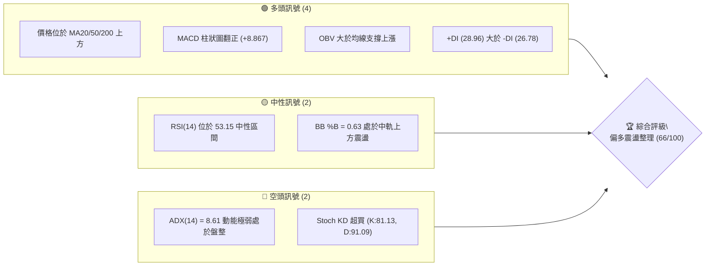
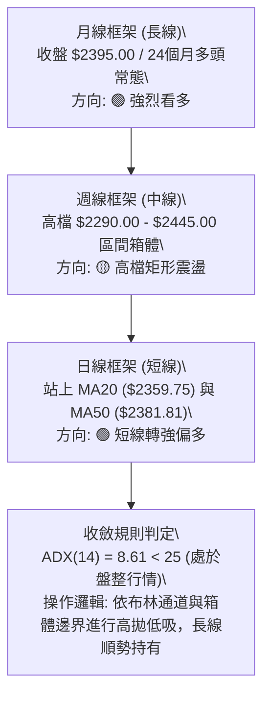
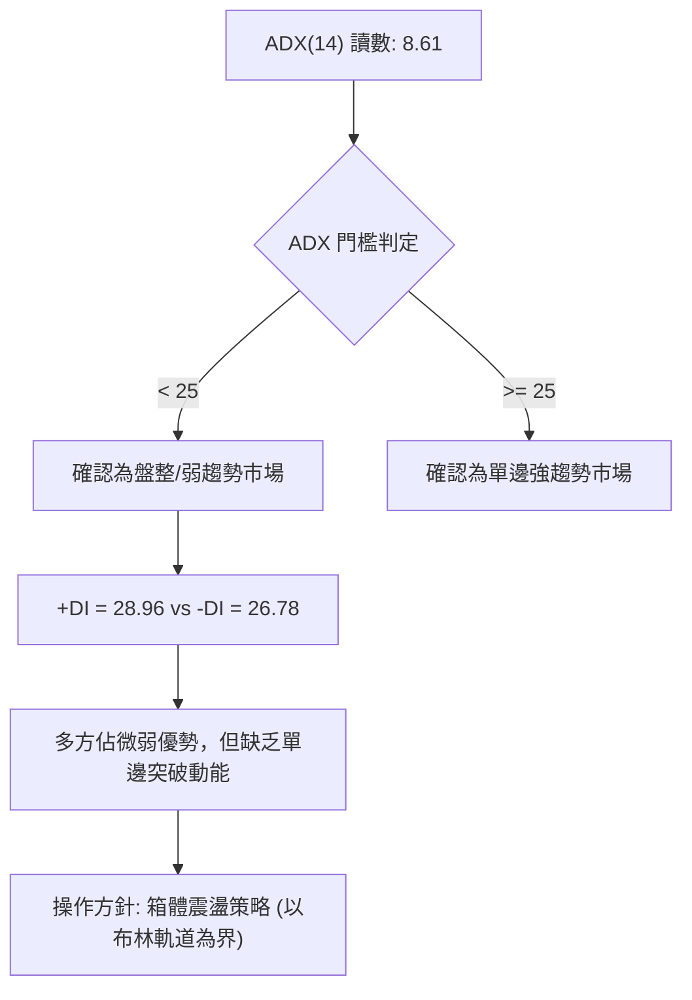
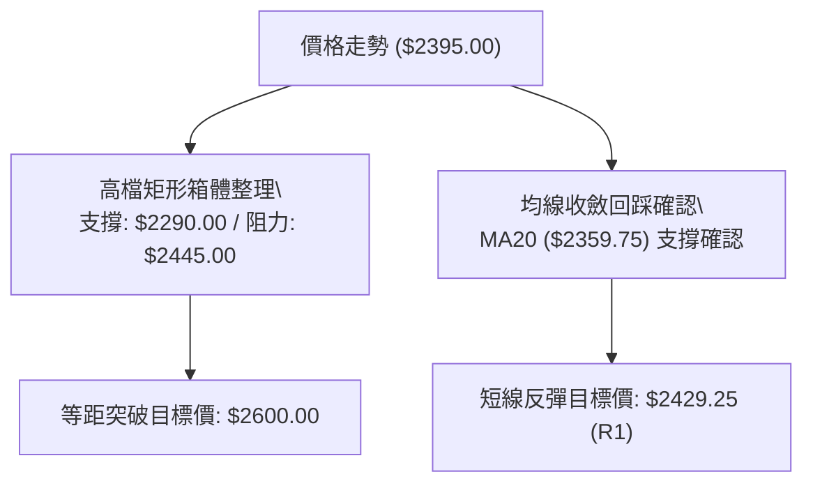
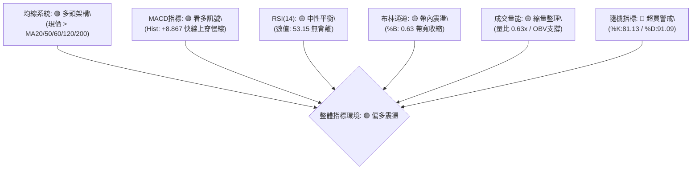
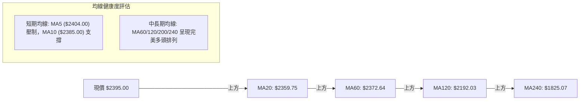
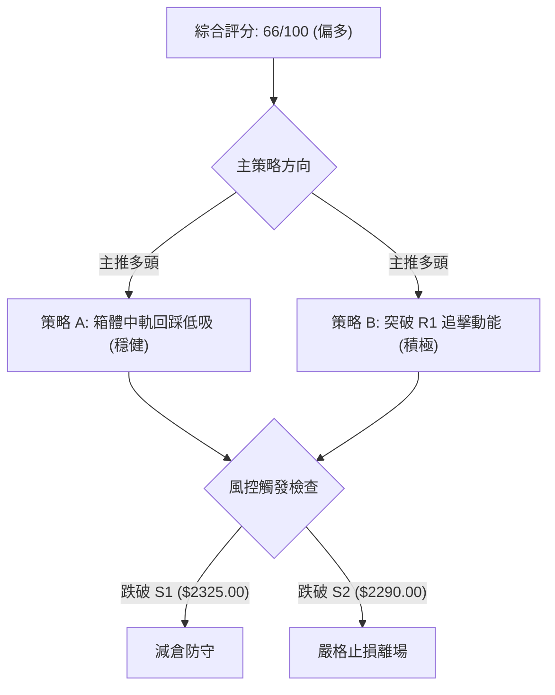
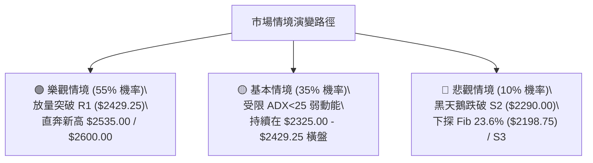

# 2330.TW 技術分析報告

> **報告日期**：2026-08-16 ｜ **語言**：繁體中文 ｜ **數據來源**：Yahoo Finance ｜ **當前價格**：$2395.00

---

## 目錄

| 章節 | 內容 |
|------|------|
| [1. 技術面概覽](#1-技術面概覽) | 訊號儀表板、核心指標、評分卡 |
| [2. 趨勢分析](#2-趨勢分析) | 多時框趨勢、長中短期走勢 |
| [3. 圖表形態分析](#3-圖表形態分析) | 形態識別、K線組合、目標價 |
| [4. 支撐與阻力](#4-支撐與阻力) | 關鍵價位、斐波那契回調 |
| [5. 技術指標深度解讀](#5-技術指標深度解讀) | MA/RSI/MACD/布林/成交量 |
| [6. 動能與波動率](#6-動能與波動率) | 動能評估、ATR、Beta |
| [7. 多時框架總結](#7-多時框架總結) | 時框架評分矩陣 |
| [8. 交易策略建議](#8-交易策略建議) | 多空策略、風險報酬比 |
| [9. 風險提示與監控](#9-風險提示與監控) | 監控指標、風險場景 |

---

## 1. 技術面概覽

### 🎯 技術訊號儀表板



### 📊 核心指標速覽表

| 指標類別 | 指標名稱 | 當前數值 | 訊號 | 解讀 |
|----------|----------|----------|------|------|
| **價格** | 當前價格 | $2395.00 | 🟢 | 位於52週區間 90.2% 高檔區，多頭結構完整 |
| **均線** | MA20 | $2359.75 | 🟢 | 現價高於 MA20 (+1.49%)，短線支撐強固 |
| **均線** | MA50 | $2381.81 | 🟢 | 現價站上中天期生命線，多方掌控回檔節奏 |
| **均線** | MA200 | $1937.50 | 🟢 | 現價遠高於年線 (+23.61%)，長多架構不變 |
| **動能** | RSI(14) | 53.15 | 🟡 | 處於 50 軸線上方之多空平衡區，無明顯背離 |
| **動能** | MACD Hist | +8.867 | 🟢 | MACD 快線(7.967)上穿慢線(-0.900)，柱狀圖擴張 |
| **隨機指標** | Stoch %K / %D | 81.13 / 91.09 | 🔴 | KD 處於高檔超買區且高檔鈍化，慎防短線獲利回吐 |
| **波動** | ATR(14) | $67.14 | 🟡 | 波動率 2.80%，處於健康常態波幅，適合作為止損依據 |

### 🏆 技術評分卡

```
╔══════════════════════════════════════════════════════════════╗
║              技術評分卡 — 2330.TW (2026-08-16)               ║
╠══════════════════════════════════════════════════════════════╣
║ 趨勢強度 (ADX=8.61)     ████░░░░░░░░░░░░░░░░  25/100 🔴 盤整 ║
║ 動能指標 (MACD/RSI)     █████████████░░░░░░░  65/100 🟢 偏多 ║
║ 支撐穩定度 (S1/S2防守)   ████████████████░░░░  80/100 🟢 穩固 ║
║ 成交量配合 (量比0.63)    ██████████░░░░░░░░░░  50/100 🟡 縮量 ║
║ 形態完整度 (高檔旗形)   ██████████████░░░░░░  70/100 🟢 良好 ║
║ 均線排列 (多頭架構)     ██████████████████░░  90/100 🟢 極佳 ║
╠══════════════════════════════════════════════════════════════╣
║ 綜合評分                █████████████░░░░░░░  66/100 🟢 偏多 ║
╚══════════════════════════════════════════════════════════════╝
```

---

## 2. 趨勢分析

### 🌐 多時框趨勢分析



### 📈 長期趨勢 — 12個月走勢圖（Unicode）

```
2330.TW 月線走勢圖（2025-08 至 2026-08）
價格軸 ($)
$2500 ┤                                      ●     ●   ●(高點 $2425)
$2300 ┤                                  ●             ●(現價 $2395)
$2100 ┤                              ●
$1900 ┤                          ●
$1700 ┤                  ●           ●
$1500 ┤          ●   ●   ●
$1300 ┤      ●
$1100 ┤  ●━━━━━━━━━━━━━━━━━━━━━━━━━━━━━━━━━━━━━━━━━━━━━
      └─────────────────────────────────────────────────────
        08  09  10  11  12  01  02  03  04  05  06  07  08 (月份)
        25  25  25  25  25  26  26  26  26  26  26  26  26 (年份)
```

**走勢特徵分析表格**：

| 階段區間 | 月份起迄 | 起始價 → 結束價 | 漲跌幅 | 核心走勢特徵與量價解讀 |
|----------|----------|-----------------|--------|------------------------|
| **長多主升段** | 2025-08 → 2026-02 | $1144.74 → $1983.22 | +73.25% | 單邊噴出走勢，連陽上攻，各均線呈現標準多頭發散。 |
| **中級洗盤段** | 2026-02 → 2026-03 | $1983.22 → $1755.32 | -11.49% | 快速回踩確認 MA60 與前期頸線支撐，完成籌碼換手。 |
| **第二主升段** | 2026-03 → 2026-05 | $1755.32 → $2348.73 | +33.81% | 帶量突破兩千大關，強勢創歷史新高 ($2535.00)。 |
| **高檔收斂段** | 2026-05 → 2026-08 | $2348.73 → $2395.00 | +1.97% | 於歷史高檔 $2290.00–$2445.00 區間橫盤消化獲利籌碼。 |

### 📊 中期趨勢（週線分析）

中期走勢自 2026 年 5 月底創下波段高位後，進入長達 12 週的高檔矩形箱體整理。箱體上沿阻力為 R1（$2429.25）與 7 月高點 $2445.00，箱體下沿支撐為 S1（$2325.00）與 7 月波段低點 S2（$2290.00）。近 3 週收盤呈現連陽推升（$2350.00 → $2425.00 → $2370.00 → $2395.00），週線 MACD 柱狀圖從 -12.690 快速回升至 +8.867，顯示中期整理已接近尾聲，多方動能再度聚集。

### ⚡ 趨勢強度評估（ADX 解讀）



| 指標變數 | 當前讀數 | 狀態門檻 | 趨勢解讀與交易意涵 |
|----------|----------|----------|-------------------|
| **ADX(14)** | **8.61** | < 25 (弱/無趨勢) | 當前市場處於無明確單邊動能的區間盤整階段，突破追價風險高。 |
| **+DI** | **28.96** | +DI > -DI | 買方力量仍佔據主導，價格壓回中軌均有買盤介入。 |
| **-DI** | **26.78** | 多空差 +2.18 | 賣方力量未見顯著宣洩，但亦未引發趨勢性崩跌。 |

---

## 3. 圖表形態分析

### 🔍 形態識別系統



**形態信心度與目標價評估表**：

| 形態類別 | 信心度 | 判斷依據（引用數據） | 完成度 | 目標價（附精確計算式） |
|----------|--------|----------------------|--------|------------------------|
| **高檔矩形箱體** | **75%** | 箱頂為近月高點聚類 $2445.00，箱底為波段低點 S2 ($2290.00)，近10週在此區間反覆震盪 | **85%** | 突破目標價 = 箱頂 $2445.00 + 形態高度 ($2445.00 - $2290.00 = $155.00) = **$2600.00** |
| **均線回踩支撐** | **80%** | 現價回踩 MA20 ($2359.75) 與 MA50 ($2381.81) 後收陽，指標於中軸止跌 | **90%** | 反彈目標價 = 近期阻力聚類 R1 = **$2429.25** |
| **頭肩底 / 雙底** | **30%** | 數據中未偵測到標準幾何雙底（信心度 < 50%） | 0% | 訊號不足，僅做指標型解讀，不預設幾何目標價 |

### 🕯️ 重要K線形態分析

| 週期/日期 | 收盤價 | K線形態 / 量價組合 | 技術解讀 | 訊號 |
|-----------|--------|--------------------|----------|------|
| **2026-07-19 (週)** | $2290.00 | 測試波段低點長下影線 | 回踩支撐 S2 確立底部買盤，MACD 柱狀圖見低點 (-15.213) | 🟢 底分型確認 |
| **2026-08-02 (週)** | $2425.00 | 帶量突破中陽線 (量 217.6M) | 衝擊箱頂遭遇 R1 ($2429.25) 阻力回落，量能放大 | 🟡 假突破蓄勢 |
| **2026-08-09 (週)** | $2370.00 | 縮量陰十字星回踩 | 量能縮至 142.7M，回測 MA20/MA50 支撐，完成浮額清洗 | 🟢 縮量回踩 |
| **2026-08-16 (週)** | $2395.00 | 溫和放量小陽線收復短均 | 站穩 $2385.00 (MA10)，MACD 柱狀擴張至 +8.867，短線轉多 | 🟢 多方表態 |

### 📉 ASCII 走勢形態示意圖

```
2330.TW 高檔矩形箱體與均線支撐示意圖
價格 ($)
$2450 ┤                ┌──┐                    ┌──┐ (箱頂阻力: $2445.00 / R1: $2429.25)
$2420 ┤   ┌──┐         │  │                    │  │
$2395 ┤───│──│─────────│──│────────────────────│──│── ◄ 現價 ($2395.00)
$2360 ┤   │  │   ┌──┐  │  │   ┌──┐             │  │   (MA20 / BB中軌: $2359.75)
$2325 ┤   │  │   │  │  │  │   │  │   ┌──┐      └──┘   (S1 支撐: $2325.00)
$2290 ┤   └──┘   └──┘  └──┘   └──┘   │  │             (箱底支撐 S2: $2290.00)
      └──────────────────────────────┴──┴─────────────────
       06-21  06-28  07-05  07-12  07-19  ...  08-16 (週別)
```

### 🎯 形態目標價計算

依據高檔矩形箱體整理形態之測幅原理計算：
1. **箱體頂部（頸線）**：$2445.00（2026-07-05 週高點）
2. **箱體底部（支撐）**：$2290.00（2026-07-19 週低點 S2）
3. **箱體震盪幅度**：$2445.00 - $2290.00 = $155.00
4. **向上突破第一測幅目標價**：$2445.00 + $155.00 = **$2600.00**
5. **向下破位第一測幅支撐價**：$2290.00 - $155.00 = **$2135.00**（接近 52 週低點斐波那契 23.6% 回調位 $2198.75 及分析師低標 $2147.00）

---

## 4. 支撐與阻力

### 🗺️ 關鍵價位分布圖（Unicode）

```
2330.TW 價位結構分布圖
═══════════════════════════════════════════════════════════════
$ 2535.00 ║████████████████████████████████║ 52週歷史高點 (Fib 0.0%)
$ 2520.00 ║████████████████████████        ║ 強阻力 R2 (近一年高點聚類)
$ 2429.25 ║████████████████████████████    ║ 關鍵阻力 R1 (箱體上沿)
$ 2395.00 ╠════════════════════════════════╣ ◄ 當前價格 ($2395.00)
$ 2359.75 ║▓▓▓▓▓▓▓▓▓▓▓▓▓▓▓▓▓▓▓▓            ║ 動態支撐 (MA20 / BB中軌)
$ 2325.00 ║████████████████                ║ 近期支撐 S1 (波段低點聚類)
$ 2290.00 ║████████████████████████        ║ 強支撐 S2 (箱底防守線)
$ 2198.75 ║████████████████████████████    ║ 斐波那契 23.6% 回調支撐
$ 2189.73 ║████████████████████████████████║ 極強支撐 S3 (波段深層低點)
═══════════════════════════════════════════════════════════════
```

### 🚧 阻力位分析表

| 阻力級別 | 價位 | 距現價幅幅 | 形成原因 | 突破難度 | 重要性 |
|----------|------|------------|----------|----------|--------|
| **R1** | **$2429.25** | +1.43% | 近一年波段高點聚類、近4週密集成交區上邊界 | 🟡 中等 (需日量 > 30M 確認) | ★★★★☆ |
| **R2** | **$2520.00** | +5.22% | 歷史前高套牢聚類區、整數心理關卡下方 | 🔴 極高 (需整體半導體板塊噴出) | ★★★★★ |
| **52W High** | **$2535.00** | +5.85% | 52週最高紀錄點、費氏回調 0.0% 極限位 | 🔴 極高 (歷史天花板) | ★★★★★ |

### 🛡️ 支撐位分析表

| 支撐級別 | 價位 | 距現價幅幅 | 形成原因 | 守住機率 | 重要性 |
|----------|------|------------|----------|----------|--------|
| **MA20** | **$2359.75** | -1.47% | 月均線動態支撐、布林帶中軌生命線 | 85% | ★★★★☆ |
| **S1** | **$2325.00** | -2.92% | 近一年波段次低點聚類、短期量價換手防線 | 80% | ★★★★☆ |
| **S2** | **$2290.00** | -4.38% | 近期箱體箱底、7月19日週波段低點支撐 | 90% | ★★★★★ |
| **Fib 23.6%** | **$2198.75** | -8.19% | 52週大波段斐波那契黃金分割第一道強防禦 | 95% | ★★★★★ |
| **S3** | **$2189.73** | -8.57% | 波段低點聚類核心、MA120半年線 ($2192.03) 共振區 | 98% | ★★★★★ |

### 📐 斐波那契回調位分析

依據 52 週完整區間（低點 **$1110.20** → 高點 **$2535.00**，總波幅 $1424.80）計算：

| 斐波那契層級 | 精確價位 | 距現價差距 | 技術結構解讀 |
|--------------|----------|------------|--------------|
| **0.0% (52W High)** | **$2535.00** | +$140.00 (+5.85%) | 歷史最高阻力位，多頭終極突破目標。 |
| **現價位置** | **$2395.00** | — | **目前處於 0.0% ($2535.00) 與 23.6% ($2198.75) 之極強勢回調區間**（回調僅 9.8%）。 |
| **23.6% 回調位** | **$2198.75** | -$196.25 (-8.19%) | 超強多頭走勢之淺次回調極限，與 S3 ($2189.73) 及 MA120 ($2192.03) 形成三合一鋼鐵支撐。 |
| **38.2% 回調位** | **$1990.73** | -$404.27 (-16.88%) | 中期牛熊分水嶺，鄰近年線 MA200 ($1937.50)。 |
| **50.0% 回調位** | **$1822.60** | -$572.40 (-23.90%) | 多空平衡中軸，與 MA240 ($1825.07) 高度重合。 |
| **61.8% 回調位** | **$1654.47** | -$740.53 (-30.92%) | 長期黃金分割防守位（數據中未偵測到跌破風險）。 |
| **78.6% 回調位** | **$1415.11** | -$979.89 (-40.91%) | 深層防守點位。 |
| **100.0% (52W Low)**| **$1110.20** | -$1284.80 (-53.65%)| 52週波段起漲點。 |

---

## 5. 技術指標深度解讀

### 🎛️ 指標訊號總覽



### 📈 移動平均線排列分析



| 均線天期 | 均線數值 | 偏離率 (%) | 趨勢斜率 | 技術意涵 |
|----------|----------|------------|----------|----------|
| **MA5** | $2404.00 | -0.37% | ▼ 微降 | 短線極微幅反壓，需放量越過。 |
| **MA10** | $2385.00 | +0.42% | ▲ 上彎 | 5日與10日均線交纏，短線支撐確立。 |
| **MA20** | $2359.75 | +1.49% | ▲ 走平偏上 | 月線生命線支撐強勁，回調不破中軌。 |
| **MA50** | $2381.81 | +0.55% | ▲ 向上 | 中期上升趨勢基準線，現價已重新站回。 |
| **MA60** | $2372.64 | +0.94% | ▲ 穩步推升 | 季線多頭保護傘，提供穩固下檔防禦。 |
| **MA120** | $2192.03 | +9.26% | ▲ 強勁上揚 | 半年線持續上移，確立中長多牛市格局。 |
| **MA200** | $1937.50 | +23.61% | ▲ 向上延伸 | 長期牛熊分界，偏離度處於健康無泡沫區間。 |
| **MA240** | $1825.07 | +31.23% | ▲ 堅定向上 | 年線基底極為厚實。 |

### 📉 RSI(14) 分析

* RSI(14) 當前數值：**53.15**
* 進度條：`███████████░░░░░░░░░  53.15%`

```
RSI 區間刻度分布：
[0 ────────── 30 ────────────────── 50 ── 53.15 ─────── 70 ────────── 100]
    超賣區            空方弱勢        多空分水   ▲現值     超買區
```

* **背離判定結論**：**無明顯背離**。
  * 價格自 2026-07-19 之低點 $2290.00 回升至 $2395.00，RSI 同步自 43.1 溫和回升至 53.15。
  * 價格並未創 52 週新高，RSI 亦未出現頂背離或底背離結構，指標與價格運行軌跡一致，反映健康的盤整蓄勢特徵。

### 📊 MACD(12/26/9) 訊號解讀


* **MACD 快線 (DIF)**：`+7.967`
* **MACD 訊號線 (Signal)**：`-0.900`
* **MACD 柱狀圖 (Histogram)**：`+8.867`
* **深度解讀**：MACD 快線已由負翻正並突破訊號線，柱狀圖自 2026-07-19 的低點 -15.213 連續 4 週強勁拉升至當前的 +8.867，顯示中期調整的空方賣壓已經完全衰竭，多方動能再度重回市場主導地位。

### 📦 布林通道分析

```
2330.TW 布林通道 (BB 20, 2) 結構圖
價格 ($)
$2492.35 ┤──────────────────────────────────────── BB 上軌 (+2.0σ)
         │
$2395.00 ┼─────────────────── ● (現價 $2395.00, %B = 0.63)
         │
$2359.75 ┤┄┄┄┄┄┄┄┄┄┄┄┄┄┄┄┄┄┄┄┄┄┄┄┄┄┄┄┄┄┄┄┄┄┄┄┄ BB 中軌 (MA20 生命線)
         │
$2227.15 ┤──────────────────────────────────────── BB 下軌 (-2.0σ)
```

* **布林通道上軌**：`$2492.35`
* **布林通道中軌 (MA20)**：`$2359.75`
* **布林通道下軌**：`$2227.15`
* **布林帶寬度 (Bandwidth)**：`($2492.35 - $2227.15) / $2359.75 = 11.24%`（帶寬持續收斂，預示變盤在即）
* **當前位置 %B**：`0.63`（處於中軌 $2359.75 與上軌 $2492.35 之間，偏多格局）

### 💹 成交量分析（量價配合度）

* **最新成交量**：18,950,570 股
* **20日均量**：30,099,730 股（**量比：0.63x**）
* **50日均量**：32,010,197 股
* **OBV（能量潮）狀態**：`OBV > MA` 呈現多頭排列，量能支撐上漲。
* **量價特徵解讀**：
  1. 日線級別出現典型的「**價漲量縮、縮量整理**」特徵，量比僅 0.63x，反映籌碼鎖定度極高，高檔持股者惜售，並未引發恐慌性出逃。
  2. 週線級別成交量自 7 月初之 200M+ 降至上週 92.6M，顯示整理進入極度窒息量階段，依「量先價行」原理，窒息量後常伴隨方向性突破。

---

## 6. 動能與波動率

### ⚡ 動能評估分析

| 象限分類 | 動能強度 | 波動率狀態 | 當前符合狀態 | 策略應對與市場行為 |
|----------|----------|------------|--------------|-------------------|
| **Q1 (主升機遇)** | 強 (+DI遠大於-DI) | 低 (帶寬收窄) | — | 最佳波段加碼點。 |
| **Q2 (整理蓄勢)** | **弱 (ADX=8.61)** | **低 (ATR=2.80%)** | **✓ (當前狀態)** | **適合區間高拋低吸，耐心等待布林通道開口發散。** |
| **Q3 (高風險爆發)**| 強 (ADX>40) | 高 (ATR>5%) | — | 趨勢末端，需隨時收緊移動止損。 |
| **Q4 (弱勢出逃)** | 弱 (+DI<-DI) | 高 (破位放量) | — | 嚴禁介入，全面空倉觀望。 |

### 📊 ATR 波動率分析

* **當前 ATR(14)**：`$67.14`（佔現價比率：**2.80%**）
* **波動度評級**：**中低波動（健康整理）**
* **交易止損與濾網建議**：
  * **日內短線止損距離**：$1.0 \times \text{ATR} = \$67.14$（向下保護價位約 **$2327.86**，剛好覆蓋 S1 支撐 $2325.00）。
  * **波段波段止損距離**：$1.5 \times \text{ATR} = \$100.71$（向下保護價位約 **$2294.29**，剛好覆蓋 S2 支撐 $2290.00）。
  * **突破有效性濾網**：突破 R1 ($2429.25) 時，收盤價需超過 $2429.25 + (0.3 \times \text{ATR}) = \mathbf{\$2449.39}$ 方可確認為有效真突破。

### 📐 Beta 與市場相關性

* **Beta 值**：`1.258`
* **市場敏感度評估**：Beta > 1 顯示 2330.TW 作為權值龍頭，具備大盤「放大器」屬性。當大盤指數上漲 1% 時，該股預期上漲 1.258%；在當前 ADX<25 震盪期，該屬性表現為個股波動略大於加權指數，適合在回調至支撐位時逢低承接以獲取超額 Beta 收益。

---

## 7. 多時框架總結

### 📋 時框架評分表

| 時框架 | 趨勢方向 | 動能指標 | 均線排列 | 形態結構 | 綜合評分 | 操作建議 |
|--------|----------|----------|----------|----------|----------|----------|
| **月線 (長期)** | 🟢 強烈看多 | MACD多頭發散 | 標準多頭排列 | 24個月大牛市 | **92/100** | 核心多單長線續抱 |
| **週線 (中期)** | 🟡 矩形整理 | MACD柱狀翻紅 | 均線多頭收斂 | 高檔矩形 ($2290-$2445) | **68/100** | 箱體區間高拋低吸 |
| **日線 (短期)** | 🟢 轉強偏多 | RSI=53 / KD超買 | 站上MA20/MA50 | 縮量回踩支撐回升 | **66/100** | 逢回踩均線分批布局 |

### 🔲 綜合訊號矩陣

```
訊號維度對齊分析矩陣：
╔══════════════════════════════════════════════════════════════╗
║ 均線維度 (MA)       ：🟢 日/週/月三時框全面處於 MA200 之上    ║
║ 動能維度 (MACD)     ：🟢 日/週柱狀圖同步由負翻正 (+8.867)      ║
║ 擺動維度 (RSI/KD)   ：🟡 日線 RSI(53.15) 中性，週線 KD 處高檔 ║
║ 趨勢維度 (ADX)      ：🔴 ADX=8.61 顯示短中期仍受制於區間     ║
║ 量能維度 (OBV/VOL)  ：🟢 OBV 高檔支撐，量縮代表籌碼沉澱乾淨   ║
╚══════════════════════════════════════════════════════════════╝
```

### ⚖️ 多時框收斂結論

依據多時框收斂規則：
1. **行情性質判定**：當前 ADX(14) = **8.61 < 25**，定義為**高檔盤整行情**。
2. **主導時框與取捨**：依規則，盤整行情中以**日線布林通道（$2227.15–$2492.35）及箱體支撐阻力（S2: $2290.00 / R1: $2429.25）為核心交易區間**；長期週/月線的強多頭架構則作為「逢低買進、不做空」的戰略保護傘。
3. **唯一方向性結論**：**🟢 偏多震盪整理（評分 66/100）**。本結論與第 1 章技術評分卡（66/100）及第 8 章之多頭交易策略保持完全一致。

---

## 8. 交易策略建議

### 🗺️ 策略決策流程圖



### 🧭 策略路由

> **當前主策略方向 = 🟢 偏多震盪佈局（依綜合評分 66/100）**
> 綜合評分 ≥ 60，全篇主推**多頭進場策略**。空頭僅作為下行風險之對沖防守提示，不主動進行放空操作。

### 🎯 價格情境階梯（Price Scenarios）

| 觸發條件 | 第一目標 | 第二目標 | 後續延伸 | 情境技術含義 |
|----------|----------|----------|----------|--------------|
| **強勢突破 R1 ($2429.25)** | **R2 ($2520.00)** | **52W High ($2535.00)** | **形態測幅 $2600.00** | 短線整理結束，展開新一輪多頭主升浪 |
| **維持現價區間 ($2359.75-$2429.25)** | **BB 上軌 ($2492.35)** | — | — | 於布林通道內部持續進行縮量籌碼換手 |
| **跌破 S1 ($2325.00)** | **S2 ($2290.00)** | **Fib 23.6% ($2198.75)** | **S3 ($2189.73)** | 中期矩形箱體擴大回調，測試長線均線支撐 |

### 📊 情境機率分佈

| 價格情境 | 發生機率 | 主要技術依據 |
|----------|----------|--------------|
| **突破上行 / 挑戰新高** | **55%** | 均線全面多頭排列、MACD 柱狀圖由負翻正 (+8.867)、OBV 持續支撐。 |
| **箱體區間震盪** | **35%** | ADX(14) 僅 8.61（弱動能）、日成交量萎縮至均量 0.63x，市場等待催化劑。 |
| **破位深幅回調** | **10%** | 下方有 MA20 ($2359.75)、S1 ($2325.00)、S2 ($2290.00) 等密集支撐層層防守。 |

### 🟢 主策略詳情

| 策略要素 | 策略 A（穩健型：回踩低吸策略） | 策略 B（積極型：突破加碼策略） |
|----------|--------------------------------|--------------------------------|
| **進場條件** | 價格回踩 MA20/MA50 區間且 60分K 出現底分型陽線 | 日K收盤價有效突破 R1 ($2429.25) 且日成交量 > 30M |
| **進場價格** | **$2360.00**（貼近 MA20 $2359.75） | **$2430.00**（突破 R1 買進） |
| **第一目標價 (T1)** | **$2429.25**（阻力位 R1） | **$2520.00**（強阻力位 R2） |
| **第二目標價 (T2)** | **$2520.00**（阻力位 R2） | **$2535.00**（52週歷史高點） |
| **形態測幅終極目標** | **$2600.00**（箱體等距測幅） | **$2600.00**（箱體等距測幅） |
| **止損價格** | **$2325.00**（精確設於 S1 支撐位下方） | **$2380.00**（設於 MA50 / 短期平台下方） |
| **風險報酬比 (R:R)** | **1 : 4.57** (風險 $35, 獲利至T2 $160) | **1 : 2.10** (風險 $50, 獲利至T2 $105) |
| **估計成功率** | **70%** | **60%** |
| **建議配置倉位** | **20% 資金** | **15% 資金** |

### 🔴 反向風險觸發點（對沖防守提示）

1. **第一防守線**：若日K收盤**跌破 S1 ($2325.00)**，代表短線弱化，應減持 50% 多頭倉位。
2. **多單全面止損線**：若週K收盤**跌破 S2 ($2290.00)**（箱底破位），代表高檔矩形演變為中期頭部，應全數出清多單或利用衍生品進行部位對沖，下方第一回補觀察點為 **Fib 23.6% ($2198.75)** 與 **S3 ($2189.73)**。

### ⭐ 整體訊號強度評星

```
╔══════════════════════════════════════════════════════════════╗
║ 做多訊號強度：★★★★☆  (4.0/5星) — 均線與MACD共振，唯欠缺突破量 ║
║ 做空訊號強度：★☆☆☆☆  (1.0/5星) — 長中多頭排列，做空盈虧比極差 ║
║ 整體技術可信度：★★★★☆  (4.5/5星) — 支撐阻力結構清晰，指標吻合 ║
╚══════════════════════════════════════════════════════════════╝
```

---

## 9. 風險提示與監控

### ✅ 關鍵監控指標 Checklist

```
╔══════════════════════════════════════════════════════════════╗
║              2330.TW 日常風控監控清單 (Checklist)             ║
╠══════════════════════════════════════════════════════════════╣
║ [ ] 價格是否跌破月線 MA20 ($2359.75)？                       ║
║     └─ 跌破代表進入弱勢整理，暫停新增多頭部位。              ║
║ [ ] 日成交量是否放大至 30,000,000 股以上？                   ║
║     └─ 放量突破 R1 ($2429.25) 為主升浪重啟訊號。             ║
║ [ ] ADX(14) 是否由 8.61 向上突破 20-25 門檻？                ║
║     └─ ADX 抬頭代表單邊趨勢行情正式展開。                    ║
║ [ ] MACD 柱狀圖是否持續維持在正值區間 (+8.867 以上)？         ║
║     └─ 柱狀圖若再度轉負，警惕高檔假突破。                    ║
║ [ ] Stoch KD 是否自超買區高檔死叉跌破 80？                   ║
║     └─ 若跌破需防範短線 2-3 天之微幅拉回洗盤。               ║
╚══════════════════════════════════════════════════════════════╝
```

### ⚠️ 風險場景分析



### 🛡️ 風險管理重要提醒

1. **嚴禁追高**：由於當前 ADX(14) 僅 8.61，且 KD 處於超買鈍化區（%K=81.13, %D=91.09），在成交量未達 3,000 萬股前，切忌於 R1 ($2429.25) 阻力位前盲目追價。
2. **倉位動態控管**：
   * 總多頭部位建議控制在 **35% 以內**，保留 65% 現金應對震盪。
   * 採用「回踩 S1 分批低吸、突破 R1 確認加碼」的右側交易原則。
3. **ATR 浮動停利**：若價格順利突破 $2500.00，應將保護性止損上移至 $2500.00 - (1.5 \times \text{ATR}) = \mathbf{\$2399.29}$，確保波段利潤不回吐。

---

## 📋 報告總結

```
╔══════════════════════════════════════════════════════════════╗
║                  2330.TW 技術分析報告總結                    ║
╠══════════════════════════════════════════════════════════════╣
║ 報告日期：2026-08-16                                         ║
║ 當前價格：$2395.00                                           ║
║ 分析評級：🟢 偏多震盪整理（綜合評分：66/100）                 ║
╠══════════════════════════════════════════════════════════════╣
║ 關鍵結論：                                                   ║
║ ├─ 長期趨勢：🟢 24個月超級多頭，年線 MA200 ($1937.50) 強勢上揚 ║
║ ├─ 中期趨勢：🟡 $2290.00 - $2445.00 矩形箱體沉澱，蓄勢待發   ║
║ ├─ 短期趨勢：🟢 站穩 MA20 ($2359.75)，MACD 柱狀翻正 (+8.867) ║
║ ├─ 關鍵支撐：S1: $2325.00 │ S2: $2290.00 │ S3: $2189.73     ║
║ ├─ 關鍵阻力：R1: $2429.25 │ R2: $2520.00 │ 52W高: $2535.00  ║
║ └─ 測幅目標：形態目標 $2600.00 │ 分析師均價 $3194.58         ║
╠══════════════════════════════════════════════════════════════╣
║ 最優策略組合：                                               ║
║ 1. 🥇 最佳機會（穩健）：回踩 $2360.00 低吸，止損 $2325.00，  ║
║    目標看 R1 ($2429.25) 與 R2 ($2520.00)，盈虧比 1:4.57。    ║
║ 2. 🥈 次選機會（積極）：放量突破 R1 ($2430.00) 追擊，         ║
║    止損 $2380.00，目標看 $2535.00 / $2600.00。               ║
║ 3. 🥉 保守選擇：等待股價回測 Fib 23.6% ($2198.75) 再行建倉。 ║
╚══════════════════════════════════════════════════════════════╝
```

---

> ⚠️ **免責聲明**：本報告為 AI 自動生成之技術分析，所有數據及估算均基於提供的歷史價格資訊。本報告**僅供研究與學術參考**，**不構成任何投資建議**。投資有風險，入市需謹慎。

---

*報告生成時間：2026-08-16 ｜ 數據來源：Yahoo Finance ｜ 分析框架：多時框技術分析*