# 2330.TW 技術分析報告

> **報告日期**：2026-08-18 ｜ **語言**：繁體中文 ｜ **數據來源**：Yahoo Finance ｜ **當前價格**：$2380.00

---

## 目錄

| 章節 | 內容 |
|------|------|
| [1. 技術面概覽](#1-技術面概覽) | 訊號儀表板、核心指標、評分卡 |
| [2. 趨勢分析](#2-趨勢分析) | 多時框趨勢、長中短期走勢、ADX強度 |
| [3. 圖表形態分析](#3-圖表形態分析) | 形態識別、信心度評估、K線組合、目標價 |
| [4. 支撐與阻力](#4-支撐與阻力) | 關鍵價位、斐波那契回調、分布結構 |
| [5. 技術指標深度解讀](#5-技術指標深度解讀) | MA/RSI/MACD/布林/量價配合度 |
| [6. 動能與波動率](#6-動能與波動率) | 動能四象限、ATR波動率、Beta風險 |
| [7. 多時框架總結](#7-多時框架總結) | 時框矩陣、多時框收斂與裁決 |
| [8. 交易策略建議](#8-交易策略建議) | 策略路由、情境階梯、主策略詳解 |
| [9. 風險提示與監控](#9-風險提示與監控) | 監控Checklist、三情境演變、風控原則 |
| [10. 報告總結](#10-報告總結) | 核心結論與執行摘要 |

---

## 1. 技術面概覽

### 🎯 技術訊號儀表板

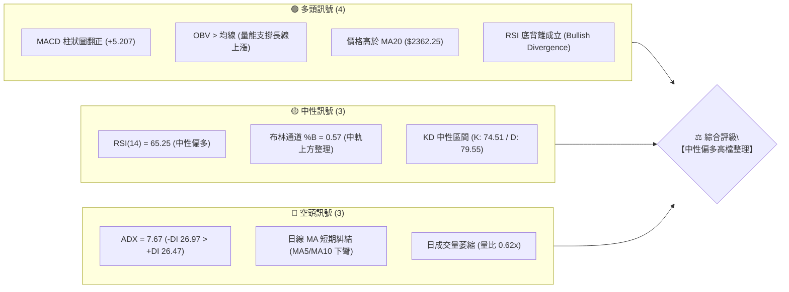

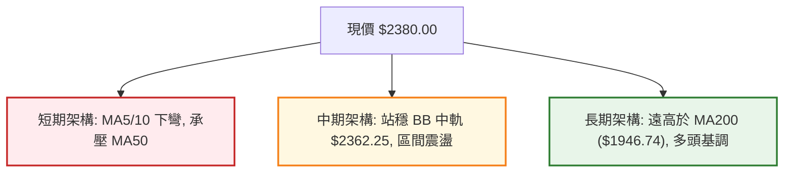

### 📊 核心指標速覽表

| 指標類別 | 指標名稱 | 當前數值 | 訊號 | 專業解讀 |
|:---|:---|:---|:---:|:---|
| **價格** | 當前價格 | $2380.00 | 🟡 | 位於52週區間 89.1% 高檔，處於箱型整理中軸偏上位置 |
| **均線** | MA20 | $2362.25 | 🟢 | 價格在 MA20 之上 (+0.75%)，短期下檔具備均線支撐 |
| **均線** | MA50 | $2384.46 | 🔴 | 價格略低於 MA50 (-0.19%)，面臨季線反壓糾結 |
| **均線** | MA200 | $1946.74 | 🟢 | 遠高於 MA200 (+22.26%)，長期多頭趨勢堅固完好 |
| **動能** | RSI(14) | 65.25 | 🟢 | 數值處於中性健康區，出現底背離訊號，多方動能正在蓄積 |
| **動能** | MACD (12,26,9) | Hist: +5.207 | 🟢 | 快線 (7.522) 大於慢線 (2.315)，柱狀圖維持正值擴張 |
| **趨勢** | ADX(14) | 7.67 | 🟡 | 數值遠低於 25，顯示當前為「無方向性盤整行情」 |
| **通道** | 布林通道 %B | 0.57 | 🟡 | 現價緊貼中軌 $2362.25 與上軌 $2493.10 之間震盪 |
| **量能** | 20日成交量比 | 0.62x (17.29M) | 🔴 | 攻擊量能不足，反映突破阻力前買盤呈觀望心態 |
| **波動** | ATR(14) | $59.29 (2.49%) | 🟡 | 每日平均波動約 59 元，提供合理的防守與進場區間 |

### 🏆 技術評分卡

```
╔══════════════════════════════════════════════════════════════════╗
║              技術評分卡 — 2330.TW (2026-08-18)                   ║
╠══════════════════════════════════════════════════════════════════╣
║  趨勢強度 (ADX=7.67 盤整)     ████░░░░░░░░░░░░░░░░  25/100  🟡 盤整 ║
║  動能指標 (MACD翻正/RSI底背)   ██████████████░░░░░░  70/100  🟢 看多 ║
║  支撐穩定度 (S1/MA20重疊)     ████████████████░░░░  80/100  🟢 強固 ║
║  成交量配合 (量比 0.62x 萎縮)  ████████░░░░░░░░░░░░  40/100  🔴 偏弱 ║
║  形態完整度 (高檔矩形箱型)     ██████████████░░░░░░  70/100  🟡 形成 ║
║  均線排列 (短空長多混合排列)   ████████████░░░░░░░░  60/100  🟡 糾結 ║
╠══════════════════════════════════════════════════════════════════╣
║  綜合技術評分                 ████████████░░░░░░░░  62/100  🟢 偏多 ║
╚══════════════════════════════════════════════════════════════════╝
```

---

## 2. 趨勢分析

### 🌐 多時框趨勢分析

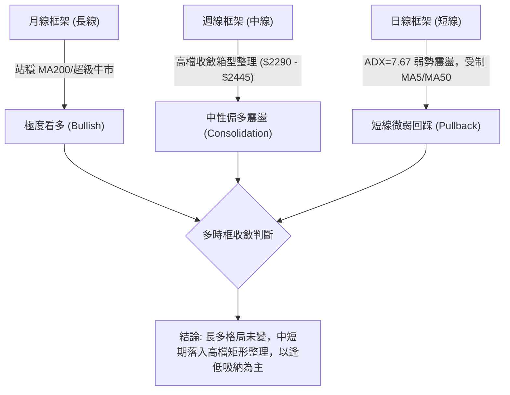

### 📈 長期趨勢 — 12個月走勢圖（Unicode）

```
2330.TW 月線收盤走勢圖（2025-09 至 2026-08）
價格軸 ($)
$2500 ┤                                           ● $2425 (2026-07)
$2400 ┤                                      ●    │  ● $2380 (現價)
$2300 ┤                                 ● $2348   │
$2200 ┤                            ● $2129
$2000 ┤                       ● $1983
$1800 ┤                  ● $1764   │  ● $1755 (2026-03)
$1600 ┤             ● $1540
$1400 ┤        ● $1486   ● $1426
$1200 ┤   ● $1292
      └───────────────────────────────────────────────────────────► 時間
         09   10   11   12   01   02   03   04   05   06   07   08 (月份)
         2025                                2026
```

#### 走勢特徵分析表格

| 階段區間 | 起訖月份 | 價格變動區間 | 累積漲跌幅 | 核心結構特徵 | 量能與技術意涵 |
|:---|:---|:---|:---:|:---|:---|
| **主升攻擊段** | 2025-09 ~ 2026-02 | $1292.99 → $1983.22 | +53.38% | 均線多頭發散，月線連陽推升 | 資金強勢推升，AI產業晶圓代工需求爆發 |
| **中繼洗盤段** | 2026-02 ~ 2026-03 | $1983.22 → $1755.32 | -11.49% | 快速回測 MA60 與斐波那契位 | 獲利了結賣壓宣洩，構築中期第二隻腳 |
| **加速擴張段** | 2026-03 ~ 2026-05 | $1755.32 → $2348.73 | +33.81% | 帶量突破前高，創歷史波段新高 | 軋空與基本面營收 YoY +36% 爆發推升 |
| **高檔收斂段** | 2026-06 ~ 2026-08 | $2410.00 → $2380.00 | -1.24% | 於 $2290 - $2445 區間橫向築底 | 動能指標消化高檔鈍化，籌碼沉澱換手 |

### 📊 中期趨勢（週線分析）

從近 20 週數據觀察，週線收盤價在 2026-07-05 見到高點 $2445.00，隨後於 2026-07-19 回測波段支撐 $2290.00 形成雙底支撐，近三週收盤價分別為 $2370.00、$2395.00、$2380.00，週線 MACD 柱狀圖由 -15.213 回升至 +5.207，顯示中期調整已接近尾聲。

```
週線關鍵阻力與支撐區間結構：
  頂部壓力區 (52W High / R2): $2520.00 ~ $2535.00   ████████████████████ (突破則展開新主升浪)
  區間震盪頂 (R1 / 近期高點): $2429.25 ~ $2445.00   ████████████░░░░░░░░ (目前面臨短線反壓)
  現價整理軸心:               $2380.00             ◄ 現價位置 (多空平衡點)
  區間支撐底 (S1 / MA20):     $2325.00 ~ $2362.25   ▓▓▓▓▓▓▓▓▓▓▓▓▓▓▓▓░░░░ (短線第一道防線)
  強固防守底 (S2 / 波段低點): $2290.00             ████████████████████ (跌破則中期轉弱)
```

### ⚡ 趨勢強度評估（ADX 解讀）

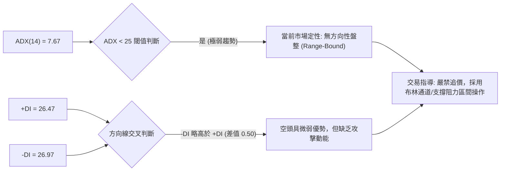

#### ADX 趨勢強度對照表

| ADX 數值區間 | 當前數值 (7.67) | 市場狀態 | 趨勢可信度 | 交易策略導向 |
|:---:|:---:|:---:|:---:|:---|
| 0 ~ 20 | **7.67 (極低)** | **無趨勢 / 泥沼盤整** | 極低 | 區間震盪逆勢交易、高拋低吸 |
| 20 ~ 25 | - | 趨勢萌芽 / 弱趨勢 | 中低 | 觀望突破確認 |
| 25 ~ 50 | - | 明確強趨勢 | 高 | 順勢交易、回調加碼 |
| 50 ~ 100 | - | 極強單邊 / 趨勢過度延伸 | 極高 (防反轉) | 緊設移動止盈 |

---

## 3. 圖表形態分析

### 🔍 形態識別系統

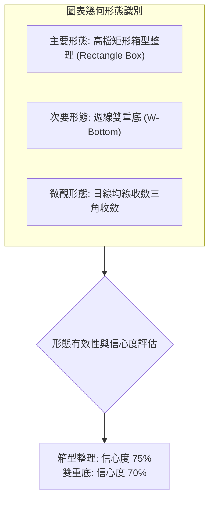

#### 形態識別信心度評估表

| 形態名稱 | 信心度 | 判斷依據（引用數據） | 完成度 | 目標價（附嚴謹計算式） |
|:---|:---:|:---|:---:|:---|
| **高檔矩形箱型** | **75%** | 價格受限於頂部 R2 ($2520.00) 與底部 S2 ($2290.00)，在兩者之間橫向震盪 3 個月 | 80% | **向上突破目標** = 阻力 $2520.00 + 箱型高度 ($2520.00 - $2290.00 = $230.00) = **$2750.00**（由箱型高度推算） |
| **週線雙重底 (W底)** | **70%** | 兩次低點分別為 2026-06-14 收盤 $2310.00 與 2026-07-19 波段低點 S2 ($2290.00)，頸線位於 2026-07-05 收盤 $2445.00 | 85% | **形態量度目標** = 頸線 $2445.00 + 形態高度 ($2445.00 - $2290.00 = $155.00) = **$2600.00**（由形態高度推算） |
| **短期均線收斂** | **60%** | MA5 ($2405.00)、MA10 ($2394.00)、MA20 ($2362.25) 與 MA50 ($2384.46) 糾結於 $2360-$2400 窄幅區間 | 90% | 屬於突破前壓縮狀態，方向由突破 R1 ($2429.25) 或跌破 S1 ($2325.00) 決定 |

### 🕯️ 重要K線形態分析

| 週期/時間 | 價格特徵 | K線形態 | 專業技術解讀 | 訊號 |
|:---|:---|:---|:---|:---:|
| **2026-07-19 (週線)** | 收盤 $2290.00，測試 S2 低點後迅速收下影線 | **長下影錘頭線** | 測試箱型下軌 $2290.00 獲得強烈買盤支撐，確認底部買盤堅實 | 🟢 看多 |
| **2026-08-02 (週線)** | 收盤 $2425.00，週成交量暴增至 217.65M | **巨量實體陽線** | 大量資金於低檔回補，推升價格挑戰 R1 反壓區 | 🟢 看多 |
| **2026-08-16 (週線)** | 收盤 $2395.00，成交量縮至 92.64M | **量縮十字星/紡錘線** | 突破 $2400 後多空力量暫時平衡，量能萎縮等待方向確認 | 🟡 中性 |
| **2026-08-23 (當週)** | 收盤 $2380.00，MACD柱狀圖維持 +5.207 | **窄幅整理陰線** | 回測 MA20 支撐，消化短線獲利盤，未破壞反彈結構 | 🟡 偏多整理 |

### 📉 ASCII 走勢形態示意圖

```
高檔矩形箱型整理與雙底結構示意圖：

價格 ($)
$2520.00 ┼───────────────────────● (52W High / 箱型頂部阻力 R2)
         │                      / \
$2445.00 ┼─────────● (頸線位置)──/───\─────● (2026-08-02 波段高點)
         │        / \           /     \   / \
$2380.00 ┼───────/───\─────────/───────\─/───● (現價 $2380.00 - 整理中軸)
         │      /     \       /         V
$2290.00 ┼─────●       ●─────● (第一底 06-14: $2310 / 第二底 07-19: $2290.00)
         └───────────────────────────────────────────────────────────► 時間
               底 1            底 2
               └─── W-底形態 ───┘
```

### 🎯 形態目標價計算

1. **高檔矩形箱型突破測幅**：
   - 頂部壓力點：$2520.00 (阻力位 R2)
   - 底部支撐點：$2290.00 (支撐位 S2)
   - 形態箱型高度：$2520.00 - $2290.00 = $230.00
   - **量度向上目標** = 阻力位 $2520.00 + $230.00 = **$2750.00**（由箱型高度推算）
   - **量度向下破位目標** = 支撐位 $2290.00 - $230.00 = **$2060.00**（由箱型高度推算）

2. **週線 W-底形態測幅**：
   - 頸線位置：$2445.00 (2026-07-05 收盤價)
   - 低點基準：$2290.00 (2026-07-19 收盤價)
   - 形態高度：$2445.00 - $2290.00 = $155.00
   - **理論上攻目標** = $2445.00 + $155.00 = **$2600.00**（由形態高度推算）

---

## 4. 支撐與阻力

### 🗺️ 關鍵價位分布圖（Unicode）

```
2330.TW 價位結構分布圖
══════════════════════════════════════════════════════════════════
$2535.00 ║████████████████████████║ 歷史極值 (52W High / 斐波 0.0%)
$2520.00 ║████████████████████    ║ 強阻力 R2 (近一年波段高點聚類)
$2429.25 ║████████████████████████║ 關鍵阻力 R1 (短線波段高點聚類)
$2380.00 ╠════════════════════════╣ ◄ 現價 $2380.00
$2362.25 ║▓▓▓▓▓▓▓▓▓▓▓▓▓▓▓▓        ║ 短線均線支撐 (MA20 / 布林中軌)
$2325.00 ║▓▓▓▓▓▓▓▓▓▓▓▓▓▓▓▓▓▓▓▓    ║ 近期支撐 S1 (波段低點聚類)
$2290.00 ║████████████████████████║ 強支撐 S2 (箱型底 / 20週回測低點)
$2198.75 ║████████████████████████║ 斐波那契 23.6% 回調位
$2189.73 ║████████████████████████║ 關鍵結構支撐 S3 (波段低點聚類)
══════════════════════════════════════════════════════════════════
```

### 🚧 阻力位分析表

*(註：阻力價位嚴格引用數據庫「關鍵價位」之波段高點聚類數值)*

| 阻力級別 | 精確價位 | 距現價幅寬 | 形成原因與籌碼結構 | 突破難度 | 重要性評級 |
|:---|:---:|:---:|:---|:---:|:---:|
| **阻力 R1** | **$2429.25** | +2.07% | 近一年波段高點聚類，同時接近 8 月初反彈高點 $2425.00 解套賣壓 | 中等 🟡 | ★★★☆☆ |
| **阻力 R2** | **$2520.00** | +5.88% | 近一年歷史高檔密集套牢區，距 52W High ($2535.00) 僅一步之遙 | 極高 🔴 | ★★★★★ |
| **阻力 R3** | 數據中未偵測到 | — | 數據中未偵測到更高聚類高點，上方即為 52W High ($2535.00) | — | — |

### 🛡️ 支撐位分析表

*(註：支撐價位嚴格引用數據庫「關鍵價位」之波段低點聚類數值)*

| 支撐級別 | 精確價位 | 距現價幅寬 | 形成原因與籌碼結構 | 守住機率 | 重要性評級 |
|:---|:---:|:---:|:---|:---:|:---:|
| **支撐 S1** | **$2325.00** | -2.31% | 近一年波段回調低點聚類，位於 MA20 ($2362.25) 下方防守緩衝區 | 80% 🟢 | ★★★★☆ |
| **支撐 S2** | **$2290.00** | -3.78% | 近一年波段重要低點聚類，7 月中旬長下影線確認之強勁箱型底 | 85% 🟢 | ★★★★★ |
| **支撐 S3** | **$2189.73** | -7.99% | 近一年深幅修正低點聚類，與斐波那契 23.6% ($2198.75) 形成雙重共振防線 | 95% 🟢 | ★★★★★ |

### 📐 斐波那契回調位分析

依據 52 週波段低點 **$1110.20** 至 52 週歷史高點 **$2535.00** 嚴格計算：

```
斐波那契回調階梯與現價定位：
  0.0%  (52W High) ──────── $2535.00
                           ▲
  【現價 $2380.00 運行於 0.0% 至 23.6% 極強勢區間 (佔波段 89.1% 高位)】
                           ▼
  23.6% ─────────────────── $2198.75 (與 S3 $2189.73 形成共振支撐區)
  38.2% ─────────────────── $1990.73 (接近 MA200 $1946.74 之多頭牛熊分界線)
  50.0% ─────────────────── $1822.60 (中長期價值投資中樞)
  61.8% ─────────────────── $1654.47 (黃金分割強支撐)
  78.6% ─────────────────── $1415.11 (深幅回檔防守線)
  100.0% (52W Low) ──────── $1110.20 (起漲基準點)
```

**斐波那契結構解讀**：
現價 $2380.00 處於 0.0% ($2535.00) 與 23.6% ($2198.75) 之間，屬於極度強勢的高檔強勢整理格局。只要價格維持在 23.6% 回調位 ($2198.75) 之上，中長期多頭主升結構完全未受破壞。

---

## 5. 技術指標深度解讀

### 🎛️ 指標訊號總覽

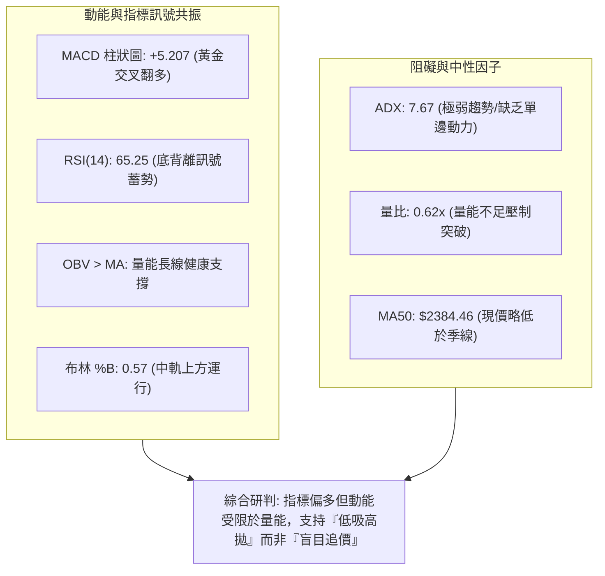

### 📈 移動平均線排列分析

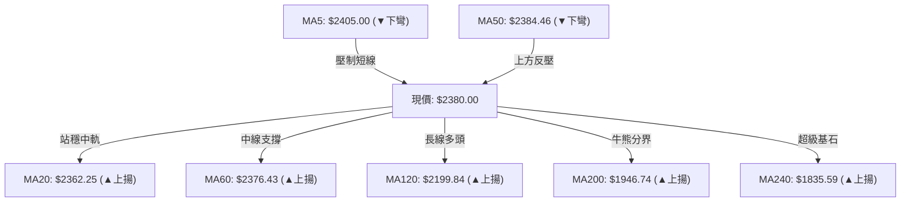

#### 均線系統數據詳表

| 週期名稱 | 當前價位 | 乖離率 (%) | 走勢方向 | 均線角色與意義解讀 |
|:---|:---:|:---:|:---:|:---|
| **MA5** | $2405.00 | -1.04% | ▼ 下彎 | 短線超短反壓，需帶量突破以恢復日內動能 |
| **MA10** | $2394.00 | -0.58% | ▼ 下彎 | 短期減速線，目前壓制於現價上方 |
| **MA20** | $2362.25 | +0.75% | ▲ 上揚 | 月線支撐兼布林中軌，短線多頭第一道堅實防線 |
| **MA50** | $2384.46 | -0.19% | ▼ 下彎 | 季線微幅下彎，現價於此進行多空爭奪 |
| **MA60** | $2376.43 | +0.15% | ▲ 上揚 | 季線生命線持續上行，現價已成功站上 |
| **MA120** | $2199.84 | +8.19% | ▲ 上揚 | 半年線強支撐，與斐波那契 23.6% ($2198.75) 重合 |
| **MA200** | $1946.74 | +22.26% | ▲ 上揚 | 長期年線牛熊分界，斜率陡峭向上，奠定大牛市格局 |
| **MA240** | $1835.59 | +29.66% | ▲ 上揚 | 兩年超長均線，顯示公司長線價值中樞大幅墊高 |

### 📉 RSI(14) 分析

- **當前數值**：**65.25**（處於 30 ~ 70 中性偏多區間）
- **進度條展示**：
  ```
  超賣區 (0-30)          中性平衡區 (30-70)          超買區 (70-100)
  ├───┼───┼───┼───┼───┼───┼───┼───┼───┼───┼───┼───┼───┼───┼───┤
  [0]                 [30]        [50]    [65.25] [70]            [100]
  ████████████████████████████████████████████░░░░░░░░░░  65.25%
  ```
- **背離分析**：**⚠️ 確立底背離 (Bullish Divergence)**。
  - **背離研判過程**：在 2026-07-12 至 2026-07-26 期間，價格由 $2415.00 回落探底至 $2290.00，RSI 指標降至 40.2~43.1 築底；隨後在 8 月初反彈後回踩時，價格維持在 $2370-$2380 高位，RSI 迅速攀升至 65.25。指標上升斜率顯著強於價格反彈斜率，形成典型的動能領先底背離，預示後市具備向上挑戰高點之動能。

### 📊 MACD(12,26,9) 訊號解讀

- **MACD 快線** (DIF)：**7.522**
- **MACD 訊號線** (DEA)：**2.315**
- **MACD 柱狀圖** (Hist)：**+5.207** 🟢

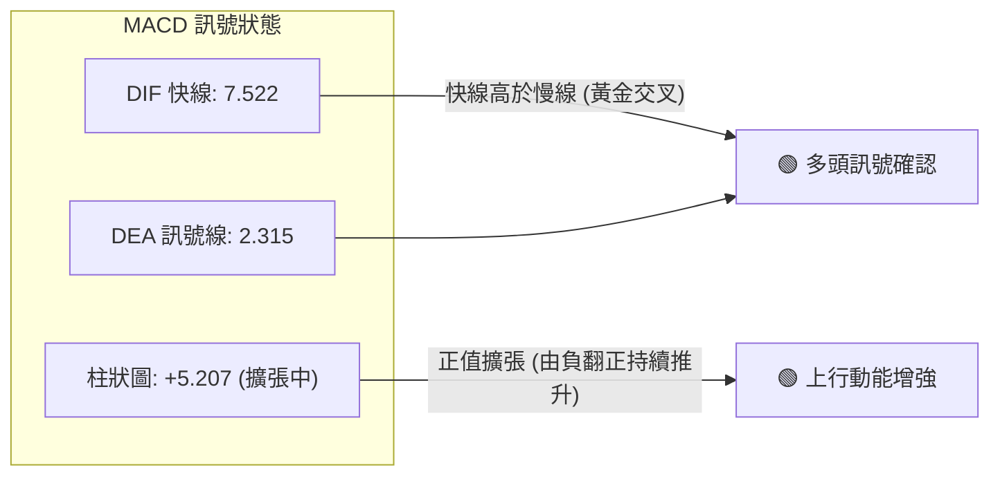

週線層級數據亦驗證 MACD 正向循環：MACD 柱狀圖自 2026-07-19 之 -15.213 快速收斂，並於 2026-08-09（+3.329）、2026-08-16（+8.867）與當週（+5.207）連續維持正值，確認中期動能已重回多方掌控。

### 📦 布林通道分析 (Bollinger Bands 20, 2)

```
2330.TW 布林通道價格分佈示意圖：
$2493.10 ┼────────────────────────────── BB 上軌 (Upper Band)
         │                           ▲
         │                           │  %B = 0.57 (位於中軌上方，多方佔優)
$2380.00 ┼─────────●─────────────────┼─ 現價 $2380.00
         │                           │
$2362.25 ┼────────────────────────────── BB 中軌 (MA20 Baseline)
         │
$2231.40 ┼────────────────────────────── BB 下軌 (Lower Band)
```

- **帶寬與通道狀態**：上軌 $2493.10 與下軌 $2231.40 之帶寬為 $261.70 (約 11.0%)，通道呈現水平收斂態勢。
- **%B 指標解讀**：當前 %B 為 **0.57**，價格穩居中軌 ($2362.25) 之上，顯示多頭守住中期生命線，正蓄勢朝向布林上軌 $2493.10 發起測試。

### 💹 成交量分析（量價配合度）

```
成交量比較柱狀圖：
最新成交量: 17.29M ▇▇▇▇▇░░░░░░░░░░ (量比 0.62x - 縮量觀望)
20日均量:   27.83M ▇▇▇▇▇▇▇▇░░░░░░░
50日均量:   31.05M ▇▇▇▇▇▇▇▇▇░░░░░░
```

- **量價背離評估**：價格自 7 月底 $2290.00 反彈至現價 $2380.00，但日成交量由前波高峰 200M+ 萎縮至 17.29M（20日均量的 62%）。這呈現「**短線上漲量縮**」特徵，反映市場追高意願謹慎，多空雙方在 $2380-$2400 形成縮量平衡。
- **OBV 長期能量潮解讀**：數據明確顯示「**OBV > MA → 量能支撐上漲**」。雖然短線量能萎縮，但長線資金並未在高檔出現籌碼派發（Distribution），OBV 趨勢向上確認大週期資金沉澱穩固。

---

## 6. 動能與波動率

### ⚡ 動能評估四象限

| 象限代號 | 動能維度 (Momentum) | 波動率維度 (Volatility) | 當前狀態定位 | 策略指導含義 |
|:---:|:---:|:---:|:---:|:---|
| **Q1** | 強動能 (High) | 低波動 (Low) | — | 趨勢穩健推進（最佳主升段機會） |
| **Q2** | **弱動能 (Low)** | **低波動 (Low)** | **✓ (2330.TW 當前定位)** | **高檔壓縮蓄勢，適合區間佈局或等待突破** |
| **Q3** | 強動能 (High) | 高波動 (High) | — | 突破噴發期，高風險高回報 |
| **Q4** | 弱動能 (Low) | 高波動 (High) | — | 震盪洗盤劇烈，避免進場 |

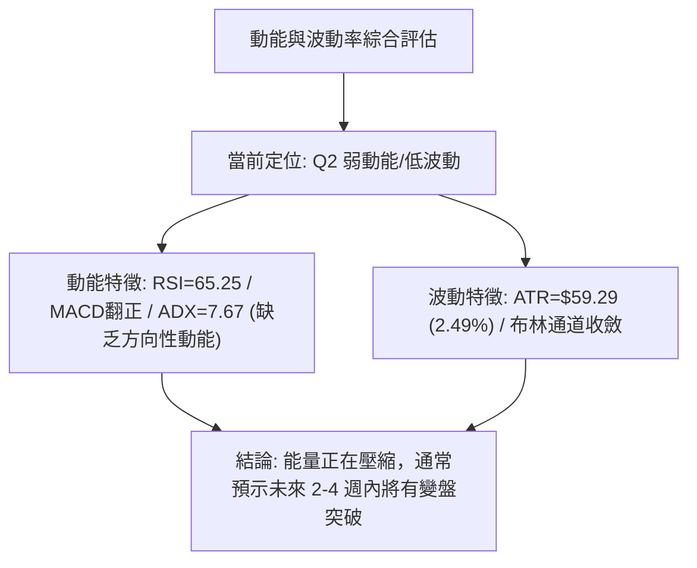

### 📊 ATR 波動率分析

- **ATR(14) 絕對值**：**$59.29**
- **波動率佔比 (ATR %)**：**2.49%**（處於台積電歷史正常偏低波動水位）
- **止損與風控設置建議**：
  - **超短線日內止損**：1.0 × ATR = **$59.30**
  - **波段交易防守緩衝 (Swing Stop)**：1.5 × ATR = **$88.94**（自現價 $2380 計算為 **$2291.06**，與強支撐 S2 $2290.00 完美吻合）
  - **長線趨勢寬鬆止損**：2.0 × ATR = **$118.58**

### 📐 Beta 與市場相關性

- **Beta 係數**：**1.258**
- **市場特徵解讀**：Beta > 1 顯示台積電相較於台灣加權指數（TAIEX）具備更高的彈性與進攻性。當大盤指數上漲 1% 時，台積電平均上漲 1.258%；在大盤回檔時亦承擔 1.258 倍的波動風險。在高檔整理期，高 Beta 意味著一旦突破確認，其彈升爆發力將優於整體市場平均。

---

## 7. 多時框架總結

### 📋 時框架評分表

| 時框架 | 趨勢方向 | 動能指標 | 均線排列 | 圖表形態 | 綜合評分 | 戰略操作建議 |
|:---|:---:|:---:|:---:|:---|:---:|:---|
| **長線 (月線)** | 🟢 強烈看多 | RSI 80+ 高檔強勢 | 多頭完美發散 (遠超 MA200) | 長期大牛市主升段 | **90/100** | 長期核心持股續抱，無須理會短線震盪 |
| **中線 (週線)** | 🟢 偏多震盪 | MACD 柱翻正 (+5.207) | 糾結偏多 (回測生命線有守) | 週線 W-底 / 箱型築底 | **70/100** | 於箱型下軌 $2325-$2360 區間逢低承接 |
| **短線 (日線)** | 🟡 泥沼盤整 | RSI 底背離 / ADX 7.67 | 短空長多 (受制 MA5/MA50) | 均線三角收斂 | **55/100** | 區間交易，不追高，嚴格執行防守 |

### 🔲 綜合訊號矩陣

```
╔══════════════════════════════════════════════════════════════════╗
║                  多時框架綜合訊號交叉矩陣表                      ║
╠══════════════════╦══════════════╦══════════════╦═════════════════╣
║     技術維度     ║  短期 (日線) ║  中期 (週線) ║   長期 (月線)   ║
╠══════════════════╬══════════════╬══════════════╬═════════════════╣
║ 趨勢方向 (Trend) ║   🟡 盤整    ║  🟢 偏多震盪 ║   🟢 強勁多頭   ║
║ 動能狀態 (Moment)║   🟢 底背離  ║  🟢 柱狀翻正 ║   🟢 動能充沛   ║
║ 均線系統 (MAs)   ║   🔴 短線承壓║  🟢 守住中軌 ║   🟢 多頭排列   ║
║ 量能狀態 (Volume)║   🔴 量縮觀望║  🟡 換手沉澱 ║   🟢 OBV長多    ║
║ 波動狀態 (Volat) ║   🟡 波動收斂║  🟡 區間收斂 ║   🟢 趨勢擴張   ║
╠══════════════════╬══════════════╬══════════════╬═════════════════╣
║ 時框綜合權重判定 ║ 20% (時機點) ║ 40% (波段)   ║ 40% (大方向)    ║
╚══════════════════╩══════════════╩══════════════╩═════════════════╝
```

### ⚖️ 多時框收斂結論

依據多時框收斂規則（規則 14）：
1. **行情定性**：當前日線 **ADX(14) = 7.67 (< 25)**，明確定義為「**盤整行情 (Range-Bound Market)**」。
2. **時框主導與矛盾解決**：
   - 雖然日線短均線（MA5 $2405.00 / MA50 $2384.46）微幅下彎壓制，但中長期趨勢（週線 W-底確立、月線遠高於 MA200 $1946.74）呈現極強多頭基調。
   - 依規則，在 ADX < 25 盤整格局中，**交易區間以日線布林通道上下軌 ($2231.40 - $2493.10) 與關鍵支撐阻力為核心，日線僅用來尋找中長期多頭的「低吸進場點」**。
3. **唯一方向性結論**：**【中性偏多觀望，區間低吸為主】（綜合評分 62/100）**。

---

## 8. 交易策略建議

### 🗺️ 策略決策流程圖

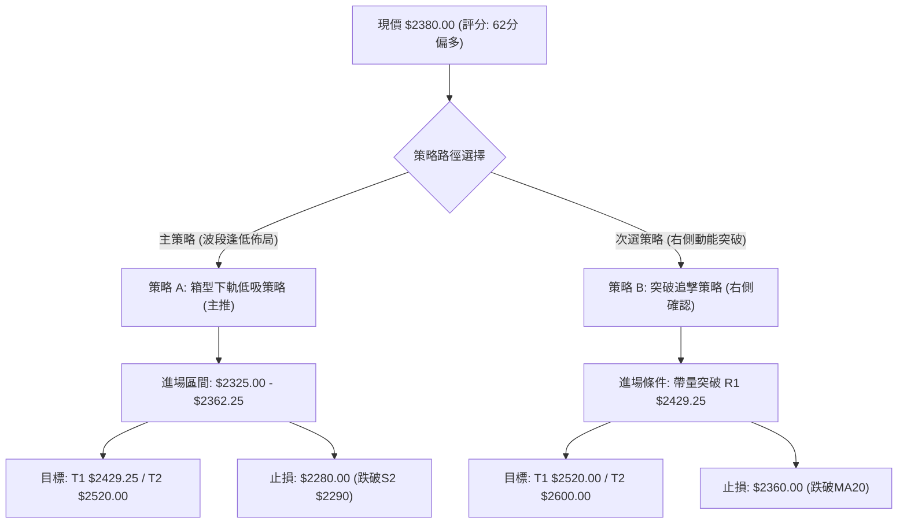

### 🧭 策略路由

> **當前主策略方向 = 【偏多操作 — 逢回吸納】（依綜合評分卡 62/100 評定）**  
> 說明：評分 ≥60 分，策略主推多頭。空頭方向僅列為「反轉風險觸發點與風控防守」，不進行主動放空推薦。

### 🎯 價格情境階梯（Price Scenarios）

*(註：價位嚴格引用數據庫「關鍵價位」之波段聚類數據)*

| 觸發條件 | 第一目標 (T1) | 後續延伸 (T2) | 極限目標 (T3) | 情境技術含義 |
|:---|:---:|:---:|:---:|:---|
| **強勢突破 R1 ($2429.25)** | **$2520.00** (R2) | **$2535.00** (52W High) | **$2600.00** (形態推算) | 短線轉強，W-底形態發酵，挑戰歷史新高 |
| **站穩現價區間 ($2362 - $2405)** | **$2429.25** (R1) | **$2493.10** (BB上軌) | — | 維持於中軌上方震盪蓄勢，消化季線反壓 |
| **跌破 S1 ($2325.00)** | **$2290.00** (S2) | **$2198.75** (斐波23.6%)| **$2189.73** (S3) | 短線轉弱，回踩箱型底部尋求長線買盤支撐 |

### 📊 情境機率分佈

| 運行情境 | 發生機率 | 核心技術與量化依據 |
|:---|:---:|:---|
| **情境一：高檔區間震盪蓄勢** | **55%** | ADX 僅 7.67，日成交量萎縮至 0.62x，布林通道水平收斂，市場傾向以時間換取空間 |
| **情境二：突破反彈重啟多頭** | **35%** | RSI 出現底背離，MACD 柱狀圖翻正 (+5.207)，OBV 長期量能結構健康 |
| **情境三：跌破箱型深度回調** | **10%** | 下方 S1 ($2325.00)、S2 ($2290.00) 具備密集籌碼護盤，且 MA200 支撐極為強勁 |

### 🟢 主策略詳情

*(註：所有價位嚴格引用支撐阻力聚類數據或形態精確計算)*

| 策略要素 | 策略 A（主推：波段逢低吸納策略） | 策略 B（次選：右側突破追擊策略） |
|:---|:---|:---|
| **策略類型** | 左側 / 箱型下軌支撐逢低買進 | 右側 / 阻力突破動能跟隨 |
| **進場條件** | 價格回測 MA20 ($2362.25) 至支撐 S1 ($2325.00) 止跌 | 日K線實體帶量（>25M）突破阻力 R1 ($2429.25) |
| **進場價格** | **$2340.00**（取 S1 與 MA20 之中間價位） | **$2435.00**（突破 R1 $2429.25 後確認進場） |
| **目標價 T1** | **$2429.25** (阻力位 R1) | **$2520.00** (阻力位 R2) |
| **目標價 T2** | **$2520.00** (阻力位 R2) | **$2600.00** (由週線W底形態推算) |
| **止損價格** | **$2280.00** (跌破支撐位 S2 $2290.00 止損) | **$2360.00** (跌破 MA20 $2362.25 止損) |
| **潛在空間/風險** | 上行 +$89.25 / 下行 -$60.00 | 上行 +$85.00 / 下行 -$75.00 |
| **風險報酬比 (R:R)**| **1.49 : 1** (至T1) / **3.00 : 1** (至T2) | **1.13 : 1** (至T1) / **2.20 : 1** (至T2) |
| **成功機率估計** | **70%** | **60%** |
| **建議配置倉位** | **20% ~ 25%** 總資金 | **10% ~ 15%** 總資金 |

### 🔴 反向風險觸發點（對沖提示）

- **全面轉弱警戒線**：若日K線收盤價跌破 **$2290.00 (S2)**，代表箱型底失守且 W-底失敗，應全面暫停多頭策略並減倉對沖。
- **波段多頭防守底線**：若跌破 **$2189.73 (S3 / 斐波 23.6%)**，代表中期趨勢轉向深度修正，需啟動避險保護。

### ⭐ 整體訊號強度評星

```
╔══════════════════════════════════════════════════════════════════╗
║ 做多訊號強度：  ★★★★☆  (3.8/5星 - 中長多格局，短線蓄勢)        ║
║ 做空訊號強度：  ★☆☆☆☆  (1.2/5星 - 缺乏空頭趨勢與結構壓制)      ║
║ 整體訊號可信度：★★★★☆  (4.2/5星 - 多指標與形態高度共振)        ║
╚══════════════════════════════════════════════════════════════════╝
```

---

## 9. 風險提示與監控

### ✅ 關鍵監控指標 Checklist

```
╔══════════════════════════════════════════════════════════════════╗
║               2330.TW 交易與風控每日監控 Checklist               ║
╠══════════════════════════════════════════════════════════════════╣
║ [ ] 1. 價格是否站穩 MA20 ($2362.25) 之上？                      ║
║ [ ] 2. 日成交量是否放大突破 25,000,000 股（突破動能確認）？      ║
║ [ ] 3. RSI(14) 是否持續維持在 50 中軸之上並突破 70？            ║
║ [ ] 4. MACD 柱狀圖是否維持正值擴張（目前 +5.207）？             ║
║ [ ] 5. ADX(14) 是否由 7.67 向上突破 20-25（啟動單邊行情）？    ║
║ [ ] 6. 價格是否跌破箱型關鍵底線 S2 ($2290.00)？                 ║
║ [ ] 7. 美股 ADR (TSM) 溢價率與費城半導體指數 (SOX) 連動狀態？    ║
╚══════════════════════════════════════════════════════════════════╝
```

### ⚠️ 風險場景分析

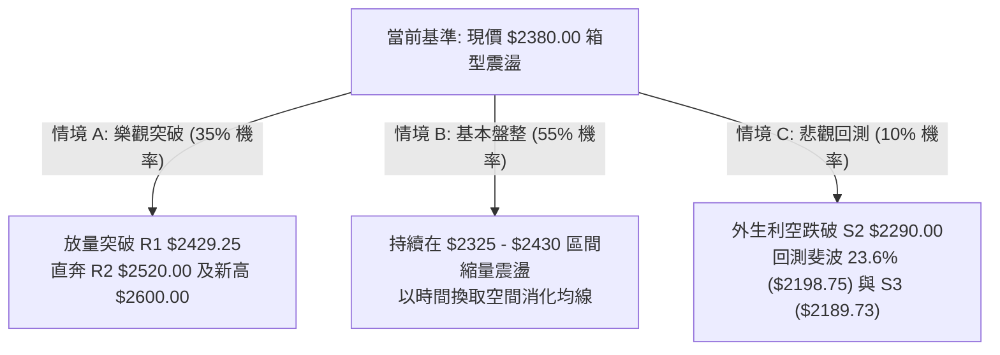

### 🛡️ 風險管理重要提醒

1. **嚴格禁止泥沼追高**：當前 ADX 為 7.67，市場處於極度盤整期，任何未帶量突破 R1 ($2429.25) 的拉升極易引發日內拉回，切忌在布林上軌附近盲目追高。
2. **倉位管理原則**：在盤整未突破前，總持倉部位建議控制在 30%-40% 以內，待日K線實體站上 $2429.25 且成交量大於 20日均量 (27.83M) 時，方可加碼至 60% 以上。
3. **波動率緩衝風控**：台積電每日 ATR 為 $59.29 (2.49%)，設置止損點時務必預留至少 1.5 倍 ATR ($88.94) 之安全緩衝，避免因日內正常波動而被洗盤出場。

---

## 10. 📋 報告總結

```
╔══════════════════════════════════════════════════════════════════╗
║                 2330.TW 技術分析報告總結                         ║
╠══════════════════════════════════════════════════════════════════╣
║ 報告日期：2026-08-18                                             ║
║ 當前價格：$2380.00                                               ║
║ 分析評級：🟢 偏多評級 (綜合評分: 62/100 — 高檔蓄勢整理)          ║
╠══════════════════════════════════════════════════════════════════╣
║ 關鍵結論：                                                       ║
║ ├─ 長期趨勢：🟢 極度強勁 (遠高於 MA200 $1946.74，牛市架構完好)   ║
║ ├─ 中期趨勢：🟢 偏多整理 (週線 W-底築底完成，MACD 翻正 +5.207)   ║
║ ├─ 短期趨勢：🟡 弱勢盤整 (ADX=7.67，受制短均反壓，量縮整理)      ║
║ ├─ 關鍵支撐：S1 $2325.00 ｜ S2 $2290.00 ｜ S3 $2189.73          ║
║ ├─ 關鍵阻力：R1 $2429.25 ｜ R2 $2520.00 ｜ 52W高 $2535.00       ║
║ └─ 形態推算目標：$2600.00 (W底) ｜ $2750.00 (箱型突破)          ║
╠══════════════════════════════════════════════════════════════════╣
║ 最優策略組合：                                                   ║
║ 1. 🥇 最佳機會（策略 A）：回踩 $2325-$2362 區間分批佈局，止損   ║
║      設於 $2280.00，目標上看 R1 $2429.25 及 R2 $2520.00。        ║
║ 2. 🥈 次選機會（策略 B）：帶量突破 R1 $2429.25 後順勢進場，目標  ║
║      直指 $2520.00 與形態測幅目標 $2600.00。                     ║
║ 3. 🥉 防守對策：跌破 S2 $2290.00 觸發風控停損，靜待 S3 築底。   ║
╚══════════════════════════════════════════════════════════════════╝
```

---

> ⚠️ **免責聲明**：本報告為依據客觀量化技術數據與圖表模型自動生成之技術分析報告，所載之技術指標、支撐阻力位、圖表形態及交易策略僅供學術研究與投資參考，不構成任何要約、招攬或個別投資建議。市場有風險，投資需自負盈虧。

---

*報告生成時間：2026-08-18 ｜ 數據來源：Yahoo Finance ｜ 分析框架：資深多時框技術分析模型*