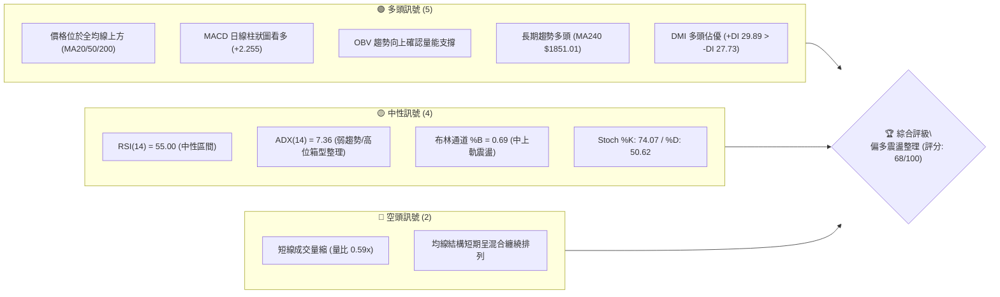
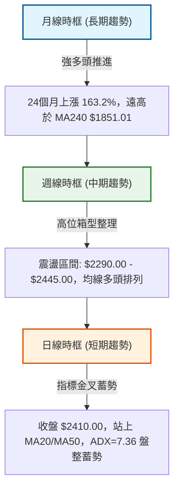
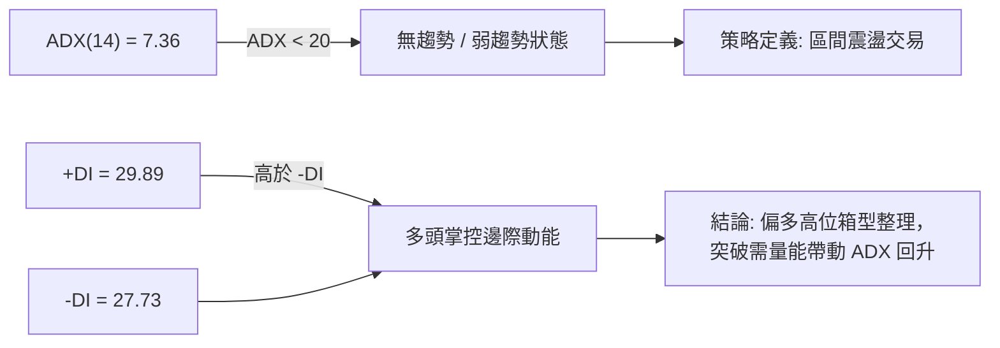
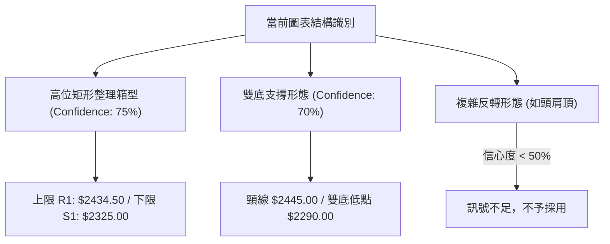
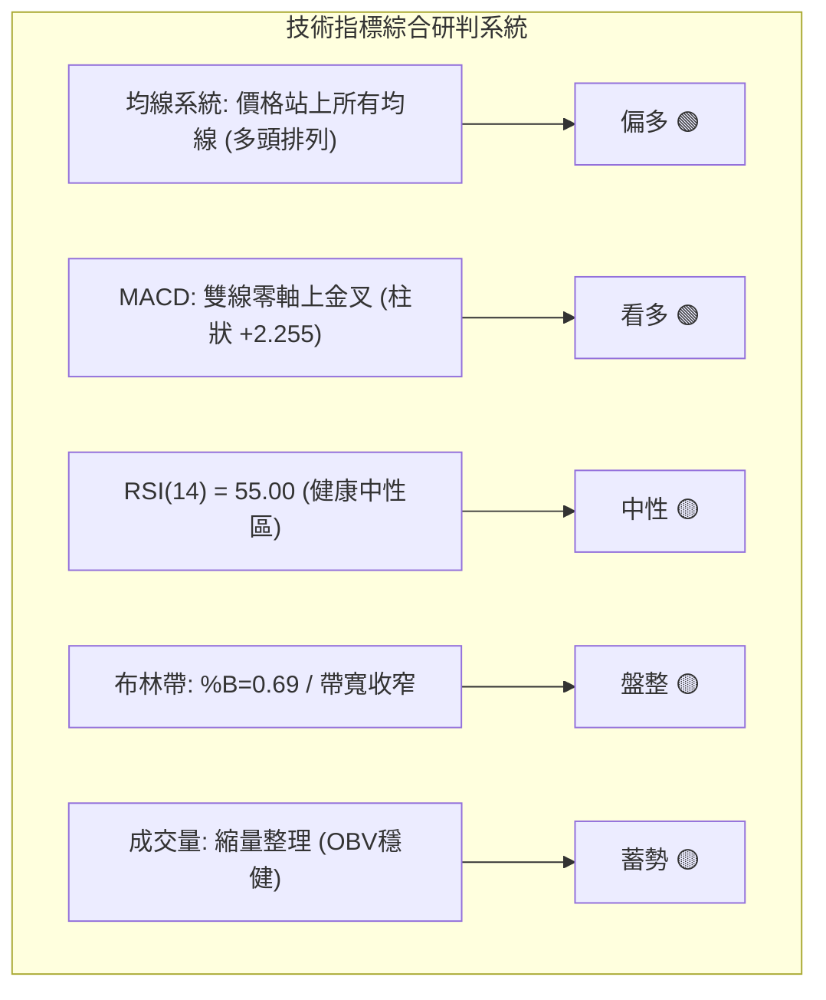
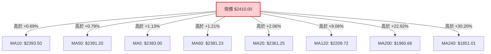
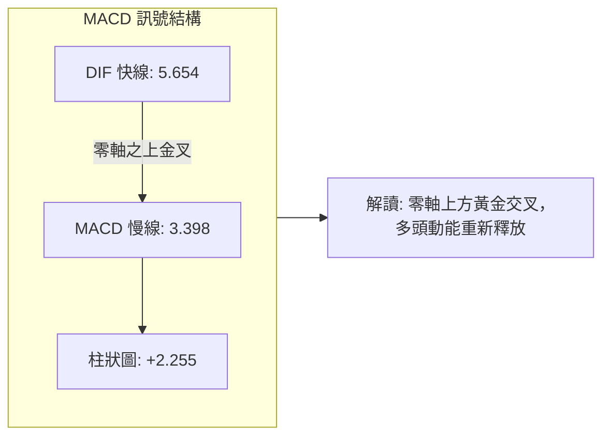
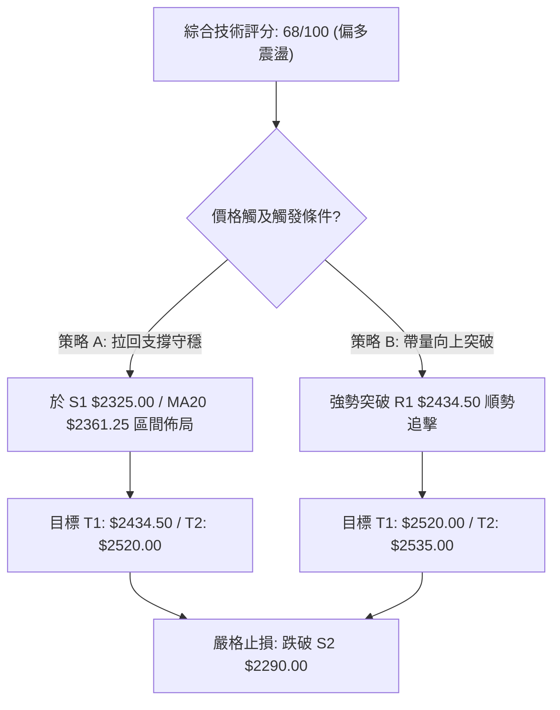
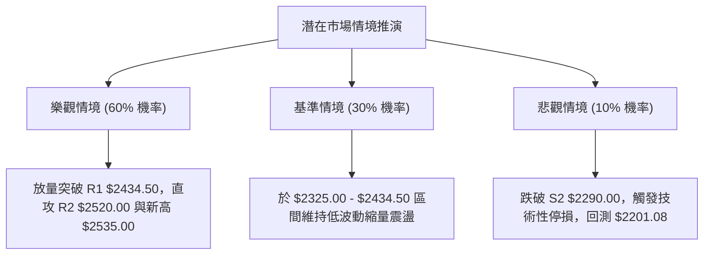

# 2330.TW 技術分析報告

> **報告日期**：2026-08-22 ｜ **語言**：繁體中文 ｜ **數據來源**：Yahoo Finance ｜ **當前價格**：$2410.00

---

## 目錄

| 章節 | 內容 |
|------|------|
| [1. 技術面概覽](#1-技術面概覽) | 訊號儀表板、核心指標、評分卡 |
| [2. 趨勢分析](#2-趨勢分析) | 多時框趨勢、長中短期走勢、ADX解讀 |
| [3. 圖表形態分析](#3-圖表形態分析) | 形態識別、K線組合、目標價計算 |
| [4. 支撐與阻力](#4-支撐與阻力) | 關鍵價位、斐波那契回調結構 |
| [5. 技術指標深度解讀](#5-技術指標深度解讀) | MA/RSI/MACD/布林/量能結構 |
| [6. 動能與波動率](#6-動能與波動率) | 動能矩陣、ATR波動率、Beta解讀 |
| [7. 多時框架總結](#7-多時框架總結) | 時框矩陣、多時框收斂定調 |
| [8. 交易策略建議](#8-交易策略建議) | 策略路由、主策略、風控對沖 |
| [9. 風險提示與監控](#9-風險提示與監控) | 監控清單、情境推演、資金管理 |
| [📋 報告總結](#-報告總結) | 核心總結儀表板與策略摘要 |

---

## 1. 技術面概覽

### 🎯 技術訊號儀表板



### 📊 核心指標速覽表

| 指標類別 | 指標名稱 | 當前數值 | 訊號 | 解讀 |
|----------|----------|----------|------|------|
| **價格** | 當前收盤價 | $2410.00 | 🟢 | 位於52週區間 91.2% 之高位強勢區 |
| **均線** | MA20 | $2361.25 | 🟢 | 現價高於 MA20 (+2.06%)，短線支撐強勁 |
| **均線** | MA50 | $2391.20 | 🟢 | 現價高於 MA50 (+0.79%)，中期趨勢維持多頭 |
| **均線** | MA200 | $1960.66 | 🟢 | 現價遠高於牛熊分界線 (+22.92%)，長期多頭確立 |
| **動能** | RSI(14) | 55.00 | 🟡 | 處於 30–70 中性強勢區間，無超買超賣 |
| **動能** | MACD (12,26,9) | DIF: 5.654 / MACD: 3.398 | 🟢 | 雙線位於零軸之上且黃金交叉，Histogram: +2.255 看多 |
| **趨勢** | ADX(14) | 7.36 (+DI: 29.89 / -DI: 27.73) | 🟡 | ADX < 25 表明處於箱型盤整行情，但多方佔優 |
| **通道** | 布林通道 (20,2) | 上軌 $2491.43 / 下軌 $2231.07 | 🟡 | %B 為 0.69，於中軌與上軌間運行，帶寬收斂 |
| **量能** | 20日均量比 | 0.59x (15,768,427 股) | 🔴 | 成交量萎縮，高位呈現量縮整理特徵 |
| **量能** | OBV | OBV > MA | 🟢 | 能量潮指標高於均線，量能長線支撐價格 |
| **波動** | ATR(14) | $42.50 (1.76%) | 🟡 | 日內波動幅度適中，有利於設定精確止損 |

### 🏆 技術評分卡

```
╔══════════════════════════════════════════════════════════════╗
║              技術評分卡 — 2330.TW (2026-08-22)               ║
╠══════════════════════════════════════════════════════════════╣
║ 趨勢強度      ██████░░░░░░░░░░░░░░  45/100  🟡 盤整 (ADX: 7.36) ║
║ 動能指標      █████████████░░░░░░░  68/100  🟢 MACD金叉/RSI中強  ║
║ 支撐穩定度    ████████████████░░░░  82/100  🟢 均線與多重底支撐  ║
║ 成交量配合    ██████████░░░░░░░░░░  52/100  🟡 高位量縮但OBV正向 ║
║ 形態完整度    ██████████████░░░░░░  70/100  🟢 高位收斂矩形構築  ║
║ 均線排列      ██████████████████░░  90/100  🟢 價格全站於均線上  ║
╠══════════════════════════════════════════════════════════════╣
║ 綜合評分      █████████████░░░░░░░  68/100  🟢 偏多箱型震盪      ║
╚══════════════════════════════════════════════════════════════╝
```

---

## 2. 趨勢分析

### 🌐 多時框趨勢分析



### 📈 長期趨勢 — 12個月走勢圖（Unicode）

```
2330.TW 月線走勢圖（過去12個月：2025-09 至 2026-08）
價格軸 ($)
$2500 ┤                                              ●(07: $2425) ──●(08: $2410)
$2400 ┤                                        ●(06: $2410)
$2300 ┤                                  ●(05: $2348.73)
$2100 ┤                            ●(04: $2129.32)
$1900 ┤                      ●(02: $1983.22)
$1700 ┤                ●(01: $1764.52) ──●(03: $1755.32)
$1500 ┤          ●(10: $1486.19) ──●(12: $1540.85)
$1400 ┤          │     ●(11: $1426.74)
$1200 ┤    ●(09: $1292.99)
      └─────────────────────────────────────────────────────────────
        09/25 10/25 11/25 12/25 01/26 02/26 03/26 04/26 05/26 06/26 07/26 08/26
```

#### 走勢特徵分析表格

| 階段區間 | 起始/結束價 | 累計漲跌幅 | 走勢特徵與結構意涵 |
|----------|------------|------------|-------------------|
| **2025-09 ~ 2025-12** | $1292.99 → $1540.85 | +19.17% | 主升段初段，突破千四阻力，量能放大 |
| **2026-01 ~ 2026-03** | $1764.52 → $1755.32 | -0.52% | 攻克千九 ($1983.22) 後進行月線級回洗整固 |
| **2026-04 ~ 2026-06** | $2129.32 → $2410.00 | +13.18% | 突破兩千大關，連創新高，進入歷史高位區 |
| **2026-07 ~ 2026-08** | $2425.00 → $2410.00 | -0.62% | 高位窄幅收斂，呈現標準的高檔旗型/矩形整理 |

### 📊 中期趨勢（週線分析）

```
中期週線關鍵結構示意圖（近20週）
$2535.00 ────────────────────────────────────────── 52週歷史高點 (波段終極阻力)
$2445.00 ───────●────────────────────────────────── 近期波段高點 (2026-07-05)
$2410.00 ──────────────────────────────●─────────── 當前現價 (站穩均線群)
$2361.25 ────────────────────────────────────────── MA20 / 布林中軌支撐
$2290.00 ──────────────────●─────────────────────── 波段強支撐 S2 (2026-07-19 低點)
```

近20週數據顯示，2330.TW 於 2026-07-19 觸及波段低點 $2290.00 後迅速回升，並於 2026-08-23 週收於 $2410.00。週線 MACD 柱狀圖已由負轉正 (+2.255)，週 RSI 回升至 55.0，顯示中期回調結束，重回震盪走強架構。

### ⚡ 趨勢強度評估（ADX 解讀）



| ADX 區間 | 趨勢狀態 | 2330.TW 當前狀態 | 技術含義與操作指引 |
|----------|----------|-----------------|-------------------|
| **0 – 20** | **無趨勢/盤整** | **✓ 7.36** | **動能沉澱，高位箱型整理，適用通道與高出低進策略** |
| 20 – 25 | 趨勢醞釀中 | - | 突破初期，需觀察量能是否放大 |
| 25 – 50 | 強勁趨勢 | - | 趨勢跟隨，不預設高點 |
| > 50 | 極強趨勢/超買 | - | 趨勢過熱，注意背離回調風險 |

---

## 3. 圖表形態分析

### 🔍 形態識別系統



#### 形態信心度與目標價評估表

| 形態名稱 | 信心度 | 判斷依據（數據引用） | 完成度 | 目標價（附嚴謹計算式） |
|----------|--------|----------------------|--------|------------------------|
| **高位箱型矩形** | **75%** | 上軌於 R1 $2434.50 承壓，下軌於 S1 $2325.00 及 MA20 $2361.25 獲支撐 | 85% | 突破 R1 後目標：$2434.50 + ($2434.50 - $2325.00) = **$2544.00**（接近 52W 高點 $2535.00） |
| **短期雙重底 (W底)** | **70%** | 兩次回踩低點聚類於 S2 $2290.00 (2026-07-19)，頸線為 07-05 高點 $2445.00 | 80% | 頸線突破目標：$2445.00 + ($2445.00 - $2290.00) = **$2600.00** |
| **頭肩頂反轉形態** | **25%** | 數據中未偵測到頸線跌破與右肩確立特徵，無頂背離 | 0% | 訊號不足，僅做指標型解讀，不予推算 |

### 🕯️ 重要K線形態分析

| 期間/月份 | 收盤價 | K線形態特徵 | 技術解讀 | 訊號 |
|-----------|--------|-------------|----------|------|
| **2026-06** | $2410.00 | 實體陽線頂天 | 強勢上攻突破前期平台，確立多頭主升段 | 🟢 |
| **2026-07** | $2425.00 | 高位十字星/小陽 | 多空雙方於歷史高點前激烈交戰，動能暫緩 | 🟡 |
| **2026-08 (當前)** | $2410.00 | 縮量懸空小陰/十字星 | 價格穩於各週期均線上方，縮量蓄勢特徵明顯 | 🟢 |
| **2026-07-19 (週)** | $2290.00 | 長下影探底錘頭線 | 成功測試波段強支撐 S2，確立雙底第二腳 | 🟢 |
| **2026-08-23 (週)** | $2410.00 | 溫和回升實體小陽線 | 重新站上 MA50 與週線均線，MACD 柱狀由負轉正 | 🟢 |

### 📉 ASCII 走勢形態示意圖

```
高位箱型整理與雙底結構圖
價格 ($)
$2535.00 ┤                                           ┌─ 52W 高點
$2445.00 ┤        ●(頸線高點)                         │
$2434.50 ┼────────┼───────────────────────●(R1阻力) ──┼─ 箱型上軌
$2410.00 ┤        │                       ▲(現價)     │
$2361.25 ┼────────┼───────────────────────┼───────────┼─ MA20 / 箱型中軸
$2325.00 ┼────────┼───────────────────────┼───────────┼─ S1 近期支撐
$2290.00 ┤        ●(左底 07-19) ─────────●(S2強支撐) ─┴─ 箱型下軌
         └─────────────────────────────────────────────
```

### 🎯 形態目標價計算

1. **高位矩形突破向上測量**：
   - 箱頂 (Resistance)：$2434.50 (R1)
   - 箱底 (Support)：$2325.00 (S1)
   - 形態高度 ($H_1$) = $2434.50 - $2325.00 = $109.50
   - **矩形突破第一目標價** = $2434.50 + $109.50 = **$2544.00**

2. **雙底形態 (W-Bottom) 等距測量**：
   - 頸線位置 (Neckline)：$2445.00
   - 底部支撐 (Bottom)：$2290.00 (S2)
   - 形態高度 ($H_2$) = $2445.00 - $2290.00 = $155.00
   - **雙底向上滿足目標價** = $2445.00 + $155.00 = **$2600.00**

---

## 4. 支撐與阻力

### 🗺️ 關鍵價位分布圖（Unicode）

```
2330.TW 價位結構分布圖
══════════════════════════════════════════════════════════════════════
$2535.00 ║██████████████████████████████║ 52週歷史高點 / 0.0% 斐波那契
$2520.00 ║████████████████████████      ║ 波段強阻力 R2 (+4.56%)
$2434.50 ║████████████████              ║ 短線關鍵阻力 R1 (+1.02%)
$2410.00 ╠══════════════════════════════╣ ◄ 當前收盤價 ($2410.00)
$2361.25 ║▓▓▓▓▓▓▓▓▓▓▓▓▓▓▓▓▓▓▓▓          ║ 動態支撐 MA20 / 布林中軌
$2325.00 ║████████████████              ║ 近期波段支撐 S1 (-3.53%)
$2290.00 ║████████████████████████      ║ 近期強支撐 S2 (-4.98%)
$2201.08 ║████████████████████████████  ║ 23.6% 斐波那契回調位
$2189.73 ║██████████████████████████████║ 波段深層支撐 S3 (-9.14%)
══════════════════════════════════════════════════════════════════════
```

### 🚧 阻力位分析表

| 阻力級別 | 精確價位 | 形成原因（波段高點聚類） | 突破難度 | 重要性評級 |
|----------|----------|--------------------------|----------|------------|
| **R1 (短線阻力)** | **$2434.50** | 近期密集高點聚類區，箱型整理上沿 (+1.02%) | 中等 | ★★★☆☆ |
| **R2 (波段阻力)** | **$2520.00** | 逼近歷史高點前之籌碼密集反壓區 (+4.56%) | 較高 | ★★★★☆ |
| **52W High** | **$2535.00** | 52週歷史最高價，重大心理與技術面關卡 (+5.19%) | 極高 | ★★★★★ |

### 🛡️ 支撐位分析表

| 支撐級別 | 精確價位 | 形成原因（波段低點聚類） | 守住機率 | 重要性評級 |
|----------|----------|--------------------------|----------|------------|
| **S1 (短線支撐)** | **$2325.00** | 近期日線拉回低點聚類，與 MA60 ($2381.23) 形成緩衝 (-3.53%) | 75% | ★★★☆☆ |
| **S2 (波段支撐)** | **$2290.00** | 2026-07-19 週線探底低點，雙底形態之底頸關鍵 (-4.98%) | 85% | ★★★★★ |
| **S3 (深層支撐)** | **$2189.73** | 近一年波段深層低點聚類，接近 23.6% 回調位 (-9.14%) | 95% | ★★★★☆ |

### 📐 斐波那契回調位分析

依據 52 週波動區間：**最低點 $1120.07 → 最高點 $2535.00**（總垂直波幅 $1414.93）：

```
斐波那契回調階梯
0.0%  (52W High)  $2535.00 ───────────────────────────────────────────────
現價  ($2410.00)  ───────────── 位於 0.0% 與 23.6% 之間（極強勢回調區間）
23.6%             $2201.08 ───────────────────────────────────────────────
38.2%             $1994.50 ── 接近 MA200 ($1960.66)
50.0%             $1827.53 ── 接近 MA240 ($1851.01)
61.8% (黃金分割)  $1660.57 ───────────────────────────────────────────────
78.6%             $1422.86 ───────────────────────────────────────────────
100.0% (52W Low)  $1120.07 ───────────────────────────────────────────────
```

- **結構解讀**：當前現價 $2410.00 處於斐波那契 0.0% ($2535.00) 至 23.6% ($2201.08) 的極淺層回調區間內，回撤幅度極小。
- **技術意涵**：在技術分析中，股價維持在 23.6% 回調位之上橫盤整理，代表市場主動性買盤強烈，屬於典型的「以時間換取空間」強勢整理格局，未破 $2201.08 前多頭波段結構完好無損。

---

## 5. 技術指標深度解讀

### 🎛️ 指標訊號總覽



### 📈 移動平均線排列分析



#### 均線架構深度剖析

1. **短期均線纏繞**：MA5 ($2383.00)、MA10 ($2393.50)、MA20 ($2361.25)、MA50 ($2391.20) 與 MA60 ($2381.23) 高度黏合於 $2360 - $2395 窄幅區間，為標準的「均線收斂蓄勢」形態。
2. **中長期均線發散**：MA120 ($2209.72)、MA200 ($1960.66)、MA240 ($1851.01) 呈現完美多頭排列向上延伸，多頭長線底氣堅實。
3. **乖離率分析**：
   - BIAS(MA20) = +2.06%（乖離溫和，無過熱現象）
   - BIAS(MA200) = +22.92%（長線多頭維持強勁動能）

### 📉 RSI(14) 分析

```
RSI(14) 數值儀表：55.00
[0] ────────────── [30 超賣] ────────────── [55.00 當前] ────────────── [70 超買] ────────────── [100]
進度條: ███████████░░░░░░░░░ 55.0%
```

- **背離檢驗結論**：
  - **頂背離判定**：**無頂背離**。近 4 週價格由 $2350.00 緩步墊高至 $2410.00，RSI 由 40.2 回升至 55.0，指標與價格同向回升。
  - **底背離判定**：**無底背離**。指標處於正常多空平衡偏強區間。
- **動能評估**：RSI 成功脫離 40–50 偏弱區域，重返 50 多空分水嶺之上，確認短線多方重掌主控權。

### 📊 MACD(12/26/9) 訊號解讀



- **MACD DIF**: 5.654
- **MACD Signal (DEA)**: 3.398
- **MACD Histogram**: **+2.255**（🟢 買入訊號維持）
- **動態分析**：雙線位於零軸之上，柱狀圖連續由負轉正並放大（見週走勢：-11.807 → -12.690 → +3.329 → +8.867 → +2.255），確認波段拉回修正已告一段落，動能指標已轉為多頭主導。

### 📦 布林通道分析

```
2330.TW 布林通道空間示意圖 (20, 2)
$2491.43 ┼───────────────────────────────────────────── 上軌 (Resistance)
         │                   
$2410.00 ┼───────────────────● 現價 (%B = 0.69)
         │
$2361.25 ┼───────────────────────────────────────────── 中軌 MA20 (Dynamic Support)
         │
$2231.07 ┼───────────────────────────────────────────── 下軌 (Support)
```

- **布林上軌**：$2491.43
- **布林中軌 (MA20)**：$2361.25
- **布林下軌**：$2231.07
- **帶寬與位置 (%B)**：%B 為 **0.69**。帶寬（Bandwidth = ($2491.43 - $2231.07) / $2361.25 = 11.02%）處於收斂後期，價格緊貼中軌上方震盪，隨時具備帶量推升布林上軌的擴軌條件。

### 💹 成交量分析（量價配合度）

1. **量能萎縮特徵**：最新成交量 15,768,427 股，相較於 20 日均量 26,696,036 股（量比 0.59x）及 50 日均量 29,863,919 股明顯萎縮。
2. **量價關係解讀**：股價在高位區間（$2350–$2425）橫向震盪時呈現縮量，代表市場籌碼鎖定良好，並無高位大舉派發（主力出貨）跡象。
3. **OBV (能量潮) 驗證**：官方數據顯示「**OBV > MA → 量能支撐上漲**」，長線資金並未離場，量能結構正面支援價格上行。

---

## 6. 動能與波動率

### ⚡ 動能評估四象限

```
動能與波動率矩陣定位
    強動能 ↑
           │    Q1 (強動能 / 低波動)     │    Q3 (強動能 / 高波動)
           │    ★ 突破加速區            │    激進追價區
           │                             │
───────────┼─────────────────────────────┼───────────────────────────→ 波動率
           │    Q2 (弱動能 / 低波動)     │    Q4 (弱動能 / 高波動)
           │    ◆ 2330.TW 當前位置 (ADX=7.36, ATR=1.76%)
           │    ★ 箱型整理/沉澱蓄勢區     │    震盪洗盤區
    弱動能 │
```

| 象限 | 動能強度 | 波動率 | 當前狀態 | 技術操作意涵 |
|------|----------|--------|----------|--------------|
| Q1 | 強 (ADX>25) | 低 (ATR<2%) | - | 最佳趨勢加碼點 |
| **Q2** | **弱 (ADX<25)** | **低 (ATR 1.76%)** | **✓ (2330.TW)** | **高位箱型整理，採區間高出低進，靜待帶量突破** |
| Q3 | 強 (ADX>25) | 高 (ATR>3%) | - | 單邊趨勢狂飆，嚴控動態移動止盈 |
| Q4 | 弱 (ADX<25) | 高 (ATR>3%) | - | 混沌震盪，容易雙向停損，應避免進場 |

### 📊 ATR 波動率分析

- **ATR(14) 絕對值**：**$42.50**
- **ATR 相對價格比**：**1.76%**
- **波動率特性**：每日波幅約 40–45 元，波動幅度處於歷史低波動區間，適合執行精確的風控設定。
- **止損距離建議**：
  - 短線交易止損距離：1.5 × ATR = 1.5 × $42.50 = **$63.75**（建議止損設於現價下方法定支撐位）
  - 波段交易止損距離：2.0 × ATR = 2.0 × $42.50 = **$85.00**

### 📐 Beta 與市場相關性

- **Beta 係數**：**1.258**
- **市場敏感度解讀**：Beta > 1 表明 2330.TW 對台股大盤具有高度正相關與放大效應（大盤波動 1%，該股平均波動約 1.258%），在大盤偏多環境下具備顯著的超額收益潛力。

---

## 7. 多時框架總結

### 📋 時框架評分表

| 時框架 | 趨勢方向 | 動能指標 | 均線排列 | 圖表形態 | 綜合評分 | 交易指引 |
|--------|----------|----------|----------|----------|----------|----------|
| **月線 (長期)** | 🟢 強勁多頭 | 強勁 (多頭推進) | 多頭排列 (MA240上) | 歷史多頭主升 | **92/100** | 長線堅定持股，不預設頂部 |
| **週線 (中期)** | 🟢 震盪偏多 | 中強 (MACD金叉) | 多頭排列 (MA20上) | 雙底回升 | **78/100** | 回踩重要支撐分批佈局 |
| **日線 (短期)** | 🟡 箱型盤整 | 中性 (ADX: 7.36) | 均線收斂纏繞 | 矩形整理 | **62/100** | 區間操作或等待突破加碼 |

### 🔲 綜合訊號矩陣

```
時框訊號收斂一致性檢驗
┌──────────────┬─────────────┬─────────────┬─────────────┐
│ 分析維度     │ 長期 (月線) │ 中期 (週線) │ 短期 (日線) │
├──────────────┼─────────────┼─────────────┼─────────────┤
│ 趨勢方向     │  🟢 多頭    │  🟢 多頭    │  🟡 盤整    │
│ 均線系統     │  🟢 多頭    │  🟢 多頭    │  🟢 多頭    │
│ 動能指標     │  🟢 強勁    │  🟢 偏多    │  🟡 中性    │
│ 量能結構     │  🟢 正向    │  🟢 穩健    │  🔴 萎縮    │
│ 形態結構     │  🟢 多頭    │  🟢 雙底    │  🟡 箱型    │
└──────────────┴─────────────┴─────────────┴─────────────┘
```

### ⚖️ 多時框收斂結論

依據多時框收斂規則（嚴格要求 14）：
1. **行情屬性判定**：當前日線 ADX(14) = **7.36 (< 25)**，定性為**盤整蓄勢行情**；
2. **時框優先級收斂**：在日線無單邊趨勢時，交易框架依循**中長期（週線/MA50 $2391.20、MA200 $1960.66）多頭方向為主導**，日線布林通道 ($2231.07 - $2491.43) 與關鍵支撐阻力則作為進場時機依據；
3. **唯一方向性結論**：**【偏多箱型震盪】**。中長期牛市基調未變，短期處於高位蓄勢待發狀態，策略方針為「**逢支撐做多，突破順勢加碼**」。

---

## 8. 交易策略建議

### 🗺️ 策略決策流程圖



### 🧭 策略路由

> **當前主策略方向 = 主推多頭策略（依評分 68/100 偏多）**
> 綜合評分 ≥ 60，依規則主推多頭交易策略（策略 A：拉回低接；策略 B：突破追買），空頭僅作為反向風控觸發點。

### 🎯 價格情境階梯（Price Scenarios）

| 觸發條件 | 第一目標 | 第二目標 | 情境含義與技術應對 |
|----------|----------|----------|-------------------|
| **強勢突破 R1 $2434.50** | **R2 $2520.00** | **52W High $2535.00** | 箱型向上突破，挑戰歷史天花板，短線轉強加速 |
| **站穩現價 $2410.00 區間** | **R1 $2434.50** | **R2 $2520.00** | 維持布林中上軌強勢震盪，以時間換取空間 |
| **跌破短線支撐 S1 $2325.00** | **S2 $2290.00** | **S3 $2189.73** | 跌破 MA20，下探週線雙底頸線支撐，中期轉入防守 |

### 📊 情境機率分佈

| 情境劇本 | 估計機率 | 主要技術依據 |
|----------|----------|--------------|
| **高位突破 / 震盪走高** | **60%** | MACD 零軸上金叉 (+2.255)、OBV 正向、價格全線站於各週期 MA 之上 |
| **區間橫盤箱型震盪** | **30%** | ADX(14) = 7.36 動能平緩、成交量萎縮 (0.59x)、布林帶寬收窄 |
| **深度回落 / 破底轉弱** | **10%** | 下方擁有多重均線防護 (MA20/50/60) 及 23.6% 斐波那契強支撐 |

### 🟢 主策略詳情

| 策略要素 | 策略 A（支撐回踩低接） | 策略 B（阻力突破追買） |
|----------|------------------------|------------------------|
| **進場條件** | 股價拉回測試 MA20 獲得支撐不破 | 帶量長陽突破 R1 $2434.50 確認站穩 |
| **進場價格** | **$2360.00**（MA20 $2361.25 附近） | **$2435.00**（R1 $2434.50 突破點） |
| **目標價 T1** | **$2434.50**（R1 阻力位） | **$2520.00**（R2 強阻力位） |
| **目標價 T2** | **$2520.00**（R2 強阻力位） | **$2535.00**（52W 歷史高點） |
| **止損價格** | **$2290.00**（跌破 S2 強支撐） | **$2360.00**（跌破 MA20 支撐） |
| **風險報酬比 (R:R)** | **2.29 : 1** (獲利 $160 / 風險 $70) | **1.33 : 1** (獲利 $100 / 風險 $75) |
| **勝率評估** | **65%** | **60%** |
| **建議倉位** | **20% 資金** | **15% 資金** |

*註：風險報酬比計算以 T2 目標價為基準。*

### 🔴 反向風險觸發點（對沖提示）

- **全面停損/對沖信號**：若收盤價有效跌破 **S2 $2290.00**（跌破前低與雙底防線），多頭波段結構遭到實質破壞，應無條件執行多單止損或建立期貨空頭部位對沖。
- **深層下行預警**：若進一步失守 23.6% 斐波那契回調位 **$2201.08** 及 **S3 $2189.73**，股價將朝向 38.2% 回調位 **$1994.50** 及 MA200 **$1960.66** 尋求支撐。

### ⭐ 整體訊號強度評星

```
╔══════════════════════════════════════════════════════════════╗
║ 做多訊號強度：★★★★☆  (4.0/5星) — 中長多頭確立，短線蓄勢 ║
║ 做空訊號強度：★☆☆☆☆  (1.0/5星) — 逆勢做空風險極大       ║
║ 整體可信度：  ★★★★☆  (4.2/5星) — 多時框指標收斂度高     ║
╚══════════════════════════════════════════════════════════════╝
```

---

## 9. 風險提示與監控

### ✅ 關鍵監控指標 Checklist

```
╔══════════════════════════════════════════════════════════════╗
║              2330.TW 交易關鍵監控清單 (Checklist)            ║
╠══════════════════════════════════════════════════════════════╣
║ [ ] 價位突破監控：收盤價是否突破 R1 $2434.50 並挑戰 R2 $2520 ║
║ [ ] 支撐防守監控：MA20 $2361.25 及 S2 $2290.00 是否有效守穩  ║
║ [ ] 量能擴張監控：日成交量是否回升突破 20日均量 (26,696,036) ║
║ [ ] 趨勢動能確認：ADX(14) 是否由 7.36 拐頭突破 20 形成趨勢  ║
║ [ ] 動能指標跟蹤：MACD Histogram 是否持續維持在正值區間      ║
║ [ ] 乖離風險管理：股價與 MA200 ($1960.66) 乖離是否超過 30%   ║
╚══════════════════════════════════════════════════════════════╝
```

### ⚠️ 風險場景分析



### 🛡️ 風險管理重要提醒

1. **量能不足之假突破風險**：當前量比僅 0.59x，若盤中向上觸碰 R1 $2434.50 但全日成交量未達 20日均量（約 2670 萬股），需提防「假突破真拉回」之陷阱，切勿急於市價追高。
2. **高位窄幅震盪之時間耗損**：ADX 處於極低位（7.36），表明當前以時間換取空間，持有衍生性商品（如權證、期權）者須注意時間價值流逝風險，現股或現貨多單操作更具優勢。
3. **嚴格執行資金配比**：單筆進場資金建議不超過總資金 20%，嚴格將最大虧損控制在總本金的 1%–2% 以內。

---

## 📋 報告總結

```
╔══════════════════════════════════════════════════════════════════╗
║                 2330.TW 技術分析報告核心總結                     ║
╠══════════════════════════════════════════════════════════════════╣
║ 報告日期：2026-08-22                                             ║
║ 當前價格：$2410.00                                               ║
║ 分析評級：🟢 偏多震盪整理（技術綜合評分：68 / 100）              ║
╠══════════════════════════════════════════════════════════════════╣
║ 關鍵結論：                                                       ║
║ ├─ 長期趨勢：🟢 強勁多頭（站穩 MA200 $1960.66 與 MA240 $1851）  ║
║ ├─ 中期趨勢：🟢 震盪偏多（完成 $2290 探底，週 MACD 金叉）      ║
║ ├─ 短期趨勢：🟡 箱型蓄勢（ADX=7.36 盤整，站穩 MA20 $2361.25）  ║
║ ├─ 關鍵支撐：S1 $2325.00 ｜ S2 $2290.00 ｜ 23.6%位 $2201.08     ║
║ ├─ 關鍵阻力：R1 $2434.50 ｜ R2 $2520.00 ｜ 52W High $2535.00   ║
║ └─ 法人共識目標：$3229.33 (Strong Buy, 33 位分析師)              ║
╠══════════════════════════════════════════════════════════════════╣
║ 最優交易策略組合：                                               ║
║ 1. 🥇 最佳機會（策略 A）：回踩 MA20 $2360 佈局，目標 $2520       ║
║ 2. 🥈 次選機會（策略 B）：放量突破 R1 $2435 追買，目標 $2535      ║
║ 3. 🥉 風控底線：收盤跌破 S2 $2290.00 全面執行停損與避險          ║
╚══════════════════════════════════════════════════════════════════╝
```

---

> ⚠️ **免責聲明**：本報告為 AI 自動生成之技術分析研究成果，報告內所有數據、支撐阻力位與圖表均嚴格基於提供之歷史市場數據計算推導。本報告**僅供學術研究與投資參考**，**不構成任何形式的要約、招攬或具體投資建議**。金融市場具有高波動風險，投資人應依個人財務狀況與風險承受度獨立做出投資決策並自負盈虧。

---

*報告生成時間：2026-08-22 ｜ 數據來源：Yahoo Finance ｜ 分析框架：多時框技術分析系統*