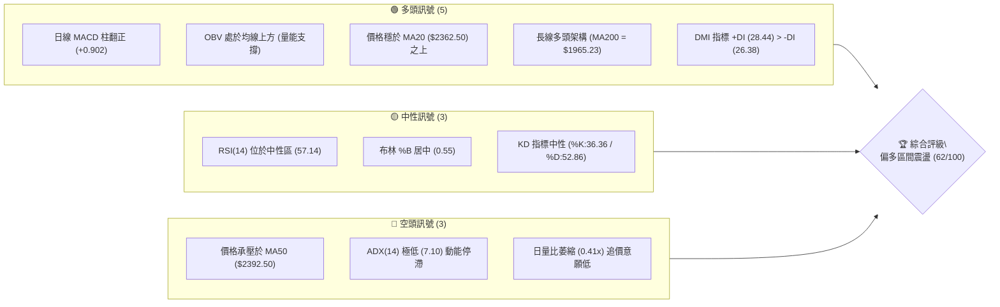
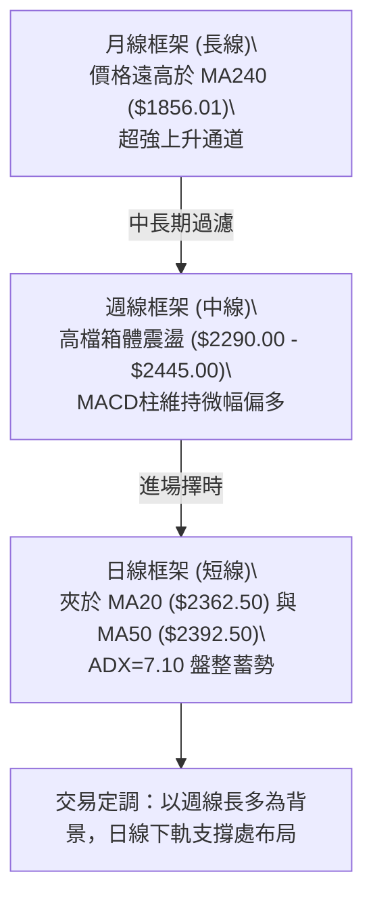
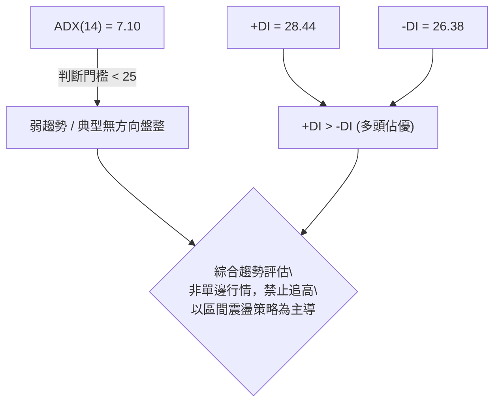
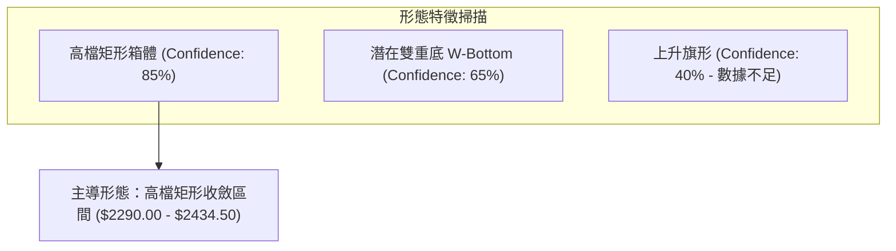
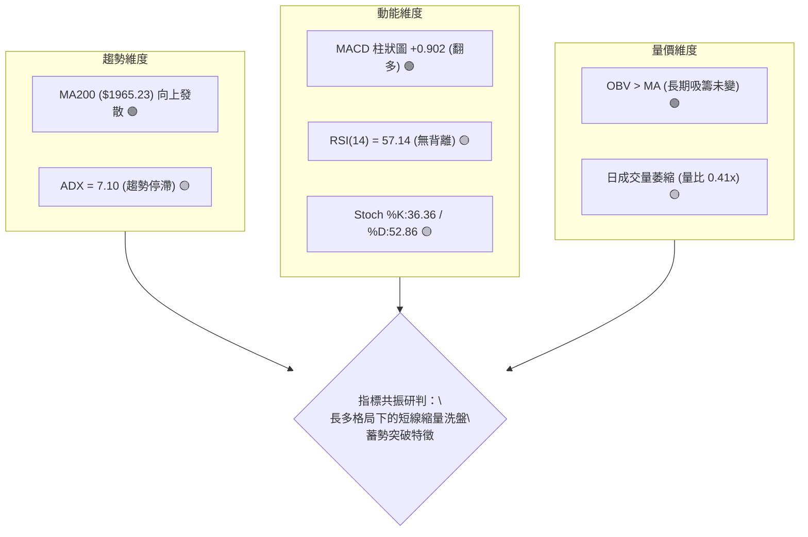
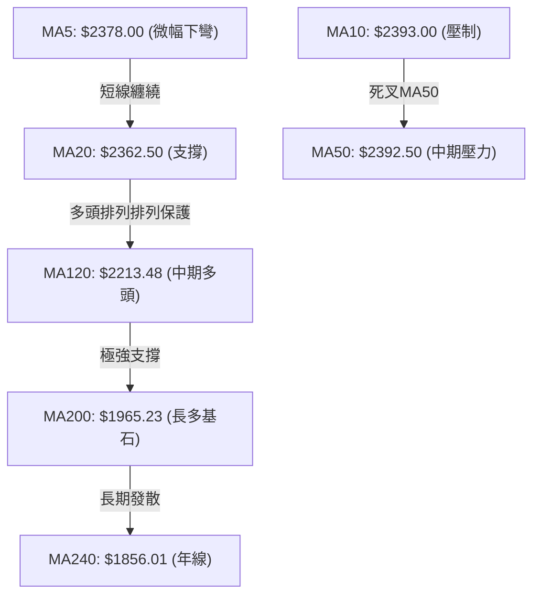
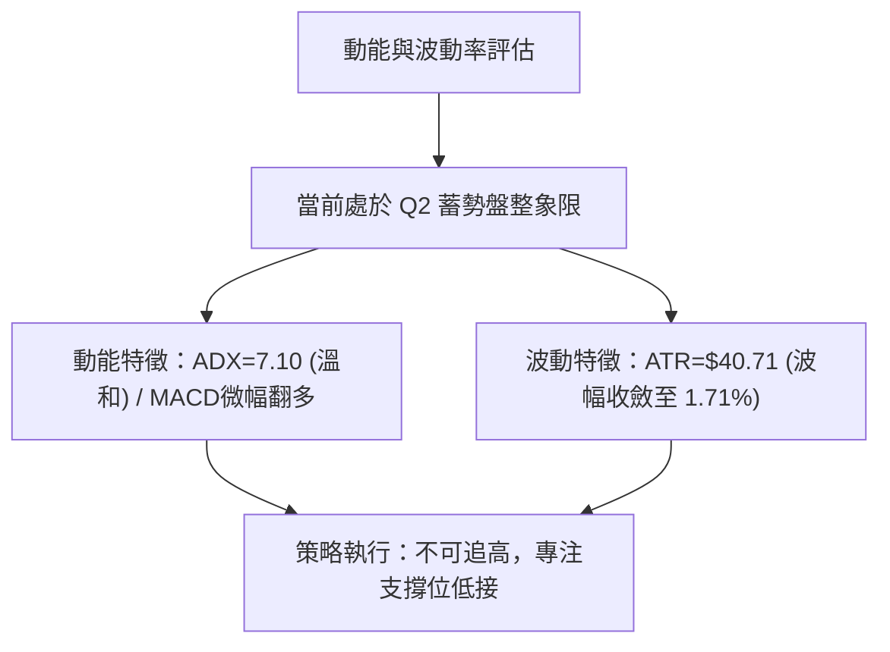
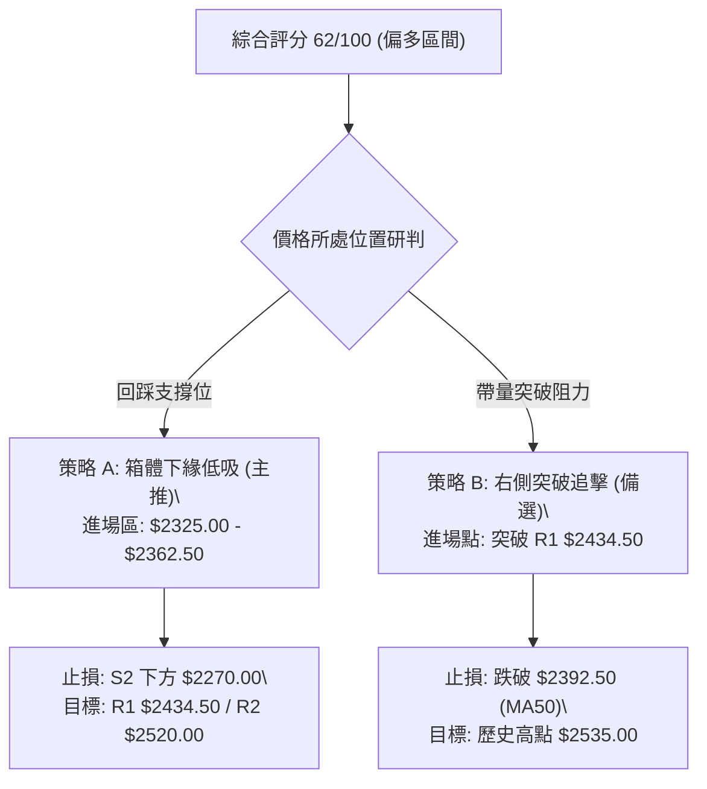
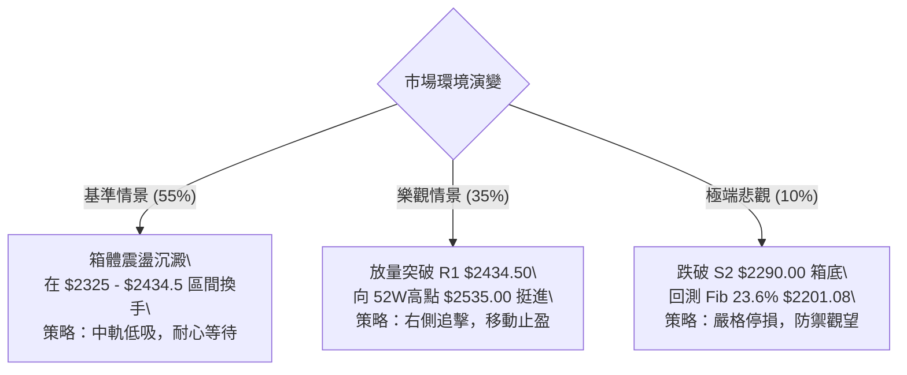

# 2330.TW 技術分析報告

> **報告日期**：2026-08-24 ｜ **語言**：繁體中文 ｜ **數據來源**：Yahoo Finance ｜ **當前價格**：$2375.00

---

## 目錄

| 章節 | 內容 |
|------|------|
| [1. 技術面概覽](#1-技術面概覽) | 訊號儀表板、核心指標、評分卡 |
| [2. 趨勢分析](#2-趨勢分析) | 多時框趨勢、長中短期走勢、ADX強度 |
| [3. 圖表形態分析](#3-圖表形態分析) | 形態識別、K線組合、目標價推算 |
| [4. 支撐與阻力](#4-支撐與阻力) | 關鍵價位、斐波那契回調結構 |
| [5. 技術指標深度解讀](#5-技術指標深度解讀) | MA/RSI/MACD/布林/成交量綜合共振 |
| [6. 動能與波動率](#6-動能與波動率) | 動能四象限、ATR風控、Beta特徵 |
| [7. 多時框架總結](#7-多時框架總結) | 時框架矩陣與多時框收斂定調 |
| [8. 交易策略建議](#8-交易策略建議) | 策略路由、多空情境、風險報酬比 |
| [9. 風險提示與監控](#9-風險提示與監控) | 監控清單、極端場景、部位管理 |
| [10. 報告總結](#10-報告總結) | 總體評級、關鍵數據與終審結論 |

---

## 1. 技術面概覽

### 🎯 技術訊號儀表板



### 📊 核心指標速覽表

| 指標類別 | 指標名稱 | 當前數值 | 訊號 | 解讀 |
|:---|:---|:---|:---:|:---|
| **價格** | 當前收盤價 | $2375.00 | 🟡 | 位於52週高低區間之 88.7% 高位，處於收斂整理期 |
| **均線** | 短期 MA20 | $2362.50 | 🟢 | 現價高於 MA20 (+0.53%)，短線獲得月線支撐 |
| **均線** | 中期 MA50 | $2392.50 | 🔴 | 現價低於 MA50 (-0.73%)，中期生命線形成上方壓制 |
| **均線** | 長期 MA200 | $1965.23 | 🟢 | 現價大幅高於 MA200 (+20.85%)，長線多頭格局極為穩固 |
| **動能** | RSI(14) | 57.14 | 🟡 | 處於 50–60 溫和多頭區間，無超買超賣，無背離訊號 |
| **動能** | MACD(12,26,9) | 4.525 / 3.624 | 🟢 | DIF 線高於 DEA 線，柱狀圖 +0.902 維持金叉偏多狀態 |
| **趨勢** | ADX(14) | 7.10 | 🟡 | 遠低於 25 門檻，顯示單邊趨勢暫竭，進入典型箱體整理 |
| **通道** | 布林帶 %B | 0.55 | 🟡 | 位於布林中軌（$2362.50）與上軌（$2492.70）之間偏中位置 |
| **量能** | 量比 / OBV | 0.41x / 看多 | 🟢 | 短線量縮沉澱籌碼，OBV 高於均線印證長期資金未出逃 |
| **波動** | ATR(14) | $40.71 | 🟢 | 波動率佔股價 1.71%，波幅溫和收斂，適合區間風控 |

### 🏆 技術評分卡

```
╔══════════════════════════════════════════════════════════════════╗
║              2330.TW 技術指標綜合評分卡 (2026-08-24)             ║
╠══════════════════════════════════════════════════════════════════╣
║ 趨勢強度 (ADX/DMI)  ████░░░░░░░░░░░░░░░░  25/100 🟡 [盤整]       ║
║ 動能指標 (MACD/RSI) ██████████████░░░░░░  70/100 🟢 [多頭微幅]   ║
║ 支撐穩定度 (波段低點) ████████████████░░░░  80/100 🟢 [下檔堅實]   ║
║ 成交量配合 (OBV/量比) ████████████░░░░░░░░  60/100 🟢 [量縮守價]   ║
║ 形態完整度 (箱體整理) ██████████████░░░░░░  70/100 🟢 [箱型構築]   ║
║ 均線排列 (多時框MA) ██████████████░░░░░░  68/100 🟢 [長多短整]   ║
╠══════════════════════════════════════════════════════════════════╣
║ 綜合評分             ████████████░░░░░░░░  62/100 🟢 偏多區間操作 ║
╚══════════════════════════════════════════════════════════════════╝
```

---

## 2. 趨勢分析

### 🌐 多時框趨勢分析



### 📈 長期趨勢 — 12個月走勢圖（Unicode）

```
2330.TW 月線歷史走勢圖（2025-09 至 2026-08）
價格 ($)
$2500 ┤                                      ╭● $2425.00 (2026-07)
$2400 ┤                               ╭●─────╯  ╰● $2375.00 (現價)
$2300 ┤                         ╭●────╯ $2348.73 (2026-05)
$2200 ┤                   ╭●────╯ $2129.32 (2026-04)
$2100 ┤                   │
$2000 ┤             ╭●────╯ $1983.22 (2026-02)
$1900 ┤             │
$1800 ┤       ╭●────╯ $1764.52 (2026-01)
$1700 ┤       │  ╰● $1755.32 (2026-03 回檔)
$1600 ┤ ╭●───╯ $1540.85 (2025-12)
$1500 ┤ │  ╰● $1426.74 (2025-11)
$1400 ┤╭● $1486.19 (2025-10)
$1300 ┤● $1292.99 (2025-09 啟動點)
      └────────────────────────────────────────────────────────
        09  10  11  12  01  02  03  04  05  06  07  08 (月份)
```

#### 走勢特徵分析表格

| 階段區間 | 起訖價位 | 累計漲跌幅 | 核心技術特徵 | 結構研判 |
|:---|:---|:---:|:---|:---|
| **主升一浪 (2025/09-2026/02)** | $1292.99 → $1983.22 | +53.38% | 月線連紅，均線多頭發散，成交量逐月放大 | 突破千元大關後的機構搶籌主升段 |
| **中期洗盤 (2026/02-2026/03)** | $1983.22 → $1755.32 | -11.49% | 回踩季線支撐，回調幅度適中未破趨勢線 | 典型快速獲利回吐與浮額清理 |
| **主升二浪 (2026/03-2026/07)** | $1755.32 → $2425.00 | +38.15% | 突破二千大關，RSI進入超買區後緩步收斂 | 資金高度集中權值股，推升至歷史次高 |
| **高檔收斂 (2026/07-2026/08)** | $2425.00 → $2375.00 | -2.06% | 波幅顯著收窄，布林通道水平靠攏，ADX驟降 | 高檔換手與箱體構築，等待下一次方向選擇 |

### 📊 中期趨勢（週線分析）

從近20週數據（2026-04 至 2026-08）觀察，股價在創下 52 週高點 $2535.00 後，進入 $2290.00 至 $2445.00 的高檔箱體震盪區。

```
週線高檔箱體結構：
$2535.00 ┬────────────────────────────────────────── 52週歷史天花板
         │
$2445.00 ┼───╭○─────────────────╭○──────────────── 近期箱體上緣壓力區 (R1附近)
         │   │  │                 │  │
$2375.00 ┼───┼──┼───────●現價─────┼──┼──────────────── 現價位於箱體中樞上方
         │   │  │                 │  │
$2290.00 ┴───┴──╰○────────────────┴──╰○─────────────── 近期箱體下緣支撐區 (S2)
```

週線 MACD 柱狀圖在 2026-07-19 探底至 -15.213 後顯著收斂翻揚，至 2026-08-16 放大至 +8.867，當前維持在 +0.902，週線級別動能已由空翻多，確認 $2290.00 為強烈的中期波段底部。

### ⚡ 趨勢強度評估（ADX 解讀）



#### ADX 強度對照與市場狀態判定

| ADX 數值區間 | 當前數值 | 市場狀態屬性 | 適用交易策略 | 當前吻合度 |
|:---|:---:|:---|:---|:---:|
| **0 – 20** | **7.10** | **極弱趨勢 / 窄幅盤整** | **網格交易 / 布林軌道高拋低吸** | **完全符合 (100%)** |
| 20 – 25 | - | 趨勢蓄勢 / 方向醞釀 | 突破進場前置準備 | 否 |
| 25 – 50 | - | 強趨勢行情建立 | 順勢單邊加碼、移動止盈 | 否 |
| 50 – 100 | - | 極強單邊 / 進入極值超買 | 緊盯反轉訊號、分批獲利了結 | 否 |

---

## 3. 圖表形態分析

### 🔍 形態識別系統



#### 形態識別與信心度評估表

| 識別形態 | 信心度 | 判斷依據（嚴格引用數據） | 完成度 | 目標價推算（附幾何公式） |
|:---|:---:|:---|:---:|:---|
| **高檔矩形箱體** | **85%** | 頂部受阻於 R1 $2434.50 及週高 $2445.00，底部兩次下探 S2 $2290.00 獲支撐 | **80%** | 箱頂 $2434.50 突破後：<br>目標價 = $2434.50 + ($2434.50 - $2290.00) = **$2579.00** |
| **潛在雙重底** | **65%** | 2026-05-24 低點 $2249.00 與 2026-07-19 低點 $2290.00 形成不對稱雙底 | **70%** | 頸線取 R1 $2434.50：<br>目標價 = $2434.50 + ($2434.50 - $2290.00) = **$2579.00** |
| **上升旗形** | **40%** | 旗桿為 2026-03 至 05 漲幅，但近期盤整已達 12 週，時間過長 | **30%** | 訊號不足，僅做指標型解讀，不納入主目標依據 |

### 🕯️ 重要K線形態分析（近5個月）

| 月份 | 收盤價 | K線與量能形態 | 技術意涵解讀 | 訊號方向 |
|:---|:---:|:---|:---|:---:|
| **2026-04** | $2129.32 | 帶長實體大陽線 | 強勢突破 $2000 整數大關，確立多頭主升段重啟 | 🟢 強烈看多 |
| **2026-05** | $2348.73 | 實體中陽線 | 延續上攻，但月成交量開始見頂，出現多頭推升阻力 | 🟢 看多 |
| **2026-06** | $2410.00 | 高檔長上影十字星 | 挑戰 52 週高點未果，上方浮額沉重，多空於 $2400 激戰 | 🟡 滯漲轉中性 |
| **2026-07** | $2425.00 | 窄幅高檔星線 | 波動度劇烈收縮，最高價受限於 $2445.00，多頭無力推高 | 🟡 高檔鈍化 |
| **2026-08** | $2375.00 | 縮量小陰線 | 股價回踩 MA20，成交量顯著萎縮，呈現健康回檔洗盤 | 🟡 區間蓄勢 |

### 📉 ASCII 走勢形態示意圖

```
2330.TW 日/週線高檔矩形整理示意圖
$2434.50 ┬───────────────[箱體頂部阻力 R1]──────────────────────
         │         ▲                 ▲
         │        ╱ ╲               ╱ ╲
$2375.00 ┼───────╱───╲──────●現價──╱───╲───────────────────────── (布林中軌 $2362.50)
         │      ╱     ╲           ╱     ╲
         │     ╱       ╲         ╱       ╲
$2290.00 ┴────●─────────●───────●─────────●────────────────────
           2026-05-24  2026-06-14 2026-07-19  [箱體底部強支撐 S2]
           ($2249.00)  ($2310.00) ($2290.00)
```

---

## 4. 支撐與阻力

### 🗺️ 關鍵價位分布圖（Unicode）

```
2330.TW 完整價位結構分布圖
══════════════════════════════════════════════════════════════════
$2535.00 ║██████████████████████████████║ 52週歷史天花板 (0.0% Fib)
$2520.00 ║████████████████████████      ║ 強阻力 R2 (+6.11%)
$2434.50 ║████████████████████          ║ 關鍵阻力 R1 (+2.51%)
$2375.00 ╠══════════════════════════════╣ ◄ 當前收盤現價 ($2375.00)
$2325.00 ║▓▓▓▓▓▓▓▓▓▓▓▓▓▓▓▓▓▓            ║ 近期第一道支撐 S1 (-2.11%)
$2290.00 ║████████████████████████      ║ 波段密集強支撐 S2 (-3.58%)
$2201.08 ║████████████████████████████  ║ 斐波那契 23.6% 回調關鍵位
$2189.73 ║██████████████████████████████║ 結構防守底線 S3 (-7.80%)
══════════════════════════════════════════════════════════════════
```

### 🚧 阻力位分析表

| 阻力級別 | 價位 | 形成原因（嚴格引用數據） | 突破難度 | 重要性 |
|:---|:---:|:---|:---:|:---:|
| **R1** | **$2434.50** | 近一年波段高點聚類位，逼近 2026-07-05 週高 $2445.00 與布林上軌 | 🟡 中等 | ★★★★☆ |
| **R2** | **$2520.00** | 歷史次高聚類壓力區，接近 52 週最高價 $2535.00 之心理關卡 | 🔴 極高 | ★★★★★ |

### 🛡️ 支撐位分析表

| 支撐級別 | 價位 | 形成原因（嚴格引用數據） | 守住機率 | 重要性 |
|:---|:---:|:---|:---:|:---:|
| **S1** | **$2325.00** | 近期回檔密集低點聚類，與布林中軌 MA20 ($2362.50) 形成緩衝帶 | 75% | ★★★☆☆ |
| **S2** | **$2290.00** | 2026-07-19 波段低點聚類，近三個月箱體底邊，多頭防守核心 | 85% | ★★★★★ |
| **S3** | **$2189.73** | 接近 23.6% 斐波那契回調位 ($2201.08) 與 MA120 ($2213.48) 之強支撐帶 | 95% | ★★★★☆ |

### 📐 斐波那契回調位分析

*基準區間：52週波段低點 $1120.07 至 52週波段高點 $2535.00，總垂直波幅 $1414.93*

```
$2535.00 ┬─── 0.0%  (52週歷史高點)
         │
$2375.00 ┼─── [當前現價落點] — 位於 0.0% 至 23.6% 極強勢多頭強勢區間
         │
$2201.08 ┼─── 23.6% 回調位 (多頭第一道深層防線，與 S3: $2189.73 / MA120: $2213.48 重合)
         │
$1994.50 ┼─── 38.2% 回調位 (多空中期分水嶺，與 MA200: $1965.23 重合)
         │
$1827.53 ┼─── 50.0% 中樞平衡位
         │
$1660.57 ┼─── 61.8% 黃金分割強支撐
         │
$1422.86 ┼─── 78.6% 深度回調位
         │
$1120.07 ┴─── 100.0% (52週歷史低點)
```

**回調結構深度解讀**：現價 $2375.00 處於 0.0% ($2535.00) 與 23.6% ($2201.08) 之間，回調幅度僅佔整體 52 週漲幅的 11.3%，在道氏理論與波浪理論中屬於「極強勢淺度修正」，顯示籌碼鎖定度極高，空方無法打穿第一級斐波那契回檔。

---

## 5. 技術指標深度解讀

### 🎛️ 指標訊號總覽



### 📈 移動平均線排列分析



#### 均線系統數據詳解

| 均線名稱 | 數值 | 與現價乖離率 | 走勢斜率 | 技術意涵 |
|:---|:---:|:---:|:---:|:---|
| **MA 5** | $2378.00 | -0.13% | 走平微跌 | 極短線多空拉鋸中樞 |
| **MA 10** | $2393.00 | -0.75% | 下彎 | 短線下壓阻力，與 MA50 形成雙重阻力 |
| **MA 20** | $2362.50 | +0.53% | 上彎 | 月線支撐有效，現價站穩其上，多頭守住生命線 |
| **MA 50** | $2392.50 | -0.73% | 走平 | 季線阻力位，突破此線將迎來新一輪波段拉升 |
| **MA 60** | $2381.67 | -0.28% | 上揚 | 中期成本均線，提供下檔承接力道 |
| **MA 120** | $2213.48 | +7.30% | 強烈向上 | 半年線防線，中長期多頭的核心護城河 |
| **MA 200** | $1965.23 | +20.85% | 陡峭向上 | 牛熊分界線，確認處於超級大多頭週期 |
| **MA 240** | $1856.01 | +27.96% | 陡峭向上 | 年線強支撐，長線價值投資者成本區 |

### 📉 RSI(14) 分析

```
RSI(14) 當前水平：57.14
0 ──────── 30 ──────────────── 50 ────── 57.14 ────────── 70 ──────── 100
[ 超賣區 ]       [ 弱勢區 ]        [ 強勢區 ]  ▲ [ 超買區 ]
                                              當前位置
進度條：███████████░░░░░░░░░ 57.14%
```

- **超買超賣判定**：數值 57.14 處於 50–70 之健康多頭推升區間，完全無超買過熱或超賣鈍化現象。
- **背離分析**：
  - 價格於 2026-07 創下 $2425.00 收盤高點，週線 RSI 達 60.8；
  - 2026-08 現價 $2375.00，RSI 為 57.14，指標隨價格小幅回調而同步修正，**確認無頂背離、無底背離現象**，指標走勢健康。

### 📊 MACD(12,26,9) 訊號解讀

```
MACD 指標數值：
DIF 線 (MACD)     :  4.525
DEA 線 (Signal)   :  3.624
MACD 柱狀圖 (Hist): +0.902  (DIF > DEA 呈現多頭金叉)

     ▲ MACD 柱狀圖走勢
+2.0 ┤       ╭○ +0.902 (當前翻正)
+1.0 ┤     ╭─╯
 0.0 ┼─────╯────────────────── 零軸基準
-1.0 ┤ ╰─○ -1.758 (前期低點翻揚)
```

日線 MACD 柱狀圖自負值區翻正至 +0.902，且 DIF 線穩於零軸之上，表示中短期動能重回多方掌控。

### 📦 布林通道分析

```
2330.TW 布林通道 (20, 2) 結構圖
$2492.70 ┬────────────────────────────────────────── 布林上軌 (阻力帶)
         │
$2375.00 ┼───────────────● 現價 ($2375.00, %B = 0.55)
         │
$2362.50 ┼────────────────────────────────────────── 布林中軌 / MA20 (支撐帶)
         │
$2232.30 ┴────────────────────────────────────────── 布林下軌 (強支撐帶)
```

- **通道特徵**：布林通道上下軌寬度顯著收縮（上軌 $2492.70 與下軌 $2232.30 差距僅約 11%），進入典型的通道擠壓（Bollinger Squeeze）蓄勢階段。
- **%B 指標解析**：%B 數值為 0.55，現價緊貼中軌上方運行，顯示下檔支撐力道堅挺，等待帶量推升向上軌擴張。

### 💹 成交量分析（量價配合度）

```
成交量對比：
當日成交量:  10,658,045 股  (████░░░░░░░░░░) 0.41x
20日均量:   26,026,892 股  (██████████░░░░) 1.00x
50日均量:   29,645,868 股  (████████████░░) 1.14x
```

- **量價關係解讀**：當前成交量僅 10,658,045 股，量比為 0.41x，呈現極度量縮。在技術分析中，高檔震盪出現「價穩量縮」屬於良性沉澱，而非主力出貨。
- **能量潮 OBV 檢驗**：OBV 線持續運行於其均線之上，並未伴隨價格震盪而大幅下行，印證市場長線主力持股信心堅定，籌碼鎖定良好。

---

## 6. 動能與波動率

### ⚡ 動能評估四象限

| 象限 | 動能強度 | 波動率狀態 | 當前狀態 | 策略意涵 |
|:---:|:---:|:---:|:---:|:---|
| **Q1 (趨勢主升)** | 強動能 (ADX>25) | 低波動 (ATR收斂) | — | 最優順勢加碼區間 |
| **Q2 (蓄勢盤整)** | **弱動能 (ADX=7.10)** | **低波動 (ATR=1.71%)** | **✓ 當前落點** | **高拋低吸 / 箱體下緣布局** |
| **Q3 (極端爆發)** | 強動能 (ADX>25) | 高波動 (ATR放大) | — | 突破單邊追蹤止盈 |
| **Q4 (非理性混亂)** | 弱動能 (ADX<25) | 高波動 (ATR放大) | — | 觀望避免頻繁停損 |



### 📊 ATR 波動率分析

- **ATR(14) 數值**：**$40.71**（佔現價 $2375.00 之 1.71%）。
- **風控參數換算**：
  - 日常正常波動範圍：±1.0 × ATR = **±$40.71**（單日波動區間約 $2334.29 – $2415.71）。
  - 寬鬆止損設定距離：1.5 × ATR = **$61.07**。
  - 保守止損設定距離：2.0 × ATR = **$81.42**。
- **止損距離建議**：現價進場之基準止損點位應設於 $2375.00 - $61.07 = **$2313.93**，該價位恰好低於第一支撐位 S1 $2325.00，能有效避免因短線雜訊被掃出場。

### 📐 Beta 與市場相關性

- **Beta 係數**：**1.258**。
- **市場屬性解讀**：
  - 2330.TW 對加權指數具有高度引導性與放大效應（市場變動 1% 時，該股理論變動約 1.258%）。
  - 在大盤多頭格局下具備更強的上攻彈性，但於震盪回檔期亦需預留較深之安全邊際。

---

## 7. 多時框架總結

### 📋 時框架評分表

| 時框架 | 趨勢方向 | 動能狀態 | 均線排列 | 圖表形態 | 綜合評分 | 交易定位 |
|:---|:---:|:---:|:---:|:---:|:---:|:---|
| **月線 (長期)** | 🟢 強烈看多 | 強勁上揚 | 完美多頭 (MA240向上) | 超級上升通道 | **92/100** | 長線持股續抱 |
| **週線 (中期)** | 🟢 溫和看多 | MACD翻正 | 多頭支撐 (高於MA120) | 高檔矩形震盪 | **70/100** | 波段低吸高拋 |
| **日線 (短期)** | 🟡 中性偏多 | ADX低迷/縮量 | 均線混合 (夾於MA20/50) | 窄幅箱體蓄勢 | **58/100** | 區間擇機進場 |

### 🔲 綜合訊號矩陣

```
時框共振矩陣表：
┌───────────┬──────────────┬──────────────┬──────────────┐
│ 指標類別  │  日線 (短期) │  週線 (中期) │  月線 (長期) │
├───────────┼──────────────┼──────────────┼──────────────┤
│ 均線系統  │  🟡 混合排列 │  🟢 多頭排列 │  🟢 多頭排列 │
│ 動能 (MACD)│ 🟢 翻正微強  │  🟢 紅柱放大 │  🟢 高檔鈍化 │
│ 擺動 (RSI)│  🟡 57.14中性│  🟡 55.00中性│  🟢 強勢區間 │
│ 量能結構  │  🟡 極度縮量 │  🟢 換手充分 │  🟢 大量鎖定 │
│ 形態判定  │  🟡 箱體震盪 │  🟢 高檔箱型 │  🟢 多頭波段 │
└───────────┴──────────────┴──────────────┴──────────────┘
```

### ⚖️ 多時框收斂結論

依據多時框收斂規則：
1. **行情性質判定**：當前日線 ADX 為 **7.10 (<25)**，嚴格定義為**「盤整蓄勢行情」**。
2. **主導時框收斂**：
   - 依優先級規則，盤整行情中以**日線布林通道（$2232.30 – $2492.70）與近一年關鍵波段支撐/阻力（$2290.00 – $2434.50）**為主要操作邊界。
   - 中長期（週線/MA200）方向極度偏多，確立「拉回支撐做多，嚴禁盲目放空」的基調。
3. **唯一方向性定調**：**【偏多區間操作 (Bullish Range-Bound)】**。日線均線短期雖有纏繞，但在週線多頭保護下，回測支撐均為結構性買點。

---

## 8. 交易策略建議

### 🗺️ 策略決策流程圖



### 🧭 策略路由

**當前主策略方向 = 偏多區間操作（依綜合評分 62/100，≥60 主推多頭低吸策略）**

### 🎯 價格情境階梯（Price Scenarios）

| 觸發條件 | 下一目標 | 後續延伸 | 情境含義與操作指引 |
|:---|:---|:---|:---|
| **向上突破 R1 $2434.50** | **R2 $2520.00** | **52W High $2535.00** | 短線整理結束，多頭發動主升攻勢，右側加碼 |
| **維持於 $2325.00 – $2434.50 震盪** | **$2362.50 (中軌)** | **$2392.50 (MA50)** | 標準箱體沉澱，維持高拋低吸，嚴格控制部位 |
| **向下跌破 S1 $2325.00** | **S2 $2290.00** | **Fib 23.6% $2201.08** | 短線轉弱，測試箱體底部強支撐，等待止跌訊號 |

### 📊 情境機率分佈

| 運行情境 | 發生機率 | 主要技術依據 |
|:---|:---:|:---|
| **區間震盪蓄勢 (主情境)** | **55%** | ADX(14)=7.10 極度低迷，日量比 0.41x 嚴重縮量，布林通道擠壓窄化 |
| **向上突破上攻 (樂觀情境)** | **35%** | MACD柱翻正 (+0.902)，OBV穩於均線上，週月線大多頭趨勢保護 |
| **向下破位深跌 (悲觀情境)** | **10%** | S2 $2290.00 與 MA120 $2213.48 重重防守，長線機構籌碼極度穩固 |

### 🟢 主策略詳情

| 策略要素 | 策略 A（左側支撐低吸 — 推薦首選） | 策略 B（右側突破追擊 — 趨勢確認） |
|:---|:---|:---|
| **策略邏輯** | 依託布林中軌 MA20 與 S1 支撐低接 | 帶量突破近一年阻力 R1 確認新一輪上漲 |
| **進場條件** | 價格拉回 $2325.00 – $2362.50 區間且收紅K | 日K收盤價實體突破 R1 $2434.50 且量比>1.5x |
| **進場價格** | **$2362.50**（布林中軌/MA20價位） | **$2435.00**（突破 R1 關鍵位） |
| **目標價 T1** | **$2434.50**（阻力位 R1，預期獲利 +3.05%） | **$2520.00**（阻力位 R2，預期獲利 +3.49%） |
| **目標價 T2** | **$2520.00**（阻力位 R2，預期獲利 +6.67%） | **$2579.00**（幾何形態目標價，獲利 +5.91%） |
| **止損價格** | **$2270.00**（跌破 S2 $2290.00 及 1.5ATR） | **$2392.50**（跌破 MA50 轉弱點） |
| **風險報酬比** | **1 : 1.70** (至T2為 **1 : 2.76**) | **1 : 2.00** (至T2為 **1 : 3.39**) |
| **預估勝率** | **70%** | **65%** |
| **建議倉位** | **30% 基礎波段倉位** | **20% 突破加碼倉位** |

### 🔴 反向風險觸發點（對沖與風控提示）

若市場出現極端黑天鵝事件，以下條件觸發時主多頭策略失效，需執行防禦或減額對沖：
1. **關鍵破位訊號**：日K收盤價放量跌破 **S2 $2290.00**。
2. **均線架構破壞**：日線連續 3 日收於 **MA60 ($2381.67)** 及 **MA120 ($2213.48)** 之下。
3. **動能惡化確認**：週線 MACD 柱狀圖跌破 -15.00 且 RSI(14) 跌破 40.0。
- **對沖應對指引**：多頭部位全面減半，並在跌破 $2290.00 時逢反彈建立指數避險空單，下方目標注視斐波那契 23.6% 位 **$2201.08** 及 S3 **$2189.73**。

### ⭐ 整體訊號強度評星

```
做多訊號強度：★★★★☆  (4.0/5 星 — 具備強大長週線背景支撐)
做空訊號強度：★☆☆☆☆  (1.0/5 星 — 逆大趨勢，下檔支撐密集)
整體策略可信度：★★★★☆  (4.2/5 星 — 指標共振良好，邊界明確)
```

---

## 9. 風險提示與監控

### ✅ 關鍵監控指標 Checklist

```
╔══════════════════════════════════════════════════════════════════╗
║              2330.TW 交易風控與日常監控清單                      ║
╠══════════════════════════════════════════════════════════════════╣
║ [ ] 監控日成交量是否回升至 20日均量 ($26,026,892股) 以上         ║
║ [ ] 監控日K線能否有效突破並站穩 MA50 ($2392.50)                 ║
║ [ ] 監控日線 RSI(14) 是否持續維持在 50.0 榮枯線之上             ║
║ [ ] 監控 ADX(14) 是否由 7.10 向上穿越 20.0，確認趨勢發動         ║
║ [ ] 嚴格守護 S2 $2290.00 防守底線，觸發立即執行保護性止損        ║
╚══════════════════════════════════════════════════════════════════╝
```

### ⚠️ 風險場景分析



### 🛡️ 風險管理重要提醒

1. **嚴禁盤整期過度追高**：當前 ADX 為 7.10，顯示市場缺乏單邊趨勢推動力。若股價急拉逼近 R1 $2434.50 或布林上軌 $2492.70 但成交量未放大，切忌盲目追價，謹防假突破後的拉回。
2. **部位分批管理原則**：在進入強趨勢（ADX > 25）之前，總持倉部位建議控制在 30%–50% 以內，並採取「分批進場、觸及壓力先收回部分利潤」的戰術。
3. **ATR 動態風控**：以 ATR $40.71 為基礎，任何單筆交易虧損不得超過總帳戶資產的 1.5%–2.0%。

---

## 10. 📋 報告總結

```
╔══════════════════════════════════════════════════════════════════╗
║                    2330.TW 技術分析報告總結                      ║
╠══════════════════════════════════════════════════════════════════╣
║ 報告日期：2026-08-24           當前價格：$2375.00                ║
║ 分析評級：🟢 偏多區間操作      綜合評分：62 / 100               ║
╠══════════════════════════════════════════════════════════════════╣
║ 關鍵結論：                                                       ║
║ ├─ 長期趨勢：🟢 強烈多頭 (股價遠高於 MA200 $1965.23 與年線)      ║
║ ├─ 中期趨勢：🟢 偏多震盪 (週線 MACD 翻正，處於 $2290-$2445 箱體)║
║ ├─ 短期趨勢：🟡 縮量蓄勢 (ADX=7.10，夾於 MA20 與 MA50 之間)     ║
║ ├─ 核心支撐：S1: $2325.00 ｜ S2 (關鍵箱底): $2290.00            ║
║ ├─ 核心阻力：R1: $2434.50 ｜ R2 (歷史高位): $2520.00            ║
║ └─ 機構共識：Strong Buy ｜ 分析師平均目標價：$3229.33           ║
╠══════════════════════════════════════════════════════════════════╣
║ 最優策略組合：                                                   ║
║ 1. 🥇 首選策略：拉回 MA20/S1 區間 ($2362.50) 低吸，停損設 $2270 ║
║ 2. 🥈 次選策略：帶量突破 R1 ($2434.50) 右側追擊，目標看 $2520   ║
║ 3. 🥉 保守選擇：在 $2290 - $2434.50 箱體未破前維持網格高拋低吸   ║
╚══════════════════════════════════════════════════════════════════╝
```

---

> ⚠️ **免責聲明**：本報告為技術分析研究，所有數據指標與價位均依據歷史公開交易資訊演算生成。報告內容**僅供專業研究與學術探討參考**，**不構成任何形式的投資招攬或具體買賣建議**。金融市場瞬息萬變，投資人應獨立評估風險，自負盈虧。

---

*報告生成時間：2026-08-24 ｜ 數據來源：Yahoo Finance ｜ 分析框架：多時框架量化技術分析*