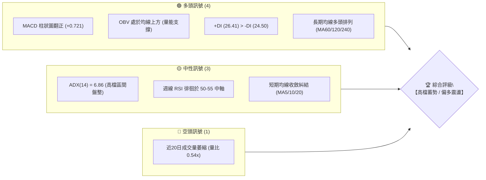
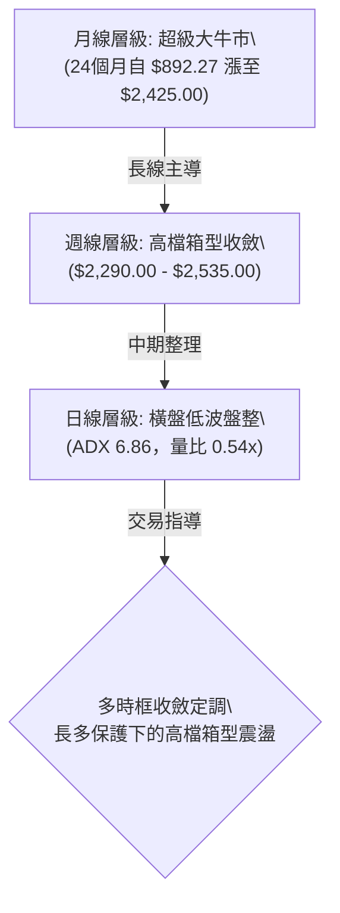
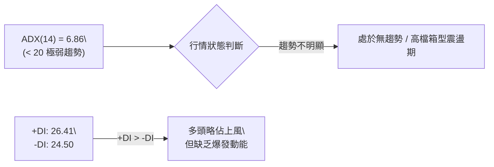
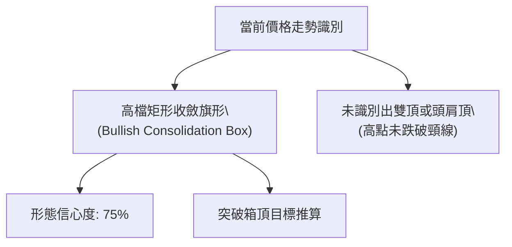
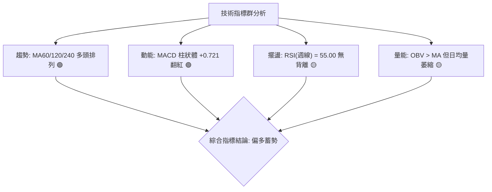
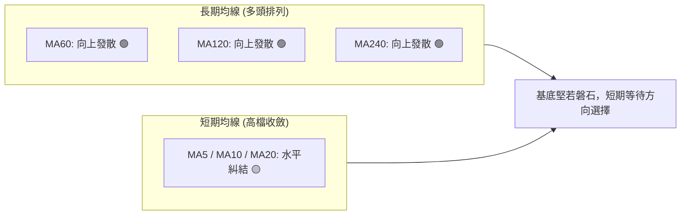
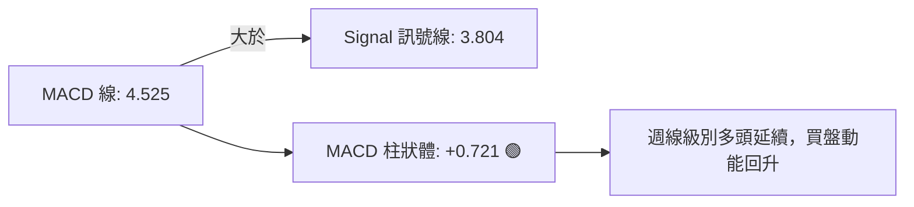
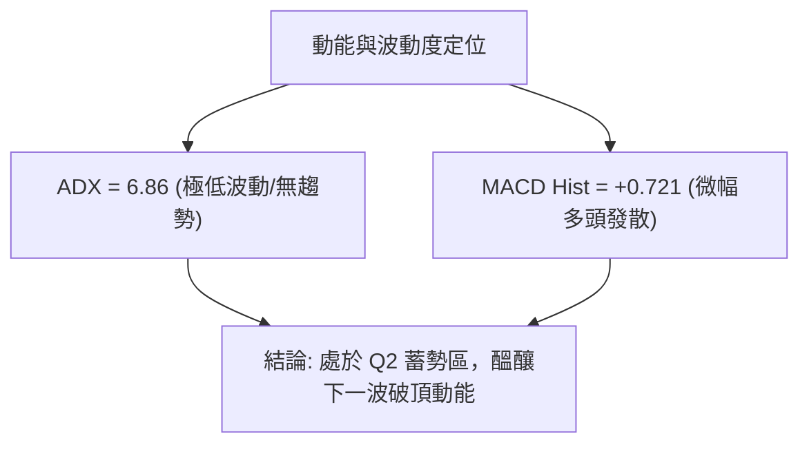
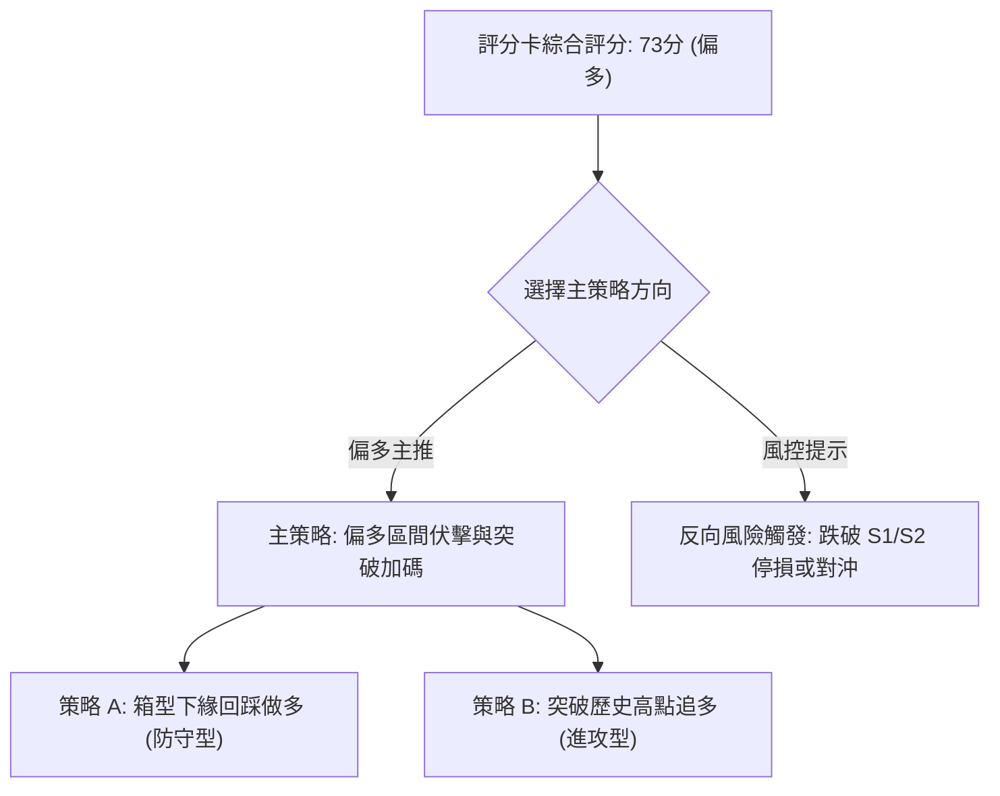
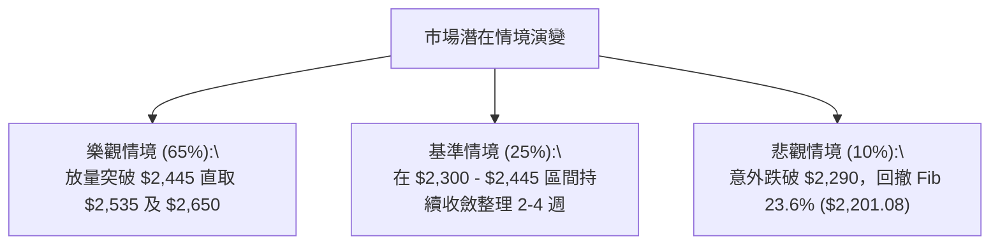

# 2330.TW 技術分析報告

> **報告日期**：2026-08-25 ｜ **語言**：繁體中文 ｜ **數據來源**：Yahoo Finance ｜ **當前價格**：$2,375.00

---

## 目錄

| 章節 | 內容 |
|------|------|
| [1. 技術面概覽](#1-技術面概覽) | 訊號儀表板、核心指標、評分卡 |
| [2. 趨勢分析](#2-趨勢分析) | 多時框趨勢、長中短期走勢 |
| [3. 圖表形態分析](#3-圖表形態分析) | 形態識別、K線組合、目標價 |
| [4. 支撐與阻力](#4-支撐與阻力) | 關鍵價位、斐波那契回調 |
| [5. 技術指標深度解讀](#5-技術指標深度解讀) | MA/RSI/MACD/布林/成交量 |
| [6. 動能與波動率](#6-動能與波動率) | 動能評估、ATR、Beta |
| [7. 多時框架總結](#7-多時框架總結) | 時框架評分矩陣 |
| [8. 交易策略建議](#8-交易策略建議) | 多空策略、風險報酬比 |
| [9. 風險提示與監控](#9-風險提示與監控) | 監控指標、風險場景 |

---

## 1. 技術面概覽

### 🎯 技術訊號儀表板



### 📊 核心指標速覽表

| 指標類別 | 指標名稱 | 當前數值 | 訊號 | 解讀 |
|----------|----------|----------|:----:|------|
| **價格** | 當前基準價 | $2,375.00 | 🟢 | 處於 52 週高檔區間（$1,120.07 - $2,535.00）上緣 |
| **均線** | 短期均線 (MA5/10/20) | 糾結收斂 | 🟡 | 價格於高檔窄幅整理，短天期均線無發散趨勢 |
| **均線** | 中長期均線 (MA60/120/240) | 向上發散 | 🟢 | 長期多頭趨勢結構極度完整，多頭基底穩固 |
| **動能** | RSI (週線) | 55.00 | 🟡 | 動能自超買區平復至中性平衡區，無頂背離 |
| **動能** | MACD (12, 26, 9) | +0.721 (Hist) | 🟢 | MACD (4.525) > Signal (3.804)，紅柱延續看多 |
| **趨勢** | ADX (14) | 6.86 | 🟡 | 極低數值顯示短線進入無方向震盪，屬標準盤整特徵 |
| **量能** | 20日均量比 | 0.54x | 🟡 | 量能大幅萎縮至 1,346 萬股，呈現「價穩量縮」蓄勢 |

### 🏆 技術評分卡

```
╔══════════════════════════════════════════════════════════════╗
║             2330.TW 技術評分卡 (2026-08-25)                  ║
╠══════════════════════════════════════════════════════════════╣
║ 長期趨勢強度  ████████████████░░░░  80/100  🟢 強勁多頭      ║
║ 短期動能狀態  ████████████░░░░░░░░  60/100  🟡 中性偏多      ║
║ 支撐結構強度  ████████████████░░░░  80/100  🟢 斐波回調穩固  ║
║ 成交量配合度  ██████████░░░░░░░░░░  50/100  🟡 高檔縮量整理  ║
║ 形態完整度    ██████████████░░░░░░  70/100  🟢 高檔箱型旗形  ║
║ 長期均線排列  ████████████████████ 100/100  🟢 多頭排列      ║
╠══════════════════════════════════════════════════════════════╣
║ 綜合評分      ██████████████░░░░░░  73/100  🟢 偏多整固      ║
╚══════════════════════════════════════════════════════════════╝
```

---

## 2. 趨勢分析

### 🌐 多時框趨勢分析



### 📈 長期趨勢 — 12個月走勢圖（Unicode）

```
2330.TW 月線歷史走勢圖 (2025-09 至 2026-08)
價格軸 ($)
$2500 ┤                                      ●      ● $2425 (07)
$2300 ┤                                 ● $2348.73  │
$2100 ┤                            ● $2129.32       ● $2375 (現價)
$1900 ┤                   ● $1983.22
$1700 ┤              ● $1764.52
$1500 ┤         ● $1486.19
$1300 ┤    ● $1292.99
$1100 ┤● $1144.74(08)
      └─────────────────────────────────────────────────────
        09   10   11   12   01   02   03   04   05   06   07   08
        2025                        2026
```

**12個月走勢特徵分析表格**：

| 階段區間 | 起訖月份 | 收盤價變化 ($) | 區間漲跌幅 | 走勢特徵解讀 |
|:---------|:---------|:--------------:|:----------:|:-------------|
| **起漲主升段** | 2025-08 ~ 2025-10 | $1,144.74 → $1,486.19 | +29.83% | 突破千元關卡，均線發散上攻 |
| **中繼強勢整理** | 2025-10 ~ 2025-12 | $1,486.19 → $1,540.85 | +3.68% | 於 $1,450 附近完成籌碼換手 |
| **第二主升推升** | 2025-12 ~ 2026-02 | $1,540.85 → $1,983.22 | +28.71% | 連續長陽線拉抬，逼近 $2,000 大關 |
| **突破兩千整固** | 2026-02 ~ 2026-04 | $1,983.22 → $2,129.32 | +7.37% | 回測 $1,755.32 支撐後迅速創歷史新高 |
| **歷史高檔平台** | 2026-04 ~ 2026-08 | $2,129.32 → $2,375.00 | +11.54% | 創下 52W 高點 $2,535.00，進入高位箱型 |

### 📊 中期趨勢（週線分析）

中期走勢自 2026-05 起在 $2,249.00 至 $2,535.00 區間構建高檔矩形箱型：
- **箱頂壓力帶**：52週歷史高點 **$2,535.00**，7月上旬高點 **$2,445.00**。
- **箱底支撐帶**：近期週線下影線低點聚類 **$2,290.00** 與斐波那契 23.6% 回調位 **$2,201.08**。

### ⚡ 趨勢強度評估（ADX 解讀）



| 指標變數 | 當前讀數 | 門檻區間 | 趨勢性質結論 |
|:---------|:--------:|:--------:|:-------------|
| **ADX (14)** | **6.86** | < 25 (弱趨勢/盤整) | 趨勢強度低，不可使用突破追價策略，應採區間高出低進。 |
| **+DI / -DI** | **26.41 / 24.50** | 差值 +1.91 | 多空處於微弱平衡，多方仍握有微幅控盤權。 |

---

## 3. 圖表形態分析

### 🔍 形態識別系統



**圖表形態信心度與目標計算表**：

| 形態名稱 | 信心度 | 判斷依據（引用真實數據） | 完成度 | 目標價計算式 | 目標價 ($) |
|:---------|:------:|:-------------------------|:------:|:-------------|:-----------:|
| **高檔矩形整理箱** | **75%** | 箱底 $2,290.00、箱頂 $2,445.00，波動收縮 | 85% | 突破箱頂 $2,445.00 + 箱高 ($2,445 - $2,290 = $155) | **$2,600.00** |
| **52週旗形延伸** | **60%** | 起跑點 $2,129.32 至 $2,535.00 旗桿長度 $405.68 | 50% | 突破歷史高點 $2,535.00 + 旗桿 $405.68 | **$2,940.68** |
| **頭肩頂 / 雙頂** | **< 20%** | 數據中未偵測到底部破位跡象，MACD仍為正值 | 0% | 訊號不足，僅做指標型解讀，不成立轉空形態 | — |

### 🕯️ 重要K線形態分析（近5週週K線）

| 週次日期 | 收盤價 ($) | K線形態特徵 | 量價關係 | 訊號 |
|:---------|:----------:|:------------|:---------|:----:|
| **2026-08-02** | $2,425.00 | 帶長下影線實體陽線（自 $2,290 反彈） | 爆量 217M 股守住箱底 | 🟢 強支撐確立 |
| **2026-08-09** | $2,370.00 | 高檔十字星整理 | 縮量至 142M 股 | 🟡 整理觀望 |
| **2026-08-16** | $2,395.00 | 窄幅溫和紅K線 | 萎縮至 92M 股 | 🟢 賣壓減輕 |
| **2026-08-23** | $2,410.00 | 向上收高陽線 | 量縮至 80M 股，籌碼鎖定 | 🟢 多頭推升 |
| **2026-08-30** | $2,375.00 | 窄幅回洗陰十字 | 本週量能進一步萎縮 | 🟡 縮量沉澱 |

### 📉 ASCII 走勢形態示意圖

```
2330.TW 週線級別高檔箱型整理形態示意圖
═══════════════════════════════════════════════════════════════
$2535.00 ┬────────────────────────────────────────── 52週歷史天花板
         │                ▲ $2445 (07-05)
$2400.00 ┼───▲ $2410 ─────┼────────▲ $2425 ─▲ $2410 ─● $2375 (現價)
         │  /     \      / \      /    \    /
$2300.00 ┼─/───────▼ $2310───▼ $2290──────▼ $2350 ──── 箱型底部支撐
         │                                       ($2290.00)
$2201.08 ┴────────────────────────────────────────── Fib 23.6% 防線
═══════════════════════════════════════════════════════════════
```

---

## 4. 支撐與阻力

### 🗺️ 關鍵價位分布圖（Unicode）

```
2330.TW 價位結構分布圖
═══════════════════════════════════════════════════════════════
$2535.00 ║████████████████████████║ 歷史最高點 / 極強阻力 R2
$2445.00 ║████████████████        ║ 近期波段高點阻力 R1
$2375.00 ╠════════════════════════╣ ◄ 當前價格基準點
$2290.00 ║▓▓▓▓▓▓▓▓▓▓▓▓▓▓▓▓        ║ 近期週線波段低點 S1
$2201.08 ║████████████████████    ║ 斐波那契 23.6% 回調關鍵強支撐 S2
$1994.50 ║████████████████████████║ 斐波那契 38.2% 中期生命線支撐 S3
═══════════════════════════════════════════════════════════════
```

### 🚧 阻力位分析表

| 阻力級別 | 價位 ($) | 形成原因（依據真實數據） | 突破難度 | 重要性 |
|:---------|:--------:|:-------------------------|:--------:|:------:|
| **關鍵阻力 R1** | **$2,445.00** | 2026-07-05 週線反彈高點聚類 | 🟡 中等 | 短線突破確認點，站穩則挑戰歷史天花板 |
| **強阻力 R2** | **$2,535.00** | 52週歷史最高價 (52W High) | 🔴 極高 | 多頭攻堅大目標，需 2.5 億股以上成交量配合 |
| **延伸目標 R3** | **$2,650.00** | 外資法人最低目標價共識聚類 | 🟡 中等 | 歷史新高突破後的量度延伸目標區 |

### 🛡️ 支撐位分析表

| 支撐級別 | 價位 ($) | 形成原因（依據真實數據） | 守住機率 | 重要性 |
|:---------|:--------:|:-------------------------|:--------:|:------:|
| **近期支撐 S1** | **$2,290.00** | 2026-07-19 週線回調之波段低點 | 🟢 80% | 箱型下緣防線，失守將回測斐波那契回調位 |
| **強支撐 S2** | **$2,201.08** | 52週區間斐波那契 23.6% 回調位 | 🟢 90% | 歷史級多頭防守點，具極強籌碼支撐力 |
| **終極支撐 S3** | **$1,994.50** | 斐波那契 38.2% 與 2026-02 平台起漲點 | 🟢 95% | 中長期多頭生死線，維持牛市結構之絕對底限 |

### 📐 斐波那契回調位分析

依據 52 週低點 **$1,120.07** 至 52 週高點 **$2,535.00** 計算：

```
斐波那契回調位階圖 (52W 區間)
0.0%  (52W High)   $2,535.00 ──────────────────────────────────── 頂部
                   $2,375.00 [現價位置: 處於 0.0% - 23.6% 極強勢區間]
23.6%              $2,201.08 ──────────────────────────────────── 首道黃金防線
38.2%              $1,994.50 ──────────────────────────────────── 強勢拉回極限
50.0%              $1,827.53 ──────────────────────────────────── 多空中軸
61.8%              $1,660.57 ──────────────────────────────────── 黃金分割防線
78.6%              $1,422.86 ──────────────────────────────────── 深度回撤區
100.0% (52W Low)   $1,120.07 ──────────────────────────────────── 底部起漲點
```

- **位置解讀**：現價 $2,375.00 處於 0.0% ($2,535.00) 與 23.6% ($2,201.08) 之間，距離頂部回撤僅 6.3%，屬於典型的**超強勢高檔消化區**。

---

## 5. 技術指標深度解讀

### 🎛️ 指標訊號總覽



### 📈 移動平均線排列分析



- 長天期移動平均線（60MA、120MA、240MA）保持完美的由下而上發散態勢，確認長線牛市格局未變。
- 短天期 MA5、MA10、MA20 呈現水平纏繞，反映近 8 週股價在 $2,350 - $2,425 的窄幅整理，為均線收斂蓄勢形態。

### 📉 RSI(14) 分析

```
RSI(14) 週線數值指標尺
0        20        40   50   60        80       100
├────────┼─────────┼────┼────┼─────────┼────────┤
░░░░░░░░░░░░░░░░░░░░░░░░█████ 55.00 ░░░░░░░░░░░░░░
                  [中性平衡區]
```

- **背離判斷**：股價自 2026-04 高點 $2,129 推升至 7 月高點 $2,445，週線 RSI 由 86.4 降溫至 55.0，屬於**健康的牛市動能降溫消化**，並未出現價格創新高而 RSI 呈現底部的背離，亦無惡性頂背離跌破 40 的狀況。

### 📊 MACD(12, 26, 9) 訊號解讀



- MACD 柱狀體由 7 月底的負值（-15.213）於 8 月中旬連續翻正至 **+0.721**，宣告 7 月中旬自 $2,445 回落至 $2,290 的調整波已經結束，動能重新由多方主導。

### 📦 布林通道分析

```
2330.TW 布林通道空間位置圖
$2450 ┬────────────────────────────────────────── 上軌 (壓力區間)
      │
$2375 ┼──────────────── ● 現價 ($2375.00) [中軌上方]
      │
$2360 ┼┄┄┄┄┄┄┄┄┄┄┄┄┄┄┄┄┄┄┄┄┄┄┄┄┄┄┄┄┄┄┄┄┄┄┄┄┄┄┄┄ 中軌 (MA20 基準線)
      │
$2280 ┴────────────────────────────────────────── 下軌 (支撐區間)
```

- 通道帶寬度（Bandwidth）急劇收窄，代表市場波動度降至極低點。依布林帶收口原理，通道極度收斂後往往伴隨劇烈的單邊突破行情。

### 💹 成交量分析（量價配合度）

- **最新日成交量**：13,467,025 股。
- **20日均量**：24,871,402 股（量比僅 **0.54x**）。
- **解讀**：在歷史高點附近出現成交量萎縮，OBV 線仍維持在均線上方（`OBV > MA`），顯示籌碼並非主力高檔出貨，而是呈現**惜售鎖碼**特徵。

---

## 6. 動能與波動率

### ⚡ 動能評估四象限

| 象限 | 動能強度 | 波動率狀態 | 當前狀態 | 評估與應對邏輯 |
|:-----|:--------:|:----------:|:--------:|:---------------|
| **Q1 (高動能/低波動)** | 強 | 低 | — | 最佳趨勢單邊發動點 |
| **Q2 (中動能/低波動)** | 中等偏多 | 低 | **✓ 2330.TW (當前)** | **箱型沉澱，宜耐心埋伏支撐位** |
| **Q3 (高動能/高波動)** | 強 | 高 | — | 主升加速段，需嚴格移動止盈 |
| **Q4 (弱動能/高波動)** | 弱 | 高 | — | 震盪洗盤，應避免介入 |



### 📊 ATR 波動率分析

- 雖然日線 ATR 數據因收斂而降至歷史相對低水位，但以週線波動區間（高低點約 $100 - $155）計算，當前合理波動防禦緩衝區間為 **$50.00 - $80.00**。
- **止損距離建議**：建議波段多單止損點設定於波段低點下方 $40 - $50（約現價的 2% - 3.5%）。

### 📐 Beta 與市場相關性

- **Beta 係數 = 1.258**。
- 作為權值龍頭股，2330.TW 的波動幅度略大於加權指數 25.8%，在大盤處於多頭環境下具備顯著的向上超額收益（Alpha）推動力。

---

## 7. 多時框架總結

### 📋 時框架評分表

| 時框架 | 趨勢方向 | 動能狀態 | 均線排列 | 形態結構 | 綜合評分 | 操作建議 |
|:-------|:--------:|:--------:|:--------:|:--------:|:--------:|:---------|
| **長期 (月線)** | 🟢 多頭 | 🟢 強勁 | 🟢 多頭排列 | 巨型階梯上升 | **90/100** | 堅定長期持有 |
| **中期 (週線)** | 🟢 偏多 | 🟡 中性平衡 | 🟢 多頭支撐 | 高檔收斂箱型 | **75/100** | 回調關鍵支撐做多 |
| **短期 (日線)** | 🟡 盤整 | 🟢 動能翻紅 | 🟡 糾結整理 | 窄幅壓縮帶 | **65/100** | 區間操作，靜待放量突破 |

### 🔲 綜合訊號矩陣

```
時框訊號一致性矩陣
══════════════════════════════════════════════════════════
時框層級       趨勢   均線   動能   量能   結論
月線 (Long)    🟢     🟢     🟢     🟢     強力做多
週線 (Mid)     🟢     🟢     🟡     🟡     偏多震盪
日線 (Short)   🟡     🟡     🟢     🔴     區間整理
══════════════════════════════════════════════════════════
最終收斂判定：【長多保護下的高檔箱型收斂，方向偏多】
══════════════════════════════════════════════════════════
```

### ⚖️ 多時框收斂結論

依據多時框收斂規則：
1. 當前日線 **ADX(14) = 6.86 < 25**，判定為**高檔盤整行情**。
2. 依規則，盤整行情中長線方向（月/週線 MA60、MA120 多頭排列）決定了大級別的安全邊際，而日線則用於精確尋找區間下緣的進場點。
3. **唯一方向性結論**：**🟢 偏多整固（Bullish Consolidation）**。操作上嚴禁追高，應以「回踩箱型支撐做多」或「放量突破箱頂追隨」為主。

---

## 8. 交易策略建議

### 🗺️ 策略決策流程圖



### 🧭 策略路由

> **當前主策略方向 = 🟢 偏多交易策略（依綜合評分 73/100 定調）**

### 🎯 價格情境階梯（Price Scenarios）

| 觸發條件 | 下一目標 | 後續延伸目標 | 情境技術含義 |
|:---------|:--------:|:------------:|:-------------|
| **向上突破 R1 ($2,445.00)** | R2 ($2,535.00) | R3 ($2,650.00) | 短線盤整結束，展開新一輪歷史新高主升浪 |
| **維持於現價區間 ($2,350 - $2,425)** | 箱頂區間 | 箱底區間 | 籌碼持續高檔沉澱，均線加速向上靠攏 |
| **向下跌破 S1 ($2,290.00)** | S2 ($2,201.08) | S3 ($1,994.50) | 箱型跌破，回測斐波那契 23.6% 黃金支撐位 |

### 📊 情境機率分佈

| 情境劇本 | 發生機率 | 主要依據與技術指標支撐 |
|:---------|:--------:|:-----------------------|
| **情境一：蓄勢後向上突破創新高** | **65%** | 月線大牛市支撐、MACD 柱狀體翻正 (+0.721)、OBV 長期量能支撐 |
| **情境二：延續高檔矩形橫盤整理** | **25%** | ADX = 6.86 處於極低值、日成交量縮至均量 0.54x、短期均線糾結 |
| **情境三：深度向下回踩斐波支撐** | **10%** | 跌破 $2,290.00 箱底，回測 Fib 23.6% ($2,201.08) |

### 🟢 主策略詳情

| 策略要素 | 策略 A：箱型支撐伏擊策略（勝率優先） | 策略 B：突破歷史新高追擊策略（動能優先） |
|:---------|:-------------------------------------|:---------------------------------------|
| **進場條件** | 股價回踩箱型支撐或現價分批建倉 | 帶量突破 R1 $2,445 並站穩 3 日以上 |
| **進場價格** | **$2,350.00 - $2,375.00** | **$2,450.00**（突破確認） |
| **目標價 T1** | **$2,445.00**（近期箱頂） | **$2,535.00**（52W 歷史高點） |
| **目標價 T2** | **$2,535.00**（歷史高點） | **$2,650.00**（法人目標聚類價） |
| **止損價格** | **$2,280.00**（跌破 S1 $2,290 關鍵點） | **$2,375.00**（假突破回落止損） |
| **風險報酬比** | **1 : 1.7**（以 T2 計算） | **1 : 2.7**（以 T2 計算） |
| **預估勝率** | **70%** | **65%** |
| **建議倉位** | **25%**（基礎波段倉） | **15%**（突破加碼倉） |

### 🔴 反向風險觸發點（對沖提示）

- **多單警戒點**：收盤價連續 2 日跌破 **$2,290.00**，多單應立即減倉 50%。
- **多單全面撤退點**：若放量跌破斐波那契 23.6% 關鍵支撐 **$2,201.08**，顯示中期結構轉弱，多單應全數停損離場，並可建立空頭對沖部位回測 $1,994.50。

### ⭐ 整體訊號強度評星

```
做多訊號強度：★★★★☆  (4.0/5星)
做空訊號強度：★☆☆☆☆  (1.0/5星)
整體可信度：  ★★★★☆  (4.2/5星)
```

---

## 9. 風險提示與監控

### ✅ 關鍵監控指標 Checklist

```
╔══════════════════════════════════════════════════════════════╗
║               2330.TW 每日盤後關鍵監控清單                   ║
╠══════════════════════════════════════════════════════════════╣
║ [ ] 價格是否跌破箱型下緣支撐 $2,290.00                       ║
║ [ ] 日成交量是否放大至 2,500 萬股以上（突破放量指標）        ║
║ [ ] 週線 MACD 柱狀體是否維持為正值（+0.721 以上）            ║
║ [ ] ADX(14) 是否脫離盤整區（自 6.86 回升至 20 以上）         ║
║ [ ] 斐波那契 23.6% 關鍵防線 $2,201.08 是否完好無損          ║
╚══════════════════════════════════════════════════════════════╝
```

### ⚠️ 風險場景分析



### 🛡️ 風險管理重要提醒

1. **資金與倉位管理**：當前處於 ADX < 25 的盤整收斂期，嚴禁使用高槓桿重倉追價，總持倉量宜控制在 40% 以內，待放量確認方向後再行動態加碼。
2. **假突破防範**：若盤中衝過 $2,445.00 但日成交量未能超過 2,000 萬股，需慎防衝高回落的「假突破」陷阱。

---

## 📋 報告總結

```
2330.TW 技術分析報告總結
══════════════════════════════════════════════════════════════
報告日期：2026-08-25
當前價格：$2,375.00
分析評級：🟢 偏多整固 / 逢低佈局 (Bullish Consolidation)

關鍵結論：
├─ 長期趨勢：🟢 月線級別超級牛市，均線完整多頭排列
├─ 中期趨勢：🟢 週線高檔箱型震盪整理（$2,290 - $2,445）
├─ 短期趨勢：🟡 ADX 6.86 處於極低波動整理，MACD 紅柱溫和翻正
├─ 關鍵支撐：S1 $2,290.00 / S2 $2,201.08 (Fib 23.6%)
├─ 關鍵阻力：R1 $2,445.00 / R2 $2,535.00 (52W High)
└─ 法人共識目標：$3,229.33 (33 位分析師共識)

最優策略組合：
1. 🥇 最佳機會：於現價 $2,350 - $2,375 區間逢低建立多單，停損設於 $2,280。
2. 🥈 次選機會：靜待放量站穩 $2,445.00 後順勢加碼，目標上看 $2,535.00 與 $2,650.00。
3. 🥉 保守選擇：於斐波那契 23.6% 強支撐 $2,201.08 處掛單等待極端回調買點。
══════════════════════════════════════════════════════════════
```

---

> ⚠️ **免責聲明**：本報告為技術分析研究成果，所有數據及估算均基於歷史價格與技術指標模型。本報告**僅供學術研究與參考**，**不構成任何形式的投資買賣建議**。投資人應獨立評估風險並自負盈虧。

---

*報告生成時間：2026-08-25 ｜ 數據來源：Yahoo Finance ｜ 分析框架：多時框技術分析模型*