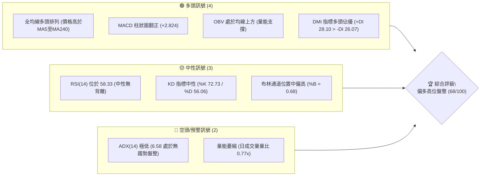
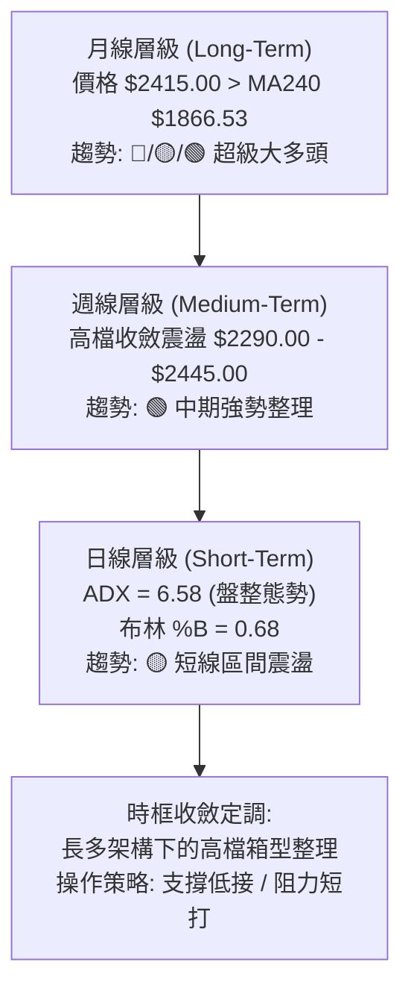
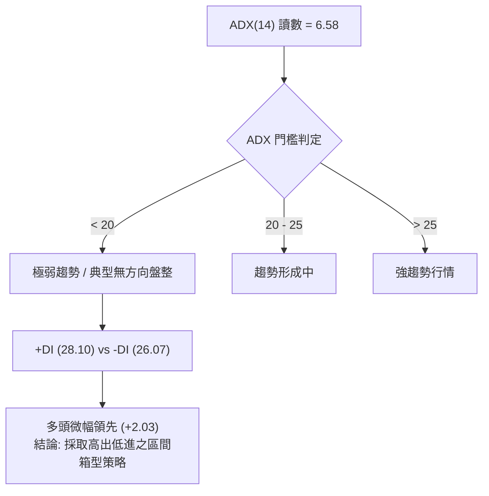
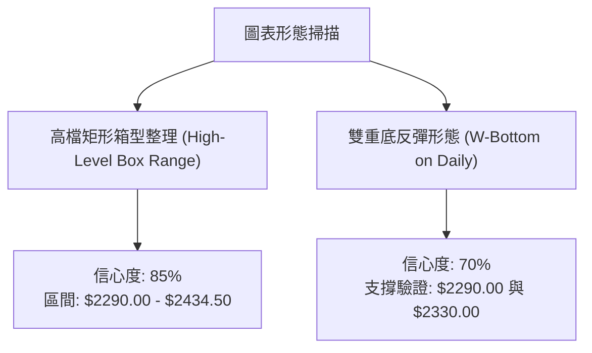
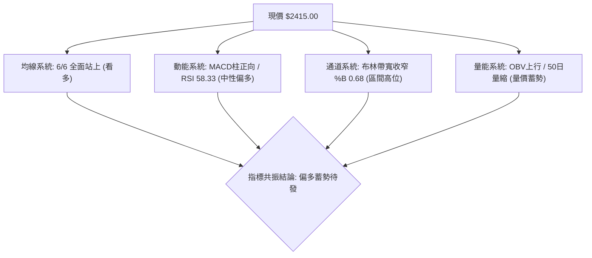
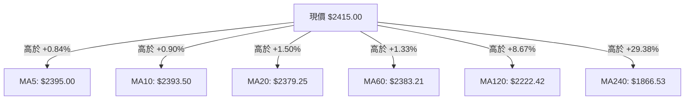
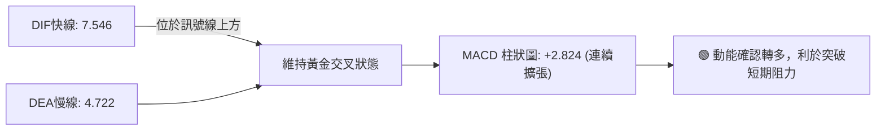
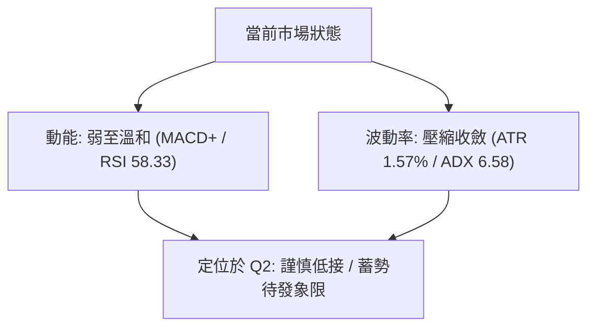
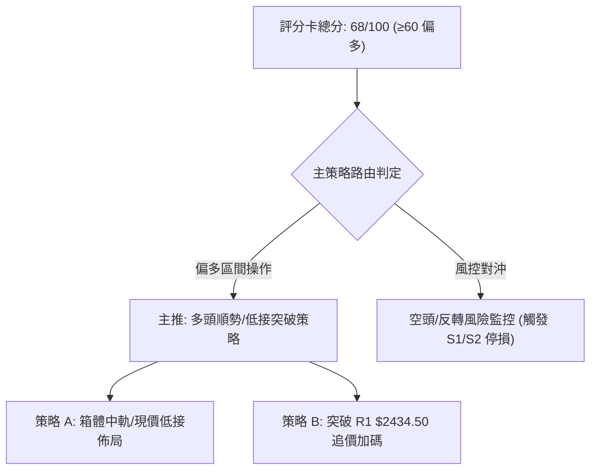
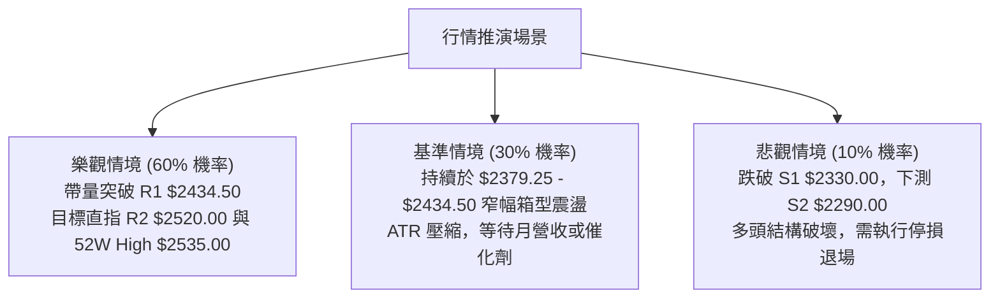

# 2330.TW 技術分析報告

> **報告日期**：2026-08-27 ｜ **語言**：繁體中文 ｜ **數據來源**：Yahoo Finance ｜ **當前價格**：$2415.00

---

## 目錄

| 章節 | 內容 |
|------|------|
| [1. 技術面概覽](#1-技術面概覽) | 訊號儀表板、核心指標、評分卡 |
| [2. 趨勢分析](#2-趨勢分析) | 多時框趨勢、長中短期走勢 |
| [3. 圖表形態分析](#3-圖表形態分析) | 形態識別、K線組合、目標價 |
| [4. 支撐與阻力](#4-支撐與阻力) | 關鍵價位、斐波那契回調 |
| [5. 技術指標深度解讀](#5-技術指標深度解讀) | MA/RSI/MACD/布林/成交量 |
| [6. 動能與波動率](#6-動能與波動率) | 動能評估、ATR、Beta |
| [7. 多時框架總結](#7-多時框架總結) | 時框架評分矩陣 |
| [8. 交易策略建議](#8-交易策略建議) | 多空策略、風險報酬比 |
| [9. 風險提示與監控](#9-風險提示與監控) | 監控指標、風險場景 |

---

## 1. 技術面概覽

### 🎯 技術訊號儀表板



### 📊 核心指標速覽表

| 指標類別 | 指標名稱 | 當前數值 | 訊號 | 解讀 |
|----------|----------|----------|------|------|
| **價格** | 當前價格 | $2415.00 | 🟢 | 處於52週區間頂端 91.5% 位置，長期多頭強勁 |
| **均線** | MA20 | $2379.25 | 🟢 | 價格在MA20上方（乖離 +1.50%），短期下檔具支撐 |
| **均線** | MA50 | $2393.30 | 🟢 | 價格在MA50上方（乖離 +0.91%），中期多頭結構完好 |
| **均線** | MA200 | $1974.40 | 🟢 | 價格遠高於長期年線（乖離 +22.32%），長多格局不變 |
| **動能** | RSI(14) | 58.33 | 🟡 | 位於50中軸上方偏多區間，未達超買門檻，無背離 |
| **動能** | MACD(12,26,9) | Hist: +2.824 | 🟢 | MACD (7.546) > Signal (4.722)，柱狀圖持續擴張 |
| **波動** | ATR(14) | $37.86 | 🟡 | 佔股價 1.57%，波動度適中收斂，適合區間交易 |

### 🏆 技術評分卡

```
╔══════════════════════════════════════════════════════════════╗
║              技術評分卡 — 2330.TW (2026-08-27)              ║
╠══════════════════════════════════════════════════════════════╣
║ 趨勢強度 (Trend)      ████████░░░░░░░░░░░░  40/100  🟡 (ADX極低)   ║
║ 動能指標 (Momentum)   ██████████████░░░░░░  70/100  🟢 (MACD轉正)  ║
║ 支撐穩定度 (Support)  ████████████████░░░░  80/100  🟢 (S1-S3堅實) ║
║ 成交量配合 (Volume)   ██████████░░░░░░░░░░  50/100  🟡 (量比0.77x) ║
║ 形態完整度 (Pattern)  ██████████████░░░░░░  70/100  🟢 (箱型整理)  ║
║ 均線排列 (Moving Avg) ████████████████████ 100/100  🟢 (全面多頭)  ║
╠══════════════════════════════════════════════════════════════╣
║ 綜合評分 (Overall)    █████████████░░░░░░░  68/100  🟢 偏多箱型    ║
╚══════════════════════════════════════════════════════════════╝
```

---

## 2. 趨勢分析

### 🌐 多時框趨勢分析



### 📈 長期趨勢 — 12個月走勢圖（Unicode）

```
2330.TW 月線走勢圖（過去12個月: 2025-08 至 2026-08）
價格軸 ($)
$2500 ┤                                           ● $2425 (07)
$2400 ┤                                        ● $2410 (06)   ● $2415 (08-現價)
$2300 ┤                                     ● $2348 (05)
$2100 ┤                               ● $2129 (04)
$1900 ┤                         ● $1983 (02)
$1700 ┤                   ● $1764 (01)  ● $1755 (03)
$1500 ┤             ● $1486 (10)  ● $1540 (12)
$1400 ┤                ● $1426 (11)
$1200 ┤       ● $1292 (09)
$1100 ┤ ● $1144 (08)
      └───────────────────────────────────────────────────────────────
        08-25 09-25 10-25 11-25 12-25 01-26 02-26 03-26 04-26 05-26 06-26 07-26 08-26
```

**走勢特徵分析表格**：

| 階段區間 | 起訖價格 | 累積漲跌幅 | 走勢特徵解讀 |
|----------|----------|------------|--------------|
| 2025/08 - 2025/12 | $1144.74 → $1540.85 | +34.60% | 主升段初段，突破千元後量價齊揚，沿短期均線穩健推升 |
| 2025/12 - 2026/04 | $1540.85 → $2129.32 | +38.19% | 突破兩千大關，期間於 2026/03 出現急洗盤至 $1755.32 隨即V型反轉 |
| 2026/04 - 2026/08 | $2129.32 → $2415.00 | +13.42% | 創下 52 週歷史高點 $2535.00 後進入高位強勢震盪，斜率放緩 |

### 📊 中期趨勢（週線分析）

```
中期週線區間箱型結構示意圖 ($)
$2535.00 ┬────────────────────────────────────────── 52W High (強阻力頂)
         │
$2445.00 ┼──────●─────────────────────────────────── 07/05 週波段高點
         │      │      ●                             08/02 週波段高點 ($2425.00)
$2415.00 ┼──────┼──────┼──────●────────────────────── 當前現價 ($2415.00)
         │      │      │      │
$2340.00 ┼──────●──────┼──────┼────────────────────── 箱體內部支撐線
         │             │      │
$2290.00 ┴─────────────●──────┴────────────────────── S2 週波段防守底 (07/19)
```

### ⚡ 趨勢強度評估（ADX 解讀）



| 指標變數 | 當前數值 | 參考臨界值 | 狀態定調 |
|----------|----------|------------|----------|
| ADX(14) | 6.58 | 25.00 | 處於弱趨勢/高檔無方向盤整區間 |
| +DI (多頭動能) | 28.10 | - | 多頭佔有優勢 |
| -DI (空頭動能) | 26.07 | - | 空方力道受壓制 |
| 多空差值 (+DI - -DI) | +2.03 | 0.00 | 多方微幅主導，但尚未爆發單邊行情 |

---

## 3. 圖表形態分析

### 🔍 形態識別系統



**形態信心度與目標價評估表**：

| 形態類別 | 信心度 | 判斷依據（引用數據） | 完成度 | 目標價（附精確計算式） |
|----------|--------|----------------------|--------|------------------------|
| 高檔矩形箱型 | 85% | 箱頂為阻力位 R1 $2434.50，箱底為支撐位 S2 $2290.00（07/19低點） | 80% | 向上突破 R1 時：$2434.50 + ($2434.50 - $2290.00) = $2579.00（推算目標） |
| 雙底回升形態 | 70% | 7月中旬下探 S2 $2290.00，8月回測支撐 S1 $2330.00 後回升 | 90% | 頸線 $2425.00 + 形態高度($2425.00 - $2290.00) = $2560.00（推算目標） |

### 🕯️ 重要K線形態分析

| 週/月份 | 收盤價 | K線形態 | 解讀 | 訊號 |
|---------|--------|---------|------|------|
| 2026-07-19 (週) | $2290.00 | 長下影測底線 | 探測近期波段低點 S2 $2290.00 後獲買盤強力承接，確認底部 | 🟢 |
| 2026-08-02 (週) | $2425.00 | 帶量突破紅K | 大量（2.17億股）攻克阻力，確立短線重回上升軌道 | 🟢 |
| 2026-08-23 (週) | $2410.00 | 高位窄幅十字星 | 買賣雙方在 $2400 上方呈現均勢，籌碼沉澱，量能萎縮 | 🟡 |
| 2026-08-30 (週) | $2415.00 | 溫和實體小陽線 | 沿著 MA5 ($2395.00) 緩步爬升，多方維持防守推進格局 | 🟢 |

### 📉 ASCII 走勢形態示意圖

```
高檔箱型整理與雙底頸線示意圖 ($)
$2434.50 ───┬─────────────────────────● (R1 阻力箱頂 / 頸線區)
            │                        / 
$2415.00 ───┼───────────────────────● (現價 / 蓄勢挑戰突破)
            │                      /  
$2379.25 ───┼──────────●──────────● (MA20 / 中軌支撐)
            │         / \        /    
$2330.00 ───┼────────●   \      ● (S1 次低點 08月中旬)
            │             \    /      
$2290.00 ───┴──────────────●──● (S2 主低點 07/19 — 雙底確立)
```

---

## 4. 支撐與阻力

### 🗺️ 關鍵價位分布圖（Unicode）

```
╔══════════════════════════════════════════════════════════════════╗
║              2330.TW 價位結構分布圖 (由數據直接計算)             ║
╠══════════════════════════════════════════════════════════════════╣
║ $2535.00 ║██████████████████████████████║ 52週歷史高點 (0.0% Fib)      ║
║ $2520.00 ║████████████████████████      ║ 強阻力位 R2 (+4.35%)         ║
║ $2434.50 ║████████████████████████████  ║ 近期波段高點阻力 R1 (+0.81%) ║
║ $2415.00 ╠══════════════════════════════╣ ◄ 當前收盤價 ($2415.00)       ║
║ $2379.25 ║▓▓▓▓▓▓▓▓▓▓▓▓▓▓▓▓▓▓            ║ 布林中軌 / MA20 短期支撐     ║
║ $2330.00 ║████████████████████          ║ 近一年波段支撐 S1 (-3.52%)   ║
║ $2290.00 ║████████████████████████      ║ 強支撐位 S2 (-5.18%)         ║
║ $2201.08 ║▓▓▓▓▓▓▓▓▓▓▓▓▓▓▓▓▓▓▓▓▓▓        ║ 斐波那契 23.6% 回調關鍵位    ║
║ $2189.73 ║████████████████████████████  ║ 長期結構防守支撐 S3 (-9.33%) ║
╚══════════════════════════════════════════════════════════════════╝
```

### 🚧 阻力位分析表

| 阻力級別 | 價位 | 形成原因 | 突破難度 | 重要性 |
|----------|------|----------|----------|--------|
| **R1** | $2434.50 | 近一年波段高點聚類，距離現價僅 +0.81%，為箱型頂部 | 中等 🟡 | 關鍵短期分水嶺，帶量突破即啟動攻勢 |
| **R2** | $2520.00 | 52週高點 $2535.00 前的主力密集解套與獲利了結賣壓區 | 高 🔴 | 中期波段強阻力，需成交量顯著放大 |
| **52W High** | $2535.00 | 歷史最高價位聚類點，斐波那契 0.0% 基準點 | 極高 🔴 | 歷史極限心理關卡 |

### 🛡️ 支撐位分析表

| 支撐級別 | 價位 | 形成原因 | 守住機率 | 重要性 |
|----------|------|----------|----------|--------|
| **S1** | $2330.00 | 近期回檔波段低點聚類，接近 MA60 ($2383.21) 下緣防守帶 | 80% 🟢 | 短線多頭防守第一道關卡 |
| **S2** | $2290.00 | 2026-07-19 週波段實體低點，下探布林下軌後的強支撐位 | 90% 🟢 | 中期多空格局分界點，不容有失 |
| **S3** | $2189.73 | 近一年深次回檔密集承接區，鄰近 Fib 23.6% ($2201.08) | 95% 🟢 | 長期多頭護城河核心支撐 |

### 📐 斐波那契回調位分析

> **計算基準**：52週波段低點 $1120.07 至 52週歷史高點 $2535.00（垂直落差 $1414.93）

```
斐波那契回調層級分布：
 0.0%  (52W High) ─── $2535.00  [上方阻力]
                       ▲
 【現價 $2415.00 處於 0.0% 至 23.6% 強勢回調區間】
                       ▼
23.6%              ─── $2201.08  [極強支撐，鄰近 S3 $2189.73]
38.2%              ─── $1994.50  [鄰近 MA200 $1974.40]
50.0%              ─── $1827.53  [鄰近 MA240 $1866.53]
61.8%              ─── $1660.57  [黃金分割深層回調位]
78.6%              ─── $1422.86  [弱勢防守位]
100.0% (52W Low)   ─── $1120.07  [波段起漲點]
```

**解讀**：現價 $2415.00 緊貼 52W High，維持在回調幅度小於 23.6%（$2201.08）的「極度強勢區間」，表明市場買盤甚至不允許價格回測首道黃金分割位，整體大趨勢仍由長期多頭絕對掌控。

---

## 5. 技術指標深度解讀

### 🎛️ 指標訊號總覽



### 📈 移動平均線排列分析



| 均線名稱 | 數值 | 現價乖離率 | 排列特徵 | 訊號解讀 |
|----------|------|------------|----------|----------|
| MA5 | $2395.00 | +0.84% | 短天期糾結向上 | 短線動能回溫 🟢 |
| MA10 | $2393.50 | +0.90% | 與MA5黃金交叉 | 形成短多扣抵 🟢 |
| MA20 | $2379.25 | +1.50% | 向上翻揚 | 短期主防守線 🟢 |
| MA60 | $2383.21 | +1.33% | 走平向上 | 季線支撐強勁 🟢 |
| MA120 | $2222.42 | +8.67% | 穩定爬升 | 半年線中多確立 🟢 |
| MA240 | $1866.53 | +29.38% | 長期向上斜率 | 年線長多格局 🟢 |

### 📉 RSI(14) 分析

```
RSI(14) 讀數進度條:
0 ─────────── 30 ──────────────── 50 ─────── 58.33 ────── 70 ─────────── 100
[  超賣區間  ] [     弱勢區間     ] [    偏多   ▲  ] [    超買區間    ]
進度: ███████████████░░░░░░░░░░░ 58.33%
```

- **超買超賣判定**：數值 58.33 脫離 50 中軸，處於溫和的多頭掌控區，未觸及 70 超買警戒線，具備向上推進空間。
- **背離分析**：日線與近期週線 RSI 隨價格同步震盪回升，**無頂背離亦無底背離**現象，指標忠實反映價格走勢。

### 📊 MACD(12,26,9) 訊號解讀



### 📦 布林通道分析

```
布林通道結構圖 (帶寬收窄):
$2477.51 ┬────────────────────────────────────────── 布林上軌 (Upper Band)
         │                                         
$2415.00 ┼─────────────────────────●──────────────── 現價 ($2415.00, %B = 0.68)
         │
$2379.25 ┼────────────────────────────────────────── 布林中軌 (Middle Band / MA20)
         │
$2280.99 ┴────────────────────────────────────────── 布林下軌 (Lower Band)
```

- **位置與帶寬**：%B 為 0.68，股價位於中軌與上軌之間；通道上下軌間距收斂至約 $196.52，暗示波動度壓縮即將迎來方向性突破。

### 💹 成交量分析（量價配合度）

- **量比分析**：最新成交量 17,662,672 股，相對 20 日均量（22,950,853 股）之量比為 **0.77x**，呈現「價漲量縮」的高檔沉澱特徵。
- **OBV 趨勢**：數據顯示 `OBV > MA`，能量潮指標領先走在均線之上，顯示大戶籌碼並未於高檔撤退，量能整體維持多頭結構支撐。

---

## 6. 動能與波動率

### ⚡ 動能評估四象限

| 象限分區 | 動能強度 | 波動率狀態 | 歷史特徵 | 2330.TW 當前定位與評估 |
|----------|----------|------------|----------|------------------------|
| **第一象限 (Q1)** | 強動能 | 低波動 | 穩定趨勢飆升 | - |
| **第二象限 (Q2)** | 弱動能 | 低波動 | 區間蓄勢盤整 | **✓ 當前定位** (ADX 6.58 / ATR 1.57%，高檔築底) |
| **第三象限 (Q3)** | 強動能 | 高波動 | 突破單邊噴出 | - (突破 R1 後預期進入此象限) |
| **第四象限 (Q4)** | 弱動能 | 高波動 | 震盪洗盤出貨 | - |



### 📊 ATR 波動率分析

```
ATR(14) 波動區間計算:
當前價格:      $2415.00
ATR(14) 數值:  $  37.86 (佔比 1.57%)
1.0x ATR 緩衝: $  37.86 → 短線波動安全邊際
1.5x ATR 止損: $  56.79 → 建議標準波段止損距離 (保護價位: $2358.21)
2.0x ATR 止損: $  75.72 → 寬幅波段防守點 (保護價位: $2339.28)
```

### 📐 Beta 與市場相關性

- **Beta 係數**：**1.258**
- **解讀**：具備高於大盤 25.8% 的彈性與進攻性。當台股加權指數呈現多頭推進時，2330.TW 將提供更強勁的超額 Beta 收益，但於回檔時亦須嚴設防守。

---

## 7. 多時框架總結

### 📋 時框架評分表

| 時框架 | 趨勢方向 | 動能指標 | 均線排列 | 圖表形態 | 綜合評分 | 操作建議 |
|--------|----------|----------|----------|----------|----------|----------|
| **月線層級** | 🟢 強烈多頭 | 🟢 超強動能 | 🟢 完美多頭 | 歷史突破箱體 | **95/100** | 長期核心多單續抱 |
| **週線層級** | 🟢 偏多震盪 | 🟡 動能修復 | 🟢 多頭均線 | 雙底頸線測試 | **75/100** | 逢拉回支撐加碼 |
| **日線層級** | 🟡 盤整向上 | 🟢 MACD轉正 | 🟢 全線站上 | 窄幅箱型整理 | **68/100** | 依據箱體邊界低接 |

### 🔲 綜合訊號矩陣

```
時框一致性分析矩陣:
┌───────────┬──────────────┬──────────────┬──────────────┐
│ 指標類別  │ 日線 (短期)  │ 週線 (中期)  │ 月線 (長期)  │
├───────────┼──────────────┼──────────────┼──────────────┤
│ 均線系統  │ 🟢 站上全部  │ 🟢 站上全部  │ 🟢 完美發散  │
│ 動能 (RSI)│ 🟡 58.33     │ 🟡 55.0-58.3 │ 🟢 65+ 偏強  │
│ 趨勢 (ADX)│ 🔴 6.58 盤整 │ 🟡 趨勢整理  │ 🟢 強烈多頭  │
│ MACD 訊號 │ 🟢 柱狀轉正  │ 🟢 翻紅擴張  │ 🟢 零軸上方  │
└───────────┴──────────────┴──────────────┴──────────────┘
```

### ⚖️ 多時框收斂結論

- **收斂規則判斷**：日線 ADX(14) 讀數為 **6.58 (<25)**，明確定義當前短線處於**無方向盤整行情**；而週線與月線（價格遠高於 MA50 $2393.30、MA200 $1974.40）維持**長期超級多頭**。
- **時框取捨機制**：依據多時框收斂規則，以**中長期多頭為主導方向**，短線日線盤整僅作為尋找進場點之依據。
- **唯一方向性結論**：**🟢 偏多箱型操作（中長多架構下之高檔震盪蓄勢）**。

---

## 8. 交易策略建議

### 🗺️ 策略決策流程圖



### 🧭 策略路由

**當前主策略方向 = 🟢 偏多高檔箱型交易（依綜合評分 68/100，主推多頭策略）**

### 🎯 價格情境階梯（Price Scenarios）

| 觸發條件 | 第一目標 (T1) | 後續延伸 (T2) | 情境含義 |
|----------|---------------|---------------|----------|
| **帶量突破 R1 $2434.50** | R2 $2520.00 | 52W High $2535.00 | 短線整理結束，發動波段主升攻勢 |
| **維持 $2379.25 - $2434.50 震盪** | $2434.50 | - | 箱體高位蓄勢，等待量能放大 |
| **跌破 S1 $2330.00** | S2 $2290.00 | S3 $2189.73 | 短線轉弱，回測雙底關鍵防守區 |

### 📊 情境機率分佈

| 情境劇本 | 發生機率 | 主要技術指標依據 |
|----------|----------|------------------|
| **向上突破 / 延續反彈** | **60%** | MACD 柱狀擴張 (+2.824)、均線全多頭排列、OBV 支撐 |
| **區間橫盤震盪** | **30%** | ADX 僅 6.58 極弱、日成交量縮 (量比 0.77x)、布林通道收窄 |
| **回落再測深層支撐** | **10%** | RSI 尚未超買但跌破 MA20、若跌破 S1 $2330.00 則觸發修正 |

### 🟢 主策略詳情（多頭主推）

| 策略要素 | 策略 A（現價/回踩區間低接） | 策略 B（突破阻力順勢加碼） |
|----------|-----------------------------|----------------------------|
| **進場條件** | 現價 $2415.00 或回踩 MA20 $2379.25 | 日K實體收盤突破 R1 $2434.50 且量比 > 1.2x |
| **進場價格** | **$2415.00**（回踩區間 $2380 - $2415） | **$2435.00** |
| **目標價 T1** | **$2477.51**（布林上軌） | **$2520.00**（阻力位 R2） |
| **目標價 T2** | **$2520.00**（阻力位 R2） | **$2535.00**（52W High 歷史高點） |
| **止損價格** | **$2330.00**（支撐位 S1，跌破箱底防守） | **$2379.25**（原中軌 MA20 轉為防守線） |
| **風險報酬比** | **1 : 1.24**（至T2則為 **1 : 1.24**） | **1 : 1.53**（至T1: (2520-2435)/(2435-2379.25)） |
| **成功機率** | **65%** | **60%** |
| **建議倉位** | **30% 資金** | **20% 資金（突破加碼）** |

### 🔴 反向風險觸發點（對沖與風控提示）

- **短期轉弱警訊**：若日K收盤實體跌破布林中軌 / MA20（**$2379.25**），應降低多頭倉位 50%。
- **多頭反轉全面止損點**：若價格帶量跌破關鍵支撐 S2（**$2290.00**），代表高檔雙底形態破局，箱型轉為下行修正，必須全面出清多單或啟動融券對沖。

### ⭐ 整體訊號強度評星

```
╔══════════════════════════════════════════════════════════════╗
║ 做多訊號強度：★★★★☆  (4.0/5星) — 長多強勁、動能翻正        ║
║ 做空訊號強度：★☆☆☆☆  (1.0/5星) — 逆勢做空風險極高        ║
║ 整體可信度：  ★★★★☆  (4.0/5星) — 數據指標共振吻合        ║
╚══════════════════════════════════════════════════════════════╝
```

---

## 9. 風險提示與監控

### ✅ 關鍵監控指標 Checklist

```
╔══════════════════════════════════════════════════════════════╗
║                  每日盤面關鍵監控清單 (Checklist)             ║
╠══════════════════════════════════════════════════════════════╣
║ [ ] 價格是否有效突破阻力 R1 $2434.50 (日成交量 > 2500萬股)   ║
║ [ ] MA20 支撐位 $2379.25 是否維持上揚且未被跌破              ║
║ [ ] MACD 柱狀圖是否持續維持在 0 軸上方正向擴張               ║
║ [ ] RSI(14) 是否在 50-70 區間健康運行，避免跌破 50 中軸      ║
║ [ ] ADX 是否開始由 6.58 向上翹頭升破 20，確認新趨勢啟動      ║
║ [ ] 法人籌碼動向與 OBV 是否持續領先價格創高                  ║
╚══════════════════════════════════════════════════════════════╝
```

### ⚠️ 風險場景分析



### 🛡️ 風險管理重要提醒

1. **波動率壓縮防範假突破**：由於 ADX 僅 6.58，在低趨勢環境下突破 R1（$2434.50）時需觀察收盤價是否站穩，並檢視成交量是否達 20 日均量（2295 萬股）以上，嚴防「假突破真拉回」。
2. **倉位管理紀律**：在區間未正式擴散噴出前，總持倉部位建議控制在 50% 以內，預留資金待帶量突破後進行右側加碼。
3. **嚴守停損界線**：任何策略進場均須以 S1（$2330.00）或 MA20（$2379.25）作為鐵律停損點，單筆交易虧損嚴格限制在總資本 2% 以內。

---

## 📋 報告總結

```
╔══════════════════════════════════════════════════════════════════╗
║                   2330.TW 技術分析報告總結                       ║
╠══════════════════════════════════════════════════════════════════╣
║ 報告日期：2026-08-27                                             ║
║ 當前價格：$2415.00                                               ║
║ 分析評級：🟢 偏多高檔整理 (技術評分 68/100)                     ║
║                                                                  ║
║ 關鍵結論：                                                       ║
║ ├─ 長期趨勢：🟢 強烈多頭 (價格遠高於 MA200 $1974.40)            ║
║ ├─ 中期趨勢：🟢 偏多震盪 (自低點 S2 $2290 築底回升)             ║
║ ├─ 短期趨勢：🟡 區間盤整 (ADX 6.58 極低，窄幅收斂)              ║
║ ├─ 關鍵支撐：S1 $2330.00 ｜ S2 $2290.00 ｜ S3 $2189.73           ║
║ ├─ 關鍵阻力：R1 $2434.50 ｜ R2 $2520.00 ｜ 52W High $2535.00   ║
║ └─ 分析師共識目標價：Mean $3229.33 (Strong Buy)                 ║
║                                                                  ║
║ 最優策略組合：                                                   ║
║ 1. 🥇 最佳機會 (策略 A)：現價 $2415 逢回佈局，停損設 S1 $2330，  ║
║                       目標看布林上軌 $2477.51 及 R2 $2520.00。   ║
║ 2. 🥈 次選機會 (策略 B)：帶量突破 R1 $2434.50 順勢加碼，         ║
║                       目標挑戰歷史高點 $2535.00。                ║
║ 3. 🥉 保守選擇：等待股價回踩 MA20 ($2379.25) 確認有撐後再行進場。║
╚══════════════════════════════════════════════════════════════════╝
```

---

> ⚠️ **免責聲明**：本報告為 AI 自動生成之技術分析，所有數據及估算均基於提供的歷史價格資訊。本報告**僅供研究與學術參考**，**不構成任何投資建議**。投資有風險，入市需謹慎。

---

*報告生成時間：2026-08-27 ｜ 數據來源：Yahoo Finance ｜ 分析框架：多時框技術分析*