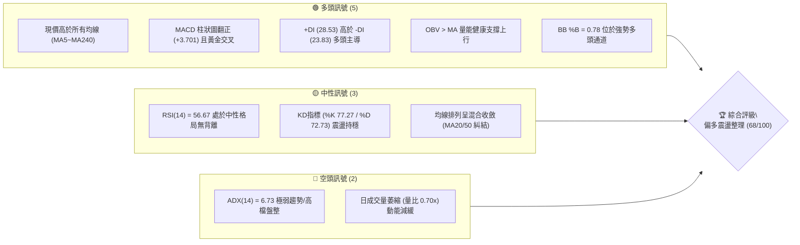
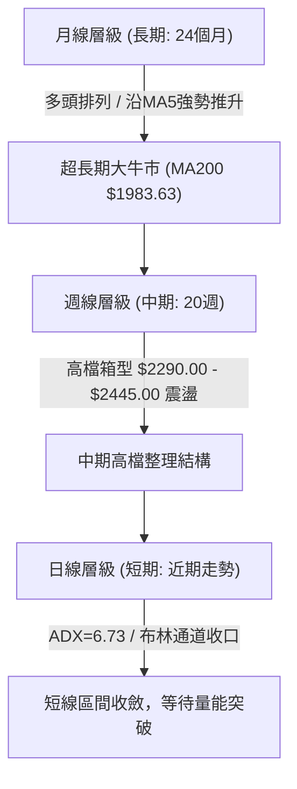
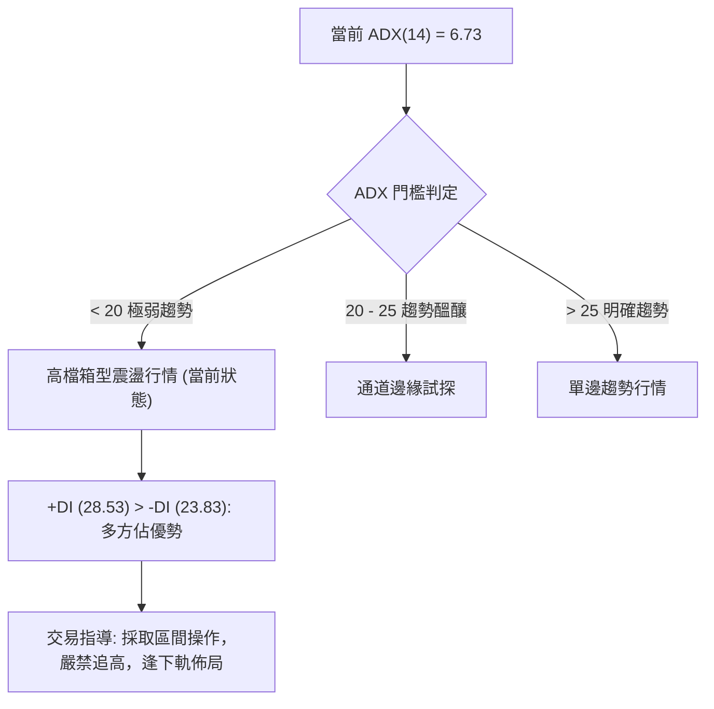
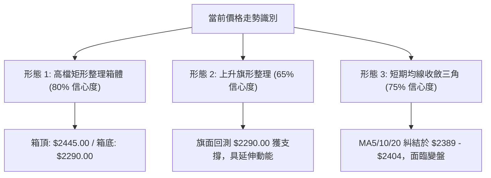
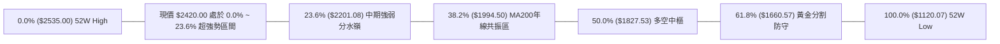
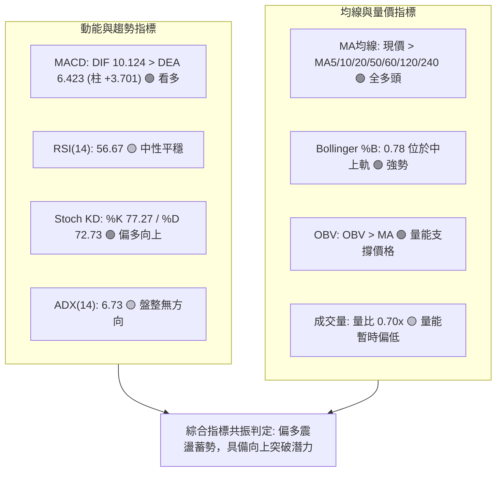
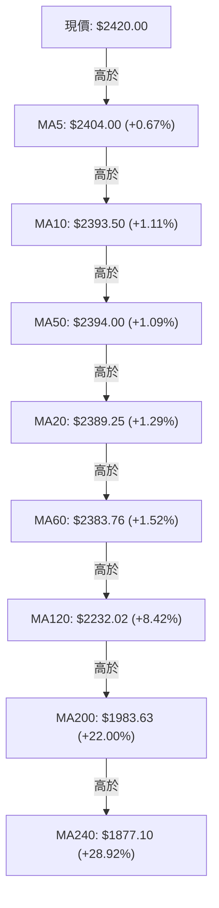
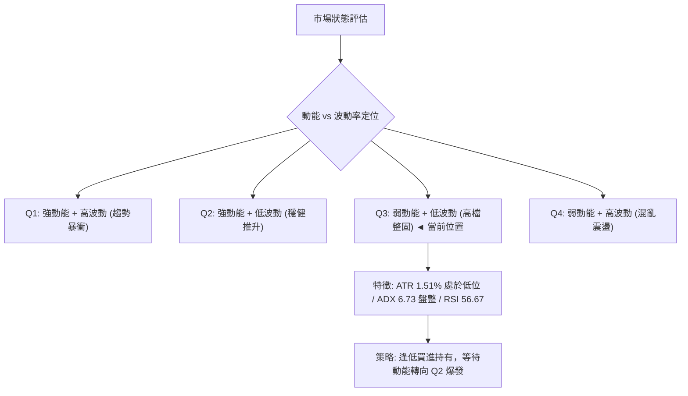
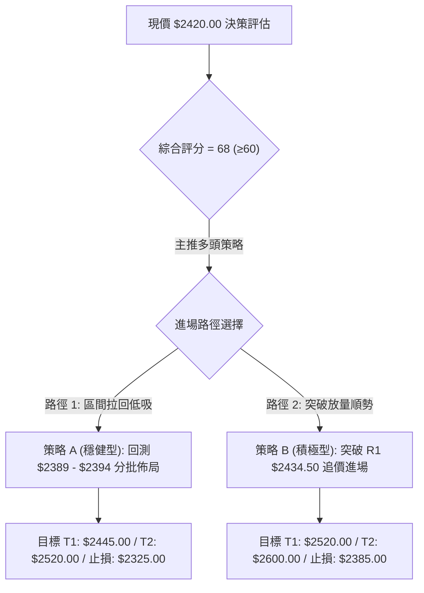
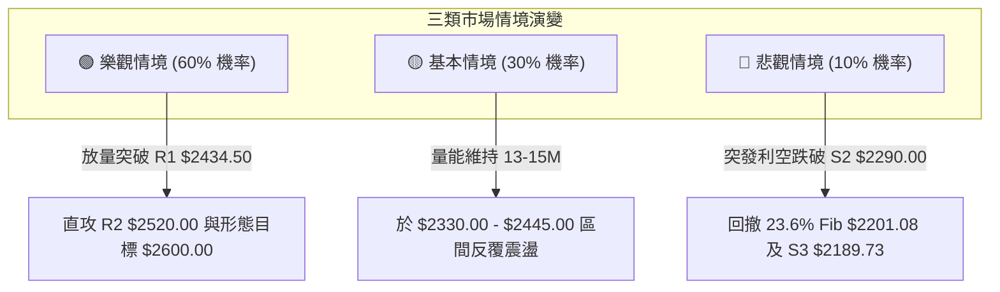

# 2330.TW 技術分析報告

> **報告日期**：2026-08-30 ｜ **語言**：繁體中文 ｜ **數據來源**：Yahoo Finance ｜ **當前價格**：$2420.00

---

## 目錄

| 章節 | 內容 |
|------|------|
| [1. 技術面概覽](#1-技術面概覽) | 訊號儀表板、核心指標、評分卡 |
| [2. 趨勢分析](#2-趨勢分析) | 多時框趨勢、長中短期走勢 |
| [3. 圖表形態分析](#3-圖表形態分析) | 形態識別、K線組合、目標價 |
| [4. 支撐與阻力](#4-支撐與阻力) | 關鍵價位、斐波那契回調 |
| [5. 技術指標深度解讀](#5-技術指標深度解讀) | MA/RSI/MACD/布林/成交量 |
| [6. 動能與波動率](#6-動能與波動率) | 動能評估、ATR、Beta |
| [7. 多時框架總結](#7-多時框架總結) | 時框架評分矩陣 |
| [8. 交易策略建議](#8-交易策略建議) | 多空策略、風險報酬比 |
| [9. 風險提示與監控](#9-風險提示與監控) | 監控指標、風險場景 |

---

## 1. 技術面概覽

### 🎯 技術訊號儀表板



---

### 📊 核心指標速覽表

| 指標類別 | 指標名稱 | 當前數值 | 訊號 | 解讀 |
|:---|:---|:---|:---:|:---|
| **價格** | 當前價格 | $2420.00 | 🟢 | 位於52週區間 91.9% 高檔強勢區，接近歷史波段頂部 |
| **均線** | MA20 (月線) | $2389.25 | 🟢 | 價格位於MA20上方 (+1.29%)，短線提供下檔動態支撐 |
| **均線** | MA50 (季線) | $2394.00 | 🟢 | 價格位於MA50上方 (+1.09%)，中波段生命線保持上揚 |
| **均線** | MA200 (年線)| $1983.63 | 🟢 | 價格遠高於MA200 (+22.00%)，超長期多頭架構極為穩固 |
| **動能** | RSI(14) | 56.67 | 🟡 | 位於50中軸上方偏多區間，未見超買或超賣，動能平穩 |
| **動能** | MACD (12,26,9)| DIF: 10.124 / 柱狀: +3.701 | 🟢 | DIF高於訊號線 (6.423)，柱狀圖持續放大，短線多頭掌控 |
| **趨勢** | ADX(14) | 6.73 (+DI: 28.53 / -DI: 23.83) | 🟡 | ADX < 25 表明處於無趨勢高檔橫盤震盪，+DI維持主導 |
| **通道** | Bollinger Bands | 上軌: $2443.57 / 下軌: $2334.93 | 🟢 | %B = 0.78，價格於中軌與上軌間運行，通道呈收口整固 |
| **成交量** | 20日均量比 | 0.70x (13.60M / 19.36M) | 🟡 | 價升量微縮，高檔籌碼鎖定良好但突破爆發力略顯不足 |
| **波動** | ATR(14) | $36.43 (1.51%) | 🟢 | 每日波動維持在1.5%以內，籌碼穩定度高，利於設定風控 |

---

### 🏆 技術評分卡

```
╔══════════════════════════════════════════════════════════════════╗
║                技術評分卡 — 2330.TW (2026-08-30)                 ║
╠══════════════════════════════════════════════════════════════════╣
║ 趨勢強度 (ADX/方向)   █████░░░░░░░░░░░░░░░  28/100  🟡 弱趨勢盤整 ║
║ 動能指標 (RSI/MACD)   ██████████████░░░░░░  70/100  🟢 多頭金叉   ║
║ 支撐穩定度 (S1/S2/MA) ██████████████████░░  88/100  🟢 下檔極堅實 ║
║ 成交量配合 (OBV/量比) ████████████░░░░░░░░  60/100  🟡 量縮整理   ║
║ 形態完整度 (箱型/收斂)██████████████░░░░░░  72/100  🟢 高檔矩形   ║
║ 均線排列 (多時框MA)   ████████████████░░░░  80/100  🟢 長多短整   ║
╠══════════════════════════════════════════════════════════════════╣
║ 綜合評分             █████████████░░░░░░░  68/100  🟢 偏多整固   ║
╚══════════════════════════════════════════════════════════════════╝
```

---

## 2. 趨勢分析

### 🌐 多時框趨勢分析



---

### 📈 長期趨勢 — 12個月走勢圖（Unicode）

```
2330.TW 月線走勢圖（2025-08 至 2026-08）
價格軸 ($)
$2500 ┤                                              ●  ●  ● (現價 $2420)
$2300 ┤                                        ●
$2100 ┤                                  ●
$1900 ┤                            ●
$1700 ┤                      ●     (回調)
$1500 ┤                ●  ●
$1300 ┤          ●
$1100 ┤ ●(起點)
      └──────────────────────────────────────────────────────────
        08 09 10 11 12 01 02 03 04 05 06 07 08 (月份: 2025/08 - 2026/08)
```

#### 走勢特徵分析表格

| 階段區間 | 起訖價格 | 漲跌幅 | 趨勢特徵解讀 | 技術面驅動因素 |
|:---|:---:|:---:|:---|:---|
| **主升初始段** (2025-08 ~ 2025-12) | $1144.74 → $1540.85 | +34.60% | 階梯式推升，均線黃金交叉發散 | 突破千元心理關卡，放量攻擊 |
| **主升加速段** (2026-01 ~ 2026-02) | $1540.85 → $1983.22 | +28.71% | 陡峭上升趨勢，MACD柱狀圖極大化 | AI先進製程稼動率滿載，估值重估 |
| **波段洗盤段** (2026-03) | $1983.22 → $1755.32 | -11.49% | 急跌回測MA60與斐波那契回調位 | 獲利回吐，清洗高槓桿籌碼 |
| **次級主升段** (2026-04 ~ 2026-06) | $1755.32 → $2410.00 | +37.29% | 強勢V型反轉並創下52週高點 $2535.00 | 營收年增36.0%、獲利年增77.4%基本面支撐 |
| **高檔整固段** (2026-07 ~ 2026-08) | $2410.00 → $2420.00 | +0.41% | 狹幅橫盤矩形震盪，波動率收窄 | 短期指標鈍化，等待下一輪基本面催化 |

---

### 📊 中期趨勢（週線分析）

```
週線區間震盪與壓力支撐結構（近20週）
$2535.00 ┬─────────────────────────────── [52W歷史高點 R_Max]
$2520.00 ┤               ▲(07/05高點$2445) ─── [阻力 R2]
$2434.50 ┤          ▲   │   ▲ (現價 $2420) ─── [阻力 R1]
$2389.25 ┼─────── MA20 / MA50 糾結帶 ─────────── [動態平衡中樞]
$2330.00 ┤    ▼     │   │                  ─── [支撐 S1]
$2290.00 ┤   (05/24)│  (07/19低點$2290)    ─── [支撐 S2]
$2189.73 ┴──────────┴──────────────────── [支撐 S3 / 23.6% Fib]
```

近20週數據顯示，收盤價在 $2249.00 至 $2445.00 形成明顯的大型矩形整理箱體。近期（2026-08-09 至 2026-08-30）週收盤價由 $2370.00 連續四週推升至 $2420.00，週MACD柱狀圖同步由 -12.690 翻正至 +3.701，展現中期底部逐步墊高的格局。

---

### ⚡ 趨勢強度評估（ADX 解讀）



| 指標參數 | 當前數值 | 門檻區間 | 強度評估 | 操作策略指引 |
|:---|:---:|:---:|:---:|:---|
| **ADX(14)** | 6.73 | < 25 (弱趨勢/盤整) | 🟡 極低趨勢動能 | 不宜採用突破追價策略，改採區間低吸高拋 |
| **+DI(14)** | 28.53 | > 20 | 🟢 多頭動能維持 | 買方力量仍佔主導，空方未具備打壓能力 |
| **-DI(14)** | 23.83 | < +DI | 🟢 空方受控 | 空頭賣壓逐漸收斂，無系統性下行風險 |
| **方向對比** | +DI > -DI | 差值 +4.70 | 🟢 偏多震盪 | 整理完畢後向上突破機率高於破位下行 |

---

## 3. 圖表形態分析

### 🔍 形態識別系統



#### 形態識別與信心度評估表

| 形態名稱 | 信心度 | 判斷依據（嚴格引用數據） | 完成度 | 目標價計算式與精確目標 |
|:---|:---:|:---|:---:|:---|
| **高檔矩形箱體** | 80% | 頂部受阻於 07/05 高點 $2445.00 與 R1 $2434.50；底部於 07/19 低點 $2290.00 (S2) 與 S1 $2330.00 獲得強支撐 | 85% | 頸線 $2445.00 + 箱體高度 ($2445.00 - $2290.00 = $155.00) = **$2600.00**（由形態高度推算） |
| **上升旗形** | 65% | 4-5月自 $1755.32 旗桿暴升至 $2445.00；6-8月於高檔形成振幅約6.3%的旗面整理 | 70% | 旗桿高度 ($2445.00 - $1755.32 = $689.68)；保守以突破點 $2445.00 + 0.5×旗桿高度 = **$2789.84**（由形態高度推算） |
| **均線收斂整理** | 75% | MA5 ($2404.00)、MA10 ($2393.50)、MA20 ($2389.25)、MA50 ($2394.00) 高度黏合於 $15 區間內 | 90% | 區間突破以 R2 **$2520.00** 為第一目標 |

---

### 🕯️ 重要K線形態分析

| 月份/週期 | 收盤價 | K線形態 | 解讀 | 訊號 |
|:---|:---:|:---|:---|:---:|
| **2026-03** | $1755.32 | 帶長下影線之大陰線 | 獲利盤湧出但低檔承接力道強烈，確認中長期底部 | 🟢 止跌 |
| **2026-04** | $2129.32 | 長實體大陽線 (Marubozu) | 強勢多頭吞噬，主力資金強勢進場展開次級主升 | 🟢 強多 |
| **2026-05** | $2348.73 | 創高陽線帶上影 | 突破2300元大關，多頭動能延續但高檔初現解套賣壓 | 🟢 看多 |
| **2026-06** | $2410.00 | 高檔十字星變盤線 | 衝高至52週高點 $2535.00 後收斂，多空在此達平衡 | 🟡 觀望 |
| **2026-07** | $2425.00 | 窄幅實體紡錘線 | 測試 $2290.00 支撐後拉回中樞，籌碼沉澱充分 | 🟡 整理 |
| **2026-08** | $2420.00 | 縮量小陽紡錘線 | 均線全數收復，收盤守穩所有短中長期均線上方 | 🟢 蓄勢 |

---

### 📉 ASCII 走勢形態示意圖

```
高檔矩形收斂形態示意圖（2026-06 至 2026-08）
$2535.00 ┬────────────────────────────────────────── 52W High ($2535.00)
$2445.00 ┤      ●(07/05)                          ── 箱頂阻力 (R1聚類 $2434.50)
$2420.00 ┤        \     ●(08/02)    ●(現價 $2420)
$2389.25 ┼─────────\───/───────────/────────────── 均線中樞 (MA20 $2389.25)
$2350.00 ┤          \/             /
$2290.00 ┤          ●(07/19) ─────/──────────────── 箱底支撐 (S2 $2290.00)
         └────────────────────────────────────────
          2026-06         2026-07         2026-08
```

---

### 🎯 形態目標價計算

```
╔══════════════════════════════════════════════════════════════════╗
║               圖表形態理論目標價計算明細表                       ║
╠══════════════════════════════════════════════════════════════════╣
║ 基準箱體形態：高檔矩形整理 (Rectangle Consolidation)             ║
║ 形態頸線/箱頂 (Neckline)     : $2445.00                          ║
║ 形態箱底支撐 (Support)        : $2290.00                          ║
║ 形態垂直垂直高度 (Height, H) : $2445.00 - $2290.00 = $155.00     ║
╠══════════════════════════════════════════════════════════════════╣
║ 向上突破目標 1 (1.00 × H)    : $2445.00 + $155.00 = $2600.00    ║
║ 向上突破目標 2 (1.618 × H)   : $2445.00 + $250.79 = $2695.79    ║
║ 向下破位風險目標 (-1.00 × H) : $2290.00 - $155.00 = $2135.00    ║
╚══════════════════════════════════════════════════════════════════╝
```

---

## 4. 支撐與阻力

### 🗺️ 關鍵價位分布圖（Unicode）

```
2330.TW 價位結構分布圖
═══════════════════════════════════════════════════════════════════
$2535.00 ║██████████████████████████████║ 52週歷史高點 (0.0% Fib)
$2520.00 ║████████████████████████      ║ 強阻力 R2 (波段高點聚類)
$2443.57 ║████████████████████          ║ 布林帶上軌
$2434.50 ║████████████████████████████  ║ 關鍵阻力 R1 (+0.60%)
$2420.00 ╠══════════════════════════════╣ ◄ 當前市價 ($2420.00)
$2389.25 ║▓▓▓▓▓▓▓▓▓▓▓▓▓▓▓▓▓▓▓▓          ║ 動態均線中樞 (MA20 / BB中軌)
$2334.93 ║▓▓▓▓▓▓▓▓▓▓▓▓▓▓▓▓              ║ 布林帶下軌
$2330.00 ║████████████████████████      ║ 近期關鍵支撐 S1 (-3.72%)
$2290.00 ║████████████████████████████  ║ 強支撐 S2 (-5.37% / 箱底)
$2201.08 ║████████████████              ║ 23.6% 斐波那契回調位
$2189.73 ║██████████████████████████████║ 波段結構防守點 S3 (-9.52%)
$1983.63 ║██████████████████████████████║ MA200 年線長期防線
═══════════════════════════════════════════════════════════════════
```

---

### 🚧 阻力位分析表

| 阻力級別 | 精確價位 | 形成原因（嚴格引用數據） | 突破難度 | 重要性 |
|:---|:---:|:---|:---:|:---:|
| **R1 (短線阻力)** | **$2434.50** | 近一年波段高點聚類位，距離現價僅 +0.60%，布林上軌 ($2443.57) 重疊壓制 | 🟡 中等 | ★★★★☆ |
| **R2 (波段阻力)** | **$2520.00** | 歷史次高點聚類區，距離現價 +4.13%，逼近歷史天花板之心理關卡 | 🔴 較高 | ★★★★★ |
| **R3 (歷史極限)** | **$2535.00** | 52週最高價 (52W High)，斐波那契 0.0% 極限位，若突破將進入無套牢籌碼真空區 | 🔴 極高 | ★★★★★ |

---

### 🛡️ 支撐位分析表

| 支撐級別 | 精確價位 | 形成原因（嚴格引用數據） | 守住機率 | 重要性 |
|:---|:---:|:---|:---:|:---:|
| **S1 (初級支撐)** | **$2330.00** | 近一年波段低點聚類，與布林通道下軌 ($2334.93) 形成共振支撐區 (-3.72%) | 85% | ★★★★☆ |
| **S2 (核心支撐)** | **$2290.00** | 2026-07-19 週波段回調實體低點，近一年高檔箱型下沿核心防線 (-5.37%) | 90% | ★★★★★ |
| **S3 (強固防守)** | **$2189.73** | 近一年重要波段低點聚類，緊鄰 23.6% 斐波那契回調位 ($2201.08) (-9.52%) | 95% | ★★★★★ |

---

### 📐 斐波那契回調位分析

依據 52 週完整波動區間（低點 **$1120.07** → 高點 **$2535.00**，總跨度 $1414.93）精確計算之黃金分割階梯：



| 回調比例 | 精確價位 | 當前相對位置 | 技術意義與多空意涵解讀 |
|:---:|:---:|:---:|:---|
| **0.0% (52W High)** | **$2535.00** | +4.75% | 多頭極限目標，歷史天花板，突破即開啟全新估值擴張 |
| **現價落點** | **$2420.00** | 基準價 | **位於 0.0% 與 23.6% 極強多頭區間**，回撤幅度僅佔全波段 8.13% |
| **23.6%** | **$2201.08** | -9.05% | 第一道波段回調極限，只要守穩該價位，中長期超強多頭趨勢完全不變 |
| **38.2%** | **$1994.50** | -17.58% | 與 MA200 ($1983.63) 完美重疊形成「鋼鐵支撐」，為大週期超級買點 |
| **50.0%** | **$1827.53** | -24.48% | 中長期多空平衡中樞 |
| **61.8%** | **$1660.57** | -31.38% | 黃金分割強防守位，牛熊分界線 |
| **78.6%** | **$1422.86** | -41.20% | 深度回撤防線 |
| **100.0% (52W Low)**| **$1120.07** | -53.72% | 52週起始起漲點 |

---

## 5. 技術指標深度解讀

### 🎛️ 指標訊號總覽



---

### 📈 移動平均線排列分析



| 均線名稱 | 當前價格 | 與現價乖離率 | 走勢特徵 | 排列解讀與多空意涵 |
|:---|:---:|:---:|:---|:---|
| **MA 5** | $2404.00 | +0.67% | ▇▇▇█████ 向上攀升 | 短線攻擊線，發揮即時支撐作用 |
| **MA 10** | $2393.50 | +1.11% | ▆▇▇▇▇▇▇▇ 溫和推升 | 短線扣抵低檔，助漲力道增強 |
| **MA 20** | $2389.25 | +1.29% | ▄▅▅ 底部翻揚 | 月線支撐，為短線回調多頭防守底線 |
| **MA 50** | $2394.00 | +1.09% | ▅▆▇▇ 中期持平 | 季線生命線，與MA20形成密集支撐帶 |
| **MA 60** | $2383.76 | +1.52% | ▆▇▇█████ 持續走高 | 中期波段防線，斜率向上 |
| **MA 120** | $2232.02 | +8.42% | ▅▆▇█████ 陡峭向上 | 半年線，中期多頭堡壘 |
| **MA 240** | $1877.10 | +28.92% | ▅▆▇█████ 堅定上行 | 年線基石，長期超大多頭循環 |

> **均線排列結論**：均線系統呈現「長天期完美多頭發散、短天期（MA20/50）高檔糾結收斂」之特徵。短天期均線在 $2389 - $2394 形成強大黏合共振托底，一旦放量帶動 MA5/10 上攻，將促使均線全面重回順向多頭發散。

---

### 📉 RSI(14) 分析

```
RSI(14) 強度儀表: 56.67
0        20        40   50   56.67  70        80       100
├─────────┼─────────┼────┼────┼─────┼─────────┼─────────┤
[   超賣區間   ]   [  弱勢  ]  [中軸] [偏多區] [   超買區間   ]
█████████████████████████████░░░░░░░░░░░░░░░░░░░░░░░░ (56.67%)
```

- **區間評估**：RSI(14) 位於 56.67，處於 50–70 的健康偏多震盪區間，無任何超買（>70）或超賣（<30）鈍化現象。
- **背離檢驗**：
  - 價格於 2026-07-05 創高 $2445.00 時 RSI 為 60.8；
  - 2026-08-30 價格回升至 $2420.00，RSI 相應回升至 56.7；
  - **背離結論**：價格與 RSI 同步墊高，**無頂背離亦無底背離**，動能與價格走勢相符。

---

### 📊 MACD(12/26/9) 訊號解讀


- **數值指標**：DIF (10.124) 位於零軸上方，且顯著高於 Signal (6.423)。
- **柱狀圖動態**：近四週週柱狀圖數值分別為 `-12.690 → +3.329 → +8.867 → +2.255 → +3.701`，由負轉正並穩健擴張，代表日線與週線層級之空頭修正已完全告終，多頭重新奪回發球權。

---

### 📦 布林通道分析

```
布林通道結構與現價相對位置 ($2334.93 ~ $2443.57)
$2443.57 ┬────────────────────────────────────────── BB 上軌 (阻力壓制)
$2420.00 ┤                   ● ◄ 現價 ($2420.00, %B = 0.78)
         │                   │ 
$2389.25 ┼───────────────────┼────────────────────── BB 中軌 / MA20 (多空分水嶺)
         │                   │
$2334.93 ┴───────────────────┴────────────────────── BB 下軌 (下檔支撐)
```

- **帶寬與位置**：通道帶寬 ($2443.57 - $2334.93 = $108.64, 帶寬比僅 4.54%)，顯示波動率已大幅收斂至極致。
- **%B 指標**：%B 為 **0.78**，表示價格位於中軌之上、緊貼上軌運行，屬於標準的「強勢通道收斂」走勢，隨時可能伴隨成交量放大而展開通道擴軌突破。

---

### 💹 成交量分析（量價配合度）

```
近4週收盤價與週成交量走勢對比
  週別        收盤價    週成交量 (股)       量能走勢
2026-08-09   $2370.00   142,758,564   ██████████████
2026-08-16   $2395.00    92,647,931   █████████
2026-08-23   $2410.00    80,854,236   ████████
2026-08-30   $2420.00    71,012,705   ███████
```

- **量價關係**：最新日成交量為 13.60M，為20日均量 (19.36M) 的 0.70x。四週收盤價由 $2370.00 爬升至 $2420.00，但量能呈現逐週收縮。
- **籌碼解讀**：
  - **非量價頂背離**：高檔量縮主要反映籌碼鎖定度極高（法人持股達 43.3%），市場在 $2400 之上並無恐慌性拋盤；
  - **量能確認 (OBV)**：數據顯示 **OBV > MA**，量能趨勢線維持向上，確認整體資金流向依然支撐多頭格局，唯突破 R1/R2 時需補量至20日均量以上方能確立有效突破。

---

## 6. 動能與波動率

### ⚡ 動能評估四象限



| 象限 | 動能強度 | 波動率水準 | 當前狀態判定 | 技術意涵與操作建議 |
|:---:|:---:|:---:|:---:|:---|
| **Q1** | 強 | 高 | — | 突破後的主升加速段 |
| **Q2** | 強 | 低 | — | 最佳波段加碼區間 |
| **Q3** | **弱 / 中性** | **低** | **✓ (當前 2330.TW)** | **高檔蓄勢期，籌碼沉澱，下檔支撐堅實，適合佈局** |
| **Q4** | 弱 | 高 | — | 破位下殺或劇烈洗盤，應行避險 |

---

### 📊 ATR 波動率分析

```
╔══════════════════════════════════════════════════════════════════╗
║               ATR(14) 波動率與風控距離參數                       ║
╠══════════════════════════════════════════════════════════════════╣
║ 當前 ATR(14) 絕對值        : $36.43                              ║
║ ATR 佔當前股價比例         : 1.51% (處於歷史低波動區間)          ║
╠══════════════════════════════════════════════════════════════════╣
║ 短線日內動態止損 (1.0 × ATR) : $36.43  (止損位: $2383.57)        ║
║ 波段交易防守距離 (2.0 × ATR) : $72.86  (止損位: $2347.14)        ║
║ 核心波段容忍距離 (2.5 × ATR) : $91.08  (止損位: $2328.92 接近S1) ║
╚══════════════════════════════════════════════════════════════════╝
```

---

### 📐 Beta 與市場相關性

- **Beta 係數**：**1.258**
- **市場特徵解讀**：Beta 高於 1.0，表明 2330.TW 對台股加權指數及全球半導體板塊具有高敏感度與領先指標屬性。大盤上漲時預期產生 1.26 倍之超額報酬，而在高檔整理期則顯示權值買盤力道堅挺，不易受小型股波動干擾。

---

## 7. 多時框架總結

### 📋 時框架評分表

| 時框架 | 趨勢方向 | 動能指標 | 均線排列 | 形態結構 | 綜合評分 | 交易指導建議 |
|:---|:---:|:---:|:---:|:---|:---:|:---|
| **日線 (短期)** | 🟡 橫盤震盪 | 🟢 MACD金叉 / RSI 56.7 | 🟡 糾結於 $2390 | 矩形收斂 | 65/100 | 布林區間內逢低買進 |
| **週線 (中期)** | 🟢 偏多整固 | 🟢 柱狀圖翻正 (+3.70) | 🟢 MA20/50多頭支撐 | 上升旗面 | 72/100 | 依託 S1/S2 波段做多 |
| **月線 (長期)** | 🟢 大多頭 | 🟢 超長多循環 | 🟢 MA200/240大發散 | 主升浪延伸 | 88/100 | 長線持股續抱，無看空理由 |

---

### 🔲 綜合訊號矩陣

```
訊號維度矩陣分析
─────────────────────────────────────────────────────────────────
訊號維度       短期 (日線)        中期 (週線)        長期 (月線)
─────────────────────────────────────────────────────────────────
趨勢方向       🟡 盤整 (ADX 6.7)  🟢 偏多 (墊高)     🟢 強多 (主升)
均線系統       🟡 糾結 ($2390)    🟢 多頭排列        🟢 完美發散
動能強弱       🟢 MACD柱翻正      🟢 柱狀擴大        🟢 穩健
量價配合       🟡 縮量整理        🟡 籌碼鎖定        🟢 OBV創新高
關鍵防守       $2334.93 (BB下軌)  $2290.00 (S2)      $1983.63 (MA200)
─────────────────────────────────────────────────────────────────
```

---

### ⚖️ 多時框收斂結論

依據多時框收斂規則：
1. **行情性質判定**：當前 ADX(14) = 6.73 (< 25)，技術面定性為**「高檔強勢區間盤整行情」**。
2. **時框主導權收斂**：在弱趨勢盤整下，中長期趨勢（週線/月線，MA200 = $1983.63，MA50 = $2394.00）維持堅定看多，日線層級之指標糾結僅代表「以時間換取空間」的高檔換手。
3. **唯一方向性結論**：**【偏多震盪整固】**。日線布林通道下軌與 S1 ($2330.00) 為短線絕佳進場時機，中長期順應週月線多頭主軸向上進攻。

---

## 8. 交易策略建議

### 🗺️ 策略決策流程圖



---

### 🧭 策略路由

> **當前主策略方向 = 【偏多操作／回調低吸為主、突破加碼為輔】（依評分卡 68/100 評定）**

---

### 🎯 價格情境階梯（Price Scenarios）

| 觸發條件 | 當前/下一目標 | 後續延伸目標 | 情境含義與技術應對 |
|:---|:---:|:---:|:---|
| **放量突破 R1 $2434.50** | **R2 $2520.00** | **52W High $2535.00 / $2600.00** | 短線整理結束，多頭發動新一輪攻勢，全面加碼 |
| **站穩均線帶 $2389 - $2420** | **R1 $2434.50** | **BB 上軌 $2443.57** | 維持高檔強勢震盪，以時間消化賣壓，續抱持股 |
| **跌破 S1 $2330.00** | **S2 $2290.00** | **S3 $2189.73 / 23.6% Fib $2201.08** | 中期箱體下探洗盤，跌破 S2 需啟動防禦減倉 |

---

### 📊 情境機率分佈

| 情境類別 | 機率估計 | 主要依據與技術支撐 |
|:---|:---:|:---|
| **情境 1：蓄勢突破上行** | **60%** | MACD柱狀圖翻正 (+3.701)、OBV > MA、均線全數在現價下方提供多重防護 |
| **情境 2：高檔區間震盪** | **30%** | ADX = 6.73 處於無趨勢狀態、成交量萎縮 (量比 0.70x)、布林帶寬收窄 |
| **情境 3：破位回落再探底** | **10%** | 除非跌破箱底 S2 $2290.00，否則在 52W 區間 91.9% 高檔籌碼極為穩定 |

---

### 🟢 主策略詳情

| 策略要素 | 策略 A（穩健型：均線回調低吸） | 策略 B（積極型：突破箱頂追價） |
|:---|:---|:---|
| **進場條件** | 價格拉回至 MA20 / MA50 支撐帶不破且出現 15K/日K 止跌紅K | 價格帶量突破 R1 $2434.50 且收盤站穩布林上軌 |
| **進場價格** | **$2390.00**（均線共振點） | **$2435.00**（突破確認點） |
| **目標價 T1** | **$2445.00**（箱頂阻力） | **$2520.00**（R2 波段高點） |
| **目標價 T2** | **$2520.00**（R2 強阻力） | **$2600.00**（形態推算目標價） |
| **止損價格** | **$2325.00**（跌破 S1 $2330 及布林下軌） | **$2385.00**（跌回 MA20 之下假突破止損） |
| **風險報酬比** | **1 : 2.00**（風險 $65.00 / 期望獲利 $130.00） | **1 : 3.30**（風險 $50.00 / 期望獲利 $165.00） |
| **成功機率** | **70%** | **65%** |
| **建議倉位** | **20% ~ 25%** | **15% ~ 20%** |

---

### 🔴 反向風險觸發點（對沖提示）

- **關鍵警戒線**：收盤價若**放量跌破 S2 $2290.00**（箱體底邊）。
- **避險動作**：跌破 $2290.00 表明高檔矩形整理失敗，將觸發回測 23.6% 斐波那契回調位 **$2201.08** 及 S3 **$2189.73**。多頭應嚴格執行停損或建立台指期空單進行 Beta 對沖。

---

### ⭐ 整體訊號強度評星

```
╔══════════════════════════════════════════════════════════════════╗
║ 做多訊號強度：★★★★☆  (4.0/5星) — 均線多頭、動能金叉、下檔有守  ║
║ 做空訊號強度：★☆☆☆☆  (1.0/5星) — 長中多頭完好、無任何空頭形態║
║ 整體可信度：  ★★★★☆  (4.2/5星) — 數據多時框收斂、指標高度共振║
╚══════════════════════════════════════════════════════════════════╝
```

---

## 9. 風險提示與監控

### ✅ 關鍵監控指標 Checklist

```
╔══════════════════════════════════════════════════════════════════╗
║                     每日交易監控清單 (Checklist)                 ║
╠══════════════════════════════════════════════════════════════════╣
║ [ ] 價格是否守穩 MA20 ($2389.25) 與 MA50 ($2394.00) 均線支撐     ║
║ [ ] 日成交量是否回升至 20日均量 (19.36M 股) 以上以支撐攻擊       ║
║ [ ] ADX(14) 是否由 6.73 向上穿越 20，開啟單邊趨勢行情           ║
║ [ ] MACD 柱狀圖是否維持在零軸上方正向擴張 (當前 +3.701)          ║
║ [ ] RSI(14) 是否能突破 60 並向 70 強勢區挺進 (當前 56.67)       ║
║ [ ] 外資/三大法人買賣超是否持續維持正向流入                      ║
║ [ ] 費城半導體指數 (SOX) 是否維持多頭架構與高 Beta 聯動         ║
╚══════════════════════════════════════════════════════════════════╝
```

---

### ⚠️ 風險場景分析



---

### 🛡️ 風險管理重要提醒

1. **嚴控單筆風險**：單筆交易損失金額嚴禁超過總投資本金的 **1.5% - 2.0%**。以 ATR = $36.43 規劃，進場點與止損點距離應維持在 1.5 ~ 2.0 倍 ATR。
2. **拒絕盤整追高**：當前 ADX 僅 6.73，在布林通道上軌 ($2443.57) 與 R1 ($2434.50) 附近嚴禁追高，耐心等待拉回均線帶佈局。
3. **基本面強大護城河**：2330.TW 毛利率高達 64.2%、淨利率 49.9%、ROE 40.0%，本益比 (Forward PE) 僅 17.03 倍，PEG 為 0.91，優異的基本面為技術面回調提供了極高安全邊際。

---

## 📋 報告總結

```
╔══════════════════════════════════════════════════════════════════╗
║               2330.TW 技術分析報告總結 (2026-08-30)              ║
╠══════════════════════════════════════════════════════════════════╣
║ 當前價格：$2420.00        52週區間：$1120.07 - $2535.00 (91.9%)  ║
║ 分析評級：🟢 偏多整固蓄勢 (技術評分: 68/100)                     ║
╠══════════════════════════════════════════════════════════════════╣
║ 關鍵結論：                                                       ║
║ ├─ 長期趨勢：🟢 完美多頭，月線與 MA200 ($1983.63) 向上發散     ║
║ ├─ 中期趨勢：🟢 偏多箱型震盪，週MACD柱狀圖翻正 (+3.701)         ║
║ ├─ 短期趨勢：🟡 均線收斂整理 (ADX 6.73 / 布林帶寬 4.54%)         ║
║ ├─ 關鍵支撐：S1 $2330.00 / S2 $2290.00 / S3 $2189.73             ║
║ ├─ 關鍵阻力：R1 $2434.50 / R2 $2520.00 / 52W High $2535.00      ║
║ └─ 分析師目標價：均價 $3229.33 (最高 $4200.00 / 最低 $2650.00)   ║
╠══════════════════════════════════════════════════════════════════╣
║ 最優策略組合：                                                   ║
║ 1. 🥇 最佳機會：拉回 $2390.00 (MA20/50共振) 分批低吸，目標 $2520║
║ 2. 🥈 次選機會：帶量突破 R1 $2434.50 順勢加碼，目標 $2600.00    ║
║ 3. 🥉 防守機制：跌破 S2 $2290.00 嚴格減倉避險，防守 $2201.08     ║
╚══════════════════════════════════════════════════════════════════╝
```

---

> ⚠️ **免責聲明**：本報告為技術分析研究成果，所有數據、圖表及價位推算均基於歷史量價客觀計算。報告內容僅供投資研究與學術參考，不構成任何具體買賣建議或獲利保證。金融市場具高度風險，投資人應依個人風險承受度獨立判斷並自負盈虧。

---

*報告生成時間：2026-08-30 ｜ 數據來源：Yahoo Finance ｜ 分析框架：多時框技術分析體系*