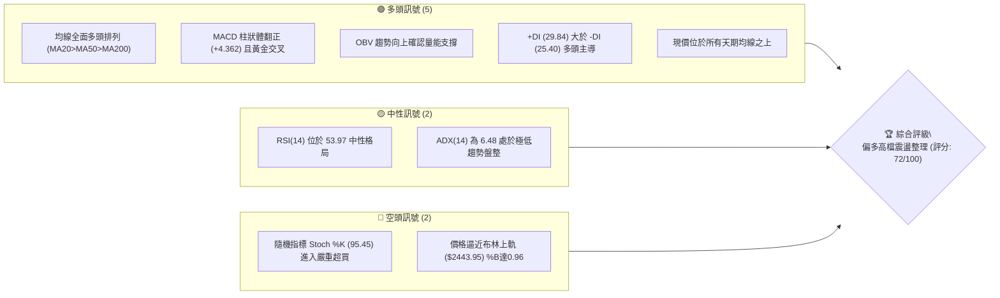
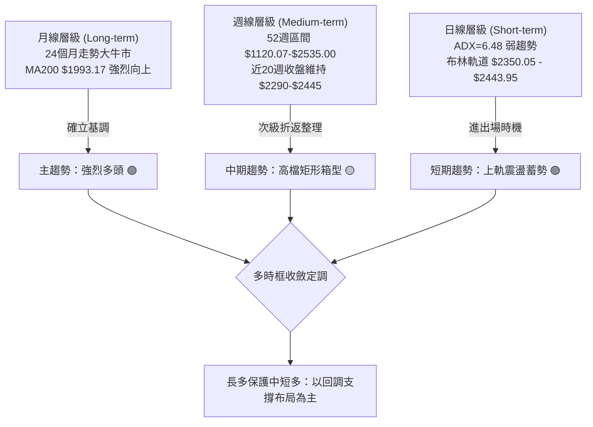
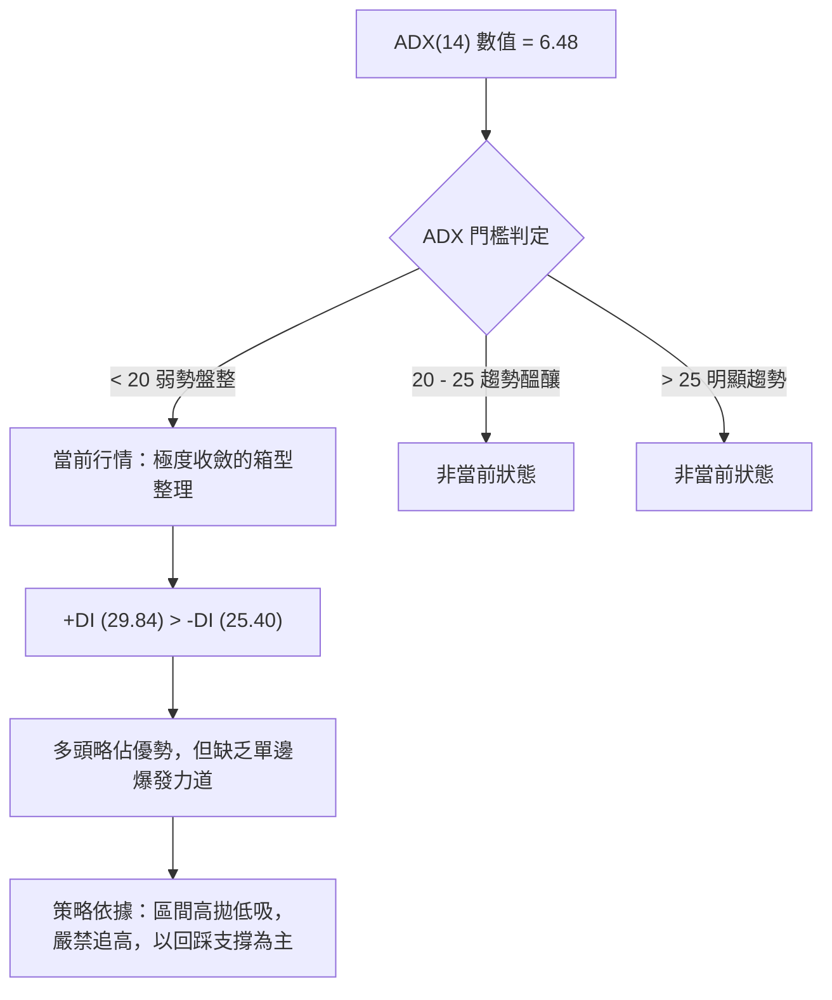
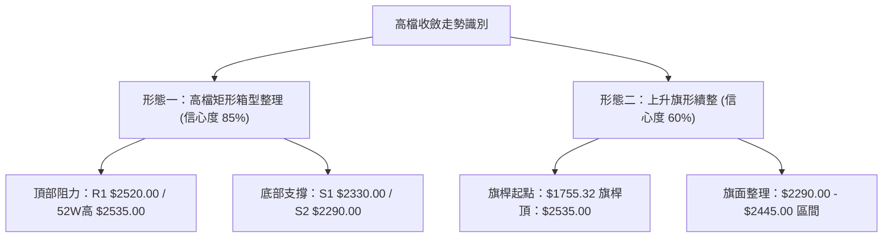
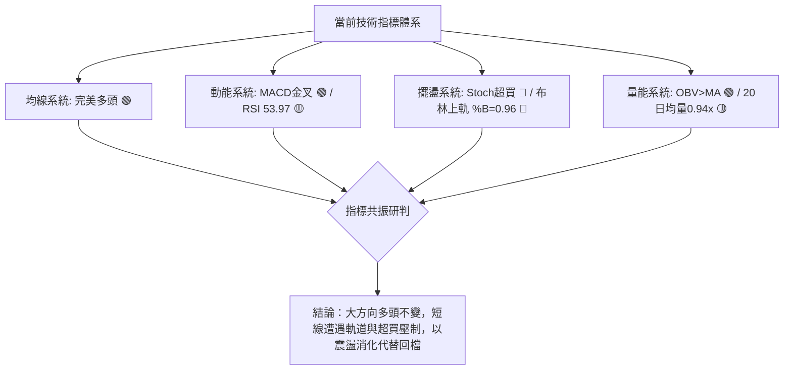
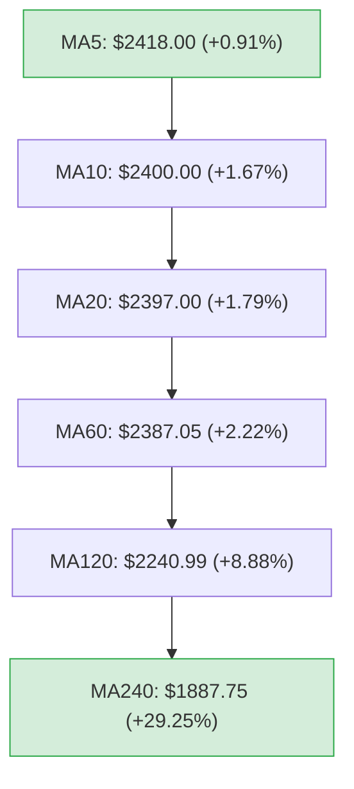
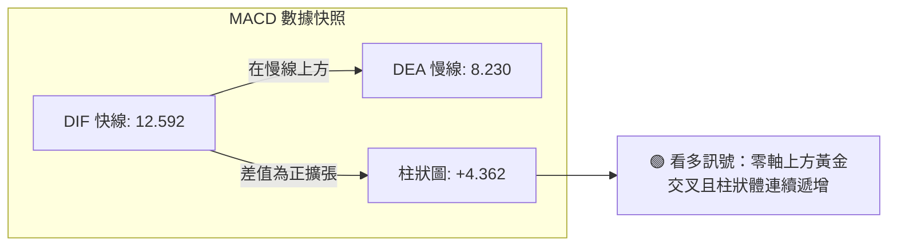
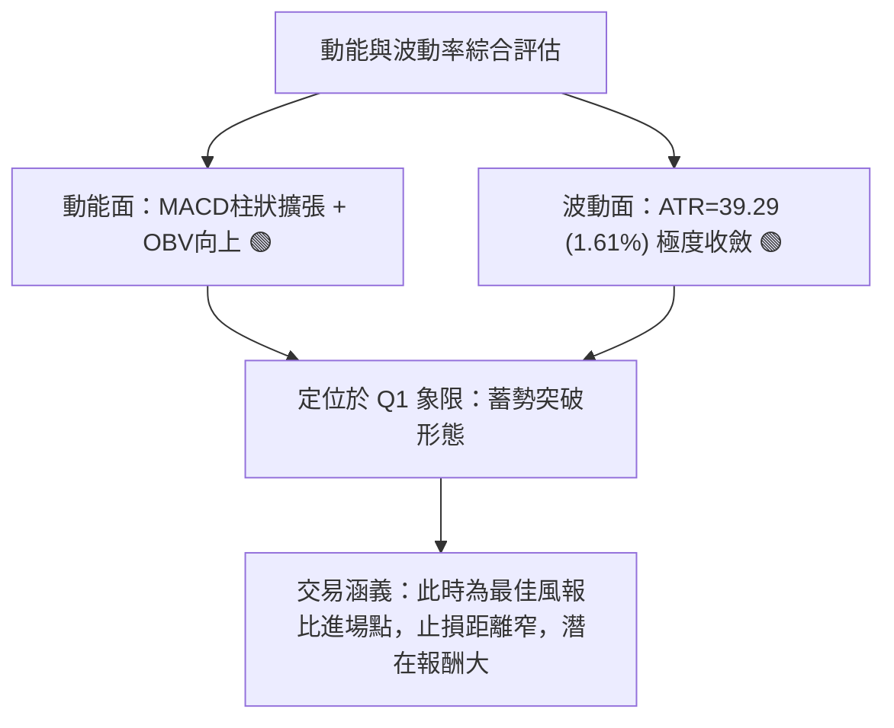
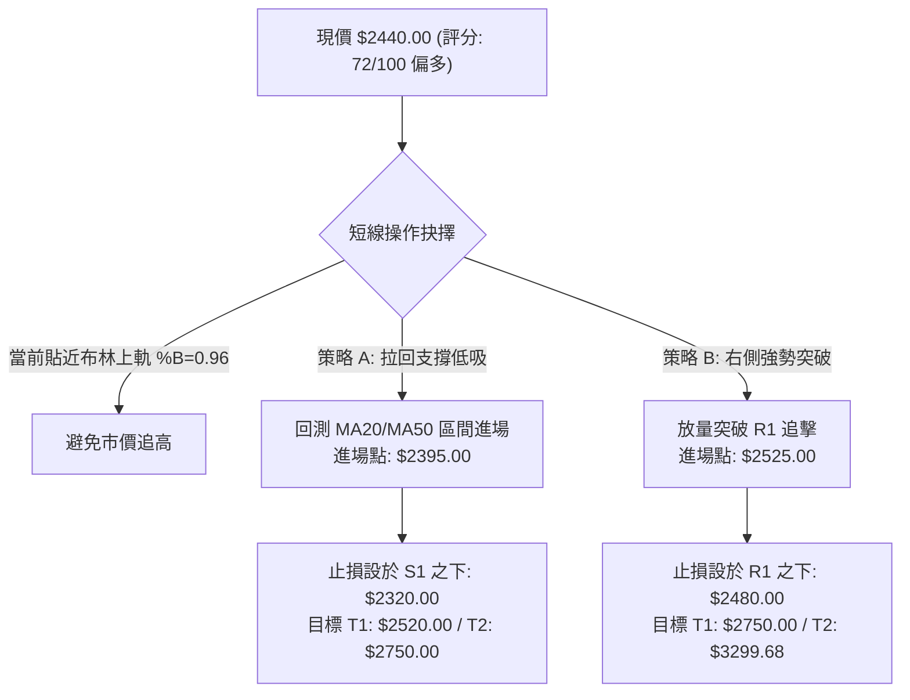
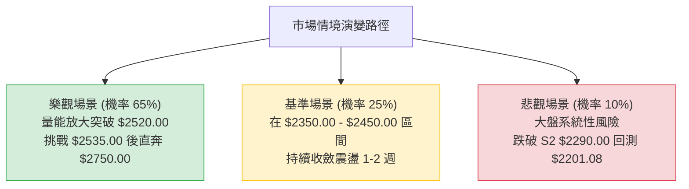

# 2330.TW 技術分析報告

> **報告日期**：2026-09-01 ｜ **語言**：繁體中文 ｜ **數據來源**：Yahoo Finance ｜ **當前價格**：$2440.00

---

## 目錄

| 章節 | 內容 |
|------|------|
| [1. 技術面概覽](#1-技術面概覽) | 訊號儀表板、核心指標、評分卡 |
| [2. 趨勢分析](#2-趨勢分析) | 多時框趨勢、長中短期走勢 |
| [3. 圖表形態分析](#3-圖表形態分析) | 形態識別、K線組合、目標價 |
| [4. 支撐與阻力](#4-支撐與阻力) | 關鍵價位、斐波那契回調 |
| [5. 技術指標深度解讀](#5-技術指標深度解讀) | MA/RSI/MACD/布林/成交量 |
| [6. 動能與波動率](#6-動能與波動率) | 動能評估、ATR、Beta |
| [7. 多時框架總結](#7-多時框架總結) | 時框架評分矩陣 |
| [8. 交易策略建議](#8-交易策略建議) | 多空策略、風險報酬比 |
| [9. 風險提示與監控](#9-風險提示與監控) | 監控指標、風險場景 |

---

## 1. 技術面概覽

### 🎯 技術訊號儀表板



### 📊 核心指標速覽表

| 指標類別 | 指標名稱 | 當前數值 | 訊號 | 解讀 |
|----------|----------|----------|------|------|
| **價格** | 當前價格 | $2440.00 | 🟢 | 位於52週區間 93.3% 高檔區，多方控盤 |
| **均線** | MA20 | $2397.00 | 🟢 | 價格在MA20上方 (+1.79%)，短線支撐強固 |
| **均線** | MA50 | $2390.90 | 🟢 | 價格在MA50上方 (+2.05%)，中期趨勢向上 |
| **均線** | MA200 | $1993.17 | 🟢 | 價格在MA200上方 (+22.42%)，長期多頭牛市明確 |
| **動能** | RSI(14) | 53.97 | 🟡 | 位於50中軸上方，無背離，動能中性平穩 |
| **動能** | MACD | 12.592 (柱+4.362) | 🟢 | 快線在慢線(8.230)上方，多頭動能擴張 |
| **震盪** | Stoch %K/%D | 95.45 / 78.79 | 🔴 | 進入>80超買區，短線隨時有回測或鈍化整理需求 |
| **趨勢** | ADX(14) | 6.48 | 🟡 | 趨勢強度極弱 (<25)，進入箱型盤整結構 |
| **通道** | 布林 %B | 0.96 | 🔴 | 貼近布林上軌 ($2443.95)，短線面臨軌道壓制 |
| **量能** | 20日均量比 | 0.94x | 🟡 | 17.21M vs 18.28M，量能略微萎縮但OBV仍多頭 |
| **波動** | ATR(14) | $39.29 | 🟢 | 波動率僅 1.61%，震盪收斂有利於蓄勢 |

### 🏆 技術評分卡

```
╔══════════════════════════════════════════════════════════════╗
║              技術評分卡 — 2330.TW (2026-09-01)               ║
╠══════════════════════════════════════════════════════════════╣
║ 趨勢強度      ██████░░░░░░░░░░░░░░  30/100  🟡 (ADX極低盤整)  ║
║ 動能指標      ██████████████░░░░░░  70/100  🟢 (MACD正向擴張) ║
║ 支撐穩定度    ████████████████░░░░  80/100  🟢 (均線密集支撐) ║
║ 成交量配合    ████████████░░░░░░░░  60/100  🟡 (量縮但OBV健康)║
║ 形態完整度    ██████████████░░░░░░  70/100  🟢 (高檔旗形箱型) ║
║ 均線排列      ████████████████████ 100/100  🟢 (完美多頭排列) ║
╠══════════════════════════════════════════════════════════════╣
║ 綜合評分      ██████████████░░░░░░  72/100  🟢 偏多箱型震盪   ║
╚══════════════════════════════════════════════════════════════╝
```

---

## 2. 趨勢分析

### 🌐 多時框趨勢分析



### 📈 長期趨勢 — 12個月走勢圖（Unicode）

```
2330.TW 月線走勢圖（2025-09 至 2026-09）
價格軸 ($)
$2500 ┤                                           ●  ●  ●(現價2440)
$2400 ┤                                        ●
$2300 ┤                                     ●
$2100 ┤                               ●
$1900 ┤                         ●
$1700 ┤                   ●  ●
$1500 ┤             ●  ●
$1400 ┤          ●
$1200 ┤    ●(低點1292.99)
$1000 ┤
      └────────────────────────────────────────────────────────
       09  10  11  12  01  02  03  04  05  06  07  08  09 (月份)
      (25)(25)(25)(25)(26)(26)(26)(26)(26)(26)(26)(26)(26)
```

**走勢特徵分析表格**：

| 階段區間 | 月份跨度 | 價格起點與終點 | 區間漲跌幅 | 走勢特徵分析 |
|----------|----------|----------------|------------|--------------|
| **第1階段：主升起步** | 2025-09 ~ 2025-12 | $1292.99 → $1540.85 | +19.17% | 帶量突破千元關卡後穩步墊高，月線連四紅 |
| **第2階段：加速噴出** | 2026-01 ~ 2026-02 | $1764.52 → $1983.22 | +12.39% | 主升段加速，直接挑戰兩千元大關，波動放大 |
| **第3階段：波段洗盤** | 2026-02 ~ 2026-03 | $1983.22 → $1755.32 | -11.49% | 出現獲利了結賣壓，但未破長期均線，屬健康回調 |
| **第4階段：強勢突破** | 2026-03 ~ 2026-05 | $1755.32 → $2348.73 | +33.81% | 暴力拉升創下波段新高，各均線全面發散向上 |
| **第5階段：高檔蓄勢** | 2026-06 ~ 2026-09 | $2410.00 → $2440.00 | +1.24% | 於 $2400 關卡上方呈現極窄幅整理，等待方向突破 |

### 📊 中期趨勢（週線分析）

```
中期週線區間震盪示意圖：
阻力 R1 : $2520.00 ════════════════════════════════════ (近一年波段高點聚類)
歷史高點 : $2535.00 ------------------------------------ (52週最高點)
現價     : $2440.00 ◄── [目前位於布林上軌附近 $2443.95]
區間中軸 : $2397.00 ------------------------------------ (MA20 / 布林中軌)
支撐 S1  : $2330.00 ════════════════════════════════════ (波段低點聚類)
支撐 S2  : $2290.00 ════════════════════════════════════ (強支撐波段聚類)
```

近20週的走勢顯示，2330.TW 自 2026 年 6 月創高以來，主要在 $2290.00 (S2) 至 $2520.00 (R1) 之間進行寬幅箱型震盪。近期週線 MACD 柱狀體連續五週維持正值（+3.329 → +8.867 → +2.255 → +3.701 → +4.362），顯示中期整理已逐漸由空方消化賣壓轉向多方控盤。

### ⚡ 趨勢強度評估（ADX 解讀）



| ADX 區間 | 趨勢強度 | 行情特徵 | 2330.TW 當前狀態與因應對策 |
|----------|----------|----------|----------------------------|
| **0 - 20** | **極弱 / 無趨勢** | 價格在均線上下交織，震盪為主 | **【當前處於 6.48】指標鈍化，應依循布林通道與箱型邊界交易** |
| 20 - 25 | 弱趨勢 | 趨勢開始萌芽或進入轉換期 | 觀察突破方向與成交量放大情況 |
| 25 - 40 | 強趨勢 | 具備明確單邊趨勢，均線發散 | 順勢交易，回調均線加碼 |
| 40 - 100 | 極強趨勢 | 單邊暴漲或暴跌，隨時面臨耗竭 | 嚴格執行移動止盈 |

---

## 3. 圖表形態分析

### 🔍 形態識別系統



**形態信心度評估表**：

| 形態名稱 | 信心度 | 判斷依據（引用數據） | 完成度 | 目標價（附計算式） |
|----------|--------|----------------------|--------|--------------------|
| **高檔矩形箱型** | **85%** | 價格於 $2290.00 (S2) 與 $2520.00 (R1) 之間反覆震盪近3個月，ADX=6.48 完美呼應箱型特徵 | 80% | 向上突破 R1($2520.00) 後，等幅測距目標價 = $2520.00 + ($2520.00 - $2290.00) = **$2750.00** |
| **上升旗形** | **60%** | 2026-03 自 $1755.32 暴漲至 52W高點 $2535.00（旗桿高度 $779.68），隨後維持高檔狹幅整理 | 65% | 突破旗面阻力 R1($2520.00) 後，等長旗桿目標價 = $2520.00 + $779.68 = **$3299.68** |

### 🕯️ 重要K線形態分析

| 月份 | 收盤價 ($) | K線形態 | 解讀 | 訊號 |
|------|------------|---------|------|------|
| **2026-05** | $2348.73 | 大陽線 (突破長紅) | 單月暴漲近 $220，確認突破兩千元整數心理關卡，多頭買盤強勁 | 🟢 強多 |
| **2026-06** | $2410.00 | 高檔小陽十字星 | 漲勢放緩，多空在 $2400 展開換手博弈，成交動能開始收斂 | 🟡 觀望 |
| **2026-07** | $2425.00 | 高檔小陽線 | 盤中回測 $2290.00 (S2) 獲強勁買盤支撐收長下影線，多頭守穩 | 🟢 偏多 |
| **2026-08** | $2405.00 | 窄幅陰十字星 | 全月波動極低，量縮震盪，籌碼鎖定良好，多空處於均勢 | 🟡 整理 |
| **2026-09** | $2440.00 | 短陽反彈棒 | 價格突破近月整理區間上沿，重新向布林上軌與歷史高點推進 | 🟢 偏多 |

### 📉 ASCII 走勢形態示意圖

```
2330.TW 高檔矩形箱型與上升旗形形態解析：
       [$2535.00 52W High]
            ▲
阻力 R1 ────┼─────────●──────────────────────────── $2520.00
            │        / \         ▲       ▲
            │       /   \       / \     / \ (現價 $2440.00 逼近上軌)
            │      /     \     /   \   /   ●
            │     /       ●───●     \ /
            │    /    (箱型震盪區間) ●
支撐 S1 ────┼───●────────────────────────────────── $2330.00
支撐 S2 ────┼──/──────────────────●──────────────── $2290.00
            │ / [旗桿底部 $1755.32]
            └────────────────────────────────────────
```

### 🎯 形態目標價計算

1. **高檔矩形箱型突破測量**：
   - **箱型頸線阻力**：$2520.00 (R1)
   - **箱型底邊支撐**：$2290.00 (S2)
   - **形態垂直高度**：$2520.00 - $2290.00 = $230.00
   - **突破最小目標價 (T1)**：$2520.00 + $230.00 = **$2750.00**

2. **中級上升旗形延伸測量**：
   - **旗桿起點**：$1755.32 (2026-03 收盤低點)
   - **旗桿頂點**：$2535.00 (52W High)
   - **旗桿垂直幅度**：$2535.00 - $1755.32 = $779.68
   - **旗面突破基準點**：$2520.00 (R1)
   - **旗形理論延伸目標 (T2)**：$2520.00 + $779.68 = **$3299.68**（此數值與分析師共識平均目標價 $3229.33 極為吻合）

---

## 4. 支撐與阻力

### 🗺️ 關鍵價位分布圖（Unicode）

```
2330.TW 價位結構分布圖
═══════════════════════════════════════════════════════════════
$2535.00 ║████████████████████████║ 52週歷史高點 (52W High)
$2520.00 ║████████████████████    ║ 關鍵阻力 R1 (波段高點聚類)
$2443.95 ║▓▓▓▓▓▓▓▓▓▓▓▓▓▓▓▓        ║ 布林通道上軌
$2440.00 ╠════════════════════════╣ ◄ 當前價格 ($2440.00)
$2397.00 ║▓▓▓▓▓▓▓▓▓▓▓▓▓▓▓▓        ║ MA20 / 布林中軌
$2390.90 ║▓▓▓▓▓▓▓▓▓▓▓▓▓▓▓▓        ║ MA50 均線支撐
$2330.00 ║████████████████        ║ 近期強支撐 S1 (波段低點聚類)
$2290.00 ║████████████████████    ║ 關鍵防守 S2 (箱型底邊聚類)
$2201.08 ║████████████████████████║ 斐波那契 23.6% 回調支撐
$2189.73 ║████████████████████████║ 結構強支撐 S3 (波段低點聚類)
$1994.50 ║████████████████████████║ 斐波那契 38.2% 回調 / MA200
═══════════════════════════════════════════════════════════════
```

### 🚧 阻力位分析表

| 阻力級別 | 價位 ($) | 形成原因 | 突破難度 | 重要性 |
|----------|----------|----------|----------|--------|
| **通道壓制** | $2443.95 | 布林通道上軌（短線動態壓力位） | 🟡 中等 (易受壓回落) | 短線超買阻力 |
| **關鍵阻力 R1** | $2520.00 | 近一年波段高點聚類區，距離現價僅 +3.28% | 🔴 較高 (需補量突破) | ★★★★★ (中期多空分水嶺) |
| **歷史高點** | $2535.00 | 52週最高點，市場歷史天花板心理關卡 | 🔴 高 (套牢與獲利賣壓) | ★★★★★ (開啟全新主升段標誌) |

### 🛡️ 支撐位分析表

| 支撐級別 | 價位 ($) | 形成原因 | 守住機率 | 重要性 |
|----------|----------|----------|----------|--------|
| **動態支撐** | $2397.00 | MA20 均線與布林通道中軌共振位置 | 🟢 85% | ★★★☆☆ (短線強弱線) |
| **重要支撐 S1** | $2330.00 | 近一年波段低點聚類，距離現價 -4.51% | 🟢 80% | ★★★★☆ (短波段防守點) |
| **關鍵強支撐 S2** | $2290.00 | 近一年波段低點聚類（7月中旬低點），距現價 -6.15% | 🟢 90% | ★★★★★ (箱型底部不可跌破) |
| **回調支撐** | $2201.08 | 52週區間 23.6% 斐波那契回調黃金位 | 🟢 95% | ★★★★☆ (中期回檔極限) |
| **波段深支撐 S3**| $2189.73 | 近一年波段低點聚類，距現價 -10.26% | 🟢 98% | ★★★★★ (波段生命線) |

### 📐 斐波那契回調位分析

依據 52週區間最低點 **$1120.07** 至最高點 **$2535.00**（垂直空間 $1414.93）之斐波那契回調位：

- **0.0% (52W High)**: **$2535.00**
- **23.6% 回調位**: **$2201.08**
- **38.2% 回調位**: **$1994.50** (與 MA200 $1993.17 形成完美重合共振)
- **50.0% 回調位**: **$1827.54**
- **61.8% 回調位**: **$1660.57** (黃金分割強支撐)
- **78.6% 回調位**: **$1422.87**
- **100.0% (52W Low)**: **$1120.07**

**解讀**：
當前收盤價 **$2440.00** 處於 0.0% ($2535.00) 與 23.6% ($2201.08) 之間，位處於極強勢的頂部 1/4 區域（回調幅度不到 7%）。此位置表明空頭甚至無力將價格推至最初級的 23.6% 回調位 ($2201.08)，市場處於強烈的強勢控盤整理格局。

---

## 5. 技術指標深度解讀

### 🎛️ 指標訊號總覽



### 📈 移動平均線排列分析



| 均線天期 | 價位 ($) | 乖離率 (%) | 排列狀態 | 趨勢解讀 |
|----------|----------|------------|----------|----------|
| **MA 5** | $2418.00 | +0.91% | 短期均線向上 | 極短線由多頭發動推升 |
| **MA 10** | $2400.00 | +1.67% | 短期均線向上 | 站穩整數支撐 |
| **MA 20** | $2397.00 | +1.79% | 月線走平微揚 | 提供短線拉回第一道支撐 |
| **MA 60** | $2387.05 | +2.22% | 季線持續走揚 | 中期生命線穩固 |
| **MA 120** | $2240.99 | +8.88% | 半年線陡峭向上 | 中長期多頭趨勢不變 |
| **MA 240** | $1887.75 | +29.25%| 年線長期向上 | 超級牛市基石 |

**均線總評**：價格由短至長全面呈現 `MA5 > MA10 > MA20 > MA60 > MA120 > MA240` 的罕見**完全多頭排列**，且 MA20/50/200 全面在現價下方，構築層層厚實支撐。

### 📉 RSI(14) 分析

- **RSI(14) 數值**：**53.97**
- **強度進度條**：
  ```
  RSI(14): 53.97  [███████████░░░░░░░░░] 53.97% (處於 30-70 中性強勢區間)
  ```
- **背離判斷**：
  - 檢視 2026-04 高點 RSI 曾達 86.4，隨後價格在 2026-07 創下 $2445.00 時 RSI 為 60.8，現價 $2440.00 時 RSI 位於 53.97。
  - **結論**：RSI 指標雖未創歷史新高，但隨價格進入橫盤，RSI 已順利自超買區卸除降至 53.97，**當前無頂背離亦無底背離**，屬於健康之指標降溫。

### 📊 MACD(12/26/9) 訊號解讀



週線層級 MACD 柱狀體自 2026-07-19 的低點 -15.213 逐步收斂，至 2026-08-09 正式翻正 (+3.329)，隨後一路擴張至當前最新一週的 **+4.362**。快線 DIF(12.592) 於零軸上方穿越 DEA(8.230)，形成典型的零上二次金叉，代表中期多頭蓄勢完畢，準備發起新一輪攻勢。

### 📦 布林通道分析

```
2330.TW 日線布林通道 (Bollinger Bands 20, 2)
─────────────────────────────────────────────────────────
上軌  $2443.95 ──┬──────────────────●─────── (現價 $2440.00，%B=0.96)
                 │                 /
中軌  $2397.00 ──┼─────────●──────/───────── (MA20 基幹)
                 │        / \    /
下軌  $2350.05 ──┴───────●───\──/───────────
─────────────────────────────────────────────────────────
```
- **布林寬度 (Bandwidth)**：($2443.95 - $2350.05) / $2397.00 = **3.91%**（處於極度收斂狀態）
- **%B 指標**：**0.96**（價格緊貼上軌）
- **解讀**：通道帶寬嚴重收縮至 3.91%，顯示市場波動率降至極致。歷史經驗顯示，布林通道收縮後必有大級別方向性突破。目前價格站在中軌 ($2397.00) 之上並頂著上軌 ($2443.95)，向上開軌突破的機率顯著大於向下跌破。

### 💹 成交量分析（量價配合度）

1. **量能萎縮特徵**：
   - 最新成交量：17,216,484 股
   - 20日均量：18,285,540 股（量比 0.94x）
   - 50日均量：27,727,820 股
2. **OBV 能量潮解讀**：
   - 目前 `OBV > OBV_MA`，顯示籌碼在 $2350 - $2440 整理區間並未出現主力出貨現象，反而呈現標準的「高檔量縮籌碼鎖定」。
   - **量價關係判定**：量縮價穩。短線上若要實質突破 R1 ($2520.00) 與歷史高點 ($2535.00)，單日成交量必須放大至 50日均量 (27.72M) 以上。

---

## 6. 動能與波動率

### ⚡ 動能評估四象限

| 象限 | 動能維度 (MACD/RSI) | 波動維度 (ATR/帶寬) | 2330.TW 判定 | 戰略意涵 |
|------|---------------------|---------------------|:------------:|----------|
| **Q1 (高動能 / 低波動)** | **強 (MACD金叉正向)** | **低 (ATR=1.61%)** | **✓ [當前定位]** | **最佳布局區：低風險蓄勢，靜待波動放大噴出** |
| Q2 (低動能 / 低波動) | 弱 / 盤整 | 低 (震盪收縮) | - | 觀望等待信號 |
| Q3 (高動能 / 高波動) | 強 (單邊暴拉) | 高 (帶寬大幅擴張) | - | 順勢追擊但需提高風控 |
| Q4 (低動能 / 高波動) | 弱 (無序震盪) | 高 (洗盤劇烈) | - | 容易雙巴，避免進場 |



### 📊 ATR 波動率分析

- **ATR(14)**：**$39.29**（佔當前股價之 **1.61%**）
- **每日波動區間預期**：約在 ±$40 之間
- **風控止損距離建議**：
  - **保守型 (2.0 × ATR)**：$2440.00 - (2.0 × 39.29) = $2440.00 - $78.58 = **$2361.42**（位於 MA20 $2397.00 與 S1 $2330.00 之間）
  - **波段型 (1.5 × ATR)**：$2440.00 - (1.5 × 39.29) = $2440.00 - $58.94 = **$2381.06**（剛好保護在 MA50 $2390.90 之下）

### 📐 Beta 與市場相關性

- **Beta 係數**：**1.258**
- **市場特徵解讀**：
  - 2330.TW 具備比大盤高出 25.8% 的波動敏感度。
  - 作為權值龍頭，其高檔收斂往往引導加權指數進行區間整理；一旦 2330.TW 向上突破開軌，將帶動大盤展開倍數級別的主升浪。

---

## 7. 多時框架總結

### 📋 時框架評分表

| 時框架 | 趨勢方向 | 動能狀態 | 均線排列 | 形態結構 | 綜合評分 | 操作建議 |
|--------|----------|----------|----------|----------|:--------:|----------|
| **月線 (長期)** | 🟢 多頭 | 🟢 極強 (連紅後高檔) | 🟢 完美多頭 (遠高於MA200) | 🟢 歷史級大多頭 | **90/100** | 堅定中長線持股 |
| **週線 (中期)** | 🟢 偏多 | 🟢 MACD翻正遞增 | 🟢 均線多頭支撐 | 🟢 矩形箱型蓄勢 | **80/100** | 回檔支撐加碼 |
| **日線 (短期)** | 🟡 震盪 | 🟡 RSI中性/Stoch超買 | 🟢 站穩MA20/50 | 🟡 布林上軌受壓 | **65/100** | 不追高，低吸高拋 |

### 🔲 綜合訊號矩陣

```
╔══════════════════════════════════════════════════════════════╗
║                   多時框綜合訊號矩陣                         ║
╠════════════════╤═══════════╤═══════════╤═════════════════════╣
║ 維度 \ 時框    │ 日線層級  │ 週線層級  │ 月線層級            ║
╠════════════════╪═══════════╪═══════════╪═════════════════════╣
║ 趨勢方向 (MA)  │ 🟢 多頭   │ 🟢 多頭   │ 🟢 強烈多頭         ║
║ 動能指標 (MACD)│ 🟢 金叉   │ 🟢 翻正   │ 🟢 零軸上方遠處     ║
║ 震盪位階 (RSI) │ 🟡 53.97  │ 🟡 54.00  │ 🟢 強勢區           ║
║ 趨勢強度 (ADX) │ 🟡 6.48   │ 🟡 盤整   │ 🟢 強趨勢           ║
║ 量能配合 (OBV) │ 🟢 支撐   │ 🟢 鎖碼   │ 🟢 健康增長         ║
╚════════════════╧═══════════╧═══════════╧═════════════════════╝
```

### ⚖️ 多時框收斂結論

依據多時框收斂規則：
1. **當前趨勢強度判定**：日線 ADX(14) 為 **6.48 (<25)**，定調短期為**盤整收斂行情**。
2. **時框主導權收斂**：在日線盤整行情下，交易區間受限於布林通道 ($2350.05 - $2443.95) 與箱型邊界 ($2290.00 - $2520.00)；但長線與週線層級均線呈現完美多頭排列，長週期多頭具備絕對保護力。
3. **唯一方向性結論**：**【偏多箱型震盪蓄勢】**。操作上嚴禁在布林上軌 ($2443.95) 盲目追高，應利用中長線多頭優勢，採取「回測中軌/支撐位偏多布局，等待向上突破」之主策略。

---

## 8. 交易策略建議

### 🗺️ 策略決策流程圖



### 🧭 策略路由（依評分卡分流）

> **當前主策略方向 = 主推多頭回調低吸與突破策略（依技術評分 72/100，偏多主導）**

### 🎯 價格情境階梯（Price Scenarios）

| 觸發條件 | 下一目標 | 後續延伸 | 情境含義與操作對策 |
|----------|----------|----------|--------------------|
| **突破 R1 $2520.00** | 52W高點 $2535.00 | 箱型目標 $2750.00 | 短線轉為強勢主升浪，觸發右側追價加碼策略 |
| **站穩 $2397.00 (MA20)**| 布林上軌 $2443.95| 關鍵阻力 $2520.00 | 維持高檔強勢整理，多頭掌控局勢，持股續抱 |
| **跌破 S1 $2330.00** | 關鍵防守 S2 $2290.00| 斐波23.6% $2201.08 | 中期震盪加深，短多止損離場，退守 S2 觀察 |

### 📊 情境機率分佈

| 情境劇本 | 機率 | 主要依據與指標佐證 |
|----------|:----:|--------------------|
| **情境一：高檔震盪後向上突破** | **65%** | 全均線多頭排列、MACD零上金叉柱狀擴張、OBV維持多頭支撐 |
| **情境二：維持箱型區間橫盤** | **25%** | ADX=6.48 趨勢極弱、Stoch超買、成交量能未有效放大 |
| **情境三：跌破箱型深度回檔** | **10%** | S2($2290.00)與斐波23.6%($2201.08)支撐極強，無基本面利空難以貫穿 |

### 🟢 主策略詳情

| 策略要素 | 策略 A（左側：回調均線支撐買入） | 策略 B（右側：放量突破阻力追多） |
|----------|----------------------------------|----------------------------------|
| **策略類型** | 順大勢逆小勢（回調低吸） | 順勢突破動能交易 |
| **進場條件** | 價格回測 MA20/布林中軌有守且未破 MA50 | 單日成交量 > 27.7M 且實體長紅收上 R1 |
| **進場價格** | **$2395.00** | **$2525.00** |
| **目標價 T1** | **$2520.00** (R1 關鍵阻力) | **$2750.00** (箱型等幅測量目標) |
| **目標價 T2** | **$2750.00** (箱型等幅測量目標) | **$3299.68** (旗形延伸理論目標) |
| **止損價格** | **$2320.00** (跌破支撐 S1 $2330.00) | **$2480.00** (跌破突破點以下 1.5 ATR) |
| **風險報酬比** | **1 : 4.73** (風險 $75 vs 期望利潤 $355) | **1 : 5.00** (風險 $45 vs 期望利潤 $225) |
| **預估勝率** | **70%** | **65%** |
| **建議倉位** | **20% - 25%** | **15% - 20%** |

### 🔴 反向風險觸發點（對沖提示）

- **警訊價位一**：若收盤價實體跌破 **$2330.00 (S1)**，代表短期整理失敗，多頭部位應減碼 50%。
- **翻空價位二**：若收盤價放量貫穿 **$2290.00 (S2)**，箱型結構破位，多頭策略全面停損，可建立適度空頭對沖部位，下看斐波 23.6% 回調位 **$2201.08** 與支撐 **$2189.73 (S3)**。

### ⭐ 整體訊號強度評星

```
╔══════════════════════════════════════════════════════════════╗
║                   整體技術訊號評星                           ║
╠══════════════════════════════════════════════════════════════╣
║ 做多訊號強度：★★★★☆  (4.0/5星 — 均線與MACD共振看多)          ║
║ 做空訊號強度：★☆☆☆☆  (1.0/5星 — 逆超級牛市均線，風險極高)   ║
║ 整體可信度：  ★★★★☆  (4.0/5星 — 多時框指標一致性高)          ║
╚══════════════════════════════════════════════════════════════╝
```

---

## 9. 風險提示與監控

### ✅ 關鍵監控指標 Checklist

```
╔══════════════════════════════════════════════════════════════╗
║                  關鍵技術監控 CHECKLIST                       ║
╠══════════════════════════════════════════════════════════════╣
║ [ ] 每日收盤價是否守穩 MA20 ($2397.00) 與 MA50 ($2390.90)    ║
║ [ ] 日成交量是否放大突破 50日均量 (27,727,820 股)            ║
║ [ ] MACD 柱狀體是否持續擴張維持在正值 (>0)                   ║
║ [ ] Stoch %K 是否自超買區 (>80) 形成高檔鈍化而非死亡交叉      ║
║ [ ] ADX(14) 是否由 6.48 向上穿越 20 開始激活動能行情         ║
║ [ ] 價格挑戰 R1 ($2520.00) 時是否出現帶量實體長紅            ║
║ [ ] 支撐位 S2 ($2290.00) 是否維持絕對防守有效性             ║
╚══════════════════════════════════════════════════════════════╝
```

### ⚠️ 風險場景分析



### 🛡️ 風險管理重要提醒

1. **嚴禁高檔追價**：
   目前股價緊貼布林上軌 ($2443.95)，且 Stoch %K (95.45) 處於高檔超買區，貿然市價追多容易承擔短線拉回震盪之浮虧，建議嚴格執行「回調至 MA20 附近進場」之紀律。
2. **波動率即將爆發**：
   ADX=6.48 配合布林帶寬 3.91% 是極罕見的平靜狀態，技術面上稱為「暴風雨前的寧靜」。一旦變盤啟動，單日波動可能瞬間擴大至 2-3 倍 ATR ($80 - $120)，務必預先設好止損點。
3. **倉位配置比例**：
   在尚未放量正式站上 $2520.00 (R1) 之前，總持股倉位建議維持在 30% - 50% 的中性偏多水平；待確認帶量突破歷史高點後，方可將倉位提升至 70% - 80%。

---

## 📋 報告總結

```
╔══════════════════════════════════════════════════════════════╗
║              2330.TW 技術分析報告總結 (2026-09-01)           ║
╠══════════════════════════════════════════════════════════════╣
║ 報告日期：2026-09-01                                         ║
║ 當前價格：$2440.00                                           ║
║ 分析評級：🟢 偏多箱型震盪 (技術綜合評分: 72/100)              ║
║                                                              ║
║ 關鍵結論：                                                   ║
║ ├─ 長期趨勢：🟢 強烈多頭 (價格遠高於 MA200 $1993.17)         ║
║ ├─ 中期趨勢：🟢 箱型偏多 (MACD柱翻正，S2 $2290.00 築底完成)  ║
║ ├─ 短期趨勢：🟡 軌道壓制 (ADX=6.48 盤整，布林上軌 $2443.95)   ║
║ ├─ 關鍵支撐：S1 $2330.00 / S2 $2290.00                       ║
║ ├─ 關鍵阻力：R1 $2520.00 / 52W高點 $2535.00                  ║
║ └─ 目標預期：形態第一目標 $2750.00 / 分析師共識 $3229.33     ║
║                                                              ║
║ 最優策略組合：                                               ║
║ 1. 🥇 最佳機會：回調至 MA20/MA50 區間 ($2395.00) 布局多單，  ║
║                 止損 $2320.00，目標上看 $2520.00 / $2750.00 ║
║ 2. 🥈 次選機會：帶量突破 R1 後於 $2525.00 追價，目標 $2750.00║
║ 3. 🥉 保守選擇：維持既有多頭部位續抱，以 S2 $2290.00 為防守 ║
╚══════════════════════════════════════════════════════════════╝
```

---

> ⚠️ **免責聲明**：本報告為 AI 自動生成之技術分析，所有數據及估算均基於提供的歷史價格資訊。本報告**僅供研究與學術參考**，**不構成任何投資建議**。投資有風險，入市需謹慎。

---

*報告生成時間：2026-09-01 ｜ 數據來源：Yahoo Finance ｜ 分析框架：多時框技術分析*