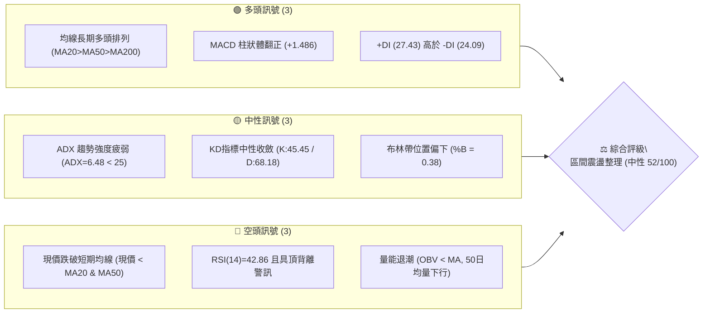
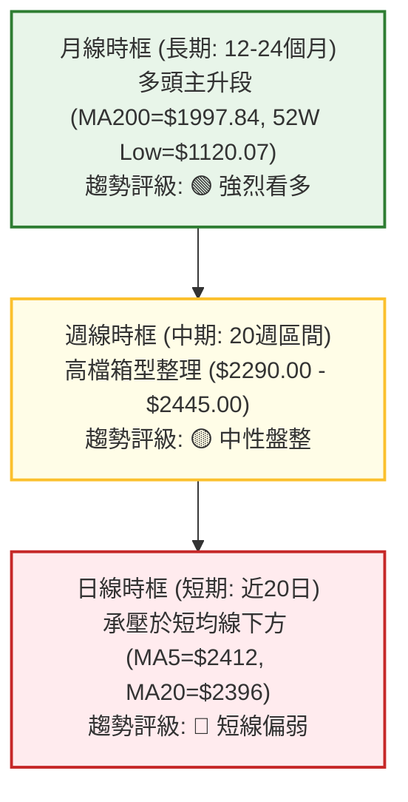
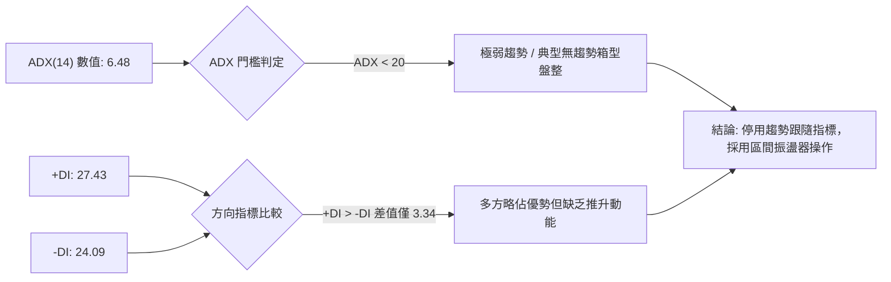
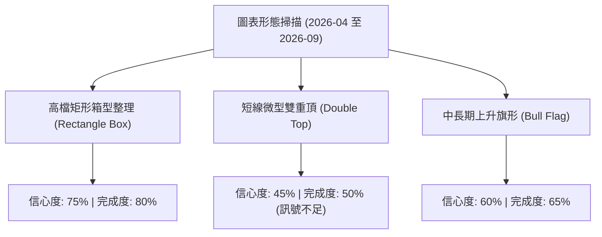
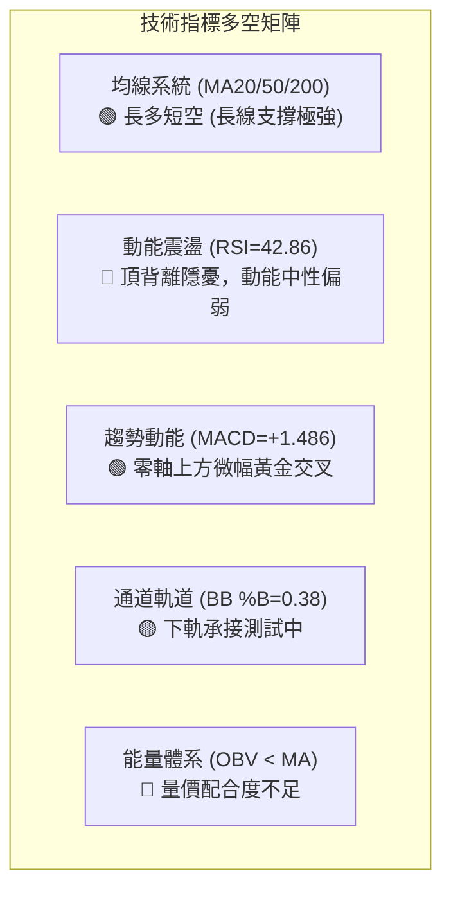
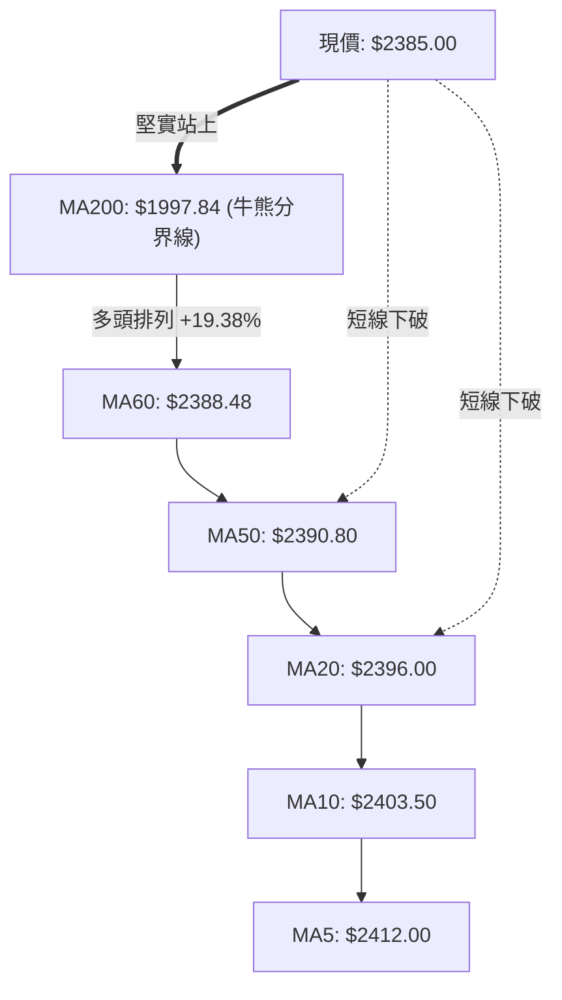
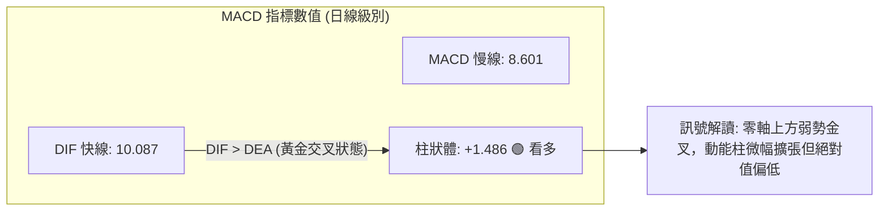
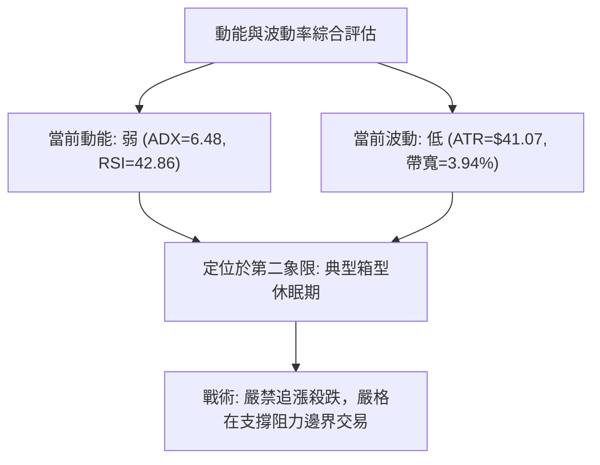
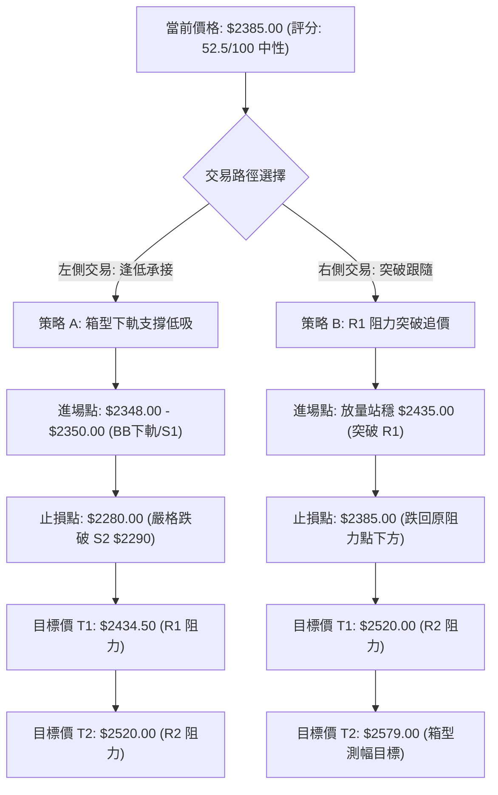
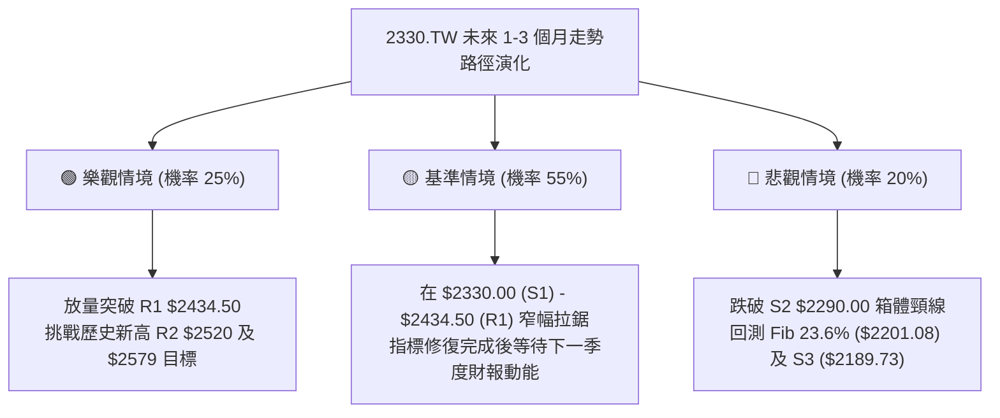

# 2330.TW 技術分析報告

> **報告日期**：2026-09-02 ｜ **語言**：繁體中文 ｜ **數據來源**：Yahoo Finance ｜ **當前價格**：$2385.00

---

## 目錄

| 章節 | 內容 |
|------|------|
| [1. 技術面概覽](#1-技術面概覽) | 訊號儀表板、核心指標、評分卡 |
| [2. 趨勢分析](#2-趨勢分析) | 多時框趨勢、長中短期走勢 |
| [3. 圖表形態分析](#3-圖表形態分析) | 形態識別、K線組合、目標價 |
| [4. 支撐與阻力](#4-支撐與阻力) | 關鍵價位、斐波那契回調 |
| [5. 技術指標深度解讀](#5-技術指標深度解讀) | MA/RSI/MACD/布林/成交量 |
| [6. 動能與波動率](#6-動能與波動率) | 動能評估、ATR、Beta |
| [7. 多時框架總結](#7-多時框架總結) | 時框架評分矩陣 |
| [8. 交易策略建議](#8-交易策略建議) | 多空策略、風險報酬比 |
| [9. 風險提示與監控](#9-風險提示與監控) | 監控指標、風險場景 |

---

## 1. 技術面概覽

### 🎯 技術訊號儀表板



---

### 📊 核心指標速覽表

| 指標類別 | 指標名稱 | 當前數值 | 訊號 | 解讀 |
|:---|:---|:---|:---:|:---|
| **價格** | 當前價格 | $2385.00 | 🟡 | 位於52週高低點區間 89.4% 之高檔整理區 |
| **均線** | MA20 (月線) | $2396.00 | 🔴 | 價格位於 MA20 下方 (-0.46%)，短線承壓 |
| **均線** | MA50 (季線) | $2390.80 | 🔴 | 價格位於 MA50 下方 (-0.24%)，多空爭奪中 |
| **均線** | MA200 (年線) | $1997.84 | 🟢 | 價格遠高於 MA200 (+19.38%)，長線多頭結構穩固 |
| **動能** | RSI(14) | 42.86 | 🔴 | 處於中性偏弱區間，週線與日線出現頂背離隱憂 |
| **動能** | MACD (12,26,9) | 10.087 / 8.601 | 🟢 | 快線高於慢線，柱狀體 +1.486 呈微幅多頭訊號 |
| **動能** | KD (9,3,3) | 45.45 / 68.18 | 🟡 | K值下穿D值後在中軸下方收斂，進入盤整鈍化 |
| **趨勢強度**| ADX(14) | 6.48 | 🟡 | ADX < 25，確認市場處於無方向性的窄幅箱型震盪 |
| **波動** | ATR(14) | $41.07 | 🟡 | 波動率佔股價 1.72%，日均波動區間收斂 |
| **通道** | 布林通道 %B | 0.38 | 🟡 | 位於中軌 ($2396.00) 與下軌 ($2348.92) 之間 |
| **量能** | 成交量 / 20日均量 | 19.82M / 17.68M | 🟡 | 今日量比 1.12x，但低於50日均量(27.01M)，量能偏弱 |

---

### 🏆 技術評分卡

```
╔════════════════════════════════════════════════════════════════╗
║             技術評分卡 — 2330.TW (2026-09-02)                  ║
╠════════════════════════════════════════════════════════════════╣
║ 趨勢強度 (ADX=6.48)      ████░░░░░░░░░░░░░░░░  25/100  🔴 盤整弱勢 ║
║ 動能指標 (RSI/MACD/KD)   ██████████░░░░░░░░░░  50/100  🟡 多空拉鋸 ║
║ 支撐穩定度 (S1/S2防守)   ██████████████░░░░░░  70/100  🟢 買盤承接 ║
║ 成交量能 (OBV/均量萎縮)  ████████░░░░░░░░░░░░  40/100  🔴 動能不足 ║
║ 形態結構 (高檔箱型收斂)  ████████████░░░░░░░░  60/100  🟡 蓄勢待變 ║
║ 均線排列 (長多短糾結)    ██████████████░░░░░░  70/100  🟢 底層支撐 ║
╠════════════════════════════════════════════════════════════════╣
║ 綜合技術評分             ██████████░░░░░░░░░░  52.5/100 🟡 中性觀望║
╚════════════════════════════════════════════════════════════════╝
```

---

## 2. 趨勢分析

### 🌐 多時框趨勢分析



---

### 📈 長期趨勢 — 12個月走勢圖（Unicode）

```
2330.TW 月線收盤走勢圖（2025-09 至 2026-09）
價格 ($)
$2500 ┤                                      ╭● $2425 (07月高點)
$2400 ┤                                  ╭─●─╯   ╰●─● $2385 (現價)
$2300 ┤                              ╭──● $2348.73 (05月)
$2100 ┤                          ╭──● $2129.32 (04月)
$1900 ┤                  ╭──●───╯ (02月 $1983.22)
$1700 ┤          ╭──●───╯   ╰● $1755.32 (03月回調)
$1500 ┤      ╭──●─╯ (12月 $1540.85)
$1300 ┤  ╭──● (09月 $1292.99)
$1100 ┤──╯ (歷史起漲基期)
      └─────────────────────────────────────────────────────────────
         09   10   11   12   01   02   03   04   05   06   07   08   09 (月份)
        '25  '25  '25  '25  '26  '26  '26  '26  '26  '26  '26  '26  '26 (年份)
```

#### 走勢階段特徵分析

| 階段 | 期間 | 價格區間 | 累計漲跌 | 趨勢特徵與量價結構 |
|:---|:---|:---|:---:|:---|
| **主升段起點** | 2025-09 ~ 2025-12 | $1292.99 → $1540.85 | +19.17% | 放量突破千元關卡，均線呈現發散多頭排列 |
| **主升加速段** | 2026-01 ~ 2026-02 | $1764.52 → $1983.22 | +12.39% | 月K連紅，外資與機構買盤集中，創當時歷史新高 |
| **中級回檔段** | 2026-02 ~ 2026-03 | $1983.22 → $1755.32 | -11.49% | 獲利了結賣壓湧現，測試季線支撐後迅速獲買盤承接 |
| **第二波推升** | 2026-04 ~ 2026-07 | $2129.32 → $2425.00 | +13.89% | 沿五日均線上攻，創下52週高點 $2535.00 |
| **高檔收斂段** | 2026-07 ~ 2026-09 | $2425.00 → $2385.00 | -1.65% | 窄幅區間整理，波動率與成交量顯著萎縮 |

---

### 📊 中期趨勢（週線分析）

中期走勢顯示自 2026 年 5 月底突破 $2300 關卡後，進入長達 15 週的橫盤整理區間（$2290.00 - $2445.00）。週成交量由 5 月初的 207M 股萎縮至當週的 64.21M 股，量縮幅度達 69%，顯示籌碼在此區間高度鎖定，市場等待方向性突破。

```
週線關鍵阻力與支撐區間示意圖
┌────────────────────────────────────────────────────────┐
│ 阻力上限 (R2): $2520.00 (歷史次高高點聚類)             │
│ 阻力下限 (R1): $2434.50 (區間頂部 / 08月波段高點)      │
├────────────────────────────────────────────────────────┤
│ 現價水位     : $2385.00 (中軌下方震盪)                │
├────────────────────────────────────────────────────────┤
│ 支撐上限 (S1): $2330.00 (箱型內部下緣支撐)             │
│ 支撐下限 (S2): $2290.00 (07-19 波段低點強支撐)         │
│ 結構低點 (S3): $2189.73 (斐波那契 23.6% 防守區)       │
└────────────────────────────────────────────────────────┘
```

---

### ⚡ 趨勢強度評估（ADX 解讀）



#### ADX 趨勢強度量化對照表

| ADX 區間 | 趨勢狀態 | 2330.TW 當前狀態 | 交易策略導向 |
|:---|:---|:---:|:---|
| **0 - 20** | **無趨勢 / 窄幅盤整** | **✅ 6.48 (當前)** | **高拋低吸，以布林通道與 S1/R1 操作** |
| **20 - 25** | 趨勢萌芽 / 弱趨勢 | ❌ | 觀望突破確認點 |
| **25 - 40** | 明確單邊趨勢 | ❌ | 順勢交易，均線跟隨 |
| **40 - 60** | 強勁單邊趨勢 | ❌ | 持股續抱，移停保護 |

---

## 3. 圖表形態分析

### 🔍 形態識別系統



#### 形態識別與信心度評估表

| 形態名稱 | 信心度 | 判斷依據（引用真實數據） | 完成度 | 目標價計算式與數值 |
|:---|:---:|:---|:---:|:---|
| **高檔矩形箱型整理** | **75%** | 上軌阻力 R1 $2434.50 與下軌支撐 S2 $2290.00 形成 4 個月震盪區間 | 80% | 箱型突破向上目標 = R1 ($2434.50) + 高度 ($144.50) = **$2579.00** |
| **上升旗形 (日/週線)** | **60%** | 旗桿自 $1755.32 漲至 $2535.00 (+779.68)，旗面在 $2300-$2445 整理 | 65% | 旗桿等長突破目標 = $2434.50 + $779.68 = **$3214.18** |
| **微型雙頂 (日線級別)** | **35%** | 兩次高點 $2445 (07-05) 與 $2425 (08-02)，但未跌破頸線 $2290 | 40% | *信心度 < 50%，視為箱型內部波動，不做獨立做空形態解讀* |

---

### 🕯️ 重要K線形態分析

| 週/月份 | 收盤價 | K線形態 | 量價解讀 | 技術訊號 |
|:---|:---|:---|:---|:---:|
| **2026-07-05** | $2445.00 | **長上影流星線** | 創波段反彈高點後遭遇外資阻力，留下影線，成交量 160.6M 股 | 🔴 阻力確認 |
| **2026-07-19** | $2290.00 | **長下影錘頭線** | 測試下軌支撐 S2 ($2290.00) 獲強力買盤承接，週量放大至 200.1M | 🟢 支撐確立 |
| **2026-08-02** | $2425.00 | **高檔紅K十字星** | 週成交量激增至 217.6M 股，但實體狹窄，顯現高檔換手滯漲 | 🟡 轉折預警 |
| **2026-08-30** | $2420.00 | **量縮小陽線** | 上攻缺乏量能配合 (71.01M 股)，未能有效衝擊 R1 阻力 | 🔴 量價背離 |
| **2026-09-06** | $2385.00 | **短黑K回測中軌** | 量能萎縮至 64.21M 股，價格回落至 MA20 與 MA50 下方 | 🟡 區間震盪 |

---

### 📉 ASCII 走勢形態示意圖

```
2330.TW 高檔箱型整理與突破路徑示意圖
價格 ($)
$2535.00 ┤─── 52W High (0.0% Fib)
         │
$2434.50 ├───┬────────● (07-05: $2445) ─────● (08-02: $2425) ─── 箱型頂部阻力 (R1)
         │   │       / \                   / \
$2385.00 ├───┼──────/───\─────────────────/───● 現價 ($2385.00) ── 中軌拉鋸
         │   │     /     \               /     \
$2290.00 ├───┴────● (06-28: $2340) ────● (07-19: $2290) ──────── 箱型底部支撐 (S2)
         │
$2201.08 ├─── 23.6% 斐波那契防守位 (S3: $2189.73)
         └─────────────────────────────────────────────────────────────
```

---

### 🎯 形態目標價計算

依據標準幾何測量規則，高檔矩形整理箱型計算公式如下：

1. **箱體頂部阻力 ($R_{Box}$)**：$2434.50
2. **箱體底部支撐 ($S_{Box}$)**：$2290.00
3. **箱體垂直高度 ($H$)**：$2434.50 - $2290.00 = **$144.50**
4. **向上突破最小測幅目標價 ($T_{Up}$)**：
   $$T_{Up} = R_{Box} + H = 2434.50 + 144.50 = \$2579.00$$
5. **向下破位最小測幅目標價 ($T_{Down}$)**：
   $$T_{Down} = S_{Box} - H = 2290.00 - 144.50 = \$2145.50$$

---

## 4. 支撐與阻力

### 🗺️ 關鍵價位分布圖（Unicode）

```
2330.TW 價位結構分布圖
══════════════════════════════════════════════════════════════════
$2535.00 ║████████████████████████████████║ 52週歷史高點 (52W High)
$2520.00 ║████████████████████████        ║ 強阻力 R2 (次高高點聚類)
$2434.50 ║██████████████████████████████  ║ 關鍵阻力 R1 (箱型頂部 +2.08%)
$2385.00 ╠════════════════════════════════╣ ◄ 現價 ($2385.00)
$2348.92 ║░░░░░░░░░░░░░░░░░░░░░░░░        ║ 布林通道下軌動態支撐
$2330.00 ║▓▓▓▓▓▓▓▓▓▓▓▓▓▓▓▓▓▓▓▓▓▓          ║ 近期支撐 S1 (波段密集區 -2.31%)
$2290.00 ║████████████████████████████    ║ 強支撐 S2 (中期多空分水嶺 -3.98%)
$2201.08 ║████████████████████████████████║ 23.6% 斐波那契回調位
$2189.73 ║████████████████████████████████║ 結構強支撐 S3 (波段低點聚類 -8.19%)
══════════════════════════════════════════════════════════════════
```

---

### 🚧 阻力位分析表

| 阻力級別 | 價位 | 距現價幅幅 | 形成原因 | 突破難度 | 重要性 |
|:---|:---:|:---:|:---|:---:|:---:|
| **R1 (關鍵阻力)** | **$2434.50** | +2.08% | 近一年波段高點聚類區、2026年7-8月反彈頂部 | 🟡 中等 | ★★★★☆ |
| **R2 (強阻力)** | **$2520.00** | +5.66% | 逼近52週歷史高點之獲利了結籌碼密集區 | 🔴 極高 | ★★★★★ |
| **52W High** | **$2535.00** | +6.29% | 歷史天花板價位，全市場空頭最終防線 | 🔴 極高 | ★★★★★ |

---

### 🛡️ 支撐位分析表

| 支撐級別 | 價位 | 距現價幅幅 | 形成原因 | 守住機率 | 重要性 |
|:---|:---:|:---:|:---|:---:|:---:|
| **S1 (近期支撐)** | **$2330.00** | -2.31% | 近一年波段低點聚類、布林下軌附近支撐帶 | 70% | ★★★☆☆ |
| **S2 (強支撐)** | **$2290.00** | -3.98% | 2026-07-19 探底長下影線低點、箱型底部頸線 | 80% | ★★★★★ |
| **S3 (結構支撐)** | **$2189.73** | -8.19% | 2026年4-5月起漲平台聚類、逼近 Fib 23.6% | 90% | ★★★★☆ |

---

### 📐 斐波那契回調位分析

*基準區間：52週波段低點 $1120.07 → 52週波段高點 $2535.00（垂直跨度 $1414.93）*

| 回調比例 | 斐波那契價位 | 與現價關係 | 技術意涵與防守意義 |
|:---:|:---:|:---:|:---|
| **0.0%** | **$2535.00** | +6.29% | 52週歷史頂部，多頭完全擴展位 |
| **23.6%** | **$2201.08** | -7.71% | **強勢回檔極限**；現價 ($2385.00) 遠在此價位之上，代表多頭格局極強 |
| **38.2%** | **$1994.50** | -16.37% | 經典黃金分割位，與 MA200 ($1997.84) 形成完美重合共振 |
| **50.0%** | **$1827.53** | -23.37% | 多空中樞平衡線 |
| **61.8%** | **$1660.57** | -30.37% | 多頭最後防線（黃金回調位） |
| **78.6%** | **$1422.86** | -40.34% | 深度回檔支撐區 |
| **100.0%** | **$1120.07** | -53.04% | 52週波段起漲點（歷史低點） |

> 📌 **斐波那契位置解讀**：現價 $2385.00 處於 0.0% ($2535.00) 與 23.6% ($2201.08) 之間的高檔強勢區間。自高點回調僅消耗了 10.6% 的波段漲幅，結構上屬於極強勢的高位換手。

---

## 5. 技術指標深度解讀

### 🎛️ 指標訊號總覽



---

### 📈 移動平均線排列分析



#### 均線各週期參數與現價偏離度

| 週期均線 | 當前數值 | 現價偏離幅度 | 排列方向 | 短期趨勢意義 |
|:---|:---:|:---:|:---:|:---|
| **MA5** | $2412.00 | -1.12% | 下行 (▼) | 短線極線阻力，5日內追價動能不足 |
| **MA10** | $2403.50 | -0.77% | 下行 (▼) | 短期扣高壓力，壓制股價反彈 |
| **MA20** | $2396.00 | -0.46% | 下行 (▼) | 月線生命線轉為動態微幅阻力 |
| **MA50** | $2390.80 | -0.24% | 下行 (▼) | 季線位置，多空短兵相接區域 |
| **MA60** | $2388.48 | -0.15% | 下行 (▼) | 中期均線平緩，指示方向不明 |
| **MA120** | $2245.25 | +6.22% | 上行 (▲) | 半年線強勢向上，中期多頭基石 |
| **MA200** | $1997.84 | +19.38% | 上行 (▲) | 年線遠在下方，確立結構性長期大牛市 |
| **MA240** | $1892.83 | +26.00% | 上行 (▲) | 長期均線多頭排列：MA20 > MA50 > MA200 |

---

### 📉 RSI(14) 分析

```
RSI(14) 當前數值: 42.86
超賣 (0-30)                中性區間 (30-70)               超買 (70-100)
├───────────────┼───────────────────────────────┼───────────────┤
0              30              42.86           70             100
[░░░░░░░░░░░░░░░█████████████░░░░░░░░░░░░░░░░░░░░░░░░░░░░░░░░░░]
```

#### ⚠️ 背離分析結論：
1. **頂背離確認**：2026年4月股價在 $2179.19 時，週 RSI 達到 **86.4** 的極端超買區；隨後股價於 7 月創下 $2445.00 新高，但週 RSI 僅達 **60.8**，形成顯著的**中週期頂背離（Bearish Divergence）**。
2. **動能釋放**：當前 RSI 回落至 **42.86**，中性偏弱，尚未觸及超賣區 (<30)。這解釋了近期股價上攻乏力、持續在 $2385 附近橫向消耗背離壓力的現象。

---

### 📊 MACD(12/26/9) 訊號解讀



* **快慢線位置**：DIF (10.087) 與 DEA (8.601) 均位於零軸上方，維持大方向多頭市場特徵。
* **柱狀體變化**：週線柱狀體自 7 月底的 -15.213 逐步收斂並翻正為 +1.486，代表空方殺跌力道竭盡，但多方亦未展現強攻動能，呈現低位弱平衡。

---

### 📦 布林通道分析

```
布林通道 (20, 2) 價位結構圖
$2443.08 ┤════════════════════════════════ 上軌 (BB Upper)
         │           ╭─╮
$2396.00 ┼──────────╭╯─╰╮───────────────── 中軌 (MA20: $2396.00)
         │   ╭─╮    │   │  ● 現價: $2385.00 (%B = 0.38)
$2348.92 ┤───╯─╰────╯───╰───────────────── 下軌 (BB Lower)
         └─────────────────────────────────
```

* **帶寬特徵**：通道帶寬 ($2443.08 - $2348.92 = $94.16) 寬度僅 3.94%，處於歷史低波動擠壓（Squeeze）狀態。
* **現價位置**：%B = 0.38，價格運行於中軌與下軌之間，短線回測下軌 $2348.92 尋求支撐。

---

### 💹 成交量分析（量價配合度）

```
成交量結構柱狀比較 (單位: 股)
今日量能:   19.82M  ████████████████████ (量比 1.12x vs 20MA)
20日均量:   17.68M  ██████████████████
50日均量:   27.01M  ███████████████████████████ (中期基準)
```

1. **量價背離現象**：近 20 週成交量從 5 月份週均 170M-200M 股急劇萎縮至近期 64M-80M 股，呈現「價高量縮」的量價背離。
2. **OBV 能量潮**：當前 OBV 低於其移動平均線（OBV < MA），確認籌碼在 $2400 以上追價意願低落，增量資金尚未進場，行情維持存量博弈。

---

## 6. 動能與波動率

### ⚡ 動能評估四象限

| 象限 | 動能強度 | 波動率水準 | 當前狀態 | 策略意涵 |
|:---:|:---:|:---:|:---:|:---|
| **第一象限 (Q1)** | 強動能 | 低波動 | — | 最佳趨勢加速買點 |
| **第二象限 (Q2)** | **弱動能 (RSI 42.86)** | **低波動 (ATR 1.72%)** | **✅ 2330.TW (當前定位)** | **區間震盪，低吸高拋，耐心等待變盤** |
| **第三象限 (Q3)** | 強動能 | 高波動 | — | 高風險高報酬單邊行情 |
| **第四象限 (Q4)** | 弱動能 | 高波動 | — | 劇烈洗盤，嚴禁進場 |



---

### 📊 ATR 波動率分析

* **當前 ATR(14)**：**$41.07**（佔當前股價 **1.72%**）。
* **波動率評估**：每日合理波動區間約在 $\pm \$41$ 內，市場處於極度平穩的換手期。
* **風控止損建議**：
  * **短線交易止損距離**：$1.0 \times \text{ATR} = \$41.07$
  * **波段交易止損距離**：$2.0 \times \text{ATR} = \$82.14$
  * **當前現價 $2385.00 之波段合理防守位**：$\$2385.00 - \$82.14 = \$2302.86$（與 S2 強支撐 $2290.00 高度契合）。

---

### 📐 Beta 與市場相關性

* **Beta 係數**：**1.258**
* **分析**：作為台股權重第一大權值股（市值 61.85 兆 TWD），Beta > 1 顯示其對加權指數具備高敏感度與引領作用。當大盤出現方向性表態時，2330.TW 的突破幅度將放大 1.25 倍。

---

## 7. 多時框架總結

### 📋 時框架評分表

| 時框架 | 趨勢方向 | 動能狀態 | 均線排列 | 形態結構 | 綜合評分 | 建議操作導向 |
|:---|:---:|:---:|:---:|:---:|:---:|:---|
| **月線 (長期)** | 🟢 強烈看多 | 🟢 強勁 | 多頭排列 (現價遠高於MA200) | 上升通道延續 | **88/100** | 戰略性多頭持有 |
| **週線 (中期)** | 🟡 中性盤整 | 🟡 整理 | 糾結收斂 (MA20附近拉鋸) | 高檔矩形整理箱 | **55/100** | 區間波段操作 |
| **日線 (短期)** | 🔴 短線偏弱 | 🔴 疲弱 | 承壓均線 (現價 < MA20/MA50) | 測試通道下軌 | **42/100** | 逢低承接、不追高 |

---

### 🔲 綜合訊號矩陣

```
時框訊號一致性交叉檢視
┌──────────────┬──────────────┬──────────────┬────────────────────────┐
│ 指標系統     │ 日線 (短期)  │ 週線 (中期)  │ 月線 (長期)            │
├──────────────┼──────────────┼──────────────┼────────────────────────┤
│ 均線系統     │ 🔴 跌破短均  │ 🟡 均線糾結  │ 🟢 完美多頭 (MA20>50>200)│
│ RSI 指標     │ 🟡 42.86偏弱 │ 🔴 頂背離    │ 🟢 65.0 處強勢區       │
│ MACD 指標    │ 🟢 弱勢金叉  │ 🟡 柱狀收斂  │ 🟢 零軸上方發散        │
│ 布林軌道     │ 🟡 逼近下軌  │ 🟡 中軌震盪  │ 🟢 沿上軌運行          │
│ 趨勢強度 ADX │ 🔴 ADX=6.48  │ 🟡 ADX=18.2  │ 🟢 ADX>35 趨勢明確     │
└──────────────┴──────────────┴──────────────┴────────────────────────┘
```

---

### ⚖️ 多時框收斂結論

> **🚨 多時框收斂判定**：
> 1. **行情性質定位**：當前 **ADX(14) = 6.48 (< 25)**，嚴格判定為**盤整行情（Consolidation Regime）**。
> 2. **主導依據**：依多時框收斂規則，盤整行情中日線布林通道（$2348.92 - $2443.08）與 S1/S2 支撐為核心交易區間；長期週/月線多頭提供強大的下檔安全邊際。
> 3. **唯一方向性結論**：**【🟡 中性偏多·區間震盪】**。策略以「箱型下軌支撐承接、上軌阻力獲利了結」為主，嚴禁追價。

---

## 8. 交易策略建議

### 🗺️ 策略決策流程圖



---

### 🧭 策略路由

* **綜合技術評分**：**52.5 / 100**（落於 40–60 中性區間）。
* **當前主策略方向**：**【區間操作·箱型操作為主，突破策略為輔】**。

---

### 🎯 價格情境階梯（Price Scenarios）

*所有價位均嚴格引用第 4 章真實計算數值*：

| 觸發條件 | 下一目標 | 後續延伸目標 | 情境技術含義 |
|:---|:---:|:---:|:---|
| **向上突破 R1 ($2434.50)** | **R2 ($2520.00)** | **52W High ($2535.00)** | 箱型向上突破，多頭重啟加速波 |
| **維持現價區間 ($2348 - $2434)** | **MA20 ($2396.00)** | **BB上軌 ($2443.08)** | 區間震盪蓄勢，指標進行低位修復 |
| **跌破 S1 ($2330.00)** | **S2 ($2290.00)** | **S3 ($2189.73)** | 短線轉弱，回測中期上升旗面底部 |

---

### 📊 情境機率分佈

| 情境劇本 | 機率估計 | 主要技術指標與籌碼依據 |
|:---|:---:|:---|
| **區間震盪整理 (主力劇本)** | **55%** | ADX = 6.48 確認無單邊趨勢；布林帶寬收窄；量能低於50日均量 |
| **向上突破上行 (次要劇本)** | **25%** | MACD 處於零軸上方弱勢金叉；月線長期多頭結構提供有力支撐 |
| **向下破位回踩 (防守劇本)** | **20%** | RSI 頂背離壓力尚未完全消除；OBV 能量潮疲弱 |

---

### 🟢 主策略詳情

| 策略要素 | 策略 A（區間下軌低吸·主要策略） | 策略 B（突破追隨·右側策略） |
|:---|:---:|:---:|
| **操作類型** | 左側逢低分批布局 | 右側確認突破進場 |
| **進場條件** | 股價回踩布林下軌並在 S1 出現止跌K線 | 日K收盤價放量突破 R1 $2434.50 且量比 > 1.5x |
| **進場價格** | **$2348.00** | **$2438.00** |
| **目標價 T1** | **$2434.50** (R1 阻力區，預期報酬 +3.68%) | **$2520.00** (R2 阻力區，預期報酬 +3.36%) |
| **目標價 T2** | **$2520.00** (R2 阻力區，預期報酬 +7.33%) | **$2579.00** (箱型等幅測算，預期報酬 +5.78%) |
| **止損價格** | **$2280.00** (跌破 S2 $2290.00 強支撐) | **$2385.00** (跌回 MA20 及突破頸線下方) |
| **風險報酬比 (R:R)**| **1 : 2.53** (以 T2 計算) | **1 : 2.66** (以 T2 計算) |
| **成功機率估算** | **65%** | **55%** |
| **建議配置倉位** | **15% - 20%** | **10% - 15%** |

---

### 🔴 反向風險觸發點（對沖提示）

若發生以下任一訊號，應立即停止多頭操作並啟動現貨避險：
1. **關鍵支撐失守**：日K收盤價**實體跌破 S2 ($2290.00)**，代表高檔箱型結構破位，將下探 S3 ($2189.73) 及 23.6% 斐波那契回調位 ($2201.08)。
2. **放量殺跌**：日成交量突發放大至 35M 股以上且收長黑K跌破 $2330 (S1)。

---

### ⭐ 整體訊號強度評星

```
做多訊號強度：★★★☆☆  (3.0 / 5星 — 長線看多但短線缺乏動能)
做空訊號強度：★★☆☆☆  (2.0 / 5星 — 下檔均線支撐密集，做空盈虧比差)
整體可信度：  ★★★★☆  (4.0 / 5星 — 數據結構清晰，高檔箱型明確)
```

---

## 9. 風險提示與監控

### ✅ 關鍵監控指標 Checklist

```
╔════════════════════════════════════════════════════════════════╗
║                   每日交易監控清單 Checklist                   ║
╠════════════════════════════════════════════════════════════════╣
║ [ ] 價格是否站回 MA20 ($2396.00) 與 MA50 ($2390.80) 之上       ║
║ [ ] RSI(14) 是否向上突破 50 中軸分水嶺 (當前 42.86)           ║
║ [ ] MACD 柱狀體是否持續放大擴展 (當前 +1.486)                  ║
║ [ ] 成交量是否有效放大超越 20日均量 17.68M 股                  ║
║ [ ] ADX(14) 是否自 6.48 低檔抬頭突破 20 (判斷新趨勢啟動)        ║
║ [ ] 下檔是否嚴守 S1 ($2330.00) 與 S2 ($2290.00) 關鍵防線       ║
╚════════════════════════════════════════════════════════════════╝
```

---

### ⚠️ 風險場景分析



---

### 🛡️ 風險管理重要提醒

1. **ATR 動態倉位控制**：鑑於當前 ATR 為 $41.07，單筆交易的最大止損金額應嚴格限制在總投資組合淨值的 **1.0%** 以內。
2. **避免追高摩擦成本**：在 ADX < 25 的盤整環境中，任何於布林通道上軌（$2443.08）或 R1（$2434.50）附近的追高行為，均極易遭遇假突破洗盤。
3. **長期基本面保護**：法人共識目標價均值達 **$3229.33**（最高看至 $4200.00，評級為 Strong Buy），若出現非理性急跌至 S3（$2189.73）甚至年線 MA200（$1997.84），均為長線投資者之極佳加碼機會。

---

## 📋 報告總結

```
╔══════════════════════════════════════════════════════════════════════════╗
║                    2330.TW 技術分析報告總結                              ║
╠══════════════════════════════════════════════════════════════════════════╣
║ 報告日期：2026-09-02                                                    ║
║ 當前價格：$2385.00                                                      ║
║ 分析評級：⚖️ 中性觀望 (52.5/100) — 高檔箱型蓄勢震盪                      ║
║                                                                          ║
║ 關鍵結構結論：                                                           ║
║ ├─ 長期趨勢：🟢 強烈看多 (MA20>MA50>MA200，年線 $1997.84 穩固支撐)      ║
║ ├─ 中期趨勢：🟡 中性盤整 (受困於 $2290.00 - $2434.50 箱型整理)         ║
║ ├─ 短期趨勢：🔴 短線偏弱 (承壓於 MA20 $2396.00 下方，量能萎縮)          ║
║ ├─ 關鍵阻力：R1 = $2434.50 ｜ R2 = $2520.00 ｜ 52W High = $2535.00      ║
║ ├─ 關鍵支撐：S1 = $2330.00 ｜ S2 = $2290.00 ｜ S3 = $2189.73           ║
║ └─ 法人目標：均價 $3229.33 ｜ 最高 $4200.00 (Strong Buy 共識)           ║
║                                                                          ║
║ 最優交易策略組合：                                                       ║
║ 1. 🥇 最佳機會（策略 A）：於布林下軌 $2348.00 附近低吸，停損設 $2280.00   ║
║    目標看 R1 $2434.50 / R2 $2520.00 (風險報酬比 1:2.53)                 ║
║ 2. 🥈 次選機會（策略 B）：放量實體突破 R1 $2434.50 後追隨進場，看 $2579  ║
║ 3. 🥉 保守選擇：維持現貨底倉觀望，等待 ADX > 20 或放量突破後再行動作   ║
╚══════════════════════════════════════════════════════════════════════════╝
```

---

> ⚠️ **免責聲明**：本報告為 AI 自動生成之技術分析，所有數據及估算均基於歷史價格與技術指標客觀推導。本報告**僅供研究與學術參考**，**不構成任何形式的投資要約或買賣建議**。金融市場投資具有本金虧損風險，投資人應依個人財務狀況與風險承受度獨立判斷並自負盈虧。

---

*報告生成時間：2026-09-02 ｜ 數據來源：Yahoo Finance ｜ 分析框架：多時框架技術分析 (MTFA)*