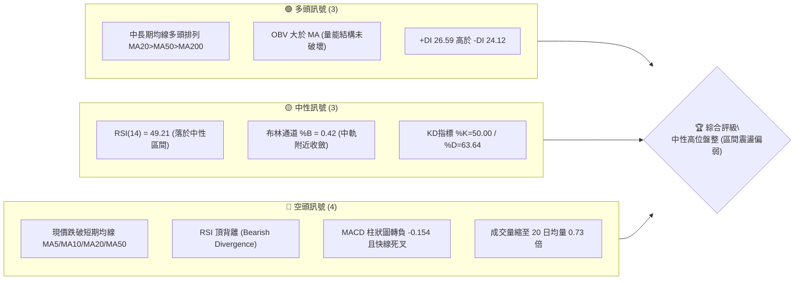
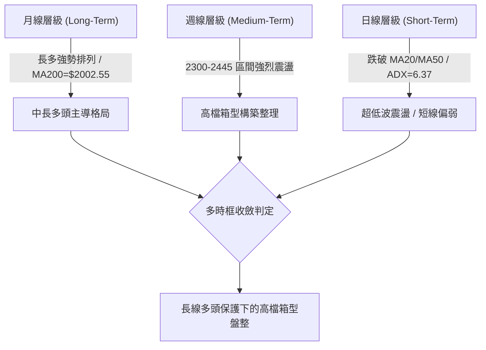
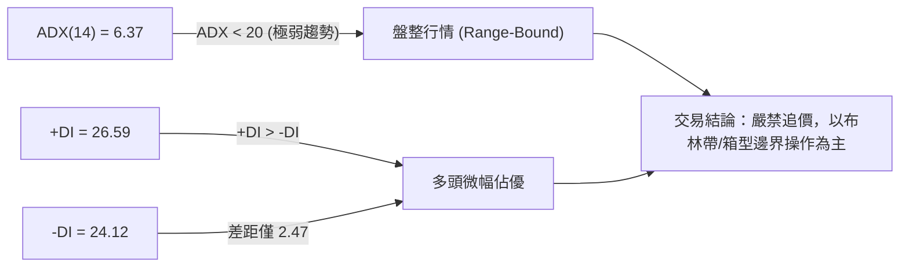
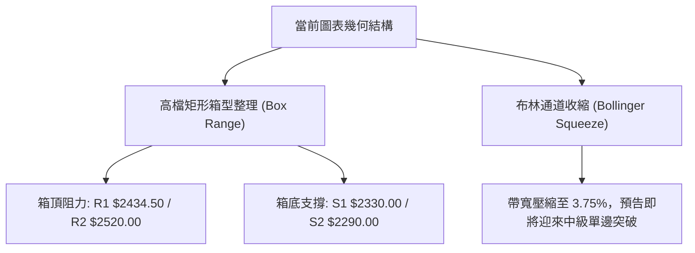
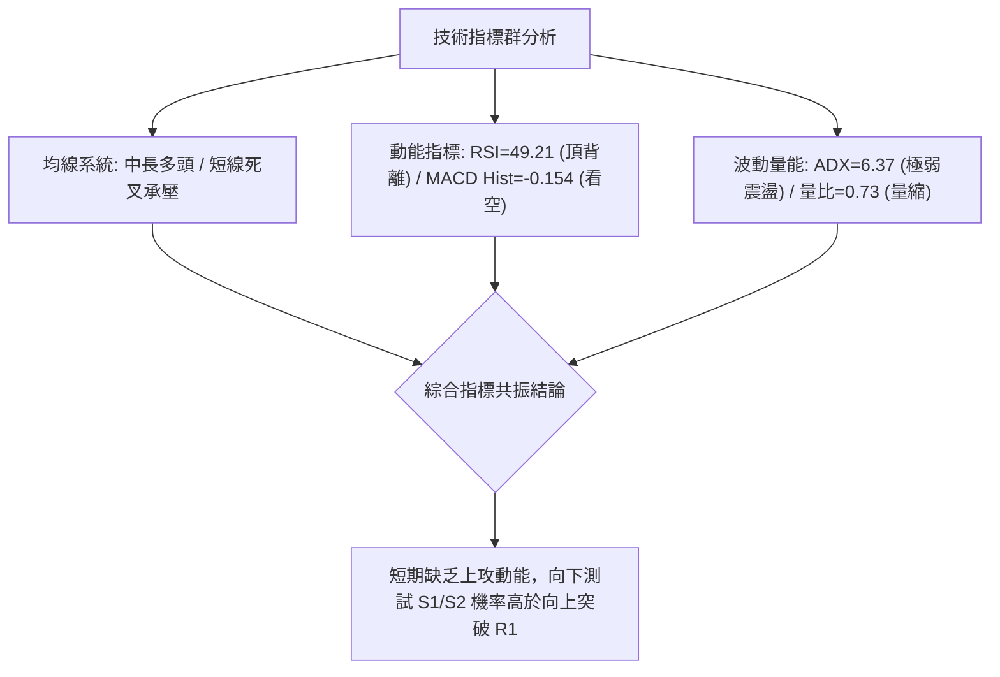
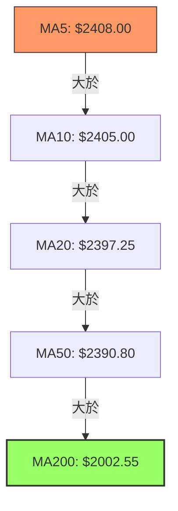
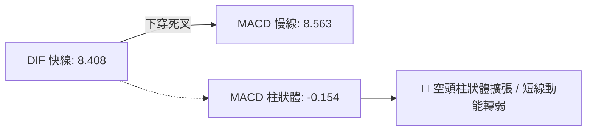
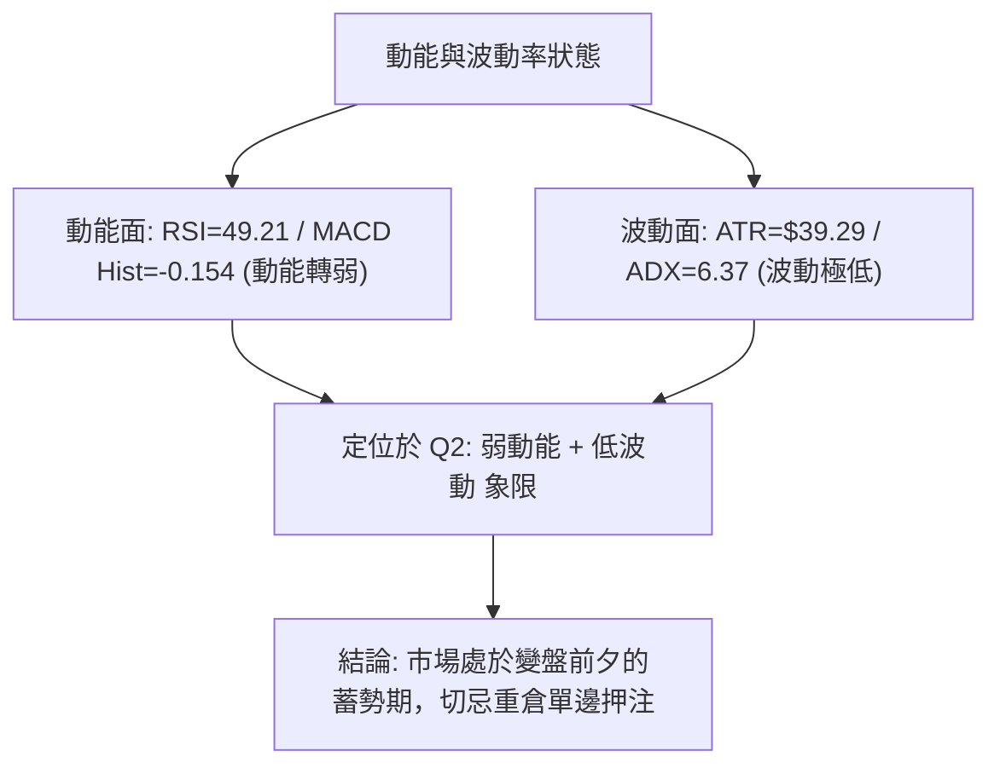
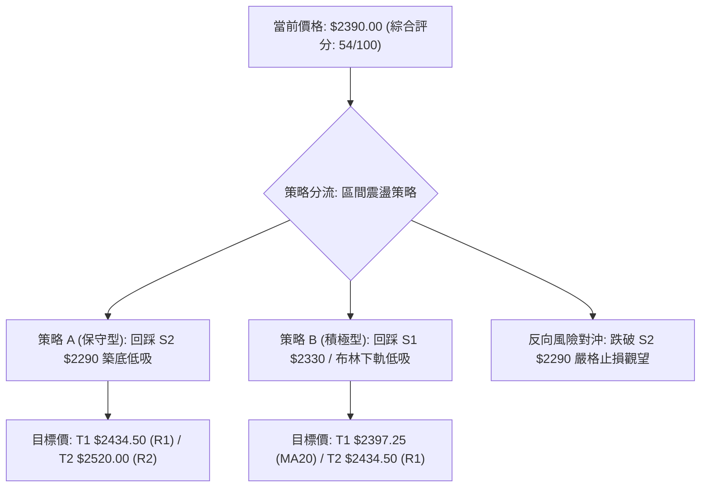
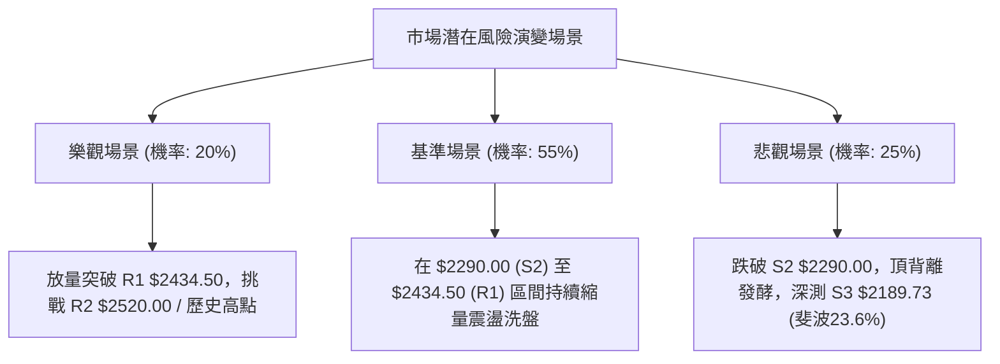

# 2330.TW 技術分析報告

> **報告日期**：2026-09-03 ｜ **語言**：繁體中文 ｜ **數據來源**：Yahoo Finance ｜ **當前價格**：$2390.00

---

## 目錄

| 章節 | 內容 |
|------|------|
| [1. 技術面概覽](#1-技術面概覽) | 訊號儀表板、核心指標、評分卡 |
| [2. 趨勢分析](#2-趨勢分析) | 多時框趨勢、長中短期走勢 |
| [3. 圖表形態分析](#3-圖表形態分析) | 形態識別、K線組合、目標價 |
| [4. 支撐與阻力](#4-支撐與阻力) | 關鍵價位、斐波那契回調 |
| [5. 技術指標深度解讀](#5-技術指標深度解讀) | MA/RSI/MACD/布林/成交量 |
| [6. 動能與波動率](#6-動能與波動率) | 動能評估、ATR、Beta |
| [7. 多時框架總結](#7-多時框架總結) | 時框架評分矩陣 |
| [8. 交易策略建議](#8-交易策略建議) | 多空策略、風險報酬比 |
| [9. 風險提示與監控](#9-風險提示與監控) | 監控指標、風險場景 |

---

## 1. 技術面概覽

### 🎯 技術訊號儀表板



### 📊 核心指標速覽表

| 指標類別 | 指標名稱 | 當前數值 | 訊號 | 解讀 |
|----------|----------|----------|------|------|
| **價格** | 當前價格 | $2390.00 | 🟡 中性 | 處於52週高低區間 89.8% 高位收斂盤整 |
| **均線** | MA20 | $2397.25 | 🔴 空頭 | 價格位於短期月線下方 (-0.30%)，短線承壓 |
| **均線** | MA50 | $2390.80 | 🔴 空頭 | 價格跌破季線邊緣 (-0.03%)，多空臨界點 |
| **均線** | MA200 | $2002.55 | 🟢 多頭 | 價格遠高於年線 (+19.35%)，長多結構穩固 |
| **動能** | RSI(14) | 49.21 | 🟡 中性 | 處於40-60平衡區，但具備頂背離回吐壓力 |
| **動能** | MACD Hist | -0.154 | 🔴 空頭 | MACD 柱翻負，DIF(8.408) 跌破 MACD(8.563) |
| **趨勢** | ADX(14) | 6.37 | 🟡 中性 | 數值極低 (<25)，市場處於低波收斂盤整期 |
| **量能** | 成交量比 | 0.73x | 🟡 中性 | 最新成交量 12.60M 低於 20MA (17.16M)，動能不足 |
| **波動** | ATR(14) | $39.29 | 🟢 低波 | 佔股價 1.64%，短線波動率收縮至區間低檔 |

### 🏆 技術評分卡

```
╔══════════════════════════════════════════════════════════╗
║             技術評分卡 — 2330.TW (2026-09-03)             ║
╠══════════════════════════════════════════════════════════╣
║ 趨勢強度 (ADX=6.37)  ███░░░░░░░░░░░░░░░░░  18/100  🔴 盤整║
║ 動能指標 (RSI/MACD)  ████████░░░░░░░░░░░░  42/100  🟡 偏弱║
║ 支撐穩定度 (S1/S2)   ██████████████░░░░░░  70/100  🟢 良好║
║ 成交量配合 (0.73x)   ████████░░░░░░░░░░░░  40/100  🟡 量縮║
║ 形態完整度 (區間箱型)████████████░░░░░░░░  60/100  🟡 中性║
║ 均線排列 (長多短空)  █████████████░░░░░░░  65/100  🟢 偏多║
╠══════════════════════════════════════════════════════════╣
║ 綜合技術評分         ███████████░░░░░░░░░  54/100  🟡 中性║
╚══════════════════════════════════════════════════════════╝
```

---

## 2. 趨勢分析

### 🌐 多時框趨勢分析



### 📈 長期趨勢 — 12個月走勢圖（Unicode）

```
2330.TW 月線收盤走勢圖（2025-09 至 2026-09）
價格 ($)
$2500 ┤                                     ● $2425 (07)
$2400 ┤                                 ● $2410   ● $2405  ● $2390(現價)
$2300 ┤                             ● $2348 (05)
$2100 ┤                         ● $2129 (04)
$1900 ┤                 ● $1983 (02)
$1700 ┤             ● $1764 (01)  ● $1755 (03)
$1500 ┤         ● $1540 (12)
$1400 ┤     ● $1486 (10)  ● $1426 (11)
$1200 ┤ ● $1292 (09)
      └─┬─────┬─────┬─────┬─────┬─────┬─────┬─────┬─────┬─────┬─────┬─────┬─────
       09    10    11    12    01    02    03    04    05    06    07    08    09 (2026)
```

#### 走勢特徵分析表格

| 階段區間 | 起始/結束價 | 漲跌幅 | 主要走勢特徵與技術驅動因素 |
|----------|-------------|--------|----------------------------|
| **2025/09 - 2026/02** | $1292.99 → $1983.22 | **+53.38%** | 主升段加速上漲，突破所有中長期均線，量價齊揚 |
| **2026/02 - 2026/03** | $1983.22 → $1755.32 | **-11.49%** | 波段獲利了結回檔，於 $1755.32 築出中期堅實底部 |
| **2026/03 - 2026/07** | $1755.32 → $2425.00 | **+38.15%** | 次升段爆發，創下 52 週歷史新高 $2535.00 |
| **2026/07 - 2026/09** | $2425.00 → $2390.00 | **-1.44%** | 高位縮量收斂橫盤，均線聚攏，進入多空方向抉擇期 |

### 📊 中期趨勢（週線分析）

中期走勢自 2026 年 5 月底站上 $2348.73 以來，近 15 週收盤價均維持在 $2290.00 至 $2445.00 之間。雖然在 2026-07-19 曾一度下探週收盤 $2290.00（即關鍵支撐 S2），但隨即快速拉回，顯示下方買盤具有高承接力道。然而，上攻動能受阻於 R1 ($2434.50) 及 R2 ($2520.00)，呈現收斂三角形與箱型複合形態。

### ⚡ 趨勢強度評估（ADX 解讀）



| ADX 區間 | 趨勢強度定義 | 當前狀態判定 | 交易策略指導 |
|----------|--------------|--------------|--------------|
| **0 - 20** | **極弱趨勢 / 完全盤整** | **✓ (6.37)** | **高拋低吸，採用震盪指標 (Stoch/BB)，不可追突破** |
| 20 - 25 | 趨勢醞釀 / 弱趨勢 | - | 關注量能變化，等待均線發散 |
| 25 - 40 | 明確強趨勢 | - | 順勢交易，回調均線加碼 |
| 40 - 100 | 極強趨勢 / 單邊行情 | - | 持股續抱，移定移動止盈 |

---

## 3. 圖表形態分析

### 🔍 形態識別系統



#### 形態信心度與目標價評估表

| 形態名稱 | 信心度 | 判斷依據（引用數據） | 完成度 | 目標價（附計算式） |
|----------|--------|----------------------|--------|--------------------|
| **高檔箱型整理** | **78%** | 價格在近 15 週波動於 S2 ($2290.00) 與 R1 ($2434.50) 之間，OBV 保持平穩 | 85% | 向上突破 R1 測度：$2434.50 + ($2434.50 - $2290.00) = **$2579.00**；跌破 S2 測度：$2290.00 - $144.50 = **$2145.50** |
| **布林帶寬擠壓** | **70%** | BB 上軌 $2442.14 與下軌 $2352.36 差距僅 $89.78 (3.75%) | 90% | 向上突破上軌目標：**$2520.00 (R2)**；跌破下軌目標：**$2290.00 (S2)** |
| **頭肩頂形態** | 35% | 數據不足（僅右肩震盪未破頸線 S2 $2290.00），訊號不足 | 30% | 訊號不足，僅做指標型解讀，不預設目標價 |

### 🕯️ 重要K線形態分析

| 週期/月份 | 收盤價 | K線形態特徵 | 技術面解讀 | 多空訊號 |
|-----------|--------|-------------|------------|----------|
| **2026-07-19 (週)** | $2290.00 | 長下影長黑反轉 | 測試 S2 支撐成功，單週爆量 200M 籌碼換手 | 🟢 轉強多頭 |
| **2026-08-02 (週)** | $2425.00 | 高位十字星 | 上攻 R1 阻力遭遇解套拋壓，217M 大量滯漲 | 🔴 空頭阻力 |
| **2026-08-30 (週)** | $2420.00 | 縮量小陽線 | 量能驟降至 71M，高檔追價意願極度低落 | 🟡 中性量縮 |
| **2026-09-06 (日/週)**| $2390.00 | 窄幅實體收黑 | 跌破 MA20 與 MA50 匯合處，短線動能熄火 | 🔴 短線偏弱 |

### 📉 ASCII 走勢形態示意圖

```
2330.TW 高檔箱型收斂走勢示意圖
      [$2535.00 52W High]
            ▲
阻力區間 ──┼────────────────────────────── R2 $2520.00
  $2434.50 ┼───────●───────●────────────── R1 $2434.50 / BB上軌 $2442.14
           │      / \     / \     ● 
現價區間 ──┼─────/───\───/───\───/─▼──── 現價 $2390.00 / MA20 $2397.25
           │    /     \ /     \ /   
支撐區間 ──┼───●───────●───────●──────── S1 $2330.00 / BB下軌 $2352.36
  $2290.00 ┼────────────────────────────── S2 $2290.00 (箱體底部強支撐)
           └─────────────────────────────
              2026-06   2026-07   2026-08   2026-09
```

---

## 4. 支撐與阻力

### 🗺️ 關鍵價位分布圖（Unicode）

```
2330.TW 價位結構分布圖
══════════════════════════════════════════════════════════════════
$2535.00 ║████████████████████████████████████║ 52週最高點 / 0.0% 斐波那契
$2520.00 ║████████████████████████            ║ 強阻力 R2 (+5.44%)
$2442.14 ║▓▓▓▓▓▓▓▓▓▓▓▓▓▓▓▓▓▓▓▓                ║ 布林通道上軌
$2434.50 ║████████████████████████████        ║ 關鍵阻力 R1 (+1.86%)
$2397.25 ║┈┈┈┈┈┈┈┈┈┈┈┈┈┈┈┈┈┈┈┈┈┈┈┈┈┈┈┈┈┈┈┈┈┈┈┈║ MA20 / 布林中軌
$2390.00 ╠════════════════════════════════════╣ ◄ 現價 ($2390.00)
$2352.36 ║▓▓▓▓▓▓▓▓▓▓▓▓▓▓▓▓▓▓▓▓                ║ 布林通道下軌
$2330.00 ║████████████████████                ║ 近期支撐 S1 (-2.51%)
$2290.00 ║████████████████████████████████    ║ 關鍵波段強支撐 S2 (-4.18%)
$2201.08 ║░░░░░░░░░░░░░░░░░░░░░░░░░░░░░░░░    ║ 23.6% 斐波那契回調位
$2189.73 ║████████████████████████████████████║ 結構強支撐 S3 (-8.38%)
══════════════════════════════════════════════════════════════════
```

### 🚧 阻力位分析表

| 阻力級別 | 價位 | 形成原因 | 突破難度 | 重要性 |
|----------|------|----------|----------|--------|
| **R1** | **$2434.50** | 近一年波段高點聚類與布林上軌 ($2442.14) 匯合區 | 中等 | ⭐⭐⭐⭐ |
| **R2** | **$2520.00** | 歷史天花板前波密集套牢區 (+5.44%) | 極高 | ⭐⭐⭐⭐⭐ |

### 🛡️ 支撐位分析表

| 支撐級別 | 價位 | 形成原因 | 守住機率 | 重要性 |
|----------|------|----------|----------|--------|
| **S1** | **$2330.00** | 近期多次回踩波段低點聚類，接近布林下軌 | 65% | ⭐⭐⭐ |
| **S2** | **$2290.00** | 7月中旬爆量換手低點，近半年箱體底部防線 | 80% | ⭐⭐⭐⭐⭐ |
| **S3** | **$2189.73** | 斐波那契 23.6% ($2201.08) 與波段支撐重疊區 | 90% | ⭐⭐⭐⭐⭐ |

### 📐 斐波那契回調位分析

依據 52 週低點 **$1120.07** 至 52 週高點 **$2535.00** 計算回調位如下：

| 回調比例 | 斐波那契價位 | 距現價空間 | 技術意涵解讀 |
|----------|--------------|------------|--------------|
| **0.0%** | **$2535.00** | +6.07% | 52 週歷史高點，長期強烈壓力位 |
| **23.6%** | **$2201.08** | -7.90% | 強勢回檔極限位，跌破此位將破壞強勢格局 |
| **38.2%** | **$1994.50** | -16.55% | 中級回檔支撐，與 MA200 ($2002.55) 形成雙重鐵底 |
| **50.0%** | **$1827.53** | -23.53% | 多空中長期分水嶺 |
| **61.8%** | **$1660.57** | -30.52% | 黃金分割強支撐區 |
| **78.6%** | **$1422.86** | -40.47% | 深度回檔支撐區 |
| **100.0%**| **$1120.07** | -53.14% | 52 週起漲點最低價 |

**現價落點解讀**：現價 **$2390.00** 處於 0.0% ($2535.00) 與 23.6% ($2201.08) 之間的高檔強勢區間（位於全波段的 89.8% 高位），顯示中長線牛市格局未變，目前的震盪僅屬 0.0% 至 23.6% 之間的高檔強勢整理。

---

## 5. 技術指標深度解讀

### 🎛️ 指標訊號總覽



### 📈 移動平均線排列分析



| 均線名稱 | 當前價格 | 與現價差距 | 趨勢斜率 | 技術意涵 |
|----------|----------|------------|----------|----------|
| **MA 5** | $2408.00 | -0.75% | ▼ 下彎 | 短線下行壓制，極短線第一道阻力 |
| **MA 10**| $2405.00 | -0.62% | ▼ 下彎 | 短線扣高承壓，短空主導 |
| **MA 20**| $2397.25 | -0.30% | ▼ 下彎 | 月線失守，短線趨勢轉入整理 |
| **MA 60**| $2390.83 | -0.03% | ▼ 走平 | 季線瀕臨跌破，多空交戰分水嶺 |
| **MA120**| $2249.72 | +6.24% | ▲ 上揚 | 半年線強勁支撐，中多防線 |
| **MA200**| $2002.55 | +19.35%| ▲ 上揚 | 年線多頭排列基準，長多格局完好 |

### 📉 RSI(14) 分析

- **當前數值**：49.21
- **進度條**：`█████████░░░░░░░░░░░` 49.21% (中性平衡區間)
- **背離判斷**：⚠️ **明確頂背離 (Bearish Divergence)**。價格在 2026 年 7-8 月創出 $2425-$2445 高點時，RSI 最高僅達 60.8，遠低於 4 月高點 $2179 時的 RSI 86.4。價格創高而動能峰值遞減，表明高位買盤衰竭，短線回調風險未完全釋放。

### 📊 MACD(12/26/9) 訊號解讀



- **MACD 線**：8.408 ｜ **訊號線 (Signal)**：8.563 ｜ **柱狀圖 (Histogram)**：-0.154
- **解讀**：DIF 與 MACD 雙雙處於零軸上方的高檔區間，但 DIF 剛跌破 MACD 形成高檔死叉，柱狀體翻負至 -0.154。此訊號確認了 RSI 頂背離帶來的修正壓力，預示價格短期內將進行均線修正。

### 📦 布林通道分析

```
布林通道當前狀態 (帶寬 $89.78 / %B = 0.42)
$2442.14 ┬──────────────────────────────────────── 上軌 (阻力區間)
         │                                       
$2397.25 ┼───────────────────●─────────────────── 中軌 (MA20阻力)
         │                    \                  
$2390.00 ┼─────────────────────●現價 ($2390.00) ─── 跌破中軌往弱勢區運行
         │                                       
$2352.36 ┴──────────────────────────────────────── 下軌 (短期支撐目標)
```

- **帶寬擠壓現象**：布林上下軌收斂至僅 3.75%，表明波動度已被極度壓縮。在現價跌破中軌 ($2397.25) 的情況下，短線有向下軌 **$2352.36** 尋求支撐的慣性。

### 💹 成交量分析（量價配合度）

- **最新成交量**：12,602,565 股
- **20日均量**：17,164,539 股（量比 0.73x，縮量 27%）
- **50日均量**：26,574,537 股（大幅萎縮 52.6%）
- **OBV 走勢**：OBV 仍維持在長期均線上方（OBV > MA），說明雖然短線成交量低迷，但機構主力並未出現大規模出逃跡象，屬於「高位縮量整理」的良性洗盤特徵。

---

## 6. 動能與波動率

### ⚡ 動能評估四象限

| 象限代號 | 動能強度 | 波動率水準 | 2330.TW 當前定位 | 策略指引 |
|----------|----------|------------|------------------|----------|
| **Q1** | 強動能 (Trend) | 低波動 (Low Vol) | - | 最佳順勢加碼點 |
| **Q2** | **弱動能 (Range)** | **低波動 (Low Vol)** | **✓ (當前定位)** | **高檔箱型觀望 / 嚴控倉位 / 低吸高拋** |
| **Q3** | 強動能 (Breakout)| 高波動 (High Vol) | - | 突破追價行情 |
| **Q4** | 弱動能 (Weak) | 高波動 (High Vol) | - | 恐慌殺跌，嚴格止損 |



### 📊 ATR 波動率分析

- **ATR(14) 數值**：**$39.29**（佔現價 1.64%）
- **日間標準波動區間**：$2350.71 ～ $2429.29
- **止損距離建議**：
  - 短線交易止損距離：1.0 × ATR = **$39.29**（止損設於進場點下 $39.50）
  - 波段交易止損距離：1.5 × ATR = **$58.94**（止損設於進場點下 $59.00）

### 📐 Beta 與市場相關性

- **Beta 係數**：**1.258**
- **市場特徵解讀**：Beta > 1 顯示 2330.TW 波動性高於大盤 25.8%。當台股大盤處於多頭攻擊時具備更強彈性；但在當前大盤整理期，其波動將被放大，需提防系統性風險帶來的超額回調。

---

## 7. 多時框架總結

### 📋 時框架評分表

| 時框架 | 趨勢方向 | 動能狀態 | 均線排列 | 形態結構 | 綜合評分 | 建議操作 |
|--------|----------|----------|----------|----------|----------|----------|
| **長期 (月線)** | 🟢 強烈看多 | 🟢 多頭掌控 | 多頭排列 (MA200遠在下方) | 大多頭初升至主升 | **85/100** | 長線持股續抱 |
| **中期 (週線)** | 🟡 高檔盤整 | 🟡 中性降溫 | 多頭排列但均線收斂 | 高檔矩形震盪 ($2290-$2445) | **58/100** | 區間操作，逢低承接 |
| **短期 (日線)** | 🔴 短線偏弱 | 🔴 死叉向下 | 跌破 MA5/MA10/MA20/MA50 | 布林中軌下穿，測下軌 | **42/100** | 暫停追高，等待止跌 |

### 🔲 綜合訊號矩陣

```
┌──────────────┬──────────────────┬──────────────────┬──────────────────┐
│   維度 / 週期 │   長期 (Monthly) │   中期 (Weekly)  │   短期 (Daily)   │
├──────────────┼──────────────────┼──────────────────┼──────────────────┤
│ 均線系統     │  🟢 完美多頭     │  🟢 多頭排列     │  🔴 短線跌破月線 │
│ 動能指標     │  🟢 強勁維持     │  🟡 動能背離遞減 │  🔴 MACD死叉向下 │
│ 成交量能     │  🟢 籌碼鎖定     │  🟡 縮量觀望     │  🔴 萎縮至0.73x  │
│ 形態位置     │  🟢 歷史高檔區   │  🟡 箱體整理     │  🔴 測布林下軌   │
└──────────────┴──────────────────┴──────────────────┴──────────────────┘
```

### ⚖️ 多時框收斂結論

依據多時框收斂規則：
1. **當前趨勢強度判定**：日線 ADX(14) 為 **6.37 (<25)**，嚴格判定為**高位收斂盤整行情**。
2. **主導時框架確定**：在盤整行情中，交易邏輯應以**日線布林通道上下軌 ($2352.36 - $2442.14) 及關鍵支撐阻力 S1/S2/R1** 作為核心操作區間，中長期多頭格局（年線 $2002.55）提供下方終極安全墊。
3. **唯一方向性結論**：**中性觀望偏區間低吸（評分 54/100）**。短期日線承壓回落，但中期支撐強勁，短線策略應鎖定「回踩 S1 ($2330.00) / S2 ($2290.00) 尋求支撐確立後的低吸做多機會」，嚴禁在現價及阻力區間追多。

---

## 8. 交易策略建議

### 🗺️ 策略決策流程圖



### 🧭 策略路由

**當前主策略方向 = 高檔區間震盪低吸策略（依評分 54/100，處於 40-60 中性區間，以布林上下軌與 S1/S2 支撐為核心，等待回踩確認）**

### 🎯 價格情境階梯（Price Scenarios）

| 觸發條件 | 下一目標 | 後續延伸 | 情境技術含義 |
|----------|----------|----------|--------------|
| **強勢突破 R1 $2434.50** | **R2 $2520.00** | **$2535.00 (52W High)** | 突破高檔箱體，重啟主升浪多頭攻勢 |
| **維持於現價 $2390 震盪** | **MA20 $2397.25**| **BB下軌 $2352.36** | 均線聚攏纏繞，低波蓄勢整理 |
| **回踩 S1 $2330.00** | **S2 $2290.00** | **S3 $2189.73** | 短線頂背離修正，測試箱體底部買盤強度 |

### 📊 情境機率分佈

| 情境劃分 | 發生機率 | 主要技術依據 |
|----------|----------|--------------|
| **回踩支撐後區間震盪** | **55%** | ADX 僅 6.37 處於無趨勢狀態，布林帶寬急劇收縮，量能萎縮至 0.73x |
| **向下破位跌向 S2/S3** | **25%** | RSI 明確頂背離，MACD 柱狀體翻負 (-0.154)，短線均線全數跌破 |
| **直接向上強勢突破 R1** | **20%** | OBV 仍在大週期均線上方，但短期缺乏成交量配合，難以單邊攻堅 |

### 🟢 主策略詳情

| 策略要素 | 策略 A（保守型：箱底低吸） | 策略 B（積極型：下軌低吸） |
|----------|----------------------------|----------------------------|
| **進場條件** | 股價回踩 S2 止跌出現日線下影線 | 股價下探 S1 / 布林下軌出現反彈訊號 |
| **進場價格** | **$2295.00**（S2 $2290.00 上方） | **$2335.00**（S1 $2330.00 上方） |
| **目標價 T1** | **$2434.50**（R1 阻力位） | **$2397.25**（MA20 月線阻力） |
| **目標價 T2** | **$2520.00**（R2 強阻力位） | **$2434.50**（R1 阻力位） |
| **止損價格** | **$2245.00**（跌破 S2 扣減 1.1xATR）| **$2285.00**（跌破 S2 箱底邊界） |
| **預期風險報酬比** | **1 : 2.79**（風險 $50，目標一報酬 $139.5）| **1 : 1.99**（風險 $50，目標二報酬 $99.5） |
| **策略勝率評估** | **70%** | **55%** |
| **建議倉位配置** | **20% - 25%** | **10% - 15%** |

### 🔴 反向風險觸發點（對沖提示）

- **關鍵破位價**：**收盤價實體跌破 $2290.00 (S2)**。
- **風險信號確認**：若跌破 $2290.00 且單日成交量放大超過 20 日均量 (17.16M)，宣告高檔矩形箱體破位，中期頂部成立。
- **應對措施**：所有多頭部位無條件止損離場，空手觀望，下一級強接刀支撐退守至 **S3 ($2189.73)** 及 23.6% 斐波那契位 **$2201.08**。

### ⭐ 整體訊號強度評星

```
╔══════════════════════════════════════════════════════════╗
║ 做多訊號強度：  ★★☆☆☆  (2.5/5 星 — 僅限回踩低吸)          ║
║ 做空訊號強度：  ★★☆☆☆  (2.0/5 星 — 受制長多均線保護)      ║
║ 區間震盪可信度：★★★★☆  (4.0/5 星 — 布林收縮，盤整確立)   ║
╚══════════════════════════════════════════════════════════╝
```

---

## 9. 風險提示與監控

### ✅ 關鍵監控指標 Checklist

```
╔══════════════════════════════════════════════════════════╗
║               2330.TW 每日關鍵監控 Checklist             ║
╠══════════════════════════════════════════════════════════╣
║ [ ] 價格是否跌破布林下軌 $2352.36 或 S1 $2330.00          ║
║ [ ] 價格能否重新站上 MA20 ($2397.25) 與 MA5 ($2408.00)   ║
║ [ ] 日成交量是否回升至 20 日均量 17.16M 以上              ║
║ [ ] MACD 柱狀體是否由 -0.154 擴大負值或收斂翻正           ║
║ [ ] RSI(14) 是否跌破 45 轉入弱勢區或重回 50 以上          ║
║ [ ] ADX(14) 是否由 6.37 向上突破 20 展開單邊行情          ║
╚══════════════════════════════════════════════════════════╝
```

### ⚠️ 風險場景分析



### 🛡️ 風險管理重要提醒

1. **嚴禁高位追價**：當前 ADX 為 6.37，且 RSI 呈現頂背離，現價位於布林中軌下方，追高極易遭遇震盪回洗。
2. **倉位嚴格控管**：在盤整階段總持股倉位不宜超過 30%-40%，保留充裕現金以便在 S2 ($2290.00) 或 S3 ($2189.73) 等極具性價比的位置佈局。
3. **動態停損原則**：若採用策略 B 進場，切記以 $2285.00 為絕對風控底線，不可抱持「長線投資」心態而忽視短線形態破位的回調風險。

---

## 📋 報告總結

```
╔══════════════════════════════════════════════════════════════════╗
║                   2330.TW 技術分析報告總結                       ║
╠══════════════════════════════════════════════════════════════════╣
║ 報告日期：2026-09-03                                             ║
║ 當前價格：$2390.00                                               ║
║ 分析評級：🟡 中性觀望（高位收斂震盪，等待低吸機會）             ║
╠══════════════════════════════════════════════════════════════════╣
║ 關鍵結論：                                                       ║
║ ├─ 長期趨勢：🟢 強烈多頭（年線 MA200 = $2002.55 強力向上）      ║
║ ├─ 中期趨勢：🟡 箱型盤整（$2290.00 至 $2445.00 高檔收斂）       ║
║ ├─ 短期趨勢：🔴 偏弱整理（跌破 MA20，MACD 死叉，RSI 頂背離）     ║
║ ├─ 關鍵支撐：S1 $2330.00 ｜ S2 $2290.00 ｜ S3 $2189.73          ║
║ ├─ 關鍵阻力：R1 $2434.50 ｜ R2 $2520.00 ｜ 歷史高 $2535.00      ║
║ └─ 分析師共識：🟢 Strong Buy（平均目標價 $3229.33）              ║
╠══════════════════════════════════════════════════════════════════╣
║ 最優交易策略組合：                                               ║
║ 1. 🥇 最佳機會：等待回踩 S2 $2295.00 低吸，博弈反彈 R1 (盈虧比 2.79)║
║ 2. 🥈 次選機會：回踩布林下軌 $2335.00 輕倉試單，停損 $2285.00     ║
║ 3. 🥉 保守選擇：空手觀望，靜待放量站穩 R1 $2434.50 後順勢追隨    ║
╚══════════════════════════════════════════════════════════════════╝
```

---

> ⚠️ **免責聲明**：本報告為技術分析研究，所有數據及估算均基於歷史價格與技術指標模型。本報告**僅供研究與學術參考**，**不構成任何投資買賣建議**。市場有風險，投資需謹慎，操作請嚴格執行個人風險控管與停損機制。

---

*報告生成時間：2026-09-03 ｜ 數據來源：Yahoo Finance ｜ 分析框架：多時框技術分析*