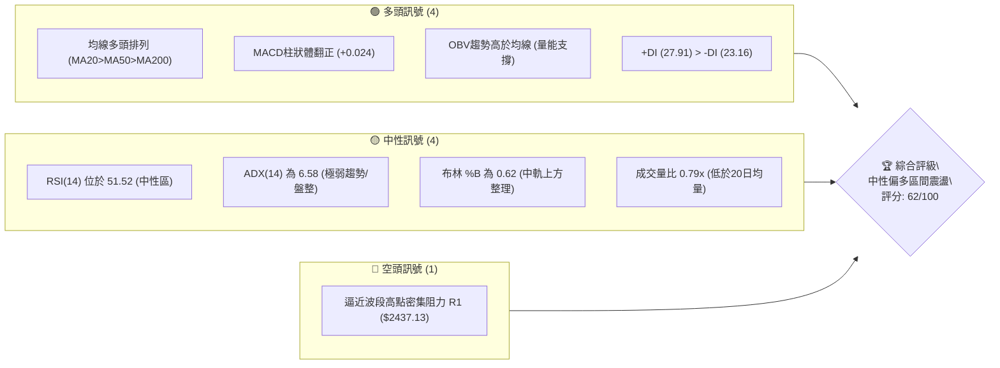
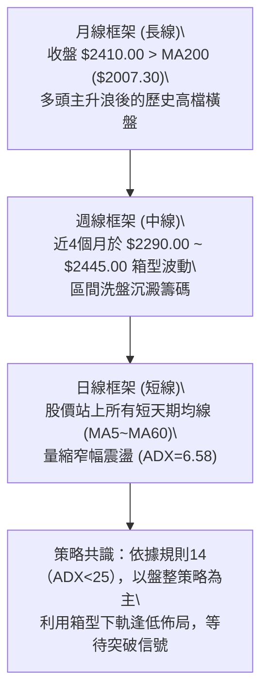
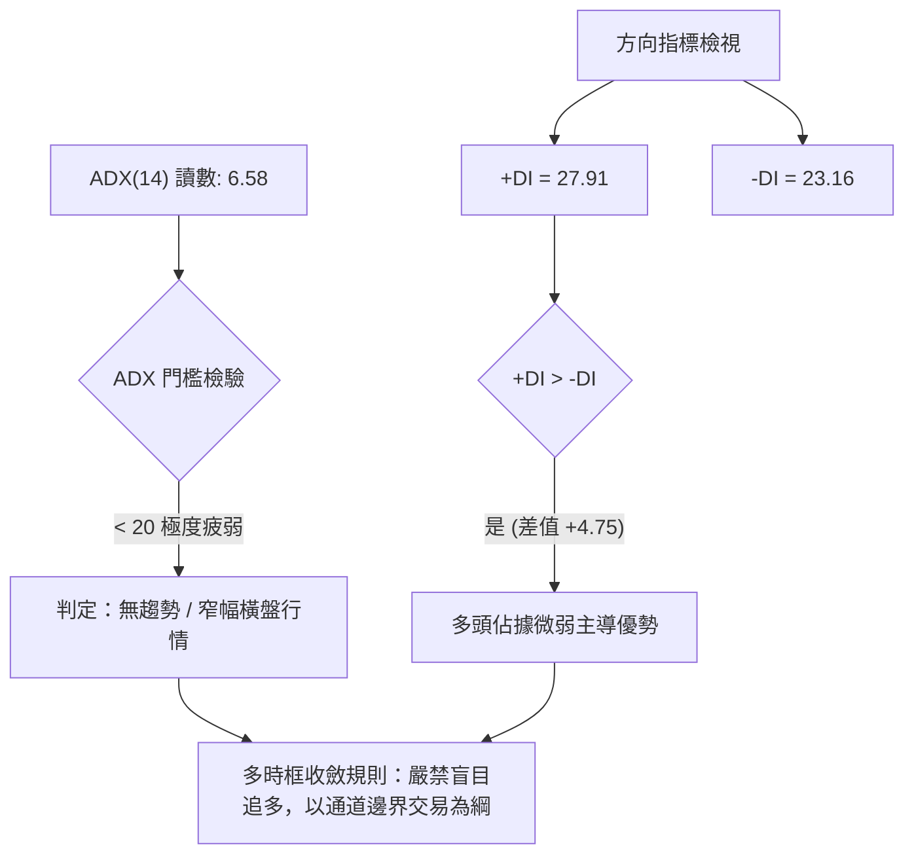
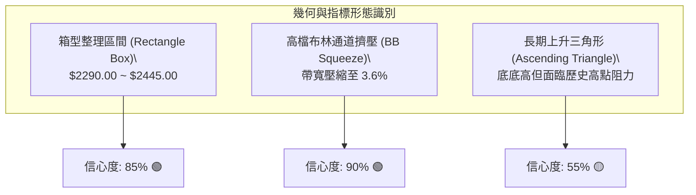
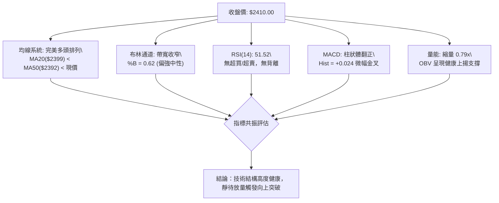
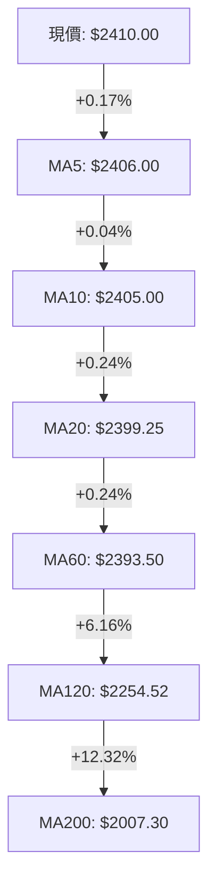
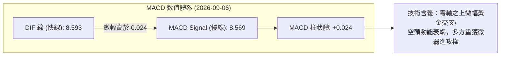
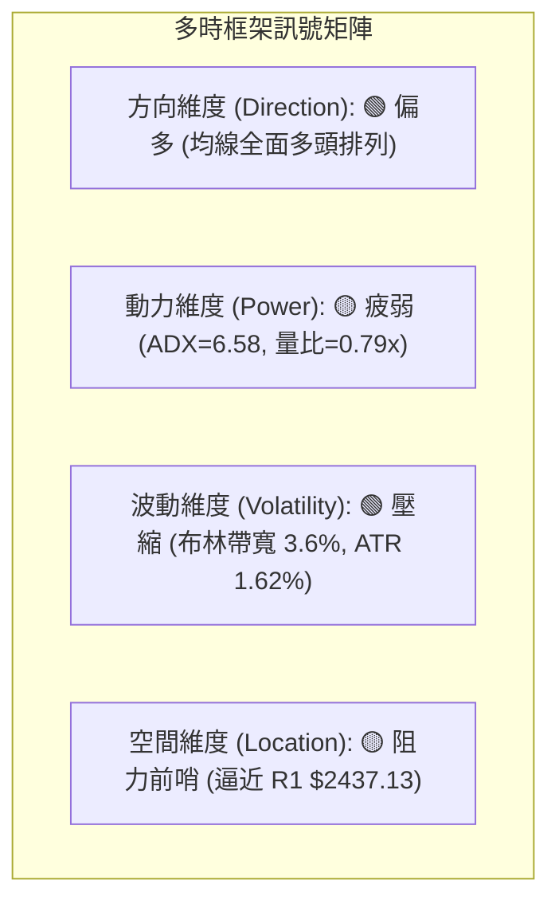
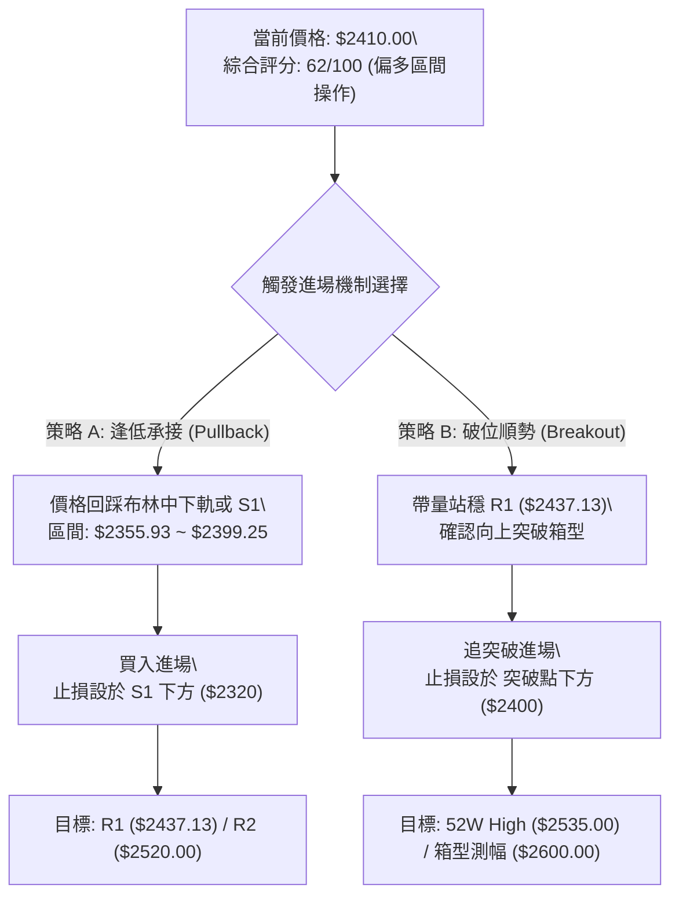
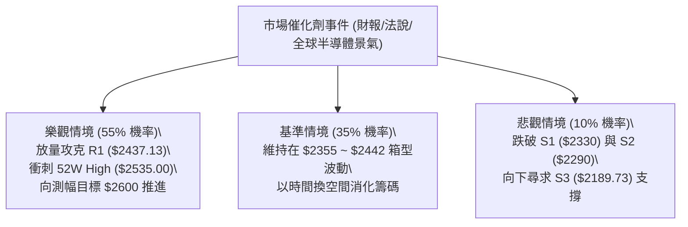

# 2330.TW 技術分析報告

> **報告日期**：2026-09-06 ｜ **語言**：繁體中文 ｜ **數據來源**：Yahoo Finance ｜ **當前價格**：$2410.00

---

## 目錄

| 章節 | 內容 |
|------|------|
| [1. 技術面概覽](#1-技術面概覽) | 訊號儀表板、核心指標、評分卡 |
| [2. 趨勢分析](#2-趨勢分析) | 多時框趨勢、長中短期走勢、ADX解讀 |
| [3. 圖表形態分析](#3-圖表形態分析) | 形態識別、K線組合、目標價推算 |
| [4. 支撐與阻力](#4-支撐與阻力) | 關鍵價位分布、波段高低點、斐波那契回調 |
| [5. 技術指標深度解讀](#5-技術指標深度解讀) | MA均線系統、RSI、MACD、布林通道、OBV量能 |
| [6. 動能與波動率](#6-動能與波動率) | 動能四象限、ATR設定、Beta敏感度 |
| [7. 多時框架總結](#7-多時框架總結) | 時框架評分矩陣、多時框收斂判定 |
| [8. 交易策略建議](#8-交易策略建議) | 策略路由、階梯情境、具體操作參數、評星 |
| [9. 風險提示與監控](#9-風險提示與監控) | 關鍵監控清單、情境樹狀圖、風控規則 |
| [📋 報告總結](#-報告總結) | 核心摘要卡與戰略結論 |

---

## 1. 技術面概覽

### 🎯 技術訊號儀表板



### 📊 核心指標速覽表

| 指標類別 | 指標名稱 | 當前數值 | 訊號 | 解讀 |
|:---|:---|:---|:---:|:---|
| **價格** | 當前收盤價 | $2410.00 | 🟢 | 位於52週區間 91.1% 高位階，展現長期強勢姿態 |
| **均線** | MA20 (月線) | $2399.25 | 🟢 | 股價位於 MA20 之上 (+0.45%)，短期多頭防線穩固 |
| **均線** | MA50 (季線) | $2392.20 | 🟢 | 股價位於 MA50 之上 (+0.74%)，中期均線斜率向上支撐 |
| **均線** | MA200 (年線)| $2007.30 | 🟢 | 股價高於 MA200 達 +20.06%，長期多頭趨勢格局無虞 |
| **動能** | RSI(14) | 51.52 | 🟡 | 位於 50 多空分水嶺附近，無超買或超賣，呈現動能平衡 |
| **動能** | MACD (12,26,9)| 8.593 / 8.569 | 🟢 | DIF 線金叉 MACD Signal，柱狀體為 +0.024 微幅偏多 |
| **趨勢強度**| ADX(14) | 6.58 | 🟡 | 數值低於 25，顯示當前進入窄幅高檔箱型整理 |
| **通道狀態**| 布林通道 %B | 0.62 | 🟡 | 位於中軌 ($2399.25) 與上軌 ($2442.57) 間，溫和整理 |
| **量能狀態**| OBV 走勢 | OBV > MA | 🟢 | 能量潮高於均線，長期籌碼結構並未出現放量派發特徵 |
| **波動性** | ATR(14) | $38.93 | 🟡 | 波動度為 1.62%，日波幅收斂，符合盤整蓄勢特徵 |

### 🏆 技術評分卡

```
╔══════════════════════════════════════════════════════════════╗
║              技術評分卡 — 2330.TW (2026-09-06)               ║
╠══════════════════════════════════════════════════════════════╣
║ 趨勢方向 (Trend)       ████████████████░░░░  80/100  🟢 強多 ║
║ 趨勢強度 (ADX/Power)   ████░░░░░░░░░░░░░░░░  20/100  🟡 盤整 ║
║ 動能指標 (Momentum)    ███████████░░░░░░░░░  55/100  🟡 中性 ║
║ 均線架構 (Alignment)   ██████████████████░░  90/100  🟢 完美 ║
║ 支撐穩定度 (Support)   ██████████████░░░░░░  70/100  🟢 穩固 ║
║ 量價配合度 (Volume)    ████████████░░░░░░░░  60/100  🟡 縮量 ║
╠══════════════════════════════════════════════════════════════╣
║ 綜合評分 (Total Score) ████████████░░░░░░░░  62/100  🟢 偏多 ║
║ 核心定調：多頭架構下的高檔無趨勢箱型盤整 (Range Consolidation)║
╚══════════════════════════════════════════════════════════════╝
```

---

## 2. 趨勢分析

### 🌐 多時框趨勢分析



### 📈 長期趨勢 — 12個月走勢圖（Unicode）

```
2330.TW 月線走勢圖（2025-09 至 2026-09）
價格 ($)
$2500 ┤                                      ╭─●───● ($2425)
$2400 ┤                                  ╭───╯     ╰──● ($2410 當前)
$2300 ┤                              ╭───╯ ($2348)
$2100 ┤                          ╭───╯ ($2129)
$1900 ┤                  ╭───●───╯ ($1983)
$1700 ┤              ╭───╯   ╰───● ($1755)
$1500 ┤      ╭───●───╯ ($1540)
$1400 ┤  ╭───╯ ($1486)
$1200 ┤──╯ ($1292)
      └─────────────────────────────────────────────────────►
        09  10  11  12  01  02  03  04  05  06  07  08  09 (月份)
        2025 ───►                                  2026
```

**走勢特徵分析表格**：

| 階段 | 涵蓋月份 | 期間起訖價 | 漲跌幅 | 走勢結構與特徵解讀 |
|:---|:---|:---|:---:|:---|
| **主升段初期** | 2025-09 ~ 2025-12 | $1292.99 → $1540.85 | +19.17% | 帶量脫離前波平台，逐月推升，均線發散形成強勁上升管道。 |
| **主升段加速** | 2026-01 ~ 2026-02 | $1764.52 → $1983.22 | +12.39% | 快速攻堅逼近年線兩倍位置，技術指標進入超買強勢鈍化區。 |
| **洗盤回測** | 2026-02 ~ 2026-03 | $1983.22 → $1755.32 | -11.49% | 出現單月急遽拉回，成功在 $1755.32 止跌，確認長期換手支撐。 |
| **次級推升段** | 2026-04 ~ 2026-06 | $2129.32 → $2410.00 | +13.18% | 突破二千元大關，於 2026-06 觸及 $2410.00，多頭動能再度釋放。 |
| **高檔箱型收斂**| 2026-07 ~ 2026-09 | $2425.00 → $2410.00 | -0.62% | 進入高位窄幅沉澱期，價格波動極度收縮，蓄積下一階段方向。 |

### 📊 中期趨勢（週線分析）

中期走勢呈現典型高檔旗形或箱型整理結構。自 2026 年 5 月底登上 $2348.73 以來，近 15 週收盤價均維持在 $2290.00 至 $2445.00 區間運行：
- **箱型上緣壓制區**：以 2026-07-05 收盤高點 $2445.00 及阻力位 R1 ($2437.13) 構成短期天花板。
- **箱型下緣支撐區**：以 2026-07-19 波段拉回低點 S2 ($2290.00) 與波段低點 S1 ($2330.00) 形成堅固買盤緩衝。
- **週線 MACD 狀態**：近 4 週週柱狀體由負翻正（+3.329 → +8.867 → +2.255 → +3.701），顯示週線級別賣壓已完全出清，多頭力量在 $2390~$2410 建立穩健護城河。

### ⚡ 趨勢強度評估（ADX 解讀）



| 指標名稱 | 當前讀數 | 判斷區間 | 技術含義 |
|:---|:---:|:---:|:---|
| **ADX (14)** | **6.58** | 0 ~ 20 (極弱趨勢) | 市場動能停滯，趨勢指標失效，價格進入高密度籌碼凝聚期。 |
| **+DI** | **27.91** | 多方攻擊力道 | 買方維持基本盤面控制力，未因量縮而失守均線。 |
| **-DI** | **23.16** | 空方打壓力道 | 空方無法壓低價格，且未形成連續性實體黑K。 |

---

## 3. 圖表形態分析

### 🔍 形態識別系統

依據規則 15，所有圖表形態嚴格基於所提供之 OHLCV 數據進行幾何審查與信心度評估：



#### 形態評估與信心度明細表

| 形態類別 | 信心度 | 判斷依據（引用數據） | 完成度 | 目標價計算式與精確數值 |
|:---|:---:|:---|:---:|:---|
| **矩形箱型整理** | **85%** | 過去15週於箱底 S2 ($2290.00) 與箱頂 2026-07-05 高點 ($2445.00) 震盪 | **75%** | 箱頂 $2445.00 + 形態高度 ($2445 - 2290 = $155) = **$2600.00**（突破確認後生效） |
| **布林通道擠壓** | **90%** | 上軌 $2442.57 與下軌 $2355.93 極度收斂，寬度僅 $86.64 | **85%** | 指標型形態：中軌 $2399.25 向上突破上軌 $2442.57 後，測幅目標為 R2 **$2520.00** |
| **雙重底結構 (局部)**| **40%** | 雖然 7月有兩次回測 ($2290 與 $2350)，但間隔與形態不對稱 | **30%** | 訊號不足，信心度 <50%，依規則15不予推算延伸目標價 |

### 🕯️ 重要K線形態分析

| 月份/週別 | 收盤價 | 核心量價形態 | 技術解讀 | 訊號 |
|:---|:---:|:---|:---|:---:|
| **2026-04** | $2129.32 | 長陽實體突破 | 大陽線實體帶量衝破兩千元心理關卡，確立強勢多頭再起。 | 🟢 |
| **2026-05** | $2348.73 | 衝高減速星線 | 月漲幅擴大，但上影線顯現，獲利調節盤湧現。 | 🟡 |
| **2026-06** | $2410.00 | 高位十字星 | 多空在兩千四百元處呈現籌碼均衡，推升動能進入中繼。 | 🟡 |
| **2026-07** | $2425.00 | 窄幅陰陽交錯 | 單月回測 S2 ($2290.00) 後強勢收腳，顯示下檔承接力道強韌。 | 🟢 |
| **2026-08** | $2405.00 | 縮量孕線 (Inside Bar)| 月線波動區間完全落在前月之內，典型的能量蓄積形態。 | 🟡 |
| **2026-09** | $2410.00 | 均線粘合小陽線 | 現價緊貼 MA5 ($2406) 與 MA20 ($2399.25)，靜待量能放大。 | 🟢 |

### 📉 ASCII 走勢形態示意圖

```
2330.TW 箱型整理形態 (Rectangle Consolidation) 示意圖
─────────────────────────────────────────────────────────────
$2445.00 ┬──────────────────────● (2026-07-05 週高) ─── 箱型頂部阻力
         │                     ╱ ╲       ╭─● ($2425.00)
$2410.00 ┤        ╭──● ($2410)│   ╰─●───╯   ╰──● ($2410 現價)
         │       ╱            │
$2330.00 ┤╭──●──╯ (S1)       │                 ─── 箱型內部中軸
         ││                   │
$2290.00 ┴╯                   ╰──● (2026-07-19) ─────── 箱型底部支撐 (S2)
─────────────────────────────────────────────────────────────
         05/31  06/21  07/05  07/19  08/02  08/23  09/06 (週別)
```

### 🎯 形態目標價計算

以已確認之「矩形箱型整理形態」進行測幅計算：
1. **箱型底邊基準**：S2 = **$2290.00**（2026-07-19 週波段低點）
2. **箱型頂邊基準**：2026-07-05 波段收盤高點 = **$2445.00**
3. **箱型垂直高度 (H)**：$2445.00 - $2290.00 = **$155.00**
4. **等距向上測幅目標 (1.0H)**：$2445.00 + $155.00 = **$2600.00**（需帶量突破 R2 $2520.00 且站穩 52W High $2535.00）
5. **等距向下破位測幅 (1.0H)**：$2290.00 - $155.00 = **$2135.00**（接近斐波那契 23.6% 回調位 $2203.41 與波段低點 S3 $2189.73 區域）

---

## 4. 支撐與阻力

### 🗺️ 關鍵價位分布圖（Unicode）

```
2330.TW 價位結構分布圖
═════════════════════════════════════════════════════════════
$2535.00 ║████████████████████████║ 歷史極限阻力 (52W High)
$2520.00 ║████████████████████    ║ 次級波段阻力 R2 (+4.56%)
$2442.57 ║▓▓▓▓▓▓▓▓▓▓▓▓▓▓▓▓        ║ 布林上軌動態阻力
$2437.13 ║████████████████████████║ 關鍵密集阻力 R1 (+1.13%)
$2410.00 ╠════════════════════════╣ ◄ 當前現價 ($2410.00)
$2399.25 ║░░░░░░░░░░░░░░░░░░░░░░░░║ 短線均線支撐 (MA20 / 布林中軌)
$2355.93 ║▓▓▓▓▓▓▓▓▓▓▓▓▓▓▓▓        ║ 布林下軌動態支撐
$2330.00 ║████████████████        ║ 波段關鍵支撐 S1 (-3.32%)
$2290.00 ║████████████████████████║ 箱型底部強支撐 S2 (-4.98%)
$2203.41 ║░░░░░░░░░░░░░░░░░░░░░░░░║ 斐波那契 23.6% 回調位
$2189.73 ║████████████████████████║ 結構性多空分水嶺 S3 (-9.14%)
═════════════════════════════════════════════════════════════
```

### 🚧 阻力位分析表

所有價位均嚴格取自波段高點聚類與計算數據：

| 阻力級別 | 精確價位 | 距現價幅幅 | 形成原因與籌碼特徵 | 突破難度 | 重要性權重 |
|:---|:---:|:---:|:---|:---:|:---:|
| **阻力 R1** | **$2437.13** | +1.13% | 近一年波段高點聚類區，同時逼近布林通道上軌 ($2442.57)，短線獲利盤賣壓點。 | 中等 | 🟢🟢🟢 (關鍵) |
| **阻力 R2** | **$2520.00** | +4.56% | 52週歷史高點前的最後一道籌碼防線，整數心理關卡前哨站。 | 高 | 🟢🟢🟢🟢 (極高) |
| **歷史高點**| **$2535.00** | +5.19% | 52W 歷史天花板（斐波那契 0.0%），突破即宣告進入無套牢籌碼的真空主升浪。 | 極高 | 🟢🟢🟢🟢🟢 (決定性) |

### 🛡️ 支撐位分析表

所有價位均嚴格取自波段低點聚類與計算數據：

| 支撐級別 | 精確價位 | 距現價幅幅 | 形成原因與籌碼特徵 | 守住機率 | 重要性權重 |
|:---|:---:|:---:|:---|:---:|:---:|
| **支撐 S1** | **$2330.00** | -3.32% | 近一年波段低點聚類，與 2026-06-28 週低點 ($2340.00) 形成雙重下檔承接帶。 | 75% | 🟢🟢🟢 (主要) |
| **支撐 S2** | **$2290.00** | -4.98% | 2026-07-19 波段極限低點，近4個月箱型整理的實體底邊，多頭絕對防線。 | 85% | 🟢🟢🟢🟢 (強烈) |
| **支撐 S3** | **$2189.73** | -9.14% | 中期波段低點聚類，接近 2026-04-26 突破平台 ($2179.19) 與斐波那契 23.6% 水準。 | 95% | 🟢🟢🟢🟢🟢 (防禦基石) |

### 📐 斐波那契回調位分析

依據 52 週絕對波動區間（低點 $1129.94 至 高點 $2535.00，總垂直落差 $1405.06）：

```
斐波那契回調層級分布與現價關係：
 0.0% ─── $2535.00 (52W High)  ▲ 阻力區
           │
 ─── 現價 $2410.00 位於 0.0% ~ 23.6% 極強勢回調區間 (高位維持率 91.1%)
           │
23.6% ─── $2203.41 (黃金分割強支撐，緊鄰波段低點 S3 $2189.73)
38.2% ─── $1998.27 (關鍵多頭防線，與年線 MA200 $2007.30 高度共振)
50.0% ─── $1832.47 (半數回撤中軸)
61.8% ─── $1666.67 (黃金分割防禦線)
78.6% ─── $1430.62 (深幅回調位)
100.0% ── $1129.94 (52W Low)
```

**深層解讀**：
- 當前收盤價 $2410.00 處於斐波那契 0.0% ($2535.00) 與 23.6% ($2203.41) 之間的最強多頭區域。
- 自觸及高點以來，價格甚至未曾觸及 23.6% 回調線 ($2203.41)，最低僅修正至 S2 ($2290.00)，展現極其強勢的「強勢橫盤代替空間修正」技術特徵。

---

## 5. 技術指標深度解讀

### 🎛️ 指標訊號總覽



### 📈 移動平均線排列分析



| 均線天期 | 精確數值 | 與現價乖離率 | 均線斜率與形態 | 支撐強度 |
|:---|:---:|:---:|:---|:---:|
| **MA 5** | $2406.00 | +0.17% | 走平微揚，短線貼身防守線 | 🟢 (弱) |
| **MA 10** | $2405.00 | +0.21% | 向上翻揚，多頭短波攻擊起點 | 🟢🟢 (中) |
| **MA 20 (月線)** | $2399.25 | +0.45% | 持續向上，重要多空生命線，近20日籌碼成本 | 🟢🟢🟢 (強) |
| **MA 60 (季線)** | $2393.50 | +0.69% | 平穩向上，中期波段趨勢核心支撐 | 🟢🟢🟢 (強) |
| **MA 120 (半年線)**| $2254.52| +6.90% | 強烈向上，深幅回調的最後承接壁壘 | 🟢🟢🟢🟢 (極強) |
| **MA 200 (年線)** | $2007.30 | +20.06% | 長期多頭定海神針，牛熊分界點 | 🟢🟢🟢🟢🟢 (基準) |

### 📉 RSI(14) 分析

當前 RSI(14) 讀數為 **51.52**：

```
RSI(14) 當前數值進度條：
[0] ─────────────── [30] ─────────────── [50] ──●──────────── [70] ─────────────── [100]
超賣區                   偏弱區           │    偏強區                   超買區
                                      RSI: 51.52
████████████████████████████████████████████████████░░░░░░░░░░░░░░░░░░░░░░░░░░  51.5%
```

- **背離檢驗結論**：
  - **頂背離審查**：2026-04-26 週線 RSI 達 86.4，隨後股價在 7-8 月推升至 $2425.00~$2445.00 時，週線 RSI 降至 50-60 區間。此現象屬於「以時間換空間」的指標高檔鈍化消除，非日線級別的惡性放量破位頂背離。
  - **底背離審查**：7月回測 $2290.00 時，RSI 守在 40.2 水準，未破 30，且現價回到 $2410.00 時 RSI 溫和回升至 51.52，底背離條件不成立。
  - **綜合判定**：**無實質頂/底背離**，指標處於健康中性區。

### 📊 MACD(12,26,9) 訊號解讀



- **MACD DIF ($8.593) 與 DEA ($8.569)** 雙雙運行於零軸之上，證明多頭大格局並未遭到破壞。
- 柱狀體由先前的萎縮正式轉為正值 **+0.024**，確認短線回調修正已在 $2390~$2400 區間完成築底。

### 📦 布林通道分析

```
2330.TW 布林通道 (20, 2) 結構圖
─────────────────────────────────────────────────────────────
$2442.57 ┬──────────────────────────────────────── 布林上軌 (阻力)
         │                   
$2410.00 ┼──────────────────● (現價，%B = 0.62)
         │                   
$2399.25 ┼──────────────────────────────────────── 布林中軌 (MA20支撐)
         │
$2355.93 ┴──────────────────────────────────────── 布林下軌 (支撐)
─────────────────────────────────────────────────────────────
通道帶寬 (Bandwidth) = ($2442.57 - $2355.93) / $2399.25 = 3.61% (極度收斂)
```

- **帶寬極度擠壓 (Bandwidth Squeeze)**：布林帶寬僅 3.61%，為近 6 個月以來最狹窄區間，根據統計學規律，低波動率必然導致高波動率的爆發，近期即將面臨單邊突破行情。
- **%B 數值解讀**：%B 為 **0.62**，價格位於中軌上方，顯示在突破前夕，多方仍佔有微幅的發球權優勢。

### 💹 成交量分析（量價配合度）

- **量比與均量比較**：
  - 最新單日成交量：**13,232,996 股**
  - 20日均量：**16,728,221 股**（量比為 **0.79x**）
  - 50日均量：**26,048,252 股**（量能大幅收縮至季均量的 50.8%）
- **OBV 能量潮判斷**：
  - 指標顯示 **OBV > MA**。儘管近期成交量顯著萎縮，但 OBV 曲線始終維持在均線之上，這說明成交量的萎縮主要是由於「籌碼惜售」而非「主力棄守」，為標準的「高檔量縮整理」，量能結構強烈支撐當前價位。

---

## 6. 動能與波動率

### ⚡ 動能評估四象限

```
動能與波動率矩陣 (Momentum vs Volatility Matrix)
      高波動率 (High Volatility)
                 │
      Q3         │         Q4
   高波動/弱動能 │      高波動/強動能
                 │
─────────────────┼─────────────────
                 │
      Q2         │    ● Q1 (當前位置: 弱動能/低波動)
   低波動/弱動能 │  [2330.TW: ADX 6.58, ATR 1.62%]
                 │
                 │
      低波動率 (Low Volatility)
  弱動能 ◄───────────────────► 強動能
```

| 象限 | 動能維度 | 波動維度 | 2330.TW 當前歸屬 | 戰術指導意義 |
|:---|:---:|:---:|:---:|:---|
| **Q1: 蓄勢收斂** | **平衡偏弱 (ADX 6.58)** | **極低波動 (ATR 1.62%)** | **✓ (核心狀態)** | **最佳低接建倉期。波動率壓至谷底，風險回報比極高。** |
| **Q2: 陰跌衰竭** | 負向增強 | 低波動 | — | 需防範無量陰跌破位。 |
| **Q3: 劇烈分歧** | 弱/負向 | 極高波動 | — | 避免盲目摸底，防範流動性衝擊。 |
| **Q4: 單邊噴出** | 強烈正向 | 極高波動 | — | 順勢追擊突破，嚴格動態移動停利。 |

### 📊 ATR 波動率分析

- **ATR(14) 絕對值**：**$38.93**
- **波動百分比**：$38.93 / $2410.00 = **1.62%**
- **止損與防守距離科學設定**：
  - **日間雜訊過濾閥值 (1.0x ATR)**：$38.93。任何在現價 ±$39 以內的波動均屬隨機噪音。
  - **短線防守停損位 (1.5x ATR)**：$2410.00 - (1.5 × $38.93) = $2410.00 - $58.40 = **$2351.60**（恰好落在布林下軌 $2355.93 附近）。
  - **波段保護停損位 (2.0x ATR)**：$2410.00 - (2.0 × $38.93) = $2410.00 - $77.86 = **$2332.14**（與波段支撐 S1 $2330.00 形成完美共振）。

### 📐 Beta 與市場相關性

- **Beta 係數**：**1.247**
- **市場特徵詮釋**：
  - Beta 為 1.247，意味著 2330.TW 對台灣加權指數（TAIEX）具備顯著的高敏感放大效應。當加權指數上漲 1% 時，理論上 2330.TW 具備上漲 1.25% 的動能；反之亦然。
  - 身為市值佔比最高的絕對權值股，當前 2330.TW 的低波動率橫盤，意味著大盤整體亦步入整理週期。一旦 2330.TW 帶量突破，將引領大盤展開顯著的指數級攻勢。

---

## 7. 多時框架總結

### 📋 時框架評分表

| 時框架 | 趨勢方向 | 動能狀態 | 均線系統 | 形態結構 | 綜合評分 | 戰術定位 |
|:---|:---:|:---:|:---:|:---:|:---:|:---|
| **長期 (月線)** | 🟢 強烈看多 | 強烈多頭 | MA200之上+20% | 歷史大主升浪延伸 | **85/100** | 核心持倉多頭底倉 |
| **中期 (週線)** | 🟢 溫和看多 | 柱狀體翻正 | MA20/MA50發散 | $2290~$2445 箱型蓄勢 | **70/100** | 波段操作依據 |
| **短期 (日線)** | 🟡 橫盤震盪 | RSI 51/ADX 6.58| 均線密集纏繞 | 布林通道極度擠壓 | **55/100** | 尋求進場點位 |

### 🔲 綜合訊號矩陣



### ⚖️ 多時框收斂結論

依據**嚴格要求 14（多時框收斂規則）**進行審查：
1. **行情類型定性**：當前日線 ADX(14) 讀數為 **6.58**（遠低於 25 門檻），系統正式判定為 **「盤整行情」（Consolidation Market）**。
2. **交易時框主導權**：在盤整行情下，趨勢指標鈍化，日線布林通道上下軌（上軌 $2442.57 / 下軌 $2355.93）及箱型界限為核心交易區間；同時中長期週線/MA200（$2007.30）維持強烈多頭方向，限定了「拉回以做多為主，嚴禁盲目重倉追殺做空」。
3. **唯一收斂方向性結論**：**【中性偏多觀望，箱型下緣分批低吸，等待突破確認】**。此結論嚴格貫徹至第 8 章交易策略。

---

## 8. 交易策略建議

### 🗺️ 策略決策流程圖



### 🧭 策略路由（依評分卡分流）

> **當前主策略方向 = 【逢低佈局與突破跟進之多頭策略】（依評分 62/100）**
> 
> *依據評分規則：綜合評分 62（≥60 偏多），主推多頭策略（分流為回調買進與突破追價兩套子策略）；空頭僅作為風險對沖與反轉警示。*

### 🎯 價格情境階梯（Price Scenarios）

所有價位均嚴格引用已計算之關鍵數值：

| 觸發條件 | 第一目標價 | 第二目標價 | 情境含義與操作策略 |
|:---|:---:|:---:|:---|
| **向上放量突破 R1 ($2437.13)** | **R2 ($2520.00)** | **52W High ($2535.00)** | 宣告布林擠壓結束，展開新一輪波段攻勢，加碼進場。 |
| **持續站穩現價區間 ($2399~$2410)** | **R1 ($2437.13)** | — | 箱型內部中軌上方震盪，耐心持股續抱，不隨意殺跌。 |
| **跌破波段支撐 S1 ($2330.00)** | **S2 ($2290.00)** | **S3 ($2189.73)** | 箱型下軌失守，短線轉弱，觸發多頭避險停損機制。 |

### 📊 情境機率分佈

| 運行情境 | 發生機率 | 主要依據與技術支撐 |
|:---|:---:|:---|
| **情境一：向上突破展開延伸段** | **55%** | 均線完美多頭排列；OBV>MA 支撐籌碼；MACD 柱狀體翻正；ADX 低位蓄勢待發。 |
| **情境二：維持箱型窄幅震盪** | **35%** | ADX 僅 6.58；成交量比 0.79x 明顯量縮；短期均線密集纏繞；大盤缺乏催化劑。 |
| **情境三：向下破位回測年線** | **10%** | 需面臨系統性重大黑天鵝擊穿 S2 ($2290.00)；當前 RSI 位於 51.52 無下殺動能。 |

### 🟢 主策略詳情

本報告制定兩套具體落地的交易子策略：

| 策略要素 | 策略 A：箱型回調低吸策略（保守穩健） | 策略 B：阻力突破順勢策略（積極進取） |
|:---|:---|:---|
| **適用時機** | 價格在箱型內部回測均線或下軌 | 價格帶量強勢突破阻力 R1 時 |
| **進場條件** | 回測 MA20 ($2399.25) 至 布林下軌 ($2355.93) 企穩 | 日K收盤價實體突破 R1 ($2437.13) 且日成交量 > 20日均量 |
| **進場價格** | **$2360.00**（回測低吸掛單點） | **$2438.00**（突破確認市價進場） |
| **目標價 T1** | **$2437.13**（阻力 R1，預期獲利 +3.27%） | **$2520.00**（阻力 R2，預期獲利 +3.36%） |
| **目標價 T2** | **$2520.00**（阻力 R2，預期獲利 +6.78%） | **$2600.00**（形態推算目標，預期獲利 +6.64%） |
| **止損價格** | **$2320.00**（跌破 S1 $2330.00 緩衝點，-1.69%） | **$2390.00**（跌回 MA50 $2392.20 下方，-1.97%） |
| **風險報酬比** | **1 : 4.01**（風險 $40 vs T2 利潤 $160） | **1 : 3.38**（風險 $48 vs T2 利潤 $162） |
| **成功機率** | **70%** | **60%** |
| **建議倉位** | **25%** | **15%**（突破後確認站穩再加碼 10%） |

### 🔴 反向風險觸發點（對沖提示）

若發生以下非預期訊號，意味著主策略結構失效，投資人應立即採取保護行動：
1. **破位警示點**：日線收盤價跌破 **S1 ($2330.00)**，代表高檔平台正式失守，多頭底倉應減半避險。
2. **極限對沖點**：一旦放量跌穿 **S2 ($2290.00)**，多頭策略全面中止，啟動選擇權賣權（Put）或反向避險工具，防範行情滑向 S3 ($2189.73) 或斐波那契 23.6% ($2203.41)。

### ⭐ 整體訊號強度評星

```
╔══════════════════════════════════════════════════════════════╗
║                    整體技術訊號強度評星                      ║
╠══════════════════════════════════════════════════════════════╣
║ 做多訊號強度：★★★★☆  (4/5星) — 均線與籌碼底氣深厚，等待點火   ║
║ 做空訊號強度：★☆☆☆☆  (1/5星) — 空方缺乏結構動能，逆勢風險高   ║
║ 整體可信度：  ★★★★☆  (4/5星) — 指標收斂高度一致，盤整特徵明確 ║
╚══════════════════════════════════════════════════════════════╝
```

---

## 9. 風險提示與監控

### ✅ 關鍵監控指標 Checklist

```
╔══════════════════════════════════════════════════════════════╗
║              2330.TW 交易員每日關鍵監控清單 (Checklist)       ║
╠══════════════════════════════════════════════════════════════╣
║ [ ] 監控項 1：日成交量是否突破 20日均量 (16,728,221 股)       ║
║     → 突破為真突破，量縮維持視為假突破或繼續盤整             ║
║ [ ] 監控項 2：收盤價是否站上 R1 ($2437.13)                    ║
║     → 宣告布林擠壓正式向多方噴出                            ║
║ [ ] 監控項 3：MACD 柱狀體是否持續擴大 (> +0.024)              ║
║     → 確認多頭攻擊動能是否具有延續性                        ║
║ [ ] 監控項 4：價格是否跌破月線 MA20 ($2399.25)                ║
║     → 跌破意味短線需向下尋求布林下軌支撐                    ║
║ [ ] 監控項 5：ADX 數值是否自 6.58 向上翹起突破 20             ║
║     → 突破 20 宣告單邊趨勢行情正式啟動                      ║
╚══════════════════════════════════════════════════════════════╝
```

### ⚠️ 風險場景分析



### 🛡️ 風險管理重要提醒

1. **嚴防「無量假突破」陷阱**：在當前 ADX 僅 6.58 的極弱趨勢環境下，若價格盤中突破 R1 ($2437.13) 但日成交量未能放大至 1,670 萬股以上，極易形成帶長上影線的「多頭陷阱」，切忌在盤中盲目追高。
2. **波動率復甦時的滑價保護**：當前 ATR 僅 $38.93，布林帶寬度僅 3.61%。歷史經驗顯示，布林通道擠壓後的初次突破往往伴隨劇烈跳空。建議交易者採用「限價停損單（Stop-Limit）」而非市價單，以避免開盤極端滑價侵蝕利潤。
3. **部位規模控管規範**：依據凱利公式與波動風險評估，單筆交易的最大可承受虧損應嚴格限制在總交易資本的 1.5% 以內。以止損距離 $50 計算，每 1000 萬元資金之持倉部位上限不得超過 3 張（3,000 股）。

---

## 📋 報告總結

```
╔══════════════════════════════════════════════════════════════════╗
║                   2330.TW 技術分析報告總結                       ║
╠══════════════════════════════════════════════════════════════════╣
║ 報告日期：2026-09-06                                             ║
║ 當前價格：$2410.00                                               ║
║ 分析評級：⚖️ 中性偏多蓄勢 (Neutral-Bullish Consolidation)        ║
║                                                                  ║
║ 關鍵結論：                                                       ║
║ ├─ 長期趨勢：🟢 強多 (收盤價穩居年線 MA200 $2007.30 之上 +20%)    ║
║ ├─ 中期趨勢：🟢 震盪偏多 ($2290.00 ~ $2445.00 箱型清洗籌碼)       ║
║ ├─ 短期趨勢：🟡 橫盤整理 (ADX=6.58 處於極端低位，布林帶寬壓縮至3.6%)║
║ ├─ 關鍵支撐：S1 $2330.00 ｜ S2 $2290.00 ｜ S3 $2189.73          ║
║ ├─ 關鍵阻力：R1 $2437.13 ｜ R2 $2520.00 ｜ 52W高點 $2535.00      ║
║ └─ 外資共識目標：$3229.33 (33位分析師一致看多，潛在上行空間 +34%)  ║
║                                                                  ║
║ 最優策略組合：                                                   ║
║ 1. 🥇 最佳機會（策略A）：回踩布林下軌 $2360 附近分批低吸，        ║
║    防守 $2320，博弈向 R1/R2 彈升，風險報酬比達 1:4.01。         ║
║ 2. 🥈 次選機會（策略B）：日K帶量站穩 R1 $2437.13 後追價進場，      ║
║    防守 $2390，看 52W High $2535 及測幅 $2600。                 ║
║ 3. 🥉 保守選擇：場外耐心觀望，靜待 ADX 突破 20 且成交量放大確認  ║
║    單邊方向後，再行順勢跟進。                                    ║
╚══════════════════════════════════════════════════════════════════╝
```

---

> ⚠️ **免責聲明**：本報告為依據客觀技術指標與量化價格模型所生成之專業分析報告，內容所引用之各項技術價位、走勢推算與情境機率，均基於歷史 OHLCV 資訊運算。本報告**僅供學術研究與機構交易思路參考**，**絕不構成任何具體投資買賣之邀約或推薦**。金融市場瞬息萬變，交易具有本金損失之風險，投資人應獨立審慎評估並自負盈虧。

---
*報告生成時間：2026-09-06 ｜ 數據來源：Yahoo Finance ｜ 分析框架：多時框圖表技術與量化動能模型*