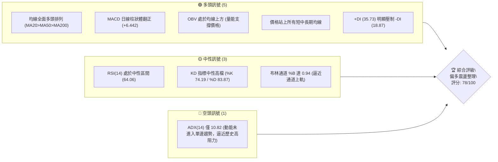
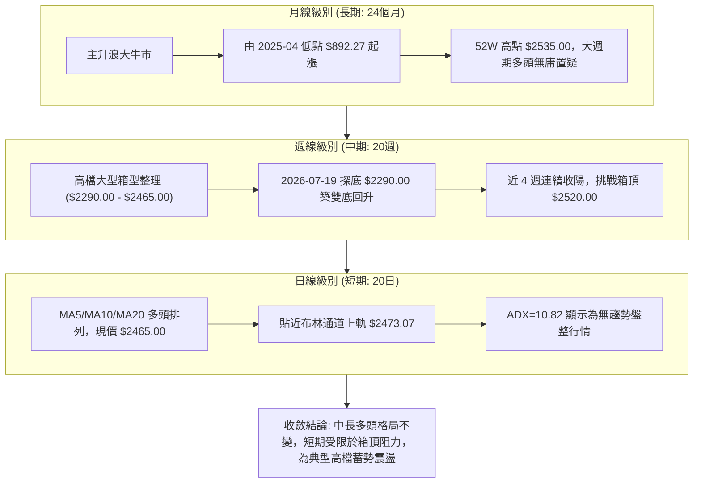
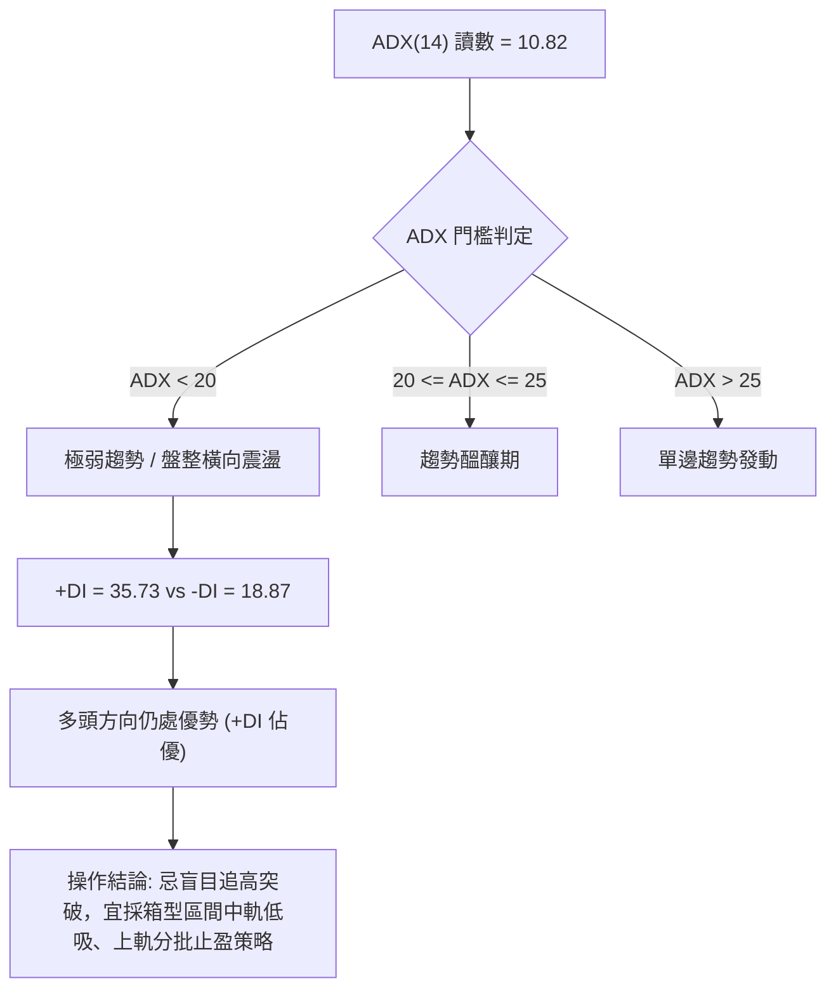
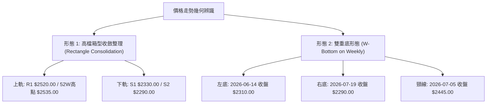
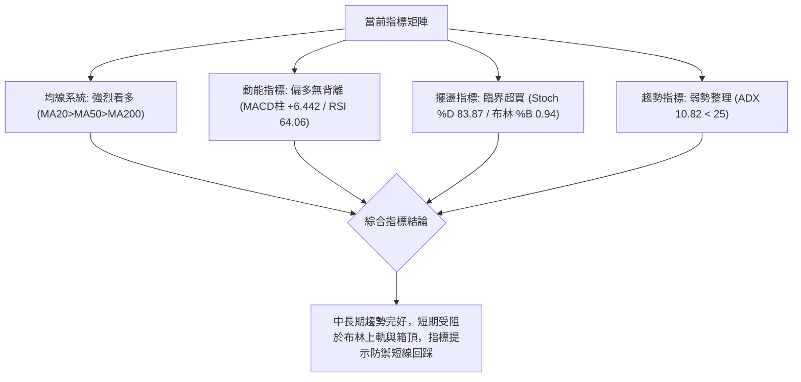
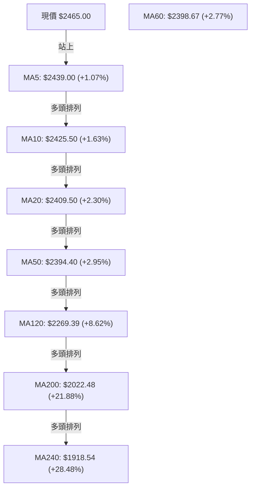
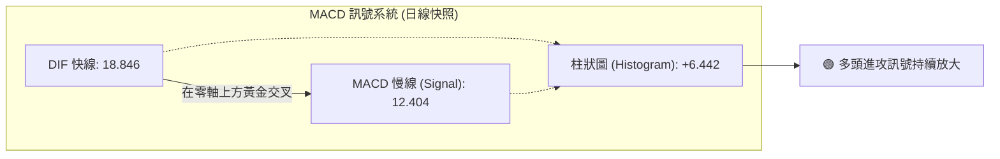
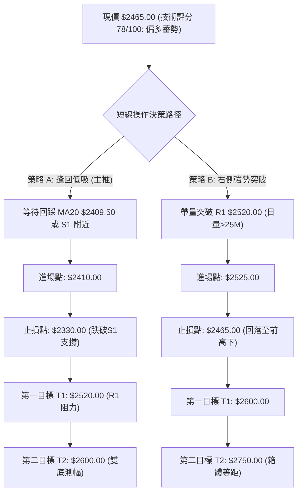
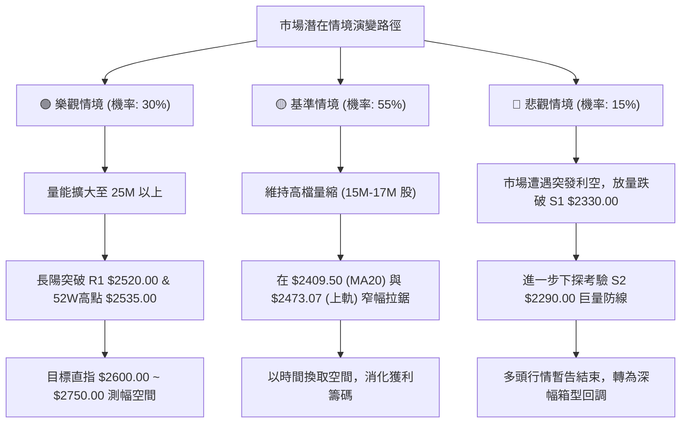

# 2330.TW 技術分析報告

> **報告日期**：2026-09-09 ｜ **語言**：繁體中文 ｜ **數據來源**：Yahoo Finance ｜ **當前價格**：$2465.00

---

## 目錄

| 章節 | 內容 |
|------|------|
| [1. 技術面概覽](#1-技術面概覽) | 訊號儀表板、核心指標、評分卡 |
| [2. 趨勢分析](#2-趨勢分析) | 多時框趨勢、長中短期走勢 |
| [3. 圖表形態分析](#3-圖表形態分析) | 形態識別、K線組合、目標價 |
| [4. 支撐與阻力](#4-支撐與阻力) | 關鍵價位、斐波那契回調 |
| [5. 技術指標深度解讀](#5-技術指標深度解讀) | MA/RSI/MACD/布林/成交量 |
| [6. 動能與波動率](#6-動能與波動率) | 動能評估、ATR、Beta |
| [7. 多時框架總結](#7-多時框架總結) | 時框架評分矩陣 |
| [8. 交易策略建議](#8-交易策略建議) | 多空策略、風險報酬比 |
| [9. 風險提示與監控](#9-風險提示與監控) | 監控指標、風險場景 |

---

## 1. 技術面概覽

### 🎯 技術訊號儀表板



### 📊 核心指標速覽表

| 指標類別 | 指標名稱 | 當前數值 | 訊號 | 解讀 |
|----------|----------|----------|------|------|
| **價格** | 當前收盤價 | $2465.00 | 🟢 | 站穩短期所有均線，逼近波段壓力區 |
| **均線** | MA20 (月線) | $2409.50 | 🟢 | 現價高於 MA20 達 +2.30%，短均形成下檔第一道動態支撐 |
| **均線** | MA50 (季線) | $2394.40 | 🟢 | 現價高於 MA50，中天期趨勢持續向上發散 |
| **均線** | MA200 (年線) | $2022.48 | 🟢 | 現價高於 MA200 達 +21.88%，長期牛市基石極為穩固 |
| **動能** | RSI(14) | 64.06 | 🟡 | 位於強勢中性區，未觸及 70 超買警戒，亦無背離跡象 |
| **動能** | MACD (12,26,9) | 18.85 / 12.40 | 🟢 | DIF 高於 MACD 訊號線，紅柱體持續放大 (+6.442) |
| **動能** | Stoch %K / %D | 74.19 / 83.87 | 🟡 | 高檔鈍化微幅死叉，短線面臨上軌調節賣壓 |
| **趨勢強度**| ADX(14) | 10.82 | 🟡 | ADX < 25 處於典型橫盤盤整格局，突破需放量確認 |
| **方向指標**| +DI / -DI | 35.73 / 18.87 | 🟢 | 多方攻擊力道顯著高於空方力道 |
| **通道指標**| 布林通道 (%B) | 0.94 (上軌 $2473.07) | 🟡 | 觸及上軌超買壓制點，短線有回踩中軌風險 |
| **量能指標**| 成交量 / 20日均量 | 15.62M / 17.30M | 🟡 | 量比 0.90x，高檔量能呈現微幅萎縮 |
| **量能指標**| OBV 能量潮 | 高於 MA | 🟢 | 資金未出現派發外流，支撐籌碼結構 |
| **波動度** | ATR(14) | $40.00 (1.62%) | 🟢 | 波動率適中收斂，有利於築底與蓄勢發動 |

### 🏆 技術評分卡

```
╔══════════════════════════════════════════════════════════════════╗
║              2330.TW 技術評分卡 (2026-09-09)                    ║
╠══════════════════════════════════════════════════════════════════╣
║ 均線架構 (Trend)      ████████████████░░░░  82/100  🟢 完美多頭排列  ║
║ 動能指標 (Momentum)   ██████████████░░░░░░  72/100  🟢 MACD翻紅柱    ║
║ 支撐穩定度 (Support)  ████████████████░░░░  80/100  🟢 密集支撐墊高  ║
║ 成交量配合 (Volume)   ████████████░░░░░░░░  62/100  🟡 高檔量縮盤整  ║
║ 形態完整度 (Pattern)  ████████████████░░░░  80/100  🟢 高檔矩形築底  ║
║ 趨勢強度 (ADX/Vol)    ████████░░░░░░░░░░░░  42/100  🟡 弱趨勢橫盤    ║
╠══════════════════════════════════════════════════════════════════╣
║ 綜合技術評分          ███████████████░░░░░  78/100  🟢 偏多震盪/蓄勢 ║
╚══════════════════════════════════════════════════════════════════╝
```

---

## 2. 趨勢分析

### 🌐 多時框趨勢分析



### 📈 長期趨勢 — 12個月走勢圖（Unicode）

過去 12 個月（2025-10 至 2026-09）之月線走勢展現了極為強勁的超級主升段，自 2025 年秋季突破千元大關後一路上攻至 2026 年中創下歷史天價 $2535.00，隨後進入 4 個月的高位平台整理。

```
2330.TW 月線收盤走勢圖（過去12個月：2025-10 至 2026-09）
價格軸 ($)
$2500 ┤                                        ●   ●   ●   ●($2465現價)
$2300 ┤                                    ●
$2100 ┤                            ●
$1900 ┤                    ●
$1700 ┤            ●               ●($1755洗盤低點)
$1500 ┤    ●   ●       ●
$1300 ┤●
      └─────────────────────────────────────────────────────────────
       10  11  12  01  02  03  04  05  06  07  08  09 (月份)
      (2025)      (2026)
```

**12個月走勢特徵分析表格**：

| 階段區間 | 月份區間 | 起訖價格 ($) | 區間漲跌幅 | 價量特徵與技術意涵 |
|----------|----------|--------------|------------|-------------------|
| **主升初始段** | 2025-10 ~ 2025-12 | $1292.99 → $1540.85 | +19.17% | 突破千元大關後連續強拉，均線呈現發散排列 |
| **主升加速段** | 2026-01 ~ 2026-02 | $1540.85 → $1983.22 | +28.71% | 月線連拉大陽線，成交量急遽放大，法人買盤進駐 |
| **技術洗盤段** | 2026-02 ~ 2026-03 | $1983.22 → $1755.32 | -11.49% | 快速回踩確認 MA60/MA120 均線支撐，清洗浮額 |
| **主升極限段** | 2026-03 ~ 2026-05 | $1755.32 → $2348.73 | +33.81% | 季線強拉，突破 $2000 整數大關，創下 52W 高點 $2535.00 |
| **高檔收斂段** | 2026-06 ~ 2026-09 | $2348.73 → $2465.00 | +4.95% | 於 $2300~$2465 區間高檔收斂沉澱，波動率壓低蓄勢 |

### 📊 中期趨勢（週線分析）

從 2026-05 至 2026-09 的近 20 週數據觀察，台積電於 2026-05-10 創下波段收盤高點 $2283.91 後迅速拉升至 $2445.00，其後在中期區間內反覆洗盤：
- 2026-07-19 探底低點 **$2290.00**（週成交量爆出 200,180,230 股），確立中期底背馳支撐。
- 隨後於 2026-08-02 拉升至 **$2425.00**，成交量進一步放大至 217,659,985 股（為近 15 週最大週成交量），確認多頭主力護盤。
- 過去 4 週（08-23 至 09-13）週成交量逐週縮窄（80.85M → 71.01M → 90.05M → 63.87M），而週收盤價穩步墊高（$2410 → $2420 → $2410 → $2465），週線 MACD 柱狀體由負翻正至 +6.442，週線 RSI 回升至 64.1，顯示典型「量縮價揚」的高檔籌碼鎖定狀態。

```
中期週線箱型整理架構示意圖：
$2520.00 ┬────────────────────────────────────────── 阻力位 R1 (波段天花板)
         │                   ▲ (07-05: $2445)       ▲ (現價: $2465)
         │                  ┌┴┐                    ┌┴┐
$2400.00 ┼───────▲─────────┼─┼─────────▲──────────┼─┼───── 中軸震盪區
         │      ┌┴┐         │ │        ┌┴┐         │ │
         │      │ │         │ │        │ │         │ │
$2290.00 ┴──────┴─┴─────────┴─┴────────┴─┴─────────┴─┴───── 支撐位 S2 (07-19 築底區)
```

### ⚡ 趨勢強度評估（ADX 解讀）



| 指標名稱 | 數值 | 區間定義 | 趨勢強度解讀 |
|----------|------|----------|--------------|
| **ADX(14)** | **10.82** | 0 ~ 20 | **極弱趨勢／無方向盤整**。表示價格過去 14 日缺乏單邊爆發力，處於布林帶內的橫向消化期 |
| **+DI** | **35.73** | - | 多方動能指標，顯示買方仍牢牢掌控局部控制權 |
| **-DI** | **18.87** | - | 空方動能指標，空頭拋壓持續衰減 |
| **DI 差值** | **+16.86** | > 0 | 多頭擴張格局，表明一旦 ADX 由低檔拐頭向上突破 20，將觸發強烈的多頭順勢行情 |

---

## 3. 圖表形態分析

### 🔍 形態識別系統



**圖表形態信心度評估表（依嚴格要求 15 規範）**：

| 形態名稱 | 信心度 | 判斷依據（嚴格引用數據） | 完成度 | 目標價（附嚴格計算式） |
|----------|--------|--------------------------|--------|------------------------|
| **高檔箱型收斂** | **85%** | 價格於 2026-06 至 2026-09 長達 14 週受阻於 $2445~$2520，並於 S1 $2330.00 及 S2 $2290.00 獲得強支撐，上下邊界極其清晰 | 80% | 待突破 R1 $2520.00 確認。箱體高度 = $2520.00 - $2290.00 = $230.00。<br>向上等距測幅 = $2520.00 + $230.00 = **$2750.00** |
| **週線雙重底 (W底)** | **70%** | 左底為 2026-06-14 之 $2310.00，右底為 2026-07-19 之 $2290.00（量能 200M 放大），頸線為 07-05 高點 $2445.00。現價 $2465.00 已收盤站上頸線 | 90% | 形態高度 = $2445.00 - $2290.00 = $155.00。<br>測幅目標價 = 頸線 $2445.00 + 高度 $155.00 = **$2600.00** |
| **大型頭肩頂/底** | **< 20%** | 數據中未偵測到頭肩形態之左右肩與頭部結構對稱特徵 | 0% | *訊號不足，僅做指標型與箱型解讀，不強行擬構形態* |

### 🕯️ 重要K線形態分析

| 週/月份 | 收盤價 ($) | K線形態特徵 | 專業技術解讀 | 訊號 |
|---------|------------|-------------|--------------|------|
| **2026-07-19** | $2290.00 | **長下影錘頭探底線** (週成交量 200.18M 巨量) | 空方最後一次極限打壓，下影線長達數十點，伴隨恐慌爆量，確立中線大底支撐 S2 | 🟢 |
| **2026-08-02** | $2425.00 | **長紅大陽線反包** (週成交量 217.66M 天量) | 買盤強勢反撲，一舉收復所有短期均線，確認 $2290 為有效右底 | 🟢 |
| **2026-08-23 至 09-06** | $2410~$2420 | **窄幅並列小實體紡錘線** (量能萎縮至 70-90M) | 多空在 MA20 ($2409.50) 附近取得暫時平衡，浮額清洗徹底，拋壓枯竭 | 🟡 |
| **2026-09-13 (當前)** | $2465.00 | **實體小陽線向上推升** (收盤突破近 8 週高點) | 站穩布林中軌後向發散上攻，收盤價創 2 個月新高，短線重啟上攻試探 | 🟢 |

### 📉 ASCII 走勢形態示意圖

```
2330.TW 週線「高檔蓄勢箱型與雙重底」整合示意圖
價格 ($)
$2520.00 ┤- - - - - - - - - - - - - - - - - - - - - - - - - - - - 阻力 R1 (箱體天花板)
         │                                       ▲ (現價 $2465.00，逼近上軌)
$2445.00 ┼───────────────● (頸線突破點)──────────┼─────── 箱型中高區頸線
         │              / \                     /
         │             /   \                   / 
$2360.00 ┼            /     \                 /
         │     \     /       \       ●       /
$2310.00 ┼──────●───          \     / \     / 
         │   (左底 06-14)       \   /   \   /
$2290.00 ┴- - - - - - - - - - - - ● - - - - - - - - - - - - - - 支撐 S2 (右底 07-19)
         └───────────────────────────────────────────────
         時間進程 (2026-06 ──────> 2026-07 ──────> 2026-09)
```

### 🎯 形態目標價計算

依據傳統道氏理論與技術形態測幅公式：
1. **箱體等距向上測幅目標**：
   - 形態箱體底部：$2290.00（S2）
   - 形態箱體頂部：$2520.00（R1）
   - 垂直高度 $H = 2520.00 - 2290.00 = 230.00$
   - **等距突破目標價** $= 2520.00 + 230.00 = \mathbf{\$2750.00}$
2. **週線 W 底向上測幅目標**：
   - 雙底低點：$2290.00
   - 雙底頸線：$2445.00
   - 形態高度 $h = 2445.00 - 2290.00 = 155.00$
   - **雙底達成目標價** $= 2445.00 + 155.00 = \mathbf{\$2600.00}$

---

## 4. 支撐與阻力

### 🗺️ 關鍵價位分布圖（Unicode）

```
╔══════════════════════════════════════════════════════════════════╗
║              2330.TW 價位結構分布圖 (2026-09-09)                 ║
╠══════════════════════════════════════════════════════════════════╣
║ $2535.00 ║████████████████████████████████║ 52週歷史最高點 (0.0% Fib) ║
║ $2520.00 ║██████████████████████████      ║ 近一年波段阻力 R1 (+2.23%)║
║ $2473.07 ║▓▓▓▓▓▓▓▓▓▓▓▓▓▓▓▓▓▓              ║ 布林通道日線上軌 (短線阻力)║
╠══════════════════════════════════════════════════════════════════╣
║ $2465.00 ╠════════════════════════════════╣ ◄ 當前收盤價 ($2465.00)   ║
╠══════════════════════════════════════════════════════════════════╣
║ $2409.50 ║▓▓▓▓▓▓▓▓▓▓▓▓▓▓▓▓▓▓              ║ 布林中軌 / MA20動態支撐    ║
║ $2394.40 ║▓▓▓▓▓▓▓▓▓▓▓▓▓▓                  ║ MA50 季線動態支撐          ║
║ $2330.00 ║██████████████████████████      ║ 近一年波段支撐 S1 (-5.48%)║
║ $2290.00 ║████████████████████████████████║ 核心波段強支撐 S2 (-7.10%)║
║ $2203.41 ║████████████████████            ║ 斐波那契 23.6% 回調位     ║
║ $2189.73 ║██████████████████████████      ║ 核心長期防守支撐 S3       ║
║ $2022.48 ║████████████████████████████████║ MA200 年線生死線          ║
╚══════════════════════════════════════════════════════════════════╝
```

### 🚧 阻力位分析表

*嚴格引用數據源中「關鍵價位」區塊之客觀數值：*

| 阻力級別 | 精確價位 | 距現價幅幅 | 形成原因與技術共振 | 突破難度 | 重要性 |
|----------|----------|------------|--------------------|----------|--------|
| **短線壓制** | **$2473.07** | +0.33% | 日線布林通道上軌，目前 %B 為 0.94，短線極限壓制位 | 🟡 中等 | ★★★☆☆ |
| **核心阻力 R1** | **$2520.00** | +2.23% | 近一年波段高點聚類區，密集套牢與止盈賣壓聚集地 | 🔴 極高 | ★★★★★ |
| **天花板高點** | **$2535.00** | +2.84% | 52 週最高價（Fib 0.0%），歷史絕對天價，多頭終極試金石 | 🔴 極高 | ★★★★★ |

### 🛡️ 支撐位分析表

*嚴格引用數據源中「關鍵價位」區塊之客觀數值：*

| 支撐級別 | 精確價位 | 距現價幅幅 | 形成原因與技術共振 | 守住機率 | 重要性 |
|----------|----------|------------|--------------------|----------|--------|
| **短期動態支撐** | **$2409.50** | -2.25% | 日線 MA20 與布林中軌共振重合，短線多空分水嶺 | 🟢 85% | ★★★★☆ |
| **波段支撐 S1** | **$2330.00** | -5.48% | 近一年波段低點聚類區，近 3 個月箱體震盪下沿支撐 | 🟢 80% | ★★★★☆ |
| **強支撐 S2** | **$2290.00** | -7.10% | 2026-07-19 爆出 2 億股巨量打出之雙底右腳，主力防守底線 | 🟢 90% | ★★★★★ |
| **深層支撐 S3** | **$2189.73** | -11.17% | 近一年波段低點聚類，與 Fib 23.6% ($2203.41) 形成共振帶 | 🟢 95% | ★★★★★ |

### 📐 斐波那契回調位分析

依據 52 週極端區間（最低點 **$1129.94** 至 最高點 **$2535.00**，垂直落差達 $1405.06）：

```
斐波那契回調位梯形結構：
0.0%  (52W High) ─── $2535.00 ─── [歷史天花板]
                     │            ◄ 現價 $2465.00 (落於 0.0% 與 23.6% 超強強勢區)
23.6% ────────────── $2203.41 ─── [首道回調黃金防線 / 與 S3 $2189.73 形成共振帶]
38.2% ────────────── $1998.27 ─── [強弱轉換分水嶺 / 接近 MA200 $2022.48]
50.0% ────────────── $1832.47 ─── [多空平衡中軸線]
61.8% ────────────── $1666.67 ─── [黃金分割防守位]
78.6% ────────────── $1430.62 ─── [深幅回撤極限]
100.0%(52W Low)  ─── $1129.94 ─── [52週起漲底]
```

**深層解讀**：
- 當前價格 **$2465.00** 處於 52 週整體波動區間的 **95.0%** 超高位階，遠高於 23.6% 回調位（$2203.41）。
- 依據波浪與斐波那契理論，當標的在大幅上漲後，拉回甚至未曾觸及 23.6% 回調線即展開橫盤消化，定義為**「極強勢空中加油架構」**。
- 下檔最重要的結構性防線為 **$2203.41（Fib 23.6%）** 與 S3（**$2189.73**）組成的寬幅共振緩衝區，只要此區未被有效跌破，長期超級牛市之技術架構將持續有效。

---

## 5. 技術指標深度解讀

### 🎛️ 指標訊號總覽



### 📈 移動平均線排列分析



均線呈現罕見的**「完全多頭排列」**（Perfect Bullish Alignment）：
- 短天期 MA5（$2439.00）> MA10（$2425.50）> MA20（$2409.50）。
- 中天期 MA60（$2398.67）與 MA50（$2394.40）緊密咬合並持續向上發散。
- 長天期 MA200（$2022.48）與半年線 MA120（$2269.39）呈現大角度上揚助漲斜率。
- 目前現價距離 MA20 乖離率僅 **+2.30%**，距離 MA200 乖離率為 **+21.88%**，並未出現短期乖離過大（>8%）的噴出泡沫現象，均線動能穩健。

### 📉 RSI(14) 分析

- **當前讀數**：**64.06**
- **進度條展示**：
  `RSI(14): [████████████░░░░░░░░] 64.06 / 100 (健康多頭區間)`
- **超買超賣判定**：
  RSI 位於 50~70 區間，屬於典型的健康多頭推進區。既無 <30 的超賣弱勢，亦未越過 >70 的過熱警戒線。
- **背離分析（Divergence）**：
  檢視近 20 週走勢，2026-05-10 創高時 RSI 為 71.0，其後價格於 2026-07-05 探高 $2445.00 時 RSI 為 60.8，而當前價格達 $2465.00 時 RSI 回升至 64.1。雖然相較 5 月高位峰值有中樞下移，但與近 8 週價格（由 $2370 升至 $2465）與 RSI（由 53.2 升至 64.1）相較，**呈現同步同向放大態勢**。
- **結論**：明確判斷 **無頂背離、亦無底背離**，動能與價格相符。

### 📊 MACD(12/26/9) 訊號解讀



- **DIF 線（18.846）** 與 **Signal 線（12.404）** 雙雙位於零軸上方運作，表明處於絕對多頭控制市場。
- **柱狀圖（+6.442）**：維持在正值區間，且呈現擴張走勢，未見柱狀圖衰竭翻黑。
- **背離判定**：週線 MACD 柱狀體由 7 月中旬的 -15.213 逐步收斂，於 8 月初翻正（+3.329），最新一週放大至 +6.442，與現價創下波段收盤新高完全相符，**確認無 MACD 頂背離現象**。

### 📦 布林通道分析

```
2330.TW 布林通道 (20, 2) 日線位置圖：
$2473.07 ┬────────────────────────────────────────── 上軌 (Upper Band)
         │                                       ▲ (現價 $2465.00，%B = 0.94)
$2409.50 ┼────────────────────────────────────────── 中軌 (MA20)
         │
$2345.93 ┴────────────────────────────────────────── 下軌 (Lower Band)
```

- **布林帶參數**：上軌 **$2473.07**，中軌 **$2409.50**，下軌 **$2345.93**。
- **帶寬（Bandwidth）**：$(2473.07 - 2345.93) / 2409.50 = 5.28\%$，呈現極度收斂狀態。
- **%B 數值**：**0.94**（逼近上軌數值 1.0）。
- **技術意涵解讀**：
  布林帶帶寬收縮至 5.28%，表明波動率被強烈壓縮。當 %B 達到 0.94 且觸碰上軌時，若成交量未爆發出超過 20 日均量的 1.5 倍以上（>25M 股），通常會引發短線在帶內的壓制回調，中軌 **$2409.50** 將構成回踩的第一支撐點。

### 💹 成交量分析（量價配合度）

```
成交量能量比對：
當日成交量:  ████████████░░░░  15,619,432 股 (15.62M)
20日均量:    █████████████░░░  17,296,171 股 (17.30M)  [量比: 0.90x]
50日均量:    ████████████████  25,191,838 股 (25.19M)  [量比: 0.62x]
```

- **量能萎縮現象**：最新成交量為 15.62M 股，相較於 50 日均量的 25.19M 股呈現顯著退潮。近 4 週的週成交量亦從 200M 大幅縮減至 63.87M。
- **OBV 趨勢分析**：
  數據指示 **「OBV 趨勢：OBV > MA → 量能支撐上漲」**。雖然絕對成交量在高檔縮小，但 OBV 累積能量線依然維持在其移動平均線之上，這反映出當前的高檔量縮並非主力大單「出貨派發」，而是市場惜售情緒濃厚，籌碼鎖定良好引起的「無量慢牛上推」。然而，欲突破 R1 **$2520.00** 與歷史新高 **$2535.00**，量能必須擴大回升至 20M 股以上，否則易形成假突破。

---

## 6. 動能與波動率

### ⚡ 動能評估分析

```
動能與波動率定位：
  波動率 (Volatility - ATR)
     高 ▲
        │      Q3 (強動能/高波動)       │      Q4 (弱動能/高波動)
        │      [突破發散期]             │      [震盪洗盤期]
        │                               │
        ├───────────────────────────────┼───────────────────────────────
        │  ★ 當前位置 (Q1區邊緣)       │      Q2 (弱動能/低波動)
        │      Q1 (強動能/低波動)       │      [蓄勢整理期]
        │      [低風險穩步推進]         │
     低 ┼───────────────────────────────┴───────────────────────────────►
        低                             高                       動能 (ADX/MACD)
```

| 象限分佈 | 動能特徵 | 波動特徵 | 當前狀態判定 | 交易策略指導 |
|----------|----------|----------|--------------|--------------|
| **Q1** | **強 (MACD柱>0 / +DI佔優)** | **低 (ATR 1.62% / 帶寬收縮)** | **✓ (極度貼近此象限)** | **最佳買點形成區：拉回依託中軌低吸** |
| **Q2** | 弱 (ADX=10.82) | 低 (ATR收斂) | **✓ (部分特徵重疊)** | **盤整觀望，避免在壓力位追價** |
| **Q3** | 強動能 | 高波動 | ✕ | 暫無趨勢爆發噴出跡象 |
| **Q4** | 弱動能 | 高波動 | ✕ | 無恐慌踩踏拋壓 |

### 📊 ATR 波動率分析

- **當前 ATR(14)**：**$40.00**
- **價格百分比**：**1.62%**
- **波動率屬性**：處於極低波動水準（對於高價股而言，單日 1.6% 的震幅屬於極窄幅整理）。
- **止損距離設計建議**：
  - 短線交易（Swing Trading）：建議止損空間設定為 **1.5 × ATR = $60.00**。
  - 中線趨勢交易（Position Trading）：建議止損空間設定為 **2.0 × ATR = $80.00**。
  - 若在現價 $2465.00 進場，中線安全防禦點位為 $2465.00 - $80.00 = **$2385.00**（恰好座落於 MA50 季線 $2394.40 與 MA20 $2409.50 下方，具備極強的形態保護力）。

### 📐 Beta 與市場相關性

- **Beta 係數**：**1.247**
- **解讀**：
  台積電 Beta 值為 1.247，表明其相對於加權指數具備顯著的高彈性特質。當大盤指數上漲 1% 時，台積電平均上漲 1.25%；反之大盤回檔 1% 時，其承壓亦放大 1.25 倍。當前在低 ATR 與高 Beta 的交會環境下，顯示個股正在等待外部大盤總經催化劑引導突破。

---

## 7. 多時框架總結

### 📋 時框架評分表

| 時框架 | 趨勢方向 | 動能狀態 | 均線排列狀況 | 形態特徵 | 綜合評分 | 戰術建議 |
|--------|----------|----------|--------------|----------|----------|----------|
| **長期 (月線)** | 🟢 強烈看多 | 強勁推進 (回調未破 Fib 23.6%) | 完美多頭 (遠超 MA200) | 超級主升浪中繼平台 | **90 / 100** | 核心長線持倉續抱 |
| **中期 (週線)** | 🟢 偏多震盪 | MACD翻紅 (+6.442) / RSI=64.1 | 多頭排列 (MA60上揚) | 週線 W 底構築突破 | **82 / 100** | 逢回拉回分批佈局 |
| **短期 (日線)** | 🟡 橫向盤整 | 布林 %B=0.94 / Stoch高檔死叉 | 短天期排列完整 (MA5>20) | 碰觸箱頂與布林上軌 | **62 / 100** | 嚴禁上軌追高，防回踩 |

### 🔲 綜合訊號矩陣

```
時框訊號一致性診斷矩陣：
┌─────────────┬───────────┬───────────┬───────────┬─────────────────────────┐
│ 分析維度    │ 日線 (短期)│ 週線 (中期)│ 月線 (長期)│ 衝突收斂解析            │
├─────────────┼───────────┼───────────┼───────────┼─────────────────────────┤
│ 均線架構    │ 🟢 看多   │ 🟢 看多   │ 🟢 看多   │ 全週期強烈共振看多       │
│ 動能方向    │ 🟡 偏空*  │ 🟢 看多   │ 🟢 看多   │ *短期擺盪超買，中長線無虞│
│ 形態位置    │ 🔴 阻力位 │ 🟢 頸線破 │ 🟢 高位台 │ 短線面臨 R1 解套壓制    │
│ 量能結構    │ 🟡 量縮   │ 🟡 量縮   │ 🟢 鎖碼   │ 籌碼穩定但缺乏突破爆發量│
└─────────────┴───────────┴───────────┴───────────┴─────────────────────────┘
```

### ⚖️ 多時框收斂結論

**嚴格依據規則 14 多時框收斂法則執行**：
1. **行情性質判定**：當前日線 **ADX(14) 讀數為 10.82，遠低於 25 的趨勢門檻**，因此行情定性為**「典型盤整/區間行情」**。
2. **優先級收斂機制**：
   - 雖然長期月線與中期週線大格局呈現多頭（MA20>MA50>MA200，且週線 MACD 翻紅），但在日線 ADX < 25 的無趨勢盤整架構下，**不得將中長期的單邊暴利預期直接套用於短期**。
   - 日線走勢主要受限於**布林通道上下軌（$2345.93 ~ $2473.07）**與波段箱型區間。
3. **最終唯一收斂方向**：**【偏多震盪蓄勢，防範短線回踩】**。
   長線多頭基底完好，但短期價格已逼近布林上軌（$2473.07）與近一年波段強阻力 R1（$2520.00），日內動能不足以支持直接向上暴力突破。操作上**日線級別只用來尋找回踩支撐時的進場時機，嚴禁在 $2465 以上追價**。

---

## 8. 交易策略建議

### 🗺️ 策略決策流程圖



### 🧭 策略路由（依評分卡分流）

> **當前主策略方向 = 【主推多頭逢低布局策略】（依據第 1 章技術評分卡：綜合評分 78 / 100 ≥ 60）**
> 
> 因評分高達 78 分，全面啟動多頭交易系統；空頭訊號僅作為風險防範與下檔止損觸發點，不主動進行放空操作。

### 🎯 價格情境階梯（Price Scenarios）

*價位完全引用第 4 章及數據源關鍵數值：*

| 觸發條件 | 第一階段目標 | 後續延伸目標 | 技術情境含義 |
|----------|--------------|--------------|--------------|
| **向上放量突破 R1 ($2520.00)** | **$2535.00** (52W高點) | **$2600.00** (形態測幅) | 突破一年大箱型天花板，開啟全新歷史主升段 |
| **維持於現價區間震盪** | **$2473.07** (布林上軌) | **$2409.50** (布林中軌) | 處於無趨勢 (ADX=10.82) 帶內收斂，積累動能 |
| **向下回調跌破 S1 ($2330.00)** | **$2290.00** (強支撐S2) | **$2203.41** (Fib 23.6%) | 短期多頭架構被破壞，回測夏季大雙底防線 |

### 📊 情境機率分佈

| 預測情境 | 機率估計 | 核心技術指標依據 |
|----------|----------|------------------|
| **高檔區間震盪、回踩蓄勢** | **55%** | **ADX 僅 10.82 顯示缺乏單邊趨勢**，布林帶寬僅 5.28% 且 %B=0.94，高檔量能萎縮（量比 0.90x）難以一蹴可幾 |
| **直接放量向上突破** | **30%** | **均線全面多頭排列**，週日線 MACD 柱狀體同呈正值 (+6.442)，OBV > MA 籌碼鎖定極佳 |
| **轉弱跌破大支撐** | **15%** | 月線級別長多結構完固，年線高於現價 $2022.48，且基本面營收與獲利成長強勁，大跌機率低 |

### 🟢 主策略詳情

| 策略要素 | 策略 A（左側逢低承接 — 最優推薦） | 策略 B（右側放量突破 — 順勢追擊） |
|----------|-----------------------------------|-----------------------------------|
| **進場條件** | 價格回踩 MA20/布林中軌且獲支撐企穩 | 日K收盤實體帶量突破 R1 阻力位 |
| **精確進場價格** | **$2410.00** | **$2525.00** |
| **第一目標價 T1** | **$2520.00**（R1 阻力位） | **$2600.00**（週線 W 底測幅價） |
| **第二目標價 T2** | **$2600.00**（週線 W 底測幅價） | **$2750.00**（箱體等距測幅價） |
| **精確止損價格** | **$2330.00**（跌破 S1 支撐位） | **$2465.00**（跌回原箱體頂部） |
| **風險空間** | $2410.00 - $2330.00 = **$80.00** (2.0 ATR) | $2525.00 - $2465.00 = **$60.00** (1.5 ATR) |
| **報酬空間 (T1)** | $2520.00 - $2410.00 = **$110.00** | $2600.00 - $2525.00 = **$75.00** |
| **風險報酬比 (R:R)**| **1 : 1.38**（若至 T2 則為 **1 : 2.38**） | **1 : 1.25**（若至 T2 則為 **1 : 3.75**） |
| **勝率預估** | **70%** | **55%** |
| **建議總倉位** | **20% ~ 25%** | **10% ~ 15%** |

### 🔴 反向風險觸發點（對沖與風控提示）

- **多頭預警觸發點**：若收盤價連續 2 日跌破 MA20（**$2409.50**），多頭應主動將倉位降至 10% 以下。
- **全面停損翻空觸發點**：若帶量跌破關鍵低點支撐 S2（**$2290.00**），代表近 3 個月構築之高位矩形頭部確立，多頭結構全面瓦解，所有多單必須無條件離場觀望或建立相應的反向避險部位。

### ⭐ 整體訊號強度評星

```
做多訊號強度：★★★★☆  (4.0/5星 - 均線完美多頭，僅缺放量動能)
做空訊號強度：★☆☆☆☆  (1.0/5星 - 空頭缺乏技術面立足點)
整體可信度：  ★★★★☆  (4.2/5星 - 指標數據無矛盾，收斂度高)
```

---

## 9. 風險提示與監控

### ✅ 關鍵監控指標 Checklist

```
╔══════════════════════════════════════════════════════════════════╗
║              2330.TW 交易員每日關鍵監控 Checklist                ║
╠══════════════════════════════════════════════════════════════════╣
║ [ ] 監控 1: 布林通道上軌壓制 — 日線收盤是否被壓制於 $2473.07 以下 ║
║ [ ] 監控 2: 均線防守 — 回踩 MA20 ($2409.50) 是否出現下影線止跌   ║
║ [ ] 監控 3: 成交量動態 — 向上挑戰 $2520 時日成交量是否放大至 25M  ║
║ [ ] 監控 4: 動能指標 — MACD 柱狀圖是否跌破 0 軸轉負 (翻黑預警)    ║
║ [ ] 監控 5: 趨勢破局 — ADX(14) 是否越過 20 門檻並伴隨 +DI 走升    ║
║ [ ] 監控 6: 終極支撐 — 週線級別 $2290.00 (S2) 是否被有效跌破     ║
╚══════════════════════════════════════════════════════════════════╝
```

### ⚠️ 風險場景分析



### 🛡️ 風險管理重要提醒

1. **嚴格禁止追高（布林上軌與箱頂壓制）**：
   當前現價 $2465.00 距離布林上軌 $2473.07 僅有不到 0.33% 空間，且距離波段核心阻力 R1 $2520.00 僅約 2.23%。在 ADX 僅 10.82 的盤整環境中追高，勝率極低且盈虧比極不對稱。
2. **倉位管理與資金曝險**：
   高位階操作務必落實「金字塔式建倉」或「分批布局」。主推策略 A 進場時，首筆部位建議不超過總資金之 10%，待站穩 MA20 並確認出現反彈 K 線後再行加碼至 20%~25%，單筆交易所承擔之本金虧損風險嚴格控制在 1.0%~1.5% 以內。
3. **無條件止損紀律**：
   技術交易以概率為核心，一旦市場走勢觸發保護性止損位（策略 A 觸發 $2330.00），必須嚴格執行停損，絕不可因基本面優秀而將短線波段單改為盲目被動套牢長抱。

---

## 📋 報告總結

```
╔══════════════════════════════════════════════════════════════════╗
║                   2330.TW 技術分析報告總結                       ║
╠══════════════════════════════════════════════════════════════════╣
║ 報告日期：2026-09-09                                             ║
║ 當前價格：$2465.00                                               ║
║ 綜合技術評分：78 / 100                                           ║
║ 分析評級：🟢 偏多震盪蓄勢 (Bullish Consolidation)                ║
║                                                                  ║
║ 關鍵結論：                                                       ║
║ ├─ 長期趨勢：🟢 強烈多頭 (MA200 年線 $2022.48 大角度上行)        ║
║ ├─ 中期趨勢：🟢 週線雙底築底完成 (突破頸線 $2445.00)             ║
║ ├─ 短期趨勢：🟡 帶內震盪整理 (ADX=10.82，布林 %B=0.94 逼近上軌) ║
║ ├─ 關鍵支撐：S1 $2330.00  │  S2 $2290.00 (主力底線)             ║
║ ├─ 關鍵阻力：R1 $2520.00  │  52W高點 $2535.00                   ║
║ └─ 測幅目標：T1 $2600.00  │  T2 $2750.00 (法人平均 $3229.33)    ║
║                                                                  ║
║ 最優交易策略組合：                                               ║
║ 1. 🥇 最佳機會 (策略 A)：等待拉回 MA20 ($2410) 逢低切入，止損    ║
║                          設於 $2330，目標 $2520 / $2600。        ║
║ 2. 🥈 次選機會 (策略 B)：若強勢帶量突破 R1 ($2520)，於 $2525 追  ║
║                          隨進場，止損 $2465，目標 $2600 / $2750。║
║ 3. 🥉 防守告誡：現價位 $2465.00 處於上軌超買邊界，切忌追價！     ║
╚══════════════════════════════════════════════════════════════════╝
```

---

> ⚠️ **免責聲明**：本報告為技術分析專用模型依據歷史價格與量化指標生成之專業研究產出，所有關鍵點位均基於既定技術規則推算。本報告**僅供學術研究與投資決策輔助參考**，**不構成任何形式的個人化投資邀約或保證獲利承諾**。金融市場瞬息萬變，交易決策應獨立判斷並自負市場風險。

---

*報告生成時間：2026-09-09 ｜ 數據來源：Yahoo Finance ｜ 分析框架：多時框幾何與量化指標技術分析體系*