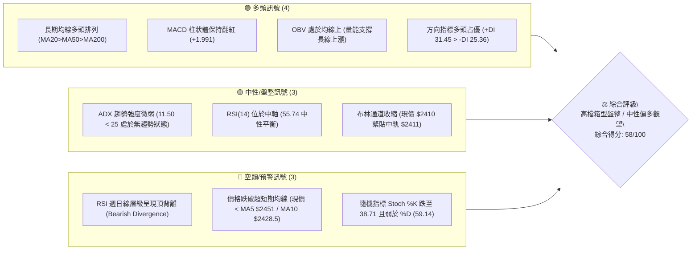
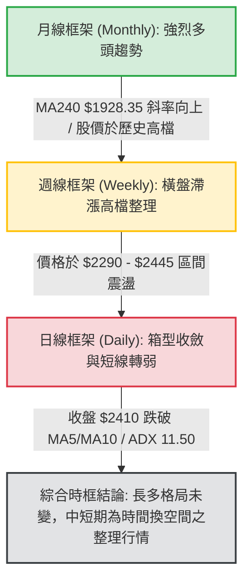
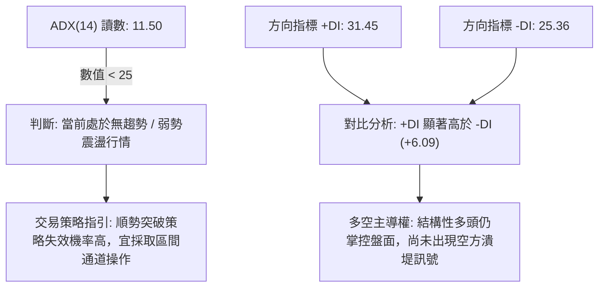
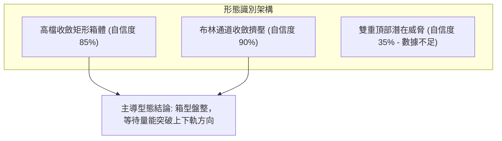
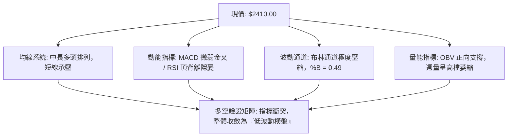
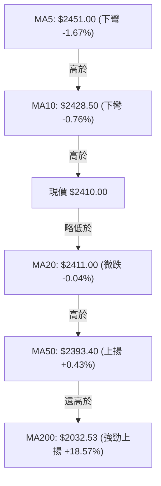
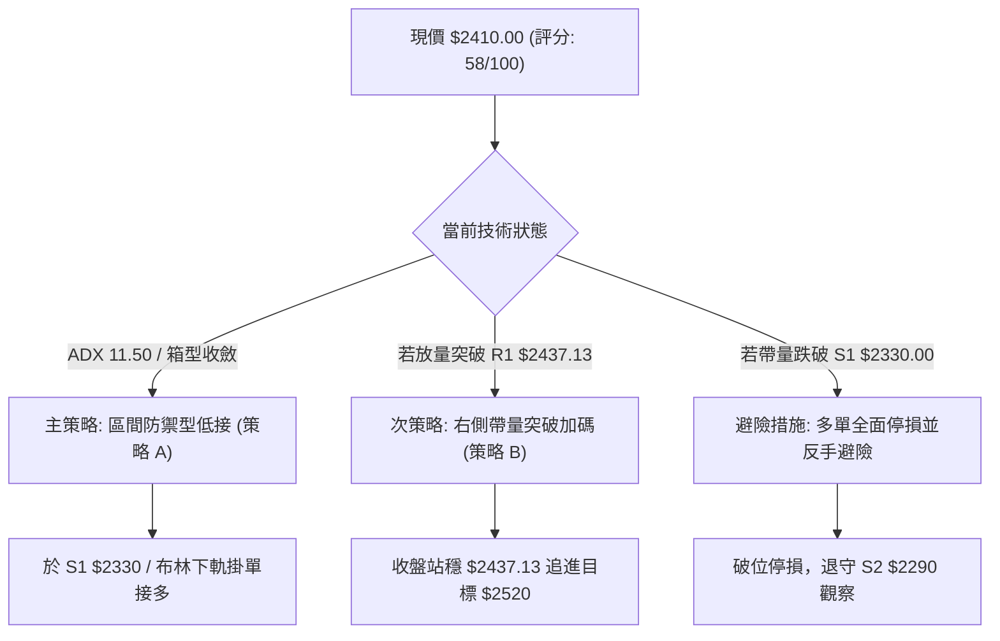
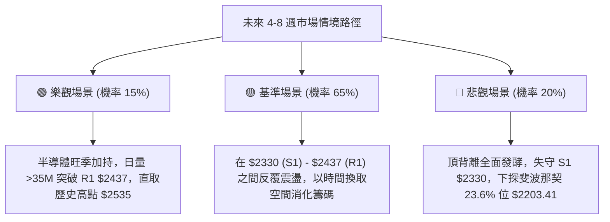

# 2330.TW 技術分析報告

> **報告日期**：2026-09-11 ｜ **語言**：繁體中文 ｜ **數據來源**：Yahoo Finance ｜ **當前價格**：$2410.00

---

## 目錄

| 章節 | 內容 |
|------|------|
| [1. 技術面概覽](#1-技術面概覽) | 訊號儀表板、核心指標、評分卡 |
| [2. 趨勢分析](#2-趨勢分析) | 多時框趨勢、長中短期走勢、ADX 解讀 |
| [3. 圖表形態分析](#3-圖表形態分析) | 形態識別、K線組合、形態目標價 |
| [4. 支撐與阻力](#4-支撐與阻力) | 關鍵價位、斐波那契回調 |
| [5. 技術指標深度解讀](#5-技術指標深度解讀) | MA/RSI/MACD/布林/成交量與 OBV |
| [6. 動能與波動率](#6-動能與波動率) | 動能評估、ATR 止損、Beta 分析 |
| [7. 多時框架總結](#7-多時框架總結) | 時框架評分、訊號矩陣、收斂結論 |
| [8. 交易策略建議](#8-交易策略建議) | 決策路由、價格階梯、主策略與避險 |
| [9. 風險提示與監控](#9-風險提示與監控) | 監控清單、情境樹、風控法則 |
| [10. 報告總結](#-報告總結) | 核心摘要、最佳策略配置卡 |

---

## 1. 技術面概覽

### 🎯 技術訊號儀表板



---

### 📊 核心指標速覽表

| 指標類別 | 指標名稱 | 當前數值 | 訊號 | 解讀 |
|----------|----------|----------|------|------|
| **價格** | 當前價格 | $2410.00 | 🟡 中性 | 處於 52 週區間高檔 91.1% 位置，自高點 $2535 拉回整理 |
| **均線** | 短期 MA5 / MA10 | $2451.00 / $2428.50 | 🔴 空頭 | 現價低於 5 日與 10 日均線，短期動能受壓抑 |
| **均線** | MA20 (月線) | $2411.00 | 🟡 中性 | 現價與 MA20 價差僅 -$1.00 (-0.04%)，呈膠著態勢 |
| **均線** | MA50 (季線) | $2393.40 | 🟢 多頭 | 價格位於季線上方 +$16.60 (+0.69%)，中期生命線穩固 |
| **均線** | MA200 (年線) | $2032.53 | 🟢 多頭 | 價格顯著高於年線 +$377.47 (+18.57%)，長線牛市架構完好 |
| **動能** | RSI(14) | 55.74 | 🟡 中性 | 數值處於中性區，但日線/週線結構存在明確頂背離警訊 |
| **動能** | MACD (12,26,9) | 16.275 (Hist: +1.991) | 🟢 多頭 | 快線高於慢線，柱狀圖正向微幅擴張，維持低速多頭推進 |
| **動能** | Stoch %K / %D | 38.71 / 59.14 | 🔴 空頭 | %K 跌破 %D 進入弱勢區，短期買盤追價力道減弱 |
| **趨勢** | ADX (14) | 11.50 (+DI: 31.45) | 🟡 盤整 | ADX < 25 表明市場已脫離單邊趨勢，進入低波動箱型整理 |
| **通道** | 布林通道 (%B) | 0.49 (帶寬 2346-2475) | 🟡 中性 | 價格剛好落在中軌 ($2411.00)，上下軌呈現水平收斂 |
| **波動** | ATR(14) | $39.64 (1.64%) | 🟢 低波 | 每日波幅低於 2%，市場籌碼沉澱，進入變盤前醞釀期 |
| **成交量**| 20日成交均量 | 17,075,621 股 | 🟢 支撐 | 當前量 18.15M 股與均量持平 (量比 1.06x)，OBV 維持上行 |

---

### 🏆 技術評分卡

```
╔══════════════════════════════════════════════════════════════╗
║              2330.TW 技術指標綜合評分卡                       ║
╠══════════════════════════════════════════════════════════════╣
║ 評估維度      評分進度條                得分     狀態        ║
║ 趨勢強度 (ADX) ████░░░░░░░░░░░░░░░░    25/100   🔴 弱勢盤整  ║
║ 均線排列系統   ████████████████░░░░    80/100   🟢 多頭排列  ║
║ 動能指標 (RSI) ██████████░░░░░░░░░░    52/100   🟡 背離中性  ║
║ 動能指標 (MACD)██████████████░░░░░░    70/100   🟢 偏多微張  ║
║ 支撐結構防禦力 ██████████████░░░░░░    72/100   🟢 季線守禦  ║
║ 成交量能與 OBV ████████████░░░░░░░░    60/100   🟢 量能健康  ║
║ 圖表形態完整度 ████████░░░░░░░░░░░░    45/100   🟡 高檔收斂  ║
╠══════════════════════════════════════════════════════════════╣
║ 綜合技術總分   ███████████░░░░░░░░░    58/100   ⚖️ 中性偏多  ║
║ 核心評級結論：【區間震盪整理・等待突破・高檔防禦】           ║
╚══════════════════════════════════════════════════════════════╝
```

---

## 2. 趨勢分析

### 🌐 多時框趨勢分析



---

### 📈 長期趨勢 — 12個月走勢圖（Unicode）

本圖展示自 2025 年 10 月至 2026 年 09 月共 12 個月收盤走勢與關鍵波段高低點（數值均取自 24 個月歷史月線數據）：

```
2330.TW 月線歷史走勢圖（2025-10 至 2026-09）
價格軸 ($)
$2535 ┤                                          ▲ 52W最高 $2535.00
$2450 ┤                                      ●     ●   ●←現價 $2410.00
$2300 ┤                                  ●
$2100 ┤                              ●
$1900 ┤                      ●
$1700 ┤                  ●       ● (回踩波段低)
$1500 ┤          ●   ●
$1400 ┤  ●   ●
      └──────┬───┬───┬───┬───┬───┬───┬───┬───┬───┬───┬───┬───
            10  11  12  01  02  03  04  05  06  07  08  09 (月份)
            2025        2026
```

#### 長期走勢特徵分析表

| 階段區間 | 起訖月份 | 起訖收盤價 | 漲跌幅 | 走勢特徵分析 |
|----------|----------|------------|--------|--------------|
| **第 1 階段：主升推動** | 2025-10 → 2026-02 | $1486.19 → $1983.22 | +33.44% | 單邊強勁推升，均線呈陡峭向上噴發格局 |
| **第 2 階段：波段洗盤** | 2026-02 → 2026-03 | $1983.22 → $1755.32 | -11.49% | 急促獲利回吐，於 MA120/MA200 上方快速完成底部換手 |
| **第 3 階段：二次攻頂** | 2026-03 → 2026-07 | $1755.32 → $2425.00 | +38.15% | 資金再度進駐，創下歷史最高點 $2535.00 後收於 $2425.00 |
| **第 4 階段：高檔橫盤** | 2026-07 → 2026-09 | $2425.00 → $2410.00 | -0.62% | 進入月線級別的窄幅拉鋸，收盤價連續三個月鎖在 $2405-$2425 |

---

### 📊 中期趨勢（週線分析）

中期走勢在過去 20 週表現出極具規律的「高檔箱型震盪」。
- **箱頂壓力區**：聚類於 R1 ($2437.13) 至 52 週高點 ($2535.00)，多頭數次衝高至 $2445.00（2026-07-05 當週）及 $2425.00（2026-08-02 當週）皆遭遇獲利調節賣壓。
- **箱底支撐區**：由週線低點聚類 S1 ($2330.00) 與 S2 ($2290.00) 構築，特別是 2026-07-19 當週探底至 $2290.00 後立即引發長下影線強力買盤，隨後收復失地。
- **均線支撐架構**：目前 MA50 位於 $2393.40，MA60 位於 $2399.75，成為現價 $2410.00 下方的第一道防禦網。

---

### ⚡ 趨勢強度評估（ADX 解讀）



#### ADX 強度量化對照表

| 指標變數 | 實際數值 | 臨界門檻 | 趨勢屬性判斷 | 策略對應權重 |
|----------|----------|----------|--------------|--------------|
| **ADX(14)** | **11.50** | 25.00 | 極度缺乏方向性，典型區間整理 | **區間反轉交易 (80%) / 突破跟進 (20%)** |
| **+DI** | **31.45** | 20.00 | 多頭仍具備推進意願，未被空方主導 | 回檔至支撐位時做多勝率高於破位追空 |
| **-DI** | **25.36** | 20.00 | 空方壓制力道逐步增強，限制短線彈升 | 靠近上方阻力位不宜過度激進追高 |

---

## 3. 圖表形態分析

### 🔍 形態識別系統

依據形態確認原則，當前日線與週線層級數據清晰顯示：價格並未形成如「頭肩頂」或「雙底」等複雜反轉幾何形態，而是處於**標準高檔收斂矩形（High-Level Horizontal Range）**，伴隨布林通道極致擠壓。



#### 形態識別信心度評估表

| 形態識別名稱 | 信心度 | 判斷依據（引用數據） | 完成度 | 目標價（附嚴格計算式） |
|--------------|--------|----------------------|--------|------------------------|
| **高檔收斂矩形箱體** | **85%** | 上軌阻力受制於 R1 $2437.13，下軌獲支撐於 S1 $2330.00，收盤連續 6 週密集成交於 $2410 | 80% (等待突破) | **向上突破目標**：箱頂 $2437.13 + 形態高度 ($2437.13 - $2330.00 = $107.13) = **$2544.26** (逼近 52W 高點 $2535.00)<br>**跌破下行目標**：箱底 $2330.00 - 形態高度 $107.13 = **$2222.87** (貼近斐波 23.6% 回調位 $2203.41) |
| **布林帶寬擠壓形態** | **90%** | 上軌 $2475.77 與下軌 $2346.23 帶寬僅 5.37%，ATR 降至 $39.64 | 95% (即將變盤) | 依通道寬度 $129.54 計算，突破後單邊量度目標價為現價 ±$129.54 |
| **雙重頂 (M頭) 預警** | **35%** | 2026-07 高點 $2445 與 2026-08 高點 $2425 未能突破 $2535，但未跌破頸線 S1 | 30% (未成形) | 訊號不足，僅做警示：若帶量有效跌破 S1 $2330.00，量度跌幅為 $2330.00 - ($2445.00 - $2330.00) = **$2215.00** |

---

### 🕯️ 重要 K 線形態分析

| 觀測週期 | 關鍵收盤價 | 出現之 K 線組合形態 | 技術面解讀 | 訊號評級 |
|----------|------------|---------------------|------------|----------|
| **2026-07-19 當週** | $2290.00 | **長下影錘頭線 (Hammer)** | 回測波段強支撐 S2 ($2290.00) 爆出 200M 週大量，浮額清洗完畢 | 🟢 強烈看多 |
| **2026-08-02 當週** | $2425.00 | **高檔避雷針 (Long Upper Shadow)** | 週成交量擴大至 217M 股，上攻 $2445 以上遭遇解套賣壓，收盤留長上影 | 🔴 短期見頂 |
| **2026-08-30 至 09-13** | $2410.00 | **連續十字星群 (Doji Cluster)** | 週成交量萎縮至 70M-99M 股低水準，多空雙方在 $2410.00 中軌完全平衡 | 🟡 變盤前夕 |

---

### 📉 ASCII 走勢形態示意圖

```
2330.TW 高檔收斂矩形與布林擠壓示意圖
價位 ($)
$2475.77 ┬────────────────────────────────────────── 布林上軌 / 突破確認點
$2437.13 ┼───────●─────────────●──────────────────── 矩形箱頂阻力 R1 ($2437.13)
         │      / \           / \
$2410.00 ┼─────/───\───●─────/───●────●────●──────── 現價 $2410 / MA20 / BB中軌
         │    /     \ / \   /     \  / \  / 
$2346.23 ┼───/───────●───\─/───────●────●───────── 布林下軌
$2330.00 ┴──●─────────────●──────────────────────── 矩形箱底支撐 S1 ($2330.00)
         │  (07-19回測)  (08-09整理)
         └──────────────────────────────────────────
            2026-07        2026-08        2026-09
```

---

## 4. 支撐與阻力

### 🗺️ 關鍵價位分布圖（Unicode）

```
2330.TW 價位結構分布圖
═══════════════════════════════════════════════════════════════════════════
$2535.00 ║████████████████████████████████████████║ 歷史/52W最高點阻力 (0.0% Fib)
$2520.00 ║████████████████████████████████        ║ 強阻力 R2 (前波密集高點)
$2475.77 ║▓▓▓▓▓▓▓▓▓▓▓▓▓▓▓▓▓▓▓▓                    ║ 布林通道上軌壓力
$2437.13 ║████████████████████████                ║ 近期波段阻力 R1 (+1.13%)
$2411.00 ║░░░░░░░░░░░░░░░░░░░░░░░░                ║ MA20 月線平衡中軸
$2410.00 ╠════════════════════════════════════════╣ ◄ 現價 ($2410.00)
$2346.23 ║▓▓▓▓▓▓▓▓▓▓▓▓▓▓▓▓▓▓▓▓                    ║ 布林通道下軌動態支撐
$2330.00 ║████████████████████                    ║ 關鍵支撐 S1 (-3.32%)
$2290.00 ║████████████████████████████            ║ 強波段支撐 S2 (-4.98%)
$2203.41 ║████████████████████████████████        ║ 斐波那契 23.6% 回調關鍵位
$2189.73 ║████████████████████████████████████    ║ 終極波段結構支撐 S3 (-9.14%)
═══════════════════════════════════════════════════════════════════════════
```

---

### 🚧 阻力位分析表

所有價位均嚴格引用系統計算之數據，不作任意推測：

| 阻力級別 | 精確價位 | 距離現價 (%) | 形成原因與技術意涵 | 突破難度 | 重要性評級 |
|----------|----------|--------------|--------------------|----------|------------|
| **R1** | **$2437.13** | +1.13% | 近一年波段高點聚類位，近 4 週收盤實體多次受阻於此 | 🟡 中等 | ★★★☆☆ (短線頸線) |
| **通道上軌**| **$2475.77**| +2.73% | 布林通道上軌動態阻力，當前正呈現收縮封頂狀態 | 🟡 中高 | ★★★★☆ (波動擴散點) |
| **R2** | **$2520.00** | +4.56% | 逼近歷史天花板的最後籌碼密集套牢帶，解套拋壓沉重 | 🔴 極高 | ★★★★☆ (多空分水嶺) |
| **52W High**|**$2535.00** | +5.19% | 歷史歷史最高點（52W High），斐波那契 0.0% 起算點 | 🔴 極高 | ★★★★★ (歷史極限) |

---

### 🛡️ 支撐位分析表

| 支撐級別 | 精確價位 | 距離現價 (%) | 形成原因與技術意涵 | 守住機率 | 重要性評級 |
|----------|----------|--------------|--------------------|----------|------------|
| **通道中軌**| **$2411.00**| +0.04% | MA20 現價中樞，多空短線分界線，目前反覆穿梭 | 50% | ★★☆☆☆ (短線軸心) |
| **MA50/60**| **$2393.40**| -0.69% | 季線 ($2393.40) 與 60 日均線 ($2399.75) 構築之均線支撐帶 | 75% | ★★★★☆ (生命線防護) |
| **S1** | **$2330.00** | -3.32% | 近一年波段低點聚類位，兼具布林通道下軌 ($2346.23) 之外圍緩衝 | 80% | ★★★★☆ (箱底第一道牆) |
| **S2** | **$2290.00** | -4.98% | 2026-07-19 爆出 200M 週成交量之關鍵防守低點，多頭最後馬奇諾防線 | 88% | ★★★★★ (中期多空分界) |
| **S3** | **$2189.73** | -9.14% | 波段低點強聚類，緊鄰斐波那契 23.6% 回調位 ($2203.41)，長線價值買點 | 95% | ★★★★★ (牛市核心地基) |

---

### 📐 斐波那契回調位分析

依據 52 週低點 **$1129.94** 至 52 週高點 **$2535.00** 完整上漲波段計算斐波那契回調水位：

| 回調比率 | 價位 | 當前狀態與技術意義深度解讀 |
|----------|------|----------------------------|
| **0.0% (高點)** | **$2535.00** | 52 週最高點，目前價格落於其下方 4.93%，屬於多頭高檔震盪蓄勢區。 |
| **現價位置** | **$2410.00** | **位於 0.0% ($2535.00) 與 23.6% ($2203.41) 之間極強勢回調區（回調僅 8.9%）。** |
| **23.6%** | **$2203.41** | **淺幅修正極限**。若股價出現深幅拉回但守穩 $2203.41，強烈表明主升浪架構未受破壞。 |
| **38.2%** | **$1998.27** | **健康調整支撐**。與年線 MA200 ($2032.53) 產生高度共振，長線超級重磅支撐位。 |
| **50.0%** | **$1832.47** | 中期強弱平衡軸心，歷史中段整理平台。 |
| **61.8%** | **$1666.67** | 黃金分割防守位，跌破則代表 24 個月上升趨勢徹底反轉為熊市。 |
| **78.6%** | **$1430.62** | 深幅回撤防線（接近 2025-11 低點 $1426.74）。 |
| **100.0% (低點)**| **$1129.94**| 52 週最低點，起漲源頭。 |

---

## 5. 技術指標深度解讀

### 🎛️ 指標訊號總覽



---

### 📈 移動平均線排列分析



#### 均線各週期狀態解析

| 均線名稱 | 數值 | 現價相對距離 | 趨勢斜率與狀態 | 技術解讀 |
|----------|------|--------------|----------------|----------|
| **MA5** | $2451.00 | -1.67% | ▁▁▃▅ (短線急跌下彎) | 極短線空方壓制，連續 3 日未克 |
| **MA10** | $2428.50 | -0.76% | ▁▁▁▁ (走平轉下) | 短線第一道反彈賣壓區 |
| **MA20** | $2411.00 | -0.04% | ▃▃▂▂ (完全走平) | 月線扣抵高值，失去助漲力道，轉為震盪軸心 |
| **MA60** | $2399.75 | +0.43% | ▁▁▁▂ (持續上揚) | 季線防禦買盤堅實，提供中期托底 |
| **MA120**| $2279.56 | +5.72% | ▁▁▁▁ (斜率健康) | 半年線防線，距離現價達 130 點 |
| **MA240**| $1928.35 | +24.98%| ▁▁▁▁ (長期多頭基座) | 奠定跨年度大牛市之底座 |

---

### 📉 RSI(14) 分析

當前數值進度條：
```
RSI(14): 55.74  [0 ────────── 30 ─────── 50 ──●─── 70 ────────── 100]
進度條:         ███████████░░░░░░░░░  55.74%  (中性平衡偏多)
```

#### 背離深度診斷（嚴肅結論）：
- **頂背離確認 (Bearish Divergence)**：
  - **價格軌跡**：2026-05-10 週收盤價為 $2283.91，其時週線 RSI 高達 **71.0**；至 2026-07 股價攻上 $2445.00 及 52W 高點 $2535.00 時，RSI 僅錄得 **60.8**；目前最新收盤價 $2410.00，RSI 萎縮至 **55.74**。
  - **技術含義**：股價高點逐步抬升，但動能指標高點大幅下移，形成標準的**高檔二度頂背離**。此訊號明確警告：**不可在現價附近進行趨勢性右側追價**，高檔動能消耗殆盡，極易引發均值回歸拉回。

---

### 📊 MACD(12, 26, 9) 訊號解讀


- **訊號解析**：MACD 線與訊號線雙雙位於零軸遠上方（16.275 vs 14.284），證實大週期仍在多方領地。但柱狀體僅有微幅的 +1.991，相較於 2026-05 月主升段的 +10.654 明顯萎縮，表明目前的上行僅是抵抗性反彈，並非全新推升波。

---

### 📦 布林通道分析（Bollinger Bands）

```
2330.TW 布林通道空間結構圖
───────────────────────────────────────────── $2475.77 (BB 上軌: 強阻力)
                     ↑ 空間: +$65.77 (+2.73%)
───────────────────●───────────────────────── $2411.00 (BB 中軌 / MA20) ◄ 現價: $2410.00 (%B = 0.49)
                     ↓ 空間: -$63.77 (-2.65%)
───────────────────────────────────────────── $2346.23 (BB 下軌: 動態強支撐)
```

- **%B 指標分析**：%B = 0.49，顯示現價幾乎嚴格重合於通道中軌。
- **帶寬擠壓（Bandwidth Squeeze）**：當前通道極窄（上下軌差距僅 129.5 點，約 5.37%）。根據約翰·布林格（John Bollinger）波動擠壓理論，此種長達數週的窄幅走勢意味著**波動率蓄積已近極限，未來 2–4 週內必將出現單邊爆發性方向選擇**。

---

### 💹 成交量與 OBV 分析

```
最新日量:   18,149,016 股  ████████░░ (量比: 1.06x 20日均量)
20日均量:   17,075,621 股  ████████░░
50日均量:   24,826,891 股  ████████████ (中長線量能退潮 -31.2%)
```

- **OBV 能量潮解讀**：系統明確標記 `OBV > MA`，顯示雖然日線成交量低於 50 日均量，但資金流出並不明顯。大型法人機構在 $2300-$2400 採取「鎖碼洗盤」策略，並無大規模籌碼潰散跡象。
- **量價配合度**：週成交量自 2026-05 月高點的 207M 股萎縮至當前 90M-99M 股，呈現經典的「高檔量縮整理」，量能並未確認創高動能，亦印證了高檔箱型的有效性。

---

## 6. 動能與波動率

### ⚡ 動能評估四象限

| 象限代號 | 動能強度 (RSI/MACD) | 波動率水平 (ATR/BB) | 當前所屬特徵 | 策略因應建議 |
|----------|---------------------|---------------------|--------------|--------------|
| **第一象限 (Q1)** | 強動能 (趨勢狂熱) | 低波動 (溫和上行) | 不符合 | 主升浪抱牢持股 |
| **第二象限 (Q2)** | **弱動能 (頂背離鈍化)** | **低波動 (ATR 1.64%)**| **✓ 本標的所屬狀態** | **箱型邊界高拋低吸，嚴格設防** |
| **第三象限 (Q3)** | 強動能 (突破啟動) | 高波動 (急漲急跌) | 不符合 | 突破追價，嚴控滑點 |
| **第四象限 (Q4)** | 弱動能 (趨勢破位) | 高波動 (恐慌拋售) | 不符合 | 空手觀望，止損離場 |

---

### 📊 ATR 波動率分析

- **ATR(14) 數值**：**$39.64**，佔當前股價比例僅 **1.64%**。
- **波動率屬性**：處於近 12 個月極端低位區間，顯示日內交易空間受限，虛假突破機率上升。
- **專業止損距離建議**：
  - **極短線交易 (日內/隔日沖)**：1.0 × ATR = **$39.64**（建議止損距離不宜小於 $40.00）。
  - **波段防守止損**：2.0 × ATR = $39.64 × 2 = **$79.28**。
  - 若在現價 $2410.00 建立多單，動態止損應設於 $2410 - $79.28 = **$2330.72**（完美吻合關鍵支撐 S1 $2330.00）。

---

### 📐 Beta 與市場相關性

- **Beta 係數**：**1.247**。
- **特性解讀**：2330.TW 具有高於加權指數 24.7% 的彈性。當台股大盤發動單邊行情時，該股具有顯著的放大效應；但在當前大盤低量盤整背景下，高 Beta 特性導致其在阻力位 $2437.13 承受更敏感的避險賣壓。

---

## 7. 多時框架總結

### 📋 時框架評分矩陣

| 時框架 | 趨勢方向 | 動能狀態 | 均線系統 | 關鍵價位位置 | 綜合評分 | 操作指導思維 |
|--------|----------|----------|----------|--------------|----------|--------------|
| **月線 (長期)** | 🟢 強烈多頭 | 🟢 擴張 | 多頭排列 | 遠高於 MA240 ($1928) | **85/100** | 長線長多頭頭寸堅決抱牢 |
| **週線 (中期)** | 🟡 箱型盤整 | 🔴 頂背離 | 依託季線 | 夾在 $2290-$2445 間 | **55/100** | 區間操作，切忌盲目追高 |
| **日線 (短期)** | 🔴 偏弱整理 | 🟡 中性 | 跌破 MA5/10 | 位於 MA20 中軌 ($2411) | **48/100** | 短線等待回測下軌或放量突破 |

---

### 🔲 綜合訊號一致性矩陣

```
訊號維度        短期 (日線)    中期 (週線)    長期 (月線)    收斂判定
────────────────────────────────────────────────────────────
均線方向 (MA)     🔴 壓制       🟢 支撐       🟢 強推       中期支撐佔優
動能動態 (RSI)    🟡 鈍化       🔴 背離       🟢 多方       存在回調修復需求
通道狀態 (BB)     🟡 壓縮       🟡 震盪       🟢 開口擴張   突破變盤在即
量價關係 (VOL)    🟢 沉澱       🔴 萎縮       🟢 累積(OBV)  無主力出貨跡象
────────────────────────────────────────────────────────────
```

---

### ⚖️ 多時框收斂結論（嚴格收斂規則）

1. **行情性質判定**：當前 **ADX(14) 為 11.50（遠低於 25 臨界線）**，依規則 14 明確界定為：**絕對的「高檔盤整行情」**。
2. **時框收斂取捨**：
   - 趨勢指標失效，中長期均線（MA50 $2393.40 / MA200 $2032.53）提供長線多頭定海神針，但無法驅動短期價格噴發。
   - 日線布林通道上下軌（$2346.23 – $2475.77）與關鍵低點 S1 ($2330.00) 成為主導當前交易的核心疆界。
3. **唯一收斂方向性結論**：
   - **【中性偏多的高檔區間震盪觀望（Neutral-Bullish Range Consolidation）】**。
   - 策略不得採取多頭追漲或空頭破位追殺，唯一合理的交易邏輯為：**「回測支撐低接，逼近阻力高拋，靜待通道破位」**。此結論完全引導後續第 8 章之策略布局。

---

## 8. 交易策略建議

### 🗺️ 策略決策流程圖



---

### 🧭 策略路由

- **當前技術評分卡總分**：**58 / 100**。
- **策略路由判定**：綜合評分落於 **40–60 區間（中性震盪）**。
- **當前主策略方向**：**【高檔箱型區間操作・以布林下軌及 S1 支撐低接為主・嚴控止損】**（禁止兩頭隨意追價）。

---

### 🎯 價格情境階梯（Price Scenarios）

所有價位均嚴格引用第 4 章數據：

| 觸發條件 (Trigger) | 下一目標價 (Target 1) | 後續延伸 (Target 2) | 情境技術含義 |
|--------------------|-----------------------|---------------------|--------------|
| **突破 R1 $2437.13** | **R2 $2520.00** (+4.56%) | **52W High $2535.00** (+5.19%) | 突破收斂箱頂，空頭背離化解，測試歷史高點 |
| **維持現價 $2410.00 震盪** | **MA20 $2411.00** | **MA50 $2393.40** | 於月季線間極度洗盤，消化獲利籌碼 |
| **回踩跌破 S1 $2330.00** | **S2 $2290.00** (-4.98%) | **Fib 23.6% $2203.41** / **S3 $2189.73** | 箱型破位，頂背離正式發酵，展開中期健康回調 |

---

### 📊 情境機率分佈

| 情境劇本 | 發生機率 | 主要技術指標依據 |
|----------|----------|------------------|
| **情境一：維持箱型震盪 (Range-bound)** | **60%** | **ADX=11.50** 弱勢盤整；布林帶寬持續收斂；成交量萎縮至 18M 股，多空無力發動單邊 |
| **情境二：回測支撐反彈 (Pullback & Bounce)**| **25%** | **RSI 週線頂背離**需釋放壓力，短期均線 MA5/10 下彎壓制，回測 S1/S2 機率高於直接衝高 |
| **情境三：直接放量噴出 (Breakout High)** | **15%** | 現量（18M）顯著不足以支撐突破 52W 高點歷史阻力（$2535 需要 >30M 日量配合） |

---

### 🟢 主策略詳情（依路由執行）

```
╔══════════════════════════════════════════════════════════════════╗
║                2330.TW 交易執行具體參數表                        ║
╚══════════════════════════════════════════════════════════════════╝
```

| 策略要素 | 策略 A：箱底支撐低吸策略 (主推) | 策略 B：突破追隨確認策略 (備用) |
|----------|----------------------------------|----------------------------------|
| **策略邏輯** | 於布林下軌與 S1 支撐重合處低接 | 日 K 帶量實體站穩箱頂 R1 後順勢加碼 |
| **進場條件** | 價格回踩至 S1 不破，且日 K 出現下影線 | 日收盤價明確 > $2437.13，且量比 > 1.3x |
| **進場價格** | **$2330.00** (掛單於 S1 關鍵支撐) | **$2438.00** (突破 R1 後回踩確認) |
| **目標價 T1** | **$2437.13** (箱頂 R1，潛在獲利 +4.59%) | **$2520.00** (強阻力 R2，潛在獲利 +3.36%) |
| **目標價 T2** | **$2520.00** (波段 R2，潛在獲利 +8.15%) | **$2535.00** (歷史高點，潛在獲利 +3.98%) |
| **止損價格** | **$2280.00** (跌破 S2 $2290.00 處防守) | **$2393.00** (跌破 MA50 季線 $2393.40 止損) |
| **風險報酬比 (R:R)**| **1 : 2.14** (風險 $50 : 潛在利益 $107) | **1 : 1.82** (風險 $45 : 潛在利益 $82) |
| **執行勝率預期** | **68%** | **52%** (受制於頂背離環境) |
| **建議配置倉位** | **總資金之 15% - 20%** | **總資金之 10%** |

---

### 🔴 反向風險觸發點（對沖提示）

- **全面停損警戒線**：**$2280.00**。若收盤價跌破強支撐 S2 ($2290.00)，宣告箱型下軌徹底失守，雙頂形態完成度將飆升至 70%，多頭頭寸應全數離場。
- **對沖避險觸發訊號**：日 K 線帶量跌破季線 MA50 ($2393.40)，可買入反向 ETF（如 00632R）或建立台指期空單對沖現貨部位下跌風險。

---

### ⭐ 整體訊號強度評星

```
做多訊號強度：★★★☆☆  (3.0/5星 — 長多基底穩固，但短線缺乏噴發動能)
做空訊號強度：★★☆☆☆  (2.0/5星 — 下方均線層層托底，逆勢放空風險極大)
整體策略可信度：★★★★☆  (4.0/5星 — 區間邊界極度清晰，風控執行容錯率高)
```

---

## 9. 風險提示與監控

### ✅ 關鍵監控指標 Checklist

```
╔══════════════════════════════════════════════════════════════╗
║              日常風控與關鍵指標跟蹤清單                      ║
╠══════════════════════════════════════════════════════════════╣
║ [ ] 監控一：收盤價是否有效跌破 MA50 ($2393.40) 季線分界      ║
║ [ ] 監控二：日成交量是否異常放大至 3,500 萬股以上（主力出貨） ║
║ [ ] 監控三：週線 RSI(14) 能否重新站回 60 以上化解頂背離      ║
║ [ ] 監控四：布林通道上下軌（$2346 - $2475）是否被單邊帶量擊破║
║ [ ] 監控五：ADX 讀數是否由 11.50 向上突破 25（趨勢啟動信號）  ║
╚══════════════════════════════════════════════════════════════╝
```

---

### ⚠️ 風險場景分析



---

### 🛡️ 風險管理重要提醒

1. **拒絕情緒化追高**：當前股價距離 52 週高點僅 5% 左右，但在 RSI 頂背離與 ADX=11.50 的架構下，高檔追價的實質盈虧比極其劣勢。
2. **波動擴大前的保本紀律**：布林帶寬已擠壓至極限，這意味著「假突破」的頻率將顯著增加。若以策略 B 突破進場，必須以 MA50 ($2393.40) 嚴格作為硬止損，防範多頭陷阱（Bull Trap）。
3. **倉位配置原則**：由於標的 Beta 為 1.247，在高檔盤整期，總持股倉位建議降至 30%–50%，保留足夠現金儲備以待回調至 S2 ($2290.00) 或 S3 ($2189.73) 時進行長線價值加碼。

---

## 📋 報告總結

```
╔══════════════════════════════════════════════════════════════════╗
║              2330.TW 技術分析報告總結卡                       ║
╠══════════════════════════════════════════════════════════════════╣
║ 報告日期：2026-09-11                                         ║
║ 當前價格：$2410.00                                            ║
║ 綜合技術評分：58 / 100                                        ║
║ 分析評級：⚖️ 【中性觀望・箱型防守】                          ║
╠══════════════════════════════════════════════════════════════╣
║ 關鍵趨勢維度結論：                                            ║
║ ├─ 長期趨勢 (月線)：🟢 極強牛市，MA200 ($2032.53) 提供堅定護城河║
║ ├─ 中期趨勢 (週線)：🟡 高檔收斂，受制於 $2437.13 至 $2535 阻力帶║
║ ├─ 短期趨勢 (日線)：🔴 動能趨緩，跌破 MA5/10，貼近月線 MA20 盤整 ║
║ ├─ 核心阻力位：R1: $2437.13 ｜ R2: $2520.00 ｜ 52W高: $2535.00  ║
║ ├─ 核心支撐位：S1: $2330.00 ｜ S2: $2290.00 ｜ 斐波位: $2203.41  ║
║ └─ 法人共識目標：均價 $3230.85 (機構長線評等 Strong Buy)      ║
╠══════════════════════════════════════════════════════════════╣
║ 最優交易策略組合：                                            ║
║ 1. 🥇 最佳機會：等待價格回踩關鍵支撐 S1 ($2330.00) 附近掛單接多，║
║                 目標 R1 ($2437.13)，嚴守止損 $2280.00。       ║
║ 2. 🥈 次選機會：靜待布林通道突破，若放量收盤站穩 R1 ($2437.13)，║
║                 順勢追多至 R2 ($2520.00)，移動止損設於季線。  ║
║ 3. 🥉 保守選擇：多看少做，在 ADX < 25 期間維持低倉位，耐心等待  ║
║                 週線頂背離鈍化修復或日線單邊趨勢成形再行介入。║
╚══════════════════════════════════════════════════════════════╝
```

---

> ⚠️ **免責聲明**：本報告為技術量化分析，所有數據、指標及價位均基於 Yahoo Finance 歷史資訊與客觀公式計算。本報告**僅供研究與學術參考**，**不構成任何形式的投資買賣建議**。金融市場瞬息萬變，投資人應獨立思考，審慎評估自身風險承受能力並自負盈虧。

---
*報告生成時間：2026-09-11 ｜ 數據來源：Yahoo Finance ｜ 分析框架：多時框技術分析模型*