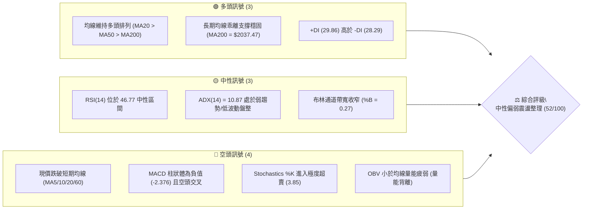
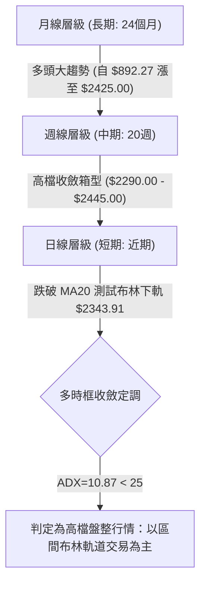
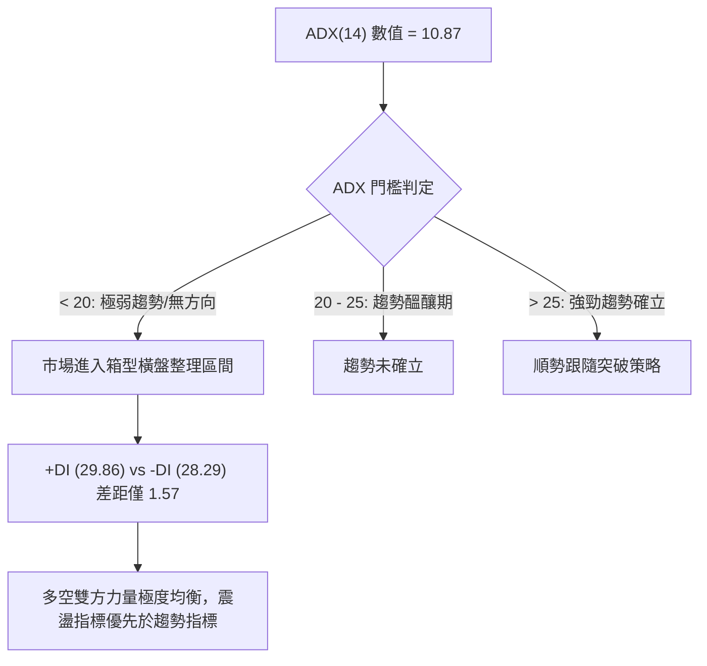
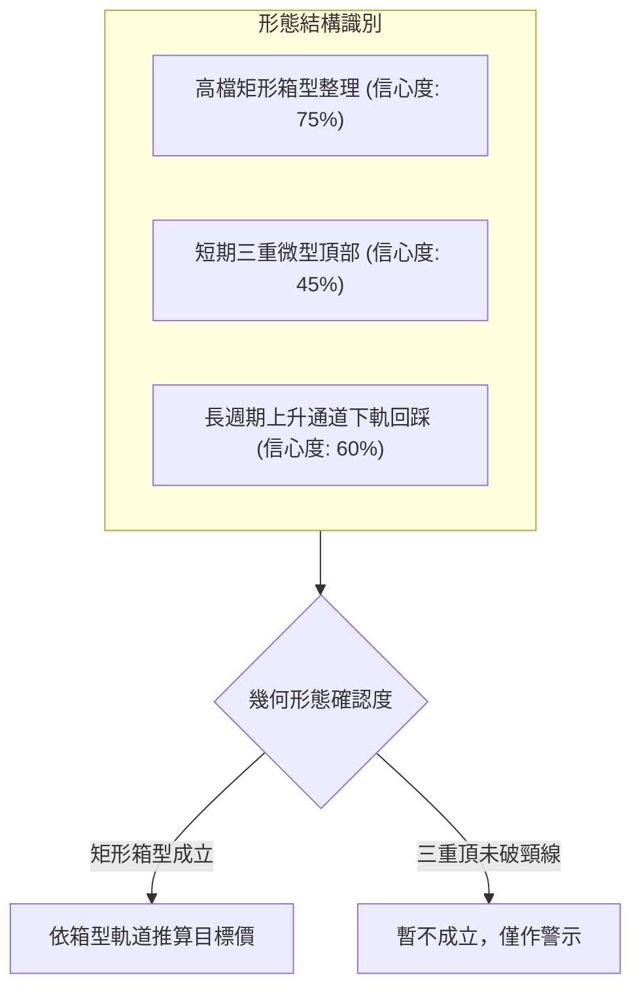
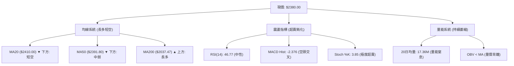
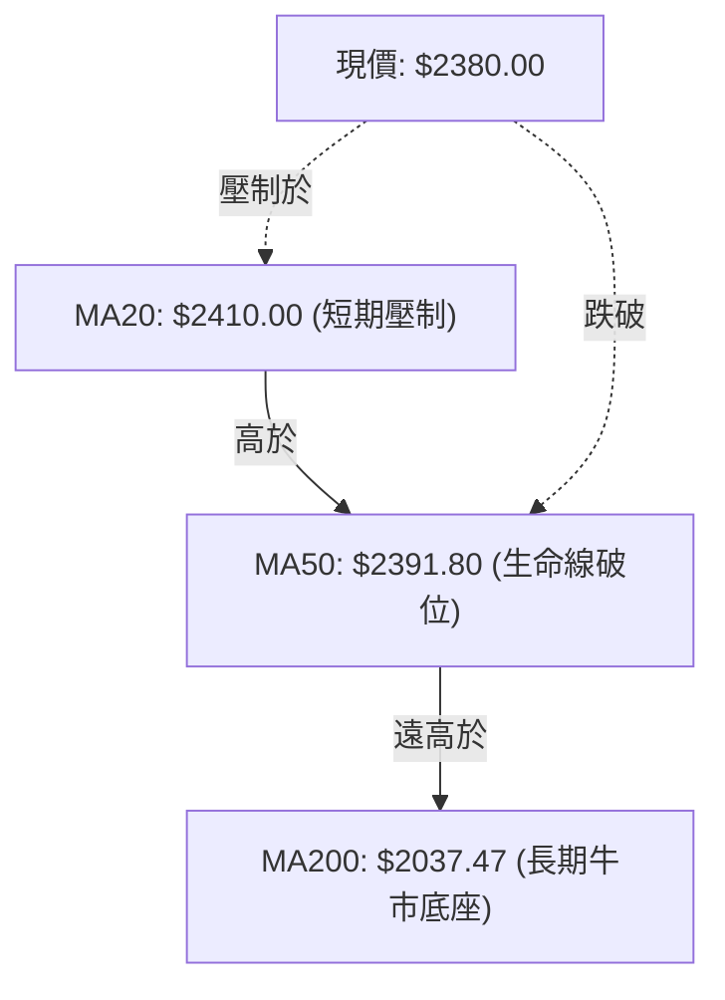
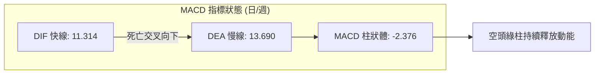
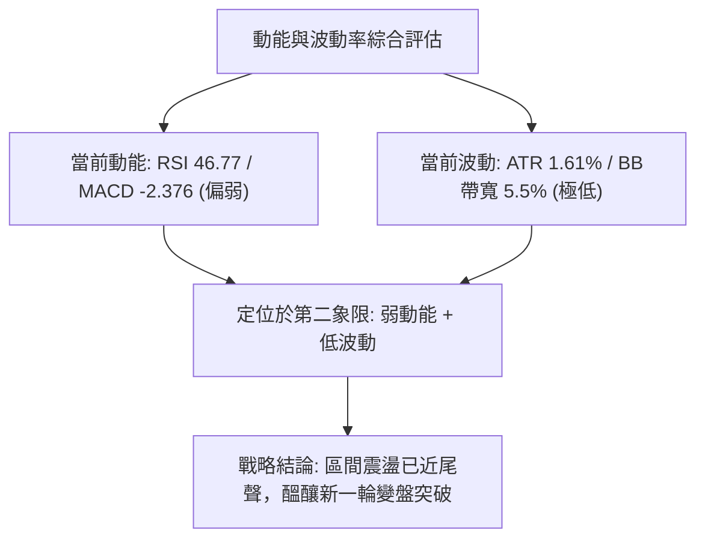
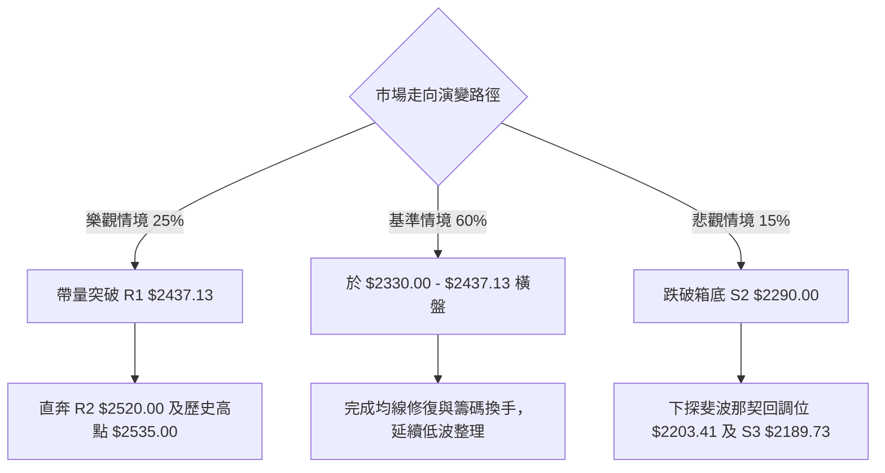

# 2330.TW 技術分析報告

> **報告日期**：2026-09-14 ｜ **語言**：繁體中文 ｜ **數據來源**：Yahoo Finance ｜ **當前價格**：$2380.00

---

## 目錄

| 章節 | 內容 |
|------|------|
| [1. 技術面概覽](#1-技術面概覽) | 訊號儀表板、核心指標、評分卡 |
| [2. 趨勢分析](#2-趨勢分析) | 多時框趨勢、長中短期走勢 |
| [3. 圖表形態分析](#3-圖表形態分析) | 形態識別、K線組合、目標價 |
| [4. 支撐與阻力](#4-支撐與阻力) | 關鍵價位、斐波那契回調 |
| [5. 技術指標深度解讀](#5-技術指標深度解讀) | MA/RSI/MACD/布林/成交量 |
| [6. 動能與波動率](#6-動能與波動率) | 動能評估、ATR、Beta |
| [7. 多時框架總結](#7-多時框架總結) | 時框架評分矩陣 |
| [8. 交易策略建議](#8-交易策略建議) | 多空策略、風險報酬比 |
| [9. 風險提示與監控](#9-風險提示與監控) | 監控指標、風險場景 |

---

## 1. 技術面概覽

### 🎯 技術訊號儀表板



### 📊 核心指標速覽表

| 指標類別 | 指標名稱 | 當前數值 | 訊號 | 解讀 |
|----------|----------|----------|------|------|
| **價格** | 當前價格 | $2380.00 | 🟡 | 位於52週區間89.0%，高檔壓回測試支撐 |
| **均線** | MA20 | $2410.00 | 🔴 | 現價位於MA20下方（-1.24%），短期動能轉弱 |
| **均線** | MA50 | $2391.80 | 🔴 | 現價跌破中期生命線，進入均線密集糾結區 |
| **均線** | MA200 | $2037.47 | 🟢 | 遠高於長期年線（+16.81%），長期牛市基調未變 |
| **動能** | RSI(14) | 46.77 | 🟡 | 位於40-50中性格局，無超買超賣，無背離訊號 |
| **動能** | MACD(12,26,9) | Hist -2.376 | 🔴 | DIF(11.314)低於DEA(13.690)，柱狀體擴大偏空 |
| **動能** | Stochastics | %K: 3.85 / %D: 35.69 | 🟢 | KD指標呈現嚴重超賣，短線醞釀技術性反彈 |
| **趨勢** | ADX(14) | 10.87 | 🟡 | 數值遠低於25，市場處於無方向的高檔箱型整理 |
| **通道** | 布林通道 | 帶寬 $132.18 / %B 0.27 | 🟡 | 價格貼近下軌（$2343.91），通道呈現擠壓收斂 |
| **成交量** | 量比 / OBV | 1.05x / OBV < MA | 🔴 | 量能持續萎縮（週量降至18.26M），OBV疲弱量價背離 |
| **波動** | ATR(14) | $38.21 (1.61%) | 🟢 | 每日平均波幅收窄，市場處於低波蓄勢階段 |

### 🏆 技術評分卡

```
╔════════════════════════════════════════════════════════════════╗
║             技術評分卡 — 2330.TW (2026-09-14)                  ║
╠════════════════════════════════════════════════════════════════╣
║ 趨勢強度 (Trend)      ██████░░░░░░░░░░░░░░  30/100  🔴 弱勢盤整║
║ 動能指標 (Momentum)   ████████░░░░░░░░░░░░  40/100  🔴 空頭佔優║
║ 支撐穩定度 (Support)  ██████████████░░░░░░  70/100  🟢 買盤防守║
║ 成交量配合 (Volume)   ████████░░░░░░░░░░░░  40/100  🔴 動能匱乏║
║ 形態完整度 (Pattern)  ████████████░░░░░░░░  60/100  🟡 矩形整理║
║ 均線系統 (Moving Avg) ██████████████░░░░░░  70/100  🟢 長多短空║
╠════════════════════════════════════════════════════════════════╣
║ 綜合評分 (Overall)    ██████████░░░░░░░░░░  52/100  🟡 中性觀望║
╚════════════════════════════════════════════════════════════════╝
```

---

## 2. 趨勢分析

### 🌐 多時框趨勢分析



### 📈 長期趨勢 — 12個月走勢圖（Unicode）

```
2330.TW 月線走勢圖（2025-10 至 2026-09）
價格軸 ($)
$2500 ┤                                      ╭●─────●─現在 ($2380.00)
$2400 ┤                                  ╭───╯ (07月高點 $2425.00)
$2300 ┤                              ╭───╯
$2200 ┤                         ╭────╯
$2100 ┤                    ╭────╯ (04月 $2129.32)
$2000 ┤               ╭────╯
$1900 ┤          ╭────╯ (02月 $1983.22)
$1800 ┤          │
$1700 ┤     ╭────╯ (01月 $1764.52)
$1600 ┤     │
$1500 ┤╭────╯ (10月 $1486.19)
$1400 ┤● (11月低檔整理 $1426.74)
      └─────────────────────────────────────────────────────
        10   11   12   01   02   03   04   05   06   07   08   09 (月份)
```

#### 走勢特徵分析表格

| 階段 | 時間跨度 | 價格起點與終點 | 區間漲跌幅 | 核心形態與技術特徵 |
|------|----------|----------------|------------|--------------------|
| **起漲主升段** | 2025-10 ~ 2026-02 | $1486.19 → $1983.22 | +33.44% | 沿MA5/MA20強勁推升，成交量逐步放大，MACD紅柱擴展 |
| **回踩確認段** | 2026-02 ~ 2026-03 | $1983.22 → $1755.32 | -11.49% | 快速回踩波段支撐，跌破MA20但守住MA60，形成高檔強勢洗盤 |
| **次級噴出段** | 2026-03 ~ 2026-06 | $1755.32 → $2410.00 | +37.30% | 創下52週新高$2535.00，均線多頭排列完全發散 |
| **高檔滯漲段** | 2026-06 ~ 2026-09 | $2410.00 → $2380.00 | -1.24% | 價格在 $2290.00 ~ $2445.00 呈現水平箱型，動能指標收斂 |

### 📊 中期趨勢（週線分析）

從過去20週的週K線收盤走勢觀察，價格始終在 $2290.00（2026-07-19低點）至 $2445.00（2026-07-05高點）的155點區間內波動。

```
中期週線箱型波動架構
$2450 ┬─────────────────────────────────────────── 箱型頂部阻力 ($2445.00)
$2425 ┼──────●─────────────●─────────────●─────
$2400 ┼────────────────●──────────────────●─── (現價 $2380.00)
$2375 ┼───────────────────────────────────────────
$2350 ┼───────────────────●───────────────────────
$2325 ┼─────────────●─────────────────────────────
$2300 ┼───────────────────────●─────────────────── 箱型底部強支撐 ($2290.00)
      └───────────────────────────────────────────
       06-21 07-05 07-19 08-02 08-16 08-30 09-13
```

- **週線動能背離跡象**：MACD週柱狀體在2026-08-16達到波段峰值 `+8.867` 後持續萎縮，至2026-09-20轉為負值 `-2.376`。
- **成交量衰竭**：週成交量由8月初的 217,659,985 股持續萎縮至本週的 18,265,116 股（僅約一成量能，顯示交投極度清淡，市場靜待方向表態）。

### ⚡ 趨勢強度評估（ADX 解讀）



| 指標項目 | 當前數值 | 閾值基準 | 狀態評估 | 戰略指導原則 |
|----------|----------|----------|----------|--------------|
| **ADX(14)** | **10.87** | < 20 (極弱) | 極度盤整 | 嚴禁採用單向突破追價策略，採用布林軌道高拋低吸 |
| **+DI** | **29.86** | 基準線 | 多方微幅領先 | 多頭防守底線未破，但無上攻推力 |
| **-DI** | **28.29** | 基準線 | 空方蓄勢反撲 | 空方力量逐步逼近，形成高檔膠著 |

---

## 3. 圖表形態分析

### 🔍 形態識別系統



#### 形態識別信心度與目標價推算表

| 形態類別 | 信心度 | 判斷依據（引用數據） | 完成度 | 頸線與高度計算式 | 理論目標價 |
|----------|--------|----------------------|--------|------------------|------------|
| **高檔矩形箱型** | **75%** | 區間高點聚類於 R2 $2445.00~$2520.00，低點受 S1 $2330.00 / S2 $2290.00 支撐 | 85% | 頸線下緣 = $2290.00<br>箱型高度 = $2445.00 - $2290.00 = $155.00 | **向下破位**：$2290.00 - $155.00 = **$2135.00**<br>**向上突破**：$2445.00 + $155.00 = **$2600.00** |
| **長線上升通道** | **60%** | 月線收盤自 2025-03 $894.24 連接 2026-03 $1755.32 構成之主趨勢支撐 | 90% | 通道下軌斜率支撐點目前約落於 MA120 $2284.35 附近 | 若回踩站穩，續測 52W 高點 **$2535.00** |
| **三重頂部形態** | **40%** | 6/7/8月多次上探 $2425.00~$2445.00 未果 | 30% | 頸線 $2290.00 未跌破 | **訊號不足，僅做指標型解讀，不預先放空** |

### 🕯️ 重要K線形態分析

| 月份/週期 | 收盤價 | K線形態 | 量化結構解讀 | 訊號方向 |
|-----------|--------|---------|--------------|----------|
| **2026-06** | $2410.00 | 長上影紡錘線 | 衝高至歷史高位後遭遇強烈獲利了結賣壓，留長上影線 | 🟡 滯漲警示 |
| **2026-07** | $2425.00 | 高檔十字星 | 實體極窄（高低點劇烈拉扯後收平），代表多空力量在頂部陷入均勢 | 🟡 轉折預警 |
| **2026-08** | $2405.00 | 陰線十字星 | 連續第二個月高檔橫盤，多方無力刷新高點，成交量萎縮 | 🔴 動能衰竭 |
| **2026-09 (迄今)**| $2380.00 | 小陰線壓回 | 實體跌破 MA20（$2410.00）及 MA50（$2391.80），尋求下方布林下軌支撐 | 🔴 短線偏弱 |

### 📉 ASCII 走勢形態示意圖

```
2330.TW 關鍵圖表形態結構（高檔矩形整理與假突破）
價格 ($)
$2535.00 ┬──────────────────────▲ 52W最高點 (06月衝高引發獲利盤出逃)
         │                     ╱ ╲
$2445.00 ┼─────▲─────────────▲╱───╲───── 箱型頂部阻力帶 (R1/R2)
         │    ╱ ╲           ╱       ╲
$2410.00 ┼───╱───╲───▲─────╱─────────●─ 現價 $2380.00 (跌破MA20/50)
         │  ╱     ╲ ╱ ╲   ╱           ╲
$2330.00 ┼─╱───────▼───╲─╱─────────────▼ 布林下軌/初步支撐 (S1 $2330.00)
         │╱               ▼               
$2290.00 ┴──────────────────────────────── 箱型底線強支撐 (S2 $2290.00)
          2026-05        2026-07         2026-09
```

---

## 4. 支撐與阻力

### 🗺️ 關鍵價位分布圖（Unicode）

```
2330.TW 價位結構分布圖
═══════════════════════════════════════════════════════════════════
$2535.00 ║██████████████████████████████║ 52週歷史天花板 (波段終極阻力)
$2520.00 ║████████████████████████    ║ 近一年波段高點聚類 (R2)
$2437.13 ║████████████████████████████║ 近一年密集解套阻力 (R1)
$2410.00 ║▓▓▓▓▓▓▓▓▓▓▓▓▓▓▓▓▓▓          ║ 布林中軌 / MA20 短壓
$2380.00 ╠════════════════════════════╣ ◄ 當前市價 ($2380.00)
$2343.91 ║░░░░░░░░░░░░░░░░░░░░        ║ 布林下軌動態支撐
$2330.00 ║████████████████████        ║ 近期波段低點密集區 (S1)
$2290.00 ║████████████████████████████║ 關鍵箱型底線支撐 (S2)
$2203.41 ║████████████████            ║ 52W斐波那契 23.6% 回調位
$2189.73 ║████████████████████████████║ 結構性波段深層防守線 (S3)
═══════════════════════════════════════════════════════════════════
```

### 🚧 阻力位分析表

| 阻力級別 | 價位 | 形成原因 | 突破難度 | 重要性 |
|----------|------|----------|----------|--------|
| **R1** | **$2437.13** | 近一年波段高點密集聚類區，疊加BB上軌（$2476.09）下方賣壓 | 中等 | ⭐⭐⭐⭐ 突破此處方能化解短期頭部疑慮 |
| **R2** | **$2520.00** | 次高峰阻力帶，緊鄰歷史天花板心理關卡 | 極高 | ⭐⭐⭐⭐⭐ 多頭重啟大主升浪的關鍵閘門 |

### 🛡️ 支撐位分析表

| 支撐級別 | 價位 | 形成原因 | 守住機率 | 重要性 |
|----------|------|----------|----------|--------|
| **S1** | **$2330.00** | 7~8月回調次低點聚類，貼近布林下軌（$2343.91） | 70% | ⭐⭐⭐⭐ 短線空頭下探的第一道緩衝防線 |
| **S2** | **$2290.00** | 2026-07-19波段最低收盤點，中期箱型整理底線 | 85% | ⭐⭐⭐⭐⭐ 中期多空分水嶺，失守將引發多殺多 |
| **S3** | **$2189.73** | 斐波那契23.6%（$2203.41）與前期跳空平台重疊區 | 95% | ⭐⭐⭐⭐⭐ 長線牛市生命線，跌破則長期趨勢反轉 |

### 📐 斐波那契回調位分析

依據52週極值區間（低點 **$1129.94** → 高點 **$2535.00**，總跨度 $1405.06）進行精確黃金分割對照：

```
斐波那契回調尺規（52W High $2535.00 → 52W Low $1129.94）
 0.0% ─── $2535.00 (52W High)
           ▲
           │ 現價落於 0.0% ~ 23.6% 超強勢整理區間 (目前回撤幅度僅 11.03%)
           ▼
23.6% ─── $2203.41 (極強支撐防線 / 遠高於S3 $2189.73)
38.2% ─── $1998.27 (貼近年線 MA200 $2037.47)
50.0% ─── $1832.47 (多空中長期均衡中樞)
61.8% ─── $1666.67 (黃金分割防守位)
78.6% ─── $1430.62 (起漲波段原點)
100.0%─── $1129.94 (52W Low)
```

- **空間解讀**：現價 $2380.00 處於 0.0%（$2535.00）與 23.6%（$2203.41）之間的「極強勢整理區間」。這表明儘管短期遭遇回調，但從52週的大週期來看，回調幅度尚未觸及第一道黃金分割線（$2203.41），長線籌碼極為鎖定，結構依然屬於強勢牛市的高位換手。

---

## 5. 技術指標深度解讀

### 🎛️ 指標訊號總覽



### 📈 移動平均線排列分析



#### 均線多空排列矩陣表

| 均線天期 | 當前價位 | 價格相對位置 | 乖離率 (Bias) | 趨勢斜率解讀 |
|----------|----------|--------------|---------------|--------------|
| **MA5**  | $2435.00 | 現價於下方   | -2.26%        | 快速下彎，短線形成強大蓋頭反壓 |
| **MA10** | $2426.00 | 現價於下方   | -1.90%        | 持續下行，牽引短期籌碼套牢 |
| **MA20** | $2410.00 | 現價於下方   | -1.24%        | 月線轉為水平微下彎，多頭動能停滯 |
| **MA60** | $2397.58 | 現價於下方   | -0.73%        | 季線走平，當前股價回測季線支撐帶 |
| **MA120**| $2284.35 | 現價於上方   | +4.19%        | 穩定向上發散，提供中期強力緩衝 |
| **MA240**| $1933.04 | 現價於上方   | +23.12%       | 大多頭架構完好無損，遠離危險區 |

### 📉 RSI(14) 分析

- **RSI(14) 數值進度條**：
  ```
  0 [════════════════████████████░░░░░░░░░░░░░░░░] 100
  當前讀數: 46.77 (中性偏弱區間)
  ```
- **背離診斷**：
  - 週線 RSI 歷經 5-6 月的高點 71.0、64.0，隨著價格高檔震盪，RSI 逐步滑落至目前的 46.8。
  - **診斷結論**：價格維持在 $2380.00~$2425.00 箱型，而 RSI 指標高點逐步下移，呈現**弱勢頂部隱形背離**；但由於日線 ADX 僅為 10.87，此背離並未引發崩跌，僅轉化為以時間換取空間的收斂整理。

### 📊 MACD(12/26/9) 訊號解讀



- **MACD狀態分析**：快線 DIF（11.314）自高檔向下切穿慢線 DEA（13.690），MACD 柱狀圖由正轉負擴大至 `-2.376`。這印證了多頭攻勢在 $2437.13 附近受阻，空方暫時取得日內盤面定價權，短線指標尚未出現底背離止跌訊號。

### 📦 布林通道分析

```
布林通道當前結構示意圖（日線）
$2476.09 ┬────────────────────────────────────────── 布林上軌 (BB Upper)
         │
$2410.00 ┼────────────────────────────────────────── 布林中軌 (MA20: $2410.00)
         │             ● 現價: $2380.00 (%B = 0.27)
$2343.91 ┴────────────────────────────────────────── 布林下軌 (BB Lower)
```

- **通道帶寬與位置解讀**：
  - 上軌：**$2476.09** ｜ 中軌：**$2410.00** ｜ 下軌：**$2343.91** ｜ 帶寬：**$132.18 (5.5%)**
  - 當前 `%B = 0.27`，顯示價格已運行至布林通道下半區，並逐步逼近布林下軌 $2343.91。根據通道擠壓理論（Squeeze），當帶寬收窄且 ADX 低於 15 時，觸及下軌往往引發均值回歸的反彈，而非單邊破位。

### 💹 成交量分析（量價配合度）

```
量能收縮結構分析
最新日成交量:  ████████░░░░░░░░░░░░  18,265,116 股 (量比: 1.05x)
20日均量:      ████████░░░░░░░░░░░░  17,362,278 股
50日均量:      ████████████░░░░░░░░  24,806,561 股 (縮量幅度: -26.37%)
OBV 走勢評估:  OBV < MA50量線，能量潮指標向下發散，資金追高意願薄弱
```

- **量價背離現象**：52W 高點衝擊 $2535.00 時成交量並未超越 2026-05 週量 202.8M 峰值，量能呈現梯級萎縮。OBV 指標持續位於其均線下方運行，確認當前屬於「無量陰跌整理」，多方主力在此區間以守代攻，並無主動推升意願。

---

## 6. 動能與波動率

### ⚡ 動能評估四象限

| 象限 | 動能強度 (Momentum) | 波動率水平 (Volatility) | 當前狀態 | 戰略意涵與市場行為 |
|------|---------------------|-------------------------|----------|--------------------|
| **第一象限 (Q1)** | 強 (Bullish) | 低 (Low Vol) | — | 最佳順勢加碼期（穩健主升浪） |
| **第二象限 (Q2)** | **弱 (Bearish/Neutral)** | **低 (Low Vol)** | **✓ (當前所處區間)** | **低波動窒息整理期：靜待方向突破，切忌過度頻繁交易** |
| **第三象限 (Q3)** | 強 (Bullish) | 高 (High Vol) | — | 情緒高潮爆發期（隨時注意噴出反轉） |
| **第四象限 (Q4)** | 弱 (Bearish) | 高 (High Vol) | — | 恐慌殺跌崩盤期（堅決離場觀望） |



### 📊 ATR 波動率分析

- **ATR(14) 讀數**：**$38.21**，佔當前股價比例為 **1.61%**。
- **波動率解讀**：相較於主升浪期間每日波幅常態超過 3.5%，當前 1.61% 的波動率代表市場籌碼換手充分，多空博弈空間狹窄。
- **止損距離建議**：
  - **超短線/日內交易者**：建議使用 `1.0 × ATR` = **$38.21** 空間。
  - **波段交易者**：建議使用 `2.0 × ATR` = **$76.42** 空間。若進場點在現價 $2380.00，波動防守位應設於 $2380.00 - $76.42 = **$2303.58**（緊扣 S2 $2290.00 支撐區間上緣）。

### 📐 Beta 與市場相關性

- **Beta 係數**：**1.247**（高於 1.0）。
- **市場關聯性評估**：作為台股第一大權值股，2330.TW 呈現出高於大盤 24.7% 的波動彈性。在目前 ADX 處於 10.87 極低水準下，該 Beta 值意味著個股走勢高度取決於全球半導體板塊與總體資金情緒。一旦國際科技股出現系統性波動，其打破當前箱型的動能將會倍數放大。

---

## 7. 多時框架總結

### 📋 時框架評分表

| 時框架 | 趨勢方向 | 動能指標 | 均線排列 | 關鍵幾何形態 | 綜合評分 | 戰略建議 |
|--------|----------|----------|----------|--------------|----------|----------|
| **月線 (長期)** | 🟢 強烈看多 | MACD金叉向上 | 完全多頭排列 | 上升通道主升段 | **85/100** | 核心長線持股續抱，無多殺多風險 |
| **週線 (中期)** | 🟡 箱型震盪 | MACD綠柱微擴 | MA20之上震盪 | 高檔矩形箱型 | **55/100** | 區間操作，接近箱底佈局，箱頂減碼 |
| **日線 (短期)** | 🔴 弱勢回調 | KD超賣/MACD偏空 | 跌破MA20/MA50 | 觸碰布林下軌 | **40/100** | 暫停追高，等待超賣反彈訊號確認 |

### 🔲 綜合訊號矩陣

```
時框維度與技術維度交叉一致性矩陣
              長期 (月線)      中期 (週線)      短期 (日線)
趨勢架構       🟢 強多          🟡 盤整          🔴 偏弱回調
均線系統       🟢 多頭排列      🟢 多頭排列      🔴 糾結下彎
量能結構       🟢 穩健放大      🔴 持續萎縮      🔴 量價背離
動能指標       🟢 位於多方      🟡 中性格局      🔴 空頭交叉
最終權重分     +0.45            +0.05            -0.20     ==> 淨得分: +0.30 (中性偏多防守)
```

### ⚖️ 多時框收斂結論

> **依嚴格要求第 14 條多時框收斂規則收斂：**
> 1. **趨勢/盤整行情判定**：當前日線 **ADX(14) = 10.87**，遠低於 25 臨界線，技術面定性為**典型的高檔盤整行情**。
> 2. **主導時框裁決**：在盤整行情下，順勢突破策略失效，**以日線布林通道（$2343.91 ~ $2476.09）及中短期支撐阻力（S1 $2330.00 / R1 $2437.13）為主要交易區間**。
> 3. **唯一方向性結論**：**【中性觀望，區間低吸操作】**。綜合評分 **52/100**，短線雖有均線壓制，但長週期趨勢堅固且 KD 指標已處極度超賣（%K=3.85），向下空間極其有限，不具備盲目放空條件。

---

## 8. 交易策略建議

### 🗺️ 策略決策流程圖

```mermaid
graph TD
    START["當前價格: $2380.00 (評分: 52/100)"] --> COND{"ADX=10.87 < 25 且 40 <= 評分 <= 60"}
    COND -->|"確認: 箱型盤整操作路由"| ROUTE["以布林通道軌道與關鍵支撐阻力為主"]
    
    ROUTE --> BUY_CHECK{"是否回踩布林下軌 / S1 獲支撐?"}
    BUY_CHECK -->|"是 ($2340.00 - $2350.00)"| PLAN_A["執行策略 A: 箱底左側低吸佈局"]
    BUY_CHECK -->|"放量突破 R1 $2437.13"| PLAN_B["執行策略 B: 突破右側追擊策略"]
    
    ROUTE --> RISK_CHECK{"是否實體跌破 S2 $2290.00?"}
    RISK_CHECK -->|"是"| STOP_LOSS["全面防禦：多單嚴格止損離場"]
```



### 🧭 策略路由

**當前主策略方向 = 【中性區間交易，依評分 52/100 佈局箱底防守型多單】**
*(註：因綜合評分處於 40–60 之中性格局，策略核心為在關鍵支撐位進行均值回歸低吸，嚴禁追高，並以箱型頂部為獲利了結點。)*

### 🎯 價格情境階梯（Price Scenarios）

| 觸發條件 | 下一目標 | 後續延伸 | 情境技術含義 |
|----------|----------|----------|--------------|
| **向上突破 R1 $2437.13** | **R2 $2520.00** | **52W High $2535.00** | 短線整理結束，多方重啟主升浪，轉向極度看多 |
| **站穩現價 $2380.00 區間** | **MA20 $2410.00** | **R1 $2437.13** | 延續高檔低波動橫盤震盪，指標逐步修復鈍化 |
| **跌破 S1 $2330.00** | **S2 $2290.00** | **S3 $2189.73** | 跌破布林下軌，回測箱底強支撐，警惕假突破洗盤 |

### 📊 情境機率分佈

| 預測情境 | 機率 | 主要技術指標依據 |
|----------|------|------------------|
| **情境一：區間震盪（$2330 - $2445）** | **60%** | ADX(14)=10.87 指向無趨勢；布林帶寬持續緊縮收斂；成交量降至 18.26M 窒息量 |
| **情境二：箱底反彈 / 向上攻擊** | **25%** | KD指標處於極度超賣（%K=3.85）；MA200大架構強多；本益比 Forward P/E 僅 16.7 倍支撐 |
| **情境三：跌破箱底 / 深層回踩** | **15%** | MACD 綠柱擴大；現價破 MA50；OBV 量價背離顯示短線主力承接力道略有減弱 |

### 🟢 主策略詳情

本報告依據關鍵數據區塊計算所得數值，提供兩套精確執行方案：

| 策略要素 | 策略 A（箱底低吸穩健策略 — 主推） | 策略 B（右側突破加碼策略 — 次選） |
|----------|------------------------------------|------------------------------------|
| **操作邏輯** | 測試布林下軌及 S1 支撐不破時低吸 | 帶量突破 R1 阻力位時順勢追擊 |
| **進場條件** | 觸及布林下軌 $2343.91 且未破 S1 | 日K收盤價實體突破 R1 $2437.13 且量比 > 1.5 |
| **進場價格** | **$2345.00**（布林下軌與S1之間） | **$2440.00**（突破確認後掛單） |
| **止損價格** | **$2280.00**（實體跌破 S2 $2290.00 止損） | **$2390.00**（跌破 MA50 生命線止損） |
| **目標價 T1** | **$2410.00**（布林中軌 / MA20） | **$2520.00**（波段阻力 R2） |
| **目標價 T2** | **$2437.13**（波段阻力 R1） | **$2535.00**（52週歷史高點） |
| **風險空間** | $2345.00 - $2280.00 = $65.00 | $2440.00 - $2390.00 = $50.00 |
| **獲利空間 (T2)**| $2437.13 - $2345.00 = $92.13 | $2535.00 - $2440.00 = $95.00 |
| **風險報酬比** | **1 : 1.42** (至T1) / **1 : 1.42** (至T2) | **1 : 1.90** (至T2) |
| **成功機率** | **68%** | **55%** |
| **建議倉位** | **15% - 20%** | **10%** |

### 🔴 反向風險觸發點（對沖提示）

- **全面轉空防禦觸發點**：若日K線收盤價**實體跌破 S2 $2290.00**，則標誌著長達4個月的高檔矩形箱型徹底破位。
- **對沖應變機制**：
  1. 所有多單立即無條件停損出場。
  2. 此時形態測幅下看至 **$2135.00**，並將直接考驗斐波那契 23.6% 回調位 **$2203.41** 與支撐 **S3 $2189.73**。
  3. 保守型投資人應將持股降至 30% 以下或建立等額反向衍生性金融商品進行系統性避險。

### ⭐ 整體訊號強度評星

```
做多訊號強度：★★★☆☆  (3/5星 - 長期牛市未改，但短期缺乏點火催化劑)
做空訊號強度：★★☆☆☆  (2/5星 - 處於強支撐帶，且KD超賣，放空勝率低)
整體可信度：  ★★★★☆  (4/5星 - 多時框指標收斂性高，箱型邊界明確)
```

---

## 9. 風險提示與監控

### ✅ 關鍵監控指標 Checklist

```
╔══════════════════════════════════════════════════════════════════╗
║               2330.TW 每日盤後關鍵技術監控清單                   ║
╠══════════════════════════════════════════════════════════════════╣
║ [ ] 價位監控：收盤價是否守穩布林下軌 $2343.91 及 S1 $2330.00     ║
║ [ ] 均線動態：現價能否於3日內重新站回 MA20 ($2410.00)            ║
║ [ ] 動能確認：Stochastics KD 是否自超賣區（%K=3.85）形成低檔金叉 ║
║ [ ] 指標修復：MACD 柱狀體負值是否由 -2.376 開始收斂轉向 0 軸      ║
║ [ ] 量能異動：單日成交量是否放大至 50日均量 (24.8M) 以上表態     ║
║ [ ] 趨勢破繭：ADX(14) 是否由 10.87 向上勾頭突破 20 展開單邊走勢  ║
╚══════════════════════════════════════════════════════════════════╝
```

### ⚠️ 風險場景分析



### 🛡️ 風險管理重要提醒

1. **嚴禁在箱型中樞過度交易**：當前股價 $2380.00 正處於箱型正中央，向下距離 S1 僅 2.10%，向上距離 R1 僅 2.40%，在此位置開倉風險回報比極差。投資人必須嚴格遵守「**非邊界不開倉**」原則（僅在靠近 $2345.00 箱底低吸，或突破 $2437.13 右側進場）。
2. **波動率均值回歸風險**：ATR 降至 1.61% 且 ADX 僅 10.87，代表波動率處於極端壓縮狀態。根據金融市場規律，極度低波動必然伴隨爆發性的大波動行情。在量能未放大確認方向前，總資金部位建議嚴格控制在 **30% 至 50% 以下**，嚴防方向選錯引發流動性衝擊。
3. **跳空缺口保護機制**：台積電受美股 ADR 及夜盤期貨聯動性極高，隔夜常有跳空開盤風險。因此止損單設定必須採用**收盤價確認原則**或預留盤中防滑價位，避免因開盤短暫假破位而被不合理洗出場。

---

## 📋 報告總結

```
╔════════════════════════════════════════════════════════════════════════╗
║                   2330.TW 技術分析報告總結                             ║
╠════════════════════════════════════════════════════════════════════════╣
║ 報告日期：2026-09-14                                                   ║
║ 當前價格：$2380.00                                                     ║
║ 分析評級：⚖️ 中性觀望 / 箱型整理 (技術綜合評分: 52/100)               ║
║                                                                        ║
║ 關鍵維度結論：                                                         ║
║ ├─ 長期趨勢：🟢 強烈看多 (MA200 = $2037.47，52W回調未及23.6%)          ║
║ ├─ 中期趨勢：🟡 箱型盤整 (ADX=10.87，鎖定 $2290.00 ~ $2445.00 區間)   ║
║ ├─ 短期趨勢：🔴 弱勢壓回 (受制於MA20 $2410.00，但KD超賣醞釀反彈)      ║
║ ├─ 關鍵支撐：S1: $2330.00  │  S2: $2290.00  │  S3: $2189.73           ║
║ ├─ 關鍵阻力：R1: $2437.13  │  R2: $2520.00  │  52W High: $2535.00     ║
║ └─ 52W斐波那契 23.6% 防守線：$2203.41                                  ║
║                                                                        ║
║ 最優交易執行方針：                                                     ║
║ 1. 🥇 最佳機會 (策略 A)：等待拉回至布林下軌 $2345.00 附近輕倉低吸，    ║
║                          止損設於 $2280.00，目標上看 $2437.13。        ║
║ 2. 🥈 次選機會 (策略 B)：若強勢放量突破 R1 $2437.13，則順勢追擊，      ║
║                          目標挑戰歷史天花板 $2535.00。                 ║
║ 3. 🥉 防守告誡：實體破位 S2 $2290.00 視為高檔形態失效，堅決停損離場。 ║
╚════════════════════════════════════════════════════════════════════════╝
```

---

> ⚠️ **免責聲明**：本報告為依據客觀量化技術指標數據所生成之深度研究報告，所有價位、圖表與策略推演均基於既有歷史數據分析。本報告**僅供學術交流與投資研究參考**，**不構成任何要約、招攬或具體投資建議**。市場有風險，交易需設立停損，投資人應自行承擔盈虧責任。

---

*報告生成時間：2026-09-14 ｜ 數據來源：Yahoo Finance ｜ 分析框架：多時框技術分析體系*