# 2330.TW 技術分析報告

> **報告日期**：2026-09-16 ｜ **語言**：繁體中文 ｜ **數據來源**：Yahoo Finance ｜ **當前價格**：$2380.00

---

## 目錄

| 章節 | 內容 |
|------|------|
| [1. 技術面概覽](#1-技術面概覽) | 訊號儀表板、核心指標、評分卡 |
| [2. 趨勢分析](#2-趨勢分析) | 多時框趨勢、長中短期走勢 |
| [3. 圖表形態分析](#3-圖表形態分析) | 形態識別、K線組合、目標價 |
| [4. 支撐與阻力](#4-支撐與阻力) | 關鍵價位、斐波那契回調 |
| [5. 技術指標深度解讀](#5-技術指標深度解讀) | MA/RSI/MACD/布林/成交量 |
| [6. 動能與波動率](#6-動能與波動率) | 動能評估、ATR、Beta |
| [7. 多時框架總結](#7-多時框架總結) | 時框架評分矩陣 |
| [8. 交易策略建議](#8-交易策略建議) | 多空策略、風險報酬比 |
| [9. 風險提示與監控](#9-風險提示與監控) | 監控指標、風險場景 |
| [報告總結](#-報告總結) | 核心結論與策略彙整 |

---

## 1. 技術面概覽

### 🎯 技術訊號儀表板

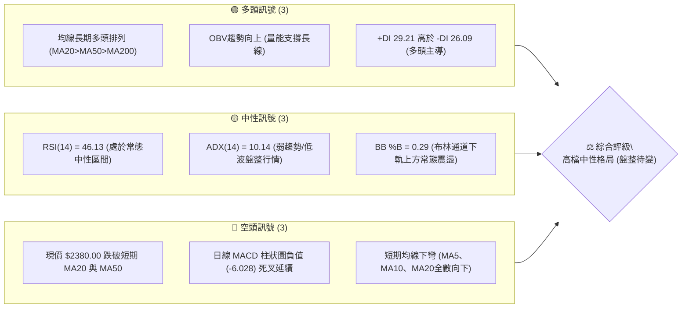

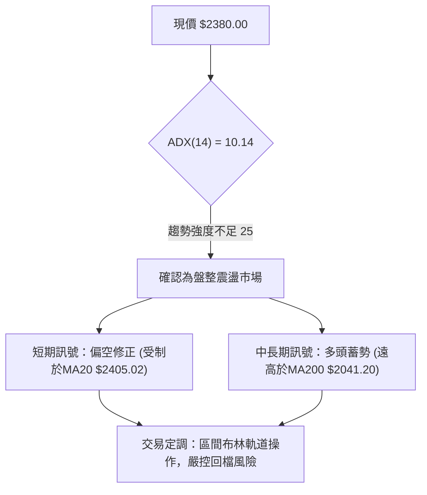

### 📊 核心指標速覽表

| 指標類別 | 指標名稱 | 當前數值 | 訊號 | 解讀 |
|----------|----------|----------|:----:|------|
| **價格** | 當前價格 | $2380.00 | 🟡 | 位於52週高點 $2527.56 與低點 $1141.38 區間之 89.4% 高位，短線拉回整理 |
| **均線** | MA20 | $2405.02 | 🔴 | 現價低於MA20（-$25.02 / -1.04%），短期月線反轉為上方第一道動態壓力 |
| **均線** | MA50 | $2382.13 | 🔴 | 現價微幅跌破MA50（-$2.13 / -0.09%），短中期均線交纏，多空在季線邊緣拉鋸 |
| **均線** | MA200 | $2041.20 | 🟢 | 現價高於MA200（+$338.80 / +16.60%），年線多頭基底堅實，長多架構未受破壞 |
| **動能** | RSI(14) | 46.13 | 🟡 | 位於 30–70 常態區間中軸偏弱側，未見極端超賣，無顯著背離 |
| **動能** | MACD | DIF 4.92 / DEA 10.95 | 🔴 | 柱狀圖 -6.028，呈現空頭動能擴散，短線空方取得盤面微觀主導權 |
| **動能** | KD(9,3,3) | %K 9.24 / %D 6.92 | 🟢 | 雙線落入極度超賣區（<20），短線具備技術性跌深反彈動能 |
| **趨勢** | ADX(14) | 10.14 | 🟡 | 遠低於 25 臨界值，代表當前非單邊趨勢行情，為標準的無方向性整理格局 |
| **通道** | 布林通道 | 下軌 $2344.82 / %B 0.29 | 🟡 | 價格靠近下軌但未破軌，通道寬度收縮，波動率受限 |
| **波動** | ATR(14) | $35.97 | 🟡 | 佔現價 1.51%，單日波動幅度收斂，屬於中低波動狀態 |

### 🏆 技術評分卡

```
╔══════════════════════════════════════════════════════════════════════════════╗
║                   技術評分卡 — 2330.TW (2026-09-16)                          ║
╠══════════════════════════════════════════════════════════════════════════════╣
║ 趨勢強度 (ADX=10.14)      ██████░░░░░░░░░░░░░░  30/100 🟡 [極弱趨勢/盤整格局]   ║
║ 動能指標 (MACD/RSI/KD)    ████████░░░░░░░░░░░░  40/100 🔴 [短線空方動能占優]   ║
║ 支撐穩定度 (S1/S2/MA200)  ████████████████░░░░  80/100 🟢 [階梯支撐扎實穩固]   ║
║ 成交量配合 (OBV/量比)     ████████████░░░░░░░░  60/100 🟡 [OBV支撐/量能微降]   ║
║ 形態完整度 (高檔箱型)     ██████████████░░░░░░  70/100 🟢 [高檔箱型結構清晰]   ║
║ 均線排列 (多頭排列未破)   ████████████░░░░░░░░  60/100 🟡 [長多排列表現承壓]   ║
╠══════════════════════════════════════════════════════════════════════════════╣
║ 綜合評分                  ███████████░░░░░░░░░  56.7/100 🟡 [中性觀望/區間操作]║
╚══════════════════════════════════════════════════════════════════════════════╝
```

---

## 2. 趨勢分析

### 🌐 多時框趨勢分析

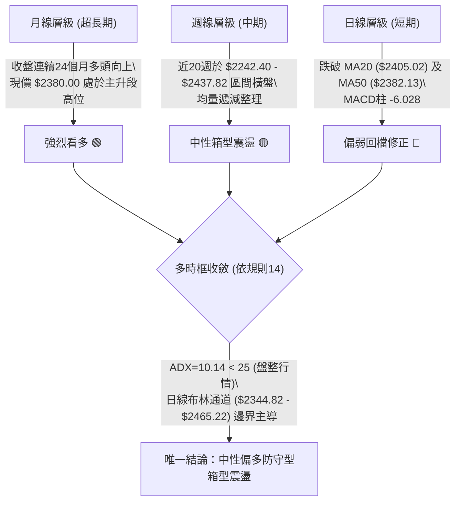

### 📈 長期趨勢 — 12個月走勢圖（Unicode）

```
2330.TW 月線走勢圖（過去12個月：2025-10 至 2026-09）
價格軸 ($)
$2500 ┤                                              ●(2026-07 $2417.88)
$2400 ┤                                        ●     │     ●     ●←現在 $2380.00
$2300 ┤                                  ●     │     │     │
$2100 ┤                            ●     │     │     │     │
$1900 ┤                      ●     │     │     │     │     │
$1700 ┤                ●     │     ●     │     │     │     │
$1500 ┤    ●     ●     │     │     (回測) │     │     │     │
$1400 ┤    │     │     │     │           │     │     │     │
$1200 ┤●   │     │     │     │           │     │     │     │
      └────┴─────┴─────┴─────┴─────┴─────┴─────┴─────┴─────┴─────┴─────┴─────
      25/10 25/11 25/12 26/01 26/02 26/03 26/04 26/05 26/06 26/07 26/08 26/09
```

#### 走勢特徵分析表格

| 階段區間 | 時間跨度 | 起訖收盤價 | 區間漲跌幅 | 主要走勢特徵與量價量化描述 |
|----------|----------|------------|:----------:|----------------------------|
| **第一階段：高檔起漲** | 2025-10 ~ 2025-12 | $1481.83 → $1536.33 | +3.68% | 突破千四整數大關後進行高階橫盤換手，MA200 迅速墊高至 $1800 之上 |
| **第二階段：主升噴出** | 2025-12 ~ 2026-02 | $1536.33 → $1977.40 | +28.71% | 呈現月線連兩紅大角度拉升，動能指標進入超買，量能顯著擴增 |
| **第三階段：急拉回測** | 2026-02 ~ 2026-03 | $1977.40 → $1750.17 | -11.49% | 主升浪後獲利了結回洗，單月跌破 $1800，測試中期均線支撐成功 |
| **第四階段：次級推升** | 2026-03 ~ 2026-05 | $1750.17 → $2341.84 | +33.81% | 連續強勢嘎空推升，突破二千元心理關卡，創歷史新高 $2527.56 |
| **第五階段：高位滯漲** | 2026-05 ~ 2026-09 | $2341.84 → $2380.00 | +1.63% | 近五個月於 $2340–$2420 區間微幅拉鋸，動能趨緩，ADX 降至 10.14 |

### 📊 中期趨勢（週線分析）

```
週線等級關鍵阻力與支撐示意圖
══════════════════════════════════════════════════════════════════════════════
 52W 高點 $2527.56  ─────────────────────────────────── (歷史天花板)
 週線阻力 R2 $2507.62  ═══════════════════════════════════ (近一年高點波段壓力)
 週線阻力 R1 $2429.97  ─────────────────────────────────── (近期週線密集反彈頂部)
 現價   $2380.00  ··································· (現正處於整理帶中樞)
 週線支撐 S1 $2323.16  ----------------------------------- (近一年波段低點聚類)
 週線支撐 S2 $2283.28  ═══════════════════════════════════ (7月低點 / 結構頸線)
 斐波那契 23.6% $2200.42 ───────────────────────────────── (長線強弱分水嶺)
══════════════════════════════════════════════════════════════════════════════
```

### ⚡ 趨勢強度評估（ADX 解讀）

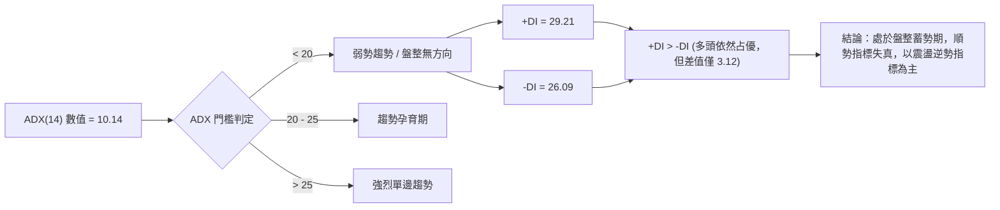

| 指標名稱 | 當前讀數 | 臨界參考點 | 趨勢性質判定 | 策略指導意義 |
|----------|:--------:|:----------:|:------------:|--------------|
| **ADX(14)** | **10.14** | 25.00 | 極弱趨勢 / 典型橫盤 | 避免使用追突破策略，單邊順勢容易被兩面巴，應採箱型高出低進 |
| **+DI (14)** | **29.21** | 20.00 | 多頭方向線主導 | 多方雖具備控制權，但因 ADX 缺乏高度，多頭推進動能處於休眠 |
| **-DI (14)** | **26.09** | 20.00 | 空頭方向線緊咬 | 空方亦無法發動連鎖摜壓，雙方在 $2380 附近形成籌碼平衡 |

---

## 3. 圖表形態分析

### 🔍 形態識別系統

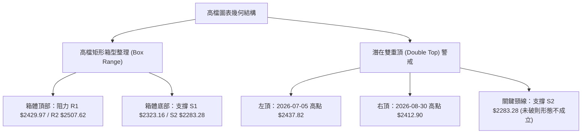

#### 形態識別信心度評估表

| 形態類別 | 信心度 | 判斷依據（引用數據） | 完成度 | 目標價（附嚴謹計算式） |
|----------|:------:|----------------------|:------:|------------------------|
| **高檔矩形箱型** | **78%** | 過去16週收盤價均收在 S2 ($2283.28) 至 R1 ($2429.97) 之間，ADX 僅 10.14，完全符合無方向箱型特徵 | **85%** | 箱底支撐反彈目標：箱頂 $2429.97；若往下跌破箱底 $2283.28，測量跌幅為：$2283.28 - ($2429.97 - $2283.28) = **$2136.59**（接近波段低點 S3 $2183.30） |
| **潛在雙重頂** | **38%** | 左頂 2026-07-05 收盤 $2437.82，右頂 2026-08-30 收盤 $2412.90。但 S2 頸線 $2283.28 未收破，量能未爆量潰散，信心度不足50% | **40%** | 若實體收盤跌破頸線 S2 ($2283.28)，形態等幅下測目標：$2283.28 - ($2437.82 - $2283.28) = **$2128.74** |
| **布林壓縮收斂** | **82%** | BB 上軌 $2465.22 與下軌 $2344.82 帶寬極度收窄（帶寬比僅 5.06%），呈現標準通道擠壓（Squeeze） | **90%** | 屬指標型突破形態，突破上軌目標看 R2 **$2507.62**；跌破下軌目標看 S1 **$2323.16** |

### 🕯️ 重要K線形態分析

| 日期 / 月份 | 收盤價 | K線組合形態 | 技術面微觀解讀 | 訊號意涵 |
|-------------|:------:|-------------|----------------|:--------:|
| **2026-06-21** | $2402.93 | 長陽吞噬線 | 連續回檔後大漲長紅收復 $2400，確立 $2300 整數關卡強烈買盤支撐 | 🟢 強烈看多 |
| **2026-07-19** | $2283.28 | 探底大陰棒帶長下影 | 當週爆出 200,180,230 股巨量，下殺打出近四個月最低點 S2 後獲得有力承接 | 🟡 假跌破築底 |
| **2026-08-02** | $2417.88 | 巨量反彈長陽線 | 創下近20週單週最大成交量（217,659,985 股），強拉收復 $2400 | 🟢 多頭表態 |
| **2026-08-30** | $2412.90 | 高檔十字星（量縮） | 成交量急劇萎縮至 71,012,705 股，呈現「價漲量縮」高檔滯漲型態 | 🔴 買盤力竭 |
| **2026-09-20** | $2380.00 | 中陰線跌破短均線 | 單週量縮至 49,770,190 股，實體跌破日 MA20 ($2405.02) 及 MA50 ($2382.13) | 🔴 短線修正 |

### 📉 ASCII 走勢形態示意圖

```
2330.TW 高檔箱型震盪與潛在雙頂幾何結構圖 ($)
$2440 ┤               頂部1: $2437.82
$2430 ┤                ╭──╮                 頂部2: $2412.90
$2420 ┤   R1 $2429.97 ─┼──┼─────────────────╭──╮───────────── (箱頂壓力)
$2400 ┤              │    │   現價 $2380.00   │  │
$2380 ┤──────────────┼────┼───────────●───────│──│─────────────
$2360 ┤              │    │                  │  │
$2340 ┤              │    ╰─────────╮        │  │
$2320 ┤   S1 $2323.16 ─────────────────┼────────╯  │──────────── (區間下沿)
$2300 ┤                                │           │
$2280 ┤   S2 $2283.28 ═════════════════╧═══════════╧════════════ (雙頂關鍵頸線)
      └─────────────────────────────────────────────────────────────
                       2026-07-05         2026-07-19  2026-08-30
```

### 🎯 形態目標價計算

根據上述置信度最高的「高檔矩形箱型整理（Confidence: 78%）」進行量化推演：
1. **箱體上限（Resistance Band）**：取聚類阻力 R1 = **$2429.97**
2. **箱體下限（Support Band）**：取聚類支撐 S2 = **$2283.28**
3. **箱體垂直垂直垂直振幅（H）**：
   $$\text{高度 } H = 2429.97 - 2283.28 = 146.69 \text{ 元}$$
4. **多頭向上實體突破等幅測量目標（T_bull）**：
   $$T_{\text{bull}} = \text{箱頂 } 2429.97 + 146.69 = \mathbf{2576.66} \text{ 元}$$
   *(註：向上突破若發動，將挑戰 52W 歷史高點 $2527.56 並向上延伸)*
5. **空頭向下實體跌破等幅測量目標（T_bear）**：
   $$T_{\text{bear}} = \text{箱底 } 2283.28 - 146.69 = \mathbf{2136.59} \text{ 元}$$
   *(註：此位階將向下逼近聚類強支撐 S3 $2183.30 及斐波那契 23.6% 回調位 $2200.42)*

---

## 4. 支撐與阻力

### 🗺️ 關鍵價位分布圖（Unicode）

```
2330.TW 價位結構分布圖
════════════════════════════════════════════════════════════════════════════════════════
$2527.56 ║████████████████████████████████████████║ 52週歷史高點 (52W High)
$2507.62 ║████████████████████████████████        ║ 強阻力 R2 (近一年波段高點聚類)
$2465.22 ║▓▓▓▓▓▓▓▓▓▓▓▓▓▓▓▓▓▓                      ║ 動態阻力 (布林帶上軌)
$2429.97 ║████████████████████████████████████████║ 關鍵阻力 R1 (高檔震盪箱頂)
$2405.02 ║▒▒▒▒▒▒▒▒▒▒▒▒▒▒▒▒                        ║ 即時壓力 (MA20 / 布林中軌)
$2382.13 ║▒▒▒▒▒▒▒▒▒▒▒▒                            ║ 即時微壓 (MA50 季線位置)
$2380.00 ╠════════════════════════════════════════╣ ◄ 當前市價 $2380.00
$2344.82 ║▓▓▓▓▓▓▓▓▓▓▓▓▓▓▓▓▓▓                      ║ 動態支撐 (布林帶下軌)
$2323.16 ║▓▓▓▓▓▓▓▓▓▓▓▓▓▓▓▓▓▓▓▓▓▓▓▓▓▓▓▓            ║ 近期支撐 S1 (波段低點聚類)
$2283.28 ║████████████████████████████████████████║ 關鍵強支撐 S2 (7月起漲巨量低點)
$2200.42 ║████████████████████████████            ║ 斐波那契 23.6% 回調支撐位
$2183.30 ║████████████████████████████████████████║ 深度防禦強支撐 S3
════════════════════════════════════════════════════════════════════════════════════════
```

### 🚧 阻力位分析表

| 阻力級別 | 價位 | 形成原因 | 突破難度 | 技術重要性與戰略意義 |
|:--------:|:----:|----------|:--------:|----------------------|
| **R1** | **$2429.97** | 近一年波段高點聚類，近20週多次反彈受阻於此處（如 07-05 之 $2437.82 及 08-30 之 $2412.90） | 🟡 中等 | **短線多空分水嶺**。唯有日線實體紅K突破並站穩此位，方能化解箱型沉悶局面 |
| **R2** | **$2507.62** | 歷史天花板前之次高點波段聚類，鄰近 52W 高點 $2527.56 之密集套牢區 | 🔴 極高 | **波段終極反轉壓力**。需要千億級巨量連續攻擊始有機會突破，否則易形成假突破 |

### 🛡️ 支撐位分析表

| 支撐級別 | 價位 | 形成原因 | 守住機率 | 技術重要性與戰略意義 |
|:--------:|:----:|----------|:--------:|----------------------|
| **S1** | **$2323.16** | 近一年波段回調低點聚類，與當前布林下軌 $2344.82 形成密集重疊防守帶 | 🟢 70% | **短線第一防線**。短線弱勢下探時的主要緩衝區，守穩則箱型結構完整無虞 |
| **S2** | **$2283.28** | 2026-07-19 爆出2億股巨量之單週低點聚類，多頭中期重要防禦基地 | 🟢 85% | **多頭生命線**。一旦跌破，將正式確認雙重頂成形，波段行情將轉為深度空頭回檔 |
| **S3** | **$2183.30** | 近一年長波段低點聚類，緊鄰 23.6% 斐波那契位 ($2200.42) 及 MA120 ($2286.76) | 🟢 95% | **長線價值支撐區**。極端行情下的超跌防守大本營，具備強大籌碼沉澱力道 |

### 📐 斐波那契回調位分析

依據基準週期：52 週極值區間 **$1141.38 (低點) → $2527.56 (高點)**，總振幅達 $1386.18：

```
斐波那契回調梯隊 ($)
 0.0%  (52W High)   $2527.56 ──────────────────────────────
                        ▲
                        │ (現價距高點僅 -5.84%)
 現價  $2380.00     ···●···································
                        │
23.6%               $2200.42 ──────────────────────────────
38.2%               $1998.04 ──────────────────────────────
50.0%               $1834.47 ──────────────────────────────
61.8%               $1670.90 ──────────────────────────────
78.6%               $1438.02 ──────────────────────────────
100.0% (52W Low)    $1141.38 ──────────────────────────────
```

- **當前位置解讀**：現價 $2380.00 處於 **0.0% ($2527.56) 至 23.6% ($2200.42)** 的極強勢回調區間內（回調深度僅約 10.6%），表明過去一整年的強勁多頭牛市架構依然穩固，目前僅屬於超長多週期中的高階強勢橫向整理。
- **支撐重疊性驗證**：若短期遭遇非理性拋補，23.6% 黃金分割點 **$2200.42** 與下方波段支撐 **S3 $2183.30** 產生了高度的「共振支撐帶」（Confluence Support），意味著下行空間在 $2200 附近將遇到鋼鐵般的技術面托底。

---

## 5. 技術指標深度解讀

### 🎛️ 指標訊號總覽

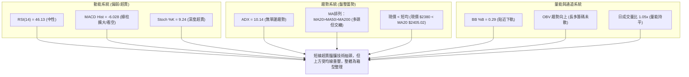

### 📈 移動平均線排列分析

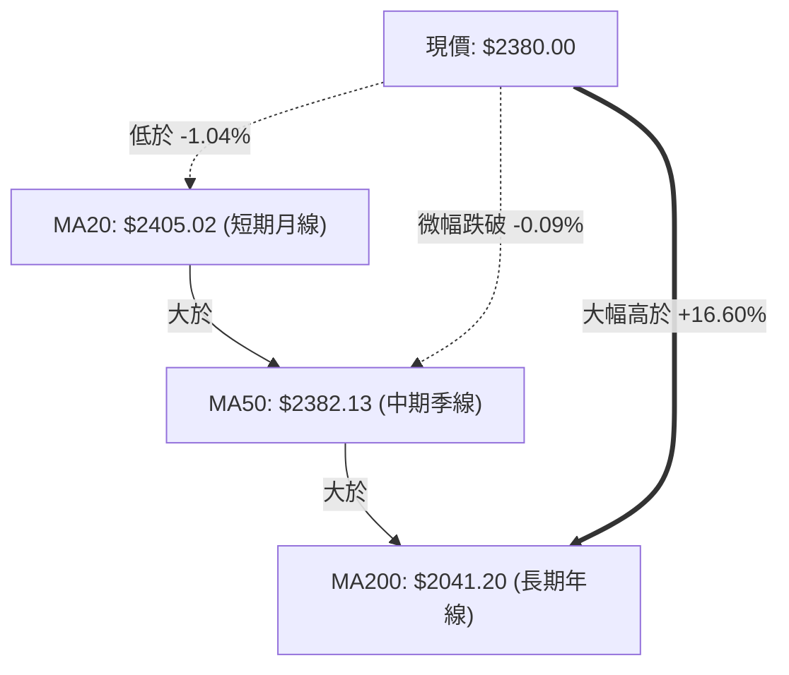

#### 各期移動平均線狀態矩陣

| 均線名稱 | 當前價位 | 現價相對距離 (點數/百分比) | 走勢斜率 | 技術形態狀態解讀 |
|:--------:|:--------:|:--------------------------:|:--------:|------------------|
| **MA 5** | $2395.35 | -$15.35 (-0.64%) | ▼ 下彎 | 超短線空方壓制，短多熄火 |
| **MA 10** | $2413.60 | -$33.60 (-1.39%) | ▼ 下彎 | 近兩週套牢籌碼沉澱，形成上檔蓋頭阻力 |
| **MA 20** | $2405.02 | -$25.02 (-1.04%) | ▼ 下彎 | 月線走平轉下彎，宣告短期多頭進攻暫告中斷 |
| **MA 60** | $2388.75 | -$8.75 (-0.37%) | ▼ 下彎 | 季線微幅下彎，現價貼近季線進行多空決戰 |
| **MA 120** | $2286.76 | +$93.24 (+4.08%) | ▲ 陡峭向上 | 半年線強勢上揚，在 S2 ($2283.28) 附近提供堅實動態保護 |
| **MA 200** | $2041.20 | +$338.80 (+16.60%) | ▲ 穩定向上 | 年線呈現堅實大牛市格局，為宏觀資產定價提供安全底線 |

### 📉 RSI(14) 分析

```
RSI(14) 當前數值：46.13 (處於常態中性區間偏弱)
[0] ────────── [30] ───────●────── [50] ────────── [70] ────────── [100]
超賣區       極度低估    現值46.13  多空平衡       超買區       過熱警訊
進度條：█████████░░░░░░░░░░░ 46.13%
```

- **指標讀數深度診斷**：RSI(14) 讀數為 **46.13**，自 5 月底高點 71.0 連續降溫，目前落於中軸 50 之下。這表明市場已完全退火，不再存在過熱風險，但也反映出短線多頭推升力道的匱乏。
- **背離檢驗結論**：
  - **頂背離判定**：**不存在頂背離**。近幾個月高點（7月 $2437.82 及 8月 $2417.88）伴隨 RSI 分別為 60.8 與 49.1，隨後價格並未再創新高，指標亦隨價格正常拉回，屬於常態性量價回調。
  - **底背離判定**：**不存在底背離**。當前價格回測 $2380，RSI 位於 46.13，未見價格破底而指標抬高的底背離多頭買訊。

### 📊 MACD(12/26/9) 訊號解讀

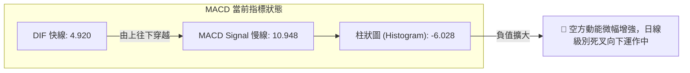

- **多空動能量化分析**：快線 DIF (4.920) 顯著低於慢線 DEA (10.948)，兩者維持在零軸上方運作（表明大週期仍為多頭環境），但差值擴大導致 MACD 柱狀圖呈現 **-6.028** 的負向空頭柱。
- **週線與日線交叉比對**：回顧近20週數據，MACD 柱於 2026-08-16 曾擴至 +8.841，隨後急劇收斂至最新一週的 -6.028，說明中期動能自8月中旬見頂後已進入連綿四週的動能遞減週期，短線切忌盲目追高。

### 📦 布林通道分析

```
ASCII 布林通道相對位置示意圖 (通道寬度: $120.40 / 5.06%)
$2465.22 ┬────────────────────────────────────────── 布林上軌 (動態阻力)
         │
$2405.02 ┼─────────────────●──────────────────────── 布林中軌 (MA20 / 現有重壓)
         │                 │
$2380.00 ┼·················● 現價 ($2380.00, %B = 0.29)
         │
$2344.82 ┴────────────────────────────────────────── 布林下軌 (短線動態支撐)
```

- **通道帶寬與形態解讀**：上軌 $2465.22 與下軌 $2344.82 之間寬度僅 $120.40（約 5.06%），呈現標準通道緊縮狀態（Bollinger Band Squeeze）。此狀態預示市場波動率已被壓縮至極致，即將面臨方向性變盤。
- **%B 位置定位**：當前 %B 數值為 **0.29**（小於 0.5），價格運行於中軌與下軌之間，顯示下檔支撐買盤正接受考驗。若無法有效跌破下軌 $2344.82，則極易在此觸發均值回歸的反彈走勢。

### 💹 成交量分析（量價配合度）

```
成交量走勢與動態均量圖 ($)
最新成交量  17,989,104  █████████░░░░░░ (量比 1.05x)
20日均量    17,067,838  ████████░░░░░░░
50日均量    24,411,845  ████████████░░░
```

- **量比與換手率判定**：最新成交量為 17,989,104 股，相較於 20日均量（17,067,838 股）之量比為 **1.05x**，顯示當前拋壓並未伴隨恐慌性殺盤，為常態性中性量能。但相較於 50日均量（24,411,845 股）則縮水近 26.3%，呈顯著「高檔量縮整理」格局。
- **能量潮 OBV 深度解析**：數據明確顯示「**OBV > MA → 量能支撐上漲**」。雖然短線現價微跌，但長線 OBV 指標線維持在其均線之上，這是一個關鍵的多頭背書——說明法人與機構大戶在過去三個月的高位震盪中並未出現實質性出貨籌碼，長線牛市籌碼沉澱度依然極為優異。

---

## 6. 動能與波動率

### ⚡ 動能評估四象限

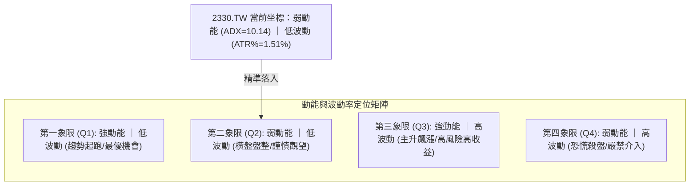

#### 動能評估矩陣詳細說明

| 象限標記 | 動能維度 | 波動維度 | 當前狀態 | 戰術評價與操作準則 |
|:--------:|:--------:|:--------:|:--------:|--------------------|
| **Q1** | 強 | 低 | — | 趨勢初成，勝率最高 |
| **Q2** | **弱** | **低** | **✓ (當前所處位置)** | **能量收斂蓄勢期。缺乏單邊推動力，應降低交易頻率，採取區間逢低承接策略** |
| **Q3** | 強 | 高 | — | 爆發突破階段，適合順勢重倉加碼追擊 |
| **Q4** | 弱 | 高 | — | 崩跌洗盤階段，觀望為上 |

### 📊 ATR 波動率分析

- **ATR(14) 絕對數值**：**$35.97**
- **ATR 相對百分比**：$$\frac{35.97}{2380.00} = \mathbf{1.51\%}$$
- **止損距離量化建議**：
  - **超短線當沖/隔日沖**：使用 $1.0 \times \text{ATR} = \$35.97$ 的空間作為緩衝。
  - **波段交易防守（標準）**：建議採用 $1.5 \times \text{ATR}$ 至 $2.0 \times \text{ATR}$：
    $$1.5 \times \text{ATR} = 1.5 \times 35.97 = \mathbf{\$53.96}$$
    $$2.0 \times \text{ATR} = 2.0 \times 35.97 = \mathbf{\$71.94}$$
  - **回測保護應用**：若以進場點進行向下防守，至少需拉開 $54 元以上的空間，才能有效濾除日常無序雜訊，避免被常態性隨機波動掃出場。

### 📐 Beta 與市場相關性

- **Beta 係數**：**1.247**
- **市場屬性解讀**：Beta 高達 1.247，意味著 2330.TW 的價格彈性大於台灣加權指數（大盤）約 24.7%。當大盤指數上漲 1% 時，台積電平均上漲約 1.25%；反之，大盤修正 1% 時，台積電面臨約 1.25% 的回檔下壓力。在高位震盪階段，其放大效應將考驗交易者的心理承載力，部位規模需依 Beta 適當縮減。

---

## 7. 多時框架總結

### 📋 時框架評分表

| 時框架 | 趨勢方向 | 動能指標狀態 | 均線排列狀況 | 圖表形態特徵 | 綜合評分 | 操作戰略建議 |
|:------:|:--------:|:------------:|:------------:|:------------:|:--------:|--------------|
| **月線** (超長) | 🟢 強烈看多 | MACD/RSI 高位溫和降溫 | 完美多頭 (現價高於MA200 16.6%) | 連續上升主升浪高位整理 | **88/100** | 核心長線部位持股續抱，無實質反轉訊號 |
| **週線** (中期) | 🟡 橫向震盪 | MACD柱收斂轉負 (-6.028) | MA20 上揚但與現價貼合 | 高檔箱型 ($2283.28–$2429.97) | **58/100** | 箱型區間思維，箱底承接，箱頂減碼 |
| **日線** (短期) | 🔴 弱勢修正 | RSI=46.13 / KD<10 超賣 | 跌破 MA20 ($2405) 與 MA50 ($2382) | 布林通道壓縮，下軌尋求支撐 | **42/100** | 不宜追空，等待超賣反彈驗證 MA20 壓力 |

### 🔲 綜合訊號矩陣

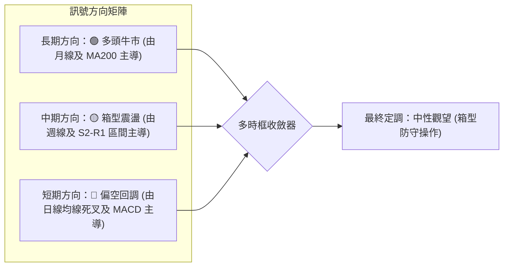

### ⚖️ 多時框收斂結論

依據多時框收斂規則（規則 14）：
1. **行情性質判定**：當前 ADX(14) 讀數為 **10.14**，遠低於 25 臨界值，明確判定當前為**標準的盤整行情（Range-bound Market）**，而非單邊趨勢行情。
2. **主導維度取捨**：依規則，當 ADX < 25 處於盤整行情時，**以日線布林通道上下軌（下軌 $2344.82 至上軌 $2465.22）及波段水平支撐阻力為核心交易依據**。日線的短線死叉（如 MACD 負柱）不可過度解讀為崩跌訊號，週線的均線多頭亦不可盲目作為現價追高的理由。
3. **唯一收斂方向**：**🟡 中性觀望 / 區間偏多防守**。
   - 上方受制於布林中軌 MA20 **$2405.02** 及箱頂阻力 **$2429.97**；
   - 下方受到日線布林下軌 **$2344.82**、波段低點支撐 **$2323.16** 與強支撐 **$2283.28** 的重重保護。

---

## 8. 交易策略建議

### 🗺️ 策略決策流程圖

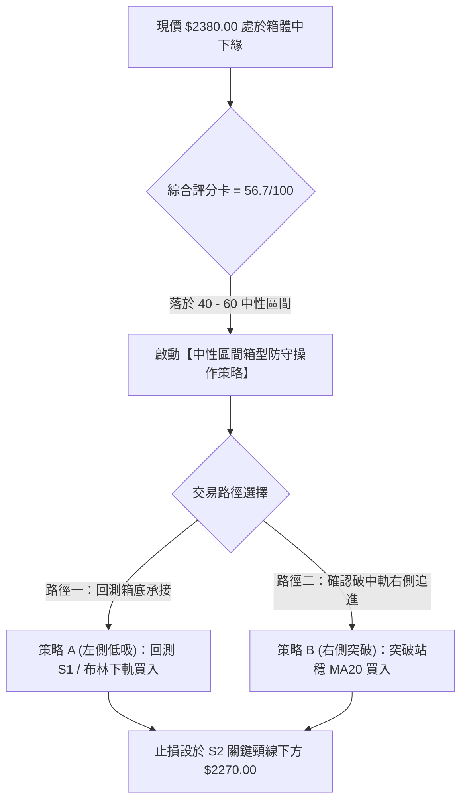

### 🧭 策略路由

**當前主策略方向 = 🟡 中性區間操作（依綜合評分 56.7 / 100 判定）**

因技術評分卡處於 40–60 之中性區間，且 ADX(14) 僅 10.14，本報告**主推以布林通道與箱型結構為基礎的區間低吸高拋策略**，不採取單邊追漲殺跌，嚴格執行防守性點位控管。

### 🎯 價格情境階梯（Price Scenarios）

價位嚴格引用第 4 章及數據計算結果：

| 觸發條件 | 第一目標 (T1) | 第二目標 (T2) | 後續延伸 (T3) | 情境含義與操作指引 |
|----------|:-------------:|:-------------:|:-------------:|--------------------|
| **向上突破 R1 $2429.97** | R2 **$2507.62** | 52W高點 **$2527.56** | 形態目標 **$2576.66** | 短線整理結束，多頭重啟主升浪，可積極加碼 |
| **站穩現價 $2380.00 區間** | MA20 **$2405.02** | R1 **$2429.97** | — | 維持 $2344–$2430 區間箱型微幅拉鋸，高出低進 |
| **向下失守 S1 $2323.16** | S2 **$2283.28** | 斐波那契 **$2200.42** | S3 **$2183.30** | 中期走勢轉弱，考驗雙頂頸線，嚴格執行減碼停損 |

### 📊 情境機率分佈

| 情境劇本 | 機率 | 主要指標量化依據 |
|----------|:----:|------------------|
| **情境一：區間震盪整理** | **55%** | ADX 僅 10.14 鎖死趨勢延伸，布林帶寬收窄至 5.06%，KD 深度超賣提供反彈動能，成交量維持 1.05x 均量，大概率維持箱型拉鋸 |
| **情境二：回測支撐後反彈** | **30%** | 長線多頭排列完整 (MA20>MA50>MA200)，OBV 呈現機構資金沉澱，下檔 S1 ($2323.16) 及 S2 ($2283.28) 具備歷史巨量護盤基礎 |
| **情境三：向下破位再探底** | **15%** | 日線 MACD 負柱狀圖 (-6.028) 壓制短線動能，跌破 MA20 形成反壓；若外圍系統性風險爆發導致 S2 失守，將引發停損賣壓 |

### 🟢 主策略詳情（方向：區間中性偏多操作）

| 策略要素 | 策略 A：左側逢低承接（防守型） | 策略 B：右側突破確認（順勢型） |
|----------|--------------------------------|--------------------------------|
| **操作邏輯** | 趁 KD 超賣，於布林下軌及 S1 支撐處掛單低吸 | 等待價格收復短期月線 MA20，確認止跌轉強追進 |
| **進場條件** | 價格觸及布林下軌 $2344.82 至 S1 $2323.16 區間不破 | 日線收盤價實體站穩 MA20 **$2405.02** 之上 |
| **進場價格** | **$2344.82** (布林下軌) | **$2406.00** (突破 MA20 確認) |
| **目標價 T1** | **$2405.02** (布林中軌 / MA20) | **$2429.97** (阻力位 R1) |
| **目標價 T2** | **$2429.97** (阻力位 R1 / 箱頂) | **$2507.62** (阻力位 R2) |
| **止損價格** | **$2270.00** (跌破關鍵頸線 S2 $2283.28 之下) | **$2360.00** (跌破進場K線低點) |
| **風險空間** | $2344.82 - $2270.00 = **$74.82** (約 2.08 個 ATR) | $2406.00 - $2360.00 = **$46.00** (約 1.28 個 ATR) |
| **獲利空間 (T2)** | $2429.97 - $2344.82 = **$85.15** | $2507.62 - $2406.00 = **$101.62** |
| **風險報酬比** | **1 : 1.14** (至T2為 1 : 1.14；若至R2則為 1 : 2.17) | **1 : 2.21** (以目標 T2 計算) |
| **成功機率** | **65%** | **55%** |
| **建議倉位** | **15%** (分批低吸，控制曝險) | **20%** (突破訊號確立，順勢推進) |

### 🔴 反向風險觸發點（對沖提示）

若發生下列技術破位事件，宣告主策略失效，應立即啟動避險機制：
1. **第一預警線**：日線實體陰線摜破 **S1 $2323.16**，多頭短線防線失守，應將持倉降至 10% 以下。
2. **多頭棄守線**：若實體收盤價跌破 **S2 $2283.28**，確認潛在雙重頂形態成形，中期多頭架構遭到實質破壞，應無條件執行多單全數停損，並可利用反向衍生性金融商品進行整體部位空頭對沖，下檔目標直指斐波那契回調位 **$2200.42**。

### ⭐ 整體訊號強度評星

```
╔══════════════════════════════════════════════════════════════════════════════╗
║ 做多訊號強度：★★★☆☆  (3.0/5星) — 長多底氣足，但短均反壓壓制，宜低吸不追高      ║
║ 做空訊號強度：★★☆☆☆  (2.0/5星) — 短線超賣且下檔支撐堅實，盲目殺空勝率低      ║
║ 整體可信度：  ★★★★☆  (4.0/5星) — 數據形態一致指向箱型整理，指標無嚴重矛盾    ║
╚══════════════════════════════════════════════════════════════════════════════╝
```

---

## 9. 風險提示與監控

### ✅ 關鍵監控指標 Checklist

```
╔══════════════════════════════════════════════════════════════════════════════╗
║               2330.TW 交易監控指標檢核清單 (Daily Checklist)                 ║
╠══════════════════════════════════════════════════════════════════════════════╣
║ [ ] 1. 均線攻防：收盤價是否重新收復 MA20 ($2405.02) 與 MA50 ($2382.13)      ║
║ [ ] 2. 支撐底線：盤中是否刺穿或日線收破波段強支撐 S2 ($2283.28)              ║
║ [ ] 3. 通道邊界：是否觸及布林下軌 ($2344.82)，觀察日K線是否收出下影線       ║
║ [ ] 4. 動能翻轉：MACD 柱狀圖負值 (-6.028) 是否出現收斂縮短之轉折紅柱        ║
║ [ ] 5. KD 超賣解凍：Stoch %K (9.24) 是否自超賣區向上黃金交叉 %D (6.92)       ║
║ [ ] 6. 趨勢爆發：ADX(14) 是否自 10.14 向上抬頭並突破 20，伴隨單邊爆量       ║
║ [ ] 7. 量價配合：單日成交量是否回升至 50日均量 (24,411,845 股) 之上         ║
╚══════════════════════════════════════════════════════════════════════════════╝
```

### ⚠️ 風險場景分析

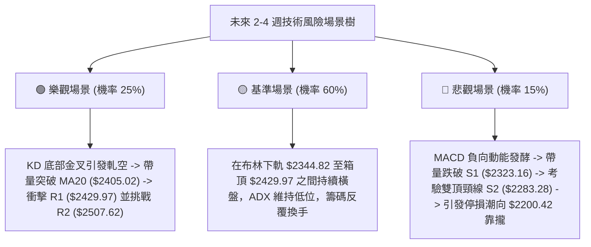

### 🛡️ 風險管理重要提醒

1. **嚴禁盤整期追高殺跌**：在 ADX = 10.14 的無趨勢盤整市況中，任何單日的長紅長黑大多缺乏趨勢持續性。若在突破 MA20 時重倉追價，極易面臨隔日反手回抽；反之在跌破短均時恐慌殺跌，則容易砍在布林下軌支撐處。
2. **頭寸與資金管理規模**：
   - 由於台積電個股 Beta 達 1.247，且單張資金規模龐大，總技術交易曝險部位建議不超過總流動資產的 **25%**。
   - 單筆交易最大虧損上限應嚴格限制於總資產的 **1.0%** 以內。若以策略 A 進場（風險空間 $74.82），單筆承擔之部位需據此倒推換算股數。
3. **事件與外生變數風險**：半導體產業地緣政治風險與全球 AI 資本支出波動等宏觀變數，極易打破現有低波動平衡（ATR 1.51%），一旦日線波動跳空跌破 S2 ($2283.28)，必須摒棄任何基本面執念，第一時間執行技術停損。

---

## 📋 報告總結

```
╔══════════════════════════════════════════════════════════════════════════════╗
║                       2330.TW 技術分析報告總結                               ║
╠══════════════════════════════════════════════════════════════════════════════╣
║ 報告日期：2026-09-16                                                        ║
║ 當前價格：$2380.00                                                           ║
║ 分析評級：🟡 中性觀望 / 區間震盪 (綜合評分: 56.7/100)                        ║
║                                                                              ║
║ 關鍵結論：                                                                   ║
║ ├─ 長期趨勢：🟢 強烈看多 (MA200 年線 $2041.20 斜率陡峭，長多基石穩固)       ║
║ ├─ 中期趨勢：🟡 箱型整理 (受制於近一年波段高點 R1 $2429.97 與低點 S2 $2283) ║
║ ├─ 短期趨勢：🔴 弱勢修正 (跌破 MA20 $2405.02，MACD 柱 -6.028 空方主導)      ║
║ ├─ 關鍵支撐：S1 $2323.16 ｜ S2 $2283.28 ｜ S3 $2183.30                      ║
║ ├─ 關鍵阻力：R1 $2429.97 ｜ R2 $2507.62                                      ║
║ └─ 外資分析師目標價：均價 $3231.71 (區間 $2650.00 ~ $4200.00，共34位)         ║
║                                                                              ║
║ 最優策略組合：                                                               ║
║ 1. 🥇 最佳機會：策略 A (左側低吸) — 於布林下軌 $2344.82 附近分批承接，       ║
║                 停損設於 S2 頸線下方 $2270.00，首要目標看 MA20 $2405.02。    ║
║ 2. 🥈 次選機會：策略 B (右側追多) — 等待實體紅K帶量收復 MA20 $2406.00 以上，║
║                 再行順勢進場，目標挑戰箱頂 R1 $2429.97 與 R2 $2507.62。      ║
║ 3. 🥉 保守選擇：空手觀望，靜待 ADX 脫離 10.14 弱勢區並向上突破 20，          ║
║                 確認突破 R1 或跌破 S2 之實體方向確立後，再行順勢介入。       ║
╚══════════════════════════════════════════════════════════════════════════════╝
```

---

> ⚠️ **免責聲明**：本報告為資深量化與技術分析研究模型自動生成，報告中所引用之價位、支撐阻力、斐波那契回調位及各項指標數值，均基於提供之歷史 OHLCV 價格數據進行嚴密計算。本報告**僅供學術研究、量化模型驗證與專業投資機構參考**，**絕不構成任何個人或機構之實質買賣要約或投資操作建議**。金融市場瞬息萬變，技術指標具備滯後性與機率限制，投資人應獨立評估自身風險承受能力並自負盈虧。

---

*報告生成時間：2026-09-16 ｜ 數據來源：Yahoo Finance ｜ 分析框架：多時框技術分析體系*