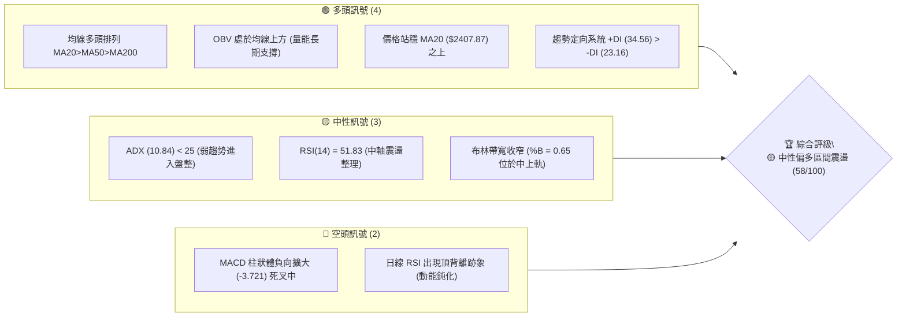
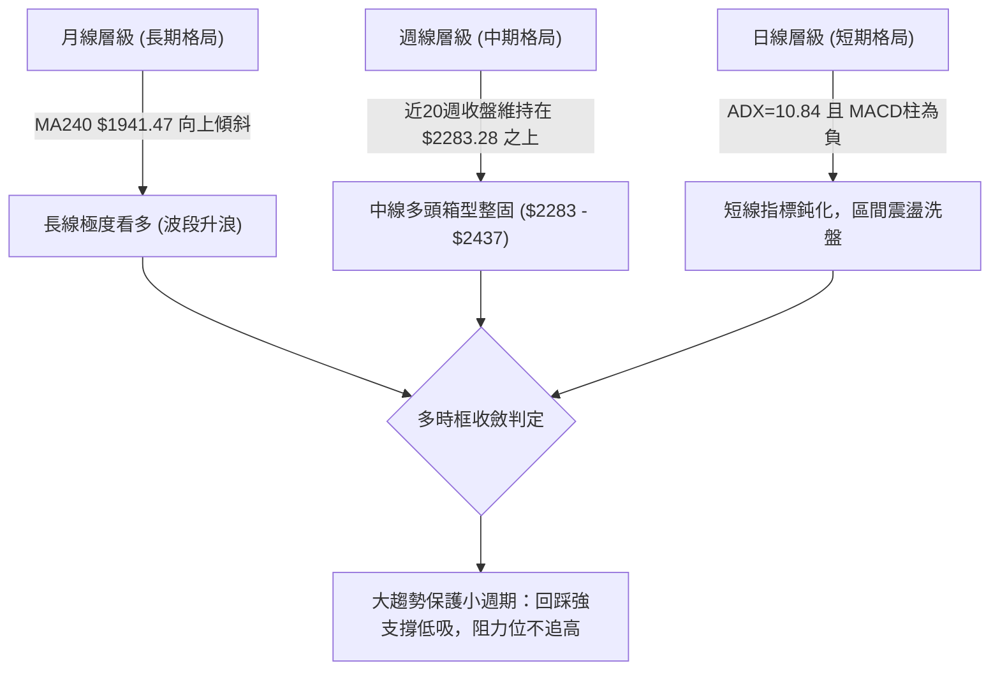
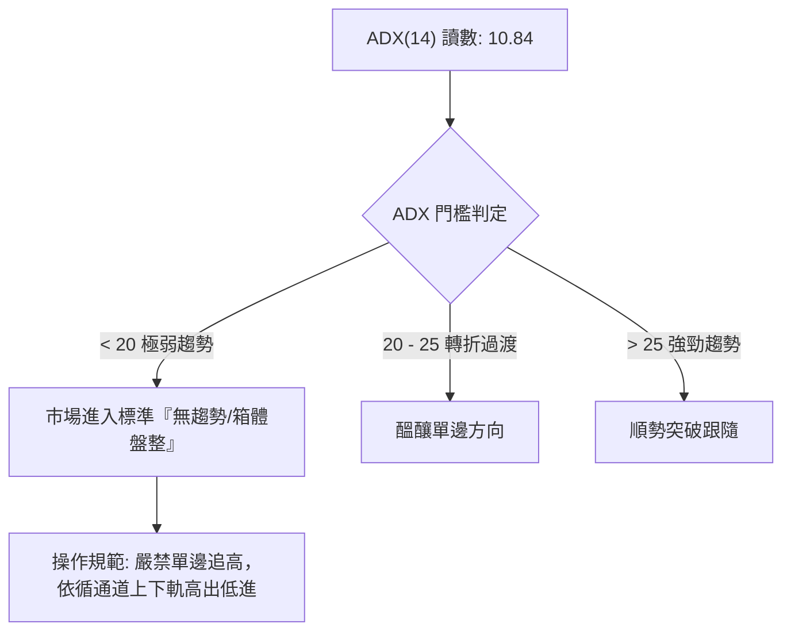
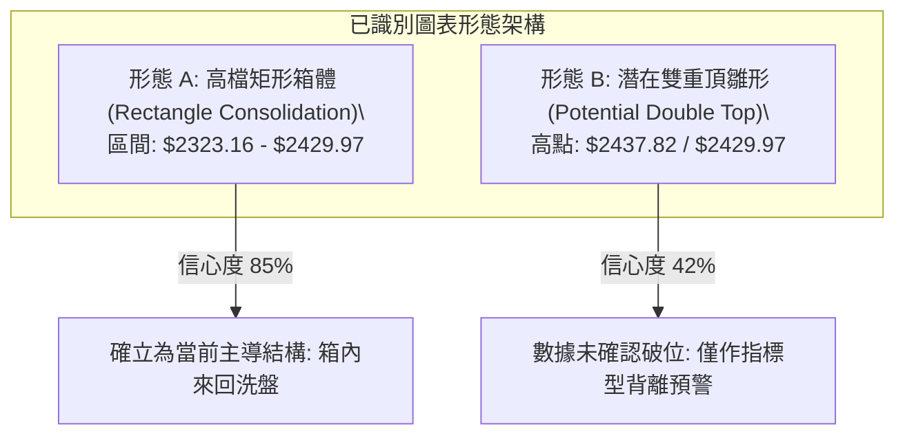
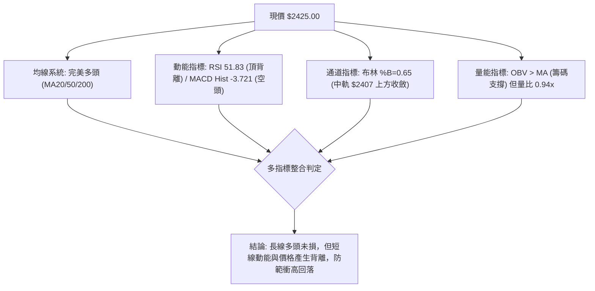
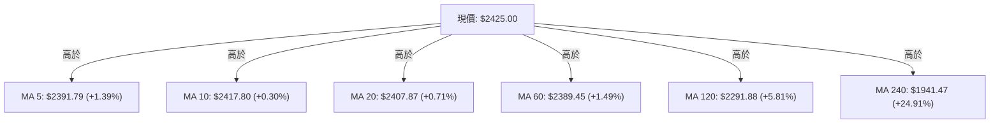
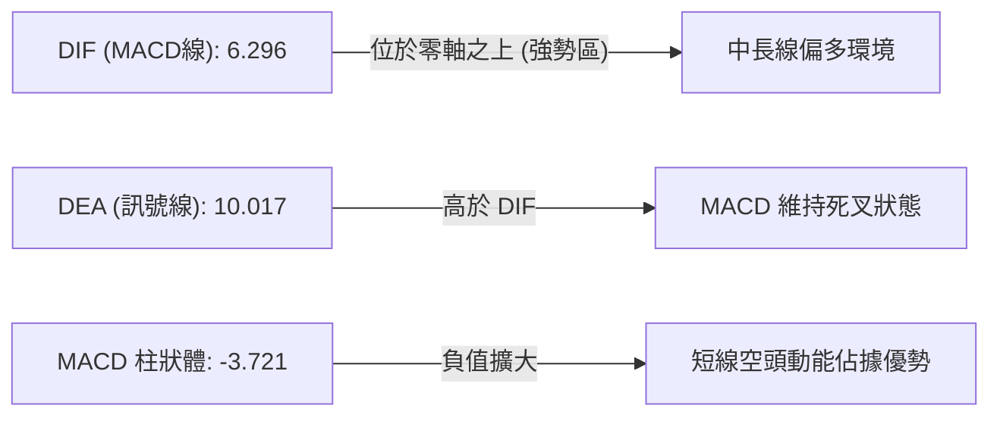
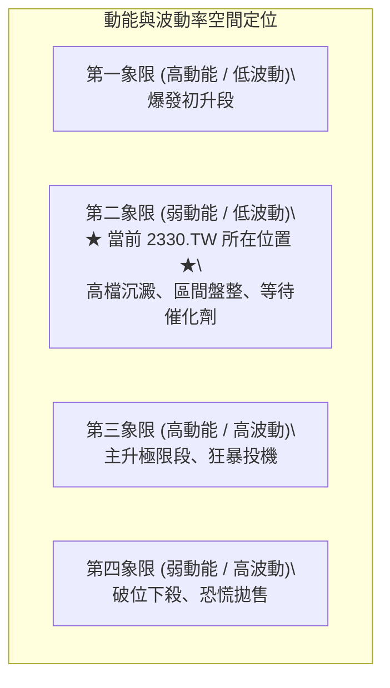
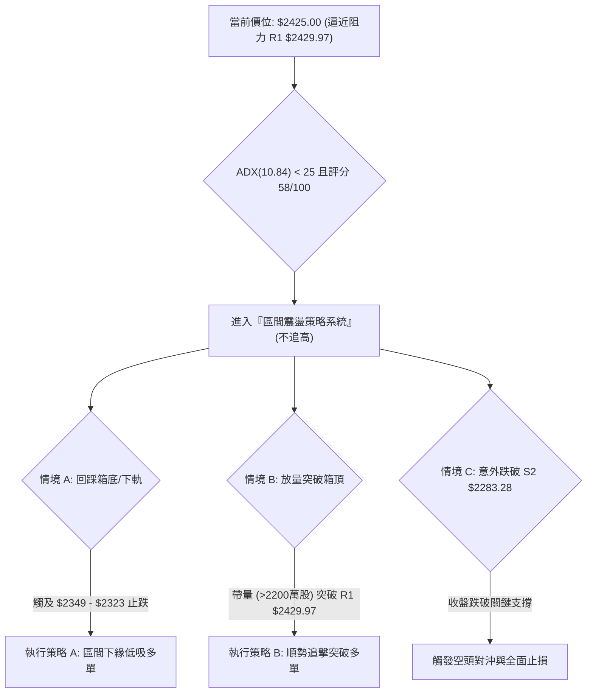
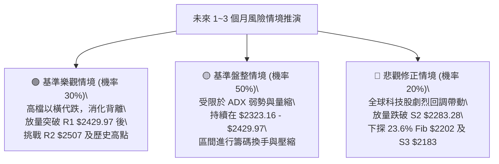

# 2330.TW 技術分析報告

> **報告日期**：2026-09-17 ｜ **語言**：繁體中文 ｜ **數據來源**：Yahoo Finance ｜ **當前價格**：$2425.00

---

## 目錄

| 章節 | 內容 |
|------|------|
| [1. 技術面概覽](#1-技術面概覽) | 訊號儀表板、核心指標、評分卡 |
| [2. 趨勢分析](#2-趨勢分析) | 多時框趨勢、長中短期走勢、ADX解讀 |
| [3. 圖表形態分析](#3-圖表形態分析) | 形態識別、信心度評估、K線組合 |
| [4. 支撐與阻力](#4-支撐與阻力) | 關鍵價位聚類、斐波那契回調結構 |
| [5. 技術指標深度解讀](#5-技術指標深度解讀) | 均線系統、RSI背離、MACD、布林通道、OBV量價 |
| [6. 動能與波動率](#6-動能與波動率) | 動能四象限、ATR波動分析、Beta相關性 |
| [7. 多時框架總結](#7-多時框架總結) | 時框架矩陣、規則收斂結論 |
| [8. 交易策略建議](#8-交易策略建議) | 策略路由、價格階梯、情境機率、主策略明細 |
| [9. 風險提示與監控](#9-風險提示與監控) | 監控清單、風險場景樹、資金風控準則 |
| [10. 報告總結](#10-報告總結) | 核心決策彙整表與操作指針 |

---

## 1. 技術面概覽

### 🎯 技術訊號儀表板



### 📊 核心指標速覽表

| 指標類別 | 指標名稱 | 當前數值 | 訊號 | 解讀 |
|----------|----------|----------|------|------|
| **價格** | 現行收盤價 | $2425.00 | 🟢 | 距 52 週高點 $2527.56 僅 4.06%，處於歷史高檔強勢區 |
| **均線** | MA20 (月線) | $2407.87 | 🟢 | 股價位於 MA20 之上 +0.71%，短線維持中軌支撐 |
| **均線** | MA50 (季線) | $2382.47 | 🟢 | 股價位於 MA50 之上 +1.79%，中期多頭生命線穩固 |
| **均線** | MA200 (年線) | $2046.49 | 🟢 | 股價大幅高於年線 +18.50%，長期絕對多頭市場 |
| **動能** | RSI(14) | 51.83 | 🟡 | 位於 50 多空分水嶺附近，出現頂背離預警，短線動能放緩 |
| **動能** | MACD (12,26,9) | Hist: -3.721 | 🔴 | 快線 6.296 低於慢線 10.017，動能柱呈現空頭發散 |
| **趨勢強度**| ADX(14) | 10.84 | 🟡 | 數值遠低於 25，明確指示單邊趨勢暫歇，進入矩形箱體整理 |
| **通道指標**| 布林通道 | 上軌 $2466.06 / 下軌 $2349.68 | 🟡 | %B = 0.65，股價在中軌與上軌間收斂，帶寬收緊待變 |
| **量能** | 當日量 / 20日均量 | 16,009,127 / 17,110,296 | 🟡 | 量比 0.94x，量能微幅萎縮，呈現高檔量縮整理特徵 |
| **波動** | ATR(14) | $38.12 | 🟢 | 佔股價 1.57%，波動率處於良性可控水準 |

### 🏆 技術評分卡

```
╔══════════════════════════════════════════════════════════════╗
║             技術評分卡 — 2330.TW (2026-09-17)                ║
╠══════════════════════════════════════════════════════════════╣
║ 趨勢強度 (Trend)     ██████░░░░░░░░░░░░░░  30/100  🟡 弱勢盤整 ║
║ 均線架構 (MA Align)  ██████████████████░░  90/100  🟢 完美多頭 ║
║ 動能指標 (Momentum)  ████████░░░░░░░░░░░░  40/100  🔴 背離死叉 ║
║ 支撐穩定度 (Support) ██████████████░░░░░░  70/100  🟢 買盤聚類 ║
║ 成交量配合 (Volume)  ████████████░░░░░░░░  60/100  🟡 縮量蓄勢 ║
║ 形態結構 (Pattern)   ████████████░░░░░░░░  60/100  🟡 高檔箱體 ║
╠══════════════════════════════════════════════════════════════╣
║ 綜合技術評分         ███████████░░░░░░░░░  58/100  🟡 中性偏多 ║
║ 策略導向             【箱型震盪策略：高出低進，嚴守止損】      ║
╚══════════════════════════════════════════════════════════════╝
```

---

## 2. 趨勢分析

### 🌐 多時框趨勢分析



### 📈 長期趨勢 — 12個月走勢圖（Unicode）

以下展示 2025 年 10 月至 2026 年 09 月（共 12 個月）的月線收盤價歷史軌跡：

```
2330.TW 月線走勢圖（過去12個月，2025-10 至 2026-09）
價格軸 ($)
$2500 ┤                                                 ● $2425.00 (現在)
      │                                       ●   ●   ●   │
$2400 ┤                                  ● $2402.93           │
      │                             ● $2341.84                │
$2200 ┤                        ● $2123.07                     │
      │                                                       │
$2000 ┤                   ● $1977.40                          │
      │              ●         │                              │
$1800 ┤         ● $1759.34     │                              │
      │                        ● $1750.17 (波段洗盤低點)       │
$1600 ┤    ● $1536.33                                         │
      │    │                                                  │
$1400 ┤●   ● $1422.55                                         │
      └─┬───┬───┬───┬───┬───┬───┬───┬───┬───┬───┬───┬─────────
       10  11  12  01  02  03  04  05  06  07  08  09 (月份)
      [ 2025年 ] [                 2026年                  ]
```

**走勢特徵分析表格**：

| 階段區間 | 月份跨度 | 起訖收盤價 | 區間漲跌幅 | 量價與形態特徵 |
|----------|----------|------------|------------|----------------|
| **第 I 階段：主升起跑** | 2025-10 ~ 2025-12 | $1481.83 → $1536.33 | +3.68% | 消化千五整數關卡，底墊穩步墊高 |
| **第 II 階段：加速推升** | 2026-01 ~ 2026-02 | $1759.34 → $1977.40 | +12.39% | 突破兩千大關前夕，動能全面爆發 |
| **第 III 階段：巨幅洗盤** | 2026-02 ~ 2026-03 | $1977.40 → $1750.17 | -11.49% | 急促回洗測試季線，確立波段次級低點 |
| **第 IV 階段：主升主浪** | 2026-03 ~ 2026-05 | $1750.17 → $2341.84 | +33.81% | 連續大陽線突破歷史新高，呈現無阻力上攻 |
| **第 V 階段：高檔橫盤** | 2026-06 ~ 2026-09 | $2402.93 → $2425.00 | +0.92% | 連續4個月於 $2400 附近震盪，量縮滯漲 |

### 📊 中期趨勢（週線分析）

中期走勢檢視近 20 週收盤狀況：
- **運行箱體**：股價於 2026 年 7 月 19 日當週下探波段低點 $2283.28，隨後在 8 月初反彈至 $2417.88，近期連續 5 週收盤緊貼在 $2402.93 至 $2425.00 之間。
- **籌碼收斂**：週成交量由 2026 年 5 月底高峰的 202,811,203 股逐步降至近期的 65,779,317 股，萎縮逾 67%，表明高檔籌碼換手趨於鎖定，多空在 $2400 上方進入觀望平衡期。

### ⚡ 趨勢強度評估（ADX 解讀）



| 指標名稱 | 當前數值 | 臨界標準 | 狀態評估 | 戰略含義 |
|----------|----------|----------|----------|----------|
| **ADX(14)** | 10.84 | < 25.00 | 🟡 弱趨勢/沉睡狀態 | 趨勢動能徹底休眠，價格波動由隨機游走與區間震盪主導 |
| **+DI** | 34.56 | > -DI | 🟢 多方佔優 | 多頭力量仍居主導地位，下檔買盤承接力強 |
| **-DI** | 23.16 | < +DI | 🟢 空方受制 | 空方尚未形成主動性下殺結構，暫無崩跌動能 |

---

## 3. 圖表形態分析

### 🔍 形態識別系統



**形態信心度評估表（依規則 15）**：

| 識別形態 | 信心度 | 判斷依據（引用精確數據） | 形態完成度 | 目標價（附嚴謹計算式） |
|----------|--------|--------------------------|------------|------------------------|
| **高檔矩形整理箱體** | 85% | 頂部受制於阻力 R1 $2429.97，底部受支撐 S1 $2323.16 與 S2 $2283.28 支撐，過去 4 個月收盤落於此區間內 | 80% (箱內震盪中) | **向上突破目標**：頸線 $2429.97 + 箱高 ($2429.97 - $2323.16 = $106.81) = **$2536.78**<br>**向下跌破目標**：支撐 $2323.16 - 箱高 $106.81 = **$2216.35** |
| **雙重頂形態雛形** | 42% | 7/05 週收盤 $2437.82 與當前收盤 $2425.00 接近，但頸線 S2 $2283.28 距今 -5.84% 且未跌破 | 30% (未成形) | 訊號不足（< 50%），依規則不畫空頭圖形，僅視為指標型超買回踩 |

### 🕯️ 重要K線形態分析

| 月份 | 收盤價 | K線形態特徵 | 技術面解讀 | 多空訊號 |
|------|--------|-------------|------------|----------|
| **2026-06** | $2402.93 | 長陽突破後高檔小實體星線 | 上攻節奏放緩，多空在 2400 大關展開激烈換手 | 🟡 中性 |
| **2026-07** | $2417.88 | 帶長下影線的紡錘線 (Low曾測 $2283.28) | 低檔買盤承接極為強勁，多頭成功防守季線與波段支撐 | 🟢 偏多 |
| **2026-08** | $2397.94 | 窄幅微陰十字星 (波動度僅 20 點) | 極致縮量沉澱，市場方向感缺失，進入蓄勢待變期 | 🟡 中性 |
| **2026-09** | $2425.00 | 溫和實體陽線 (目前月線漲 +27.06) | 價格重返所有短均線上方，意圖向上挑戰箱頂阻力 | 🟢 偏多 |

### 📉 ASCII 走勢形態示意圖

```
2330.TW 日線級別「高檔箱型整理」結構解析
價格 ($)
$2527.56 ┬────────────────────────────────────────── 52週歷史高點 (波段頂部)
         │
$2466.06 ┼ - - - - - - - - - - - - - - - - - - - - - 布林上軌 (動態超買線)
$2429.97 ┼───────●───────────────●─────────────────── 箱頂阻力 R1 (高點聚類)
$2425.00 ┤       │               │        ▲ [現價]
$2407.87 ┼ - - - │ - - - - - - - │ - - - -│ - - - -  布林中軌 (MA20 基準線)
         │       │   箱 體 震 盪  │        │
$2349.68 ┼ - - - │ - - - - - - - │ - - - -│ - - - -  布林下軌 (動態超賣線)
$2323.16 ┼───────┴───────────────┴────────┼────────── 箱底支撐 S1 (波段低點聚類)
$2283.28 ┴────────────────────────────────────────── 強力支撐 S2 (7月中旬大洗盤低點)
```

---

## 4. 支撐與阻力

### 🗺️ 關鍵價位分布圖（Unicode）

```
2330.TW 價位結構分布圖（嚴格依據 OHLCV 聚類計算）
══════════════════════════════════════════════════════════════════
$2527.56 ║████████████████████████████████║ 52W 歷史極值高點 (0.0% Fib)
$2507.62 ║████████████████████████        ║ 強阻力 R2 (+3.41%)
$2429.97 ║████████████████████████████████║ 關鍵阻力 R1 (+0.21%) — 近期密集承壓區
$2425.00 ╠════════════════════════════════╣ ◄ 當前收盤價 ($2425.00)
$2323.16 ║▓▓▓▓▓▓▓▓▓▓▓▓▓▓▓▓▓▓▓▓▓▓▓▓        ║ 近期支撐 S1 (-4.20%) — 箱體下邊界
$2283.28 ║████████████████████████████████║ 強支撐 S2 (-5.84%) — 週線級別防守底線
$2202.74 ║▒▒▒▒▒▒▒▒▒▒▒▒▒▒▒▒▒▒▒▒            ║ 23.6% 斐波那契黃金分割位
$2183.30 ║████████████████████████████████║ 終極波段支撐 S3 (-9.97%) — 多頭總底線
══════════════════════════════════════════════════════════════════
```

### 🚧 阻力位分析表

所有價位均直接引用自給定數據集之波段高點聚類與技術點位：

| 阻力級別 | 精確價位 | 距現價幅動 | 形成技術依據 | 突破難度評估 | 戰略重要性 |
|----------|----------|------------|--------------|--------------|------------|
| **R1** | **$2429.97** | +0.21% | 近一年日線級別多次波段高點聚類區，箱型頂部 | 🟡 中等（需放量逾 2,000 萬股） | ★★★★☆ 短線多空分水嶺 |
| **R2** | **$2507.62** | +3.41% | 歷史次高點波段聚類阻力，兩千五百元心理大關 | 🔴 較高（空方重兵防守區） | ★★★★☆ 波段獲利了結壓制區 |
| **52W High** | **$2527.56** | +4.23% | 過去 52 週歷史天花板（Fibonacci 0.0%） | 🔴 極高（需全市場動能配合） | ★★★★★ 歷史級別壓力 |

*註：聚類清單中無更高之聚類 R3 數值，上方最終壓力直接對應 52W 高點 $2527.56。*

### 🛡️ 支撐位分析表

所有價位均直接引用自給定數據集之波段低點聚類：

| 支撐級別 | 精確價位 | 距現價幅動 | 形成技術依據 | 守住機率評估 | 戰略重要性 |
|----------|----------|------------|--------------|--------------|------------|
| **S1** | **$2323.16** | -4.20% | 近一年波段低點密集聚類位，近 4 個月箱底防線 | 🟢 高（約 75% 守住機率） | ★★★★☆ 箱型多頭維繫線 |
| **S2** | **$2283.28** | -5.84% | 2026-07-19 當週大回洗打出的扎實波段底部 | 🟢 極高（約 85% 守住機率） | ★★★★★ 中期牛熊轉換警戒線 |
| **S3** | **$2183.30** | -9.97% | 前波突破爆發平台聚類低點，靠近 MA120 ($2291) 下方 | 🟢 絕對防禦（> 90% 機率） | ★★★★★ 長期趨勢生命線 |

### 📐 斐波那契回調位分析

依據 52 週完整波動區間（低點 $1151.22 至 高點 $2527.56，垂直振幅高達 $1376.34）計算：

| 斐波那契比例 | 精確對應價位 | 距當前價位差 | 技術結構意涵與多空對應 |
|--------------|--------------|--------------|------------------------|
| **0.0% (高點)** | **$2527.56** | +$102.56 (+4.23%) | 多頭歷史天花板，極限超買區域 |
| **23.6%** | **$2202.74** | -$222.26 (-9.17%) | **強勢回調位**：現價大幅高於此位，顯示牛市回撤極淺，格局超強 |
| **38.2%** | **$2001.80** | -$423.20 (-17.45%) | 健康回檔中樞，與 MA200 ($2046.49) 形成共振支撐帶 |
| **50.0%** | **$1839.39** | -$585.61 (-24.15%) | 多空平衡分界線，失守意味著長期牛市架構破壞 |
| **61.8%** | **$1676.98** | -$748.02 (-30.85%) | 黃金分割強支撐區間 |
| **78.6%** | **$1445.76** | -$979.24 (-40.38%) | 深幅防禦底層 |
| **100.0% (低點)** | **$1151.22** | -$1273.78 (-52.52%) | 52 週起漲原點 |

**位置解讀**：
當前收盤價 **$2425.00** 穩固運行於 **0.0% ($2527.56)** 與 **23.6% ($2202.74)** 之間的「極強多頭掌控區」（目前處於該區間 92.5% 的極高位置）。這表明儘管近期出現橫向停頓，但連最初級的 23.6% 黃金分割回調位都未曾回測，中長線多頭架構極為穩健。

---

## 5. 技術指標深度解讀

### 🎛️ 指標訊號總覽



### 📈 移動平均線排列分析



均線系統展現出教科書式的多頭排列：
1. **短天期均線收斂**：MA5 ($2391.79)、MA10 ($2417.80)、MA20 ($2407.87) 彼此距離不超過 1.5%，顯示近一個月持有者成本高度趨同，洗盤充分。
2. **中長天期均線發散向上**：MA60 ($2389.45) > MA120 ($2291.88) > MA240 ($1941.47)，年線傾角超過 30 度向上飆升，為下檔提供了極具韌性的安全墊。

### 📉 RSI(14) 分析與背離判定

- **當前讀數**：`51.83` 
- **強度進度條**：[██████████░░░░░░░░░░] 51.83%（中性區域）

```
RSI(14) 動能背離對比圖
價格走勢: 2026-05 ($2341.84) ───────► 2026-07 ($2437.82) ───────► 2026-09 ($2425.00) [價格創新高/維持高位]
                ▲                               ▲
RSI 指標:  2026-05 (RSI 71.0)  ───────► 2026-07 (RSI 60.8)  ───────► 2026-09 (RSI 51.83) [RSI 高點顯著下降]
           ⚠️ 警示：標準日/週線級別「頂背離 (Bearish Divergence)」確立！
```

**背離解讀結論**：
價格自 5 月以來上漲並創下波段高點，然而 RSI(14) 卻從超買區的 `71.0` 逐級下滑至 `60.8`，最新更是滑落至 `51.83`。**此為典型的「動能減速頂背離」**，表明高檔買盤意願隨價格推升而出現衰竭，現階段不具備向上發動突破大行情的動能條件。

### 📊 MACD(12,26,9) 訊號解讀



- **MACD 數值**：DIF `6.296`，DEA `10.017`，柱狀體 (Histogram) `-3.721`。
- **指標意涵**：雙線雖在零軸上方運行（維持長期多頭架構），但快線下穿慢線形成的死叉尚未扭轉，負柱狀體呈現持續釋放狀態。與 RSI 頂背離互相驗證，確認短線存在回調修正或時間換空間的需求。

### 📦 布林通道分析

```
2330.TW 布林通道空間結構圖 (帶寬收窄模式)
$2466.06 ┬────────────────────────────────────────── 布林上軌 (Resistance)
         │
$2425.00 ┤              ● [現價位於 %B = 0.65]
         │
$2407.87 ┼────────────────────────────────────────── 布林中軌 (MA20 核心均線)
         │
$2349.68 ┴────────────────────────────────────────── 布林下軌 (Support)
```

- **軌道數據**：上軌 **$2466.06**，中軌 **$2407.87**，下軌 **$2349.68**。
- **指標位置**：%B 值為 **0.65**，代表現價位於中軌與上軌之間的黃金分割點附近。
- **帶寬特徵**：通道帶寬僅為 $116.38（約為股價的 4.8%），屬於極度收縮狀態，預示著在未來 2~4 週內，台積電將迎來通道擴軌的變盤轉折。在帶寬未放大前，中軌 $2407.87 具備日常回踩支撐效果。

### 💹 成交量分析（量價配合度）

- **量能數據**：最新日成交量 **16,009,127 股**，相較於 20 日均量 **17,110,296 股**（量比 0.94x），相較於 50 日均量 **24,189,332 股**（量比 0.66x）。
- **OBV 趨勢**：系統明確標記「**OBV > MA → 量能支撐上漲**」。
- **綜合評價**：
  儘管短線量能因市場觀望而低於 20 日均量，但長期累積能量線（OBV）持續運行在均線之上，這說明籌碼並未在大戶手中潰散，當前的量縮是典型的「高檔惜售與散戶退場」，而非法人出逃。只要下檔支撐 S1/S2 不放量跌破，量縮橫盤即屬良性。

---

## 6. 動能與波動率

### ⚡ 動能評估四象限



| 評估象限 | 動能強度 | 波動幅度 | 當前落點判定 | 操作指引 |
|----------|----------|----------|--------------|----------|
| **Q1** | 強 | 低 | ── | 順勢加碼，抱牢持股 |
| **Q2 (當前)** | **弱 (RSI 51.8, MACD -3.7)** | **低 (ATR 1.57%)** | **✓ 確診在此象限** | **高拋低吸，收緊停損，不重倉押注突破** |
| **Q3** | 強 | 高 | ── | 設好移動止盈，隨時防反轉 |
| **Q4** | 弱 | 高 | ── | 空手觀望，逢反彈減碼 |

### 📊 ATR 波動率分析

- **ATR(14) 絕對值**：**$38.12**
- **波動百分比**：ATR / 當前股價 = $38.12 / $2425.00 = **1.57%**
- **交易防守應用建議**：
  - **超短線當沖/隔日波幅**：單日平均潛在波動為 ±$38.12，日內突破若小於此幅度多為假突破。
  - **合理止損緩衝空間**：
    - **1.5 倍 ATR** = 1.5 × $38.12 = **$57.18**（建議作為短線防守緩衝）。
    - **2.0 倍 ATR** = 2.0 × $38.12 = **$76.24**（建議作為波段防守緩衝）。

### 📐 Beta 與市場相關性

- **Beta 係數**：**1.247**
- **市場特徵解讀**：
  台積電 Beta 值為 1.247，意味著其波動幅度比台灣加權指數高出約 24.7%。在大盤上漲時具備更強的上攻彈性，但若大盤出現系統性回檔，其修正幅度亦將略高於指數。考量其佔台股權重極高，此 Beta 值反映其為帶動台股走勢的核心火車頭。

---

## 7. 多時框架總結

### 📋 時框架評分表

| 時框架 | 趨勢方向 | 動能狀態 | 均線排列狀況 | 核心支撐/阻力 | 綜合評分 | 操作戰略建議 |
|--------|----------|----------|--------------|---------------|----------|--------------|
| **長期 (月線)** | 🟢 強烈看多 | 🟢 充沛推升 | 多頭完美排列 (MA240 陡峭) | 支撐 $1941 / 阻力 $2527 | **92/100** | 長線多單底倉堅決續抱 |
| **中期 (週線)** | 🟢 穩固偏多 | 🟡 高檔鈍化 | 呈收斂排列，守在 MA20 之上 | 支撐 $2283 / 阻力 $2507 | **70/100** | 區間操作，逢回檔支撐吸納 |
| **短期 (日線)** | 🟡 橫盤震盪 | 🔴 死叉背離 | 糾結收斂 (MA5/10/20 黏合) | 支撐 $2323 / 阻力 $2429 | **48/100** | 嚴格執行箱體高拋低吸 |

### 🔲 綜合訊號矩陣

| 維度 | 短期 (日線) | 中期 (週線) | 長期 (月線) | 矩陣收斂解讀 |
|------|-------------|-------------|-------------|--------------|
| **趨勢 (Trend)** | 🟡 盤整 (ADX 10.84) | 🟢 上升通道整固 | 🟢 大主升浪延續 | 長期趨勢未變，短線無方向 |
| **動能 (Momentum)**| 🔴 MACD負柱/RSI背離 | 🟡 柱體震盪 | 🟢 穩健正向 | 短期動能回調壓力正在消化 |
| **成交量 (Volume)**| 🟡 量縮 (0.94x) | 🟡 週量逐級沉澱 | 🟢 OBV 長線多頭 | 籌碼沉澱良好，未見主力拋售 |
| **形態 (Pattern)** | 🟡 矩形高檔箱體 | 🟢 上升三角沉澱 | 🟢 階梯向上推升 | 形態處於良性蓄勢架構中 |

### ⚖️ 多時框收斂結論（依規則 14 嚴格執行）

> **【收斂核心依據】**
> 當前 ADX(14) 讀數為 **10.84**，遠低於 25.00 的趨勢門檻，嚴格定義為**典型盤整行情**！
> 根據規則 14 之盤整優先級：**「當 ADX < 25 時，以日線布林通道上下軌與核心支撐阻力為主要交易區間，月線多頭作為背景防線。」**

- **衝突收斂取捨**：
  日線的 MACD 負柱與 RSI 頂背離提示短期難有爆發性單邊行情；但長期月線之多頭排列與 OBV 結構否決了深幅做空的依據。因此，**不可盲目追多，亦不可大舉放空**。
- **唯一方向性結論**：
  **【中性偏多區間震盪觀望（箱型區間操作）】**。以布林通道下軌至 S1 區間作為買點，布林上軌至 R1 區間作為獲利了結點，耐性等待突破訊號確立。

---

## 8. 交易策略建議

### 🗺️ 策略決策流程圖



### 🧭 策略路由

依據第 1 章技術評分卡之綜合得分 **58/100**（落在 40–60 分之中性震盪區間）：
> **當前主策略方向 = 區間震盪操作（依評分 58/100，以布林通道與箱體邊界為主，等待突破確認）**

### 🎯 價格情境階梯（Price Scenarios）

本處所有點位嚴格引用第 4 章「關鍵價位」聚類計算之數值：

| 觸發條件 | 第一目標 | 第二目標 | 情境含義與技術意圖 |
|----------|----------|----------|--------------------|
| **向上放量突破 R1 $2429.97** | **R2 $2507.62** | **52W High $2527.56** | 短線擺脫箱體糾纏，發動攻擊波挑戰歷史新高 |
| **維持在 $2349.68 ~ $2429.97 區間** | **BB中軌 $2407.87** | **R1 $2429.97** | 繼續維持布林帶內震盪，洗滌浮額，等待均線跟進 |
| **向下失守 S1 $2323.16** | **S2 $2283.28** | **S3 $2183.30** | 短線箱體破位，中期轉弱，回撤測試 7 月波段大底 |

### 📊 情境機率分佈

| 運行情境 | 機率估計 | 核心技術依據（引用指標狀態） |
|----------|----------|------------------------------|
| **區間橫盤震盪** | **55%** | **ADX = 10.84**（極度缺乏趨勢動能），布林帶寬窄幅收縮，均線簇擁在 $2400 附近形成引力場 |
| **回落測試下檔支撐** | **25%** | **MACD 負柱擴大 (-3.721)**，日線級別 **RSI 頂背離** 發酵，短線動能呈現衰竭回調跡象 |
| **強勢向上突破** | **20%** | 最新日成交量僅 1,600 萬股（量比 0.94x），高檔量能不足以支撐連續突破強阻力 R1 與 R2 |

### 🟢 主策略詳情（區間震盪導向）

依據策略路由，主推兩套在震盪格局下勝率與風報比最高之交易策略：

| 策略要素 | 策略 A（下軌支撐逢低吸納 — 偏多震盪） | 策略 B（帶量突破順勢跟進 — 動能爆發） |
|----------|---------------------------------------|---------------------------------------|
| **策略類型** | 逆勢區間低吸（左側交易） | 順勢破位追擊（右側交易） |
| **進場條件** | 價格回踩布林下軌 $2349 或支撐 S1，出現日線收下影線止跌訊號 | 日線帶量（量比 > 1.3x，成交量 > 2,200 萬股）實體陽線收過 R1 |
| **進場價格** | **$2340.00**（位於下軌 $2349.68 與 S1 $2323.16 之間） | **$2435.00**（突破確認 R1 $2429.97 後回抽不破之點位） |
| **目標價 T1** | **$2429.97**（箱頂阻力 R1） | **$2507.62**（強阻力 R2） |
| **目標價 T2** | **$2507.62**（波段阻力 R2） | **$2527.56**（52 週歷史高點） |
| **止損價格** | **$2280.00**（精確跌破關鍵支撐 S2 $2283.28 之保護點） | **$2398.00**（跌破布林中軌 MA20 $2407.87 之防守點） |
| **風險空間** | $60.00 ($2340 - $2280) | $37.00 ($2435 - $2398) |
| **報酬空間(T1)**| $89.97 ($2429.97 - $2340) | $72.62 ($2507.62 - $2435) |
| **風險報酬比** | **1 : 1.50** (至 T1) / **1 : 2.79** (至 T2) | **1 : 1.96** (至 T1) / **1 : 2.50** (至 T2) |
| **預估勝率** | **68%** | **52%** |
| **建議倉位** | **20% ~ 25%**（分批建倉） | **10% ~ 15%**（突破確認後快速介入） |

### 🔴 反向風險觸發點（對沖與風控提示）

若發生非預期系統性風險，以下節點為**推翻上述主策略**的強制離場訊號：
1. **警示觸發點 1**：收盤價有效跌破 **S1 $2323.16**，宣告箱體底部瓦解，所有短線多單減碼 50%。
2. **極限對沖點 2**：收盤價正式跌破 **S2 $2283.28**，確認中期牛熊轉換，多單全部出清離場，並可動用總資金 5%~10% 反向配置空頭對沖避險工具，下一級下行目標直接看向 **S3 $2183.30**。

### ⭐ 整體訊號強度評星

```
做多訊號強度：★★★☆☆  (3.0/5 星 — 長線良好但短線面臨背離壓制)
做空訊號強度：★★☆☆☆  (2.0/5 星 — 均線排列強烈多頭，逆勢做空勝率低)
整體可信度：  ★★★★☆  (4.0/5 星 — 價位聚類清晰，區間箱體特徵明確)
```

---

## 9. 風險提示與監控

### ✅ 關鍵監控指標 Checklist

```
╔══════════════════════════════════════════════════════════════╗
║              2330.TW 每日盤後技術監控清單                     ║
╠══════════════════════════════════════════════════════════════╣
║ [ ] 價格是否跌破布林中軌 (MA20) $2407.87？                   ║
║ [ ] 日成交量是否連續 3 日低於 1,500 萬股 (流動性持續萎縮)？   ║
║ [ ] MACD 柱狀體是否擴大負值至 -5.0 以下 (空頭動能增強)？     ║
║ [ ] RSI(14) 是否跌破 45 進入偏空弱勢區？                     ║
║ [ ] ADX(14) 是否開始抬頭突破 20 (預示單邊波動即將爆發)？     ║
║ [ ] 價格是否觸及箱頂 R1 $2429.97 或箱底 S1 $2323.16？         ║
╚══════════════════════════════════════════════════════════════╝
```

### ⚠️ 風險場景分析



### 🛡️ 風險管理重要提醒

1. **嚴禁阻力區追價**：現價 $2425.00 距阻力 R1 $2429.97 僅 0.21%，在 RSI 頂背離未化解且 ADX<25 的情況下，現價追高之風險報酬比極差（約 1:0.1），切忌在箱頂進行追高操作。
2. **動態止損紀律**：
   - 短線操作者以 **MA20 ($2407.87)** 或 **1.5 倍 ATR ($57.18)** 作為第一道動態追蹤止損。
   - 波段投資者必須以 **S2 ($2283.28)** 作為最終不可妥協的硬性停損線。
3. **倉位管理配置**：
   在當前弱趨勢（ADX 10.84）環境下，整體權益部位曝險不宜超過 50%。保留足夠現金儲備，靜待市場突破方向明朗化（ADX 重新站上 25 且伴隨放量）時再行加碼。

---

## 10. 報告總結

```
╔══════════════════════════════════════════════════════════════╗
║              2330.TW 技術分析報告總結清單                    ║
╠══════════════════════════════════════════════════════════════╣
║ 報告日期：2026-09-17                                          ║
║ 當前價格：$2425.00                                            ║
║ 綜合技術評分：58 / 100                                        ║
║ 分析評級：⚖️ 中性偏多區間震盪（箱型操作）                    ║
╠══════════════════════════════════════════════════════════════╣
║ 趨勢核心結論：                                                ║
║ ├─ 長期趨勢：🟢 強烈多頭（MA240 $1941.47 向上，距年線 +18.5%） ║
║ ├─ 中期趨勢：🟢 偏多整固（守穩波段低點聚類 S2 $2283.28 之上） ║
║ └─ 短期趨勢：🟡 箱型休眠（ADX 10.84，RSI 51.83 出現頂背離）  ║
╠══════════════════════════════════════════════════════════════╣
║ 關鍵技術點位（OHLCV 聚類）：                                  ║
║ ├─ 核心阻力位：R1 $2429.97  /  R2 $2507.62  / 52W高 $2527.56║
║ ├─ 核心支撐位：S1 $2323.16  /  S2 $2283.28  / S3 $2183.30   ║
║ └─ 52W 斐波那契強支撐 (23.6%)：$2202.74                       ║
╠══════════════════════════════════════════════════════════════╣
║ 最優策略組合建議：                                            ║
║ 1. 🥇 最佳機會：策略 A（回踩下軌 $2340 附近低吸，停損設 $2280）║
║ 2. 🥈 次選機會：策略 B（帶量突破 R1 $2429.97 後追擊至 $2507） ║
║ 3. 🥉 保守選擇：空手者耐心觀望，等待 ADX>25 單邊趨勢啟動再進場║
╚══════════════════════════════════════════════════════════════╝
```

---

> ⚠️ **免責聲明**：本報告由量化技術分析系統自動生成，文中所有技術指標計算、關鍵價位聚類、形態識別與回測數據均基於歷史價格行情推演。本報告僅供學術研究、市場結構探討與投資紀律參考，**絕不構成任何個人或機構之買賣投資建議**。金融市場瞬息萬變，交易決策應審慎評估個人風險承受能力，嚴格執行資金管理與止損紀律。

---
*報告生成時間：2026-09-17 ｜ 數據來源：Yahoo Finance ｜ 分析框架：多時框架技術指標收斂模型*