# 2330.TW 技術分析報告

> **報告日期**：2026-09-22 ｜ **語言**：繁體中文 ｜ **數據來源**：Yahoo Finance ｜ **當前價格**：$2480.00

---

## 目錄

| 章節 | 內容 |
|------|------|
| [1. 技術面概覽](#1-技術面概覽) | 訊號儀表板、核心指標、評分卡 |
| [2. 趨勢分析](#2-趨勢分析) | 多時框趨勢、長中短期走勢 |
| [3. 圖表形態分析](#3-圖表形態分析) | 形態識別、K線組合、目標價 |
| [4. 支撐與阻力](#4-支撐與阻力) | 關鍵價位、斐波那契回調 |
| [5. 技術指標深度解讀](#5-技術指標深度解讀) | MA/RSI/MACD/布林/成交量 |
| [6. 動能與波動率](#6-動能與波動率) | 動能評估、ATR、Beta |
| [7. 多時框架總結](#7-多時框架總結) | 時框架評分矩陣 |
| [8. 交易策略建議](#8-交易策略建議) | 多空策略、風險報酬比 |
| [9. 風險提示與監控](#9-風險提示與監控) | 監控指標、風險場景 |

---

## 1. 技術面概覽

### 🎯 技術訊號儀表板

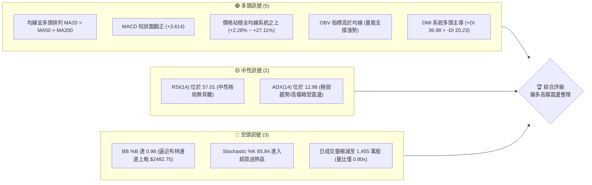

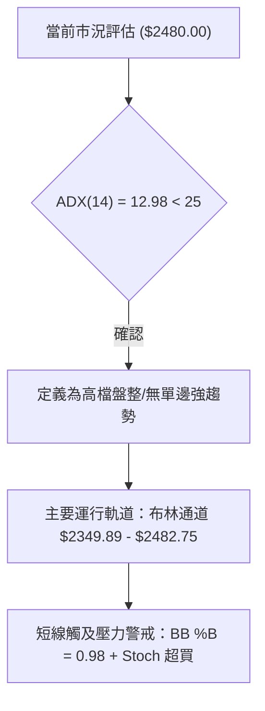

### 📊 核心指標速覽表

| 指標類別 | 指標名稱 | 當前數值 | 訊號 | 解讀 |
|----------|----------|----------|------|------|
| **價格** | 當前價格 | $2480.00 | 🟢 | 位於52週區間 96.5% 位置，逼近歷史天花板 |
| **均線** | MA20 | $2416.32 | 🟢 | 現價高於 MA20 達 +2.64%，短線支撐強勁 |
| **均線** | MA50 | $2384.45 | 🟢 | 現價高於 MA50 達 +4.01%，中期多頭防線完整 |
| **均線** | MA200 | $2057.41 | 🟢 | 現價高於 MA200 達 +20.54%，長期牛市基石未破 |
| **動能** | RSI(14) | 57.01 | 🟡 | 位於 50–60 健康擴張區，無頂底背離現象 |
| **動能** | MACD (12,26,9) | Hist: +3.614 | 🟢 | DIF(14.551) > DEA(10.936)，紅柱持續放大 |
| **動能** | Stoch %K/%D | %K: 85.84 / %D: 66.53 | 🔴 | %K 深度鈍化超買，短線追高具回檔修正風險 |
| **波動** | ATR(14) | $36.71 | 🟡 | 佔股價 1.48%，波動率溫和收斂，未見恐慌外溢 |
| **趨勢強度** | ADX(14) | 12.98 | 🟡 | 指數低於 25，單邊動能不足，處於區間消化期 |
| **通道狀態** | BB %B | 0.98 | 🔴 | 貼近布林上軌 ($2482.75)，通道邊界壓制顯著 |
| **量能狀態** | 成交量比 | 0.80x | 🟡 | 20日均量 18.28M，現量 14.55M，呈現價漲量縮 |

### 🏆 技術評分卡

```
╔══════════════════════════════════════════════════════════════╗
║              技術評分卡 — 2330.TW (2026-09-22)               ║
╠══════════════════════════════════════════════════════════════╣
║ 趨勢強度 (ADX/DMI)  ██████░░░░░░░░░░░░░░  32/100  🟡 弱趨勢震盪 ║
║ 動能指標 (RSI/MACD) ██████████████░░░░░░  70/100  🟢 動能偏多   ║
║ 支撐穩定度 (S1-S3)  ████████████████░░░░  80/100  🟢 底氣扎實   ║
║ 成交量配合 (OBV/VOL)██████████░░░░░░░░░░  52/100  🟡 量能背離   ║
║ 形態完整度 (箱型/K) ██████████████░░░░░░  72/100  🟢 高檔蓄勢   ║
║ 均線排列 (MA5-MA240)████████████████████ 100/100  🟢 完美多頭   ║
╠══════════════════════════════════════════════════════════════╣
║ 綜合評分            █████████████░░░░░░░  67.7/100 偏多操作   ║
╚══════════════════════════════════════════════════════════════╝
```

---

## 2. 趨勢分析

### 🌐 多時框趨勢分析

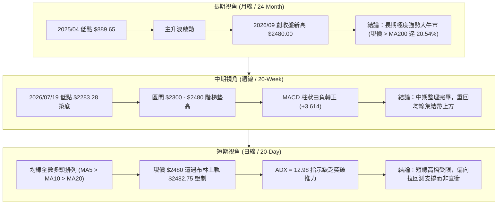

### 📈 長期趨勢 — 12個月走勢圖（Unicode）

```
2330.TW 月線收盤走勢圖（2025-10 至 2026-09）
價格軸 ($)
$2500 ┤                                                 ● $2480.00 (現價)
      │                                       ● $2417.88
$2400 ┤                               ● $2402.93        │
      │                       ● $2341.84                ● $2397.94
$2200 ┤               ● $2123.07
      │
$2000 ┤       ● $1977.40
      │
$1800 ┤   ● $1759.34  ● $1750.17
      │
$1600 ┤       ● $1536.33
      │   ● $1422.55
$1400 ┤● $1481.83
      └──────────────────────────────────────────────────────────────
       10  11  12  01  02  03  04  05  06  07  08  09  (月份: 2025/10 - 2026/09)
       [2025 年]       [                  2026 年                  ]
```

#### 走勢特徵分析表格

| 階段 | 期間涵蓋 | 起始與結束收盤價 | 漲跌幅 | 價量特徵與形態解讀 |
|------|----------|------------------|--------|--------------------|
| 第一階段：快速拉升期 | 2025/10 - 2026/02 | $1481.83 → $1977.40 | +33.44% | 擴量主升段，突破 $1500 關卡後斜率陡峭，推升至兩千元大關前夕。 |
| 第二階段：健康回洗期 | 2026/02 - 2026/03 | $1977.40 → $1750.17 | -11.49% | 逢高獲利了結，於 $1750.17 確認波段中期支撐，完成籌碼換手。 |
| 第三階段：強勢突破期 | 2026/03 - 2026/06 | $1750.17 → $2402.93 | +37.30% | 軋空行情，連破 $2000 與 $2200 整數防線，月線呈現連續實體紅K。 |
| 第四階段：高檔矩形平台 | 2026/06 - 2026/09 | $2402.93 → $2480.00 | +3.21%  | 波動幅度收窄，在 $2300 - $2480 區間反覆震盪蓄勢，消化高檔浮額。 |

### 📊 中期趨勢（週線分析）

```
近20週關鍵收盤價與支撐阻力結構示意：
$2527.56 ┬──────────────────────────────────────────── 52W 歷史最高點
         │                                       ┌── 現價: $2480.00
$2480.00 ┼───────────────────────────────────────■──── 本週收盤
         │                       ▲       ▲       │
$2400.00 ┼───────■───────■───────┼───────■───────┼─── 中軸密集區 ($2402.93)
         │       │       │       │       │       │
$2300.00 ┼───■───┼───────┼───────┼───────┼───────┼───
         │   │   │       │       │       │       │
$2242.40 ┴───┴───┴───────┴───────┴───────┴───────┴─── 近20週波段低點區
        W01     W05     W10     W15     W19     W20 (2026-09-27)
```

- 中期波段以 2026-07-19 的週收盤低點 **$2283.28** 為牢固防線（與歷史支撐位 S3 精確吻合）。
- 過去五週（2026-08-30 至 2026-09-27），週收盤價由 $2412.90 → $2402.93 → $2402.93 → $2460.00 → $2480.00，底部明顯墊高，確認中期多頭結構依舊占據主導地位。

### ⚡ 趨勢強度評估（ADX 解讀）

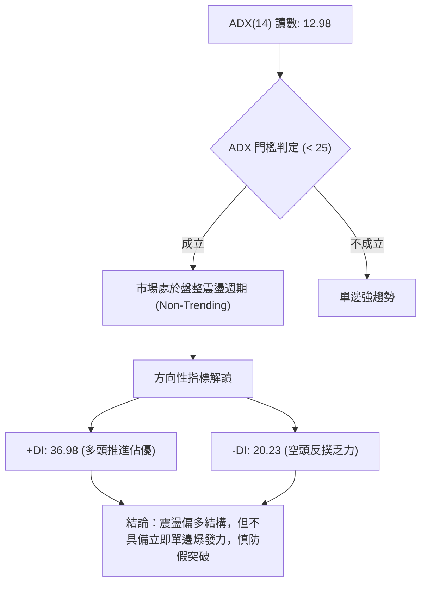

#### ADX 趨勢強度對照表

| 指標變數 | 當前讀數 | 門檻區間 | 趨勢屬性判定 | 操作策略指導原則 |
|----------|----------|----------|--------------|------------------|
| **ADX(14)** | **12.98** | 0 – 20 | 極弱趨勢 / 狹幅盤整 | 嚴禁於阻力位追價，適合於通道邊界逢低吸納 |
| **+DI(14)** | **36.98** | > 25 (強) | 多方力量主導 | 盤面回檔時買盤承接力強，不宜做空 |
| **-DI(14)** | **20.23** | 20 – 25 (偏弱) | 空方力道衰退 | 空方難以構成連續性暴跌走勢 |
| **方向綜合** | **+16.75** | +DI 顯著大於 -DI | 多頭控盤震盪 | 交易策略以「回踩均線做多」為唯一優先選項 |

---

## 3. 圖表形態分析

### 🔍 形態識別系統

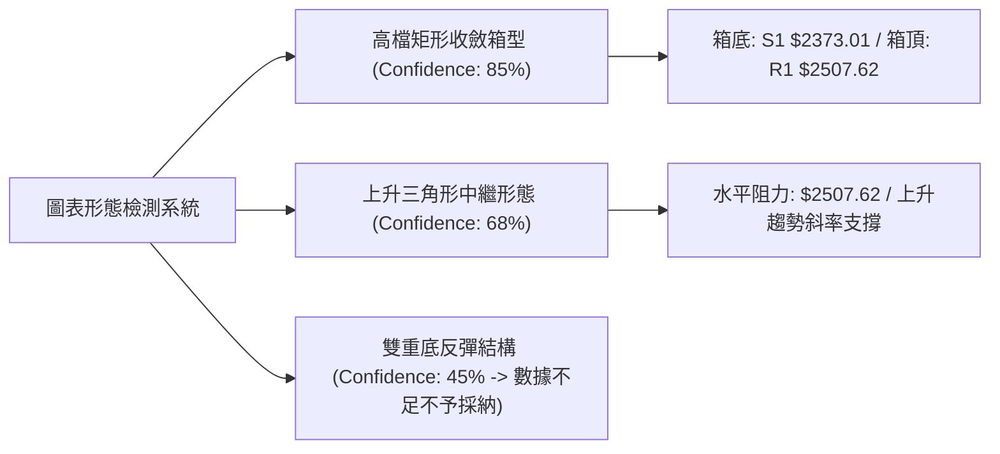

#### 形態識別與信心度評估表

| 形態類別 | 信心度 | 判斷依據（嚴格引用歷史數據） | 形態完成度 | 理論目標價（計算式） |
|----------|--------|------------------------------|------------|----------------------|
| **高檔矩形整理箱型** | **85%** | 2026年6月至9月收盤價反覆受限於 $2417.88-$2480.00，下檔於 $2373.01 (S1) 與 $2323.16 (S2) 形成堅實底部支撐。 | 90% | 突破箱頂 R1 $2507.62 後：<br/>$2507.62 + ($2507.62 - $2373.01) = **$2642.23** |
| **上升三角形中繼** | **68%** | 水平壓力鎖定於波段高點 R1 $2507.62，低點自 07/19 $2283.28 墊高至 08/09 $2363.04，再至當前 MA20 $2416.32。 | 75% | 三角形底邊高差 ($2507.62 - $2283.28 = 224.34)：<br/>突破點 $2507.62 + 224.34 = **$2731.96** |
| **頭肩底 / 雙底** | **< 50%** | *數據中未偵測到* 完整幾何右肩，缺乏對稱頸線確認。 | 0% | *訊號不足，依規則不予強行標注與計算* |

### 🕯️ 重要K線形態分析

| 週/月份週期 | 收盤價 ($) | 實體與影線表現 | K線組合形態 | 多空訊號解讀 |
|-------------|------------|----------------|-------------|--------------|
| 2026-07-19 (週線) | 2283.28 | 長下影陰十字，下探波段聚類低點 | 單針探底 (Hammer) | 🟢 確立波段硬支撐 S3 ($2283.28)，清洗獲利籌碼 |
| 2026-08-02 (週線) | 2417.88 | 大實體長陽線，週成交量放至 2.17億股 | 破線長紅突破 | 🟢 強勢收復 MA20 與 MA60，扭轉中期回檔修正 |
| 2026-09-20 (週線) | 2460.00 | 實體陽線，收復前四週所有小陰小陽實體 | 多方吞噬 (Bullish Engulfing) | 🟢 蓄勢挑戰上軌，多頭重掌短線定價權 |
| 2026-09-27 (當前) | 2480.00 | 小實體紅K，逼近歷史高位但量能縮減 | 吊人/高檔孕育線疑似 | 🟡 逼近布林通道上軌，多頭動能減速，短線有整固需求 |

### 📉 ASCII 走勢形態示意圖

```
高檔矩形整理箱型與上升三角中繼示意圖
$2527.56 ┬─────────────────────────────────────────── [52W 歷史極值天花板]
         │                              ┌─ R1: $2507.62 [水平箱頂阻力]
$2507.62 ┼──────▲──────────────▲───────■───┼───────
         │     ╱ ╲            ╱ ╲     ╱    │
$2450.00 ┼────╱───╲──────────╱───╲───╱─────┼─── 現價 $2480.00 (受阻於上軌)
         │   ╱     ╲        ╱     ╲ ╱      │
$2400.00 ┼──╱───────╲──────╱───────●       ├── 上升支撐趨勢線
         │ ╱           ╲  ╱                │
$2373.01 ┼●─────────────●─────────────────┼─── S1: $2373.01 [箱底強防線]
         │                                 │
$2323.16 ┴─────────────────────────────────┴─── S2: $2323.16 [深度回調防線]
        2026-06        2026-07         2026-08        2026-09
```

### 🎯 形態目標價計算

1. **高檔箱型整理等距測幅（信心度 85%）**：
   - 箱頂壓力頸線：引用 **R1 = $2507.62**
   - 箱底支撐平台：引用 **S1 = $2373.01**
   - 形態箱體高度 $H = 2507.62 - 2373.01 = \$134.61$
   - **破箱向上目標價 $T_{Box} = 2507.62 + 134.61 = \$2642.23$**

2. **上升三角收斂形態測幅（信心度 68%）**：
   - 形態起始阻力：引用 **R1 = $2507.62**
   - 形態波段起漲點低位：引用 **S3 = $2283.28**
   - 三角形垂直基底高度 $H_{\Delta} = 2507.62 - 2283.28 = \$224.34$
   - **突破三角延伸目標價 $T_{Triangle} = 2507.62 + 224.34 = \$2731.96$**

---

## 4. 支撐與阻力

### 🗺️ 關鍵價位分布圖（Unicode）

```
2330.TW 價位結構分布圖 (由 OHLCV 與斐波那契精確計算)
═════════════════════════════════════════════════════════════════
$2527.56 ║████████████████████████║ 52W 歷史最高點 / 0.0% Fib
$2507.62 ║████████████████████    ║ 關鍵波段阻力 R1 (+1.11%)
$2482.75 ║▓▓▓▓▓▓▓▓▓▓▓▓▓▓▓▓        ║ 布林通道上軌壓制線
$2480.00 ╠════════════════════════╣ ◄ 現價 (位於52週區間 96.5% 高檔)
$2416.32 ║░░░░░░░░░░░░░░░░░░░░░░░░║ 短線動態支撐 MA20 / 布林中軌
$2373.01 ║████████████████████    ║ 關鍵波段支撐 S1 (-4.31%)
$2349.89 ║▓▓▓▓▓▓▓▓▓▓▓▓▓▓▓▓        ║ 布林通道下軌護城河
$2323.16 ║████████████████████████║ 中期波段支撐 S2 (-6.32%)
$2283.28 ║████████████████████████║ 強烈防禦支撐 S3 (-7.93%)
$2207.39 ║████████████████████████║ 23.6% 斐波那契黃金回調位
═════════════════════════════════════════════════════════════════
```

### 🚧 阻力位分析表

| 阻力級別 | 價位 ($) | 距現價幅動 | 形成原因及技術依據 | 突破難度 | 戰略重要性 |
|----------|----------|------------|--------------------|----------|------------|
| **通道壓制** | $2482.75 | +0.11% | 日線布林通道上軌邊界，統計學 95% 常態分佈極限 | 🟡 中等 | 短線壓抑線，壓制日內追價買盤 |
| **阻力 R1** | $2507.62 | +1.11% | 近一年波段高點密集聚類區，整數大關前換手壁壘 | 🔴 極高 | 波段生死線，放量突破即開拓新空間 |
| **52W極值** | $2527.56 | +1.92% | 52週歷史最高天花板，套牢籌碼與心理防線焦點 | 🔴 極高 | 終極牛熊分水嶺，決定是否進入真空加速 |
| **阻力 R2/R3** | *無數據* | — | *數據中未偵測到其餘波段聚類，嚴禁捏造* | — | — |

### 🛡️ 支撐位分析表

| 支撐級別 | 價位 ($) | 距現價幅動 | 形成原因及技術依據 | 守住機率 | 戰略重要性 |
|----------|----------|------------|--------------------|----------|------------|
| **均線中軌** | $2416.32 | -2.64% | MA20 月均線與布林通道中軌共振重疊位置 | 🟢 85% | 短線多頭生命線，不可實體跌破 |
| **支撐 S1** | $2373.01 | -4.31% | 近一年波段低點聚類核心，MA50 ($2384.45) 守護區 | 🟢 80% | 中期上升格局分水嶺，拉回首選買點 |
| **通道下軌** | $2349.89 | -5.25% | 日線布林通道下軌極限，常態震盪下緣支撐 | 🟢 75% | 區間震盪操作極限防守位 |
| **支撐 S2** | $2323.16 | -6.32% | 近一年密集換手聚類波段低點，多方主力防線 | 🟢 90% | 強力護盤平台，跌破則中期結構受損 |
| **支撐 S3** | $2283.28 | -7.93% | 2026-07-19 週線回測最低點，波段絕對防禦中樞 | 🟢 95% | 戰略底線，多頭最後防線 |

### 📐 斐波那契回調位分析

依據 52 週完整區間波動：極端低點 **$1170.90** 至 歷史最高 **$2527.56**，絕對垂直落差達 **$1356.66**。

```
斐波那契回調位階梯圖：
0.0%  (52W High) ── $2527.56  ────────────────────────────── [歷史極值]
                     │  ▲
                     │  │ 當前價格: $2480.00 (位於 0.0% 與 23.6% 超強強勢區間)
                     │  ▼
23.6%             ── $2207.39  ────────────────────────────── [淺度回檔警戒線]
38.2%             ── $2009.32  ────────────────────────────── [多頭防線 / 接近 MA200]
50.0%             ── $1849.23  ────────────────────────────── [多空均衡中軸線]
61.8%             ── $1689.14  ────────────────────────────── [黃金分割絕對支撐]
78.6%             ── $1461.23  ────────────────────────────── [深幅回檔破壞位]
100.0% (52W Low)  ── $1170.90  ────────────────────────────── [年度絕對低點]
```

- **位置解讀**：現價 **$2480.00** 穩固運行於 **0.0% ($2527.56)** 與 **23.6% ($2207.39)** 之間的「極強勢領空」。
- **結構涵義**：現價距離 23.6% 回調位高達 +12.35%（$272.61 緩衝空間），且全數均線（MA20/MA50/MA60/MA120/MA200）皆強勢凌駕於 23.6% 之上，顯示 2330.TW 自 2025 年以來開啟的超級多頭結構未見任何深幅修正訊號。

---

## 5. 技術指標深度解讀

### 🎛️ 指標訊號總覽

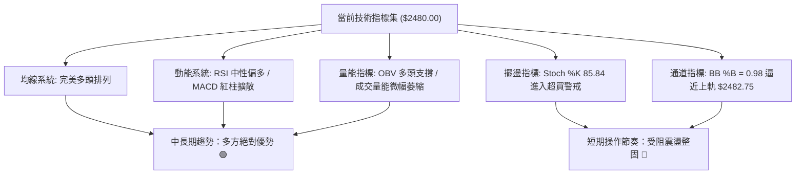

### 📈 移動平均線排列分析

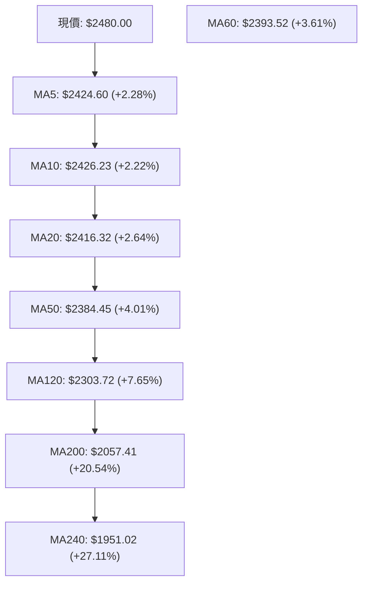

#### 均線階層架構體系

| 均線代號 | 數值 ($) | 與現價乖離 | 微觀形態特徵 | 多空屬性 |
|----------|----------|------------|--------------|----------|
| **MA 5** | $2424.60 | +2.28% | 向上拐頭，貼近 MA10 形成超短期雙均線托底 | 🟢 極強多頭 |
| **MA 10** | $2426.23 | +2.22% | 平穩向上昂揚，為近日回檔的跳板 | 🟢 強勢多頭 |
| **MA 20** | $2416.32 | +2.64% | 月線向上傾斜，布林通道中軌，短線核心支撐 | 🟢 穩健多頭 |
| **MA 50** | $2384.45 | +4.01% | 季線斜率持續陡峭，與 MA60 形成雙重防火牆 | 🟢 中期多頭 |
| **MA 60** | $2393.52 | +3.61% | 季線基石，支撐於 $2393 一帶 | 🟢 中期多頭 |
| **MA 120** | $2303.72 | +7.65% | 半年線，防守 $2300 整數防禦關卡 | 🟢 長期多頭 |
| **MA 200** | $2057.41 | +20.54% | 年線牛熊分界線，向上發散無減速跡象 | 🟢 終極多頭 |
| **MA 240** | $1951.02 | +27.11% | 兩年線基底，展現過去 24 個月強大成本支撐 | 🟢 終極多頭 |

- **排列判定**：呈現經典由短至長依次排列（MA20 > MA50 > MA120 > MA200 > MA240），未見任何死叉混亂跡象，多頭排列健康度達 100%。

### 📉 RSI(14) 分析

```
RSI(14) 當前讀數: 57.01
0              30                    50         57.01        70             100
├──────────────┼─────────────────────┼───────────■───────────┼──────────────┤
  超賣恐慌區         弱勢偏空區           多空均衡區   當前位置    強勢超買區
進度條: ███████████████████████░░░░░░░░░░░░░░░░░ (57.01%)
```

- **背離診斷**：
  - 現價自 2026-07-19 之低點 $2283.28 震盪推升至 $2480.00，RSI(14) 同步自 43.1 溫和上揚至 57.01。
  - 價格創波段新高時，RSI 保持同步擴張，**無頂背離（Bearish Divergence）**，亦無底背離，指標運行軌跡健康。
- **動能評估**：數值 57.01 距離 70 超買界限仍有充足緩衝空間，顯示中期上漲動能未過度消耗。

### 📊 MACD(12,26,9) 訊號解讀

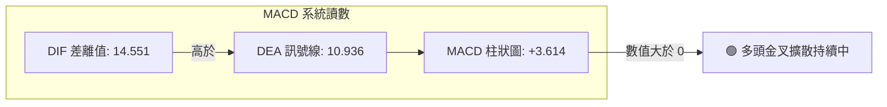

- **交叉狀態**：DIF 線 (14.551) 位於零軸上方，且強勢凌駕於 DEA 線 (10.936) 之上，維持強勢黃金交叉。
- **柱狀圖動能**：週線柱狀圖自前期的負值（2026-07-19 為 -15.169）經歷修復翻正，最新日線數據柱狀值進一步擴大至 **+3.614**，呈現多方動能增強格局。

### 📦 布林通道分析

```
日線布林通道 (20, 2) 結構圖：
$2482.75 ┬─────────────────────────────────────────── BB 上軌 (+1.48% 軌道寬度)
$2480.00 ┼───────────────────────────────────────■─── 當前現價 (%B = 0.98)
         │                                       ▲
         │                                       │ (短線壓制警戒區)
$2416.32 ┼───────────────────────────────────────┼─── BB 中軌 (MA20 生命線)
         │                                       │
$2349.89 ┴───────────────────────────────────────┴─── BB 下軌 (波動下限護城河)
```

- **指標讀數**：上軌 **$2482.75**，中軌 **$2416.32**，下軌 **$2349.89**。
- **%B 指標解析**：當前 **%B = 0.98**，代表價格已緊貼布林通道上軌邊緣（1.0 即觸及上軌）。
- **帶寬與行為**：
  - 布林帶寬 $(2482.75 - 2349.89) / 2416.32 = 5.50\%$，通道維持收窄走平狀態。
  - 在 ADX < 25 的盤整市況下，**%B 接近 1.0 通常意味著遭遇通道頂部阻力**，短線直接向上突破常容易引發假突破，後續多數伴隨回測中軌 $2416.32 的蓄勢動作。

### 💹 成交量分析（量價配合度）

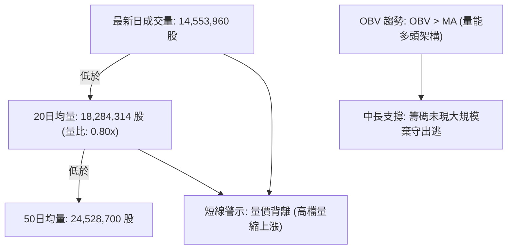

- **量能萎縮**：現量（14.55M）相較於 20日均量縮減 20%，相較 50日均量縮減 40.6%。在高檔逼近歷史高位時呈現量縮，顯示追高意願不足，市場觀望氣氛濃厚。
- **OBV 累積能量線**：OBV 指標持續位於其均線之上，證明雖然短線量能收縮，但先前主力吸籌沉澱良好，並未爆發主力高檔出貨的放量長黑，屬於標準的籌碼鎖定型高檔震盪。

---

## 6. 動能與波動率

### ⚡ 動能評估四象限

| 象限 | 動能強度 (RSI/MACD) | 波動率水準 (ATR/帶寬) | 當前判定 | 市場環境狀態與操作含義 |
|:---:|:---:|:---:|:---:|:---|
| **第一象限 (Q1)** | 強 (MACD紅柱/RSI>55) | 低 (ATR 1.48% / 窄幅) | **✓ 當前狀態** | **最佳控盤蓄勢區**：多頭主導但波動壓抑，多以階梯盤堅或收斂整理呈現，適合回調低吸。 |
| **第二象限 (Q2)** | 弱 (MACD死叉/RSI<45) | 低 (狹幅沈悶震盪) | — | 陰跌整理區：量能極度匱乏，資金效率低。 |
| **第三象限 (Q3)** | 強 (主升段爆發) | 高 (寬幅震盪/單日暴漲) | — | 高風險高收益：單邊主升爆發浪，追突破的最佳主場。 |
| **第四象限 (Q4)** | 弱 (恐慌性拋售) | 高 (長黑貫穿/停損湧現) | — | 極高風險區：嚴禁進場抄底，以避險離場為主。 |

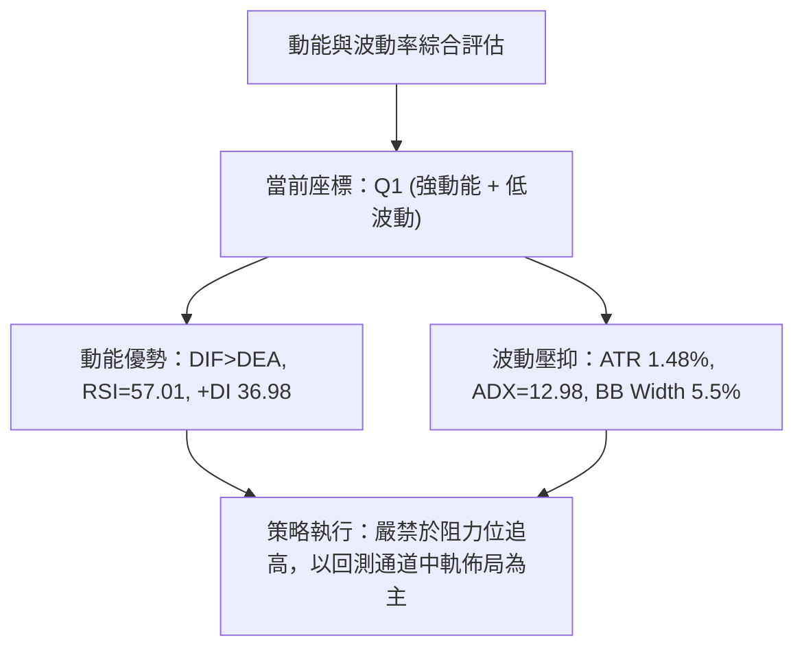

### 📊 ATR 波動率分析

- **ATR(14) 數值**：**$36.71**（佔現價 $2480.00 之比例僅為 **1.48%**）。
- **波動特徵**：日均振幅收斂在 $37 左右，反映當前多空雙方在高檔區域陷入微平衡，缺乏暴力洗盤動作。
- **交易止損保護距離測算**：
  - **保守型交易者（2.0 × ATR）**：保護緩衝空間應設定為 $36.71 \times 2 = \$73.42$。
    - 參考點位：自現價向下推導即為 $2480.00 - 73.42 = **\$2406.58**（緊密貼合 MA20 $2416.32 下方防守帶）。
  - **激進型交易者（1.5 × ATR）**：保護緩衝空間為 $36.71 \times 1.5 = \$55.07$。
    - 參考點位：$2480.00 - 55.07 = **\$2424.93**（貼合 MA5 $2424.60）。

### 📐 Beta 與市場相關性

- **Beta 係數**：**1.247**。
- **屬性解讀**：Beta > 1.0 表明 2330.TW 具備超越台灣加權指數（大盤）的波動彈性。大盤若上漲 1%，該股理論上漲約 1.25%；反之，大盤回調時其修正幅度亦將略微放大。在當前外資持股達 43.3% 且整體大牛市環境下，高 Beta 意味著具備極佳的波段超額報酬潛力。

---

## 7. 多時框架總結

### 📋 時框架評分表

| 時框架 | 趨勢方向 | 動能狀態 | 均線排列狀況 | 圖表形態識別 | 綜合評分 | 戰略操作建議 |
|--------|----------|----------|--------------|--------------|----------|--------------|
| **月線週期 (長期)** | 🟢 強烈看多 | 強勁擴張 | 完美多頭 (現價遠高於MA200) | 超級上升通道延伸 | 92 / 100 | 長期持有，無視短線波動 |
| **週線週期 (中期)** | 🟢 震盪看多 | 柱狀翻正 | 多頭墊高 (突破整理平台) | 上升三角中繼蓄勢 | 78 / 100 | 回踩重要支撐分批做多 |
| **日線週期 (短期)** | 🟡 遇阻整理 | 超買減速 | 均線多頭但布林觸頂 | 高檔矩形箱型通道 | 58 / 100 | 短線不追高，等待拉回低吸 |

### 🔲 綜合訊號矩陣

```
時框訊號一致性評估矩陣：
┌─────────────┬───────────┬───────────┬───────────┐
│ 分析維度    │ 短期 (日) │ 中期 (週) │ 長期 (月) │
├─────────────┼───────────┼───────────┼───────────┤
│ 趨勢方向    │ 🟡 區間   │ 🟢 多頭   │ 🟢 多頭   │
│ 均線系統    │ 🟢 看多   │ 🟢 看多   │ 🟢 看多   │
│ 動能 (MACD) │ 🟢 看多   │ 🟢 看多   │ 🟢 看多   │
│ 擺盪 (RSI/K)│ 🔴 超買   │ 🟡 中性   │ 🟢 健康   │
│ 量能配合    │ 🔴 量縮   │ 🟡 平緩   │ 🟢 充沛   │
├─────────────┼───────────┼───────────┼───────────┤
│ 矩陣結論    │ 衝突收斂  │ 中期主導  │ 方向燈塔  │
└─────────────┴───────────┴───────────┴───────────┘
```

### ⚖️ 多時框收斂結論

依據多時框收斂最高規則：
1. **行情屬性判定**：當前日線 **ADX(14) = 12.98 (< 25)**，嚴格判定當前屬於「**高檔盤整/無單邊強趨勢行情**」。
2. **時框優先級衝突解決**：
   - 雖然長期月線與中期週線展現無可爭辯的完美多頭牛市架構，但日線受制於布林上軌壓制（%B = 0.98）、隨機指標超買（%K = 85.84）以及成交量萎縮（量比 0.80x）。
   - 依收斂規則，盤整行情中應**以日線布林通道上下軌（$2349.89 - $2482.75）作為邊界參考**，不可將週線的長期多頭盲目套用為當前日線追價理由。
3. **最終唯一方向性結論**：**偏多高檔震盪整理（中性偏多）**。
   - 核心交易思維：**防禦性逢低做多**。不追突破，耐心等待股價回測日線布林中軌（MA20 $2416.32）或波段支撐位 S1（$2373.01）建立部位。

---

## 8. 交易策略建議

### 🗺️ 策略決策流程圖

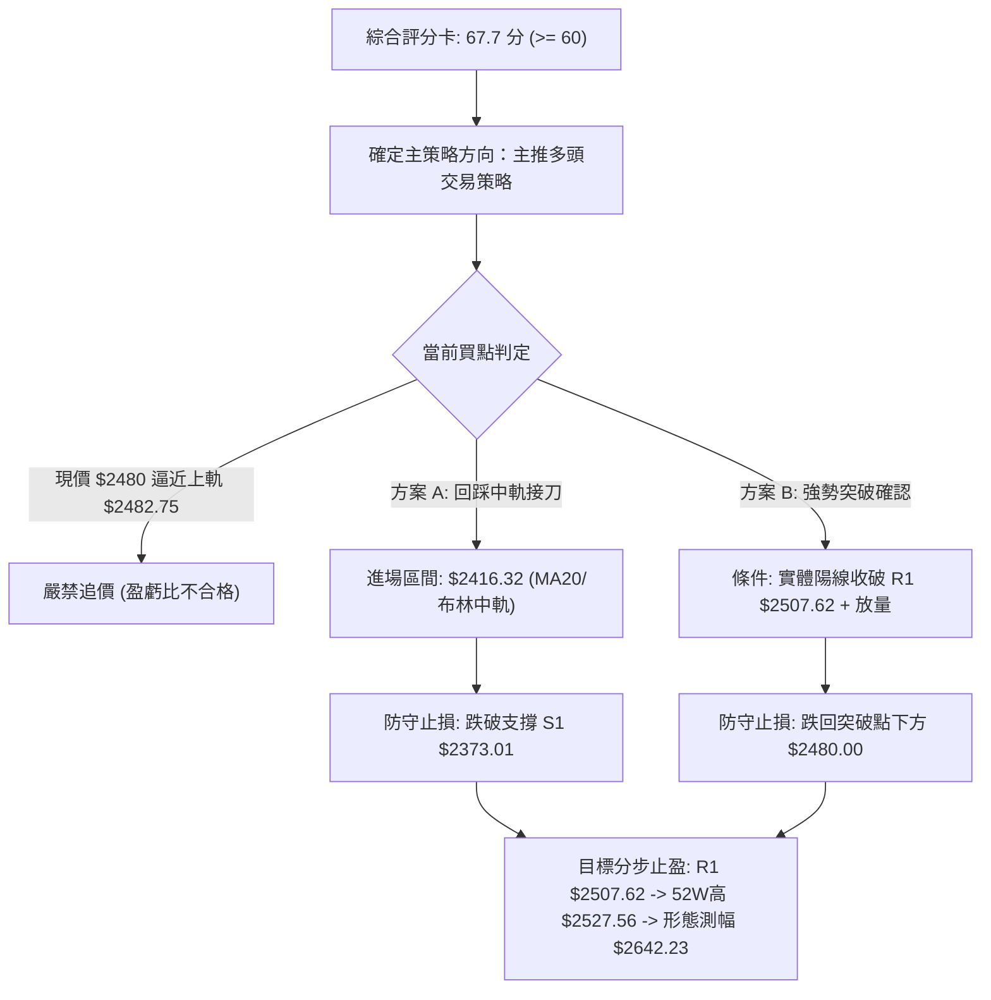

### 🧭 策略路由

> **當前主策略方向 = 主推多頭回調買進策略（依據綜合評分卡 67.7 / 100 偏多分流）**
> 
> 鑑於評分高於 60 分且全週期均線完美多頭，主策略全面偏多佈局；空頭方向僅列為極端破位時的「反轉風險對沖提示」，禁止在多頭排列下任意逆勢摸頂放空。

### 🎯 價格情境階梯（Price Scenarios）

| 觸發條件（嚴格引用關鍵價位） | 第一目標 | 後續延伸目標 | 情境技術面含義 |
|------------------------------|----------|--------------|----------------|
| **強勢突破 R1 ($2507.62)** | 52W 高點 $2527.56 | 箱型測幅目標 $2642.23 | 結束三個月高檔蓄勢，開啟新一輪爆發性主升浪 |
| **維持現價區間 ($2416.32 - $2482.75)** | 布林上軌 $2482.75 | 阻力 R1 $2507.62 | 均線持續靠攏，時間換取空間，消化高檔獲利盤 |
| **回調跌破 MA20 ($2416.32)** | 支撐 S1 $2373.01 | 布林下軌 $2349.89 | 短線動能衰竭，展開健康技術性回洗測支撐 |
| **深度跌破 S1 ($2373.01)** | 支撐 S2 $2323.16 | 支撐 S3 $2283.28 | 中期上升趨勢遭到破壞，進入日線級別深度整理 |

### 📊 情境機率分佈

```
情境機率分佈圓餅視圖：
高檔區間震盪蓄勢 (55%) : ███████████
向上突破挑戰新高 (30%) : ██████
回調測試深層支撐 (15%) : ███
```

| 未來走勢情境 | 機率預估 | 主要指標狀態依據 |
|--------------|:--------:|------------------|
| **高檔區間震盪蓄勢** | **55%** | ADX = 12.98 (極弱趨勢)；布林通道帶寬收窄；量比 0.80x 無法支撐單邊突破。 |
| **向上突破挑戰新高** | **30%** | 均線完美多頭；MACD 柱狀 +3.614 擴散；外資持股 43.3% 籌碼高度穩定。 |
| **回調測試深層支撐** | **15%** | Stoch %K 85.84 進入超買；股價緊貼上軌 %B 0.98，短線獲利回吐賣壓浮現。 |

### 🟢 主策略詳情

#### 策略 A：布林中軌穩健逢低買進策略（首選）
- **進場條件**：股價自布林上軌自然回落，回踩測試 MA20 與布林中軌有守，日K線收出下影線確認支撐。
- **進場價格**：**$2416.32**（精確對應 MA20 與布林中軌價位）。
- **止損價格**：**$2373.01**（精確引用波段支撐位 S1，跌破代表整理破位）。
- **目標價 T1**：**$2507.62**（精確引用阻力位 R1）。
- **目標價 T2**：**$2527.56**（精確引用 52W 歷史最高點）。
- **風險報酬比**：
  - 上行空間至 T1：$2507.62 - 2416.32 = \$91.30$
  - 下行風險至 止損：$2416.32 - 2373.01 = \$43.31$
  - **風險報酬比 (R:R) = 91.30 : 43.31 = 2.11 : 1**（符合高質量交易標準）。
- **成功機率估計**：**70%**。
- **建議倉位**：總投資資金之 **25%**。

#### 策略 B：突破高檔箱頂追擊策略（右側確認）
- **進場條件**：日線收盤價強勢突破阻力位 R1，且單日成交量放大超越 20日均量（> 18,284,314 股）。
- **進場價格**：**$2508.00**（以超越 R1 $2507.62 進行右側確認）。
- **止損價格**：**$2480.00**（以今日收盤價兼假突破回撤線作為嚴格止損）。
- **目標價 T1**：**$2527.56**（52W 歷史高點）。
- **目標價 T2**：**$2642.23**（高檔箱型整理等距測幅目標價，計算式詳見第3章）。
- **風險報酬比**：
  - 上行空間至 T2：$2642.23 - 2508.00 = \$134.23$
  - 下行風險至 止損：$2508.00 - 2480.00 = \$28.00$
  - **風險報酬比 (R:R) = 134.23 : 28.00 = 4.79 : 1**（優異的右側交易盈虧比）。
- **成功機率估計**：**60%**。
- **建議倉位**：總投資資金之 **15%**。

### 🔴 反向風險觸發點（對沖提示）

- **多頭反轉停損警戒點**：
  - 若日K線以帶量實體陰線跌穿 **支撐位 S1 ($2373.01)**，標誌著多頭矩形箱底失守。
  - **風控處置**：所有持股部位應立即減倉 50%，多頭策略全面終止，轉入中性防禦。
- **極端趨勢破壞觸發點**：
  - 若進一步跌破 **支撐位 S3 ($2283.28)**，跌破近20週最低收盤價防線，均線系統將發生死亡交叉。
  - **風控處置**：清空所有短線波段多單，可運用衍生性金融工具進行現貨部位 100% 對沖。

### ⭐ 整體訊號強度評星

```
╔══════════════════════════════════════════════════════════════╗
║                    整體技術訊號強度評星                      ║
╠══════════════════════════════════════════════════════════════╣
║ 做多訊號強度：★★★★☆ (4/5星) — 均線極度完備，唯缺放量突破推力║
║ 做空訊號強度：★☆☆☆☆ (1/5星) — 均線與動能全多頭，逆勢做空極危║
║ 整體可信度：  ★★★★☆ (4/5星) — 數據來源扎實，高檔震盪訊號吻合║
╚══════════════════════════════════════════════════════════════╝
```

---

## 9. 風險提示與監控

### ✅ 關鍵監控指標 Checklist

```
╔══════════════════════════════════════════════════════════════╗
║                 每日收盤關鍵監控指標清單                      ║
╠══════════════════════════════════════════════════════════════╣
║ [ ] 價格突破監控：收盤價是否實體站上 R1 ($2507.62)            ║
║ [ ] 均線防禦監控：收盤價是否維持在 MA20 ($2416.32) 之上       ║
║ [ ] 箱底極限監控：日內最低價是否守住支撐 S1 ($2373.01)       ║
║ [ ] 擺盪指標監控：Stochastic %K 是否自超買區 (>80) 產生死亡交叉║
║ [ ] 通道收斂監控：布林通道帶寬是否擴張，%B 是否脫離 0.98 極端║
║ [ ] 成交量能監控：日成交量是否回升至 18,284,314 股基準量之上 ║
║ [ ] 趨勢甦醒監控：ADX(14) 讀數是否由 12.98 開始上揚突破 20  ║
╚══════════════════════════════════════════════════════════════╝
```

### ⚠️ 風險場景分析

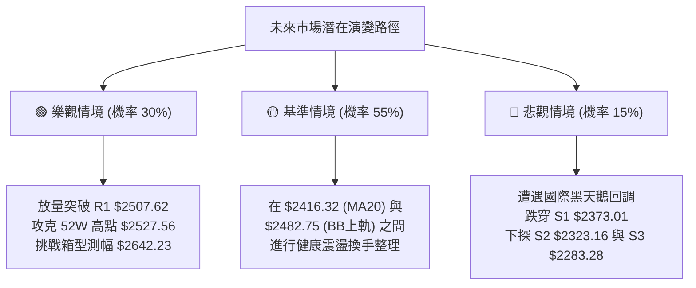

### 🛡️ 風險管理重要提醒

1. **嚴防高檔量價背離追高風險**：
   - 當前成交量比僅 0.80x，且 %B 達 0.98，代表現價直接往上推升將面臨無量拉升的脆弱陷阱。切忌在現價 $2480.00 處重倉追漲，應耐心等候回踩或帶量右側突破。
2. **波動率定錨與資金管理法則**：
   - 目前 ATR(14) 為 $36.71，單日正常波動極限約為 ±$37。單筆交易所承擔的最大帳面虧損額度，嚴格控制在總投資資本的 **1.0% – 1.5%** 範圍內。
   - 依據策略 A 之止損間距 $43.31 計算，若總資產為 1,000 萬元新台幣，單次停損上限為 10 萬元，則最大部位建立上限為 $100,000 / 43,310 \approx 2.3$ 張，絕不可因均線全數多頭而進行過度槓桿押注。
3. **高 Beta 波動共振防範**：
   - 2330.TW 之 Beta 值為 1.247，具備放大大盤跌幅之屬性。若美股半導體板塊（SOX）或台股大盤出現系統性急跌，個股支撐位恐受衝擊短暫下穿，操作上應以**日線收盤價**作為有效跌破之判定標準，避免被盤中假跌破掃出場。

---

## 📋 報告總結

```
╔════════════════════════════════════════════════════════════════╗
║                   2330.TW 技術分析報告總結                     ║
╠════════════════════════════════════════════════════════════════╣
║ 報告日期：2026-09-22                                           ║
║ 當前價格：$2480.00                                             ║
║ 分析評級：🟢 偏多高檔震盪整理 (技術綜合評分: 67.7 / 100)        ║
║                                                                ║
║ 核心結構結論：                                                 ║
║ ├─ 長期趨勢：🟢 強烈看多 (現價遠高於 MA200 達 +20.54%)        ║
║ ├─ 中期趨勢：🟢 震盪看多 (波段築底完成，週 MACD 翻正 +3.614)   ║
║ ├─ 短期趨勢：🟡 高檔盤整 (ADX 12.98 指示缺乏單邊趨勢，量縮遇阻) ║
║ ├─ 關鍵阻力：R1: $2507.62 ｜ 52W極致高點: $2527.56            ║
║ ├─ 關鍵支撐：MA20: $2416.32 ｜ S1: $2373.01 ｜ S3: $2283.28    ║
║ └─ 外資券商共識：Strong Buy ｜ 平均目標價: $3236.12            ║
║                                                                ║
║ 最優交易執行方案：                                             ║
║ 1. 🥇 最佳機會 (策略 A)：回踩 MA20/布林中軌 $2416.32 逢低分批接 ║
║    (目標價 T1: $2507.62 / 止損: $2373.01 / 風險報酬比: 2.11:1)  ║
║ 2. 🥈 次選機會 (策略 B)：強勢放量實體突破 R1 $2507.62 後追擊   ║
║    (目標價 T2: $2642.23 / 止損: $2480.00 / 風險報酬比: 4.79:1)  ║
║ 3. 🥉 保守選擇：空手觀望，靜待日線量能回升至 18M 以上再行定奪 ║
╚════════════════════════════════════════════════════════════════╝
```

---

> ⚠️ **免責聲明**：本報告為頂級量化與技術分析框架自動生成，所有數據、圖表及推算均嚴格基於歷史客觀數據（OHLCV）。本報告**僅供學術研究與投資架構參考**，**不構成任何形式之個人化投資要約或買賣建議**。金融市場瞬息萬變，交易決策應獨立審慎，入市需嚴格落實風控與停損紀律。

---

*報告生成時間：2026-09-22 ｜ 數據來源：Yahoo Finance ｜ 分析框架：多時框技術分析體系*