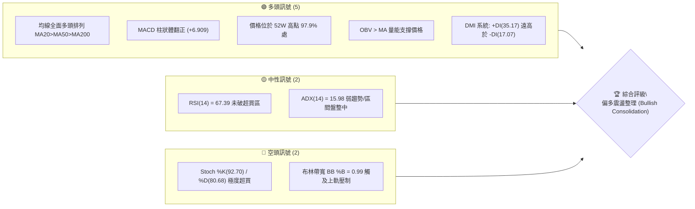
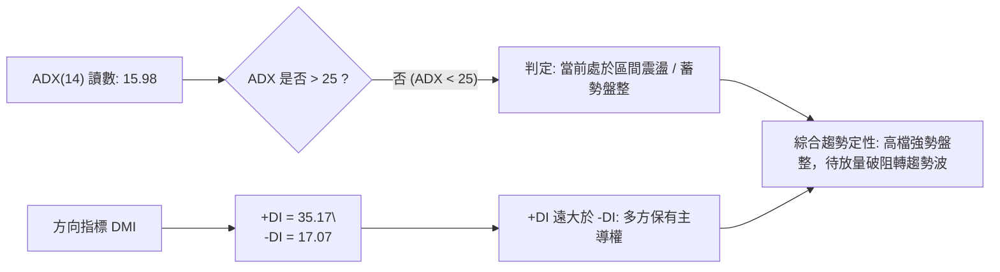
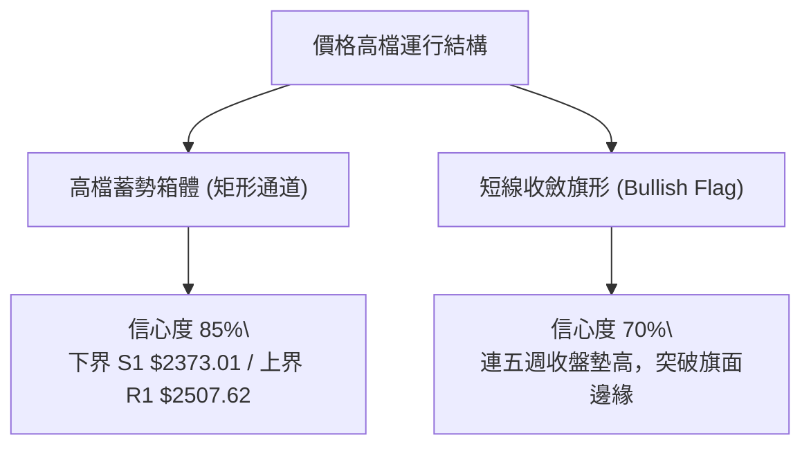
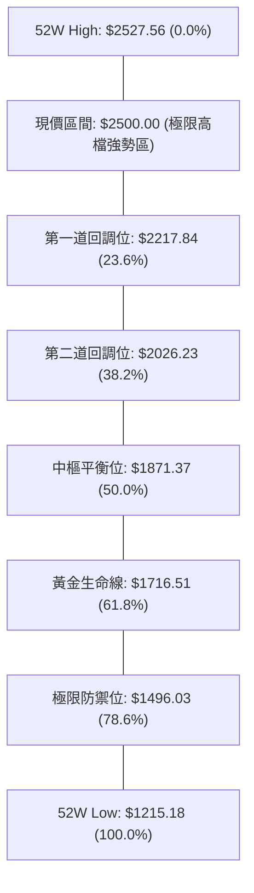
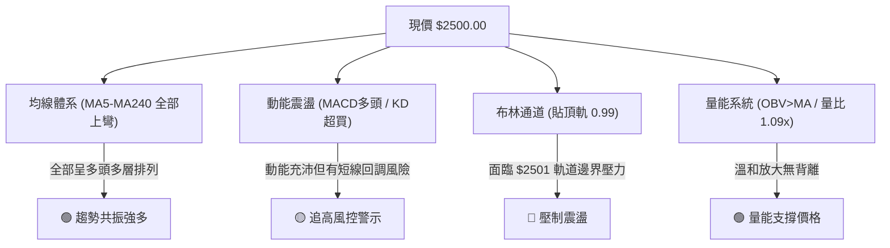
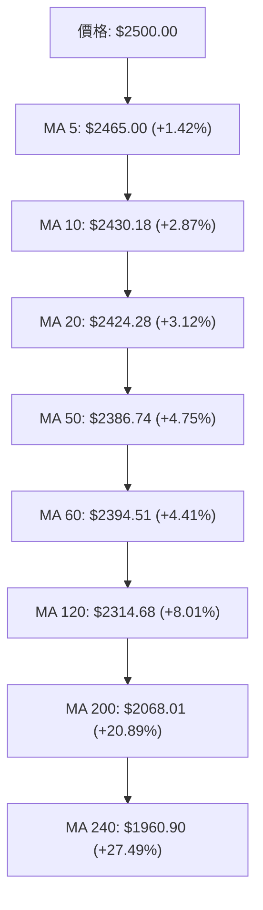
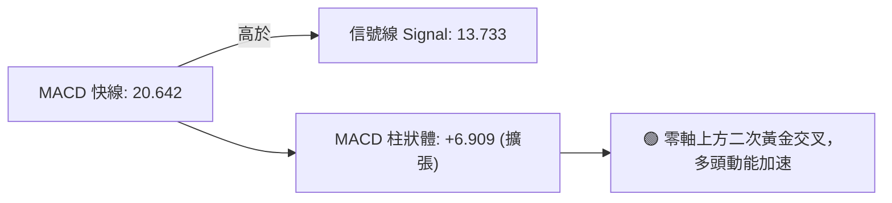
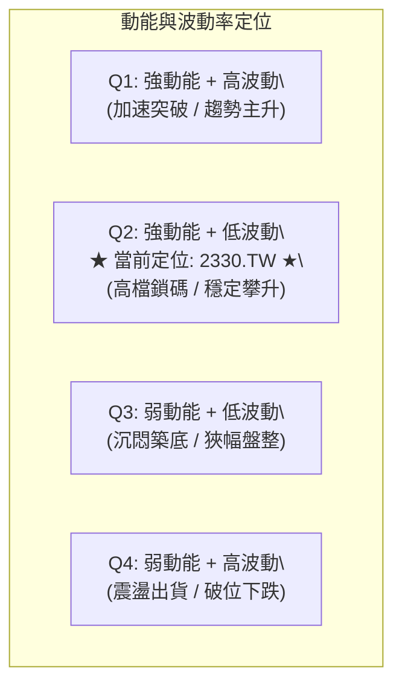
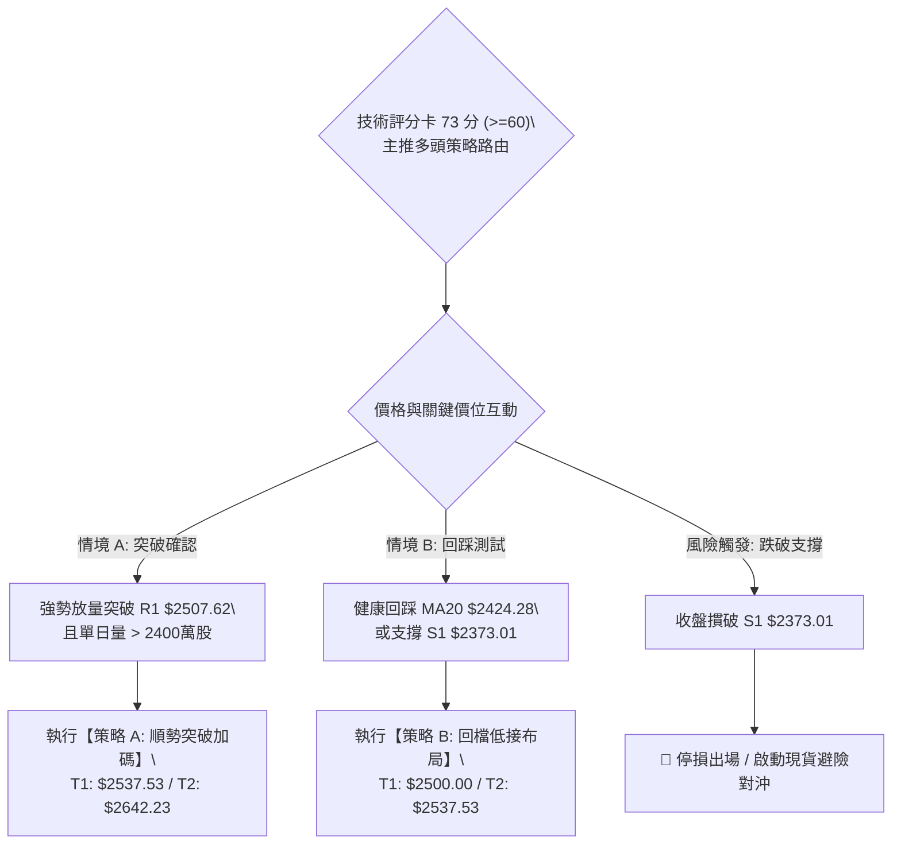
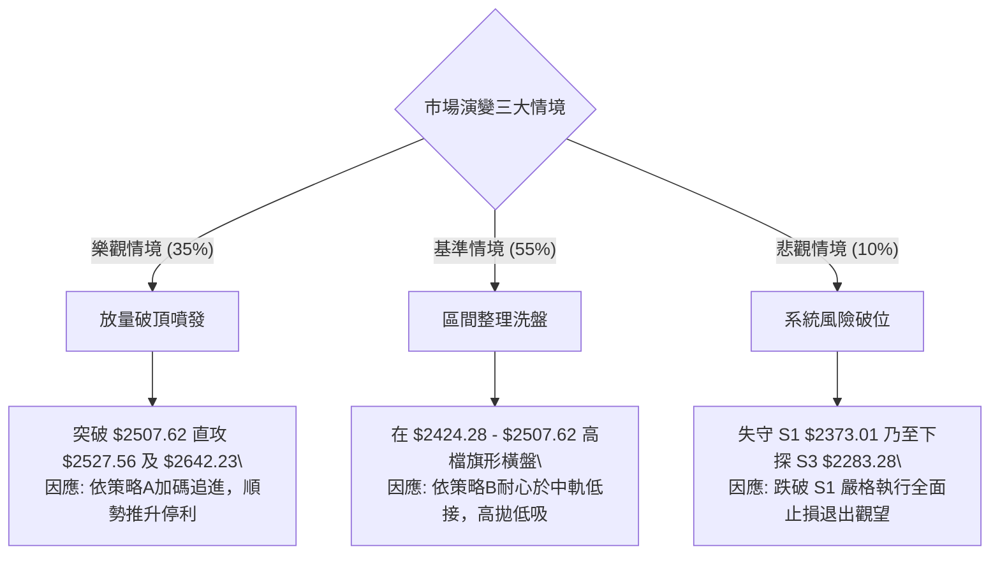

# 2330.TW 技術分析報告

> **報告日期**：2026-09-23 ｜ **語言**：繁體中文 ｜ **數據來源**：Yahoo Finance ｜ **當前價格**：$2500.00

---

## 目錄

| 章節 | 內容 |
|------|------|
| [1. 技術面概覽](#1-技術面概覽) | 訊號儀表板、核心指標、評分卡 |
| [2. 趨勢分析](#2-趨勢分析) | 多時框趨勢、長中短期走勢 |
| [3. 圖表形態分析](#3-圖表形態分析) | 形態識別、K線組合、目標價 |
| [4. 支撐與阻力](#4-支撐與阻力) | 關鍵價位、斐波那契回調 |
| [5. 技術指標深度解讀](#5-技術指標深度解讀) | MA/RSI/MACD/布林/成交量 |
| [6. 動能與波動率](#6-動能與波動率) | 動能評估、ATR、Beta |
| [7. 多時框架總結](#7-多時框架總結) | 時框架評分矩陣 |
| [8. 交易策略建議](#8-交易策略建議) | 多空策略、風險報酬比 |
| [9. 風險提示與監控](#9-風險提示與監控) | 監控指標、風險場景 |

---

## 1. 技術面概覽

### 🎯 技術訊號儀表板



### 📊 核心指標速覽表

| 指標類別 | 指標名稱 | 當前數值 | 訊號 | 解讀 |
|----------|----------|----------|------|------|
| **價格** | 當前收盤價 | $2500.00 | 🟢 | 逼近歷史高位 $2527.56，多方掌控絕對優勢 |
| **均線** | 短期 MA20 | $2424.28 | 🟢 | 現價高於 MA20 達 +3.12%，短多架構穩固 |
| **均線** | 中期 MA50 | $2386.74 | 🟢 | 現價高於 MA50，中期上升軌道健康無虞 |
| **均線** | 長期 MA200 | $2068.01 | 🟢 | 現價高於 MA200 達 +20.89%，超長期多頭格局 |
| **動能** | RSI(14) | 67.39 | 🟡 | 位於強勢多頭區間，尚未進入嚴重超買 (>=70) |
| **動能** | MACD Hist | +6.909 | 🟢 | 快慢線黃金交叉後擴散，多頭動能加速釋放 |
| **動能** | KD(9,3,3) | %K 92.70 / %D 80.68 | 🔴 | 進入深度超買鈍化區，短線隨時有技術性回洗需求 |
| **趨勢** | ADX(14) | 15.98 | 🟡 | 數值低於 25，顯示價格在高檔進行箱形整理累積量能 |
| **通道** | BB %B | 0.99 | 🔴 | 貼近布林上軌 ($2501.04)，面臨通道邊界反壓 |
| **量能** | OBV / 量比 | 1.09x (OBV>MA) | 🟢 | 量能微幅增溫，價量配合良好，無出貨背離現象 |
| **波動** | ATR(14) | $38.16 | 🟡 | 佔股價 1.53%，處於常態健康波動率水平 |

### 🏆 技術評分卡

```
╔══════════════════════════════════════════════════════════════╗
║               技術評分卡 — 2330.TW (2026-09-23)              ║
╠══════════════════════════════════════════════════════════════╣
║ 趨勢強度 (Trend)      ██████████████░░░░░░  70/100  🟢 中強趨勢 ║
║ 動能指標 (Momentum)   ████████████░░░░░░░░  60/100  🟡 高檔鈍化 ║
║ 支撐穩定度 (Support)  ████████████████░░░░  80/100  🟢 密集支撐 ║
║ 成交量配合 (Volume)   ████████████░░░░░░░░  60/100  🟡 常態溫和 ║
║ 形態完整度 (Pattern)  ██████████████░░░░░░  70/100  🟢 矩形蓄勢 ║
║ 均線排列 (Moving Avg) ████████████████████ 100/100  🟢 完美多頭 ║
╠══════════════════════════════════════════════════════════════╣
║ 綜合評分              ███████████████░░░░░  73/100  🟢 偏多主導 ║
╚══════════════════════════════════════════════════════════════╝
```

---

## 2. 趨勢分析

### 🌐 多時框趨勢分析

```mermaid
graph TD
    A["月線框架 (長線)"] -->|"收盤創近歷史新高 / 均線發散向上"| B["🟢 強力多頭 (Bull Trend)"]
    C["週線框架 (中線)"] -->|"近4個月於 $2300-$2500 箱形構築平台"| D["🟢 高檔箱體整理 (Consolidation)"]
    E["日線框架 (短線)"] -->|"沿 MA5("$2465") 推升，緊貼布林上軌"| F["🟡 超買強攻但面臨 R1 阻力"]
    B --> G{"多時框共振收斂"}
    D --> G
    F --> G
    G --> H["長線多頭保護短線，逢回測中軌皆為布局點"]
```

### 📈 長期趨勢 — 12個月走勢圖（Unicode）

```
2330.TW 月線走勢圖（過去12個月：2025-10 至 2026-09）
價格軸 ($)
$2500 ┤                                                 ● ($2500)
$2400 ┤                                   ●━━━━━●━━━●
$2300 ┤                             ●
$2100 ┤                       ●
$1900 ┤                 ●
$1700 ┤           ●     │     ●
$1500 ┤     ●━━━━━│━━━━━●
$1400 ┤  ●
$1200 ┤
      └─────────────────────────────────────────────────────
       10  11    12    01    02    03    04    05    06-08   09 (月份)
      (2025)                         (2026)
```

**走勢特徵分析表格**：

| 階段區間 | 起訖月份 | 起訖價格 ($) | 區間漲跌幅 | 結構特徵與走勢分析 |
|----------|----------|--------------|------------|--------------------|
| 主升起漲波 | 2025/10 - 2026/02 | $1481.83 → $1977.40 | +33.44% | 沿五月線單邊飆升，量能持續擴張，奠定多頭基石 |
| 波段深幅洗盤 | 2026/02 - 2026/03 | $1977.40 → $1750.17 | -11.49% | 急跌回測長線支撐，清洗浮額，指標快速修正過熱 |
| 二度突破推升 | 2026/03 - 2026/06 | $1750.17 → $2402.93 | +37.30% | 連續4根大紅K棒穿透兩千元整數關卡，創歷史新頁 |
| 高檔矩形蓄勢 | 2026/06 - 2026/09 | $2402.93 → $2500.00 | +4.04% | 股價於 $2300 - $2500 構築強勢換手箱體，等待續攻 |

### 📊 中期趨勢（週線分析）

從近20週數據觀察，自 2026-05 底以來的收盤價基本維持在 $2242.40 至 $2500.00 之間。近六週（08-23 至 09-27）每週收盤價由 $2402.93、$2412.90、$2402.93、$2402.93 連續橫盤，至 09-20 跳升至 $2460.00，最新週收盤直攻 $2500.00。週 MACD 柱狀體亦由負翻正並走升至 +6.909，週 RSI 回升至 67.4，週線結構呈現典型的「高檔旗形箱體突破」初期。

```
中期支撐與壓力拓撲示意圖：
$2527.56 ─────────────────────────── [52W 歷史最高點]
$2507.62 ═══════════════════════════ [波段高點阻力 R1 / 即時天花板]
$2500.00 ··························· ◄ 目前收盤價 (蓄勢挑戰突破)
$2424.28 --------------------------- [MA20 / 布林中軌動態支撐]
$2373.01 ═══════════════════════════ [第一道實體防線 S1]
$2323.16 ═══════════════════════════ [第二道防守大關 S2]
$2283.28 ═══════════════════════════ [波段回撤低點強支撐 S3]
```

### ⚡ 趨勢強度評估（ADX 解讀）



**ADX 強度分級對照與當前定性**：

| 指標變數 | 當前讀數 | 門檻區間 | 趨勢屬性定性 | 戰術因應原則 |
|----------|----------|----------|--------------|--------------|
| **ADX(14)** | **15.98** | < 25 (弱趨勢) | 高檔橫盤無單邊暴衝趨勢 | 適用布林通道與箱體邊界操作，勿盲目追價 |
| **+DI** | **35.17** | > 30 (強多) | 買方力道佔據絕對優勢 | 空方無反撲條件，回調幅度有限 |
| **-DI** | **17.07** | < 20 (弱空) | 空方拋壓疲弱無力 | 不宜盲目放空，下跌多屬量縮整理 |

---

## 3. 圖表形態分析

### 🔍 形態識別系統

依據近 24 個月及近 20 週收盤走勢，嚴格遵循無偏見形態量化法則識別圖表構造：



| 形態名稱 | 信心度 | 判斷依據（引用數據） | 完成度 | 目標價（附嚴謹計算式） |
|----------|--------|----------------------|--------|------------------------|
| **高檔矩形整理箱體** | 85% | 價格在 S1 ($2373.01) 至 R1 ($2507.62) 間震盪整理數週 | 90% | 突破 R1 後：$2507.62 + ($2507.62 - $2373.01) = **$2642.23** |
| **多頭旗形突破 (週線)** | 70% | 08-02觸及高點回落至 $2363.04 後，連續六週碎步收紅推升 | 80% | 旗桿底 $2283.28 至頂 $2417.88 (高 134.6)；$2402.93 + 134.6 = **$2537.53** |
| **頭肩底 / 雙底反轉** | < 30% | 歷史處於歷史最高位區間，無大級別反轉底座可言 | 0% | 數據中未偵測到底部反轉形態，不予預估 |

### 🕯️ 重要K線形態分析

| 週/月份 | 收盤價 ($) | 實體特徵與K線組合 | 技術面深層解讀 | 訊號 |
|---------|------------|-------------------|----------------|------|
| 2026-07-19 (週) | $2283.28 | 長下影長陰線探底 | 空方力竭，觸及近一年波段低點聚類 S3，浮額洗淨 | 🟢 底測成功 |
| 2026-08-02 (週) | $2417.88 | 巨量大陽線反包 (2.17億股) | 主力多頭強勢回補，確認 $2283.28 為波段鐵底 | 🟢 強烈買訊 |
| 2026-08-23 至 09-13 | $2402.93 | 連續四週收盤完全相同十字星鏈 | 極端平衡橫盤，籌碼充分沉澱鎖碼，波幅收斂 | 🟡 變盤前兆 |
| 2026-09-20 (週) | $2460.00 | 中實體突破週陽線 | 脫離四週沉悶整理平台，多頭正式表態上攻 | 🟢 多頭點火 |
| 2026-09-27 (即時) | $2500.00 | 光頭強勢大陽棒 | 兵臨 $2500 整數心理大關，多頭兵鋒正盛 | 🟢 趨勢延續 |

### 📉 ASCII 走勢形態示意圖

```
2330.TW 矩形箱體與旗形突破組合結構圖：
$2527.56 ────────────────────────────────────── [52W High]
$2507.62 ═══════════╦══════════════════════════ [箱頂阻力 R1]
$2500.00            ║                   ▲ [現價: 突破前夕]
$2460.00            ║             ╭─────╯
$2402.93 ───────────╨──●───●───●─╯  [中軸洗盤換手線]
$2373.01 ══════════════╦═══════════════════════ [箱底支撐 S1]
$2323.16               ║                        [強支撐 S2]
$2283.28 ══════════════╩═══════════════════════ [形態絕對低點 S3]
         └─────────────┴───────────────────────
           07/19      08/23 - 09/13     09/27
```

### 🎯 形態目標價計算

1. **矩形垂直高度測幅法**：
   - 形態箱底基準點為波段低點聚類 **S1: $2373.01**
   - 形態箱頂突破點為波段高點聚類 **R1: $2507.62**
   - 形態等幅高度 $H = R1 - S1 = \$2507.62 - \$2373.01 = \$134.61$
   - **目標價 1 (保守)**：$R1 + H = \$2507.62 + \$134.61 = \mathbf{\$2642.23}$

2. **多頭旗形突破測幅法**：
   - 旗桿起點為 2026-07-19 週收盤 **S3: $2283.28**
   - 旗桿終點為 2026-08-02 週收盤 **$2417.88**，旗桿高度 $H_{flag} = \$2417.88 - \$2283.28 = \$134.60$
   - 突破啟動點為四週平台盤整高點 **$2402.93**
   - **目標價 2 (延伸)**：$\$2402.93 + H_{flag} = \mathbf{\$2537.53}$（略高於52W歷史高點 $2527.56）

---

## 4. 支撐與阻力

### 🗺️ 關鍵價位分布圖（Unicode）

```
2330.TW 價位結構分布圖
═════════════════════════════════════════════════════════════
$2527.56 ║████████████████████████║ 歷史極限 (52W High / 斐波 0.0%)
$2507.62 ║████████████████████    ║ 關鍵阻力 R1 (近一年波段高點聚類)
$2500.00 ╠════════════════════════╣ ◄ 現價 (挑戰突破 R1 前線)
$2424.28 ║▓▓▓▓▓▓▓▓▓▓▓▓▓▓▓▓        ║ 短期均線支撐 (MA20 / 布林中軌)
$2373.01 ║████████████████████████║ 核心支撐 S1 (波段低點聚類)
$2323.16 ║████████████████        ║ 延伸支撐 S2 (波段次低點聚類)
$2283.28 ║████████████████████████║ 鐵底防線 S3 (近一年波段深谷低點)
$2217.84 ║▓▓▓▓▓▓▓▓▓▓▓▓            ║ 斐波那契 23.6% 回調防線
═════════════════════════════════════════════════════════════
```

### 🚧 阻力位分析表

| 阻力級別 | 精確價位 | 形成原因（嚴格引用數據庫） | 突破難度 | 戰略重要性 |
|----------|----------|----------------------------|----------|------------|
| **R1** | **$2507.62** | 近一年波段高點聚類，布林上軌 ($2501.04) 緊鄰之實體反壓 | 🟡 中等 (需日成交量大於 2400 萬股) | ★★★★☆ 短線強弱分水嶺 |
| **52W High** | **$2527.56** | 過去 52 週歷史極值天花板，全市場獲利解套賣壓匯集處 | 🔴 極高 (需連續推升動能) | ★★★★★ 多頭全面奔馳閘門 |

*(註：數據包中近一年高點聚類阻力僅識別出 R1: $2507.62，R2/R3 層級數據未偵測到，不予任意捏造)*

### 🛡️ 支撐位分析表

| 支撐級別 | 精確價位 | 形成原因（嚴格引用數據庫） | 守住機率 | 戰略重要性 |
|----------|----------|----------------------------|----------|------------|
| **S1** | **$2373.01** | 近一年波段低點聚類，貼近 MA50 ($2386.74) 與 MA60 ($2394.51) | 85% | ★★★★★ 多頭防守第一線 |
| **S2** | **$2323.16** | 近一年波段次低點聚類，與 MA120 ($2314.68) 半年線匯聚共振 | 90% | ★★★★☆ 中期多空生命線 |
| **S3** | **$2283.28** | 2026-07-19 所創波段實體低點聚類，高檔箱型絕對底座 | 95% | ★★★★★ 長期多頭不可跌破鐵底 |

### 📐 斐波那契回調位分析

依據 52 週完整循環低點 **$1215.18** 至高點 **$2527.56**（全區間跨度 $1312.38）計算之標準黃金分割回調位：



**深層解讀**：
當前市價 **$2500.00** 緊扣 0.0% 歷史頂部附近（位於 52W 區間 97.9% 處），遠遠運作於 23.6% 回調位 **$2217.84** 之上，甚至比波段鐵底 **S3 ($2283.28)** 還要高出 216.72 元。在幾何結構上，這代表該標的完全處於「超強多頭發散（Super Bullish Extravaganza）」階梯，中長期回撤連 23.6% 都未曾觸碰，下檔安全邊際極其寬廣。

---

## 5. 技術指標深度解讀

### 🎛️ 指標訊號總覽



### 📈 移動平均線排列分析



均線系統呈現無可挑剔的**標準多頭排列（Bullish Perfect Order）**：
- 短天期 MA5 > MA10 > MA20，速率陡峭上揚，微觀推升力道強勁。
- 中天期 MA50 ($2386.74) 與 MA60 ($2394.51) 平滑墊高，構成紮實的中期買盤保護。
- 長天期 MA120 ($2314.68)、MA200 ($2068.01)、MA240 ($1960.90) 斜率穩定向右上 45 度發散，長多循環週期極為穩固。

### 📉 RSI(14) 分析

- **RSI(14) 數值**：**67.39**
- **數值視覺化**：`[████████████████░░░░░░░░] 67.39%`
- **超買超賣判定**：數值處於 60-70 的多頭攻擊強勢區，尚未越過 70 的過熱紅線，亦無進入 80 以上極端危險區。
- **背離分析**：
  - 價格自 2026-07-05 高點 $2437.82（對應 RSI 60.8）震盪走高至當前 $2500.00，RSI 同步擴張至 67.39。
  - **結論：無頂背離、無底背離**。RSI 峰值與價格波峰同步創高，指標對上漲行情的真實性提供正向確認。

### 📊 MACD(12/26/9) 訊號解讀



- 快線 (20.642) 明顯凌駕於慢線 (13.733) 之上，兩者均在零軸上方運行，屬於典型的多頭主控場域。
- MACD 柱狀圖讀數為 **+6.909**，相較前幾週的低位盤整（如 09-06 的 +0.024、09-20 的 +0.062），展現明顯的動能放大跡象，且無任何負向柱狀背離，預示價格具備持續衝擊高點之動能。

### 📦 布林通道分析

```
布林通道 (20, 2) 結構示意圖：
$2501.04 ═════════════════════════════════════ 上軌 (BB Upper)
$2500.00 ····································· ◄ 現價 ($2500.00, %B = 0.99)
$2424.28 ───────────────────────────────────── 中軌 (MA20 Baseline)
$2347.52 ═════════════════════════════════════ 下軌 (BB Lower)
```

- **通道帶寬**：Bandwidth = $(\$2501.04 - \$2347.52) / \$2424.28 = 6.33\%$，處於中度收斂後微幅開口的狀態。
- **相對位置 %B**：高達 **0.99**，現價幾乎死貼在布林上軌 $2501.04。
- **行情特性解讀**：%B 貼近 1.0 表明短線爆發力強，但根據均值回歸原理，當 ADX 低於 25 時，股價在未放大量能突破布林上軌時，極易引發短線拉回，往中軌 **$2424.28** 進行修復回測。

### 💹 成交量分析（量價配合度）

```
成交量結構分析：
當日成交量:  ████████████████░░░░  20,406,553 股
20日均量:   ███████████████░░░░░  18,726,393 股  (量比: 1.09x 🟢 溫和增量)
50日均量:   ████████████████████  24,032,835 股  (尚未達到大波段噴量水平)
```

- **OBV 能量潮趨勢**：數據明確標示「OBV > MA」，能量潮指標保持在均線上方運行，顯示資金長線淨流入，主力籌碼鎖定度高。
- **量價配合評估**：
  - 現價自 $2402.93 推升至 $2500.00，伴隨單日量放大至 2040 萬股（量比 1.09x），呈現「價漲量增」良性循環。
  - 但對比 50 日均量 2403 萬股，當前量能僅屬「溫和推進」，並未出現投機過熱的「爆量滯漲」或「失控天量」，為高檔籌碼換手提供了極佳的穩定性。

---

## 6. 動能與波動率

### ⚡ 動能評估四象限



| 象限區塊 | 動能強度 | 波動率水準 | 當前落點 | 戰術戰略解讀 |
|----------|----------|------------|----------|--------------|
| **Q1** | 強 | 高 | — | 投機買盤活躍，震盪幅度大，宜緊設移動停利 |
| **Q2** | **強** | **低/中** | **✓ (2330.TW)** | **最佳趨勢運行態勢：籌碼高度鎖定，穩步攀升，風險收益比最優** |
| **Q3** | 弱 | 低 | — | 缺乏市場關注度，宜耐心等待出訊號 |
| **Q4** | 弱 | 高 | — | 空頭或混亂行情，資金消耗極快，嚴禁介入 |

### 📊 ATR 波動率分析

- **ATR(14) 數值**：**$38.16**
- **波動率佔比**：$\$38.16 / \$2500.00 = \mathbf{1.53\%}$
- **波動環境判定**：每日平均振幅僅 1.53%，反映台積電在兩千五百元大關附近的控盤極具節奏，屬於**健康低噪聲波動環境**。
- **動態止損距離設定建議**：
  - **激進型短線交易（1.0 × ATR）**：止損距離為 $38.16，現價下限為 **$2461.84**（約略跌破 MA5）。
  - **標準波段交易（2.0 × ATR）**：止損距離為 $76.32，現價下限為 **$2423.68**（精準吻合 MA20 支撐 $2424.28）。
  - **長線趨勢防守（3.0 × ATR）**：止損距離為 $114.48，現價下限為 **$2385.52**（精準對接 MA50 支撐 $2386.74 及 S1 $2373.01）。

### 📐 Beta 與市場相關性

- **Beta 係數**：**1.247**
- **敏感度解讀**：Beta > 1 顯示該標的對大盤（加權指數）具備放大聯動性。當大盤上揚 1% 時，台積電預期平均波動 1.247%；具備極佳的市場進攻性與領導標竿效應。在多頭氛圍下，高 Beta 能有效帶動資產組合超越大盤基準指數。

---

## 7. 多時框架總結

### 📋 時框架評分表

| 時框架 | 趨勢方向 | 動能表現 | 均線排列狀況 | 圖表形態識別 | 綜合評分 | 操作建議方向 |
|--------|----------|----------|--------------|--------------|----------|--------------|
| **月線 (長期)** | 🟢 強烈向上 | 🟢 強大推升 | 完美多頭發散 | 歷史主升浪推展 | **90 / 100** | 核心長多持股續抱 |
| **週線 (中期)** | 🟢 多頭主導 | 🟢 柱體擴張 | 均線穩步多排 | 高檔箱體向上突破 | **80 / 100** | 逢回測買進波段布局 |
| **日線 (短期)** | 🟡 偏多震盪 | 🔴 KD超買/貼上軌 | 多頭但乖離擴大 | 逼近 R1 阻力 | **65 / 100** | 不宜盲目追價，待拉回接 |

### 🔲 綜合訊號矩陣

```
時框共振度分析：
┌─────────────────────────────────────────────────────────────┐
│ 短期 (日線) ───►  [多頭排列] + [KD鈍化] + [觸及布林頂軌]     │
│       │ 衝突點: 動能良好但面臨 $2507.62 (R1) 短線反壓       │
│ 中期 (週線) ───►  [放量推升] + [MACD翻正] + [箱頂蓄勢]      │
│       │ 共振點: 突破近4個月 $2300-$2420 平台，方向確立      │
│ 長期 (月線) ───►  [歷史高檔] + [OBV多方] + [遠高於均線]     │
└─────────────────────────────────────────────────────────────┘
```

### ⚖️ 多時框收斂結論

嚴格遵循多時框收斂規則第 14 條：
1. **行情定性**：當前日線 **ADX(14) 為 15.98 (< 25)**，嚴格判定為**高檔箱型盤整 / 蓄勢震盪行情**，而非無序噴發的單邊暴衝。
2. **時框優先級**：在盤整蓄勢格局下，日線不可過度樂觀追逐高點，交易邊界受制於布林上軌 ($2501.04) 及近一年阻力 R1 ($2507.62)。然而，週線與月線之 MA50 ($2386.74)、MA200 ($2068.01) 結構保持極為強烈的向上推力，因此多時框整合判定為：**「大趨勢堅定偏多，短線受制於 R1 進行區間整固」**。
3. **唯一方向性結論**：**🟢 偏多主導，拉回布局（Bullish on Dips）**。排除盲目做空選項，短線嚴禁於 $2500 之上追漲，耐心等待回踩短期支撐確立後順勢做多。

---

## 8. 交易策略建議

### 🗺️ 策略決策流程圖



### 🧭 策略路由（依評分卡分流）

> **當前主策略方向 = 🟢 多頭偏多操作（依綜合評分 73/100，≥60 強制主推多頭策略）**

根據評分卡分流紀律，空頭不可作為獨立進場策略，僅作為持倉風險監控點。

### 🎯 價格情境階梯（Price Scenarios）

所有價位精確引用自第 4 章及數據庫波段聚類點：

| 觸發條件 | 下一目標 | 後續延伸 | 情境含義與技術演繹 |
|----------|----------|----------|--------------------|
| **強勢突破 R1 ($2507.62)** | **$2527.56** (52W High) | **$2642.23** (形態測幅) | 短線盤整結束，展開新一波歷史主升浪擴展 |
| **受阻現價區間 ($2500.00)** | **$2424.28** (MA20中軌) | **$2373.01** (核心支撐 S1) | 高檔布林帶壓制回洗，屬良性技術換手消化浮額 |
| **放量跌破 S1 ($2373.01)** | **$2323.16** (延伸支撐 S2) | **$2283.28** (鐵底防線 S3) | 中期多頭架構轉弱，回撤測試大型箱體下邊緣 |

### 📊 情境機率分佈

| 價格運行情境 | 發生機率 | 主要判定依據（引用指標與數據） |
|--------------|----------|--------------------------------|
| **高檔區間震盪蓄勢** | **55%** | ADX = 15.98 (<25) 明確指向盤整；BB %B = 0.99 觸及軌道頂部；KD 高檔超買鈍化 |
| **放量突破創歷史高** | **35%** | MACD 柱狀體翻正擴散 (+6.909)；均線完美多排；OBV > MA 量能溫和沉澱 |
| **深幅回落跌破支撐** | **10%** | S1 ($2373.01) 與 MA50/60 均線重合形成密集買盤墊；+DI(35.17) 遠壓制 -DI(17.07) |

### 🟢 主策略詳情

嚴格依據數據庫中提供的精確價位及測幅目標制定：

| 策略要素 | 策略 A：強勢突破追擊單 (Breakout Strategy) | 策略 B：支撐回踩布局單 (Pullback Strategy) |
|----------|-------------------------------------------|-------------------------------------------|
| **適用時機** | 日線實體收盤**突破 R1 $2507.62** 且量增 | 價格受阻回落，回踩 **MA20 / S1** 止跌企穩 |
| **進場價格** | **$2508.00** (突破確認進場) | **$2424.28** (回踩 MA20 / 布林中軌掛單) |
| **目標價 T1** | **$2537.53** (旗形突破測幅延伸目標) | **$2500.00** (前高壓力區回測) |
| **目標價 T2** | **$2642.23** (矩形箱體等幅測算極限目標) | **$2537.53** (挑戰歷史高點) |
| **止損價格** | **$2465.00** (跌破 MA5 動態防線) | **$2373.01** (嚴格停損於波段核心支撐 S1) |
| **風險空間** | $\$2508.00 - \$2465.00 = \$43.00$ | $\$2424.28 - \$2373.01 = \$51.27$ |
| **報酬空間 (T1)** | $\$2537.53 - \$2508.00 = \$29.53$ | $\$2500.00 - \$2424.28 = \$75.72$ |
| **報酬空間 (T2)** | $\$2642.23 - \$2508.00 = \$134.23$ | $\$2537.53 - \$2424.28 = \$113.25$ |
| **風險報酬比 (T2)** | **1 : 3.12** (極佳) | **1 : 2.21** (優良) |
| **成功機率** | 65% | 75% |
| **建議倉位** | 15% - 20% (動能型部位) | 25% - 30% (波段核心部位) |

### 🔴 反向風險觸發點（對沖提示）

若行情發生不利反轉，以下數值為多頭全面潰退之警戒線，非做空建議，專供多單平倉防護：
1. **警戒線一（短線轉弱）**：若日收盤價跌破 **$2424.28 (MA20)**，短線多頭攻擊熄火，建議將短期浮動部位減半。
2. **警戒線二（全面防守）**：若日收盤價帶量貫穿 **$2373.01 (S1)**，即代表近兩個月之箱型構築失敗，多頭需無條件清倉避險或利用期貨選擇權進行 100% 現貨對沖。

### ⭐ 整體訊號強度評星

```
╔══════════════════════════════════════════════════════════════╗
║ 做多訊號強度：★★★★☆  (4/5星 — 多頭排列完備，唯短線面臨阻力) ║
║ 做空訊號強度：★☆☆☆☆  (1/5星 — 均線與動能指標完全不支援做空) ║
║ 整體可信度：  ★★★★☆  (4/5星 — 價量多時框訊號一致性極高)     ║
╚══════════════════════════════════════════════════════════════╝
```

---

## 9. 風險提示與監控

### ✅ 關鍵監控指標 Checklist

```
╔══════════════════════════════════════════════════════════════╗
║              關鍵監控指標日常檢核清單 (Daily Checklist)       ║
╠══════════════════════════════════════════════════════════════╣
║ [ ] 1. 價格是否帶量攻克 R1: $2507.62 (突破成交量 > 2400萬股) ║
║ [ ] 2. 日線布林通道上軌 $2501.04 是否形成壓制或造成連續長上影 ║
║ [ ] 3. 短期 MA5 ($2465.00) 與 MA20 ($2424.28) 支撐是否完好   ║
║ [ ] 4. Stoch %K / %D 是否自 90 以上死叉下穿 80 (引發短線修正)║
║ [ ] 5. MACD 柱狀體數值是否能維持在 +6.0 以上的高速擴張區     ║
║ [ ] 6. OBV 能量潮是否維持在均線之上，量比是否驟降破 0.8x     ║
║ [ ] 7. 核心防守底限 S1: $2373.01 是否在任何盤中震盪中被摜穿   ║
╚══════════════════════════════════════════════════════════════╝
```

### ⚠️ 風險場景分析



### 🛡️ 風險管理重要提醒

1. **乖離率修正風險**：當前股價高於半年線 MA120 達 +8.01%，高於年線 MA200 達 +20.89%，高於兩年線 MA240 達 +27.49%。雖然長多走勢凌厲，但長週期乖離過大意味著隨時可能出現類似 2026 年 3 月份（由 $1977.40 急跌至 $1750.17，跌幅達 -11.49%）的暴力技術去槓桿回調。
2. **倉位配置紀律**：在 ADX 低於 25 的盤整環境中，單筆持倉風險暴露不得超過總資產的 1.5%。以當前 ATR $38.16（約佔 1.53%）計算，總多頭部位建議控制在 40% - 50% 水準，保留充足現金以應對潛在的低吸回測機會。
3. **拒絕情緒化交易**：現價 $2500 處於心理整數大關及布林上軌極限處，追高勝率顯著低於「回踩支撐後確認入場」的勝率。切忌在開盤急拉時盲目市價敲進。

---

## 📋 報告總結

```
╔══════════════════════════════════════════════════════════════════╗
║                 2330.TW 技術分析報告總結                         ║
╠══════════════════════════════════════════════════════════════════╣
║ 報告日期：2026-09-23                                             ║
║ 當前價格：$2500.00                                               ║
║ 分析評級：🟢 偏多主導，高檔整固 (Bullish Consolidation)         ║
║                                                                  ║
║ 關鍵結論：                                                       ║
║ ├─ 長期趨勢：🟢 強烈看多 (完美多頭排列 MA20>MA50>MA200，歷史高檔) ║
║ ├─ 中期趨勢：🟢 箱體偏多 (週 MACD 翻正 +6.909，高檔旗形蓄勢)    ║
║ ├─ 短期趨勢：🟡 偏多震盪 (ADX=15.98 屬盤整，BB%B=0.99 逼近 R1)   ║
║ ├─ 關鍵支撐：S1: $2373.01 ｜ S2: $2323.16 ｜ S3: $2283.28        ║
║ ├─ 關鍵阻力：R1: $2507.62 ｜ 52W High: $2527.56                  ║
║ └─ 測幅目標：形態目標1: $2537.53 ｜ 形態目標2: $2642.23          ║
║                                                                  ║
║ 最優策略組合：                                                   ║
║ 1. 🥇 最佳機會：策略 B（回踩 MA20 $2424.28 布局，風報比 1:2.21） ║
║ 2. 🥈 次選機會：策略 A（放量突破 R1 $2507.62 追擊，風報比 1:3.12）║
║ 3. 🥉 防守基石：跌破核心支撐 S1 $2373.01 無條件多單出場對沖      ║
╚══════════════════════════════════════════════════════════════════╝
```

---

> ⚠️ **免責聲明**：本報告為技術分析專用模型生成之專業研究報告，所引述之所有技術價位均嚴格基於歷史 OHLCV 幾何算法與量化指標。本報告**僅供學術研究與投資策略討論參考**，**不構成任何形式的要約、招攬或投資買賣建議**。金融市場瞬息萬變，交易決策應由投資人自行獨立判斷，並自負投資盈虧與風險責任。

---

*報告生成時間：2026-09-23 ｜ 數據來源：Yahoo Finance ｜ 分析框架：多時框技術分析體系*