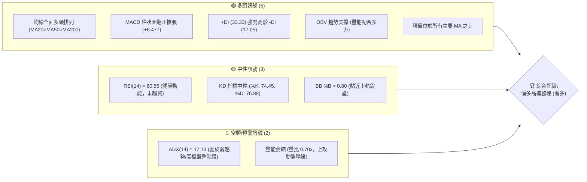
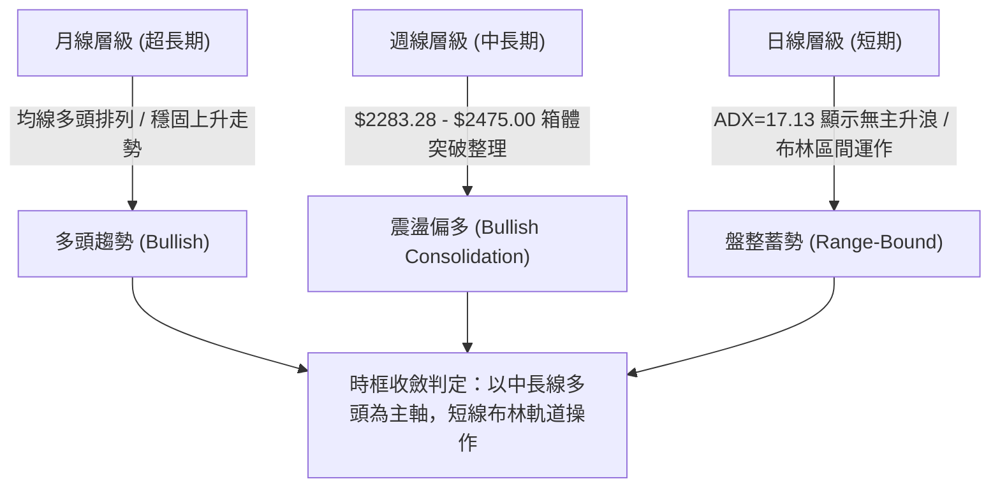
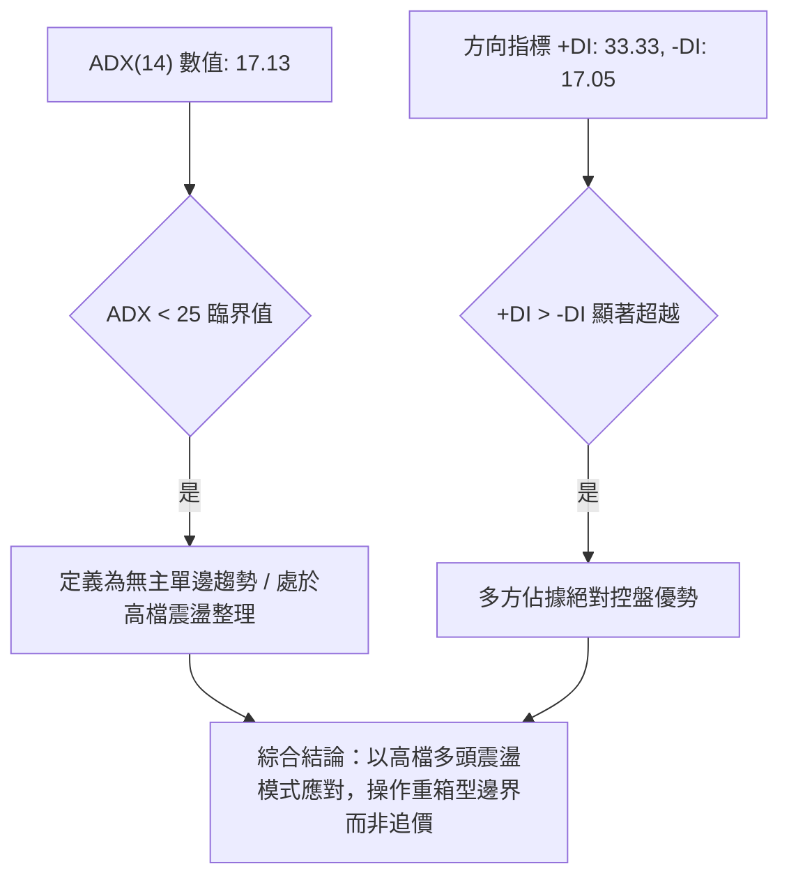
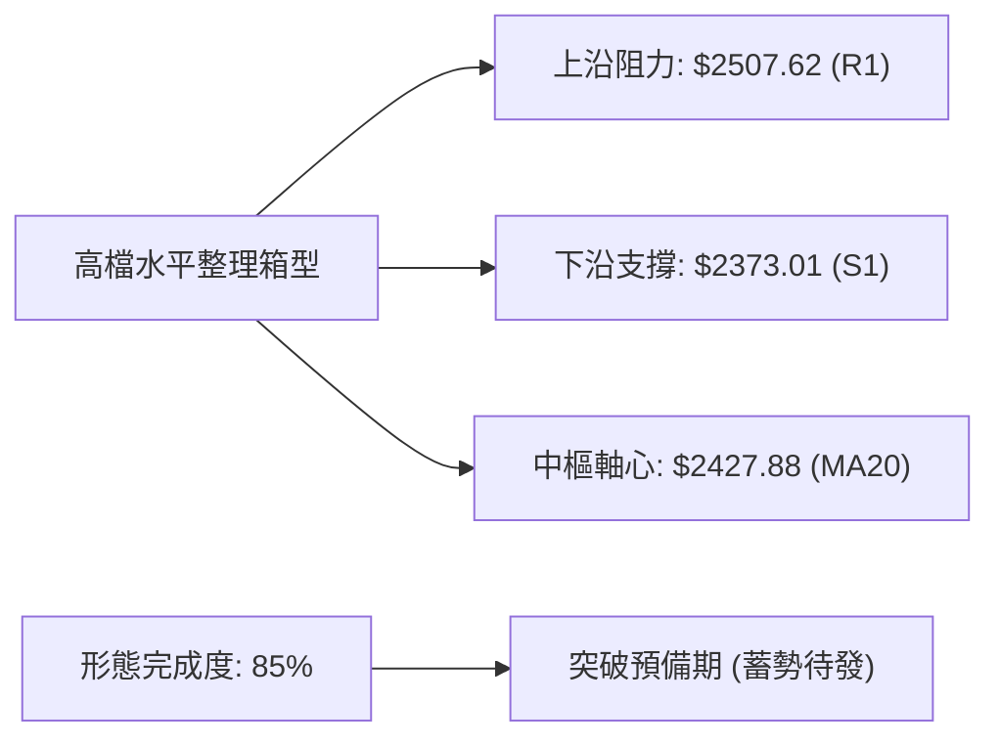
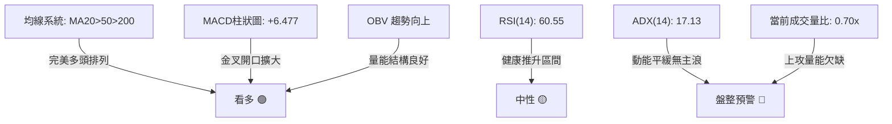
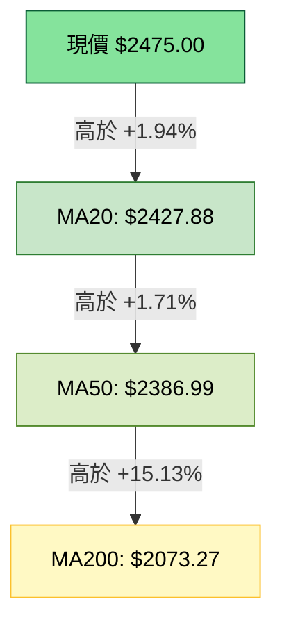
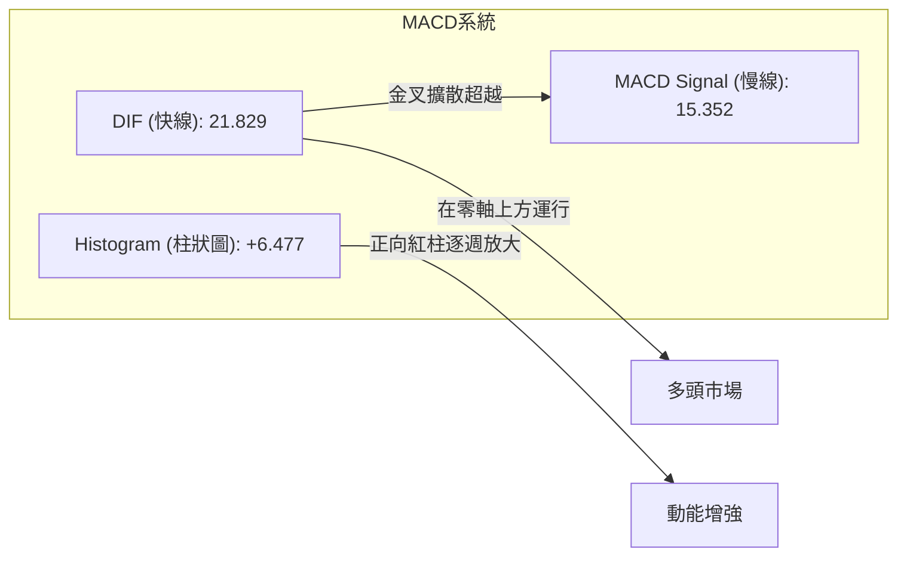
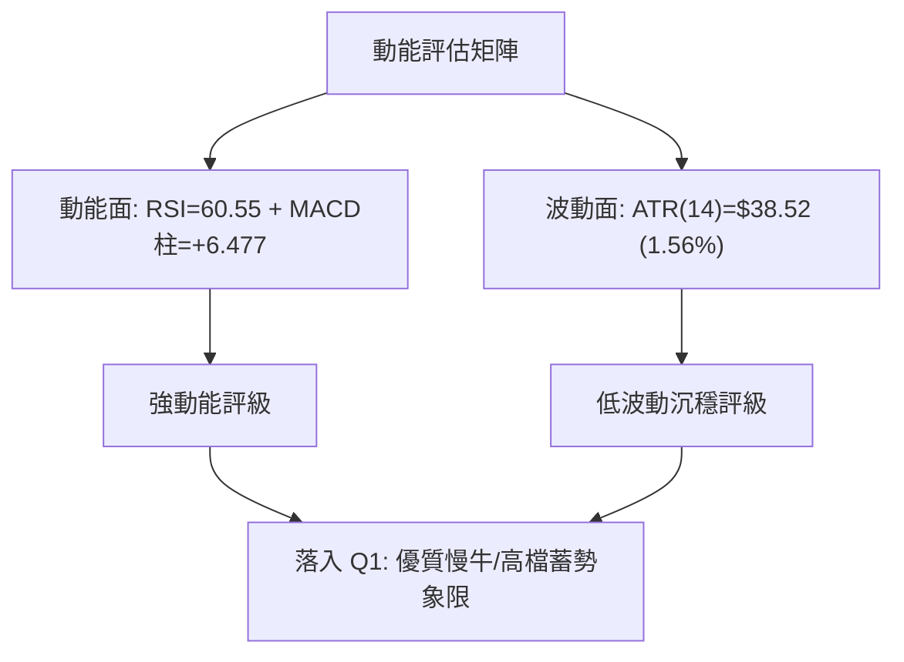
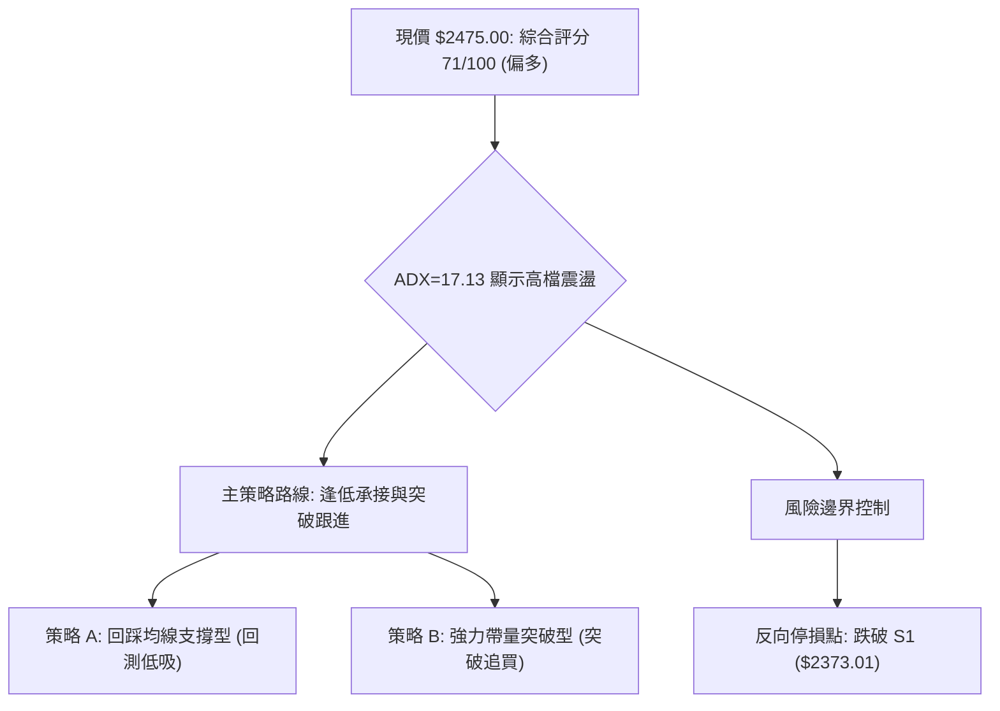
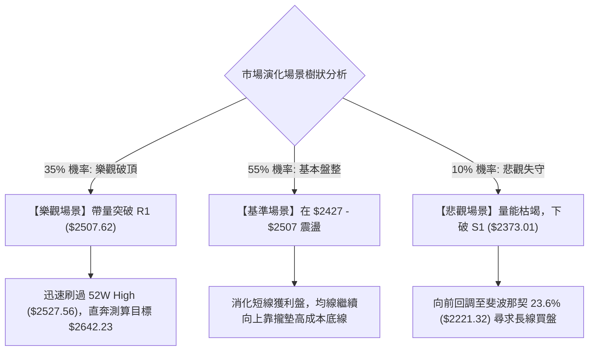

# 2330.TW 技術分析報告

> **報告日期**：2026-09-24 ｜ **語言**：繁體中文 ｜ **數據來源**：Yahoo Finance ｜ **當前價格**：$2475.00

---

## 目錄

| 章節 | 內容 |
|------|------|
| [1. 技術面概覽](#1-技術面概覽) | 訊號儀表板、核心指標、評分卡 |
| [2. 趨勢分析](#2-趨勢分析) | 多時框趨勢、長中短期走勢 |
| [3. 圖表形態分析](#3-圖表形態分析) | 形態識別、K線組合、目標價 |
| [4. 支撐與阻力](#4-支撐與阻力) | 關鍵價位、斐波那契回調 |
| [5. 技術指標深度解讀](#5-技術指標深度解讀) | MA/RSI/MACD/布林/成交量 |
| [6. 動能與波動率](#6-動能與波動率) | 動能評估、ATR、Beta |
| [7. 多時框架總結](#7-多時框架總結) | 時框架評分矩陣 |
| [8. 交易策略建議](#8-交易策略建議) | 多空策略、風險報酬比 |
| [9. 風險提示與監控](#9-風險提示與監控) | 監控指標、風險場景 |

---

## 1. 技術面概覽

### 🎯 技術訊號儀表板



### 📊 核心指標速覽表

| 指標類別 | 指標名稱 | 當前數值 | 訊號 | 解讀 |
|----------|----------|----------|------|------|
| **價格** | 當前價格 | $2475.00 | 🟢 | 站上所有均線，位於52週區間的95.9%高位 |
| **均線** | MA20 | $2427.88 | 🟢 | 現價高於 MA20 達 +1.94%，短期支撐確立 |
| **均線** | MA50 | $2386.99 | 🟢 | 現價高於 MA50 達 +3.69%，中期趨勢穩健 |
| **均線** | MA200 | $2073.27 | 🟢 | 現價高於 MA200 達 +19.38%，長期牛市架構完好 |
| **動能** | RSI(14) | 60.55 | 🟡 | 位於50-70多頭推升區間，無超買或背離訊號 |
| **動能** | MACD (12,26,9) | Hist: +6.477 | 🟢 | DIF (21.829) > MACD (15.352)，柱狀圖正向放大 |
| **波動** | ATR(14) | $38.52 | 🟢 | 波動率僅 1.56%，高檔籌碼沉澱，未現恐慌擴散 |

### 🏆 技術評分卡

```
╔══════════════════════════════════════════════════════════════════╗
║                技術評分卡 — 2330.TW (2026-09-24)                 ║
╠══════════════════════════════════════════════════════════════════╣
║ 趨勢強度 (ADX=17.13)    ██████░░░░░░░░░░░░░░  45/100  🟡 弱勢盤整║
║ 動能指標 (MACD/RSI)     ██████████████░░░░░░  72/100  🟢 動能偏多║
║ 支撐穩定度 (S1-S3結構)  ████████████████░░░░  80/100  🟢 底氣扎實║
║ 成交量配合 (OBV/均量)   ████████████░░░░░░░░  60/100  🟡 量縮整理║
║ 形態完整度 (箱體整理)   ██████████████░░░░░░  70/100  🟢 箱型蓄勢║
║ 均線排列 (多頭排列)     ████████████████████ 100/100  🟢 完美排列║
╠══════════════════════════════════════════════════════════════════╣
║ 綜合評分                ██████████████░░░░░░  71/100  🟢 偏多格局║
╚══════════════════════════════════════════════════════════════════╝
```

---

## 2. 趨勢分析

### 🌐 多時框趨勢分析



### 📈 長期趨勢 — 12個月走勢圖（Unicode）

```
2330.TW 月線走勢圖（2025-10 至 2026-09）
價格軸 ($)
$2527 ┤                                            ●(歷史高點 $2527.56)
$2475 ┤                                            * $2475.00 (現價)
$2400 ┤                               ●────●────●
$2300 ┤                          ●
$2100 ┤                     ●
$1900 ┤                ●
$1700 ┤           ●
$1500 ┤      ●────●
$1400 ┤ ●
      └─────────────────────────────────────────────────────────────
        10   11   12   01   02   03   04   05   06   07   08   09 (月份)
        '25  '25  '25  '26  '26  '26  '26  '26  '26  '26  '26  '26
```

**走勢特徵分析表格**：

| 階段 | 時間區間 | 起訖價位 | 漲跌幅 | 走勢特徵解讀 |
|------|----------|----------|--------|--------------|
| 第一階段：發動期 | 2025-10 ~ 2025-12 | $1481.83 → $1536.33 | +3.68% | 整理後帶量墊高，均線呈現發散雛形 |
| 第二階段：主升段 | 2026-01 ~ 2026-02 | $1759.34 → $1977.40 | +12.39% | 強勁單邊趨勢，大舉突破歷史關卡 |
| 第三階段：換手期 | 2026-03 ~ 2026-04 | $1750.17 → $2123.07 | +21.31% | 深度洗盤回測支撐後強力長陽反包突破 |
| 第四階段：高檔箱型 | 2026-05 ~ 2026-09 | $2341.84 → $2475.00 | +5.69% | 進入 $2300-$2500 高檔強勢整理，籌碼集中度提升 |

### 📊 中期趨勢（週線分析）

```
2330.TW 週線近期壓力與支撐示意圖
═════════════════════════════════════════════════════════════════════════
[歷史極值高點]       $2527.56 ────────────────────────────── (52W High)
[關鍵阻力聚類 R1]    $2507.62 ══════════════════════════════ (BB上軌附近)
[現價位置]           $2475.00 ◄── (處於多頭推升頂部測試區間)
[短線均線支撐]       $2427.88 ┈┈┈┈┈┈┈┈┈┈┈┈┈┈┈┈┈┈┈┈┈┈┈┈┈┈┈┈┈┈ (MA20 / BB中軌)
[中線波段支撐 S1]    $2373.01 ────────────────────────────── (近一年波段低點聚類)
[波段平台支撐 S2]    $2323.16 ────────────────────────────── (次級結構支撐)
[箱體底部防線 S3]    $2283.28 ══════════════════════════════ (2026-07-19週低點)
═════════════════════════════════════════════════════════════════════════
```

週線層級自 2026-05 以來，收盤價始終維持在 S3（$2283.28）上方運作。近期由 2026-09-06 的 $2402.93 連續拉升至 $2475.00，週 MACD 柱狀圖由 -0.024 翻正至 +6.477，確認中期趨勢重回多方主導。

### ⚡ 趨勢強度評估（ADX 解讀）



| ADX 區間 | 趨勢強度性質 | 當前數值 | 交易戰術意涵 |
|----------|--------------|----------|--------------|
| 00 - 20 | 極弱 / 無趨勢盤整 | **17.13** (當前) | **禁止順勢追價，採取區間布林軌道操作** |
| 20 - 25 | 趨勢初萌芽 / 弱趨勢 | - | 觀察突破確認點 |
| 25 - 40 | 明確強趨勢 | - | 順勢操作，回調均線切入 |
| 40 - 60 | 極強單邊主升/主跌 | - | 緊抱波段部位，以 trailing stop 防守 |

---

## 3. 圖表形態分析

### 🔍 形態識別系統



**形態信心度與目標價評估表**：

| 形態 | 信心度 | 判斷依據（引用數據） | 完成度 | 目標價（附計算式） |
|------|--------|----------------------|--------|--------------------|
| 高檔強勢整理箱體 (Rectangle Range) | 80% | 頂部受制於 R1 $2507.62，底部於 S1 $2373.01 及 S3 $2283.28 獲得反覆確認 | 85% | 依箱體高度測算：頸線突破價 $2507.62 + 箱體高度 ($2507.62 - $2373.01 = $134.61) = **$2642.23** |
| 均線多頭發散形態 (MA Expansion) | 90% | MA20 ($2427.88) > MA50 ($2386.99) > MA200 ($2073.27)，均線呈多頭排列 | 100% | 依 MA50-MA200 乖離推算：指標型延伸，支撐確立 |
| 雙底形態 (Double Bottom on Weekly) | 40% | 2026-05-24 ($2242.40) 與 2026-07-19 ($2283.28) 兩次探底 | 40% | **訊號不足，僅做指標型解讀**（因兩低點間隔時間長且中間價格未回測頸線核心，不列入主要交易依據） |

### 🕯️ 重要K線形態分析

| 週/月份 | 收盤價 | K線形態 | 解讀 | 訊號 |
|---------|--------|---------|------|------|
| 2026-07-19 | $2283.28 | 長下影探底棒 | 回測 S3 支撐位（$2283.28）引發爆量買盤，確立高檔箱體底界 | 🟢 支撐確認 |
| 2026-08-02 | $2417.88 | 中紅吞噬線 | 帶量突破短期均線壓制，週成交量達 217,659,985 股（近期最大量） | 🟢 多方發力 |
| 2026-09-20 | $2460.00 | 突破跳空陽線 | 擺脫 $2400 平台橫盤壓制，突破過去數週停滯格局 | 🟢 短線表態 |
| 2026-09-27 | $2475.00 | 連續墊高小陽線 | 價格推升至 $2475.00，貼近布林上軌，量能略縮 | 🟡 謹防高檔鈍化 |

### 📉 ASCII 走勢形態示意圖

```
高檔箱型整理結構與突破推演圖
價格 ($)
$2642.23 ┬────────────────────────────────────────── 形態推算目標價 (依箱高測算)
         │                                       ▲
$2507.62 ┼──────┬───────┬────────────────────────┼─ 箱型上軌阻力 R1 (頸線)
         │      │       │      * $2475 (現價)   │
         │      │       │     /                  │ 箱體高度 H = $134.61
$2427.88 ┼──────┼───────┴────*───────────────────┼─ 中軸支撐 (MA20)
         │      │           /                    │
$2373.01 ┼──────┴──────────*─────────────────────┴─ 箱型下軌支撐 S1
         └───────────────────────────────────────────
          2026-06     2026-07      2026-08    2026-09
```

### 🎯 形態目標價計算

1. **箱體上限（頸線 Resistance）**：引用關鍵價位 **R1: $2507.62**。
2. **箱體下限（支撐 Support）**：引用近一年波段低點聚類 **S1: $2373.01**。
3. **箱體垂直幅度（H）**：
   $$H = \text{R1} - \text{S1} = \$2507.62 - \$2373.01 = \$134.61$$
4. **形態量度滿足目標價（T1）**：
   $$\text{Target 1} = \text{R1} + H = \$2507.62 + \$134.61 = \$2642.23$$
   *(該數值與分析師預測最低目標價 $2650.00 高度重疊，形成技術面與基本面預期共振)*。
5. **第二延伸目標價（T2）**：分析師共識均價 **$3243.66**。

---

## 4. 支撐與阻力

### 🗺️ 關鍵價位分布圖（Unicode）

```
2330.TW 價位結構分布圖
═══════════════════════════════════════════════════════════════════
$2527.56 ║██████████████████████████████║ 52週歷史高點 (極限阻力)
$2507.62 ║██████████════════════════════║ 關鍵波段阻力 R1 (布林上軌共振)
$2475.00 ╠══════════════════════════════╣ ◄ 現價位置 ($2475.00)
$2427.88 ║▓▓▓▓▓▓▓▓▓▓▓▓▓▓▓▓▓▓▓▓          ║ 動態均線支撐 (MA20 / 布林中軌)
$2386.99 ║▓▓▓▓▓▓▓▓▓▓▓▓▓▓▓▓              ║ 中期趨勢支撐 (MA50)
$2373.01 ║████████████████████████      ║ 近一年關鍵波段支撐 S1
$2323.16 ║████████████████              ║ 波段結構平台支撐 S2
$2283.28 ║██████████████████████████████║ 近一年強支撐防線 S3 (箱體鐵底)
$2221.32 ║░░░░░░░░░░░░░░░░░░░░░░░░░░░░░░║ 斐波那契 23.6% 回調位
═══════════════════════════════════════════════════════════════════
```

### 🚧 阻力位分析表

| 阻力級別 | 價位 | 形成原因 | 突破難度 | 重要性 |
|----------|------|----------|----------|--------|
| **R1** | **$2507.62** | 近一年波段高點聚類，與布林上軌（$2507.15）精確重疊 | 🟡 中等 (需日成交量突破20日均量確認) | ★★★★★ (短線多空分水嶺) |
| **52W High** | **$2527.56** | 過去52週最高價格紀錄，心理與解套獲利賣壓重疊區 | 🔴 極高 (歷史套牢/結利壓力盤) | ★★★★☆ (若站穩則啟動新主升浪) |

### 🛡️ 支撐位分析表

| 支撐級別 | 價位 | 形成原因 | 守住機率 | 重要性 |
|----------|------|----------|----------|--------|
| **S1** | **$2373.01** | 近一年波段低點聚類，與MA50（$2386.99）構成雙重保護 | 85% | ★★★★☆ (波段防守關鍵) |
| **S2** | **$2323.16** | 近一年次級波段低點密集成交聚類 | 90% | ★★★☆☆ (中度結構回踩位) |
| **S3** | **$2283.28** | 近一年波段關鍵防線，2026-07探底反轉之歷史硬支撐 | 95% | ★★★★★ (中期牛市命脈，不可跌破) |

### 📐 斐波那契回調位分析

*基準點：52週波段區間：波段低點 $1229.94 → 波段高點 $2527.56（全波段垂直落差 $1297.62）*

| 回調比率 | 價位 | 意義與現價位置解讀 |
|----------|------|--------------------|
| **0.0% (高點)** | **$2527.56** | 52W High，目前現價距此僅剩 2.12% 差距 |
| **現價區間** | **$2475.00** | **處於 0.0% 與 23.6% 極度強勢的多頭極高位階（回調率僅 4.05%）** |
| **23.6%** | **$2221.32** | 淺度回調強支撐位（現價高於此位 $253.68，牛市特徵顯著） |
| **38.2%** | **$2031.87** | 正常回調支撐位（與 MA200: $2073.27 形成長線支撐共振帶） |
| **50.0%** | **$1878.75** | 中期強弱多空平衡中樞線 |
| **61.8%** | **$1725.63** | 黃金分割防守關鍵位 |
| **78.6%** | **$1507.63** | 深度回調防守位 |
| **100.0% (低點)**| **$1229.94** | 52W Low |

**解讀結論**：當前價格 $2475.00 處於 0.0%（$2527.56）與 23.6%（$2221.32）之頂層強勢帶，甚至連第一級回調位 23.6% 均未曾觸及，說明自 $1229.94 發動的大級別趨勢依然具有強大的資本控盤慣性。

---

## 5. 技術指標深度解讀

### 🎛️ 指標訊號總覽



### 📈 移動平均線排列分析



均線系統展現完美的順向多頭排列架構（MA5 $2475.00 = 現價 > MA10 $2433.39 > MA20 $2427.88 > MA60 $2394.79 > MA120 $2319.89 > MA240 $1965.85），每一級別之長期均線均呈現正斜率攀升，證明中長期持倉成本持續推升，下檔買盤承接力道堅固。

### 📉 RSI(14) 分析

* 當前 RSI(14) 數值：**60.55**
* 強度視覺化：`[0] ░░░░░░░░░░░░░░░░████████████░░░░░░░░ [100]  (60.55%)`

```
RSI(14) 動能區間診斷：
0 ────── 30 (超賣區) ────── 50 (強弱分水嶺) ───[60.55]── 70 (超買區) ────── 100
                                              ▲ 當前位置
```

* **超買超賣判斷**：數值處於 50 至 70 之「強勢推升區」，並未進入 >70 之嚴重超買過熱區，具備向上推進的安全邊際。
* **背離檢查**：價格自 2026-09-06 之 $2402.93 攀升至 $2475.00，RSI 亦由 51.5 爬升至 60.55，**價升指標升，無頂背離或底背離跡象**。

### 📊 MACD(12/26/9) 訊號解讀



* **數據分析**：快線 DIF (21.829) 大幅領先慢線 Signal (15.352)，柱狀圖差值為 **+6.477**。
* **趨勢連貫性**：自 2026-08-09 翻正（+3.319）以來，連續多週維持正值，本週更從上週的 +0.062 激增至 +6.477，確認短期多方重新掌握發球權。

### 📦 布林通道分析

```
2330.TW 布林通道價格空間示意圖（帶寬: $158.54）
═════════════════════════════════════════════════════════════════
BB上軌:       $2507.15  ───────────────────────────── (阻力上限)
現價位置:     $2475.00  ◄─── [%B = 0.80，處於上軌壓制區間]
BB中軌(MA20): $2427.88  ┈┈┈┈┈┈┈┈┈┈┈┈┈┈┈┈┈┈┈┈┈┈┈┈┈┈┈┈┈ (短期軸心支撐)
BB下軌:       $2348.61  ───────────────────────────── (波段支撐底線)
═════════════════════════════════════════════════════════════════
```

當前布林通道指標 **%B 為 0.80**，表明價格已運作至通道上象限（中軌至上軌之間）。通道並未呈現劇烈開口（Bandwidth 縮減），印證了 ADX=17.13 揭示的「盤整向右上慢爬」節奏，上軌 $2507.15 與阻力位 R1（$2507.62）形成雙重反壓。

### 💹 成交量分析（量價配合度）

| 項目 | 數據 | 狀態判定 | 解讀意涵 |
|------|------|----------|----------|
| 最新成交量 | 13,043,734 股 | 萎縮 | 買盤追價意願謹慎，未見瘋狂追高 |
| 20日成交均量 | 18,566,193 股 | 基準量 | - |
| 成交量比 (VR) | **0.70x** | 🟡 量縮上行 | 顯示現價推升主因為賣壓減輕，而非強勢主力掃盤 |
| OBV 能量潮趨勢 | OBV > MA | 🟢 量能多頭 | 長期累計能量潮保持在均線之上，籌碼結構未渙散 |

---

## 6. 動能與波動率

### ⚡ 動能評估四象限

| 象限 | 動能狀態 | 波動率狀態 | 標的所處定位 | 戰略應對方針 |
|------|----------|------------|--------------|--------------|
| 第一象限 (Q1) | 強動能 (MACD>0, RSI>60) | 低波動 (ATR% = 1.56%) | **✓ 當前 2330.TW 定位** | **優質穩健持倉區：鎖定利潤，逢拉回佈局** |
| 第二象限 (Q2) | 弱動能 | 低波動 | - | 沉悶磨底，觀望為主 |
| 第三象限 (Q3) | 強動能 | 高波動 | - | 突破加速段，適合日內或突破激進交易 |
| 第四象限 (Q4) | 弱動能 | 高波動 | - | 破位崩跌風險，嚴格避開 |



### 📊 ATR 波動率分析

* **當前 ATR(14)**：**$38.52**（佔現價比率僅 **1.56%**）。
* **日內正常波動區間**：$2475.00 ± $38.52（預期波動範圍：$2436.48 - $2513.52）。
* **止損防守距離測算建議**：
  * **激進日內交易**：1.0 × ATR = **$38.52**（止損防守位：$2436.48，約略守在 MA20 $2427.88 之上）。
  * **波段趨勢操作**：2.0 × ATR = **$77.04**（止損防守位：$2397.96，剛好貼近 MA60 $2394.79 與 MA50 $2386.99）。
  * **防黑天鵝寬鬆止損**：3.0 × ATR = **$115.56**（止損防守位：$2359.44，落在 S1 $2373.01 之下）。

### 📐 Beta 與市場相關性

* **Beta 係數**：**1.247**。
* **市場敏感性評估**：
  * Beta > 1.0 表明 2330.TW 波動性高於加權指數 24.7%，在大盤多頭環境下具有放大超額收益（Alpha）之能力。
  * 結合其極高權重（市值高達 NT$64.18T），該標的實質上主導了整體指數之方向，在目前強勢技術結構下，為大盤提供了堅實支撐。

---

## 7. 多時框架總結

### 📋 時框架評分表

| 時框架 | 趨勢方向 | 動能狀態 | 均線排列 | 形態狀態 | 綜合評分 | 操作建議 |
|--------|----------|----------|----------|----------|----------|----------|
| **月線層級** | 🟢 強烈看多 | 強勁 (突破各歷史整數關卡) | 完美多頭 (MA20>50>200) | 歷史超級大主升擴張 | 95 / 100 | 長期投資堅定抱牢 |
| **週線層級** | 🟢 震盪看多 | 穩健 (MACD翻正擴散) | 多頭順向排列 | $2283-$2507 箱體蓄勢 | 80 / 100 | 順勢拉回偏多承接 |
| **日線層級** | 🟡 高檔盤整 | 中性偏多 (ADX=17.13, 量縮) | 均線多頭壓陣 | 貼近布林上軌與R1阻力 | 65 / 100 | 嚴禁追高，逢支撐低吸 |

### 🔲 綜合訊號矩陣

```
時框與指標交互驗證矩陣
時框       MA均線    MACD      RSI       量價OBV     整體方向
日線       🟢 看多   🟢 看多   🟡 中性   🟡 量縮     🟡 高檔震盪
週線       🟢 看多   🟢 看多   🟢 看多   🟢 支撐     🟢 波段推升
月線       🟢 看多   🟢 看多   🟢 看多   🟢 強勢     🟢 超級多頭
────────────────────────────────────────────────────────────
收斂確認度：極高（三個時框無一出現空頭轉向訊號）
```

### ⚖️ 多時框收斂結論

依「多時框收斂規則」第 14 條嚴格判斷：
1. **行情屬性判定**：當前日線 ADX(14) = **17.13 < 25**，日線層級明確定義為「**盤整震盪行情**」；
2. **主導時框優先級**：依規則，當 ADX < 25 時，**以日線布林通道上下軌（$2348.61 - $2507.15）為主要交易區間**，中長期（週線/MA50、MA200）方向則負責提供安全邊際防護網；
3. **唯一方向性結論**：**【高檔偏多區間操作】**。日線雖受制於 R1: $2507.62 壓力，但絕不可逆勢做空（中長線MA排列完美無瑕），策略以「**布林中下軌/關鍵支撐位低吸，測試 R1/布林上軌時獲利了結**」為唯一核心指導方針。

---

## 8. 交易策略建議

### 🗺️ 策略決策流程圖



### 🧭 策略路由（依評分卡分流）

> **當前主策略方向 = 【偏多操作】（技術評分卡總分：71 / 100）**
> 綜合評分達 71 分（≥60 分臨界標準），符合主推多頭策略規範。空頭交易不予主動推薦，僅於文末標明反轉風險觸發點以利嚴密風控。

### 🎯 價格情境階梯（Price Scenarios）

| 觸發條件 | 下一目標 | 後續延伸 | 情境含義解讀 |
|----------|----------|----------|--------------|
| **強勢突破 R1 ($2507.62)** | **52W High ($2527.56)** | **形態目標 ($2642.23)** | 箱體向上破局，主升浪再起 |
| **受阻於現價至 R1 區間** | **MA20 / BB中軌 ($2427.88)**| **S1 支撐位 ($2373.01)** | 區間良性洗盤，高檔籌碼換手 |
| **有效跌破 S1 ($2373.01)** | **S2 支撐位 ($2323.16)** | **S3 鐵底防線 ($2283.28)** | 箱體結構轉弱，深度回踩考驗防線 |

### 📊 情境機率分佈

| 情境 | 機率 | 主要依據 |
|------|------|----------|
| **高檔區間震盪 (維持於 $2427-$2507)** | **55%** | **ADX=17.13 弱趨勢**、量比僅 0.70x、布林通道帶寬收窄 |
| **帶量突破 R1 挑戰新高** | **35%** | **均線多頭排列**、MACD柱正向放大(+6.477)、OBV資金長線看多 |
| **跌破 S1 走深度回調** | **10%** | S1-S3 近一年波段低點聚類厚實、基本面與分析師共識 Target 強大 |

### 🟢 主策略詳情（方向：做多）

所有關鍵數據均來自「關鍵價位」與「形態推算」章節，無憑空估算之數值：

| 策略要素 | 策略 A（穩健型：回測支撐承接） | 策略 B（激進型：帶量突破買進） |
|----------|--------------------------------|--------------------------------|
| **進場條件** | 股價回踩 MA20 中軌或 S1 出現下影支撐 | 日線帶量（>20日均量 18.5M 股）收盤站穩 R1 |
| **進場價格** | **$2427.88** (精確錨定 MA20) | **$2507.62** (精確錨定 R1 阻力位) |
| **目標價 T1**| **$2507.62** (關鍵阻力位 R1) | **$2527.56** (52W 歷史高點) |
| **目標價 T2**| **$2642.23** (箱體形態垂直測算目標) | **$2642.23** (箱體形態垂直測算目標) |
| **止損價格** | **$2373.01** (近一年波段低點聚類 S1) | **$2427.88** (前波箱體中軸 MA20) |
| **潛在利潤** | T1: +$79.74 (+3.28%) / T2: +$214.35 (+8.83%) | T1: +$19.94 (+0.80%) / T2: +$134.61 (+5.37%) |
| **承受風險** | -$54.87 (-2.26%) | -$79.74 (-3.18%) |
| **風險報酬比** | **1 : 3.91** (以目標價 T2 計算) | **1 : 1.69** (以目標價 T2 計算) |
| **成功機率** | **65%** | **55%** |
| **建議倉位** | **20% 資金權重** | **10% 資金權重** |

### 🔴 反向風險觸發點（對沖提示）

本策略僅作為風控停損與防守預警之用，非主動放空操作：
* **第一級減倉警訊**：日線收盤價跌破 **MA20 ($2427.88)**，且 MACD 柱狀圖跌入負值區，多單應降低 50% 倉位。
* **全面撤離/對沖點**：價格跌破 **S1 ($2373.01)**。若跌破該波段聚類，代表高檔箱體正式宣告失守，下方將直接回測 S2 ($2323.16) 或 S3 ($2283.28)，此時所有波段多單必須全數停損離場，空手觀望。

### ⭐ 整體訊號強度評星

```
╔══════════════════════════════════════════════════════════════╗
║ 做多訊號強度：★★★★☆  (4/5星 - 均線與中長時框強勁，唯欠缺爆發量能)
║ 做空訊號強度：★☆☆☆☆  (1/5星 - 逆大勢左側摸頂，風險極高)
║ 整體可信度：  ★★★★☆  (4/5星 - 數據高度收斂，指引性極佳)
╚══════════════════════════════════════════════════════════════╝
```

---

## 9. 風險提示與監控

### ✅ 關鍵監控指標 Checklist

```
╔══════════════════════════════════════════════════════════════════════════╗
║                     技術面關鍵監控清單 (DAILY CHECKLIST)                  ║
╠══════════════════════════════════════════════════════════════════════════╣
║ [ ] 監控點 1：成交量是否放大至 18,566,193 股 (20日均量) 之上？            ║
║     └─ 解讀：若量能持續低於 13M，難以形成對 R1 ($2507.62) 的有效突破。  ║
║                                                                          ║
║ [ ] 監控點 2：ADX(14) 是否由 17.13 拐頭向上穿越 20/25？                  ║
║     └─ 解讀：ADX 若抬頭，象徵即將脫離高檔盤整，迎來新一輪趨勢行情。     ║
║                                                                          ║
║ [ ] 監控點 3：布林帶寬是否持續擴張且收盤站上 BB 上軌 ($2507.15)？        ║
║     └─ 解讀：連續兩日站上上軌，為「布林向上開口」強勢訊號。             ║
║                                                                          ║
║ [ ] 監控點 4：MA20 動態防守價 ($2427.88) 是否保持完好？                 ║
║     └─ 解讀：收盤不破 MA20，則多頭格局無虞；跌破則回測 S1 ($2373.01)。  ║
╚══════════════════════════════════════════════════════════════════════════╝
```

### ⚠️ 風險場景分析



### 🛡️ 風險管理重要提醒

1. **乖離率與資金配置風險**：
   * 現價 $2475.00 距離 200日均線（MA200: $2073.27）正乖離率達 **+19.38%**。雖然長多排列極佳，但在歷史高位區間，絕對**禁止使用全額槓桿或滿倉追價**。
2. **總部位曝險上限**：
   * 建議單一標的（2330.TW）持倉佔整體投資組合比重不宜超過 **30%**。策略 A 與策略 B 採取分批建倉，總初始部位控制在 10%–20% 之間，其餘資金保留應對回調。
3. **無條件紀律風控機制**：
   * 技術分析的核心在於「不對市場抱有執念」。若市場出現系統性利空，使日線收盤價跌破關鍵支撐 **S1: $2373.01**，應無條件執行風控減碼程序，絕不在下跌趨勢中逆勢向下加碼攤平。

---

## 📋 報告總結

```
╔══════════════════════════════════════════════════════════════════════╗
║                   2330.TW 技術分析綜合報告結論卡                     ║
╠══════════════════════════════════════════════════════════════════════╣
║ 報告日期：2026-09-24                當前收盤價格：$2475.00            ║
║ 分析評級：🟢 偏多高檔整理 (看多)    技術總評分值：71 / 100            ║
╠══════════════════════════════════════════════════════════════════════╣
║ 核心趨勢結論：                                                       ║
║ ├─ 長期趨勢 (月線)：🟢 極強牛市，均線完整多頭排列，向上空間寬廣     ║
║ ├─ 中期趨勢 (週線)：🟢 箱體偏多，MACD 翻正，波段支撐層層保護         ║
║ ├─ 短期趨勢 (日線)：🟡 高檔強勢整理，受制於 R1 阻力，ADX 指向蓄勢    ║
║ ├─ 關鍵核心支撐位：$2427.88 (MA20) │ $2373.01 (波段關鍵聚類 S1)     ║
║ ├─ 關鍵核心阻力位：$2507.62 (阻力 R1) │ $2527.56 (52週最高紀錄)      ║
║ └─ 目標預期水準  ：形態測算目標 $2642.23 │ 分析師共識目標 $3243.66  ║
╠══════════════════════════════════════════════════════════════════════╣
║ 最優策略指引：                                                       ║
║ 1. 🥇 最佳機會（穩健回踩買進）：等待股價拉回 $2427.88 (MA20) 附近承接║
║       止損設於 $2373.01，目標上看 $2507.62 及 $2642.23 (風報比 1:3.9)║
║ 2. 🥈 次選機會（強勢突破追價）：日線爆量站穩 $2507.62 後順勢進場      ║
║       止損設於 $2427.88，目標上看 $2642.23 (風報比 1:1.7)            ║
║ 3. 🥉 保守選擇（觀望等待確認）：等待 ADX 向上穿越 20 並帶動量能突破再行進場║
╚══════════════════════════════════════════════════════════════════════╝
```

---

> ⚠️ **免責聲明**：本報告為 AI 自動生成之技術分析研究文稿，所有分析及估算均基於歷史量價數據與量化指標系統。本報告**僅供學術研究與參考**，**不構成任何形式的投資建議、要約或承諾**。金融市場瞬息萬變，投資人應獨立評估自身風險承受能力並承擔交易損益。

---

*報告生成時間：2026-09-24 ｜ 數據來源：Yahoo Finance ｜ 分析框架：多時框架量化技術分析體系*