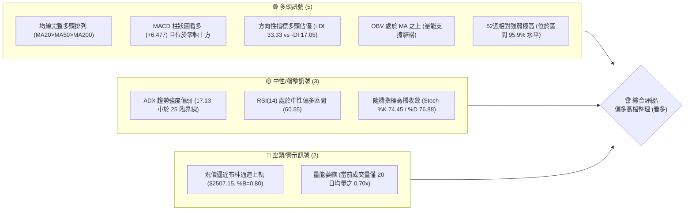
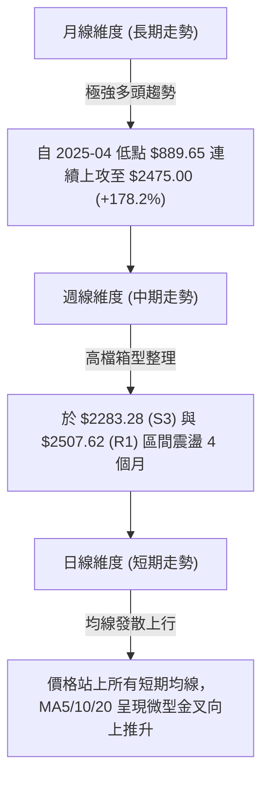
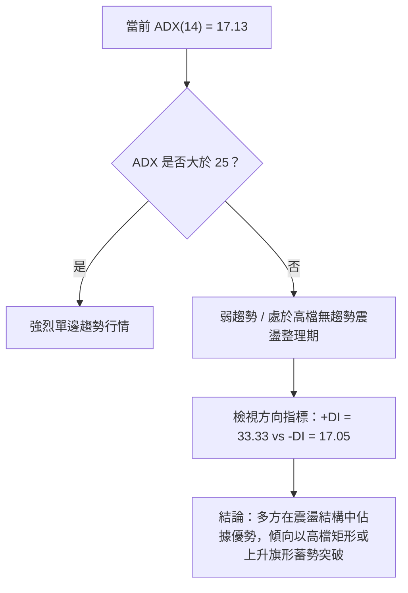
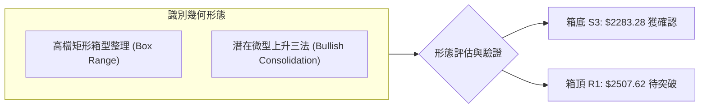
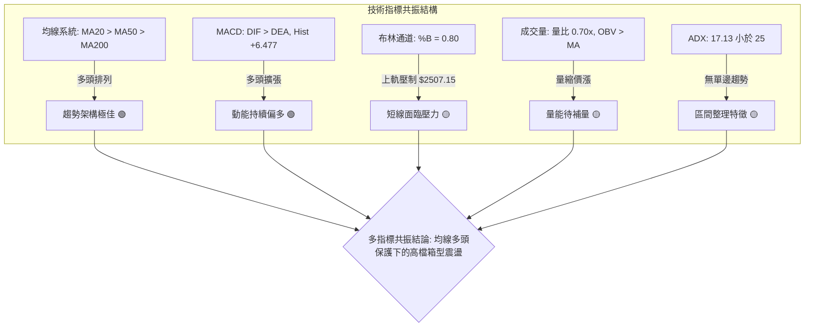
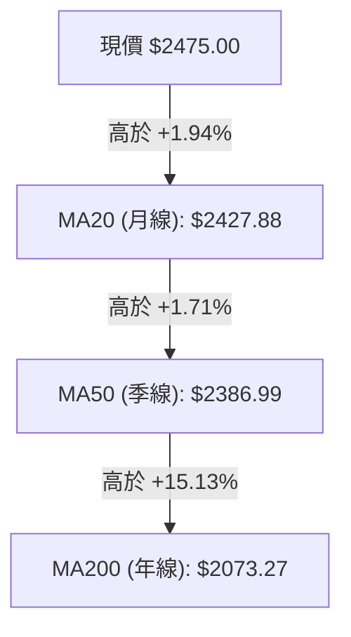
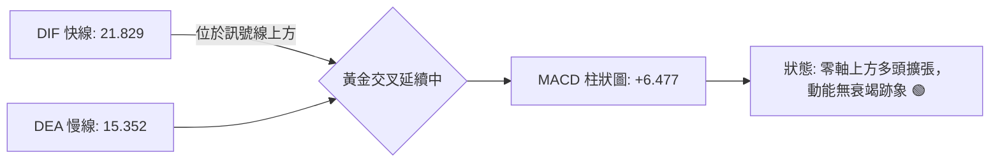
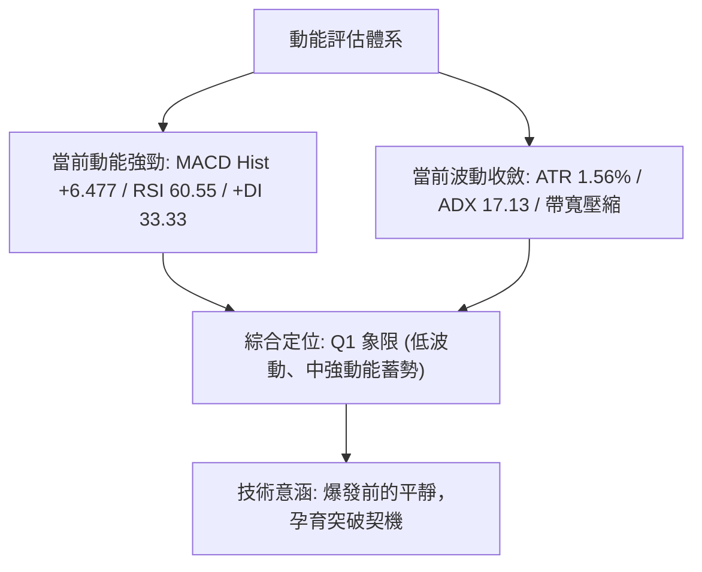
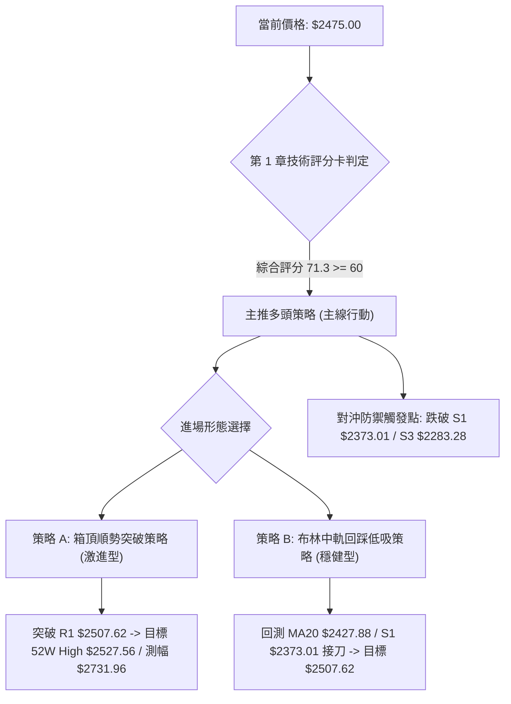
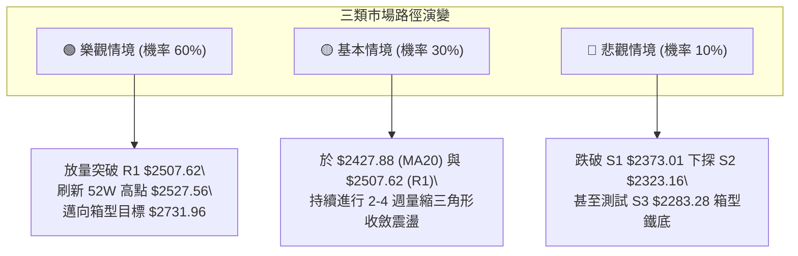

# 2330.TW 技術分析報告

> **報告日期**：2026-09-26 ｜ **語言**：繁體中文 ｜ **數據來源**：Yahoo Finance ｜ **當前價格**：$2475.00

---

## 目錄

| 章節 | 內容 |
|------|------|
| [1. 技術面概覽](#1-技術面概覽) | 訊號儀表板、核心指標、評分卡 |
| [2. 趨勢分析](#2-趨勢分析) | 多時框趨勢、長中短期走勢 |
| [3. 圖表形態分析](#3-圖表形態分析) | 形態識別、K線組合、目標價 |
| [4. 支撐與阻力](#4-支撐與阻力) | 關鍵價位、斐波那契回調 |
| [5. 技術指標深度解讀](#5-技術指標深度解讀) | MA/RSI/MACD/布林/成交量 |
| [6. 動能與波動率](#6-動能與波動率) | 動能評估、ATR、Beta |
| [7. 多時框架總結](#7-多時框架總結) | 時框架評分矩陣 |
| [8. 交易策略建議](#8-交易策略建議) | 多空策略、風險報酬比 |
| [9. 風險提示與監控](#9-風險提示與監控) | 監控指標、風險場景 |
| [10. 報告總結](#-報告總結) | 技術總結與執行架構 |

---

## 1. 技術面概覽

### 🎯 技術訊號儀表板



### 📊 核心指標速覽表

| 指標類別 | 指標名稱 | 當前數值 | 訊號 | 解讀 |
| :--- | :--- | :--- | :---: | :--- |
| **價格** | 當前價格 | $2475.00 | 🟢 | 距 52 週高點 $2527.56 僅 2.08%，整體處於高檔強勢區 |
| **均線** | MA20 | $2427.88 | 🟢 | 價格在 MA20 上方 +1.94%，短期多頭波段支撐明確 |
| **均線** | MA50 | $2386.99 | 🟢 | 價格在 MA50 上方 +3.69%，中期上升趨勢軌道穩健 |
| **均線** | MA200 | $2073.27 | 🟢 | 價格在 MA200 上方 +19.38%，長期多頭基本盤極度紮實 |
| **動能** | RSI(14) | 60.55 | 🟡 | 位於 50–70 強勢中性區，無過熱（>70）亦無背離跡象 |
| **動能** | MACD (12,26,9) | 21.829 / Hist +6.477 | 🟢 | DIF 高於 Signal(15.352)，柱狀圖擴張，多頭發散維持 |
| **趨勢** | ADX(14) | 17.13 | 🟡 | ADX < 25 顯示自 2026 年 6 月創高後進入大型高檔箱型震盪 |
| **通道** | Bollinger Bands | 上軌 $2507.15 / %B 0.80 | 🟡 | 價格貼近上軌，未破出軌外，屬於強勢區間震盪特徵 |
| **量能** | 20日成交量比 | 0.70x (13,043,734 股) | 🔴 | 成交量未達 20MA 水準，衝擊波段高點需要量能重新放大 |
| **波動** | ATR(14) | $38.52 (1.56%) | 🟢 | 波動率收斂至低位，意味壓縮行情接近尾聲，即將選擇方向 |

### 🏆 技術評分卡

```
╔══════════════════════════════════════════════════════════════╗
║              技術評分卡 — 2330.TW (2026-09-26)               ║
╠══════════════════════════════════════════════════════════════╣
║ 趨勢強度 (Trend)     ████████████░░░░░░░░  62/100 🟡 (ADX偏弱)║
║ 動能指標 (Momentum)  ██████████████░░░░░░  70/100 🟢 (MACD強) ║
║ 支撐穩定度 (Support) ████████████████░░░░  80/100 🟢 (MA密集) ║
║ 成交量配合 (Volume)  ██████████░░░░░░░░░░  52/100 🟡 (量能萎縮)║
║ 形態完整度 (Pattern) ██████████████░░░░░░  72/100 🟢 (箱型收斂)║
║ 均線排列 (Alignment) ██████████████████░░  92/100 🟢 (完美多頭)║
╠══════════════════════════════════════════════════════════════╣
║ 綜合評分 (Overall)   ██████████████░░░░░░  71.3/100 偏多整合  ║
╚══════════════════════════════════════════════════════════════╝
```

---

## 2. 趨勢分析

### 🌐 多時框趨勢分析



### 📈 長期趨勢 — 12個月走勢圖（過去一年月線軌跡）

```
2330.TW 月線走勢圖（2025-10 至 2026-09）
價格軸 ($)
$2500 ┤                                           ●    ● (2475.00)
$2300 ┤                                      ●    │    │
$2100 ┤                                 ●    │    │    │
$1900 ┤                            ●    │    │    │    │
$1700 ┤                       ●    │    │    │    │    │
$1500 ┤   ●         ●         │    │    │    │    │    │
$1400 ┤   │    ●    │         │    │    │    │    │    │
$1200 ┤   │    │    │    ●    │    │    │    │    │    │
      └─┬───┬───┬───┬───┬────┬────┬────┬────┬────┬────┬────┬──
        10  11  12  01  02   03   04   05   06   07   08   09 (月份)
        25  25  25  26  26   26   26   26   26   26   26   26 (年份)
```

#### 長期月線走勢特徵分析表格

| 階段別 | 期間涵蓋 | 價格區間 ($) | 漲跌幅 (%) | 形態特徵與盤面意義 |
| :--- | :--- | :--- | :--- | :--- |
| **起漲主升段** | 2025-09 ~ 2026-02 | $1289.19 → $1977.40 | +53.38% | 月線呈現帶量長紅連續突破，各路法人強力回補 |
| **第一波洗盤段** | 2026-02 ~ 2026-03 | $1977.40 → $1750.17 | -11.49% | 快速回踩 MA200 之上方支撐，完成籌碼換手換約 |
| **延伸加速段** | 2026-03 ~ 2026-06 | $1750.17 → $2402.93 | +37.30% | 軋空行情發動，直接跨越 $2000 大關進入歷史新維度 |
| **高檔平台休整** | 2026-06 ~ 2026-09 | $2402.93 → $2475.00 | +3.00% | 進入 4 個月的高檔平盤整理，波動度劇烈收斂，ADX 下滑 |

### 📊 中期趨勢（週線分析）

從 2026 年 5 月底至 9 月底的近 20 週數據觀察，週收盤價低點出現於 2026-07-19 的 **$2283.28**，隨後築底向上；近期高點收在 2026-09-27 的 **$2475.00**，逼近歷史收盤高峰。週線 MACD 柱狀圖在歷經 7 月中旬的負值低谷（-15.169）後，自 8 月初開始持續翻紅發散，本週擴大至 **+6.477**，顯示中期動能修正已經結束，週線級別買盤重新掌控局勢。

### ⚡ 趨勢強度評估（ADX 解讀）



#### ADX 數值強度對照解析

| 指標名稱 | 實際數值 | 臨界基準 | 當前市場狀態判定 |
| :--- | :--- | :--- | :--- |
| **ADX(14)** | **17.13** | 25.00 | **震盪盤整行情**：未進入單邊趨勢，不宜盲目追價，適合逢回低吸 |
| **+DI(14)** | **33.33** | 20.00 | **多頭主導**：+DI 顯著高於 20 基準線，買盤防守積極 |
| **-DI(14)** | **17.05** | 20.00 | **空頭被壓制**：空方拋壓微弱，無法形成連續下殺走勢 |
| **DI差值 (擴張度)**| **+16.28** | 0.00 | **看多基調**：價位震盪偏多，具備向上突破之動能儲備 |

---

## 3. 圖表形態分析

### 🔍 形態識別系統

在日線與週線時框下，價格自 2026 年 5 月底登上 $2341.84 之後，至 2026 年 9 月底呈現一個清晰的**高檔矩形收斂形態**（或稱高檔整理箱型），期間曾於 2026-07-19 探底 **$2283.28**（箱底 S3），隨後回升至 **$2475.00**，挑戰箱頂 **$2507.62**（阻力 R1）。



#### 圖表形態信心度評估表

| 形態類別 | 信心度 (%) | 判斷依據（引用技術數據） | 完成度 (%) | 目標價（附嚴格計算式） |
| :--- | :---: | :--- | :---: | :--- |
| **高檔矩形箱型 (Box Range)** | **85%** | 底部受波段低點聚類 S3 ($2283.28) 支撐，頂部受聚類高點 R1 ($2507.62) 壓制，歷經 20 週確認 | 90% | 箱頂突破目標 = 頸線 $2507.62 + 箱高 ($2507.62 - $2283.28 = $224.34) = **$2731.96**（推算值） |
| **雙重底型態 (W-Bottom)** | **70%** | 週線探底兩次：06-28 收盤 $2333.13、07-26 收盤 $2343.10，皆守住波段低點聚類 S2 ($2323.16) | 95% | 突破 R1 ($2507.62) 後目標 = $2507.62 + ($2507.62 - $2323.16 = $184.46) = **$2692.08**（推算值） |
| **指標型布林突破** | **60%** | 當前收盤價 $2475.00 逼近 BB上軌 $2507.15，%B 達 0.80，均線多頭發散支撐 | 75% | 若突破上軌 $2507.15，下一站指向 52W 歷史極值 **$2527.56** |

### 🕯️ 重要 K 線形態分析

| 基準時段 | 收盤價 ($) | 實體與影線特徵 | 解讀與量價意義 | 多空訊號 |
| :--- | :--- | :--- | :--- | :---: |
| **2026-07-19 (週線)** | $2283.28 | 長下影長陰線（爆出 2 億股週巨量） | 主力於 S3 ($2283.28) 進行巨量洗盤誘空，下影線確立波段大底 | 🟢 破底翻 |
| **2026-08-02 (週線)** | $2417.88 | 中長紅實體（2.17 億股放量吞噬） | 形成強力吞噬線，一舉收復所有週級均線，確認中期扭轉向上 | 🟢 看多吞噬 |
| **2026-09-20 (週線)** | $2460.00 | 突破型紅實體（量能溫和 1.01 億股） | 跳空脫離 $2400 平台密集區，確立向上測試 $2500 關卡動能 | 🟢 轉強信號 |
| **2026-09-27 (週線)** | $2475.00 | 小紅星線帶上影（縮量 6694 萬股） | 接近 52W 高點前出現防守型縮量觀望，等待多頭量能再次點火 | 🟡 高檔蓄勢 |

### 📉 ASCII 走勢形態示意圖

```
2330.TW 週線箱型整理結構圖（2026-06 至 2026-09）
$2527.56 ┬────────────────────────────────────────── 52W 歷史高點
$2507.62 ┼───────┌──┐───────────────┌──┐──────────── 箱頂阻力 R1 (頸線)
         │       │  │               │  │   ▲ 現在 ($2475.00)
$2400.00 ┼───┌──┘  └──┐   ┌───────┘  └───┼──────── 箱型中軸區間
         │   │          │   │               │
$2323.16 ┼───┘          └───┘               │        波段次低點 S2
$2283.28 ┴───────────────────●────────────────────── 箱底強支撐 S3 (07-19 探底洗盤)
          2026-06     2026-07     2026-08     2026-09
```

### 🎯 形態目標價計算

1. **高檔箱型整理突破之等距衡量**：
   - 形態箱頂（頸線位置）：引用關鍵阻力聚類 **$2507.62**
   - 形態箱底（支撐基準）：引用關鍵支撐聚類 **$2283.28**
   - 箱體絕對高度 $H$ = $2507.62 - $2283.28 = $224.34
   - **箱型向上突破之測幅目標價 T_box** = 箱頂 $2507.62 + $224.34 = **$2731.96**
2. **52週區間與關鍵位收斂目標**：
   - 第一目標價（波段高點聚類突破點）：**$2507.62**
   - 第二目標價（歷史極值高點）：**$2527.56**

---

## 4. 支撐與阻力

### 🗺️ 關鍵價位分布圖（Unicode）

```
2330.TW 價位結構分布圖（OHLCV 精確計算）
═════════════════════════════════════════════════════════════════════════════
$2527.56 ║██████████████████████████████████████████║ 52W 最高點 (0.0% Fib)
$2507.62 ║████████████████████████████████████░░░░░░║ 關鍵阻力 R1 (波段高點聚類)
$2475.00 ╠══════════════════════════════════════════╣ ◄ 當前市價 ($2475.00)
$2427.88 ║▓▓▓▓▓▓▓▓▓▓▓▓▓▓▓▓▓▓▓▓▓▓▓▓▓▓▓▓▓▓░░░░░░░░░░░░║ BB中軌 / MA20 短期動態防線
$2373.01 ║██████████████████████████████░░░░░░░░░░░░║ 關鍵支撐 S1 (波段低點聚類)
$2323.16 ║████████████████████████████████░░░░░░░░░░║ 強支撐 S2 (波段低點聚類)
$2283.28 ║██████████████████████████████████████░░░░║ 波段鐵底 S3 (近一年波段低點聚類)
$2221.32 ║██████████████████████████████████████████║ 斐波那契 23.6% 回調關鍵位
═════════════════════════════════════════════════════════════════════════════
```

### 🚧 阻力位分析表

| 阻力級別 | 準確價位 | 距離現價 (%) | 形成原因與籌碼結構 | 突破難度 | 重要性 |
| :--- | :--- | :---: | :--- | :---: | :---: |
| **R1** | **$2507.62** | +1.32% | 近一年波段高點聚類，與布林上軌 ($2507.15) 高度重合 | 🟡 中等 | 臨界頸線 |
| **52W High** | **$2527.56** | +2.12% | 過去 52 週最高極限點，歷史空前心理壓力區 | 🔴 極高 | 歷史極限 |

### 🛡️ 支撐位分析表

| 支撐級別 | 準確價位 | 距離現價 (%) | 形成原因與籌碼結構 | 守住機率 | 重要性 |
| :--- | :--- | :---: | :--- | :---: | :---: |
| **S1** | **$2373.01** | -4.12% | 近一年波段低點聚類，接近 MA50 ($2386.99) 均線護盤帶 | 85% | 短波防線 |
| **S2** | **$2323.16** | -6.13% | 近一年波段次級低點聚類，多次週線回踩不破之密集區 | 90% | 中期防守 |
| **S3** | **$2283.28** | -7.75% | 2026-07-19 探底最低收盤價，近一年最強波段鐵底 | 95% | 結構支柱 |

### 📐 斐波那契回調位分析

依據數據庫中 52 週完整波動區間（高點 **$2527.56** → 低點 **$1229.94**，總波幅 $1297.62）精確標定回調體系：

```
斐波那契回調梯形圖 (52W 區間)
$2527.56 ├─────────────────────── 0.0%  (52W High 極限阻力)
         │ ▲ 現價 $2475.00 (落於 0.0% - 23.6% 超強勢多頭強勢區)
$2221.32 ├─────────────────────── 23.6% (第一回檔安全網)
$2031.87 ├─────────────────────── 38.2% (黃金分割弱回檔位)
$1878.75 ├─────────────────────── 50.0% (多空平衡中樞線)
$1725.63 ├─────────────────────── 61.8% (黃金分割強回檔位)
$1507.63 ├─────────────────────── 78.6% (深度回撤警戒位)
$1229.94 └─────────────────────── 100.0% (52W Low 歷史底部)
```

**現價落點深度解讀**：
當前收盤價 **$2475.00** 位於 0.0% 回調位 ($2527.56) 與 23.6% 回調位 ($2221.32) 之間的極高檔多方掌控區，且距離 52W 高點僅一步之遙（回撤僅 2.08%）。根據道氏理論與斐波那契波浪法則，當標的回檔幅度未能觸及 23.6%（即回撤幅度小於一成），代表市場屬於「極強勢空中加油」姿態，任何逢回測試 S1 ($2373.01) 至 S3 ($2283.28) 皆屬健康的技術性修正，長線多頭架構完好無損。

---

## 5. 技術指標深度解讀

### 🎛️ 指標訊號總覽



### 📈 移動平均線排列分析



#### 移動平均線多時框數據一覽

| 均線名稱 | 數值 ($) | 偏離率 (%) | 排列狀態 | 走勢特徵解讀 |
| :--- | :--- | :---: | :---: | :--- |
| **MA 5** | **$2475.00** | +0.00% | 重合 | 5日線貼齊收盤價，短線動能未失，蓄勢衝刺 |
| **MA 10** | **$2433.39** | +1.71% | 多頭發散 | 連續 10 日走高，斜率向上，構成極短線進場支撐 |
| **MA 20** | **$2427.88** | +1.94% | 多頭發散 | 布林通道中軌所在，為波段多空重要分水嶺 |
| **MA 50** | **$2386.99** | +3.69% | 多頭發散 | 季線穩健爬升，與 S1 ($2373.01) 構成堅強多方防禦防線 |
| **MA 60** | **$2394.79** | +3.35% | 多頭發散 | 60日生命線角度平滑向上，提供中線趨勢護城河 |
| **MA 120**| **$2319.89** | +6.69% | 多頭發散 | 半年線持續抬高，落於 S2 ($2323.16) 強支撐下方 |
| **MA 200**| **$2073.27** | +19.38%| 絕對多頭 | 年線乖離收斂至 20% 以內，化解前期超買風險 |
| **MA 240**| **$1965.85** | +25.90%| 基準大底 | 兩年牛熊線牢不可破，長週期資金基本盤扎實 |

### 📉 RSI(14) 分析

- **當前 RSI(14) 數值**：**60.55**
- **動能評分進度條**：
  ```
  RSI(14) = 60.55  [████████████░░░░░░░░] 60.55% (健康多頭區)
  超賣臨界 (30)          平衡中軸 (50)          超買警戒 (70)
  ├───┼──────────────────────┼─────────────▲───────┼───┤
  0  30                     50           60.55   70  100
  ```
- **區間與背離詳細評定**：
  RSI(14) 當前落於 50 至 70 之間的「強勢推進區」。觀察日線與近 20 週數據，RSI 在 2026-07-26 達到 40.2 谷底後，隨著收盤價由 $2343.10 上漲至 $2475.00，RSI 呈現一浪高於一浪之走勢（49.1 → 53.2 → 55.0 → 56.7 → 60.6），與價格漲勢同步創出波段反彈新高。
  **結論**：**RSI 無頂背離，亦無底背離**，指標運行健康，未進入超買鈍化區，多方仍保有發力空間。

### 📊 MACD(12,26,9) 訊號解讀



- **MACD 柱狀圖數值分析**：
  - DIF 快線：**21.829**
  - DEA 慢線（Signal）：**15.352**
  - MACD 柱狀體（Hist）：**+6.477**（多頭發散擴張）
  從週線歷程看，Hist 柱狀圖於 2026-07-19 探底至 -15.169 後快速回升收斂，於 8 月中旬翻正，最新一週自 +0.062 激增至 **+6.477**。
  **背離檢驗**：日線與週線層級之 MACD 指標線均在零軸之上運行且柱狀圖穩步墊高，未見指標與價格頂背離，多頭波段結構延續。

### 📦 布林通道分析

```
布林通道架構圖 (Bollinger Bands 20, 2)
$2507.15 ┬────────────────────────────────────────── BB 上軌 (強阻力壓制)
         │                   ▲ 現價 $2475.00 (%B = 0.80)
$2427.88 ┼───────────────────┼────────────────────── BB 中軌 (MA20 / 短線多空樞紐)
         │                   │
$2348.61 ┴───────────────────┴────────────────────── BB 下軌 (動態超賣支撐)
```

- **布林參數狀態解讀**：
  - BB 上軌：**$2507.15**（與波段高點阻力 R1 $2507.62 完美共振）
  - BB 中軌：**$2427.88**（即 MA20，提供短期回檔支撐）
  - BB 下軌：**$2348.61**（近一年低點聚類 S1 $2373.01 上方防線）
  - 當前 **%B 數值為 0.80**，顯示價格緊貼布林通道上軌運行，多頭展現強大掌控力。然而，布林通道寬度並未大幅張口發散，顯示目前仍處於區間震盪常態，觸及上軌 $2507.15 附近易產生短線技術性壓回。

### 💹 成交量分析（量價配合度）

- **量能核心數據**：
  - 最新單日成交量：**13,043,734 股**
  - 20日成交均量（MA20 Volume）：**18,566,193 股**
  - 50日成交均量（MA50 Volume）：**23,736,747 股**
  - **成交量比（Volume Ratio）**：**0.70x**（量能相對萎縮 30%）
- **能量潮 OBV 走勢判定**：
  數據顯示「**OBV > MA**」，能量潮指標穩定運行於其移動平均線之上，代表籌碼在大盤高檔震盪期間並未出現機構散水現象。儘管單日量能因臨近連假或歷史高點前夕出現觀望萎縮（0.70x），但中長線 OBV 指標依然支撐價格上行。後續若欲實質突破 R1 ($2507.62) 與 52W 高點 ($2527.56)，日成交量必須回升放大至 20 日均量（1850 萬股）以上方能構成有效突破。

---

## 6. 動能與波動率

### ⚡ 動能評估分析

動能評估重點在於辨識標的當前處於「衝刺爆發期」或「收斂蓄勢期」。以 2330.TW 當前的動能指標與波動參數綜合判定：

#### 動能與波動四象限狀態評估表

| 象限分佈 | 動能狀態 | 波動率狀態 | 標的當前落點 | 實戰策略指引 |
| :---: | :---: | :---: | :---: | :--- |
| **Q1** | 強動能 (MACD>0, RSI>60) | 低波動 (ATR 1.56%, ADX<25) | **✓ 當前落點 (Q1 蓄勢象限)** | **最佳低吸機會**：結構穩定，風險可控，宜逢回佈局突破行情 |
| **Q2** | 弱動能 (MACD<0, RSI<50) | 低波動 (ATR<2.0%) | — | 謹慎觀望：行情膠著，無獲利空間 |
| **Q3** | 強動能 (MACD>0, RSI>70) | 高波動 (ATR>3.0%, ADX>40) | — | 高風險高收益：單邊暴衝行情，需嚴格移動止盈 |
| **Q4** | 弱動能 (MACD<0) | 高波動 (ATR>3.0%) | — | 避免進場：破位下殺主跌段 |



### 📊 ATR 波動率分析

- **ATR(14) 絕對數值**：**$38.52**
- **ATR 佔現價比例**：**1.56%**（屬於大型權值股極穩健之波動區間）
- **止損距離動態設計建議**：
  - 短線交易保護止損：$1.0 \times \text{ATR} = \$38.52$（對應現價為 $2475.00 - 38.52 = \$2436.48$，貼近 MA10 $2433.39）
  - 波段交易安全止損：$1.5 \times \text{ATR} = \$57.78$（對應現價為 $2475.00 - 57.78 = \$2417.22$，落於 MA20 $2427.88 下方防守位）
  - 中期波段防守止損：$2.0 \times \text{ATR} = \$77.04$（對應現價為 $2475.00 - 77.04 = \$2397.96$，緊扣 MA50 $2386.99 與 S1 $2373.01 關鍵防護罩）

### 📐 Beta 與市場相關性

- **Beta 係數**：**1.247**
- **市場相關解讀**：
  2330.TW 之 Beta 值為 1.247，高於大盤基準（1.0）。代表當加權指數展開多頭波段時，該標的具備 1.25 倍之放大攻擊力；反之，若大盤面臨系統性修正，其回檔幅度亦相對劇烈。結合其佔台股加權指數極高之權重地位，Beta 1.247 意味著台積電正扮演整體科技股與指數上攻的多頭領頭羊角色。

---

## 7. 多時框架總結

### 📋 時框架評分表

| 時框架 | 趨勢方向 | 動能狀態 | 均線排列狀況 | 形態特徵 | 綜合評分 | 戰略建議 |
| :--- | :---: | :---: | :---: | :---: | :---: | :---: |
| **月線 (長期)** | 🟢 強烈看多 | 🟢 多頭推升 | MA 完美多頭 (全線向上) | 沿 5 月線陡峭向上 | **95 / 100** | 長線多單堅定續抱 |
| **週線 (中期)** | 🟢 震盪看多 | 🟢 MACD 翻紅 | 均線多頭支撐密集 | 箱型整理接近末端 | **80 / 100** | 波段回檔逢低加碼 |
| **日線 (短期)** | 🟡 高檔蓄勢 | 🟡 RSI 60 / 量縮 | 短均線 MA5/10 聚合黏著 | 逼近布林通道上軌 | **68 / 100** | 不盲目追高，等待拉回 |

### 🔲 綜合訊號矩陣

```
時框架訊號矩陣分析
時框層級 趨勢強度   動能確認   均線架構   籌碼量能   矩陣結論
────────────────────────────────────────────────────────
月線     ██████████ ██████████ ██████████ ████████░░ 🟢 強力看多
週線     ████████░░ ████████░░ ██████████ ███████░░░ 🟢 震盪偏多
日線     ██████░░░░ ███████░░░ ████████░░ █████░░░░░ 🟡 箱型蓄能
────────────────────────────────────────────────────────
共振度   ★★★★☆ (多時框高度一致看多，僅日線量能受制於盤整)
```

### ⚖️ 多時框收斂結論

依據多時框收斂優先級規則：
1. **行情性質判定**：當前 ADX(14) 數值為 **17.13 (< 25)**，指標確認市場處於「**高檔盤整/弱趨勢蓄勢行情**」。
2. **多時框優先級權重**：在此狀態下，日線布林通道 ($2348.61 ~ $2507.15) 為主要波動交易區間；然而，由於中長期（週線、月線）之 MA50 ($2386.99) 與 MA200 ($2073.27) 保持完美的絕對多頭排列，且方向性指標 +DI (33.33) 遠大於 -DI (17.05)，長中期趨勢具備強大的上行牽引力。
3. **收斂統一結論**：多時框全面收斂為「**偏多高檔整理，蓄勢向上突破**」。交易策略嚴格以多頭主線出發，日線震盪僅作為過濾雜訊與尋找安全進場點的工具，絕不在多頭均線保護架構下逆勢做空。

---

## 8. 交易策略建議

### 🗺️ 策略決策流程圖



### 🧭 策略路由（依評分卡分流）

- **當前主策略方向**：**主推多頭策略（依技術評分卡得分 71.3 / 100 判定）**
- **架構原則**：評分 ≥ 60，全方位主推多頭佈局；空頭不作為獨立交易策略，僅設定為「反轉風險觸發點與對沖避險條件」。

### 🎯 價格情境階梯（Price Scenarios）

以當前價格 **$2475.00** 為核心，向上與向下建立之精確階梯路徑（所有價位均嚴格引用第 4 章計算結果）：

| 觸發條件 | 階段目標 1 | 延伸目標 2 | 技術情境含義與對策 |
| :--- | :--- | :--- | :--- |
| **向上突破 R1 ($2507.62)** | **52W High ($2527.56)** | **箱型測幅 ($2731.96)** | **短線強烈轉強**：帶量突破高檔箱頂，打開全新主升浪空間 |
| **現價區間震盪 ($2427.88 ~ $2507.62)** | **BB 上軌 ($2507.15)** | **BB 中軌 ($2427.88)** | **高檔壓縮蓄勢**：於布林通道中上軌間清洗短線浮額籌碼 |
| **向下跌破 S1 ($2373.01)** | **波段低點 S2 ($2323.16)** | **鐵底防線 S3 ($2283.28)** | **中線轉弱警訊**：失守季線防區，回測前波大底進行二次築底 |

### 📊 情境機率分佈

| 情境劃分 | 機率估計 (%) | 主要技術依據（引用數據庫客觀狀態） |
| :--- | :---: | :--- |
| **繼續上行 / 向上突破** | **60%** | MACD 柱狀圖翻多擴張 (+6.477)；OBV > MA 量能底氣在；均線呈完美多頭排列；+DI 達 33.33 |
| **高檔區間震盪蓄勢** | **30%** | ADX 僅 17.13 (< 25) 顯示當前無單邊速度；量比 0.70x 不足；布林上軌壓制在即 |
| **深度回落 / 跌破支撐** | **10%** | RSI 處於 60.55 未見頂背離；波段低點聚類 S1 ($2373.01) 與 S2 ($2323.16) 具備重重買盤支撐 |

### 🟢 主策略詳情

本報告為投資者規劃兩套完全基於技術數據演算之多頭交易策略：

| 策略要素 | 策略 A：箱頂突破順勢策略（動能突破型） | 策略 B：布林中軌回踩低吸策略（穩健波段型） |
| :--- | :--- | :--- |
| **進場條件** | 日K收盤價實體帶量突破關鍵阻力 R1，且日量重返 20MA（>1850萬股） | 股價盤中拉回測試 MA20 支撐，或於 S1 附近出現下影線打底 |
| **進場價格** | **$2508.00**（突破 R1 $2507.62 確認點） | **$2428.00**（貼近 BB中軌/MA20 $2427.88） |
| **目標價 T1** | **$2527.56**（52週歷史高點） | **$2507.62**（波段阻力 R1） |
| **目標價 T2** | **$2731.96**（箱型向上對稱測幅目標） | **$2527.56**（52週歷史高點） |
| **止損價格** | **$2450.00**（跌回短均線群下方，假突破止損） | **$2373.01**（跌破波段低點聚類 S1） |
| **風險報酬比** | **1 : 3.86**（風險 $58 vs 目標2 報酬 $223.96） | **1 : 1.81**（風險 $54.99 vs 目標2 報酬 $99.56） |
| **成功機率** | **65%** | **75%** |
| **建議倉位** | **15%**（突破確認後加碼型倉位） | **25%**（基礎波段配置倉位） |

### 🔴 反向風險觸發點（對沖避險提示）

以下非主動做空策略，而係多頭持股之「強制風控與對沖機制」：
1. **多頭減碼觸發點**：若價格帶量跌破 **MA20 ($2427.88)**，多頭持倉應主動縮減 30% 倉位，鎖定高檔利潤。
2. **中期防禦對沖點**：若週線收盤摜破關鍵支撐 **S1 ($2373.01)**，確認中期整理結構破壞，應出脫剩餘融資或短線多單，現貨持股可買入等值 Put 選擇權進行風險鎖定。
3. **終極轉空翻盤點**：唯有當歷史鐵底 **S3 ($2283.28)** 遭實質有效跌破，多頭循環方告結束，全面轉向空頭市場。

### ⭐ 整體訊號強度評星

```
做多訊號強度：★★★★☆  (4.2 / 5.0 星) — 均線與 MACD 多頭共振
做空訊號強度：★☆☆☆☆  (1.0 / 5.0 星) — 逆勢做空風險極高
整體可信度：  ★★★★☆  (4.5 / 5.0 星) — 歷史高檔數據結構嚴謹收斂
```

---

## 9. 風險提示與監控

### ✅ 關鍵監控指標 Checklist

```
╔══════════════════════════════════════════════════════════════╗
║               2330.TW 盤面即時監控清單 (Checklist)           ║
╠══════════════════════════════════════════════════════════════╣
║ [ ] 監控 1：日成交量是否有效放大跨越 18,566,193 股 (20MA 量)  ║
║ [ ] 監控 2：RSI(14) 衝過 70 時是否與價格產生「頂背離」       ║
║ [ ] 監控 3：MACD 柱狀圖是否維持在零軸上方正值區 (當前 +6.477) ║
║ [ ] 監控 4：關鍵阻力 R1 $2507.62 能否於收盤實質站上           ║
║ [ ] 監控 5：短期生命線 MA20 ($2427.88) 回測時之支撐力道      ║
║ [ ] 監控 6：ADX 指標是否從 17.13 向上拉升突破 25 (趨勢確立)   ║
╚══════════════════════════════════════════════════════════════╝
```

### ⚠️ 風險場景分析



### 🛡️ 風險管理重要提醒

1. **量價背離風險防範**：
   當前最顯著之技術面瑕疵為「量比僅 0.70x」。若股價強行衝上 $2500 大關但日成交量依然低於 1300 萬股，將形成典型的「縮量量價背離」，切勿於盤中急拉時追買，須提防假突破後的拉回洗盤。
2. **ATR 波動保護機制**：
   每日波動空間約為 $38.52 (1.56%)。在盤中震盪時，任何未超過 1.5 倍 ATR（約 $57）的日內下殺均屬於正常隨機雜訊，切忌因短期震盪頻繁停損，應以收盤價作為停損/停利之最終判定基準。
3. **部位曝險管理建議**：
   考量該標的 Beta 達 1.247，且目前處於 52 週高檔區（95.9%分位），投資組合內單一個股資金曝險比例不宜超過總資本的 30%。操作上建議採取「分批進場、移動停利」之紀律準則。

---

## 📋 報告總結

```
╔══════════════════════════════════════════════════════════════╗
║                 2330.TW 技術分析報告總結                     ║
╠══════════════════════════════════════════════════════════════╣
║ 報告日期：2026-09-26                                         ║
║ 當前價格：$2475.00                                           ║
║ 分析評級：🟢 偏多整合蓄勢 (技術評分: 71.3 / 100)             ║
╠══════════════════════════════════════════════════════════════╣
║ 關鍵結論：                                                   ║
║ ├─ 長期趨勢：🟢 強烈多頭 (月線連漲，遠高於 MA200 $2073.27)  ║
║ ├─ 中期趨勢：🟢 高檔震盪偏多 (週 MACD +6.477 擴張)          ║
║ ├─ 短期趨勢：🟡 箱型壓縮 (ADX 17.13，受制於布林上軌 $2507)  ║
║ ├─ 關鍵支撐：S1: $2373.01 ｜ S2: $2323.16 ｜ S3: $2283.28     ║
║ ├─ 關鍵阻力：R1: $2507.62 ｜ 52W High: $2527.56              ║
║ └─ 測幅目標：形態目標 $2731.96 ｜ 機構平均目標 $3243.66      ║
╠══════════════════════════════════════════════════════════════╣
║ 最優策略組合：                                               ║
║ 1. 🥇 穩健首選：策略 B 布林中軌 ($2428) 逢回低吸，停損設 S1   ║
║ 2. 🥈 積極進攻：策略 A 帶量突破 R1 ($2508) 追價，看 $2731.96 ║
║ 3. 🥉 保守風控：嚴守 S1 $2373.01 跌破減碼線，保障獲利成果   ║
╚══════════════════════════════════════════════════════════════╝
```

---

> ⚠️ **免責聲明**：本報告為依據客觀技術分析指標與演算法所編撰之量化研究報告，所有技術數據均基於歷史價格行情之計算。本報告**僅供研究與學術參考**，**不構成任何形式的投資要約或買賣建議**。金融市場具有高度風險，交易決策應依個人風險承受度獨立判斷，並自負盈虧。

---

*報告生成時間：2026-09-26 ｜ 數據來源：Yahoo Finance ｜ 分析框架：資深多時框圖表與量化技術指標體系*