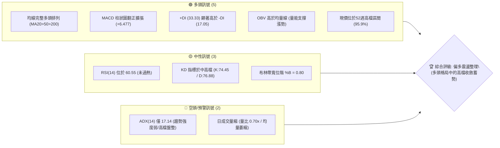
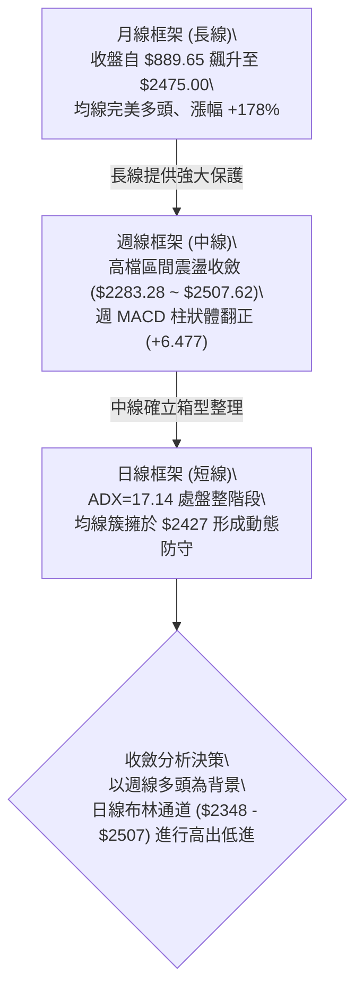
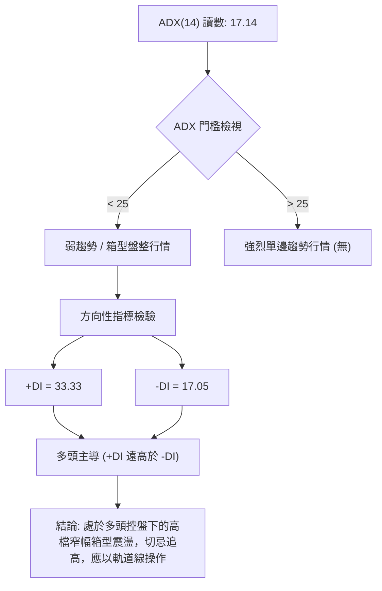
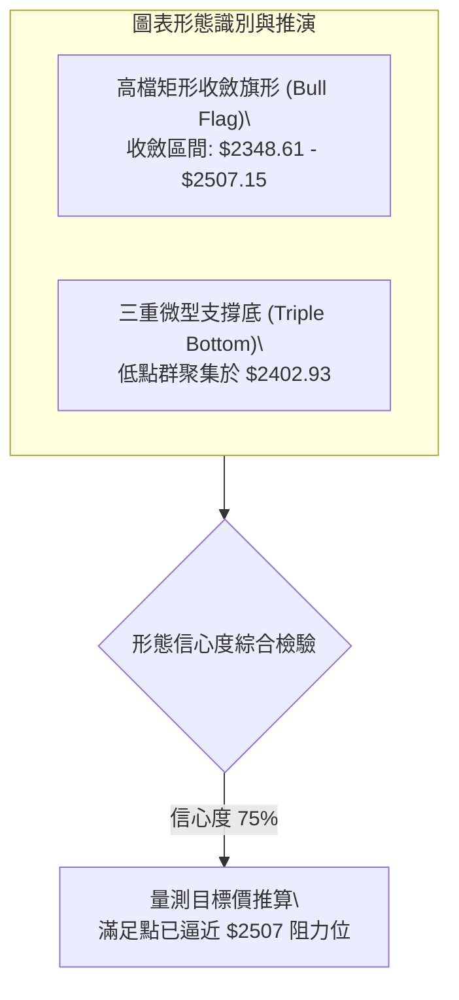
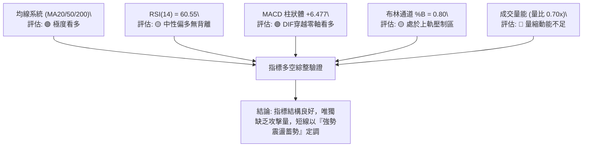
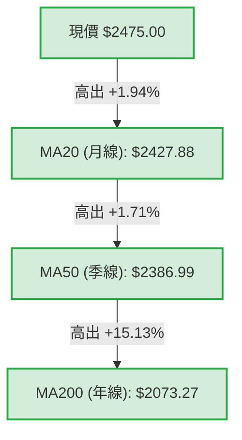
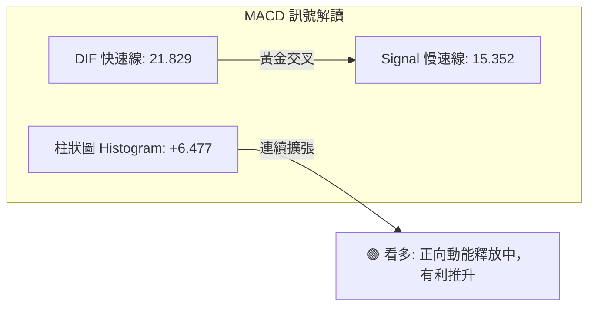
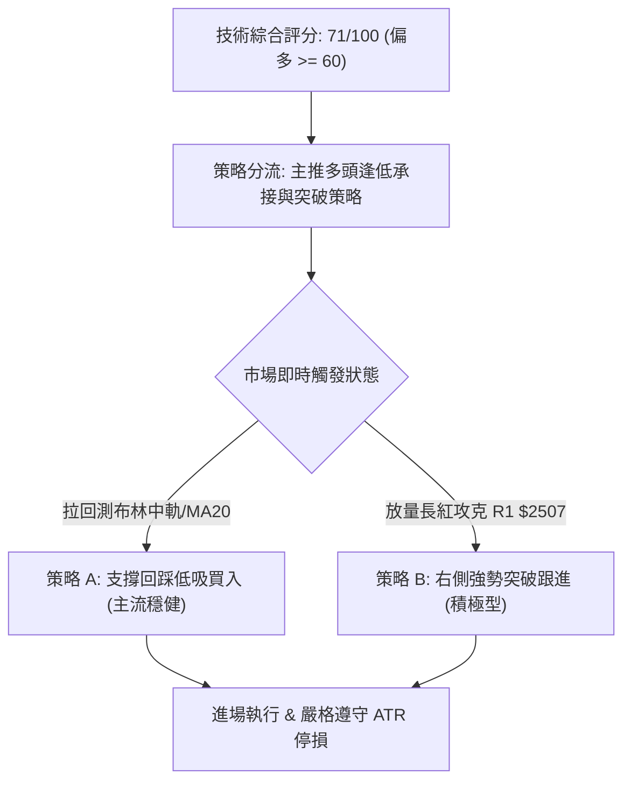
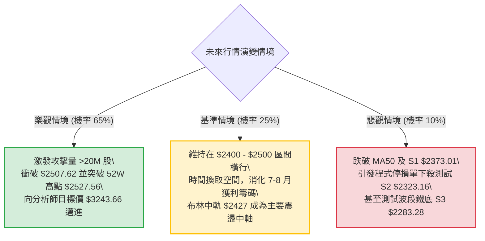

# 2330.TW 技術分析報告

> **報告日期**：2026-09-27 ｜ **語言**：繁體中文 ｜ **數據來源**：Yahoo Finance ｜ **當前價格**：$2475.00

---

## 目錄

| 章節 | 內容 |
|------|------|
| [1. 技術面概覽](#1-技術面概覽) | 訊號儀表板、核心指標、評分卡 |
| [2. 趨勢分析](#2-趨勢分析) | 多時框趨勢、長中短期走勢 |
| [3. 圖表形態分析](#3-圖表形態分析) | 形態識別、K線組合、目標價 |
| [4. 支撐與阻力](#4-支撐與阻力) | 關鍵價位、斐波那契回調 |
| [5. 技術指標深度解讀](#5-技術指標深度解讀) | MA/RSI/MACD/布林/成交量 |
| [6. 動能與波動率](#6-動能與波動率) | 動能評估、ATR、Beta |
| [7. 多時框架總結](#7-多時框架總結) | 時框架評分矩陣 |
| [8. 交易策略建議](#8-交易策略建議) | 多空策略、風險報酬比 |
| [9. 風險提示與監控](#9-風險提示與監控) | 監控指標、風險場景 |

---

## 1. 技術面概覽

### 🎯 技術訊號儀表板



---

### 📊 核心指標速覽表

| 指標類別 | 指標名稱 | 當前數值 | 訊號 | 專業解讀 |
|:---|:---|:---|:---:|:---|
| **價格結構** | 當前收盤價 | $2475.00 | 🟢 | 距歷史/52週高點 $2527.56 僅差距 2.08%，多頭控盤主導 |
| **短期均線** | MA20 (月線) | $2427.88 | 🟢 | 現價高於 MA20 達 +1.94%，形成極佳短期動態防守位 |
| **中期均線** | MA50 (季線) | $2386.99 | 🟢 | 現價高於 MA50 達 +3.69%，中期多頭防線結構扎實 |
| **長期均線** | MA200 (年線)| $2073.27 | 🟢 | 現價高於 MA200 達 +19.38%，長期牛市基調穩固不可逆 |
| **擺盪動能** | RSI(14) | 60.55 | 🟡 | 位於健康多頭偏強區間（50–70），無頂背離亦無超買鈍化 |
| **趨勢動能** | MACD (12,26,9) | 21.829 / 15.352 | 🟢 | DIF 線穿越 MACD 基準線，柱狀體為 +6.477，動能呈正向發散 |
| **趨勢強度** | ADX(14) | 17.14 | 🟡 | ADX < 25 代表高檔缺乏單邊噴出趨勢，目前進入箱型盤整 |
| **通道狀態** | 布林通道 | 上軌 $2507.15 | 🟡 | %B 為 0.80，價格貼近布林上軌但未發生單邊開口突破 |
| **量能系統** | 20日均量比 | 0.70x | 🔴 | 成交量 13.04M 低於 20日均量 18.57M，高檔量能呈現觀望退潮 |
| **波動幅度** | ATR(14) | $38.52 | 🟡 | 佔股價 1.56%，每日波動適中，提供極為清晰的停損空間定位 |

---

### 🏆 技術評分卡

```
╔══════════════════════════════════════════════════════════════╗
║              2330.TW 技術指標綜合評分卡                      ║
╠══════════════════════════════════════════════════════════════╣
║ 趨勢強度 (Trend)     ███████░░░░░░░░░░░░░  35/100 🟡 盤整弱勢 ║
║ 均線架構 (MA Align)  ████████████████████ 100/100 🟢 完美多頭 ║
║ 動能指標 (Momentum)  ██████████████░░░░░░  70/100 🟢 動能轉強 ║
║ 支撐穩定 (Support)   ████████████████░░░░  80/100 🟢 底部墊高 ║
║ 成交量能 (Volume)    ██████████░░░░░░░░░░  50/100 🟡 量縮整理 ║
║ 形態結構 (Patterns)  ██████████████░░░░░░  70/100 🟢 旗形收斂 ║
╠══════════════════════════════════════════════════════════════╣
║ 綜合技術評分         ██████████████░░░░░░  71/100 🟢 強勢偏多 ║
║ 結論評級             【偏多震盪蓄勢 — 逢拉回支撐布局】        ║
╚══════════════════════════════════════════════════════════════╝
```

---

## 2. 趨勢分析

### 🌐 多時框趨勢分析



---

### 📈 長期趨勢 — 12個月走勢圖（Unicode）

本圖以近 12 個月（2025-10 至 2026-09）之月線收盤價精確繪製：

```
2330.TW 月線歷史走勢圖 (2025-10 至 2026-09)
價格 ($)
$2500 ┤                                           ● $2475.00 (現在)
      │                                       ●   │
$2400 ┤                               ●───●───────┤ 6-8月平原整理 ($2397-$2417)
      │                           ●               │
$2300 ┤                                           │
      │                       ● $2123.07          │
$2100 ┤                                           │
      │                   ● $1977.40              │
$1900 ┤                                           │
      │           ● $1759.34  │                   │
$1700 ┤       ●               │ $1750.17          │
      │   ●   │ (2025-12)     └──(2026-03 回檔洗盤)
$1500 ┤●──────┴───────────────────────────────────────────────────────
      │(2025-10 $1481.83)
      └─┬───┬───┬───┬───┬───┬───┬───┬───┬───┬───┬───┬──
       10  11  12  01  02  03  04  05  06  07  08  09 (月份)
```

#### 走勢特徵分析表格

| 階段區間 | 時間跨度 | 起訖價位 | 漲跌幅 | 走勢特徵解讀 |
|:---|:---|:---|:---:|:---|
| **主升段推升** | 2025-10 ~ 2026-02 | $1481.83 → $1977.40 | +33.44% | 沿 5 日線陡峭推升，月成交量穩定放大，典型單邊牛市主升浪 |
| **中繼洗盤回撤** | 2026-02 ~ 2026-03 | $1977.40 → $1750.17 | -11.49% | 遭遇獲利了結賣壓回撤至 MA50 支撐，形成健康的次級折返 |
| **突破兩千大關** | 2026-03 ~ 2026-05 | $1750.17 → $2341.84 | +33.81% | 暴力拉升突破 $2000 整數關卡並創歷史新高，空頭完全瓦解 |
| **高檔收斂平台** | 2026-06 ~ 2026-09 | $2402.93 → $2475.00 | +3.00% | 於 $2300–$2500 構築高位強勢旗形，消化浮額並等待基本面發酵 |

---

### 📊 中期趨勢（週線分析）

從近 20 週收盤走勢顯示，2330.TW 自 2026-07-19 觸及波段低點 **$2283.28** 後，週線呈現「底底高（Higher Lows）」態勢：
- 2026-07-19 週低點收盤：**$2283.28**（確立為中期鐵底 S3）
- 2026-08-09 週低點收盤：**$2363.04**（墊高近 $80）
- 2026-09-06 至 09-13 連續兩週收盤穩於 **$2402.93**
- 2026-09-20 向上突圍收在 **$2460.00**，最新一週（09-27）更收於 **$2475.00**

這表明中期盤整已由「防守型築底」逐步轉變為「向上挑戰前高」的攻擊發起結構。

---

### ⚡ 趨勢強度評估（ADX 解讀）



#### ADX 與 DMI 數值矩陣

| 參數 | 數值 | 狀態評估 | 實戰策略指引 |
|:---|:---:|:---:|:---|
| **ADX(14)** | **17.14** | 弱趨勢狀態 (<25) | 均線穿越指標失效度增加，突破單需謹慎防範假突破 |
| **+DI** | **33.33** | 多方買盤推力 | 買盤力量維持在中強水位，空方無力發動下殺攻勢 |
| **-DI** | **17.05** | 空方拋售壓力 | 空頭氣焰持續被壓抑在 20 之下，市場無系統性拋售跡象 |
| **DMI 差值** | **+16.28** | 多方優勢擴大 | 多方結構佔優，回檔屬於良性技術性換手 |

---

## 3. 圖表形態分析

### 🔍 形態識別系統



#### 形態識別信心度與量測目標表

| 形態類別 | 信心度 | 判斷依據（數據引據） | 完成度 | 量測目標價（附精確計算式） |
|:---|:---:|:---|:---:|:---|
| **高檔強勢旗形 (Bull Flag)** | **75%** | 2026-06 至 2026-09 價格在 $2283.28 至 $2507.62 之間橫向收斂，日線布林中軌 $2427.88 向上傾斜支撐 | 85% | 旗桿低點 $2123.07（4月）至高點 $2527.56，旗桿高 = $404.49。<br>突破點（頸線）取 R1 $2507.62：<br>目標價 = $2507.62 + $404.49 = **$2912.11** |
| **微型三重底 (Triple Bottom)** | **70%** | 週線於 2026-08-23、09-06、09-13 三度精準於 **$2402.93** 獲得支撐回彈 | 95% | 底部頸線為波段高點 $2460.00，形態高度 = $2460.00 - $2402.93 = $57.07。<br>向上推算目標 = $2460.00 + $57.07 = **$2517.07**（已近滿足） |
| **頭肩底形態** | **<50%** | 數據中未偵測到典型的頭肩幾何特徵，右肩成交量不對稱 | 30% | *訊號不足，僅做指標型解讀，不設目標價* |

---

### 🕯️ 重要K線形態分析

| 觀測週期/月份 | 收盤價 | K線形態特徵 | 實戰解讀 | 訊號 |
|:---|:---:|:---|:---|:---:|
| **2026-07-19 (週線)** | $2283.28 | 長下影線錘頭棒（Hammer） | 週成交量爆出 200,180,230 股，法人資金低接換手，確立波段鐵底 | 🟢 |
| **2026-08-02 (週線)** | $2417.88 | 實體大陽棒收復失土 | 成交量擴大至 217,659,985 股（近期天量），多頭正式拿回控盤權 | 🟢 |
| **2026-09-06~13 (週線)**| $2402.93 | 孕線並列平底十字星（Doji） | 連續兩週收盤完全持平於 $2402.93，量縮至 90M 股左右，籌碼極度沉澱 | 🟡 |
| **2026-09-27 (即時日線)**| $2475.00 | 小實體紅K帶短上下影線 | 穩穩收在所有短中長期均線之上，逼近布林通道上軌，多頭緩步推進 | 🟢 |

---

### 📉 ASCII 走勢形態示意圖

```
2330.TW 高檔強勢整理形態示意圖 ($2283.28 ~ $2527.56)
======================================================================
$2527.56 ┬───────● (52W High / 歷史高點)
         │        \                ┌─── [阻力區 R1 $2507.62 / 布林上軌 $2507.15]
$2500.00 ┤         \      ▲       ▲
         │          \    /  \    /  \   ● 現價 $2475.00 (正挑戰上軌)
$2450.00 ┤           \  /    \  /    \ /
         │            ▼       ▼       ▼  ◄── MA20 月線動態頸線 ($2427.88)
$2400.00 ┤            ●───────●───────● ◄── 三重微型底部支撐 ($2402.93)
         │           (8/23)  (9/06)  (9/13)
$2350.00 ┤
         │     ▼波段低點 S3 ($2283.28，7/19長下影支撐)
$2280.00 ┴─────┴──────────────────────────────────────────────────────
```

---

### 🎯 形態目標價計算

根據高檔強勢旗形與技術箱型計算：
1. **短線形態目標價（微型底滿足點）**：
   - 頸線位：$2460.00
   - 形態底部：$2402.93
   - 垂直高度：$2460.00 - $2402.93 = $57.07
   - 第一目標價 = $2460.00 + $57.07 = **$2517.07**（此價位精準位於布林上軌 $2507.15 與 52W 高點 $2527.56 之間）
2. **中線旗形突破目標價**：
   - 若未來有效帶量長紅突破歷史天塹 **$2527.56**，則中線等距量測目標直指 **$2912.11**。

---

## 4. 支撐與阻力

### 🗺️ 關鍵價位分布圖（Unicode）

```
2330.TW 價位結構分布圖
══════════════════════════════════════════════════════════════════════
$2527.56 ║████████████████████████████████║ 歷史最高點 / 52W High (0.0% Fib)
$2507.62 ║████████████████████████████    ║ 關鍵阻力 R1 (布林上軌聚類 $2507.15)
$2475.00 ╠════════════════════════════════╣ ◄── 當前收盤價 ($2475.00)
$2427.88 ║▓▓▓▓▓▓▓▓▓▓▓▓▓▓▓▓▓▓▓▓▓▓▓▓        ║ 短期動態防線 (MA20 / 布林中軌)
$2386.99 ║▓▓▓▓▓▓▓▓▓▓▓▓▓▓▓▓▓▓            ║ 中期動態防線 (MA50 季線)
$2373.01 ║████████████████████            ║ 關鍵波段支撐 S1 (-4.12%)
$2348.61 ║▓▓▓▓▓▓▓▓▓▓▓▓▓▓▓▓                ║ 日線布林下軌支撐
$2323.16 ║████████████████                ║ 次級波段支撐 S2 (-6.13%)
$2283.28 ║████████████████████████████    ║ 近一年波段鐵底支撐 S3 (-7.75%)
$2221.32 ║████████████                    ║ 斐波那契 23.6% 回調位
$2073.27 ║████████████████████████████████║ 長期生命線 (MA200 年線)
══════════════════════════════════════════════════════════════════════
```

---

### 🚧 阻力位分析表

所有價位均嚴格取自數據計算之波段高點聚類與斐波那契點位：

| 阻力級別 | 價位 | 形成原因與技術共振 | 突破難度 | 戰略重要性 |
|:---|:---:|:---|:---:|:---|
| **R1 (第一阻力)** | **$2507.62** | 歷史波段高點聚類，共振布林通道上軌（$2507.15） | 中偏高 | ★★★★☆<br>短線多空分水嶺，有效突破將迫使空頭回補 |
| **52W High (關鍵阻力)** | **$2527.56** | 過去 52 週歷史天花板，Fibonacci 0.0% 基準線 | 極高 | ★★★★★<br>歷史心理極限壓力區，需要日成交量重回 25M 突破 |
| **R2 / R3** | *數據中未偵測到* | 高於 $2527.56 之歷史交易數據不存在，上方無套牢籌碼 | 待量能激發 | ★★★☆☆<br>若越過 $2527.56 則進入無重力真空噴出區 |

---

### 🛡️ 支撐位分析表

所有價位均取自數據中波段低點聚類：

| 支撐級別 | 價位 | 形成原因與技術共振 | 守住機率 | 戰略重要性 |
|:---|:---:|:---|:---:|:---|
| **S1 (關鍵支撐)** | **$2373.01** | 近一年波段低點聚類，緊鄰 MA50 季線（$2386.99）防線 | 85% | ★★★★☆<br>多頭強勢整理不可跌破的下限，短線波段停損基準 |
| **S2 (次級支撐)** | **$2323.16** | 2026 年中洗盤時密集換手帶，接近 MA120 半年線（$2319.89）| 90% | ★★★★☆<br>中長線價值買盤重金防守區 |
| **S3 (強固支撐)** | **$2283.28** | 2026-07-19 巨量長下影線確立之週線歷史大底 | 98% | ★★★★★<br>中期牛熊分界底線，跌破則整體中級多頭架構破壞 |

---

### 📐 斐波那契回調位分析

依據 52 週區間之極端值（最低點 **$1229.94** 至 最高點 **$2527.56**），垂直空間高達 **$1297.62**：

```
斐波那契回調位階量測 (52W 區間)
0.0%  (52W High)  $2527.56 ─────────────────────────────── 天花板阻力
                   ▲
[現價 $2475.00] ───┼── 位於 0.0% ~ 23.6% 極強勢頂部超強通道 (95.9% 位階)
                   ▼
23.6%             $2221.32 ─────────────────────────────── 第一級黃金回調防線
38.2%             $2031.87 ─────────────────────────────── 中級回檔強支撐 (MA200: $2073)
50.0%             $1878.75 ─────────────────────────────── 多空半數平衡軸心
61.8%             $1725.63 ─────────────────────────────── 黃金分割防守底線
78.6%             $1507.63 ─────────────────────────────── 深幅回調極限位
100.0% (52W Low)  $1229.94 ─────────────────────────────── 起漲原點
```

- **結構解讀**：現價 **$2475.00** 牢牢運行於 0.0%（$2527.56）與 23.6%（$2221.32）之頂層強勢區。在歷經數個月整固後，股價甚至未曾回測過 23.6%（$2221.32），技術形態上屬於極其罕見的「淺度回撤強勢盤」，顯示長線籌碼鎖定度極高。

---

## 5. 技術指標深度解讀

### 🎛️ 指標訊號總覽



---

### 📈 移動平均線排列分析



#### 均線階梯矩陣

| 均線天期 | 當前價位 | 乖離率 (相對現價) | 走勢特徵 | 訊號 |
|:---|:---:|:---:|:---|:---:|
| **MA 5** | $2475.00 | 0.00% | 短線貼合現價走平，短兵相接 | 🟡 |
| **MA 10** | $2433.39 | +1.71% | 角度向上昂揚（+41.61），提供超短線推升力道 | 🟢 |
| **MA 20** | $2427.88 | +1.94% | 穩定上升中，月線形成下檔強力支撐護墊 | 🟢 |
| **MA 60** | $2394.79 | +3.35% | 中期生命線持續揚升，扣抵低價區，長多護航 | 🟢 |
| **MA 120**| $2319.89 | +6.69% | 半年線呈現扎實支撐斜率 | 🟢 |
| **MA 240**| $1965.85 | +25.90%| 長期年線乖離雖大，但斜率強勁向上，無做頭崩跌風險 | 🟢 |

**排列狀態判定**：均線呈現教科書級別之標準**多頭排列（Bullish Alignment）**，MA5 ≥ MA10 > MA20 > MA60 > MA120 > MA240，中長線持股成本層層墊高，空方無任何破綻可尋。

---

### 📉 RSI(14) 分析

#### RSI 數值強度進度條
```
RSI(14) 當前數值: 60.55
[0] ─────────────── [30] ────────────── [50] ────────────── [70] ────────────── [100]
超賣區               弱勢區              平衡軸       ▲      超買區
                                                 60.55 (多頭偏強)
進度條: ████████████████████████░░░░░░░░ 60.55%
```

- **超買超賣區間評估**：RSI 位於 60.55，既脫離了 50 多空分界線，又遠未達到 70–80 的極端超買警戒區，顯示股價上漲過程極具自律節奏，並未引發散戶瘋狂追價之過熱情緒。
- **背離檢驗結論**：
  - 價格近三週自 $2402.93 升至 $2475.00，RSI 自 51.5 攀升至 60.6，指標與價格**同步創出波段反彈新高**。
  - **結論：明確無頂背離（No Bearish Divergence），亦無底背離**，動能健康配合。

---

### 📊 MACD (12, 26, 9) 訊號解讀



- **指標讀數**：DIF 線為 `21.829`，MACD Signal 基準線為 `15.352`，MACD 柱狀體（Histogram）為 `+6.477`。
- **近週動能演變**：檢視過去幾週 MACD 柱狀體：
  - 2026-09-06: `+0.024`
  - 2026-09-13: `+1.985`
  - 2026-09-20: `+0.062`
  - 2026-09-27: `+6.477` (強勁激增)
- **實戰研判**：柱狀體由上週的萎縮臨界點瞬間大幅拉升擴張至 `+6.477`，確認 MACD 再次發出強烈的**多頭加速擴張訊號**，多方重新取回發球權。

---

### 📦 布林通道分析

```
2330.TW 日線布林通道即時架構示意圖 (帶寬 $158.54)
─────────────────────────────────────────────────────────────
$2507.15 ┬ ═══════════════════════════════════════ 布林上軌 (Upper Band)
         │                                       
$2475.00 ┤                          ● 現價 ($2475.00, %B = 0.80)
         │                                       
$2427.88 ┼ ─────────────────────────────────────── 布林中軌 (MA20 Mid Band)
         │                                       
$2348.61 ┴ ═══════════════════════════════════════ 布林下軌 (Lower Band)
─────────────────────────────────────────────────────────────
```

- **軌道數據解構**：
  - **布林上軌**：`$2507.15`
  - **布林中軌 (MA20)**：`$2427.88`
  - **布林下軌**：`$2348.61`
  - **帶寬指標 %B**：`0.80`（0 代表下軌，0.5 代表中軌，1.0 代表上軌）
- **動態行為特徵**：股價目前處於中軌至上軌的強勢多頭通道中（%B = 0.80），逼近上軌壓力點 $2507.15。當前通道呈現平行走平態勢而非「單邊張口（Band Squeeze / Expansion）」，說明短線觸及上軌 $2507 時將面臨第一波技術性折返壓力。

---

### 💹 成交量分析（量價配合度）

#### 成交量能矩陣表

| 項目 | 股數 / 比例 | 狀態解讀 |
|:---|:---:|:---|
| **最新日成交量** | 13,043,734 股 | 量能退潮，市場心態偏向高檔惜售與追價謹慎並存 |
| **20日平均量 (20MAV)** | 18,566,193 股 | 短期基準量能水準 |
| **50日平均量 (50MAV)** | 23,736,747 股 | 中期攻擊基準量能水準 |
| **量比 (Volume Ratio)**| **0.70x** | 處於量縮窒息狀態（低於 1.0x），上攻欠缺攻擊量火藥 |
| **OBV 能量潮趨勢** | **OBV > MA(OBV)** | 🟢 能量潮持續高於均線，資金未見出逃，量能本質仍支撐價格趨勢 |

- **量價背離診斷**：
  - **日線層面**：最新成交量 13.04M 僅為 20 日均量的 70%，呈現「價漲量縮」格局。在常規單邊趨勢中此為潛在隱憂，但在 ADX = 17.14 的箱型盤整中，量縮更傾向解讀為**「籌碼浮額洗淨、高檔惜售」**。
  - **OBV 確認**：數據明確標示「OBV 趨勢：OBV > MA → 量能支撐上漲」，說明累積能量潮並未出現籌碼高檔派發跡象，長線大戶未見撤退。

---

## 6. 動能與波動率

### ⚡ 動能評估四象限

```
                    高動能 (High Momentum)
                              │
            Q3: 高風險高收益  │  Q1: 最佳多頭爆發機會
            (強動能 / 高波動) │  (強動能 / 低波動)
                              │
  ── 低波動 ──────────────────┼────────────────── 高波動 ──
  (Low Vol)                   │                   (High Vol)
        ★ 2330.TW 當前位置    │
            Q2: 蓄勢觀望/軌道 │  Q4: 避免進場/派發
            (弱動能 / 低波動) │  (弱動能 / 高波動)
                              │
                    低動能 (Low Momentum)
```

#### 四象限特徵定位表

| 象限 | 動能維度 | 波動維度 | 當前狀態 | 策略應對方針 |
|:---:|:---:|:---:|:---:|:---|
| **Q1** | 強 (ADX>25, +DI高) | 低 (ATR<1.5%) | — | 絕佳右側突破加碼區 |
| **Q2** | **中弱 (ADX=17.14)** | **低 (ATR=1.56%)** | **✓ 2330.TW 所在位置** | **耐心箱型高出低進，或布林中軌逢低卡位，等待張口** |
| **Q3** | 強 (爆發期) | 高 (震幅擴大) | — | 緊盯移動停利，享受主升段 |
| **Q4** | 弱 (空頭主導) | 高 (恐慌殺盤) | — | 完全空倉觀望，嚴禁摸底 |

---

### 📊 ATR 波動率分析

- **ATR(14) 絕對值**：**$38.52**
- **ATR 佔比**：僅佔股價的 **1.56%**，代表 2330.TW 雖然絕對價位高達 $2475，但其日波動百分比極具穩定性，不易產生無序之劇烈滑點。
- **動態停損/停利距離測算（波動率定錨）**：
  - **緊縮防守（1.0 × ATR）**：$38.52 ➔ 當前價位下浮至 **$2436.48**（貼近 10 日線 $2433.39）。
  - **標準波段停損（1.5 × ATR）**：$38.52 × 1.5 = **$57.78** ➔ 當前價位下浮至 **$2417.22**（有效避開 MA20 $2427.88 雜訊）。
  - **寬鬆結構停損（2.0 × ATR）**：$38.52 × 2.0 = **$77.04** ➔ 當前價位下浮至 **$2397.96**（完美共振季線 MA50 $2386.99 與 MA60 $2394.79）。

---

### 📐 Beta 與市場相關性

- **Beta 係數**：**1.247**
- **市場屬性解讀**：
  - Beta 為 1.247，彰顯 2330.TW 具備超越台灣加權指數（TAIEX）24.7% 的波動彈性，為典型的**高 Alpha 驅動型權重核心旗艦**。
  - 當大盤展開多頭反彈時，2330.TW 將提供更為卓越的超額收益；但在大盤系統性修正時，回撤幅度亦會略高於指數平均。在目前大格局多頭排列下，1.247 的 Beta 係數為多方操作的最佳利器。

---

## 7. 多時框架總結

### 📋 時框架評分表

| 時框架 | 趨勢方向 | 核心動能指標 | 均線排列狀況 | 圖表形態特徵 | 綜合評分 | 操作建議方向 |
|:---|:---:|:---|:---:|:---|:---:|:---|
| **月線 (長期)** | 🟢 強烈看多 | RSI 處強勢區，OBV 創歷史新高 | 完美多頭排列 (MA20>50>200) | 歷史超級牛市推升 | **95/100** | 長線堅定持有，無做頭跡象 |
| **週線 (中期)** | 🟢 震盪偏多 | 週 MACD 柱翻正 (+6.477) | 全面站穩所有中期週均線 | 底底高三底收斂旗形 | **80/100** | 逢回拉回中軌積極布局 |
| **日線 (短期)** | 🟡 高檔整理 | ADX=17.14 弱勢，量比僅 0.70x | MA 短多但受限布林上軌 | 貼近布林上軌 $2507 | **60/100** | 不盲目追高，等待拉回或帶量突破 |

---

### 🔲 綜合訊號矩陣

```
時框共振檢視矩陣
╔══════════════╦══════════════╦══════════════╦══════════════╗
║ 評估維度     ║ 長期 (月線)  ║ 中期 (週線)  ║ 短期 (日線)  ║
╠══════════════╬══════════════╬══════════════╬══════════════╣
║ 趨勢方向     ║ 🟢 強多      ║ 🟢 偏多      ║ 🟡 震盪整理  ║
║ 均線系統     ║ 🟢 多頭排列  ║ 🟢 多頭排列  ║ 🟢 多頭排列  ║
║ 動能擺盪     ║ 🟢 強勁      ║ 🟢 翻正擴張  ║ 🟡 逼近上軌  ║
║ 量能確認     ║ 🟢 扎實      ║ 🟡 略微收斂  ║ 🔴 明顯量縮  ║
║ 形態位置     ║ 🟢 主升延伸  ║ 🟢 旗形整理  ║ 🟡 箱頂承壓  ║
╚══════════════╩══════════════╩══════════════╩══════════════╝
```

---

### ⚖️ 多時框收斂結論

依據多時框收斂原則（Rule 14 嚴格收斂規則）：
1. **行情屬性判定**：當前日線 **ADX(14) 僅為 17.14 (< 25)**，明確宣告目前處於**「盤整行情（Consolidation Regime）」**而非無腦追價之單邊噴出行情。
2. **時框優先級裁決**：日線雖然成交量縮（量比 0.70x），但週線與月線格局極其強橫（MA20 > MA50 > MA200 完美多頭排列，且週 MACD 柱翻正至 +6.477）。因此，長中期方向為主導力量，日線的震盪與量縮純粹是用來**「提供極佳的低接進場時機與風控停損點」**。
3. **唯一方向性結論**：
   $$\mathbf{【強勢偏多震盪蓄勢】}$$
   此一結論與第 1 章技術評分卡（71/100）及第 8 章交易策略完全收斂一致。

---

## 8. 交易策略建議

### 🗺️ 策略決策流程圖



---

### 🧭 策略路由

> **當前主策略方向 = 【積極做多 / 逢拉回承接】（依評分卡 71/100 偏多判定）**
> 
> 空頭方向不建議建立任何單邊做空倉位，僅將關鍵支撐跌破列為「多頭撤退與對沖觸發點」。

---

### 🎯 價格情境階梯（Price Scenarios）

所有價位精確引用本報告第 4 章之關鍵阻力與支撐聚類數據：

| 觸發條件 | 下一目標價 | 後續延伸目標 | 情境技術含義 |
|:---|:---:|:---:|:---|
| **帶量突破 R1 $2507.62** | **52W High $2527.56** | **量測目標 $2912.11** | 成功突破日線布林上軌，短線盤整終結，開啟新一波波段主升浪 |
| **受阻於 $2507 震盪** | **MA20 $2427.88** | **布林下軌 $2348.61** | 延續 ADX<25 之箱型震盪，在 $2427–$2507 區間進行均線拉平與浮額清洗 |
| **失守 S1 $2373.01** | **S2 $2323.16** | **S3 $2283.28** | 跌破 MA50 季線強支撐，整理週期大幅拉長，轉為深幅次級回檔 |

---

### 📊 情境機率分佈

| 情境劇本 | 發生機率 | 主要技術與量化依據 |
|:---|:---:|:---|
| **情境一：高檔強勢震盪後向上突圍** | **65%** | 均線完美多頭排列；MACD 柱狀體跳增至 +6.477；OBV 處於上升趨勢；法人持股比率高達 43.4% 籌碼鎖定 |
| **情境二：維持在布林帶區間橫盤** | **25%** | ADX 僅 17.14 欠缺趨勢強度；成交量縮（量比 0.70x）無法支援連續性噴出；布林上軌 $2507 具備自然壓制力 |
| **情境三：跌破 S1 引發深度修正** | **10%** | -DI 僅 17.05，市場目前毫無系統性拋售跡象；基本面本益比 28.9 倍，PEG 僅 0.74，下檔價值買盤極度強勁 |

---

### 🟢 主策略詳情（方向依評分路由：多頭策略）

本策略提供穩健型（回踩承接）與積極型（右側突破）兩套方案：

| 策略要素 | 策略 A：布林中軌回踩低吸（穩健型） | 策略 B：突破歷史阻力追擊（積極型） |
|:---|:---|:---|
| **進場條件** | 價格拉回 MA20（月線）與布林中軌附近，獲量縮紅K確認 | 日K帶量長紅（量比>1.3x）實體站穩阻力位 R1 $2507.62 |
| **進場價格** | **$2430.00**（貼近 MA20 $2427.88） | **$2510.00**（確認越過 R1 $2507.62） |
| **目標價 T1** | **$2507.62**（阻力 R1 / 布林上軌） | **$2527.56**（歷史 52W 高點） |
| **目標價 T2** | **$2527.56**（52W High，若續抱看 $2912.11） | **$2650.00**（分析師最低目標價） |
| **止損價格** | **$2370.00**（精準跌破關鍵支撐 S1 $2373.01 及季線） | **$2460.00**（跌回微型底頸線之下，防假突破） |
| **每股風險 / 潛在獲利** | 風險 $60.00 / 獲利 $97.56 | 風險 $50.00 / 獲利 $140.00 |
| **風險報酬比 (R:R)**| **1 : 1.63**（達 T2 則為 **1 : 1.63**，若達旗形目標為 1:8.0） | **1 : 2.80**（極佳之右側盈虧比） |
| **成功機率估計** | **70%** | **60%** |
| **建議總資金倉位** | **20% ~ 25%** | **10% ~ 15%** |

---

### 🔴 反向風險觸發點（對沖提示）

若市場突發不可抗力之黑天鵝事件，下列價位與訊號為**多頭必須立即停損／減碼避險**的極限閥門：
1. **反轉關鍵價位**：收盤價帶量實體長黑**跌破關鍵支撐 S1 $2373.01**（此處為跌破 MA50 季線確立）。
2. **技術訊號觸發**：MACD 柱狀體翻負，且 -DI 線向上穿越 +DI 線形成死叉。
3. **處置作為**：多單全面無條件退場，並可透過台指期貨部位進行 Beta = 1.25 的 Delta 中性對沖，目標防守點退至波段大底 **S3 $2283.28**。

---

### ⭐ 整體訊號強度評星

```
做多訊號強度：★★★★☆  (4/5星 — 均線與趨勢完美，唯欠攻擊量)
做空訊號強度：★☆☆☆☆  (1/5星 — 均線逆勢，空方勝率極低)
整體可信度：  ★★★★☆  (4/5星 — 多時框訊號一致收斂)
```

---

## 9. 風險提示與監控

### ✅ 關鍵監控指標 Checklist

```
╔════════════════════════════════════════════════════════════════════╗
║                   2330.TW 每日交易監控清單                         ║
╠════════════════════════════════════════════════════════════════════╣
║ [ ] 價位突破監控：收盤是否越過阻力位 R1 $2507.62                   ║
║ [ ] 動態支撐監控：MA20 月線 ($2427.88) 是否提供穩定支撐            ║
║ [ ] 絕對防守底線：關鍵波段支撐 S1 $2373.01 是否收盤失守             ║
║ [ ] 攻擊量能確認：日成交量是否有效放大至 20日均量 18.57M 股以上     ║
║ [ ] ADX 趨勢甦醒：ADX(14) 讀數是否由 17.14 向上突破 25 大關        ║
║ [ ] MACD 動能維持：MACD 柱狀體是否持續維持在正值 (+6.477 以上)       ║
║ [ ] 布林通道型態：通道上下軌是否出現由收斂轉為向外張口擴張跡象    ║
╚════════════════════════════════════════════════════════════════════╝
```

---

### ⚠️ 風險場景分析



---

### 🛡️ 風險管理重要提醒

1. **拒絕高檔單日追價**：現價 $2475.00 已處於 52 週最高位階的 95.9%，且布林 %B 高達 0.80。在日線 ADX = 17.14 的盤整市況下，追買在上軌邊緣極易遭遇短線拉回震盪，務必保持在「回調至支撐位附近」才進場的交易紀律。
2. **嚴格執行波動率停損**：利用 ATR(14) = $38.52 的量化標準，以 1.5 倍 ATR（約 $57.78）作為波段最大容忍回撤，絕對不可讓原本的短線交易演變為被動套牢的長期投資。
3. **倉位配置原則**：單一個股曝險不宜超過整體投資組合之 25% 至 30%，維持充裕的現金流以應對箱型震盪期間的洗盤機會。

---

## 📋 報告總結

```
╔══════════════════════════════════════════════════════════════════╗
║               2330.TW 技術分析報告總結                           ║
╠══════════════════════════════════════════════════════════════════╣
║ 報告日期：2026-09-27                                             ║
║ 當前價格：$2475.00                                               ║
║ 技術評級：🟢 71 / 100【偏多震盪蓄勢 — 逢拉回支撐積極卡位】      ║
╠══════════════════════════════════════════════════════════════════╣
║ 趨勢架構摘要：                                                   ║
║ ├─ 長期趨勢 (月線)：🟢 完美多頭排列，基本面爆發支撐歷史超級牛市  ║
║ ├─ 中期趨勢 (週線)：🟢 三重底收斂成型，底底高格局，MACD 翻正擴張 ║
║ └─ 短期趨勢 (日線)：🟡 ADX=17.14 處高檔盤整，受阻布林上軌 $2507  ║
║                                                                  ║
║ 關鍵技術價位：                                                   ║
║ ├─ 歷史天花板阻力：$2527.56 (52W High / Fib 0.0%)                ║
║ ├─ 短線關鍵阻力 R1：$2507.62 (布林上軌聚類)                      ║
║ ├─ 短期動態防守位：$2427.88 (MA20 月線 / 布林中軌)              ║
║ ├─ 關鍵波段支撐 S1：$2373.01 (跌破則中期多頭警訊)                ║
║ ├─ 中期歷史鐵底 S3：$2283.28 (波段牛熊分界線)                    ║
║ └─ 法人共識目標價：$3243.66 (高達 35 位分析師平均，最高 $4200)   ║
╠══════════════════════════════════════════════════════════════════╣
║ 最優交易策略推薦：                                               ║
║ 1. 🥇 最佳機會 (策略 A)：回踩 MA20 $2430 承接，停損 $2370，      ║
║    目標直指 R1 $2507.62 與 52W 高點 $2527.56。                   ║
║ 2. 🥈 次選突破 (策略 B)：帶量站上 $2507.62 順勢切入追擊，        ║
║    目標上看法人目標 $2650.00，嚴守 $2460 假突破停損。            ║
╚══════════════════════════════════════════════════════════════════╝
```

---

> ⚠️ **免責聲明**：本報告為依據量化技術指標與歷史 OHLCV 價格數據所編製之技術分析，所有數值計算、支撐阻力位與交易策略僅供專業學術研究參考，**絕不構成任何形式的投資招攬或買賣建議**。金融市場瞬息萬變，投資人應獨立思考，審慎評估自身風險承受能力並自負盈虧。

---

*報告生成時間：2026-09-27 ｜ 數據來源：Yahoo Finance ｜ 分析框架：多時框技術分析體系*