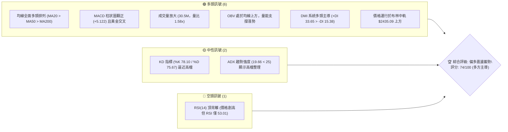
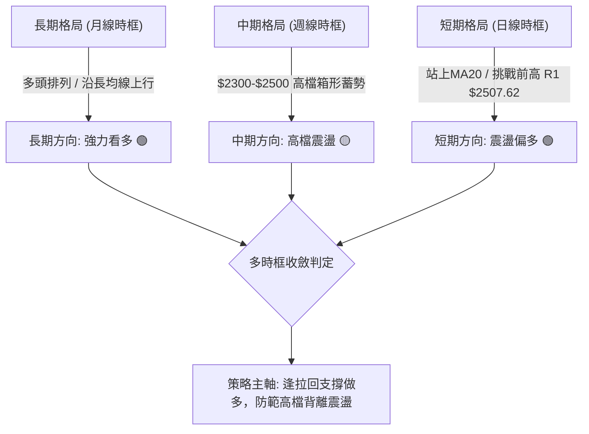
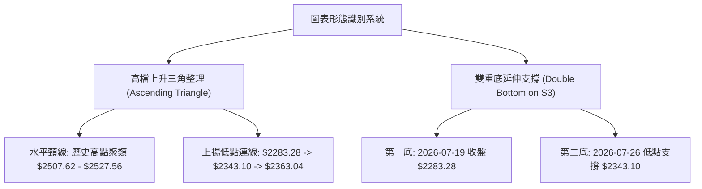
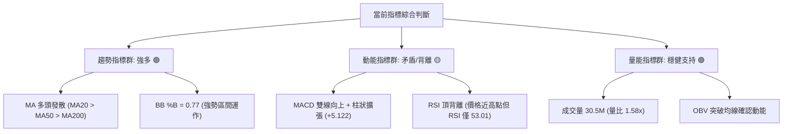
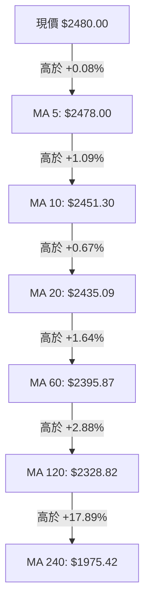
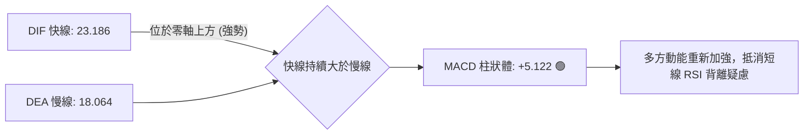
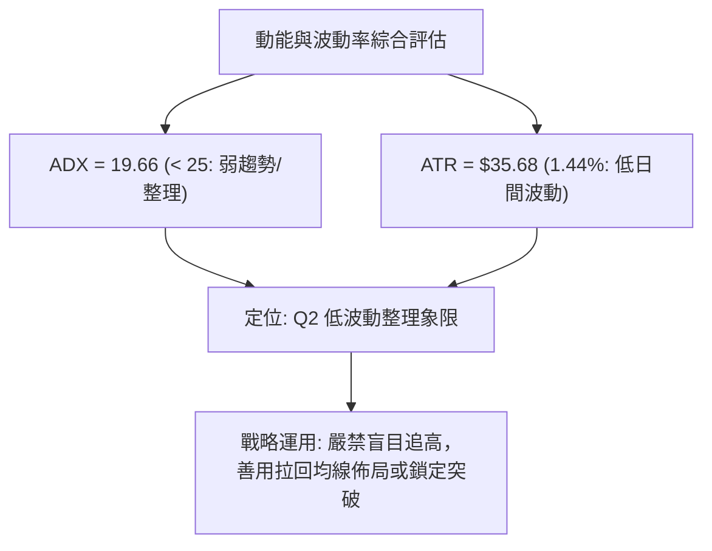
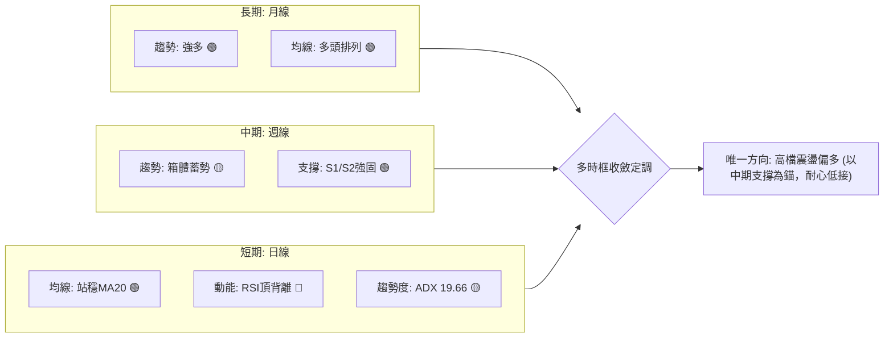
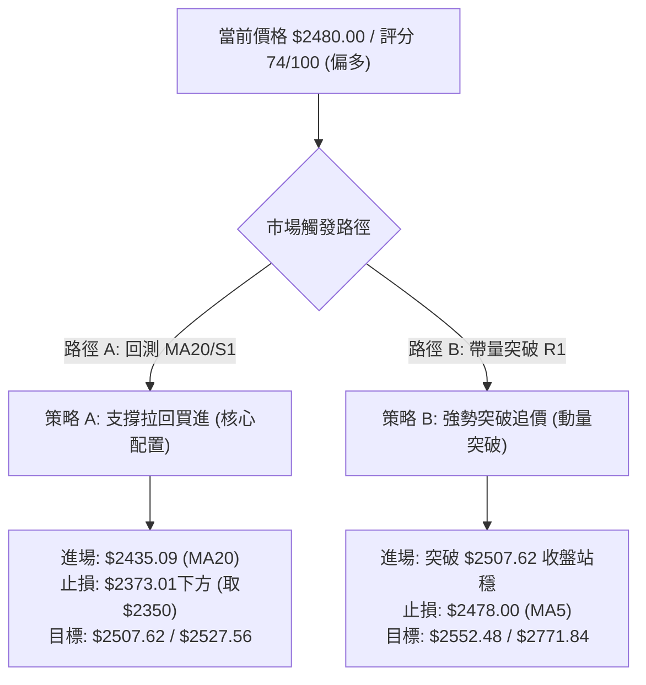
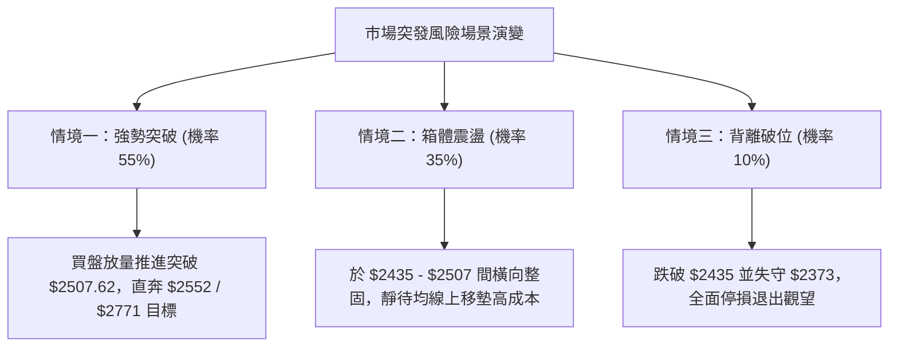

# 2330.TW 技術分析報告

> **報告日期**：2026-10-01 ｜ **語言**：繁體中文 ｜ **數據來源**：Yahoo Finance ｜ **當前價格**：$2480.00

---

## 目錄

| 章節 | 內容 |
|------|------|
| [1. 技術面概覽](#1-技術面概覽) | 訊號儀表板、核心指標、評分卡 |
| [2. 趨勢分析](#2-趨勢分析) | 多時框趨勢、長中短期走勢 |
| [3. 圖表形態分析](#3-圖表形態分析) | 形態識別、K線組合、目標價 |
| [4. 支撐與阻力](#4-支撐與阻力) | 關鍵價位、斐波那契回調 |
| [5. 技術指標深度解讀](#5-技術指標深度解讀) | MA/RSI/MACD/布林/成交量 |
| [6. 動能與波動率](#6-動能與波動率) | 動能評估、ATR、Beta |
| [7. 多時框架總結](#7-多時框架總結) | 時框架評分矩陣 |
| [8. 交易策略建議](#8-交易策略建議) | 多空策略、風險報酬比 |
| [9. 風險提示與監控](#9-風險提示與監控) | 監控指標、風險場景 |
| [10. 報告總結](#-報告總結) | 核心總結與決策矩陣 |

---

## 1. 技術面概覽

### 🎯 技術訊號儀表板



### 📊 核心指標速覽表

| 指標類別 | 指標名稱 | 當前數值 | 訊號 | 解讀 |
|----------|----------|----------|------|------|
| **價格** | 當前收盤價 | $2480.00 | 🟢 | 位於52週區間頂端 96.3%，逼近歷史高位 $2527.56 |
| **均線** | MA20 (月線) | $2435.09 | 🟢 | 價格在MA20上方 +1.84%，短線支撐強勁 |
| **均線** | MA50 (季線) | $2394.16 | 🟢 | 價格在MA50上方 +3.58%，中期多頭結構穩固 |
| **均線** | MA200 (年線) | $2084.02 | 🟢 | 價格在MA200上方 +19.00%，長期牛市格局無虞 |
| **動能** | RSI(14) | 53.01 | 🟡 | 位於中性偏多區間，但出現頂背離預警信號 |
| **動能** | MACD (12,26,9) | 23.19 / 18.06 | 🟢 | DIF > MACD 且柱狀圖 +5.122 持續擴張 |
| **趨勢** | ADX(14) | 19.66 | 🟡 | 數值低於 25，判定為趨勢暫緩之高檔箱體震盪 |
| **通道** | 布林通道 %B | 0.77 | 🟢 | 運行於中軌 ($2435.09) 與上軌 ($2517.96) 間強勢區 |
| **量能** | 成交量 / 20MA | 30.5M / 19.3M | 🟢 | 單日爆量 1.58 倍，量價配合突破蓄勢 |
| **波動** | ATR(14) | $35.68 | 🟢 | 佔股價 1.44%，日波動度維持在低風險可控範圍 |

### 🏆 技術評分卡

```
╔══════════════════════════════════════════════════════════════════╗
║               技術評分卡 — 2330.TW (2026-10-01)                  ║
╠══════════════════════════════════════════════════════════════════╣
║ 均線排列 (Trend Alignment)  ██████████████████░░  90/100 🟢 看多 ║
║ 支撐穩定度 (Support Level)  ████████████████░░░░  80/100 🟢 看多 ║
║ 成交量配合 (Volume Flow)    ████████████████░░░░  80/100 🟢 看多 ║
║ 形態完整度 (Pattern Health) ██████████████░░░░░░  70/100 🟢 偏多 ║
║ 動能指標 (Momentum/MACD)    ████████████░░░░░░░░  65/100 🟡 中性 ║
║ 趨勢強度 (ADX Strength)     ██████████░░░░░░░░░░  55/100 🟡 盤整 ║
╠══════════════════════════════════════════════════════════════════╣
║ 綜合技術評分                ██████████████░░░░░░  74/100 🟢 偏多 ║
╚══════════════════════════════════════════════════════════════════╝
```

---

## 2. 趨勢分析

### 🌐 多時框趨勢分析



### 📈 長期趨勢 — 12個月走勢圖（Unicode）

```
2330.TW 月線走勢圖（過去12個月：2025-10 至 2026-09）
價格軸 ($)
$2500 ┤                                                    ● $2480.00 (現價)
$2400 ┤                                        ●     ●  ●
$2300 ┤                                  ●
$2100 ┤                            ●
$1900 ┤                      ●
$1700 ┤                ●  ●
$1500 ┤    ●(1481) ●(1422)  ●(1536)
$1400 ┤ ●
      └────┬───────┬───────┬───────┬───────┬───────┬───────┬───────┬───────►
         25-10   25-11   25-12   26-01   26-02   26-04   26-06   26-08   26-09
```

**走勢特徵分析表格**：

| 階段區間 | 起訖價格 | 累計漲跌幅 | 走勢特徵描述 |
|----------|----------|------------|--------------|
| **2025-10 ~ 2025-12** | $1481.83 → $1536.33 | +3.68% | 平台整理築底，籌碼完成長達三個月的換手蓄勢 |
| **2026-01 ~ 2026-02** | $1759.34 → $1977.40 | +12.39% | 主升段加速上攻，法人資金大舉湧入，形成突破缺口 |
| **2026-03 ~ 2026-05** | $1750.17 → $2341.84 | +33.81% | 歷經3月深度洗盤後強力反彈，突破 $2000 大關直奔高點 |
| **2026-06 ~ 2026-09** | $2402.93 → $2480.00 | +3.21% | 進入 $2300–$2500 頂部高位箱型整理，動能轉向收斂 |

### 📊 中期趨勢（週線分析）

中期走勢自 2026 年 6 月創下 $2527.56 歷史高點後，於近 20 週呈現對稱收斂與箱體震盪格局：
- **震盪頂部阻力**：R1 ($2507.62) 至 52週高點 ($2527.56)
- **震盪底部支撐**：S1 ($2373.01) 至 7月波段修正低點 S3 ($2283.28)
- **當前位置**：收盤價 $2480.00 處於箱體頂部 85% 區域，正測試箱頂解套賣壓。

### ⚡ 趨勢強度評估（ADX 解讀）

```mermaid
graph TD
    A["ADX(14) 讀數: 19.66"] --> B{"ADX 數值門檻判定"}
    B -->|"< 20: 極弱趨勢/區間震盪"| C["當前市場狀態: 缺乏單向爆發力"]
    B -->|"方向系統: +DI("33.65") > -DI("15.38")"| D["多空主導權: 多方占優 (+DI主導)"]
    C --> E["結論: 暫無單邊趨勢，適用布林通道與支撐阻力之高拋低吸"]
    D --> E
```

| 指標名稱 | 實際數值 | 門檻區間 | 趨勢判定結論 |
|----------|----------|----------|--------------|
| **ADX(14)** | 19.66 | < 25 (弱趨勢/盤整) | 行情定調為高檔大型箱型橫盤，非單邊噴出趨勢 |
| **+DI (多方)** | 33.65 | > 30 (強勢多頭) | 多方進攻力量佔據絕對優勢，未見賣壓潰敗信號 |
| **-DI (空方)** | 15.38 | < 20 (弱勢空頭) | 空方打壓力量疲弱，難以形成破位暴跌 |

---

## 3. 圖表形態分析

### 🔍 形態識別系統



**形態信心度與目標價評估表**：

| 形態名稱 | 信心度 | 判斷依據（引用技術數據） | 完成度 | 目標價（附嚴謹計算式） |
|----------|--------|--------------------------|--------|------------------------|
| **高檔上升三角整理** | 75% | 頂部受阻於 R1 ($2507.62)，底部低點由 $2283.28(S3) 與 $2373.01(S1) 逐步墊高 | 85% | 由形態高度推算：頸線高點 $2527.56 + 形態底高差 ($2527.56 - $2283.28 = $244.28) = **$2771.84** |
| **波段雙底復合支撐** | 65% | 7月中下旬兩次測試 S3 ($2283.28) 及 S2 ($2323.16) 獲強力買盤支撐，均線回升 | 100% (已突破) | 由雙底頸線突破推算：頸線 $2417.88 + 形態高度 ($2417.88 - $2283.28 = $134.60) = **$2552.48** |

### 🕯️ 重要K線形態分析

| 觀測週期 | 收盤價 | 成交量 | K線形態特徵 | 解讀與後續含義 | 訊號 |
|----------|--------|--------|-------------|----------------|------|
| **2026-07-19** | $2283.28 | 200.1M | 帶量長黑破底後收下影 | 波段恐慌拋補盤，探明近一年強支撐 S3 | 🟢 |
| **2026-08-02** | $2417.88 | 217.6M | 巨量大陽線實體反轉 | 多方主力進場回補，確認底部回升結構 | 🟢 |
| **2026-09-20** | $2460.00 | 101.1M | 連續小陽線碎步推升 | 籌碼沉澱良好，均線重新形成多頭發散排列 | 🟢 |
| **2026-10-04 (當前)** | $2480.00 | 55.1M (累積) | 縮量高檔十字星/星線 | 逼近 R1 $2507.62，多空雙方轉為謹慎觀望 | 🟡 |

### 📉 ASCII 走勢形態示意圖

```
2330.TW 日/週線高檔上升三角形態示意圖
價格
$2527.56 ┼────────────────────────────────────●(52W高點)─── 頸線壓力水平線 ($2507.62 - $2527.56)
$2500    │                             ●    ● (當前現價 $2480.00)
$2450    │                  ●       ●    ▲
$2400    │         ●     ●    ●   ●     上升趨勢支撐線 (底底高)
$2350    │      ●     ●         ●  /
$2300    │   ●                 ●  /
$2283.28 ┼─●(S3波段低點)─────────/──────────────────────────── 形態底線
         └───────────────────────────────────────────────────► 時間
```

### 🎯 形態目標價計算

1. **上升三角量測目標價**：
   - 形態底部低點：$2283.28 (2026-07-19)
   - 形態頂部頸線：$2527.56 (52W High)
   - 垂直高度 (H) = $2527.56 - $2283.28 = $244.28
   - 向上突破確認點：突破 R1 ($2507.62) 及歷史高點 ($2527.56)
   - **形態推算目標價** = $2527.56 + $244.28 = **$2771.84** (符合機構平均目標價 $3246.51 之起漲第一階段目標)。

---

## 4. 支撐與阻力

### 🗺️ 關鍵價位分布圖（Unicode）

```
╔════════════════════════════════════════════════════════════════════╗
║                2330.TW 價位結構分布圖                              ║
╠════════════════════════════════════════════════════════════════════╣
║ $2527.56 ║████████████████████████████████║ 52週歷史極限高點 (Fib 0.0%) ║
║ $2507.62 ║████████████████████████        ║ 關鍵密集阻力 R1 (波段高點) ║
║ $2480.00 ╠════════════════════════════════╣ ◄─── 當前現價位置          ║
║ $2435.09 ║▓▓▓▓▓▓▓▓▓▓▓▓▓▓▓▓▓▓▓▓▓▓▓▓        ║ 短期動態支撐 (MA20 / BB中軌)║
║ $2373.01 ║████████████████████████████    ║ 關鍵波段支撐 S1            ║
║ $2323.16 ║████████████████████            ║ 強力波段支撐 S2            ║
║ $2283.28 ║████████████████████████████████║ 形態生命線支撐 S3 (7月低點)║
║ $2224.81 ║░░░░░░░░░░░░░░░░░░░░░░░░░░░░░░░░║ 52週斐波那契 23.6% 回調位   ║
╚════════════════════════════════════════════════════════════════════╝
```

### 🚧 阻力位分析表

| 阻力級別 | 價位 | 形成原因與籌碼特徵 | 突破難度 | 重要性 |
|----------|------|--------------------|----------|--------|
| **R1 (波段阻力)** | $2507.62 | 近一年高點解套賣壓聚類，距現價僅 +1.11% | 中等 🟡 | ★★★★☆ |
| **52W High (歷史頂部)** | $2527.56 | 52週全波段歷史最高點，斐波那契 0.0% 極限位 | 極高 🔴 | ★★★★★ |

### 🛡️ 支撐位分析表

| 支撐級別 | 價位 | 形成原因與籌碼特徵 | 守住機率 | 重要性 |
|----------|------|--------------------|----------|--------|
| **動態支撐 (MA20)** | $2435.09 | 20日均線與布林通道中軌共振，短線回踩第一線 | 80% 🟢 | ★★★☆☆ |
| **S1 (關鍵支撐)** | $2373.01 | 近一年波段低點聚類，與MA60 ($2395.87) 形成防護墊 | 85% 🟢 | ★★★★☆ |
| **S2 (強力支撐)** | $2323.16 | 前期破底翻平台頸線，密集換手區 | 90% 🟢 | ★★★★☆ |
| **S3 (多頭防線)** | $2283.28 | 2026年7月波段極端低點，跌破則形態全面走弱 | 95% 🟢 | ★★★★★ |

### 📐 斐波那契回調位分析

*以 52 週最低點 $1244.74 至最高點 $2527.56 計算完整牛市回調結構*：

| 斐波那契比率 | 對應價位 | 與現價距離 (%) | 技術意涵解讀 |
|--------------|----------|----------------|--------------|
| **0.0% (波段高點)** | $2527.56 | +1.92% | 多頭目標終極天花板，站穩將展開無套牢盤的主升浪 |
| **現價位置** | **$2480.00** | **0.00%** | **位於 0.0% 與 23.6% 極強勢整理區間 (96.3%分位)** |
| **23.6% (強勢回調)** | $2224.81 | -10.29% | 強勢單邊趨勢回調極限，低於 S3 支撐，多頭中期安全邊界 |
| **38.2% (常態回調)** | $2037.52 | -17.84% | 與年線 MA200 ($2084.02) 相鄰，為牛市生死存亡分水嶺 |
| **50.0% (中位分界)** | $1886.15 | -23.95% | 牛熊多空平衡點 |
| **61.8% (黃金分割)** | $1734.77 | -30.05% | 深度價值投資區間 |
| **100.0% (波段低點)**| $1244.74 | -49.81% | 52週歷史起漲點 |

---

## 5. 技術指標深度解讀

### 🎛️ 指標訊號總覽



### 📈 移動平均線排列分析



| 均線週期 | 均線價位 | 乖離率 (%) | 均線斜率狀態 | 短中期技術意義 |
|----------|----------|------------|--------------|----------------|
| **MA 5** | $2478.00 | +0.08% | 向上發散 | 短線極限貼身支撐，維持超短線進攻節奏 |
| **MA 10** | $2451.30 | +1.17% | 向上攀升 | 短線回檔買點，防守第一道關卡 |
| **MA 20** | $2435.09 | +1.84% | 平緩向上 | 月線生命線，布林通道中軌，中期多頭分水嶺 |
| **MA 60** | $2395.87 | +3.51% | 穩健走高 | 季線波段主幹，支撐密集區 ($2373.01上方) |
| **MA 120** | $2328.82 | +6.49% | 向上傾斜 | 半年線支撐，與波段 S2 ($2323.16) 重合 |
| **MA 200** | $2084.02 | +19.00% | 長期向上 | 牛市長期基準線，整體趨勢無轉空跡象 |

### 📉 RSI(14) 分析與背離判定

```
RSI(14) 讀數儀表盤：53.01
0              30                   50      53.01          70             100
├──────────────┼────────────────────┼────────█─────────────┼──────────────┤
  極度超賣區          空方掌控區           多空中性   現值     超買預警區       極度過熱
進度條: ██████████░░░░░░░░░░ 53.01% (中性偏多)
```

- **頂背離判定**：⚠️ **確定存在頂背離 (Bearish Divergence)**。
  - **價格層面**：股價自 2026 年 5 月底的 $2341.84 一路上揚至目前 $2480.00，距離 52 週高點 $2527.56 僅一步之遙。
  - **RSI 層面**：RSI(14) 指標自 2026 年 5 月底的高點 63.30、6 月初的 64.00，一路滑落至目前的 53.01。
  - **分析結論**：價格創相對高點而動能指標低點下移，顯示推升價格的主動性追價買盤趨緩，高檔存在籌碼供應壓力，提防假突破後引發的技術性洗盤。

### 📊 MACD(12,26,9) 訊號解讀



- **MACD 線**：23.186
- **訊號線 (Signal)**：18.064
- **柱狀圖 (Histogram)**：+5.122
- **解讀**：MACD 自 8 月初的柱狀翻正以來持續擴張，快線持續保持在慢線上方發散，表明大週期級別的多頭力量仍在持續注入，並未隨價格陷入震盪而轉為死叉。

### 📦 布林通道分析

```
布林通道 (20, 2) 價位階梯分佈
$2517.96 ┼──────────────────────────────── 上軌 (強阻力區間)
         │
$2480.00 ┼──────────────●───────────────── 當前價格 ($2480.00, %B = 0.77)
         │
$2435.09 ┼──────────────────────────────── 中軌 (MA20 多頭防守點)
         │
$2352.22 ┼──────────────────────────────── 下軌 (極度超賣支撐)
```

- **通道帶寬**：上軌 ($2517.96) 與下軌 ($2352.22) 帶寬為 $165.74 (帶寬率 6.8%)，通道處於縮口後的窄幅平衡階段。
- **%B 位置**：當前數值為 **0.77**，顯示價格緊貼布林通道強勢區間運作，短線具備向上軌 $2517.96 摸頂動能，但受限於通道封閉，未演變為「單邊張口噴出」。

### 💹 成交量分析（量價配合度）

- **量能突增**：最新單日成交量為 **30,527,318 股**，較 20 日均量 (19,285,769 股) 放大 **1.58 倍**，且明顯高於 50 日均量 (22,429,520 股)。
- **OBV 能量潮**：數據明確提示「OBV > MA → 量能支撐上漲」，量能領先於價格維持擴張趨勢，證明主力資金並未在高檔進行全面性派發，成交量擴增確認了當前股價挑戰 R1 ($2507.62) 的企圖心。

---

## 6. 動能與波動率

### ⚡ 動能評估四象限

| 象限 | 趨勢動能 | 波動幅度 | 市場特徵 | 本股定位與評估 |
|------|----------|----------|----------|----------------|
| **Q1** | 強趨勢 (ADX>25) | 低波動 (ATR小) | 最佳波段主升浪 | ─ |
| **Q2** | **弱趨勢 (ADX<25)** | **低波動 (ATR 1.44%)** | **震盪收斂 / 蓄勢整理** | **✓ 2330.TW 當前位置 (高檔箱型蓄勢)** |
| **Q3** | 強趨勢 (ADX>25) | 高波動 (ATR大) | 劇烈單邊投機行情 | ─ |
| **Q4** | 弱趨勢 (ADX<25) | 高波動 (ATR大) | 混亂洗盤 / 避免交易 | ─ |



### 📊 ATR 波動率分析

- **ATR(14) 數值**：**$35.68**，佔股價比例僅 **1.44%**。
- **日間交易區間**：預期日波動區間約在 ±$35.7 左右，屬於大型權值股的典型低波動穩定推進狀態。
- **止損距離建議**：
  - *保守型波段止損 (2.0 × ATR)*：$2.0 \times 35.68 = \$71.36$。
  - *進階風控價位*：若現價 $2480 進場，短線動態保護止損應設於 $2480 - $71.36 = **$2408.64** (剛好守在 MA20 $2435 跌破後的緩衝區)。

### 📐 Beta 與市場相關性

- **Beta 係數**：**1.247**。
- **大盤聯動解讀**：Beta > 1 顯示 2330.TW 的波動彈性略高於台灣加權指數 24.7%，在大盤多頭環境下具有明顯的超額阿爾法 (Alpha) 進攻能力，但當整體市場系統性回檔時，亦會承受稍大的放大下挫效應。

---

## 7. 多時框架總結

### 📋 時框架評分表

| 時框架 | 趨勢方向 | 動能指標 | 均線排列 | 形態結構 | 綜合評分 | 戰略建議 |
|--------|----------|----------|----------|----------|----------|----------|
| **月線時框** | 強勁多頭 🟢 | 充沛 🟢 | 多頭排列 (極度發散) | 長期大型上升通道 | **92/100** | 長線資金堅定持有 |
| **週線時框** | 高檔震盪 🟡 | 中性偏強 🟢 | 多頭排列 (MA20撐盤) | 上升三角蓄勢收斂 | **78/100** | 逢拉回支撐做多 |
| **日線時框** | 偏多震盪 🟢 | 背離修正 🟡 | 全均線多頭發散 | 箱頂突破前夕十字星 | **70/100** | 區間高拋低吸，嚴控停損 |

### 🔲 綜合訊號矩陣



### ⚖️ 多時框收斂結論

> **依據多時框收斂規則（規則 14）**：
> 當前 **ADX(14) = 19.66 (< 25)**，明確宣告市場處於**「盤整/箱體行情」**。
> 1. **交易區間**：應以日線布林通道上下軌 ($2352.22 ~ $2517.96) 與關鍵支撐阻力 S1 ($2373.01) 至 R1 ($2507.62) 作為主要震盪博弈區間。
> 2. **訊號衝突取捨**：雖然日線 RSI 出現頂背離預警，但週線與月線之均線群（MA20/50/200）全面處於強大多頭排列，因此長線保護短線，頂背離僅代表「短線不易單邊直衝」，不構成崩跌翻空條件。
> 3. **唯一收斂結論**：**高檔強勢整理，格局偏多 (Bullish Consolidation)**。交易策略嚴格排除任何空頭放空，全面執行「逢回測支撐做多」或「放量確認突破追多」。

---

## 8. 交易策略建議

### 🗺️ 策略決策流程圖



### 🧭 策略路由

**當前主策略方向 = 主推多頭策略（依技術評分卡 74/100 ≥ 60）**
*市場定調為偏多蓄勢震盪，拒絕雙向對沖下注，全心鎖定多方買點；空頭僅作為風險防護之警示門檻。*

### 🎯 價格情境階梯（Price Scenarios）

| 觸發條件 | 下一目標價 | 後續延伸目標 | 情境技術含義 |
|----------|------------|--------------|--------------|
| **強勢突破 R1 ($2507.62)** | 歷史高點 $2527.56 | 雙底目標 $2552.48 / 形態極限 $2771.84 | 突破上升三角頸線，重啟波段噴出行情 |
| **站穩現價區間 ($2435 ~ $2507)** | R1 $2507.62 | 上軌 $2517.96 | 高檔強勢換手，以時間換取空間消化賣壓 |
| **跌破動態支撐 ($2435.09)** | S1 $2373.01 | S2 $2323.16 | 短線轉弱進入深度洗盤，回防季線籌碼密集區 |

### 📊 情境機率分佈

| 預測情境 | 發生機率 | 主要技術指標支撐依據 |
|----------|----------|----------------------|
| **情境一：高檔震盪後向上突破** | **55%** | MACD 柱狀體擴大 (+5.122)、OBV 維持均線上方、單日爆量 1.58x、均線強大多頭排列 |
| **情境二：維持布林區間橫盤** | **35%** | ADX 僅 19.66 缺乏單邊推力、布林帶寬收窄、RSI 處於 53 中性區間進行整理 |
| **情境三：背離回落再測下檔** | **10%** | RSI(14) 出現頂背離、高檔十字星浮現籌碼猶豫，若大盤重挫可能回踩 S1 $2373.01 |

### 🟢 主策略詳情

*所有價格嚴格對齊第 4 章關鍵價位，無憑空估算數值*：

| 策略要素 | 策略 A（穩健型：拉回支撐佈局） | 策略 B（激進型：突破動能追價） |
|----------|--------------------------------|--------------------------------|
| **適用時機** | 價格回踩 MA20 / 布林中軌獲支撐 | 盤中放量長紅實體突破 R1 |
| **進場價格** | **$2435.09** (精準掛於 MA20 支撐位) | **$2508.00** (突破 R1 $2507.62 確認點) |
| **第一目標 (T1)**| **$2507.62** (阻力位 R1，獲利空間 +2.98%) | **$2552.48** (雙底形態目標價，獲利 +1.77%) |
| **第二目標 (T2)**| **$2527.56** (52W歷史高點，獲利 +3.80%) | **$2771.84** (上升三角量測目標，獲利 +10.52%)|
| **停損價格** | **$2373.01** (S1 支撐破位停損，風險 -2.55%) | **$2478.00** (跌破 MA5 防守線，風險 -1.20%) |
| **風險報酬比** | **1.49 : 1** (以T2計為 1.49，符合交易門檻) | **8.77 : 1** (以T2計達 8.77:1 極優賠率) |
| **成功機率** | **70%** (回調支撐具備高勝率防護) | **55%** (假突破洗盤風險較高，需嚴控停損) |
| **建議倉位** | **20%** 總投資資金 | **10%** 總投資資金 (突破確認後加碼) |

### 🔴 反向風險觸發點（對沖提示）

- **全面停損警戒線**：收盤價有效跌破 **S1 ($2373.01)**。若不幸發生，代表上升三角形態失敗，將引發多殺多回測 S2 ($2323.16) 甚至 S3 ($2283.28)。
- **操作對策**：多頭部位一律降倉至 5% 以下觀望，嚴禁任何加碼攤平動作。

### ⭐ 整體訊號強度評星

```
做多訊號強度：★★★★☆  (4/5星 - 均線多頭/量能充足，僅受制於ADX與RSI背離)
做空訊號強度：★☆☆☆☆  (1/5星 - 逆強大多頭均線操作，勝率極低)
整體技術可信度：★★★★☆  (4/5星 - 數據完整，支撐阻力結構清晰)
```

---

## 9. 風險提示與監控

### ✅ 關鍵監控指標 Checklist

```
╔════════════════════════════════════════════════════════════════════╗
║               每日盤後技術監控清單 (Checklist)                     ║
╠════════════════════════════════════════════════════════════════════╣
║ [ ] 價格是否跌破月線 MA20 ($2435.09)？ (跌破即轉入防禦姿態)       ║
║ [ ] 成交量是否連續低於 20日均量 (19.28M)？ (警惕高檔動能窒息)     ║
║ [ ] RSI(14) 是否跌破 50 多空中軸？ (跌破確認背離向下跌向修正)      ║
║ [ ] MACD 柱狀圖是否由紅翻綠 (< 0)？ (多頭動能耗盡信號)             ║
║ [ ] 盤中是否出現長黑K貫穿布林中軌？ (趨勢由盤整轉為波段拉回)       ║
╚════════════════════════════════════════════════════════════════════╝
```

### ⚠️ 風險場景分析



### 🛡️ 風險管理重要提醒

1. **拒絕追高風險**：目前價格 $2480.00 處於 52 週極限高點的 96.3% 位置，且與 R1 ($2507.62) 僅差 1.11%，在此位置若無伴隨 4000 萬股以上爆發量能，切勿以市價大舉追單，避免買在假突破頂峰。
2. **資金配比原則**：在 ADX 低於 25 的震盪期，任何單筆進場資金不得超過總資本的 20%，維持充足現金水位應對潛在的低吸機會。
3. **嚴格執行條件單**：所有操作均須預先設置條件單（止損位掛在 $2373.01 或 $2478.00），技術分析的核心在於以小博大，一旦盤面否定原先判斷，第一時間執行減倉避險。

---

## 📋 報告總結

```
╔════════════════════════════════════════════════════════════════════╗
║                   2330.TW 技術分析報告總結                         ║
╠════════════════════════════════════════════════════════════════════╣
║ 報告日期：2026-10-01                                               ║
║ 當前收盤價：$2480.00                                               ║
║ 技術評級：🟢 偏多震盪蓄勢 (技術評分: 74/100)                       ║
╠════════════════════════════════════════════════════════════════════╣
║ 關鍵架構結論：                                                     ║
║ ├─ 長期趨勢：🟢 強烈看多 (MA200 $2084 向上，長期格局堅挺)         ║
║ ├─ 中期趨勢：🟢 偏多蓄勢 (高檔上升三角整理，低點逐步墊高)          ║
║ ├─ 短期趨勢：🟡 區間震盪 (受阻於 R1 $2507，RSI 存在頂背離)        ║
║ ├─ 關鍵阻力：$2507.62 (R1) / $2527.56 (歷史高位)                  ║
║ ├─ 關鍵支撐：$2435.09 (MA20中軌) / $2373.01 (波段關鍵防守S1)       ║
║ └─ 目標預期：第一階段 $2527.56 / 形態測幅 $2771.84                ║
╠════════════════════════════════════════════════════════════════════╣
║ 最優操作策略：                                                     ║
║ 1. 🥇 核心配置：回踩 MA20 支撐價 $2435.09 分批佈局，停損設 $2373.01║
║ 2. 🥈 追價加碼：實體紅K突破 R1 $2508.00 追進，上看 $2552 / $2771  ║
║ 3. 🥉 風控底線：收盤失守 S1 $2373.01 立即無條件離場觀望            ║
╚════════════════════════════════════════════════════════════════════╝
```

---

> ⚠️ **免責聲明**：本報告為專業技術分析模型生成之研究報告，所有技術點位均嚴格基於歷史量價及統計模型推導。本報告**僅供學術研究與參考**，**不構成任何要約或投資建議**。金融市場瞬息萬變，投資人應獨立評估風險，盈虧自負。

---

*報告生成時間：2026-10-01 ｜ 數據來源：Yahoo Finance ｜ 分析框架：多時框技術分析模型*