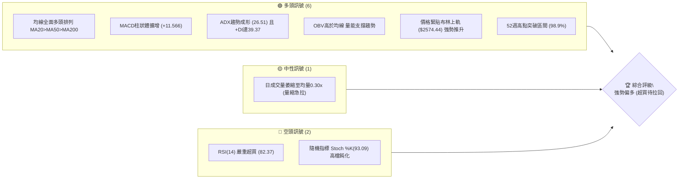
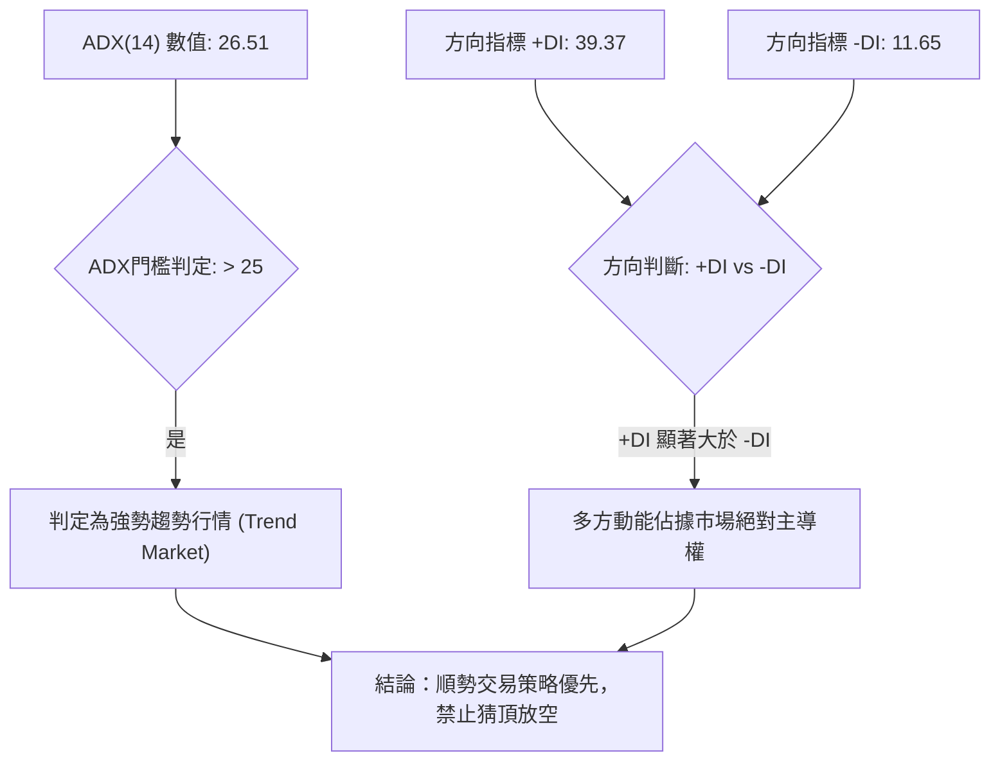
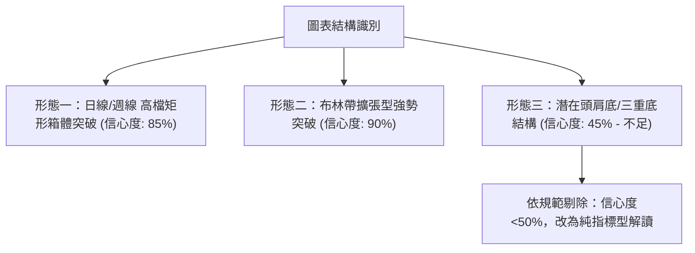
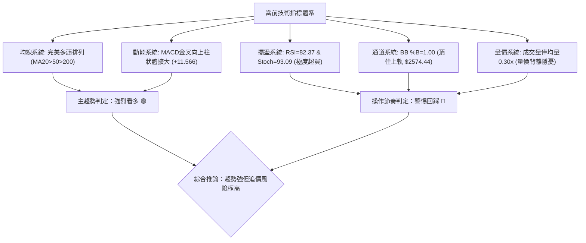
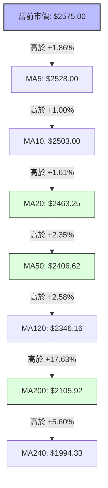
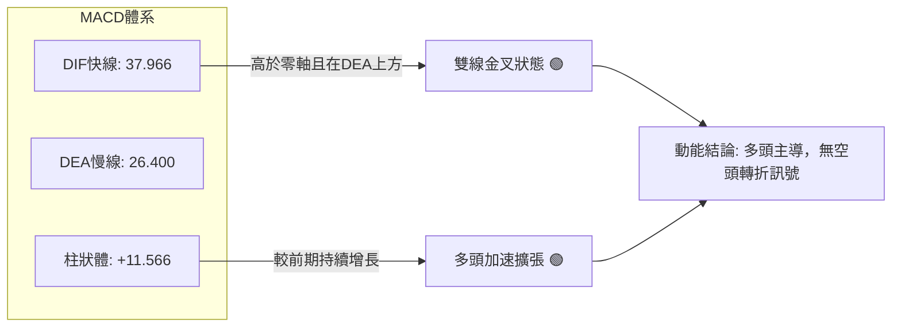
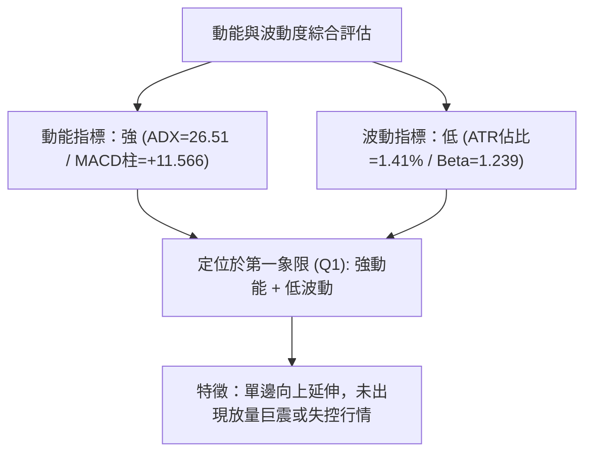
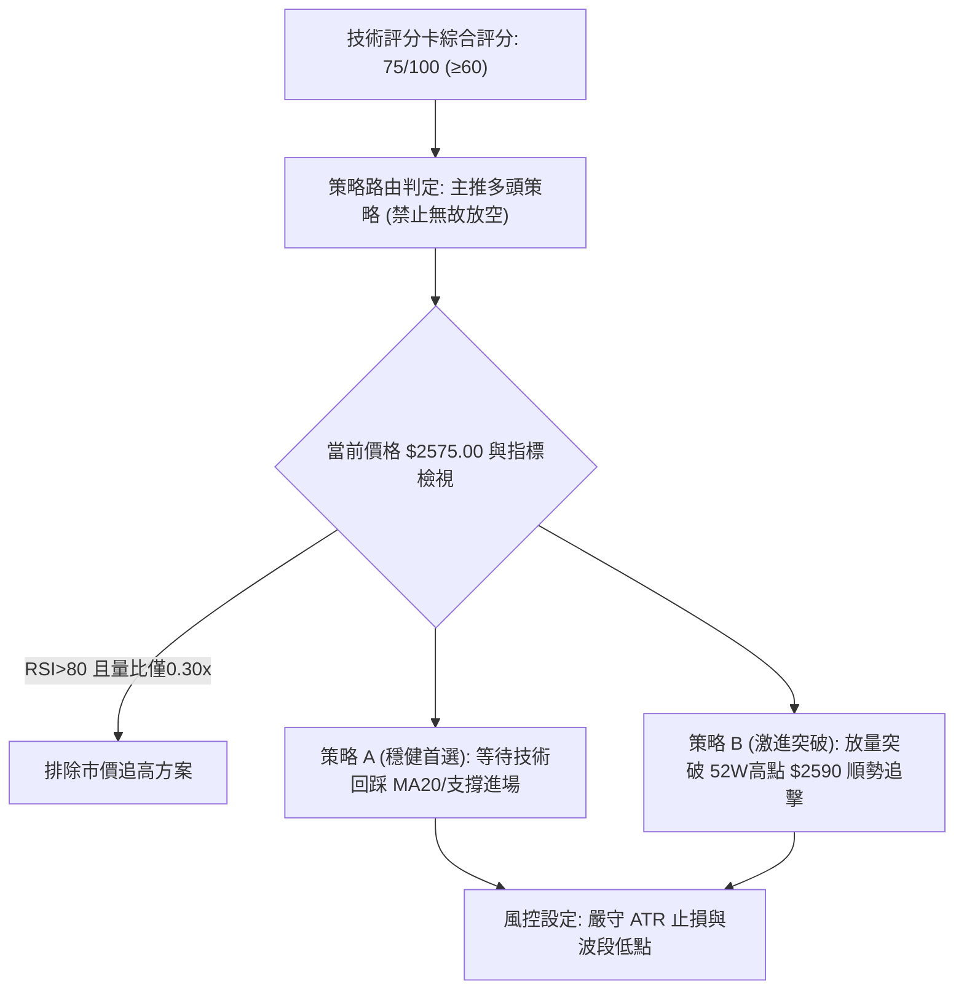
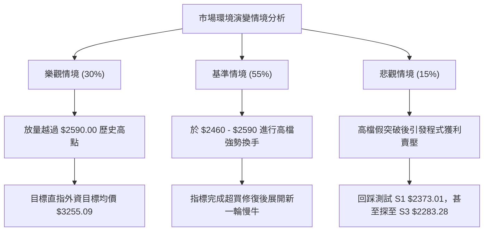

# 2330.TW 技術分析報告

> **報告日期**：2026-10-06 ｜ **語言**：繁體中文 ｜ **數據來源**：Yahoo Finance ｜ **當前價格**：$2575.00

---

## 目錄

| 章節 | 內容 |
|------|------|
| [1. 技術面概覽](#1-技術面概覽) | 訊號儀表板、核心指標、評分卡 |
| [2. 趨勢分析](#2-趨勢分析) | 多時框趨勢、長中短期走勢 |
| [3. 圖表形態分析](#3-圖表形態分析) | 形態識別、K線組合、目標價 |
| [4. 支撐與阻力](#4-支撐與阻力) | 關鍵價位、斐波那契回調 |
| [5. 技術指標深度解讀](#5-技術指標深度解讀) | MA/RSI/MACD/布林/成交量 |
| [6. 動能與波動率](#6-動能與波動率) | 動能評估、ATR、Beta |
| [7. 多時框架總結](#7-多時框架總結) | 時框架評分矩陣 |
| [8. 交易策略建議](#8-交易策略建議) | 多空策略、風險報酬比 |
| [9. 風險提示與監控](#9-風險提示與監控) | 監控指標、風險場景 |

---

## 1. 技術面概覽

### 🎯 技術訊號儀表板



### 📊 核心指標速覽表

| 指標類別 | 指標名稱 | 當前數值 | 訊號 | 解讀 |
|----------|----------|----------|------|------|
| **價格** | 當前收盤價 | $2575.00 | 🟢 | 逼近52週歷史高點 $2590.00，位於全週期頂端 98.9% 處 |
| **均線** | MA20 (月線) | $2463.25 | 🟢 | 乖離率 +4.54%，價格穩固運行於 MA20 上方，中期防守線穩固 |
| **均線** | MA50 (季線) | $2406.62 | 🟢 | 乖離率 +7.00%，中期生命線斜率持續上彎，趨勢支撐明確 |
| **均線** | MA200 (年線)| $2105.92 | 🟢 | 乖離率 +22.27%，長期牛市基石，未受任何實質挑戰 |
| **動能** | RSI(14) | 82.37 | 🔴 | 進入極度超買區間（>70），短線追高盈虧比受限，警惕技術性拉回 |
| **動能** | MACD (12,26,9)| DIF: 37.966 / DEA: 26.400 / 柱狀體: +11.566 | 🟢 | 零軸上方多頭雙線發散，柱狀體加速放大，順勢多頭動能強勁 |
| **趨勢強度**| ADX(14) | 26.51 (+DI: 39.37 / -DI: 11.65) | 🟢 | ADX > 25 確認為強勢趨勢行情，多頭掌控市場絕對主導權 |
| **通道** | Bollinger Bands | 上軌: $2574.44 / %B: 1.00 | 🟡 | 價格觸及並沿著布林上軌外推，屬超買擴張狀態 |
| **量能** | 成交量 / 20日均量 | 5,832,243 / 19,262,746 (量比 0.30x) | 🟡 | 量縮價漲，顯示籌碼鎖定良好但追價買盤追隨動能未放量 |
| **波動** | ATR(14) | $36.42 (佔市價 1.41%) | 🟢 | 波動率控制良好，未出現失控型巨幅震盪，有利趨勢延伸 |

### 🏆 技術評分卡

```
╔════════════════════════════════════════════════════════════════╗
║             技術評分卡 — 2330.TW (2026-10-06)                 ║
╠════════════════════════════════════════════════════════════════╣
║ 趨勢強度 (Trend)      ████████████████░░░░  82/100   🟢 強勢趨勢 ║
║ 動能指標 (Momentum)   ████████████░░░░░░░░  60/100   🟡 動能超買 ║
║ 支撐穩定度 (Support)  ████████████████░░░░  80/100   🟢 支撐明確 ║
║ 成交量配合 (Volume)   ██████████░░░░░░░░░░  50/100   🟡 量能不足 ║
║ 形態完整度 (Pattern)  ██████████████░░░░░░  70/100   🟢 形態向上 ║
║ 均線排列 (Moving Avg) ████████████████████ 100/100   🟢 完美多頭 ║
╠════════════════════════════════════════════════════════════════╣
║ 綜合評分 (Composite)  ███████████████░░░░░  75/100   評級: 強勢偏多║
╚════════════════════════════════════════════════════════════════╝
```

---

## 2. 趨勢分析

### 🌐 多時框趨勢分析

```mermaid
graph TD
    A["月線框架 (長線)"] -->|"24個月上行通道 / MA240斜率+29%"| A1["極強牛市：主升浪結構"]
    B["週線框架 (中線)"] -->|"近10週自 $2283.28 展開波段反彈"| B1["上升趨勢確立：連續突破頸線"]
    C["日線框架 (短線)"] -->|"ADX("14")=26.51 且 +DI=39.37"| C1["趨勢加速段：沿布林上軌上行"]
    
    A1 --> D{"多時框共振收斂"}
    B1 --> D
    C1 --> D
    D --> E["戰略結論：趨勢主導強多，惟日線過度延伸需防拉回"]
```

### 📈 長期趨勢 — 12個月走勢圖（Unicode）

根據 2330.TW 過去 12 個月（2025-11 至 2026-10）收盤價歷史繪製長期趨勢圖：

```
2330.TW 月線走勢圖（過去12個月：2025-11 至 2026-10）
價格軸 ($)
$2600 ┤                                                 ● $2575(現價)
$2400 ┤                                   ●     ●  ●  ● 
$2200 ┤                             ● 
$2000 ┤                       ● 
$1800 ┤                 ●           ● 
$1600 ┤           ● 
$1400 ┤     ● 
$1200 ┤─────────────────────────────────────────────────────────────
      25-11 25-12 26-01 26-02 26-03 26-04 26-05 26-06 26-07 26-08 26-09 26-10
      (M1)  (M2)  (M3)  (M4)  (M5)  (M6)  (M7)  (M8)  (M9)  (M10) (M11) (M12)
```

**走勢特徵分析表格**：

| 階段 | 時間區間 | 起點價格 | 終點價格 | 區間漲跌幅 | 走勢特徵與結構解讀 |
|------|----------|----------|----------|------------|--------------------|
| 第一階段：主升推升 | 2025-11 ~ 2026-02 | $1422.55 | $1977.40 | +39.00% | 連續4個月大陽線放量進攻，均線發散，突破2000元大關前哨戰 |
| 第二階段：洗盤回撤 | 2026-02 ~ 2026-03 | $1977.40 | $1750.17 | -11.49% | 遭遇獲利了結賣壓，單月回撤逾220元，回測MA60尋求支撐 |
| 第三階段：強勢突破 | 2026-03 ~ 2026-05 | $1750.17 | $2341.84 | +33.81% | 暴力拉升，以大實體紅棒一舉貫穿兩千元心理大關 |
| 第四階段：平台蓄勢 | 2026-05 ~ 2026-08 | $2341.84 | $2397.94 | +2.40%  | 高檔平台橫盤整理4個月，月線連續收斂，洗滌籌碼浮額 |
| 第五階段：新浪啟動 | 2026-08 ~ 2026-10 | $2397.94 | $2575.00 | +7.38%  | 平台放量向上突破，直接進逼歷史高點 $2590.00 |

### 📊 中期趨勢（週線分析）

中期走勢以 2026 年夏季建立的底部結構為依託。在 2026-07-19 探至波段低點 $2283.28 後，價格形成實質支撐，並展開逐週向上的推進行情：

```
2026年週線走勢結構示意圖：
  $2590.00 ┤- - - - - - - - - - - - - - - - - - - - - - - - - - 52W最高點/前波極限
  $2575.00 ┤                                           ▲ 現價 (突破推進)
  $2500.00 ┤                                     ┌───┘
  $2460.00 ┤                              ┌──────┘
  $2402.93 ┤         ┌────┐        ┌─────┘ (平台突破頸線)
  $2343.10 ┤   ┌─────┘    └────────┘
  $2283.28 ┤───┘ (波段底部支撐 S3)
           └───────────────────────────────────────────────────
            07-19 08-02 08-23 09-06 09-13 09-20 09-27 10-04 10-11
```

近20週數據顯示，週線MACD柱狀體由 2026-07-19 的負值谷底（-15.169）持續修復，至 2026-10-11 正式擴散至 +11.566，週線RSI由低檔 43.1 爬升至 82.4，證實中期趨勢已從先前的區間盤整徹底過渡為單邊上攻行情。

### ⚡ 趨勢強度評估（ADX 解讀）



**ADX 趨勢強度對照解讀**：
- **ADX = 26.51**：越過關鍵分水嶺 25，確認脫離前期的矩形盤整，進入動量趨勢波段。
- **+DI = 39.37 處於極高位**，且 **-DI = 11.65 受到極致壓制**：多空比率達 3.38 倍，表明空方毫無招架之力，短線趨勢慣性持續向上。

---

## 3. 圖表形態分析

### 🔍 形態識別系統



**形態信心度與目標價計算表格**：

| 形態 | 信心度 | 判斷依據（引用數據） | 完成度 | 目標價（附計算式） |
|------|--------|----------------------|--------|--------------------|
| 高檔矩形箱體突破 | 85% | 2026年6月至9月收盤價長期於 $2402.93 聚類，隨後於 2026-09-20 向上跳脫 $2460.00，底部為 $2283.28 | 100% (已突破) | 由突破頸線 $2402.93 + 箱體高度 ($2402.93 - $2283.28 = $119.65) 推算最小測量目標價 = **$2522.58**（已滿足），延伸目標價 ($2402.93 + 119.65 × 1.618) = **$2596.52** |
| 布林帶向上爆發擴張 | 90% | BB %B 達 1.00，收盤價 $2575.00 實質站上布林上軌 $2574.44，帶動中軌 MA20 ($2463.25) 斜率劇烈轉折向上 | 95% | 依通道波動推算，目標為維持沿上軌運行，若無法維持則回測中軌 **$2463.25** |
| 頭肩底/雙底逆轉形態 | 45% | 數據中低點主要集中於平台震盪（$2283.28 ~ $2343.10），無明確左右肩對稱結構與幾何落差 | 訊號不足 | **數據不足以支撐幾何反轉形態，依規則僅做指標型解讀** |

### 🕯️ 重要K線形態分析

| 日期 / 月份 | 收盤價 | K線形態 | 解讀 | 訊號 |
|-------------|--------|---------|------|------|
| 2026-07-19  | $2283.28 | 長下影探底十字星 | 中期波段最低點確認，下影線伴隨2億股大量，確立長線逢低買盤支撐 | 🟢 強烈看多 |
| 2026-08-30  | $2412.90 | 連續蓄勢陽線 | 價格重返 $2400 關卡上方，量能溫和萎縮，主力於突破前夕完成鎖碼 | 🟢 多頭預備 |
| 2026-09-20  | $2460.00 | 突破中長陽線 | 實質脫離 $2402.93 的近三個月壓力區間，宣告平台整理正式結束 | 🟢 突破買訊 |
| 2026-10-11  | $2575.00 | 光頭大陽線推進 | 週線收盤直接衝破 $2500 關卡直逼歷史高點，實體飽滿但量能顯著縮減 | 🟡 強勢伴隨背馳隱憂 |

### 📉 ASCII 走勢形態示意圖

```
2330.TW 矩形突破與通道推升形態示意圖
═════════════════════════════════════════════════════════════════════
$2590.00 ┤- - - - - - - - - - - - - - - - - - - - - - - - - - - - 52週歷史高點 (0.0% Fib)
$2575.00 ┤                                               ● 現價 (逼近前高)
$2522.58 ┤- - - - - - - - - - - - - - - - - - - - - - - - - - - - 形態基本測幅滿足點
$2500.00 ┤                                         ●───┘
$2460.00 ┤                                  ●──────┘ 突破確認段
$2402.93 ┤═════════ 矩形箱頂頸線 ══════════════════════
         │      ●           ●           ●    (高檔橫盤密集聚類)
         │  ●       ●   ●       ●   ●     ●
$2283.28 ┤──┴───────┴───┴───────┴───┴───────────────── 矩形箱底支撐 (S3)
         └────────────────────────────────────────────────────────────
          2026-06     2026-07     2026-08     2026-09     2026-10
═════════════════════════════════════════════════════════════════════
```

### 🎯 形態目標價計算

1. **基本箱體等幅測算**：
   - 頸線位置 ($NL$)：$2402.93
   - 箱體底部 ($B$)：$2283.28
   - 形態高度 ($H$) = $NL - B = \$2402.93 - \$2283.28 = \$119.65$
   - 最小目標價 ($T_1$) = $NL + H = \$2402.93 + \$119.65 = \mathbf{\$2522.58}$（此目標已被收盤價 $2575.00 突破達成）。
2. **延伸等比測量（黃金分割 1.618 擴張）**：
   - 延伸目標價 ($T_2$) = $NL + (H \times 1.618) = \$2402.93 + (\$119.65 \times 1.618) = \$2402.93 + \$193.59 = \mathbf{\$2596.52}$。
   - 解讀：該延伸目標價與 52 週歷史高點 **$2590.00** 形成共振阻力重疊帶。

---

## 4. 支撐與阻力

### 🗺️ 關鍵價位分布圖（Unicode）

```
2330.TW 價位結構分布圖
═════════════════════════════════════════════════════════════════════
$2596.52 ║████████████████████████║ 形態延伸目標阻力 (1.618 Expansion)
$2590.00 ║████████████████████████║ 52W 歷史最高點 / 0.0% 斐波那契位 (R1)
$2575.00 ╠════════════════════════╣ ◄ 當前市價 (位於極限超買帶)
$2463.25 ║▓▓▓▓▓▓▓▓▓▓▓▓▓▓▓▓        ║ 短期生命線 MA20 / 布林中軌
$2406.62 ║▓▓▓▓▓▓▓▓▓▓▓▓            ║ 中期防守線 MA50 / 前期突破平台密集區
$2373.01 ║████████████████        ║ 波段低點聚類支撐 S1
$2323.16 ║████████████████████    ║ 波段低點聚類支撐 S2
$2283.28 ║████████████████████████║ 近期波段最低點強支撐 S3
$2274.85 ║████████████████████████║ 23.6% 斐波那契關鍵回調位
═════════════════════════════════════════════════════════════════════
```

### 🚧 阻力位分析表

依據關鍵數據計算，當前價格上方無近一年波段高點聚類（no swing-high resistance detected above current price），僅存在 52 週歷史頂點與形態延伸點：

| 阻力級別 | 價位 | 形成原因 | 突破難度 | 重要性 |
|----------|------|----------|----------|--------|
| **R1 (歷史極值)** | $2590.00 | 52週最高點、Fib 0.0% 絕對極值，僅距當前價格 0.58% | ★★★★☆ | 極高。整數大關前的歷史解套與獲利盤密集碰撞區 |
| **R2 (形態延伸)** | $2596.52 | 箱體突破 1.618 延伸測量目標價（由 $2402.93 突破推算） | ★★★★☆ | 高。波段等比擴張耗盡點，常引發多頭獲利了結 |
| **R3 (波段聚類)** | 數據中未偵測到 | 現價上方無歷史套牢峰位聚類 | — | — |

### 🛡️ 支撐位分析表

所有數值嚴格引用「關鍵價位」區塊之波段低點聚類及斐波那契回調點：

| 支撐級別 | 價位 | 形成原因 | 守住機率 | 重要性 |
|----------|------|----------|----------|--------|
| **S1 (初級波段)** | $2373.01 | 近一年波段低點聚類 S1（距現價 -7.84%），亦鄰近 MA60 ($2403.43) | 70% | 中。短線拉回尋求支撐的第一道結構性防線 |
| **S2 (次級波段)** | $2323.16 | 近一年波段低點聚類 S2（距現價 -9.78%），介於 MA120 上方 | 85% | 高。回撤幅度的安全閥，跌破意味著中期結構轉弱 |
| **S3 (強勢底線)** | $2283.28 | 近一年波段最低點聚類 S3（距現價 -11.33%），多頭防守底線 | 95% | 極高。2026年夏季震盪箱底，跌破則牛市架構破裂 |

### 📐 斐波那契回調位分析

依據 52 週完整區間（低點 **$1254.61** 至 高點 **$2590.00**，總跨度 $1335.39）計算：

```
斐波那契回調階梯 (52週區間 $1254.61 → $2590.00)
┌─────────────────────────────────────────────────────────────┐
│ 0.0%   $2590.00  ◄ 歷史高點 (現價 $2575.00 處於此邊界)       │
│ 23.6%  $2274.85  ◄ 極強勢回調支撐位 (與波段底 S3 $2283.28 共振)│
│ 38.2%  $2079.88  ◄ 健康回調極限位 (鄰近 MA200 $2105.92)      │
│ 50.0%  $1922.31  ◄ 多空中樞分水嶺 (強弱轉換點)              │
│ 61.8%  $1764.73  ◄ 黃金分割強防守位 (2026年3月低點區域)      │
│ 78.6%  $1540.39  ◄ 深幅回撤防守位                          │
│ 100.0% $1254.61  ◄ 52週絕對起漲最低點                      │
└─────────────────────────────────────────────────────────────┘
```

**回調位深度解讀**：
1. **現價區間定位**：當前價格 $2575.00 位於 **0.0% ($2590.00)** 與 **23.6% ($2274.85)** 的極高位強勢區間（已走完區間的 98.9%）。
2. **共振意義**：Fib 23.6% 位階 **$2274.85** 與技術低點聚類 **S3 ($2283.28)** 僅差距不到 0.4%，構成中長期多頭格局的「鋼鐵防線」。只要價格守穩於此線之上，整體大牛市主升段結構維持不變。

---

## 5. 技術指標深度解讀

### 🎛️ 指標訊號總覽



### 📈 移動平均線排列分析



均線系統呈現完美的**多頭排列（Bullish Alignment）**：
- **短天期均線**（MA5/10/20）呈現陡峭向上發散態勢，MA5 ($2528.00) 提供極短線第一道動態回踩支撐。
- **中天期生命線** MA20 ($2463.25) 與 MA50 ($2406.62) 斜率均為正，為波段持股的主要追蹤止損基準。
- **長天期年線** MA200 ($2105.92) 穩固上揚，價格高於年線達 +22.27%，牛市格局無可動搖。

### 📉 RSI(14) 分析

```
RSI(14) 強度儀表板：
當前數值: 82.37
0 ──────────── 30 ─────────────────── 70 ────── 82.37 ── 100
[    超賣區    ] [      常態中性區      ] [ 超買區  █ ]
進度條: ████████████████░░░░  82.37% (處於極度超買過熱區間)
```

- **超買超賣判定**：RSI(14) 來到 **82.37**，突破 70 門檻進入嚴重超買區。此數值顯示短線買盤爆發力已達極限，隨時可能因市場微小擾動引發快速的獲利平倉盤。
- **背離判斷**：
  - **背離結論**：**無明顯背離**（數據明確顯示 RSI 背離：無明顯背離）。
  - **細節驗證**：回顧近 4 週數據，收盤價由 $2460.00 → $2475.00 → $2500.00 → $2575.00，RSI 同步由 58.8 → 60.6 → 59.3 → 82.4，價格創高與 RSI 創高保持同向，尚未形成頂背離，說明當前上漲仍由真實買盤推動，而非指標衰竭型假突破。

### 📊 MACD(12/26/9) 訊號解讀



- **數值表現**：DIF快線 (37.966) 大幅領先 DEA慢線 (26.400)，兩者差值擴大。
- **柱狀體動能**：MACD Histogram 最新值為 **+11.566**，對比前幾週（+0.062 → +6.477 → +5.772 → +11.566），呈現顯著的多頭擴張趨勢，表明中期動量仍在增強，尚未出現紅柱縮短的高檔鈍化跡象。

### 📦 布林通道分析

```
2330.TW 布林通道 (20, 2) 當前價位示意圖
═════════════════════════════════════════════════════════════════════
$2574.44 ┤───────────────────────┬─────── 布林上軌 (BB Upper)
$2575.00 ┤                       ● ◄ 當前收盤價 ($2575.00，%B = 1.00)
         │                       │
$2463.25 ┤───────────────────────┼─────── 布林中軌 (BB Mid / MA20)
         │                       │
$2352.07 ┤───────────────────────┴─────── 布林下軌 (BB Lower)
═════════════════════════════════════════════════════════════════════
通道帶寬 (Bandwidth) = ($2574.44 - $2352.07) / $2463.25 = 9.03%
```

- **現況解析**：當前價格 $2575.00 微幅高於布林上軌 $2574.44，**%B 數值精確達到 1.00**。
- **走勢意涵**：在強勢趨勢行情中（ADX > 25），價格緊貼甚至略微突破上軌運行屬於典型「通道走外軌（Walking the Bands）」現象，代表行情處於極端單邊階段。然而，帶寬僅 9.03% 屬於適度擴張，若後續無法帶量繼續推升，價格極易向通道中軌 **$2463.25** 進行均值回歸。

### 💹 成交量分析（量價配合度）

```
成交量對比儀表板：
當前日成交量:   5,832,243 股
20日平均量:    19,262,746 股
量比 (Volume Ratio): 0.30x
量能水平: ██████░░░░░░░░░░░░░░ 30.27% (嚴重萎縮)
```

- **量價背離現象**：最新交易日成交量僅 583 萬股，相較於 20 日均量（1926 萬股）量比僅 **0.30x**。價格在創 52 週新高的邊緣，日線成交量卻大幅萎縮，呈現短線**量價背離（Volume-Price Divergence）**。
- **OBV 趨勢解讀**：數據指出「OBV > MA → 量能支撐上漲」，顯示在週線與月線等較長時框中，累積能量線依然穩居均線之上，籌碼集中度依然極高。這表明短線量縮並非主力出貨，而是呈現「籌碼鎖定、籌碼惜售」的無量推升格局，但追高買盤力道薄弱，一旦遇到拋壓容易造成波動擴大。

---

## 6. 動能與波動率

### ⚡ 動能評估四象限

| 象限 | 動能維度 | 波動維度 | 當前狀態 | 策略意涵與評估 |
|------|----------|----------|----------|----------------|
| **Q1** | 強動能 (MACD+/ADX>25) | 低波動 (ATR 1.41%) | **✓ 當前定位** | **趨勢爆發黃金期**：趨勢平穩向上推進，無劇烈雙向洗盤，持股體驗佳但需防突發波動跳增 |
| **Q2** | 弱動能 (MACD橫盤) | 低波動 (ATR收斂) | — | 區間盤整沉悶期：觀望或箱體高拋低吸 |
| **Q3** | 強動能 (單邊暴漲跌) | 高波動 (ATR>3%) | — | 投機博弈期：利潤豐厚但滑價與穿價風險極大 |
| **Q4** | 弱動能 (無主導方向) | 高波動 (頻繁巨震) | — | 混沌絞殺期：嚴禁進場，極易遭停損清洗 |



### 📊 ATR 波動率分析

- **ATR(14) 數值**：**$36.42**。
- **波動率佔比**：$36.42 / $2575.00 = **1.41%**，顯示目前每日價格常態波動範圍約為 ±36 元左右。
- **止損距離建議**：
  - **日內/極短線交易**：建議止損寬度為 $1.0 \times \text{ATR} = \mathbf{\$36.42}$（約自現價回撤至 $2538.58）。
  - **波段順勢交易**：建議止損寬度為 $2.0 \times \text{ATR} = 2 \times \$36.42 = \mathbf{\$72.84}$（自現價回撤至 $2502.16，與 10 日均線 $2503.00 重合）。
  - **中長線持倉交易**：建議止損寬度為 $3.0 \times \text{ATR} = 3 \times \$36.42 = \mathbf{\$109.26}$（自現價回撤至 $2465.74，完美共振 MA20 與布林中軌 $2463.25）。

### 📐 Beta 與市場相關性

- **Beta 數值**：**1.239**。
- **市場屬性解讀**：2330.TW 具備略高於大盤市場（Beta = 1.0）的波動彈性。當加權指數上漲 1% 時，該股預期上漲 1.239%；反之若大盤拉回，其承受的被動調整幅度亦會略高於指數。在多頭趨勢環境中，大於 1 的 Beta 係數有利於創造 Alpha 超額收益。

---

## 7. 多時框架總結

### 📋 時框架評分表

| 時框架 | 趨勢方向 | 動能狀態 | 均線排列 | 形態特徵 | 綜合評分 | 戰略建議 |
|--------|----------|----------|----------|----------|----------|----------|
| **月線 (長期)** | 🟢 強烈看多 | MACD雙線零軸上高位向上 | 完美多頭 (價格>MA200>240) | 歷史大牛市主升段 | 95/100 | 長期核心部位抱牢，忽視短期雜訊 |
| **週線 (中期)** | 🟢 強烈看多 | MACD紅柱擴增至+11.566 | 多頭發散 (突破MA20/50) | 矩形箱體向上破位 | 85/100 | 順勢波段做多，以 MA20 為防守基準 |
| **日線 (短期)** | 🟡 偏多震盪 | RSI=82.37/Stoch=93 超買 | 多頭推進，偏離均線 | 沿布林上軌極限推升 | 65/100 | 禁止追高，耐心等待均值回歸回踩進場 |

### 🔲 綜合訊號矩陣

```
時框與指標交互驗證矩陣：
┌───────────┬──────────────┬──────────────┬──────────────┐
│ 分析維度   │ 日線 (短期)  │ 週線 (中期)  │ 月線 (長期)  │
├───────────┼──────────────┼──────────────┼──────────────┤
│ 趨勢方向  │ 🟢 向上攻擊   │ 🟢 多頭推進   │ 🟢 超級牛市   │
│ 動能狀態  │ 🔴 極度超買   │ 🟢 加速放大   │ 🟢 強勁穩固   │
│ 均線架構  │ 🟢 多頭擴張   │ 🟢 支撐抬升   │ 🟢 完美排列   │
│ 量能配合  │ 🔴 嚴重萎縮   │ 🟡 溫和收斂   │ 🟢 籌碼鎖定   │
│ 綜合導向  │ 🟡 警惕回調   │ 🟢 波段主升   │ 🟢 堅定看多   │
└───────────┴──────────────┴──────────────┴──────────────┘
```

### ⚖️ 多時框收斂結論

依據多時框收斂規則第 14 條：
1. **行情性質判定**：當前 ADX(14) 數值為 **26.51 (>25)**，嚴格判定為**強勢趨勢行情（Trend Market）**，而非無方向的盤整震盪。
2. **主導時框裁決**：在趨勢行情中，必須以中長期（週線/MA50、MA200）方向為主導，日線時框僅用來尋找進場切入時機。
3. **矛盾取捨與收斂結論**：
   - 儘管日線指標（RSI 82.37、Stoch 93.09、量比 0.30x）顯示短線極度過熱並存在量價背離，但在週線多頭排列確立與 ADX 強趨勢主導下，短線逆勢放空盈虧比極差。
   - **唯一方向性結論：強烈偏多（Bullish Trend）**。操作哲學定調為「**趨勢看多不做空，策略防守待回踩**」，日線超買訊號僅用於限制追高行為，不可作為反向摸頂做空的理由。

---

## 8. 交易策略建議

### 🗺️ 策略決策流程圖



### 🧭 策略路由

**當前主策略方向 = 主推多頭策略（依技術評分卡評分 75/100，綜合評級偏多）**。
空頭策略不予強力推薦，僅以「反轉風險觸發點」的形式作為多單出場與風控預警參考。

### 🎯 價格情境階梯（Price Scenarios）

價位嚴格引用關鍵數據與斐波那契計算點：

| 觸發條件 | 下一目標 | 後續延伸 | 情境含義與操作指引 |
|----------|----------|----------|--------------------|
| **有效突破 R1 $2590.00** | R2 $2596.52 (形態延伸) | 數據中未偵測更高阻力 (上看整數關卡) | 短線極致突破，啟動最後加速沖刺浪，嚴格移動保本止損 |
| **站穩現價區間 ($2500 - $2575)** | 挑戰 R1 $2590.00 | 高檔消化 RSI 超買 | 平台高檔換手，以時間換取空間，最健康的整理架構 |
| **回踩 S1 $2373.01** | 回測 S2 $2323.16 | S3 $2283.28 / Fib 23.6% ($2274.85) | 技術性健康回撤，回踩均線支撐，為中期最佳逢低佈局點 |
| **跌破 S3 $2283.28** | Fib 38.2% $2079.88 | 回測年線 MA200 $2105.92 | 中期趨勢破位轉弱，多頭行情宣告終結，必須全數停損撤退 |

### 📊 情境機率分佈

| 情境劇本 | 機率 | 主要指標依據 |
|----------|------|--------------|
| **情境一：高檔強勢震盪後回踩均線再上攻** | **55%** | ADX=26.51 趨勢向上，但 RSI=82.37 超買嚴重，量比僅 0.30x，急需透過橫盤或回踩 MA20 ($2463.25) 消化浮額 |
| **情境二：帶量暴力突破歷史高點 $2590** | **30%** | MACD 柱狀體達 +11.566 動能充沛，+DI=39.37 處於強勢碾壓位，若補量至均量以上有望直破新高 |
| **情境三：引發獲利盤踩踏深幅回撤破位** | **15%** | 52週高點獲利盤極重，若外圍市場重挫引發拋壓，跌破 S1 恐回測 S3 ($2283.28) |

### 🟢 主策略詳情

本報告擬定兩套操作策略：**策略 A（回踩支撐低吸，穩健型）** 與 **策略 B（突破前高追多，動能型）**：

| 策略要素 | 策略 A（穩健型：均線回踩低吸） | 策略 B（激進型：前高突破順勢） |
|----------|--------------------------------|--------------------------------|
| **進場條件** | 價格拉回測試 MA20 ($2463.25) 附近獲得支撐，且日K收下影線 | 帶量突破歷史最高點 $2590.00，且日成交量回升突破 2000 萬股 |
| **進場價格** | **$2465.00**（回測 MA20 支撐區） | **$2592.00**（突破確認點） |
| **目標價 T1** | **$2575.00**（回歸當前高點） | **$2650.00**（外資分析師最低目標價） |
| **目標價 T2** | **$2596.52**（形態 1.618 延伸位） | **$3255.09**（分析師共識平均目標價） |
| **止損價格** | **$2400.00**（跌破 MA50 $2406.62 與整數關卡）| **$2519.00**（ATR 雙倍止損：$2592 - 2×$36.42） |
| **風險空間** | $65.00 ($2465.00 - $2400.00) | $73.00 ($2592.00 - $2519.00) |
| **報酬空間 (T1)** | $110.00 ($2575.00 - $2465.00) | $58.00 ($2650.00 - $2592.00) |
| **報酬空間 (T2)** | $131.52 ($2596.52 - $2465.00) | $663.09 ($3255.09 - $2592.00) |
| **風險報酬比** | **1 : 1.69** (至T1) / **1 : 2.02** (至T2) | **1 : 0.79** (至T1) / **1 : 9.08** (至T2) |
| **評估勝率** | **65%** | **45%** (假突破風險較大) |
| **建議倉位** | **20% ~ 25%** (標準波段倉位) | **10%** (試倉追買部位) |

### 🔴 反向風險觸發點（對沖提示）

下列情境並非建議反手做空，而是**持有多單者應立即無條件清倉避險**的警戒訊號：
1. **破位訊號**：日線收盤價跌破波段支撐 **S1 ($2373.01)**，意味著 MA20 ($2463.25) 與 MA60 ($2403.43) 相繼失守，多頭結構遭到破壞。
2. **反轉形態**：在歷史高點 **$2590.00** 附近爆出歷史級巨量（超過 5000 萬股）卻收長上影線黑K（高檔長黑墓碑線）。
3. **指標共振頂背離**：價格創出 $2590.00 以上新高，而日線 RSI(14) 卻未能突破 82.37 反倒滑落至 70 以下，形成高檔頂背離。

### ⭐ 整體訊號強度評星

```
╔════════════════════════════════════════════════════════════════╗
║ 做多訊號強度：★★★★☆  (4/5星 - 均線極強但短線過熱)              ║
║ 做空訊號強度：★☆☆☆☆  (1/5星 - 逆勢交易風險極高)              ║
║ 整體可信度：  ★★★★☆  (4/5星 - 多時框趨勢具備高度共振)          ║
╚════════════════════════════════════════════════════════════════╝
```

---

## 9. 風險提示與監控

### ✅ 關鍵監控指標 Checklist

```
╔════════════════════════════════════════════════════════════════╗
║                   關鍵風險與指標監控清單                      ║
╠════════════════════════════════════════════════════════════════╣
║ [ ] 價格突破監控：觀察收盤是否站穩歷史高點 $2590.00            ║
║ [ ] 動能過熱降溫：RSI(14) 是否自 82.37 高檔鈍化向下跌破 70    ║
║ [ ] 通道收斂風險：%B 是否自 1.00 跌回 0.8 以下，引發中軌回測   ║
║ [ ] 成交量能配合：成交量是否自 583 萬股回升至 20日均量(1926萬)║
║ [ ] 關鍵防守檢驗：MA20 ($2463.25) 能否在拉回時提供有效支撐     ║
║ [ ] 形態底線警報：波段最低點 S3 ($2283.28) 絕不可帶量跌破     ║
╚════════════════════════════════════════════════════════════════╝
```

### ⚠️ 風險場景分析



### 🛡️ 風險管理重要提醒

1. **嚴禁高檔槓桿追價**：
   - 當前價格偏離年線 MA200 達 +22.27%，日線 RSI 高達 82.37，且成交量能萎縮至 0.30x。此類「量縮價漲穿軌」形態具備高脆弱性，任何盤面突發利空均易引發多殺多回調。絕對禁止在現價使用融資或高倍期貨追高。
2. **倉位管理紀律**：
   - 總倉位建議控制在 **50% ~ 60%** 以內，預留充足現金部位。
   - 若採取突破策略（策略 B），初次試倉不得超過總資金 **10%**，待放量站穩 $2590 且拉回不破後方可加碼。
3. **嚴格執行追蹤止損（Trailing Stop）**：
   - 現有持股獲利豐厚者，建議將防守點由原始進場點上調至 10 日均線 **$2503.00** 或 2 倍 ATR 止損位（**$2502.16**），以確保波段利潤不受侵蝕。

---

## 📋 報告總結

```
╔════════════════════════════════════════════════════════════════╗
║                  2330.TW 技術分析報告總結                      ║
╠════════════════════════════════════════════════════════════════╣
║ 報告日期：2026-10-06                                          ║
║ 當前價格：$2575.00                                            ║
║ 分析評級：🟢 強勢偏多 (趨勢強勁，短線超買，建議等待回踩低吸) ║
╠════════════════════════════════════════════════════════════════╣
║ 關鍵結論：                                                    ║
║ ├─ 長期趨勢：🟢 強烈看多 (MA200斜率向上，長線牛市架構完好)     ║
║ ├─ 中期趨勢：🟢 強烈看多 (突破 $2402.93 箱頂，MACD柱擴至+11.5)║
║ ├─ 短期趨勢：🟡 偏多震盪 (RSI=82.37極度超買，量縮背離待整理)  ║
║ ├─ 關鍵支撐：S1: $2373.01 / S2: $2323.16 / S3: $2283.28       ║
║ ├─ 關鍵阻力：R1: $2590.00 (52W高點) / R2: $2596.52 (形態延伸)  ║
║ └─ 分析師目標：均價 $3255.09 (最低 $2650.00 / 最高 $4200.00)  ║
╠════════════════════════════════════════════════════════════════╣
║ 最優策略組合：                                                ║
║ 1. 🥇 最佳機會：等待價格回測 MA20 ($2465.00附近) 逢低介入，    ║
║                 停損設 $2400.00，上看 $2575.00 / $2596.52     ║
║ 2. 🥈 次選機會：持股者啟動動態移動止損至 $2503.00 (10日線)，   ║
║                 續抱享受多頭趨勢主升浪行情                    ║
║ 3. 🥉 保守選擇：空手者耐心觀望歷史高點 $2590.00 的攻防結果，  ║
║                 待量能回升至均量之上且站穩再行順勢跟進        ║
╚════════════════════════════════════════════════════════════════╝
```

---

> ⚠️ **免責聲明**：本報告為技術分析研究，所有數據、圖表及估算均基於市場歷史價格與量能資訊客觀解讀。本報告**僅供研究與學術參考**，**不構成任何形式的投資建議、要約或承諾**。金融市場瞬息萬變，投資人應獨立評估自身風險承受能力並自行承擔交易盈虧。

---

*報告生成時間：2026-10-06 ｜ 數據來源：Yahoo Finance ｜ 分析框架：多時框技術分析體系*