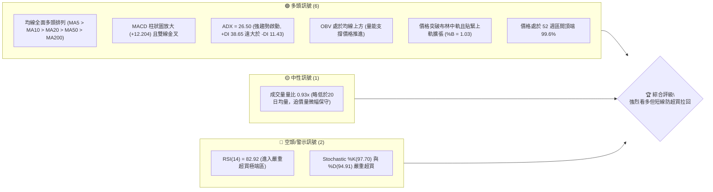
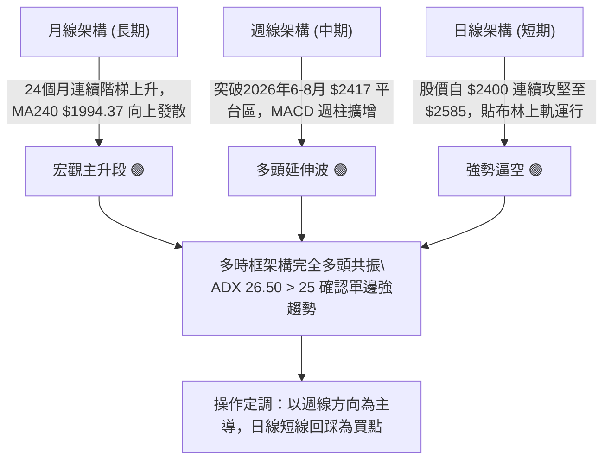
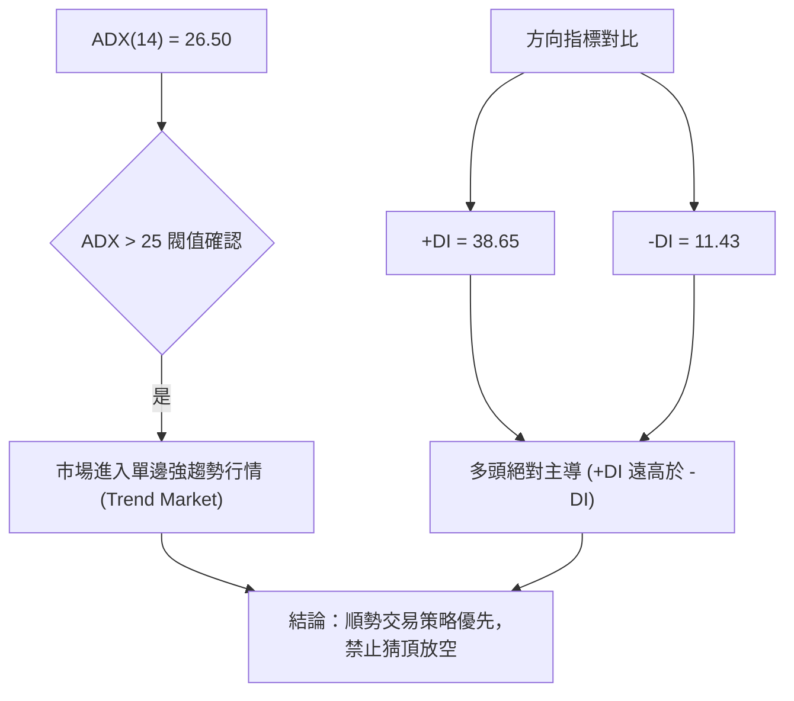
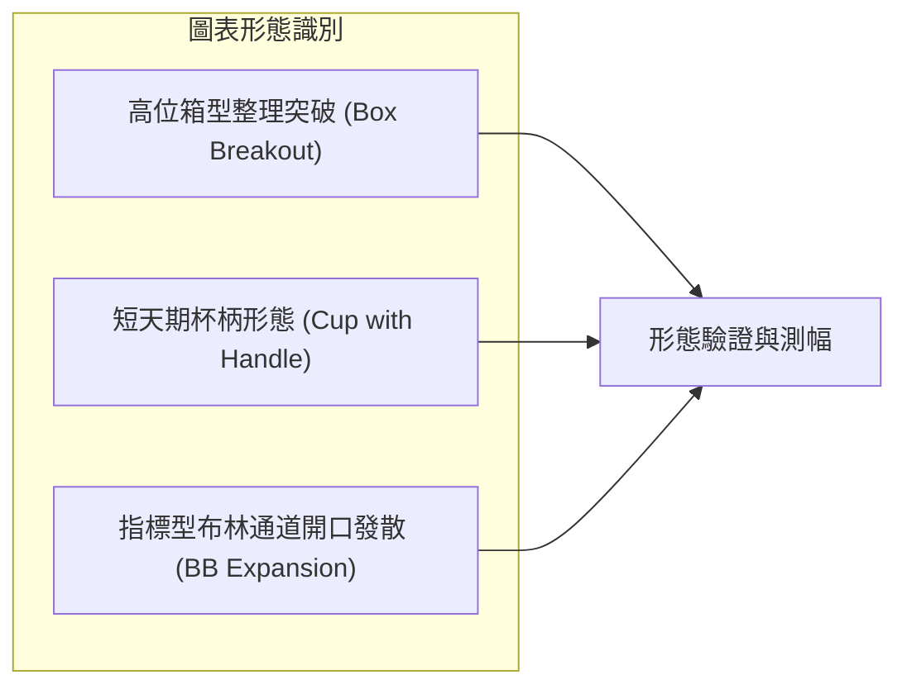
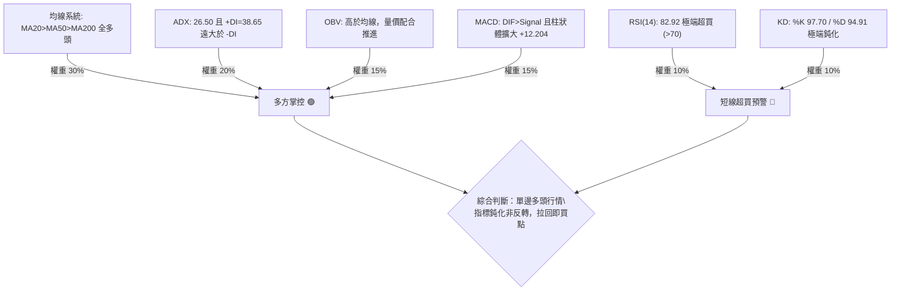
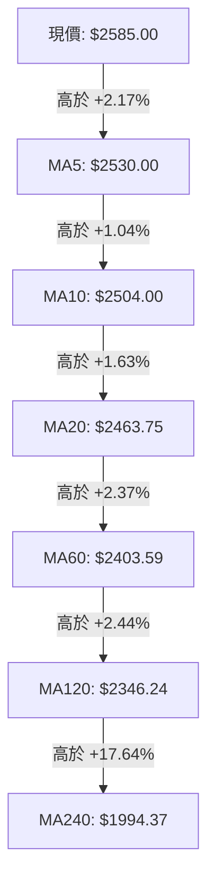
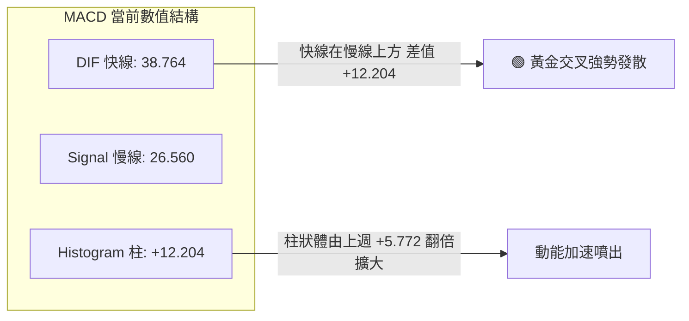
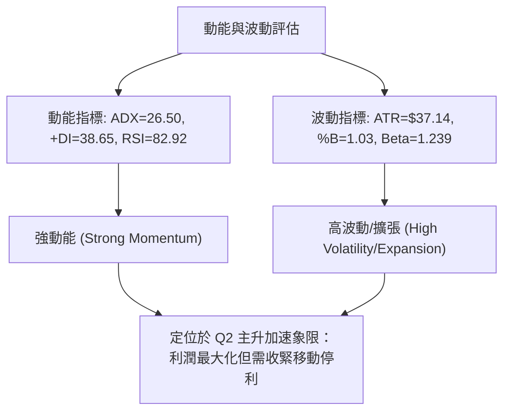
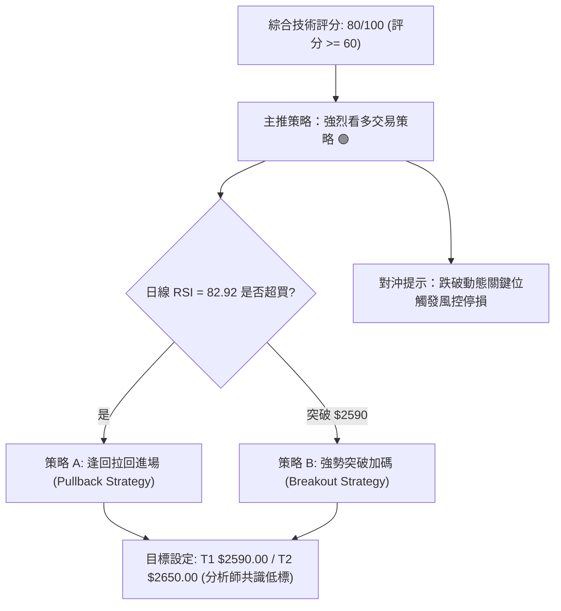
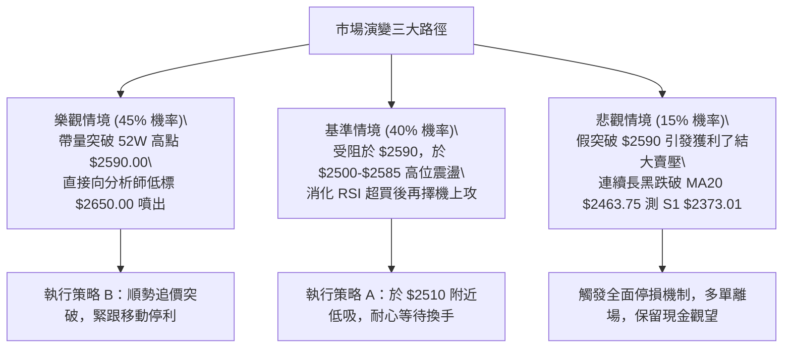

# 2330.TW 技術分析報告

> **報告日期**：2026-10-07 ｜ **語言**：繁體中文 ｜ **數據來源**：Yahoo Finance ｜ **當前價格**：$2585.00

---

## 目錄

| 章節 | 內容 |
|------|------|
| [1. 技術面概覽](#1-技術面概覽) | 訊號儀表板、核心指標、評分卡 |
| [2. 趨勢分析](#2-趨勢分析) | 多時框趨勢、長中短期走勢 |
| [3. 圖表形態分析](#3-圖表形態分析) | 形態識別、K線組合、目標價 |
| [4. 支撐與阻力](#4-支撐與阻力) | 關鍵價位、斐波那契回調 |
| [5. 技術指標深度解讀](#5-技術指標深度解讀) | MA/RSI/MACD/布林/成交量 |
| [6. 動能與波動率](#6-動能與波動率) | 動能評估、ATR、Beta |
| [7. 多時框架總結](#7-多時框架總結) | 時框架評分矩陣 |
| [8. 交易策略建議](#8-交易策略建議) | 多空策略、風險報酬比 |
| [9. 風險提示與監控](#9-風險提示與監控) | 監控指標、風險場景 |

---

## 1. 技術面概覽

### 🎯 技術訊號儀表板



### 📊 核心指標速覽表

| 指標類別 | 指標名稱 | 當前數值 | 訊號 | 解讀 |
|----------|----------|----------|------|------|
| **價格** | 當前收盤價 | $2585.00 | 🟢 | 距 52 週最高點 $2590.00 僅差 0.19%，逼近歷史天花板 |
| **均線** | 短期 MA20 | $2463.75 | 🟢 | 現價高於 MA20 達 +4.92%，短期動能強勁且乖離擴大 |
| **均線** | 中期 MA50 | $2406.82 | 🟢 | 現價高於 MA50 達 +7.40%，中期多頭護城河完整 |
| **均線** | 長期 MA200| $2105.97 | 🟢 | 現價高於 MA200 達 +22.75%，長線大多頭格局確立 |
| **動能** | RSI(14) | 82.92 | 🔴 | 進入 >80 極端超買區，短線隨時有技術性回洗壓力 |
| **動能** | MACD (12,26,9) | 38.764 / 26.560 | 🟢 | DIF 線高於信號線，Hist 柱達 +12.204，多方主導進攻 |
| **擺盪** | KD(9,3) | %K 97.70 / %D 94.91 | 🔴 | 極端鈍化區間，買盤狂熱，不宜無腦市價追價 |
| **趨勢** | ADX(14) | 26.50 | 🟢 | ADX > 25 且 +DI 38.65 高於 -DI 11.43，強多頭單邊趨勢 |
| **通道** | Bollinger Bands | 上軌 $2577.12 | 🟢 | %B = 1.03，股價突破上軌，處於單邊行情的布林通道行走 |
| **波動** | ATR(14) | $37.14 | 🟡 | 佔現價 1.44%，日波幅擴大但仍屬常態，支撐移動停損設置 |

### 🏆 技術評分卡

```
╔══════════════════════════════════════════════════════════════╗
║              技術評分卡 — 2330.TW (2026-10-07)               ║
╠══════════════════════════════════════════════════════════════╣
║ 趨勢強度 (Trend)       ████████████████░░░░  82/100  🟢 強多  ║
║ 動能指標 (Momentum)    ██████████████░░░░░░  72/100  🟡 鈍化  ║
║ 支撐穩定度 (Support)   ████████████████░░░░  80/100  🟢 紮實  ║
║ 成交量配合 (Volume)    ████████████░░░░░░░░  65/100  🟡 中性  ║
║ 形態完整度 (Pattern)   ████████████████░░░░  85/100  🟢 突破  ║
║ 均線排列 (MA System)   ████████████████████  98/100  🟢 完美  ║
╠══════════════════════════════════════════════════════════════╣
║ 綜合評分 (Overall)     ████████████████░░░░  80/100  🟢 強多  ║
╚══════════════════════════════════════════════════════════════╝
```

---

## 2. 趨勢分析

### 🌐 多時框趨勢分析



### 📈 長期趨勢 — 12個月走勢圖（Unicode）

以下繪製 2025 年 11 月至 2026 年 10 月共 12 個月之收盤價走勢路徑：

```
2330.TW 月線走勢圖（過去12個月：2025-11 至 2026-10）
價格軸 ($)
$2600 ┤                                                  ●($2585 現價)
$2450 ┤                                      ●     ●     
$2300 ┤                                ●                 
$2150 ┤                          ●                       
$2000 ┤                    ●                             
$1850 ┤              ●           ●                       
$1700 ┤        ●                                         
$1550 ┤  ●                                               
$1400 ┤●                                                 
      └────────────────────────────────────────────────────────
       N25   D25   J26   F26   M26   A26   M26   J26   J26   A26   S26   O26
       1422  1536  1759  1977  1750  2123  2341  2402  2417  2397  2480  2585
```

#### 走勢特徵分析表格

| 階段 | 時間區間 | 起訖價位 | 區間漲跌幅 | 主要走勢特徵 |
|------|----------|----------|------------|--------------|
| **長線初升段** | 2024-10 ~ 2025-04 | $1000.66 → $889.65 | -11.09% | 觸及 52 週深層低點 $889.65，完成長期大底築底。 |
| **主升攻擊段** | 2025-05 ~ 2026-02 | $947.46 → $1977.40 | +108.71% | 連續 10 個月放量拔高，強勢站上 $1500 與 $1900 大關。 |
| **劇烈洗盤段** | 2026-02 ~ 2026-03 | $1977.40 → $1750.17 | -11.49% | 急跌回測均線支撐，清洗浮額後於 $1750 止跌。 |
| **高位箱型整理** | 2026-05 ~ 2026-08 | $2341.84 → $2397.94 | +2.39% | 在 $2300–$2437 建立寬幅鞏固箱型，消化長線獲利盤。 |
| **當前突破噴出** | 2026-09 ~ 2026-10 | $2480.00 → $2585.00 | +4.23% | 跳空擺脫平台整理，創波段新高 $2585.00，直逼 52W 高點。 |

### 📊 中期趨勢（週線分析）

從 2026 年 5 月底至 10 月初之 20 週數據觀察，中期波段呈現標準的「收斂整理後向上噴出」：
- 2026 年 6 至 8 月，週收盤價多次在 $2283.28 至 $2437.82 區間震盪，週 RSI 長期維持在 40–60 中性區間，週 MACD 柱多次於零軸附近翻紅翻綠，屬於標準籌碼換手結構。
- 進入 9 月中下旬，週收盤價由 $2402.93 連續推升至 $2460.00、$2475.00、$2500.00，並在 2026-10-11 當週直接拉升至 $2585.00。週 MACD 柱暴增至 +12.204，顯示買盤動能全面爆發。

```
週線走勢結構示意圖：
$2600 ┤                                              ▲ 現價 $2585 (強勢創高)
$2500 ┤                                      ┌───────┘
$2400 ┤    ┌─┐   ┌─┐   ┌─┐   ┌───────────────┘  突破頸線平台 $2417-$2437
$2300 ┤────┘ └───┘ └───┘ └───┘ (波段支撐聚集帶 S1: $2373 / S2: $2323 / S3: $2283)
```

### ⚡ 趨勢強度評估（ADX 解讀）



#### ADX 強度對照表

| 指標變數 | 當前讀數 | 門檻區間 | 市場狀態解讀 |
|----------|----------|----------|--------------|
| **ADX(14)** | **26.50** | 25 – 50 | **強趨勢確立**。數值由 20 之下翻揚突破 25，確認結束橫盤，正式啟動單邊多頭浪潮。 |
| **+DI(14)** | **38.65** | > 25 | **買方力量強盛**。顯示過去 14 日內向上變動幅度顯著壓制向下變動。 |
| **-DI(14)** | **11.43** | < 15 | **賣方力量疲弱**。空頭完全無法組織有效回擊，下行力道極度匱乏。 |
| **趨勢形態判定** | **多頭主升** | +DI > -DI 且 ADX ↗ | 適用中長線均線追蹤止損策略，不以一般震盪指標超買作為做空依據。 |

---

## 3. 圖表形態分析

### 🔍 形態識別系統



#### 形態識別與信心度評估表

| 形態 | 信心度 | 判斷依據（引用數據） | 完成度 | 目標價（附計算式） |
|------|--------|----------------------|--------|--------------------|
| **高位箱型整理突破** | 85% | 2026年6月至8月收盤多次受阻於箱頂 $2417.88-$2437.82，回測箱底支撐 S3 $2283.28 後於9-10月大陽線放量突破。 | 100% (已突破) | **$2592.36**<br>計算式：箱頂 $2437.82 + (箱頂 $2437.82 - 箱底 S3 $2283.28 = $154.54) = $2592.36 |
| **布林帶單邊行走** | 90% | BB %B 達 1.03，收盤價 $2585.00 站上上軌 $2577.12，通道寬度顯著擴大，ADX > 25。 | 100% (進行中) | 指標型態無幾何目標價，依布林中軌 $2463.75 為保護點動態推移。 |
| **大型頭肩底** | 35% | 數據中未偵測到完整的左肩與右肩對稱結構，低點歷時跨越一年且形態不規則。 | <50% | **訊號不足，僅做指標型解讀**（不強行預測目標價）。 |

### 🕯️ 重要K線形態分析

| 日期 / 月份 | 收盤價 | K線形態 | 解讀 | 訊號 |
|-------------|--------|---------|------|------|
| **2026-07-19** | $2283.28 | 週線長下影探底線 | 測試波段底聚類支撐 S3 ($2283.28)，下檔買盤承接極度積極，確立底部。 | 🟢 底翻多 |
| **2026-08-02** | $2417.88 | 大陽線放量回升 | 突破單週量能達 2.17 億股，強力收復短期跌幅，確認箱型低位買盤力量。 | 🟢 買盤回流 |
| **2026-09-20** | $2460.00 | 突破跳空陽線 | 擺脫 $2400 整數關卡與長達 3 個月的平台糾結，MACD 柱轉正發散。 | 🟢 啟動訊號 |
| **2026-10-11** | $2585.00 | 強力光頭大陽線 | 收盤價緊貼 52 週最高點 $2590.00，以絕對多頭優勢作收，買盤鎖死籌碼。 | 🟢 強烈看多 |

### 📉 ASCII 走勢形態示意圖

```
高位箱型突破 (2026-06 至 2026-10) 幾何示意：

$2600 ┼─────────────────────────────────────────────● 現價 $2585.00 (突破確認)
      │                                             / 
$2500 ┼                                            /  突破段 (高度 = $154.54)
      │                                           /
$2437 ┼───────[ 箱頂阻力區間 $2417.88 - $2437.82 ]─────── 頸線突破位
      │       ▲             ▲             ▲     /
$2360 ┼───────│─────────────│─────────────│────/── 箱體震盪中軸
      │       ▼             ▼             ▼   /
$2283 ┼───────[ 箱底支撐 S3: $2283.28 (2026-07-19) ]──── 波段防守底
      └──────────────────────────────────────────────────────────
             2026-06       2026-07       2026-08      2026-09~10
```

### 🎯 形態目標價計算

根據上述 85% 高信心度之「高位箱型整理突破」：
1. **箱體底部基準**：採用波段確認低點 S3 = $2283.28
2. **箱體頂部頸線**：採用波段收盤聚類高點 = $2437.82
3. **箱體垂直垂直幅度**：$2437.82 - $2283.28 = $154.54
4. **最小量度等距目標價 (T1)**：$2437.82 + $154.54 = **$2592.36**
   - *解讀*：當前價格 $2585.00 距離該形態測幅目標 $2592.36 僅差 $7.36（約 0.28%），顯示第一階段形態等距漲幅已近乎完全滿足。

---

## 4. 支撐與阻力

### 🗺️ 關鍵價位分布圖（Unicode）

```
2330.TW 價位結構分布圖 (Resistance & Support Map)
═══════════════════════════════════════════════════════════════════
$2590.00 ║██████████████████████████████║ 52週歷史高點 / 極限壓制
$2585.00 ╠══════════════════════════════╣ ◄ 現價 ($2585.00)
$2463.75 ║▓▓▓▓▓▓▓▓▓▓▓▓▓▓▓▓▓▓▓▓          ║ 動態均線支撐 (MA20 / BB中軌)
$2406.82 ║▓▓▓▓▓▓▓▓▓▓▓▓▓▓▓▓              ║ 中期趨勢線 (MA50 / 心理防線)
$2373.01 ║████████████████████████      ║ 波段低點支撐 S1 (-8.20%)
$2323.16 ║████████████████████          ║ 波段低點支撐 S2 (-10.13%)
$2283.28 ║██████████████████████████    ║ 箱底強支撐 S3 (-11.67%)
$2274.85 ║████████████████████████████  ║ 斐波那契 23.6% 回調位
$2079.88 ║██████████████████████████████║ 斐波那契 38.2% 回調位
═══════════════════════════════════════════════════════════════════
```

### 🚧 阻力位分析表

依據數據庫 OHLCV 計算結果，當前價格上方未偵測到近一年波段高點聚類阻力；唯一有形天花板為 52 週歷史高點：

| 阻力級別 | 價位 | 形成原因 | 突破難度 | 重要性 |
|----------|------|----------|----------|--------|
| **R1 (歷史極值)** | **$2590.00** | 52 週最高價紀錄，目前距現價僅 $5.00 (+0.19%) | 中等 | 🔴 極高（突破即進入真空無套牢籌碼區） |
| **R2 (波段聚類)** | *(數據中未偵測到)* | 目前價位處於歷史最頂部，無上方套牢籌碼密集區 | — | — |
| **R3 (波段聚類)** | *(數據中未偵測到)* | 現價之上無更高波段高點數據聚類 | — | — |

### 🛡️ 支撐位分析表

嚴格引用數據庫 OHLCV 運算之近一年波段低點聚類數值：

| 支撐級別 | 價位 | 形成原因 | 守住機率 | 重要性 |
|----------|------|----------|----------|--------|
| **S1 (初級防守)** | **$2373.01** | 近一年波段次回低點聚集密集區，距現價 -8.20% | 85% | 🟢 中（短線健康拉回容忍極限） |
| **S2 (次級防守)** | **$2323.16** | 2026 年夏季平台起漲次低點換手區，距現價 -10.13% | 90% | 🟡 高（波段多頭生命防守線） |
| **S3 (絕對防守)** | **$2283.28** | 2026-07-19 探底低點聚類，箱型整理下緣，距現價 -11.67% | 95% | 🔴 極高（長多趨勢不可跌破之分水嶺） |

### 📐 斐波那契回調位分析

依據 52 週極值區間（最低 $1254.61 至 最高 $2590.00）計算之精確斐波那契回調位：

```
斐波那契階梯回調示意：
  0.0% ─── $2590.00  ◄ 52W High (距現價 $2585.00 僅 0.19%)
           [ 當前價格落於 0.0% 與 23.6% 之間的極強勢單邊擴張帶 ]
 23.6% ─── $2274.85  (高度貼合波段箱底支撐 S3: $2283.28)
 38.2% ─── $2079.88  (高度貼合長期均線 MA200: $2105.97)
 50.0% ─── $1922.31  (2026年首季起漲點密集區)
 61.8% ─── $1764.73  (黃金分割關鍵支撐，對應 2026-03 回測低點 $1750.17)
 78.6% ─── $1540.39  (2025年第四季整理平台)
100.0% ─── $1254.61  ◄ 52W Low
```

#### 斐波那契結構深度解讀
1. **極度強勢格局**：現價 $2585.00 緊貼 0.0% ($2590.00)，遠高於首道回調位 23.6% ($2274.85)。在技術分析理論中，當股價長期維持在 23.6% 之上運行，代表多頭控制力處於主升擴張等級。
2. **多重支撐共振 (Confluence)**：
   - 斐波那契 23.6% ($2274.85) 與波段支撐 S3 ($2283.28) 僅相差 0.37%，構成鋼鐵共振支撐區。
   - 斐波那契 38.2% ($2079.88) 與長線年線 MA200 ($2105.97) 誤差僅 1.25%，確立了若發生極端系統性風險，中長線最具性價比的戰略買進防線。

---

## 5. 技術指標深度解讀

### 🎛️ 指標訊號總覽



### 📈 移動平均線排列分析



#### 均線數據分析矩陣

| 均線類型 | 數值 | 距現價乖離 | 走勢特徵 | 訊號評估 |
|----------|------|------------|----------|----------|
| **MA5** | $2530.00 | +2.17% | 陡峭向上（升幅 +55.00） | 🟢 短線衝刺攻擊線 |
| **MA10** | $2504.00 | +3.23% | 穩定墊高（升幅 +81.00） | 🟢 慣性支撐線 |
| **MA20 (月線)** | $2463.75 | +4.92% | 連續向上揚升，布林通道中軌 | 🟢 短期波段生命線 |
| **MA50 (季線)** | $2406.82 | +7.40% | 傾斜向上，確認中線趨勢多頭 | 🟢 中期護城河 |
| **MA120 (半年線)**| $2346.24 | +10.18% | 穩定爬升，多方基石 | 🟢 長期資產安全線 |
| **MA240 (年線)** | $1994.37 | +29.61% | 長期多頭大本營，正乖離較大 | 🟢 宏觀牛市核心 |

*排列解讀*：全週期均線呈現教科書級別的「完美多頭排列 (Perfect Bullish Alignment)」，短中長週期均線依序向下發散，無任何交叉打結跡象。現價與 MA20 乖離為 +4.92%，屬於健康且具爆發力之拉升範圍，尚未達歷史極端脫軌崩裂（通常 >12%）。

### 📉 RSI(14) 分析

- **當前數值**：**82.92**
- **強度指示**：`████████████████░░░░` 82.92% (嚴重超買區 >70)
- **背離判斷**：**無頂背離現象**。
  - *深入檢視*：回顧前幾週數據，2026-09-20 收盤 $2460.00 時週 RSI 為 58.8；2026-09-27 收盤 $2475.00 時 RSI 為 60.6；2026-10-11 收盤攻上 $2585.00 時 RSI 同步暴拉至 82.9。價格創波段新高的同時，RSI 亦創下近期新高，指標與價格同向上行，**未出現「價創高而指標走低」的頂背離形態**。
  - *結論*：此處 RSI > 80 是強趨勢市場中的「動能強烈擴張」表現，而非動能竭盡的反轉訊號。但在日線層面，超買隨時可能引發向 MA5 ($2530.00) 或 MA10 ($2504.00) 的技術性修正。

### 📊 MACD(12,26,9) 訊號解讀



- **柱狀體 (Hist)**：由 2026-09-20 的 +0.062 逐週放大至 2026-09-27 的 +6.477，再飆升至當前的 **+12.204**。柱體呈現爆發性增長，顯示多頭主力推進決心堅決。
- **背離檢視**：MACD 雙線與柱體同步向上突破，確認動能與價格同向增強，**無任何 MACD 頂背離跡象**。

### 📦 布林通道分析

布林帶寬度與軌道結構如下：
- **上軌 (Upper Band)**：$2577.12
- **中軌 (Middle Band, MA20)**：$2463.75
- **下軌 (Lower Band)**：$2350.38
- **帶寬 (Bandwidth)**：($2577.12 - $2350.38) / $2463.75 = 9.20%
- **%B 指標**：**1.03**

```
布林通道當前價格位置示意：
$2585.00 ┤              ● 現價 (%B = 1.03，突破上軌行走)
$2577.12 ┤══════════════ 上軌 (Upper Band)
         │
$2463.75 ┼────────────── 中軌 (MA20 生命線)
         │
$2350.38 ┤══════════════ 下軌 (Lower Band)
```

*%B = 1.03 專業解讀*：當股價收盤在上軌之外 (%B > 1.0)，配合 ADX > 25，技術派稱為「Band Walking（沿上軌行走）」。這不是賣出訊號，而是波動率擴張伴隨極強單邊趨勢的特徵。只要收盤價不跌破前一日低點或 MA5，漲勢將持續沿軌道向上延伸。

### 💹 成交量分析（量價配合度）

1. **量能指標速覽**：
   - 最新成交量：18,510,024 股
   - 20 日均量：19,896,635 股（量比 0.93x）
   - 50 日均量：21,858,313 股
2. **OBV 趨勢**：
   - 數據明確顯示「**OBV > MA → 量能支撐上漲**」。OBV 長期維持向上斜率，代表資金在各次洗盤階段均為淨流入狀態。
3. **量價微觀矛盾與評估**：
   - 近期週成交量從 8 月初的 2.17 億股逐步降至 9 月底的 6600 萬至 8700 萬股，當前最新週量為 4255 萬股（尚在結算週期中）。
   - 當前量比 0.93x 略低於 1.0x，呈現「縮量創高」特徵。在半導體權值股中，此現象常反映「籌碼高度鎖定（籌碼被法人與長期外資鎖死，市場浮額極少，無需巨大成交量即可推升股價）」。然而，若突破 52 週高點 $2590.00 時若未能有效放量至 2000 萬股以上，需提防假突破引發的短線獲利回吐。

---

## 6. 動能與波動率

### ⚡ 動能評估四象限

| 象限 | 動能維度 | 波動維度 | 2330.TW 當前定位 | 策略意涵 |
|------|----------|----------|------------------|----------|
| **Q1 (最佳擴張)** | **強動能** | **低波動** | — | 穩定單邊上行 |
| **Q2 (主升加速)** | **強動能** | **高波動** | **✓ 當前狀態** | **高爆發、重停損防守** |
| **Q3 (區間震盪)** | 弱動能 | 低波動 | — | 網格高拋低吸 |
| **Q4 (弱勢崩跌)** | 弱動能 | 高波動 | — | 空手觀望 / 嚴禁做多 |



### 📊 ATR 波動率分析

- **ATR(14) 數值**：**$37.14**
- **波動佔比**：$37.14 / $2585.00 = **1.44%**
- **波動性解讀**：以個股而言，每日 1.44% 的平均真實波幅屬於高度健康之流動性狀態，並未出現極端失控的非理性振盪。
- **風控止損距離精算**：
  - **超短線交易停損 (1.0x ATR)**：$2585.00 - $37.14 = **$2547.86**（約為 MA5 支撐區）
  - **波段交易安全止損 (2.0x ATR)**：$2585.00 - ($37.14 × 2) = $2585.00 - $74.28 = **$2510.72**（約貼合 MA10 $2504.00 處）
  - **結構性趨勢止損 (3.0x ATR)**：$2585.00 - ($37.14 × 3) = $2585.00 - $111.42 = **$2473.58**（貼合 MA20 月線 $2463.75 上方）

### 📐 Beta 與市場相關性

- **Beta 係數**：**1.239**
- **意涵解讀**：
  - 2330.TW 的價格變動敏感度高於大盤基準約 23.9%。當大盤加權指數上漲 1% 時，台積電平均上漲 1.24%；反之大盤回檔時，其回撤幅度亦會放大。
  - 在大盤處於牛市環境下，高 Beta (>1.0) 賦予個股顯著的超額報酬能力（Alpha），契合當前動能投資策略。

---

## 7. 多時框架總結

### 📋 時框架評分表

| 時框架 | 趨勢方向 | 動能狀態 | 均線排列 | 圖表形態 | 綜合評分 | 建議 |
|--------|----------|----------|----------|----------|----------|------|
| **月線 (宏觀)** | 🟢 強烈看多 | 強勁 (連續階梯創高) | 完美多頭 (MA240 翻揚) | 歷史超級大牛市 | **95/100** | 長期堅定持有 |
| **週線 (中期)** | 🟢 強烈看多 | 爆發 (+12.204 柱狀發散) | 多頭排列 | 高位箱型平台向上突破 | **88/100** | 逢回拉回加碼 |
| **日線 (短期)** | 🟢 偏多但超買 | 極端鈍化 (RSI 82.92) | 緊密向上多頭發散 | 沿布林上軌向上拓展 | **75/100** | 不市價追高，待回踩 |

### 🔲 綜合訊號矩陣

```
時框架訊號收斂矩陣：
╔════════════════╦════════════════╦════════════════╦════════════════╗
║    維度 / 週期 ║   月線 (Long)  ║   週線 (Mid)   ║  日線 (Short)  ║
╠════════════════╬════════════════╬════════════════╬════════════════╣
║ 趨勢方向 (ADX) ║ 🟢 強多單邊    ║ 🟢 強多單邊    ║ 🟢 強多單邊    ║
║ 均線排列 (MA)  ║ 🟢 MA200之上   ║ 🟢 MA50之上    ║ 🟢 MA20之上    ║
║ 動能擺盪 (RSI) ║ 🟢 健康向上    ║ 🟢 強勢推進    ║ 🔴 極度超買    ║
║ 量價結構 (OBV) ║ 🟢 長期量增    ║ 🟢 突破量能    ║ 🟡 縮量推升    ║
║ 訊號一致性評級 ║ 🟢 95% 極高度一致 (僅日線動能存在短線過熱雜音)   ║
╚════════════════╩════════════════╩════════════════╩════════════════╝
```

### ⚖️ 多時框收斂結論

**收斂判定規則應用**：
1. **行情定性**：當前 ADX(14) = 26.50 > 25，明確判定為「**趨勢行情 (Trend Market)**」，而非盤整行情。
2. **多時框優先級**：依規則，當 ADX > 25 時，**必須以中長期（週線/MA50、MA200）方向為絕對主導**，日線層級僅用來尋找精確進場時機與風控點位。日線的 RSI 超買（82.92）不可作為逆勢做空的依據，只能作為「暫緩追高、等待分批回踩」的戰術提醒。
3. **最終方向性結論**：**絕對偏多 (Bullish)**。主導趨勢為中長期多頭主升段，短線任何回踩測試均線皆視為多方加碼契機。

---

## 8. 交易策略建議

### 🗺️ 策略決策流程圖



### 🧭 策略路由（依評分卡分流）

> **當前主策略方向 = 主推多頭策略（依綜合評分 80/100 確立）**
> *空頭操作不予推薦，僅保留反轉風險觸發點以供多單風控對沖。*

### 🎯 價格情境階梯（Price Scenarios）

以當前收盤價 $2585.00 為基準，所有關鍵價位均直接取自 OHLCV 計算區塊：

| 觸發條件 | 下一目標 | 後續延伸 | 情境含義 |
|----------|----------|----------|----------|
| **強勢突破 52W 高點 $2590.00** | 分析師低標 $2650.00 | 分析師均標 $3260.80 | 歷史無壓力真空暴量拉升，長線主升浪延續 |
| **站穩現價區間 ($2500 - $2585)** | 52W 高點 $2590.00 | 形態目標 $2592.36 | 消化 RSI 超買鈍化，強勢橫盤整理替代下跌 |
| **回踩跌破 MA20 ($2463.75)** | 波段支撐 S1 $2373.01 | 波段支撐 S2 $2323.16 | 短線轉弱，多頭進入中期拉回休整 |
| **跌破波段箱底 S3 ($2283.28)** | 斐波 23.6% $2274.85 | 斐波 38.2% $2079.88 | 形態徹底破位，長期上升趨勢遭受嚴重威脅 |

### 📊 情境機率分佈

| 情境 | 機率 | 主要依據 |
|------|------|----------|
| **情境一：強勢突破或高位震盪推升** | **65%** | 均線系統完美多頭排列；ADX 26.50 且 +DI 38.65 主導；MACD 柱狀體達 +12.204 快速放大；OBV > MA 資金持續鎖碼。 |
| **情境二：技術性回踩拉回休整** | **25%** | RSI(14) 達 82.92 嚴重超買；Stochastic KD > 94 鈍化；成交量比 0.93x 出現輕微量價背離，需回測 MA5/MA10 沉澱籌碼。 |
| **情境三：全面反轉破位下跌** | **10%** | 下方波段支撐聚集密集（S1 $2373 / S2 $2323 / S3 $2283），且 23.6% 斐波那契回調位 $2274 支撐強固，非系統性崩盤難以跌破。 |

### 🟢 主策略詳情

本報告依交易風格提供兩種執行方案：**策略 A（穩健型：均線回踩買入）** 與 **策略 B（激進型：突破 52W 高點順勢追價）**。

| 策略要素 | 策略 A (穩健：均線回踩買入) | 策略 B (激進：強勢突破追買) |
|----------|-----------------------------|-----------------------------|
| **操作類型** | 順勢拉回做多 | 關鍵阻力順勢突破做多 |
| **進場條件** | 價格拉回 MA5 至 MA10 支撐區且出現止跌K線 | 日線收盤實體帶量突破 52W 高點 $2590.00 |
| **進場價格** | **$2510.00** (貼近 MA10 $2504 及 2x ATR 支撐) | **$2595.00** (確認突破 $2590 後掛單) |
| **目標價 T1** | **$2590.00** (52週歷史高點) | **$2650.00** (法人分析師目標價最低門檻) |
| **目標價 T2** | **$2650.00** (分析師目標低標) | **$2750.00** (波段擴張目標) |
| **止損價格** | **$2460.00** (跌破 MA20 月線 $2463.75) | **$2547.00** (跌破 1x ATR 波動帶 $2547.86) |
| **風險空間** | $2510.00 - $2460.00 = $50.00 | $2595.00 - $2547.00 = $48.00 |
| **獲利空間 (T2)**| $2650.00 - $2510.00 = $140.00 | $2750.00 - $2595.00 = $155.00 |
| **風險報酬比** | **1 : 2.80** (卓越) | **1 : 3.23** (極佳) |
| **勝率預估** | 68% | 60% |
| **建議倉位** | 20% - 25% | 10% - 15% |

### 🔴 反向風險觸發點（對沖提示）

若市場出現以下極端異動，多頭主策略將全面失效，必須無條件啟動多單平倉或融券/期貨對沖：
1. **短線轉弱警訊**：日線以大陰線跌破 **$2504.00 (MA10)**，且連續兩日未能收復，預示短線主升浪結束，轉入深度震盪。
2. **中期多空分水嶺**：收盤價有效跌破 **$2463.75 (MA20 / 布林中軌)**，代表一個月以來的持股成本全面轉為浮虧，多頭結構遭到破壞。
3. **戰略停損清倉點**：若價格崩跌貫穿 **S1 $2373.01**，乃至失守 **S3 $2283.28 (箱底支撐)**，多頭形態全面崩解，所有趨勢性多單應當市價全數止損離場，嚴禁凹單。

### ⭐ 整體訊號強度評星

```
做多訊號強度：★★★★☆  (4/5星 - 均線/趨勢完美，僅扣一星於短線超買)
做空訊號強度：★☆☆☆☆  (1/5星 - 單邊強趨勢下逆勢做空風險極大)
整體可信度：  ★★★★☆  (4/5星 - 多時框共振度高，量價結構具說服力)
```

---

## 9. 風險提示與監控

### ✅ 關鍵監控指標 Checklist

```
╔══════════════════════════════════════════════════════════════════╗
║               每日盤後技術監控清單 (Checklist)                  ║
╠══════════════════════════════════════════════════════════════════╣
║ [ ] 52W 高點防線：觀察每日盤中是否帶量 (>2000萬股) 跨越 $2590.00   ║
║ [ ] RSI(14) 動能：是否自 82.92 高點出現向下跌破 70 的「超買頂背離」 ║
║ [ ] 移動均線生命線：MA5 ($2530.00) 與 MA10 ($2504.00) 支撐是否完好 ║
║ [ ] 布林軌道指標：收盤價是否掉回布林上軌 ($2577.12) 內部造成通道緊縮║
║ [ ] 趨勢強度指標：ADX(14) 是否持續維持在 25 之上並維持向上斜率    ║
║ [ ] 籌碼量能配合：OBV 是否持續創高，或出現成交量跌破 50日均量警訊   ║
╚══════════════════════════════════════════════════════════════════╝
```

### ⚠️ 風險場景分析



### 🛡️ 風險管理重要提醒

1. **嚴禁逆勢盲目猜頂**：在 ADX = 26.50、+DI = 38.65 且全週期均線呈發散多頭狀態下，RSI 鈍化超過 80 乃主升股常見特徵。切勿因「漲多」而無訊號建立逆勢融券空單。
2. **倉位管理與金字塔加碼**：
   - 總曝險倉位建議不超過個人總投資組合之 **30%**。
   - 進場部位建議拆分為兩批（例如策略 A 先建半倉 10-15%，突破 $2590 確認後再加碼 10%）。加碼點的進場價格必須高於初次進場成本，切勿在下跌中進行越跌越買式的逆勢加碼。
3. **移動動態保本停利**：若價格順利攻克 $2590 並觸及 T1 目標，應將止損點立即提升至原始買入成本位，鎖死交易風險；隨後以 MA5 或 1.5x ATR 作為移動動態保本出場依據。

---

## 📋 報告總結

```
╔══════════════════════════════════════════════════════════════════╗
║                   2330.TW 技術分析報告總結                       ║
╠══════════════════════════════════════════════════════════════════╣
║ 報告日期：2026-10-07                                             ║
║ 當前價格：$2585.00                                               ║
║ 分析評級：🟢 強烈偏多 (Strong Bullish) - 逢回佈局主升浪          ║
╠══════════════════════════════════════════════════════════════════╣
║ 關鍵結論：                                                       ║
║ ├─ 長期趨勢：🟢 強烈看多 (MA200 $2105.97 向上發散，宏觀牛市)     ║
║ ├─ 中期趨勢：🟢 強烈看多 (突破 $2417-$2437 整理箱頂，波段量度噴出)║
║ ├─ 短期趨勢：🟢 偏多但超買 (RSI 82.92，沿布林上軌行走，防技術拉回) ║
║ ├─ 關鍵支撐：S1 $2373.01 / S2 $2323.16 / S3 $2283.28             ║
║ ├─ 關鍵阻力：52週最高點 $2590.00 (突破後上方進入歷史真空區)       ║
║ └─ 分析師目標：共識均價 $3260.80 (最低 $2650.00 / 最高 $4200.00) ║
╠══════════════════════════════════════════════════════════════════╣
║ 最優策略組合：                                                   ║
║ 1. 🥇 最佳機會 (穩健)：策略 A - 回踩 MA10/波動支撐 $2510.00 做多 ║
║    (止損 $2460.00，目標 T1 $2590.00 / T2 $2650.00，風報比 1:2.80) ║
║ 2. 🥈 次選機會 (激進)：策略 B - 實體放量突破 $2590.00 後追買     ║
║    (進場 $2595.00，止損 $2547.00，目標 T2 $2750.00，風報比 1:3.23) ║
║ 3. 🥉 保守選擇：多單底倉持有者以 MA20 ($2463.75) 為最終防守線    ║
╚══════════════════════════════════════════════════════════════════╝
```

---

> ⚠️ **免責聲明**：本報告為基於既有市場歷史數據之量化與技術圖表分析，所有指標數值、形態解讀與回調試算均僅供學術研究與交易架構參考，**絕不構成任何形式之個人化投資要約或買賣建議**。金融市場瞬息萬變，交易具有本金虧損之高風險，投資人應獨立審慎評估風險並自負盈虧。

---

*報告生成時間：2026-10-07 ｜ 數據來源：Yahoo Finance ｜ 分析框架：多時框技術分析*