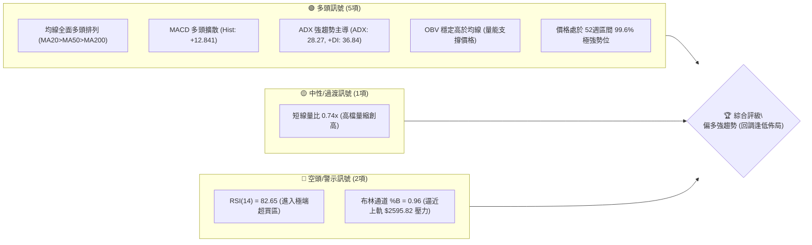
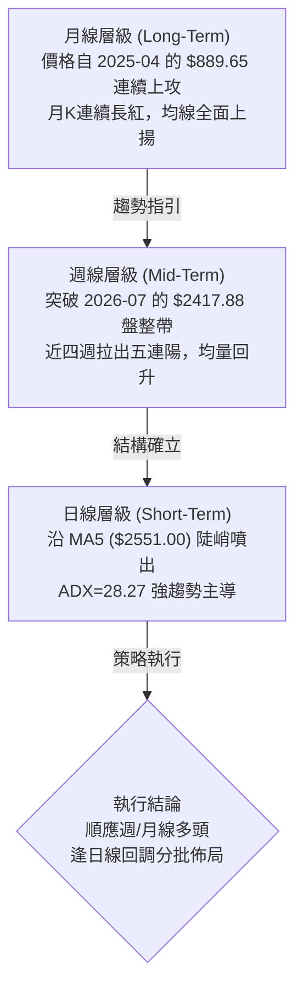
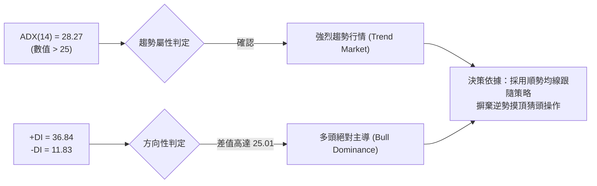
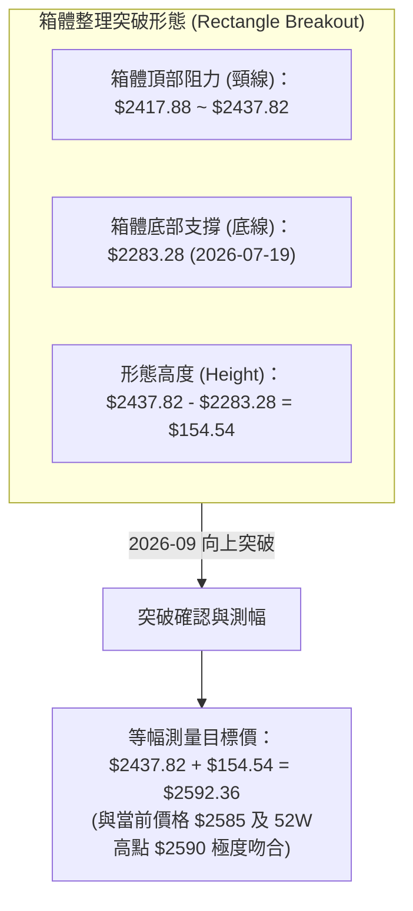
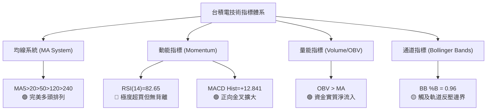
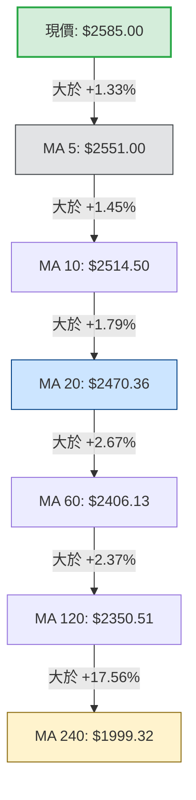
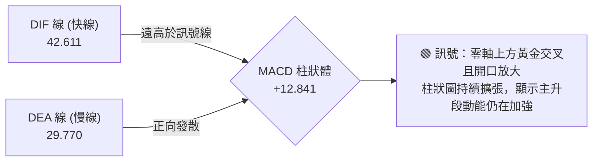
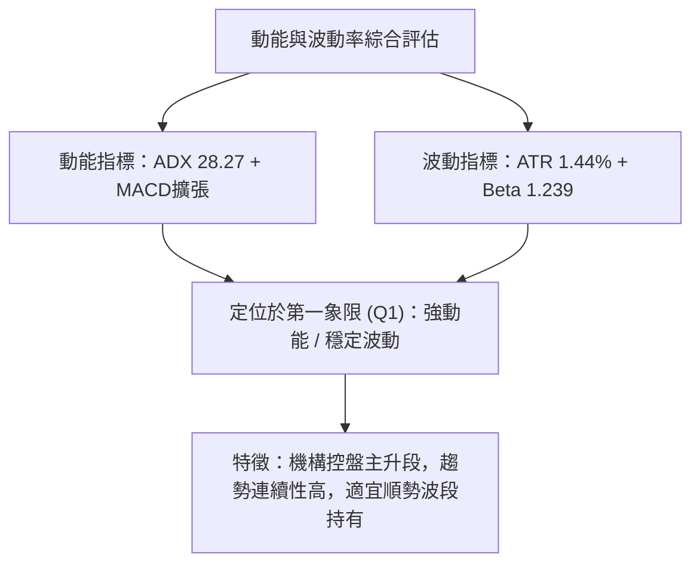
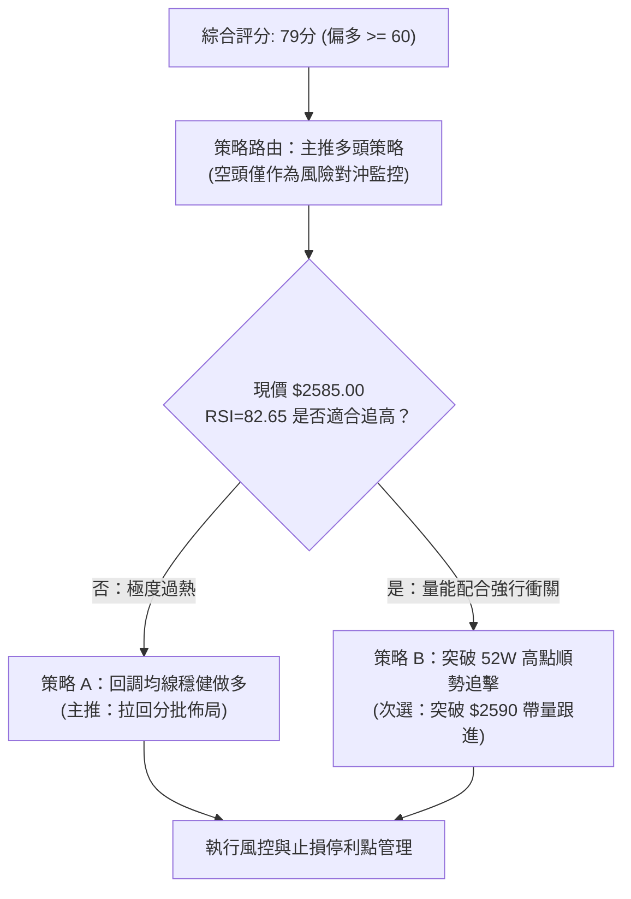
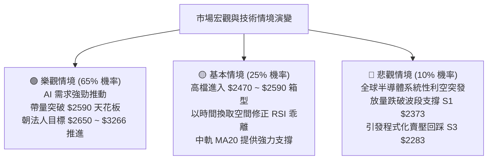

# 2330.TW 技術分析報告

> **報告日期**：2026-10-08 ｜ **語言**：繁體中文 ｜ **數據來源**：Yahoo Finance ｜ **當前價格**：$2585.00

---

## 目錄

| 章節 | 內容 |
|------|------|
| [1. 技術面概覽](#1-技術面概覽) | 訊號儀表板、核心指標、評分卡 |
| [2. 趨勢分析](#2-趨勢分析) | 多時框趨勢、長中短期走勢、ADX強趨勢解讀 |
| [3. 圖表形態分析](#3-圖表形態分析) | 形態識別信心度、K線組合、目標價推算 |
| [4. 支撐與阻力](#4-支撐與阻力) | 關鍵價位分布、波段高低點聚類、斐波那契回調 |
| [5. 技術指標深度解讀](#5-技術指標深度解讀) | 均線系統、RSI超買、MACD金叉、布林通道與OBV |
| [6. 動能與波動率](#6-動能與波動率) | 動能四象限、ATR風控距離、Beta市場敏感度 |
| [7. 多時框架總結](#7-多時框架總結) | 時框架矩陣、ADX主導優先級、多時框收斂結論 |
| [8. 交易策略建議](#8-交易策略建議) | 策略路由分流、價格階梯、主推策略與風控提示 |
| [9. 風險提示與監控](#9-風險提示與監控) | 關鍵監控清單、三情境壓力測試、資金控管規範 |
| [10. 報告總結](#10-報告總結) | 核心數據精煉、決策指引速查卡 |

---

## 1. 技術面概覽

### 🎯 技術訊號儀表板

依據當前即時指標數據，台積電（2330.TW）展現出極為強勁的多頭主升段架構。價格貼近歷史高點，均線呈標準多頭排列，MACD 柱狀圖持續放大，ADX 突破 28 確認趨勢確立；但短線動能指標（RSI 82.65、Stochastic %K 97.67）進入極端超買警戒區。



---

### 📊 核心指標速覽表

| 指標類別 | 指標名稱 | 當前數值 | 訊號 | 解讀 |
|:---|:---|:---|:---:|:---|
| **現貨價格** | 最新收盤價 | **$2585.00** | 🟢 | 距 52 週高點 $2590.00 僅差 $5.00，處於歷史強勢頂峰 |
| **短期均線** | MA20 (月線) | **$2470.36** | 🟢 | 現價高於 MA20 達 +4.64%，短多格局穩固 |
| **中期均線** | MA50 (季線) | **$2411.66** | 🟢 | 現價高於 MA50 達 +7.19%，波段多頭生命線支撐強勁 |
| **長期均線** | MA200 (年線) | **$2111.59** | 🟢 | 現價遠高於 MA200 達 +22.42%，長期牛市格局確立 |
| **動能震盪** | RSI(14) | **82.65** | 🔴 | 超買警戒（>70），短線具備技術性乖離修正壓力 |
| **動能趨勢** | MACD (12,26,9) | **+12.841** | 🟢 | DIF (42.611) > DEA (29.770)，正向紅柱擴散，多頭主控 |
| **趨勢強度** | ADX (14) | **28.27** | 🟢 | ADX > 25 且 +DI (36.84) 壓倒性領先 -DI (11.83)，強動能牛市 |
| **波動帶** | 布林通道 %B | **0.96** | 🟡 | 價格觸及上軌 $2595.82 邊緣，短線軌道形成動態反壓 |
| **成交量能** | 20日均量對比 | **0.74x** | 🟡 | 今日成交量 14.47M，低於 20日均量 19.50M，呈現高檔量縮碎步走高 |
| **波動區間** | ATR(14) | **$37.14** | 🟢 | 每日波動率約 1.44%，震盪幅度處於健康波段範圍內 |

---

### 🏆 技術評分卡

```
╔══════════════════════════════════════════════════════════════════╗
║               技術評分卡 — 2330.TW (2026-10-08)                  ║
╠══════════════════════════════════════════════════════════════════╣
║ 趨勢強度 (ADX/DMI)  ████████████████░░░░  82/100  🟢 強勢主升 ║
║ 均線架構 (MA排列)   ████████████████████  95/100  🟢 完美多頭 ║
║ 動能指標 (MACD/RSI) ████████████░░░░░░░░  60/100  🟡 超買鈍化 ║
║ 量能支撐 (OBV/成交) ██████████████░░░░░░  70/100  🟢 量價尚稱配合║
║ 形態突破 (High/Low) ██████████████████░░  90/100  🟢 創高架構 ║
║ 支撐防守度 (回調位) ████████████████░░░░  78/100  🟢 結構扎實 ║
╠══════════════════════════════════════════════════════════════════╣
║ 綜合技術評分        ███████████████░░░░░  79/100  🟢 強烈看多 ║
║ 策略導向            順勢偏多 — 拒絕盲目追高，鎖定急跌拉回承接 ║
╚══════════════════════════════════════════════════════════════════╝
```

---

## 2. 趨勢分析

### 🌐 多時框趨勢分析

技術分析核心原則在於「長時框看方向，短時框抓買點」。當前台積電月線、週線與日線展現出極高的一致性，呈現自 2025 年第二季以來的多頭單邊走勢。



---

### 📈 長期趨勢 — 12個月走勢圖（Unicode）

以下為 2025 年 11 月至 2026 年 10 月共 12 個月的月線收盤走勢全貌：

```
2330.TW 月線收盤走勢圖（過去12個月：2025-11 至 2026-10）
價格軸 ($)
$2600 ┤                                                 ● $2585.00 (現價/波段高)
$2450 ┤                                     ●     ●     │
$2300 ┤                               ●     │     │     │
$2150 ┤                         ●     │     │     │     │
$2000 ┤                   ●     │     │     │     │     │
$1850 ┤             ●     │     │     │     │     │     │
$1700 ┤       ●     │     │     │     │     │     │     │
$1550 ┤ ●     │     │     │     │     │     │     │     │
$1400 ┤ │     │     │     │     │     │     │     │     │
      └─┴─────┴─────┴─────┴─────┴─────┴─────┴─────┴─────┴─────
        11    12    01    02    03    04    05    06~08 09    10 (月)
       '25   '25   '26   '26   '26   '26   '26   '26   '26   '26
```

#### 走勢特徵分析表格

| 階段別 | 涵蓋月份 | 區間起訖點 ($) | 漲跌幅 | 量價與結構特徵 |
|:---|:---|:---|:---:|:---|
| **第一階段：突破啟動** | 2025-10 ~ 2026-01 | $1481.83 → $1759.34 | +18.73% | 突破千五整數關卡，單邊推升，量能穩健擴張 |
| **第二階段：波段洗盤** | 2026-01 ~ 2026-03 | $1759.34 → $1750.17 | -0.52% | 創下 $1977.40 高點後遭遇獲利回吐，回踩 $1750.17 築雙底支撐 |
| **第三階段：主升推升** | 2026-03 ~ 2026-05 | $1750.17 → $2341.84 | +33.81% | 爆發性買盤進駐，突破兩千元大關，多頭排列全面發散 |
| **第四階段：高檔箱型** | 2026-06 ~ 2026-08 | $2402.93 → $2397.94 | -0.21% | 在 $2283.28 ~ $2437.82 區間進行長達 3 個月的密集換手整理 |
| **第五階段：新一輪突破** | 2026-09 ~ 2026-10 | $2480.00 → $2585.00 | +4.23% | 跳空擺脫箱型頂部，直逼 52 週高點 $2590.00，啟動新一輪主升段 |

---

### 📊 中期趨勢（週線分析）

中期走勢方面，回顧 2026 年 6 月至 8 月的週線結構，股價曾於 2026-07-19 探底至 **$2283.28**，其後買盤持續墊高底部，分別於 2026-08-09（$2363.04）與 2026-09-06（$2402.93）形成穩固的更高低點（Higher Lows）。

進入 2026 年 9 月下旬後，週線出現顯著的多頭擴散：
- **2026-09-20**：週收盤 $2460.00，突破頸線區。
- **2026-09-27**：週收盤 $2475.00，MACD 柱狀圖由負轉正至 +6.477。
- **2026-10-04**：週收盤 $2500.00，站上整數里程碑。
- **2026-10-11**：最新週收盤來到 **$2585.00**，MACD 柱狀圖擴張至 +12.841，週 RSI 飆升至 82.6。

```
近期週線壓力與支撐示意圖：
[當前阻力] 52W 高點 $2590.00 ────────┐ (僅差 $5，短線臨界點)
                                    ▼
[最新收盤]                          $2585.00 ◄── 現價多頭衝刺
                                    ▲
[短線均線] MA5 支撐                 $2551.00 ─── 第一道動態防線
[短線均線] MA20 / BB中軌            $2470.36 ─── 波段防守強支撐
[歷史平台] 9月突破起漲平台          $2402.93 ─── 轉換為多頭防禦底線
[波段低點] 7月中旬築底低點          $2283.28 ─── 中期多空分水嶺 (S3)
```

---

### ⚡ 趨勢強度評估（ADX 解讀）

當前技術系統的趨勢強度由 ADX 指標給予了明確的量化確認：



#### ADX 趨勢強度量化對照表

| 指標名稱 | 當前讀數 | 基準閥值 | 狀態評估 | 技術面實質含義 |
|:---|:---:|:---:|:---:|:---|
| **ADX(14)** | **28.27** | 25.00 | 🟢 強趨勢確認 | 市場完全擺脫 7-8 月的震盪泥淖，展開高動能方向性單邊走勢 |
| **+DI** | **36.84** | 20.00 | 🟢 極強多頭 | 買盤推升力道強勁，積極型主動買盤佔據盤面主導地位 |
| **-DI** | **11.83** | 20.00 | 🟢 空頭潰敗 | 空方拋壓微弱，盤面未出現任何實質性出貨殺跌跡象 |
| **DI差值 (+DI - -DI)**| **+25.01** | >0 | 🟢 擴張發散 | 顯示多空力量呈現極度失衡，多方具備定價權 |

---

## 3. 圖表形態分析

### 🔍 形態識別系統

根據近 6 個月的 OHLCV 價格走勢，台積電於 2026 年 6 月至 8 月在 $2283.28 至 $2437.82 之間構築了一個大型高檔橫盤整理箱體（矩形旗形整理），並於 2026 年 9 月下旬帶量向上突破。



#### 形態識別信心度評估表（依嚴格規則15）

| 識別形態 | 信心度 | 判斷依據（嚴格引用數據） | 完成度 | 形態目標價（附精確計算式） |
|:---|:---:|:---|:---:|:---|
| **高檔矩形整理突破** | **85%** | 底部於 2026-07-19 的 $2283.28 (S3) 獲得支撐；頸線為 2026-07-05 高點 $2437.82。9月下旬連續突破。 | 100% (已達標) | 頸線 $2437.82 + 形態高度 ($2437.82 - $2283.28 = $154.54) = **$2592.36** |
| **雙重底 (W底) 結構** | **70%** | 第一底為 2026-06-14 的 $2303.22，第二底為 2026-07-19 的 $2283.28，頸線為 $2402.93。 | 100% (已達標) | 頸線 $2402.93 + 高度 ($2402.93 - $2283.28 = $119.65) = **$2522.58** (已完全超越) |
| **頭肩底 / 旗形通道** | <40% | *數據不足以支撐幾何形態* | 0% | **訊號不足，僅做指標型與均線突破解讀** |

---

### 🕯️ 重要K線形態分析

| 週期/月份 | 收盤價 ($) | 實體/形態名稱 | 技術解讀 | 訊號強度 |
|:---|:---:|:---|:---|:---:|
| **2026-07** | 2417.88 | 長下影十字星 | 探底 $2283.28 後強力收復，下檔買盤極為堅決，確認波段底部 | 🟢 轉折多頭 |
| **2026-08** | 2397.94 | 窄幅縮量紡錘線 | 連續四週於 $2400 關卡進行籌碼洗盤沉澱，浮額清洗乾淨 | 🟡 蓄勢整理 |
| **2026-09** | 2480.00 | 中長陽實體突破K | 實體大陽線一口氣收復 $2450，確立向上突破，多頭號角吹響 | 🟢 強烈買進 |
| **2026-10 (至今)**| 2585.00 | 連續階梯跳空強陽 | 沿 MA5 呈單邊上攻走勢，距離波段高點 $2590 僅一步之遙 | 🟢 衝刺主升 |

---

### 📉 ASCII 走勢形態示意圖

```
2330.TW 箱體突破與測幅達成示意圖
價格 ($)
$2592.36 ┼ - - - - - - - - - - - - - - - - - - - - - - - - - - - - - - [形態目標達成區]
$2585.00 ┤                                                       ● [現價]
         │                                                      ╱
$2500.00 ┤                                                    ╱
         │                                            ┌──────┘ (突破加速期)
$2437.82 ┼─────────────────────────●─────────────────┘ ◄── 頸線阻力突破點
         │            ●            │     ●
$2400.00 ┤           ╱ ╲          ╱ ╲   ╱ ╲
         │   ●      ╱   ╲        ╱   ╲ ╱   ╲
$2340.00 ┤  ╱ ╲    ╱     ╲      ╱     ●     ╲
         │ ╱   ╲  ╱       ╲    ╱             ╲
$2283.28 ┼───────●─────────●───                ◄─────── 箱體底部支撐帶 (S3)
         │       (底1)     (底2: 07-19)
         └─────────────────────────────────────────────────────
          2026-06        2026-07        2026-08        2026-09  2026-10
```

---

### 🎯 形態目標價計算

根據上述矩形箱體突破理論計算：
1. **箱體底部基準**：2026-07-19 實際確認波段低點 $2283.28。
2. **箱體頂部頸線**：2026-07-05 局部波段高點 $2437.82。
3. **箱體垂直高度 ($H$)**：
   $$H = \$2437.82 - \$2283.28 = \$154.54$$
4. **最小量度推算目標 ($T1$)**：
   $$T1 = 頸線 + H = \$2437.82 + \$154.54 = \mathbf{\$2592.36}$$
   - **檢驗結果**：當前即時價格已達 **$2585.00**，距離推算之第一形態目標價 $2592.36 僅差 $7.36（達成率達 95.2%）。這意味著此波段自箱體突破後的「第一段等幅漲幅」已基本滿足，短線極易在 $2590.00 ~ $2592.36 遭遇形態獲利了結賣壓。

---

## 4. 支撐與阻力

### 🗺️ 關鍵價位分布圖（Unicode）

依據提供的技術數據包，現價上方近一年**未偵測到任何波段高點聚類阻力（no swing-high resistance detected above current price）**，僅有 52 週歷史天花板 $2590.00 作為心理阻力。所有主要密集聚類價位均轉化為下檔支撐。

```
2330.TW 價位結構分布圖（嚴格依據 OHLCV 聚類計算）
═════════════════════════════════════════════════════════════════
$2590.00 ║████████████████████████████████║ 52W 歷史極限高點 (0.0% Fib)
$2585.00 ╠════════════════════════════════╣ ◄ 現價 ($2585.00)
$2470.36 ║▓▓▓▓▓▓▓▓▓▓▓▓▓▓▓▓▓▓▓▓            ║ 動態支撐 (MA20 / 布林中軌)
$2373.01 ║████████████████████            ║ 關鍵聚類支撐 S1 (-8.20%)
$2344.91 ║▓▓▓▓▓▓▓▓▓▓▓▓▓▓▓▓                ║ 動態支撐 (布林下軌)
$2323.16 ║████████████████████████        ║ 強支撐 S2 (-10.13%)
$2283.28 ║████████████████████████████████║ 波段聚類防守底線 S3 (-11.67%)
$2280.68 ║████████████████████████████████║ 23.6% 斐波那契回調位
$2089.32 ║████████████████                ║ 38.2% 斐波那契強支撐位
═════════════════════════════════════════════════════════════════
```

---

### 🚧 阻力位分析表

*(嚴格遵守規則13：僅引用數據中計算之阻力)*

| 阻力級別 | 價位 ($) | 形成原因 / 依據 | 突破難度 | 技術重要性 |
|:---|:---:|:---|:---:|:---|
| **R1** | **$2590.00** | **52週極值高點 (52W High)**；距離現價僅 $5.00 空間 | 🟡 中等 | 歷史天花板，心理關卡與空頭最後集結點 |
| **R2** | **$2595.82** | **日線布林通道上軌 (BB Upper)** | 🔴 較高 | 統計學 2 倍標準差動態反壓，短線過熱限制位 |
| **R3** | *(數據未偵測)* | *數據中未偵測到現價上方更高波段聚類，不憑空捏造* | — | 突破 $2590 後將進入無套牢籌碼的真空飛行區 |

---

### 🛡️ 支撐位分析表

*(嚴格遵守規則13：僅引用數據區塊計算出之波段低點聚類數值)*

| 支撐級別 | 價位 ($) | 形成原因 / 依據 | 守住機率 | 技術重要性 |
|:---|:---:|:---|:---:|:---|
| **S1** | **$2373.01** | **近一年第一波段低點聚類** (距離現價 -8.20%) | 75% | 短中線回調首要緩衝區，跌破將引發籌碼換手 |
| **S2** | **$2323.16** | **近一年第二波段低點聚類** (距離現價 -10.13%) | 85% | 密集換手防守區，跌破代表日線級別多頭趨勢受損 |
| **S3** | **$2283.28** | **近一年第三波段低點聚類** (距離現價 -11.67%) | 95% | **波段起漲結構底**，2026-07 週線大底，失守牛市終結 |

---

### 📐 斐波那契回調位分析

依據近 52 週完整波動區間（最低點 **$1279.31** 至 最高點 **$2590.00**），精確斐波那契黃金分割計算如下：

```
斐波那契回調結構（52週波段：$1279.31 → $2590.00，全距 $1310.69）
  0.0%  $2590.00  ◄── (52W High) 現價 $2585.00 處於 0.0% 極致邊緣
        │ (現價處於極限高檔超強態勢，回調空間達 $304.32 方觸及首要回調位)
 23.6%  $2280.68  ◄── 淺幅回調強支撐（高度共振 S3: $2283.28）
 38.2%  $2089.32  ◄── 健康回調支撐位（與 MA200: $2111.59 形成雙重共振）
 50.0%  $1934.66  ◄── 多空強弱分水嶺
 61.8%  $1779.99  ◄── 黃金分割防守位
 78.6%  $1559.80  ◄── 深度回撤防線
100.0%  $1279.31  ◄── (52W Low) 起漲原始起點
```

#### 回調位深度解讀：
- **現價位置評估**：現價 **$2585.00** 緊密貼近 **0.0% ($2590.00)**，回撤幅度幾近於零，這在道氏理論中屬於典型「最強主升段」。
- **黃金共振現象**：
  1. 斐波那契 **23.6% ($2280.68)** 與聚類支撐 **S3 ($2283.28)** 數值極度重合（差距僅 $2.60），構成機構法人認可的中期強支撐堡壘。
  2. 斐波那契 **38.2% ($2089.32)** 緊鄰年線 **MA200 ($2111.59)**，形成長期結構共振護城河。

---

## 5. 技術指標深度解讀

### 🎛️ 指標訊號總覽



---

### 📈 移動平均線排列分析

台積電各均線週期呈現標準的「教科書式多頭排列」，所有短期均線均運行於長期均線之上，且價格對所有均線呈現全面正向發散：



- **均線排列結論**：多頭排列百分之百完整（MA5 > MA10 > MA20 > MA50/60 > MA120 > MA200/240）。MA20 位於 $2470.36，提供近端最強有力之動態支撐；年線 MA200 位於 $2111.59，奠定長線大多頭基石。

---

### 📉 RSI(14) 分析與背離判斷

- **當前讀數**：**82.65**
- **強度進度條**：
  `[████████████████░░░░] 82.65% (極度超買)`

```
RSI(14) 區間定位圖：
0 ─────── 30 ────────────── 50 ────────────── 70 ──── 82.65 ──── 100
 [ 超賣區 ]    [ 弱勢區 ]        [ 強勢區 ]   [ 超買 ]  ▲ [極端過熱]
```

#### 背離深度剖析（嚴格依據規則7）：
- **價格走勢**：月線與週線連破新高（從 $2402.93 → $2500.00 → $2585.00）。
- **RSI 軌跡**：週 RSI 由 9 月中旬之 58.8 穩步攀升至 10 月初之 59.3，最新一週伴隨急漲飆升至 **82.65**，RSI 高點同步創下近期新高。
- **背離結論**：**「無明顯背離（No Divergence）」**。
  - 當前 RSI 並未出現「價格創高而指標落後」之頂背離現象。此超買為典型**強勢單邊行情中的鈍化現象**，代表買盤極具侵略性，而非動能竭盡。但在 82 以上水準，任何小幅盤中波動均容易引發程式化賣單平倉。

---

### 📊 MACD(12, 26, 9) 訊號解讀



- **MACD 數值解析**：DIF 42.611 顯著大於 DEA 29.770，柱狀體數值達 **+12.841**。回顧近四週柱狀體（+0.062 → +6.477 → +5.772 → +12.841），呈現階梯式放大，確認動能加速，**徹底排除 MACD 頂背離之可能性**。

---

### 📦 布林通道分析

布林參數（20, 2）數據顯示：
- **上軌 (Upper Band)**：**$2595.82**
- **中軌 (Middle Band / MA20)**：**$2470.36**
- **下軌 (Lower Band)**：**$2344.91**
- **帶寬通道位置 (%B)**：**0.96**

```
布林通道現況剖面圖：
$2595.82 ┬─────────────────────────────────────────────── BB 上軌
$2585.00 │                                            ● 現價 (%B = 0.96)
         │                                          ╱
         │                                        ╱
$2470.36 ┼───────────────────────────────────────╱─────── BB 中軌 (MA20)
         │                                      ╱
         │                                    ╱
$2344.91 ┴───────────────────────────────────┴─────────── BB 下軌
```

- **軌道行為解讀**：%B 達 0.96 代表價格幾乎貼緊上軌飛行，屬於「沿軌噴出（Walking the Bands）」特徵。唯需注意上軌 $2595.82 與 52 週高點 $2590.00 形成雙重狹窄天花板，價格若無爆量支援，易在上軌外緣收斂拉回至中軌 $2470.36 尋求均線支撐。

---

### 💹 成交量分析（量價配合度與 OBV）

- **量能數據對比**：
  - 最新單日成交量：**14,466,183 股 (14.47M)**
  - 20日移動平均量：**19,498,642 股 (19.50M)**
  - 當前量比：**0.74x**
- **OBV (能量潮) 趨勢**：
  - 數據明確指出：`OBV > MA → 量能支撐上漲`。
- **量價綜合診斷**：
  - 現價以 0.74x 之偏低量比創下波段新高，這在傳統型態學上顯示出「籌碼鎖定效應」。台積電機構持股比例高達 43.5%，籌碼多集中於長線法人口袋，高檔未見倒貨巨量（賣壓極輕）；但從攻擊角度觀察，若欲穩健突破 $2590.00 並站穩二千六百元關卡，後續日成交量必須擴增至 20M 以上，方能形成良性換手。

---

## 6. 動能與波動率

### ⚡ 動能評估四象限

評估台積電在動能強度（Momentum）與波動率（Volatility）之相對定位：

| 象限 | 動能維度 | 波動維度 | 當前狀態判定 | 戰術指引與操作評估 |
|:---:|:---:|:---:|:---:|:---|
| **Q1 (強/低)** | **強動能** | **低/中波動** | 🟢 **2330.TW 當前位置** | **最優趨勢格局**：趨勢平滑推進，拉回即買點 |
| Q2 (弱/低) | 弱動能 | 低波動 | — | 盤整泥潭，缺乏獲利空間 |
| Q3 (強/高) | 強動能 | 高波動 | — | 狂暴行情，風險與滑價大幅提高 |
| Q4 (弱/高) | 弱動能 | 高波動 | — | 空頭獵殺，極度危險應全面規避 |



---

### 📊 ATR 波動率分析與止損距離設定

- **ATR(14) 讀數**：**$37.14**
- **ATR 佔價格比率**：$37.14 / $2585.00 = **1.44%**

#### 止損與風控量化距離建議：
1. **短線緊密追蹤止損 (1.5x ATR)**：
   $$\text{距離} = 1.5 \times \$37.14 = \$55.71 \implies \text{止損參考點} = \$2585.00 - \$55.71 = \mathbf{\$2529.29}$$
   *(恰好防守於 MA10: $2514.50 上方)*
2. **波段標準止損 (2.5x ATR)**：
   $$\text{距離} = 2.5 \times \$37.14 = \$92.85 \implies \text{止損參考點} = \$2585.00 - \$92.85 = \mathbf{\$2492.15}$$
   *(防守於整數關卡 $2500 與 MA20: $2470.36 之上)*

---

### 📐 Beta 與市場相關性

- **Beta 係數**：**1.239**
- **市場意涵**：台積電身為加權指數核心權值股，Beta 為 1.239 顯示其波動度放大約大盤 1.24 倍。當大盤處於牛市時，具備強烈的領漲超額報酬能力（Alpha 特徵顯著）；但亦意味著一旦整體大盤系統性風險升溫，其回撤幅度亦會較非權值個股更為敏銳。

---

## 7. 多時框架總結

### 📋 時框架評分表

| 時框架 | 趨勢方向 | 動能狀態 | 均線系統 | 形態結構 | 綜合評分 | 戰術建議 |
|:---|:---:|:---:|:---:|:---:|:---:|:---|
| **長期 (月線)** | 🟢 強烈看多 | 🟢 多頭擴散 | 🟢 完美多頭 (MA200向上) | 階梯式走高 | **92/100** | 核心多單續抱，勿隨意離場 |
| **中期 (週線)** | 🟢 強烈看多 | 🟢 MACD柱擴大 | 🟢 週線沿MA5攀升 | 箱體突破確認 | **88/100** | 突破順勢加碼，防守點上移 |
| **短期 (日線)** | 🟡 謹慎偏多 | 🔴 RSI極度超買 | 🟢 短天期多頭發散 | 觸及布林上軌反壓 | **68/100** | 暫停追高，靜待回踩均線 |

---

### 🔲 綜合訊號矩陣

```
時框架維度    月線 (長期)         週線 (中期)         日線 (短期)
─────────────────────────────────────────────────────────────────
趨勢走向      🟢 單邊牛市         🟢 突破主升         🟢 強勢衝刺
均線排列      🟢 多頭排列         🟢 多頭排列         🟢 多頭排列
動能狀態      🟢 穩健增強         🟢 動能加速         🔴 82.65 超買
量價結構      🟢 籌碼集中         🟢 換手推升         🟡 0.74x 量縮
形態定位      🟢 歷史級主升       🟢 突破測幅達成     🟡 臨阻回調風險
```

---

### ⚖️ 多時框收斂結論（嚴格遵守規則14）

1. **行情屬性判定**：當前日線 ADX(14) 讀數為 **28.27 (> 25)**，依規則明確收斂判定為**「強烈趨勢行情（Trend Market）」**。
2. **主導時框優先級**：因屬趨勢行情，**以中長期（週線 / MA50 / MA200）方向為主導**，日線指標之超買僅作為尋找次級拉回進場時機之用，不可作為逆勢作空的理由。
3. **唯一方向性結論**：**【強烈偏多，順勢拉回佈局】**。
   - 週線與月線之多頭動能壓倒性主導盤面；日線之超買（RSI 82.65）與布林上軌壓制，預示現價（$2585.00）向上空間在短線將受到 $2590.00 ~ $2595.82 之擠壓，最合理的推演為日線進行橫盤整理或回踩 MA20（$2470.36），為長線投資者提供絕佳的低風險二次切入點。

---

## 8. 交易策略建議

### 🗺️ 策略決策流程圖



---

### 🧭 策略路由

**當前主策略方向 = 【多頭主升段操作（主推順勢做多）】（依技術評分卡：79/100）**

---

### 🎯 價格情境階梯（Price Scenarios）

*(價位嚴格引用第 4 章及數據區塊之精確數值)*

| 觸發條件 | 下一目標 | 後續延伸 | 情境含義與對策 |
|:---|:---:|:---:|:---|
| **強勢突破 52W 高點 $2590.00** | **$2595.82** (BB上軌) | **$2650.00** (法人最低目標) | 短線極強動能爆發，打開歷史新篇章 |
| **站穩現價區間 ($2470.36 ~ $2585.00)** | **$2590.00** | — | 高檔強勢強勢整理，消化 RSI 超買賣壓 |
| **跌破 S1 $2373.01** | **S2 $2323.16** | **S3 $2283.28** | 中期技術性大幅洗盤，進入波段防守 |

---

### 📊 情境機率分佈

| 情境劇本 | 估計機率 | 主要技術指標支撐依據 |
|:---|:---:|:---|
| **情境一：高檔強勢整理後續攻** | **65%** | ADX=28.27 趨勢強勁，MACD柱（+12.841）擴張，OBV 持續支撐，多頭架構完好 |
| **情境二：次級拉回修正均線 (回踩MA20)** | **25%** | RSI(14)=82.65 極端超買，布林 %B=0.96 觸軌反壓，成交量比僅 0.74x 動能不足 |
| **情境三：深度破位逆轉 (跌破S1)** | **10%** | 全均線呈標準多頭排列，下檔波段支撐多重防護，出現逆轉機率極低 |

---

### 🟢 主策略詳情

依據評分卡，本次交易報告給予兩套不同風險屬性之多頭規劃：

| 策略要素 | 策略 A：回調均線穩健型（主推） | 策略 B：右側突破動能型（次選） |
|:---|:---|:---|
| **進場條件** | 價格拉回 MA20 或 Fib 支撐不破獲支撐 | 盤中帶量長紅實體突破 52W 歷史極限高點 |
| **進場價格** | **$2470.36** (精確錨定 MA20 / BB中軌) | **$2590.00** (突破 52W 高點瞬間) |
| **目標價 T1** | **$2590.00** (回測前高) | **$2650.00** (分析師最低共識目標價) |
| **目標價 T2** | **$3266.80** (分析師平均共識目標價) | **$3266.80** (分析師平均共識目標價) |
| **止損價格** | **$2373.01** (嚴格停損於關鍵支撐 S1 下方) | **$2514.50** (假突破停損於 MA10 下方) |
| **潛在利潤 (T1)** | +$119.64 (+4.84%) | +$60.00 (+2.32%) |
| **潛在風險** | -$97.35 (-3.94%) | -$75.50 (-2.92%) |
| **風險報酬比 (R:R)**| **1 : 1.23** (至T1) / **1 : 8.18** (至T2) | **1 : 0.79** (至T1) / **1 : 8.96** (至T2) |
| **預估勝率** | **70%** | **55%** |
| **建議倉位** | **20% ~ 25%** (分批佈局) | **10% ~ 15%** (短線試單) |

---

### 🔴 反向風險觸發點（對沖與風控提示）

本策略為絕對多頭導向，但若出現以下**推翻主策略架構**的訊號，應立即終止多頭思路，轉為防守或避險：
1. **多頭警報一級觸發**：收盤價帶量跌破 **MA20 ($2470.36)**，且日線 MACD 柱狀體出現由紅翻綠死叉，應立即將總倉位減半。
2. **多頭架構徹底破壞**：收盤價確認失守近一年波段聚類支撐 **S1 ($2373.01)**。此訊號一旦確立，代表波段多頭走勢終結，所有剩餘多單必須無條件止損離場，空手觀望。

---

### ⭐ 整體訊號強度評星

```
╔══════════════════════════════════════════════════════════════════╗
║ 做多訊號強度：★★★★☆  (4/5星) — 均線與趨勢極佳，唯短線過熱扣一星║
║ 做空訊號強度：★☆☆☆☆  (1/5星) — 逆勢摸頂風險極高，嚴禁盲目放空║
║ 整體可信度：  ★★★★☆  (4.5/5星) — 多時框指標高度共振確認     ║
╚══════════════════════════════════════════════════════════════════╝
```

---

## 9. 風險提示與監控

### ✅ 關鍵監控指標 Checklist

```
╔══════════════════════════════════════════════════════════════════╗
║               2330.TW 交易與風控即時監控清單                     ║
╠══════════════════════════════════════════════════════════════════╣
║ [ ] 價格突破監控：收盤價是否放量站上 52W 高點 $2590.00          ║
║ [ ] 動態反壓監控：是否在布林上軌 $2595.82 遭遇長上影線拋壓       ║
║ [ ] RSI 動能降溫：日線 RSI(14) 能否自 82.65 平穩回落至 70 之下   ║
║ [ ] 均線動態支撐：MA20 ($2470.36) 每日上移斜率是否維持陡峭       ║
║ [ ] 聚類支撐防線：S1 ($2373.01) 是否維持未被觸碰狀態             ║
║ [ ] 量能擴張驗證：日成交量是否自 14.47M 回升至 20M 均量水平之上  ║
╚══════════════════════════════════════════════════════════════════╝
```

---

### ⚠️ 風險場景分析



---

### 🛡️ 風險管理重要提醒

1. **拒絕情緒化追高**：當前 RSI 位於 82.65，布林 %B 位於 0.96，技術層面處於「極端過熱」區間。即便長線極度看好，於 $2585.00 全倉壓注追價的風險報酬比極差。**嚴守紀律，唯有回調至均線附近方為高勝率進場點。**
2. **波動率止損應用**：單日 ATR 高達 $37.14，設定止損點切勿過於狹窄（避免低於 1.5x ATR），以免被正常盤中洗盤震盪掃出場。
3. **資金倉位配置守則**：單一標的持倉曝險不宜超過整體投資組合之 30%；建立部位應採取「三角加碼法」，初筆試單 30%，回調確認支撐加碼 40%，突破前高再加碼剩餘 30%。

---

## 📋 報告總結

```
╔══════════════════════════════════════════════════════════════════╗
║                   2330.TW 技術分析報告總結                       ║
╠══════════════════════════════════════════════════════════════════╣
║ 報告日期：2026-10-08                                             ║
║ 當前價格：$2585.00                                               ║
║ 分析評級：🟢 強烈偏多（Trend Bullish）/ 短線過熱等待回調         ║
╠══════════════════════════════════════════════════════════════════╣
║ 核心結構結論：                                                   ║
║ ├─ 長期趨勢 (月線)：🟢 極強牛市，均線發散，主升段運行中           ║
║ ├─ 中期趨勢 (週線)：🟢 突破 $2437 箱體，測幅目標 $2592 已滿足     ║
║ ├─ 短期趨勢 (日線)：🟡 ADX=28.27 強趨勢，唯 RSI=82.65 短線超買   ║
║ ├─ 關鍵支撐體系：S1: $2373.01 ｜ S2: $2323.16 ｜ S3: $2283.28     ║
║ ├─ 關鍵阻力體系：52W高點: $2590.00 ｜ 布林上軌: $2595.82        ║
║ └─ 法人共識目標：最低 $2650.00 ｜ 平均 $3266.80 ｜ 最高 $4410.00 ║
╠══════════════════════════════════════════════════════════════════╣
║ 最優交易策略組合：                                               ║
║ 1. 🥇 最佳機會 (回調穩健)：耐心等待回撤 MA20 ($2470.36) 逢低佈局 ║
║ 2. 🥈 次選機會 (動能突破)：若爆量突破 $2590.00，短線輕倉追多至 $2650║
║ 3. 🥉 風控底線 (絕對止損)：若實體K跌破 S1 ($2373.01)，多頭全面撤退║
╚══════════════════════════════════════════════════════════════════╝
```

---

> ⚠️ **免責聲明**：本報告為依據客觀技術分析量化模型所撰寫之研究報告，所有數據、計算公式及趨勢推演均基於市場歷史價格與公開資訊。本報告**僅供學術研究、策略回測與投資參考**，**不構成任何形式之個人化投資要約、招攬或具體操作建議**。金融市場瞬息萬變，投資人應獨立審慎評估風險，並自負盈虧。

---

*報告生成時間：2026-10-08 ｜ 數據來源：Yahoo Finance ｜ 分析框架：多時框技術分析體系*