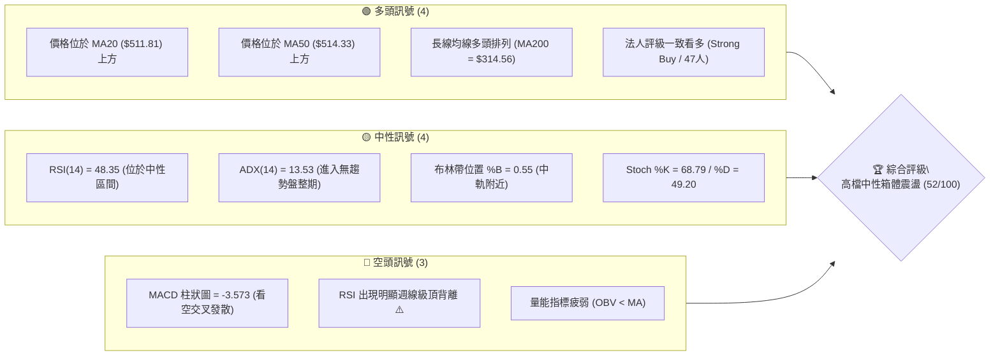
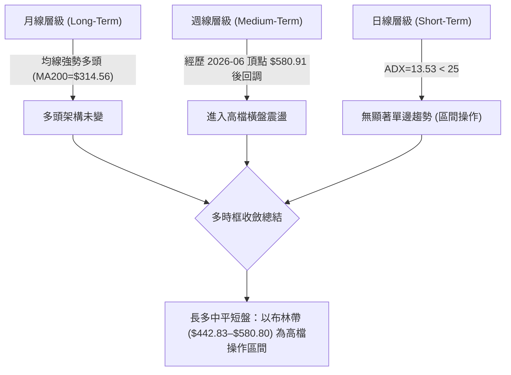
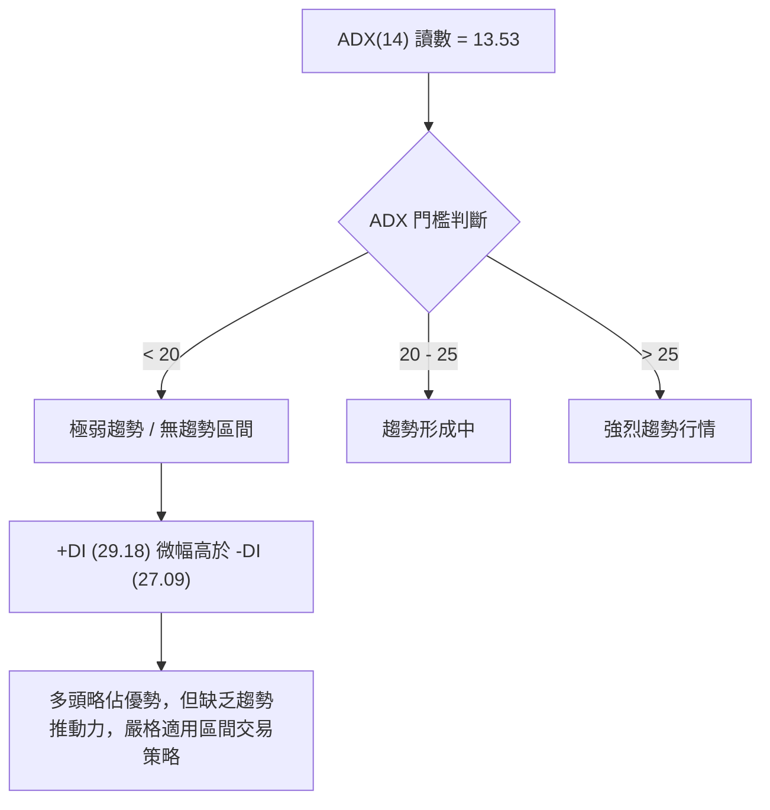
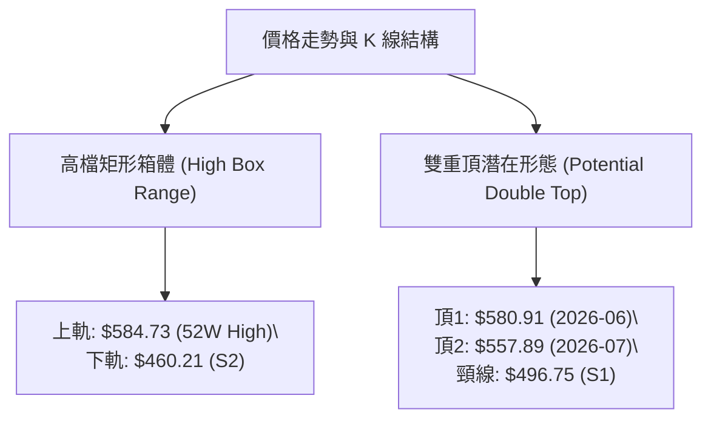
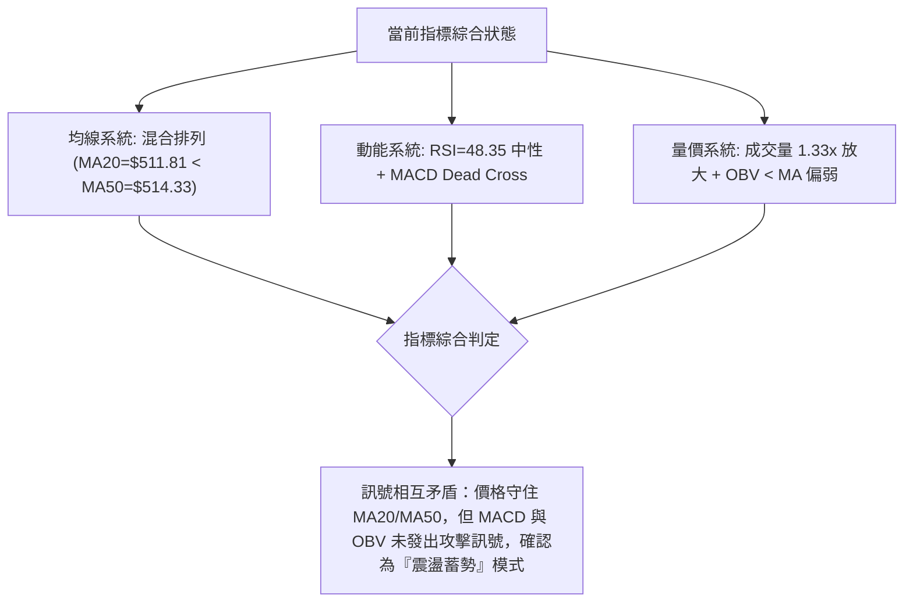
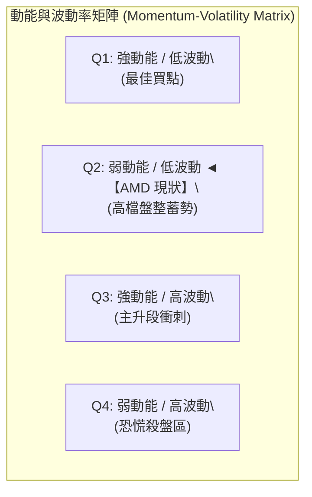
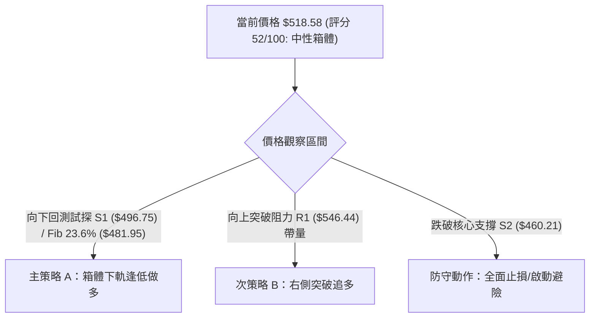
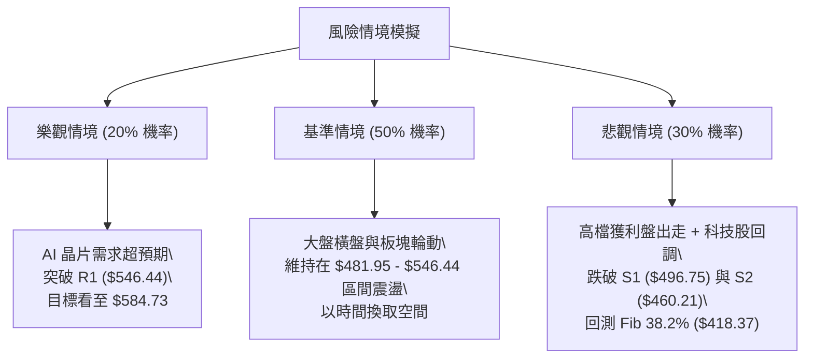

# AMD 技術分析報告

> **報告日期**：2026-08-05 ｜ **語言**：繁體中文 ｜ **數據來源**：Yahoo Finance ｜ **當前價格**：$518.58

---

## 目錄

| 章節 | 內容 |
|------|------|
| [1. 技術面概覽](#1-技術面概覽) | 訊號儀表板、核心指標、評分卡 |
| [2. 趨勢分析](#2-趨勢分析) | 多時框趨勢、長中短期走勢 |
| [3. 圖表形態分析](#3-圖表形態分析) | 形態識別、K線組合、目標價 |
| [4. 支撐與阻力](#4-支撐與阻力) | 關鍵價位、斐波那契回調 |
| [5. 技術指標深度解讀](#5-技術指標深度解讀) | MA/RSI/MACD/布林/成交量 |
| [6. 動能與波動率](#6-動能與波動率) | 動能評估、ATR、Beta |
| [7. 多時框架總結](#7-多時框架總結) | 時框架評分矩陣 |
| [8. 交易策略建議](#8-交易策略建議) | 多空策略、風險報酬比 |
| [9. 風險提示與監控](#9-風險提示與監控) | 監控指標、風險場景 |
| [10. 報告總結](#10-報告總結) | 結論摘要、免責聲明 |

---

## 1. 技術面概覽

### 🎯 技術訊號儀表板



### 📊 核心指標速覽表

| 指標類別 | 指標名稱 | 當前數值 | 訊號 | 解讀 |
|----------|----------|----------|------|------|
| **價格** | 當前價格 | $518.58 | 🟢 多頭 | 位於 52 週區間高檔 84.8% 位置，站穩月線與季線 |
| **均線** | MA20 | $511.81 | 🟢 多頭 | 價格位於 MA20 上方 (+1.32%)，提供短線動態支撐 |
| **均線** | MA50 | $514.33 | 🟢 多頭 | 價格位於 MA50 上方 (+0.83%)，中期支撐尚存 |
| **均線** | MA200 | $314.56 | 🟢 多頭 | 價格遠高於年線 (+64.86%)，長期多頭基調堅實 |
| **動能** | RSI(14) | 48.35 | 🟡 中性 | 位於 30-70 中性區，惟存在週線級頂背離隱憂 |
| **動能** | MACD(12,26,9) | -7.599 | 🔴 空頭 | MACD 線與訊號線呈死叉，柱狀圖 -3.573 持續看空 |
| **趨勢** | ADX(14) | 13.53 | 🟡 盤整 | ADX < 25，顯示強烈單邊趨勢暫停，轉為橫盤震盪 |
| **波動** | ATR(14) | $41.30 | 🔴 高波動 | 占股價 7.96%，每日波幅巨大，操作需拉開止損空間 |
| **通道** | 布林 %B | 0.55 | 🟡 中性 | 股價緊貼中軌 ($511.81)，上下軌區間為 $442.83–$580.80 |
| **量能** | OBV | OBV < MA | 🔴 疲弱 | 最新成交量 3,726 萬股 (1.33x 均量)，但能量潮未增量確認 |

### 🏆 技術評分卡

```
╔══════════════════════════════════════════════════════════════╗
║              技術評分卡 — AMD (2026-08-05)                   ║
╠══════════════════════════════════════════════════════════════╣
║ 趨勢強度 (ADX=13.53)   ██████░░░░░░░░░░░░░░  30/100  🟡 弱趨勢║
║ 動能指標 (RSI/MACD)    █████████░░░░░░░░░░░  45/100  🔴 頂背離║
║ 支撐穩定度 (S1/Fib23.6) ██████████████░░░░░░  70/100  🟢 強支撐║
║ 成交量配合 (OBV<MA)    ████████░░░░░░░░░░░░  40/100  🔴 量能退潮║
║ 形態完整度 (箱體整理)  ████████████░░░░░░░░  60/100  🟡 高檔箱體║
║ 均線排列 (多時框混合)  █████████████░░░░░░░  65/100  🟢 長多短混║
╠══════════════════════════════════════════════════════════════╣
║ 綜合評分               ███████████░░░░░░░░░  52/100  🟡 中性觀望║
╚══════════════════════════════════════════════════════════════╝
```

---

## 2. 趨勢分析

### 🌐 多時框趨勢分析



### 📈 長期趨勢 — 24個月走勢圖（Unicode）

```
AMD 月線走勢圖（2024-08 至 2026-08）
價格軸 ($)
$600 ┤                                        ● $580.91 (高點)
$520 ┤                                   ●    │   ● $518.58 (現價)
$440 ┤                              ●    │    ●
$360 ┤                         ●    │    │
$280 ┤              ●          │    │    │
$200 ┤    ●    ●    │    ●     │    │    │
$120 ┤●   │    │    │    │     │    │    │
$40  └┼───┼────┼────┼────┼─────┼────┼────┼────┼─────────────────
     24/08 24/12 25/04 25/08 25/12 26/04 26/06 26/07 26/08
```

#### 走勢特徵分析表

| 時間區間 | 起始價 | 終點價 | 漲跌幅 | 主要走勢特徵與驅動因素 |
|----------|--------|--------|--------|------------------------|
| **2024-08 ~ 2025-04** | $148.56 | $97.35 | -34.47% | 尋底階段，於 2025-04 觸及波段低點 $97.35 |
| **2025-05 ~ 2025-10** | $110.73 | $256.12 | +131.30% | 第一波主升段，突破 $200 關卡，量能顯著放大 |
| **2025-11 ~ 2026-03** | $217.53 | $203.43 | -6.48% | 中期蓄勢平台，於 $200–$236 區間完成築底清理浮碼 |
| **2026-04 ~ 2026-06** | $354.49 | $580.91 | +63.87% | 第二波拋物線主升段，創下歷史新高 $584.73 |
| **2026-07 ~ 2026-08** | $476.15 | $518.58 | +8.91% | 創高後高檔劇烈震盪，回測試探 23.6% 斐波那契位 ($481.95) |

### 📊 中期趨勢（週線分析）

近 20 週走勢顯示，AMD 在 2026 年 4 月下旬至 5 月上旬經歷暴漲（週 RSI 一度衝高至 97.4 的極端超買區），並於 2026 年 6 月初觸及 $580.91 最高收盤位。隨後動能迅速降溫，每週 MACD 柱狀圖轉負（最新為 -3.573），價格在 $476.15–$557.89 之間進行拉扯。目前價格 $518.58 介於波段低點聚類 S1 ($496.75) 與阻力位 R1 ($546.44) 之間。

### ⚡ 趨勢強度評估（ADX 解讀）



| 指標名稱 | 數值 | 評估標準 | 狀態 | 交易含意 |
|----------|------|----------|------|----------|
| **ADX(14)** | 13.53 | < 25 屬盤整行情 | 🟡 弱趨勢 | 突破追價勝率低，宜採低買高賣 |
| **+DI(14)** | 29.18 | > -DI 顯示多方佔優 | 🟢 多方占優 | 微幅領先，多頭仍保有機會 |
| **-DI(14)** | 27.09 | 接近 +DI | 🟡 空方拉扯 | 空方緊追，多空陷入拉鋸 |

---

## 3. 圖表形態分析

### 🔍 形態識別系統



#### 形態信心度與目標價評估表

| 形態名稱 | 信心度 | 判斷依據（引用數據） | 完成度 | 形態目標價（附計算式） |
|----------|--------|----------------------|--------|------------------------|
| **高檔矩形箱體** | 75% | 股價受阻於 52W High $584.73，並在 S2 $460.21 獲得多次波段支撐 | 85% | **箱體突破向上**：$584.73 + ($584.73 - $460.21) = $709.25<br>**箱體跌破向下**：$460.21 - ($584.73 - $460.21) = $335.69 |
| **雙重頂 (潛在)** | 55% | 2026-06 高點 $580.91 與 2026-07 反彈高點 $557.89 形成二度測頂，且週線 RSI 出現頂背離 | 40% (尚未跌破頸線) | **跌破頸線 S1 ($496.75) 目標價**：<br>頸線 $496.75 - (頂點平均 $569.40 - 頸線 $496.75) = **$424.10** |

*註：若雙頂頸線 S1 ($496.75) 未被跌破，該形態不成立；現階段以「高檔矩形箱體」優先解讀。*

### 🕯️ 重要 K 線形態分析（近期月線與週線）

| 時間 | 收盤價 | K 線形態名稱 | 技術面解讀 | 多空訊號 |
|------|--------|--------------|------------|----------|
| **2026-04** | $354.49 | 大陽線 (Marubozu) | 強烈長陽突破歷史新高，帶動主升段波段行情 | 🟢 極度看多 |
| **2026-05** | $516.10 | 長上影大陽線 | 多頭續強但高檔面臨獲利結案賣壓 | 🟡 買盤分歧 |
| **2026-06** | $580.91 | 避雷針 / 衝高回落 | 創下歷史新高 $584.73 後出現強烈拋壓，形成中期高點 | 🔴 看空轉折 |
| **2026-07** | $476.15 | 中陰線 (Pullback) | 單月回調 -18.03%，測試 23.6% 斐波那契回調位 ($481.95) | 🔴 空頭佔優 |
| **2026-08** | $518.58 | 止跌陽線 (In-progress) | 於 S1 ($496.75) 上方展開反彈，試圖重新站穩 MA20/MA50 | 🟢 短線止跌 |

### 📉 ASCII 走勢形態示意圖

```
AMD 高檔箱體與潛在雙頂構造示意圖
 價格 ($)
 $584.73 ─────── 頂點1 (580.91) ────── 頂點2 (557.89) ─── 箱體頂軌 / R3 ($574.20)
                 │                   │
                 │   反彈震盪        │   當前價格: $518.58
 $518.58 ────────┼─────────●─────────┼──────────────────── MA20/MA50 區間
                 │        / \        │
 $496.75 ────────┼───────●───●───────┼──────────────────── 頸線位 / S1
                 │      /     \      │
 $460.21 ────────┴─────●───────●─────┴──────────────────── 箱體底軌 / S2
```

---

## 4. 支撐與阻力

### 🗺️ 關鍵價位分布圖（Unicode）

```
AMD 關鍵價位結構分布圖
═════════════════════════════════════════════════════════════════
$584.73 ║████████████████████████████████████████║ 52 週最高點 (52W High)
$574.20 ║████████████████████████████████████    ║ 近一年高點阻力 R3 (+10.73%)
$562.23 ║████████████████████████████████        ║ 波段阻力 R2 (+8.42%)
$546.44 ║████████████████████████████            ║ 近期阻力 R1 (+5.37%)
$518.58 ╠════════════════════════════════════════╣ ◄ 當前收盤價 (Current Price)
$496.75 ║▓▓▓▓▓▓▓▓▓▓▓▓▓▓▓▓▓▓▓▓▓▓▓▓                ║ 近期波段支撐 S1 (-4.21%)
$481.95 ║▓▓▓▓▓▓▓▓▓▓▓▓▓▓▓▓▓▓▓▓                    ║ 斐波那契 23.6% 回調位 (-7.06%)
$460.21 ║▓▓▓▓▓▓▓▓▓▓▓▓▓▓▓▓                        ║ 核心波段支撐 S2 (-11.26%)
$437.23 ║▓▓▓▓▓▓▓▓▓▓▓▓                            ║ 強力結構支撐 S3 (-15.69%)
$418.37 ║▓▓▓▓▓▓▓▓                                ║ 斐波那契 38.2% 回調位 (-19.32%)
═════════════════════════════════════════════════════════════════
```

### 🚧 阻力位分析表

| 阻力級別 | 精確價位 | 形成原因（依據數據） | 突破難度 | 關鍵重要性 |
|----------|----------|----------------------|----------|------------|
| **阻力 R1** | **$546.44** | 近一年波段高點聚類位 (+5.37%) | 🟡 中等 | 短線多頭欲開啟新一波反彈必須克服的第一道關卡 |
| **阻力 R2** | **$562.23** | 2026-07 次高點解套賣壓區 (+8.42%) | 🔴 較高 | 中期解套盤與短線獲利盤密集交會點 |
| **阻力 R3** | **$574.20** | 歷史高點前夕最後阻力牆 (+10.73%) | 🔴 極高 | 突破此區即具備挑戰 52 週新高 $584.73 之動能 |

### 🛡️ 支撐位分析表

| 支撐級別 | 精確價位 | 形成原因（依據數據） | 守住機率 | 關鍵重要性 |
|----------|----------|----------------------|----------|------------|
| **支撐 S1** | **$496.75** | 近一年波段低點聚類 (-4.21%) | 🟢 80% | 雙頂潛在頸線，也是 500 美元整數關卡屏障 |
| **支撐 S2** | **$460.21** | 箱體下軌與波段低點聚類 (-11.26%) | 🟢 70% | 中期多空分水嶺，跌破將宣告高檔矩形箱體瓦解 |
| **支撐 S3** | **$437.23** | 深度回調波段強支撐 (-15.69%) | 🟢 85% | 接近布林通道下軌 ($442.83)，具強烈技術性買盤 |

### 📐 斐波那契回調位分析

依據 52 週區間（低點 **$149.22** 至 高點 **$584.73**，總價差 $435.51）精確計算：

| 斐波那契水準 | 精確價位 | 與當前價差距 | 技術解讀與當前位置說明 |
|--------------|----------|--------------|------------------------|
| **0.0%** | **$584.73** | +12.76% | 52 週最高點（歷史天花板） |
| **23.6%** | **$481.95** | -7.06% | **當前價格位點**：現價 $518.58 穩居此位之上，顯示回調屬於極健康的高檔拉回 |
| **38.2%** | **$418.37** | -19.32% | 黃金切割支撐位，與 S3 ($437.23) 形成防守緩衝帶 |
| **50.0%** | **$366.97** | -29.24% | 中性回調位，接近 MA120 ($372.16) |
| **61.8%** | **$315.58** | -39.15% | 多頭防線，與 MA200 ($314.56) 產生完美重合 |
| **78.6%** | **$242.42** | -53.25% | 深幅回調位（極罕見） |
| **100.0%** | **$149.22** | -71.22% | 52 週最低點 |

---

## 5. 技術指標深度解讀

### 🎛️ 指標訊號總覽



### 📈 移動平均線排列分析

```
均線走勢現況：
  價格 ($518.58) > MA50 ($514.33) > MA20 ($511.81) > MA60 ($502.17) > MA200 ($314.56)
```

| 均線天數 | 精確數值 | 與現價距離 | 均線方向 | 排列與交叉訊號 |
|----------|----------|------------|----------|----------------|
| **MA5** | $478.86 | -7.66% | ▲ 上升 | 短期急漲後拉回彈升 |
| **MA10** | $495.79 | -4.39% | ▲ 上升 | 與 S1 ($496.75) 形成第一道短線扣抵支撐 |
| **MA20** | $511.81 | -1.31% | ▲ 上升 | 價格站在月線上，月線呈扣低上揚 |
| **MA50** | $514.33 | -0.82% | ▲ 上升 | 價格微微突破季線，MA20 與 MA50 形成微幅交錯 |
| **MA60** | $502.17 | -3.16% | ▲ 上升 | 提供下檔強勁扣抵防護 |
| **MA120** | $372.16 | -28.23% | ▲ 上升 | 半年線持續大角度上揚 |
| **MA200** | $314.56 | -39.34% | ▲ 上升 | 年線牛市基準線，距離現價極遠 |

### 📉 RSI(14) 分析

```
RSI(14) 強度進度條:
[▓▓▓▓▓▓▓▓▓▓▓▓▓▓▓░░░░░░░░░] 48.35% (中性區域)
```

- **頂背離判斷 (Bearish Divergence)**：
  - 週線走勢中，股價於 2026 年 4 月下旬創下波段高點時 RSI 達 **97.4** 的極端值。
  - 當股價於 2026 年 6 月創下 **$580.91** 歷史高點時，週線 RSI 卻下降至 **58.5**。
  - **結論**：RSI 呈現標準看空頂背離，暗示先前攻勢動能消耗過快，現階段需進行較長時間的指標修復。

### 📊 MACD(12/26/9) 訊號解讀

- **MACD 線**：-7.599
- **Signal 線**：-4.026
- **MACD 柱狀圖**：-3.573 🔴
- **分析**：MACD 線落於 Signal 線下方，雙線皆位於零軸下方運作，且柱狀圖維持負值。這表明短線回調壓制力道仍在，尚未出現「黃金交叉」的買入訊號。

### 📦 布林通道分析

```
布林通道現況 ($)
 Upper Band : $580.80  ─────────────────────────────── Upper (BB上軌)
                       ▲
 Current Price: $518.58  ● (現價位於 %B = 0.55 位置)
 Mid Band   : $511.81  ─────────────────────────────── Mid (MA20中軌)
                       ▼
 Lower Band : $442.83  ─────────────────────────────── Lower (BB下軌)
```

- **通道帶寬**：($580.80 - $442.83) / $511.81 = **26.96%**（通道逐漸縮口，代表波動率正在收斂）。
- **位置解讀**：%B 為 **0.55**，股價精確落於中軌 ($511.81) 稍微偏上方，說明市場多空力道平衡，股價將在 $442.83–$580.80 軌道內進行區間洗牌。

### 💹 成交量與 OBV 分析

- **成交量**：最新單日成交量為 **37,266,340 股**，相較於 20 日均量 **27,992,417 股**，量比達到 **1.33x**（呈現溫和放量反彈）。
- **OBV 趨勢**：數據顯示 `OBV < MA`，意即能量潮指標低於其移動平均線。
- **量價背離結論**：股價雖反彈至 $518.58，但 OBV 未能同步突破均線，說明法人與大戶追高意願有限，資金主要在進行高檔換手，量能並未全面確認價格續創新高的能力。

---

## 6. 動能與波動率

### ⚡ 動能評估四象限



#### 動能與波動率定位表

| 維度 | 數據標的 | 評估結果 | 技術面解讀 |
|------|----------|----------|------------|
| **動能強度** | RSI=48.35 / MACD Hist=-3.573 | 🟡 偏弱/中性 | 缺乏強烈攻擊波，動能呈區間拉扯 |
| **波動率** | ADX=13.53 / BB 縮口 | 🟡 中低波動 | 經歷高點拉回後，價格進入收斂洗牌期 |
| **當前象限** | **Q2 象限 (弱動能 / 低波動)** | 🟡 盤整蓄勢 | **策略**：遠離追高，等待價格落至區間下軌或突破上軌 |

### 📊 ATR 波動率分析

- **ATR(14)**：**$41.30**（佔當前股價 **7.96%**）。
- **交易風控含意**：
  - AMD 的每日期望波幅高達 $41.30，代表技術性止損絕對不能設得太窄（如 1%–2%），否則極易被日常噪音掃出場。
  - **建議止損距離**：至少需設定為 **1.5 倍 ATR**（$41.30 × 1.5 = **$61.95**）或依據關鍵技術支撐位（S1/S2）做硬性止損。

### 📐 Beta 與市場相關性

- **Beta 係數**：**2.489**
- **市場解讀**：AMD 的波動敏感度是大盤（S&P 500）的 **2.49 倍**。當半導體板塊或整體美股市場出現 1% 的波動時，AMD 平均會產生約 2.5% 的上下震幅。高 Beta 特性決定了該股更適合高風險承受度的動態交易者。

---

## 7. 多時框架總結

### 📋 時框架評分表

| 時框架 | 趨勢方向 | 動能 (RSI/MACD) | 均線排列 | 形態結構 | 綜合評分 | 建議態度 |
|--------|----------|-----------------|----------|----------|----------|----------|
| **日線 (Daily)** | 🟡 橫盤震盪 | 🔴 MACD死叉 | 🟢 站穩MA20/50 | 高檔箱體中軌 | **52 / 100** | 區間操作 |
| **週線 (Weekly)** | 🟡 高檔整理 | 🔴 週RSI頂背離 | 🟢 MA20上揚 | 潛在雙頂拉扯 | **58 / 100** | 謹慎控倉 |
| **月線 (Monthly)**| 🟢 長多無虞 | 🟢 長期動能偏多 | 🟢 多頭排列 | 主升段後消化 | **75 / 100** | 逢低買補 |

### 🔲 綜合訊號矩陣

```
                     日線 (Short-Term)
                    多頭 (Bull)  空頭 (Bear)
                 ┌──────────────┬──────────────┐
     多頭 (Bull) │ 偏多加碼     │ 區間箱體震盪  │ ◄── AMD 當前位置
週線             │ (Rally)      │ (Consolidation)
(Mid-Term)       ├──────────────┼──────────────┤
     空頭 (Bear) │ 短線反彈     │ 全面轉空撤退  │
                 │ (Dead Cat)   │ (Downtrend)  │
                 └──────────────┴──────────────┘
```

### ⚖️ 多時框收斂結論

依據多時框收斂規則：
1. **趨勢條件**：ADX(14) = **13.53 < 25**，市場被明確定義為**盤整行情（Ranging Market）**。
2. **主導規則**：當 ADX < 25 時，應忽略中長期均線的單邊突破預期，轉而以**日線布林通道上下軌與關鍵支撐阻力（S1–S2 / R1–R2）為主要交易區間**。
3. **最終一致方向**：**中性觀望 / 箱體區間操作**（評分 52/100）。策略絕對不宜在高價強行追多，亦不可在 S1 支撐未破前盲目放空。

---

## 8. 交易策略建議

### 🗺️ 策略決策流程圖



### 🧭 策略路由說明

> **當前主策略方向 = 中性箱體低買高賣（依評分 52/100 路由）**

由於 ADX < 25 且評分處於 40–60 中性區間，市場缺乏單邊暴漲或暴跌的持續動能。策略核心為：**在箱體下軌（S1/S2）尋求高盈虧比做多，在箱體上軌（R1/R2）進行獲利了結**。

### 🎯 價格情境階梯 (Price Scenarios)

| 觸發條件 | 下一目標價 | 後續延伸目標 | 技術情境含義 |
|----------|------------|--------------|--------------|
| **帶量突破 R1 ($546.44)** | **R2 ($562.23)** | **R3 ($574.20)** | 短線轉強，解除雙頂危機，挑戰歷史高點 |
| **穩守現價 ($518.58)** | **R1 ($546.44)** | **S1 ($496.75)** | 於 MA20/MA50 區間進行收斂震盪整理 |
| **有效跌破 S1 ($496.75)** | **S2 ($460.21)** | **S3 ($437.23)** | 中期轉弱，雙頂形態成立，探查布林下軌 |

### 📊 情境機率分佈

```
情境機率估計：
高檔箱體震盪 ($481.95 – $546.44)  : [████████████████████] 50%
回落測底 / 測試 S2 ($460.21)       : [████████████░░░░░░░░] 30%
帶量強勢突破 R1 / 挑戰 52W High    : [████████░░░░░░░░░░░░] 20%
```

- **50% 機率（區間震盪）**：ADX=13.53 低趨勢力道，且布林通道開始收口，支持股價在 $481–$546 之間橫盤。
- **30% 機率（向下回測）**：MACD 柱狀圖看空與 OBV 偏弱，可能引發一次針對 S1/S2 的洗盤。
- **20% 機率（直接向上突破）**：需極大成交量（> 5,000 萬股）配合方能撕裂上軌阻力。

### 🟢 主策略詳情

#### 策略 A（主推：箱體下軌逢低低吸做多）與 策略 B（次選：右側帶量突破做多）

| 策略要素 | 策略 A：箱體下軌逢低低吸 (左側) | 策略 B：帶量突破 R1 追多 (右側) |
|----------|----------------------------------|----------------------------------|
| **進場觸發條件** | 股價回落至 S1 **$496.75** ~ 23.6% 位 **$481.95** 止跌 | 日 K 強勢收高於 R1 **$546.44** 上方，且成交量 > 20日均量 |
| **建議進場價格** | **$496.75** (S1 支撐位點) | **$546.44** (突破確認點) |
| **第一目標價 T1**| **$546.44** (阻力位 R1) | **$574.20** (阻力位 R3) |
| **第二目標價 T2**| **$574.20** (阻力位 R3) | **$584.73** (52 週最高點) |
| **硬性止損價格** | **$460.21** (跌破支撐位 S2) | **$511.81** (跌回 MA20 / BB 中軌) |
| **價差盈虧比 (T1)**| ($546.44 - $496.75) / ($496.75 - $460.21) = **1.36 : 1** | ($574.20 - $546.44) / ($546.44 - $511.81) = **0.80 : 1** |
| **價差盈虧比 (T2)**| ($574.20 - $496.75) / ($496.75 - $460.21) = **2.12 : 1** | ($584.73 - $546.44) / ($546.44 - $511.81) = **1.11 : 1** |
| **預估勝率** | **65%** | **45%** |
| **建議倉位** | **10% – 15%** | **5% – 10%** |

### 🔴 反向風險觸發點（對沖與風控提示）

- **多頭反轉清場點**：若日 K 線跌破 **S2 ($460.21)**，宣告箱體支撐失守，潛在雙頂完全觸發，多頭必須立即無條件止損出場，並可適度建立對沖避險頭寸，下看 38.2% 斐波那契位 **$418.37**。
- **空頭警報點**：若價格強勢收復 **R2 ($562.23)**，空頭頭寸必須全部平倉。

### ⭐ 整體訊號強度評星

```
做多訊號強度：★★★☆☆  (3.0 / 5 星 — 均線仍墊高，但缺乏強動能)
做空訊號強度：★★☆☆☆  (2.0 / 5 星 — 支撐強勁，單邊放空勝率低)
整體可信度：  ★★██☆  (4.0 / 5 星 — 多時框指標收斂度極高)
```

---

## 9. 風險提示與監控

### ✅ 關鍵監控指標 Checklist

```
╔══════════════════════════════════════════════════════════════╗
║                每日交易後監控清單 (Checklist)                ║
╠══════════════════════════════════════════════════════════════╣
║ [ ] 1. 價格是否收高於 MA20 ($511.81) 與 MA50 ($514.33)？      ║
║ [ ] 2. MACD 柱狀圖 (當前 -3.573) 是否出現抽收底背離訊號？     ║
║ [ ] 3. 成交量是否超過 20 日均量 (27,992,417 股)？            ║
║ [ ] 4. RSI(14) (當前 48.35) 是否突破 50 中軸區間？            ║
║ [ ] 5. S1 關鍵價位 ($496.75) 是否遭收盤價實體跌破？           ║
╚══════════════════════════════════════════════════════════════╝
```

### ⚠️ 風險場景分析



### 🛡️ 風險管理重要提醒

1. **高波動率防範**：AMD 的 **ATR 為 $41.30**，**Beta 高達 2.489**。單日 5%–8% 的震幅屬於正常範疇，絕不可使用過高槓桿。
2. **倉位管理原則**：鑑於 ADX(14) 僅有 13.53，無明確趨勢，總倉位應控制在 **15% 以內**，並分 2–3 批次進場，嚴禁單一價位重倉賭博突破。
3. **止損紀律執行**：若採用策略 A 於 **$496.75** 進場，止損位必須嚴格設定於 **$460.21** 下方。一旦跌破，代表形態轉壞，切勿抱持僥倖心理抗單。

---

## 📋 報告總結

```
╔══════════════════════════════════════════════════════════════════╗
║                   AMD 技術分析報告總結                           ║
╠══════════════════════════════════════════════════════════════════╣
║ 報告日期：2026-08-05                                              ║
║ 當前價格：$518.58                                                ║
║ 綜合評級：⚖️ 高檔中性箱體震盪 (52 / 100)                          ║
╠══════════════════════════════════════════════════════════════════╣
║ 關鍵結論：                                                       ║
║ ├─ 長期趨勢：🟢 強勢多頭 (價格遠高於年線 MA200 $314.56)           ║
║ ├─ 中期趨勢：🟡 高檔震盪 (經歷 $580.91 高點後進行消化收斂)         ║
║ ├─ 短期趨勢：🟡 橫盤整理 (ADX=13.53 進入無趨勢狀態)                ║
║ ├─ 關鍵支撐：S1: $496.75 ｜ S2: $460.21 ｜ Fib 23.6%: $481.95     ║
║ ├─ 關鍵阻力：R1: $546.44 ｜ R2: $562.23 ｜ 52W High: $584.73      ║
║ └─ 法人共識目標價：$579.11 (強烈買入 consensus)                  ║
╠══════════════════════════════════════════════════════════════════╣
║ 最優策略組合：                                                   ║
║ 1. 🥇 主推策略：S1 ($496.75) 至 23.6% ($481.95) 區域分批低吸做多║
║ 2. 🥈 次選策略：帶量突破阻力 R1 ($546.44) 後順勢追多             ║
║ 3. 🥉 風險防守：跌破 S2 ($460.21) 全面止損或建立對沖頭寸         ║
╚══════════════════════════════════════════════════════════════════╝
```

---

> ⚠️ **免責聲明**：本報告為 AI 自動生成之技術分析，所有數據及估算均基於提供的歷史價格資訊。本報告**僅供研究與學術參考**，**不構成任何投資建議**。投資有風險，入市需謹慎。

---

*報告生成時間：2026-08-05 ｜ 數據來源：Yahoo Finance ｜ 分析框架：多時框技術分析*