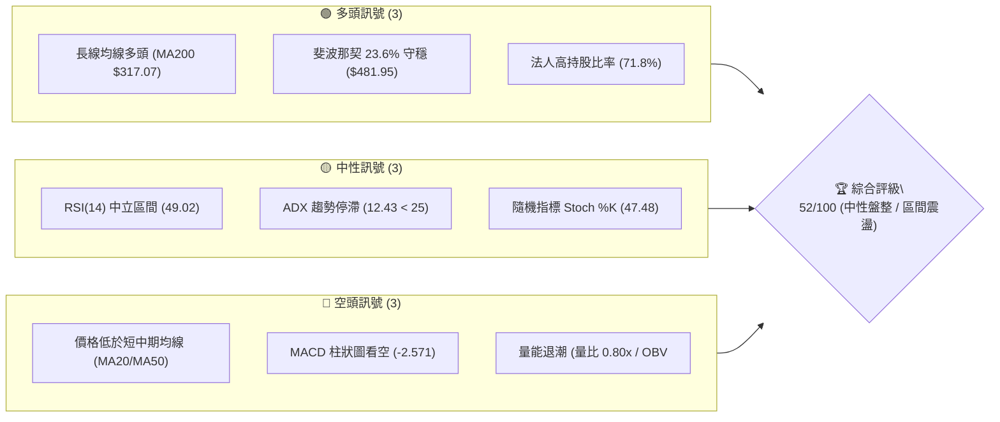
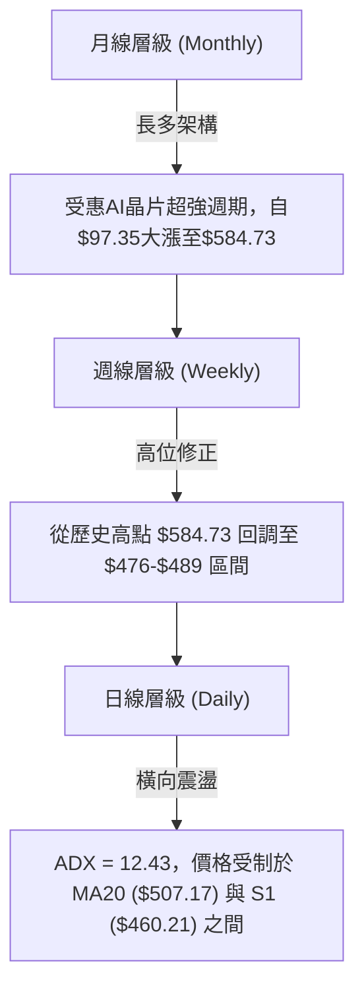
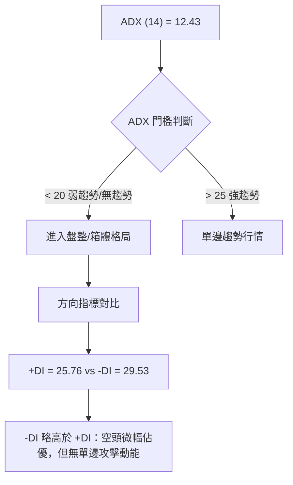
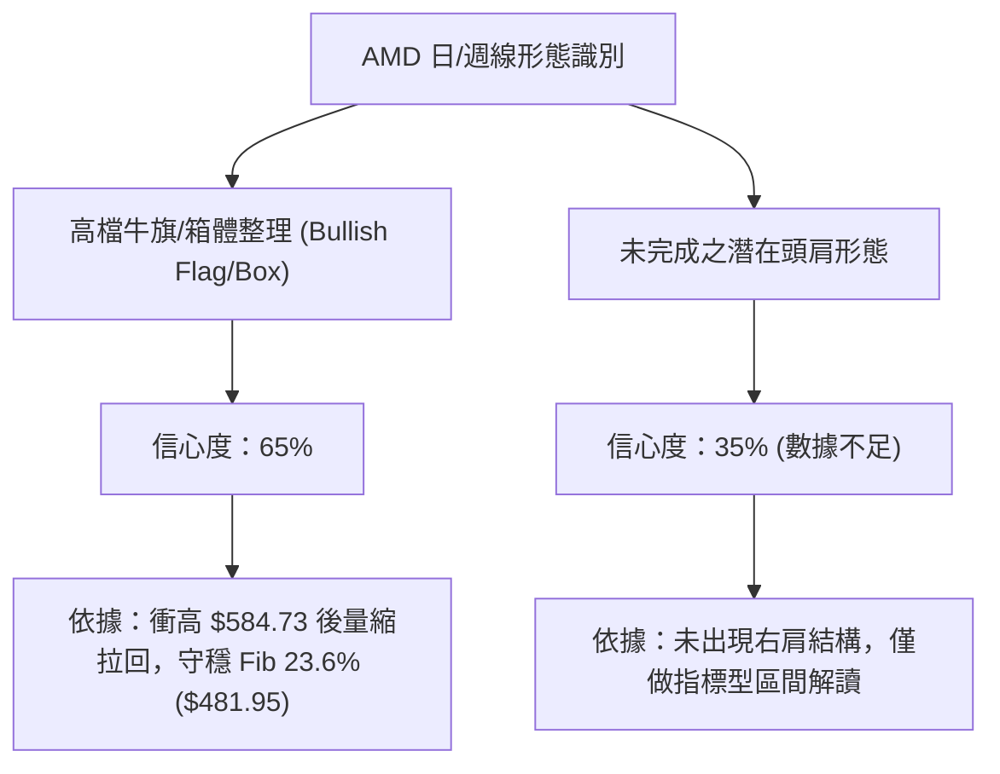
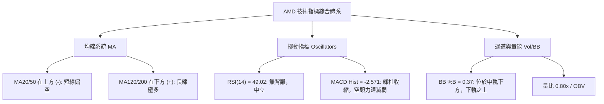
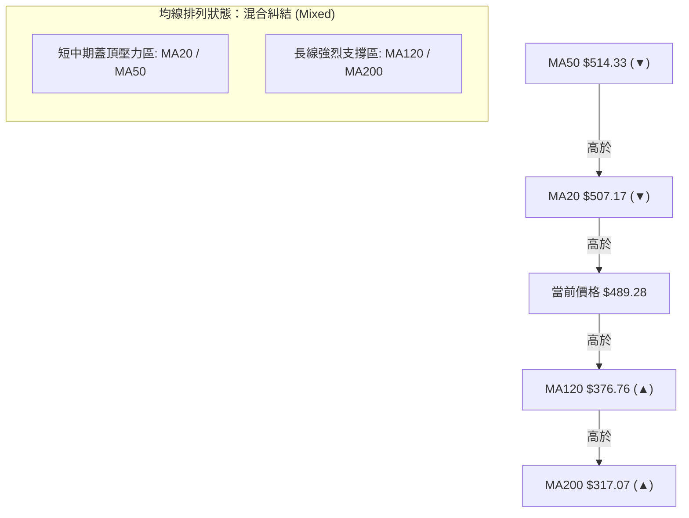
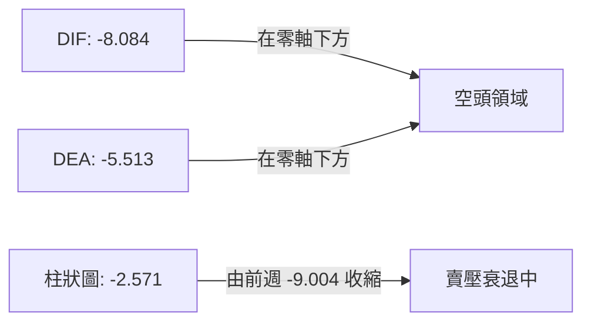
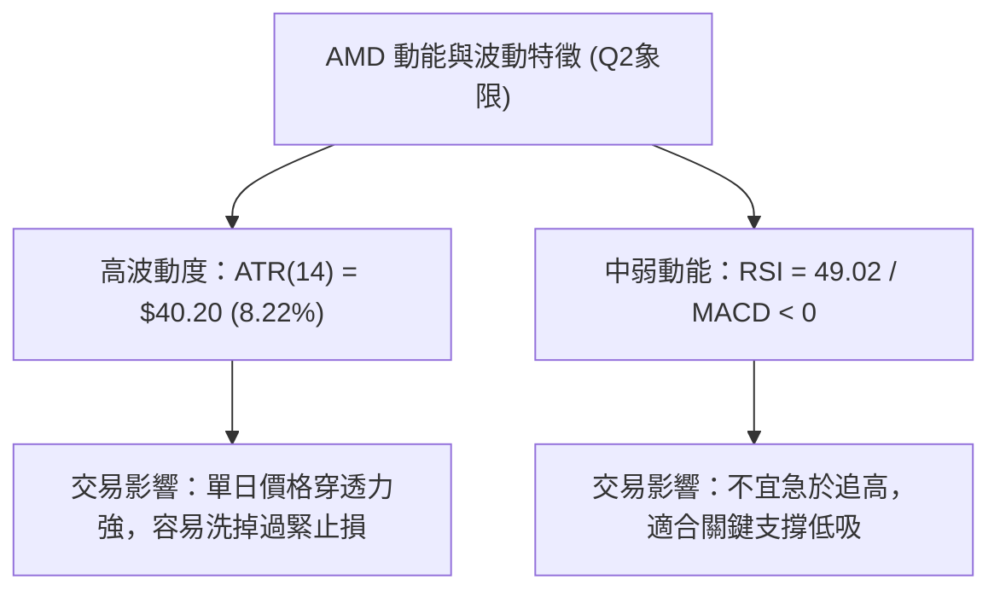
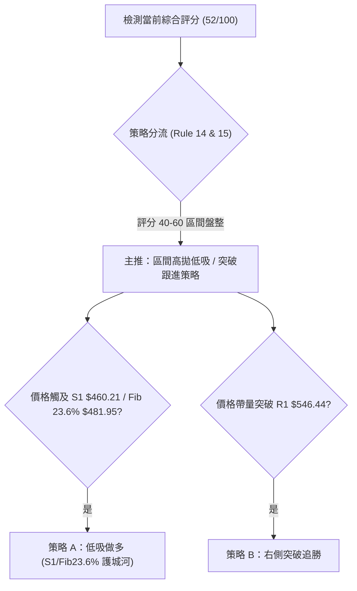
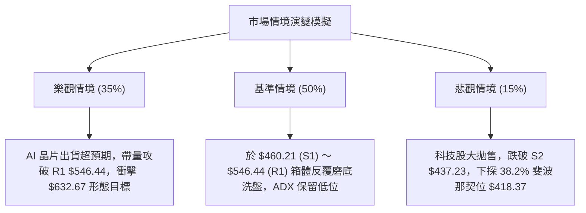

# AMD 技術分析報告

> **報告日期**：2026-08-07 ｜ **語言**：繁體中文 ｜ **數據來源**：Yahoo Finance ｜ **當前價格**：$489.28

---

## 目錄

| 章節 | 內容 |
|------|------|
| [1. 技術面概覽](#1-技術面概覽) | 訊號儀表板、核心指標、評分卡 |
| [2. 趨勢分析](#2-趨勢分析) | 多時框趨勢、長中短期走勢、12個月走勢圖 |
| [3. 圖表形態分析](#3-圖表形態分析) | 形態識別、信心度評估、K線組合、目標價推算 |
| [4. 支撐與阻力](#4-支撐與阻力) | 關鍵價位結構、斐波那契回調深度解析 |
| [5. 技術指標深度解讀](#5-技術指標深度解讀) | MA均線系統、RSI、MACD、布林通道與OBV量能 |
| [6. 動能與波動率](#6-動能與波動率) | 動能矩陣、ATR波動度、Beta與市場風險 |
| [7. 多時框架總結](#7-多時框架總結) | 時框架評分矩陣、多時框收斂最終結論 |
| [8. 交易策略建議](#8-交易策略建議) | 策略路由、情境階梯、進出場與風報比精算 |
| [9. 風險提示與監控](#9-風險提示與監控) | 關鍵監控清單、風險情境模擬、倉位管理 |

---

## 1. 技術面概覽

### 🎯 技術訊號儀表板



### 📊 核心指標速覽表

| 指標類別 | 指標名稱 | 當前數值 | 訊號 | 解讀 |
|----------|----------|----------|------|------|
| **價格** | 當前價格 | $489.28 | 🟡 | 位於52週高低點區間 78.1% 處，高檔整理 |
| **均線** | MA20 (月線) | $507.17 | 🔴 | 價格低於 MA20 (-3.53%)，短線承壓 |
| **均線** | MA50 (季線) | $514.33 | 🔴 | 價格低於 MA50，中軌上方存在上方蓋頂壓力 |
| **均線** | MA200 (年線)| $317.07 | 🟢 | 價格遠高於 MA200 (+54.31%)，長線牛市架構未破 |
| **動能** | RSI(14) | 49.02 | 🟡 | 位於 50 中軸附近，無超買或超賣，動能平衡 |
| **動能** | MACD (12,26,9)| -8.084 / -2.571 | 🔴 | MACD線位於零軸下方，柱狀圖持續呈空頭排佈 |
| **波動** | ATR(14) | $40.20 (8.22%) | 🔴 | 日均波動達 8.22%，屬於高波動半導體個股 |
| **趨勢** | ADX(14) | 12.43 | 🟡 | ADX < 25 指示極弱趨勢，當前屬於典型無趨勢盤整區間 |

### 🏆 技術評分卡

```
╔══════════════════════════════════════════════════════════════════╗
║                   AMD 技術評分卡 (2026-08-07)                   ║
╠══════════════════════════════════════════════════════════════════╣
║ 趨勢強度 (ADX)     ▓▓▓▓▓▓░░░░░░░░░░░░░░  30/100  🟡 盤整無趨勢    ║
║ 動能指標 (RSI/MACD)▓▓▓▓▓▓▓▓░░░░░░░░░░░░  40/100  🔴 短線動能偏弱  ║
║ 支撐穩定度 (Fib/S) ▓▓▓▓▓▓▓▓▓▓▓▓▓▓░░░░░░  70/100  🟢 23.6%支撐強勁 ║
║ 成交量配合度 (OBV) ▓▓▓▓▓▓▓▓░░░░░░░░░░░░  40/100  🔴 萎縮量能退潮  ║
║ 形態完整度 (結構)   ▓▓▓▓▓▓▓▓▓▓▓▓░░░░░░░░  60/100  🟡 旗形整理階段  ║
║ 均線排列 (多空序)   ▓▓▓▓▓▓▓▓▓▓░░░░░░░░░░  50/100  🟡 短空長多糾結  ║
╠══════════════════════════════════════════════════════════════════╣
║ 綜合技術評分       ▓▓▓▓▓▓▓▓▓▓▓░░░░░░░░░  52/100  ⚖️ 中性觀望/區間 ║
╚══════════════════════════════════════════════════════════════════╝
```

---

## 2. 趨勢分析

### 🌐 多時框趨勢分析



### 📈 長期趨勢 — 12個月走勢圖（Unicode）

```
AMD 月線歷史收盤走勢圖（2025-08 至 2026-08）
價位 ($)
$600 ┼                                      ● $580.91 (06/26)
$550 ┼                                    ／  \
$500 ┼                                  ／     ● $476.15 (07/26) ──● $489.28 (目前)
$450 ┼                                ／
$400 ┼                              ／
$350 ┼                    ● $354.49
$300 ┼                  ／
$250 ┼        ● $256.12
$200 ┼      ／  \     ／
$150 ┼  ●─／     ●───● $203.43 (03/26)
$100 ┼
     └─┬───┬───┬───┬───┬───┬───┬───┬───┬───┬───┬───┬───► 月份
      25/08 09  10  11  12 26/01 02  03  04  05  06  07  08
```

#### 24個月歷史價格脈絡分析

| 階段 | 時間區間 | 價格變動範圍 | 漲跌幅 | 走勢特徵與技術驅動因素 |
|------|----------|--------------|--------|------------------------|
| **底層打底** | 2024-08 ~ 2025-04 | $148.56 ➔ $97.35 | -34.47% | 產業庫存調整，探底落腳於 52W 低點 $149.22 附近。 |
| **第一波主升**| 2025-05 ~ 2025-10 | $110.73 ➔ $256.12 | +131.30% | Data Center 與 AI 數據中心需求爆發，突破 200 日線。 |
| **平台整理** | 2025-11 ~ 2026-03 | $217.53 ➔ $203.43 | -6.48% | 高檔箱體籌碼洗盤，MA200 扣抵低價持續向上上揚。 |
| **拋物線狂飆**| 2026-04 ~ 2026-06 | $354.49 ➔ $580.91 | +63.87% | AI 供應鏈出貨遞延效應解除，創下歷史新高 $584.73。 |
| **高檔回吐** | 2026-07 ~ 2026-08 | $580.91 ➔ $489.28 | -15.77% | 技術面嚴重超買修正，落腳於斐波那契 23.6% 回調位 ($481.95)。 |

### 📊 中期趨勢（週線分析）

近 20 週數據顯示，AMD 在 2026 年 4 月下旬（2026-04-26）RSI 曾飆升至 **97.4** 的極端超買區，隨後在 6 月初觸及 $584.73 歷史高點後展開中期的技術性修正。
當前週線 RSI 降至 **49.0**，MACD 柱狀圖雖為負值 (-2.571)，但負值已由前週的 -9.004 大幅收斂，顯示中期向下殺盤力道正逐漸枯竭，股價進入築底階段。

```
週線壓力與支撐區間結構
$584.73 ─────── 52週歷史最高點 (0.0% 斐波那契)
$546.44 ─────── 阻力位 R1 (最近波段反彈高點聚類)
$507.17 ─────── MA20 / 布林中軌 (短期多空分水嶺)
$489.28 ─────── 當前收盤價 (現價區間)
$481.95 ─────── 23.6% 斐波那契關鍵支撐 (黃金切割守備位)
$460.21 ─────── 支撐位 S1 (近一年波段低點聚類)
$437.23 ─────── 支撐位 S2 / 布林下軌 ($438.62)
```

### ⚡ 趨勢強度評估（ADX 解讀）



#### ADX 趨勢強度等級對照

| ADX 數值範圍 | 當前狀態 | 交易環境 | 最佳策略導向 |
|--------------|----------|----------|--------------|
| **0 - 20** | **12.43 (當前)** | **無趨勢 / 狹幅盤整** | **區間高拋低吸 / 布林通道策略** |
| 20 - 25 | - | 趨勢萌芽中 | 觀察突破方向 |
| 25 - 50 | - | 強勁趨勢行情 | 順勢突破跟進 / 均線持股 |
| 50 - 100 | - | 極端趨勢 / 超買超賣 | 緊扣移動止損 |

---

## 3. 圖表形態分析

### 🔍 形態識別系統



#### 圖表形態信心度與目標價精算表

| 形態名稱 | 信心度 | 判斷依據（引用精確數據） | 完成度 | 形態高度計算 | 目標價（精確推算） |
|----------|--------|--------------------------|--------|--------------|--------------------|
| **高檔高位旗形 (Bull Flag)** | **65%** | 旗桿高點 $584.73，旗面下緣落於 S1 $460.21 | 75% | $584.73 - $460.21 = **$124.52** | 突破 R1 $546.44 後目標：**$670.96** ($546.44 + $124.52) |
| **箱體震盪 (Rectangle)** | **80%** | 上軌 R1 $546.44，下軌 S1 $460.21 | 90% | $546.44 - $460.21 = **$86.23** | 上突破：**$632.67** / 下跌破：**$373.98** |
| **頭肩頂形態 (Head & Shoulders)**| **25%** | 僅有頭部 $584.73，缺乏明確左肩與頸線結構 | 20% | 數據不足以支撐 | **訊號不足，僅做指標型解讀** |

### 🕯️ 重要 K 線形態分析

| 月份/週期 | 收盤價 | K 線形態 | 技術解讀 | 訊號強度 |
|-----------|--------|----------|----------|----------|
| **2026-05** | $516.10 | 長紅突破實體 K 線 | 強勢突破 $350-$400 阻力，開啟歷史主升段 | 🟢 極強 |
| **2026-06** | $580.91 | 高檔長上影避雷針 (High Wave) | 觸及 52W 高點 $584.73 後獲利了結賣壓湧現 | 🔴 空頭預警 |
| **2026-07** | $476.15 | 大陰線向下修正 | 消化前期猛烈漲幅，收盤挫落至 23.6% 回調位 | 🔴 短期轉弱 |
| **2026-08** | $489.28 | 下影線錘子形態 (Hammer) | 在 23.6% 回調位 ($481.95) 獲買盤強勢支撐，出現止跌訊號 | 🟢 止跌復甦 |

### 📉 ASCII 走勢形態示意圖

```
AMD 高檔箱體整理 (Rectangle Box) 示意圖
$584.73 ─────────────── 52W 歷史天花板高點
         │    ▲
         │   / \
$546.44 ─┼──/───\────── 箱體上軌阻力 (R1) ───────────────────────
         │ /     \     / \
         │/       \   /   \   ● 現價 $489.28
$489.28 ─┼─────────\─/─────\─/─────────────────────────────────
         │          V       V
$460.21 ─┼───────────────────── 箱體下軌支撐 (S1) ───────────────────────
$438.62 ─────────────── 布林通道下軌護城河
```

---

## 4. 支撐與阻力

### 🗺️ 關鍵價位分布圖（Unicode）

```
AMD 價位結構分布圖 (2026-08-07)
════════════════════════════════════════════════════════════════════
$584.73 ║████████████████████████████████████████║ 52週歷史高點 (52W High)
$574.20 ║████████████████████████████████████    ║ 強阻力位 R3 (+17.36%)
$562.23 ║██████████████████████████████          ║ 阻力位 R2    (+14.91%)
$546.44 ║████████████████████████                ║ 關鍵阻力 R1  (+11.68%)
$514.33 ║▓▓▓▓▓▓▓▓▓▓▓▓▓▓▓▓▓▓▓▓                    ║ MA50 季線阻力 (+5.12%)
$507.17 ║▓▓▓▓▓▓▓▓▓▓▓▓▓▓▓                         ║ MA20 月線阻力 (+3.66%)
$489.28 ╠════════════════════════════════════════╣ ◄ 當前價格 $489.28
$481.95 ║░░░░░░░░░░░░░░░░░░░░░░░░░░░░░░░░        ║ 23.6% 斐波那契位 (-1.50%)
$460.21 ║████████████████                        ║ 關鍵支撐 S1  (-5.94%)
$437.23 ║████████████████████████                ║ 強支撐 S2    (-10.64%)
$424.03 ║██████████████████████████████          ║ 鐵板支撐 S3  (-13.34%)
$418.37 ║████████████████████████████████████    ║ 38.2% 斐波那契位 (-14.49%)
════════════════════════════════════════════════════════════════════
```

### 🚧 阻力位分析表

| 阻力級別 | 精確價位 | 形成原因與技術依據 | 突破難度 | 重要性評級 |
|----------|----------|--------------------|----------|------------|
| **阻力 R1** | **$546.44** | 近一年波段高點聚類，近幾週多次反彈受阻位置 | 🟡 中等 | 🟢🟢🟢 (短線解套賣壓區) |
| **阻力 R2** | **$562.23** | 波段高點次高聚類，接近布林通道上軌 ($575.72) | 🔴 較高 | 🟢🟢🟢🟢 (解套主賣壓區) |
| **阻力 R3** | **$574.20** | 近一年最高波段高點聚類，毗鄰歷史高點 $584.73 | 🔴 極高 | 🟢🟢🟢🟢🟢 (歷史天花板) |

### 🛡️ 支撐位分析表

| 支撐級別 | 精確價位 | 形成原因與技術依據 | 守住機率 | 重要性評級 |
|----------|----------|--------------------|----------|------------|
| **支撐 S1** | **$460.21** | 近一年波段低點聚類，箱體整理下緣 | 🟢 高 | 🟢🟢🟢🟢 (短線防守關鍵) |
| **支撐 S2** | **$437.23** | 波段低點聚類，與布林通道下軌 $438.62 重合 | 🟢 極高 | 🟢🟢🟢🟢 (中期多頭命脈) |
| **支撐 S3** | **$424.03** | 強低點聚類，靠近 38.2% 斐波那契回調位 $418.37 | 🟢 極高 | 🟢🟢🟢🟢🟢 (長線最後防線) |

### 📐 斐波那契回調位分析

本波段歷史基準取自 **52 週低點 $149.22 至 52 週高點 $584.73**，總波段漲幅達 $435.51。

```
斐波那契回調層級結構與價格落點
$584.73 ─── 0.0%  (52W High) ─────────────────────────────────
            │
            │  當前價格 $489.28 落於 0.0% 與 23.6% 之間
            ▼
$481.95 ─── 23.6% (黃金分割第一道防線，現價上方僅差距 +1.5%)
$418.37 ─── 38.2% (中期強烈回調防線)
$366.97 ─── 50.0% (多空強弱分界線)
$315.58 ─── 61.8% (黃金分割終極防線，毗鄰 MA200 $317.07)
$242.42 ─── 78.6% (深度回調位)
$149.22 ─── 100.0% (52W Low)
```

**解讀**：當前收盤價 $489.28 緊貼 **23.6% 回調位 ($481.95)** 之上。在強勁的主升段行情後，回調守住 23.6% 屬於**極度強勢的高位消化**。只要股價不收低於 $481.95 / S1 $460.21，長線多頭架構未受到絲毫破壞。

---

## 5. 技術指標深度解讀

### 🎛️ 指標訊號總覽



### 📈 移動平均線排列分析



均線離差率 (Bias)：
*   **MA20 偏離率**：($489.28 - $507.17) / $507.17 = **-3.53%** (短線負乖離)
*   **MA200 偏離率**：($489.28 - $317.07) / $317.07 = **+54.31%** (長線正乖離仍大)

### 📉 RSI(14) 分析

RSI 當前數值：**49.02**

```
RSI(14) 強度進度條
0  [超賣區 <30]          50 [中軸分界]          [超買區 >70] 100
├───┴───────────────┼───────────────────┴───┤
▓▓▓▓▓▓▓▓▓▓▓▓▓▓▓▓▓▓▓▓░░░░░░░░░░░░░░░░░░░░░░░░░░  49.02%
```

*   **超買/超賣判斷**：處於 30–70 的中性區間，無過熱或過冷現象。
*   **背離分析**：近 20 週數據顯示，RSI 由 2026 年 4 月的高點 97.4 回落至 49.02，與價格自 $584.73 修正至 $489.28 **走勢同步，無頂背離或底背離**現象。

### 📊 MACD(12/26/9) 訊號解讀

*   **DIF (MACD 線)**：-8.084
*   **DEA (Signal 線)**：-5.513
*   **MACD 柱狀圖 (Histogram)**：-2.571



**解讀**：DIF 於零軸下方運行，代表整體短線主導權仍屬空方；但柱狀圖負值大幅收縮（由 -9.004 收收至 -2.571），顯示向下拋售的空頭動能已顯著趨緩，隨時可能迎來黃金交叉。

### 📦 布林通道分析

*   **BB 上軌**：$575.72
*   **BB 中軌 (MA20)**：$507.17
*   **BB 下軌**：$438.62
*   **BB %B**：0.37

```
布林通道現價位置示意圖
$575.72 ┼──────────────────────────────── 上軌 (Upper Band)
        │
$507.17 ┼──────────────────────────────── 中軌 (Mid Band / MA20)
        │  ● $489.28 (%B = 0.37)
$438.62 ┼──────────────────────────────── 下軌 (Lower Band)
```

**解讀**：%B 為 0.37，顯示股價位於布林帶中軌與下軌之間的下半區，屬於**拉回震盪打底區間**。由於 ADX < 25，布林下軌 $438.62 與上軌 $575.72 構成了當前極具參考價值的震盪交易邊界。

### 💹 成交量分析（量價配合度）

*   **當前成交量**：23,887,374 股
*   **20 日均量**：29,693,974 股 (量比：0.80x)
*   **OBV 趨勢**：OBV < MA (能量潮低於其均線)

**量價解讀**：在股價回落過程中，成交量縮至 20 日均量的 80%，呈現標準的「**惜售量縮**」特徵。然而，OBV 處於均線下方，反映當前資金追高意願不足，缺乏發動大級別突破的攻擊性買盤。

---

## 6. 動能與波動率

### ⚡ 動能評估四象限

| 象限 | 動能強度 | 波動率 | 當前狀態區分 | 技術解讀 |
|------|----------|--------|--------------|----------|
| Q1 | 強動能 (RSI>60) | 低波動 (ATR<5%) | - | 最完美順勢飆股形態 |
| **Q2** | **弱動能 (RSI<50)** | **高波動 (ATR>8%)** | **✓ AMD 當前落點** | **高洗盤、震盪大，需擴大止損、控制倉位** |
| Q3 | 強動能 (RSI>60) | 高波動 (ATR>8%) | - | 高風險高收益突破段 |
| Q4 | 弱動能 (RSI<50) | 低波動 (ATR<5%) | - | 沉悶陰跌盤整段 |



### 📊 ATR 波動率分析

*   **ATR(14) 絕對值**：**$40.20**
*   **ATR 佔比**：**8.22%**

**風控應用算式**：
1. **短線動態止損距離 (1.5x ATR)**：$40.20 × 1.5 = **$60.30**
2. **波段防守止損距離 (2.0x ATR)**：$40.20 × 2.0 = **$80.40**
3. **單日預期波段範圍**：$489.28 ± $40.20 ➔ **[$449.08, $529.48]**

### 📐 Beta 與市場相關性

*   **Beta 係數**：**2.489** (屬於高 Beta 成長型科技股)
*   **市場含義**：當標普 500 指數波動 1% 時，AMD 平均產生 2.489% 的同向波動。在大盤回調期，AMD 承受槓桿效應賣壓；反之在大盤反彈期具備強大彈升爆發力。

---

## 7. 多時框架總結

### 📋 時框架評分表

| 時框架 | 趨勢方向 | 動能指標 | 均線排列 | 形態結構 | 綜合評分 | 操作建議 |
|--------|----------|----------|----------|----------|----------|----------|
| **月線 (Monthly)** | 🟢 多頭 | 🟢 極強 | 🟢 多頭排列 | 巨型牛市旗形 | **85/100** | 長線堅定持股/逢低加碼 |
| **週線 (Weekly)**  | 🟡 中性 | 🟡 修正完畢 | 🟡 糾結整理 | 箱體高位洗盤 | **58/100** | 中線區間分批佈局 |
| **日線 (Daily)**   | 🔴 短空 | 🔴 弱勢 | 🔴 短期空頭 | 下降通道築底 | **45/100** | 短線等待止跌確認 |

### 🔲 綜合訊號矩陣

```
╔══════════════════════════════════════════════════════════════════╗
║                   多時框架訊號矩陣 (Multi-Timeframe)             ║
╠═══════════════════╦══════════════╦══════════════╦════════════════╣
║ 維度 \ 時框架     ║  月線 (Long) ║  週線 (Mid)  ║  日線 (Short)  ║
╠═══════════════════╬══════════════╬══════════════╬════════════════╣
║ 趨勢方向 (Trend)  ║   🟢 看多    ║   🟡 盤整    ║   🔴 偏空      ║
║ 動能狀態 (Moment) ║   🟢 強勁    ║   🟡 中性    ║   🔴 弱勢      ║
║ 支撐有效 (Support)║   🟢 堅固    ║   🟢 堅固    ║   🟡 考驗中    ║
║ 成交量能 (Volume) ║   🟢 溫和    ║   🔴 量縮    ║   🔴 萎縮      ║
╚═══════════════════╩══════════════╩══════════════╩════════════════╝
```

### ⚖️ 多時框收斂結論

依據 **多時框收斂規則 (Rule 14)**：
1. **當前趨勢狀態**：ADX(14) 為 **12.43 (<25)**，明確定義為**非單邊趨勢行情（無趨勢 / 箱體盤整行情）**。
2. **主導規則應用**：在 ADX < 25 的盤整格局下，不宜使用單邊突破追價策略，應**以日/週線布林通道上下軌與關鍵支撐阻力（S1 $460.21 ～ R1 $546.44）為主要區間操作依據**。
3. **最終收斂方向**：長線（月線）極多，日線為高位回調末端，**整體收斂結論為：⚖️ 中性偏多區間築底**。

---

## 8. 交易策略建議

### 🗺️ 策略決策流程圖



### 🧭 策略路由

> **當前主策略方向 = ⚖️ 區間高拋低吸與突破佈局（依技術評分 52/100）**

### 🎯 價格情境階梯 (Price Scenarios)

| 觸發條件 | 第一目標 | 第二目標 | 後續延伸目標 | 情境技術含義 |
|----------|----------|----------|--------------|--------------|
| **強勢突破 R1 $546.44** | R2 $562.23 | R3 $574.20 | 52W High $584.73 | 結束箱體整理，啟動新一輪主升段 |
| **站穩現價區間 $489.28** | MA20 $507.17 | MA50 $514.33 | R1 $546.44 | 築底完成，向箱體上軌靠攏 |
| **跌破 S1 $460.21** | S2 $437.23 | Fib 38.2% $418.37 | S3 $424.03 | 回調加深，考驗布林下軌護城河 |

### 📊 情境機率分佈

```
情境機率分佈圓餅圖 (估計)
┌──────────────────────────────────────────────────────────┐
│ █ 區間震盪築底 ($460 - $546): 50%                        │
│ █ 向上反彈突破 (挑戰 R1/R2):  35%                        │
│ █ 向下破位尋撐 (回測試 S2/S3): 15%                        │
└──────────────────────────────────────────────────────────┘
```

| 情境 | 機率 | 主要技術依據（引用指標數據） |
|------|------|------------------------------|
| **箱體區間震盪** | **50%** | ADX = 12.43 (<25) 顯示缺乏單邊動能，BB %B (0.37) 支援區間游走。 |
| **向上反彈突破** | **35%** | 股價守穩 23.6% 斐波那契位 ($481.95)，MACD 綠柱收縮，法人持股 71.8%。 |
| **向下破位尋撐** | **15%** | 價格受制於 MA20/MA50 之下，且 OBV 量能未現明顯放大。 |

### 🟢 主策略詳情

#### 策略 A：左側低吸做多（黃金分割防守）

*   **適用情境**：股價在 $460.21 (S1) ～ $481.95 (Fib 23.6%) 區間獲支撐打底時。
*   **具體執行參數**：

| 策略要素 | 策略 A 數值 / 設定 | 技術算式與邏輯依據 |
|----------|--------------------|--------------------|
| **進場條件** | 觸及 Fib 23.6% 附近出現止跌 K 線 | 價格於 $481.95 站穩，量縮止跌 |
| **進場價格** | **$481.95** | 23.6% 斐波那契關鍵支撐位 |
| **目標價 T1**| **$507.17** | MA20 / 布林中軌 (獲利 +5.23%) |
| **目標價 T2**| **$546.44** | 阻力位 R1 (獲利 +13.38%) |
| **止損價格** | **$436.00** | 跌破 S2 ($437.23) 下方 1x ATR 安全區 (虧損 -9.53%) |
| **風險報酬比** | **1.40 : 1** (至T2) | (546.44 - 481.95) / (481.95 - 436.00) = 64.49 / 45.95 |
| **預估勝率** | **60%** | 基於長線牛市架構與 Fib 強支撐 |
| **建議倉位** | **8% - 10%** | 高 Beta (2.489) 風險控管 |

#### 策略 B：右側突破跟進做多（箱體突破）

*   **適用情境**：日線收盤價強勢突破阻力 R1 $546.44，且單日成交量 > 3,000萬股（超過20日均量）。
*   **具體執行參數**：

| 策略要素 | 策略 B 數值 / 設定 | 技術算式與邏輯依據 |
|----------|--------------------|--------------------|
| **進場條件** | 日線帶量收高於 R1 $546.44 之上 | 確認箱體突破，動能回歸 |
| **進場價格** | **$548.00** | 突破 R1 $546.44 後買進 |
| **目標價 T1**| **$574.20** | 阻力位 R3 (獲利 +4.78%) |
| **目標價 T2**| **$632.67** | 由箱體高度推算 ($546.44 + $86.23) (獲利 +15.45%) |
| **止損價格** | **$507.00** | 跌破 MA20 月線支撐區 (虧損 -7.48%) |
| **風險報酬比** | **2.06 : 1** (至T2) | (632.67 - 548.00) / (548.00 - 507.00) = 84.67 / 41.00 |
| **預估勝率** | **55%** | 順勢突破策略勝率 |
| **建議倉位** | **12% - 15%** | 突破確立後可加碼 |

### 🔴 反向風險觸發點（對沖提示）

若日線收盤價跌破 **S2 $437.23** 且 MACD 柱狀圖二次向下發散，宣告高檔箱體下破，多頭策略全面失效，投資人應即刻執行嚴格止損或進行對沖。

### ⭐ 整體訊號強度評星

```
做多訊號強度：★★★☆☆  (3/5 星) — 長線看好，短線尚待止跌訊號確認
做空訊號強度：★★☆☆☆  (2/5 星) — 受限於 MA200 與 Fib 堅固支撐，做空空間有限
整體可信度：  ★★★★☆  (4/5 星) — 數據完整，價位結構極度清晰
```

---

## 9. 風險提示與監控

### ✅ 關鍵監控指標 Checklist

```
╔══════════════════════════════════════════════════════════════════╗
║                    每日技術面監控清單 Checklist                  ║
╠══════════════════════════════════════════════════════════════════╣
║ [ ] 1. 收盤價是否守穩 23.6% 斐波那契位 $481.95                   ║
║ [ ] 2. 股價能否重新站上 MA20 ($507.17) 與 MA50 ($514.33)        ║
║ [ ] 3. MACD 柱狀圖是否完成零軸下方的黃金交叉                      ║
║ [ ] 4. 日成交量是否回升至 20 日均量 (2,969萬股) 之上            ║
║ [ ] 5. ADX 指標是否突破 25，開啟單邊趨勢行情                    ║
║ [ ] 6. 大盤指數 (SOX / QQQ) 是否出現系統性拉回                  ║
╚══════════════════════════════════════════════════════════════════╝
```

### ⚠️ 風險場景分析



### 🛡️ 風險管理重要提醒

1. **波動度適應**：AMD 當前 **ATR 高達 $40.20 (8.22%)**，意味著單日走勢波動 $30-$40 屬於正常技術性噪訊，**切忌將止損設定過緊**（建議至少留出 1.5x ATR 即 $60 以上的緩衝空間）。
2. **高 Beta 控倉**：AMD Beta 為 **2.489**，大盤若出現 3% 的技術性修正，AMD 可能出現 7%-8% 的劇烈回調。單一股票持倉建議控制在總投資組合的 **10%-15% 以內**。

---

## 📋 報告總結

```
╔══════════════════════════════════════════════════════════════════╗
║                   AMD 技術分析綜合報告總結                       ║
╠══════════════════════════════════════════════════════════════════╣
║ 報告日期：2026-08-07                                             ║
║ 當前價格：$489.28                                                ║
║ 綜合評級：⚖️ 52/100 (中性觀望 / 箱體築底)                        ║
╠══════════════════════════════════════════════════════════════════╣
║ 關鍵結論：                                                       ║
║ ├─ 長期趨勢：🟢 極強 (遠高於 MA200 $317.07，牛市無虞)            ║
║ ├─ 中期趨勢：🟡 箱體震盪 (52W高點 $584.73 修正後的籌碼消化)      ║
║ ├─ 短期趨勢：🔴 偏弱盤整 (受制於 MA20 $507.17，但在 Fib23.6% 止跌)║
║ ├─ 關鍵支撐：S1 $460.21 / Fib 23.6% $481.95 / S2 $437.23         ║
║ ├─ 關鍵阻力：R1 $546.44 / R2 $562.23 / R3 $574.20                ║
║ └─ 法人目標：$579.11 (共識 Buy 評級，47 位分析師)                 ║
╠══════════════════════════════════════════════════════════════════╣
║ 最優策略組合：                                                   ║
║ 1. 🥇 最佳機會：策略 A — 在 $481.95 附近低吸做多，防守 $436.00   ║
║ 2. 🥈 次選機會：策略 B — 等待帶量突破 R1 $546.44 後追勝，上看 $632 ║
║ 3. 🥉 保守選擇：等待 ADX > 25 或 MACD 出現黃金交叉後再行進場     ║
╚══════════════════════════════════════════════════════════════════╝
```

---

> ⚠️ **免責聲明**：本報告為 AI 自動生成之專業技術分析，報告中引用的所有數據均來自提供之市場歷史資訊。本報告**僅供研究與學術參考**，**不構成任何形式的投資建議或買賣邀約**。投資涉及高風險，股票價格可升可跌，投資人應自行評估風險並諮詢專業合格之財務顧問。

---

*報告生成時間：2026-08-07 ｜ 數據來源：Yahoo Finance ｜ 分析框架：多時框整合技術分析 (MTA/CFA)*