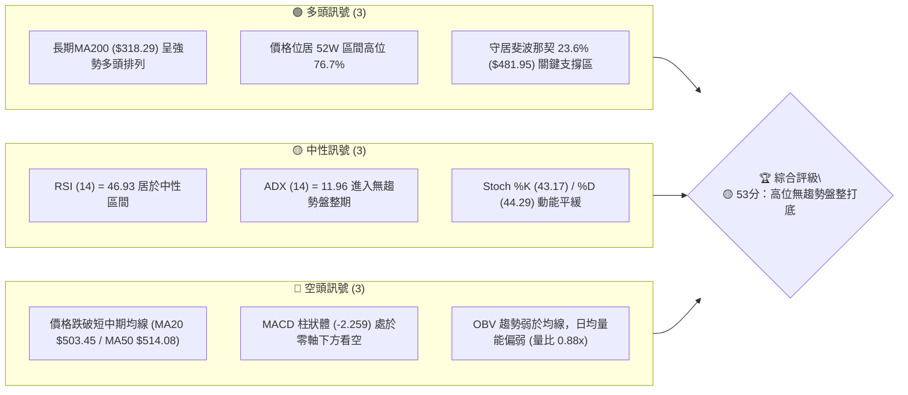
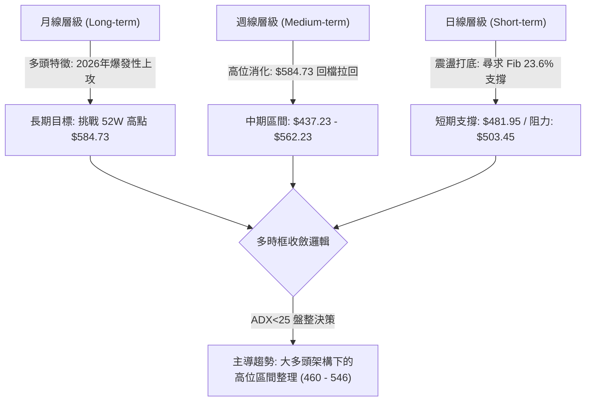
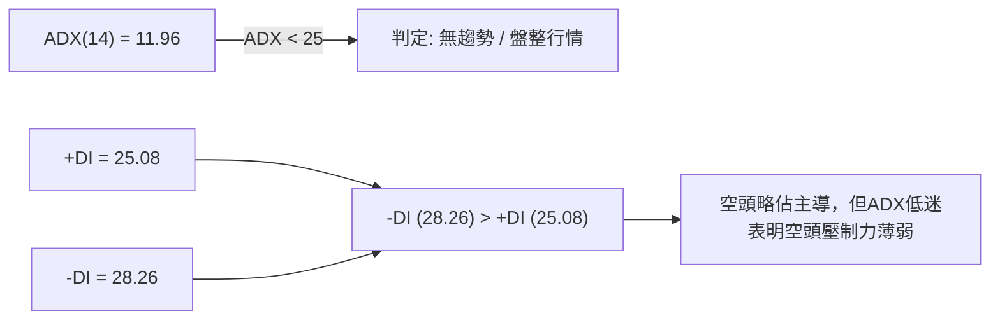
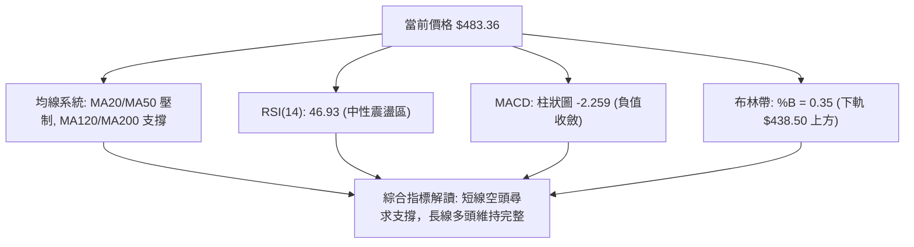
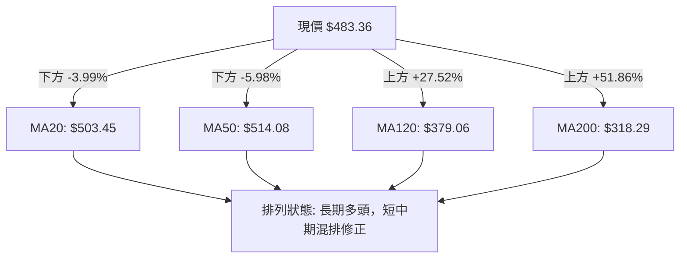
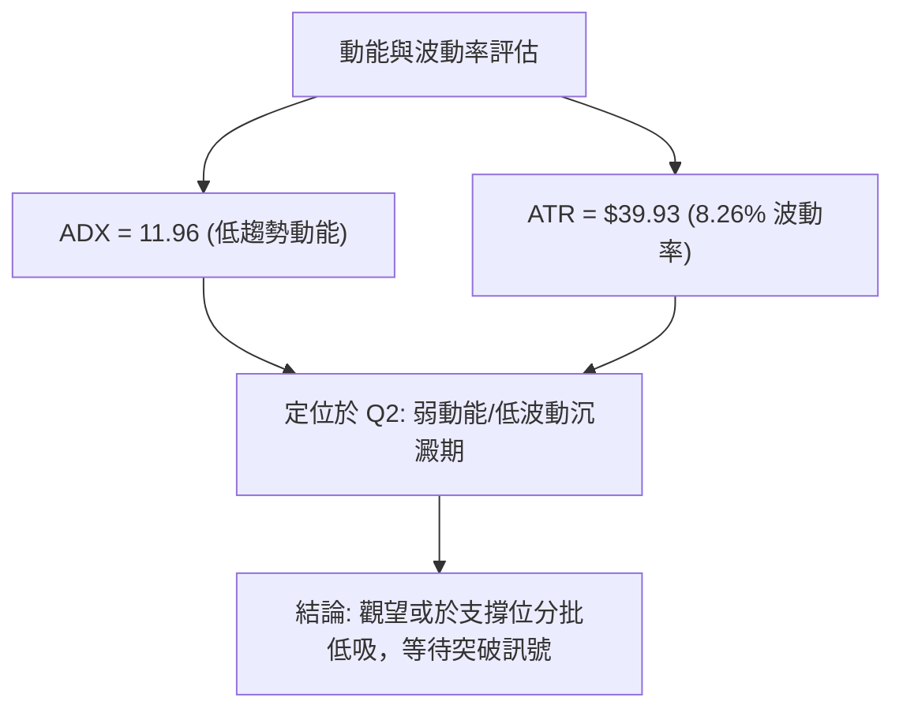
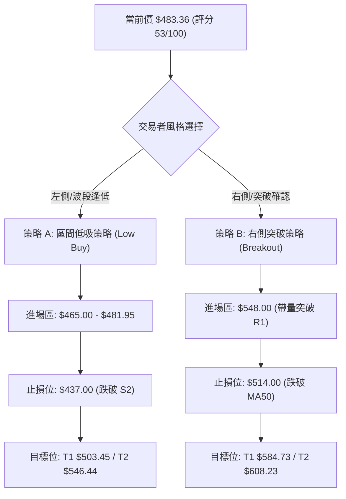
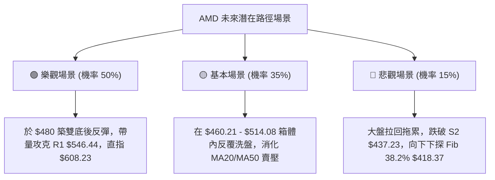

# AMD 技術分析報告

> **報告日期**：2026-08-09 ｜ **語言**：繁體中文 ｜ **數據來源**：Yahoo Finance ｜ **當前價格**：$483.36

---

## 目錄

| 章節 | 內容 |
|------|------|
| [1. 技術面概覽](#1-技術面概覽) | 訊號儀表板、核心指標、評分卡 |
| [2. 趨勢分析](#2-趨勢分析) | 多時框趨勢、長中短期走勢、ADX強弱 |
| [3. 圖表形態分析](#3-圖表形態分析) | 形態識別、K線組合、形態目標價 |
| [4. 支撐與阻力](#4-支撐與阻力) | 關鍵價位、斐波那契回調 |
| [5. 技術指標深度解讀](#5-技術指標深度解讀) | MA/RSI/MACD/布林通道/成交量 |
| [6. 動能與波動率](#6-動能與波動率) | 動能評估四象限、ATR、Beta |
| [7. 多時框架總結](#7-多時框架總結) | 時框架評分矩陣、多時框收斂 |
| [8. 交易策略建議](#8-交易策略建議) | 策略路由、價格情境、多空交易計劃 |
| [9. 風險提示與監控](#9-風險提示與監控) | 關鍵清單、風險場景、位管理 |

---

## 1. 技術面概覽

### 🎯 技術訊號儀表板



### 📊 核心指標速覽表

| 指標類別 | 指標名稱 | 當前數值 | 訊號 | 解讀 |
|----------|----------|----------|------|------|
| **價格** | 當前收盤價 | $483.36 | 🟡 中性 | 位於 52 週區間高位 76.7% 處，處於高位回檔整理 |
| **均線** | MA20 | $503.45 | 🔴 空頭 | 價格位於 MA20 下方 (-3.99%)，短線承壓 |
| **均線** | MA50 | $514.08 | 🔴 空頭 | 價格位於 MA50 下方 (-5.98%)，中期波段回檔 |
| **均線** | MA200 | $318.29 | 🟢 多頭 | 價格遠高於 MA200 (+51.86%)，超長期多頭結構極強 |
| **動能** | RSI(14) | 46.93 | 🟡 中性 | 無超買或超賣，處於多空平衡震盪帶 |
| **動能** | MACD(12,26,9) | -8.336 | 🔴 空頭 | MACD 柱狀體 -2.259，短線動能處於空頭控盤 |
| **波動** | ATR(14) | $39.93 | 🟡 中性 | 日波幅達 8.26%，屬於半導體族群偏高波動率 |

### 🏆 技術評分卡

```
╔══════════════════════════════════════════════════════════════╗
║                AMD 技術指標綜合評分卡 (2026-08-09)            ║
╠══════════════════════════════════════════════════════════════╣
║ 趨勢強度 (ADX)   ▓▓▓▓░░░░░░░░░░░░░░░░  20/100  🔴 無趨勢(ADX=11.96)║
║ 動能指標 (RSI/MACD)▓▓▓▓▓▓▓▓█░░░░░░░░░░░  45/100  🟡 中性偏空         ║
║ 支撐穩定度 (Fib)  ▓▓▓▓▓▓▓▓▓▓▓▓▓▓▓░░░░░  75/100  🟢 23.6%守穩        ║
║ 成交量配合 (OBV)  ▓▓▓▓▓▓▓▓█░░░░░░░░░░░  45/100  🟡 量縮整理         ║
║ 形態完整度 (Triangle)▓▓▓▓▓▓▓▓▓▓▓▓░░░░░░░  60/100  🟡 高位震盪形態     ║
║ 均線排列 (MA)    ▓▓▓▓▓▓▓▓▓▓█░░░░░░░░░  55/100  🟡 長多短空混合排列 ║
╠══════════════════════════════════════════════════════════════╣
║ 綜合技術評分      ▓▓▓▓▓▓▓▓▓▓█░░░░░░░░░  53/100  🟡 53分 中性盤整   ║
╚══════════════════════════════════════════════════════════════╝
```

---

## 2. 趨勢分析

### 🌐 多時框趨勢分析



### 📈 長期趨勢 — 24 個月歷史走勢圖

```
AMD 24 個月收盤價格歷史走勢示意圖 ($)
$600 ┼                                                ● $580.91 (2026-06)
$520 ┤                                           ● $516.10  ● $483.36 (現價)
$440 ┤                                    ● $455.19
$360 ┤                              ● $354.49
$280 ┤                ● $256.12
$200 ┤ ● $164.08            ● $236.73
$120 ┤       ● $120.79 ● $110.73
 $40 ┴─┬───┬───┬───┬───┬───┬───┬───┬───┬───┬───┬───┬───┬───┬───
     24/09 24/12 25/03 25/06 25/09 25/12 26/03 26/06 26/08
```

#### 近 12 個月走勢特徵分析

| 月份 | 收盤價 ($) | MoM 漲跌 (%) | 走勢階段特徵 | 關鍵技術里程碑 |
|------|------------|--------------|--------------|----------------|
| 2025-09 | 161.79 | -0.52% | 低位盤整打底 | 守穩 $150 關卡 |
| 2025-10 | 256.12 | +58.30% | 爆發性突破 | 帶量攻克 $200 心理關卡 |
| 2025-11 | 217.53 | -15.07% | 突破後回檔 | 回測 $210 區域確認支撐 |
| 2025-12 | 214.16 | -1.55% | 沉澱打底 | MA200 轉為強勢向上 |
| 2026-01 | 236.73 | +10.54% | 再度發動 | 上攻打破前高阻力 |
| 2026-02 | 200.21 | -15.43% | 洗盤回測 | 尋求 MA120 強支撐 |
| 2026-03 | 203.43 | +1.61% | 築底完畢 | 週線 MACD 重新金叉 |
| 2026-04 | 354.49 | +74.26% | 主升段發動 | 突破 $300 歷史區間 |
| 2026-05 | 516.10 | +45.59% | 主升段加速 | 站上 $500 大關 |
| 2026-06 | 580.91 | +12.56% | 創 52 週新高 | 創下歷史天價 $584.73 |
| 2026-07 | 476.15 | -18.03% | 獲利賣壓湧現 | 修正至 Fib 23.6% ($481.95) |
| 2026-08 | 483.36 | +1.51% | 高位止跌築底 | 於 S1 ($460.21) ~ R1 ($546.44) 震盪 |

### 📊 中期趨勢（週線分析）

近 20 週數據顯示，AMD 在 2026 年 5-6 月經歷了劇烈的飆漲，週收盤最高達 $580.91（52 週高點為 $584.73）。隨後在 7 月遭遇高位獲利回吐，週收盤回落至 $476.15。近兩週（2026-08-02 至 2026-08-09）價格在 $476.15 - $483.36 之間呈現縮量止跌跡象。
週線 MACD 柱狀體由負轉平（近週 -2.259），RSI 穩定在 46.9 附近，顯示中期劇烈修正期已過，進入時間換取空間的箱體整理期。

### ⚡ 趨勢強度評估（ADX 解讀）



* **ADX 強度對照**：當前 ADX 為 **11.96**，遠高於無趨勢閾值（<20），屬於典型的**弱趨勢／無趨勢盤整行情**。
* **策略指引**：在 ADX < 25 的環境下，追漲殺跌策略極易被雙向洗盤。交易應轉向**區間高拋低吸**，以布林通道與既定支撐阻力位為核心依據。

---

## 3. 圖表形態分析

### 🔍 形態識別系統與信心度

根據近 6 個月的日線與週線價格結構，識別出以下圖表形態：

| 形態名稱 | 信心度 (%) | 判斷依據（引用數據） | 完成度 (%) | 形態目標價 (附計算式) |
|----------|------------|----------------------|------------|----------------------|
| **高位對稱三角形整理** | **65%** | 上軌由 52W 高點 $584.73 與 7月中高點 $557.89 連接；下軌由 7月低點 $476.15 與 S1 $460.21 支撐連接。 | 70% | 向上突破 R1 ($546.44)：目標 $546.44 + ($584.73 - $460.21) = **$670.96**；向下跌破 S1 ($460.21)：目標 $460.21 - 124.52 = **$335.69** |
| **Fib 23.6% 築底平台** | **75%** | 價格連 2 週支撐於 52W 區間回調 23.6% 位 ($481.95) 附近（現價 $483.36）。 | 85% | 反彈目標為布林中軌 MA20 (**$503.45**) 與 R1 (**$546.44**) |

### 🕯️ 重要 K 線形態分析

| 月/週時間 | 收盤價 ($) | K線形態 | 解讀 | 訊號 |
|-----------|------------|---------|------|------|
| 2026-06-07 | 466.38 | 高位長陰吞噬 | 衝高 $584.73 後大幅拉回，短線頂部確立 | 🔴 看空 |
| 2026-07-12 | 557.89 | 弱勢反彈流星線 | 上攻無量，觸及 $557.89 後受阻 | 🔴 看空 |
| 2026-08-02 | 476.15 | 探底長下影十字星 | 探低至 $476.15 獲得支撐，空頭動能衰竭 | 🟢 看多 |
| 2026-08-09 | 483.36 | 縮量小陽線 | 價格重回 Fib 23.6% ($481.95) 之上，呈現打底跡象 | 🟡 中性偏多 |

### 📉 ASCII 走勢形態示意圖

```
AMD 高位三角整理與 Fib 23.6% 築底示意圖
$584.73 ┼───────● (52W High)
        │        \
$546.44 ┼─────────\─────● Resistance R1
        │          \   / \
$503.45 ┼───────────\-/-───● MA20 / BB Middle
        │            /     \
$483.36 ┼───────────●───────● Current Price ($483.36) / Fib 23.6% ($481.95)
        │          /
$460.21 ┼─────────● Support S1
        └────────────────────────────────────────
```

---

## 4. 支撐與阻力

### 🗺️ 關鍵價位分布圖

```
AMD 價位結構分布圖
═══════════════════════════════════════════════════════════════
$608.23 ║██████████████████████████████  分析師平均目標價 (Consensus Target)
$584.73 ║██████████████████████████████  52 週歷史高點 (52W High)
$574.20 ║████████████████████████        強阻力 R3 (+18.79%)
$568.39 ║██████████████████████          布林通道上軌 (BB Upper)
$562.23 ║██████████████████              阻力 R2 (+16.32%)
$546.44 ║██████████████                  關鍵阻力 R1 (+13.05%)
$514.08 ║██████████                      MA50 壓力
$503.45 ║██████                          MA20 / 布林中軌
$483.36 ╠════════════════════════════════◄ 現價 ($483.36)
$481.95 ║▓▓▓▓▓▓▓▓▓▓▓▓▓▓▓▓▓▓▓▓▓▓▓▓▓▓▓▓▓▓  斐波那契 23.6% 關鍵支撐
$460.21 ║▓▓▓▓▓▓▓▓▓▓▓▓▓▓▓▓▓▓▓▓            波段支撐 S1 (-4.79%)
$438.50 ║▓▓▓▓▓▓▓▓▓▓▓▓                    布林通道下軌 (BB Lower)
$437.23 ║▓▓▓▓▓▓▓▓                        強支撐 S2 (-9.54%)
$424.03 ║▓▓▓▓                            強支撐 S3 (-12.27%)
$418.37 ║▓▓▓▓▓▓▓▓▓▓▓▓▓▓▓▓▓▓▓▓▓▓▓▓▓▓▓▓▓▓  斐波那契 38.2% 回調位
═══════════════════════════════════════════════════════════════
```

### 🚧 阻力位分析表

| 阻力級別 | 精確價位 | 形成原因（依據數據） | 突破難度 | 重要性 |
|----------|----------|----------------------|----------|--------|
| **R1** | **$546.44** | 近一年波段高點聚類與矩形上軌 | 🟡 中等 | 🔴 高（突破則打開上行空間） |
| **R2** | **$562.23** | 7 月份次高點密集交投區 | 🔴 較難 | 🟡 中等 |
| **R3** | **$574.20** | 歷史高點前最後多頭阻力位 | 🔴 極難 | 🔴 高（接近 52W 高點 $584.73） |

### 🛡️ 支撐位分析表

| 支撐級別 | 精確價位 | 形成原因（依據數據） | 守住機率 | 重要性 |
|----------|----------|----------------------|----------|--------|
| **S1** | **$460.21** | 近一年波段低點聚類，接近 Fib 23.6% | 🟢 極高 | 🔴 極高（短線多頭防線） |
| **S2** | **$437.23** | 近一年強波段低點與布林下軌 ($438.50) 重合 | 🟢 高 | 🔴 高（中期多空分水嶺） |
| **S3** | **$424.03** | 深勢回調低點聚類 | 🟢 中等 | 🟡 中等 |

### 📐 斐波那契回調位分析

依據 52 週區間（最低 **$149.22** 至 最高 **$584.73**），計算精確回調層級如下：

* **0.0% (52W High)**: **$584.73**
* **23.6% 回調位**: **$481.95** ◄ **現價 $483.36 剛好落在此處（高低差僅 +0.29%）**
* **38.2% 回調位**: **$418.37**
* **50.0% 回調位**: **$366.97**
* **61.8% 回調位**: **$315.58**（與 MA200 **$318.29** 形成強烈交會）
* **78.6% 回調位**: **$242.42**
* **100.0% (52W Low)**: **$149.22**

**解讀**：現價 $483.36 精確壓在 23.6% 回調位 ($481.95) 之上。只要該位置有效守住，本次拉回均屬於強勢多頭格局下的正常回調（Super Bullish Retrenchment）；若跌破，下一個強支撐層級將下移至 S2 ($437.23) 及 38.2% 回調位 ($418.37)。

---

## 5. 技術指標深度解讀

### 🎛️ 指標訊號總覽



### 📈 移動平均線排列分析



* **均線狀態**：MA5 ($491.58) > 現價 ($483.36)，MA10 ($479.86) < 現價。價格被壓制於 MA20 ($503.45) 與 MA50 ($514.08) 下方，反映短中期處於向下修正格局；但 MA120 ($379.06) 與 MA200 ($318.29) 呈現完美多頭陡峭向上，長期牛市架構絲毫未變。

### 📉 RSI(14) 分析

* **當前數值**：**46.93**
* **進度條**：`█████████░░░░░░░░░░░ 46.93%` （中性 30-70）
* **背離判斷**：日線與週線 RSI 均未出現頂背離或底背離。RSI 自 5 月的高位 >90 的嚴重超買區順利回落至 46.93，完成了指標鈍化的修復，具備重新發動上攻的技術空間。

### 📊 MACD(12,26,9) 訊號解讀

* **DIF (MACD 線)**: -8.336
* **DEA (Signal 線)**: -6.078
* **MACD Hist (柱狀圖)**: **-2.259** 🔴 空頭控盤
* **解讀**：MACD 處於零軸下方，顯示賣方仍掌握短期主導權。然而，週線與日線柱狀圖負值已由前期的 -9.004 大幅收斂至 -2.259，反映賣壓正快速衰竭，綠柱（空頭）縮短為柱狀圖轉正（金叉）提供了醞釀期。

### 📦 布林通道分析

```
AMD 布林通道（Bollinger Bands）現價位置示意圖
╔══════════════════════════════════════════════════════════════╗
║ $568.39  Upper Band (上軌)                                   ║
║    │                                                         ║
║ $503.45  Middle Band (MA20 / 中軌)                            ║
║    │                                                         ║
║ $483.36  ◄ Current Price (現價, %B = 0.35)                     ║
║    │                                                         ║
║ $438.50  Lower Band (下軌)                                   ║
╚══════════════════════════════════════════════════════════════╝
```

* **%B 指標**：**0.35**（位居下軌 0.0 與中軌 0.5 之間的下半區間）。
* **解讀**：價格正自布林通道下軌 ($438.50) 進行技術性反彈，目前向中軌 ($503.45) 尋求測試。由於通道口未顯著張開，屬於典型的通道內箱體震盪。

### 💹 成交量分析（量價配合度）

* **最新成交量**：26,560,000 股
* **20 日均量**：30,026,145 股（量比 **0.88x**）
* **OBV 趨勢**：OBV < MA，量能指標呈現疲弱。
* **解讀**：在近期價格回調至 $476 - $483 區域時，成交量顯著萎縮（量比 0.88x），符合「價跌量縮」的健康整理特徵，顯示市場並未出現恐慌性拋盤，多頭主力惜售明顯。

---

## 6. 動能與波動率

### ⚡ 動能評估四象限

| 象限分類 | 動能強度 | 波動率 | 當前狀態 | 評估與策略 |
|----------|----------|--------|----------|------------|
| **Q1 (強動能/低波動)** | 強 | 低 | — | 最佳趨勢加碼點 |
| **Q2 (弱動能/低波動)** | 弱 | 低 | **✓ AMD 當前位置** | **低位築底沉澱期，適合逢低分批佈局** |
| **Q3 (強動能/高波動)** | 強 | 高 | — | 衝刺主升段，適合右側追價 |
| **Q4 (弱動能/高波動)** | 弱 | 高 | — | 殺跌洗盤期，應避開 |



### 📊 ATR 波動率分析

* **ATR(14)**：**$39.93**（佔當前股價 **8.26%**）。
* **止損風控距離參考**：
  * **1.0 x ATR**：$39.93 （適用於極短線沖銷）
  * **1.5 x ATR**：$59.90 （適用於波段交易，進場價向下擺放）
  * **2.0 x ATR**：$79.86 （適用於中長期持股風控）

### 📐 Beta 與市場相關性

* **Beta**：**2.489**
* **解讀**：AMD 的 Beta 高達 2.489，代表其波動幅度是標普 500 指數的 2.49 倍。在大盤進行調整時，AMD 往往出現加倍的放大拉回；反之，當大盤止跌回升時，AMD 具備強烈的反彈彈性。

---

## 7. 多時框架總結

### 📋 時框架評分表

| 時框架 | 趨勢方向 | 動能狀態 | 均線排列 | 形態結構 | 時框評分 | 交易策略建議 |
|--------|----------|----------|----------|----------|----------|--------------|
| **月線 (Long)** | 🟢 強勢多頭 | 🟢 偏多 | 🟢 完美多頭 | 主升段後高位整理 | **85 / 100** | 長期堅定持有 |
| **週線 (Medium)**| 🟡 區間盤整 | 🟡 中性 | 🟡 短期交錯 | 箱體震盪打底 | **60 / 100** | 逢低分批吸納 |
| **日線 (Short)** | 🔴 弱勢修正 | 🔴 看空 | 🔴 短期空頭 | 布林下軌反彈 | **45 / 100** | 靜待打底完成 |
| **綜合收斂** | **🟡 中性盤整** | **🟡 平衡** | **🟡 混排** | **高位三角打底** | **53 / 100** | **區間低吸 / 突破右側** |

### 🔲 綜合訊號矩陣

```
╔══════════════════════════════════════════════════════════════╗
║               AMD 多時框架訊號收斂矩陣                        ║
╠══════════════════════════════════════════════════════════════╣
║ 時框架   │ 趨勢指標 (MA/ADX) │ 動能指標 (RSI/MACD)│ 結論    ║
╠══════════╪═══════════════════╪═════════════════════╪═════════╣
║ 日線     │ 🔴 MA20/50 壓制   │ 🟡 RSI 46.93 中性  │ 🔴 觀望 ║
║ 週線     │ 🟡 ADX 11.96 盤整 │ 🟡 MACD 負值收斂   │ 🟡 偏多 ║
║ 月線     │ 🟢 MA200 遠低現價 │ 🟢 長期擴張        │ 🟢 做多 ║
╚══════════╧═══════════════════╧═════════════════════╧═════════╝
```

### ⚖️ 多時框收斂結論

依據多時框收斂規則：目前 **ADX = 11.96 (< 25)**，市場確定處於**盤整行情**。
在此行情下，長期多頭（月線/MA200）決定了底層方向為「多頭」，而中短期（日線/週線）決定了交易區間為 **布林下軌 $438.50 / 支撐 S1 $460.21** 至 **布林中軌 $503.45 / 阻力 R1 $546.44**。
最終方向性結論：**中性偏多（區間高拋低吸，蓄勢挑戰上軌）**。

---

## 8. 交易策略建議

### 🗺️ 策略決策流程圖



### 🧭 策略路由

**當前主策略方向 = 🟡 區間逢低佈局與突破儲備策略（依綜合評分 53/100）**
因 ADX < 25 且價格壓在 Fib 23.6% ($481.95) 關鍵支撐，目前不宜盲目追空，應以「支撐區低吸」為主策略，並準備「突破 R1 追擊」為次策略。

### 🎯 價格情境階梯 (Price Scenarios)

| 觸發條件 | 下一目標價 | 後續延伸目標 | 情境技術含義 |
|----------|------------|--------------|--------------|
| **帶量突破 R1 $546.44** | **R2 $562.23** | **52W High $584.73 / 分析師均價 $608.23** | 中期整理結束，重啟主升段 |
| **企穩現價 $483.36 區間** | **MA20 $503.45** | **MA50 $514.08** | 區間震盪築底，指標修復 |
| **有效跌破 S1 $460.21** | **S2 $437.23** | **Fib 38.2% $418.37** | 震盪箱體下移，深勢洗盤 |

### 📊 情境機率分佈

| 情境 | 機率 (%) | 主要依據 |
|------|----------|----------|
| **1. 企穩反彈 / 向上突破** | **50%** | Fib 23.6% ($481.95) 展現強支撐，分析師目標價高達 $608.23 |
| **2. 箱體狹幅震盪** | **35%** | ADX = 11.96 弱趨勢，成交量持續縮量 (0.88x) |
| **3. 向下跌破破位** | **15%** | 短期 MA20/MA50 仍呈死亡交叉壓制 |

### 🟢 交易策略詳情表

| 策略要素 | 策略 A：區間低吸佈局（左側波段） | 策略 B：右側突破追擊（右側趨勢） |
|----------|----------------------------------|----------------------------------|
| **適合對象** | 中長期波段投資者 / 低風險偏好 | 趨勢突破交易者 / 動能追蹤者 |
| **進場條件** | 價格回測 S1 ($460.21) ~ Fib 23.6% ($481.95) 止跌 | 日線收盤價帶量突破 R1 ($546.44) |
| **精確進場價** | **$475.00** （區間分批進場） | **$548.00** （確認突破） |
| **目標價 T1** | **$503.45** （MA20 / 布林中軌） | **$584.73** （52 週歷史高點） |
| **目標價 T2** | **$546.44** （阻力位 R1） | **$608.23** （分析師共識平均目標）|
| **止損價格** | **$437.00** （跌破 S2 $437.23 及布林下軌） | **$514.00** （跌破 MA50 $514.08） |
| **潛在風險** | $475.00 - $437.00 = **$38.00** | $548.00 - $514.00 = **$34.00** |
| **潛在報酬(T2)**| $546.44 - $475.00 = **$71.44** | $608.23 - $548.00 = **$60.23** |
| **風險報酬比** | **1 : 1.88** (以 T2 計算) | **1 : 1.77** (以 T2 計算) |
| **建議總倉位** | **15% - 20%** | **10% - 15%** |

### 🔴 反向風險觸發點（對沖／止損提示）

若日線收盤價跌破 **S2 $437.23**，代表高位矩形打底失敗，短線多頭結構破壞。屆時應立即執行止損或建立反向 Put 對沖，下看 38.2% 回調位 **$418.37**。

### ⭐ 整體訊號強度評星

```
做多訊號強度：★★★☆☆  (3.0/5星)
做空訊號強度：★★☆☆☆  (2.0/5星)
整體可信度：  ★★★★☆  (4.0/5星)
```

---

## 9. 風險提示與監控

### ✅ 關鍵監控指標 Checklist

```
╔══════════════════════════════════════════════════════════════╗
║               AMD 技術面每日監控清單 (Checklist)             ║
╠══════════════════════════════════════════════════════════════╣
║ [ ] 股價是否企穩於 Fib 23.6% ($481.95) 之上                  ║
║ [ ] 日成交量是否回升至 20日均量 (30,026,145 股) 之上         ║
║ [ ] MACD 柱狀體 (當前 -2.259) 是否持續向零軸上方收斂          ║
║ [ ] RSI(14) (當前 46.93) 是否向上突破 50 中性分水嶺          ║
║ [ ] 股價是否突破並站穩 MA20 ($503.45)                        ║
║ [ ] S1 ($460.21) 與 S2 ($437.23) 關鍵支撐區是否完好          ║
╚══════════════════════════════════════════════════════════════╝
```

### ⚠️ 風險場景分析



### 🛡️ 風險管理重要提醒

1. **Beta 放大風險**：AMD 的 Beta 值高達 **2.489**，大盤每波動 1%，AMD 預計波動接近 2.5%。在美股整體市場動盪期間，切忌高槓桿操作。
2. **波動率止損設置**：當前 ATR(14) 為 **$39.93**，單日正常波動幅度高達 $40 美元。止損距離必須設定在至少 1.0~1.5 個 ATR（即 $40 - $60 美元距離）之外，避免因日內噪訊（Market Noise）被誤震出場。

---

## 📋 報告總結

```
╔══════════════════════════════════════════════════════════════╗
║                   AMD 技術分析報告總結                        ║
════════════════════════════════════════════════════════════════
報告日期：2026-08-09
當前價格：$483.36
分析評級：🟡 53分 ｜ 中性盤整 (高位打底蓄勢)

關鍵價位速查：
├─ 52 週最高價：$584.73
├─ 阻力位 R1  ：$546.44 (突破將展開新一輪主升段)
├─ 布林中軌 MA20: $503.45
├─ 當前關鍵支撐：$481.95 (Fib 23.6% 回調位)
├─ 支撐位 S1  ：$460.21 (波段低點防線)
├─ 支撐位 S2  ：$437.23 (中期多空分水嶺)
└─ 分析師目標價：$608.23 (Mean Target)

核心交易策略：
1. 🥇 主推策略：策略 A (區間低吸)
   - 進場點：$475.00
   - 止損點：$437.00 (風險 $38.00)
   - 目標價：T1 $503.45 / T2 $546.44 (風報比 1:1.88)
2. 🥈 突破策略：策略 B (右側追擊)
   - 進場點：帶量突破 $548.00
   - 止損點：$514.00
   - 目標價：T1 $584.73 / T2 $608.23 (風報比 1:1.77)
╚══════════════════════════════════════════════════════════════╝
```

---

> ⚠️ **免責聲明**：本報告為 AI 自動生成之技術分析，所有數據及估算均基於提供的歷史價格資訊（Yahoo Finance）。本報告**僅供研究與學術參考**，**不構成任何買賣投資建議**。投資有風險，入市需謹慎。

---

*報告生成時間：2026-08-09 ｜ 數據來源：Yahoo Finance ｜ 分析框架：多時框技術分析 (MTFA)*