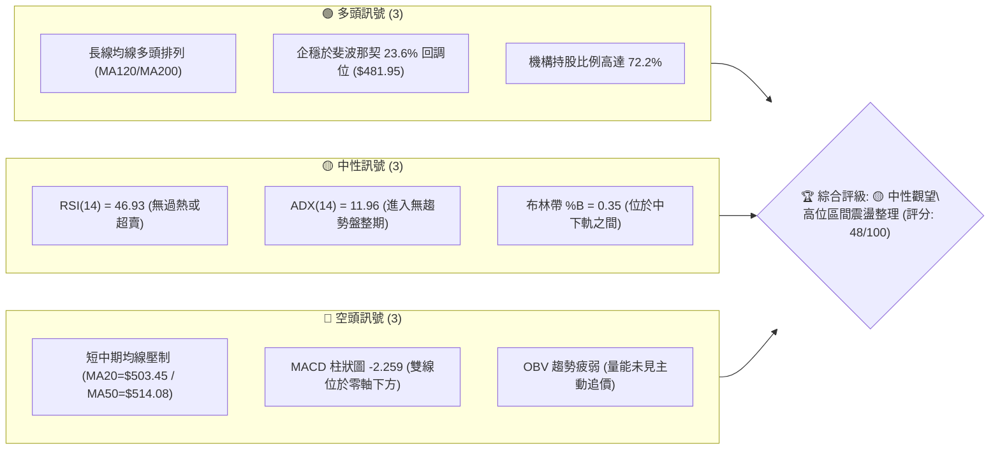
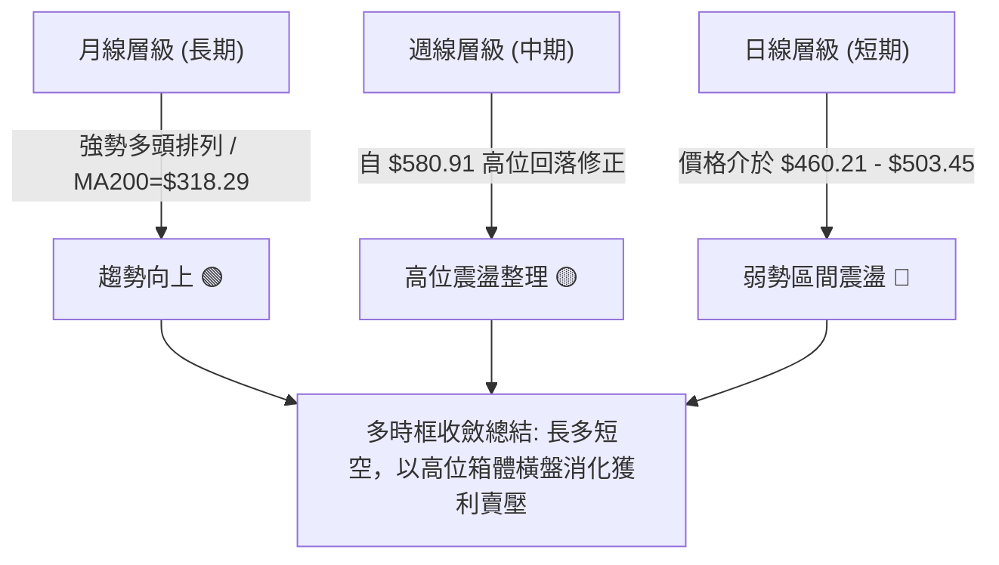
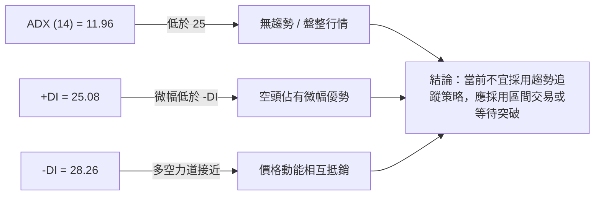
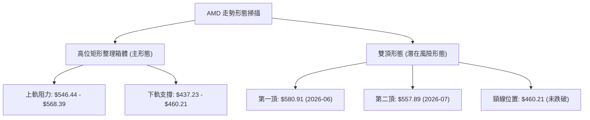
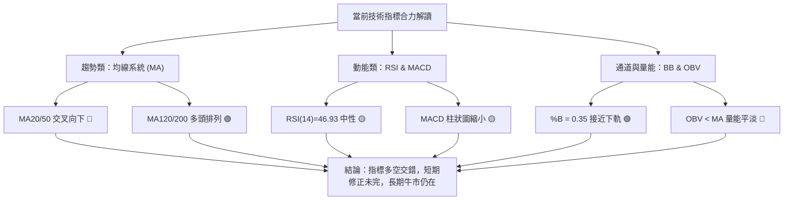
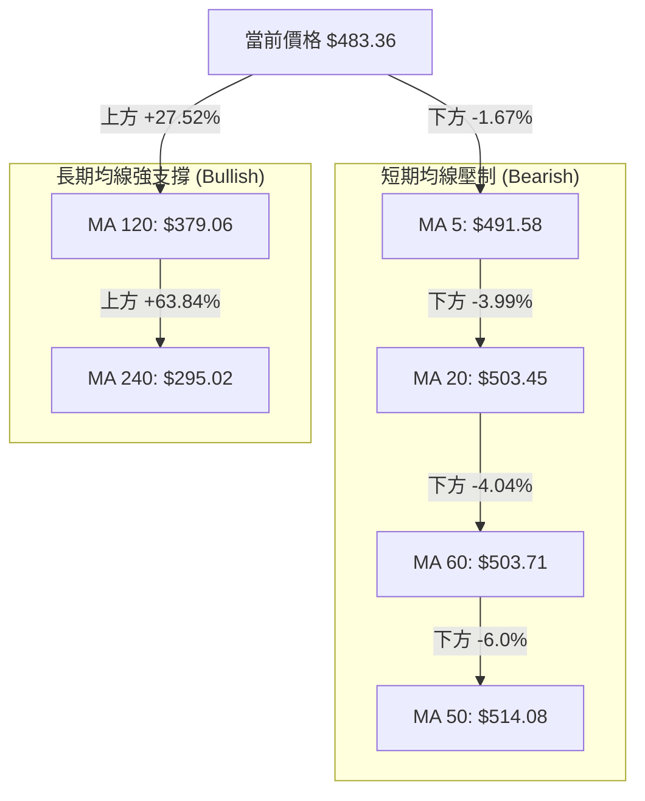
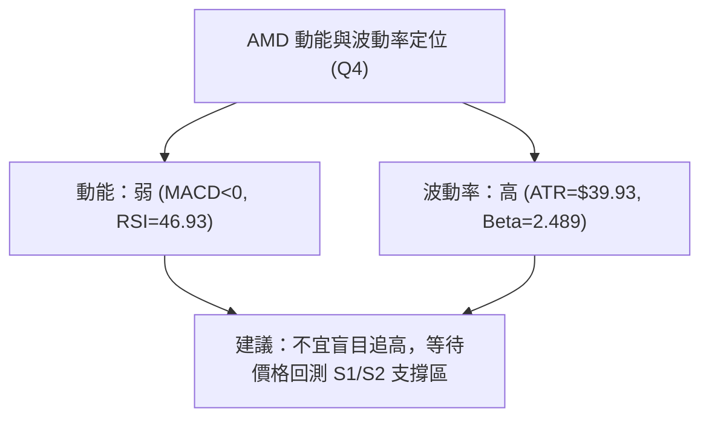
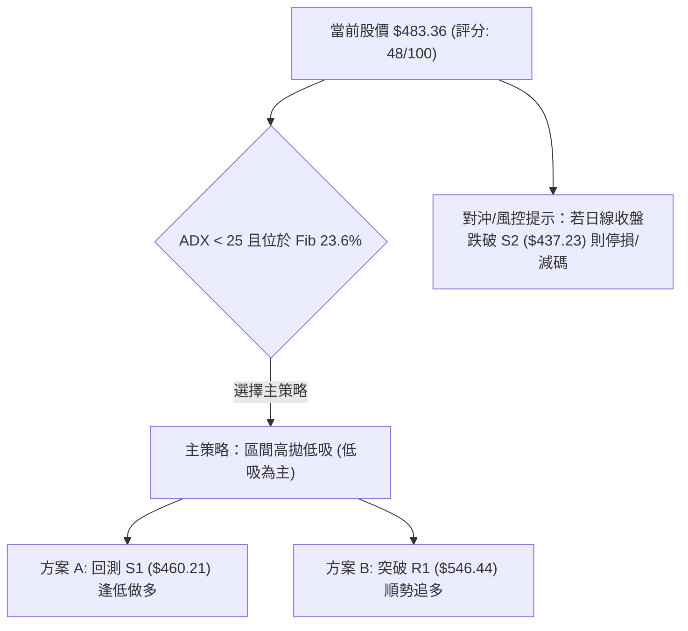
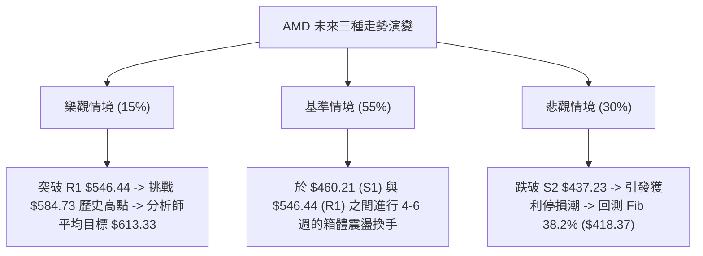

# AMD 技術分析報告

> **報告日期**：2026-08-10 ｜ **語言**：繁體中文 ｜ **數據來源**：Yahoo Finance ｜ **當前價格**：$483.36

---

## 目錄

| 章節 | 內容 |
|------|------|
| [1. 技術面概覽](#1-技術面概覽) | 訊號儀表板、核心指標、評分卡 |
| [2. 趨勢分析](#2-趨勢分析) | 多時框趨勢、長中短期走勢 |
| [3. 圖表形態分析](#3-圖表形態分析) | 形態識別、K線組合、目標價 |
| [4. 支撐與阻力](#4-支撐與阻力) | 關鍵價位、斐波那契回調 |
| [5. 技術指標深度解讀](#5-技術指標深度解讀) | MA/RSI/MACD/布林/成交量 |
| [6. 動能與波動率](#6-動能與波動率) | 動能評估、ATR、Beta |
| [7. 多時框架總結](#7-多時框架總結) | 時框架評分矩陣 |
| [8. 交易策略建議](#8-交易策略建議) | 多空策略、風險報酬比 |
| [9. 風險提示與監控](#9-風險提示與監控) | 監控指標、風險場景 |

---

## 1. 技術面概覽

### 🎯 技術訊號儀表板



### 📊 核心指標速覽表

| 指標類別 | 指標名稱 | 當前數值 | 訊號 | 解讀 |
|----------|----------|----------|------|------|
| **價格** | 當前收盤價 | $483.36 | 🟡 中性 | 位於 52 週區間的高位 76.7% 處 |
| **均線** | MA20 / MA50 | $503.45 / $514.08 | 🔴 看空 | 價格落於短中期均線下方，上方存在反彈壓力 |
| **均線** | MA120 / MA200 | $379.06 / $318.29 | 🟢 看多 | 長期均線強勢向上，超長線牛市架構未破壞 |
| **動能** | RSI (14) | 46.93 | 🟡 中性 | 處於 30-70 中性區間，多空力量暫時平衡 |
| **動能** | MACD (12,26,9) | -8.336 (柱 -2.259) | 🔴 看空 | 雙線在零軸下，但柱狀圖負值縮小，修正力道趨緩 |
| **趨勢** | ADX (14) | 11.96 | 🟡 盤整 | 低於 25，顯示當前無強烈單邊趨勢，屬箱體震盪 |
| **波動** | ATR (14) | $39.93 (8.26%) | 🔴 高波動 | 每日波動空間大，需搭配寬鬆止損設定 |

### 🏆 技術評分卡

```
╔══════════════════════════════════════════════════════════════════╗
║                技術評分卡 — AMD (2026-08-10)                   ║
╠══════════════════════════════════════════════════════════════════╣
║ 趨勢強度 (ADX)  ▓▓▓▓▓░░░░░░░░░░░░░░░ 25/100  🟡 弱趨勢/盤整      ║
║ 動能指標 (MACD) ▓▓▓▓▓▓▓▓░░░░░░░░░░░░ 40/100  🔴 短線偏弱        ║
║ 支撐穩定度      ▓▓▓▓▓▓▓▓▓▓▓▓▓▓░░░░░░ 70/100  🟢 23.6% 斐氏守穩   ║
║ 成交量配合 (OBV)▓▓▓▓▓▓▓▓░░░░░░░░░░░░ 40/100  🔴 量能萎縮        ║
║ 形態完整度      ▓▓▓▓▓▓▓▓▓▓░░░░░░░░░░ 50/100  🟡 箱體構築中      ║
║ 均線排列狀況    ▓▓▓▓▓▓▓▓▓▓▓▓░░░░░░░░ 60/100  🟡 長多短空交錯    ║
╠══════════════════════════════════════════════════════════════════╣
║ 綜合評分        ▓▓▓▓▓▓▓▓▓▓█░░░░░░░░░ 48/100  🟡 中性觀望        ║
╚══════════════════════════════════════════════════════════════════╝
```

---

## 2. 趨勢分析

### 🌐 多時框趨勢分析



### 📈 長期趨勢 — 12個月走勢圖（Unicode）

```
AMD 月線走勢圖（過去12個月：2025-09 至 2026-08）
價格軸 ($)
$600 ┤                                      ● (06月創高 $580.91)
$520 ┤                               ●      │       ● (08月現價 $483.36)
$440 ┤                               │      ●───────┘
$360 ┤                       ●───────┘
$280 ┤        ●              │
$200 ┤ ●      │       ●──────┘
$120 ┤ │      ●───────┘
$040 ┴─┴──────┴───────┴──────┴───────┴──────┴───────┴───────
     09月   11月    01月    03月    05月    06月    07月    08月
    (2025) (2025)  (2026)  (2026)  (2026)  (2026)  (2026)  (2026)
```

**走勢特徵分析表格**：

| 階段歷史 | 時間區間 | 收盤價變化 | 漲跌幅 | 階段技術特徵與驅動因素 |
|----------|----------|------------|--------|------------------------|
| **打底蓄勢期** | 2025-09 ~ 2026-03 | $161.79 → $203.43 | +25.7% | 於 $100-$200 底部區間築底完成，MA200 轉為向上支撐 |
| **主升段爆發** | 2026-03 ~ 2026-06 | $203.43 → $580.91 | +185.5% | 成交量急劇放大，RSI 最高衝破 97，呈現拋物線式強勢主升段 |
| **高位修正期** | 2026-06 ~ 2026-07 | $580.91 → $476.15 | -18.0% | 指標嚴重超買後出現獲利回吐，跌破 MA20，進行短線過熱修正 |
| **箱體震盪期** | 2026-07 ~ 2026-08 | $476.15 → $483.36 | +1.5% | 於 斐波那契 23.6% ($481.95) 附近尋求支撐，波動率收縮 |

### 📊 中期趨勢（週線分析）

```
週線支撐與阻力結構示意圖：
$584.73 ─────────────────────────────────── 52週歷史高點 (阻力強勁)
$546.44 ─ ─ ─ ─ ─ ─ ─ ─ ─ ─ ─ ─ ─ ─ ─ ─ ─ ─ 波段反彈阻力 R1
$503.45 ═══════════════════════════════════ MA20 均線位置 (多空分水嶺)
$483.36 ◄────────────────────────────────── 當前價格位置
$481.95 ─────────────────────────────────── 斐波那契 23.6% 回調位
$460.21 ─ ─ ─ ─ ─ ─ ─ ─ ─ ─ ─ ─ ─ ─ ─ ─ ─ ─ 波段關鍵支撐 S1
$437.23 ─────────────────────────────────── 布林通道下軌 / 支撐 S2
```

### ⚡ 趨勢強度評估（ADX 解讀）



| 指標名稱 | 數值 | 臨界值 | 趨勢強度評級 | 市場狀態解讀 |
|----------|------|--------|--------------|--------------|
| **ADX** | 11.96 | 25.00 | ░░░░░░░░░░ (非常弱) | 市場缺乏單邊方向，處於動能休整階段 |
| **+DI** | 25.08 | - | 多頭買盤力道 | 買盤力道回升至 25 上方，但未形成主導 |
| **-DI** | 28.26 | - | 空頭賣盤力道 | 賣盤佔微幅優勢，但未引發恐慌性拋售 |

---

## 3. 圖表形態分析

### 🔍 形態識別系統

根據近 20 週與歷史走勢數據，進行技術形態掃描：



#### 形態信心度與目標價計算

| 形態名稱 | 信心度 | 判斷依據（引用數據） | 完成度 | 形態目標價（計算式） |
|----------|--------|----------------------|--------|----------------------|
| **高位矩形箱體** | **75%** ▓▓▓▓▓▓▓▓░░ | 價格受阻於 $562.23 (R2)，並於 $460.21 (S1) 獲得買盤支撐 | 80% | **向上突破**：$546.44 + ($546.44 - $460.21) = **$632.67**<br>**向下跌破**：$460.21 - ($546.44 - $460.21) = **$373.98** |
| **潛在雙頂形態** | **40%** ▓▓▓▓░░░░░░ | 2026-06 頂點 $580.91 與 2026-07 頂點 $557.89，惟頸線 $460.21 未破 | 45% | *訊號不足，僅做風險提示*。若跌破頸線 $460.21：<br>$460.21 - ($580.91 - $460.21) = **$339.51** |

### 🕯️ 重要K線形態分析

| 日期/月份 | 收盤價 | K線形態類型 | 技術解讀 | 多空訊號 |
|-----------|--------|-------------|----------|----------|
| **2026-06** | $580.91 | 長上影線避雷針 | 歷史高點 $584.73 處遭遇強烈獲利解套賣壓 | 🔴 極度過熱反轉 |
| **2026-07-19**| $495.76 | 中陰線下殺 | 跌破 MA20 短期均線，多頭防線撤退 | 🔴 短線轉弱 |
| **2026-08-02**| $476.15 | 探底長下影線 | 下探 S1 區域 $460.21 附近獲得強烈承接力道 | 🟢 支撐浮現 |
| **2026-08-09**| $483.36 | 十字星/小陽線 | 價格於 斐波那契 23.6% ($481.95) 止跌橫盤 | 🟡 多空僵持 |

### 📉 ASCII 走勢形態示意圖

```
AMD 每日與每週價格走勢與箱體結構：
$584.73 ┬────────────────────────────────────────── (歷史高點 Peak 1: $580.91)
        │       /\          /\
$557.89 ┼──────/  \────────/  \──────────────────── (Peak 2: $557.89)
        │     /    \      /    \
$503.45 ┼────/──────\────/──────\────────────────── (MA20 / 箱體中軸)
$483.36 ┼───/────────\──/────────\─● (當前現價)
$460.21 ┼──/──────────\/──────────\──────────────── (箱體下軌 / 頸線 S1)
        └──────────────────────────────────────────
```

---

## 4. 支撐與阻力

### 🗺️ 關鍵價位分布圖（Unicode）

```
AMD 價位結構分布圖 (由 OHLCV 與歷史高低點精確計算)
═════════════════════════════════════════════════════════════════
$584.73 ║████████████████████████████████████████████████║ 52W 歷史最高點
$574.20 ║████████████████████████████████████            ║ 強阻力 R3 (+18.79%)
$562.23 ║████████████████████████████                    ║ 阻力 R2 (+16.32%)
$546.44 ║██████████████████                              ║ 關鍵近端阻力 R1 (+13.05%)
$503.45 ╠────────────────────────────────────────────────╣ MA20 / MA60 均線密集壓制區
$483.36 ╠════════════════════════════════════════════════╣ ◄ 當前價格 ($483.36)
$481.95 ╠────────────────────────────────────────────────╣ 斐波那契 23.6% 回調位
$460.21 ║▓▓▓▓▓▓▓▓▓▓▓▓▓▓▓▓▓▓                              ║ 近端關鍵支撐 S1 (-4.79%)
$437.23 ║████████████████████████████                    ║ 強支撐 S2 / 布林下軌 (-9.54%)
$424.03 ║████████████████████████████████████            ║ 波段強防守位 S3 (-12.27%)
$418.37 ║████████████████████████████████████████        ║ 斐波那契 38.2% 回調位
═════════════════════════════════════════════════════════════════
```

### 🚧 阻力位分析表

| 阻力級別 | 價位 | 形成原因 | 突破難度 | 重要性 |
|----------|------|----------|----------|--------|
| **R1** | **$546.44** | 近一年波段高點聚類與 7 月反彈受阻高點 | 🟡 中等 | 短線多頭反攻的首要關卡，突破方能重回多頭行情 |
| **R2** | **$562.23** | 密集成交區高點與布林通道上軌 ($568.39) 疊加區 | 🔴 困難 | 中期解套賣壓重災區 |
| **R3** | **$574.20** | 逼近 52 週歷史高點 $584.73 的終極解套壓力帶 | 🔴 極難 | 歷史天花板，需要極大成交量配合方能穿越 |

### 🛡️ 支撐位分析表

| 支撐級別 | 價位 | 形成原因 | 守住機率 | 重要性 |
|----------|------|----------|----------|--------|
| **S1** | **$460.21** | 近一年波段低點聚類、8月2日回測低點 | 🟢 70% | 短線多頭底線，守住則維持高位箱體震盪 |
| **S2** | **$437.23** | 日線布林通道下軌 ($438.50) 與低點聚類 | 🟢 80% | 中期關鍵防線，跌破將引發波段級別回檔 |
| **S3** | **$424.03** | 近一年強低點聚類，與 38.2% 斐氏位 ($418.37) 形成支撐帶 | 🟢 85% | 結構性多空分界點 |

### 📐 斐波那契回調位分析

依據 52 週低點 **$149.22** 至 52 週高點 **$584.73** 的完整波段進行計算：

```
0.0%  (52W High)   $584.73  ──────────────────────────────────────────
23.6%              $481.95  ◄ 現價 $483.36 正精確於此處獲得支撐與震盪
38.2%              $418.37  ────────────────────────────────────────── (強支撐疊加區)
50.0%              $366.97  ──────────────────────────────────────────
61.8%              $315.58  ────────────────────────────────────────── (接近 MA200 $318.29)
78.6%              $242.42  ──────────────────────────────────────────
100.0% (52W Low)   $149.22  ──────────────────────────────────────────
```

**解讀**：現價 $483.36 剛好落在 **23.6% 回調位 ($481.95)** 上方。在強勢多頭市場中，高位回調若能守穩 23.6% 回調位，屬於極為健康的高位換手；若不幸跌破，則價格將進一步尋求 38.2% 回調位 ($418.37) 的支撐。

---

## 5. 技術指標深度解讀

### 🎛️ 指標訊號總覽



### 📈 移動平均線排列分析



均線狀態為典型**混合排列（長多短空）**。價格位於 MA20 ($503.45) 及 MA50 ($514.08) 下方，短線上方阻力重重；但遠高於 MA120 ($379.06) 與 MA200 ($318.29)，大趨勢多頭基底完好。

### 📉 RSI(14) 分析

```
RSI(14) 當前數值：46.93
[0] ────────── [30] ─────────────── [46.93] ─────────────── [70] ────────── [100]
超賣區          買點觀察區            當前位置(中性)          超買警戒區      極度超買
▓▓▓▓▓▓▓▓▓▓▓▓▓▓▓▓▓▓▓▓▓▓▓▓▓▓▓▓▓▓▓▓▓▓▓▓▓▓▓▓▓▓▓▓░░░░░░░░░░░░░░░░░░░░░░░░░░░░░░░░░ (46.93%)
```

- **超買超賣評估**：RSI 從 2026 年 4-5 月的 90+ 極度超買區順利回落至 46.93，技術面過熱風險已完全釋放。
- **背離判斷**：日線與週線層級目前**無明顯頂背離或底背離**，RSI 與價格走勢保持同步震盪。

### 📊 MACD(12,26,9) 訊號解讀

- **MACD 線**：-8.336
- **Signal 線**：-6.078
- **MACD 柱狀圖**：-2.259 (🔴 空頭主導，但力道減弱)

**細節觀察**：週線 MACD 柱狀圖從 2026-08-02 的 `-9.004` 大幅收窄至當前的 `-2.259`，顯示空頭拋售動能正快速衰減，多頭有機會在零軸下方發動柱狀圖翻紅的反彈行情。

### 📦 布林通道分析

```
布林通道現狀 (20日標準差):
$568.39 ────────────────────────────────────────── 上軌 (Upper Band)
        │
$503.45 ────────────────────────────────────────── 中軌 (MA20)
        │  ● $483.36 (現價，位於中下軌之間)
$438.50 ────────────────────────────────────────── 下軌 (Lower Band)

%B 指標 = (483.36 - 438.50) / (568.39 - 438.50) = 0.35
```

當前 %B 為 **0.35**，代表股價偏向通道下半部。當 ADX < 25 時，布林通道下軌 **$438.50** 至 S1 **$460.21** 區域具備極高的高勝率反彈買點價值。

### 💹 成交量分析（量價配合度）

- **最新成交量**：2,656 萬股
- **20日均量**：3,002 萬股（量比 **0.88x**）
- **OBV 狀態**：OBV 低於其移動平均線，且近 4 週成交量由 5月高點的 2.96 億股縮減至 1.73 億股。
- **解讀**：量能呈現「縮量盤整」特徵。賣壓並未失控，但買盤追高意願低落，符合 ADX 所示的震盪休養生息格局。

---

## 6. 動能與波動率

### ⚡ 動能評估四象限

| 象限分區 | 動能 (Momentum) | 波動率 (Volatility) | AMD 當前狀態 | 交易策略導向 |
|----------|-----------------|---------------------|--------------|--------------|
| **Q1: 攻擊區** | 強 (RSI > 60) | 低 (ATR% < 5%) | ❌ 否 | 順勢追漲/加碼 |
| **Q2: 休養區** | 弱 (RSI < 50) | 低 (ATR% < 5%) | ❌ 否 | 靜待方向突破 |
| **Q3: 爆發區** | 強 (RSI > 60) | 高 (ATR% > 7%) | ❌ 否 (05月曾處於此區)| 嚴格移動止損 |
| **Q4: 震盪沉澱區**| 弱 (RSI = 46.93)| 高 (ATR% = 8.26%) | **✓ 當前定位於此** | **區間操作 / 逢低布局** |



### 📊 ATR 波動率分析

- **ATR (14)**：$39.93（占股價 **8.26%**）
- **風控指引**：由於 AMD 日波動空間接近 $40，設定止損距離時，需至少預留 **1.5 倍至 2.0 倍 ATR**（即 **$60 - $80** 的緩衝空間），以防短線噪音引發無謂掃損。

### 📐 Beta 與市場相關性

- **Beta**：**2.489**（高科技半導體高 Beta 屬性）
- **市場意義**：AMD 的波動幅度約為標普 500 指數的 2.49 倍。當大盤反彈時，AMD 具備強烈的向上彈性；同理，在大盤拉回時受創亦較深。

---

## 7. 多時框架總結

### 📋 時框架評分表

| 時框架 | 趨勢方向 | 動能狀態 | 均線排列 | 形態結構 | 綜合評分 | 建議策略 |
|--------|----------|----------|----------|----------|----------|----------|
| **月線 (長期)** | 🟢 強勢看多 | 🟢 高檔震盪 | 🟢 完全多頭 | 拋物線主升波 | **85 / 100** | 長線堅定持有 |
| **週線 (中期)** | 🟡 中性橫盤 | 🟡 修正減緩 | 🟢 長多短空 | 箱體高位整理 | **55 / 100** | 區間低吸高拋 |
| **日線 (短期)** | 🔴 弱勢震盪 | 🔴 零軸下方 | 🔴 MA20壓制 | 尋求 S1 支撐 | **42 / 100** | 觀望/回測進場 |

### 🔲 綜合訊號矩陣

```
┌─────────────────────────────────────────────────────────┐
│                    多時框架收斂矩陣                     │
├──────────────┬──────────────────┬───────────────────────┤
│ 時框架       │ 多空傾向         │ 主導權歸屬            │
├──────────────┼──────────────────┼───────────────────────┤
│ 長期 (月線)  │ 🟢 絕對多頭      │ 買方 (機構持股 72.2%) │
│ 中期 (週線)  │ 🟡 箱體震盪      │ 多空平衡              │
│ 短期 (日線)  │ 🔴 短線修正      │ 賣方 (獲利調節)       │
└──────────────┴──────────────────┴───────────────────────┘
```

### ⚖️ 多時框收斂結論

依據多時框收斂規則，**ADX (11.96) < 25 指示當前市場由「盤整行情」主導**。因此，短期日線的均線壓制不代表牛市結束，而是中期週線高位箱體整理的一部分。最終收斂方向為：**🟡 中性觀望 / 箱體低吸策略**。

---

## 8. 交易策略建議

### 🗺️ 策略決策流程圖



### 🧭 策略路由

> **當前主策略方向：🟡 區間震盪低吸 (綜合評分 48/100)**  
> 由於 ADX < 25 且價格守穩斐波那契 23.6% ($481.95)，市場處於低動能箱體。策略以「靠近箱體下軌逢低布局」為主，不宜在箱體中軸 ($503.45) 附近盲目追高。

### 🎯 價格情境階梯（Price Scenarios）

| 觸發條件 | 第一目標價 | 第二目標價 | 情境技術含義 |
|----------|------------|------------|--------------|
| **向上突破 R1 $546.44** | **$562.23 (R2)** | **$574.20 (R3)** | 結束箱體整理，挑戰歷史高點 $584.73 |
| **守穩現價~$460.21 (S1)** | **$503.45 (MA20)** | **$546.44 (R1)** | 箱體下軌反彈，回歸通道中軸 |
| **跌破 S1 $460.21** | **$437.23 (S2)** | **$418.37 (Fib 38.2%)** | 短線整理擴大，尋求布林下軌支撐 |

### 📊 情境機率分佈

```
[情境 A] 箱體下軌企穩反彈 (55%) ▓▓▓▓▓▓▓▓▓▓▓▓▓▓▓▓▓▓▓▓▓▓▓░░░░░░░░░
[情境 B] 下探 S2 / 38.2% 斐氏位 (30%) ▓▓▓▓▓▓▓▓▓▓▓░░░░░░░░░░░░░░░░░░░
[情境 C] 直接突破 R1 創新高 (15%) ▓▓▓▓▓░░░░░░░░░░░░░░░░░░░░░░░░░░
```

### 🟢 主策略詳情

#### 策略 A：區間逢低做多（主推策略 — 高勝率）

- **進場條件**：股價回測 **$460.21 (S1)** 至 **$481.95 (Fib 23.6%)** 區間，且日線出現止跌K線（如錘子線或小陽線）。
- **進場價格**：**$465.00**（預設掛單點位）
- **目標價 T1**：**$503.45**（MA20 / 箱體中軸）
- **目標價 T2**：**$546.44**（波段阻力 R1）
- **止損價格**：**$437.23**（跌破 S2 / 布林下軌停損）
- **風險報酬比**：
  - 至 T1：`($503.45 - $465.00) / ($465.00 - $437.23)` = `$38.45 / $27.77` = **1.38 : 1**
  - 至 T2：`($546.44 - $465.00) / ($465.00 - $437.23)` = `$81.44 / $27.77` = **2.93 : 1**
- **建議倉位**：10% - 15% 資金總額

#### 策略 B：右側突破追多（次選策略 — 順勢帶確認）

- **進場條件**：日線收盤價強勢突破 **$546.44 (R1)** 且成交量放大至 3,500 萬股以上。
- **進場價格**：**$548.00**
- **目標價 T1**：**$562.23 (R2)**
- **目標價 T2**：**$574.20 (R3)**
- **止損價格**：**$514.08**（退回 MA50 均線下方停損）
- **風險報酬比**：
  - 至 T2：`($574.20 - $548.00) / ($548.00 - $514.08)` = `$26.20 / $33.92` = **0.77 : 1** *(註：突破追高之風報比偏低，需嚴格控制倉位)*
- **建議倉位**：5% - 8% 資金總額

### 🔴 反向風險觸發點（對沖提示）

若日線收盤價**強勢跌破 $437.23 (S2)**，代表高位雙頂形態成立， short-term 箱體破位。多頭應立即清場離場，保守交易者可考慮透過買入 Put 避險，下看 **$418.37 (Fib 38.2%)** 及 **$379.06 (MA120)**。

### ⭐ 整體訊號強度評星

```
做多訊號強度：★★★☆☆  (3/5星 — 具備斐氏與箱體下軌雙重支撐)
做空訊號強度：★★☆☆☆  (2/5星 — 長期牛市均線強勁，作空風險高)
整體可信度：  ★★██☆  (3.5/5星 — ADX 偏低導致方向突破尚需時間)
```

---

## 9. 風險提示與監控

### ✅ 關鍵監控指標 Checklist

```
╔══════════════════════════════════════════════════════════════════╗
║                   AMD 日常風險監控清單 (Checklist)               ║
╠══════════════════════════════════════════════════════════════════╣
║ [ ] 價格防禦：收盤價是否守穩 S1 ($460.21)？                     ║
║ [ ] 動能修復：MACD 柱狀圖是否由負轉正 (-2.259 向上穿越零軸)？   ║
║ [ ] 均線奪回：股價是否站回 MA20 ($503.45) 上方？               ║
║ [ ] 量能擴充：日成交量是否回升至 20日均量 (3,002萬股) 以上？     ║
║ [ ] 突破確認：股價是否強勢衝破 R1 ($546.44) 箱體頂部？           ║
╚══════════════════════════════════════════════════════════════════╝
```

### ⚠️ 風險場景分析



### 🛡️ 風險管理重要提醒

1. **高 Beta 屬性防範**：AMD Beta 高達 2.489，半導體類股易受總體經濟利率政策與大盤情緒影響，切忌滿倉操作。
2. **波動率緩衝區**：ATR 高達 $39.93，短線交易者必須給予足夠的止損空間，避免被正常日內波動洗出場。
3. **分析師目標價參考**：華爾街 46 位分析師平均目標價為 **$613.33**（最高 $1,250.00 / 最低 $365.00），長線基本面依然看好，短線技術面拉回提供中長線分批布局機會。

---

## 📋 報告總結

```
╔══════════════════════════════════════════════════════════════════╗
║                  AMD 技術分析報告總結                            ║
════════════════════════════════════════════════════════════════════
 報告日期：2026-08-10
 當前價格：$483.36
 技術評級：🟡 中性觀望 (高位箱體整理，評分: 48/100)

 關鍵價位速查：
 ├─ 長期趨勢：🟢 強勢多頭 (遠高於 MA200 $318.29)
 ├─ 中短期趨勢：🟡 箱體整理 (ADX=11.96，無顯著單邊趨勢)
 ├─ 關鍵阻力：R1: $546.44 ｜ R2: $562.23 ｜ R3: $574.20
 ├─ 關鍵支撐：S1: $460.21 ｜ S2: $437.23 ｜ S3: $424.03
 └─ 斐波那契關鍵位：23.6% ($481.95 - 現價支撐) ｜ 38.2% ($418.37)

 最優策略建議：
 1. 🥇 最佳機會：區間低吸 (策略A) — 待回測 $460.21 - $481.95 築底時進場，
    目標 $503.45 / $546.44，止損 $437.23 (風報比 2.93:1)。
 2. 🥈 次選機會：突破追多 (策略B) — 待日線強勢收復 R1 $546.44 且帶量時順勢參與。
 3. 🥉 風險控制：若日線跌破 $437.23 則確立高位轉弱，應嚴格執行止損。
╚══════════════════════════════════════════════════════════════════╝
```

---

> ⚠️ **免責聲明**：本報告為 AI 自動生成之技術分析，所有數據及估算均基於提供的歷史價格資訊。本報告**僅供研究與學術參考**，**不構成任何投資建議**。投資有風險，入市需謹慎。

*報告生成時間：2026-08-10 ｜ 數據來源：Yahoo Finance ｜ 分析框架：多時框技術分析*