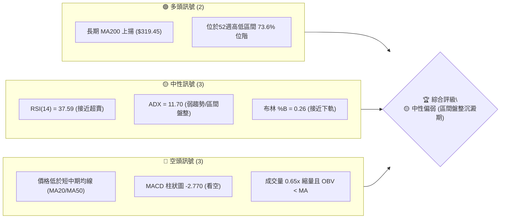
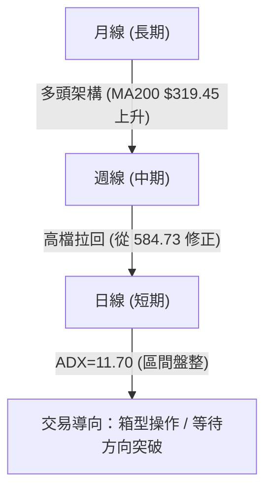
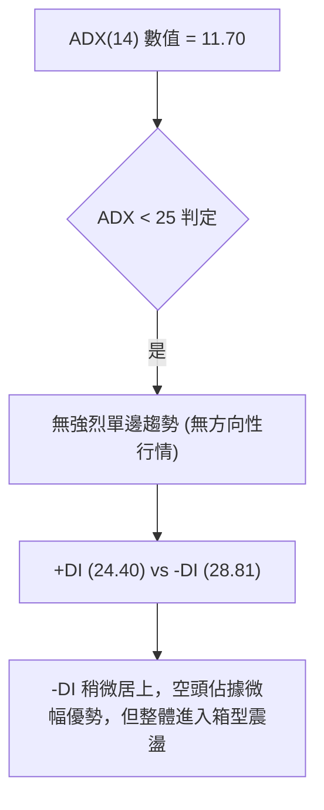
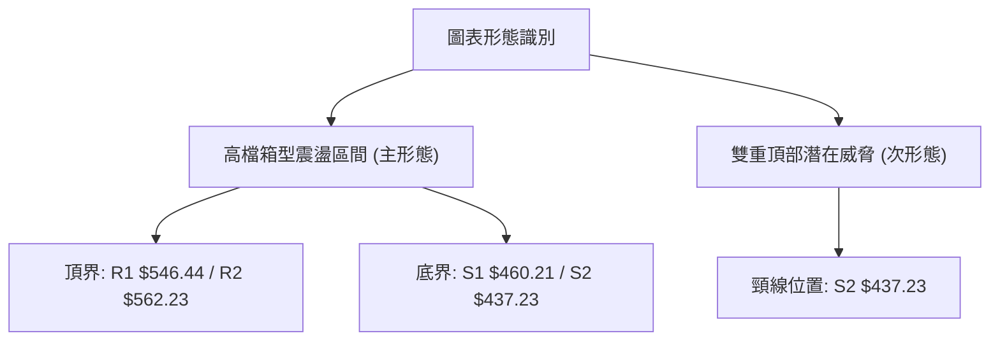
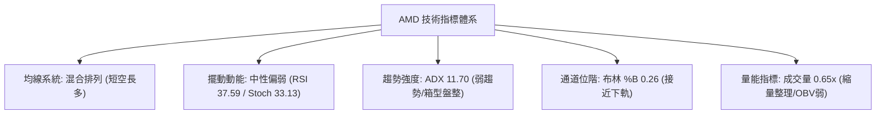
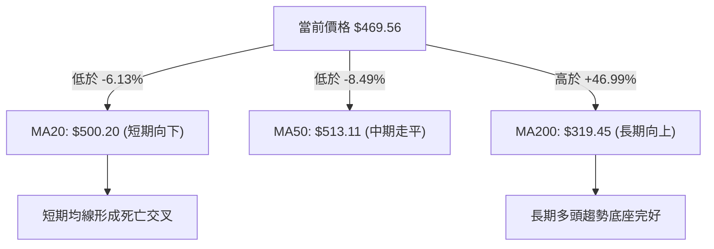
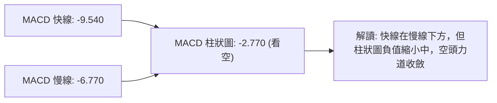
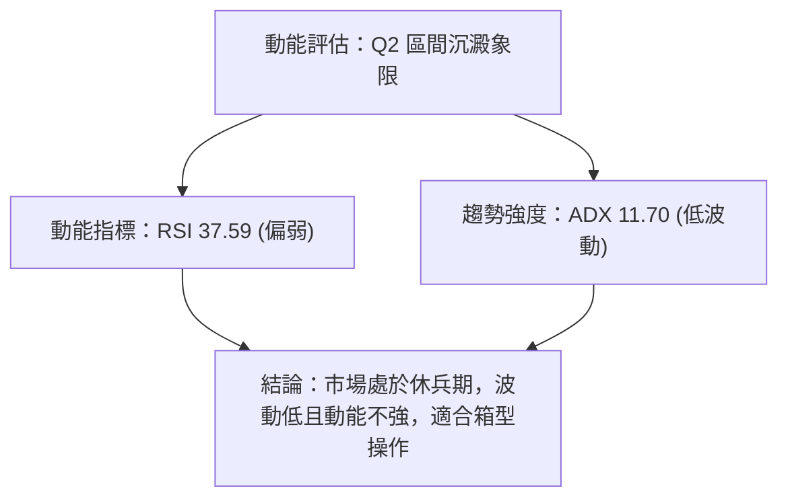
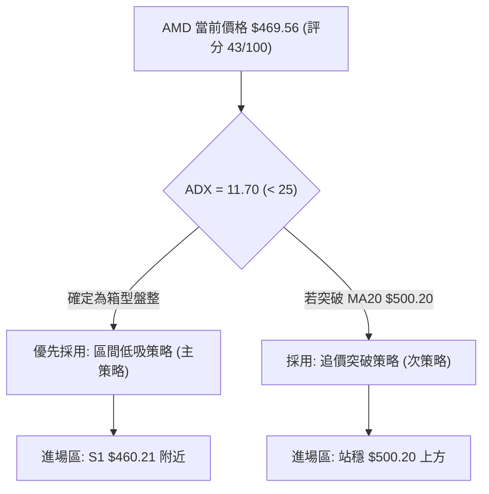
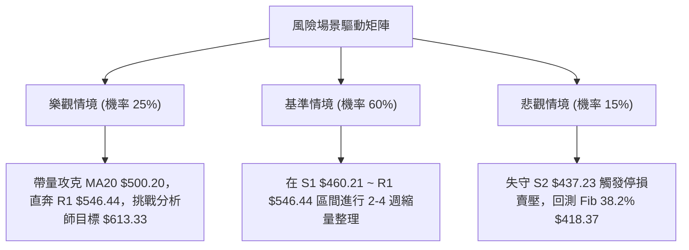

# AMD 技術分析報告

> **報告日期**：2026-08-11 ｜ **語言**：繁體中文 ｜ **數據來源**：Yahoo Finance ｜ **當前價格**：$469.56

---

## 目錄

| 章節 | 內容 |
|------|------|
| [1. 技術面概覽](#1-技術面概覽) | 訊號儀表板、核心指標、評分卡 |
| [2. 趨勢分析](#2-趨勢分析) | 多時框趨勢、長中短期走勢 |
| [3. 圖表形態分析](#3-圖表形態分析) | 形態識別、K線組合、目標價 |
| [4. 支撐與阻力](#4-支撐與阻力) | 關鍵價位、斐波那契回調 |
| [5. 技術指標深度解讀](#5-技術指標深度解讀) | MA/RSI/MACD/布林/成交量 |
| [6. 動能與波動率](#6-動能與波動率) | 動能評估、ATR、Beta |
| [7. 多時框架總結](#7-多時框架總結) | 時框架評分矩陣 |
| [8. 交易策略建議](#8-交易策略建議) | 多空策略、風險報酬比 |
| [9. 風險提示與監控](#9-風險提示與監控) | 監控指標、風險場景 |

---

## 1. 技術面概覽

### 🎯 技術訊號儀表板



### 📊 核心指標速覽表

| 指標類別 | 指標名稱 | 當前數值 | 訊號 | 解讀 |
|----------|----------|----------|------|------|
| **價格** | 當前價格 | $469.56 | 🟡 | 位於52週高低點 ($149.22–$584.73) 之 73.6% 位階 |
| **均線** | MA20 | $500.20 | 🔴 | 現價低於 MA20 (-6.13%)，短線承壓 |
| **均線** | MA50 | $513.11 | 🔴 | 現價低於 MA50，中期陷入修正 |
| **均線** | MA200 | $319.45 | 🟢 | 現價高於 MA200 (+46.99%)，長期牛市基底穩固 |
| **動能** | RSI(14) | 37.59 | 🟡 | 位於 30-70 中性偏弱區，尚無超賣訊號 |
| **動能** | MACD(12,26,9) | -9.540 | 🔴 | MACD 柱狀圖 -2.770，短期空頭主導 |
| **動能** | Stoch %K/%D | 33.13 / 41.26 | 🟡 | 進入低檔區，正等待黃金交叉 |
| **趨勢** | ADX(14) | 11.70 | 🟡 | ADX < 25 表示無強烈單邊趨勢，屬區間震盪 |
| **波動** | ATR(14) | $37.75 | 🟡 | 日波動率 8.04%，屬高 beta 股常態波動 |
| **量能** | 量比 (20D) | 0.65x | 🔴 | 最新量 1,928 萬股，低於 20D 均量 2,985 萬股 |

### 🏆 技術評分卡

```
╔══════════════════════════════════════════════════════════════╗
║                技術評分卡 — AMD (2026-08-11)                 ║
╠══════════════════════════════════════════════════════════════╣
║ 趨勢強度      ▓▓▓▓▓▓░░░░░░░░░░░░░░  30/100  🟡 弱趨勢(ADX 11.7)  ║
║ 動能指標      ▓▓▓▓▓▓▓▓░░░░░░░░░░░░  38/100  🔴 MACD柱狀圖負值    ║
║ 支撐穩定度    ▓▓▓▓▓▓▓▓▓▓▓▓░░░░░░░░  60/100  🟢 臨近S1 $460.21    ║
║ 成交量配合    ▓▓▓▓▓▓▓░░░░░░░░░░░░░  35/100  🔴 縮量整理/OBV弱    ║
║ 形態完整度    ▓▓▓▓▓▓▓▓▓▓░░░░░░░░░░  50/100  🟡 高檔箱型震盪      ║
║ 均線排列      ▓▓▓▓▓▓▓▓▓░░░░░░░░░░░  45/100  🟡 短期死叉/長期金叉 ║
╠══════════════════════════════════════════════════════════════╣
║ 綜合評分      ▓▓▓▓▓▓▓▓▓░░░░░░░░░░░  43/100  🟡 中性觀望/區間沉澱 ║
╚══════════════════════════════════════════════════════════════╝
```

---

## 2. 趨勢分析

### 🌐 多時框趨勢分析



### 📈 長期趨勢 — 12個月走勢圖（Unicode）

```
AMD 月線走勢圖（過去12個月：2025-08 ~ 2026-08）

價格軸 ($)
$600 ┤                                      ● $580.91 (2026-06)
$520 ┤                                ●     │     ● $476.15
$440 ┤                          ●     │     │     │     ● $469.56 (現在)
$360 ┤                    ●     │     │     │     │
$280 ┤              ●     │     │     │     │     │
$200 ┤        ●     │     │     │     │     │     │
$120 ┤  ●     │     │     │     │     │     │     │
     └─┬─────┬─────┬─────┬─────┬─────┬─────┬─────┬─────
      08/25 10/25 12/25 02/26 04/26 05/26 06/26 07/26 08/26
```

#### 走勢特徵分析表格

| 時間階段 | 收盤價範圍 | 漲跌幅 | 走勢特徵解讀 |
|----------|------------|--------|--------------|
| **2025-08 ~ 2025-10** | $162.63 → $256.12 | +57.49% | 第一波 AI 需求爆發強升，突破 $200 關卡 |
| **2025-11 ~ 2026-03** | $217.53 → $203.43 | -6.48%  | 高檔橫盤整理，積蓄第二波攻擊動能 |
| **2026-04 ~ 2026-06** | $354.49 → $580.91 | +63.87% | 主升段暴漲，創下 52 週歷史高點 $584.73 |
| **2026-07 ~ 2026-08** | $476.15 → $469.56 | -19.17% | 高點回檔修復指標，回測 Fib 23.6% ($481.95) 與 S1 |

### 📊 中期趨勢（週線分析）

```
週線高檔震盪與壓力支撐區域示意圖
════════════════════════════════════════════════════════════
$584.73 ┤ ────────────────────────── (52W High / R3 $574.20)
        │       /\
$546.44 ┤ ─────/──\─────────────── (R1 關鍵壓力)
        │     /    \
$500.20 ┤ ───/──────\───────────── (MA20 中軌壓力)
        │   /        \    /\
$469.56 ┤ ─/──────────\──/──●───── (當前價格)
$460.21 ┤ ─────────────\/───────── (S1 第一支撐)
$437.23 ┤ ──────────────────────── (S2 強支撐/布林下軌 $435.29)
════════════════════════════════════════════════════════════
```

### ⚡ 趨勢強度評估（ADX 解讀）



| ADX 區間 | 當前狀態 | 趨勢解讀 | 最佳交易策略 |
|----------|----------|----------|--------------|
| **0 - 20** | **11.70 (當前)** | 弱趨勢 / 無趨勢盤整 | 箱型區間低買高賣 / 布林通道策略 |
| **20 - 25** | — | 趨勢開始萌芽 | 準備順勢突破 |
| **25 - 50** | — | 強勁單邊趨勢 | 均線追蹤 / 順勢交易 |
| **50 - 100** | — | 極端趨勢 / 警惕反轉 | 獲利了結 / 緊縮止損 |

---

## 3. 圖表形態分析

### 🔍 形態識別系統



#### 形態信心度評估表

| 形態名稱 | 信心度 | 判斷依據（引用數據） | 完成度 | 目標價（附計算式） |
|----------|--------|----------------------|--------|--------------------|
| **高檔箱型盤整** | **75%** | 價格在 S2 $437.23 與 R2 $562.23 區間運作，ADX=11.70 < 25 | 70% | 區間上軌 R1 $546.44 ~ R2 $562.23 |
| **雙重頂形態** | **45%** | 2026-06 達高點 $580.91 後回檔，7 月反彈至 $557.89 未創新高 | 40% | 若跌破頸線 S2 $437.23：<br/>$437.23 - ($584.73 - $437.23) = $289.73 |

*註：由於雙頭形態尚未跌破頸線 S2 $437.23，且 ADX 極低，當前優先採用「高檔箱型盤整」解讀。*

### 🕯️ 重要 K 線形態分析

| 日期/週別 | 收盤價 | K 線形態 | 技術特徵與解讀 | 多空訊號 |
|-----------|--------|----------|----------------|----------|
| **2026-07-12** | $557.89 | 反彈受阻中陰線 | 欲挑戰前高無力，遇 R2 $562.23 前遭壓制 | 🔴 看空 |
| **2026-07-19** | $495.76 | 長黑跌破線 | 跌破 MA20 $500.20，確立短期轉弱 | 🔴 看空 |
| **2026-07-26** | $521.95 | 短紅抵抗線 | 於 Fib 23.6% ($481.95) 上方展開弱勢反彈 | 🟡 中性 |
| **2026-08-02** | $476.15 | 下探黑棒 | 再次下探，跌破 Fib 23.6% ($481.95) | 🔴 看空 |
| **2026-08-09** | $483.36 | 小陽孕育線 | 於 S1 $460.21 上方止跌震盪，成交量萎縮 | 🟡 中性 |
| **2026-08-16** | $469.56 | 短陰下影線 | 回測 S1 $460.21 支撐，多頭尋求低檔防守 | 🟡 中性 |

### 📉 ASCII 走勢形態示意圖

```
AMD 高檔箱型震盪結構示意圖 (2026-06 ~ 2026-08)

$584.73 ┤─────── Top 1 ($580.91) ──────── Top 2 ($557.89) ────── (天花板)
        │          /\                       /\
$546.44 ┤─────────/──\─────────────────────/──\─────────────── (阻力 R1)
        │        /    \                   /    \
$500.20 ┤───────/──────\─────────────────/──────\────────────── (箱型中軸 MA20)
        │      /        \               /        \
$469.56 ┤─────/──────────\─────────────/──────────\──●───────── (現價 $469.56)
$460.21 ┤────/────────────\───────────/────────────\/────────── (支撐 S1)
$437.23 ┤───/──────────────\─────────/───────────────────────── (頸線/底界 S2)
```

### 🎯 形態目標價計算

1. **箱型突破目標價（多頭情境）**：
   - 估算式：箱型上軌 R1 ($546.44) + 箱型高度 ($546.44 - $437.23 = $109.21) = **$655.65**
   - 參考分析師平均目標價：**$613.33**

2. **雙頂跌破目標價（空頭情境）**：
   - 估算式：頸線 S2 ($437.23) - 雙頂高度 ($584.73 - $437.23 = $147.50) = **$289.73**
   - 剛好接近 MA200 ($319.45) 及 Fib 61.8% ($315.58) 區域。

---

## 4. 支撐與阻力

### 🗺️ 關鍵價位分布圖（Unicode）

```
AMD 價位結構與密集區分布圖
════════════════════════════════════════════════════════════
$584.73 ║██████████████████████████████ 52W High / 0.0% Fib
$574.20 ║████████████████████████      強阻力 R3
$562.23 ║████████████████████          阻力 R2
$546.44 ║████████████████████████████  關鍵阻力 R1 / 箱型頂
$513.11 ║▓▓▓▓▓▓▓▓▓▓▓▓▓▓▓▓▓▓▓▓          MA50
$500.20 ║▓▓▓▓▓▓▓▓▓▓▓▓▓▓▓▓▓▓▓▓▓▓        MA20 / 布林中軌
$481.95 ║░░░░░░░░░░░░░░░░░░░░░░░░░░░░  23.6% Fib 回調位
$469.56 ╠══════════════════════════════ ◄ 當前價格 $469.56
$460.21 ║▓▓▓▓▓▓▓▓▓▓▓▓▓▓▓▓              第一支撐 S1
$437.23 ║████████████████████████████  第二強支撐 S2 / 布林下軌 ($435.29)
$424.03 ║████████████████              第三支撐 S3
$418.37 ║░░░░░░░░░░░░░░░░░░░░░░░░░░░░  38.2% Fib 回調位
$319.45 ║████████████████████████████  MA200 長期牛熊分界線
════════════════════════════════════════════════════════════
```

### 🚧 阻力位分析表

| 阻力級別 | 精確價位 | 形成原因 | 突破難度 | 重要性解讀 |
|----------|----------|----------|----------|------------|
| **阻力 R1** | **$546.44** | 近一年波段高點聚類 / 箱型整理上界 | 🔴 偏高 | 突破此位宣告短期修正結束，重啟多頭 |
| **阻力 R2** | **$562.23** | 7 月反彈高點聚類 / 近期次高壓力 | 🔴 高 | 多頭強弱分水嶺 |
| **阻力 R3** | **$574.20** | 歷史高點 $584.73 前的密集賣壓區 | 🔴 極高 | 歷史高點前哨站，賣壓極沉重 |

### 🛡️ 支撐位分析表

| 支撐級別 | 精確價位 | 形成原因 | 守住機率 | 重要性解讀 |
|----------|----------|----------|----------|------------|
| **支撐 S1** | **$460.21** | 近一年波段低點聚類 / 8月防守線 | 🟡 60% | 多頭短期防線，跌破將下探箱底 |
| **支撐 S2** | **$437.23** | 波段密集支撐 / 布林下軌 ($435.29) | 🟢 75% | 箱型底部強支撐，跌破則雙頂形態成立 |
| **支撐 S3** | **$424.03** | 支撐聚類 / Fib 38.2% ($418.37) 屏障 | 🟢 85% | 中期多頭最後防線 |

### 📐 斐波那契回調位分析

*基準：52週波段低點 $149.22 至 52週歷史高點 $584.73*

| 斐波那契層級 | 精確價位 | 與現價相距 (%) | 當前位置與意義解讀 |
|--------------|----------|----------------|--------------------|
| **0.0% (High)**| $584.73 | +24.53% | 歷史最高點 |
| **23.6%** | **$481.95** | +2.64% | **現價 ($469.56) 略低於此位**，正進行回檔修復 |
| **38.2%** | **$418.37** | -10.90% | 強度回調防守區，若回測此處將是強勁買點 |
| **50.0%** | **$366.97** | -21.85% | 多空中軸，牛熊對峙關鍵點 |
| **61.8%** | **$315.58** | -32.79% | 黃金分割強支撐（接近 MA200 $319.45） |
| **100.0% (Low)**| $149.22 | -68.22% | 起漲低點 |

---

## 5. 技術指標深度解讀

### 🎛️ 指標訊號總覽



### 📈 移動平均線排列分析



| 均線名稱 | 精確數值 | 價格相對位置 | 均線扣抵與走勢 | 多空訊號 |
|----------|----------|--------------|----------------|----------|
| **MA5** | $488.57 | 現價低於 -3.89% | 短線下壓 | 🔴 空頭 |
| **MA10** | $477.32 | 現價低於 -1.63% | 短線下壓 | 🔴 空頭 |
| **MA20** | $500.20 | 現價低於 -6.13% | 走平彎頭向下 | 🔴 空頭 |
| **MA50** | $513.11 | 現價低於 -8.49% | 高檔走平 | 🟡 中性 |
| **MA120**| $381.28 | 現價高於 +23.15%| 強勢上揚 | 🟢 多頭 |
| **MA200**| $319.45 | 現價高於 +46.99%| 穩定上揚 | 🟢 多頭 |

### 📉 RSI(14) 分析

```
RSI(14) 當前強度位置
0 ──────────── 30 ─────── 37.59 ───────── 70 ────────── 100
[    超賣區    ] █▓▓▓▓▓▓▓░░░░░░░░░░░░░░░░ [    超買區    ]
```

- **RSI 當前數值**：**37.59**（位於 30-70 中性偏弱區間）。
- **超買/超賣判斷**：尚未進入 <30 極端超賣區，但已相當接近，顯示下挫動能開始衰竭。
- **背離分析**：
  - **價格**：從 7 月中旬高點回落。
  - **RSI**：隨價格回落，無顯著「頂背離」或「底背離」特徵。
  - **結論**：RSI 與價格走勢一致，無背離訊號，屬於正常回調修正。

### 📊 MACD(12,26,9) 訊號解讀



- **MACD 線**：-9.540
- **Signal 線**：-6.770
- **Histogram 柱狀圖**：-2.770
- **訊號解讀**：MACD 位於零軸下方，顯示短期空頭控盤。但由週線數據觀察（MACD柱從 -9.004 收斂至 -2.770），顯示空頭殺傷力正在減弱，隨時可能出現低檔金叉。

### 📦 布林通道分析

```
AMD 布林通道當前位置 (2026-08-11)

$565.12 ┤ ────────────────────────────── 布林上軌 (BB Upper)
        │
$500.20 ┤ ────────────────────────────── 布林中軌 (MA20)
        │            ● $469.56 (現價位階 %B = 0.26)
$435.29 ┤ ────────────────────────────── 布林下軌 (BB Lower)
```

- **上軌 ($565.12)** / **中軌 ($500.20)** / **下軌 ($435.29)**
- **%B 指標**：0.26（%B = (現價 - 下軌) / (上軌 - 下軌) = (469.56 - 435.29) / 129.83 = 0.263）。
- **通道狀態**：價格處於下軌與中軌之間（26% 分位點），接近下軌支撐。通道無擴張爆發跡象，屬於標準區間整理。

### 💹 成交量與 OBV 分析

- **成交量**：最新日成交量 **19,283,602 股**，對比 20日均量 **29,845,395 股**，量比僅 **0.65x**。
- **解讀**：股價回落期間呈現「明顯縮量」，表明市場缺乏恐慌性拋盤，賣壓主要來自高檔獲利了結與觀望氣氛。
- **OBV 趨勢**：OBV < MA，能量潮指標弱於均線，顯示資金追高意願低落，尚待攻擊量能放大。

---

## 6. 動能與波動率

### ⚡ 動能評估四象限

| 象限 | 動能強度 (Momentum) | 趨勢波動 (ADX/Volatility) | 當前狀態 | 策略建議 |
|------|--------------------|--------------------------|----------|----------|
| **Q1: 主升趨勢** | 強 (RSI > 60) | 高 (ADX > 25) | — | 順勢持股 / 加碼 |
| **Q2: 區間沉澱** | **弱 (RSI 37.59)** | **低 (ADX 11.70)** | **✓ AMD 當前** | **下軌低吸 / 觀望突破** |
| **Q3: 主跌突破** | 弱 (RSI < 30) | 高 (ADX > 25) | — | 停損離場 / 避險 |
| **Q4: 築底蓄勢** | 轉強 (RSI 金叉) | 低 (ADX < 20) | — | 建立觀察倉 |



### 📊 ATR 波動率分析

- **ATR(14) 數值**：**$37.75**（占當前股價 8.04%）。
- **波動率解讀**：AMD 日均真實波動幅度高達 $37.75，屬於高彈性標的。
- **交易應用（止損與倉位）**：
  - **多頭止損距離**：建議設定 1.5 倍 ATR = $37.75 × 1.5 = **$56.63**。
  - **短線波動區間**：今日預期波動上下限為 $469.56 ± $37.75 → **$431.81 ~ $507.31**。

### 📐 Beta 與市場相關性

- **Beta 係數**：**2.489**
- **解讀**：AMD 波動度是大盤（S&P 500）的 2.49 倍。當半導體板塊或大盤回調時，AMD 跌幅往往擴大；反之大盤反彈時，AMD 具備高彈性爆發力。

---

## 7. 多時框架總結

### 📋 時框架評分表

| 時框架 | 趨勢方向 | 動能 (RSI/MACD) | 均線排列 | 形態結構 | 綜合評分 | 建議策略 |
|--------|----------|-----------------|----------|----------|----------|----------|
| **月線 (長期)** | 🟢 多頭 | 🟢 強勁 | 🟢 多頭排列 | 多頭主升 | **82/100** | 長線堅定看多，逢低分批佈局 |
| **週線 (中期)** | 🟡 中性 | 🟡 修正中 | 🟡 短期死叉 | 高檔箱型 | **55/100** | 箱型區間操作 |
| **日線 (短期)** | 🔴 偏弱 | 🔴 空頭控盤 | 🔴 價在 MA20 下| 測 S1 支撐 | **40/100** | 短線尋求止跌訊號 |

### 🔲 綜合訊號矩陣

```
╔══════════════════════════════════════════════════════════════╗
║                   多時框訊號一致性矩陣                       ║
╠═════════════════════┬═════════════════════┬══════════════════╣
║ 時框                ║ 多頭訊號            ║ 空頭訊號         ║
╠═════════════════════┼═════════════════════┼══════════════════╣
║ 長期 (月線)         ║ MA200 遠在下方      ║ 高檔獲利賣壓     ║
║ 中期 (週線)         ║ 守住 Fib 23.6%      ║ MACD 週柱負值    ║
║ 短期 (日線)         ║ 布林下軌附近止跌    ║ 價低於 MA20/MA50 ║
╚═════════════════════╧═════════════════════╧══════════════════╝
```

### ⚖️ 多時框收斂結論

**多時框收斂規則套用**：
1. **行情性質判定**：ADX = 11.70 (< 25)，確定當前市場為 **盤整行情 (Ranging Market)**。
2. **主導規則**：依規則 14，盤整行情下以**日線布林通道 ($435.29 ~ $565.12)** 與** key levels (S1 $460.21 / R1 $546.44)** 為主要交易區間。
3. **最終方向性結論**：**中性觀望 / 箱型低吸高拋**。長期牛市未變，短期進入高檔箱型沉澱，以 $460.21 (S1) ~ $437.23 (S2) 為強吸籌區，以 $500.20 (MA20) ~ $546.44 (R1) 為短線阻力區。

---

## 8. 交易策略建議

### 🗺️ 策略決策流程圖



### 🧭 策略路由

> **當前主策略方向 = 區間低吸 / 箱型下軌逢低佈局（綜合評分 43/100，中性偏弱區間）**

由於 ADX 為 11.70，顯示無強烈單邊殺跌趨勢，且股價已逼近箱型下軌與 S1 ($460.21)，因此**主推「區間低吸做多策略」**；若不幸跌破 S2 ($437.23)，則觸發反向避險對沖。

### 🎯 價格情境階梯 (Price Scenarios)

| 觸發條件 | 第一目標價 | 第二目標價 | 情境含義解讀 |
|----------|------------|------------|--------------|
| **突破 R1 $546.44** | R2 $562.23 | R3 $574.20 | 強勢重啟主升段，挑戰歷史高點 |
| **站穩 MA20 $500.20** | R1 $546.44 | R2 $562.23 | 短線轉強，向箱型頂部推進 |
| **當前價位震盪 ($469.56)**| MA20 $500.20| R1 $546.44 | 區間沉澱修復指標 |
| **跌破 S1 $460.21** | S2 $437.23 | S3 $424.03 | 下探箱型底部強防禦區 |
| **跌破 S2 $437.23** | Fib 38.2% $418.37 | MA120 $381.28 | 雙頂成立，中期加深修正 |

### 📊 情境機率分佈

```
情境機率分佈示意圖
┌─────────────────────────────────────────┬───────────────┬───────────────┐
│ 區間反彈 / 向上尋求突破 (55%)           │ 區間震盪 (30%)│ 回落探底 (15%)│
└─────────────────────────────────────────┴───────────────┴───────────────┘
```

| 情境 | 機率 | 主要依據 |
|------|------|----------|
| **區間反彈 / 向上突破** | **55%** | 縮量拉回，接近 S1 ($460.21) 與布林下軌 ($435.29)，RSI 接近超賣 |
| **區間震盪整理** | **30%** | ADX 11.70 顯示趨勢極弱，成交量僅 0.65x 均量，缺乏突破攻擊量 |
| **回落再探底 (破S2)** | **15%** | MACD 柱狀圖負值，短期均線死亡交叉下壓 |

### 🟢 主策略詳情

#### 策略 A：箱型下軌低吸策略（主策略 — 60% 倉位）

- **進場條件**：股價回測 **$460.21 (S1)** 至 **$465.00** 區間出現止跌紅棒或下影線。
- **進場價格**：**$462.50**（S1 附近）。
- **止損價格**：**$434.00**（跌破 S2 $437.23 與布林下軌 $435.29 約 0.3% 處）。
- **目標價 T1**：**$500.20**（MA20 / 箱型中軸，潛在獲利 +8.15%）。
- **目標價 T2**：**$546.44**（R1 / 箱型上軌，潛在獲利 +18.15%）。
- **風險報酬比 (R/R)**：
  - 到 T1：($500.20 - $462.50) / ($462.50 - $434.00) = $37.70 / $28.50 = **1.32 : 1**
  - 到 T2：($546.44 - $462.50) / ($462.50 - $434.00) = $83.94 / $28.50 = **2.95 : 1**
- **成功機率**：**65%**
- **建議倉位**：**15% - 20%** 總資金。

#### 策略 B：突破 MA20 追擊策略（次策略 — 40% 倉位）

- **進場條件**：日線收盤價帶量（>3,000萬股）突破並站穩 **$500.20 (MA20)**。
- **進場價格**：**$502.00**
- **止損價格**：**$481.95**（Fib 23.6% 回調位下方）。
- **目標價 T1**：**$546.44**（R1 壓力位，潛在獲利 +8.85%）。
- **目標價 T2**：**$613.33**（華爾街分析師平均目標價，潛在獲利 +22.18%）。
- **風險報酬比 (R/R)**：
  - 到 T1：($546.44 - $502.00) / ($502.00 - $481.95) = $44.44 / $20.05 = **2.22 : 1**
  - 到 T2：($613.33 - $502.00) / ($502.00 - $481.95) = $111.33 / $20.05 = **5.55 : 1**
- **成功機率**：**60%**
- **建議倉位**：**10% - 15%** 總資金。

### 🔴 反向風險觸發點（對沖提示）

若股價日線收盤**跌破 S2 $437.23**，則「高檔箱型」宣告失敗，轉為「雙頂下尋支撐」形態。
- **風險對沖動作**：多頭部位全面減碼或停損，空頭對沖目標看向 **Fib 38.2% ($418.37)** 甚至 **MA120 ($381.28)**。

### ⭐ 整體訊號強度評星

```
做多訊號強度：★★★☆☆  (3/5星 — 臨近箱底/縮量洗盤)
做空訊號強度：★★☆☆☆  (2/5星 — ADX過低，缺乏向下單邊趨勢)
整體可信度：  ████████████░░░░░░░░  ★★1/2 (3.5/5星)
```

---

## 9. 風險提示與監控

### ✅ 關鍵監控指標 Checklist

```
╔══════════════════════════════════════════════════════════════╗
║                    每日技術面監控清單                        ║
╠══════════════════════════════════════════════════════════════╣
║ [ ] 股價是否守住第一支撐 S1 ($460.21)                        ║
║ [ ] 成交量是否放大至 20日均量 (2,984萬股) 以上               ║
║ [ ] MACD 柱狀圖是否由負轉正 (-2.770 上升)                    ║
║ [ ] RSI(14) 能否重返 50 中性軸位階                           ║
║ [ ] 股價能否收復 MA20 ($500.20) 重啟攻勢                     ║
║ [ ] ADX 是否突破 25 萌芽新單邊趨勢                           ║
╚══════════════════════════════════════════════════════════════╝
```

### ⚠️ 風險場景分析



### 🛡️ 風險管理重要提醒

1. **高 Beta 波動控制**：AMD 波動率高（Beta 2.489，ATR $37.75），單日波動可達 8%，嚴禁過度槓桿。
2. **分批建倉原則**：在 S1 ($460.21) 附近採取「金字塔式分批買進」，嚴格將單一股票風險控制在總資產 2% 內。
3. **止損紀律**：以收盤價為準，若收盤跌破 **$434.00**，必須無條件執行停損，避免遭受雙頂形態的深幅修正。

---

## 📋 報告總結

```
╔══════════════════════════════════════════════════════════════╗
║                     AMD 技術分析報告總結                     ║
════════════════════════════════════════════════════════════════
 報告日期：2026-08-11
 當前價格：$469.56
 分析評級：🟡 中性觀望 / 箱型低吸（技術評分：43/100）

 關鍵價位速查：
 ├─ 歷史高點 / 0.0% Fib：$584.73
 ├─ 關鍵阻力 R1：        $546.44
 ├─ 中軸壓力 MA20：      $500.20
 ├─ 23.6% Fib 回調位：   $481.95
 ├─ 第一支撐 S1：        $460.21
 ├─ 強支撐 S2 / 通道底： $437.23
 └─ 分析師平均目標價：  $613.33

 最優策略組合：
 1. 🥇 最佳機會（箱型低吸）：於 $460.21 ~ $465.00 分批佈局，止損 $434.00，目標 $500.20 / $546.44。
 2. 🥈 次選機會（右側突破）：待帶量突破 $500.20 後追擊，目標 $546.44 / $613.33。
 3. 🥉 風險防禦：跌破 $437.23 停損觀望，耐心等待 $418.37 (Fib 38.2%) 築底。
════════════════════════════════════════════════════════════════
```

---

> ⚠️ **免責聲明**：本報告為 AI 自動生成之技術分析，所有數據及估算均基於提供的歷史價格資訊。本報告**僅供研究與學術參考**，**不構成任何投資建議**。投資有風險，入市需謹慎。

---

*報告生成時間：2026-08-11 ｜ 數據來源：Yahoo Finance ｜ 分析框架：多時框技術分析*