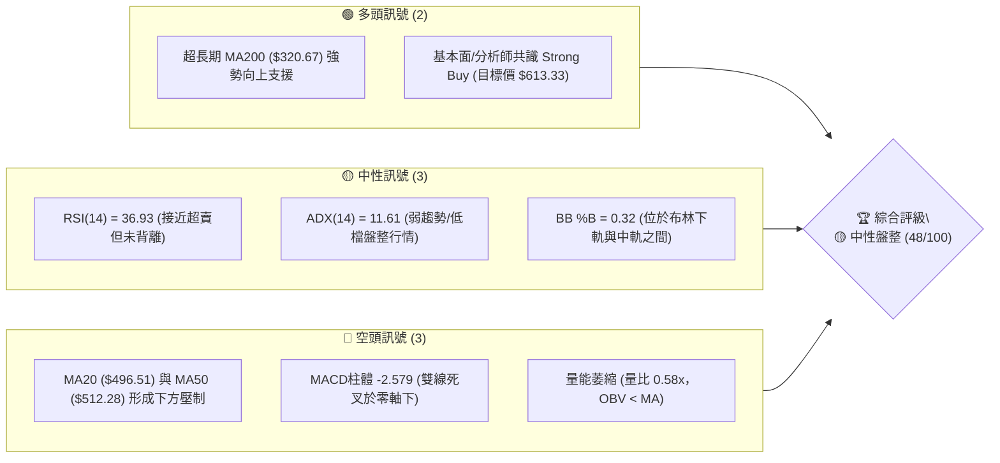
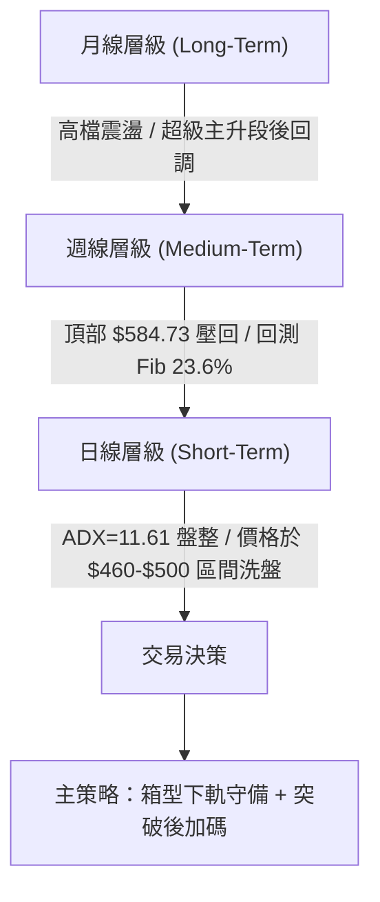
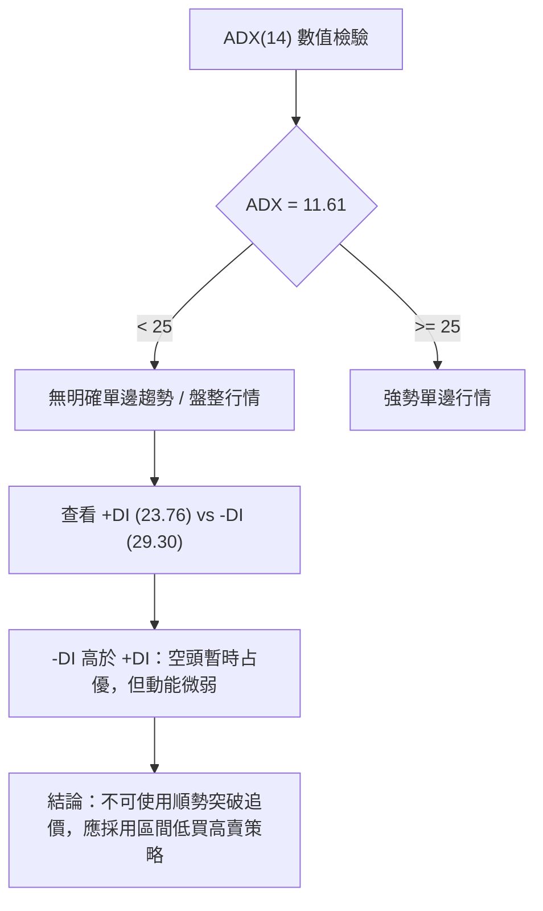
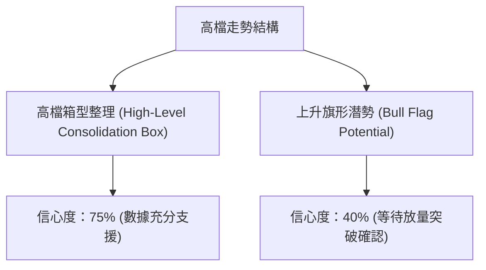
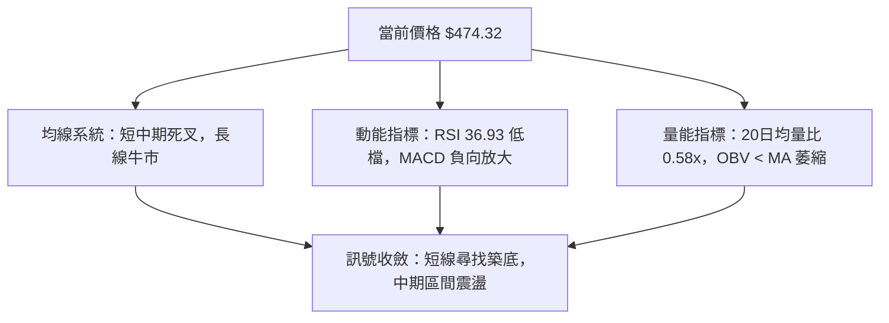
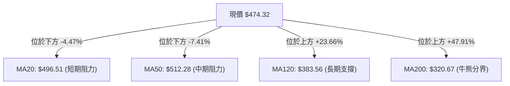
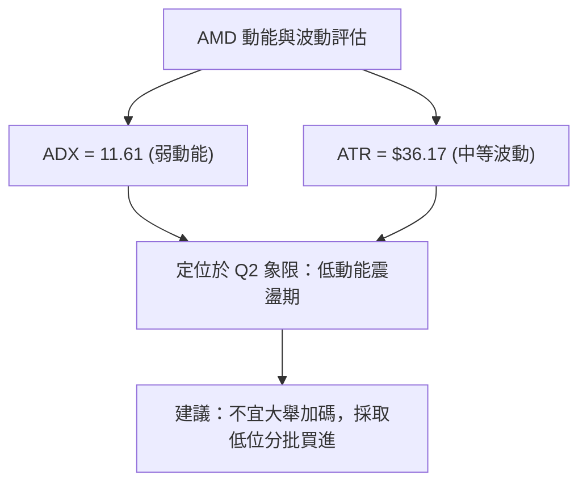
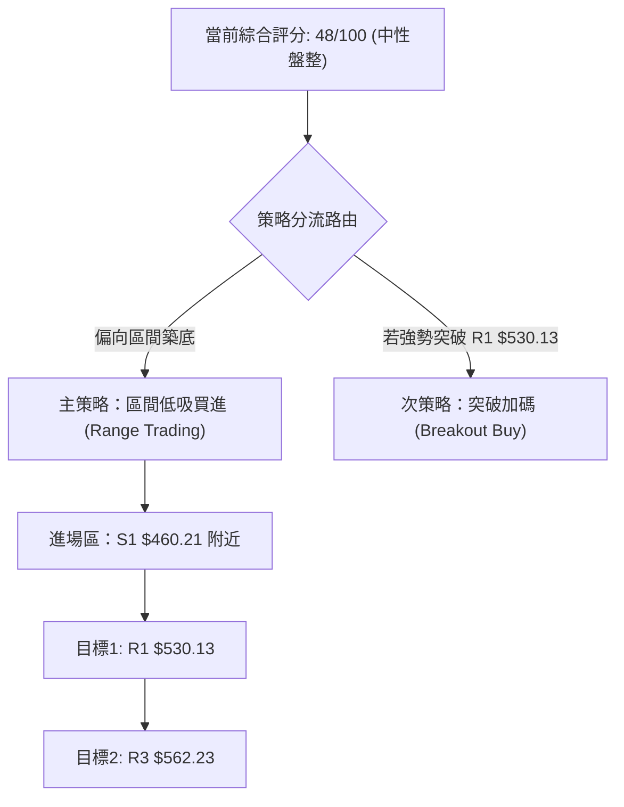
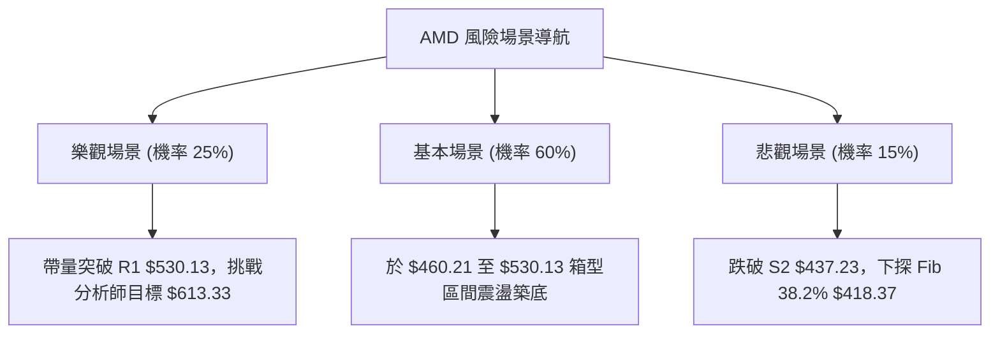

# AMD 技術分析報告

> **報告日期**：2026-08-12 ｜ **語言**：繁體中文 ｜ **數據來源**：Yahoo Finance ｜ **當前價格**：$474.32

---

## 目錄

| 章節 | 內容 |
|------|------|
| [1. 技術面概覽](#1-技術面概覽) | 訊號儀表板、核心指標、評分卡 |
| [2. 趨勢分析](#2-趨勢分析) | 多時框趨勢、長中短期走勢、ADX強度 |
| [3. 圖表形態分析](#3-圖表形態分析) | 形態識別、信心度、K線組合、目標價 |
| [4. 支撐與阻力](#4-支撐與阻力) | 關鍵價位分布、阻力與支撐表、斐波那契 |
| [5. 技術指標深度解讀](#5-技術指標深度解讀) | MA/RSI/MACD/布林通道/成交量與OBV |
| [6. 動能與波動率](#6-動能與波動率) | 動能四象限、ATR波動率、Beta分析 |
| [7. 多時框架總結](#7-多時框架總結) | 時框架評分矩陣、多時框收斂結論 |
| [8. 交易策略建議](#8-交易策略建議) | 策略路由、價位階梯、多空策略與風報比 |
| [9. 風險提示與監控](#9-風險提示與監控) | 監控 Checklist、風險場景與倉位管理 |

---

## 1. 技術面概覽

### 🎯 技術訊號儀表板



### 📊 核心指標速覽表

| 指標類別 | 指標名稱 | 當前數值 | 訊號 | 解讀 |
|----------|----------|----------|------|------|
| **價格** | 當前收盤價 | $474.32 | 🟡 中性 | 位於 52 週區間 ($149.22–$584.73) 之 74.6% 分位 |
| **均線** | MA20 | $496.51 | 🔴 看空 | 價格位於 MA20 下方 (-4.47%)，短線承壓 |
| **均線** | MA50 | $512.28 | 🔴 看空 | 價格位於 MA50 下方，中期呈現回調態勢 |
| **均線** | MA200 | $320.67 | 🟢 看多 | 價格遠高於 MA200 (+47.91%)，長期牛市架構完整 |
| **動能** | RSI(14) | 36.93 | 🟡 中性 | 偏弱中性區間，無明顯背離，向超賣區探底 |
| **動能** | MACD(12,26,9) | -9.994 / Hist -2.579 | 🔴 看空 | 雙線位於零軸下方且柱狀圖為負，動能偏弱 |
| **趨勢** | ADX(14) | 11.61 | 🟡 中性 | ADX < 25，表明缺乏明確方向性趨勢，屬於區間盤整 |
| **波動** | ATR(14) | $36.17 (7.63%) | 🟡 中性 | 每日波動區間較大，需設置足夠止損空間 |
| **成交量**| 20日均量比 | 0.58x | 🔴 看空 | 量能顯著萎縮（17.26M vs 29.67M），追高買盤不足 |

### 🏆 技術評分卡

```
╔══════════════════════════════════════════════════════════════════╗
║                   技術評分卡 — AMD (2026-08-12)                   ║
╠══════════════════════════════════════════════════════════════════╣
║ 趨勢強度 (Trend)     ▓▓▓▓▓░░░░░░░░░░░░░░░  25/100  🔴 看空/弱勢   ║
║ 動能指標 (Momentum)  ▓▓▓▓▓▓▓░░░░░░░░░░░░░  35/100  🔴 偏弱       ║
║ 支撐穩定度 (Support) ▓▓▓▓▓▓▓▓▓▓▓▓▓▓░░░░░░  70/100  🟢 良好(靠近S1)║
║ 成交量配合 (Volume)  ▓▓▓▓▓▓░░░░░░░░░░░░░░  30/100  🔴 量能萎縮   ║
║ 形態完整度 (Pattern) ▓▓▓▓▓▓▓▓▓▓░░░░░░░░░░  50/100  🟡 高檔箱型   ║
║ 均線排列 (MAs)       ▓▓▓▓▓▓▓▓▓▓░░░░░░░░░░  50/100  🟡 長多短空   ║
╠══════════════════════════════════════════════════════════════════╣
║ 綜合評分 (Overall)   ▓▓▓▓▓▓▓▓▓▓░░░░░░░░░░  48/100  🟡 中性觀望   ║
╚══════════════════════════════════════════════════════════════════╝
```

---

## 2. 趨勢分析

### 🌐 多時框趨勢分析



### 📈 長期趨勢 — 24個月走勢圖（Unicode）

```
AMD 歷史月線走勢圖 (2024-08 至 2026-08)
價格軸 ($)
$600 ┤                                        ● $580.91 (歷史高點區域)
$500 ┤                                    ●       ● $474.32 (現價)
$400 ┤                                ●
$300 ┤                        ●   ●
$200 ┤    ●               ●
$100 ┤●       ●   ●   ●
  $0 └┼───┼───┼───┼───┼───┼───┼───┼───┼───┼───┼───┼───► 時間
     24/08   24/12   25/04   25/08   25/12   26/04   26/08
```

#### 走勢特徵分析表格

| 階段歷史 | 時間區間 | 收盤價區間 | 變動幅度 | 主要技術特徵 |
|----------|----------|------------|----------|--------------|
| **底部築底期** | 2024/08 – 2025/04 | $148.56 跌至 $97.35 | -34.47% | 尋找長線底部，$97.35 形成極致低點 |
| **主升段初期** | 2025/05 – 2025/10 | $110.73 飆升至 $256.12 | +131.30% | 帶量突破短期均線，完成多頭排列 |
| **主升段加速** | 2026/01 – 2026/06 | $236.73 飆升至 $580.91 | +145.38% | 呈現拋物線式噴出，觸及 52 週高點 $584.73 |
| **高檔修正期** | 2026/07 – 2026/08 | $580.91 回落至 $474.32 | -18.35% | 獲利了結賣壓湧現，回測 Fib 23.6% ($481.95) 附近 |

### 📊 中期趨勢（週線分析）

```
週線壓力與支撐結構示意圖
$584.73 ─────────────────────────────────── 52W 歷史最高點 (阻力強大)
  ▲
  │     阻力區 R1: $530.13
─────┬────────────────────────────────────
     │
     │     現價: $474.32 (位於 Fib 23.6% $481.95 下方)
─────┴────────────────────────────────────
  │     支撐區 S1: $460.21
  ▼     支撐區 S2: $437.23 (布林下軌 $434.75 疊加)
$320.67 ─────────────────────────────────── MA200 長期牛熊分界線
```

### ⚡ 趨勢強度評估（ADX 解讀）



#### ADX 強度對照表

| 指標 | 當前數值 | 臨界值基準 | 市場狀態判斷 | 交易指導原則 |
|------|----------|------------|--------------|--------------|
| **ADX(14)** | **11.61** | 25.00 | 弱趨勢 / 盤整市場 | 禁用趨勢追價策略，改用布林通道與支撐位高拋低吸 |
| **+DI** | **23.76** | - | 多方動能 | 多方買盤推升力道放緩 |
| **-DI** | **29.30** | - | 空方動能 | 空方稍微主導，但未形成崩跌趨勢 |

---

## 3. 圖表形態分析

### 🔍 形態識別系統



#### 圖表形態信心度與目標價計算表

| 形態名稱 | 信心度 | 判斷依據（引用數據） | 完成度 | 目標價計算式與精確數值 |
|----------|--------|----------------------|--------|------------------------|
| **高檔箱型整理** | **75%** | 頂部受阻於 $562.23–$584.73，下檔於 S1 ($460.21) 及 S2 ($437.23) 展現買盤支撐 | 85% | **區間震盪目標**：箱型上軌阻力 **R1 $530.13** 至 **R3 $562.23** |
| **上升旗形** | **40%** | 數據中 ADX 僅 11.61，量能萎縮，尚未具備旗形噴出之動能條件 | 35% | 訊號不足，僅做指標型解讀，暫不設定旗形測幅目標 |

### 🕯️ 重要 K 線形態分析

| 日期/週次 | 收盤價 | K 線形態名稱 | 解讀與含義 | 多空訊號 |
|-----------|--------|--------------|------------|----------|
| **2026-06-07** | $466.38 | 長陰吞噬 | 創高 $580.91 後拉回，確立短線見頂 | 🔴 空頭訊號 |
| **2026-07-12** | $557.89 | 長陽反彈 | 多頭試圖反撲，但在 $560 附近受阻 | 🟡 多頭力竭 |
| **2026-08-02** | $476.15 | 測試低點陰線 | 下探波段低點，回測 S1 $460.21 支撐區 | 🔴 空頭占優 |
| **2026-08-16** | $474.32 | 小陰十星/縮量盤整 | 最新收盤，成交量急劇萎縮，多空進入觀望平穩期 | 🟡 中性築底 |

### 📉 ASCII 走勢形態示意圖

```
高檔箱型整理形態 (High-Level Box Range) 示意圖
$584.73 ─┬───────────────────────────────── (歷史高點頂部)
         │    ▲         ▲
$562.23 ─┼───/─\───────/─\───────────────── (箱型上界阻力 R3)
         │  /   \     /   \
$500.00 ─┼─/─────\───/─────\─────────────── (箱型中軸 MA20 $496.51)
         │/       \ /       \   ● $474.32 (現價測試下界)
$460.21 ─┴─────────V─────────\─/─────────── (箱型下界支撐 S1)
$437.23 ─────────────────────────────────── (強支撐 S2 / 布林下軌 $434.75)
```

### 🎯 形態目標價計算

1. **箱型震盪上軌目標**：以當前箱型下界 $460.21 為彈升起點，向上測幅至阻力聚類位 **R1 ($530.13)** 與 **R3 ($562.23)**。
2. **箱型破位下軌目標**：若實體 K 線有效跌破 S2 ($437.23)，下道防線將直接指引至斐波那契 38.2% 回調位 **$418.37**。

---

## 4. 支撐與阻力

### 🗺️ 關鍵價位分布圖（Unicode）

```
AMD 關鍵價位與結構分布圖
═══════════════════════════════════════════════════════════════════
$584.73 ║████████████████████████████████████████║ 52週最高點 (52W High)
$562.23 ║████████████████████████████████████    ║ 阻力 R3 (+18.53%)
$558.27 ║▓▓▓▓▓▓▓▓▓▓▓▓▓▓▓▓▓▓▓▓▓▓▓▓▓▓▓▓▓▓▓▓        ║ 布林通道上軌
$546.44 ║████████████████████████████            ║ 阻力 R2 (+15.20%)
$530.13 ║██████████████████████                  ║ 關鍵阻力 R1 (+11.77%)
$512.28 ║────────────────────────────────────────║ MA50 均線壓力
$496.51 ║────────────────────────────────────────║ MA20 均線 (布林中軌)
$481.95 ║░░░░░░░░░░░░░░░░░░░░░░░░░░░░░░░░░░░░░░░░║ 斐波那契 23.6% 回調位
$474.32 ╠════════════════════════════════════════╣ ◄◄◄ 當前收盤價 (Current Price)
$460.21 ║▓▓▓▓▓▓▓▓▓▓▓▓▓▓▓▓▓▓▓▓▓▓▓▓▓▓▓▓▓▓▓▓        ║ 近期強支撐 S1 (-2.97%)
$437.23 ║████████████████████████████████████    ║ 波段關鍵支撐 S2 (-7.82%)
$434.75 ║▓▓▓▓▓▓▓▓▓▓▓▓▓▓▓▓▓▓▓▓▓▓▓▓▓▓▓▓▓▓▓▓        ║ 布林通道下軌
$424.03 ║████████████████████████████████████████║ 極限支撐 S3 (-10.60%)
$418.37 ║░░░░░░░░░░░░░░░░░░░░░░░░░░░░░░░░░░░░░░░░║ 斐波那契 38.2% 回調位
$320.67 ║████████████████████████████████████████║ MA200 牛熊分界線
═══════════════════════════════════════════════════════════════════
```

### 🚧 阻力位分析表

| 阻力級別 | 價位 | 形成原因（嚴格引用數據） | 突破難度 | 重要性 |
|----------|------|--------------------------|----------|--------|
| **R1** | **$530.13** | 近一年波段高點聚類位 (+11.77%) | 🟡 中等 | 🟢 短線多空強弱分界線 |
| **R2** | **$546.44** | 近一年波段高點聚類位 (+15.20%) | 🔴 較高 | 🟡 中期解套賣壓區 |
| **R3** | **$562.23** | 近一年波段高點聚類位 (+18.53%) | 🔴 極高 | 🔴 靠近 52W 高點 $584.73 之強阻力 |

### 🛡️ 支撐位分析表

| 支撐級別 | 價位 | 形成原因（嚴格引用數據） | 守住機率 | 重要性 |
|----------|------|--------------------------|----------|--------|
| **S1** | **$460.21** | 近一年波段低點聚類位 (-2.97%) | 🟢 70% | 🟢 第一道防禦線，短線防守關鍵 |
| **S2** | **$437.23** | 近一年波段低點聚類位 (-7.82%)，疊加布林下軌 $434.75 | 🟢 80% | 🔴 箱型整理底部，絕對不可跌破 |
| **S3** | **$424.03** | 近一年波段低點聚類位 (-10.60%) | 🟡 85% | 🔴 防守 Fib 38.2% ($418.37) 的最後堡壘 |

### 📐 斐波那契回調位分析

| 斐波那契層級 | 價位 | 與現價距離 | 關鍵技術意涵 |
|--------------|------|------------|--------------|
| **0.0% (52W High)** | **$584.73** | +23.28% | 歷史最高點 |
| **23.6%** | **$481.95** | +1.61% | **現價 ($474.32) 剛好位於此位下方，轉為短線小阻力** |
| **38.2%** | **$418.37** | -11.80% | 黃金回調第一強支撐位（與 S3 $424.03 形成支撐帶） |
| **50.0%** | **$366.97** | -22.63% | 中期多頭強弱分界點 |
| **61.8%** | **$315.58** | -33.47% | 與 MA200 ($320.67) 形成強烈多頭共振支撐帶 |
| **100.0% (52W Low)**| **$149.22** | -68.54% | 52 週起漲點 |

---

## 5. 技術指標深度解讀

### 🎛️ 指標訊號總覽



### 📈 移動平均線排列分析



#### MA 均線狀態與數據解讀表

| 均線名稱 | 當前價位 | 與現價距離 | 均線方向 | 排列與趨勢解讀 |
|----------|----------|------------|----------|----------------|
| **MA 5** | $479.71 | -1.12% | ▼ 下向 | 短線下壓，緊貼現價 |
| **MA 10** | $479.29 | -1.04% | ▼ 下向 | 短線壓制 |
| **MA 20** | $496.51 | -4.47% | ▼ 下向 | 月線反壓，多頭需突破此位方能轉強 |
| **MA 60** | $504.52 | -5.99% | ▼ 下向 | 季線蓋頂 |
| **MA 120** | $383.56 | +23.66% | ▲ 上向 | 長線支撐極為穩固 |
| **MA 240**| $297.58 | +59.39% | ▲ 上向 | 超長期牛市基石 |

### 📉 RSI(14) 分析

- **當前 RSI(14) 數值**：**36.93**
- **RSI 強度進度條**：`███████░░░░░░░░░░░░░` 36.93% (弱勢中性區間)
- **超買超賣判斷**：位於 30–70 中性偏弱區，尚未進入 <30 極端超賣區，反映市場賣壓減緩，進入打底階段。
- **背離分析**：**無明顯背離**。RSI 隨價格修正同步拉回，未出現價格創新低而 RSI 抬升之底背離，亦無頂背離。

### 📊 MACD(12,26,9) 訊號解讀

- **MACD 線**：-9.994
- **Signal 線**：-7.415
- **MACD Histogram**：**-2.579** 🔴 (看空)
- **解讀**：雙線皆位於零軸下方，且柱狀圖維持負值 (-2.579)，顯示短期修正動能仍未完全消化，尚需時間整理築底。

### 📦 布林通道分析

```
布林通道現價位置示意圖
$558.27 ─────────────────────────────────── BB 上軌
  ▲
  │
$496.51 ─────────────────────────────────── BB 中軌 (MA20)
  │
  │  ● $474.32 (%B = 0.32)
  ▼
$434.75 ─────────────────────────────────── BB 下軌
```

- **BB %B 計算**：`%B = ($474.32 - $434.75) / ($558.27 - $434.75) = 39.57 / 123.52 = 0.32`
- **通道狀態**：現價位於下軌與中軌之間（32% 位置），通道帶寬正常，未見擠壓突破訊號，支撐關注下軌 $434.75 附近。

### 💹 成交量與 OBV 分析

- **最新成交量**：17,265,042 股
- **20日均量**：29,667,227 股（**量比 0.58x**）
- **OBV 趨勢**：OBV < MA，量能呈現持續萎縮態勢。
- **量價配合度**：價格下跌過程中成交量急劇縮小，顯示「縮量盤整」特徵。市場並未出現恐慌性拋售，多頭正在低位蓄勢。

---

## 6. 動能與波動率

### ⚡ 動能評估四象限

| 象限分區 | 動能強度 (Momentum) | 波動率 (Volatility) | 當前狀態判定 | 交易策略指導 |
|----------|---------------------|---------------------|--------------|--------------|
| **Q1** | 強 (High) | 低 (Low) | - | 最佳順勢加碼區 |
| **Q2 (當前定位)** | **弱 (Low)** | **低/中 (Moderate)** | **✓ AMD 現狀** | **區間低吸 / 保守觀望** |
| **Q3** | 強 (High) | 高 (High) | - | 突破追價 (高風險) |
| **Q4** | 弱 (Low) | 高 (High) | - | 恐慌殺跌區 (避開) |



### 📊 ATR 波動率分析

- **ATR(14) 數值**：**$36.17**（佔當前股價 **7.63%**）
- **止損距離建議**：
  - **短線交易 (1.0x ATR)**：止損寬度需至少設置 **$36.17**。
  - **波段交易 (1.5x–2.0x ATR)**：止損寬度需設置 **$54.255 – $72.34**，以防日常高波動噪音清洗出場。

### 📐 Beta 與市場相關性

- **Beta 係數**：**2.489**（高系統性風險）
- **市場影響**：AMD 的波動幅度約為大盤（S&P 500）的 2.49 倍。在大盤回調時 AMD 修正劇烈，但一旦大盤止跌反彈，AMD 具備極強的高 Beta 彈性。

---

## 7. 多時框架總結

### 📋 時框架評分表

| 時框架 | 趨勢方向 | 動能指標 | 均線排列 | 形態結構 | 綜合評分 | 操作建議 |
|--------|----------|----------|----------|----------|----------|----------|
| **月線 (Long)** | 🟢 多頭 | 🟢 強勁 | 🟢 多頭排列 | 🟢 上升大通道 | **85/100** | 長線堅定持有 |
| **週線 (Mid)** | 🟡 中性 | 🟡 修正中 | 🟡 跌破 MA20 | 🟡 高檔箱型整理 | **52/100** | 波段低吸支撐 |
| **日線 (Short)**| 🔴 偏空 | 🔴 弱勢 | 🔴 短期死叉 | 🟡 縮量盤整 | **40/100** | 等待止跌訊號 |

### ⚖️ 多時框收斂結論

依據**多時框收斂規則**：當前 ADX 為 **11.61 (<25)**，市場確定處於**盤整行情 (Ranging Market)**。
- **主導原則**：忽略日線級別的短期訊號噪音，交易應以**週線與日線布林通道上下軌及 key 水平支撐阻力**為主要操作區間。
- **唯一收斂結論**：**中性觀望與區間低吸 (Neutral Range-Bound)**。股價在 **S1 ($460.21)** 至 **S2 ($437.23)** 具備極強支撐，上檔阻力位於 **R1 ($530.13)**。

---

## 8. 交易策略建議

### 🗺️ 策略決策流程圖



### 🧭 策略路由

**當前主策略方向 = 🟡 區間低吸與波段佈局 (依綜合評分 48/100)**

由於 ADX < 25 且評分為 48/100 中性區間，策略重點在於在關鍵支撐位 **S1 ($460.21)** 或 **S2 ($437.23)** 進行低風險買進，而非追高。

### 🎯 價格情境階梯 (Price Scenarios)

| 觸發條件 | 下一目標價位 | 後續延伸價位 | 情境技術含義 |
|----------|--------------|--------------|--------------|
| **強勢突破 R1 ($530.13)** | R2 ($546.44) | R3 ($562.23) / 分析師目標 $613.33 | 重回多頭主升段，短線全面轉強 |
| **守住 S1 ($460.21) 區間** | MA20 ($496.51) | R1 ($530.13) | 區間底部順利築底，展開反彈 |
| **跌破 S1 ($460.21)** | S2 ($437.23) | Fib 38.2% ($418.37) | 中期拉回加深，測試布林下軌 |

### 📊 情境機率分佈

| 情境劇本 | 估計機率 | 主要技術依據 |
|----------|----------|--------------|
| **S1 區間築底反彈** | **55%** | 靠近波段低點聚類 S1 ($460.21)，量能萎縮賣壓耗盡，基本面強勁 |
| **橫盤震盪 (460–510)** | **30%** | ADX 11.61 顯示趨勢極弱，均線平緩，需要時間消化獲利盤 |
| **向下跌破至 S2/Fib 38.2%**| **15%** | MACD 柱體仍為負 (-2.579)，大盤若回調可能引發高 Beta 股票補跌 |

### 🟢 主策略詳情

| 策略要素 | 策略 A：區間低吸策略 (主推) | 策略 B：突破加碼策略 (順勢) |
|----------|─────────────────────────────|─────────────────────────────|
| **進場條件** | 股價回測 S1 ($460.21) 展現止跌 K 線 | 實體 K 線強勢突破並站穩 R1 ($530.13) |
| **建議進場價**| **$462.00** (於 S1 $460.21 上方卡位) | **$532.00** (突破 R1 後確認進場) |
| **目標價 T1** | **$530.13** (阻力 R1) | **$562.23** (阻力 R3) |
| **目標價 T2** | **$562.23** (阻力 R3) | **$613.33** (分析師均價目標) |
| **止損價格** | **$434.00** (跌破布林下軌 $434.75 止損) | **$496.50** (跌破 MA20 $496.51 止損) |
| **預估風報比**| **2.43 : 1** `($68.13 潛在獲利 / $28.00 風險)` | **2.28 : 1** `($81.33 潛在獲利 / $35.50 風險)` |
| **預估成功率**| **60%** | **55%** |
| **建議倉位** | **15% – 20%** | **10% – 15%** |

### 🔴 反向風險觸發點（對沖提示）

- **多頭失效觸發**：若收盤價**收低於 S2 ($437.23)** 及布林下軌 **$434.75**，代表高檔箱型整理失敗，多頭應立即停損或進行套期保值對沖。

### ⭐ 整體訊號強度評星

```
做多訊號強度：★★★☆☆  (3.0/5星 - 長多短空，靠近支撐)
做空訊號強度：★★☆☆☆  (2.0/5星 - 下有強支撐，不宜盲目做空)
整體可信度：  ████████████░░░░░░░░  (4.0/5星 - 數據完整，結構清晰)
```

---

## 9. 風險提示與監控

### ✅ 關鍵監控指標 Checklist

```
╔══════════════════════════════════════════════════════════════════╗
║                   AMD 日常技術監控 CHECKLIST                      ║
╠══════════════════════════════════════════════════════════════════╣
║ [ ] 價格防禦：每日密切關注收盤價是否守住 S1 ($460.21)           ║
║ [ ] 突破確認：觀察是否能帶量攻克 MA20 ($496.51) 與 R1 ($530.13)║
║ [ ] 動能轉折：監控 MACD 柱體 (-2.579) 是否開始收縮收紅          ║
║ [ ] 量能指標：關注日成交量是否回升至 20日均量 (29.67M) 以上    ║
║ [ ] 波動控管：ATR ($36.17) 激增時需適度縮減個股倉位比例         ║
╚══════════════════════════════════════════════════════════════════╝
```

### ⚠️ 風險場景分析



### 🛡️ 風險管理重要提醒

1. **高 Beta 屬性與倉位控管**：AMD 的 Beta 高達 **2.489**，意味著個股波動幅度遠高於大盤。建議單一股票總持倉不超過總投資組合的 **15%–20%**。
2. **ATR 風險對齊**：目前 ATR 為 **$36.17**，單日波動極大。進場前必須根據止損距離（如 $28.00–$36.00）計算每筆交易的最大可承受虧損金額（建議不超過總資金的 1%–2%）。

---

## 📋 報告總結

```
╔══════════════════════════════════════════════════════════════════╗
║                    AMD 技術分析總結儀表板                         ║
╠══════════════════════════════════════════════════════════════════╣
║ 報告日期：2026-08-12                                              ║
║ 當前價格：$474.32                                                 ║
║ 分析評級：🟡 中性觀望 / 區間低吸 (分數: 48/100)                    ║
║                                                                  ║
║ 關鍵結論：                                                        ║
║ ├─ 長期趨勢：🟢 極度看多 (MA200 $320.67 向上，52W區間 74.6%)     ║
║ ├─ 中期趨勢：🟡 區間盤整 (高檔拉回，受阻於 R1 $530.13)            ║
║ ├─ 短期趨勢：🔴 偏弱修正 (價格低於 MA20 $496.51，量能萎縮)       ║
║ ├─ 關鍵支撐：S1 $460.21 ｜ S2 $437.23                             ║
║ ├─ 關鍵阻力：R1 $530.13 ｜ R3 $562.23                             ║
║ └─ 分析師目標價：$613.33 (均價，潛在漲幅 +29.30%)                 ║
║                                                                  ║
║ 最優策略組合：                                                    ║
║ 1. 🥇 最佳機會：於 S1 ($460.21) 附近分批佈局，博弈反彈至 $530.13   ║
║ 2. 🥈 次選機會：等待突破 R1 ($530.13) 確認後順勢追價加碼         ║
║ 3. 🥉 保守選擇：觀望至 MACD 柱體轉正且 ADX 升破 20 再行進場       ║
╚══════════════════════════════════════════════════════════════════╝
```

---

> ⚠️ **免責聲明**：本報告為 AI 自動生成之技術分析，所有數據及估算均基於提供的歷史價格資訊。本報告**僅供研究與學術參考**，**不構成任何投資建議**。投資有風險，入市需謹慎。

---

*報告生成時間：2026-08-12 ｜ 數據來源：Yahoo Finance ｜ 分析框架：多時框技術分析*