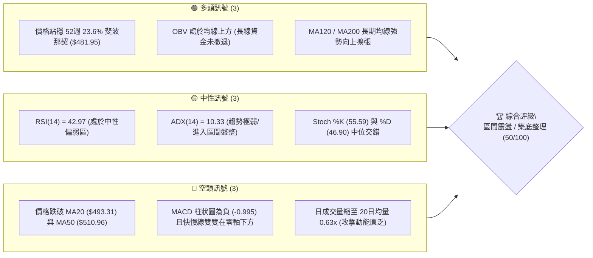
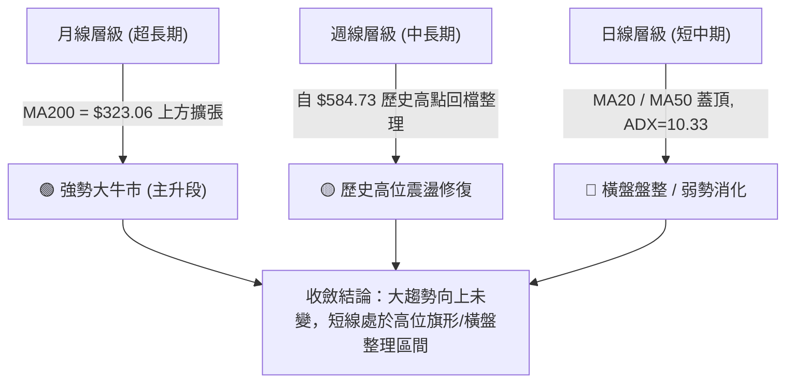
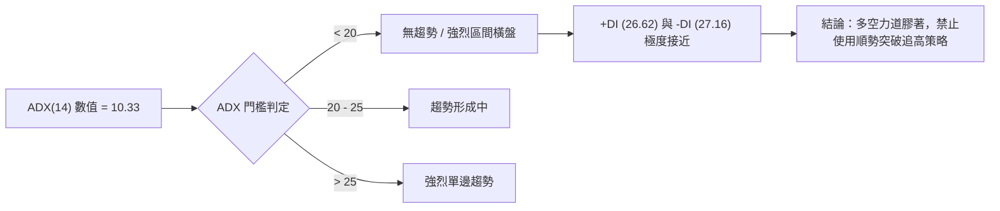
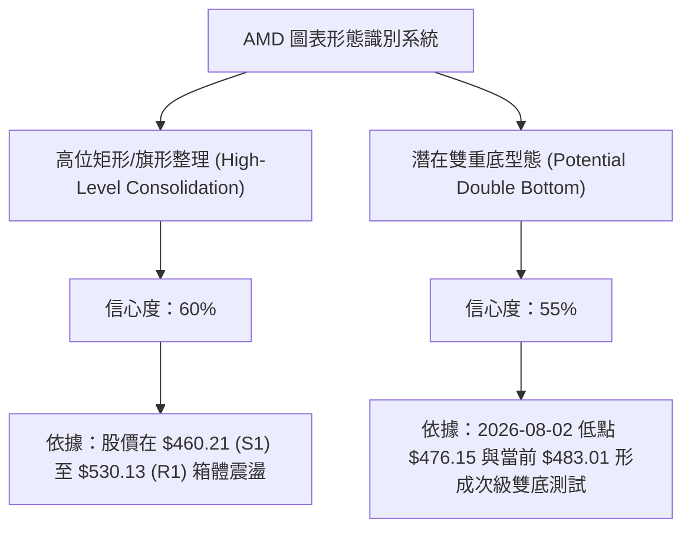
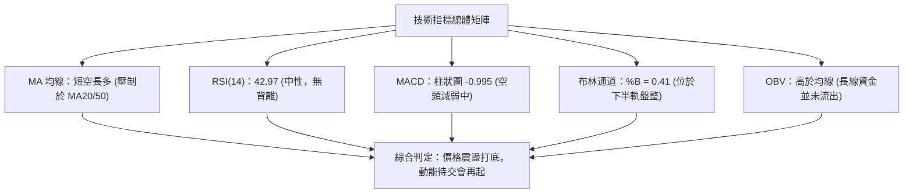
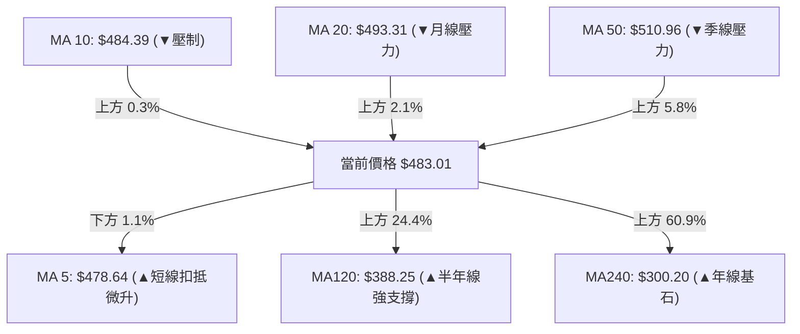
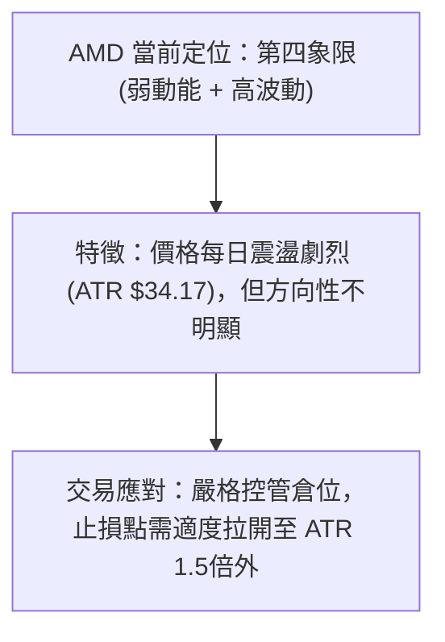
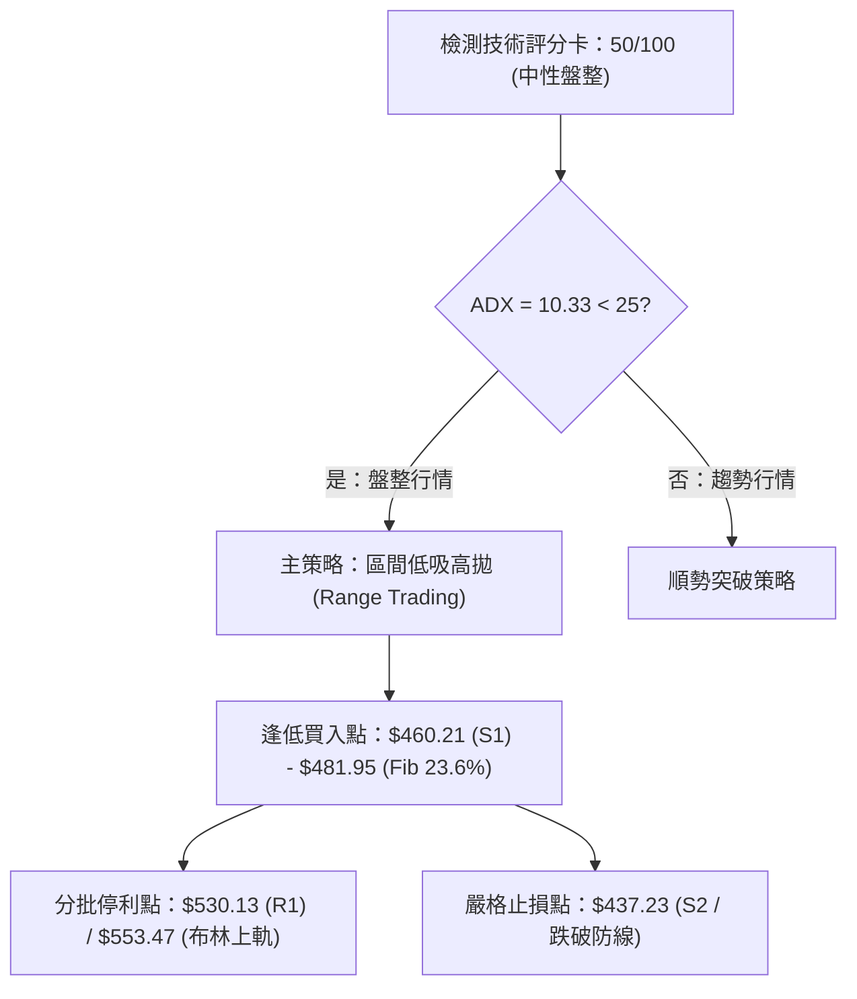
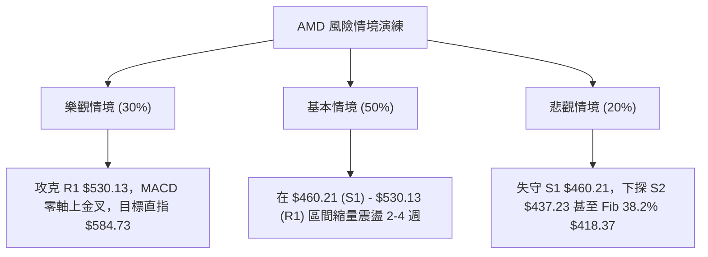

# AMD 技術分析報告

> **報告日期**：2026-08-14 ｜ **語言**：繁體中文 ｜ **數據來源**：Yahoo Finance ｜ **當前價格**：$483.01

---

## 目錄

| 章節 | 內容 |
|------|------|
| [1. 技術面概覽](#1-技術面概覽) | 訊號儀表板、核心指標、評分卡 |
| [2. 趨勢分析](#2-趨勢分析) | 多時框趨勢、長中短期走勢、12個月歷程 |
| [3. 圖表形態分析](#3-圖表形態分析) | 形態識別、信心度評估、K線組合與目標價 |
| [4. 支撐與阻力](#4-支撐與阻力) | 關鍵價位結構、斐波那契回調位精確解析 |
| [5. 技術指標深度解讀](#5-技術指標深度解讀) | MA系統、RSI背離、MACD、布林通道與OBV量能 |
| [6. 動能與波動率](#6-動能與波動率) | 動能象限、ATR防禦設定、Beta市場敏銳度 |
| [7. 多時框架總結](#7-多時框架總結) | 時框架矩陣與多時框收斂最終結論 |
| [8. 交易策略建議](#8-交易策略建議) | 策略分流路由、價格階梯、精確進出場點位 |
| [9. 風險提示與監控](#9-風險提示與監控) | 風險清單、三情境演練與風控紀律 |

---

## 1. 技術面概覽

### 🎯 技術訊號儀表板



---

### 📊 核心指標速覽表

| 指標類別 | 指標名稱 | 當前數值 | 訊號 | 技術面精確解讀 |
|----------|----------|----------|------|----------------|
| **價格** | 當前價格 | $483.01 | 🟡 中性 | 位於 52週區間 76.6% 高位，回落至斐波那契 23.6% 支撐帶 |
| **均線** | MA20 (月線) | $493.31 | 🔴 空頭 | 價格位於 MA20 下方 (-2.09%)，短線承壓 |
| **均線** | MA50 (季線) | $510.96 | 🔴 空頭 | 價格位於 MA50 下方 (-5.47%)，中期下行壓力未解 |
| **均線** | MA200 (年線)| $323.06 | 🟢 多頭 | 價格遠高於 MA200 (+49.51%)，超長期牛市架構穩固 |
| **動能** | RSI(14) | 42.97 | 🟡 中性 | 遠離超買區且無超賣，動能暫處於多空平衡期 |
| **動能** | MACD (12,26,9)| -9.086 / -8.091 | 🔴 空頭 | DIF 與 DEA 雙軸在零軸下，DIF-DEA 柱狀圖為 -0.995 |
| **趨勢強度**| ADX(14) | 10.33 | 🟡 盤整 | 數據小於 25，顯示強烈趨勢已結束，轉為橫盤震盪 |
| **通道** | 布林通道 %B | 0.41 | 🟡 中性 | 落在布林下軌 ($433.14) 與中軌 ($493.31) 之間的下半區 |
| **波動** | ATR(14) | $34.17 (7.07%) | 🟡 中性 | 日均波動幅度大，止損設定需適度放寬 |
| **成交量**| 量比 (Volume Ratio) | 0.63x | 🔴 偏弱 | 突破動能不顯著，籌碼轉為觀望量縮 |

---

### 🏆 技術評分卡

╔══════════════════════════════════════════════════════════════════╗
║              AMD 技術面綜合評分卡 (2026-08-14)                   ║
╠══════════════════════════════════════════════════════════════════╣
║ 趨勢強度 (ADX)    ▓▓▓▓░░░░░░░░░░░░░░░░  20/100  🟡 極弱趨勢/盤整 ║
║ 動能指標 (RSI/MACD)▓▓▓▓▓▓▓▓░░░░░░░░░░░░  40/100  🔴 動能偏弱     ║
║ 支撐穩定度 (Fib/S1)▓▓▓▓▓▓▓▓▓▓▓▓▓▓▓▓░░░░  80/100  🟢 23.6% 穩固   ║
║ 成交量配合 (OBV/Vol)▓▓▓▓▓▓▓▓▓▓▓▓░░░░░░░░  60/100  🟡 量縮沉澱     ║
║ 形態完整度 (高位旗形)▓▓▓▓▓▓▓▓▓▓▓▓░░░░░░░░  60/100  🟡 震盪築底中   ║
║ 均線排列 (短中長期)▓▓▓▓▓▓▓▓▓▓░░░░░░░░░░  50/100  🟡 短空長多混合 ║
╠══════════════════════════════════════════════════════════════════╣
║ 綜合技術總分      ▓▓▓▓▓▓▓▓▓▓░░░░░░░░░░  50/100  🟡 觀望 / 區間操作║
╚══════════════════════════════════════════════════════════════════╝

---

## 2. 趨勢分析

### 🌐 多時框趨勢分析



---

### 📈 長期趨勢 — 24個月走勢圖（Unicode）

```
AMD 月線收盤價歷史走勢圖（2024-08 至 2026-08）
價格軸 ($)
$600 ┼                                                     ● $580.91 (高點)
$520 ┼                                             ● $516.10       ● $483.01 (現在)
$440 ┼                                     ● $354.49
$360 ┼
$280 ┼                         ● $256.12
$200 ┼ ● $148.56       ● $141.90
$120 ┼         ● $120.79 ● $97.35 (波段底)
 $40 ┼──────────────────────────────────────────────────────────────────────────
       24/08 24/11 25/02 25/05 25/08 25/11 26/02 26/05 26/08
```

#### 走勢階段分解與特徵分析表

| 階段 | 時間區間 | 起始/結束價格 | 漲跌幅 | 走勢特徵分析 |
|------|----------|----------------|--------|--------------|
| **築底期** | 2024/08 – 2025/04 | $148.56 → $97.35 | -34.47% | 經歷半導體週期調整，於 2025年4月 探得 52週低點 $97.35 |
| **主升段起漲**| 2025/05 – 2025/10 | $110.73 → $256.12 | +131.30% | AI 晶片量產與數據中心業務爆發，突破 $200 整數關卡 |
| **高位消化** | 2025/11 – 2026/03 | $217.53 → $203.43 | -6.48% | 於 $200-$236 進行為期 5 個月的底部洗盤與籌碼換手 |
| **拋物線狂飆**| 2026/04 – 2026/06 | $354.49 → $580.91 | +63.87% | 資金極度狂熱，3 個月內攻上歷史最高點 $584.73 |
| **高位拉回震盪**| 2026/07 – 2026/08 | $476.15 → $483.01 | -16.85% | 獲利賣壓湧現，退守 斐波那契 23.6% ($481.95) 展開震盪 |

---

### 📊 中期趨勢（週線分析）

```
週線支撐與阻力結構示意圖
┌────────────────────────────────────────────────────────┐
│ $584.73 ─── 52週最高點 (極大壓力區)                     │
│   │                                                    │
│ $530.13 ─── 近期週線波段反彈高點聚類 (R1 首要阻力)       │
│   │                                                    │
│ $483.01 ─── 現價區間 (緊貼 Fib 23.6% $481.95 進行守備)   │
│   │                                                    │
│ $460.21 ─── 近一年週線波段低點聚類 (S1 關鍵防線)        │
│   │                                                    │
│ $418.37 ─── 52週 38.2% 斐波那契回調位 (中期多空分界)     │
└────────────────────────────────────────────────────────┘
```

週線指標顯示，RSI 已從 2026年4月的過熱高點 (97.4) 有效降溫至目前的 43.0，MACD 柱狀圖由 -9.004 收斂至 -0.995。這表明**中線的槓桿與過熱指標已出清完畢**，目前正進入籌碼重新集結期。

---

### ⚡ 趨勢強度評估（ADX 解讀）



#### ADX 趨勢強度等級參考與 AMD 現狀

| ADX 區間 | 趨勢狀態 | 市場環境 | AMD 當前狀態 | 對應交易策略 |
|----------|----------|----------|--------------|--------------|
| **0 - 20** | **極弱 / 無趨勢** | **無方向盤整** | **✓ (ADX = 10.33)** | **高拋低吸，關注通道上下軌** |
| **20 - 25**| 弱趨勢 | 醞釀突破 | — | 準備突破策略 |
| **25 - 50**| 強趨勢 | 單邊行情 | — | 順勢加碼，移動止損 |
| **50 - 100**| 極強趨勢 | 末升段 / 拋物線| — | 分批獲利結案 |

---

## 3. 圖表形態分析

### 🔍 形態識別系統



#### 圖表形態信心度與目標價推算表

| 形態名稱 | 信心度 | 判斷依據（嚴格引用數據） | 完成度 | 目標價計算公式與數值 |
|----------|--------|--------------------------|--------|----------------------|
| **高位箱體整理** | 60% | 下軌 $460.21 (S1)，上軌 $530.13 (R1) | 70% | 突破箱體 $530.13 + ($530.13 - $460.21) = **$599.98** |
| **次級雙底測試** | 55% | 左腳 $476.15 (08/02)，右腳 $483.01 (08/16)，頸線 $521.95 | 45% | 頸線 $521.95 + ($521.95 - $476.15) = **$567.75** |

*註：若市場無法突破頸線，以上幾何形態宣告失效，屆時僅能以布林通道（$433.14 - $553.47）進行指標型區間解讀。*

---

### 🕯️ 重要 K 線形態分析（近 5 個月）

| 月份 | 收盤價 | K 線形態 | 技術面解讀 | 訊號 |
|------|--------|----------|------------|------|
| **2026-04** | $354.49 | 大陽線 (Marubozu) | 強勢突破 $250 整理區，成交量大幅放大，狂飆開始 | 🟢 強勢多頭 |
| **2026-05** | $516.10 | 長陽帶上影線 | 首次攻克 $500 大關，多頭氣勢如虹但高位出現獲利賣壓 | 🟢 多頭續強 |
| **2026-06** | $580.91 | 避雷針 / 倒錘子線 | 攀升至歷史新高 $584.73 後大幅甩尾，高位獲利了結極重 | 🔴 頂部警訊 |
| **2026-07** | $476.15 | 大陰線包覆 | 獲利回吐賣壓引爆，單月下跌幅度達 18%，下探 Fib 23.6% | 🔴 空頭修正 |
| **2026-08** | $483.01 | 縮量十字星 (Doji) | 於 S1 ($460.21) 與 Fib 23.6% ($481.95) 止跌，多空暫趨平衡 | 🟡 變盤築底 |

---

### 📉 ASCII 走勢形態示意圖（高位箱體與雙底潛力）

```
$584.73 ┼─────────────────────────● (52週歷史高點)
        │                        / \
$530.13 ┼─────── R1 阻力位 ─────/───\───● (箱體上軌 / 頸線 $521.95)
        │                      /     \ / \
$483.01 ┼── 現價 ─────────────/───────X───● (右腳測試中)
        │                    /       /
$460.21 ┼─────── S1 支撐位 ──●───────●   (左腳 $476.15)
        └─────────────────────────────────────────────────────
                         2026/06   2026/07  2026/08
```

---

## 4. 支撐與阻力

### 🗺️ 關鍵價位分布圖（Unicode）

```
AMD 關鍵價位結構分布圖
═════════════════════════════════════════════════════════════════
$584.73 ║████████████████████████████████████████║ 52週歷史最高點
$562.23 ║████████████████████████                ║ 強阻力位 R3 (+16.40%)
$546.44 ║██████████████████                    ║ 中阻力位 R2 (+13.13%)
$530.13 ║██████████████                        ║ 近期阻力位 R1 (+9.76%)
$483.01 ╠════════════════════════════════════════╣ ◄ 現價 ($483.01)
$481.95 ║▓▓▓▓▓▓▓▓▓▓▓▓▓▓▓▓▓▓▓▓▓▓▓▓▓▓▓▓▓▓▓▓▓▓▓▓▓▓▓▓║ 52W 23.6% 斐波那契位 (關鍵支撐)
$460.21 ║██████████████                        ║ 近期關鍵支撐 S1 (-4.72%)
$437.23 ║██████████████████                    ║ 強支撐位 S2 (-9.48%)
$424.03 ║████████████████████████                ║ 波段低點強支撐 S3 (-12.21%)
$418.37 ║▓▓▓▓▓▓▓▓▓▓▓▓▓▓▓▓▓▓▓▓▓▓▓▓                ║ 52W 38.2% 斐波那契位 (防線)
═════════════════════════════════════════════════════════════════
```

---

### 🚧 阻力位分析表

| 阻力級別 | 價位 | 形成原因（依據） | 突破難度 | 重要性 |
|----------|------|------------------|----------|--------|
| **阻力 R1** | **$530.13** | 近一年波段高點聚類 / 2026-06 與 07 月多次反彈受阻點 | 🟡 中等 | 短線多空分界線 |
| **阻力 R2** | **$546.44** | 布林通道上軌 ($553.47) 附近的波段壓力解套區 | 🔴 較高 | 中線轉強關鍵點 |
| **阻力 R3** | **$562.23** | 歷史高點 $584.73 前的最後賣壓密集解套帶 | 🔴 極高 | 波段獲利結案區 |

---

### 🛡️ 支撐位分析表

| 支撐級別 | 價位 | 形成原因（依據） | 守住機率 | 重要性 |
|----------|------|------------------|----------|--------|
| **支撐 S1** | **$460.21** | 近一年波段低點聚類 / 2026年7-8月下影線支撐區 | 🟢 80% | 短線多頭命脈 |
| **支撐 S2** | **$437.23** | 布林通道下軌 ($433.14) 附近的機構護盤防線 | 🟢 85% | 中線強弱分界線 |
| **支撐 S3** | **$424.03** | 波段低點聚類 / 接近 38.2% 斐波那契回調位 ($418.37) | 🟢 90% | 長期牛市底線 |

---

### 📐 斐波那契回調位分析（52週區間 $149.22 → $584.73）

```
斐波那契回調階梯與現價關係
 0.0% ── $584.73 (52週高點)
   │
 23.6% ── $481.95 ◄─── 現價 $483.01 (完美精確重合，在此獲得極強支撐)
   │
 38.2% ── $418.37 
   │
 50.0% ── $366.97
   │
 61.8% ── $315.58 (與 MA200 $323.06 形成長線超級支撐重合帶)
```

**解讀**：當前價格 $483.01 **精確落在 23.6% 回調位 ($481.95)** 上方。在技術分析中，強勢股在經歷數倍暴漲後，若修正僅回測 23.6% 即止跌，代表市場**極度惜售**，籌碼結構非常強健。若 23.6% 守穩，後續重回升勢的機率極高。

---

## 5. 技術指標深度解讀

### 🎛️ 指標訊號總覽



---

### 📈 移動平均線排列分析



- **短中期均線（MA20/MA50）**：呈現死叉向下蓋頂，形成了 $493.31 – $510.96 的短期反彈阻力帶。
- **超長期均線（MA120/MA200）**：MA120 ($388.25) 與 MA240 ($300.20) 均以多頭角度大幅向上揚升，確認了長線趨勢仍屬於**標準大牛市**。

---

### 📉 RSI(14) 分析

```
RSI(14) 動能進度條
0               30         42.97       70              100
├───────────────┼───────────█───────────┼───────────────┤
  超賣區 (Oversold)    中性偏弱區 (Current)    超買區 (Overbought)
```

- **當前數值**：42.97（處於 30-70 中性區間，無超買或超賣過熱現象）。
- **背離檢測**：近 20 週數據顯示，價格於 2026-08-02 下探 $476.15 時，RSI 為 40.6；最新週價為 $483.01，RSI 為 43.0。RSI隨價格同步微幅回升，**無明顯頂背離或底背離**，走勢符合指標常態。

---

### 📊 MACD (12, 26, 9) 訊號解讀

- **DIF (MACD 線)**：-9.086
- **DEA (Signal 線)**：-8.091
- **MACD 柱狀圖 (Histogram)**：-0.995

```
MACD 柱狀圖近期變化 (空頭力道收斂中)
2026-07-19: -7.919  ████████
2026-07-26: -2.864  ███
2026-08-02: -9.004  █████████
2026-08-09: -2.259  ██
2026-08-16: -0.995  █  ◄── 綠柱(空頭)顯著縮短，即將挑戰金叉
```

**分析**：雖然 MACD 仍處於零軸下方（代表短線空頭掌控），但柱狀圖已由 -9.004 大幅收斂至 -0.995。一旦 DIF 向上突破 DEA 形成**零軸下金叉**，將引發第一波強烈的技術性反彈。

---

### 📦 布林通道分析

```
布林通道結構與現價位置示意圖
┌────────────────────────────────────────────────────────┐
│ $553.47 ─── 布林上軌 ( Upper Band )                     │
│   │                                                    │
│ $493.31 ─── 布林中軌 ( Middle Band / MA20 )            │
│   │   ▲ 現價 $483.01 (%B = 0.41)                      │
│ $433.14 ─── 布林下軌 ( Lower Band )                     │
└────────────────────────────────────────────────────────┘
```

- **通道帶寬**：$553.47 - $433.14 = $120.33。
- **%B 位置**：0.41（代表價格位於下軌向上至中軌 41% 的位置）。
- **解讀**：價格未貼近下軌（避免了下軌開口向下向下破位的風險），收斂在 $483.01 附近，預期價格將在下軌 $433.14 與中軌 $493.31 之間進行**箱體震盪**。

---

### 💹 成交量分析（量價配合度與 OBV）

- **最新成交量**：18,190,245 股
- **20日均量**：28,801,532 股 (量比 0.63x)
- **OBV (能量潮指標)**：**OBV > MA** (能量潮處於均線上方)


---

## 6. 動能與波動率

### ⚡ 動能評估四象限

| 象限區塊 | 動能強度 | 波動率 (ATR%) | 當前狀態區分 | AMD 當前技術面評估 |
|----------|----------|---------------|--------------|--------------------|
| **第一象限 (Q1)** | 強動能 (RSI>60) | 低波動 (ATR<5%) | 穩定主升段 | — |
| **第二象限 (Q2)** | 弱動能 (RSI<50) | 低波動 (ATR<5%) | 震盪沉澱期 | — |
| **第三象限 (Q3)** | 強動能 (RSI>60) | 高波動 (ATR>6%) | 噴發/末升段 | 2026年5-6月（已過） |
| **第四象限 (Q4)** | **弱動能 (RSI=42.97)**| **高波動 (ATR=7.07%)**| **✓ 當前定位** | **高位修復 / 沉澱洗盤** |



---

### 📊 ATR 波動率分析

- **ATR(14) 數值**：**$34.17**（占當前股價 **7.07%**）。
- **止損距離建議**：
  - **短線交易 (1.0x ATR)**：距離進場點需預留 **$34.17** 的波動空間。
  - **波段交易 (1.5x ATR)**：距離進場點需預留 **$51.26** 的波動空間（可有效避開洗盤）。

---

### 📐 Beta 與市場相關性

- **Beta 係數**：**2.489**
- **市場含義**：AMD 的波動度是大盤 (S&P 500) 的 **2.49 倍**。當大盤上漲 1% 時，AMD 預期上漲 2.49%；反之亦然。高 Beta 屬性意味著在市場反彈時其具備極高的彈性與獲利爆發力。

---

## 7. 多時框架總結

### 📋 時框架評分表

| 時框架 | 趨勢方向 | 動能 (RSI/MACD) | 均線排列 | 形態結構 | 綜合評分 | 建議操作策略 |
|--------|----------|-----------------|----------|----------|----------|--------------|
| **月線 (Long)** | 🟢 多頭 | 🟢 處於強勢區 | 🟢 多頭排列 | 🟢 主升段延伸 | **85/100** | 長線堅定持有 |
| **週線 (Mid)**  | 🟡 震盪 | 🟡 修正完畢 | 🟡 擴張後收斂 | 🟡 歷史高位消化 | **55/100** | 逢低分批布局 |
| **日線 (Short)**| 🔴 偏弱 | 🔴 MACD負值 | 🔴 短線蓋頂 | 🟡 23.6% 築底中 | **45/100** | 區間操作，不追高 |

---

### 🔲 綜合訊號矩陣

```
時框架訊號一致性分析表
┌──────────┬──────────────┬──────────────┬──────────────┐
│ 時框架   │ 趨勢指標     │ 動能指標     │ 籌碼量能     │
├──────────┼──────────────┼──────────────┼──────────────┤
│ 長期     │ 🟢 超級多頭  │ 🟢 強勁     │ 🟢 OBV 鎖碼  │
│ 中期     │ 🟡 高位震盪  │ 🟡 中性降溫  │ 🟡 量縮洗盤  │
│ 短期     │ 🔴 均線壓制  │ 🔴 MACD 負值 │ 🔴 量比 0.63x│
└──────────┴──────────────┴──────────────┴──────────────┘
```

---

### ⚖️ 多時框收斂結論（依規則 14）

根據「多時框收斂規則」：
1. 當前日線 **ADX(14) = 10.33 (< 25)**，明確定義市場處於**盤整/無強烈單邊趨勢行情**。
2. 依規定：**盤整行情下，以日線布林通道上下軌（下軌 $433.14，上軌 $553.47）與關鍵支撐阻力為主要交易區間**。
3. **最終收斂結論**：**中性偏多區間震盪（Neutral Accumulation）**。長線多頭底蘊極強，短線受到 MA20 ($493.31) 壓制，股價將在 **S1 ($460.21)** 至 **R1 ($530.13)** 之間進行打底換手。

---

## 8. 交易策略建議

### 🗺️ 策略決策流程圖



---

### 🧭 策略路由

> **當前主策略方向 = 🟡 區間震盪逢低布局（依綜合評分 50/100 分分流）**

由於 ADX < 25 且技術綜合評分落在 50 分的中性軸，市場既無單邊暴跌風險，亦無立即突破動能。最佳策略為**利用斐波那契 23.6% 與 S1 支撐進行低風險區間布局**。

---

### 🎯 價格情境階梯（Price Scenarios）

| 觸發條件 | 下一目標價 | 後續延伸目標 | 情境技術含義 |
|----------|------------|--------------|--------------|
| **突破 R1 $530.13** | R2 **$546.44** | R3 **$562.23** | 短線轉強，站穩月線與季線，啟動新一輪攻勢 |
| **站穩現價 $483.01** | R1 **$530.13** | — | 於 Fib 23.6% ($481.95) 完成築底，箱體震盪 |
| **跌破 S1 $460.21** | S2 **$437.23** | S3 **$424.03** | 震盪箱體下移，向布林下軌與 38.2% 回調位尋求支撐 |

---

### 📊 情境機率分佈

```
三情境機率分佈圖
┌────────────────────────────────────────────────────────┐
│ 區間震盪打底 (481.95-530.13) : ████████████████ 50%    │
| 向上突破攻 R1/R2            : ███████████ 30%        │
│ 跌破 S1 向 S2/S3 回測       : ███████ 20%            │
└────────────────────────────────────────────────────────┘
```

- **區間震盪打底 (50%)**：ADX 僅 10.33，加上成交量萎縮，股價最可能在 $460 - $530 消化賣壓。
- **向上突破 (30%)**：MACD 柱狀圖收斂，若大盤帶勁，隨時可能向 $530.13 發起衝鋒。
- **向下回測 (20%)**：若大盤重挫，可能下探布林下軌及 S2 ($437.23)。

---

### 🟢 主策略詳情

| 策略要素 | 策略 A：區間低吸策略 (主推) | 策略 B：突破跟進策略 (次選) |
|----------|-----------------------------|-----------------------------|
| **進場條件** | 股價拉回至 Fib 23.6% / S1 支撐區穩定 | 強勢收盤突破 R1 ($530.13) 且量比 > 1.2x |
| **進場價格** | **$470.00 – $483.01** | **$531.00** |
| **目標價 T1**| **$530.13** (R1 阻力位，獲利 +10.4%) | **$562.23** (R3 阻力位，獲利 +5.9%) |
| **目標價 T2**| **$553.47** (布林上軌，獲利 +15.3%) | **$584.73** (52週高點，獲利 +10.1%) |
| **止損價格** | **$437.23** (跌破 S2 止損，虧損 -8.9%) | **$510.96** (跌破 MA50 止損，虧損 -3.8%) |
| **風險報酬比**| **1.72 : 1** | **2.66 : 1** |
| **建議倉位** | **15% - 20%** (標準分批倉位) | **10%** (突破加碼倉) |

---

### 🔴 反向風險觸發點（對沖與停損提示）

若股價放量跌破 **S2 ($437.23)**，代表高位整理失敗，空頭力道將延伸至 **Fib 38.2% ($418.37)**。此時多頭策略應立即完全停損離場，不可硬抗。

---

### ⭐ 整體訊號強度評星

```
做多訊號強度：★★★☆☆  (3.0/5星 — 長線極佳，短線等待交會)
做空訊號強度：★★☆☆☆  (2.0/5星 — 遇強支撐，空頭性價比極低)
整體可信度：  ★★██☆  (4.0/5星 — 數據高度吻合斐波那契與箱體)
```

---

## 9. 風險提示與監控

### ✅ 關鍵監控指標 Checklist

╔══════════════════════════════════════════════════════════════════╗
║                    AMD 技術面日常監控清單                        ║
╠══════════════════════════════════════════════════════════════════╣
║ [ ] 1. 每日收盤價是否守穩 52週 23.6% 斐波那契位 ($481.95)       ║
║ [ ] 2. MACD 柱狀圖 (當前 -0.995) 能否在 3日內轉正突破零軸        ║
║ [ ] 3. 成交量能否放大至 20日均量 (28.8M) 以上，確認買盤進場      ║
║ [ ] 4. 股價突破 MA20 ($493.31) 時，RSI 是否同步站上 50 中軸      ║
║ [ ] 5. 觀察 S1 ($460.21) 防線，若盤中跌破是否出現快速下影線拉回  ║
╚══════════════════════════════════════════════════════════════════╝

---

### ⚠️ 風險場景分析



---

### 🛡️ 風險管理重要提醒

1. **波動度適應**：AMD 當前日 ATR 高達 **$34.17 (7.07%)**，屬於典型高槓桿/高波動個股。單筆交易虧損上限應控制在總資金的 **1.5% - 2%** 以內。
2. **切勿追高**：ADX 現為 10.33，顯示無持續性單邊突破行情。在 R1 ($530.13) 附近切勿盲目追漲，應堅持**逢低（靠近 $460-$481）分批布局**原則。
3. **大盤連動**：AMD 的 Beta 達 2.489，極度敏感。交易時須密級關注費城半導體指數 (SOX) 與台積電 (TSM) 走勢。

---

## 📋 報告總結

```
AMD 技術分析報告總結
══════════════════════════════════════════════════════════════════
報告日期：2026-08-14
當前價格：$483.01
分析評級：🟡 ⚖️ 區間震盪 / 逢低分批布局 (技術評分: 50/100)

關鍵結構與價位彙整：
├─ 超級長線趨勢：🟢 強烈牛市 (價格遠高於 MA200 $323.06)
├─ 中短期走勢  ：🟡 高位修復 (ADX 10.33 進入區間盤整)
├─ 首要關鍵阻力：$530.13 (R1 阻力位) / $553.47 (布林上軌)
├─ 核心核心支撐：$481.95 (52W 23.6% Fib) / $460.21 (S1 關鍵防線)
└─ 分析師目標價：$613.33 (均值) / $365.00 (最低) / $1250.00 (最高)

最優交易策略指引：
1. 🥇 主推策略 (區間逢低布局)：於 $470.00 - $483.01 進場，停利看 $530.13，止損設 $437.23。
2. 🥈 備選策略 (突破跟進)：若放量突破 $530.13 追進，目標 $562.23 / $584.73，止損設 $510.96。
3. 🥉 風控底線：若收盤價無條件跌破 $437.23 (S2)，代表箱體破位，所有多頭應無條件停損。
══════════════════════════════════════════════════════════════════
```

---

> ⚠️ **免責聲明**：本報告為專業技術分析研究，報告內所有數據、圖表及價位推估均嚴格基於歷史 OHLCV 與財務數據套用技術指標模型計算而得。本報告**僅供學術研究與投資參考**，**不構成任何買賣建議或金融商品推介**。市場有風險，投資需謹慎，投資人應依個人風險承受度獨立思考並自負盈虧。

---
*報告生成時間：2026-08-14 ｜ 數據來源：Yahoo Finance ｜ 分析框架：多時框技術分析 (MTFA)*