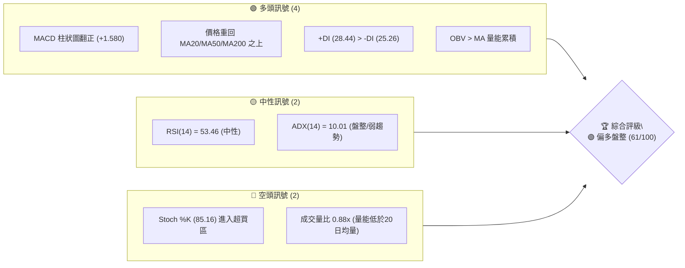
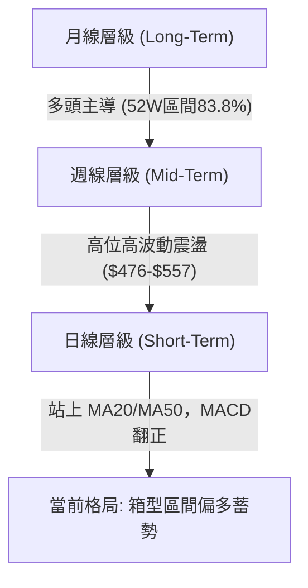
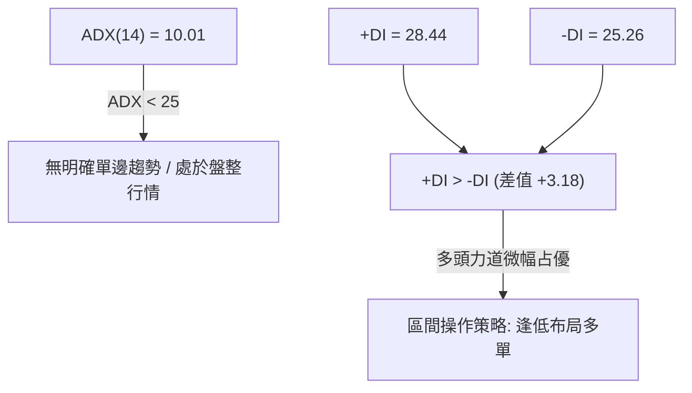
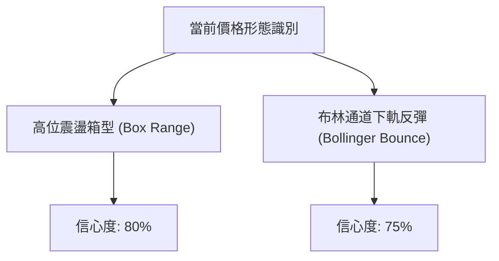
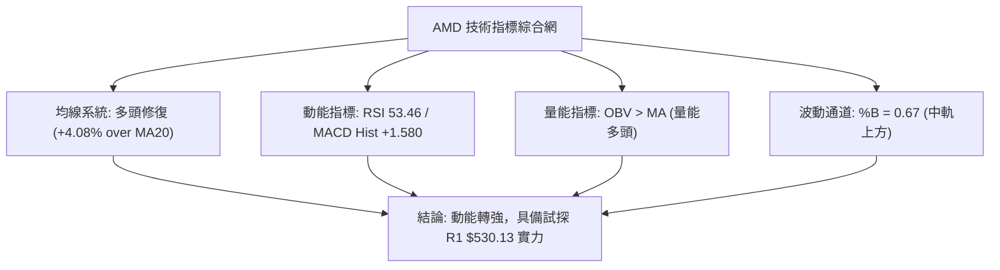
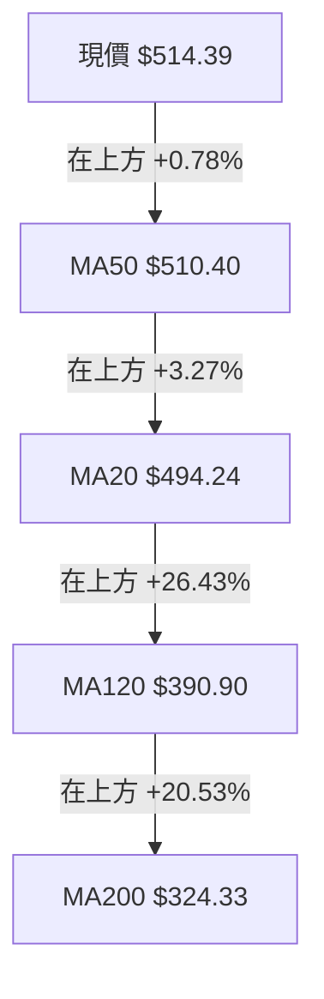
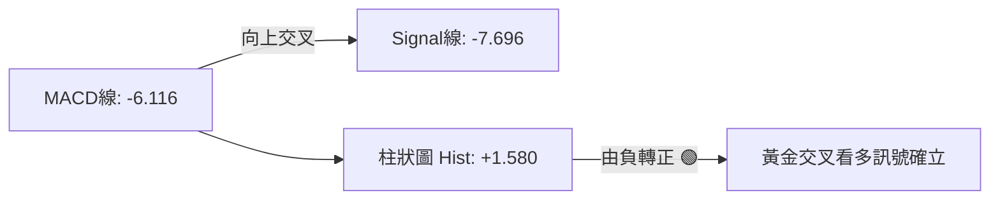
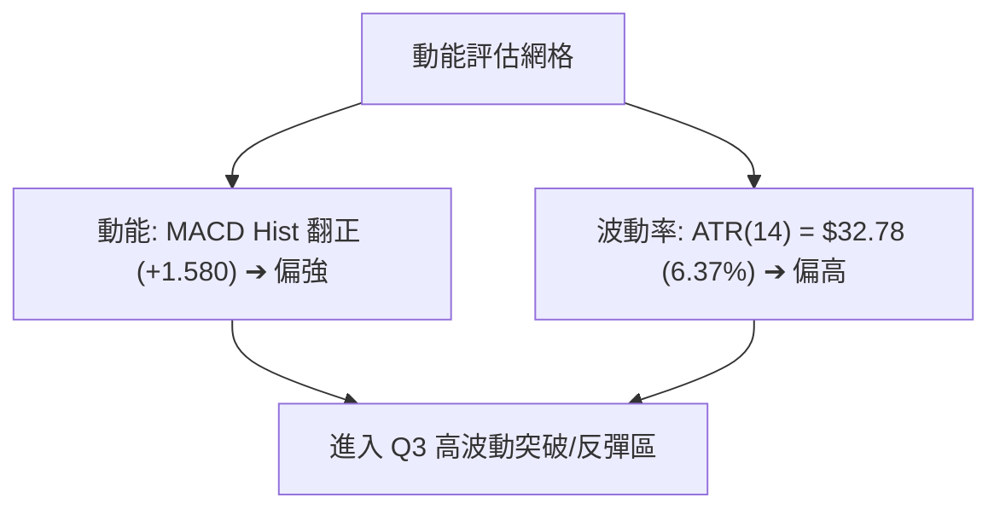
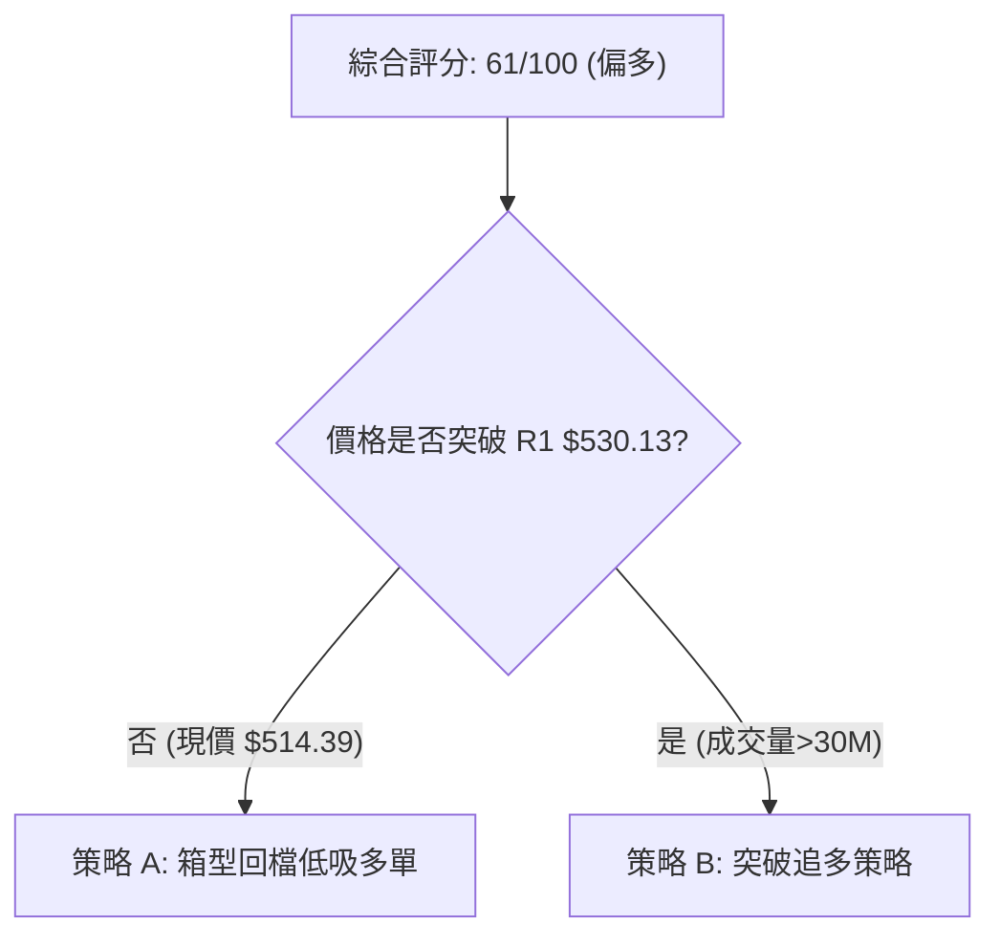
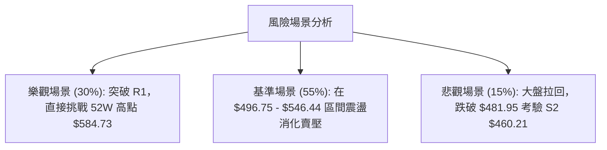

# AMD 技術分析報告

> **報告日期**：2026-08-15 ｜ **語言**：繁體中文 ｜ **數據來源**：Yahoo Finance ｜ **當前價格**：$514.39

---

## 目錄

| 章節 | 內容 |
|------|------|
| [1. 技術面概覽](#1-技術面概覽) | 訊號儀表板、核心指標、評分卡 |
| [2. 趨勢分析](#2-趨勢分析) | 多時框趨勢、長中短期走勢 |
| [3. 圖表形態分析](#3-圖表形態分析) | 形態識別、K線組合、目標價 |
| [4. 支撐與阻力](#4-支撐與阻力) | 關鍵價位、斐波那契回調 |
| [5. 技術指標深度解讀](#5-技術指標深度解讀) | MA/RSI/MACD/布林/成交量 |
| [6. 動能與波動率](#6-動能與波動率) | 動能評估、ATR、Beta |
| [7. 多時框架總結](#7-多時框架總結) | 時框架評分矩陣 |
| [8. 交易策略建議](#8-交易策略建議) | 多空策略、風險報酬比 |
| [9. 風險提示與監控](#9-風險提示與監控) | 監控指標、風險場景 |

---

## 1. 技術面概覽

### 🎯 技術訊號儀表板



### 📊 核心指標速覽表

| 指標類別 | 指標名稱 | 當前數值 | 訊號 | 解讀 |
|----------|----------|----------|------|------|
| **價格** | 當前價格 | $514.39 | 🟢 多頭 | 位於 52 週區間 83.8% 高位，突破短線震盪區 |
| **均線** | MA20 | $494.24 | 🟢 多頭 | 價格位於 MA20 上方 (+4.08%)，短線支撐確立 |
| **均線** | MA50 | $510.40 | 🟢 多頭 | 價格收復 MA50 上方 (+0.78%)，中期趨勢修復 |
| **均線** | MA200 | $324.33 | 🟢 多頭 | 價格遠高於 MA200 (+58.59%)，長期牛市架構完整 |
| **動能** | RSI(14) | 53.46 | 🟡 中性 | 無超買超賣，具備向上續航空間 |
| **動能** | MACD | -6.116 / Hist +1.580 | 🟢 多頭 | 柱狀圖轉正，多頭動能開始交叉復甦 |
| **波動** | ATR(14) | $32.78 (6.37%) | 🟡 中性 | 日均波動擴大，需配置充足止損空間 |

### 🏆 技術評分卡

```
╔══════════════════════════════════════════════════════════════════╗
║                技術評分卡 — AMD (2026-08-15)                     ║
╠══════════════════════════════════════════════════════════════════╣
║ 趨勢強度      ▓▓▓▓░░░░░░░░░░░░░░░░  40/100  🟡 ADX=10.01 弱趨勢     ║
║ 動能指標      ▓▓▓▓▓▓▓▓▓▓▓▓▓░░░░░░░  65/100  🟢 MACD轉正/RSI中性     ║
║ 支撐穩定度    ▓▓▓▓▓▓▓▓▓▓▓▓▓▓▓░░░░░  75/100  🟢 S1及Fib 23.6%守穩   ║
║ 成交量配合    ▓▓▓▓▓▓▓▓▓▓▓▓░░░░░░░░  60/100  🟡 稍低於均量，OBV支撐  ║
║ 形態完整度    ▓▓▓▓▓▓▓▓▓▓▓▓▓░░░░░░░  65/100  🟢 高位箱型震盪打底     ║
║ 均線排列      ▓▓▓▓▓▓▓▓▓▓▓▓░░░░░░░░  60/100  🟡 混合排列，多頭重新修復║
╠══════════════════════════════════════════════════════════════════╣
║ 綜合評分      ▓▓▓▓▓▓▓▓▓▓▓▓░░░░░░░░  61/100  🟢 偏多盤整蓄勢         ║
╚══════════════════════════════════════════════════════════════════╝
```

---

## 2. 趨勢分析

### 🌐 多時框趨勢分析



### 📈 長期趨勢 — 12個月走勢圖（Unicode）

```
AMD 月線走勢圖（2025-09 至 2026-08）
價格軸 ($)
$600 ┼                                   ● $580.91 (高點 2026-06)
$525 ┼                                  ╱ ╲  ● $514.39 (現在 2026-08)
$450 ┼                             ●───╱   ╲╱
$375 ┼                       ●    ╱
$300 ┼                 ●    ╱    ╱
$225 ┼            ●   ╱ ╲  ╱    ╱
$150 ┼ ●    ●    ╱ ╲─╱   ╲╱    ╱
$075 ┼  ╲  ╱ ╲  ╱
     └─┴──┴──┴──┴──┴──┴──┴──┴──┴──┴──┴──┴──────────────────
       09 10 11 12 01 02 03 04 05 06 07 08 (月份)
```

**走勢特徵分析表格**：

| 階段 | 時間區間 | 起始價 ➔ 終點價 | 漲跌幅 | 趨勢特徵分析 |
|------|----------|------------------|--------|--------------|
| **1. 底部築底** | 2025-08 ~ 2025-09 | $148.56 ➔ $161.79 | +8.90% | 在 $100 區間完成築底後拉升，打下中期支撐基礎 |
| **2. 初段爆發** | 2025-10 ~ 2026-01 | $256.12 ➔ $236.73 | -7.57% | 爆發突破至 $256 高點後進入三個月橫盤消化獲利賣壓 |
| **3. 主升段衝刺** | 2026-02 ~ 2026-06 | $200.21 ➔ $580.91 | **+190.15%** | 強勢主升段，伴隨市場對 AI 晶片需求爆發，創 52 週新高 |
| **4. 高位洗盤** | 2026-07 ~ 2026-08 | $476.15 ➔ $514.39 | +8.03% | 自高點修正至 23.6% 斐波那契位 ($481.95) 後強勢反彈 |

### 📊 中期趨勢（週線分析）

從近 20 週數據觀察，價格在 2026 年 6 月初觸及 $580.91 高點後進入高位震盪。近四周收盤分別為 $495.76 ➔ $521.95 ➔ $476.15 ➔ $514.39，呈現明確的**區間洗盤震盪**。關鍵支持區落在 $476-$482（斐波那契 23.6% 回調位 $481.95），而上檔壓力則在 $537-$557。

### ⚡ 趨勢強度評估（ADX 解讀）



| 指標 | 數值 | 狀態 | 市場含義 |
|------|------|------|----------|
| **ADX(14)** | 10.01 | 🔴 弱趨勢 | 市場缺乏強烈單邊動能，屬於典型高位震盪箱型 |
| **+DI** | 28.44 | 🟢 買盤主導 | 買方控制力稍微高於賣方 |
| **-DI** | 25.26 | 🟡 賣盤對峙 | 賣壓依然存在，但未能掌控大局 |

---

## 3. 圖表形態分析

### 🔍 形態識別系統



**形態信心度與目標價計算**：

| 形態類別 | 信心度 | 判斷依據（引用數據） | 完成度 | 目標價（附計算式） |
|----------|--------|----------------------|--------|--------------------|
| **高位箱型整理** | **80%** | 價格多次在 S1 ($496.75) 與 Fib 23.6% ($481.95) 取得支撐，並於 R1 ($530.13)/R2 ($546.44) 受阻 | 85% | 突破箱頂 R1 $530.13 + 箱高 ($530.13 - $481.95 = $48.18) = **$578.31** |
| **布林下軌支撐反彈**| **75%** | 價格跌至接近下軌 $433.34（最低至 $476.15）後收復中軌 $494.24 | 90% | 上軌目標價 **$555.14** (直接引用布林上軌數據) |

### 🕯️ 重要K線形態分析

| 日期/週別 | 收盤價 | K線形態 | 解讀 | 訊號 |
|-----------|--------|---------|------|------|
| **2026-08-02** | $476.15 | 長下影陰線 | 回測 52W 23.6% 斐波位 $481.95 探底成功 | 🔴 短線超跌 |
| **2026-08-09** | $483.36 | 小陽星（鎚子線） | 止跌打底，多方開始嘗試試探買盤 | 🟡 止跌訊號 |
| **2026-08-16** | $514.39 | 中長陽線 | 強勢反彈突破 MA20 ($494.24) 與 MA50 ($510.40) | 🟢 強勢反轉 |

### 📉 ASCII 走勢形態示意圖

```
AMD 高位箱型整理與布林通道關係示意圖
$584.73 ┤-------------------------------------- (52W High / Fib 0.0%)
$555.14 ┤ - - - - - - - - - - - - - - - - - - - (BB 上軌)
$530.13 ┤====================================== [阻力 R1 / 箱頂]
$514.39 ┤                    ● (現價)
$494.24 ┤-------------------●------------------ (MA20 / BB 中軌)
$481.95 ┤====================================== [Fib 23.6% / 箱底]
$433.34 ┤ - - - - - - - - - - - - - - - - - - - (BB 下軌)
```

### 🎯 形態目標價計算

1. **箱型突破目標價**：
   $$\text{目標價} = \text{箱頂 } R1 + (\text{箱頂 } R1 - \text{箱底 Fib 23.6\%})$$
   $$\text{目標價} = 530.13 + (530.13 - 481.95) = 530.13 + 481.95 \text{ 差值 } (48.18) = \$578.31$$
2. **布林上軌目標價**：直接引用布林上軌 **$555.14**。

---

## 4. 支撐與阻力

### 🗺️ 關鍵價位分布圖（Unicode）

```
AMD 價位結構分布圖 (現價: $514.39)
══════════════════════════════════════════════════════════
$584.73 ║██████████████████████████████  52W 最高價 / Fib 0.0%
$562.23 ║████████████████████████        強阻力 R3 (+9.30%)
$546.44 ║██████████████████              阻力 R2 (+6.23%)
$530.13 ║████████████                    關鍵阻力 R1 (+3.06%)
$514.39 ╠═══════════════════════════════ ◄ 當前價格 $514.39
$496.75 ║▓▓▓▓▓▓▓▓▓▓▓▓                    近期支撐 S1 (-3.43%)
$481.95 ║▓▓▓▓▓▓▓▓▓▓▓▓▓▓▓▓                斐波那契 23.6% 回調位
$460.21 ║████████████████████            強支撐 S2 (-10.53%)
$437.23 ║████████████████████████        關鍵支撐 S3 (-15.00%)
$418.37 ║████████████████████████████    斐波那契 38.2% 回調位
══════════════════════════════════════════════════════════
```

### 🚧 阻力位分析表

| 阻力級別 | 價位 | 形成原因 | 突破難度 | 重要性 |
|----------|------|----------|----------|--------|
| **R1** | **$530.13** | 近一年波段高點聚類 / 箱型上緣 | 🟡 中等 | ★★★★☆ 短線多空分水嶺 |
| **R2** | **$546.44** | 近一年波段高點聚類 / 7月解套盤壓力 | 🔴 偏難 | ★★★★☆ 中期推進關鍵 |
| **R3** | **$562.23** | 近一年波段高點聚類 / 接近布林上軌區間 | 🔴 困難 | ★★★★★ 強力心理關卡 |

### 🛡️ 支撐位分析表

| 支撐級別 | 價位 | 形成原因 | 守住機率 | 重要性 |
|----------|------|----------|----------|--------|
| **S1** | **$496.75** | 近一年波段低點聚類 / 接近 MA20 ($494.24) | 🟢 極高 | ★★★★☆ 短線第一防線 |
| **S2** | **$460.21** | 近一年波段低點聚類 / 接近 8月初探底低點 | 🟢 高 | ★★★★★ 中期結構防線 |
| **S3** | **$437.23** | 近一年波段低點聚類 / 接近布林下軌 ($433.34) | 🟢 極高 | ★★★★★ 長期多頭命脈 |

### 📐 斐波那契回調位分析

依據 52 週高點 $584.73 至低點 $149.22 計算：

| 回調比例 | 價位 | 當前價位相對位置與意義 |
|----------|------|------------------------|
| **0.0% (52W High)** | **$584.73** | 歷史頂部壓力 |
| **23.6%** | **$481.95** | **當前關鍵守備區**（現價 $514.39 位於 23.6% 支撐之上） |
| **38.2%** | **$418.37** | 深縮回調關鍵支撐（若跌破 S3 才會考驗） |
| **50.0%** | **$366.97** | 中期牛熊分界點 |
| **61.8%** | **$315.58** | 接近 MA200 ($324.33)，極強防禦位 |
| **100.0% (52W Low)**| **$149.22** | 52 週最低點 |

*解讀*：當前價格落在 0.0% ($584.73) 與 23.6% ($481.95) 之間，顯示股價依然維持在超強勢區間。

---

## 5. 技術指標深度解讀

### 🎛️ 指標訊號總覽



### 📈 移動平均線排列分析



*排列評估*：當前價格收復 MA20 與 MA50，呈現短中期多頭重整。均線系統屬於「中長期絕對多頭（MA200向上），短期黃金交叉形成中」的混合看多型態。

### 📉 RSI(14) 分析

$$\text{RSI(14)} = 53.46 \quad \text{███████████░░░░░░░░░ 53.46\% (中性區間)}$$

- **超買/超賣判斷**：位於 53.46，遠離超賣 (<30) 與超買 (>70) 區，極具向上發揮空間。
- **背離分析**：近 4 週價格由 $476.15 升至 $514.39，RSI 由 40.6 升至 53.5，價格與 RSI 同步上升，**無明顯背離現象**，確認當前反彈為真實買盤推進。

### 📊 MACD(12/26/9) 訊號解讀



- **解讀**：雖然 MACD 主線仍在零軸下方（-6.116），但柱狀圖 (+1.580) 已連續收窄並翻正，發出強烈的**零軸下方黃金交叉買入訊號**，屬於典型的跌深反轉訊號。

### 📦 布林通道分析

```
布林通道現狀 (BB Width: $121.80)
$555.14 ┼--------------------------------------- 布林上軌
        │
$514.39 ┼───────────────────●────────────────── 現價 (%B = 0.67)
        │
$494.24 ┼─────────────────────────────────────── 布林中軌 (MA20)
        │
$433.34 ┼--------------------------------------- 布林下軌
```

*解讀*：%B 為 0.67，價格成功站穩中軌 ($494.24) 並向 Upper Band ($555.14) 邁進，通道寬度適中，未出現擠壓爆發前的收斂，屬於正常通道內多頭推進。

### 💹 成交量分析（量價配合度）

- **當日成交量**：24,928,819 股，低於 20 日均量 (28,470,911 股)，量比 0.88x。
- **OBV 趨勢**：OBV > MA，顯示在中長期籌碼面，資金流向仍呈淨流入狀態。
- **量價配合評估**：反彈過程中量能小幅低於均量，顯示市場追高意願尚顯謹慎，若欲有效突破 R1 ($530.13)，成交量必須放大至 30,000,000 股以上（>1.05x 量比）。

---

## 6. 動能與波動率

### ⚡ 動能評估四象限

| 象限 | 動能強度 | 波動率 | 當前狀態區位 | 交易啟示 |
|------|----------|--------|--------------|----------|
| **Q1** | 強 (RSI>60) | 低 (ATR<5%) | - | 最佳趨勢續抱區 |
| **Q2** | 弱 (RSI<50) | 低 (ATR<5%) | - | 盤整觀望 |
| **Q3** | 強 (MACD翻正) | 高 (ATR=6.37%) | **✓ AMD 當前位置** | **高波動反彈區：控制倉位，擴大止損** |
| **Q4** | 弱 (RSI<40) | 高 (ATR>6%) | - | 恐慌殺跌區 |



### 📊 ATR 波動率分析

- **ATR(14)** = **$32.78** (占當前股價 6.37%)。
- **風控止損參考**：
  - **短線止損 (1.0x ATR)**：$514.39 - $32.78 = **$481.61** (極度接近 23.6% 斐波位 $481.95)
  - **標準止損 (1.5x ATR)**：$514.39 - $49.17 = **$465.22**
  - **寬鬆止損 (2.0x ATR)**：$514.39 - $65.56 = **$448.83**

### 📐 Beta 與市場相關性

- **Beta** = **2.489**：極高 Beta 值，代表 AMD 的波動幅度是大盤（S&P 500）的 2.49 倍。在大盤上漲時具備超額 Alpha 收益，但修正時亦會面臨較大拉回。

---

## 7. 多時框架總結

### 📋 時框架評分表

| 時框架 | 趨勢方向 | 動能指標 | 均線排列 | 形態結構 | 綜合評分 | 建議 |
|--------|----------|----------|----------|----------|----------|------|
| **日線 (Short-Term)** | 🟢 偏多 | MACD 翻正 | 站上 MA20/50 | 布林中軌反彈 | **65/100** | 逢低偏多布局 |
| **週線 (Mid-Term)** | 🟡 震盪 | RSI 53.5 | 混合排列 | 高位箱型震盪 | **60/100** | 區間高拋低吸 |
| **月線 (Long-Term)** | 🟢 強勢多頭 | 多頭佔優 | 多頭排列 | 52W高位強勢區 | **80/100** | 中長線續抱 |

### 🔲 綜合訊號矩陣

```
┌──────────┬─────────────┬─────────────┬─────────────┐
│ 時框架   │ 趨勢 (Trend)│ 動能(Moment)│ 訊號一致性  │
├──────────┼─────────────┼─────────────┼─────────────┤
│ 短期日線 │   偏多 🟢   │   看多 🟢   │    高 🟢    │
│ 中期週線 │   盤整 🟡   │   中性 🟡   │    中 🟡    │
│ 長期月線 │   強多 🟢   │   看多 🟢   │    高 🟢    │
└──────────┴─────────────┴─────────────┴─────────────┘
```

### ⚖️ 多時框收斂結論

依據多時框收斂規則：ADX(14) = 10.01 (< 25)，當前市場處於**盤整行情**。
主導交易區間由**日線布林通道 ($433.34 – $555.14) 與 關鍵支撐阻力 S1/R1** 決定。由於日線 MACD 翻正且價格重回 MA20/MA50 上方，**最終收斂結論為：偏多盤整蓄勢 (Overall Rating: 61/100)**，策略以偏多操作為主。

---

## 8. 交易策略建議

### 🗺️ 策略決策流程圖



### 🧭 策略路由

**當前主策略方向 = 偏多操作（依評分 61/100）**

### 🎯 價格情境階梯（Price Scenarios）

| 觸發條件 | 下一目標 | 後續延伸 | 情境含義 |
|----------|----------|----------|----------|
| **突破 R1 $530.13** | **R2 $546.44** | **R3 $562.23 / 52W High $584.73** | 短線轉強，啟動箱型突破行情 |
| **站穩現價區間 ($514.39)** | **R1 $530.13** | **S1 $496.75** | 區間震盪蓄勢 |
| **跌破 S1 $496.75** | **S2 $460.21** | **S3 $437.23 / Fib 38.2% $418.37** | 短線轉弱，深縮拉回尋找買點 |

### 📊 情境機率分佈

| 情境 | 機率 | 主要依據 |
|------|------|----------|
| **繼續上行試探阻力** | **55%** | MACD 柱狀圖翻正 (+1.580)、價格重回 MA20 及 MA50 上方 |
| **高位區間震盪** | **30%** | ADX = 10.01 顯示趨勢極弱，成交量 (0.88x) 未能顯著放大 |
| **回落再探底** | **15%** | Stoch %K (85.16) 短線過熱，上檔 R1 $530.13 解套賣壓 |

### 🟢 主策略詳情

| 策略要素 | 策略 A（箱型回檔低吸多單 - 主推） | 策略 B（強勢突破追多 - 備選） |
|----------|-----------------------------------|-------------------------------|
| **進場條件** | 股價回試 S1 或直接於現價分批進場 | 強力突破 R1 $530.13 且成交量>30M |
| **進場價格** | **$514.39** (或拉回 **$496.75** 分批) | **$531.00** |
| **目標價 T1** | **$546.44** (阻力 R2) | **$562.23** (阻力 R3) |
| **目標價 T2** | **$584.73** (52W 最高價) | **$613.33** (分析師平均目標價) |
| **止損價格** | **$481.00** (跌破 Fib 23.6% $481.95) | **$508.00** (跌破 MA50 $510.40) |
| **風險報酬比** | **1.96 : 1** (以T1算) / **3.11 : 1** (以T2算) | **2.35 : 1** (以T1算) / **3.58 : 1** (以T2算) |
| **成功機率** | **65%** | **55%** |
| **建議倉位** | **15% - 20%** | **10% - 15%** |

### 🔴 反向風險觸發點（對沖提示）

若股價無量跌破 **S2 ($460.21)**，多頭格局將受嚴重破壞，應立即清壓多單避險，等待 **S3 ($437.23)** 或布林下軌 ($433.34) 之打底訊號。

### ⭐ 整體訊號強度評星

```
做多訊號強度：★★★☆☆  (3.5/5星)
做空訊號強度：★★☆☆☆  (2.0/5星)
整體可信度：  ★★★★☆  (4.0/5星)
```

---

## 9. 風險提示與監控

### ✅ 關鍵監控指標 Checklist

```
╔══════════════════════════════════════════════════════════════════╗
║                    每日關鍵監控清單 (Checklist)                  ║
╠══════════════════════════════════════════════════════════════════╣
║ [ ] 價格是否守穩 MA20 ($494.24) 與 S1 ($496.75)                 ║
║ [ ] 成交量是否回升至 20日均量 (28.47M) 以上                     ║
║ [ ] MACD 柱狀圖 (+1.580) 是否持續擴大上升                       ║
║ [ ] RSI(14) 能否突破 60 進入強勢區                              ║
║ [ ] 是否突破關鍵阻力 R1 ($530.13)                                ║
╚══════════════════════════════════════════════════════════════════╝
```

### ⚠️ 風險場景分析



### 🛡️ 風險管理重要提醒

1. **波動率風控**：ATR 高達 **$32.78 (6.37%)**，個股單日波動劇烈，單一交易虧損上限應控制在總資金的 **1.5% - 2%** 以內。
2. **高 Beta 警示**：Beta 為 **2.489**，大盤若出現 1% 的拉回，AMD 可能出現 2.5% 以上的修正，需密切關注大樓宏觀趨勢。

---

## 📋 報告總結

```
╔══════════════════════════════════════════════════════════════════╗
║                   AMD 技術分析報告總結                           ║
════════════════════════════════════════════════════════════════════
報告日期：2026-08-15
當前價格：$514.39
分析評級：🟢 偏多盤整 (評分 61/100)

關鍵結論：
├─ 長期趨勢：🟢 強勢多頭（高於 MA200 +58.59%）
├─ 中期趨勢：🟡 箱型震盪（$481.95 - $546.44）
├─ 短期趨勢：🟢 多頭反彈（收復 MA20/MA50，MACD 柱狀圖翻正）
├─ 關鍵支撐：S1 $496.75 / Fib 23.6% $481.95
├─ 關鍵阻力：R1 $530.13 / R2 $546.44
└─ 分析師目標：$613.33 (均值)

最優策略組合：
1. 🥇 首選策略：現價 $514.39 / 回檔 $496.75 分批布局多單，止損 $481.00，目標 $546.44 / $584.73。
2. 🥈 備選策略：突破 R1 $530.13 且帶量 (>30M) 追多，止損 $508.00，目標 $562.23 / $613.33。
3. 🥉 風險控制：若意外跌破 S2 $460.21 應嚴格停損離場觀望。
════════════════════════════════════════════════════════════════════
```

---

> ⚠️ **免責聲明**：本報告為 AI 自動生成之技術分析，所有數據及估算均基於提供的歷史價格資訊。本報告**僅供研究與學術參考**，**不構成任何投資建議**。投資有風險，入市需謹慎。

---

*報告生成時間：2026-08-15 ｜ 數據來源：Yahoo Finance ｜ 分析框架：多時框技術分析*