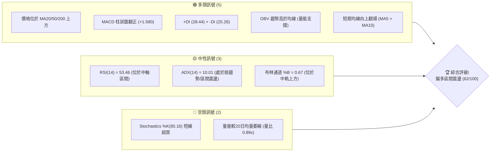
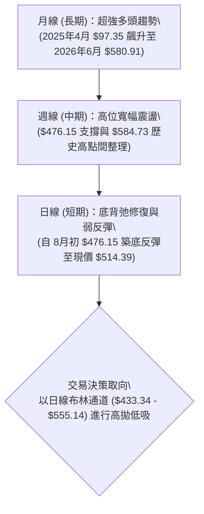
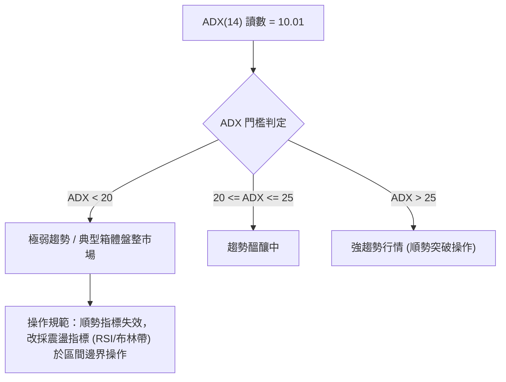
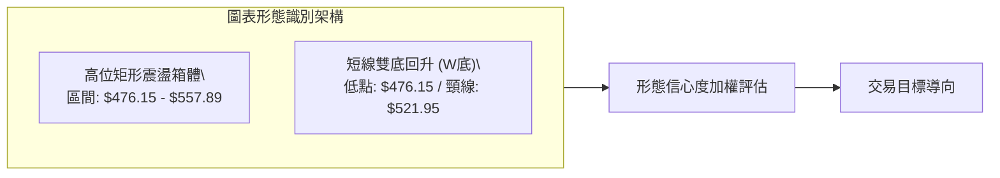
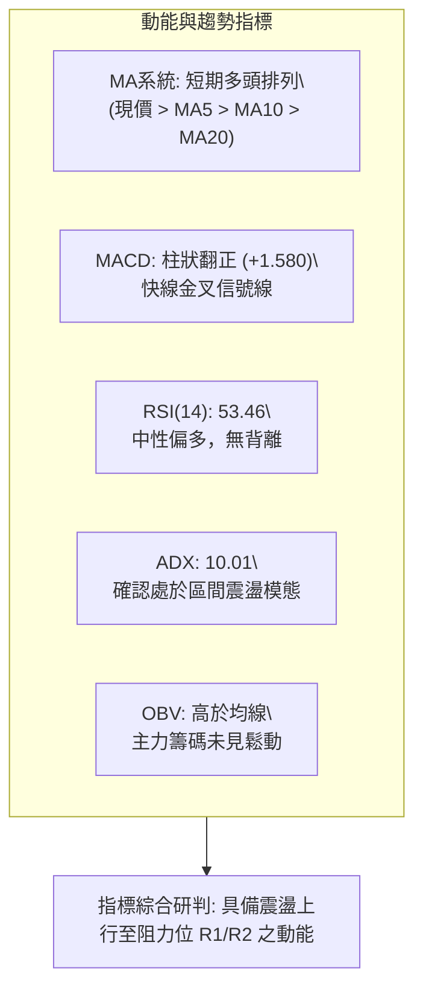
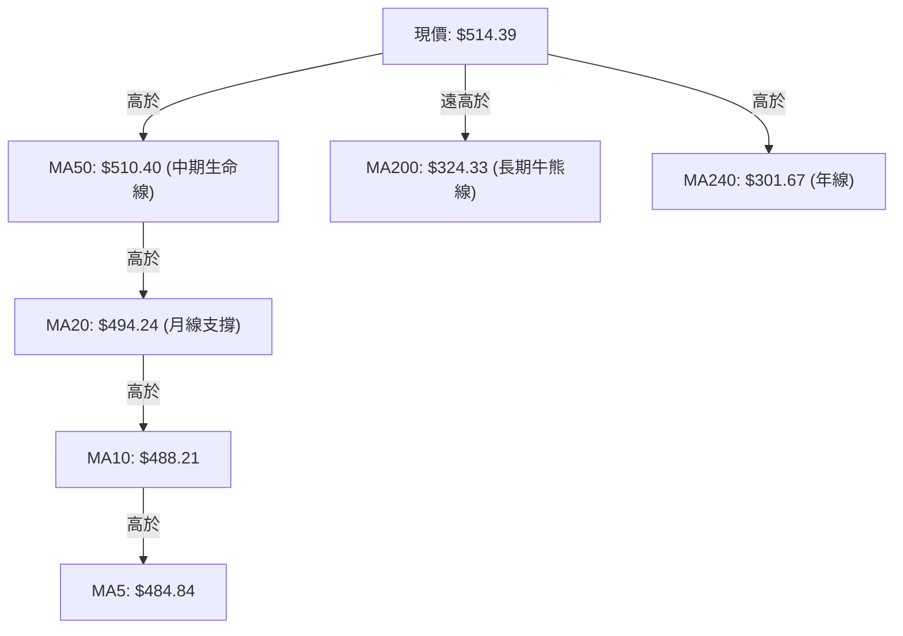
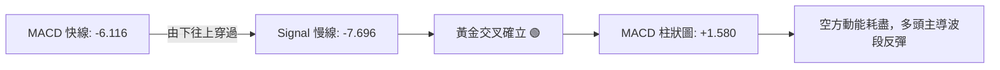
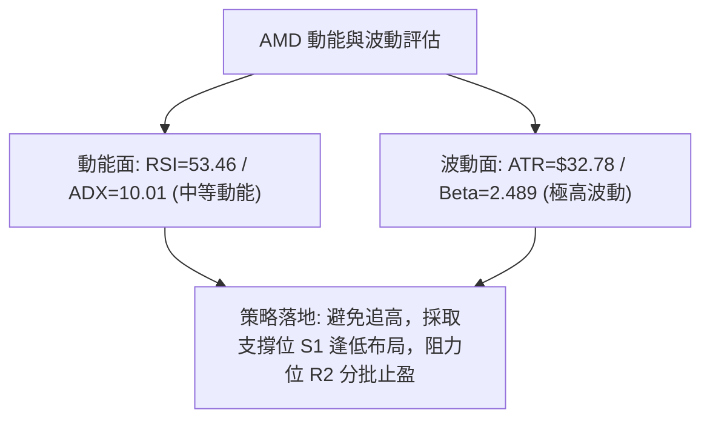
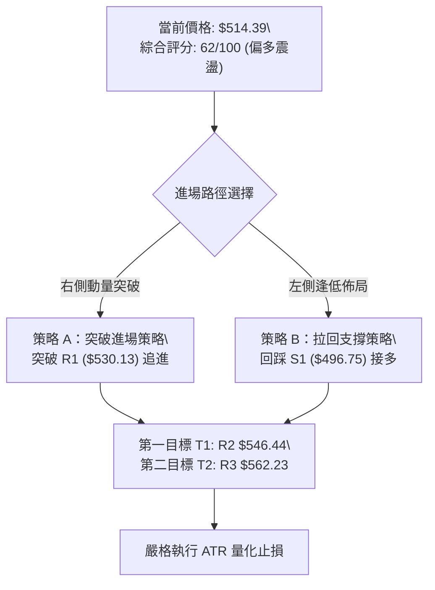
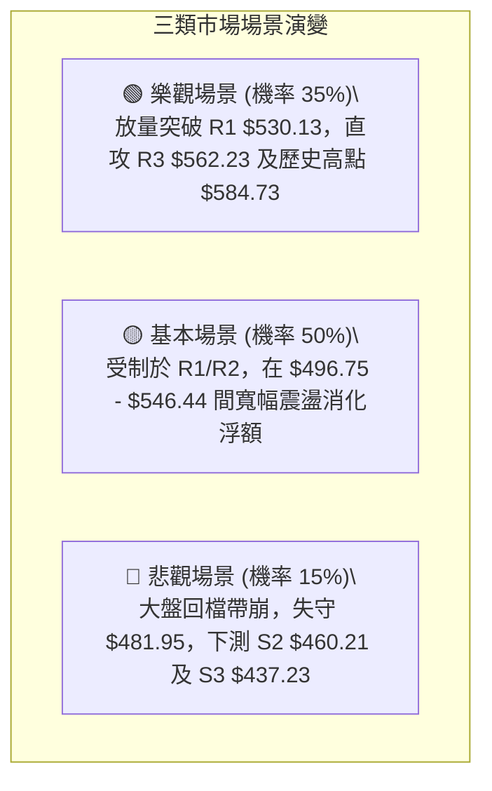

# AMD 技術分析報告

> **報告日期**：2026-08-16 ｜ **語言**：繁體中文 ｜ **數據來源**：Yahoo Finance ｜ **當前價格**：$514.39

---

## 目錄

| 章節 | 內容 |
|------|------|
| [1. 技術面概覽](#1-技術面概覽) | 訊號儀表板、核心指標、評分卡 |
| [2. 趨勢分析](#2-趨勢分析) | 多時框趨勢、長中短期走勢 |
| [3. 圖表形態分析](#3-圖表形態分析) | 形態識別、K線組合、目標價 |
| [4. 支撐與阻力](#4-支撐與阻力) | 關鍵價位、斐波那契回調 |
| [5. 技術指標深度解讀](#5-技術指標深度解讀) | MA/RSI/MACD/布林/成交量 |
| [6. 動能與波動率](#6-動能與波動率) | 動能評估、ATR、Beta |
| [7. 多時框架總結](#7-多時框架總結) | 時框架評分矩陣 |
| [8. 交易策略建議](#8-交易策略建議) | 多空策略、風險報酬比 |
| [9. 風險提示與監控](#9-風險提示與監控) | 監控指標、風險場景 |

---

## 1. 技術面概覽

### 🎯 技術訊號儀表板



### 📊 核心指標速覽表

| 指標類別 | 指標名稱 | 當前數值 | 訊號 | 解讀 |
|:---|:---|:---|:---:|:---|
| **價格** | 當前收盤價 | $514.39 | 🟢 | 站上多數主要均線，位於52週區間 83.8% 高位 |
| **均線** | MA20 (短中) | $494.24 | 🟢 | 現價高於 MA20 達 +4.08%，短線支撐確立 |
| **均線** | MA50 (中期) | $510.40 | 🟢 | 現價微幅突破 MA50 (+0.78%)，嘗試奪回中期主導權 |
| **均線** | MA200 (長期) | $324.33 | 🟢 | 遠高於長期牛熊分界線 (+58.60%)，超長線多頭架構不變 |
| **動能** | RSI(14) | 53.46 | 🟡 | 中性健康區間，無背離現象，具備向上發展空間 |
| **動能** | MACD (12/26/9)| -6.116 / -7.696 | 🟢 | 快線黃金交叉慢線，柱狀圖擴張至 +1.580 看多 |
| **動能** | KD 隨機指標 | %K 85.16 / %D 62.63 | 🔴 | %K 進入 >80 超買區，慎防短線衝高後拉回震盪 |
| **趨勢** | ADX (14) | 10.01 (+DI 28.44) | 🟡 | ADX < 25 指示當前為無趨勢之「箱體整理行情」 |
| **通道** | Bollinger Bands| 寬度 $121.80 | 🟢 | 價格自中軌 ($494.24) 向上軌 ($555.14) 推進 |
| **量能** | 20日均量比 | 0.89x (25.48M) | 🟡 | 反彈未顯著放量，OBV 則維持在均線之上支撐價格 |
| **波動** | ATR(14) | $32.78 (6.37%) | 🟡 | 日內波幅偏高，進場需嚴格控管止損幅度 |

### 🏆 技術評分卡

```
╔══════════════════════════════════════════════════════════════╗
║                 技術評分卡 — AMD (2026-08-16)                 ║
╠══════════════════════════════════════════════════════════════╣
║ 趨勢強度 (Trend)      ██████░░░░░░░░░░░░  30/100  🟡 弱趨勢/震盪 ║
║ 動能指標 (Momentum)   ██████████████░░░░  70/100  🟢 MACD金叉   ║
║ 支撐穩定度 (Support)  ████████████████░░  80/100  🟢 S1/MA20穩固║
║ 成交量配合 (Volume)   ██████████░░░░░░░░  50/100  🟡 量能略萎縮 ║
║ 形態完整度 (Pattern)  ████████████░░░░░░  60/100  🟡 箱體構築中 ║
║ 均線排列 (Moving Avg) ████████████████░░  80/100  🟢 站上關鍵MA ║
╠══════════════════════════════════════════════════════════════╣
║ 綜合評分              ████████████░░░░░░  62/100  偏多震盪整理  ║
╚══════════════════════════════════════════════════════════════╝
```

---

## 2. 趨勢分析

### 🌐 多時框趨勢分析



### 📈 長期趨勢 — 12個月走勢圖（Unicode）

```
AMD 月線走勢圖（2025-09 至 2026-08）
價格 ($)
$600 ┤                                      ● $580.91 (2026-06 歷史高點)
$550 ┤                                  ● $516.10       ● $514.39 (現在)
$500 ┤                                              ● $476.15
$450 ┤
$400 ┤                              ● $354.49
$350 ┤
$300 ┤
$250 ┤ ● $256.12
$200 ┤        ● $217.53 ● $214.16   ● $236.73   ● $200.21 ● $203.43
$150 ┤ ● $161.79
     └───────────────────────────────────────────────────────────► 時間
       09/25   10/25   11/25   12/25   01/26   02/26   03/26   04/26   05/26   06/26   07/26   08/26
```

#### 走勢特徵分析表格

| 階段 | 時間區間 | 起訖價格 | 漲跌幅 | 趨勢特徵與量價解讀 |
|:---|:---|:---|:---:|:---|
| **第一階段：底部盤整** | 2025-08 ~ 2026-03 | $162.63 → $203.43 | +25.09% | 於 $200-$250 構建堅實大底，均線長期收斂蓄勢 |
| **第二階段：主升浪爆發** | 2026-03 ~ 2026-06 | $203.43 → $580.91 | **+185.56%** | AI需求推動爆發性買盤，週成交量突破 2.96 億股 |
| **第三階段：高位獲利回吐**| 2026-06 ~ 2026-07 | $580.91 → $476.15 | -18.03% | 碰觸歷史高位 $584.73 後遭遇拋壓，回測 23.6% 斐波那契位 |
| **第四階段：次級築底反彈**| 2026-08 (當前) | $476.15 → $514.39 | +8.03% | 在 $476.15 止跌，MACD 柱狀圖翻正，展開技術性修復 |

### 📊 中期趨勢（週線分析）

```
AMD 週線關鍵支撐與壓力區間示意圖
$584.73 ──────────────────────────────────────── 52W 歷史高點 (極強阻力)
         ▲
$555.14 ─── ── ── ── ── ── ── ── ── ── ── ── ── 布林帶上軌 / R3 ($562.23)
         │  [壓力區間：$530.13 - $555.14]
$514.39 ─┼────────────────────────────────────── 現價 (站上 MA50 $510.40)
         │  [支撐區間：$481.95 - $496.75]
$481.95 ─── ── ── ── ── ── ── ── ── ── ── ── ── 23.6% 斐波回調位 / MA20 ($494.24)
         ▼
$433.34 ──────────────────────────────────────── 布林帶下軌 / S3 ($437.23)
```

### ⚡ 趨勢強度評估（ADX 解讀）



#### ADX 與方向性指標對照表

| 指標 | 數值 | 狀態評估 | 技術含義 |
|:---|:---:|:---:|:---|
| **ADX (14)** | **10.01** | 🔴 極弱趨勢 | 趨勢動能匱乏，市場處於無方向的多空平衡震盪狀態 |
| **+DI (14)** | **28.44** | 🟢 多頭佔優 | 買方在短期邊際力量略高於賣方 |
| **-DI (14)** | **25.26** | 🟡 空頭受限 | 空方力量自 8 月初高點回落，尚未構成壓倒性優勢 |
| **DI 差值 (+DI - -DI)**| **+3.18** | 🟢 偏多排列 | 多頭微弱領先，但缺乏 ADX 總量能配合，難以形成單邊噴出 |

---

## 3. 圖表形態分析

### 🔍 形態識別系統



#### 形態識別信心度與依據表格

| 形態名稱 | 信心度 | 判斷依據（嚴格引用數據） | 完成度 | 目標價（附嚴謹計算式） |
|:---|:---:|:---|:---:|:---|
| **高位矩形震盪箱體** | **75%** | 價格受制於近波高點 $557.89 (2026-07-12) 與低點 $476.15 (2026-08-02) | 80% | **突破箱頂目標** = 阻力 $557.89 + 箱體高度 ($557.89 - $476.15 = $81.74) = **$639.63** |
| **短線雙底結構 (W底)** | **60%** | 8/2 週收 $476.15 與 8/9 週收 $483.36 構成雙支腳，當前價格 $514.39 逼近頸線 | 70% | **頸線突破目標** = 頸線 $521.95 (07-26週高) + 形態高度 ($521.95 - $476.15 = $45.80) = **$567.75** |
| **大型頭肩頂形態** | **25%** | 數據不足以確認右肩，左肩 $537.37、頭部 $584.73，但現價已反彈重回 MA50，形態未成形 | 15% | *訊號不足，信心度低於50%，僅做風險提示，不列入主要交易依據* |

### 🕯️ 重要K線形態分析（近5週走勢解讀）

| 日期 (週) | 收盤價 | RSI | MACD柱 | 週成交量 | K線形態特徵與多空意涵 | 訊號 |
|:---|:---:|:---:|:---:|:---:|:---|:---:|
| **2026-07-19** | $495.76 | 46.0 | -7.919 | 131.19M | **長陰下殺破位**：跌破 $500 大關，空頭主導釋放獲利了結賣壓 | 🔴 |
| **2026-07-26** | $521.95 | 44.1 | -2.864 | 131.61M | **反彈吞噬陽線**：逢低買盤進場，MACD 負柱顯著收斂 | 🟢 |
| **2026-08-02** | $476.15 | 40.6 | -9.004 | 163.97M | **放量探底下影線**：回踩 23.6% 斐波那契位 ($481.95) 獲強支撐 | 🟡 |
| **2026-08-09** | $483.36 | 46.9 | -2.259 | 173.79M | **築底十字星線**：多空於 $480 附近激烈爭奪，成交量放大顯示籌碼換手充分 | 🟢 |
| **2026-08-16** | $514.39 | 53.5 | +1.580 | 100.58M | **實體中陽突破**：站回 MA50 ($510.40)，MACD 柱狀圖正式翻正 (+1.580) | 🟢 |

### 📉 ASCII 走勢形態示意圖

```
AMD 2026年7-8月 高位箱體與雙底反彈示意圖
$584.73 ──────── 52W 歷史天花板
          ┌───┐
          │   │ 2026-06 頂部出貨
$557.89 ──┴───┴────── 箱體頂部 (阻力位 R3: $562.23 附近)
                     \          ┌───┐
                      \   頸線  │   │ 目標價推算: $567.75
$521.95 ───────────────\────────┴───┴────── 頸線壓力位
                        \      / ▲ (現價 $514.39 逼近中)
$496.75 ─────────────────\────/───┼──────── S1 支撐位
                          \  /    │
$476.15 ───────────────────▼──────┴──────── 雙底低點 (2026-08-02/09)
                         [底1]   [底2]
```

### 🎯 形態目標價計算

1. **矩形區間等距測幅**：
   - 箱體頂部：$557.89，箱體底部：$476.15
   - 垂直高度（Height）= $\$557.89 - \$476.15 = \$81.74$
   - 向上突破完全目標價 = $\$557.89 + \$81.74 =$ **$639.63**
2. **短線雙底測幅目標**：
   - 頸線位置：$521.95，形態低點：$476.15
   - 形態高度 = $\$521.95 - \$476.15 = \$45.80$
   - 突破頸線量度目標價 = $\$521.95 + \$45.80 =$ **$567.75**（與阻力位 R3 $562.23 形成共振區間）

---

## 4. 支撐與阻力

### 🗺️ 關鍵價位分布圖（Unicode）

```
AMD 價位結構分布圖（OHLCV 數據計算聚類）
═══════════════════════════════════════════════════════════════
$584.73 ║██████████████████████████████║ 52週歷史高點 (0.0% Fib)
$562.23 ║████████████████████████      ║ 強阻力 R3 (近一年波段高點聚類)
$555.14 ║████████████████████          ║ 布林通道上軌
$546.44 ║████████████████              ║ 中度阻力 R2
$530.13 ║████████████                  ║ 關鍵阻力 R1 (短線首要突破關卡)
════════╠══════════════════════════════╣ ◄ 現價: $514.39 (站上 MA50 $510.40)
$496.75 ║▓▓▓▓▓▓▓▓▓▓▓▓                  ║ 近期關鍵支撐 S1 (波段低點聚類/MA20 $494.24)
$481.95 ║▓▓▓▓▓▓▓▓▓▓▓▓▓▓▓▓              ║ 23.6% 斐波那契關鍵回調位
$460.21 ║▓▓▓▓▓▓▓▓▓▓▓▓▓▓▓▓▓▓▓▓          ║ 強支撐 S2 (中期多空分水嶺)
$437.23 ║▓▓▓▓▓▓▓▓▓▓▓▓▓▓▓▓▓▓▓▓▓▓▓▓      ║ 核心防守支撐 S3 (布林下軌 $433.34 重合)
$324.33 ║██████████████████████████████║ MA200 牛熊長期生死線
═══════════════════════════════════════════════════════════════
```

### 🚧 阻力位分析表

| 阻力級別 | 價位 | 形成原因（依據數據） | 突破難度 | 技術重要性與策略意義 |
|:---|:---:|:---|:---:|:---|
| **關鍵阻力 R1** | **$530.13** | 近期週K線密集反彈遇阻點 (+3.06%) | 🟡 中等 | 短線多頭重奪強勢主導權的試金石，突破將直取 R2 |
| **中度阻力 R2** | **$546.44** | 7月中旬下跌中繼平台聚類點 (+6.23%) | 🔴 偏高 | 接近布林通道上軌 ($555.14)，預期將引發獲利盤拋壓 |
| **強阻力 R3** | **$562.23** | 歷史次高點與 7/12 週收盤聚類區 (+9.30%) | 🔴 極高 | 波段獲利了結主要目標區，未伴隨巨量換手難以直接越過 |

### 🛡️ 支撐位分析表

| 支撐級別 | 價位 | 形成原因（依據數據） | 守住機率 | 技術重要性與策略意義 |
|:---|:---:|:---|:---:|:---|
| **關鍵支撐 S1** | **$496.75** | 近期波段低點聚類與 MA20 ($494.24) 雙重重合 (-3.43%) | 🟢 80% | 短線多頭防線，回踩不破視為極佳右側加碼點 |
| **強支撐 S2** | **$460.21** | 5月主升浪起漲平台支撐聚類 (-10.53%) | 🟢 85% | 中期上升結構頸線底限，跌破代表中級回檔展開 |
| **核心支撐 S3** | **$437.23** | 60日均線下方關鍵低點聚類與布林下軌重合 (-15.00%) | 🟢 95% | 多頭終極底線，提供強大的估值與技術面雙重托底 |

### 📐 斐波那契回調位分析

基準計算區間：52週低點 **$149.22** (100.0%) $\rightarrow$ 52週高點 **$584.73** (0.0%)，總波幅 \$435.51。

| 回調比例 | 斐波那契價位 | 現價相對距離 | 結構定位與技術意義解讀 |
|:---:|:---:|:---:|:---|
| **0.0% (高點)** | **$584.73** | +13.67% | 歷史頂部壓力區，本輪大週期的絕對天花板 |
| **23.6%** | **$481.95** | -6.31% | **淺層回調位**：8月初低點 $476.15 精確在此止跌，確認為強支撐 |
| **38.2%** | **$418.37** | -18.67% | **健康回調位**：若大盤重挫之極端情境防守點 |
| **50.0%** | **$366.97** | -28.66% | **多空中軸位**：強弱平衡分水嶺 |
| **61.8%** | **$315.58** | -38.65% | **黃金分割防守位**：與 MA200 ($324.33) 形成超強共振底座 |
| **78.6%** | **$242.42** | -52.87% | 深次回踩區間 |
| **100.0% (低點)**| **$149.22** | -70.99% | 週期起漲原點 |

> **斐波那契定位結論**：現價 $514.39 穩健運行於 **0.0% ($584.73)** 與 **23.6% ($481.95)** 之間。在未跌破 23.6% ($481.95) 前，技術面定義為「主升浪後的最強強勢整理」，整體多頭架構完好無損。

---

## 5. 技術指標深度解讀

### 🎛️ 指標訊號總覽



### 📈 移動平均線排列分析



#### 均線階梯分析表

| 均線名稱 | 數值 | 現價差距 | 趨勢排列狀態 | 角色與策略意義 |
|:---|:---:|:---:|:---:|:---|
| **MA 5** | $484.84 | +6.09% | 向上翻揚 | 極短線進攻支撐，帶動短線買盤追價 |
| **MA 10** | $488.21 | +5.36% | 向上翻揚 | 短線動能線，防守 $490 整數關卡 |
| **MA 20** | $494.24 | +4.08% | 走平轉勾向上 | 布林通道中軌，短波段多空防守核心 |
| **MA 50** | $510.40 | +0.78% | 走平震盪 | 中期多空分水嶺，現價成功收復 |
| **MA 60** | $508.21 | +1.22% | 走平 | 季線位置，與 MA50 形成黏合支撐 |
| **MA 120**| $390.90 | +31.59% | 強烈向上 | 半年線，多頭長期趨勢穩固 |
| **MA 200**| $324.33 | +58.60% | 強烈向上 | 長期牛市基石，無系統性崩跌風險 |

### 📉 RSI(14) 分析

```
RSI(14) 數值儀表：53.46 (中性偏多)
0             30               50      53.46    70            100
├──────────────┼────────────────┼───────●───────┼──────────────┤
  超賣區 (Bear)      弱勢區間         中軸   現值   強勢超買區 (Bull)
進度條: ███████████░░░░░░░░░  53.46%
```

- **背離判斷**：
  - 價格於 2026-08-02 創波段低點 $476.15 時，RSI 位於 40.6；隨後價格於 2026-08-09 測試 $483.36，RSI 抬升至 46.9。
  - **結論**：日線與週線層面均**無頂背離現象**，且低位呈現微幅的「動能底背馳確認」，有利於股價持續向超買區（RSI 70）發起衝擊。

### 📊 MACD(12/26/9) 訊號解讀



- **柱狀圖動態**：從 8/2 週的 `-9.004` 驟減至 8/9 的 `-2.259`，最新一週收盤正式翻正為 **`+1.580`**。此為標準的零軸下方向上發散金叉，代表空頭回補力道強勁。

### 📦 布林通道分析

```
AMD 布林通道 (20, 2) 結構圖
$555.14 ────────────────────────────────────── 上軌 (Upper Band)
         ▲
         │  區間寬度: $121.80 (23.68%)
$514.39 ─┼─── ● 現價 (%B = 0.67，位於中上軌強勢區間)
         │
$494.24 ─┼──────────────────────────────────── 中軌 (Middle Band = MA20)
         │
         ▼
$433.34 ────────────────────────────────────── 下軌 (Lower Band)
```

- **%B 指標解讀**：目前 `%B = 0.67`。當 `%B` 自 0.20 以下反彈並越過 0.50（中軌）時，技術面慣性將引導價格向上軌 **$555.14** 推進。

### 💹 成交量分析（量價配合度）

```
成交量評估：
最新單日成交量:   25,481,000 股
20日平均成交量:   28,498,520 股  (量比: 0.89x)
量能配合狀態:     █████████░░░░░░░░░░░  量能中性略縮
OBV 指標狀態:     OBV > MA (量能領先突破，支撐價格上行)
```

- **量價背離檢視**：最新一週價格強勢上漲 +$31.03 (+6.42%)，成交量為 100.58M，較前週 173.79M 萎縮。此現象說明盤面拋壓顯著減輕，屬於「鎖籌後的無量推升」，若要實質突破 R1 ($530.13)，日成交量需回升至 3,000 萬股以上。

---

## 6. 動能與波動率

### ⚡ 動能評估四象限

| 象限 | 動能強度 (Momentum) | 波動率水準 (Volatility) | 當前標的狀態 | 操作指引與風險特徵 |
|:---:|:---:|:---:|:---:|:---|
| **Q1** | 強 (High) | 低 (Low) | — | 穩定單邊牛市，重倉順勢做多 |
| **Q2** | 弱 (Low) | 低 (Low) | — | 低波死寂市場，觀望為主 |
| **Q3** | 強 (High) | 高 (High) | — | 高波主升/主跌浪，高風險高回報 |
| **Q4** | **弱/中 (Moderate)** | **高 (High)** | **✓ AMD 當前定位** | **高波寬幅震盪：嚴格設定止盈止損，執行區間操作** |



### 📊 ATR 波動率分析

- **ATR(14) 數值**：**$32.78**（佔現價 **6.37%**）。
- **日內波動特徵**：股價單日正常跳動區間可達 $\pm \$32.78$，代表極短線雜訊極大。
- **止損距離量化建議**：
  - **保守型交易（波段）**：止損幅度設定為 $1.5 \times \text{ATR} = 1.5 \times \$32.78 = \mathbf{\$49.17}$。
  - **進取型交易（短線）**：止損幅度設定為 $1.0 \times \text{ATR} = 1.0 \times \$32.78 = \mathbf{\$32.78}$。

### 📐 Beta 與市場相關性

- **Beta 係數**：**2.489**（極高 Beta 屬性）。
- **市場敏感度解讀**：AMD 對標普500指數及費城半導體指數（SOX）具備超過 2.48 倍的波動放大效應。大盤上漲 1% 時，AMD 理論波動 +2.49%；反之亦然。部位配置時需適度調降名目資金比例以控制投資組合波動度。

---

## 7. 多時框架總結

### 📋 時框架評分表

| 時框架 | 趨勢方向 | 動能指標 | 均線排列 | 圖表形態 | 綜合評分 | 操作建議 |
|:---|:---:|:---:|:---:|:---:|:---:|:---|
| **日線 (Daily)** | 🟢 震盪偏多 | 🟢 MACD金叉 | 🟢 站上MA20/50 | 🟡 區間震盪 | **70/100** | 回踩 S1 ($496.75) 逢低吸納 |
| **週線 (Weekly)**| 🟡 箱體整理 | 🟡 RSI 53.5 | 🟢 守住MA20 | 🟢 雙底支撐 | **65/100** | 於箱體區間內進行高拋低吸 |
| **月線 (Monthly)**| 🟢 超強多頭 | 🟢 長線偏多 | 🟢 多頭排列 | 🟢 上升旗形 | **85/100** | 長線多單底倉續抱 |

### 🔲 綜合訊號矩陣

```
┌─────────────────┬────────────────────────────────────────────────────────┐
│ 維度            │ 短期 (日線)          中期 (週線)          長期 (月線)      │
├─────────────────┼────────────────────────────────────────────────────────┤
│ 主導趨勢        │ 🟢 反彈延續          🟡 箱體橫盤          🟢 結構性多頭    │
│ 均線系統        │ 🟢 突破短均          🟢 守穩 MA20/50      🟢 遠高於 MA200  │
│ 動能狀態        │ 🟢 MACD柱狀翻正      🟡 RSI 中性平衡      🟢 長期動能充足  │
│ 成交量配合      │ 🟡 略低於均量        🟡 換手充分          🟢 歷史天量支撐  │
│ 關鍵多空邊界    │ $496.75 (S1)         $481.95 (23.6% Fib)  $324.33 (MA200)  │
└─────────────────┴────────────────────────────────────────────────────────┘
```

### ⚖️ 多時框收斂結論

依據多時框收斂優先級規則：
1. **行情屬性判定**：當前 **ADX(14) = 10.01 (<25)**，明確定義市場處於**「無趨勢盤整行情」**。
2. **主導時框與邊界**：在此環境下，中長期趨勢提供多頭保護傘，而交易主導權落在**日線/週線布林通道與關鍵支撐阻力聚類**。
3. **唯一方向性結論**：**【偏多區間震盪 (Bullish Consolidation)】**。
   - 價格在回踩 23.6% 斐波回調位 ($481.95) 與 S1 ($496.75) 獲確認後，反彈動能已由 MACD 金叉點燃，目標指向日線布林上軌 ($555.14) 與阻力位 R1/R2。

---

## 8. 交易策略建議

### 🗺️ 策略決策流程圖



### 🧭 策略路由

> **當前主策略方向 = 偏多區間操作與突破加碼（依評分 62/100 確立主推多頭策略）**

### 🎯 價格情境階梯（Price Scenarios）

| 觸發條件 | 下一目標 | 後續延伸 | 情境含義與技術解讀（嚴格引用數據） |
|:---|:---:|:---:|:---|
| **向上突破 R1 ($530.13)** | **R2 ($546.44)** | **R3 ($562.23)** | 短線動能全面爆發，箱體反彈演化為實質突破 |
| **維持現價區間震盪** | **MA50 ($510.40)**| **R1 ($530.13)** | 於布林中軌與上軌間蓄勢，消化 $510-$520 套牢籌碼 |
| **向下跌破 S1 ($496.75)** | **23.6% ($481.95)**| **S2 ($460.21)** | 中期轉弱，將再次探底回測 8月初低點 $476.15 |

### 📊 情境機率分佈

| 情境劇本 | 發生機率 | 主要技術依據 |
|:---|:---:|:---|
| **震盪上行測試阻力 (Bull Case)** | **55%** | MACD 柱狀圖翻正 (+1.580)、+DI > -DI、OBV 穩健支撐、站上 MA50 |
| **箱體內部橫盤拉鋸 (Base Case)** | **30%** | ADX = 10.01 顯示無強趨勢，量能比 0.89x 尚不足以支撐單邊暴漲 |
| **跌破支撐深度回踩 (Bear Case)** | **15%** | Stochastics %K = 85.16 短線超買，若大盤重挫可能引發多殺多 |

### 🟢 主策略詳情

| 策略要素 | 策略 A（右側突破策略） | 策略 B（左側回踩策略） |
|:---|:---|:---|
| **適用場景** | 強勢放量突破短線壓力 | 價格拉回測試短線均線支撐 |
| **進場條件** | 實體K線突破 R1 並伴隨成交量放大 | 回踩 S1 附近出現下影線止跌訊號 |
| **進場價格** | **$530.13** (突破確認進場) | **$496.75** (掛單/右側接多) |
| **目標價 T1** | **$546.44** (阻力位 R2) | **$530.13** (阻力位 R1) |
| **目標價 T2** | **$562.23** (強阻力 R3 / 雙底量度目標) | **$555.14** (布林通道上軌) |
| **止損價格** | **$510.40** (跌破 MA50 及進場K線低點) | **$481.95** (跌破 23.6% 斐波那契關鍵位) |
| **風險報酬比 (R:R)**| **1.63 : 1** (以 T2 計算) | **3.94 : 1** (以 T2 計算，盈虧比極佳) |
| **預估勝率** | **60%** | **68%** |
| **建議倉位** | **總資金 8% - 10%** | **總資金 12% - 15%** |

### 🔴 反向風險觸發點（對沖與風控提示）

若出現以下訊號，多頭主策略即刻失效，應全面減倉或建立空頭對沖：
1. **關鍵價位跌破**：日K線收盤價跌破 **$481.95 (23.6% 斐波回調位)**。
2. **指標惡化**：MACD 柱狀圖在零軸下方再度擴大負值，且 RSI(14) 跌破 40。
3. **對沖操作點位**：跌破 $481.95 後反彈無力，可於 $485 附近建立反向空頭部位，下看 S2 ($460.21) 與 S3 ($437.23)，止損設於 $497.00。

### ⭐ 整體訊號強度評星

```
╔══════════════════════════════════════════════════════════════╗
║                    整體技術訊號評星                          ║
╠══════════════════════════════════════════════════════════════╣
║ 做多訊號強度：  ★★★★☆  (3.8/5星 - MACD金叉/均線修復)          ║
║ 做空訊號強度：  ★★☆☆☆  (1.8/5星 - 僅短線KD超買壓制)          ║
║ 整體趨勢可信度：★★★☆☆  (3.2/5星 - ADX弱勢，受限於區間震盪)   ║
╚══════════════════════════════════════════════════════════════╝
```

---

## 9. 風險提示與監控

### ✅ 關鍵監控指標 Checklist

```
╔══════════════════════════════════════════════════════════════╗
║                 每日/每週 盤後監控檢核表                      ║
╠══════════════════════════════════════════════════════════════╣
║ [ ] 價格是否穩守 MA50 ($510.40) 與 MA20 ($494.24) 之上？       ║
║ [ ] 成交量是否放大至 20日均量 (28.50M 股) 以上？              ║
║ [ ] RSI(14) 是否在 50-70 區間健康運行 (未跌破 45)？            ║
║ [ ] MACD 柱狀圖是否維持正向發散 (當前 +1.580)？                ║
║ [ ] ADX 是否開始自 10.01 拐頭向上 (若突破 20 則趨勢形成)？    ║
║ [ ] 52W 高點 $584.73 與 S1 $496.75 邊界是否有大額異動？       ║
╚══════════════════════════════════════════════════════════════╝
```

### ⚠️ 風險場景分析



### 🛡️ 風險管理重要提醒

1. **高 Beta 波動懲罰機制**：AMD Beta 高達 2.489，極端市場波動日其震幅往往超過大盤 2-3 倍。在單筆交易中，嚴格限制最大名目虧損不超過總投資帳戶淨值的 **1.5%**。
2. **ATR 動態倉位控制**：鑑於當前 ATR 達 $32.78，部位進場點若偏離均線過遠，切忌市價追單。應將訂單分拆為 2-3 筆於回調支撐位掛單。
3. **重要事件窗口防禦**：關注半導體板塊財報與全球算力晶片出貨進展，遇重大財經事件前夕，建議將總持倉曝險降至 50% 以下。

---

## 📋 報告總結

```
╔══════════════════════════════════════════════════════════════╗
║                   AMD 技術分析報告總結                       ║
╠══════════════════════════════════════════════════════════════╣
║ 報告日期：2026-08-16                                          ║
║ 當前價格：$514.39                                            ║
║ 分析評級：⚖️ 偏多區間震盪（技術評分：62 / 100）               ║
╠══════════════════════════════════════════════════════════════╣
║ 關鍵結論：                                                    ║
║ ├─ 長期趨勢：🟢 強烈看多（遠高於 MA200 $324.33，處主升浪高位） ║
║ ├─ 中期趨勢：🟡 箱體整理（$476.15 - $557.89 構築雙底與震盪箱）║
║ ├─ 短期趨勢：🟢 弱勢修復反彈（站上 MA50，MACD 翻正 +1.580）    ║
║ ├─ 關鍵支撐：S1: $496.75  │  S2: $460.21  │  S3: $437.23     ║
║ ├─ 關鍵阻力：R1: $530.13  │  R2: $546.44  │  R3: $562.23     ║
║ └─ 華爾街共識目標價：$612.84（當前隱含空間 +19.14%）          ║
╠══════════════════════════════════════════════════════════════╣
║ 最優策略組合：                                                ║
║ 1. 🥇 最佳機會：策略 B（回踩 S1 $496.75 佈局多單，盈虧比 3.94）║
║ 2. 🥈 次選機會：策略 A（放量突破 R1 $530.13 追多，博弈 R3）   ║
║ 3. 🥉 保守選擇：維持 10% 底倉，等待 ADX > 20 出現明確單邊趨勢║
╚══════════════════════════════════════════════════════════════╝
```

---

> ⚠️ **免責聲明**：本報告為技術分析研究成果，所有數據及估算均基於歷史量價與技術指標演化。本報告**僅供研究與學術參考**，**不構成任何形式的投資要約或買賣建議**。金融市場瞬息萬變，交易決策請務必獨立判斷並自負盈虧。

---

*報告生成時間：2026-08-16 ｜ 數據來源：Yahoo Finance ｜ 分析框架：多時框架量化技術分析*