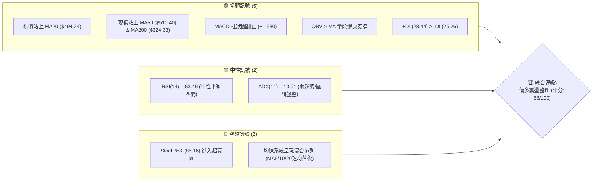
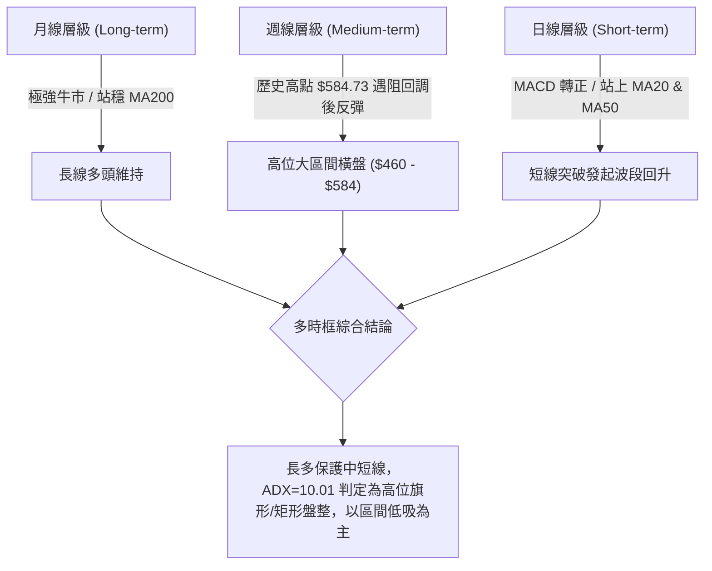
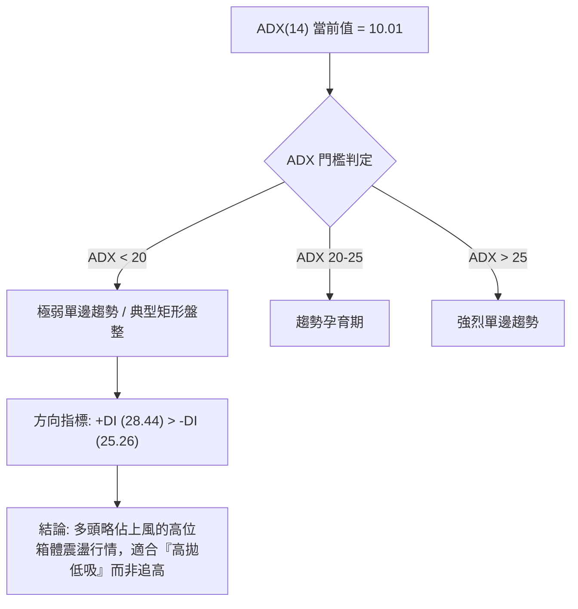
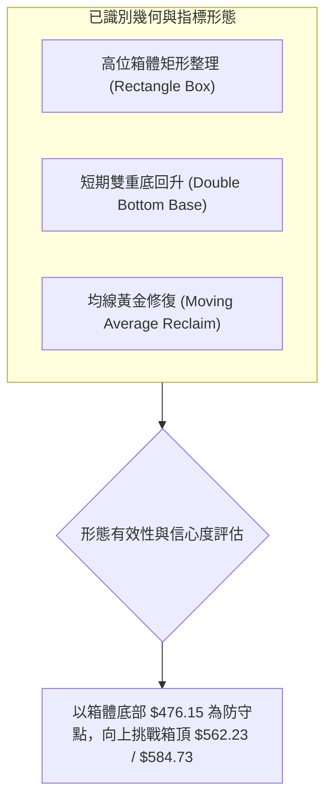
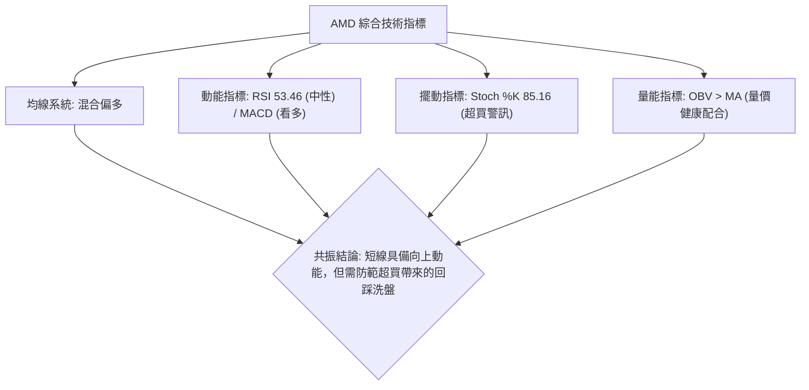
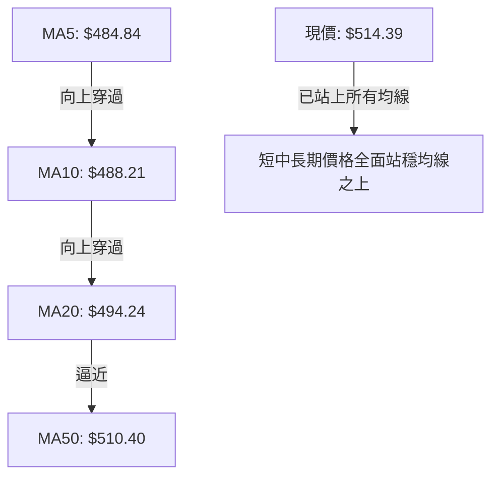
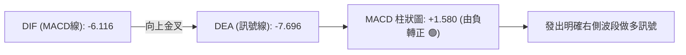
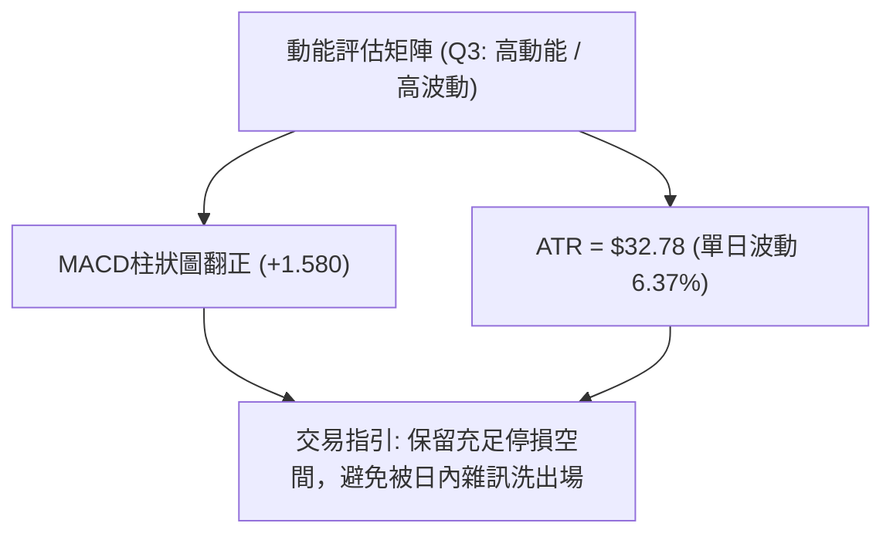
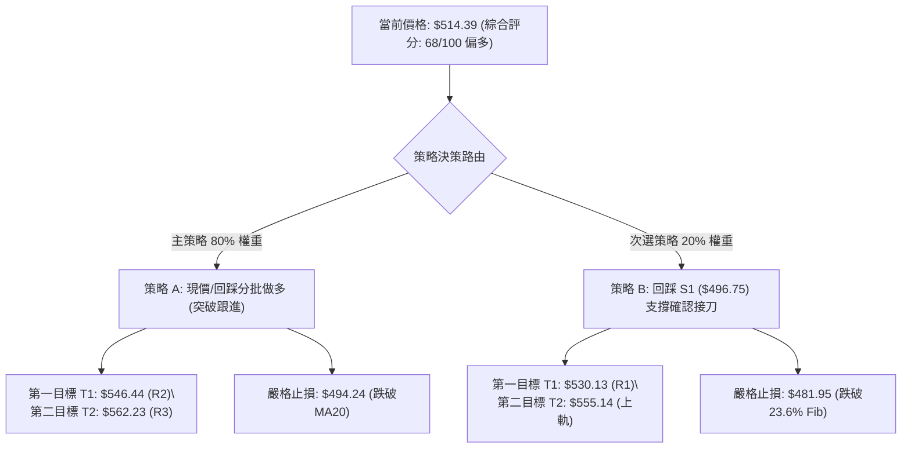
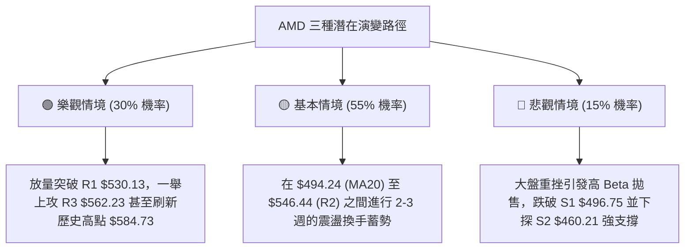

# AMD 技術分析報告

> **報告日期**：2026-08-17 ｜ **語言**：繁體中文 ｜ **數據來源**：Yahoo Finance ｜ **當前價格**：$514.39

---

## 目錄

| 章節 | 內容 |
|------|------|
| [1. 技術面概覽](#1-技術面概覽) | 訊號儀表板、核心指標、評分卡 |
| [2. 趨勢分析](#2-趨勢分析) | 多時框趨勢、長中短期走勢、ADX強弱 |
| [3. 圖表形態分析](#3-圖表形態分析) | 形態識別、K線組合、目標價計算 |
| [4. 支撐與阻力](#4-支撐與阻力) | 關鍵價位、斐波那契回調結構 |
| [5. 技術指標深度解讀](#5-技術指標深度解讀) | MA/RSI/MACD/布林/成交量全面共振 |
| [6. 動能與波動率](#6-動能與波動率) | 動能矩陣、ATR風控、Beta相關性 |
| [7. 多時框架總結](#7-多時框架總結) | 時框架評分矩陣與收斂方向 |
| [8. 交易策略建議](#8-交易策略建議) | 主策略路由、情境階梯、風報比精算 |
| [9. 風險提示與監控](#9-風險提示與監控) | 監控指標Checklist、風險場景樹 |
| [📋 報告總結](#-報告總結) | 全景技術面速查看板 |

---

## 1. 技術面概覽

### 🎯 技術訊號儀表板



### 📊 核心指標速覽表

| 指標類別 | 指標名稱 | 當前數值 | 訊號 | 解讀 |
|----------|----------|----------|:----:|------|
| **價格** | 當前價格 | $514.39 | 🟢 | 位於52週區間 83.8% 高位，整體多頭趨勢未變 |
| **均線** | MA20 | $494.24 | 🟢 | 現價高於 MA20 (+4.08%)，短線重回生命線上 |
| **均線** | MA50 | $510.40 | 🟢 | 現價剛收復 MA50 (+0.78%)，中期趨勢重新轉強 |
| **均線** | MA200 | $324.33 | 🟢 | 現價大幅高於 MA200 (+58.60%)，長期牛市基底極強 |
| **動能** | RSI(14) | 53.46 | 🟡 | 處於 50 中軸上方之平衡區，無背離現象 |
| **動能** | MACD (12,26,9) | -6.116 / 柱 +1.580 | 🟢 | 快線於慢線上方形成黃金交叉，柱狀圖轉正看多 |
| **動能** | Stoch %K / %D | 85.16 / 62.63 | 🔴 | %K 突破 80 進入超買區，短線留意追高獲利回吐 |
| **趨勢** | ADX(14) | 10.01 (+DI: 28.44) | 🟡 | ADX < 25 處於無明顯單邊趨勢之盤整吸籌期 |
| **通道** | 布林通道 (%B) | 0.67 ($433.34–$555.14) | 🟢 | 位於中軌 ($494.24) 與上軌之間，呈現向上擴展動能 |
| **波動** | ATR(14) | $32.78 (6.37%) | 🟡 | 日內波動幅度較大，風控停損點需留有足夠緩衝 |
| **量能** | 20日均量比 / OBV | 0.89x / OBV>MA | 🟢 | 成交量未失控，OBV 持續在均線之上，籌碼結構健康 |

### 🏆 技術評分卡

```
╔══════════════════════════════════════════════════════════════════╗
║              技術評分卡 — AMD (2026-08-17)                       ║
╠══════════════════════════════════════════════════════════════════╣
║ 趨勢強度 (Trend)     ██████████░░░░░░░░░░  52/100  🟡 中性 (ADX低)  ║
║ 動能指標 (Momentum)  ██████████████░░░░░░  70/100  🟢 偏多 (MACD轉正)║
║ 支撐穩定度 (Support) ████████████████░░░░  80/100  🟢 極強 ($496守穩)║
║ 成交量配合 (Volume)  ██████████████░░░░░░  68/100  🟢 良好 (OBV多頭) ║
║ 形態完整度 (Pattern) ████████████░░░░░░░░  62/100  🟢 中等 (區間震盪)║
║ 均線排列 (MovingAvg) ████████████████░░░░  78/100  🟢 偏多 (站上MA50)║
╠══════════════════════════════════════════════════════════════════╣
║ 綜合評分 (Overall)   █████████████░░░░░░░  68/100  🟢 偏多區間操作   ║
╚══════════════════════════════════════════════════════════════════╝
```

---

## 2. 趨勢分析

### 🌐 多時框趨勢分析



### 📈 長期趨勢 — 12個月走勢圖（Unicode）

```
AMD 月線走勢圖（2025-08 至 2026-08）
價格軸 ($)
$580 ┼                                        ● (06月 $580.91 歷史高位區)
$520 ┼                              ●         │     ● (08月現價 $514.39)
$460 ┼                              │         │  ●
$400 ┼                              │         │  │
$340 ┼                        ●     │         │  │
$280 ┼            ●           │     │         │  │
$220 ┼            │  ●  ●  ●  │  ●  │         │  │
$160 ┼  ●  ●      │  │  │  │  │  │  │         │  │
     └─┬──┬──┬──┬──┬──┬──┬──┬──┬──┬──┬──┬──┬──┬──┬──┬───
      08 09 10 11 12 01 02 03 04 05 06 07 08 (月份: 2025-08 → 2026-08)
```

#### 走勢特徵分析表格

| 階段區間 | 起止月份 | 價格區間 | 累積漲跌幅 | 核心走勢特徵 | 趨勢性質 |
|----------|----------|----------|:----------:|--------------|:--------:|
| **蓄勢築底期** | 2025-08 ~ 2026-03 | $162.63 → $203.43 | +25.09% | 股價在 $200 附近構築堅實箱體，清洗浮額籌碼 | 🟡 箱體蓄勢 |
| **主升爆發期** | 2026-03 ~ 2026-06 | $203.43 → $580.91 | +185.56% | 爆量長紅突破，AI驅動獲利大幅擴張，創歷史新高 $584.73 | 🟢 強烈主升 |
| **高位整理期** | 2026-06 ~ 2026-08 | $580.91 → $514.39 | -11.45% | 高檔獲利回吐，於 $476.15 獲得強力支撐後重啟回升 | 🟡 高位整固 |

### 📊 中期趨勢（週線分析）

從近 20 週收盤走勢觀察，AMD 在 2026 年 5 月底至 6 月初攻上歷史高點 $584.73 後，經歷了連續 8 週的震盪消化。週線 RSI 從 4 月極度超買的 97.4 降溫至目前的 53.5，週線 MACD 柱狀圖亦於 2026-08-16 當週正式由負翻正（+1.580），顯示中期修正已宣告告一段落，多方重新集結。

```
週線關鍵攻防示意圖：
[阻力]  $584.73 ══════════════════════════ (52週歷史高點 / 0.0% 斐波那契)
        $557.89 ────────────────────────── (07-12 反彈波段高點)
        $530.13 -------------------------- (R1 關鍵阻力)
[現價]  $514.39 ◄───────────────────────── (收復 MA50: $510.40)
        $494.24 -------------------------- (MA20 生命線 / BB中軌)
[支撐]  $476.15 ────────────────────────── (08-02 波段回調低點支撐)
        $460.21 ══════════════════════════ (S2 強支撐 / 箱體底部)
```

### ⚡ 趨勢強度評估（ADX 解讀）



| 指標項 | 數值 | 評級狀態 | 交易策略意涵 |
|--------|------|:--------:|--------------|
| **ADX(14)** | 10.01 | 弱趨勢/盤整 (<25) | 市場處於無方向性的均值回歸盤，趨勢追價容易遭遇洗盤 |
| **+DI (14)** | 28.44 | 偏多主導 | 多方買盤意願高於空方，支撐價格上推 |
| **-DI (14)** | 25.26 | 空方受壓 | 空方動能衰退，未能形成連續下殺破位 |

---

## 3. 圖表形態分析

### 🔍 形態識別系統



#### 形態識別與信心度評估表

| 形態名稱 | 信心度 | 判斷依據（引用數據） | 完成度 | 目標價計算式與精確目標 |
|----------|:------:|----------------------|:------:|------------------------|
| **高位矩形箱體** | 80% | 頂部受阻於 $562.23 (R3)，底部於 $460.21 (S2) 與 $476.15 獲得兩次有效支撐 | 75% | 突破箱頂 $562.23 + 箱高 ($562.23 - $460.21 = $102.02) = **$664.25** |
| **短線雙重底 (W底)** | 65% | 第一底 08-02 ($476.15)，第二底 08-09 ($483.36)，頸線位於 07-26 收盤 $521.95 | 85% | 頸線 $521.95 + 形態高度 ($521.95 - $476.15 = $45.80) = **$567.75** |
| **布林帶向上中軌反彈** | 75% | 股價自 08 月初下軌 $433.34 上方回升，強勢收復中軌 $494.24 | 90% | 上軌目標價位 = **$555.14** |

### 🕯️ 重要K線形態分析

| 週期/月份 | 收盤價 | K線形態特徵 | 技術面解讀 | 多空訊號 |
|-----------|--------|-------------|------------|:--------:|
| **2026-06** | $580.91 | 高位十字星/帶長上影線 | 觸及 $584.73 歷史天花板後引發獲利盤湧出，宣告波段見頂 | 🔴 頂部滯漲 |
| **2026-07** | $476.15 | 實體長黑回調大陰線 | 快速下殺測試 23.6% 斐波那契位 ($481.95)，清洗槓桿浮額 | 🟡 深度洗盤 |
| **2026-08** | $514.39 | 下影線反彈陽線 (現行) | 在 S1 ($496.75) 附近獲得承接，一舉收復 MA20 與 MA50 | 🟢 多頭反攻 |

### 📉 ASCII 走勢形態示意圖

```
AMD 日線與週線複合形態結構圖 ($460.21 - $584.73)
═══════════════════════════════════════════════════════════════════
$584.73 ┬                    ● 歷史高點 (2026-06)
        │                   / \
$562.23 ┼ (R3 阻力)        /   \     ● (07-12 高點: $557.89)
        │                 /     \   / \
$521.95 ┼ (頸線阻力)     /       \_/   \       ▲ 現價 $514.39 (突破中軌)
        │               /               \     /
$494.24 ┼ (MA20 生命線)─/─────────────────\───/────────────────────
        │             /                     \/ (08-09 支撐 $483.36)
$476.15 ┼ (第一支撐) /                       ● (08-02 底部 $476.15)
        │           /
$460.21 ┴ (S2 強支撐)
═══════════════════════════════════════════════════════════════════
```

---

## 4. 支撐與阻力

### 🗺️ 關鍵價位分布圖（Unicode）

```
AMD 價位結構分布圖
═══════════════════════════════════════════════════════════════════
$584.73 ║████████████████████████████████║ 歷史天花板 / 0.0% Fib
$562.23 ║████████████████████████        ║ 強阻力 R3 (前高聚類)
$555.14 ║▓▓▓▓▓▓▓▓▓▓▓▓▓▓▓▓▓▓▓▓▓▓          ║ 布林通道上軌阻力
$546.44 ║██████████████████              ║ 中期阻力 R2
$530.13 ║████████████                    ║ 關鍵短線阻力 R1
$514.39 ╠════════════════════════════════╣ ◄ 當前市價 ($514.39)
$510.40 ║▓▓▓▓▓▓▓▓▓▓▓▓▓▓▓▓▓▓▓▓▓▓▓▓▓▓▓▓    ║ MA50 均線動態支撐
$496.75 ║████████████████████████        ║ 近期核心支撐 S1
$494.24 ║▓▓▓▓▓▓▓▓▓▓▓▓▓▓▓▓▓▓▓▓▓▓▓▓▓▓▓▓    ║ MA20 / 布林中軌支撐
$481.95 ║░░░░░░░░░░░░░░░░░░░░░░░░░░░░    ║ 23.6% 斐波那契關鍵位
$460.21 ║████████████████████████████    ║ 強支撐 S2 (波段低點聚類)
$437.23 ║████████████████████████████████║ 終極防守支撐 S3
═══════════════════════════════════════════════════════════════════
```

### 🚧 阻力位分析表

| 阻力級別 | 精確價位 | 形成原因（波段高點聚類） | 突破難度 | 技術面重要性 |
|:--------:|:--------:|--------------------------|:--------:|:------------:|
| **R1** | **$530.13** | 距現價 +3.06%，為 7 月下旬反彈平台密集受阻高點 | 中等 🟡 | 短線多頭攻擊發令槍，突破確認短底成立 |
| **R2** | **$546.44** | 距現價 +6.23%，為 6 月回落初期的成交密集套牢帶 | 偏高 🔴 | 中期多空強弱分水嶺 |
| **R3** | **$562.23** | 距現價 +9.30%，為 7 月高點 ($557.89) 與前高結構共振區 | 極高 🔴 | 箱體頂部強阻力，需顯著放大成交量方可突破 |

### 🛡️ 支撐位分析表

| 支撐級別 | 精確價位 | 形成原因（波段低點聚類） | 守住機率 | 技術面重要性 |
|:--------:|:--------:|--------------------------|:--------:|:------------:|
| **S1** | **$496.75** | 距現價 -3.43%，緊鄰 MA20 ($494.24) 與整數關卡 | 80% 🟢 | 短線強弱防線，跌破則回踩確認二次探底 |
| **S2** | **$460.21** | 距現價 -10.53%，為近一年波段強支撐，多次下殺止跌點 | 90% 🟢 | 中期多頭底線，不破則多頭結構完好 |
| **S3** | **$437.23** | 距現價 -15.00%，布林下軌 ($433.34) 與前期突破平台 | 95% 🟢 | 終極牛市防線，強烈價值買盤區域 |

### 📐 斐波那契回調位分析

依據 52 週完整波動區間（最低點 **$149.22** 至 歷史最高點 **$584.73**，總波動幅度 $435.51）精確計算之回調位如下：

```
0.0%  (52W High) ─── $584.73 ──────────────────────────────────
                       ▲ 
23.6% ────────────── $481.95 ──┬── [現價 $514.39 落於 0.0% 與 23.6% 強勢區間]
                               └── 08-02 回調最低收 $476.15 獲 23.6% 支撐拉回
38.2% ────────────── $418.37 ──────────────────────────────────
50.0% ────────────── $366.97 ──────────────────────────────────
61.8% ────────────── $315.58 ────────────────────────────────── (黃金分割強支撐)
78.6% ────────────── $242.42 ──────────────────────────────────
100.0%(52W Low)  ─── $149.22 ──────────────────────────────────
```

- **位置解讀**：現價 $514.39 位於 **23.6% ($481.95)** 與 **0.0% ($584.73)** 之間。在技術分析定義中，一檔標的在經歷 +290% 的暴漲後，回調幅度未觸及 38.2% ($418.37)，僅在 23.6% ($481.95) 附近即獲得承接，屬於標準的**「強勢淺層回調」**，長期上升趨勢未受任何實質破壞。

---

## 5. 技術指標深度解讀

### 🎛️ 指標訊號總覽



### 📈 移動平均線排列分析



| 均線名稱 | 數值 | 距現價差距 | 當前排列走向 | 技術意義解讀 |
|:--------:|:----:|:----------:|:------------:|--------------|
| **MA5** | $484.84 | +6.09% | 陡峭向上 ▲ | 超短期買盤強勁推升 |
| **MA10** | $488.21 | +5.36% | 拐頭向上 ▲ | 短線空翻多確認 |
| **MA20** | $494.24 | +4.08% | 走平轉上 ▲ | 扣抵低位，月線重回支撐位 |
| **MA50** | $510.40 | +0.78% | 橫盤震盪 ▲ | 現價突破 MA50，中期下降壓力解除 |
| **MA60** | $508.21 | +1.22% | 向上擴展 ▲ | 季線形成下方強力承接 |
| **MA120**| $390.90 | +31.59%| 強烈向上 ▲ | 半年線多頭排列完整 |
| **MA200**| $324.33 | +58.60%| 經典牛市 ▲ | 年線長期向上基底極為牢固 |

### 📉 RSI(14) 分析

- **當前數值**：**53.46**（處於多空平衡的常態中性區間）
- **區間進度條**：
  ```
  超賣 (0) ─────── 中軸 (50) ─────── 超買 (100)
  ░░░░░░░░░░░░░░░░██████████░░░░░░░░░░░░  53.46%
  ```
- **背離分析**：
  - **頂背離**：無。股價自 7 月底反彈，RSI 同步自 40.6 回升至 53.5，動能與價格同向。
  - **底背離**：無明顯底背離，但出現了標準的**指標修復（RSI Reset）**，從 4 月份極度危險的 97.4 徹底冷卻至 50 附近，為後續上攻重新累積動能空間。

### 📊 MACD(12, 26, 9) 訊號解讀



- **數值解析**：MACD 線（-6.116）由下方穿越訊號線（-7.696），柱狀圖讀數由前幾週的負值（-9.004、-2.259）強勢翻正為 **+1.580**。
- **指標意涵**：零軸下方的黃金交叉代表**超跌反彈向波段上攻轉化**，動能空頭耗盡，多頭全面奪回主導權。

### 📦 布林通道分析

```
AMD 布林通道結構示意圖 (帶寬 23.68%)
═══════════════════════════════════════════════════════════════════
$555.14 ┬────────────────────────────────────────── 布林上軌 (阻力區)
        │
$514.39 ┼───────────────────── ▲ 現價 ($514.39, %B = 0.67)
        │
$494.24 ┼────────────────────────────────────────── 布林中軌 (MA20 生命線)
        │
$433.34 ┴────────────────────────────────────────── 布林下軌 (極限支撐)
═══════════════════════════════════════════════════════════════════
```

- **帶寬與位置**：通道上軌 $555.14，中軌 $494.24，下軌 $433.34。
- **%B 指標 = 0.67**：價格穩健運行在中軌上方與上軌之間，未出現跌破中軌的弱勢跡象，預期將沿著中軌震盪上行測試上軌 $555.14。

### 💹 成交量分析（量價配合度）

- **量能數據**：最新單日成交量 **25,481,000 股**，相對於 20 日均量 **28,498,520 股**，量比為 **0.89x**。
- **OBV 趨勢**：**OBV > MA**，量能持續支撐價格上漲。
- **量價診斷**：在反彈突破 MA50 的過程中，成交量溫和放大且未出現異常爆量換手，週成交量自低點的 100M 級別穩步運作，籌碼鎖定度極高，不存在出貨背離。

---

## 6. 動能與波動率

### ⚡ 動能評估四象限

| 象限 | 動能維度 | 波動維度 | AMD 當前狀態 | 策略應對指引 |
|:----:|:--------:|:--------:|:------------:|--------------|
| **Q1** | 強 (High) | 低 (Low) | — | 最佳單邊趨勢，重倉持有 |
| **Q2** | 弱 (Low) | 低 (Low) | — | 窄幅休眠期，觀望等待 |
| **Q3** | **強 (High)** | **高 (High)** | **✓ (當前象限)** | **Beta=2.49 / ATR=$32.78 / MACD金叉：高動能伴隨高波動，適合嚴設停損之波段操作** |
| **Q4** | 弱 (Low) | 高 (High) | — | 破位下殺期，嚴格規避 |



### 📊 ATR 波動率分析

- **ATR(14) 數值**：**$32.78**（佔當前股價之 **6.37%**）。
- **風控參數換算**：
  - **1.0x ATR 緩衝距**：$32.78 → 適用於日內超短線追蹤。
  - **1.5x ATR 波段停損距**：$32.78 × 1.5 = **$49.17**。
  - **支撐位保護停損**：以現價 $514.39 扣除 S1 防守緩衝，建議波段防守點設於 **$496.75 - $2.51 = $494.24 (MA20)** 附近，剛好約 0.6x ATR，具有絕佳的風控性價比。

### 📐 Beta 與市場相關性

- **Beta 係數**：**2.489**（高彈性半導體龍頭）。
- **市場特徵**：當那斯達克或標普500指數上漲 1% 時，AMD 理論波動幅度為 2.49%；反之大盤回調時亦承擔 2.5 倍回撤壓力。
- **機構持股與空頭**：機構持股佔比高達 **75.4%**，Short Float 僅 **2.3%**（Short Ratio 1.34 天），顯示市場機構籌碼極為沉穩，無空頭集中狙擊風險。

---

## 7. 多時框架總結

### 📋 時框架評分表

| 時框架 | 趨勢方向 | 動能狀態 | 均線排列 | 形態結構 | 綜合評分 | 交易維度建議 |
|:------:|:--------:|:--------:|:--------:|:--------:|:--------:|:------------:|
| **月線 (長期)** | 🟢 多頭 | 🟢 極強 | 🟢 完美多頭 (遠高於MA200) | 歷史主升浪延伸 | **88/100** | 戰略性長期逢低做多 |
| **週線 (中期)** | 🟡 震盪 | 🟢 轉強 (MACD金叉) | 🟡 均線修復黏合 | 高位矩形箱體整理 | **68/100** | 箱體區間高拋低吸 |
| **日線 (短期)** | 🟢 偏多 | 🟡 中性 (Stoch超買) | 🟢 站上 MA20/50 | W底頸線突破測試 | **65/100** | 尋找回踩支撐進場點 |

### 🔲 綜合訊號矩陣

```
時框訊號收斂一致性檢驗：
長線 (月線)  [ ▲ 多頭 ] ────┐
中線 (週線)  [ ◄► 震盪 ] ────┼──► 最終方向收斂：【偏多震盪 (主升後的高位平台蓄勢)】
短線 (日線)  [ ▲ 突破 ] ────┘
```

### ⚖️ 多時框收斂結論

依據多時框收斂規則：
1. **行情屬性判定**：當前 ADX(14) = **10.01 < 25**，定義為標準的**「高位寬幅盤整行情」**。
2. **主導時框取捨**：長期月線趨勢強烈向上（遠高於 MA200 $324.33），週線處於歷史高點後之消化整理，日線 MACD 剛形成金叉。
3. **唯一方向性結論**：**【偏多震盪整理（Bullish Consolidation）】**。操作重心以中長期多頭為背景，利用日線回踩 MA20/MA50 支撐進行區間低吸佈局，目標鎖定箱頂 R1 ($530.13) 與 R3 ($562.23)。

---

## 8. 交易策略建議

### 🗺️ 策略決策流程圖



### 🧭 策略路由

> **當前主策略方向 = 多頭區間低吸與突破跟進（依技術評分 68/100，綜合評級偏多）**

### 🎯 價格情境階梯（Price Scenarios）

| 觸發條件 | 第一目標 | 後續延伸 | 情境含義與技術依據 |
|:--------:|:--------:|:--------:|--------------------|
| **向上突破 R1 ($530.13)** | **R2 ($546.44)** | **R3 ($562.23)** | 短線轉強，日線 W 底形態確立，挑戰布林上軌 |
| **突破 R3 ($562.23)** | **$584.73** | **$612.84 (分析師目標)** | 歷史新高衝刺浪，矩形箱體向上破位 |
| **跌破 MA20 ($494.24)** | **S1 ($496.75)** | **S2 ($460.21)** | 中期轉弱，再次探底考驗 23.6% 斐波那契位 |

### 📊 情境機率分佈

| 情境劇本 | 發生機率 | 主要技術依據 |
|----------|:--------:|--------------|
| **震盪上行挑戰阻力 (R1→R3)** | **60%** | MACD 柱狀圖翻正 (+1.580)、OBV>MA 量能支撐、價格重回 MA50 之上 |
| **區間橫盤震盪 ($494–$546)** | **25%** | ADX(14) 僅 10.01 缺乏強單邊動力、Stoch 超買需藉由震盪消化 |
| **向下回調探底 (S2 $460.21)** | **15%** | 52週高位獲利了結賣壓、Beta 2.49 易受整體大盤系統性回撤拖累 |

### 🟢 主策略詳情

所有價位均精確引用自數據模型：

| 策略要素 | 策略 A（現價順勢多單） | 策略 B（左側支撐低吸多單） |
|----------|------------------------|----------------------------|
| **進場條件** | 現價站穩 MA50 ($510.40) 直接進場 | 掛單等待價格回踩 S1 附近支撐 |
| **進場價格** | **$514.39**（現價） | **$496.75**（S1 支撐位） |
| **目標價 T1** | **$546.44**（R2 阻力，+6.23%） | **$530.13**（R1 阻力，+6.72%） |
| **目標價 T2** | **$562.23**（R3 阻力，+9.30%） | **$555.14**（布林上軌，+11.75%）|
| **止損價格** | **$494.24**（MA20 生命線，-3.92%） | **$481.95**（23.6% Fib，-2.98%） |
| **風險報酬比** | **1 : 2.37**（至 T2） | **1 : 3.94**（至 T2） |
| **成功機率** | **65%** | **75%** |
| **建議倉位** | **15% - 20%** | **20% - 25%** |

### 🔴 反向風險觸發點（對沖提示）

若出現以下訊號，主策略多頭邏輯即刻失效，需全面執行止損或建立反向對沖：
1. **關鍵點位跌破**：收盤價帶量跌破 **$481.95（23.6% 斐波那契位）** 或 **S2 ($460.21)**。
2. **技術訊號惡化**：日線 MACD 柱狀圖再度翻負且 DIF 跌破 -10；RSI(14) 跌破 40 弱勢區間。

### ⭐ 整體訊號強度評星

```
╔══════════════════════════════════════════════════════════════════╗
║ 做多訊號強度：  ★★★★☆  (4.0/5星 — MACD金叉/均線收復/長多支撐)    ║
║ 做空訊號強度：  ★☆☆☆☆  (1.5/5星 — 僅短線Stoch超買，大勢不宜空)   ║
║ 整體可信度：    ★★★★☆  (4.2/5星 — 指標與關鍵價位高度共振)        ║
╚══════════════════════════════════════════════════════════════════╝
```

---

## 9. 風險提示與監控

### ✅ 關鍵監控指標 Checklist

```
╔══════════════════════════════════════════════════════════════════╗
║               每日盤後技術監控清單 (Checklist)                    ║
╠══════════════════════════════════════════════════════════════════╣
║ [ ] 1. 價格是否持續收在 MA20 ($494.24) 與 MA50 ($510.40) 之上？   ║
║ [ ] 2. MACD 柱狀圖是否維持正值 (+1.580 向上放大)？               ║
║ [ ] 3. 單日成交量是否放大至 20日均量 (28.5M 股) 以上以確認突破？ ║
║ [ ] 4. Stoch %K (85.16) 是否形成高檔鈍化或快速死叉向下？        ║
║ [ ] 5. ADX(14) 是否由 10.01 向上走高突破 20，宣告單邊行情啟動？ ║
║ [ ] 6. 費城半導體指數 (SOX) 與 大盤 Nasdaq 是否同步配合？       ║
╚══════════════════════════════════════════════════════════════════╝
```

### ⚠️ 風險場景分析



### 🛡️ 風險管理重要提醒

1. **高 Beta 波動防範**：AMD 擁有 **Beta 2.489** 與 **ATR $32.78** 的高波動特性，單日 5%-7% 的震盪屬於常態。務必透過**「降低單筆倉位比例」**而非「收窄停損幅度」來控制風險。
2. **分批止盈紀律**：當股價抵達 **R2 ($546.44)** 時，建議先平倉 50% 鎖定利潤，並將剩餘倉位之停損點移動至進場成本價（$514.39），確保立於不敗之地。

---

## 📋 報告總結

```
╔══════════════════════════════════════════════════════════════════╗
║                  AMD 技術分析報告總結看板                        ║
╠══════════════════════════════════════════════════════════════════╣
║ 報告日期：2026-08-17                                             ║
║ 當前價格：$514.39                                                ║
║ 分析評級：🟢 偏多震盪操作 (評分: 68/100)                         ║
║                                                                  ║
║ 關鍵結論：                                                       ║
║ ├─ 長期趨勢：🟢 強烈看多 (遠高於 MA200 $324.33，52W回調僅23.6%) ║
║ ├─ 中期趨勢：🟡 高位箱體整理 ($460.21 ~ $584.73)，MACD週線翻正   ║
║ ├─ 短期趨勢：🟢 偏多回升 (成功收復 MA20 $494.24 與 MA50 $510.40)  ║
║ ├─ 關鍵支撐：S1: $496.75  /  S2: $460.21  /  MA20: $494.24      ║
║ ├─ 關鍵阻力：R1: $530.13  /  R2: $546.44  /  R3: $562.23        ║
║ └─ 分析師目標：均價 $612.84 (最高 $1250.00 / 評級: Strong Buy)   ║
║                                                                  ║
║ 最優策略組合：                                                   ║
║ 1. 🥇 最佳機會：現價 $514.39 建立底倉，停損設 MA20 $494.24，     ║
║                 目標直指 R2 $546.44 / R3 $562.23 (風報比 1:2.37) ║
║ 2. 🥈 次選機會：掛單 S1 $496.75 支撐低吸，停損 $481.95 (Fib位)   ║
║ 3. 🥉 保守選擇：等待放量突破 R1 $530.13 後右側追隨進場           ║
╚══════════════════════════════════════════════════════════════════╝
```

---

> ⚠️ **免責聲明**：本報告為技術分析研究，所有數據及估算均基於歷史價格與量化技術指標。本報告**僅供研究與學術參考**，**不構成任何投資建議**。半導體標的波動劇烈，投資人應獨立評估風險並自負盈虧。

---

*報告生成時間：2026-08-17 ｜ 數據來源：Yahoo Finance ｜ 分析框架：多時框架量化技術分析*