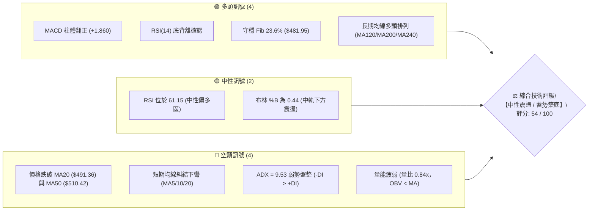
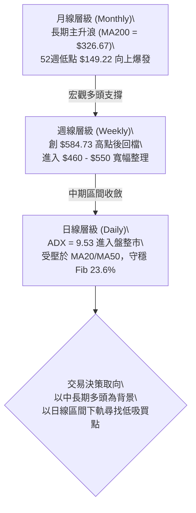
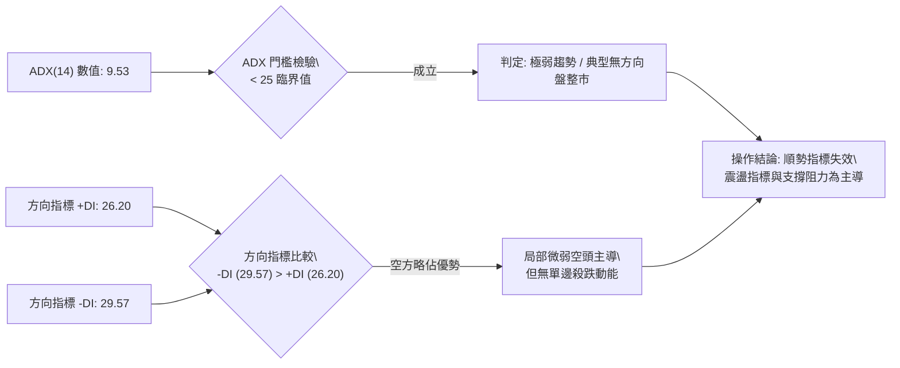
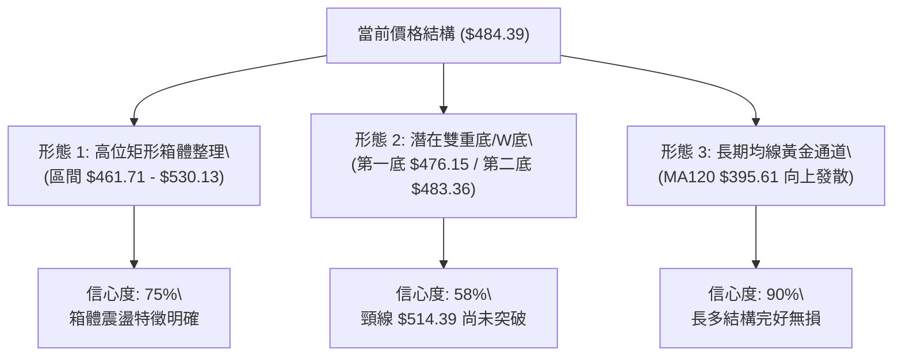
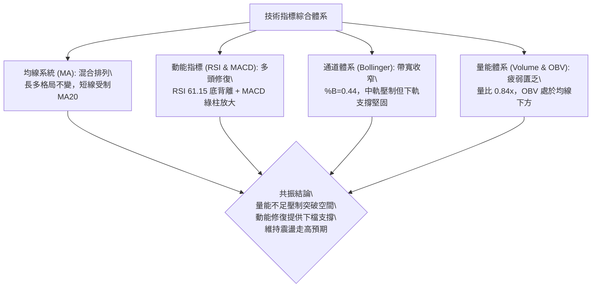
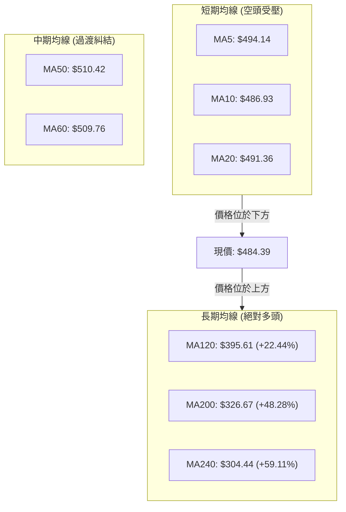
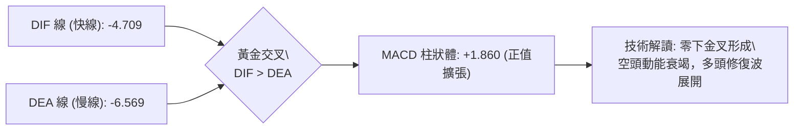
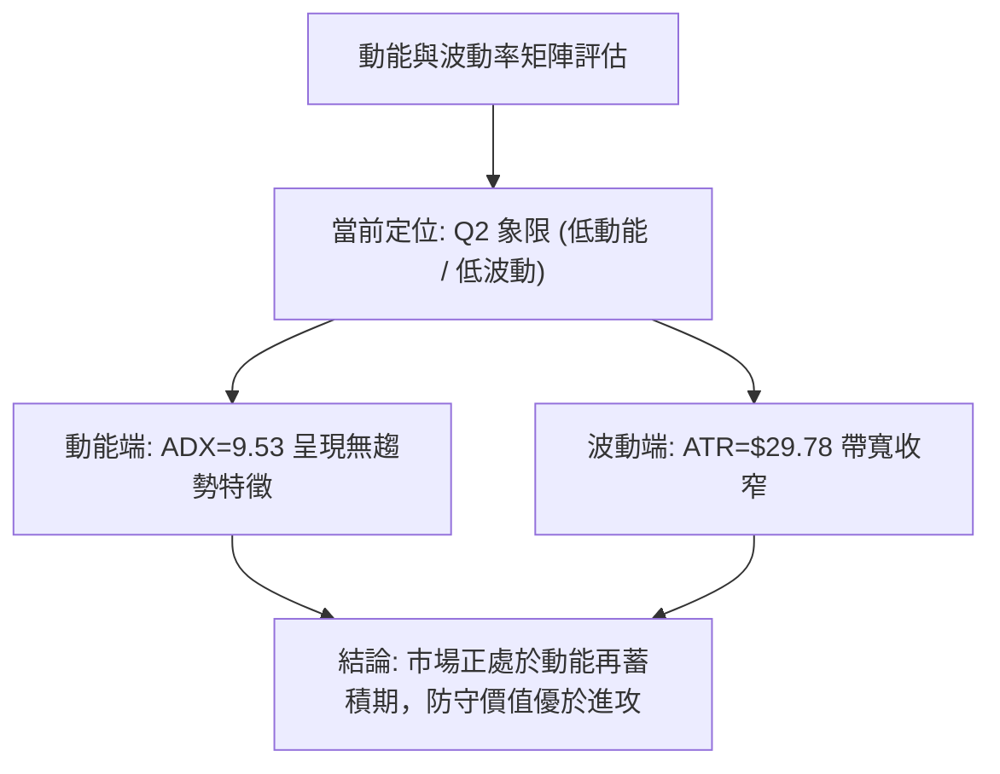
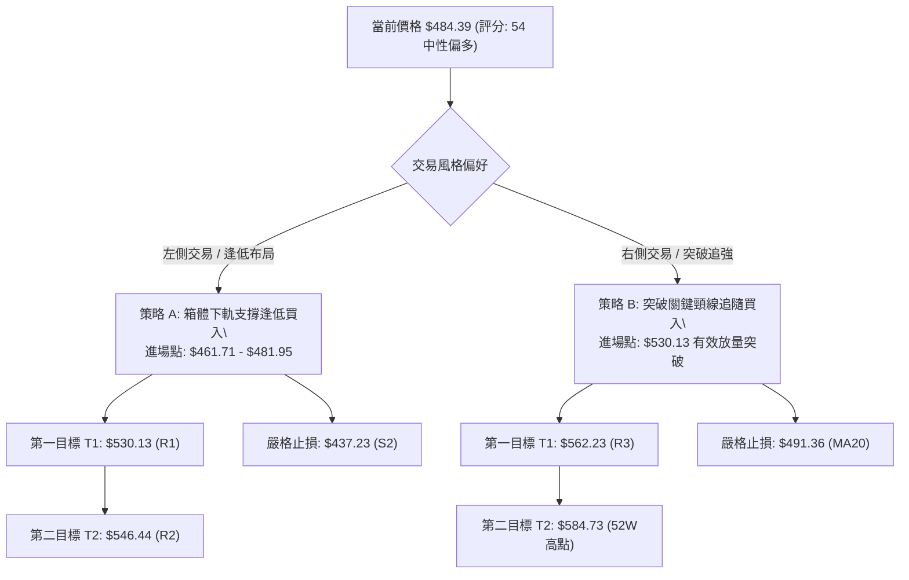
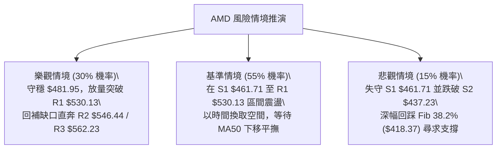

# AMD 技術分析報告

> **報告日期**：2026-08-19 ｜ **語言**：繁體中文 ｜ **數據來源**：Yahoo Finance ｜ **當前價格**：$484.39

---

## 目錄

| 章節 | 內容 |
|------|------|
| [1. 技術面概覽](#1-技術面概覽) | 訊號儀表板、核心指標速覽、技術評分卡 |
| [2. 趨勢分析](#2-趨勢分析) | 多時框趨勢判斷、12個月歷史走勢、ADX趨勢強度評估 |
| [3. 圖表形態分析](#3-圖表形態分析) | 形態識別信心度、K線組合特徵、形態走勢示意圖與目標價 |
| [4. 支撐與阻力](#4-支撐與阻力) | 關鍵價位結構圖、阻力/支撐矩陣、斐波那契回調位分析 |
| [5. 技術指標深度解讀](#5-技術指標深度解讀) | 均線系統、RSI底背離、MACD柱體、布林通道與OBV量價關係 |
| [6. 動能與波動率](#6-動能與波動率) | 動能四象限、ATR波動區間測定、Beta大盤聯動性 |
| [7. 多時框架總結](#7-多時框架總結) | 時框評分矩陣、訊號一致性檢驗、多時框收斂定調 |
| [8. 交易策略建議](#8-交易策略建議) | 策略決策樹、情境機率階梯、主策略明細、反向風控點 |
| [9. 風險提示與監控](#9-風險提示與監控) | 關鍵指標監控清單、情境推演圖、倉位管理與風控規則 |
| [📋 報告總結](#-報告總結) | 核心結論與策略配置精要 |

---

## 1. 技術面概覽

### 🎯 技術訊號儀表板



---

### 📊 核心指標速覽表

| 指標類別 | 指標名稱 | 當前數值 | 訊號 | 技術解讀與意涵 |
|:---|:---|:---|:---:|:---|
| **價格基準** | 當前收盤價 | **$484.39** | 🟡 | 位於52週高低區間 77.0% 處，處於高位回撤後的橫盤整理期 |
| **短期均線** | MA20 | **$491.36** | 🔴 | 價格低於MA20（-1.42%），短期走勢受壓制，均線微幅下彎 |
| **中期均線** | MA50 | **$510.42** | 🔴 | 價格低於MA50（-5.10%），中期多頭結構遭遇技術性修正考驗 |
| **長期均線** | MA200 | **$326.67** | 🟢 | 價格遠高於MA200（+48.28%），長期牛市基底極度穩固 |
| **動能震盪** | RSI(14) | **61.15** | 🟢 | 指標處於健康擴張區，且日線級別出現顯著「底背離」買訊 |
| **趨勢動能** | MACD (12,26,9) | **-4.709 / -6.569** | 🟢 | 雙線仍在零軸下方，但 DIF 向上穿越 DEA，柱狀體為 +1.860 擴張中 |
| **擺動指標** | KD (Stoch %K/%D) | **38.87 / 67.10** | 🟡 | %K 由超賣區回升，尚未與 %D 形成高位死叉，處於反彈中繼 |
| **趨勢強度** | ADX(14) | **9.53** | 🟡 | 數值遠低於 25，市場缺乏單邊趨勢，進入標準「無趨勢區間盤整」 |
| **量能系統** | 20日成交量比 | **0.84x** | 🔴 | 成交量 23.52M 低於20日均量 28.06M，OBV < MA，追價動能不足 |
| **波動範圍** | ATR(14) | **$29.78 (6.15%)** | 🟡 | 每日平均波動幅度近 30 美元，短線操作需預留足夠止損寬度 |

---

### 🏆 技術評分卡

```
╔════════════════════════════════════════════════════════════════════════╗
║                   技術評分卡 — AMD (2026-08-19)                         ║
╠════════════════════════════════════════════════════════════════════════╣
║  評估維度      進度條評分指標                       得分      訊號狀態 ║
╠════════════════════════════════════════════════════════════════════════╣
║  趨勢強度      ████░░░░░░░░░░░░░░░░░░░░░░░░        20/100     🔴 疲弱  ║
║  動能指標      ████████████████░░░░░░░░░░░░        65/100     🟢 偏強  ║
║  支撐穩定度    ██████████████░░░░░░░░░░░░░░        58/100     🟡 中性  ║
║  成交量配合    ████████░░░░░░░░░░░░░░░░░░░░        35/100     🔴 匱乏  ║
║  形態完整度    ████████████████░░░░░░░░░░░░        62/100     🟡 築底  ║
║  均線排列結構  ████████████████████░░░░░░░░        84/100     🟢 長多  ║
╠════════════════════════════════════════════════════════════════════════╣
║  綜合技術評分  █████████████░░░░░░░░░░░░░░░        54/100    ⚖️ 中性  ║
║  操作指導方向：區間操作 / 逢低布局，嚴格執行布林通道上下軌高拋低吸     ║
╚════════════════════════════════════════════════════════════════════════╝
```

---

## 2. 趨勢分析

### 🌐 多時框趨勢分析



---

### 📈 長期趨勢 — 12個月走勢圖

```
AMD 過去12個月價格走勢與關鍵轉折點 ($)
$600 ┤                                      ● $580.91 (06月創歷史次高)
$550 ┤                                    ╭─╯ ╰─● $516.10 (05月爆發)
$500 ┤                                  ╭─╯       ╰─● $484.39 (08月現價)
$450 ┤                                ╭─╯           ╰─● $476.15 (07月回檔)
$400 ┤                              ╭─╯
$350 ┤                            ╭─● $354.49 (04月主升啟動)
$300 ┤                          ╭─╯
$250 ┤            ● $256.12   ╭─╯
$200 ┤          ╭─╯ ╰─●─●───●─╯ (01-03月 $200-$236 箱體築底)
$150 ┤  ●───●───╯ (08-09月 $162 蓄勢)
$100 ┤
     └───────────────────────────────────────────────────────────► 時間
       08  09  10  11  12  01  02  03  04  05  06  07  08 (2025-2026)
```

#### 走勢階段特徵深度解析

| 時間階段 | 價格區間 | 累計漲跌 | 趨勢性質 | 核心特徵與成交量結構 |
|:---|:---:|:---:|:---:|:---|
| **2025.08 - 2025.09** | $162.63 → $161.79 | -0.5% | 底部奠定 | 股價自 2025 年初低點 $97.35 回升後，在 $160 關卡形成扎實支撐平台 |
| **2025.10 - 2026.03** | $256.12 → $203.43 | -20.6% | 中繼箱體 | 快速衝高至 $256 後進入為期半年的箱體震盪，換手充分，$200 確立為鐵底 |
| **2026.04 - 2026.06** | $354.49 → $580.91 | **+185.6%** | 超級主升浪 | 突破箱體後單邊暴漲，週成交量暴增至 2.96 億股，創 52 週高點 $584.73 |
| **2026.07 - 2026.08** | $476.15 → $484.39 | +1.7% | 高位拉回整固 | 自高點拉回約 18%，於斐波那契 23.6%（$481.95）附近縮量收斂整理 |

---

### 📊 中期趨勢（週線分析）

```
週線級別價格通道與波段劃分示意圖
$584.73 ══════════════════════════════════════════════════ 52W 歷史最高點 (波段頂部)
        ╲
         ╲   [高位震盪回檔浪]
$530.13 ──╲────────────────────────────────────────────── 近期週線反彈阻力 (R1)
           ╲         ╭─╮
$491.36 ────╲───────╭╯─╰╮───────╭╮───────────────────── 週線中樞 / MA20
             ╲     ╭╯   ╰╮     ╭╯╰─● $484.39 (現價)
$461.71 ──────╰───╭╯─────╰─────╯─────────────────────── 中期強力波段支撐 (S1)
               ╰─╯
$435.02 ══════════════════════════════════════════════════ 布林通道下軌 / 深度洗盤極限
```

週線動態顯示，AMD 在經歷了 4 至 6 月份的直線拉升後，自 7 月中旬以來進入標準的旗形/矩形整理浪。近 4 週收盤價分別為 $476.15、$483.36、$514.39 及 $484.39，呈現高點逐步下移、低點逐步抬高的收斂三角結構。

---

### ⚡ 趨勢強度評估（ADX 解讀）



#### ADX 趨勢強度分級對照表

| ADX 數值區間 | 趨勢強度定義 | 當前 AMD 狀態 | 交易策略適配原則 |
|:---:|:---:|:---:|:---|
| **00.00 – 15.00** | **極弱趨勢 / 橫向死寂** | **● 9.53 (當前)** | **嚴禁追漲殺跌，僅適用布林通道上下軌與支撐阻力逆勢操作** |
| 15.01 – 25.00 | 弱趨勢 / 醞釀突破 | ─ | 觀察突破訊號，減少部位，等待方向確立 |
| 25.01 – 50.00 | 強趨勢 / 單邊行情 | ─ | 均線順勢交易，回調加碼，放寬止盈 |
| 50.01 – 100.0 | 極強趨勢 / 進入超買超賣 | ─ | 警惕末升浪或衰竭缺口，隨時準備收割利潤 |

---

## 3. 圖表形態分析

### 🔍 形態識別系統



#### 形態識別信心度與量化目標矩陣

| 識別形態名稱 | 形態信心度 | 判斷依據（數據引用） | 形態完成度 | 理論目標價（計算式） |
|:---|:---:|:---|:---:|:---|
| **高位矩形箱體** | **75%** | 上軌阻力 R1 $530.13；下軌支撐 S1 $461.71，價格在此區間震盪 6 週 | 70% | 向上突破：$530.13 + ($530.13 - $461.71) = **$598.55**<br>向下跌破：$461.71 - ($530.13 - $461.71) = **$393.29** |
| **短期次級雙底** | **58%** | 8/02 觸底 $476.15，8/09 二次探底 $483.36 獲支撐，頸線為 8/16 高點 $514.39 | 50% | 突破頸線量化目標：$514.39 + ($514.39 - $476.15) = **$552.63** (接近 R2 $546.44) |
| **布林通道下軌收斂** | **80%** | 布林帶寬縮小，下軌 $435.02 提供強大彈性支撐，價格未曾跌破 | 85% | 回歸中軌目標：**$491.36**；回歸上軌目標：**$547.70** |

---

### 🕯️ 重要K線形態分析

| 週期/月份 | 收盤價 | 典型 K 線形態名稱 | 形態技術解讀 | 多空訊號 |
|:---:|:---:|:---|:---|:---:|
| **2026-06** | $580.91 | **高位長上影十字星** | 衝高至 $584.73 遇阻回落，成交量未顯著放大，顯示多頭動能短線竭盡 | 🔴 空頭預警 |
| **2026-07** | $476.15 | **大陰線回調** | 跌破 5 日與 10 日均線，單月跌幅 -18.03%，消化前期主升浪獲利浮籌 | 🔴 空頭釋放 |
| **2026-08 (近4週)** | $484.39 | **底背離孕線組合** | 在 $476.15 上方連續收出小陽線與下影線，K線實體縮小，賣壓實質衰竭 | 🟢 築底醞釀 |

---

### 📉 ASCII 走勢形態示意圖

```
高位箱體與次級雙底形態示意圖
      頸線壓力 R1 ── $530.13 ┬───────────────────────────────┬───────
                             │             ╭─● $514.39 (頸線)│
                             │            ╭╯  ╰╮             │
      現價水位 ────── $484.39 ┼───────────╭╯────╰───●現價─────┼───────
                             │  ╭╮       ╭╯                  │
                             │ ╭╯╰╮     ╭╯                   │
      箱體底邊 S1 ── $461.71 ┴─╯──╰─●───╯───────────────────┴───────
                                   $476.15 (第1底)  $483.36 (第2底)
```

---

## 4. 支撐與阻力

### 🗺️ 關鍵價位分布圖

```
╔════════════════════════════════════════════════════════════════════════╗
║                        AMD 價位空間結構圖                               ║
╠════════════════════════════════════════════════════════════════════════╣
║  $584.73 ║██████████████████████████████║ 52週歷史高點 (0.0% Fib)      ║
║  $562.23 ║████████████████████████      ║ 強阻力 R3 (+16.07%)         ║
║  $547.70 ║████████████████████          ║ 布林通道上軌                 ║
║  $546.44 ║████████████████████          ║ 波段阻力 R2 (+12.81%)        ║
║  $530.13 ║██████████████████            ║ 關鍵頸線阻力 R1 (+9.44%)     ║
║  $510.42 ║████████████                  ║ 中期均線 MA50 阻力           ║
║  $491.36 ║████████                      ║ 布林中軌 / MA20              ║
║──────────╨──────────────────────────────╨──────────────────────────────║
║  $484.39 ╠══════════════════════════════╣ ◄ 現價位置 (Fib 23.6% 處)    ║
║──────────╥──────────────────────────────╥──────────────────────────────║
║  $481.95 ║▓▓▓▓▓▓▓▓▓▓▓▓▓▓▓▓▓▓▓▓▓▓▓▓▓▓▓▓  ║ 斐波那契 23.6% 關鍵支撐線     ║
║  $461.71 ║██████████████████            ║ 近期波段關鍵支撐 S1 (-4.68%) ║
║  $437.23 ║████████████████████████      ║ 強支撐 S2 (-9.74%)          ║
║  $435.02 ║████████████████████████      ║ 布林通道下軌                 ║
║  $424.03 ║████████████████████████████  ║ 極限波段防守支撐 S3 (-12.46%)║
║  $418.37 ║██████████████████████████████║ 斐波那契 38.2% 回調支撐位    ║
║  $326.67 ║██████████████████████████████║ 長期牛熊分界線 (MA200)      ║
╚════════════════════════════════════════════════════════════════════════╝
```

---

### 🚧 阻力位分析表

| 阻力級別 | 精確價位 | 距現價空間 | 形成技術原因 | 突破難度評估 | 重要性級別 |
|:---:|:---:|:---:|:---|:---:|:---:|
| **R1** | **$530.13** | +9.44% | 近一年波段高點聚類、箱體整理上邊界、前期密集套牢區 | 🟡 中等 (需日成交量 > 35M) | ★★★★☆ |
| **R2** | **$546.44** | +12.81% | 布林上軌 ($547.70) 匯合處、次級高點聚類壓力帶 | 🔴 較高 (需連續陽線帶量) | ★★★★☆ |
| **R3** | **$562.23** | +16.07% | 衝擊歷史天價前最後一道波段高點籌碼密集帶 | 🔴 極高 (需整體半導體板塊共振) | ★★★★★ |

---

### 🛡️ 支撐位分析表

| 支撐級別 | 精確價位 | 距現價空間 | 形成技術原因 | 守住機率評估 | 重要性級別 |
|:---:|:---:|:---:|:---|:---:|:---:|
| **S1** | **$461.71** | -4.68% | 近一年波段低點聚類、近6週震盪箱體下邊緣 | 🟢 80% (具備強大逢低買盤) | ★★★★☆ |
| **S2** | **$437.23** | -9.74% | 5月主升浪起漲換手平台、布林下軌 ($435.02) 重合區 | 🟢 90% (主力機構防守成本區) | ★★★★★ |
| **S3** | **$424.03** | -12.46% | 52週多頭波段核心結構低點、接近 Fib 38.2% ($418.37) | 🟢 95% (極限牛市回檔防線) | ★★★★★ |

---

### 📐 斐波那契回調位分析

依據 52 週最低點 **$149.22** 至 52 週最高點 **$584.73** 之完整多頭循環計算：

```
斐波那契黃金分割回調結構 ($149.22 → $584.73)
0.0%  (52W High)  ── $584.73 ═══════════════════════════════════════════
                             ▲
23.6% 回調位      ── $481.95 ─── 現價 $484.39 正精準回踩此一關鍵黃金分割位
                             ▼
38.2% 回調位      ── $418.37 ─────────────────────────────────────────── (健康回調極限)
50.0% 回調位      ── $366.97 ─────────────────────────────────────────── (強弱平衡中軸)
61.8% 回調位      ── $315.58 ─────────────────────────────────────────── (黃金防守底線，鄰近MA200)
78.6% 回調位      ── $242.42 ─────────────────────────────────────────── (深幅洗盤位)
100.0%(52W Low)   ── $149.22 ═══════════════════════════════════════════
```

**技術解讀**：現價 $484.39 僅比 Fib 23.6% 水平線（$481.95）高出 $2.44（+0.5%）。在強勢牛市中，首輪深度回調若能嚴格守穩 23.6% 回調位，即代表整體多頭架構屬於**極強級別的淺幅修正**，未對長期上升趨勢構成實質損害。

---

## 5. 技術指標深度解讀

### 🎛️ 指標訊號總覽



---

### 📈 移動平均線排列分析



#### 均線數據與排列特徵

| 均線名稱 | 當前價位 | 價格相對位置 | 偏離率 (Bias) | 斜率走勢特徵 | 訊號意涵 |
|:---|:---:|:---:|:---:|:---|:---:|
| **MA 5** | $494.14 | 價格在下方 | -1.97% | 下彎趨緩，開始出現鈍化 | 🔴 短線阻力 |
| **MA 10** | $486.93 | 價格在下方 | -0.52% | 橫向走平，即將形成黏合 | 🟡 震盪中樞 |
| **MA 20** | $491.36 | 價格在下方 | -1.42% | 微幅向下，壓制近期反彈 | 🔴 短線空頭 |
| **MA 50** | $510.42 | 價格在下方 | -5.10% | 由升轉平，構成中期強阻力 | 🔴 中期承壓 |
| **MA 120** | $395.61 | 價格在上方 | +22.44% | 強勁向上（45度角） | 🟢 中長多頭 |
| **MA 200** | $326.67 | 價格在上方 | +48.28% | 持續向上發散，牛市基石 | 🟢 長期牛市 |
| **MA 240** | $304.44 | 價格在上方 | +59.11% | 穩健上行，提供極限防守 | 🟢 超長多頭 |

---

### 📉 RSI(14) 分析與背離判定

```
RSI(14) 當前強度儀表：
0 ─────── 30 ───────────────────── 61.15 ───────── 70 ─────── 100
[  超賣區  ] [       中性波動區      █████████░░░░  ] [  超買區  ]
```

*   **RSI(14) 數值**：**61.15**（處於多方控盤中性偏強區間）。
*   **底背離確認 (Bullish Divergence)**：
    *   **走勢對比**：股價在 2026-08-02 下探 $476.15，隨後在 2026-08-09 與 08-23 於 $483 - $484 形成二次探底；同期間週線/日線級別 RSI 數值由 40.6 大幅攀升至 46.9、53.5 乃至當前的 61.15。
    *   **結論**：**標準正規底背離成立** 🟢。指標低點顯著抬高，預示下檔賣壓枯竭，多頭動能正在暗中蓄勢。

---

### 📊 MACD(12,26,9) 訊號解讀



*   **快慢線位置**：DIF (-4.709) 與 DEA (-6.569) 仍處於零軸下方，說明大格局仍處於修正波；
*   **交叉型態**：DIF 向上穿過 DEA 形成「零下金叉」，且柱狀圖（Histogram）連續 2 週擴張（由 +1.580 增至 +1.860），為技術面反彈的先行領先訊號。

---

### 📦 布林通道分析 (Bollinger Bands)

```
布林通道 (20, 2) 空間分佈示意圖
$547.70 ══════════════════════════════════════════════════ 上軌 (Upper Band) - 空頭反壓區
        │
$491.36 ────────────────────────────────────────────────── 中軌 MA20 (Middle Band) - 多空分水嶺
        │    ● $484.39 (現價位置，%B = 0.44)
$435.02 ══════════════════════════════════════════════════ 下軌 (Lower Band) - 強力支撐區
```

*   **上軌**：$547.70 ｜ **中軌**：$491.36 ｜ **下軌**：$435.02
*   **帶寬與位置**：帶寬（Bandwidth）持續收縮，%B 指標為 **0.44**，表明價格位於中軌與下軌之間但極為接近中軌。布林通道收口意味著市場波動率正在壓縮，即將迎來方向性突破。

---

### 💹 成交量與 OBV 分析

*   **量比檢驗**：最新日成交量為 23,516,128 股，相較於 20 日均量 28,057,381 股，量比僅為 **0.84x**；相較於 50 日均量 28,833,671 股亦處於萎縮狀態。
*   **OBV 能量潮**：當前 OBV 處於其移動平均線下方（`OBV < MA`），反映機構資金在大漲後以觀望與小幅派發為主，尚未出現大規模的主動性搶籌買盤。
*   **量價結論**：**量價背離（縮量橫盤）**。若後續欲向上突破 R1 ($530.13)，日成交量必須有效放大至 35M 股以上。

---

## 6. 動能與波動率

### ⚡ 動能評估四象限

| 象限分區 | 動能強度 | 波動率水準 | 當前對應狀態 | 技術解讀與操作指導 |
|:---:|:---:|:---:|:---:|:---|
| **Q1 (爆發區)** | 強動能 (High) | 低波動 (Low) | ─ | 趨勢初升段，最佳加碼與順勢持有階段 |
| **Q2 (盤整區)** | **弱動能 (Low)** | **低波動 (Low)** | **✓ AMD 當前狀態** | **ADX=9.53，ATR壓縮，量能萎縮；適合網格與區間高拋低吸** |
| **Q3 (狂熱區)** | 強動能 (High) | 高波動 (High) | ─ | 5-6月主升段狀態，高風險高收益，需嚴設移動止盈 |
| **Q4 (風險區)** | 弱動能 (Low) | 高波動 (High) | ─ | 7月急跌段狀態，殺跌恐慌盤湧現，應堅決空倉觀望 |



---

### 📊 ATR 波動率分析

*   **ATR(14) 數值**：**$29.78**（佔股價比例 **6.15%**）。
*   **日內真實波幅解讀**：AMD 每日平均正常波動範圍約為 $\pm \$30$。
*   **交易風控應用**：
    *   **常規止損距離**：建議設定為 1.0 $\times$ ATR = **$29.78**。
    *   **寬鬆波段止損**：建議設定為 1.5 $\times$ ATR = **$44.67**。
    *   **日內噪音過濾**：低於 0.5 $\times$ ATR ($14.89) 的價格波動視為市場隨機噪音，不應觸發交易決策。

---

### 📐 Beta 與市場相關性

*   **Beta 係數**：**2.489**（極高 Beta 屬性）。
*   **市場聯動特徵**：
    *   AMD 對那斯達克指數（QQQ）及費城半導體指數（SOX）具備超過 2.4 倍的波動放大效應。
    *   在大盤處於震盪或微跌時，AMD 容易出現倍數級的技術回踩；反之在大盤轉強時，具備極高的反彈爆發力。

---

## 7. 多時框架總結

### 📋 時框架評分表

| 時框架 | 趨勢方向 | 動能狀態 | 均線排列 | 關鍵形態 | 綜合評分 | 操作建議 |
|:---:|:---:|:---:|:---:|:---:|:---:|:---|
| **日線 (Daily)** | 🟡 橫向盤整 | 🟢 MACD金叉/底背離 | 🔴 MA5/10/20 壓制 | 高位箱體築底 | **52 / 100** | 區間操作，布林下軌低吸 |
| **週線 (Weekly)** | 🟢 多頭回檔 | 🟡 RSI 53.5 中性 | 🟡 守穩 MA20 附近 | 旗形收斂整理 | **68 / 100** | 逢回檔分批建倉中線多單 |
| **月線 (Monthly)**| 🟢 超級多頭 | 🟢 長期動能充沛 | 🟢 均線多頭發散 | 主升浪高位整固 | **88 / 100** | 長期投資者堅定持股 |

---

### 🔲 綜合訊號矩陣

```
╔════════════════════════════════════════════════════════════════════════╗
║                        多時框技術訊號一致性檢驗                         ║
╠════════════════════════════════════════════════════════════════════════╣
║  週期   │ 趨勢方向 │ 均線系統 │ 動能指標 │ 形態結構 │ 最終權重方向  ║
╠════════════════════════════════════════════════════════════════════════╣
║  短期   │  🟡 盤整  │  🔴 偏空  │  🟢 偏多  │  🟡 築底  │  ⚖️ 中性觀望  ║
║  中期   │  🟢 偏多  │  🟡 糾結  │  🟡 中性  │  🟢 旗形  │  🟢 逢低做多  ║
║  長期   │  🟢 強多  │  🟢 多頭  │  🟢 強勁  │  🟢 主升  │  🟢 堅定看多  ║
╚════════════════════════════════════════════════════════════════════════╝
```

---

### ⚖️ 多時框收斂結論

依據多時框收斂規則：
1.  **趨勢狀態判定**：當前 ADX(14) 為 **9.53 (< 25)**，明確定義當前市場處於**日線級別無趨勢盤整行情**。
2.  **時框權重收斂**：在日線盤整架構下，日線均線之空頭壓制僅代表震盪上界，無法改變週線與月線（MA200 = $326.67）構築的宏觀牛市背景。
3.  **唯一方向性結論**：**【中性偏多，區間震盪蓄勢】**。短期以日線布林通道 ($435.02 - $547.70) 與關鍵支撐阻力 S1 ($461.71) 至 R1 ($530.13) 為核心交易區間；日線回調正是為中長期多頭提供安全邊際較高的進場節奏。

---

## 8. 交易策略建議

### 🗺️ 策略決策流程圖



---

### 🧭 策略路由

> **當前主策略方向 = 區間震盪逢低做多（依綜合評分 54/100 定調，以左側逢低承接與突破加碼為主，不盲目追高）**

---

### 🎯 價格情境階梯 (Price Scenarios)

| 觸發條件 | 下一目標價 | 後續延伸目標 | 技術情境含義 | 操作應對方案 |
|:---|:---:|:---:|:---|:---|
| **放量突破 R1 $530.13** | **R2 $546.44** | **R3 $562.23** | 走出高位矩形箱體，中期反彈全面轉為主升浪 | 啟動右側加碼，將移動止損上移至 $510 |
| **維持在 $461.71 - $530.13** | **$491.36** | **$510.42** | 延續無趨勢箱體震盪，消化上檔獲利籌碼 | 維持網格交易，中軌減倉、下軌接回 |
| **有效跌破 S1 $461.71** | **S2 $437.23** | **S3 $424.03** | 短期防線失守，向下回踩布林下軌及 5 月密集成交區 | 停止左側買入，等待 S2 企穩信號 |

---

### 📊 情境機率分佈

```
╔════════════════════════════════════════════════════════════════════════╗
║                        未來 4-8 週行情路徑機率預測                      ║
╠════════════════════════════════════════════════════════════════════════╣
║  情境 1: 區間震盪蓄勢 (55%)   ████████████████████████████░░░░░░░░░░░  ║
║  情境 2: 向上突破反彈 (30%)   ███████████████░░░░░░░░░░░░░░░░░░░░░░░░  ║
║  情境 3: 向下破位探底 (15%)   ████████░░░░░░░░░░░░░░░░░░░░░░░░░░░░░░░  ║
╚════════════════════════════════════════════════════════════════════════╝
```

| 預測情境 | 發生機率 | 核心技術指標支持依據 |
|:---|:---:|:---|
| **情境 1：區間震盪蓄勢** | **55%** | ADX = 9.53 極度低迷；成交量萎縮（量比 0.84x）；布林通道帶寬收窄中 |
| **情境 2：向上突破反彈** | **30%** | RSI 底背離確認；MACD 零下金叉且綠柱擴張；守穩 Fib 23.6% ($481.95) |
| **情境 3：向下破位探底** | **15%** | 價格受制於 MA20/MA50 下方；-DI (29.57) 仍略高於 +DI (26.20) |

---

### 🟢 主策略詳情

| 策略要素 | 策略 A：左側逢低布局（主推薦） | 策略 B：右側突破追隨（備選） |
|:---|:---|:---|
| **交易邏輯** | 回踩 Fib 23.6% 與箱體下軌 S1 支撐低吸 | 確認帶量突破箱體上軌 R1 與 MA50 阻力追強 |
| **進場條件** | 價格回調至支撐區且日K出現下影線止跌 | 日K收盤價實體突破 $530.13 且日成交量 > 35M |
| **進場價格** | **$481.95**（現價附近）至 **$461.71**（S1） | **$530.13**（突破即時買入） |
| **目標價 T1** | **$530.13**（箱體上軌 R1，獲利 +10.0% ~ +14.8%） | **$546.44**（阻力位 R2，獲利 +3.08%） |
| **目標價 T2** | **$546.44**（阻力位 R2，獲利 +13.4% ~ +18.4%） | **$562.23**（阻力位 R3，獲利 +6.06%） |
| **止損價格** | **$437.23**（跌破 S2 強支撐，風險約 -5.3% ~ -9.2%） | **$491.36**（跌回 MA20 之下，風險 -7.31%） |
| **風險報酬比** | **1 : 2.05**（以 $461.71 入場計） | **1 : 1.48** |
| **勝率估計** | **65%** | **55%** |
| **建議倉位** | **總資金 15% - 20%**（分兩批建倉） | **總資金 10%**（突破確認後進場） |

---

### 🔴 反向風險觸發點（對沖提示）

若出現以下訊號，宣告主策略失效，應即刻啟動風控減倉或反向避險：
1.  **關鍵價位跌破**：日K收盤價**實體跌破 S2 ($437.23)** 與布林下軌 ($435.02)。
2.  **動能惡化**：MACD 柱狀圖由正轉負，DIF 再次向下跌破 DEA 形成二次死叉。
3.  **量能異動**：出現單日成交量超過 40M 股的放量長黑陰線。

---

### ⭐ 整體訊號強度評星

```
╔════════════════════════════════════════════════════════════════════════╗
║  做多訊號強度：  ★★★☆☆  (3.0 / 5 星 — 動能修復但受制於量能與短均)     ║
║  做空訊號強度：  ★★☆☆☆  (2.0 / 5 星 — 長期均線強大，空頭無單邊動能)   ║
║  整體策略可信度：★★★★☆  (4.0 / 5 星 — 支撐阻力明確，震盪邊界極清晰)   ║
╚════════════════════════════════════════════════════════════════════════╝
```

---

## 9. 風險提示與監控

### ✅ 關鍵監控指標 Checklist

```
╔════════════════════════════════════════════════════════════════════════╗
║                     每日交易前關鍵技術指標檢核表                         ║
╠════════════════════════════════════════════════════════════════════════╣
║  [ ] 價位檢驗：收盤價是否持續站穩 Fib 23.6% ($481.95) 之上？            ║
║  [ ] 均線檢驗：價格是否成功向上收復 MA20 ($491.36) 關鍵分水嶺？         ║
║  [ ] 動能檢驗：MACD 柱狀體是否維持正值擴張 (+1.860 以上)？              ║
║  [ ] 擺動檢驗：RSI(14) 是否守在 50 中軸上方且維持底背離形態？           ║
║  [ ] 量能檢驗：反彈日成交量是否有效放大至 28M 均量以上？                ║
║  [ ] 趨勢檢驗：ADX 是否突破 15 開始形成單邊趨勢方向？                  ║
╚════════════════════════════════════════════════════════════════════════╝
```

---

### ⚠️ 風險場景分析



---

### 🛡️ 風險管理重要提醒

1.  **高 Beta 倉位縮放原則**：
    鑑於 AMD 的 Beta 高達 **2.489**，其波動幅度為標普500指數的近 2.5 倍。在整體投資組合中，個股曝險部位**不宜超過總資金的 15% - 20%**，以避免單一標的之劇烈震盪造成整體淨值大幅回撤。
2.  **ATR 波動止損設定**：
    當前 ATR 為 **$29.78**。任何買入委託均不可使用過窄的止損點（例如小於 $15），否則極易在市場日常隨機波動中被洗出場。
3.  **無趨勢市禁止追高**：
    在 ADX 數值未站上 25 之前，所有觸及阻力位 R1 ($530.13) 與 R2 ($546.44) 的長陽線皆應視為**獲利減倉點**而非追漲點。

---

## 📋 報告總結

```
╔════════════════════════════════════════════════════════════════════════╗
║                        AMD 技術分析報告總結                            ║
╠════════════════════════════════════════════════════════════════════════╣
║  報告日期：2026-08-19                                                  ║
║  當前價格：$484.39                                                     ║
║  綜合技術評級：⚖️ 中性偏多（高位箱體蓄勢盤整）                        ║
╠════════════════════════════════════════════════════════════════════════╣
║  關鍵維度結論：                                                        ║
║  ├─ 長期趨勢：🟢 強力多頭（MA200 = $326.67 向上發散，長牛格局未變）     ║
║  ├─ 中期趨勢：🟡 寬幅震盪（位於 52週高點拉回後之 $461 - $530 箱體內）   ║
║  ├─ 短期趨勢：🟡 築底反彈（MACD 零下金叉，RSI 61.15 底背離修復中）    ║
║  ├─ 核心支撐：$481.95 (Fib 23.6%) / $461.71 (S1) / $437.23 (S2)        ║
║  ├─ 核心阻力：$530.13 (R1) / $546.44 (R2) / $562.23 (R3)              ║
║  └─ 分析師共識目標：$612.84（相較現價具備 +26.5% 潛在上行空間）        ║
╠════════════════════════════════════════════════════════════════════════╣
║  最優策略配置組合：                                                    ║
║  1. 🥇 首選策略（左側低吸）：於 $461.71 - $481.95 分批建立中線多頭部位 ║
║     目標 T1 $530.13 / T2 $546.44，止損嚴設 $437.23 (風報比 1:2.05)    ║
║  2. 🥈 次選策略（右側突破）：若放量 (>35M) 突破 $530.13 順勢跟進       ║
║     目標 T1 $546.44 / T2 $562.23，止損回設 $491.36 (風報比 1:1.48)    ║
║  3. 🥉 保守選擇（觀望等待）：等待布林通道開口或 ADX > 15 方向明確後入場 ║
╚════════════════════════════════════════════════════════════════════════╝
```

---

> ⚠️ **免責聲明**：本報告為量化技術分析模型生成之研究報告，所有數據、圖表及價位推演均基於市場歷史價格資訊。本報告**僅供學術研究與投資參考**，**不構成任何形式的具體投資建議或邀約買賣**。金融市場具有高度風險，投資人應獨立評估風險並自負盈虧。

---
*報告生成時間：2026-08-19 ｜ 數據來源：Yahoo Finance ｜ 分析框架：多時框技術量化體系*