# AMD 技術分析報告

> **報告日期**：2026-08-20 ｜ **語言**：繁體中文 ｜ **數據來源**：Yahoo Finance ｜ **當前價格**：$466.42

---

## 目錄

| 章節 | 內容 |
|------|------|
| [1. 技術面概覽](#1-技術面概覽) | 訊號儀表板、核心指標、評分卡 |
| [2. 趨勢分析](#2-趨勢分析) | 多時框趨勢、長中短期走勢 |
| [3. 圖表形態分析](#3-圖表形態分析) | 形態識別、K線組合、目標價 |
| [4. 支撐與阻力](#4-支撐與阻力) | 關鍵價位、斐波那契回調 |
| [5. 技術指標深度解讀](#5-技術指標深度解讀) | MA/RSI/MACD/布林/成交量 |
| [6. 動能與波動率](#6-動能與波動率) | 動能評估、ATR、Beta |
| [7. 多時框架總結](#7-多時框架總結) | 時框架評分矩陣 |
| [8. 交易策略建議](#8-交易策略建議) | 多空策略、風險報酬比 |
| [9. 風險提示與監控](#9-風險提示與監控) | 監控指標、風險場景 |

---

## 1. 技術面概覽

### 🎯 技術訊號儀表板

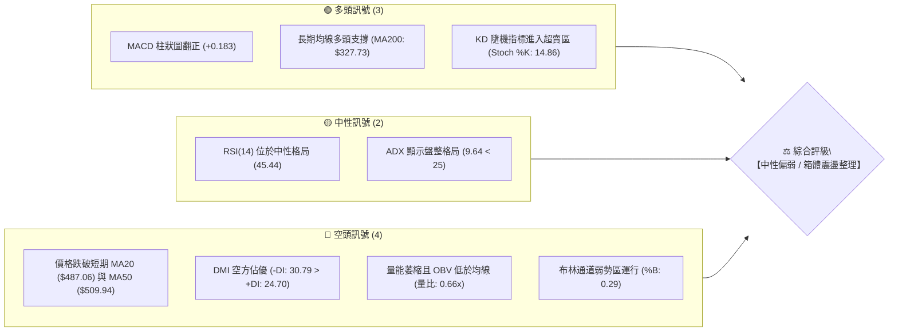

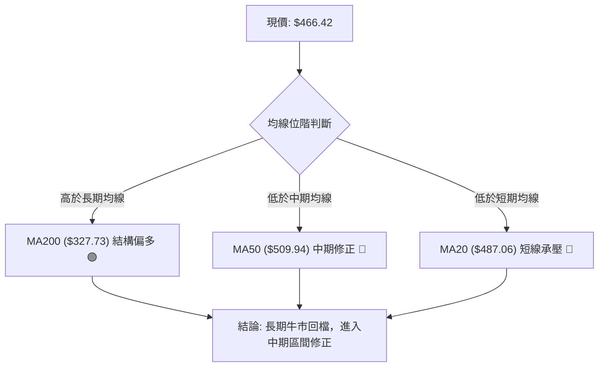

### 📊 核心指標速覽表

| 指標類別 | 指標名稱 | 當前數值 | 訊號 | 解讀 |
|:---|:---|:---|:---:|:---|
| **價格** | 當前價格 | $466.42 | 🟡 | 位於52週區間 72.8% 分位，自高點回調修正中 |
| **均線** | MA20 (短中) | $487.06 | 🔴 | 價格低於 MA20（-4.24%），短線處於空頭壓制 |
| **均線** | MA50 (中期) | $509.94 | 🔴 | 價格低於 MA50（-8.54%），中期承壓回檔 |
| **均線** | MA200 (長期) | $327.73 | 🟢 | 價格高於 MA200（+42.32%），長期宏觀牛市基礎穩固 |
| **動能** | RSI(14) | 45.44 | 🟡 | 位於 40–50 中性偏弱區間，未出現極端超賣，無背離 |
| **動能** | MACD (12/26/9)| -6.340 / -6.524 | 🟢 | 快線低位向上交叉慢線，柱狀圖 +0.183 釋放微弱反彈動能 |
| **動能** | Stoch %K / %D| 14.86 / 43.66 | 🟢 | %K 進入 20 以下超賣區，短線隨時具備技術性反彈契機 |
| **趨勢** | ADX (14) | 9.64 | 🟡 | ADX < 25 處於極弱趨勢狀態，市場處於寬幅區間震盪 |
| **通道** | Bollinger %B | 0.29 | 🔴 | 運行於中軌（$487.06）與下軌（$437.61）之間弱勢區 |
| **量能** | 20日成交量比 | 0.66x | 🔴 | 今日量 18.41M 低於 20日均量 27.75M，量能退潮，OBV疲弱 |
| **波動** | ATR(14) | $26.62 (5.71%) | 🟡 | 每日平均波動幅度較大，短線需配置寬幅防守空間 |

### 🏆 技術評分卡

```
╔══════════════════════════════════════════════════════════════╗
║              技術評分卡 — AMD (2026-08-20)                    ║
╠══════════════════════════════════════════════════════════════╣
║ 趨勢強度 (Trend)     ████░░░░░░░░░░░░░░░░  20/100 🔴 弱勢震盪 ║
║ 動能指標 (Momentum)  ██████████░░░░░░░░░░  50/100 🟡 中性修復 ║
║ 支撐穩定度 (Support) ████████████░░░░░░░░  60/100 🟢 支撐測試 ║
║ 成交量配合 (Volume)  ██████░░░░░░░░░░░░░░  30/100 🔴 量能疲弱 ║
║ 形態完整度 (Pattern) ██████████░░░░░░░░░░  50/100 🟡 箱體構築 ║
║ 均線排列 (MA System) ████████░░░░░░░░░░░░  40/100 🔴 混合偏空 ║
╠══════════════════════════════════════════════════════════════╣
║ 綜合評分             █████████░░░░░░░░░░░  45/100 ⚖️ 區間觀望 ║
╚══════════════════════════════════════════════════════════════╝
```

---

## 2. 趨勢分析

### 🌐 多時框趨勢分析

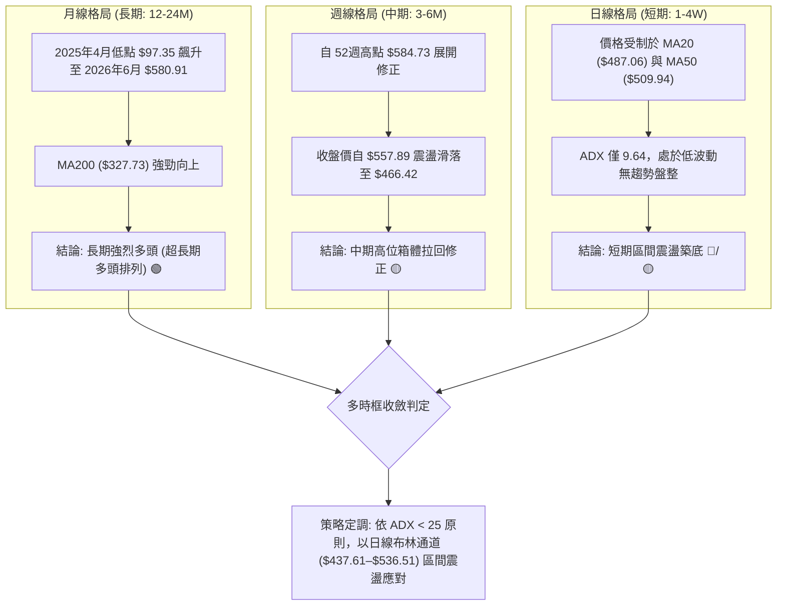

### 📈 長期趨勢 — 12個月走勢圖（Unicode）

```
AMD 月線走勢圖（2025-08 至 2026-08）
價格軸 ($)
$600 ┤                                      ● $580.91 (2026-06 高點)
$550 ┤                                ╭─────╯     ╰─────● $476.15
$500 ┤                          ● $516.10               ╰──● $466.42 (現價)
$450 ┤                          │
$400 ┤                    ● $354.49
$350 ┤                    │
$300 ┤              ● $256.12
$250 ┤              │     ╰───● $236.73
$200 ┤        ● $217.53       ╰──● $200.21 ─● $203.43
$150 ┤  ● $162.63
$100 ┤
     └────────────────────────────────────────────────────────────
        08/25 10/25 12/25 01/26 02/26 03/26 04/26 05/26 06/26 07/26 08/26
```

#### 走勢特徵分析表格

| 階段 | 時間區間 | 起點/終點價格 | 區間漲跌幅 | 核心技術特徵 |
|:---|:---|:---|:---:|:---|
| **第一階段：初段爆發** | 2025-08 ~ 2025-10 | $162.63 → $256.12 | +57.49% | 突破底部橫盤區，放量拉升 |
| **第二階段：中期蓄勢** | 2025-11 ~ 2026-03 | $217.53 → $203.43 | -6.48% | 在 $200.00 整數關卡形成強大雙底平台支撐 |
| **第三階段：主升浪狂飆** | 2026-04 ~ 2026-06 | $203.43 → $580.91 | +185.56% | 突破平台後主升浪加速，創下 52 週高點 $584.73 |
| **第四階段：高位獲利回吐**| 2026-07 ~ 2026-08 | $580.91 → $466.42 | -19.71% | 觸頂後量能萎縮，回調至 23.6%–38.2% 斐波那契回檔區 |

### 📊 中期趨勢（週線分析）

```
週線支撐阻力結構示意圖
$584.73 ────────────────────────────── 52週歷史高點 (強阻力頂部)
$546.44 ══════════════════════════════ 阻力 R3 (波段反彈高點聚類)
$530.13 ────────────────────────────── 阻力 R2 (反彈頸線阻力)
$487.06 ┈┈┈┈┈┈┈┈┈┈┈┈┈┈┈┈┈┈┈┈┈┈┈┈┈┈┈┈┈┈ BB中軌 / MA20
$469.22 ────────────────────────────── 阻力 R1 (短線突破關鍵)
$466.42 ◄────── 現價位置
$461.71 ────────────────────────────── 支撐 S1 (近期波段低點聚類)
$437.23 ══════════════════════════════ 支撐 S2 / BB下軌 ($437.61)
$424.03 ────────────────────────────── 支撐 S3 (波段防守底線)
$327.73 ────────────────────────────── MA200 (牛熊分界線)
```

近20週數據顯示，價格自 2026-07-12 的週收盤高點 $557.89 明顯回落，MACD 柱狀圖在 2026-06 至 2026-08 上旬期間持續處於負值擴張狀態（最低達 -9.004），直至最近兩週（2026-08-16 翻正至 +1.580、2026-08-23 收斂至 +0.183），顯示中期空頭殺跌力道竭盡，逐步進入築底震盪。

### ⚡ 趨勢強度評估（ADX 解讀）

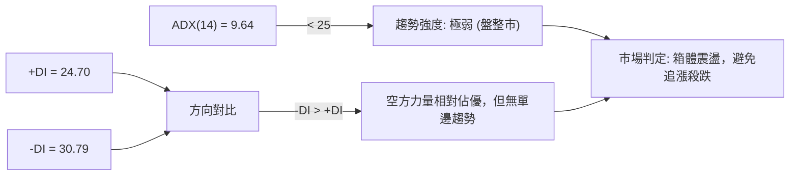

#### ADX 數值強度對照表

| ADX 區間 | 市場狀態 | 當前數值 | 當前適用策略 |
|:---|:---|:---:|:---|
| **0 – 20** | **極弱趨勢 / 無方向盤整** | **9.64 (AMD 當前)** | **箱體高拋低吸，以布林下軌支撐為依託，嚴禁追價** |
| **20 – 25** | 趨勢孕育期 | — | 觀察突破方向與量能確認 |
| **25 – 40** | 強趨勢行情 | — | 順應趨勢進行均線動能跟隨 |
| **40 – 60** | 極強單邊行情 | — | 持股續抱，移步止損 |
| **60 – 100**| 超買/超賣耗竭 | — | 警惕趨勢反轉 |

---

## 3. 圖表形態分析

### 🔍 形態識別系統

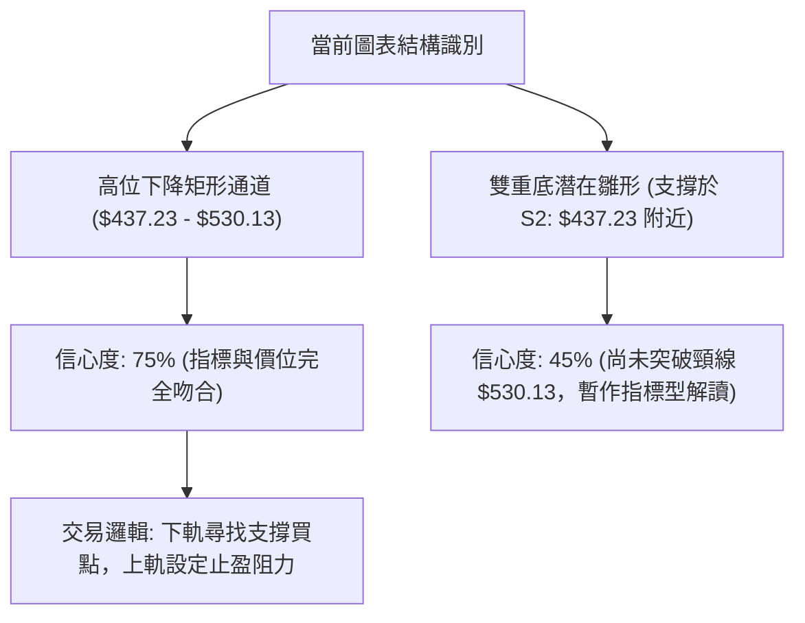

#### 形態信心度評估表

| 形態名稱 | 信心度 | 判斷依據（引用數據） | 完成度 | 目標價（附計算式） |
|:---|:---:|:---|:---:|:---|
| **高位箱體整理** | **75%** | 價格受限於布林下軌 $437.61 / S2 $437.23 與阻力 R2 $530.13 / BB上軌 $536.51 之間 | 85% | 向上目標：$530.13 (R2)；向下目標：$437.23 (S2) |
| **潛在雙重底 (W底)** | **45%** | 2026-05-17 低點 $424.10 與 2026-08-02 低點 $476.15 構成次級支撐，但頸線尚未突破 | 40% | 訊號不足，僅做指標型解讀（若突破頸線 R2 $530.13，理論高度 = $530.13 + ($530.13 - $437.23) = $623.03） |
| **短線收斂三角** | **60%** | 上方受阻於 MA20 ($487.06) 與 R1 ($469.22)，下方受 S1 ($461.71) 托底 | 70% | 向上突破 R1 目標為 R2 $530.13；跌破 S1 目標為 S2 $437.23 |

### 🕯️ 重要K線形態分析

| 期間/月份 | 收盤價 | K線形態 | 解讀 | 訊號 |
|:---|:---:|:---|:---|:---:|
| **2026-06 (月線)** | $580.91 | 長上影紡錘陽線 | 創 52W 高點 $584.73 後遭遇強大獲利了結賣壓 | 🔴 見頂預警 |
| **2026-07 (月線)** | $476.15 | 大陰線包覆 | 實體跌破短期均線，獲利盤迅速出逃 | 🔴 空頭宣洩 |
| **2026-08 (近4週)**| $466.42 | 低位十字星/縮量整理 | 跌勢在 S2 ($437.23) 上方趨緩，空方動能減弱 | 🟡 止跌蓄勢 |
| **2026-08-16 (週線)**| $514.39 | 衝高回落小陽線 | 挑戰 MA50 ($509.94) 遇阻，上影線顯示阻力強勁 | 🔴 上檔有壓 |
| **2026-08-23 (當週)**| $466.42 | 縮量陰十字 | 量能極度萎縮至 62.19M，多空處於觀望平衡點 | 🟡 變盤前夕 |

### 📉 ASCII 走勢形態示意圖

```
高位箱體與關鍵波段點位示意圖
$584.73 ──────────┬───────────────────────────────────── 歷史頂部 (52W High)
                  │ 
$530.13 ──────────┼──────────────────●────────────────── 箱體上軌 (頸線阻力 R2)
                  │                 / \
$487.06 ──────────┼────────●───────/───\──────●───────── 中軌阻力 (MA20 / BB中軌)
$469.22 ──────────┼───────/ \─────/─────\────/ ◄── R1 
$466.42 (現價) ───┼──────/───\───/───────\──/─────────── 當前震盪區間
$461.71 ──────────┼─────/─────●─/─────────● ◄── S1 
                  │    /       \ /
$437.23 ──────────┴───●─────────●─────────────────────── 箱體下軌 (強支撐 S2)
                     (低點1)   (低點2)
```

### 🎯 形態目標價計算

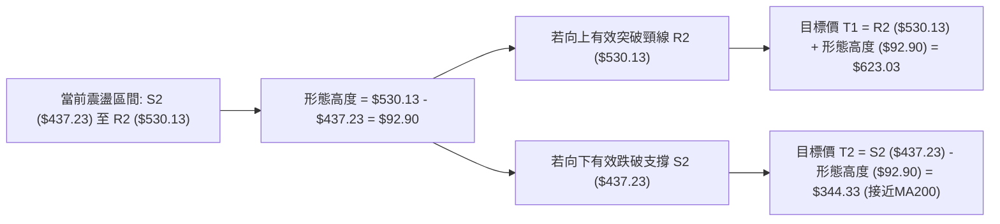

---

## 4. 支撐與阻力

### 🗺️ 關鍵價位分布圖（Unicode）

```
AMD 價位結構分布圖
══════════════════════════════════════════════════════════════
$584.73 ║██████████████████████████████║ 52週歷史高點 (0.0% Fib)
$546.44 ║████████████████████████      ║ 強阻力 R3 (近一年波段高點)
$530.13 ║████████████████████          ║ 關鍵阻力 R2 / 箱體頂部
$487.06 ║▓▓▓▓▓▓▓▓▓▓▓▓▓▓▓▓▓▓            ║ 動態阻力 MA20 / BB中軌
$481.95 ║▓▓▓▓▓▓▓▓▓▓▓▓▓▓▓▓              ║ 斐波那契回調 23.6%
$469.22 ║▓▓▓▓▓▓▓▓▓▓▓▓                  ║ 短線阻力 R1 (+0.60%)
$466.42 ╠══════════════════════════════╣ ◄ 現價 ($466.42)
$461.71 ║░░░░░░░░░░░░                  ║ 近期支撐 S1 (-1.01%)
$437.61 ║▒▒▒▒▒▒▒▒▒▒▒▒▒▒▒▒▒▒▒▒          ║ 布林通道下軌
$437.23 ║████████████████████████      ║ 強支撐 S2 (-6.26%)
$424.03 ║██████████████████████████    ║ 關鍵支撐 S3 (-9.09%)
$418.37 ║████████████████████████████  ║ 斐波那契回調 38.2%
$327.73 ║██████████████████████████████║ 長期生命線 MA200
══════════════════════════════════════════════════════════════
```

### 🚧 阻力位分析表

| 阻力級別 | 價位 | 距現價幅寬 | 形成原因 | 突破難度 | 重要性 |
|:---|:---:|:---:|:---|:---:|:---:|
| **R1 (短線阻力)** | **$469.22** | +0.60% | 近期日線微型波段高點聚類，短線多空分水嶺 | 🟡 中等 | ★★★☆☆ |
| **R2 (波段阻力)** | **$530.13** | +13.66% | 近一年波段高點聚類、高位箱體震盪上軌頸線 | 🔴 極高 | ★★★★★ |
| **R3 (強阻力位)** | **$546.44** | +17.16% | 週線級別密集套牢區，反彈極限壓力位 | 🔴 極高 | ★★★★☆ |

### 🛡️ 支撐位分析表

| 支撐級別 | 價位 | 距現價幅寬 | 形成原因 | 守住機率 | 重要性 |
|:---|:---:|:---:|:---|:---:|:---:|
| **S1 (即時支撐)** | **$461.71** | -1.01% | 近一年波段低點聚類，今日短線防守第一道防線 | 🟡 60% | ★★★☆☆ |
| **S2 (關鍵強支撐)**| **$437.23** | -6.26% | 波段低點聚類，與布林下軌 $437.61 高度重合 | 🟢 75% | ★★★★★ |
| **S3 (防守底線)** | **$424.03** | -9.09% | 2026-05-17 波段低點，接近 38.2% Fib ($418.37) | 🟢 85% | ★★★★☆ |

### 📐 斐波那契回調位分析

依據 52 週完整波動區間（低點 $149.22 至高點 $584.73，總跨度 $435.51）精確計算：

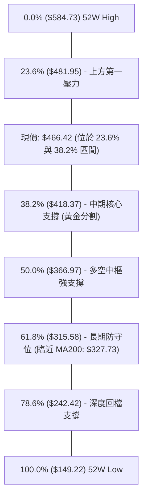

#### 斐波那契價位解讀表

| 回調比例 | 基準價位 | 距離現價 | 技術意義與多空心理解讀 |
|:---|:---:|:---:|:---|
| **0.0% (高點)** | **$584.73** | +25.36% | 本輪牛市峰值，構成宏觀多頭天花板 |
| **23.6%** | **$481.95** | +3.33% | **當前上方即時阻力**。現價處於其下方，顯示淺度回檔已被打破 |
| **38.2%** | **$418.37** | -10.30% | **牛市健康回檔的極限支撐區**，若 S3 ($424.03) 失守將回測此處 |
| **50.0%** | **$366.97** | -21.32% | 多空中樞，跌破代表本輪主升浪動能全面瓦解 |
| **61.8%** | **$315.58** | -32.34% | 黃金分割強支撐，與 MA200 ($327.73) 形成長期多頭共振防線 |
| **78.6%** | **$242.42** | -48.03% | 深幅回檔防禦區 |
| **100.0% (低點)**| **$149.22** | -68.01% | 52週起漲點 |

---

## 5. 技術指標深度解讀

### 🎛️ 指標訊號總覽

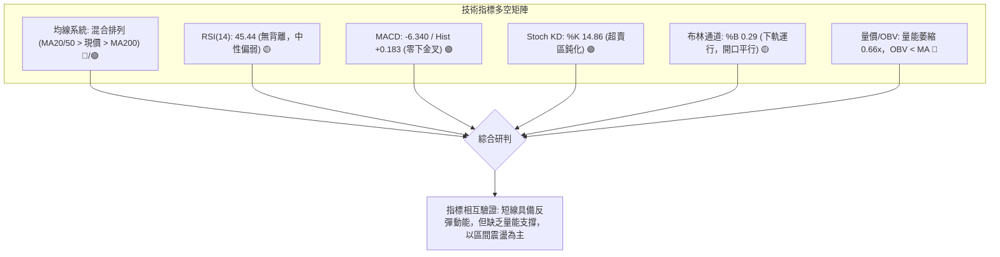

### 📈 移動平均線排列分析

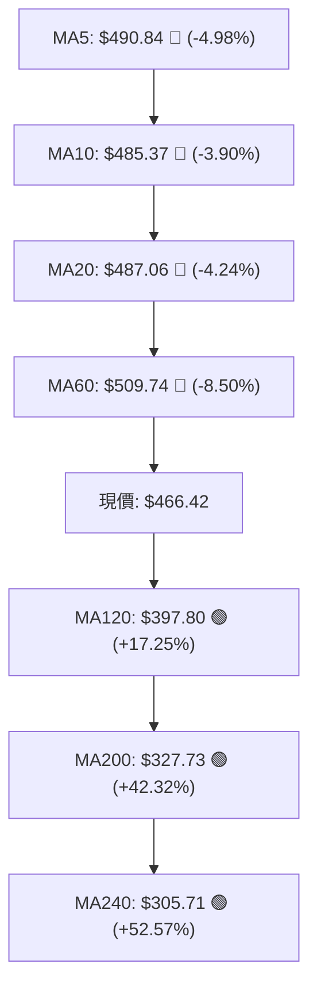

#### 均線系統數據詳解

| 均線名稱 | 當前價格 | 與現價偏離度 | 斜率與趨勢狀態 | 多空訊號 |
|:---|:---:|:---:|:---|:---:|
| **MA 5** | $490.84 | -4.98% | 快速下行，短線死叉壓制 | 🔴 空頭 |
| **MA 10** | $485.37 | -3.90% | 走平微跌，形成短線第一道反壓 | 🔴 空頭 |
| **MA 20 (月線)** | $487.06 | -4.24% | 下行斜率減緩，為多空短線強弱分水嶺 | 🔴 空頭 |
| **MA 50 / 60 (季線)**| $509.94 / $509.74 | -8.54% | 高位拐頭向下，中期主要阻力區間 | 🔴 空頭 |
| **MA 120 (半年線)**| $397.80 | +17.25% | 強烈向上發散，中期多頭重要防線 | 🟢 多頭 |
| **MA 200 / 240 (年線)**| $327.73 / $305.71 | +42.32% | 宏觀多頭向上，長期牛市基石極其穩固 | 🟢 強多 |

### 📉 RSI(14) 分析

```
RSI(14) 當前數值: 45.44
0 ────────── 30 ────────────────────── 50 ────────────────────── 70 ────────── 100
░░░░░░░░░░░░░░░░░░░░░░░░░░░░░░░░░░░░░░░░█░░░░░░░░░░░░░░░░░░░░░░░░░░░░░░░░░░░░░░░░░
             [超賣區]                 ▲[現值 45.44]              [超買區]
```

- **動能評估**：RSI(14) 目前讀數為 **45.44**（位於 40–50 之弱勢平衡區間），既未觸及 30 以下之嚴重超賣，亦未進入 70 以上之過熱區。
- **背離判斷**：
  - **頂背離**：無。前期高點 $580.91 回落後，RSI 已完成相應的快速冷卻。
  - **底背離**：**無明顯背離**。價格在 $466.42 附近盤整，RSI 同步於 40–46 區間震盪，指標走勢與價格走勢高度一致，未出現底背離金叉確認訊號。

### 📊 MACD(12/26/9) 訊號解讀

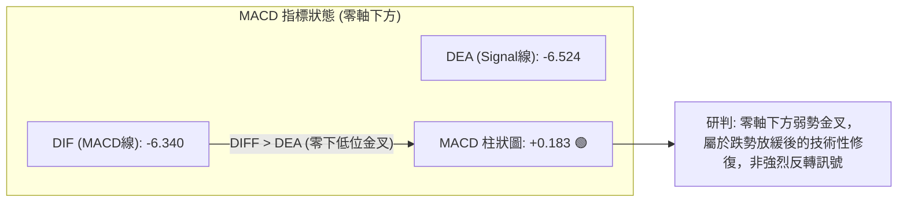

當前 MACD 數值為 -6.340，訊號線為 -6.524，柱狀圖為 **+0.183**。雖然柱狀圖已由負轉正出現黃金交叉，但由於雙線均處於零軸下方深處（負值區），表明市場仍由中級空頭主導，當前金叉僅定義為**超跌修復反彈**，上行至零軸附近預計將面臨二次阻力考驗。

### 📦 布林通道分析

```
布林通道 (Bollinger Bands 20, 2) 結構圖
$536.51 ────────────────────────────────────────── BB 上軌 (阻力帶)
        │
$487.06 ┈┈┈┈┈┈┈┈┈┈┈┈┈┈┈┈┈┈┈┈┈┈┈┈┈┈┈┈┈┈┈┈┈┈┈┈┈┈┈┈┈┈ BB 中軌 (MA20 阻力)
        │ 
$466.42 ◄────── 現價 (%B = 0.29，運行於中下軌之間)
        │
$437.61 ────────────────────────────────────────── BB 下軌 (支撐帶，與 S2 $437.23 重合)
```

- **通道寬度**：帶寬（Bandwidth）為 $\frac{536.51 - 437.61}{487.06} = 20.3\%$，通道開口由前期的擴張轉為平行收斂，預示單邊快速下行行情結束，轉入區間修整。
- **%B 指標**：當前 **%B = 0.29**，位於 0.20–0.50 弱勢震盪區，價格受到下軌（$437.61）與 S2（$437.23）的強勁支撐托底。

### 💹 成交量分析（量價配合度）

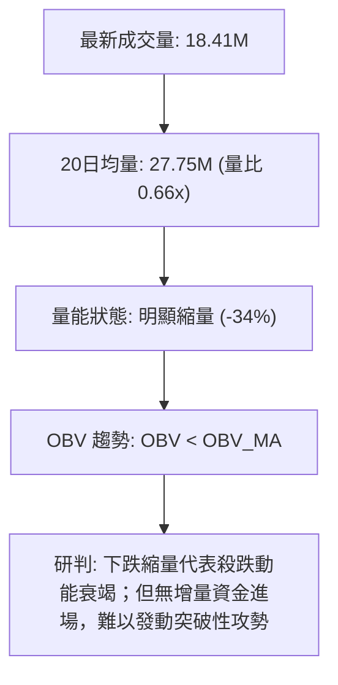

- **量價關係**：2026-08-20 最新日成交量為 18,411,867 股，相較於 20 日均量 27,749,408 股，量比僅 **0.66x**。
- **量價背離分析**：在回調過程中，成交量持續自主升浪期間的 2.5 億股/週萎縮至 62M/週，呈現典型的**量縮回檔**特徵。雖然顯示空方拋壓已大幅減輕，但 **OBV < MA** 表明機構主力買盤處於觀望狀態，缺乏主動推升價格的主力資金。

---

## 6. 動能與波動率

### ⚡ 動能評估四象限

| 象限 | 動能強度 | 波動率水準 | 當前狀態 | 交易環境評估與策略指導 |
|:---:|:---:|:---:|:---:|:---|
| **Q1** | 強 (高動能) | 低 (低波動) | — | 穩定單邊趨勢，最佳加碼區間 |
| **Q2** | 弱 (低動能) | 低 (低波動) | **✓ (AMD 當前)** | **箱體低波動整理，謹慎觀望，採用區間高拋低吸策略** |
| **Q3** | 強 (高動能) | 高 (高波動) | — | 主升浪或主跌浪，高風險高回報 |
| **Q4** | 弱 (低動能) | 高 (高波動) | — | 寬幅無序震盪，容易雙向侵蝕本金，應避免頻繁進場 |

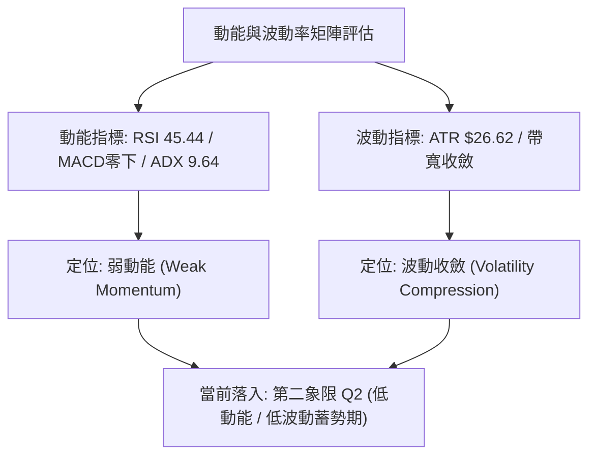

### 📊 ATR 波動率分析

- **ATR(14) 數值**：**$26.62**（佔當前股價之 **5.71%**），反映 AMD 屬於高日度波動標的。
- **止損距離建議**：
  - **日內/短線交易**：建議採用 1.0x ATR = **$26.62** 防守空間。
  - **波段交易**：建議採用 1.5x ATR = **$39.93** 至 2.0x ATR = **$53.24** 作為止損緩衝，以防日內假突破引發洗盤。

### 📐 Beta 與市場相關性

- **Beta 係數**：**2.489**（高 Beta 屬性）。
- **市場敏感度解讀**：AMD 對標普500指數與那斯達克100指數具有極高的放大效應。大盤每波動 1%，AMD 理論波動約 2.49%。在目前大盤與半導體板塊進入高位震盪期，高 Beta 意味著個股下檔回調劇烈，但在企穩反彈時亦將提供顯著的超額 Alpha 動能。

---

## 7. 多時框架總結

### 📋 時框架評分表

| 時框架 | 趨勢方向 | 動能指標 | 均線排列 | 形態結構 | 綜合評分 | 交易指導建議 |
|:---|:---:|:---:|:---:|:---:|:---:|:---|
| **長期 (月線)** | 🟢 強烈看多 | 強（歷史主升後回檔）| 多頭排列 (遠高於 MA200) | 大級別上升通道 | **80/100** | 長期投資者持股續抱，回調皆為建倉契機 |
| **中期 (週線)** | 🟡 中性偏弱 | 弱（MACD負值收斂中） | 跌破短期週均線 | 高位矩形箱體震盪 | **45/100** | 中期波段者等待下軌 S2 ($437.23) 企穩確認 |
| **短期 (日線)** | 🔴 短線偏空 | 中（MACD金叉但量縮） | 均線空頭壓制 (MA20/50) | 區間收斂三角整理 | **40/100** | 短線嚴禁追高，依布林下軌支撐做區間低吸 |

### 🔲 綜合訊號矩陣

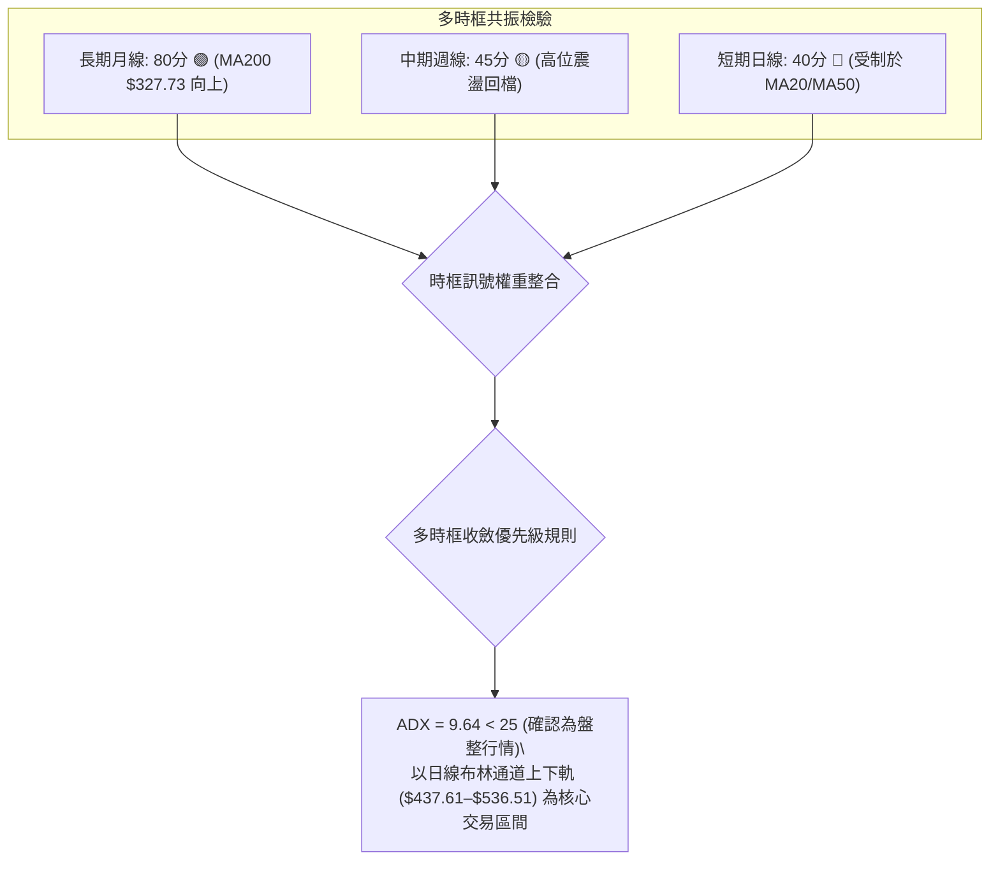

### ⚖️ 多時框收斂結論

> **明確判定**：
> 1. **行情屬性定調**：當前 ADX(14) 數值為 **9.64**，遠低於 25 的趨勢門檻，確立當前市場處於**典型無趨勢盤整行情**。
> 2. **主導時框收斂**：依據多時框收斂規則，在盤整行情中，中長期單邊趨勢暫時退居背景，**日線布林通道 ($437.61 至 $536.51) 與關鍵波段高低點聚類（S2: $437.23 至 R2: $530.13）** 作為主要交易區間。
> 3. **唯一方向性結論**：**【中性觀望 / 區間震盪操作】**。日線雖受 MA20/MA50 壓制，但下檔在 S2 ($437.23) 具備布林下軌強支撐，且 MACD 出現零下金叉修復訊號，多空在此陷入拉鋸平衡。

---

## 8. 交易策略建議

### 🗺️ 策略決策流程圖

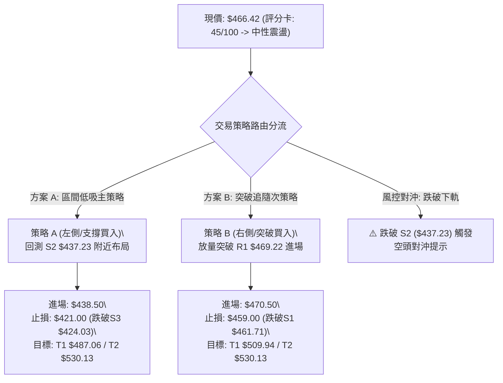

### 🧭 策略路由（依評分卡分流）

**當前主策略方向 = 【中性區間震盪操作 / 逢低布局】（依技術評分卡：45 / 100）**

因技術評分處於 40–60 中性區間，市場進入典型無趨勢震盪期，交易策略不宜採取單邊追漲殺跌，應嚴格圍繞**支撐位 S2 ($437.23) 與阻力位 R1/R2** 進行高拋低吸或等待右側突破確認。

### 🎯 價格情境階梯（Price Scenarios）

| 觸發條件 | 第一目標 | 第二目標 | 後續延伸 | 情境技術含義與應對方針 |
|:---|:---:|:---:|:---:|:---|
| **向上突破 R1 $469.22** | **R2 $530.13** | **R3 $546.44** | **52W高點 $584.73** | 短線轉強，突破 MA20 ($487.06)，上看箱體頂部 |
| **維持現價區間震盪** | **MA20 $487.06**| **S1 $461.71** | — | 於 $437.23–$487.06 區間窄幅整理，耐心等待量能放大 |
| **向下跌破 S1 $461.71** | **S2 $437.23** | **S3 $424.03** | **Fib 38.2% $418.37**| 短線回測箱體下軌尋求雙底支撐，為關鍵低吸區 |
| **失守強支撐 S2 $437.23**| **S3 $424.03** | **Fib 38.2% $418.37**| **MA200 $327.73** | 中期形態走壞，觸發停損並啟動空頭對沖防禦 |

### 📊 情境機率分佈

| 情境劇本 | 機率 | 主要技術依據與指標確認 |
|:---|:---:|:---|
| **情境一：區間震盪築底（主情境）** | **55%** | ADX 僅 9.64 缺乏趨勢；布林帶寬收斂；OBV 縮量整理顯示多空處於均勢 |
| **情境二：觸底弱勢反彈（次情境）** | **30%** | MACD 零下金叉（Hist +0.183）；Stoch KD 進入超賣區（%K 14.86）；下軌支撐有效 |
| **情境三：跌破下軌破位下行（風險情境）**| **15%** | 均線空頭排列（MA20/50 壓制）；-DI (30.79) 仍大於 +DI (24.70) |

### 🟢 主策略詳情

本報告依據嚴格風控原則，提供「左側區間低吸（策略A）」與「右側突破跟進（策略B）」兩套執行細則：

| 策略要素 | 策略 A（支撐低吸策略 - 首選） | 策略 B（右側突破跟隨 - 次選） |
|:---|:---:|:---:|
| **策略定位** | 箱體下軌左側分批布局 | 突破短線反壓右側確認 |
| **進場條件** | 股價回踩 S2 ($437.23) / 布林下軌附近止跌 | 股價放量突破阻力 R1 ($469.22) 並站穩 1 小時 |
| **進場價格** | **$438.50** (S2 $437.23 上方浮動) | **$470.50** (突破 R1 $469.22 後確認) |
| **目標價 T1** | **$487.06** (MA20 / BB中軌) | **$509.94** (MA50 / 季線壓力) |
| **目標價 T2** | **$530.13** (阻力位 R2 / 箱體上軌) | **$530.13** (阻力位 R2 / 箱體頂部) |
| **止損價格** | **$421.00** (嚴格跌破 S3 $424.03 與 1.5x ATR 緩衝) | **$459.00** (跌破支撐位 S1 $461.71 防守位) |
| **風險空間** | $17.50 (-3.99%) | $11.50 (-2.44%) |
| **潛在收益 (T2)**| +$91.63 (+20.90%) | +$59.63 (+12.67%) |
| **風險報酬比 (R:R)**| **1 : 5.24** (以 T2 計算) / **1 : 2.77** (以 T1 計算) | **1 : 5.19** (以 T2 計算) / **1 : 3.43** (以 T1 計算) |
| **成功機率** | **65%** | **55%** |
| **建議倉位** | **15% - 20%** (分批建倉) | **10% - 15%** (突破加碼) |

### 🔴 反向風險觸發點（對沖提示）

- **多頭結構破壞點**：若日K線收盤價**實體跌破強支撐 S2 ($437.23)**，且量能放大超過 20 日均量（27.75M），代表高位矩形箱體破位，下方將直接回測 S3 ($424.03) 及 38.2% 斐波那契位 ($418.37)。
- **對沖應對措施**：一旦觸發此跌破訊號，所有多頭部位應無條件止損離場，並可透過買入看跌期權（Put Option）或將投資組合 Beta 降至 0.5 以下進行風險對沖。

### ⭐ 整體訊號強度評星

```
╔══════════════════════════════════════════════════╗
║ 做多訊號強度：  ★★☆☆☆  (2.5/5星 - 區間蓄勢中)   ║
║ 做空訊號強度：  ★★☆☆☆  (2.0/5星 - 殺跌動能竭)   ║
║ 整體技術可信度：★★★☆☆  (3.5/5星 - 盤整確立)   ║
╚══════════════════════════════════════════════════╝
```

---

## 9. 風險提示與監控

### ✅ 關鍵監控指標 Checklist

```
╔══════════════════════════════════════════════════════════════╗
║              AMD 每日技術監控 Checklist                        ║
╠══════════════════════════════════════════════════════════════╣
║ [ ] 1. 價格是否站上 R1 ($469.22) 與 MA20 ($487.06) 短期均線  ║
║ [ ] 2. 下檔是否堅守 S1 ($461.71) 及關鍵支撐 S2 ($437.23)     ║
║ [ ] 3. MACD 柱狀圖是否持續擴張維持正值 (> +0.183)             ║
║ [ ] 4. 日成交量能否回升至 20日均量 (27.75M) 以上之有效水準   ║
║ [ ] 5. ADX(14) 是否由 9.64 向上回升突破 20，確立新趨勢方向  ║
║ [ ] 6. RSI(14) 是否順利突破 50 中性格局轉強                  ║
╚══════════════════════════════════════════════════════════════╝
```

### ⚠️ 風險場景分析

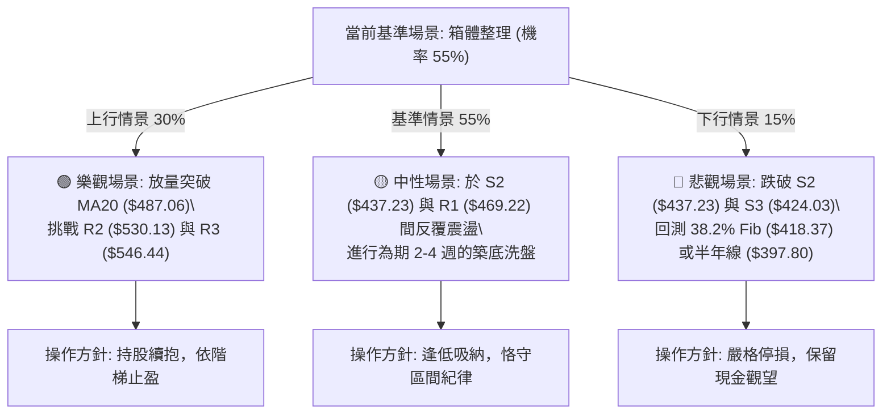

### 🛡️ 風險管理重要提醒

1. **波動率管理（ATR 紀律）**：
   AMD 的 ATR 高達 **$26.62 (5.71%)**，屬於劇烈波動股票。單筆交易的最大可承擔虧損金額不得超過總帳戶淨值的 **1.0% - 1.5%**。以 10 萬美元帳戶為例，單筆最大虧損應控制在 $1,000 - $1,500 內，換算持倉股數不宜超過 60 - 80 股。
2. **Beta 槓桿效應警示**：
   Beta 高達 **2.489**，意味著若半導體指數（SOX）或大盤出現 3% 級別的回調，AMD 跌幅恐達 7%–8%。在總體流動性趨緊或大盤弱勢時，應主動將個股曝險部位降至 30% 以下。
3. **無量盤整陷阱**：
   當前日成交量僅 18.41M（量比 0.66x），量能嚴重不足容易導致日內頻繁出現「假突破」或「假跌破」。在成交量未顯著放大前，切忌於盤中急拉時追買，所有進場應嚴格於支撐位附近低掛單。

---

## 📋 報告總結

```
╔══════════════════════════════════════════════════════════════════╗
║                    AMD 技術分析報告總結                          ║
╠══════════════════════════════════════════════════════════════════╣
║ 報告日期：2026-08-20                                            ║
║ 當前價格：$466.42                                                ║
║ 分析評級：⚖️ 中性偏弱 / 高位箱體震盪 (技術評分: 45 / 100)        ║
╠══════════════════════════════════════════════════════════════════╣
║ 關鍵結論：                                                       ║
║ ├─ 長期趨勢：🟢 強烈看多 (MA200 $327.73 向上，長期牛市結構穩固) ║
║ ├─ 中期趨勢：🟡 中性震盪 (高位獲利回吐，處於 $437.23–$530.13 箱體)║
║ ├─ 短期趨勢：🔴 弱勢整理 (受制於 MA20 $487.06，但 MACD 零下微金叉)║
║ ├─ 關鍵支撐：S1 $461.71 ｜ S2 $437.23 ｜ S3 $424.03              ║
║ ├─ 關鍵阻力：R1 $469.22 ｜ R2 $530.13 ｜ R3 $546.44              ║
║ └─ 分析師共識目標：均價 $612.84 (最高 $1,250.00 / 最低 $365.00)  ║
╠══════════════════════════════════════════════════════════════════╣
║ 最優策略組合：                                                   ║
║ 1. 🥇 最佳機會 (策略 A)：回踩 S2 $438.50 逢低買入，止損 $421.00， ║
║    目標 T1 $487.06 / T2 $530.13 (R:R = 1 : 5.24)                 ║
║ 2. 🥈 次選機會 (策略 B)：突破 R1 $470.50 右側買入，止損 $459.00， ║
║    目標 T1 $509.94 / T2 $530.13 (R:R = 1 : 5.19)                 ║
║ 3. 🥉 保守選擇：完全空倉觀望，等待 ADX > 20 且突破 $487.06 後進場 ║
╚══════════════════════════════════════════════════════════════════╝
```

---

> ⚠️ **免責聲明**：本報告為技術分析研究成果，所有數據、圖表及估算均嚴格基於所提供之歷史量價數據計算。本報告**僅供研究與學術參考**，**不構成任何形式的投資要約或買賣建議**。金融市場具有高波動風險，投資人應獨立評估自身財務狀況與風險承受能力，入市需謹慎。

---

*報告生成時間：2026-08-20 ｜ 數據來源：Yahoo Finance ｜ 分析框架：多時框技術分析模型 (Multi-Timeframe Technical Framework)*