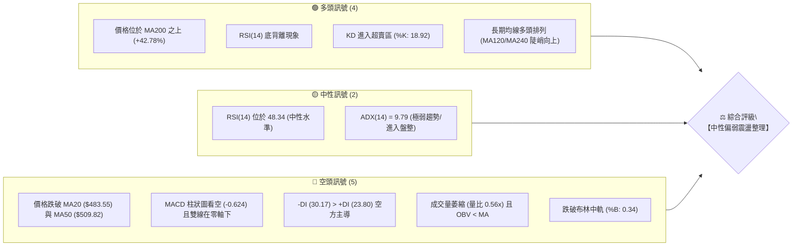
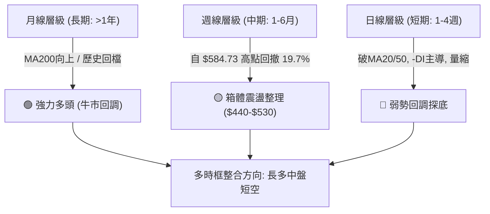
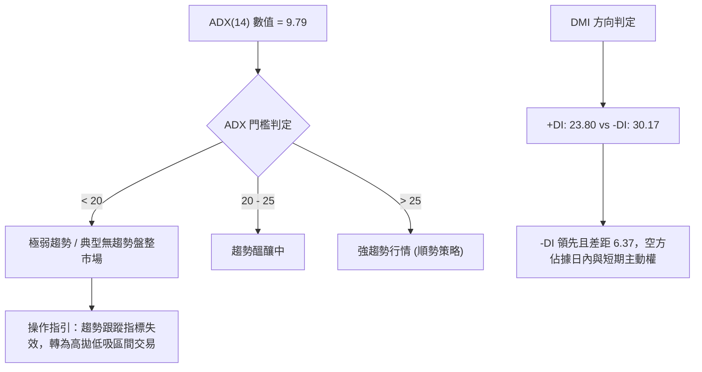
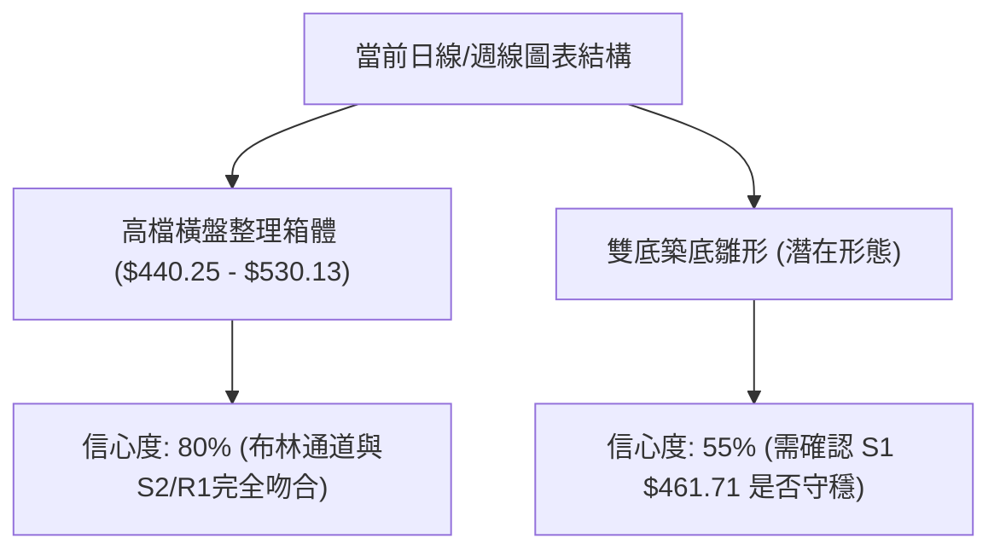
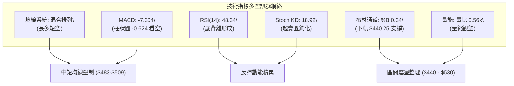
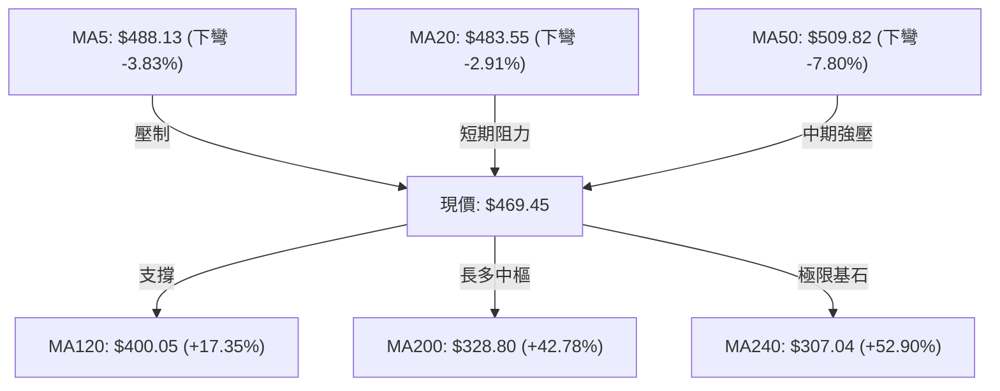
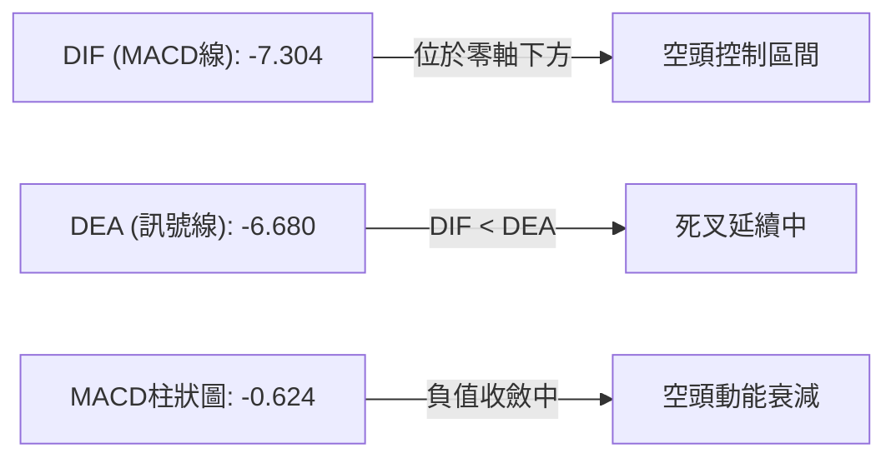
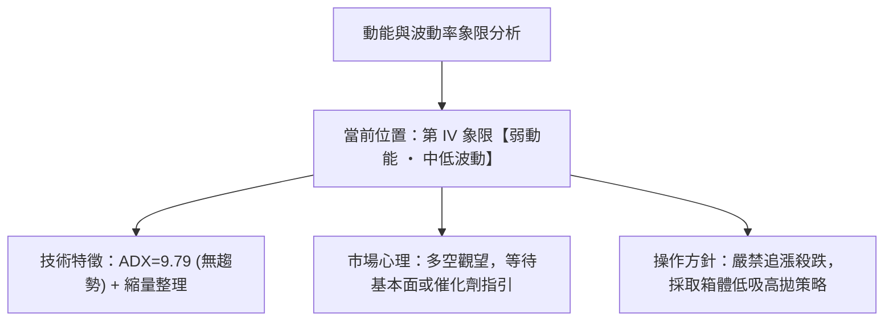
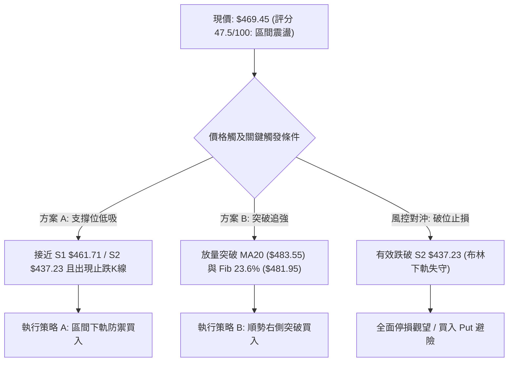
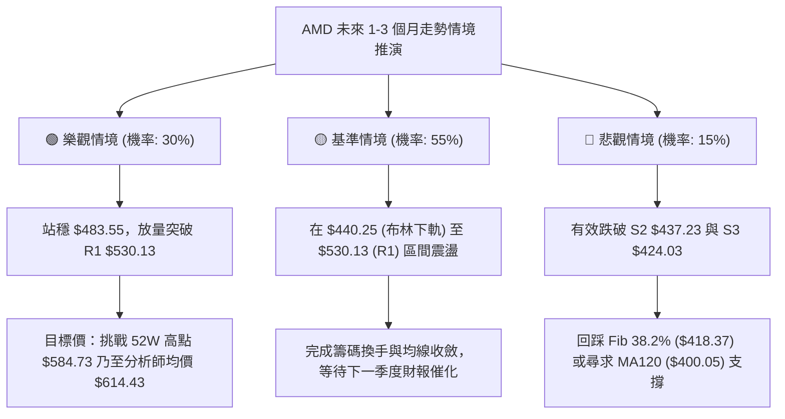

# AMD 技術分析報告

> **報告日期**：2026-08-21 ｜ **語言**：繁體中文 ｜ **數據來源**：Yahoo Finance ｜ **當前價格**：$469.45

---

## 目錄

| 章節 | 內容 |
|------|------|
| [1. 技術面概覽](#1-技術面概覽) | 訊號儀表板、核心指標、評分卡 |
| [2. 趨勢分析](#2-趨勢分析) | 多時框趨勢、長中短期走勢、ADX解讀 |
| [3. 圖表形態分析](#3-圖表形態分析) | 形態識別、K線組合、目標價計算 |
| [4. 支撐與阻力](#4-支撐與阻力) | 關鍵價位、斐波那契回調 |
| [5. 技術指標深度解讀](#5-技術指標深度解讀) | MA/RSI/MACD/布林/成交量 |
| [6. 動能與波動率](#6-動能與波動率) | 動能評估、ATR、Beta |
| [7. 多時框架總結](#7-多時框架總結) | 時框架評分矩陣、收斂結論 |
| [8. 交易策略建議](#8-交易策略建議) | 多空策略路由、風險報酬比 |
| [9. 風險提示與監控](#9-風險提示與監控) | 監控指標、風險場景 |
| [10. 報告總結](#10-報告總結) | 總體結論與精華摘要 |

---

## 1. 技術面概覽

### 🎯 技術訊號儀表板



### 📊 核心指標速覽表

| 指標類別 | 指標名稱 | 當前數值 | 訊號 | 解讀 |
|----------|----------|----------|------|------|
| **價格** | 當前價格 | $469.45 | 🟡 | 位於52週高低點區間 73.5% 處，處於自高點 $584.73 回調後的震盪整理階段 |
| **均線** | 短期 MA20 | $483.55 | 🔴 | 價格低於 MA20 (-2.91%)，短期均線下彎，壓制股價反彈 |
| **均線** | 中期 MA50 | $509.82 | 🔴 | 價格低於 MA50 (-7.92%)，中期趨勢受到壓制，多頭結構受挫 |
| **均線** | 長期 MA200| $328.80 | 🟢 | 價格遠高於 MA200 (+42.78%)，長期宏觀多頭格局未被破壞 |
| **動能** | RSI(14) | 48.34 | 🟡 | 數值處於中性區間 (30-70)，但出現日線等級「底背離」訊號 |
| **動能** | MACD(12,26,9) | -7.304 / -6.680 | 🔴 | DIF < DEA，MACD 柱為 -0.624，空頭排列尚未扭轉 |
| **動能** | Stoch KD | %K:18.92 / %D:24.22 | 🟢 | 進入 20 以下超賣區，短線隨時具備技術性反彈動能 |
| **趨勢** | ADX / DMI | ADX: 9.79, -DI: 30.17 | 🔴 | ADX < 25 為極弱趨勢/震盪盤整，但 -DI 壓制 +DI 空方暫佔優勢 |
| **通道** | 布林通道 | 中軌: $483.55, 下軌: $440.25 | 🟡 | %B 為 0.34，價格在中軌至下軌之間運行，尚未觸及極端下軌 |
| **量能** | 成交量 / OBV | 15.14M (量比 0.56x) | 🔴 | 成交量大幅縮減，OBV < MA，顯示資金進場追價意願疲弱 |
| **波動** | ATR(14) | $24.85 (5.29%) | 🟡 | 波動度處於中等水平，每日震幅約 $24.85，適合區間操作 |

### 🏆 技術評分卡

```
╔══════════════════════════════════════════════════════════════════╗
║              技術評分卡 — AMD (2026-08-21)                       ║
╠══════════════════════════════════════════════════════════════════╣
║ 趨勢強度 (ADX/DMI)    ████░░░░░░░░░░░░░░░░  25/100  🔴 空頭弱盤整 ║
║ 動能指標 (RSI/MACD/KD) ██████████░░░░░░░░░░  50/100  🟡 底背離超賣 ║
║ 支撐穩定度 (S1/S2/S3)  ██████████████░░░░░░  70/100  🟢 S1/S2支撐實 ║
║ 成交量配合 (Volume/OBV)██████░░░░░░░░░░░░░░  30/100  🔴 量能顯著萎縮 ║
║ 形態完整度 (區間整理)   ████████████░░░░░░░░  60/100  🟡 矩形箱體震盪 ║
║ 均線排列 (多空混合)    ██████████░░░░░░░░░░  50/100  🟡 長多短空結構 ║
╠══════════════════════════════════════════════════════════════════╣
║ 綜合評分              █████████░░░░░░░░░░░  47.5/100 🟡 中性觀望/區間 ║
╚══════════════════════════════════════════════════════════════════╝
```

---

## 2. 趨勢分析

### 🌐 多時框趨勢分析



### 📈 長期趨勢 — 12個月走勢圖（Unicode）

```
AMD 月線走勢圖（2025-09 至 2026-08）
價格 ($)
$580 ┤                                     ●(2026-06: $580.91 高點 $584.73)
$520 ┤                                 ●       ●(2026-07: $476.15)
$460 ┤                                     ●←現價 $469.45 (2026-08)
$350 ┤                             ●(2026-04: $354.49)
$250 ┤         ●(2025-10: $256.12)
$210 ┤             ●   ●   ●   ●   ●
$160 ┤ ●   ●
     └─────────────────────────────────────────────────────────────
       09  10  11  12  01  02  03  04  05  06  07  08 (月份: 25/09 - 26/08)
```

#### 走勢特徵分析表格

| 階段區間 | 時間段 | 價格起訖點 | 區間漲跌幅 | 核心驅動特徵 |
|----------|--------|------------|------------|--------------|
| **第一階段：底部蓄勢** | 2025-09 ~ 2026-03 | $161.79 → $203.43 | +25.74% | 在 $200-$250 構建堅實籌碼中樞，長線均線持續抬升 |
| **第二階段：主升浪狂飆**| 2026-03 ~ 2026-06 | $203.43 → $580.91 | +185.56% | AI爆發行情推動，週成交量暴增至近3億股，連拉大陽線 |
| **第三階段：高位獲利回吐**| 2026-06 ~ 2026-08 | $580.91 → $469.45 | -19.19% | 觸及歷史高點 $584.73 後出現縮量回調，進行均線修正與籌碼換手 |

### 📊 中期趨勢（週線分析）

```
週線支撐阻力結構：
$584.73 ─────────────────────── 歷史高點 (52W High)
        │
$530.13 ────── R1 ──────────── 近期波段阻力 (近4週高點聚類)
        │
$483.55 ────── MA20 ────────── 週線動能中樞 / 布林中軌
$469.45 ◄═════ 現價 ══════════ (位於斐波那契 23.6% 回調位 $481.95 下方)
        │
$461.71 ────── S1 ──────────── 近期週線低點支撐
$437.23 ────── S2 / BB下軌 ──── 強支撐防線 (布林下軌 $440.25 匯合處)
```

從近 20 週數據觀察，自 2026-06-21 觸及高點 $584.73 後，週線呈現「鋸齒狀高檔收斂震盪」。RSI 已從極度超買的 97.4（4月下旬）降至目前的 48.3，MACD 週線柱狀圖亦從高位 +10.403 快速回落至 -0.624，表明中期多頭超買壓力已完全釋放。

### ⚡ 趨勢強度評估（ADX 解讀）



#### ADX 強度對照表

| 指標變數 | 當前數值 | 參考標準 | 技術含義 | 對應操作策略 |
|----------|----------|----------|----------|--------------|
| **ADX(14)** | **9.79** | < 25 (弱) / > 25 (強) | 市場處於「無趨勢盤整」狀態，波動動能收斂 | 避免突破追單，改用布林通道與支撐阻力高拋低吸 |
| **+DI(14)** | **23.80** | 多方攻擊力道 | 多方買盤力道偏弱，缺乏持續推升資金 | 謹慎設定反彈目標，不可盲目看大多頭擴張 |
| **-DI(14)** | **30.17** | 空方打壓力道 | 空方略佔優勢，但未形成強烈單邊殺跌波段 | 逢低回測關鍵支撐位（S1/S2）尋找反彈契機 |

---

## 3. 圖表形態分析

### 🔍 形態識別系統



#### 形態識別與信心度評估表

| 形態名稱 | 信心度 | 判斷依據（引用數據） | 完成度 | 目標價（附計算式） |
|----------|--------|----------------------|--------|--------------------|
| **矩形震盪箱體** | 80% | 上方受阻於 R1 $530.13，下方支撐於布林下軌 $440.25 至 S2 $437.23 | 75% | 向上突破：$530.13 + ($530.13 - $440.25) = **$620.01**<br>向下破位：$437.23 - ($530.13 - $437.23) = **$344.33** |
| **潛在雙重底 (W底)** | 55% | 前低為 2026-08-02 週收盤 $476.15，目前測試 S1 $461.71 區域 | 40% | 若以頸線 R1 $530.13、雙底低點 S1 $461.71 推算：<br>形態高度 = $530.13 - $461.71 = $68.42<br>目標價 = $530.13 + $68.42 = **$598.55** |
| **均線死叉收斂** | 90% | MA5 ($488.13) < MA20 ($483.55) < MA50 ($509.82) 形成短期空頭排列 | 95% | 指標型解讀：空頭壓制，短線下探 S1 $461.71 或 S2 $437.23 |

### 🕯️ 重要K線形態分析

| 週/月份 | 收盤價 | K線形態 | 解讀 | 訊號 |
|---------|--------|---------|------|------|
| **2026-06** | $580.91 | 長上影大陽線 | 創下 52 週新高 $584.73，隨後多頭力竭，伴隨獲利了結賣壓 | 🔴 頂部滯漲 |
| **2026-07** | $476.15 | 中黑實體陰線 | 單月回撤 -18.03%，跌破短期均線，多頭結構轉入防守 | 🔴 空方釋放 |
| **2026-08-16 (週)**| $514.39 | 衝高受阻陽十字 | 測試 MA50 ($509.82) 與 R1 ($530.13) 失敗，留下影線 | 🟡 阻力確認 |
| **2026-08-23 (當週)**| $469.45 | 縮量小陰線 | 量能驟降至 78.13M，下探考驗 S1 ($461.71) 支撐力道 | 🟡 縮量回測 |

### 📉 ASCII 走勢形態示意圖

```
AMD 箱體震盪與潛在雙底結構示意圖
$546.44 ─────────────────────────────────────────── [R2 阻力區]
            ┌──┐
$530.13 ────│頸 │───────┌──┐──────────────────────── [R1 頸線阻力]
            │線 │       │  │
$483.55 ────┼───┼───────┼──┼─────── (MA20 / 布林中軌)
            │   │       │  │  ▲ 現價 $469.45 (回測中)
$461.71 ────┴───┴───────┴──┴───? ───────────────── [S1 第一低點 / 潛在第二底]
         (2026-08-02) (2026-08-21)
$437.23 ─────────────────────────────────────────── [S2 強支撐 / 破位止損線]
```

### 🎯 形態目標價計算

1. **箱體上限突破（多頭突破情境）**：
   - 頸線/箱頂：$530.13（引用 R1）
   - 箱底基準：$440.25（引用布林下軌）
   - 形態垂直高度：$530.13 - $440.25 = **$89.88**
   - 測幅滿足目標價：$530.13 + $89.88 = **$620.01**
2. **潛在雙底突破（次級多頭情境）**：
   - 頸線位置：$530.13（引用 R1）
   - 底部支撐：$461.71（引用 S1）
   - 形態高度：$530.13 - $461.71 = **$68.42**
   - 測幅滿足目標價：$530.13 + $68.42 = **$598.55**
3. **箱體破位下行（空頭破位情境）**：
   - 箱底跌破點：$437.23（引用 S2）
   - 測幅等幅跌幅：$437.23 - ($530.13 - $437.23) = **$344.33**（逼近 MA200 $328.80）

---

## 4. 支撐與阻力

### 🗺️ 關鍵價位分布圖（Unicode）

```
AMD 價位結構分布圖（OHLCV 聚類計算與斐波那契整合）
═══════════════════════════════════════════════════════════════════
$584.73 ║██████████████████████████████║ 52W 歷史最高點 (Fib 0.0%)
$562.23 ║████████████████████████      ║ 強阻力 R3 (+19.76%)
$546.44 ║████████████████████          ║ 阻力 R2 (+16.40%)
$530.13 ║████████████████████████████  ║ 關鍵頸線阻力 R1 (+12.92%)
$481.95 ║▓▓▓▓▓▓▓▓▓▓▓▓▓▓▓▓▓▓▓▓▓▓        ║ Fib 23.6% 回調位 / MA20 ($483.55)
$469.45 ╠══════════════════════════════╣ ◄ 現價 ($469.45)
$461.71 ║▓▓▓▓▓▓▓▓▓▓▓▓▓▓▓▓▓▓▓▓          ║ 近期波段支撐 S1 (-1.65%)
$440.25 ║██████████████████████        ║ 布林通道下軌
$437.23 ║████████████████████████████  ║ 強支撐防線 S2 (-6.86%)
$418.37 ║▓▓▓▓▓▓▓▓▓▓▓▓▓▓▓▓▓▓▓▓▓▓▓▓▓▓    ║ Fib 38.2% 重要防守位
$424.03 ║████████████████              ║ 深度回調支撐 S3 (-9.68%)
$328.80 ║██████████████████████████████║ 牛熊生命線 MA200
═══════════════════════════════════════════════════════════════════
```

### 🚧 阻力位分析表

| 阻力級別 | 精確價位 | 形成原因（OHLCV聚類） | 突破難度 | 重要性評估 |
|----------|----------|----------------------|----------|------------|
| **R1** | **$530.13** | 近一年波段高點聚類、箱體上軌、接近布林上軌 ($526.85) | ⭐⭐⭐☆ (中高) | 🔴 **短線多空分水嶺**：站穩此線方能確認反轉並重啟牛市主升浪 |
| **R2** | **$546.44** | 2026年7月中旬反彈次高點密集成交區 | ⭐⭐⭐⭐ (高) | 🟡 **波段獲利賣壓區**：前波套牢籌碼密集區 |
| **R3** | **$562.23** | 衝擊歷史天價前的最後阻力平台 | ⭐⭐⭐⭐⭐ (極高) | 🔴 **歷史重壓區**：逼近 52W 高點 $584.73 之強阻力區間 |

### 🛡️ 支撐位分析表

| 支撐級別 | 精確價位 | 形成原因（OHLCV聚類） | 守住機率 | 重要性評估 |
|----------|----------|----------------------|----------|------------|
| **S1** | **$461.71** | 近一年波段低點聚類、近期回調低點防線 | 65% | 🟢 **短線關鍵防線**：若失守則短線將向布林下軌與 S2 尋求支撐 |
| **S2** | **$437.23** | 近一年波段強支撐低點聚類，與布林下軌 $440.25 形成共振支撐帶 | 80% | 🟢 **波段核心護城河**：中短期多頭底線，跌破將引發停損賣壓 |
| **S3** | **$424.03** | 深度回調支撐，接近 Fib 38.2% ($418.37) 與 MA120 ($400.05) | 90% | 🟢 **長期結構防守位**：長線資金逢低吸納之黃金買點 |

### 📐 斐波那契回調位分析

> 計算基準：52週波段區間 **$149.22 (52W Low)** → **$584.73 (52W High)**，總垂直波幅 $435.51。

| 回調比例 | 精確價位 | 當前相對位置與技術意義 |
|----------|----------|------------------------|
| **0.0% (高點)** | **$584.73** | 52週歷史高點，長期牛市頂部壓力 |
| **23.6%** | **$481.95** | **現價 ($469.45) 位於此線下方 -2.59%**。失守 23.6% 回調位表明強勢單邊行情暫告段落，進入標準多頭回檔。 |
| **38.2%** | **$418.37** | 經典黃金分割支撐，若跌破 S2 ($437.23)，該位置將成為最強防守緩衝區。 |
| **50.0%** | **$366.97** | 強弱平衡中樞，牛市多頭回調之極限容忍位。 |
| **61.8%** | **$315.58** | 黃金分割強支撐位，與 MA200 ($328.80) / MA240 ($307.04) 形成長週期鐵底。 |
| **78.6%** | **$242.42** | 深度回撤防線（極端熊市情境）。 |
| **100.0% (低點)**| **$149.22** | 52週起漲點基石。 |

---

## 5. 技術指標深度解讀

### 🎛️ 指標訊號總覽



### 📈 移動平均線排列分析



- **短週期均線（MA5、MA10、MA20）**：呈現空頭發散排列，MA5 ($488.13) 與 MA20 ($483.55) 均位於現價上方，構成第一道動態阻力帶（$483 - $488）。
- **中週期均線（MA50、MA60）**：MA50 位於 $509.82，MA60 位於 $509.17，兩者高度重合，形成 $509-$510 的強大「均線反壓蓋頂」。
- **長週期均線（MA120、MA200、MA240）**：MA120 ($400.05) 與 MA200 ($328.80) 仍保持向上斜率，價格遠在 MA200 之上 +42.78%，確認**長期宏觀多頭趨勢完全未變**。

### 📉 RSI(14) 分析與背離判定

```
RSI(14) 動能進度條：
[0] ─────────── [30 超賣] ────── [48.34 現值] ────── [70 超買] ─────────── [100]
                ▓▓▓▓▓▓▓▓▓▓▓▓▓▓▓▓▓▓░░░░░░░░░░░░░░░░░░░░ (48.34% - 中性偏弱)
```

- **背離分析結論**：⚠️ **明確存在日線「底背離」(Bullish Divergence)**。
  - **價格走勢**：AMD 價格從 2026-08-02 的 $476.15 下探至當前 $469.45，創出近一個月波段新低。
  - **RSI 指標**：RSI(14) 數值由 2026-08-02 的 **40.6** 抬升至當前的 **48.34**，價格創新低而 RSI 未創新低且底部抬高，表明下殺動能已大幅衰竭，隨時醞釀技術性反彈。

### 📊 MACD(12/26/9) 訊號解讀



- MACD 線 (-7.304) 仍在 Signal 線 (-6.680) 下方運行，柱狀圖為 -0.624，呈現空頭結構。
- 但從週線柱狀圖觀察，負柱狀值已從 2026-08-02 的 **-9.004** 快速收斂至目前的 **-0.624**，顯示波段空頭動能已近尾聲，接近金叉觸發點。

### 📦 布林通道分析

```
AMD 布林通道 (20, 2) 結構圖：
$526.85 ────────────────────────────────────── 上軌 (Upper Band)
        │
$483.55 ────────────────────────────────────── 中軌 (MA20 Baseline)
        │
$469.45 ◄═════════════════════════════════════ 當前價格 (%B = 0.34)
        │
$440.25 ────────────────────────────────────── 下軌 (Lower Band)
```

- **帶寬與位置**：通道上軌 $526.85、中軌 $483.55、下軌 $440.25。%B 數值為 **0.34**，價格處於中下軌之間。
- **通道行為**：通道開口未呈現單邊擴張，而是呈現橫向收口走平態勢，印證 ADX=9.79 之震盪市特徵。布林下軌 $440.25 與 S2 ($437.23) 形成多頭強支撐帶。

### 💹 成交量分析（量價配合度）

- **量比與均量**：最新成交量為 15,144,568 股，相較 20 日均量 (27,188,708) 量比僅為 **0.56x**，縮量超過 44%。
- **OBV 能量潮**：OBV < MA，顯示能量潮持續下行，資金呈現淨流出。
- **量價背離解讀**：價格在 S1 ($461.71) 上方呈現「極致縮量整理」，顯示市場拋壓已竭，但同時場外買盤仍保持觀望，需等待放量突破中軌方能確認反轉。

---

## 6. 動能與波動率

### ⚡ 動能評估四象限



#### 四象限評估矩陣

| 象限 | 動能維度 | 波動維度 | 歷史代表狀態 | 當前匹配度 | 戰略應對方針 |
|------|----------|----------|--------------|------------|--------------|
| **象限 I** | 強動能 (多頭) | 高波動 | 2026年4-5月主升浪 | 10% | 順勢加碼，移動止盈 |
| **象限 II** | 強動能 (空頭) | 高波動 | 2026年7月暴跌期 | 20% | 嚴格停損，反手做空 |
| **象限 III** | 弱動能 | 高波動 | 頂部寬幅震盪 | 15% | 減倉觀望，降低槓桿 |
| **象限 IV** | **弱動能 (盤整)** | **中低波動** | **當前 AMD 狀態** | **85% (當前)** | **高拋低吸，區間套利** |

### 📊 ATR 波動率分析

- **ATR(14) 數值**：**$24.85**（佔現價百分比為 **5.29%**）。
- **日內/波段波動區間**：
  - 1 倍 ATR 單日波動區間：$444.60 ～ $494.30。
  - 2 倍 ATR 波段波動區間：$419.75 ～ $519.15。
- **動態止損建議**：考量 5.29% 的日波動率，短線交易止損距離應設定在 1.0 ～ 1.5 倍 ATR（約 $24.85 ～ $37.28），以避免被日內噪音洗盤出場。

### 📐 Beta 與市場相關性

- **Beta 係數**：**2.489**（極高 Beta 特性）。
- **市場敏感度解讀**：AMD 對標普 500 與那斯達克 100 指數具有 2.49 倍的波動放大效應。當大盤反彈 1% 時，AMD 理論上漲 2.49%；當大盤回調 1% 時，AMD 跌幅亦將放大至 2.49%。在區間操作時，必須密切監控大盤整體風險偏好。

---

## 7. 多時框架總結

### 📋 時框架評分表

| 時框架 | 趨勢方向 | 動能狀態 | 均線排列 | 形態結構 | 綜合評分 | 操作建議 |
|--------|----------|----------|----------|----------|----------|----------|
| **月線 (長期)** | 🟢 強勢多頭 | 🟡 高位回檔 | 🟢 多頭排列 (遠高於MA200) | 歷史主升浪後回調 | **78/100** | 長線堅定逢低配置 |
| **週線 (中期)** | 🟡 箱體震盪 | 🟡 負柱收斂 | 🟡 跌破MA20/維持MA50 | $440-$530 寬幅整理 | **52/100** | 箱體高拋低吸 |
| **日線 (短期)** | 🔴 弱勢盤整 | 🟢 RSI底背離 | 🔴 MA5/20/50 空頭反壓 | 縮量下探 S1 尋求支撐 | **42/100** | 逢低分批小量試倉 |

### 🔲 綜合訊號矩陣

```
時框架訊號矩陣：
┌───────────┬──────────────┬──────────────┬──────────────┐
│  分析維度 │  短期 (日線) │  中期 (週線) │  長期 (月線) │
├───────────┼──────────────┼──────────────┼──────────────┤
│ 趨勢方向  │   🔴 偏空    │   🟡 震盪    │   🟢 看多    │
│ 均線系統  │   🔴 壓制    │   🟡 糾結    │   🟢 向上    │
│ 動能指標  │   🟢 底背離  │   🟡 收斂    │   🟡 降溫    │
│ 成交量配合│   🔴 萎縮    │   🔴 量縮    │   🟢 健康    │
│ 支撐有效性│   🟢 S1有效  │   🟢 S2強固  │   🟢 MA200強 │
└───────────┴──────────────┴──────────────┴──────────────┘
```

### ⚖️ 多時框收斂結論

> **依嚴格規則 14 執行多時框收斂**：
> 1. **行情性質判定**：當前 ADX(14) = **9.79 (< 25)**，技術面嚴格定義為**「典型無趨勢盤整行情」**。
> 2. **主導層級收斂**：在盤整行情中，中長期順勢指標鈍化，**主導時框降至日線/週線的「布林通道上下軌 ($440.25 ～ $526.85)」與「S2/R1 關鍵價位 ($437.23 ～ $530.13)」**。
> 3. **唯一方向性結論**：**【中性觀望 ‧ 區間震盪操作】**。日線雖受短均線壓制，但鑑於 RSI 底背離、KD 超賣以及接近布林下軌支撐帶，下行空間受限，策略嚴禁殺跌，應圍繞 S1/S2 支撐構築防禦型多頭試倉。

---

## 8. 交易策略建議

### 🗺️ 策略決策流程圖



### 🧭 策略路由

- **綜合技術評分**：**47.5 / 100**（中性區間 40–60 分流）。
- **當前主策略方向**：**【中性區間震盪操作（布林下軌低吸為主，等待突破確認）】**。

---

### 🎯 價格情境階梯（Price Scenarios）

| 觸發條件 | 第一目標 | 第二目標 | 後續延伸 | 情境含義與操作指引 |
|----------|----------|----------|----------|--------------------|
| **向上突破 R1 $530.13** | R2 $546.44 | R3 $562.23 | 52W 高點 $584.73 | **短線全面轉強**，箱體突破展開新一輪主升浪 |
| **向上突破 MA20 $483.55** | R1 $530.13 | R2 $546.44 | — | **弱轉強反彈**，右側多頭加碼訊號 |
| **站穩現價 $469.45 區間** | MA20 $483.55| R1 $530.13 | — | **區間築底震盪**，維持高拋低吸策略 |
| **跌破 S1 $461.71** | S2 $437.23 | S3 $424.03 | Fib 38.2% $418.37 | **短線走弱探底**，等待 S2 關鍵支撐確認 |
| **跌破 S2 $437.23** | S3 $424.03 | Fib 38.2% $418.37| MA200 $328.80 | **中期結構破位**，嚴格執行停損對沖 |

### 📊 情境機率分佈

| 情境類別 | 預估機率 | 主要依據與技術指標驗證 |
|----------|----------|------------------------|
| **情境一：區間震盪築底** | **55%** | ADX=9.79 處於極低水平；布林通道走平收口；縮量整理顯示拋壓衰竭。 |
| **情境二：向上反彈修復** | **30%** | RSI(14) 出現日線底背離；Stoch KD (18.92) 處於超賣區；MACD 負柱狀圖收斂。 |
| **情境三：向下破位探底** | **15%** | -DI (30.17) 仍壓制 +DI；短期均線空頭排列；OBV 指標疲弱。 |

---

### 🟢 主策略詳情

#### 交易參數詳細規劃表

| 策略要素 | 策略 A（左側交易：支撐位掛單低吸） | 策略 B（右側交易：突破中軌追強） |
|----------|-----------------------------------|-----------------------------------|
| **適用場景** | 回測 S1/S2 支撐不破，博弈底背離反彈 | 放量突破 MA20 與 Fib 23.6%，確認反轉 |
| **進場條件** | 價格回落至 $461.71 - $465.00 區間且日線收下影線 | 日線收盤價實體突破 $483.55 且量比 > 1.2x |
| **精確進場點** | **$462.50** | **$484.50** |
| **止損價格** | **$436.50**（跌破 S2 $437.23 防線） | **$460.50**（跌破 S1 $461.71） |
| **第一目標價 (T1)**| **$509.82**（中期 MA50 阻力位） | **$530.13**（關鍵阻力 R1 / 箱頂） |
| **第二目標價 (T2)**| **$530.13**（波段阻力 R1） | **$562.23**（強阻力 R3） |
| **風險空間 ($)** | $462.50 - $436.50 = **$26.00** | $484.50 - $460.50 = **$24.00** |
| **潛在利潤 ($)** | T1: $47.32 / T2: $67.63 | T1: $45.63 / T2: $77.73 |
| **風險報酬比 (R:R)**| **1 : 2.60**（以 T2 計算） | **1 : 3.24**（以 T2 計算） |
| **預估勝率** | **60%** | **65%** |
| **建議配置倉位** | **15% - 20%** | **25% - 30%** |

---

### 🔴 反向風險觸發點（對沖與風控提示）

若市場出現以下任一極端觸發條件，即宣告本報告之區間反彈假設失效，需立即啟動風控：
1. **破位觸發**：日線收盤價跌破 **S2 $437.23**（布林下軌失守），且成交量放大至 20 日均量以上（>27M 股）。
2. **動能惡化**：RSI(14) 跌破 35 且底背離形態被破壞；ADX 向上飆升至 25 以上伴隨 -DI 突破 35。
3. **對沖應對措施**：若持有現貨多頭，應立即減倉 50%，並買入行權價為 **$437.23 / $418.37** 之沽購期權（Put Option）避險，下方目標直指 Fib 38.2% ($418.37) 及 MA120 ($400.05)。

### ⭐ 整體訊號強度評星

```
做多訊號強度：★★★☆☆  (3.0/5星 - 具備底背離與超賣優勢，但受制於短均線)
做空訊號強度：★★☆☆☆  (2.0/5星 - 縮量且接近下軌支撐，做空盈虧比差)
整體可信度：  ★★★★☆  (4.0/5星 - 價位聚類與布林通道高度共振)
```

---

## 9. 風險提示與監控

### ✅ 關鍵監控指標 Checklist

```
╔══════════════════════════════════════════════════════════════════╗
║              AMD 日常關鍵技術指標監控清單 (Checklist)              ║
╠══════════════════════════════════════════════════════════════════╣
║ [ ] 價格是否站上短期均線 MA20 ($483.55)？                         ║
║ [ ] RSI(14) 是否持續維持在 45 之上並突破 50 中軸？               ║
║ [ ] 日成交量是否回升至 2700 萬股 (20日均量) 之上？               ║
║ [ ] MACD 柱狀圖是否由負轉正 (突破 0 軸) 形成金叉？               ║
║ [ ] 價格回測 S1 ($461.71) 與 S2 ($437.23) 是否出現長下影線？     ║
║ [ ] 費城半導體指數 (SOX) 與大盤科技股整體風險偏好變化？           ║
╚══════════════════════════════════════════════════════════════════╝
```

### ⚠️ 風險場景分析



### 🛡️ 風險管理重要提醒

1. **極高 Beta 波動風控**：AMD Beta 高達 2.489，且 ATR 達 $24.85（5.29%）。單筆交易最大虧損額必須嚴格控制在總投資組合資金的 **1.0% ～ 1.5%** 之內，切忌過度使用融資槓桿。
2. **縮量盤整的假突破陷阱**：在 ADX < 25 的環境中，日內容易出現假突破或假跌破。進出場必須以「日線收盤價」或「至少 4 小時 K 線確認」為準，避免盤中追高殺跌。
3. **分批建倉紀律**：建議採取「金字塔式分批建倉」，在 S1 ($461.71) 初次試倉 1/3，若進一步回踩 S2 ($437.23) 企穩再加碼 2/3，跌破止損位則堅決全數離場。

---

## 10. 報告總結

```
╔══════════════════════════════════════════════════════════════════╗
║                    AMD 技術分析報告總結                         ║
╠══════════════════════════════════════════════════════════════════╣
║ 報告日期：2026-08-21                                            ║
║ 當前價格：$469.45                                                ║
║ 技術評級：⚖️ 中性觀望 / 箱體區間操作 (評分: 47.5/100)            ║
╠══════════════════════════════════════════════════════════════════╣
║ 關鍵技術結論：                                                   ║
║ ├─ 長期趨勢：🟢 強力多頭 (MA200 $328.80 保持陡峭向上，長線看多) ║
║ ├─ 中期趨勢：🟡 箱體整理 ($440.25 - $530.13 區間收斂築底)       ║
║ ├─ 短期趨勢：🔴 弱勢震盪 (受制於 MA20 $483.55，但 RSI 底背離)   ║
║ ├─ 核心支撐：S1: $461.71 │ S2: $437.23 │ Fib 38.2%: $418.37  ║
║ ├─ 核心阻力：MA20: $483.55 │ R1: $530.13 │ R2: $546.44        ║
║ └─ 華爾街共識：Strong Buy (47位分析師，目標均價: $614.43)         ║
╠══════════════════════════════════════════════════════════════════╣
║ 最優策略組合指引：                                               ║
║ 1. 🥇 最佳機會 (策略 A)：回測 S1 $461.71 / S2 $437.23 低吸掛單   ║
║       進場: $462.50 │ 止損: $436.50 │ 目標: $530.13 (R:R=2.60)  ║
║ 2. 🥈 次選機會 (策略 B)：右側放量突破 MA20 $483.55 追強          ║
║       進場: $484.50 │ 止損: $460.50 │ 目標: $562.23 (R:R=3.24)  ║
║ 3. 🥉 保守選擇：在 $440-$530 箱體內觀望，等待放量方向確立        ║
╚══════════════════════════════════════════════════════════════════╝
```

---

> ⚠️ **免責聲明**：本報告為依據量化技術指標與價格數據生成之專業技術分析研究，所有數值、評估與策略僅供學術交流與投資決策參考，**不構成任何形式的投資要約或獲利保證**。金融市場具有高度不確定性，投資人應依個人風險承受能力獨立判斷並自負盈虧。

---

*報告生成時間：2026-08-21 ｜ 數據來源：Yahoo Finance ｜ 分析框架：多時框技術分析體系*