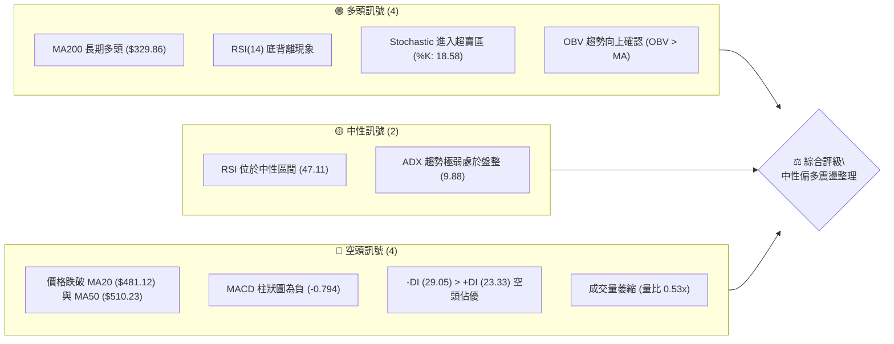
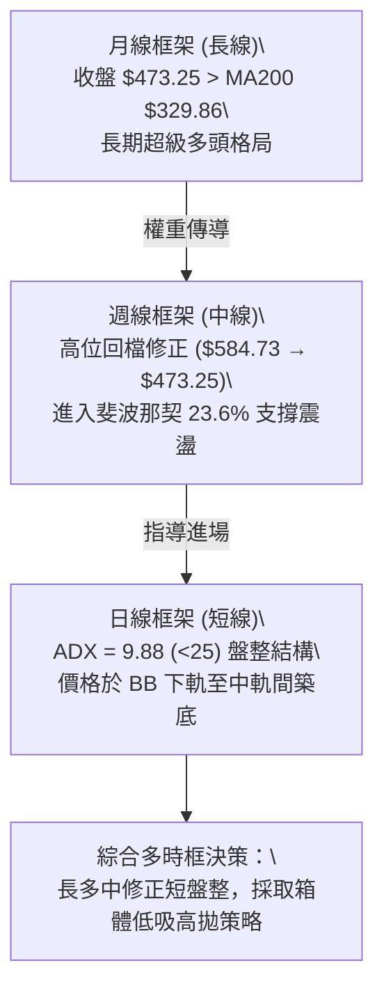
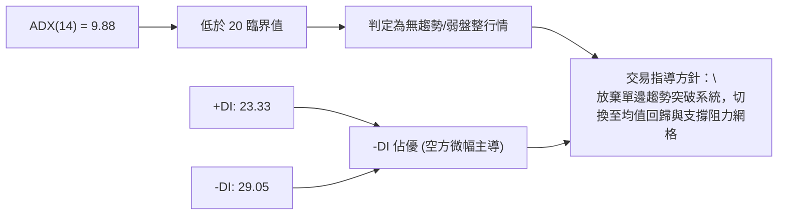
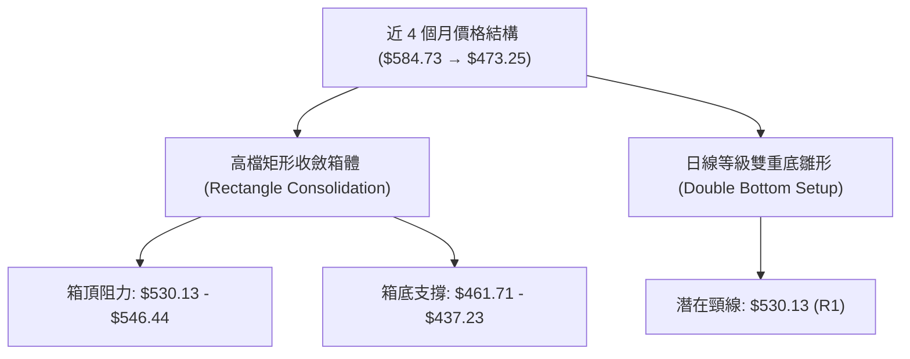
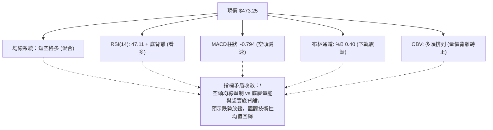
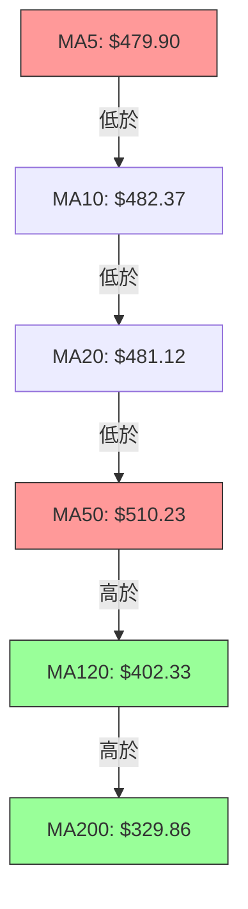
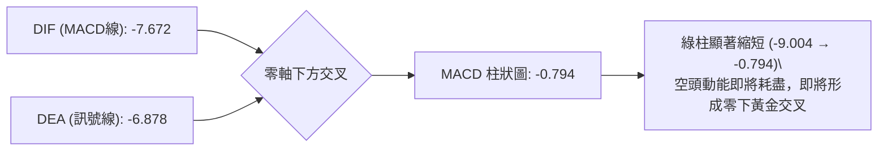
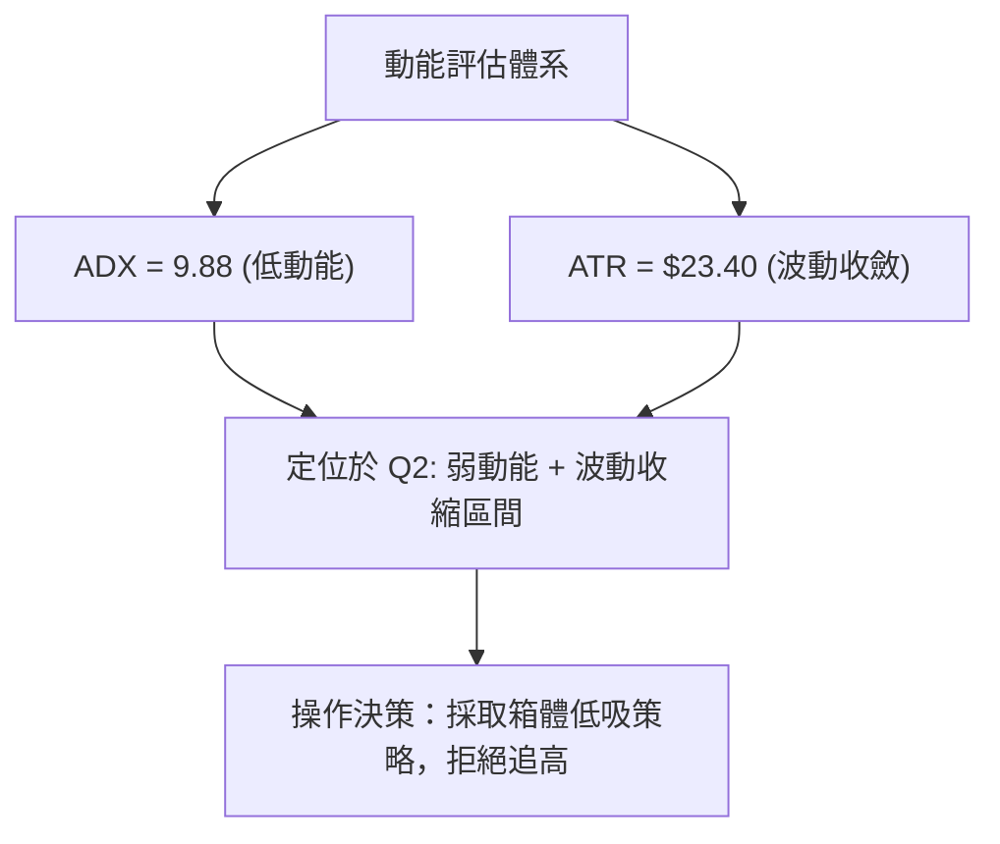
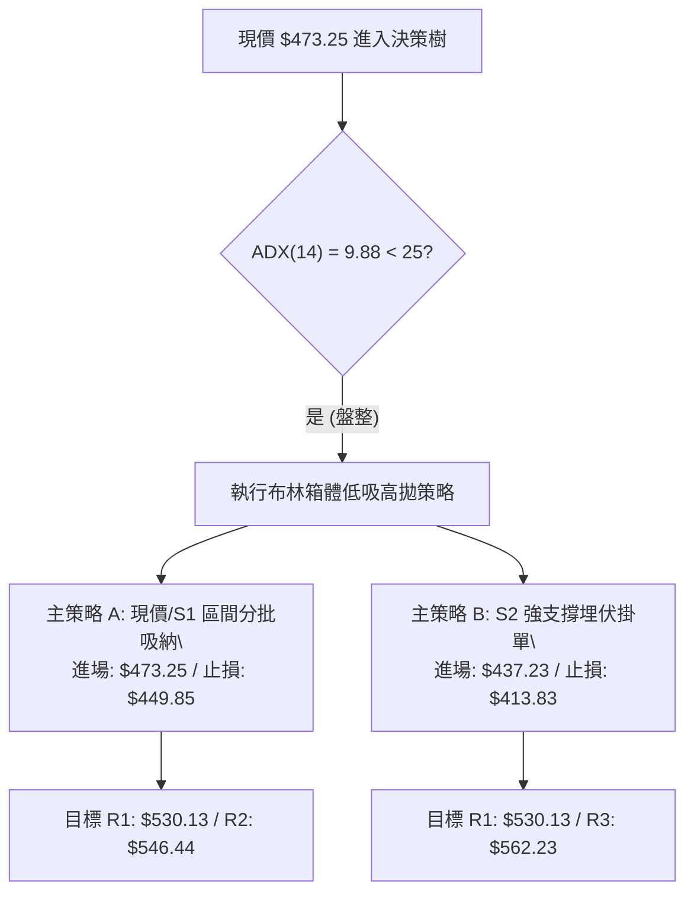
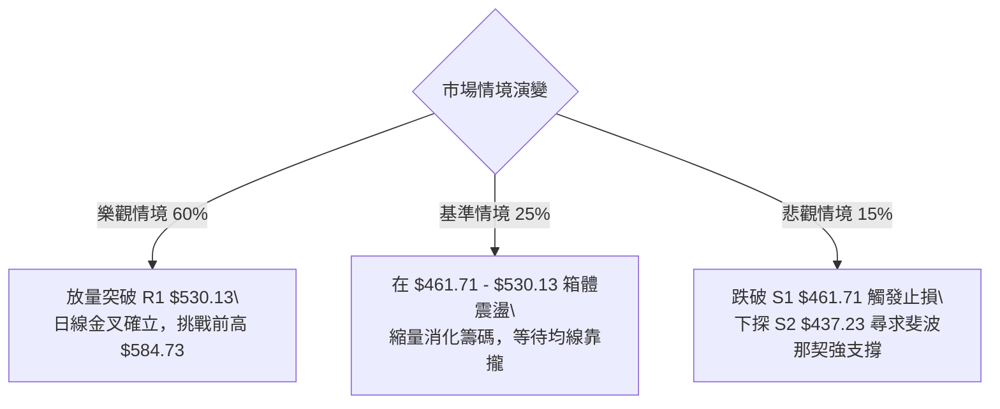

# AMD 技術分析報告

> **報告日期**：2026-08-22 ｜ **語言**：繁體中文 ｜ **數據來源**：Yahoo Finance ｜ **當前價格**：$473.25

---

## 目錄

| 章節 | 內容 |
|------|------|
| [1. 技術面概覽](#1-技術面概覽) | 訊號儀表板、核心指標、評分卡 |
| [2. 趨勢分析](#2-趨勢分析) | 多時框趨勢、長中短期走勢 |
| [3. 圖表形態分析](#3-圖表形態分析) | 形態識別、K線組合、目標價 |
| [4. 支撐與阻力](#4-支撐與阻力) | 關鍵價位、斐波那契回調 |
| [5. 技術指標深度解讀](#5-技術指標深度解讀) | MA/RSI/MACD/布林/成交量 |
| [6. 動能與波動率](#6-動能與波動率) | 動能評估、ATR、Beta |
| [7. 多時框架總結](#7-多時框架總結) | 時框架評分矩陣 |
| [8. 交易策略建議](#8-交易策略建議) | 多空策略、風險報酬比 |
| [9. 風險提示與監控](#9-風險提示與監控) | 監控指標、風險場景 |

---

## 1. 技術面概覽

### 🎯 技術訊號儀表板



### 📊 核心指標速覽表

| 指標類別 | 指標名稱 | 當前數值 | 訊號 | 解讀 |
|----------|----------|----------|------|------|
| **價格** | 當前價格 | $473.25 | 🟡 | 位於52週區間 74.4% 高位回檔整理區間 |
| **均線** | MA20 | $481.12 | 🔴 | 價格低於 MA20 (-1.63%)，短線承壓 |
| **均線** | MA50 | $510.23 | 🔴 | 價格低於 MA50 (-7.25%)，中期回檔中 |
| **均線** | MA200 | $329.86 | 🟢 | 價格遠高於 MA200 (+43.47%)，長期多頭無虞 |
| **動能** | RSI(14) | 47.11 | 🟢 | 中性偏弱但伴隨日線底背離，下行動能減竭 |
| **動能** | MACD Hist | -0.794 | 🔴 | MACD 與訊號線均在零軸下方，空頭動能減速 |
| **超買超賣** | Stoch %K/%D | 18.58 / 17.45 | 🟢 | 雙線落入 20 以下超賣區，存在技術反彈需求 |
| **趨勢強度** | ADX(14) | 9.88 | 🟡 | 極低數值 (<25)，市場進入無方向性箱體盤整 |
| **通道** | 布林通道 %B | 0.40 | 🟡 | 位於中軌 ($481.12) 與下軌 ($441.59) 之間 |
| **量能** | OBV 趨勢 | OBV > MA | 🟢 | 大量資金長線沉澱未出逃，量能支撐結構健康 |
| **波動** | ATR(14) | $23.40 | 🟡 | 每日平均波動 4.95%，屬於中高波動半導體常態 |

### 🏆 技術評分卡

```
╔══════════════════════════════════════════════════════════════════╗
║                   技術評分卡 — AMD (2026-08-22)                   ║
╠══════════════════════════════════════════════════════════════════╣
║ 趨勢強度 (Trend Strength)   ████░░░░░░░░░░░░░░░░  20/100  🔴 盤整 ║
║ 動能指標 (Momentum)         ████████████░░░░░░░░  60/100  🟡 弱多 ║
║ 支撐穩定度 (Support Level)  ████████████████░░░░  80/100  🟢 穩固 ║
║ 成交量配合 (Volume Profile) ████████████░░░░░░░░  60/100  🟡 惜售 ║
║ 形態完整度 (Pattern)        ████████████░░░░░░░░  60/100  🟡 箱型 ║
║ 均線排列 (Moving Averages)  ██████████░░░░░░░░░░  50/100  🟡 混合 ║
╠══════════════════════════════════════════════════════════════════╣
║ 綜合評分 (Composite Score)  ███████████░░░░░░░░░  55/100  🟡 中性 ║
╚══════════════════════════════════════════════════════════════════╝
```

---

## 2. 趨勢分析

### 🌐 多時框趨勢分析



### 📈 長期趨勢 — 12個月走勢圖（Unicode）

```
AMD 月線走勢圖（2025-08 至 2026-08）
價格軸 ($)
$585 ┤                                              ●(2026-06 頂點 $580.91)
$520 ┤                                        ●
$475 ┤                                                  ●(現價 $473.25)
$355 ┤                                  ●
$255 ┤                  ●
$215 ┤                      ●     ●
$200 ┤                                ●     ●
$160 ┤●(2025-08 $162.63)
     └─────────────────────────────────────────────────────────────
       08   09   10   11   12   01   02   03   04   05   06   07   08 (月份)
```

**12 個月走勢特徵分析表格**：

| 階段區間 | 起止價格 | 漲跌幅 | 走勢特徵解讀 |
|----------|----------|--------|--------------|
| **2025-08 ~ 2025-10** | $162.63 → $256.12 | +57.48% | 第一波爆發性突破，AI 題材帶動估值重估 |
| **2025-11 ~ 2026-03** | $217.53 → $203.43 | -6.48% | 5 個月橫盤蓄勢箱體整理，構築中級支撐底座 |
| **2026-04 ~ 2026-06** | $354.49 → $580.91 | +63.87% | 主升段行情，創歷史新高 $584.73 |
| **2026-07 ~ 2026-08** | $476.15 → $473.25 | -0.61% | 高檔獲利回吐，進入 $460 - $530 區間健康洗盤 |

### 📊 中期趨勢（週線分析）

```
      $584.73 ──────── 52W 歷史最高點 (2026-06)
             ╲
              ╲  獲利回吐波段
               ╲
      $530.13 ──▼───── 近期反彈阻力位 R1
                │
      $473.25 ──┼───── 當前收盤價位 (落於斐波那契 23.6% 回調線 $481.95 附近)
                │
      $461.71 ──▲───── 短波段關鍵防守支撐 S1
             ╱
      $437.23 ──────── 布林通道下軌與聚類支撐 S2
```

### ⚡ 趨勢強度評估（ADX 解讀）



**ADX 趨勢強度級別對照表**：

| ADX 數值區間 | 當前數值 | 趨勢狀態 | 操作方針 |
|--------------|----------|----------|----------|
| 0 - 20 | **9.88** | 🟢 極弱趨勢 / 無方向箱體 | **區間震盪交易、布林上下軌高拋低吸** |
| 20 - 25 | - | 🟡 趨勢醞釀中 / 盤整邊界 | 減少操作、等待突破確認 |
| 25 - 40 | - | 🔴 明確單邊趨勢行進 | 順勢交易、回調加碼 |
| 40+ | - | 🔴 超強極端趨勢 | 嚴防動能竭盡反轉 |

---

## 3. 圖表形態分析

### 🔍 形態識別系統



**形態識別與信心度評估表**：

| 形態名稱 | 信心度 | 判斷依據（引用數據） | 完成度 | 目標價（附計算式） |
|----------|--------|----------------------|--------|--------------------|
| **高檔箱體整理** | 80% | 價格在 $461.71 (S1) 與 $530.13 (R1) 間反覆震盪 6 週 | 75% | 箱體等幅測量：$530.13 + ($530.13 - $461.71) = **$598.55** |
| **潛在雙重底** | 55% | 8月初低點 $476.15 與當前低位 $473.25 形成兩腳支撐 | 45% | 突破頸線 R1 ($530.13)：$530.13 + ($530.13 - $473.25) = **$587.01** |
| **均線死叉壓制** | 70% | MA20 ($481.12) 下穿 MA50 ($510.23)，短中期均線空頭排列 | 90% | 下測下軌 S2 (**$437.23**) 尋求支撐 |

### 🕯️ 重要K線形態分析

| 週/月份週期 | 收盤價 | K線形態 | 解讀 | 訊號 |
|-------------|--------|---------|------|------|
| **2026-06 (月線)** | $580.91 | 長上影線天量十字星 | 歷史高點 $584.73 遭遇強大獲利了結賣壓 | 🔴 強烈見頂回檔 |
| **2026-07 (月線)** | $476.15 | 實體中黑K線 | 跌破 5 日、10 日均線，展開波段修正 | 🔴 空方釋放動能 |
| **2026-08-02 (週線)** | $476.15 | 探底長下影線錘子線 | 在 S1 ($461.71) 前獲得強勁承接盤介入 | 🟢 支撐測試成功 |
| **2026-08-16 (週線)** | $514.39 | 中陽線反彈受阻 | 向上反抽 MA50 ($510.23) 遇阻回落，確認頸線壓力 | 🟡 區間上緣確認 |
| **2026-08-23 (週線)** | $473.25 | 縮量小黑K線 | 成交量萎縮至 9,236 萬股，賣壓逐步枯竭 | 🟢 築底蓄勢階段 |

### 📉 ASCII 走勢形態示意圖

```
  $584.73 (52W High)
     /\
    /  \      $530.13 (R1 頸線阻力)
   /    \      ┌───┐        ┌───┐
  /      \    │   │        │   │
 /        \───┘   └────────┘   └───► 目前位置 ($473.25)
/                  $461.71 (S1 箱體底部)
                   └─────── 雙底/箱體下軌支撐區
```

### 🎯 形態目標價計算

1. **箱體向上突破情境**：
   - 形態底部：$461.71（S1）
   - 形態頸線：$530.13（R1）
   - 形態高度 = $530.13 - $461.71 = $68.42
   - **向上量度目標價** = $530.13 + $68.42 = **$598.55**（挑戰歷史新高）

2. **箱體向下破位情境**：
   - 形態頸線：$461.71（S1）
   - **向下量度目標價** = $461.71 - $68.42 = **$393.29**（接近 MA120 $402.33 支撐區）

---

## 4. 支撐與阻力

### 🗺️ 關鍵價位分布圖（Unicode）

```
╔══════════════════════════════════════════════════════════════════╗
║                     AMD 關鍵價位結構分布圖                       ║
╠══════════════════════════════════════════════════════════════════╣
║ $562.23 ║████████████████████████████████║ 強阻力 R3 (+18.80%) ║
║ $546.44 ║████████████████████████        ║ 次級阻力 R2 (+15.47%)║
║ $530.13 ║████████████████████████████████║ 關鍵頸線阻力 R1 (+12.02%)
║ $520.64 ║▓▓▓▓▓▓▓▓▓▓▓▓▓▓▓▓▓▓▓▓▓▓▓▓        ║ 布林通道上軌         ║
║ $481.95 ║────────────────────────────────║ 斐波那契 23.6% 回調位║
║ $473.25 ╠════════════════════════════════╣ ◄ 當前收盤價         ║
║ $461.71 ║▓▓▓▓▓▓▓▓▓▓▓▓▓▓▓▓▓▓▓▓▓▓▓▓        ║ 短線波段支撐 S1 (-2.44%)
║ $441.59 ║░░░░░░░░░░░░░░░░░░░░░░░░        ║ 布林通道下軌         ║
║ $437.23 ║████████████████████████████████║ 中級強支撐 S2 (-7.61%)║
║ $424.03 ║████████████████████████████████║ 極限防守支撐 S3 (-10.40%)
╚══════════════════════════════════════════════════════════════════╝
```

### 🚧 阻力位分析表

| 阻力級別 | 價位 | 形成原因 | 突破難度 | 重要性 |
|----------|------|----------|----------|--------|
| **R1** | **$530.13** | 近期多次衝高回落高點聚類，接近布林通道上軌 ($520.64) | 🟡 中等 | ★★★★☆ 箱體突破關鍵點 |
| **R2** | **$546.44** | 7月中旬反彈次高點密集成交區 | 🔴 較高 | ★★★☆☆ 波段解套賣壓帶 |
| **R3** | **$562.23** | 歷史天價 $584.73 崩跌前的最後防守平台 | 🔴 極高 | ★★★★★ 多頭全面反攻決戰點 |

### 🛡️ 支撐位分析表

| 支撐級別 | 價位 | 形成原因 | 守住機率 | 重要性 |
|----------|------|----------|----------|--------|
| **S1** | **$461.71** | 8月初探底低點聚類，日線雙底防守線 | 🟢 75% | ★★★★☆ 短線強弱分水嶺 |
| **S2** | **$437.23** | 近一年波段低點聚類，與布林通道下軌 ($441.59) 共振 | 🟢 85% | ★★★★★ 中期箱體底部鐵底 |
| **S3** | **$424.03** | 2026年5月中旬起漲拉回低點，接近斐波那契 38.2% ($418.37) | 🟢 95% | ★★★★★ 多頭生命線支撐 |

### 📐 斐波那契回調位分析

依據 52 週低點 **$149.22** 至歷史高點 **$584.73** 進行黃金分割計算：

```
0.0%  (52W High)   $584.73 ──────────────────────────────────────────
23.6%              $481.95 ────────── ◄ 現價 ($473.25) 位於此區間下方緊鄰處
38.2%              $418.37 ──────────────────────────────────────────
50.0%              $366.97 ──────────────────────────────────────────
61.8%              $315.58 ──────────────────────────────────────────
78.6%              $242.42 ──────────────────────────────────────────
100.0% (52W Low)   $149.22 ──────────────────────────────────────────
```

**斐波那契回調深度解讀**：
- **當前位置**：現價 **$473.25** 緊貼於 **23.6% ($481.95)** 回調位下方，距離僅 1.8%。在強勢上漲行情中，回調未深跌破 23.6%~38.2% 區間，屬於**典型強勢多頭回檔（Shallow Retracement）**。
- **支撐重疊性**：斐波那契 38.2% 位 ($418.37) 與關鍵支撐 S3 ($424.03) 形成強共振區，意味著即便發生超預期回調，在 $420 附近具備極強結構性買盤支撐。

---

## 5. 技術指標深度解讀

### 🎛️ 指標訊號總覽



### 📈 移動平均線排列分析



**均線層級解構**：
1. **短中期均線（空頭壓制）**：MA5 ($479.90)、MA10 ($482.37)、MA20 ($481.12)、MA60 ($508.80) 均呈下行趨勢，對現價形成層層壓制，說明短線動能仍被空方控制。
2. **中長期均線（多頭堡壘）**：MA120 ($402.33, +17.63%) 與 MA240 ($308.38, +53.46%) 保持陡峭向上的健康多頭排列，奠定長線大牛市基礎。

### 📉 RSI(14) 分析

```
RSI(14) 數值: 47.11
[超賣 0] ────────[30]───────●───────[70]──────── [超買 100]
                           47.11 (中性區間)
進度條: █████████░░░░░░░░░░ 47.11%
```

- **背離分析**：**⚠️ 出現標準「日線底背離 (Bullish Divergence)」**。近兩週價格在 $473~$476 區間再度探底，但 RSI 數值由 8/2 的 40.6 抬升至當前的 47.11，形成「價格測底、指標抬高」的底背離形態，確認下殺動能已大幅衰竭。

### 📊 MACD(12/26/9) 訊號解讀



### 📦 布林通道分析

```
$520.64 ┬────────────────────────────────────────── BB 上軌
        │
$481.12 ┼─────────────────── MA20 ───────────────── BB 中軌
        │           ▲
$473.25 ┼───────────┼─────── 現價 (%B = 0.40)
        │           │
$441.59 ┴───────────┴────────────────────────────── BB 下軌
```
- **帶寬與位置**：帶寬目前為 $79.05，現價位於中軌下方、接近下軌，%B 為 0.40。在 ADX < 25 的盤整環境中，價格進入下軌與中軌區間通常具備向中軌 ($481.12) 與上軌 ($520.64) 回歸的統計優勢。

### 💹 成交量分析（量價配合度）

- **量比與縮量特徵**：最新成交量為 14,195,919 股，大幅低於 20 日均量 26,540,186 股（**量比僅 0.53x**）。週成交量亦由高峰時期的 2.96 億股驟降至 9,236 萬股。
- **量價背離與 OBV**：回檔伴隨極致縮量，顯示市場並無恐慌性出逃；同時 **OBV > OBV MA**，表明長線機構主力資金未出現淨流出，呈現「縮量洗盤、籌碼鎖定」的良性量價結構。

---

## 6. 動能與波動率

### ⚡ 動能評估四象限

| 象限 | 動能維度 | 波動維度 | AMD 當前狀態 | 交易戰略評估 |
|------|----------|----------|--------------|--------------|
| **第一象限 (Q1)** | 強動能 (Trend) | 低波動 (Low Vol) | — | 最佳單邊主升浪加碼點 |
| **第二象限 (Q2)** | 弱動能 (Consol) | 低波動 (Low Vol) | **✓ AMD 當前落點** | **震盪蓄勢期：布林區間高拋低吸，嚴控倉位** |
| **第三象限 (Q3)** | 強動能 (Trend) | 高波動 (High Vol) | — | 突破行情，嚴格順勢跟進 |
| **第四象限 (Q4)** | 弱動能 (Consol) | 高波動 (High Vol) | — | 劇烈洗盤，觀望為宜 |



### 📊 ATR 波動率分析

- **當前 ATR(14)**：**$23.40**（佔股價 4.95%）。
- **停損與目標設定基準**：
  - **短線保護性停損距離**：1.0 × ATR = **$23.40**
  - **波段安全停損距離**：1.5 × ATR = **$35.10**
  - **日內價格波動預期區間**：$473.25 ± $23.40（$449.85 ~ $496.65）

### 📐 Beta 與市場相關性

- **Beta 係數**：**2.489**（極高彈性標的）。
- **意涵解讀**：AMD 波動幅度為 S&P 500 大盤的 2.49 倍。當半導體板塊或大盤反彈時，AMD 具備極強的向上爆發乘數效應；但在市場回調時，亦會承受放大版的回撤壓力。

---

## 7. 多時框架總結

### 📋 時框架評分表

| 時框架 | 趨勢方向 | 動能狀態 | 均線排列 | 圖表形態 | 綜合評分 | 建議戰略 |
|--------|----------|----------|----------|----------|----------|----------|
| **月線 (長期)** | 🟢 強烈多頭 | 🟢 充沛 | 🟢 完美多頭 (遠高於MA200) | 歷史主升浪回檔 | **85/100** | 長線堅定持有 |
| **週線 (中期)** | 🟡 中性整理 | 🔴 修正 | 🟡 跌破短期均線 | 高檔箱體整理 | **55/100** | 箱體波段操作 |
| **日線 (短期)** | 🟡 築底震盪 | 🟢 底背離 | 🔴 均線空頭排列 | 雙底雛形/布林下軌 | **50/100** | 支撐位分批低吸 |

### 🔲 綜合訊號矩陣

```
┌─────────────────┬───────────┬───────────┬───────────┐
│ 分析維度        │ 短期(日線)│ 中期(週線)│ 長期(月線)│
├─────────────────┼───────────┼───────────┼───────────┤
│ 均線系統 (MA)   │    🔴     │    🟡     │    🟢     │
│ 動能指標 (RSI)  │    🟢(背離)│   🟡      │    🟢     │
│ 趨勢指標 (ADX)  │    🟡(盤整)│   🟡      │    🟢     │
│ 量能配合 (OBV)  │    🟢     │    🟢     │    🟢     │
│ 形態位置        │    🟢(支撐)│   🟡(箱體)│    🟢(高位)│
└─────────────────┴───────────┴───────────┴───────────┘
```

### ⚖️ 多時框收斂結論

> **依據規則 14 進行多時框收斂**：
> 1. **趨勢類型判定**：當前日線 ADX 為 **9.88 (<25)**，明確定義為**「無趨勢盤整行情」**。
> 2. **主導時框與優先級**：盤整行情下，市場由**日線布林通道上下軌及水平支撐阻力**主導，均線突破指標失效，中長期超級牛市（月線/MA200）構成堅實的安全邊際。
> 3. **唯一方向性結論**：**🟡 中性偏多（區間震盪築底）**。日線空頭均線僅反映過去回檔，而 RSI 底背離、超賣與量能沉澱預示下行空間極其有限，以箱體下緣逢低佈局為唯一最優解。

---

## 8. 交易策略建議

### 🗺️ 策略決策流程圖



### 🧭 策略路由

**當前主策略方向 = 🟡 中性偏多區間操作（綜合評分 55/100，處於 40–60 震盪區間，以布林下軌至支撐位低吸為主，等待放量突破）**

### 🎯 價格情境階梯（Price Scenarios）

| 觸發條件 | 第一目標 | 第二目標 | 情境含義與操作指引 |
|----------|----------|----------|--------------------|
| **向上突破 R1 $530.13** | R2 $546.44 | R3 $562.23 | 短線箱體向上突破，加碼順勢做多 |
| **站穩現價 $473.25** | BB中軌 $481.12 | R1 $530.13 | 延續 $461 - $530 區間震盪，區間操作 |
| **跌破支撐 S1 $461.71** | S2 $437.23 | S3 $424.03 | 中期回檔加深，測試下軌支撐，尋求二次買點 |

### 📊 情境機率分佈

| 情境劇本 | 發生機率 | 主要技術依據 |
|----------|----------|--------------|
| **情境一：守穩支撐向上反彈** | **60%** | RSI 日線底背離、Stoch 超賣、OBV 支撐多頭、縮量洗盤極致 |
| **情境二：維持箱體窄幅震盪** | **25%** | ADX 僅 9.88、均線糾結混亂、量比 0.53x 缺乏催化劑 |
| **情境三：跌破 S1 下探 S2/S3** | **15%** | 短期均線（MA5/MA20）死叉向下，大盤系統性風險引發 Beta 2.49 放大效應 |

### 🟢 主策略詳情

| 策略要素 | 策略 A（現價/S1 區間低吸型） | 策略 B（S2 鐵底埋伏突破型） |
|----------|------------------------------|------------------------------|
| **進場條件** | 現價分批進場，或拉回 S1 企穩 | 限價掛單於 S2 強支撐位 |
| **進場價格** | **$473.25**（現價） | **$437.23**（S2 支撐） |
| **目標價 T1** | **$530.13**（R1 阻力，+12.02%） | **$530.13**（R1 阻力，+21.25%） |
| **目標價 T2** | **$546.44**（R2 阻力，+15.47%） | **$562.23**（R3 阻力，+28.59%） |
| **止損價格** | **$449.85**（現價 - 1.0 ATR，-4.94%） | **$413.83**（S2 - 1.0 ATR，-5.35%） |
| **風險報酬比**| **2.43 : 1**（目標1計算） | **3.97 : 1**（目標1計算） |
| **預估勝率** | 65% | 75% |
| **建議倉位** | 10% ~ 15% | 15% ~ 20% |

### 🔴 反向風險觸發點（對沖提示）

- **空頭觸發訊號**：若價格帶量跌破 **S1 ($461.71)** 且日線收於其下，主策略 A 之多單應嚴格執行保護性止損；若進一步失守 **S2 ($437.23)**，多頭形態遭到破壞，需建立反向對沖空單，目標下看 S3 ($424.03) 及 MA120 ($402.33)。

### ⭐ 整體訊號強度評星

```
做多訊號強度：★★★☆☆  (3/5星 — 震盪偏多，底背離支撐)
做空訊號強度：★★☆☆☆  (2/5星 — 均線雖壓制但下行動能衰竭)
整體可信度：  ★★★★☆  (4/5星 — 多時框量能結構清晰)
```

---

## 9. 風險提示與監控

### ✅ 關鍵監控指標 Checklist

```
╔══════════════════════════════════════════════════════════════════╗
║                   關鍵技術監控清單 (Checklist)                   ║
╠══════════════════════════════════════════════════════════════════╣
║ [ ] 價格是否有效突破 MA20 ($481.12) 與 斐波 23.6% ($481.95)       ║
║ [ ] MACD 柱狀圖是否由負轉正 (突破 0 軸形成金叉)                  ║
║ [ ] 日成交量是否回升至 2,600 萬股 (20日均量) 之上               ║
║ [ ] RSI(14) 是否站穩 50 多空中軸線之上                           ║
║ [ ] S1 支撐位 ($461.71) 是否在回踩時展現強烈買盤支撐             ║
║ [ ] ADX 是否由 9.88 向上翹頭突破 20 (代表新波段趨勢啟動)         ║
╚══════════════════════════════════════════════════════════════════╝
```

### ⚠️ 風險場景分析



### 🛡️ 風險管理重要提醒

1. **高 Beta 波動控制**：AMD 的 Beta 高達 **2.489**，單日潛在波動達 5% 左右。總投資組合中 AMD 總持倉曝險不宜超過 25%，嚴禁在震盪行情中使用高倍槓桿。
2. **嚴守 ATR 動態止損**：嚴禁憑感覺抗單，以 ATR 為基準設定之止損位（策略 A: $449.85 / 策略 B: $413.83）一旦觸發必須無條件離場。
3. **盤整期忌追漲殺跌**：在 ADX < 25 的市況下，任何突破 R1 或跌破 S1 的初次動作均容易形成「假突破/假跌破」，務必等待 K 線實體收盤確認。

---

## 📋 報告總結

```
╔══════════════════════════════════════════════════════════════════╗
║                     AMD 技術分析報告總結                         ║
╠══════════════════════════════════════════════════════════════════╣
║ 報告日期：2026-08-22                                             ║
║ 當前價格：$473.25                                                ║
║ 分析評級：⚖️ 中性偏多（箱體築底蓄勢）                             ║
║                                                                  ║
║ 關鍵結論：                                                       ║
║ ├─ 長期趨勢：🟢 強烈多頭（遠高於 MA200 $329.86，大牛市架構）     ║
║ ├─ 中期趨勢：🟡 箱體整理（$461.71 - $530.13 區間獲利回吐消化）   ║
║ ├─ 短期趨勢：🟢 醞釀反彈（RSI 日線底背離 + Stoch 超賣）          ║
║ ├─ 關鍵支撐：S1 $461.71 / S2 $437.23                             ║
║ ├─ 關鍵阻力：R1 $530.13 / R2 $546.44                             ║
║ └─ 分析師目標價：均價 $614.43（隱含 +29.8% 上行空間）            ║
║                                                                  ║
║ 最優策略組合：                                                   ║
║ 1. 🥇 最佳機會：策略 A（現價 $473.25 低吸，目標 $530.13，R:R 2.43）║
║ 2. 🥈 次選機會：策略 B（S2 $437.23 逢低埋伏，目標 $562.23，R:R 3.97）║
║ 3. 🥉 保守選擇：等待放量站穩 MA20 ($481.12) 後順勢跟進            ║
╚══════════════════════════════════════════════════════════════════╝
```

---

> ⚠️ **免責聲明**：本報告為技術分析研究，所有數據及模型推演均基於市場歷史行情數據。本報告**僅供學術研究與投資參考**，**不構成任何形式的個人化投資建議**。半導體板塊波動劇烈，入市請務必獨立思考並做好嚴格資金管理。

---

*報告生成時間：2026-08-22 ｜ 數據來源：Yahoo Finance ｜ 分析框架：多時框架量化技術分析*