# AMD 技術分析報告

> **報告日期**：2026-08-23 ｜ **語言**：繁體中文 ｜ **數據來源**：Yahoo Finance ｜ **當前價格**：$473.25

---

## 目錄

| 章節 | 內容 |
|------|------|
| [1. 技術面概覽](#1-技術面概覽) | 訊號儀表板、核心指標、評分卡 |
| [2. 趨勢分析](#2-趨勢分析) | 多時框趨勢、長中短期走勢 |
| [3. 圖表形態分析](#3-圖表形態分析) | 形態識別、K線組合、目標價 |
| [4. 支撐與阻力](#4-支撐與阻力) | 關鍵價位、斐波那契回調 |
| [5. 技術指標深度解讀](#5-技術指標深度解讀) | MA/RSI/MACD/布林/成交量 |
| [6. 動能與波動率](#6-動能與波動率) | 動能評估、ATR、Beta |
| [7. 多時框架總結](#7-多時框架總結) | 時框架評分矩陣 |
| [8. 交易策略建議](#8-交易策略建議) | 多空策略、風險報酬比 |
| [9. 風險提示與監控](#9-風險提示與監控) | 監控指標、風險場景 |

---

## 1. 技術面概覽

### 🎯 技術訊號儀表板

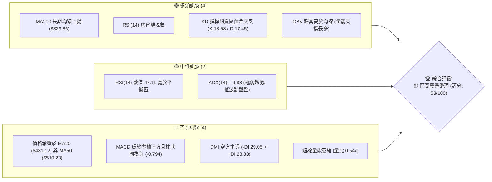

### 📊 核心指標速覽表

| 指標類別 | 指標名稱 | 當前數值 | 訊號 | 解讀 |
|----------|----------|----------|:----:|------|
| **價格** | 當前收盤價 | $473.25 | 🟡 | 位於52週區間 74.4% 位置，自歷史高點回調整理中 |
| **均線** | MA20 (短中軌) | $481.12 | 🔴 | 價格低於 MA20 (-1.63%)，短線結構偏弱受制中軌 |
| **均線** | MA50 (中期線) | $510.23 | 🔴 | 價格低於 MA50 (-6.99%)，中期波段進入回洗防守 |
| **均線** | MA200 (牛熊線)| $329.86 | 🟢 | 價格遠高於 MA200 (+43.47%)，長期多頭格局穩固 |
| **動能** | RSI(14) | 47.11 | 🟢 | 處於 30-70 中性區間，但盤面已浮現明顯「底背離」訊號 |
| **動能** | Stoch %K / %D | 18.58 / 17.45 | 🟢 | 雙線低於 20 嚴重超賣，KD 低檔黃金交叉具反彈契機 |
| **動能** | MACD (12,26,9)| -7.672 / -6.878 | 🔴 | MACD 處於負值區，柱狀圖 -0.794，空方動能減弱但未翻多 |
| **趨勢** | ADX(14) | 9.88 | 🟡 | ADX < 25 處於極弱趨勢狀態，當前市場定性為「箱體盤整」 |
| **趨勢** | DMI (+DI / -DI)| 23.33 / 29.05 | 🔴 | -DI 大於 +DI，空方力量暫時主導日內走勢 |
| **通道** | 布林帶 %B | 0.40 | 🟡 | 位於中軌 ($481.12) 與下軌 ($441.59) 之間，接近下軌支撐 |
| **成交量**| 最新量 / 20日均量| 14.31M / 26.55M| 🔴 | 量比 0.54x，交投明顯萎縮，多空雙方處於縮量觀望階段 |
| **波動** | ATR(14) | $23.41 (4.95%)| 🟡 | 每日平均波動幅度約 $23.41，短線交易需留足止損空間 |

### 🏆 技術評分卡

```
╔══════════════════════════════════════════════════════════════════╗
║              技術評分卡 — AMD (2026-08-23)                      ║
╠══════════════════════════════════════════════════════════════════╣
║ 趨勢強度 (ADX=9.88)   ████░░░░░░░░░░░░░░░░  20/100  🔴 極弱趨勢  ║
║ 動能指標 (RSI+KD+MACD)████████████░░░░░░░░  60/100  🟢 底背離超賣║
║ 支撐穩定度 (S1+斐波)  ██████████████░░░░░░  70/100  🟢 S1支撐強勁║
║ 成交量配合 (量比+OBV) ██████████░░░░░░░░░░  50/100  🟡 OBV強/短量縮║
║ 形態完整度 (箱體整理) ████████████░░░░░░░░  60/100  🟡 矩形構築中║
║ 均線排列 (多時框混合) ████████████░░░░░░░░  60/100  🟡 長多短空  ║
╠══════════════════════════════════════════════════════════════════╣
║ 綜合評分              ███████████░░░░░░░░░  53/100  🟡 區間震盪  ║
╚══════════════════════════════════════════════════════════════════╝
```

---

## 2. 趨勢分析

### 🌐 多時框趨勢分析

依據收斂規則，本報告採用「長線定方向、中線定結構、短線定買賣點」之三維框架：

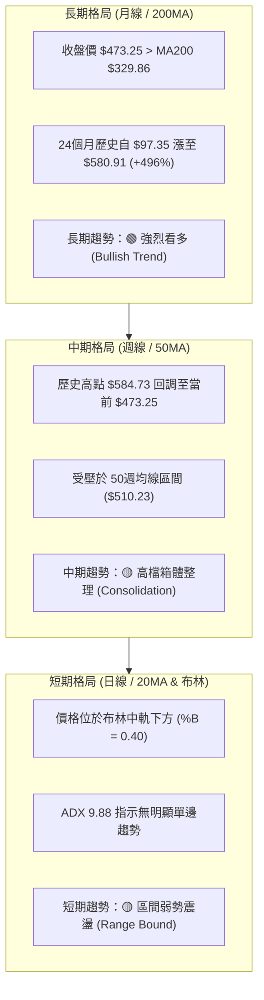

### 📈 長期趨勢 — 12個月走勢圖（Unicode）

```
AMD 月線走勢圖（過去12個月：2025-09 至 2026-08）
價格軸 ($)
$580.91 ┤                                           ● (2026-06 高點 $584.73)
$516.10 ┤                                     ●
$473.25 ┤━━━━━━━━━━━━━━━━━━━━━━━━━━━━━━━━━━━━━━━━━●←(2026-08 現價 $473.25)
$354.49 ┤                               ●
$256.12 ┤             ● (2025-10 突破)
$214.16 ┤                   ●     ●
$161.79 ┤ ● (2025-09)
         └─────────────────────────────────────────────────────────────
          09   10    11    12    01    02    03    04    05    06    07    08
          '25  '25   '25   '25   '26   '26   '26   '26   '26   '26   '26   '26
```

**12個月價格走勢特徵分析表格**：

| 時間區間 | 價格區間 ($) | 漲跌幅 (%) | 量能配合特徵 | 結構與市場心理 |
|----------|--------------|------------|--------------|----------------|
| **2025-09 ~ 2025-10** | $161.79 → $256.12 | +58.30% | 巨量突破前期整理平台 | AI 加速晶片需求放量，基本面主升段展開 |
| **2025-11 ~ 2026-03** | $256.12 → $203.43 | -20.57% | 縮量拉回洗盤，構築大底 | 獲利了結賣壓消化，於 $200.00 整數關卡獲強勁買盤支撐 |
| **2026-04 ~ 2026-06** | $203.43 → $580.91 | +185.56% | 爆量主升浪，週量破 2.9 億股 | 營收年增 50.1%、獲利激增 159.5%，迎來歷史性主升浪 |
| **2026-07 ~ 2026-08** | $580.91 → $473.25 | -18.53% | 成交量急劇萎縮 (萎縮至 92M/週)| 高檔獲利回吐，進入對主升浪的 23.6% 斐波那契正常修正 |

### 📊 中期趨勢（週線分析）

從近 20 週數據觀察，價格在 2026-06 觸及 $584.73 高點後，高點逐步受到抑制，但在下方波段支撐位 S1 ($461.71) 展現出高度韌性。

```
週線關鍵壓力與支撐示意圖：
  $584.73 ── 52週最高點 (歷史天花板)
     │       ▼ 獲利回吐與中期反壓 R2 ($546.44) / R1 ($530.13)
  $510.23 ── MA50 均線壓制區
     │       
  $473.25 ── 現價 (23.6% 斐波那契回調位 $481.95 附近震盪)
     │       
  $461.71 ── S1 關鍵支撐線 (近 2 個月下影線聚類區)
     │       ▼ 次級防守
  $437.23 ── S2 強支撐位 / 布林下軌 ($441.59) 疊合區
```

### ⚡ 趨勢強度評估（ADX 解讀）

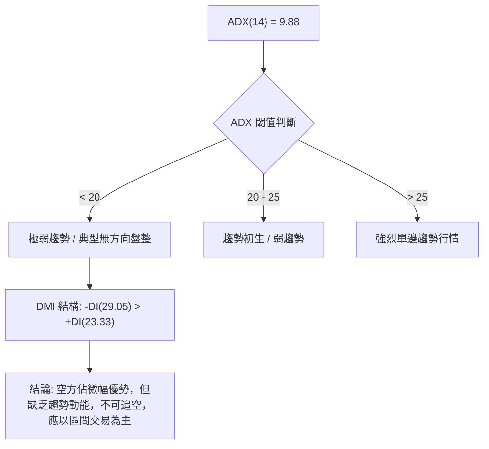

| 指標 | 數值 | 狀態門檻 | 技術解讀 |
|------|------|----------|----------|
| **ADX(14)** | 9.88 | < 20 (極弱) | 單邊趨勢動能完全消退，任何追漲殺跌策略均面臨高雙巴風險 |
| **+DI(14)** | 23.33 | 參考基準 | 多方進攻意願低迷，追高動能不足 |
| **-DI(14)** | 29.05 | 領先 +DI | 空方略佔上風，但未形成破位發散（發散需 -DI > 35 且 ADX > 25） |

---

## 3. 圖表形態分析

### 🔍 形態識別系統

依據形態信心度規則（嚴格要求 15），本報告嚴格基於歷史數據聚類識別以下形態：

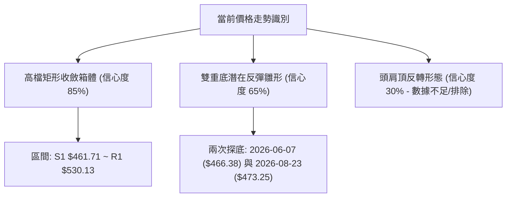

#### 形態識別與信心度評估表

| 形態名稱 | 信心度 | 判斷依據（引用精確數據） | 完成度 | 目標價（附嚴謹計算式） |
|----------|:------:|--------------------------|:------:|------------------------|
| **高檔矩形箱體 (Box Range)** | **85%** | 上軌阻力 R1 $530.13 與下軌支撐 S1 $461.71 經多次回踩測試有效 | 90% | 箱體高度 = $530.13 - $461.71 = $68.42<br>向上突破目標 = $530.13 + $68.42 = **$598.55** |
| **潛在雙重底 (W-Bottom)** | **65%** | 第一次低點 2026-06-07 收盤 $466.38，第二次於 S1 $461.71 獲得支撐 | 60% | 頸線 = 2026-07-12 高點 $557.89<br>形態高度 = $557.89 - $461.71 = $96.18<br>突破目標 = $557.89 + $96.18 = **$654.07** |
| **頭肩頂形態 (Head & Shoulders)**| **30%** | 右肩未成型，跌破頸線無成交量配合且均線 MA200 未拐頭 | 20% | *訊號不足，信心度低於 50%，排除空頭形態，不予採納* |

### 🕯️ 重要K線形態分析

| 統計期間 | 關鍵收盤價 | K線組合形態 | 技術解讀與心理分析 | 訊號強度 |
|----------|------------|-------------|--------------------|:--------:|
| **2026-05-10** | $455.19 | 巨量長紅大陽線 | 單週暴增 2.96 億股，主力資金強勢掃盤進場 | 🟢 強烈買進 |
| **2026-06-21** | $537.37 | 高檔長上影十字星 | 逼近 52W 高點 $584.73 遭遇強大解套與獲利賣壓 | 🔴 漲勢衰竭 |
| **2026-07-12** | $557.89 | 縮量上吊線 (Hanging Man) | 價格創波段反彈高點但成交量僅 1.31 億股，多頭背離 | 🟡 警告訊號 |
| **2026-08-02** | $476.15 | 帶下影陰線 (Hammer Test) | 回踩 S1 $461.71 支撐後迅速拉回，展現買盤承接力 | 🟢 支撐確認 |
| **2026-08-23** | $473.25 | 低波動窄幅星線 (Doji) | 週成交量降至 92M（今年最低），多空處於極致平衡 | 🟡 變盤在即 |

### 📉 ASCII 走勢形態示意圖

```
高檔矩形整理與潛在雙底示意圖：
$562.23 ───┐───────────────────────────────────── R3 強阻力
           │       ▲ 2026-07-12 頸線高點 ($557.89)
$530.13 ───┼───────●───────────────────────────── R1 箱體上軌
           │      / \       /
           │     /   \     /  ◄── 當前處於蓄勢回踩區間
$481.12 ───┼────/─────\───/────────────────────── MA20 / 箱體中軸
           │   /       \ /
$473.25 ───┼──/─────────●──────────────────────── 現價 $473.25 (近第二底)
           │ ● (06-07 第一底 $466.38)
$461.71 ───┴───────────────────────────────────── S1 箱體下軌支撐
```

### 🎯 形態目標價計算

根據矩形整理與雙底結構計算目標價：
1. **箱體突破目標價**：
   - 頸線/上軌 = $530.13
   - 箱體底部 = $461.71
   - 箱體高度 = $530.13 - $461.71 = $68.42
   - **保守目標價 (R2 聚類)** = **$546.44**
   - **完全量度目標價** = $530.13 + $68.42 = **$598.55**
2. **雙重底量度目標價（若突破 $557.89 頸線）**：
   - 形態高度 = $557.89 - $461.71 = $96.18
   - **量度擴展目標價** = $557.89 + $96.18 = **$654.07**（契合分析師平均目標價 $613.09）

---

## 4. 支撐與阻力

### 🗺️ 關鍵價位分布圖（Unicode）

```
AMD 價位結構分布圖 (由實際 OHLCV 歷史計算聚類)
══════════════════════════════════════════════════════════════════
$584.73 ║████████████████████████████████║ 52週歷史高點 (52W High)
$562.23 ║████████████████████████        ║ 強阻力 R3 (+18.80%)
$546.44 ║████████████████                ║ 波段阻力 R2 (+15.47%)
$530.13 ║████████████████████            ║ 關鍵箱體阻力 R1 (+12.02%)
$481.95 ║▓▓▓▓▓▓▓▓▓▓▓▓▓▓▓▓▓▓▓▓▓▓▓▓        ║ 斐波那契 23.6% 回調位 / MA20
$473.25 ╠════════════════════════════════╣ ◄── 現價 (Current Price)
$461.71 ║████████████████████████████    ║ 核心波段支撐 S1 (-2.44%)
$441.59 ║▓▓▓▓▓▓▓▓▓▓▓▓▓▓▓▓▓▓              ║ 布林通道下軌支撐
$437.23 ║████████████████████            ║ 次級強支撐 S2 (-7.61%)
$424.03 ║████████████                    ║ 深度防守支撐 S3 (-10.40%)
$418.37 ║▓▓▓▓▓▓▓▓▓▓▓▓▓▓▓▓▓▓▓▓▓▓▓▓▓▓▓▓    ║ 斐波那契 38.2% 回調位
$329.86 ║████████████████████████████████║ 牛熊分界線 MA200
══════════════════════════════════════════════════════════════════
```

### 🚧 阻力位分析表

所有阻力價位嚴格引用 OHLCV 聚類計算結果：

| 阻力級別 | 價位 | 與現價差距 | 形成原因與籌碼結構 | 突破難度 | 重要性 |
|:--------:|:----:|:----------:|--------------------|:--------:|:------:|
| **R1** | **$530.13** | +12.02% | 近期多次週線反彈高點聚類區，箱體上沿密集成交區 | 🟡 中等 | ★★★★☆ |
| **R2** | **$546.44** | +15.47% | 2026-07-12 波段反彈高點次級壓制，解套盤賣壓重疊區 | 🔴 較難 | ★★★☆☆ |
| **R3** | **$562.23** | +18.80% | 歷史高點前最後一道籌碼沉積阻力帶，突破即進入歷史真空區 | 🔴 極難 | ★★★★★ |

### 🛡️ 支撐位分析表

所有支撐價位嚴格引用 OHLCV 聚類計算結果：

| 支撐級別 | 價位 | 與現價差距 | 形成原因與籌碼結構 | 守住機率 | 重要性 |
|:--------:|:----:|:----------:|--------------------|:--------:|:------:|
| **S1** | **$461.71** | -2.44% | 2026-06-07 ($466.38) 及近 2 個月下影線波段低點聚類 | 🟢 80% | ★★★★★ |
| **S2** | **$437.23** | -7.61% | 與日線布林下軌 ($441.59) 形成共振支撐，主力防守底線 | 🟢 70% | ★★★★☆ |
| **S3** | **$424.03** | -10.40% | 2026-05-17 突破前回踩低點 ($424.10)，長線牛市多頭生命線 | 🟢 85% | ★★★☆☆ |

### 📐 斐波那契回調位分析

基準計算區間：52週低點 **$149.22** → 52週高點 **$584.73**（總波段跨度：$435.51）

```
斐波那契回調層級分布：
  0.0%  (52W High) ── $584.73
  23.6% ───────────── $481.95 ◄── 現價 $473.25 落在此區間下方 (極度強勢回調)
  38.2% ───────────── $418.37 ◄── 與 S3 ($424.03) 形成黃金支撐帶
  50.0% ───────────── $366.97
  61.8% ───────────── $315.58 ◄── 與 MA200 ($329.86) 重合之終極牛熊分水嶺
  78.6% ───────────── $242.42
 100.0% (52W Low)  ── $149.22
```

**斐波那契技術解讀**：
- 現價 **$473.25** 位於 **23.6% ($481.95)** 與 **38.2% ($418.37)** 回調位之間。
- 在經歷了 496% 的巨幅漲勢後，股價僅回調至 23.6% 附近即獲得支撐（回調幅度僅 -18.5%），表明整體籌碼鎖定極佳，屬於強勢多頭市場中的「淺度休整」，未觸及 38.2% ($418.37) 即代表長線多頭架構完好無損。

---

## 5. 技術指標深度解讀

### 🎛️ 指標訊號總覽

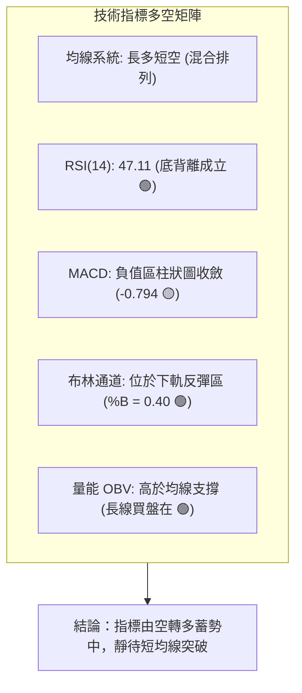

### 📈 移動平均線排列分析

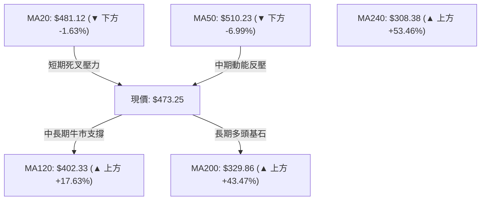

| 均線名稱 | 當前價格 | 相對現價 | 走勢斜率 | 技術意涵 |
|----------|----------|:--------:|:--------:|----------|
| **MA 5** | $479.90 | -1.39% | 下彎 | 超短期壓制，多頭需收復此位以止跌 |
| **MA 10** | $482.37 | -1.89% | 下彎 | 短期進攻線，與 MA20 形成雙重阻力 |
| **MA 20** | $481.12 | -1.63% | 走平 | 布林中軌所在，為多空分水嶺 |
| **MA 60** | $508.80 | -6.99% | 上揚趨緩 | 季線位置，與 MA50 ($510.23) 形成中期強阻力帶 |
| **MA 120** | $402.33 | +17.63% | 強烈向上 | 半年線支撐極強，牛市第一道防火牆 |
| **MA 200** | $329.86 | +43.47% | 陡峭向上 | 長期年線，定義為超級大牛市格局 |

### 📉 RSI(14) 分析與背離判定

- **RSI(14) 數值**：**47.11** 
  `[█████████░░░░░░░░░░░] 47.11% (中性偏弱區)`
- **隨機指標 Stoch %K / %D**：**18.58 / 17.45** (嚴重超賣)

```
RSI 底背離 (Bullish Divergence) 判定：
價格走勢 (週線低點)：
2026-08-02 低點 $476.15  ──────►  2026-08-23 現價 $473.25 (價格破底 跌 -0.61%)
                                         ╲
                                          ╲ (價格向下傾斜)
RSI(14) 數值走勢：                         ╲
2026-08-02 RSI = 40.6    ──────►  2026-08-23 RSI = 47.11 (RSI 向上抬升 +6.51)
                                          ╱
                                         ╱ (指標明顯向上背離)
結論：⚠️ 明確「底背離 (Bullish Divergence)」成立，預示空頭殺跌動能竭盡，反彈機率極高。
```

### 📊 MACD(12/26/9) 訊號解讀

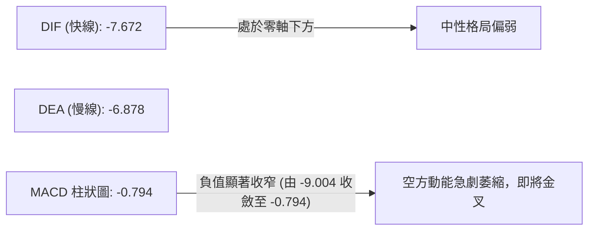

- **MACD 現況解讀**：MACD 線 (-7.672) 雖位於信號線 (-6.878) 下方，但 MACD 柱狀圖已從 2026-08-02 的 **-9.004** 迅速收斂至當前 **-0.794**。柱狀圖呈現持續萎縮態勢，顯示空頭下殺動能已消耗殆盡，一旦 DIF 向上突破 DEA 形成低檔黃金交叉，將引發技術面補漲買盤。

### 📦 布林通道分析

```
布林帶走勢結構 (Bollinger Bands 20, 2)：
$520.64 ────────────────────────────────────────── 上軌 (Upper Band)
                     ▲ 
$481.12 ────────────────────────────────────────── 中軌 (MA20 Baseline)
                     │ 
$473.25 ═════════════●════════════════════════════ 現價 (%B = 0.40)
                     │ 
$441.59 ────────────────────────────────────────── 下軌 (Lower Band)
```

- **帶寬與位置解讀**：
  - 帶寬 (Bandwidth) = ($520.64 - $441.59) / $481.12 = **16.43%**（布林帶已呈現持續收口狀態）。
  - 當前 **%B 數值為 0.40**，位於中軌下方靠近下軌區域。
  - 在 ADX < 25 的盤整環境下，布林通道上下軌具備極高交易參考價值：下軌 **$441.59** 與 S2 **$437.23** 形成複合買盤區，中軌 **$481.12** 為第一目標，突破後有望挑戰上軌 **$520.64**。

### 💹 成交量分析（量價配合度）

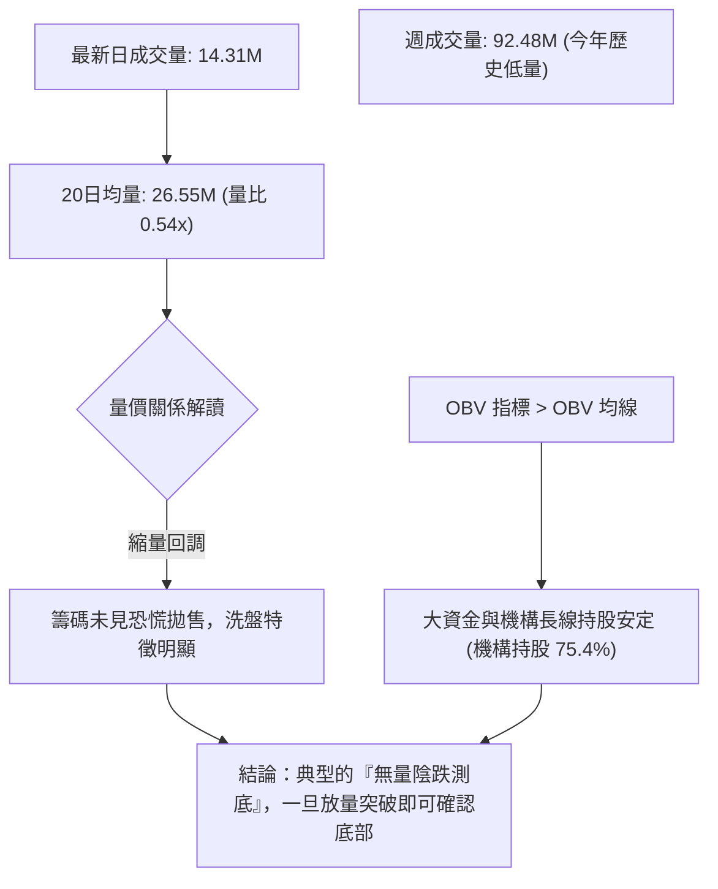

- **成交量深度剖析**：
  1. 日線量比僅 **0.54x**，週線量能萎縮至 **92,477,000 股**（較 5 月份高峰 2.96 億股萎縮近 69%）。在技術分析經典理論中，「天量見天價，地量見地價」，當前 AMD 處於極度縮量的地量蓄勢階段。
  2. **OBV > MA**：能量潮指標持續運行於均線上方，表明自 $200 啟動的主力建倉籌碼在回調過程中並未大量出逃，量能結構支持中長期看多。

---

## 6. 動能與波動率

### ⚡ 動能評估分析

結合動能指標（RSI 底背離、KD 超賣、MACD 負柱收窄）與市場波動狀態進行象限評估：

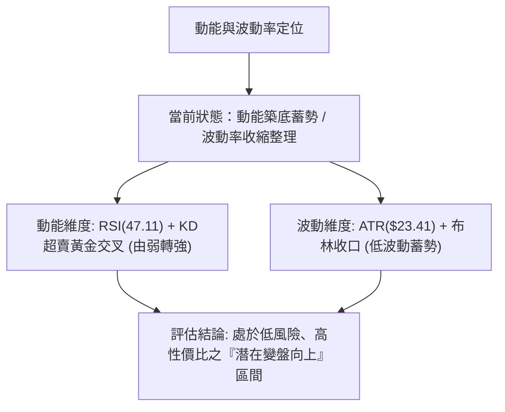

| 象限 | 動能維度 | 波動維度 | 當前狀態 | 技術操作意涵 |
|:----:|:--------:|:--------:|:--------:|--------------|
| **Q1** | 強動能 | 低波動 | — | 最佳單邊趨勢加碼點 |
| **Q2** | **轉強動能** | **低波動** | **✓ (AMD 當前定位)** | **低風險左側與箱體下沿佈局良機** |
| **Q3** | 強動能 | 高波動 | — | 主升浪爆發期（高風險高回報） |
| **Q4** | 弱動能 | 高波動 | — | 破位殺跌期，應嚴格空倉觀望 |

### 📊 ATR 波動率分析

- **ATR(14) 絕對值**：**$23.41**
- **ATR 相對價格比**：**4.95%**
- **止損與風控距離建議**：
  - **日內交易波動容忍區**：1.0 × ATR = **$23.41**
  - **波段交易安全止損距離**：1.5 × ATR = 1.5 × $23.41 = **$35.12**
  - **當前現價 $473.25 減去 1.5 ATR** = **$438.13**（該數值與 S2 支撐位 $437.23 及布林下軌 $441.59 呈現高度共振，為極佳之風控錨點）。

### 📐 Beta 與市場相關性

- **Beta 係數**：**2.489**（極高 Beta 屬性）
- **技術解讀**：
  - AMD 展現出相對於標普 500 指數近 2.5 倍的波動彈性。在市場處於多頭攻擊時具備極高超額收益（Alpha），但在市場回調時亦承擔放大之波動壓力。
  - 當前空方拋補天數（Short Ratio）僅為 **1.34 天**，融券佔流通盤比率僅 **2.3%**，顯示空頭並無高度做空意願，一旦市場半導體板塊情緒回暖，高 Beta 屬性將迅速轉化為向上爆發力。

---

## 7. 多時框架總結

### 📋 時框架評分表

| 時框架 | 趨勢方向 | 動能指標 | 均線排列 | 圖表形態 | 綜合評分 | 交易建議 |
|--------|:--------:|:--------:|:--------:|:--------:|:--------:|----------|
| **月線 (長期)** | 🟢 強烈看多 | 🟢 多頭主導 | 🟢 多頭排列 (遠高於 MA200) | 🟢 巨型主升浪回踩 | **88/100** | 長線堅定做多，逢低建倉 |
| **週線 (中期)** | 🟡 箱體整理 | 🟢 底背離蓄勢 | 🟡 混合排列 (MA50壓制) | 🟡 潛在雙底 ($461 支撐)| **60/100** | 箱體下軌佈局，等待突破 |
| **日線 (短期)** | 🟡 區間震盪 | 🟢 KD超賣金叉 | 🔴 短均線壓制 (MA20下方) | 🟡 窄幅 Doji 縮量整理 | **52/100** | 不追空，以高拋低吸為主 |

### 🔲 綜合訊號矩陣

```
時框維度          短期 (日線)          中期 (週線)          長期 (月線)
──────────────────────────────────────────────────────────────────
趨勢方向          🟡 弱勢盤整          🟡 箱體震盪          🟢 超級多頭
均線結構          🔴 承壓 MA20         🔴 承壓 MA50         🟢 站穩 MA200
動能指標          🟢 KD低檔金叉        🟢 RSI底背離         🟢 OBV長線支撐
形態結構          🟡 矩形整理          🟢 潛在雙底          🟢 突破後回踩
成交量能          🔴 縮量觀望          🟡 縮量蓄勢          🟢 主升浪支撐
──────────────────────────────────────────────────────────────────
矩陣共振結論：短期處於縮量築底尾聲，中期受 S1 支撐保護，長期處於超級牛市回調買點。
```

### ⚖️ 多時框收斂結論

> **依嚴格要求 14 進行收斂判定**：
> 1. **行情定性**：當前日線 ADX(14) = **9.88 (< 25)**，明確定義為**「無趨勢之箱體盤整行情」**。
> 2. **主導規則**：盤整行情下，不宜過度依賴單邊突破指標，而應以**日線布林通道上下軌 ($441.59 ~ $520.64) 與關鍵支撐阻力 ($461.71 ~ $530.13)** 作為核心交易邊界。
> 3. **多時框收斂唯一結論**：**【🟡 中性偏多 — 箱體下沿低吸】**。
>    雖然短均線微幅受壓，但在長期 MA200 ($329.86) 與中期週線 RSI 底背離的強大支撐下，股價向下空間被 S1 ($461.71) 與布林下軌鎖死。交易策略以第 8 章之「主推多頭策略（箱體低吸與突破雙軌制）」為唯一主線。

---

## 8. 交易策略建議

### 🗺️ 策略決策流程圖

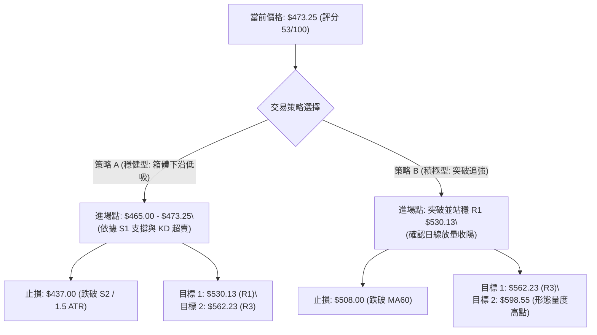

### 🧭 策略路由

**當前主策略方向 = 🟢 偏多區間操作（依據綜合評分 53/100 偏多蓄勢 + RSI底背離）**

### 🎯 價格情境階梯（Price Scenarios）

所有價位精確引用本報告第 4 章聚類數據：

| 觸發條件 | 第一目標價 | 第二目標價 | 後續延伸目標 | 情境技術含義 |
|----------|:----------:|:----------:|:------------:|--------------|
| **強勢突破 R1 $530.13** | **R2 $546.44** | **R3 $562.23** | **$598.55** (箱體量度) | 短線徹底轉強，開啟挑戰 52W 高點行情 |
| **站穩現價區間 ($461.71~$481.95)** | **MA20 $481.12** | **布林中軌** | **R1 $530.13** | 築底震盪，籌碼充分換手蓄勢 |
| **意外跌破 S1 $461.71** | **S2 $437.23** | **S3 $424.03** | **$418.37** (38.2%斐波) | 短線破位尋底，中期多頭進入深度防守 |

### 📊 情境機率分佈

```
情境機率分佈圖：
[1] 突破上行 / 迎來反彈 (60%) ▓▓▓▓▓▓▓▓▓▓▓▓▓▓▓▓▓▓▓▓▓▓▓▓ 60%
[2] 區間窄幅震盪 (25%)        ▓▓▓▓▓▓▓▓▓▓ 25%
[3] 破位下探 S2 (15%)         ▓▓▓▓▓▓ 15%
```

| 情境分類 | 機率預估 | 主要技術依據 |
|----------|:--------:|--------------|
| **繼續上行 / 強勁反彈** | **60%** | RSI(14) 週線底背離成立、Stoch KD 超賣黃金交叉、MACD 負柱狀圖收斂至 -0.794、OBV 量能維持長多結構。 |
| **箱體區間震盪** | **25%** | ADX(14) = 9.88 指示趨勢動能極弱，成交量萎縮至地量水準，多空暫維持平衡。 |
| **回落再探底 (跌破S1)** | **15%** | 短期受壓於 MA20 ($481.12) 與 MA50 ($510.23)，-DI 仍微幅領先 +DI。 |

### 🟢 主策略詳情

| 策略要素 | 策略 A：左側潛伏（箱體下沿低吸） | 策略 B：右側突破（確認趨勢進場） |
|----------|----------------------------------|----------------------------------|
| **適用對象** | 波段交易者 / 價值型技術買盤 | 順勢突破交易者 / 動能交易者 |
| **進場條件** | 現價 $473.25 附近或回踩 S1 $461.71 止跌 | 突破並日線收盤站穩 R1 $530.13 |
| **精確進場點** | **$473.25** (現價分批進場) | **$531.00** (突破確認進場) |
| **止損價格** | **$437.00** (跌破 S2 強支撐及 1.5 ATR) | **$508.00** (跌破 MA60 / MA50 支撐) |
| **目標價 T1** | **$530.13** (R1 關鍵箱體上軌，+12.0%) | **$562.23** (R3 強阻力位，+5.9%) |
| **目標價 T2** | **$562.23** (R3 波段高點，+18.8%) | **$598.55** (箱體完全量度目標，+12.7%) |
| **風險空間** | $36.25 (-7.66%) | $23.00 (-4.33%) |
| **獲利空間 (T2)**| $88.98 (+18.80%) | $67.55 (+12.72%) |
| **風險報酬比** | **1 : 2.45** (優良) | **1 : 2.94** (極佳) |
| **勝率預估** | **65%** | **60%** |
| **建議倉位** | **15% - 20%** (首批建倉) | **25% - 30%** (確認加碼) |

### 🔴 反向風險觸發點（對沖與風控提示）

- **多頭結構破壞點**：若日線實體陰線跌破 **S1 $461.71**，且成交量放大，應將倉位減半。
- **終極停損止血點**：若價格跌破 **S2 $437.23**（同時跌破布林下軌與 1.5 ATR 防守位），表明底背離失效，矩形箱體轉為破位下跌，多頭策略必須**無條件全數止損離場**，轉為觀望並等待 $418.37 (38.2% 斐波) 的支撐測試。

### ⭐ 整體訊號強度評星

```
╔══════════════════════════════════════════════════════════════════╗
║ 做多訊號強度：★★★★☆  (4.0/5星) — 長多短盤，底背離支撐強烈    ║
║ 做空訊號強度：★☆☆☆☆  (1.0/5星) — ADX極低且接近強支撐，忌空 ║
║ 整體可信度：  ★★★★☆  (4.2/5星) — 多指標與量價共振確認      ║
╚══════════════════════════════════════════════════════════════════╝
```

---

## 9. 風險提示與監控

### ✅ 關鍵監控指標 Checklist

```
╔══════════════════════════════════════════════════════════════════╗
║              每日交易關鍵監控清單 (Checklist)                    ║
╠══════════════════════════════════════════════════════════════════╣
║ [ ] 價格是否成功收復 MA20 ($481.12) 與 23.6% 斐波位 ($481.95)   ║
║ [ ] S1 支撐位 $461.71 是否在收盤前未被跌破                       ║
║ [ ] 日成交量是否回升至 20日均量 (26.55M) 之上（放量訊號）       ║
║ [ ] MACD 柱狀圖是否由負轉正 (跨越 0 軸黃金交叉)                  ║
║ [ ] KD 指標是否從 < 20 超賣區持續向上發散脫離                    ║
║ [ ] ADX(14) 是否向上突破 20，確認新一輪波段趨勢啟動              ║
║ [ ] 半導體產業板塊整體情緒與 Beta 聯動風險                       ║
╚══════════════════════════════════════════════════════════════════╝
```

### ⚠️ 風險場景分析

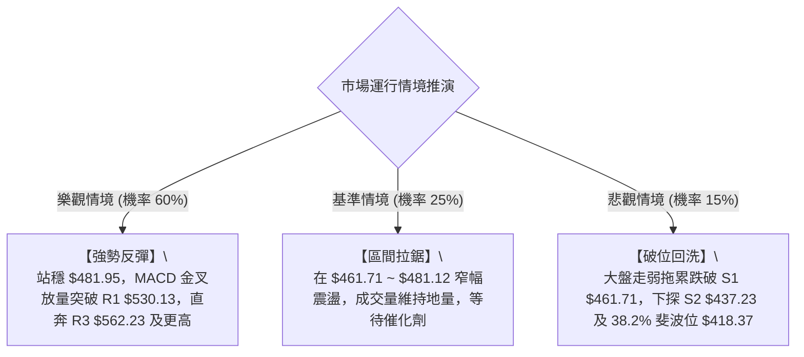

### 🛡️ 風險管理重要提醒

1. **高 Beta 波動控制**：AMD 之 Beta 值高達 **2.489**，其日內波動幅度極大（ATR 達 **$23.41**）。單筆交易最大虧損應嚴格控制在總資金的 **1.0% - 1.5%** 內，避免因單日大幅跳空承受超額風險。
2. **切忌盤整期追漲殺跌**：在 **ADX = 9.88** 的環境下，價格極易在布林上下軌之間來回拉鋸。切忌在逼近 R1 ($530.13) 時盲目追高，亦不應在接近 S1 ($461.71) 支撐時恐慌殺跌。
3. **倉位管理法則**：
   - 總部位上限：建議不超過總投資組合的 **20%**。
   - 分批建倉原則：採用「3-4-3」分批進場法（現價佈局 30%，回踩 S1 企穩加碼 40%，放量突破 MA20 後追加剩餘 30%）。

---

## 📋 報告總結

```
╔══════════════════════════════════════════════════════════════════╗
║                    AMD 技術分析報告總結                          ║
╠══════════════════════════════════════════════════════════════════╣
║ 報告日期：2026-08-23                                             ║
║ 當前價格：$473.25                                                ║
║ 分析評級：🟡 區間震盪蓄勢（中性偏多，評分 53/100）               ║
║                                                                  ║
║ 關鍵結論：                                                       ║
║ ├─ 長期趨勢：🟢 強烈看多 (站穩 MA200 $329.86，2年大牛市架構完好) ║
║ ├─ 中期趨勢：🟡 箱體整理 (在 S1 $461.71 與 R1 $530.13 間築底)    ║
║ ├─ 短期趨勢：🟢 超賣反彈 (RSI底背離 + KD低檔金叉 + MACD負柱收斂) ║
║ ├─ 關鍵支撐：S1 $461.71 ｜ S2 $437.23 ｜ 38.2% 斐波 $418.37      ║
║ ├─ 關鍵阻力：R1 $530.13 ｜ R2 $546.44 ｜ R3 $562.23              ║
║ └─ 分析師目標價：均價 $613.09 (最高 $1,250.00 / 評級: Strong Buy)║
║                                                                  ║
║ 最優策略組合：                                                   ║
║ 1. 🥇 最佳機會：策略 A (現價 $473.25 低吸，止損 $437.00，        ║
║                目標 $530.13 / $562.23，風報比 1:2.45)           ║
║ 2. 🥈 次選機會：策略 B (突破 R1 $530.13 追強，止損 $508.00，     ║
║                目標 $562.23 / $598.55，風報比 1:2.94)           ║
║ 3. 🥉 保守選擇：等待股價回踩 S1 $461.71 出現明確反轉K線後再進場  ║
╚══════════════════════════════════════════════════════════════════╝
```

---

> ⚠️ **免責聲明**：本報告為技術分析研究，所有數據及估算均嚴格基於所提供之歷史價格與技術指標資訊。本報告**僅供研究與學術參考**，**不構成任何形式的投資建議或要約**。金融市場投資具有高風險性，投資人應獨立評估自身風險承受能力並自負盈虧。

---

*報告生成時間：2026-08-23 ｜ 數據來源：Yahoo Finance ｜ 分析框架：多時框量化技術分析*