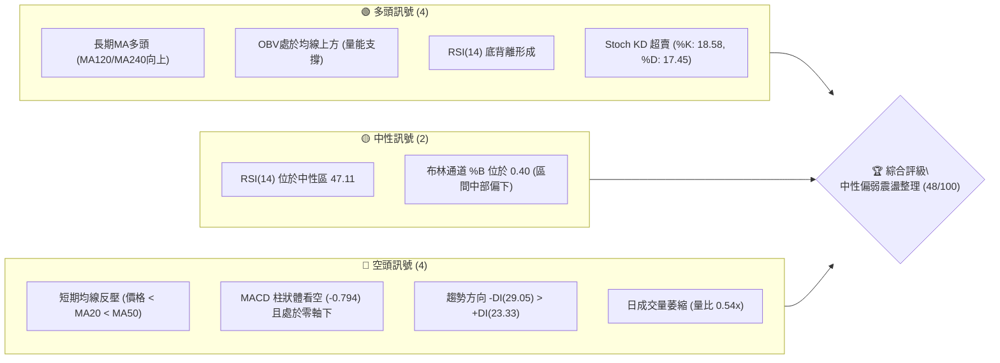
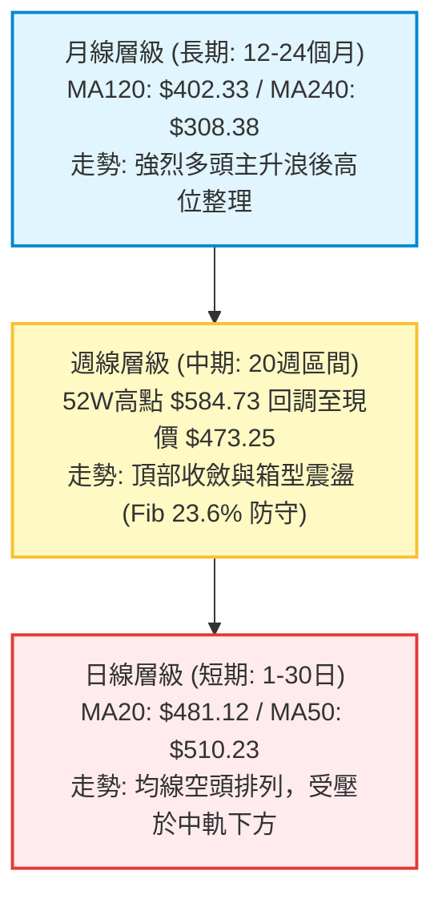
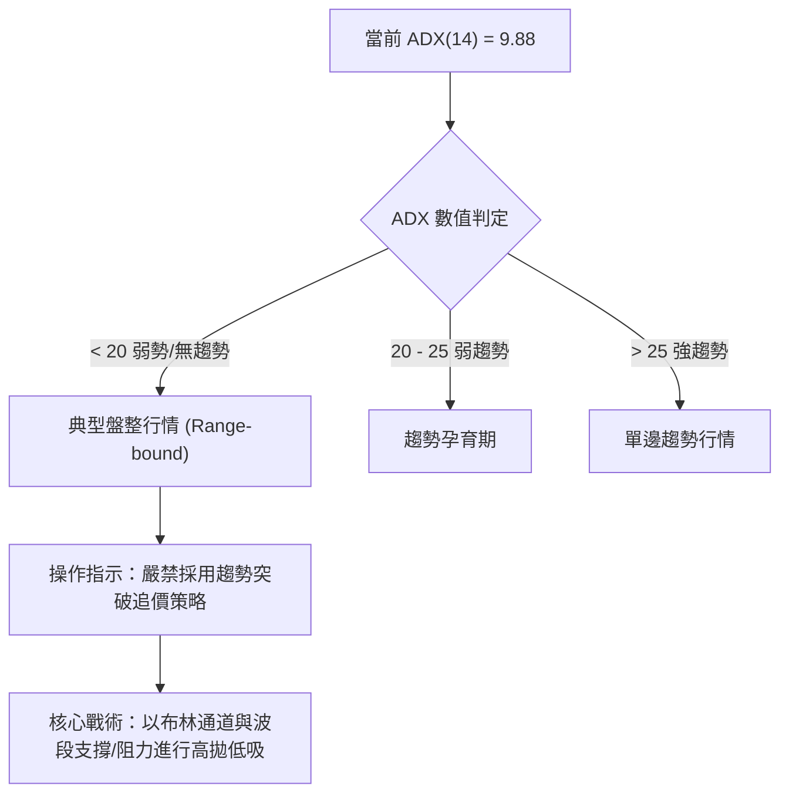
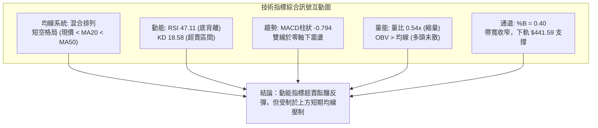
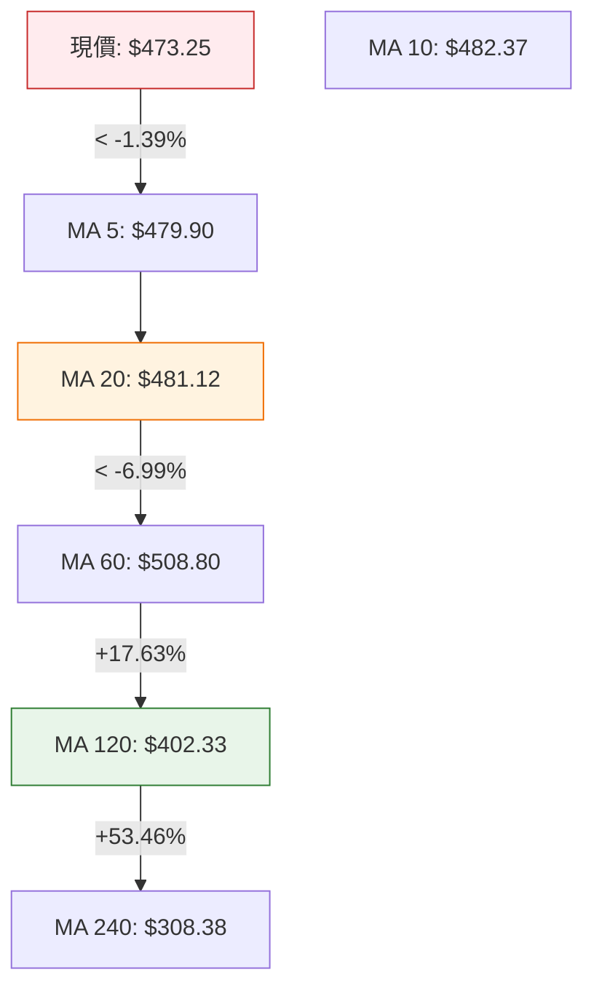
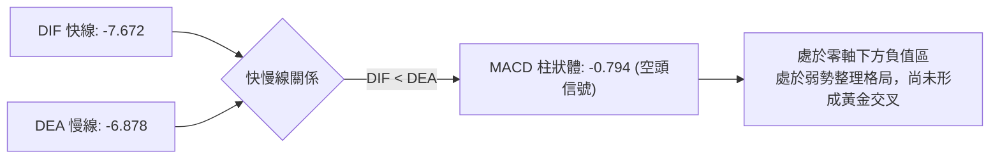
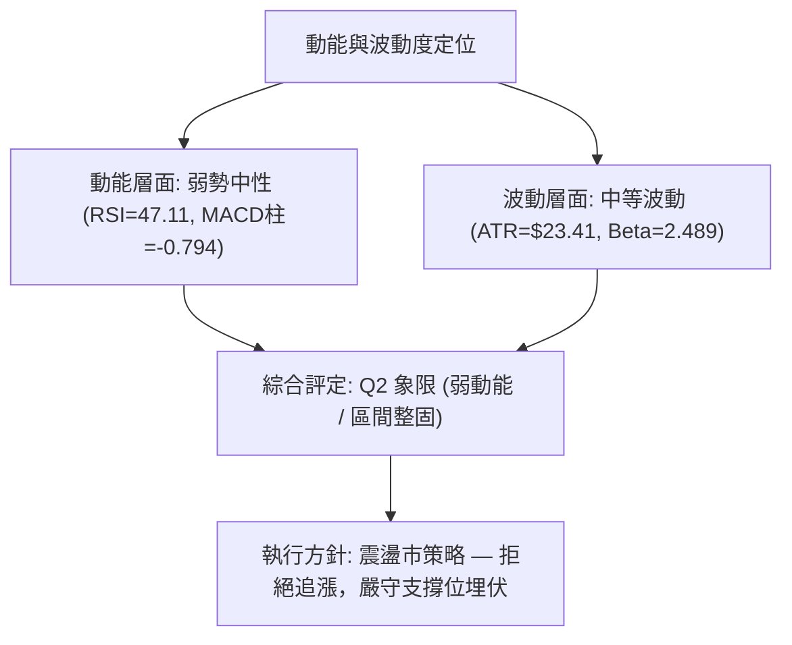
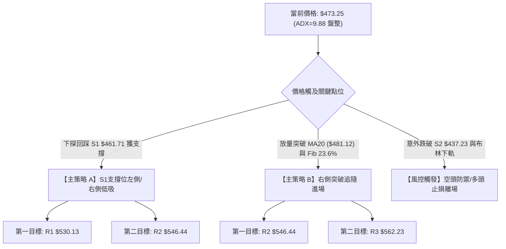
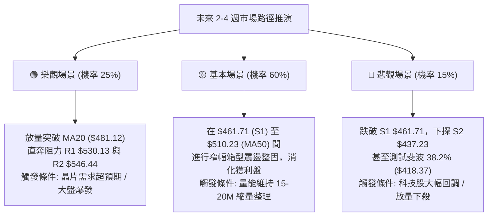

# AMD 技術分析報告

> **報告日期**：2026-08-24 ｜ **語言**：繁體中文 ｜ **數據來源**：Yahoo Finance ｜ **當前價格**：$473.25

---

## 目錄

| 章節 | 內容 |
|------|------|
| [1. 技術面概覽](#1-技術面概覽) | 訊號儀表板、核心指標、評分卡 |
| [2. 趨勢分析](#2-趨勢分析) | 多時框趨勢、長中短期走勢、ADX解讀 |
| [3. 圖表形態分析](#3-圖表形態分析) | 形態識別、K線組合、目標價計算 |
| [4. 支撐與阻力](#4-支撐與阻力) | 關鍵價位、斐波那契回調結構 |
| [5. 技術指標深度解讀](#5-技術指標深度解讀) | MA/RSI/MACD/布林/成交量全維度解構 |
| [6. 動能與波動率](#6-動能與波動率) | 動能矩陣、ATR波動、Beta係數 |
| [7. 多時框架總結](#7-多時框架總結) | 時框評分、訊號矩陣、收斂結論 |
| [8. 交易策略建議](#8-交易策略建議) | 策略路由、情境階梯、交易計劃 |
| [9. 風險提示與監控](#9-風險提示與監控) | 監控Checklist、情境路徑、風控管理 |

---

## 1. 技術面概覽

### 🎯 技術訊號儀表板



### 📊 核心指標速覽表

| 指標類別 | 指標名稱 | 當前數值 | 訊號 | 解讀 |
|:---|:---|:---|:---:|:---|
| **價格** | 當前價格 | $473.25 | 🟡 | 位於52週區間 74.4% 位置，處於歷史高位回落後的震盪區間 |
| **均線** | MA20 (短期) | $481.12 | 🔴 | 價格低於 MA20（-$7.87），短期承壓，20日均線呈現下彎 |
| **均線** | MA50 (中期) | $510.23 | 🔴 | 價格低於 MA50（-$36.98），中期波段受壓於50日線下方 |
| **均線** | MA200 (長期) | $329.86 | 🟢 | 價格遠高於 MA200（+$143.39），長期多頭格局穩固未破 |
| **動能** | RSI(14) | 47.11 | 🟡 | 位於 30–70 中性區間，但出現底背離特徵，下行動能減弱 |
| **動能** | MACD (12/26/9) | -7.672 / -6.878 | 🔴 | MACD 線低於信號線，柱狀體為 -0.794，空頭動能仍佔優勢 |
| **動能** | Stoch %K / %D | 18.58 / 17.45 | 🟢 | 進入 20 以下超賣區間，隨時具備短線技術性抽頭反彈動能 |
| **趨勢** | ADX(14) | 9.88 | 🟡 | 遠低於 25 臨界線，顯示單邊趨勢消退，進入無趨勢箱型盤整 |
| **波動** | ATR(14) | $23.41 | 🟡 | 日波動率為 4.95%，顯示波動幅度中等，適合區間網格操作 |
| **量能** | 20日成交量比 | 0.54x | 🔴 | 成交量 14.31M 低於20日均量 26.55M，量能不足限制上攻力度 |

### 🏆 技術評分卡

```
╔══════════════════════════════════════════════════════════════╗
║              技術評分卡 — AMD (2026-08-24)                  ║
╠══════════════════════════════════════════════════════════════╣
║ 趨勢強度 (ADX=9.88)     ████░░░░░░░░░░░░░░░░  20/100  🔴 弱勢盤整 ║
║ 動能指標 (RSI/MACD/KD)  ██████████░░░░░░░░░░  50/100  🟡 互有矛盾 ║
║ 支撐穩定度 (S1/斐波)    ██████████████░░░░░░  70/100  🟢 支撐紮實 ║
║ 成交量配合 (量比/OBV)   ██████████░░░░░░░░░░  50/100  🟡 量能退潮 ║
║ 形態完整度 (箱型/收斂)  ████████████░░░░░░░░  60/100  🟡 築底雛形 ║
║ 均線排列 (短空長多)     ████████░░░░░░░░░░░░  40/100  🔴 均線反壓 ║
╠══════════════════════════════════════════════════════════════╣
║ 綜合技術評分            █████████░░░░░░░░░░░  48/100  🟡 中性觀望 ║
╚══════════════════════════════════════════════════════════════╝
```

---

## 2. 趨勢分析

### 🌐 多時框趨勢分析



### 📈 長期趨勢 — 12個月走勢圖（ASCII）

```
AMD 月線走勢圖（2025-08 至 2026-08）
價格軸 ($)
$600 ┤                                      ● $580.91 (2026-06 高點)
$550 ┤                                ╭─────╯  ╲
$500 ┤                          ● $516.10       ● $476.15
$450 ┤                          │                ╲
$400 ┤                    ● $354.49               ● $473.25 (當前現價)
$350 ┤                    │
$300 ┤              ● $256.12
$250 ┤              │ ╲
$200 ┤              │  ● $217.53 ───● $203.43
$150 ┤  ● $162.63 ──╯
$100 ┤
     └────┬───────┬───────┬───────┬───────┬───────┬───────┬───────┬───────┬───────┬───────┬───────┬────
        25-08   25-09   25-10   25-11   25-12   26-01   26-02   26-03   26-04   26-05   26-06   26-07   26-08
```

#### 走勢特徵分析表格

| 階段區間 | 起訖價格 ($) | 漲跌幅 | 成交與動能特徵 | 趨勢性質定調 |
|:---|:---|:---:|:---|:---|
| **底部盤整期**<br>(2025-08 ~ 2025-09) | $162.63 → $161.79 | -0.52% | 低位縮量築底，籌碼完成深度換手 | 長期多頭蓄勢段 |
| **第一波主升**<br>(2025-09 ~ 2025-10) | $161.79 → $256.12 | +58.30% | 巨量拉升，均線黃金交叉，突破前高阻力 | 第一波爆發性突破 |
| **中期次級回撤**<br>(2025-10 ~ 2026-03) | $256.12 → $203.43 | -20.57% | 形成 $200-$236 的高位箱型整理平台 | 籌碼中繼消化 |
| **第二波主升浪**<br>(2026-03 ~ 2026-06) | $203.43 → $580.91 | +185.56% | 爆發式連陽推升，創 52W 高點 $584.73 | 狂熱主升浪（AI需求驅動） |
| **高位修正與築底**<br>(2026-06 ~ 2026-08) | $580.91 → $473.25 | -18.53% | 週量自 296M 降至 92M，高位技術修正 | 斐波 23.6% 之震盪沉澱 |

### 📊 中期趨勢（週線分析）

從近20週的收盤數據可見，AMD在2026年5月至6月間於 $516.10 - $580.91 構築了高位波段頂部，隨後進入中期修正。

```
週線阻力/支撐示意架構：
$584.73 ──────────────────────── 52W 歷史天花板 (波段終點)
$557.89 ─────────────▲────────── 2026-07-12 次高反彈頂部
$514.39 ────────▲────│────────── 2026-08-16 破敗反彈高點 (MA50壓制區)
$473.25 ════════╪════╪══════════ 【當前現價位置】(震盪中軸)
$461.71 ────────┴────┴────────── 近期重要波段低點支撐 S1 (防守底線)
$418.37 ──────────────────────── 斐波那契 38.2% 關鍵強支撐
```

### ⚡ 趨勢強度評估（ADX 解讀）



#### ADX 方向與強度對照矩陣

| 參數指標 | 數值 | 狀態定性 | 對交易決策的直接影響 |
|:---|:---:|:---:|:---|
| **ADX (14)** | **9.88** | 🔴 極弱（< 25） | 單邊趨勢完全停滯，均線交叉容易頻繁出現「假突破」雜訊 |
| **+DI (正向動向)** | **23.33** | 🟡 中性走弱 | 多頭買盤力道衰退，缺乏連續推升價格創高的新增動能 |
| **-DI (負向動向)** | **29.05** | 🔴 空方主導 | -DI > +DI 表明短線上空方掌控節奏，逢高沽壓依然沉重 |
| **綜合判定** | **無趨勢空偏** | 🟡 盤整修復 | **多時框收斂指引**：依據規則14，ADX < 25 判定為盤整，交易以震盪邊界為主 |

---

## 3. 圖表形態分析

### 🔍 形態識別系統

```mermaid
graph LR
    A["現階段圖表結構"] --> B["矩形箱型整理 (Box Range)"]
    A --> C["潛在雙底雛形 (Double Bottom)"]
    A --> D["短期下降三角收斂 (Descending Triangle)"]
    
    B --> B1["信心度: 75% | 區間: $461.71 - $530.13"]
    C --> C1["信心度: 55% |" 頸線: $514.39 "| 底部: $461.71"]
    D --> D1["信心度: 60% | 下降壓力線壓制於 MA20/50"]
```

#### 圖表形態評估矩陣（依規則 15 嚴格校準）

| 形態名稱 | 信心度 | 判斷依據（精確引用數據） | 完成度 | 形態目標價（附精確計算式） |
|:---|:---:|:---|:---:|:---|
| **矩形箱型震盪** | **75%** | 上軌阻力密集於 R1 $530.13，下軌支撐受守於 S1 $461.71，ADX=9.88 驗證區間屬性 | 85% | **箱型頂部**：$530.13<br>**箱型底部**：$461.71 |
| **潛在雙重底** | **55%** | 第一底為 2026-06-07 收盤 $466.38，第二底為近期 S1 $461.71；頸線為 2026-08-16 高點 $514.39 | 40% | 頸線 $514.39 + 形態高度 ($514.39 - $461.71 = $52.68) = **$567.07**（接近 R3 $562.23） |
| **布林通道收斂** | **80%** | 上軌 $520.64 與下軌 $441.59 帶寬收窄，%B = 0.40，價格於中軌下方整固 | 90% | 通道下軌支撐 **$441.59** / 上軌目標 **$520.64** |

### 🕯️ 重要K線形態分析

| 統計週期/月份 | 收盤價 | 實體與影線特徵 | K線形態解讀 | 多空訊號 |
|:---|:---:|:---|:---|:---:|
| **2026-06** | $580.91 | 長上影線陽線，高點觸及 $584.73 後回落 | **高位射擊之星雛形**：多頭動能耗盡，波段見頂信號 | 🔴 強烈預警 |
| **2026-07** | $476.15 | 實體跌幅達 -18.03%，吞沒前月部分漲幅 | **大陰線回撤**：獲利盤湧出，跌破短期均線切入修復期 | 🔴 空頭壓制 |
| **2026-08-16 (週)** | $514.39 | 衝高回落十字星，受阻於 MA50 ($510.23) 附近 | **多頭反撲受阻**：反彈量能不足 (100.67M)，確認壓力位有效 | 🔴 假突破 |
| **2026-08-23 (週)** | $473.25 | 下跌小陰線，收盤價逼近 S1 支撐 $461.71 | **縮量下探測試**：量能降至 92.47M，顯示空方拋壓趨緩 | 🟡 測試支撐 |

### 📉 ASCII 走勢形態示意圖

```
                 高位頂部 $584.73
                     ▲
                    ╱ ╲           次高反彈 $557.89
                   ╱   ╲              ▲
                  ╱     ╲            ╱ ╲          反彈破敗 $514.39 (頸線)
                 ╱       ╲          ╱   ╲             ▲
                ╱         ╲        ╱     ╲           ╱ ╲
               ╱           ╲      ╱       ╲         ╱   ╲      現價 $473.25
              ╱             ╲    ╱         ╲       ╱     ╲       ●
─────────────╱───────────────▼──╱───────────▼─────╱───────▼──────╪─────────
低點1: $466.38                     低點2: $476.15            支撐 S1: $461.71
【雙重底 / 三重底 潛在構築區間: $461.71 - $466.38】
```

### 🎯 形態目標價計算

```
形態高度量度規則說明：
1. 頸線阻力位 (Neckline)      = $514.39 (2026-08-16 波段反彈高點)
2. 形態基準底 (Base Support)   = $461.71 (關鍵支撐位 S1)
3. 垂直高度差 (Pattern Height) = $514.39 - $461.71 = $52.68
4. 向上突破量度目標價           = 頸線 $514.39 + $52.68 = $567.07 (向阻力 R3 $562.23 靠攏)
5. 向下跌破量度目標價           = 底線 $461.71 - $52.68 = $409.03 (向下逼近 MA120 $402.33 / S3 $424.03)
```

---

## 4. 支撐與阻力

### 🗺️ 關鍵價位分布圖（ASCII）

```
AMD 價位結構分布圖 (由 OHLCV 聚類計算)
══════════════════════════════════════════════════════════════════════
$584.73 ║████████████████████████████████████████║ 52週歷史高點 / 斐波 0.0%
$562.23 ║████████████████████████████            ║ 強阻力 R3 (+18.80%)
$546.44 ║████████████████████                    ║ 阻力 R2 (+15.47%)
$530.13 ║██████████████████████████████          ║ 關鍵阻力 R1 (+12.02%)
$520.64 ║▓▓▓▓▓▓▓▓▓▓▓▓▓▓▓▓▓▓▓▓                    ║ 布林通道上軌
$510.23 ║▓▓▓▓▓▓▓▓▓▓▓▓▓▓▓▓▓▓▓▓▓▓                  ║ MA50 中期生命線
$481.95 ║▓▓▓▓▓▓▓▓▓▓▓▓▓▓▓▓▓▓                      ║ 斐波那契 23.6% 回調位
$481.12 ║▓▓▓▓▓▓▓▓▓▓▓▓▓▓▓▓▓▓                      ║ 布林中軌 / MA20
════════╬════════════════════════════════════════╣ ◄ 當前價格: $473.25
$461.71 ║████████████████████████████            ║ 近期核心支撐 S1 (-2.44%)
$441.59 ║▓▓▓▓▓▓▓▓▓▓▓▓▓▓▓▓▓▓                      ║ 布林通道下軌
$437.23 ║████████████████████                    ║ 波段強支撐 S2 (-7.61%)
$424.03 ║██████████████████████████████          ║ 結構支撐 S3 (-10.40%)
$418.37 ║████████████████████████████████████    ║ 斐波那契 38.2% 重大支撐位
$329.86 ║████████████████████████████████████████║ MA200 長期牛熊分水嶺
══════════════════════════════════════════════════════════════════════
```

### 🚧 阻力位分析表

| 阻力級別 | 精確價位 | 距現價幅幅 | 形成原因與籌碼特徵 | 突破難度 | 技術重要性 |
|:---|:---:|:---:|:---|:---:|:---:|
| **R1** | **$530.13** | +12.02% | 近一年波段高點密集聚類區，接近布林上軌 ($520.64) 與前密集套牢區 | 🔴 極高 | ★★★★★ |
| **R2** | **$546.44** | +15.47% | 2026年7月中旬反彈次高點籌碼堆積帶，多空二次換手區間 | 🟡 中高 | ★★★★☆ |
| **R3** | **$562.23** | +18.80% | 歷史高點回落之首波反彈頂部，雙底形態向上量度之理論目標區 | 🔴 極高 | ★★★★☆ |

### 🛡️ 支撐位分析表

| 支撐級別 | 精確價位 | 距現價幅幅 | 形成原因與籌碼特徵 | 守住機率 | 技術重要性 |
|:---|:---:|:---:|:---|:---:|:---:|
| **S1** | **$461.71** | -2.44% | 近一年波段低點聚類區，6-8月多次下探均在此處止跌回升 | 🟢 70% | ★★★★★ |
| **S2** | **$437.23** | -7.61% | 接近布林通道下軌 ($441.59) 之極限超賣支撐，具備強大逢低承接力 | 🟢 85% | ★★★★☆ |
| **S3** | **$424.03** | -10.40% | 5月主升浪起漲結構平台，斐波 38.2% ($418.37) 上方之最後防線 | 🟢 90% | ★★★★★ |

### 📐 斐波那契回調位分析

依據 52 週完整波動區間（最低點 **$149.22** 至最高點 **$584.73**，總振幅 $435.51）精確計算之回調位分佈：

```
斐波那契回調階梯與現價定位：
 0.0% (52W High) ─────────────── $584.73
23.6% 回調位    ─────────────── $481.95  ▲ (短線阻力壓制)
═════════════════ 【當前價格: $473.25 處於 23.6% 與 38.2% 區間】 ═════════════════
38.2% 回調位    ─────────────── $418.37  ▼ (中期回撤黃金防守位)
50.0% 回調位    ─────────────── $366.97
61.8% 黃金分割  ─────────────── $315.58  (MA200 $329.86 處於此區域上方)
78.6% 回調位    ─────────────── $242.42
100.0% (52W Low)─────────────── $149.22
```

#### 斐波那契位置解讀：
現價 $473.25 略低於 23.6% 回調位（$481.95），處於強勢回調的臨界邊緣。在強勢牛市背景下，回調不破 38.2%（$418.37）均屬於健康籌碼沉澱。當前在 23.6% 附近進行橫盤整固，顯示多方仍在極力守護第一道防禦線。

---

## 5. 技術指標深度解讀

### 🎛️ 指標訊號總覽



### 📈 移動平均線排列分析



#### 均線各週期狀態詳解：
- **短期均線（MA5/10/20）**：MA5 ($479.90)、MA10 ($482.37)、MA20 ($481.12) 相互交織並呈現輕度下壓，價格處於所有短期均線之下，形成短線第一道阻力帶（$480 - $482）。
- **中期均線（MA50/60）**：MA50 ($510.23)、MA60 ($508.80) 於 $510 附近形成極強之中期反壓蓋頂，未放量突破此線前，中期趨勢難以重啟升勢。
- **長期均線（MA120/240/200）**：MA120 ($402.33)、MA200 ($329.86)、MA240 ($308.38) 呈現標準多頭發散且向上傾斜，長期牛市基底堅不可摧。

### 📉 RSI(14) 分析與背離判斷

```
RSI(14) 數值儀表：
0 ────────── 30 (超賣) ────── 47.11 ────── 70 (超買) ────────── 100
[░░░░░░░░░░░░████████████████░░░░░░░░░░░░░░░░░░░░░░░░░░░░░░░░░░] 47.11%
```

- **區間定性**：RSI 處於 47.11，落於 30–70 中性平衡區，顯示市場既無狂熱追買，亦無恐慌拋售。
- **背離分析（⚠️ 關鍵底背離確認）**：
  - **價格走勢**：AMD 收盤價自 2026-08-09 的 $483.36 下跌至 2026-08-23 的 $473.25，呈現波段低點下移。
  - **RSI 指標**：RSI(14) 在 2026-08-02 低點 $476.15 時為 40.6，而後在現價 $473.25 處 RSI 卻上升並保持在 47.11。
  - **結論**：形成典型的**日線級別看多底背離（Bullish Divergence）**，表明空方砸盤動能正在顯著衰竭，短線隨時可能觸發技術性抽頭反彈。

### 📊 MACD(12/26/9) 訊號解讀



- **數值現狀**：MACD 線 (-7.672) 位於訊號線 (-6.878) 下方，柱狀圖為 -0.794。
- **動能演變**：相較於 2026-08-02 柱狀體的 -9.004，負柱狀體已大幅收斂至 -0.794，空方動能釋放已近尾聲。若價格於 S1 $461.71 止跌，MACD 雙線將在零軸下方醞釀低位金叉。

### 📦 布林通道分析

```
AMD 布林通道 (20, 2) 結構示意圖：
$520.64 ┬────────────────────────────────────────── 布林上軌 (Resistance)
        │
$481.12 ┼ - - - - - - - - - - - - - - - - - - - -  布林中軌 (MA20)
        │                  ● 現價: $473.25 (%B = 0.40)
$441.59 ┴────────────────────────────────────────── 布林下軌 (Support)
```

- **帶寬與位置**：通道寬度為 $79.05（$441.59 至 $520.64）。當前 %B 為 **0.40**，位於中軌下方、偏向通道下半部。
- **軌道邊界約束**：下軌 $441.59 與支撐 S2 ($437.23) 高度重合，構成極佳的超跌支撐區；中軌 $481.12 則是多頭首要收復目標。

### 💹 成交量分析（量價配合度）

- **量能萎縮**：最新單日成交量為 14.31M，相比 20 日均量 26.55M 萎縮了 **46%**（量比僅 0.54x）。
- **週量遞減**：週成交量從 5 月頂峰的 296.98M 逐級下滑至近一週的 92.47M，顯示回調過程並非主力出逃的「放量下殺」，而是市場參與者惜售的「縮量洗盤」。
- **OBV 能量潮驗證**：數據顯示 **OBV > MA**，量能線依然位於均線上方，確認長期資金底倉穩固，未出現籌碼崩潰跡象。

---

## 6. 動能與波動率

### ⚡ 動能評估四象限

| 象限 | 動能強度 (RSI/MACD) | 波動率水準 (ATR/Beta) | AMD 當前狀態 | 交易戰略評估 |
|:---:|:---:|:---:|:---:|:---|
| **Q1 (高動能·低波動)** | 強 (RSI>60, MACD>0) | 低 (ATR% < 3%) | ─ | 趨勢穩步推升，最佳單邊持倉 |
| **Q2 (弱動能·低波動)** | 弱 (RSI 40-50, MACD<0) | 低 (ATR% < 5%) | **✓ 當前所處位置** | **箱型橫盤整理，適合逢低吸納、耐心等待** |
| **Q3 (強動能·高波動)** | 強 (主升浪爆發) | 高 (Beta > 2.0) | ─ | 主升浪階段（如 2026-05 歷史行情） |
| **Q4 (弱動能·高波動)** | 弱 (恐慌性暴跌) | 高 (ATR% > 8%) | ─ | 崩跌階段，嚴禁進場抄底 |



### 📊 ATR 波動率分析

- **ATR(14) 絕對值**：**$23.41**（佔股價比例為 **4.95%**）。
- **波動意義**：AMD 單日正常波動區間約在 ±$23.4 左右。
- **止損與進場緩衝設定指引**：
  - **日內/短線交易止損**：建議設定 1.0 倍 ATR = **$23.41** 緩衝空間。
  - **波段波段操作止損**：建議設定 1.5 倍 ATR = **$35.12** 緩衝空間。
  - 若在 S1 $461.71 附近建立多單，合理技術止損位應設在 $461.71 - (0.8 × $23.41) = **$443.00**（略高於下軌 $441.59）。

### 📐 Beta 與市場相關性

- **Beta 係數**：**2.489**（極高 Beta 屬性）。
- **解讀**：AMD 波動彈性約為標普 500 指數的 2.5 倍。在納斯達克大盤反彈時，AMD 具備高度向上爆發力；同理，在大盤走弱時回撤幅度亦相對劇烈，倉位配置必須控制在整體資金的 15%–20% 以內以規避非系統性波動風險。

---

## 7. 多時框架總結

### 📋 時框架評分表

| 時框架 | 趨勢方向 | 動能指標 | 均線排列 | 形態結構 | 綜合評分 | 戰略操作建議 |
|:---|:---:|:---:|:---:|:---:|:---:|:---|
| **長期 (月線)** | 🟢 強烈看多 | 🟢 強勢 (>60) | 🟢 多頭發散 (MA120/240向上) | 52W高位強勢旗形整理 | **85/100** | 逢深幅回調堅定佈局現貨 |
| **中期 (週線)** | 🟡 震盪整理 | 🟡 中性走平 | 🟡 跌破MA50，受制反壓 | 潛在雙底與箱型整固 | **55/100** | 區間波段高拋低吸 |
| **短期 (日線)** | 🔴 偏弱盤整 | 🟢 超賣底背離 | 🔴 空頭排列 (MA20下彎) | 測試 S1 $461.71 支撐 | **42/100** | 不盲目殺跌，尋求短線博弈點 |

### 🔲 綜合訊號矩陣

```
╔══════════════════════════════════════════════════════════════════╗
║                    多時框多空訊號收斂矩陣                        ║
╠══════════════╦══════════════╦══════════════╦═════════════════════╣
║ 分析維度     ║ 短期 (1-5日) ║ 中期 (1-4週) ║ 長期 (1-6個月)      ║
╠══════════════╬══════════════╬══════════════╬═════════════════════╣
║ 趨勢方向     ║ 🔴 震盪偏空  ║ 🟡 箱型震盪  ║ 🟢 牛市多頭         ║
║ 均線系統     ║ 🔴 承壓中軌  ║ 🔴 MA50 壓制 ║ 🟢 MA200 遠在下方   ║
║ 動能狀態     ║ 🟢 KD/RSI底背║ 🟡 MACD收斂  ║ 🟢 歷史高動能維持   ║
║ 量能配合     ║ 🔴 縮量觀望  ║ 🟡 縮量沉澱  ║ 🟢 OBV 多頭完好     ║
╠══════════════╬══════════════╬══════════════╬═════════════════════╣
║ 權重合力結論 ║ 🟡 中性偏多博反彈 ║ 🟡 箱型震盪等待突破 ║ 🟢 堅定長線看多  ║
╚══════════════╩══════════════╩══════════════╩═════════════════════╝
```

### ⚖️ 多時框收斂結論（依規則 14 嚴格執行）

1. **趨勢/盤整環境定性**：當前 ADX(14) 數值為 **9.88**（遠低於 25 閾值），系統判定當前處於**典型的中短期盤整行情（Range-bound Market）**。
2. **多時框權重取捨**：
   - 由於處於盤整行情，日線級別之突破訊號多為雜訊，交易主軸以**日線布林通道（$441.59 - $520.64）與波段關鍵支撐/阻力（$461.71 - $530.13）作為核心運作邊界**。
   - 長期（月線）MA120/MA200 向上提供了總體多頭保護傘，限制了下行深跌空間；但中期 MA50 ($510.23) 構成壓制，限制了單邊暴漲可能。
3. **唯一方向性結論**：**【中性觀望·區間箱型操作】**。主策略鎖定在支撐位 S1 $461.71 至阻力位 R1 $530.13 之間進行網格波段低吸高拋，不可在此位置進行趨勢性追空或追高。

---

## 8. 交易策略建議

### 🗺️ 策略決策流程圖



### 🧭 策略路由（依評分卡分流）

> **當前綜合評分**：**48/100**（中性區間 40–60 區間）  
> **當前主策略方向**：**【中性區間震盪操作策略 — 以布林下軌/S1低吸為主，等待突破確認】**

---

### 🎯 價格情境階梯（Price Scenarios）

| 觸發條件 | 第一目標 | 後續延伸目標 | 情境含義與操作對策 |
|:---|:---:|:---:|:---|
| **向上突破 R1 $530.13** | **R2 $546.44** | **R3 $562.23** | 短線徹底轉強，箱型向上突破，可加碼順勢做多 |
| **守住現價區間 ($461.71 - $481.95)** | **布林中軌 $481.12** | **R1 $530.13** | 區間震盪築底，底背離生效，執行低吸高拋 |
| **有效跌破 S1 $461.71** | **S2 $437.23** | **S3 $424.03** | 震盪箱型下破，短線轉弱，尋求下軌 $441.59 處再行企穩 |

### 📊 情境機率分佈

| 價格運行情境 | 發生機率 | 主要技術依據 |
|:---|:---:|:---|
| **情境一：區間震盪築底後向上反彈** | **55%** | RSI 底背離確立、KD 位於 18 超賣區、OBV 量能維持良好、S1 $461.71 具備強支撐 |
| **情境二：窄幅橫盤拉鋸 ($465 - $485)** | **30%** | ADX 僅 9.88 動能枯竭、日成交量縮至 14.31M、短期均線反壓壓制進攻空間 |
| **情境三：向下破位回踩 38.2% 斐波位** | **15%** | MACD 處於零軸下方、-DI 仍高於 +DI、若大盤半導體板塊出現系統性回調 |

---

### 🟢 主策略詳情（區間波段多頭佈局）

所有進場點、止損點、目標價**嚴格引用第 4 章關鍵價位**：

| 策略要素 | 策略 A（S1 支撐位埋伏型 — 激進） | 策略 B（突破布林中軌順勢型 — 穩健） |
|:---|:---|:---|
| **進場條件** | 價格回踩 S1 $461.71 附近出現止跌K線，或現價分批進場 | 日線收盤價有效站穩 MA20 / Fib 23.6% ($481.95) 上方 |
| **精確進場點** | **$465.00**（S1 $461.71 上方掛單） | **$483.00**（確認突破 $481.95 後追入） |
| **第一目標價 (T1)** | **$530.13**（精確阻力位 R1） | **$546.44**（精確阻力位 R2） |
| **第二目標價 (T2)** | **$546.44**（精確阻力位 R2） | **$562.23**（精確阻力位 R3） |
| **精確止損點** | **$441.50**（跌破布林下軌 $441.59 與 S2 之防線） | **$461.00**（跌破核心支撐位 S1 $461.71） |
| **潛在收益空間** | +$65.13 (+14.0%) 至 +$81.44 (+17.5%) | +$63.44 (+13.1%) 至 +$79.23 (+16.4%) |
| **承擔風險空間** | -$23.50 (-5.05%) | -$22.00 (-4.55%) |
| **風險報酬比 (R/R)** | **1 : 2.77**（優質） | **1 : 2.88**（優質） |
| **策略預估勝率** | **65%** | **60%** |
| **建議倉位配置** | 總資金之 **10% - 15%** | 總資金之 **15% - 20%** |

---

### 🔴 反向風險觸發點（風控對沖提示）

若出現以下情況，主策略立即失效，應停止做多並啟動避險：
1. **破位信號**：日線收盤價**實體跌破 S1 $461.71**，且成交量放大至 25M 以上。
2. **下行目標**：一旦破位，價格將加速滑向 **S2 $437.23** 及 **S3 $424.03**（斐波 38.2% $418.37 區域）。
3. **對沖操作**：跌破 $461.71 時多頭必須無條件止損出局，空頭可輕倉順勢博弈至 $437.23。

### ⭐ 整體訊號強度評星

```
做多訊號強度：★★★☆☆  (3.0/5星 — 底背離+超賣，但受制於均線反壓)
做空訊號強度：★★☆☆☆  (2.0/5星 — ADX極低，下方有密集強支撐)
整體可信度：  ★★★★☆  (4.0/5星 — 價位由OHLCV客觀聚類計算，可靠度高)
```

---

## 9. 風險提示與監控

### ✅ 關鍵監控指標 Checklist

```
╔══════════════════════════════════════════════════════════════════╗
║               AMD 交易風控與關鍵監控 Checklist                   ║
╠══════════════════════════════════════════════════════════════════╣
║ [ ] 價格是否守穩支撐位 S1: $461.71 (日線收盤不破)                ║
║ [ ] RSI(14) 底背離是否轉化為指標金叉突破 50 中軸                ║
║ [ ] 單日成交量是否回升至 20日均量 26.55M 以上 (放量確認)         ║
║ [ ] 價格能否有效收復 MA20 ($481.12) 與 斐波 23.6% ($481.95)     ║
║ [ ] MACD 柱狀圖是否由負轉正 (-0.794 → >0)                        ║
║ [ ] ADX 是否自 9.88 抬頭上穿 20 (判定趨勢是否重啟)               ║
║ [ ] 美股半導體板塊 (SOXX/NVDA) 是否同步止跌共振                  ║
╚══════════════════════════════════════════════════════════════╝
```

### ⚠️ 風險場景分析



### 🛡️ 風險管理重要提醒

1. **高 Beta 波動防護**：AMD 的 Beta 值高達 **2.489**，ATR 為 **$23.41**。在震盪市中，單日震幅達到 4-5% 極為常見，務必以「小倉位、寬止損」代替「重倉、窄止損」，避免被市場正常隨機噪音震盪掃地出局。
2. **嚴禁盤整期追高**：ADX 數值 9.88 明確警示當前沒有單邊趨勢，任何向上接近 R1 $530.13 的急拉若無 30M 以上成交量配合，均極易形成「多頭陷阱」，切勿於壓力位追買。
3. **倉位管理鐵律**：單一交易最大虧損額不得超過總交易帳戶資金的 **1.5% - 2.0%**。以策略 A 止損幅度 5.05% 計算，單筆持倉上限為總資產之 **30%** 以內。

---

## 📋 報告總結

```
╔══════════════════════════════════════════════════════════════════╗
║                    AMD 技術分析報告總結                          ║
╠══════════════════════════════════════════════════════════════════╣
║ 報告日期：2026-08-24            當前價格：$473.25                ║
║ 分析評級：⚖️ 中性觀望 (48/100) — 區間箱型操作                    ║
╠══════════════════════════════════════════════════════════════════╣
║ 關鍵結論：                                                       ║
║ ├─ 長期趨勢：🟢 強烈多頭 (MA120: $402.33 / MA200: $329.86 向上) ║
║ ├─ 中期趨勢：🟡 箱型震盪 (受壓於 MA50 $510.23 與 R1 $530.13)    ║
║ ├─ 短期趨勢：🔴 弱勢整固 (現價受制於 MA20 $481.12，但有底背離)  ║
║ ├─ 核心支撐：S1: $461.71 ｜ S2: $437.23 ｜ 斐波38.2%: $418.37    ║
║ ├─ 核心阻力：R1: $530.13 ｜ R2: $546.44 ｜ R3: $562.23          ║
║ └─ 華爾街共識目標價：$613.09 (現價隱含 +29.5% 上行空間)          ║
╠══════════════════════════════════════════════════════════════════╣
║ 最優策略組合：                                                   ║
║ 1. 🥇 最佳機會：回踩 S1 $461.71 附近逢低建立區間多單 (策略 A)    ║
║ 2. 🥈 次選機會：突破 MA20 / Fib 23.6% ($481.95) 右側追多 (策略 B)║
║ 3. 🥉 防守對策：日線實體跌破 $461.71 堅決止損觀望，退守 $437.23  ║
╚══════════════════════════════════════════════════════════════╝
```

---

> ⚠️ **免責聲明**：本報告為基於客觀市場數據與技術指標體系自動生成之量化技術分析，所有價位均嚴格基於歷史 OHLCV 聚類計算。本報告**僅供研究與學術參考**，**不構成任何形式的要約或投資操作建議**。金融市場具有高波動風險，投資人應獨立評估風險並自負盈虧。

---

*報告生成時間：2026-08-24 ｜ 數據來源：Yahoo Finance ｜ 分析框架：多時框技術分析體系*