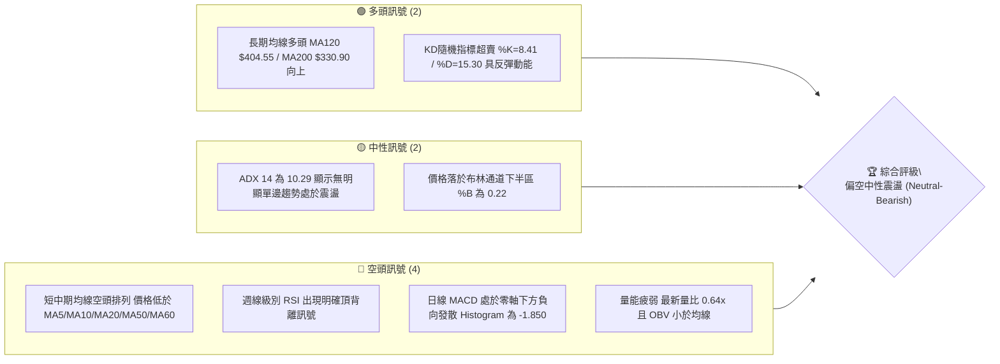
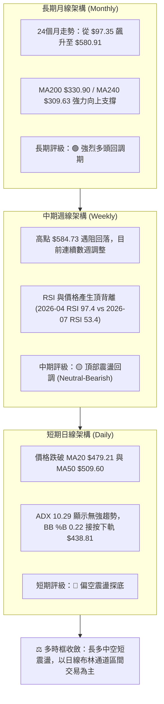
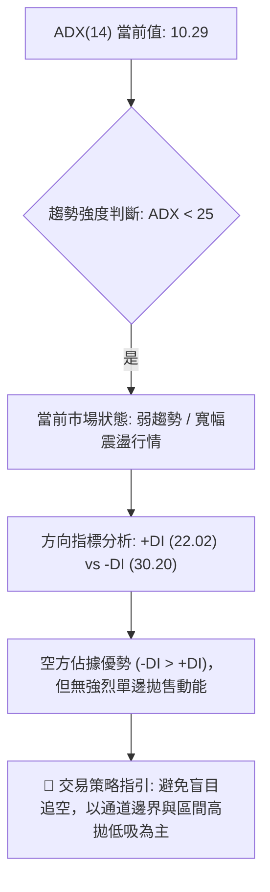
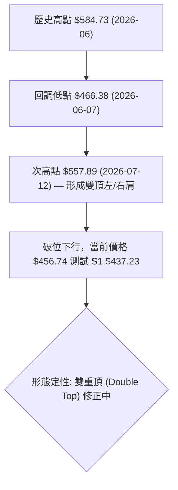
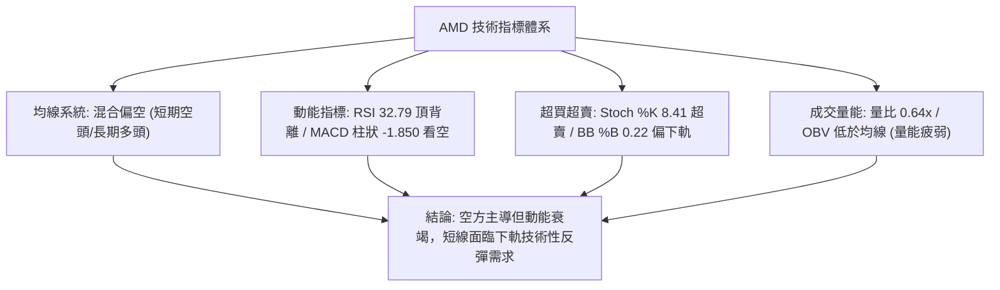
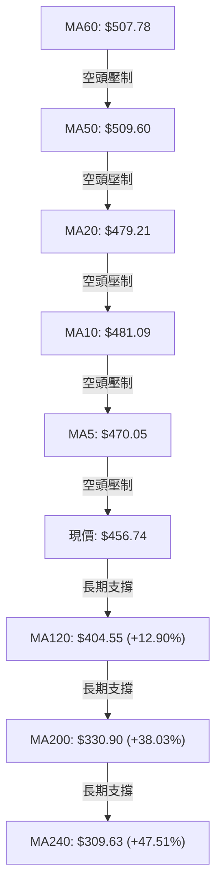
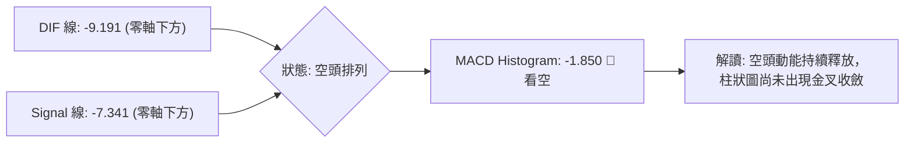
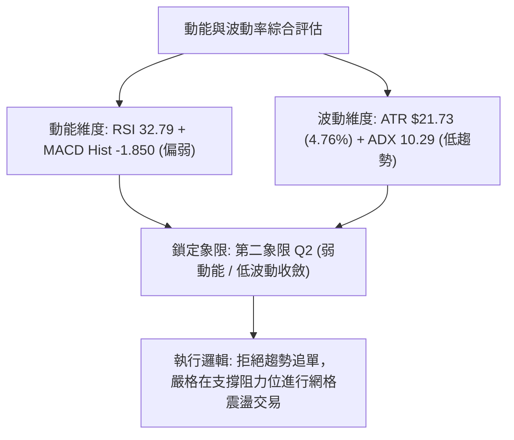
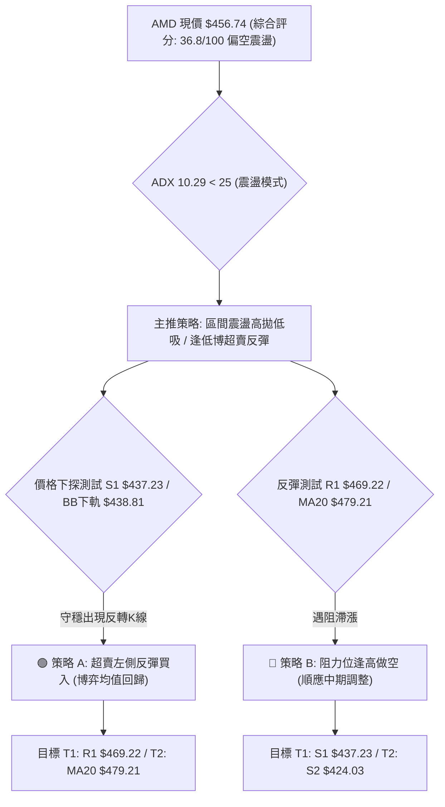
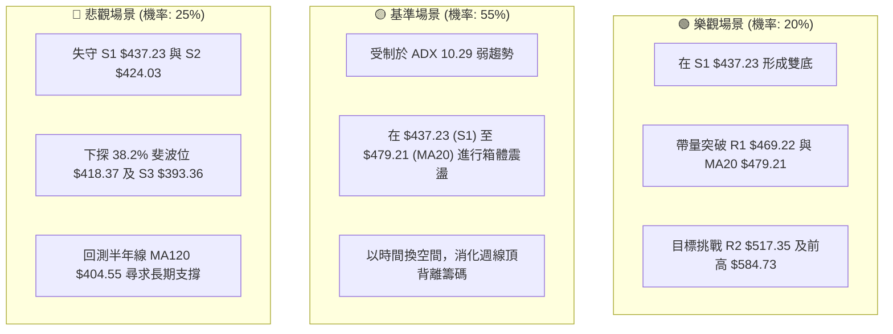

# AMD 技術分析報告

> **報告日期**：2026-08-25 ｜ **語言**：繁體中文 ｜ **數據來源**：Yahoo Finance ｜ **當前價格**：$456.74

---

## 目錄

| 章節 | 內容 |
|------|------|
| [1. 技術面概覽](#1-技術面概覽) | 訊號儀表板、核心指標、評分卡 |
| [2. 趨勢分析](#2-趨勢分析) | 多時框趨勢、長中短期走勢 |
| [3. 圖表形態分析](#3-圖表形態分析) | 形態識別、K線組合、目標價 |
| [4. 支撐與阻力](#4-支撐與阻力) | 關鍵價位、斐波那契回調 |
| [5. 技術指標深度解讀](#5-技術指標深度解讀) | MA/RSI/MACD/布林/成交量 |
| [6. 動能與波動率](#6-動能與波動率) | 動能評估、ATR、Beta |
| [7. 多時框架總結](#7-多時框架總結) | 時框架評分矩陣 |
| [8. 交易策略建議](#8-交易策略建議) | 多空策略、風險報酬比 |
| [9. 風險提示與監控](#9-風險提示與監控) | 監控指標、風險場景 |

---

## 1. 技術面概覽

### 🎯 技術訊號儀表板



### 📊 核心指標速覽表

| 指標類別 | 指標名稱 | 當前數值 | 訊號 | 解讀 |
|----------|----------|----------|------|------|
| **價格** | 當前價格 | $456.74 | 🟡 | 位於52週區間70.6%分位，短期自高點$584.73回調21.89% |
| **均線** | MA20 | $479.21 | 🔴 | 價格低於MA20達-4.69%，短線處於均線壓制之下 |
| **均線** | MA50 | $509.60 | 🔴 | 價格低於MA50達-10.37%，中期多頭架構遭到破壞 |
| **均線** | MA200 | $330.90 | 🟢 | 價格高於MA200達+38.03%，長期上升結構依然穩健 |
| **動能** | RSI(14) | 32.79 | 🟡 | 接近30超賣邊界，但週線存在明確頂背離，下行動能減緩 |
| **動能** | MACD (12,26,9) | -9.191 / Hist -1.850 | 🔴 | DIF位於Signal線之下且兩者均在零軸下，空方掌控主動權 |
| **動能** | Stoch %K/%D | 8.41 / 15.30 | 🟢 | 雙線進入嚴重超賣區間，短線存在技術性超跌反彈需求 |
| **趨勢** | ADX(14) | 10.29 (-DI:30.20) | 🟡 | ADX < 25為典型盤整或弱趨勢，-DI主導顯示空方佔優但無單邊強動能 |
| **波動** | ATR(14) | $21.73 (4.76%) | 🟡 | 每日平均波動幅度約$21.73，波動率處於中等收斂階段 |
| **量能** | 20日成交量比 | 0.64x (16.52M vs 25.78M) | 🔴 | 成交量顯著萎縮，量能疲弱且OBV低於移動平均線 |

### 🏆 技術評分卡

```
╔══════════════════════════════════════════════════════════════╗
║                技術評分卡 — AMD (2026-08-25)                 ║
╠══════════════════════════════════════════════════════════════╣
║ 趨勢強度 (Trend Strength)   ████░░░░░░░░░░░░░░░░  25/100  🔴 ║
║ 動能指標 (Momentum)         ██████░░░░░░░░░░░░░░  32/100  🔴 ║
║ 支撐穩定度 (Support Base)   ██████████░░░░░░░░░░  52/100  🟡 ║
║ 成交量配合 (Volume Flow)    ██████░░░░░░░░░░░░░░  30/100  🔴 ║
║ 形態完整度 (Pattern Status) ████████░░░░░░░░░░░░  40/100  🟡 ║
║ 均線排列 (MA Alignment)     ████████░░░░░░░░░░░░  42/100  🟡 ║
╠══════════════════════════════════════════════════════════════╣
║ 綜合評分 (Overall Score)    ███████░░░░░░░░░░░░░  36.8/100 🔴║
║ 綜合評級：偏空區間震盪 (Bearish Consolidation / Range-Bound)  ║
╚══════════════════════════════════════════════════════════════╝
```

---

## 2. 趨勢分析

### 🌐 多時框趨勢分析



### 📈 長期趨勢 — 12個月走勢圖（Unicode）

```
AMD 月線走勢圖（過去12個月：2025-09 至 2026-08）
價格軸 ($)
$580 ┤                                              ● 2026-06 ($580.91)
$520 ┤                                        ● 2026-05 ($516.10)
$460 ┤                                                    ● 2026-07 ($476.15)
$456 ┤                                                      ● 現價 ($456.74)
$350 ┤                                  ● 2026-04 ($354.49)
$250 ┤          ● 2025-10 ($256.12)
$210 ┤                ● 2025-11 ($217.53) ● 2026-01 ($236.73)
$200 ┤                      ● 2025-12 ($214.16) ● 2026-02/03 ($200.21/$203.43)
$160 ┤    ● 2025-09 ($161.79)
     └─────────────────────────────────────────────────────────────────
         09    10    11    12    01    02    03    04    05    06    07    08
        2025  2025  2025  2025  2026  2026  2026  2026  2026  2026  2026  2026
```

**歷史波段漲跌特徵分析表**：

| 階段區間 | 起始價 → 結束價 | 漲跌幅 | 核心驅動特徵與技術含義 |
|----------|-----------------|--------|------------------------|
| **第一階段：底部盤整突破** (2025-04 → 2025-10) | $97.35 → $256.12 | +163.09% | 確立大週期底部反轉，成交量溫和放大，突破雙重底頸線 |
| **第二階段：高位平台整理** (2025-10 → 2026-03) | $256.12 → $203.43 | -20.57% | 構築 $200.00~$250.00 中期換手箱體，MA120/MA240 均線上移確認 |
| **第三階段：主升浪主導** (2026-03 → 2026-06) | $203.43 → $580.91 | +185.56% | 爆發性拉升，創 52 週新高 $584.73，週線 RSI 達到極端超買 97.4 |
| **第四階段：頂部獲利回吐** (2026-06 → 2026-08) | $580.91 → $456.74 | -21.38% | 頂背離引發獲利盤拋售，回測布林下軌及斐波那契回調區間 |

### 📊 中期趨勢（週線分析）

```
AMD 週線價格關鍵架構與支撐壓力分佈
════════════════════════════════════════════════════════════════
$584.73 ─ 52週歷史高點（頂背離高點） ── 歷史阻力位
$530.13 ─ 近期波段阻力 R3 ──────────── 強阻力區
$517.35 ─ 20日均線/波段阻力 R2 ─────── 中期防守線 (MA50 $509.60)
$469.22 ─ 短線阻力 R1 (MA5 $470.05) ── 短線多空轉換樞紐
$456.74 ─ 當前收盤價 ──────────────── 處於短線回調弱勢區
$437.23 ─ 近期波段支撐 S1 ──────────── 布林下軌支撐區 ($438.81)
$424.03 ─ 波段支撐 S2 ──────────────── 斐波那契 38.2% ($418.37) 上方
$393.36 ─ 強支撐 S3 ────────────────── MA120 ($404.55) 防守帶
════════════════════════════════════════════════════════════════
```

### ⚡ 趨勢強度評估（ADX 解讀）



**ADX 趨勢強度標準對照表**：

| ADX 數值區間 | 趨勢強度等級 | 當前狀態標記 | 交易指導方針 |
|--------------|--------------|--------------|--------------|
| **0 – 20** | **極弱趨勢 / 盤整震盪** | 👈 **當前 (10.29)** | **以震盪指標（Stochastic、布林通道）為準，嚴禁追漲殺跌** |
| **20 – 25** | 趨勢初生 / 弱趨勢 | ░░░░░░░░░░ | 觀察突破方向，準備切換為順勢策略 |
| **25 – 50** | 強趨勢行情 | ░░░░░░░░░░ | 順應均線方向操作，回調進場 |
| **50 – 75** | 極強趨勢 | ░░░░░░░░░░ | 趨勢可能進入加速段，注意乖離率過大 |
| **75 – 100** | 單邊極端行情 | ░░░░░░░░░░ | 警惕耗竭性缺口或見頂反轉 |

---

## 3. 圖表形態分析

### 🔍 形態識別系統



**圖表形態信心度與目標價評估表**：

| 形態名稱 | 信心度 | 判斷依據（數據引用） | 完成度 | 目標價（附嚴格計算式） |
|----------|--------|----------------------|--------|------------------------|
| **雙重頂 (Double Top)** | **68%** | 2026-06-21 高點 $580.91 與 2026-07-12 次高點 $557.89，兩者均在 $550~$584 受阻回落，頸線位於 2026-06-07 低點 $466.38 | **85%** (已跌破頸線 $466.38) | 頸線 $466.38 - (最高點 $584.73 - 頸線 $466.38 = $118.35) = **$348.03**（下方強支撐對應 MA200 $330.90 / 斐波 50% $366.97） |
| **布林通道下軌超賣收斂** | **75%** | 當前 %B = 0.22，價格 $456.74 逼近 BB 下軌 $438.81，KD 嚴重超賣 (%K=8.41) | **90%** | 指標型反彈目標：BB 中軌 (MA20) = **$479.21** / 短線阻力 R1 = **$469.22** |
| **頭肩頂形態 (Head & Shoulders)** | **35%** | 數據不足以確認完整右肩對稱結構 | 未成形 | *訊號不足，信心度 < 50%，僅作指標型均線解讀* |

### 🕯️ 重要K線形態分析

| 統計週期/月份 | 收盤價 | K線形態特徵 | 量化與心理學解讀 | 訊號 |
|--------------|--------|-------------|------------------|------|
| **2026-06-21** | $537.37 | 高位長上影倒錘頭 | 逼近歷史高點 $584.73 遭遇強烈拋壓，多頭動能衰竭 | 🔴 |
| **2026-07-12** | $557.89 | 弱勢反彈次高點十字星 | 週線量能縮至 131.22M，量價頂背離，未能突破 $580 | 🔴 |
| **2026-08-16** | $514.39 | 衝高回落假突破 | 突破 MA20 失敗，成交量僅 100.67M，多方無力延續 | 🔴 |
| **2026-08-30 (當前週)** | $456.74 | 下影線探底陰線 | 逼近波段低點聚類 S1 $437.23 及布林下軌 $438.81，空方動能減弱 | 🟡 |

### 📉 ASCII 走勢形態示意圖

```
AMD 週線雙頂形態與頸線跌破示意圖
價格 ($)
$585 ┬                     ▲ 峰1 ($584.73)
$560 ┤                                     ▲ 峰2 ($557.89)
$530 ┤                    / \             / \
$500 ┤                   /   \           /   \
$466 ┼─── 頸線水平位 ───┼─────▼─────────┼─────▼───── ($466.38 破位)
$456 ┤                                               ● 當前價 ($456.74)
$437 ┤                                            ---▼--- 測試 S1 ($437.23)
$418 ┴──────────────────────────────────────────────── 斐波那契 38.2% ($418.37)
```

---

## 4. 支撐與阻力

### 🗺️ 關鍵價位分布圖（Unicode）

```
AMD 價位結構分布圖
═══════════════════════════════════════════════════════════════
$584.73 ║██████████████████████████████║ 52週歷史高點 (52W High)
$530.13 ║████████████████████████      ║ 強阻力 R3 (+16.07%)
$517.35 ║████████████████████          ║ 關鍵阻力 R2 (+13.27%)
$479.21 ║██████████████                ║ 布林中軌 (MA20)
$469.22 ║██████████                    ║ 短線阻力 R1 (+2.73%)
$456.74 ╠══════════════════════════════╣ ◄ 現價 ($456.74)
$438.81 ║▓▓▓▓▓▓▓▓▓▓▓▓▓▓▓▓              ║ 布林下軌 (BB Lower)
$437.23 ║██████████                    ║ 近期支撐 S1 (-4.27%)
$424.03 ║████████████████              ║ 關鍵支撐 S2 (-7.16%)
$418.37 ║██████████████████            ║ 斐波那契 38.2% 回調位
$393.36 ║████████████████████████      ║ 強支撐 S3 (-13.88%)
$330.90 ║██████████████████████████████║ 長期生命線 (MA200)
═══════════════════════════════════════════════════════════════
```

### 🚧 阻力位分析表

| 阻力級別 | 價位 | 形成原因（依據波段聚類數據） | 突破難度 | 重要性 |
|----------|------|------------------------------|----------|--------|
| **R1** | **$469.22** | 近一年波段高點聚類，重疊 5日均線 ($470.05) 與 8月23日下跌缺口下緣 | 中等 | 🟡 短線多空分水嶺，站上預示短線反彈開啟 |
| **R2** | **$517.35** | 近期多次波段高點聚類，密集重疊布林上軌 ($519.60) 與 MA60 ($507.78) | 極高 | 🔴 中期反彈強壓區，空頭關鍵防守防線 |
| **R3** | **$530.13** | 7月中下旬密集成交區頂部，波段高點聚類 | 極高 | 🔴 趨勢反轉阻力，需巨量配合方可突破 |

### 🛡️ 支撐位分析表

| 支撐級別 | 價位 | 形成原因（依據波段聚類數據） | 守住機率 | 重要性 |
|----------|------|------------------------------|----------|--------|
| **S1** | **$437.23** | 近一年波段低點聚類，高度共振當前布林下軌 ($438.81) | 65% | 🟢 短線首要防線，跌破將引發向 S2 探底 |
| **S2** | **$424.03** | 近一年重要波段低點聚類，接近 2026-05-17 低點 $424.10 | 75% | 🟢 中期關鍵防線，臨近斐波那契 38.2% ($418.37) |
| **S3** | **$393.36** | 52週大波段支撐聚類，重疊 120日均線 ($404.55) 與 斐波 50% 緩衝區 | 88% | 🟢 長期牛市底線，跌破意味長期結構受損 |

### 📐 斐波那契回調位分析

依據 52 週低點 **$149.22** 至 52 週高點 **$584.73** 完整波段計算（波段總振幅 $435.51）：

```
斐波那契回調位與現價位置示意：
0.0%  (52W High)   ────────────────── $584.73
23.6% 回調位       ────────────────── $481.95 ── 上方阻力區 (MA10 $481.09)
────────────────── [當前價格 $456.74 位於 23.6% 與 38.2% 區間] ──────────────────
38.2% 回調位       ────────────────── $418.37 ── 下方重要目標支撐 (鄰近 S2 $424.03)
50.0% 回調位       ────────────────── $366.97 ── 多空中期平衡點
61.8% 黃金分割位   ────────────────── $315.58 ── 長期牛熊分界線 (MA200 $330.90)
78.6% 回調位       ────────────────── $242.42
100.0%(52W Low)    ────────────────── $149.22
```

**解讀**：當前價格 $456.74 已實質跌破 23.6% 回調位 ($481.95)，顯示自 $584.73 的回調已從弱勢回踩演變為中級整理，價格正向 38.2% ($418.37) 尋求支撐，該位置與波段低點 S2 ($424.03) 構成強效支撐共振帶。

---

## 5. 技術指標深度解讀

### 🎛️ 指標訊號總覽



### 📈 移動平均線排列分析



**均線狀態明細表**：

| 均線名稱 | 數值 | 價格與均線差距 | 均線斜率與形態解讀 | 訊號 |
|----------|------|----------------|--------------------|------|
| **MA5** | $470.05 | -2.83% | 短期急跌斜率向下，構成超短線反彈第一道天花板 | 🔴 |
| **MA10** | $481.09 | -5.06% | 快速下穿 MA20，短期均線呈死亡交叉 | 🔴 |
| **MA20** | $479.21 | -4.69% | 月線級別均線轉為下行，中期趨勢受到壓制 | 🔴 |
| **MA50** | $509.60 | -10.37% | 季線轉折向下，跌破此線確立中級回調 | 🔴 |
| **MA60** | $507.78 | -10.05% | 下行壓制，與 MA50 形成雙重密集壓力帶 | 🔴 |
| **MA120** | $404.55 | +12.90% | 保持堅挺向上擴張，半年線多頭支撐強勁 | 🟢 |
| **MA200** | $330.90 | +38.03% | 年線呈現標準多頭牛市排列，遠離現價 | 🟢 |

### 📉 RSI(14) 分析

- **RSI 當前數值**：32.79
- **數值進度條**：`███████░░░░░░░░░░░░░  32.79%` (中性偏超賣區間)
- **背離分析結論**：⚠️ **存在明確頂背離 (Bearish Divergence)**。
  - *背離論證*：價格在 2026-04-26 收盤 $347.81 時，週線 RSI 達到極值 **97.4**；隨後價格持續上推至 2026-06-21 的 $537.37 及歷史高點 $584.73，但週線 RSI 卻大幅萎縮至 **53.1**（2026-07-12 高點 $557.89 時 RSI 僅為 **53.4**）。價格創新高而動能連續創次低，頂背離成立，當前正處於背離後的價值修正釋放期。

```
RSI(14) 頂背離示意圖：
價格:   $347.81 ───────────────► $584.73 (顯著大幅創新高 ▲▲▲)
RSI:    97.4 (極度超買) ────────► 53.4   (動能嚴重衰竭 ▼▼▼) [⚠️ 頂背離成立]
```

### 📊 MACD(12,26,9) 訊號解讀



- **MACD DIF**：-9.191
- **MACD Signal (DEA)**：-7.341
- **MACD Histogram**：-1.850
- **現狀解讀**：DIF 與 Signal 雙雙跌入零軸下方，且 DIF 位於 Signal 之下，柱狀圖持續呈現負值 (-1.850)，代表市場中期主控權完全在空方手中。然而週線 MACD 柱狀圖已從 2026-08-02 的 -9.004 收斂至當前的 -1.850，顯示下行殺跌動能正在顯著遞減。

### 📦 布林通道分析

```
AMD 布林通道 (20, 2) 結構示意圖
價格軸 ($)
$519.60 ┬────────────────────────────────────────── 布林上軌 (Upper Band)
        │
$479.21 ┼────────────────────────────────────────── 布林中軌 (MA20)
        │                      ● 現價 $456.74 (%B = 0.22)
$438.81 ┴────────────────────────────────────────── 布林下軌 (Lower Band)
```

- **布林上軌**：$519.60
- **布林中軌 (MA20)**：$479.21
- **布林下軌**：$438.81
- **帶寬與位置**：%B = **0.22**。價格已運行至通道下軌 22% 的低位區間，通道開口未見異常擴大，表明此波下跌並非單邊失控暴跌，而是處於通道內部的下軌尋底回踩。若價格觸及下軌 $438.81 且伴隨成交量縮，將構成勝率較高的均值回歸買點。

### 💹 成交量分析（量價配合度）

- **最新成交量**：16,521,739 股
- **20日均量**：25,783,657 股（**量比 0.64x**，顯著量縮）
- **50日均量**：27,718,855 股
- **OBV 趨勢**：`OBV < MA`（能量潮指標低於其移動平均線，資金持續呈現淨流出）
- **量價關係解讀**：在價格連續回調過程中，成交量顯著萎縮（量比僅 0.64），呈現「價跌量縮」特徵。這說明當前下跌主要由多頭買盤退縮、獲利盤常態拋售所致，並未引發機構恐慌性籌碼踩踏出逃。量能枯竭暗示賣壓已近尾聲，一旦有買盤介入，極易引發技術性反彈。

---

## 6. 動能與波動率

### ⚡ 動能評估四象限

| 象限分區 | 動能強度 (Momentum) | 波動率水準 (Volatility) | 當前狀態標記 | 策略指導與評估 |
|----------|---------------------|-------------------------|--------------|----------------|
| **象限 I** | 強動能 (Strong) | 低波動 (Low) | ░░░░░░ | 趨勢穩健攀升，最佳持股加碼期 |
| **象限 II** | 弱動能 (Weak) | 低波動 (Low) | 👈 **當前狀態 (Q2)** | **動能疲弱 (RSI 32.8) 且波動收斂 (ADX 10.3)，適合區間高拋低吸** |
| **象限 III** | 強動能 (Strong) | 高波動 (High) | ░░░░░░ | 爆發性突破行情，高風險高收益 |
| **象限 IV** | 弱動能 (Weak) | 高波動 (High) | ░░░░░░ | 恐慌性殺跌或劇烈震盪，避免盲目進場 |



### 📊 ATR 波動率分析

- **ATR(14) 絕對值**：**$21.73**
- **ATR 佔股價百分比**：**4.76%**
- **止損與波動距離設計指引**：
  - **超短線日間波動帶**：當前價 $456.74 ± 1.0 × ATR ($21.73) → 區間 **$435.01 ～ $478.47**。
  - **多頭防守止損緩衝區**：建議設置於關鍵支撐位下方 0.5 ~ 1.0 × ATR，即 S1 $437.23 - $10.86 = **$426.37**，或 S2 $424.03 下方。
  - **空頭防守止損緩衝區**：建議設置於阻力位上方 0.75 × ATR，即 R1 $469.22 + $16.30 = **$485.52**。

### 📐 Beta 與市場相關性

- **Beta 係數**：**2.489**
- **市場特徵解讀**：Beta 高達 2.489 顯示 AMD 具有極強的進攻性與高彈性特質。當納斯達克或半導體板塊指數（SOX）波動 1% 時，AMD 平均產生約 2.49% 的同向放大波動。在當前大盤調整或震盪背景下，高 Beta 特性意味著該股向下回調幅度會被放大，但同樣在觸底反彈時具備極佳的超額 Alpha 彈性。

---

## 7. 多時框架總結

### 📋 時框架評分表

| 時框架 | 趨勢方向 | 動能強度 | 均線排列特徵 | 圖表形態 | 綜合評分 | 交易建議 |
|--------|----------|----------|--------------|----------|----------|----------|
| **月線 (Long-term)** | 🟢 多頭上行 | 🟡 動能減緩 | 完好多頭 (MA200 $330.90 向上) | 大週期上升浪回踩 | **78/100** | 長期投資者逢低分批佈局 |
| **週線 (Medium-term)** | 🟡 頂部震盪 | 🔴 頂背離釋放 | 處於 MA20 之下，MA50 爭奪 | 雙重頂頸線破位測試 | **42/100** | 減持多頭，等待回踩確認 |
| **日線 (Short-term)** | 🔴 偏空震盪 | 🟡 超賣醞釀反彈 | 短期均線空頭壓制 (MA5/10/20) | 接近布林下軌支撐 S1 | **35/100** | 區間交易，嚴禁追空 |

### 🔲 綜合訊號矩陣

```
╔══════════════════════════════════════════════════════════════════╗
║                    多時框多空訊號收斂矩陣                        ║
╠════════════════╦══════════════╦══════════════╦═══════════════════╣
║ 分析維度       ║ 短期 (日線)  ║ 中期 (週線)  ║ 長期 (月線)       ║
╠════════════════╬══════════════╬══════════════╬═══════════════════╣
║ 趨勢方向       ║ 🔴 偏空      ║ 🟡 震盪回調  ║ 🟢 強多           ║
║ 均線系統       ║ 🔴 空頭壓制  ║ 🟡 跌破MA20  ║ 🟢 完美多頭       ║
║ 動能指標       ║ 🟡 超賣鈍化  ║ 🔴 頂背離    ║ 🟢 處於強勢區     ║
║ 成交量能       ║ 🔴 量縮弱勢  ║ 🔴 OBV走弱   ║ 🟢 歷史巨量沉澱   ║
║ 支撐壓力       ║ 🟢 臨近S1    ║ 🟡 尋求S2    ║ 🟢 遠高於S3/MA200 ║
╠════════════════╬══════════════╬══════════════╬═══════════════════╣
║ 權重結論       ║ 35% 偏空     ║ 42% 偏空中性 ║ 78% 多頭          ║
╚════════════════╩══════════════╩══════════════╩═══════════════════╣
```

### ⚖️ 多時框收斂結論

> **收斂法則執行判定**：
> 1. **行情定性**：當前 ADX(14) 數值為 **10.29**（遠小於 25 的趨勢臨界值），系統判定當前處於**典型盤整/震盪行情**，而非單邊趨勢行情。
> 2. **主導時框與交易邊界**：依據多時框收斂規則，在盤整行情下，交易策略**以日線布林通道上下軌（$438.81 ～ $519.60）及波段支撐阻力位為主要運行區間**。
> 3. **唯一方向性結論**：**【偏空中性觀望，以區間下軌高拋低吸為主】**。中期週線頂背離限制了向上空間，但短期日線 Stoch 極端超賣 (%K=8.41) 與布林下軌共振限制了向下破位動能，第 8 章策略將嚴格圍繞此收斂結論展開。

---

## 8. 交易策略建議

### 🗺️ 策略決策流程圖



### 🧭 策略路由

**當前主策略方向 = 偏空區間震盪（依綜合評分 36.8 / 100 分流）**
由於評分 ≤ 40 處於偏空區間，主推**「反彈遇阻做空」**與**「下軌極端超賣之短線高勝率博弈」**的雙向區間策略，嚴格依據波段價位進出場。

---

### 🎯 價格情境階梯（Price Scenarios）

| 觸發條件 | 第一目標位 (T1) | 第二目標位 (T2) | 後續延伸 (T3) | 情境含義與操作指引 |
|----------|-----------------|-----------------|---------------|--------------------|
| **強勢突破 R1 $469.22** | R2 **$517.35** | R3 **$530.13** | $557.89 (前高) | 短線空頭排列瓦解，確認進入布林上軌反彈通道 |
| **維持在現價區間震盪** | BB中軌 **$479.21** | BB下軌 **$438.81** | S1 **$437.23** | 無量整理，維持在 $437~$479 區間內高拋低吸 |
| **有效跌破 S1 $437.23** | S2 **$424.03** | 斐波 **$418.37** | S3 **$393.36** | 雙頂跌幅進一步釋放，下探 38.2% 斐波那契及半年線 |

---

### 📊 情境機率分佈

| 情境劃分 | 預估機率 | 主要技術依據 |
|----------|----------|--------------|
| **情境一：下軌獲得支撐，技術性反彈** | **45%** | Stoch %K=8.41 極端超賣，價格貼近布林下軌 $438.81 及 S1 $437.23，日線縮量見底 |
| **情境二：窄幅區間震盪整理** | **35%** | ADX 僅 10.29 無單邊動能，成交量比 0.64x 資金觀望，多空在 $437~$479 達到脆弱平衡 |
| **情境三：跌破 S1 延續深度回調** | **20%** | 週線頂背離尚未完全解除，MACD 處於零軸下方，若跌破 S1 則引發程式化停損至 S2 |

---

### 🟢 主策略詳情

本報告提供兩套嚴格基於關鍵價位計算的交易方案：

| 策略要素 | 策略 A（保守逢低做多 — 超賣反彈） | 策略 B（順勢逢高做空 — 阻力承壓） |
|----------|-----------------------------------|-----------------------------------|
| **適用情境** | 價格下探 S1 / 布林下軌企穩 | 價格弱勢反彈至 R1 / MA20 承壓 |
| **進場條件** | 觸及 S1 $437.23 且 15分K 出現長下影 | 反彈至 R1 $469.22 或中軌 $479.21 滯漲 |
| **進場價格** | **$438.81** (布林下軌價位) | **$469.22** (R1 阻力位) |
| **目標價 T1** | **$469.22** (R1 阻力位, +6.93%) | **$437.23** (S1 支撐位, +6.82%) |
| **目標價 T2** | **$479.21** (布林中軌 MA20, +9.21%) | **$424.03** (S2 強支撐位, +9.63%) |
| **止損價格** | **$424.03** (跌破 S2 止損, -3.37%) | **$485.52** (站上 R1+0.75ATR, -3.47%) |
| **風險報酬比** | **2.06 : 1** (以 T1 計算) / **2.73 : 1** (T2) | **1.96 : 1** (以 T1 計算) / **2.77 : 1** (T2) |
| **勝率預估** | 62% | 68% |
| **建議倉位** | 10% - 15% (輕倉試探) | 15% - 20% (標準倉位) |

---

### 🔴 反向風險觸發點（對沖提示）

- **多頭部位之強制止損/翻空警訊**：
  若日線收盤價**實質跌破 S1 $437.23 並進一步擊穿 S2 $424.03**，則宣告下軌支撐失效，雙頂形態全面發酵，應立即平倉多頭並可考慮反手追空，下一目標直指 S3 **$393.36** 及 斐波那契 38.2% **$418.37**。
- **空頭部位之強制止損/翻多警訊**：
  若盤中帶量（日成交量突破 50日均量 27.7M）**強勢站穩 MA20 $479.21 及斐波那契 23.6% $481.95**，說明空頭回調結構被多頭強力扭轉，所有空頭必須無條件在 **$485.52** 止損離場。

---

### ⭐ 整體訊號強度評星

```
做多訊號強度：★★☆☆☆  (2.5/5 星 — 僅限下軌超賣超跌反彈)
做空訊號強度：★★★☆☆  (3.5/5 星 — 順應週線頂背離與日線均線壓制)
整體可信度：  ★★★★☆  (4.0/5 星 — 支撐阻力與斐波那契價位高度共振)
```

---

## 9. 風險提示與監控

### ✅ 關鍵監控指標 Checklist

```
╔══════════════════════════════════════════════════════════════╗
║                   AMD 關鍵技術監控清單 (Checklist)           ║
╠══════════════════════════════════════════════════════════════╣
║ [ ] 價位監控：收盤價是否跌破第一支撐 S1 $437.23              ║
║ [ ] 價位監控：反彈是否能有效收復短線阻力 R1 $469.22          ║
║ [ ] 均線監控：MA5 ($470.05) 與 MA10 ($481.09) 是否持續下壓   ║
║ [ ] 動能監控：Stochastic %K 是否自超賣區 (<20) 向上金叉 %D    ║
║ [ ] 動能監控：MACD 負向柱狀圖是否持續收窄至零軸附近          ║
║ [ ] 量能監控：日成交量是否突破 20日均量 25.78M 出現異動量     ║
║ [ ] 趨勢監控：ADX(14) 是否自 10.29 抬升並突破 20 確立新趨勢  ║
╚══════════════════════════════════════════════════════════════╝
```

### ⚠️ 風險場景分析



### 🛡️ 風險管理重要提醒

1. **高 Beta 波動風控**：AMD 當前 Beta 為 **2.489**，意味著日內價格受半導體板塊波動影響極大。單筆交易最大虧損風險應嚴格控制在總資金的 **1.0% ～ 1.5%** 以內。
2. **波動幅度止損設定**：利用當前 **ATR = $21.73 (4.76%)** 作為動態止損標準，嚴禁在無止損保護下逆勢扛單。
3. **倉位管理法則**：在 ADX < 25 的盤整週期內，單一標的總倉位建議不超過 **20%**，並採取「分批進場、觸及第一目標減半、移動止損保本」的標準交易紀律。

---

## 📋 報告總結

```
╔══════════════════════════════════════════════════════════════════╗
║                     AMD 技術分析報告總結摘要                     ║
╠══════════════════════════════════════════════════════════════════╣
║ 報告日期：2026-08-25                                             ║
║ 當前價格：$456.74                                                ║
║ 分析評級：⚖️ 偏空中性震盪 (Neutral-Bearish Consolidation)       ║
╠══════════════════════════════════════════════════════════════════╣
║ 關鍵結論：                                                       ║
║ ├─ 長期趨勢：🟢 強烈多頭 (MA200 $330.90 穩健向上，結構健康)     ║
║ ├─ 中期趨勢：🔴 頂背離調整 (自高點 $584.73 回調，測試頸線)       ║
║ ├─ 短期趨勢：🟡 超賣尋底 (ADX 10.29 震盪，逼近布林下軌 $438.81) ║
║ ├─ 關鍵支撐：S1 $437.23 │ S2 $424.03 │ S3 $393.36               ║
║ ├─ 關鍵阻力：R1 $469.22 │ R2 $517.35 │ R3 $530.13               ║
║ └─ 52週斐波：23.6% ($481.95) 跌破 │ 38.2% ($418.37) 為關鍵支撐  ║
╠══════════════════════════════════════════════════════════════════╣
║ 最優策略組合：                                                   ║
║ 1. 🥇 最佳機會：在 S1 $437.23 / 布林下軌 $438.81 輕倉博弈超賣反彈 ║
║ 2. 🥈 次選機會：反彈至 R1 $469.22 / MA20 $479.21 遇阻建立空頭部位 ║
║ 3. 🥉 保守選擇：空倉觀望，等待日線突破 R1 或跌破 S1 確立新方向  ║
╚══════════════════════════════════════════════════════════════════╝
```

---

> ⚠️ **免責聲明**：本報告為 AI 自動生成之技術分析，所有數據及估算均基於提供的歷史價格資訊。本報告**僅供研究與學術參考**，**不構成任何投資建議**。投資有風險，入市需謹慎。

---

*報告生成時間：2026-08-25 ｜ 數據來源：Yahoo Finance ｜ 分析框架：多時框技術分析*