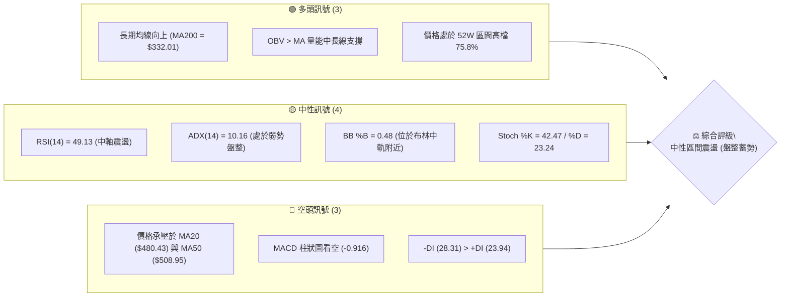
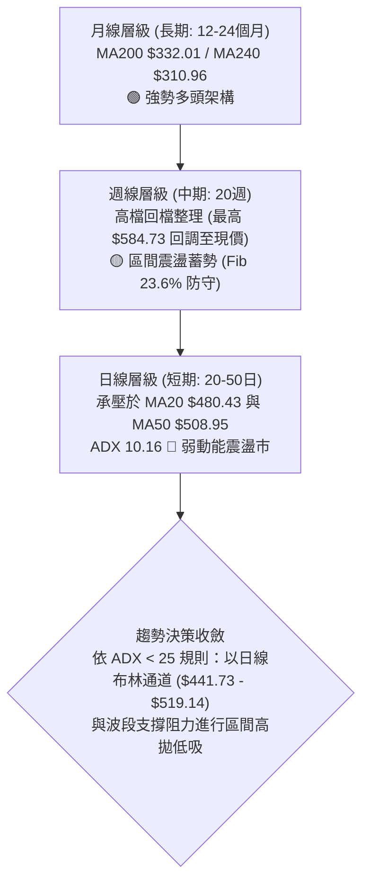
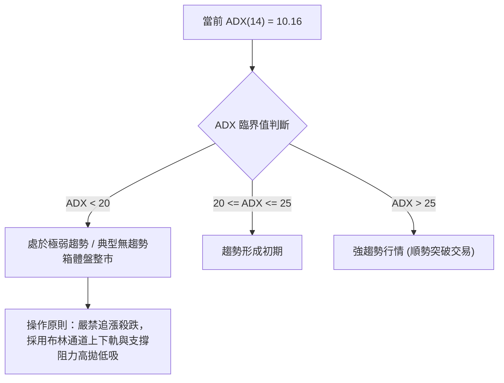
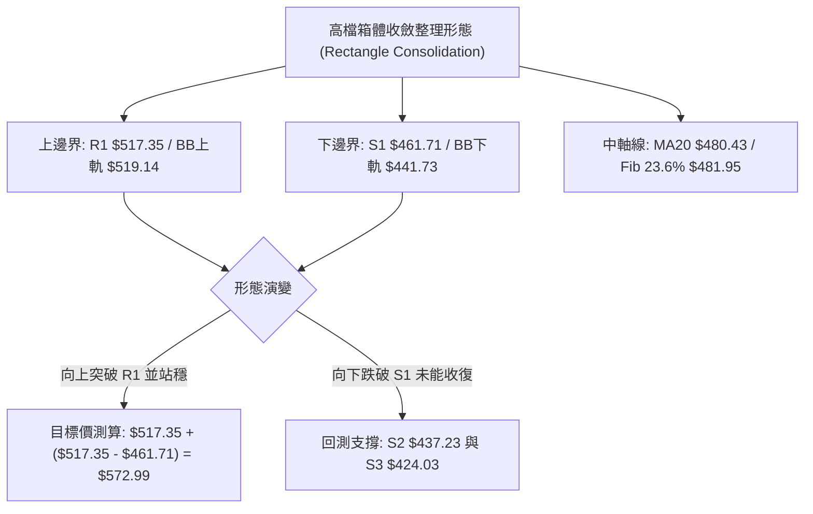
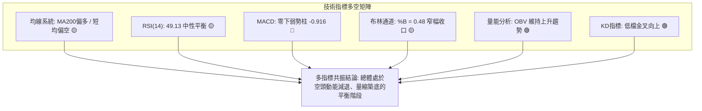
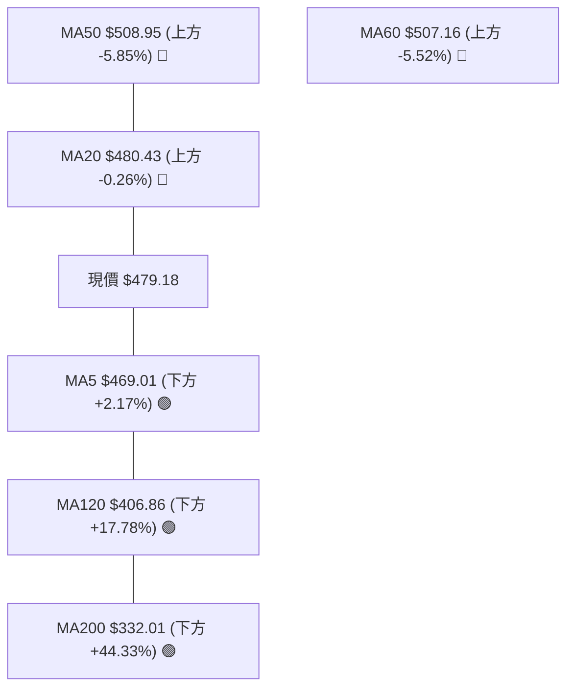
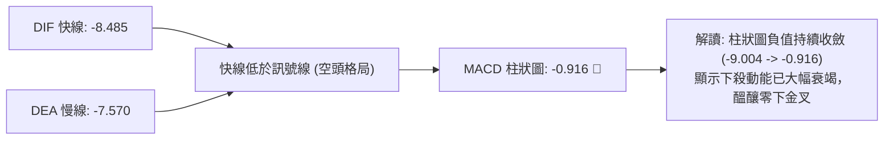
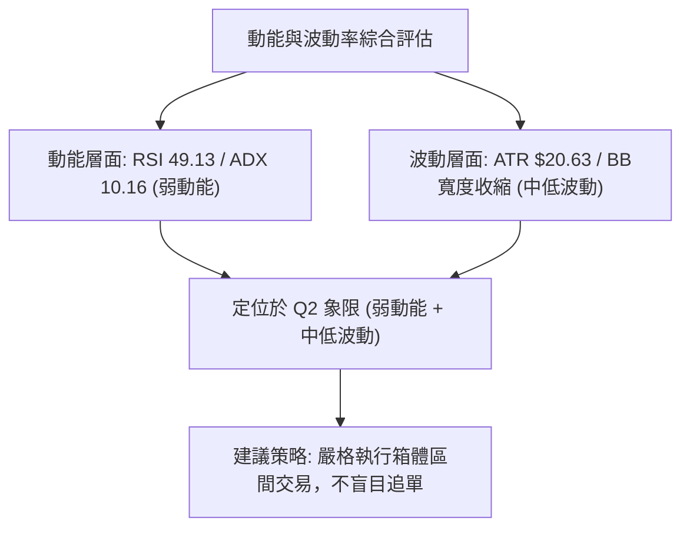
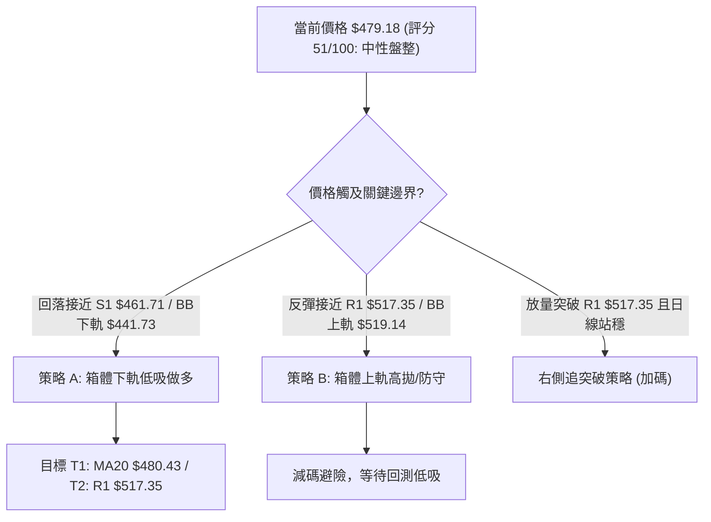
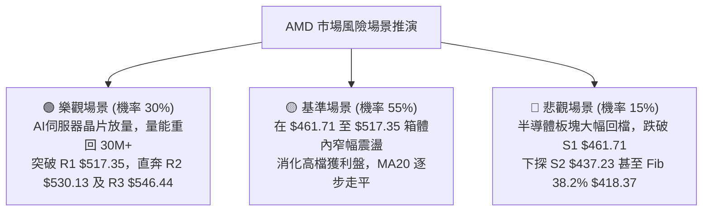

# AMD 技術分析報告

> **報告日期**：2026-08-26 ｜ **語言**：繁體中文 ｜ **數據來源**：Yahoo Finance ｜ **當前價格**：$479.18

---

## 目錄

| 章節 | 內容 |
|------|------|
| [1. 技術面概覽](#1-技術面概覽) | 訊號儀表板、核心指標、評分卡 |
| [2. 趨勢分析](#2-趨勢分析) | 多時框趨勢、長中短期走勢 |
| [3. 圖表形態分析](#3-圖表形態分析) | 形態識別、K線組合、目標價 |
| [4. 支撐與阻力](#4-支撐與阻力) | 關鍵價位、斐波那契回調 |
| [5. 技術指標深度解讀](#5-技術指標深度解讀) | MA/RSI/MACD/布林/成交量 |
| [6. 動能與波動率](#6-動能與波動率) | 動能評估、ATR、Beta |
| [7. 多時框架總結](#7-多時框架總結) | 時框架評分矩陣 |
| [8. 交易策略建議](#8-交易策略建議) | 多空策略、風險報酬比 |
| [9. 風險提示與監控](#9-風險提示與監控) | 監控指標、風險場景 |
| [📋 報告總結](#-報告總結) | 核心結論與策略推薦 |

---

## 1. 技術面概覽

### 🎯 技術訊號儀表板



### 📊 核心指標速覽表

| 指標類別 | 指標名稱 | 當前數值 | 訊號 | 解讀 |
|:---|:---|:---|:---:|:---|
| **價格** | 當前價格 | $479.18 | 🟡 | 位於 52W 高低點區間 75.8% 位置，近期自高點回檔整理 |
| **均線** | MA20 | $480.43 | 🔴 | 現價略低於短期生命線 $1.25 (-0.26%)，短線承壓 |
| **均線** | MA50 | $508.95 | 🔴 | 現價低於中期均線 $29.77 (-5.85%)，中期回檔中 |
| **均線** | MA200 | $332.01 | 🟢 | 現價高於長期均線 $147.17 (+44.33%)，長多架構穩固 |
| **動能** | RSI(14) | 49.13 | 🟡 | 位於 30-70 中性區間，多空動能處於均勢狀態 |
| **動能** | MACD (12,26,9) | -8.485 / -7.570 | 🔴 | MACD 位於零軸下方且 Hist 為 -0.916，短線偏空調整 |
| **動能** | 隨機指標 Stoch | %K 42.47 / %D 23.24 | 🟢 | %K 自低檔金叉 %D 向上，出現短線超賣回升跡象 |
| **趨勢** | ADX(14) | 10.16 | 🟡 | 數值 < 25 表明趨勢力道極弱，當前為典型箱體盤整 |
| **通道** | 布林通道 %B | 0.48 | 🟡 | 位於布林帶中軌 ($480.43) 附近，通道區間 $441.73–$519.14 |
| **成交量** | 量比 (Volume Ratio) | 0.76x | 🟡 | 最新量 18.91M 低於 20MA 量 24.92M，量縮整理等待方向 |
| **波動** | ATR(14) | $20.63 (4.31%) | 🟡 | 日內平均震幅約 $20.63，波動適中 |

### 🏆 技術評分卡

```
╔══════════════════════════════════════════════════════════════════╗
║               技術評分卡 — AMD (2026-08-26)                      ║
╠══════════════════════════════════════════════════════════════════╣
║ 趨勢強度 (ADX=10.16)     ████░░░░░░░░░░░░░░░░  25/100  🔴 弱勢盤整 ║
║ 動能指標 (RSI/MACD/KD)   █████████░░░░░░░░░░░  45/100  🟡 中性偏弱 ║
║ 支撐穩定度 (Fib/S1-S3)   ██████████████░░░░░░  70/100  🟢 支撐強固 ║
║ 成交量配合 (量縮/OBV)    ████████████░░░░░░░░  60/100  🟡 量能中性 ║
║ 形態完整度 (箱體整理)    ███████████░░░░░░░░░  55/100  🟡 形態收斂 ║
║ 均線排列 (混合排列)      ██████████░░░░░░░░░░  50/100  🟡 長多短空 ║
╠══════════════════════════════════════════════════════════════════╣
║ 綜合評分                 ██████████░░░░░░░░░░  51/100  ⚖️ 區間盤整 ║
╚══════════════════════════════════════════════════════════════════╝
```

---

## 2. 趨勢分析

### 🌐 多時框趨勢分析



### 📈 長期趨勢 — 12個月走勢圖（Unicode）

```
AMD 月線走勢圖（過去12個月: 2025-09 至 2026-08）
價格軸 ($)
$600 ┤                                      ● $580.91 (2026-06 高點)
$550 ┤                                ╭───╯   ╲
$500 ┤                          ● $516.10       ╲___ ● $479.18 (現價)
$450 ┤                          │                    ● $476.15
$400 ┤                    ● $354.49
$350 ┤                    │
$300 ┤              ● $256.12
$250 ┤              │     ╲___ ● $236.73
$200 ┤        ●─────╯          ╲___ ● $200.21
$150 ┤● $161.79
     └────────────────────────────────────────────────────────────
      25-09 25-10 25-11 25-12 26-01 26-02 26-03 26-04 26-05 26-06 26-07 26-08
```

#### 走勢特徵分析表格

| 階段 | 區間月份 | 起訖價格 | 期間漲跌幅 | 走勢特徵與技術解讀 |
|:---|:---:|:---:|:---:|:---|
| **第一階段：初段爆發** | 2025-09 ~ 2025-10 | $161.79 → $256.12 | +58.30% | 放量長紅突破長期底部，開啟主升浪行情的序曲。 |
| **第二階段：次級整理** | 2025-10 ~ 2026-03 | $256.12 → $203.43 | -20.57% | 於 $200.00–$256.00 構築堅實的中期支撐平台，洗盤沉澱籌碼。 |
| **第三階段：主升主浪** | 2026-03 ~ 2026-06 | $203.43 → $580.91 | +185.56% | 爆發性單邊主升浪，月線四連陽，創歷史高點 $584.73。 |
| **第四階段：高檔盤整** | 2026-06 ~ 2026-08 | $580.91 → $479.18 | -17.51% | 見頂後健康回檔至 Fib 23.6% ($481.95) 附近進行橫向箱體震盪。 |

### 📊 中期趨勢（週線分析）

從近 20 週數據觀察，AMD 於 2026 年 5 月至 6 月在 $550–$584 區間見頂後，RSI 由極度超買的 97.4 快速降溫至當前的 49.1。近期週線收盤價在 $473.25 至 $514.39 之間反覆拉鋸，成交量由主升浪時期的週均 2.5 億股降至近期約 0.92 億 - 1.0 億股，量縮呈現標準的中期收斂整理特徵。

```
近期週線壓力與支撐示意圖：
  $584.73 ──────────────────────── 52W 最高點 (強阻力頂部)
  $517.35 ~ $530.13 ────────────── 中期週線反彈阻力密集區 (R1 ~ R2)
  $479.18 ──────────────────────── 現價 (圍繞 Fib 23.6% $481.95 爭奪)
  $461.71 ~ $437.23 ────────────── 中期週線回測防守帶 (S1 ~ S2)
```

### ⚡ 趨勢強度評估（ADX 解讀）



#### ADX 與方向指標（DMI）強度對照

| 指標名稱 | 數值 | 狀態 | 技術解讀 |
|:---|:---:|:---:|:---|
| **ADX(14)** | 10.16 | 弱震盪 (極低) | 趨勢強度極度匱乏，表明單邊行情已結束，轉入無方向盤整。 |
| **+DI (多頭動能)** | 23.94 | 偏弱 | 多頭上攻意願收斂，買盤力度不足以發動突破。 |
| **-DI (空頭動能)** | 28.31 | 略佔優 | 空方動能微幅領先，但未達 >30 的單邊下殺標準。 |
| **趨勢定性** | - | **震盪盤整市** | 依收斂原則，中短期以日線布林通道 ($441.73–$519.14) 為主要運作區間。 |

---

## 3. 圖表形態分析

### 🔍 形態識別系統



#### 形態識別與信心度評估表

| 形態名稱 | 信心度 | 判斷依據（引用數據） | 完成度 | 目標價（附計算式） |
|:---|:---:|:---|:---:|:---|
| **高檔水平箱體整理** | **78%** | 價格近 6 週收盤於 $473.25–$514.39 反覆震盪；上下界受阻於 R1 $517.35、受撐於 S1 $461.71。 | 70% | 向上突破：頸線 $517.35 + 箱高 ($517.35 - $461.71 = $55.64) = **$572.99**<br/>向下跌破：頸線 $461.71 - 箱高 $55.64 = **$406.07** (接近 MA120 $406.86) |
| **雙重底 (W底反彈結構)** | **42%** | 近期週線於 2026-08-02 低點 $476.15 與 2026-08-23 低點 $473.25 有兩次探底跡象，但中間高點 $514.39 尚未有效突破。 | 40% | *訊號不足（信心度 < 50%），未達確認標準，僅做短線指標型參考。* |
| **頭肩頂形態** | **25%** | 數據中未偵測到完整的右肩與頸線下破結構，僅為高檔獲利回吐，不構成有效頭肩頂。 | 15% | *數據不足以支撐幾何形態，不予採納。* |

### 🕯️ 重要K線形態分析

| 週期/時間 | 收盤價 | K線形態特徵 | 技術解讀 | 訊號 |
|:---|:---:|:---|:---|:---:|
| **2026-06 月K** | $580.91 | 長上影大陽線（觸及 $584.73） | 多頭動能耗盡，高檔賣壓沉重，確認波段頂部出現。 | 🔴 |
| **2026-07 月K** | $476.15 | 實體大陰線吞沒 | 獲利了結盤湧出，單月急跌 -18.03%，回測主要均線支撐。 | 🔴 |
| **2026-08-16 週K**| $514.39 | 中陽線反彈受阻於 MA60 | 反彈遇壓於 $517.35 (R1) 附近，多頭推升動能不足。 | 🟡 |
| **2026-08-23 週K**| $473.25 | 量縮下影小陰線 | 於 S1 $461.71 之上獲得買盤承接，下檔具有一定支撐力。 | 🟢 |
| **當前最新** | $479.18 | 中性十字星狀整理 | 圍繞 MA20 ($480.43) 窄幅震盪，多空暫時達到平衡。 | 🟡 |

### 📉 ASCII 走勢形態示意圖

```
AMD 箱體震盪形態示意圖（日/週線級別）
─────────────────────────────────────────────────────────────
$530.13 ┤                                      (R2 阻力帶)
$517.35 ┤       ╭─● 上邊界 (2026-08-16 $514.39)
        │      ╭╯ ╰╮
$480.43 ┤──────┼───┼───────● $479.18 (現價 / MA20 / Fib 23.6%)
        │     ╭╯   ╰╮    ╭╯
$461.71 ┤─────●─────●────╯ 下邊界 (2026-08-23 $473.25 / S1 支撐帶)
$437.23 ┤                                      (S2 強支撐帶)
─────────────────────────────────────────────────────────────
        │◀────── 約 6-8 週之水平箱體震盪 (ADX=10.16) ──────▶│
```

---

## 4. 支撐與阻力

### 🗺️ 關鍵價位分布圖（Unicode）

```
AMD 價位結構分布圖（OHLCV 精確計算）
══════════════════════════════════════════════════════════════════
$584.73 ║██████████████████████████████║ 52W 歷史極值高點 (0.0% Fib)
$546.44 ║████████████████████████      ║ 強阻力 R3 (+14.04%)
$530.13 ║████████████████████          ║ 阻力 R2 (+10.63%)
$517.35 ║████████████████████████      ║ 關鍵阻力 R1 / 箱體上軌 (+7.97%)
$481.95 ║▓▓▓▓▓▓▓▓▓▓▓▓▓▓▓▓▓▓▓▓▓▓▓▓      ║ 斐波那契 23.6% 回調關鍵樞紐
$479.18 ╠══════════════════════════════╣ ◄ 現價 ($479.18)
$461.71 ║▓▓▓▓▓▓▓▓▓▓▓▓▓▓▓▓▓▓▓▓          ║ 近期波段支撐 S1 / 箱體下軌 (-3.65%)
$437.23 ║████████████████████████      ║ 強支撐 S2 / 布林下軌延伸區 (-8.75%)
$424.03 ║██████████████████████████    ║ 極強支撐 S3 (-11.51%)
$418.37 ║████████████████████████████  ║ 斐波那契 38.2% 回調重要分水嶺
══════════════════════════════════════════════════════════════════
```

### 🚧 阻力位分析表

| 阻力級別 | 精確價位 | 距現價幅幅 | 形成原因與籌碼結構 | 突破難度 | 重要性評級 |
|:---|:---:|:---:|:---|:---:|:---:|
| **R1 (關鍵阻力)** | **$517.35** | +7.97% | 近一年波段高點聚類；布林上軌 ($519.14) 與 MA60 ($507.16) 重合區。 | 🟡 中等 | ★★★★☆ |
| **R2 (中期阻力)** | **$530.13** | +10.63% | 2026年6-7月密集換手成交密集峰，為反彈的重要套牢解套賣壓帶。 | 🔴 較高 | ★★★☆☆ |
| **R3 (強阻力)** | **$546.44** | +14.04% | 逼近 52W 高點前之最後加速防守點，機構波段減碼目標區。 | 🔴 極高 | ★★★★☆ |

### 🛡️ 支撐位分析表

| 支撐級別 | 精確價位 | 距現價幅幅 | 形成原因與籌碼結構 | 守住機率 | 重要性評級 |
|:---|:---:|:---:|:---|:---:|:---:|
| **S1 (關鍵支撐)** | **$461.71** | -3.65% | 近期波段低點聚類；與 2026-06-07 低點 $466.38 及 8月下影線構成水平買盤帶。 | 🟢 75% | ★★★★☆ |
| **S2 (強支撐)** | **$437.23** | -8.75% | 布林帶下軌 ($441.73) 延伸緩衝區；5月中旬回調低點 $424-$437 密集群。 | 🟢 85% | ★★★★★ |
| **S3 (極強支撐)** | **$424.03** | -11.51% | 2026-05-17 波段低點 $424.10；鄰近 38.2% 斐波那契回調位 ($418.37)。 | 🟢 90% | ★★★★★ |

### 📐 斐波那契回調位分析

*基準波段：52週區間 Low $149.22 → High $584.73（總落差 $435.51）*

```
0.0%  (52W High)   $584.73 ──────────────────────────────────────────
23.6%              $481.95 ─────────── ◄ 現價 $479.18 緊貼於此 (短線爭奪中樞)
38.2%              $418.37 ──────────────────────────────────────────
50.0%              $366.97 ──────────────────────────────────────────
61.8%              $315.58 ──────────────── (牛熊分界線 / 鄰近 MA240 $310.96)
78.6%              $242.42 ──────────────────────────────────────────
100.0% (52W Low)   $149.22 ──────────────────────────────────────────
```

- **位置解讀**：現價 $479.18 位於 23.6% ($481.95) 與 38.2% ($418.37) 回調位之間，且距 23.6% 僅差 $2.77 (-0.57%)。
- **技術意義**：強勢回調通常守在 23.6% 附近完成換手。只要 AMD 於週線收盤不實質跌破 38.2% ($418.37)，整體自 $149.22 發動的大牛市多頭格局即完好無損。

---

## 5. 技術指標深度解讀

### 🎛️ 指標訊號總覽



### 📈 移動平均線排列分析



- **均線排列狀態**：當前呈現典型的「長線多頭、中線回檔、短線糾結」的**混合排列**。
- **均線支撐與阻力**：
  - 上檔阻力：MA20 ($480.43) 與 MA60 ($507.16) 形成短中期阻力帶。
  - 下檔支撐：MA120 ($406.86) 及 MA200 ($332.01) 呈現強勁向上發散態勢，提供強大的長線安全底線。

### 📉 RSI(14) 分析

```
RSI(14) 儀表盤：當前數值 49.13
[ 0 ──────── 超賣 30 ────── 現價 49.13 ────── 超買 70 ──────── 100 ]
  ░░░░░░░░░░░░░░░░░░░░░░░░████████████░░░░░░░░░░░░░░░░░░░░░░░
```

- **超買超賣評估**：RSI 數值 49.13 處於 30–70 的常態平衡區，未出現極端超買或超賣。
- **背離判斷**：
  - 價格自 6 月頂部 $584.73 回落至 $479.18，RSI 亦同步由 97.4 回落至 49.13。
  - 近期價格在 $473–$476 築底時，RSI 穩定在 40–49 區間，**無頂背離亦無明顯底背離**，反映價格走勢與動能變化完全相符，屬於標準的震盪去泡沫過程。

### 📊 MACD (12, 26, 9) 訊號解讀



### 📦 布林通道分析

```
AMD 布林通道 (20, 2) 結構圖
─────────────────────────────────────────────────────────────
$519.14 ┬ 布林上軌 (阻力帶)
        │
$480.43 ┼ 布林中軌 (MA20) ─── ◄ 現價 $479.18 (%B = 0.48)
        │
$441.73 ┴ 布林下軌 (支撐帶)
─────────────────────────────────────────────────────────────
通道帶寬 (Bandwidth): ($519.14 - $441.73) / $480.43 = 16.11% (帶寬收窄中)
```

- **通道位置**：%B 數值為 **0.48**，精確座落於中軌（$480.43）正下方，代表市場進入無方向性的壓縮震盪狀態。
- **擠壓突破預期**：通道寬度持續收縮，預示在未來 2–4 週內可能迎來方向性突破行情。

### 💹 成交量分析（量價配合度）

```
成交量對比：
最新成交量：18,912,693 股   ███████░░░ (量比 0.76x)
20日均量：  24,917,540 股   ██████████
50日均量：  27,467,656 股   ███████████
```

- **量價配合度**：價格在回調至 $470–$480 區間時呈現明顯的「**量縮整理**」，賣盤並未出現恐慌性宣洩。
- **OBV 趨勢解讀**：OBV 線維持在長期移動平均線上方，表明自 $200 啟動的大級別主力資金尚未發生大規模出逃，當前量縮屬於籌碼鎖定良好的沉澱期。

---

## 6. 動能與波動率

### ⚡ 動能評估四象限

| 象限 | 動能強度 (Momentum) | 波動率水準 (Volatility) | AMD 當前狀態 | 評估與策略結論 |
|:---:|:---:|:---:|:---:|:---|
| **Q1** | 強 (Bullish) | 低 (Low Volatility) | — | 最佳趨勢加碼點 |
| **Q2** | **弱 (Neutral/Weak)** | **低 (Moderate/Low)** | **✓ (當前位置)** | **謹慎區間操作：動能低迷且波動收斂，適合箱體內高拋低吸，等待突破** |
| **Q3** | 強 (High Momentum) | 高 (High Volatility) | — | 突破主升浪行情（如 2026年4-5月） |
| **Q4** | 弱 (Bearish) | 高 (High Volatility) | — | 恐慌崩跌（應嚴格止損觀望） |



### 📊 ATR 波動率分析

- **ATR(14) 數值**：**$20.63**（佔當前股價的 **4.31%**）。
- **止損距離設計建議**：
  - 短線交易止損：1.0 × ATR = **$20.63**
  - 波段交易止損：1.5 × ATR = **$30.95**
  - 寬鬆風控止損：2.0 × ATR = **$41.26**

### 📐 Beta 與市場相關性

- **Beta 係數**：**2.489**
- **市場特徵**：AMD 屬於高 Beta 成長型半導體龍頭，其波動幅度約為標普 500 指數的 2.49 倍。在大盤多頭環境下具備極高的向上彈性，但在市場回檔期亦伴隨較劇烈的震盪幅度。

---

## 7. 多時框架總結

### 📋 時框架評分表

| 時框架 | 趨勢方向 | 動能指標 | 均線排列 | 形態結構 | 綜合評分 | 交易建議 |
|:---|:---:|:---:|:---:|:---:|:---:|:---|
| **月線 (長期)** | 🟢 多頭向上 | 🟢 RSI > 60 | 🟢 MA200 多頭發散 | 主升浪後的高位強勢整理 | **80/100** | 長線持股，逢低分批佈局 |
| **週線 (中期)** | 🟡 震盪整理 | 🟡 RSI 49 / MACD收斂 | 🟡 承壓於短均 | 高檔箱體 ($461–$517) 構築 | **52/100** | 區間操作，嚴控倉位 |
| **日線 (短期)** | 🔴 偏弱盤整 | 🔴 MACD負值 / -DI佔優 | 🔴 位於 MA20/50 下方 | 窄幅收斂，等待方向選擇 | **42/100** | 逢阻力減碼，支撐位輕倉試多 |

### 🔲 綜合訊號矩陣

```
時框一致性分析：
┌─────────────┬────────────────────────────────────────────────────┐
│ 長期 (月線) │ [████████████████░░░░] 80% 多頭主導 (MA200 $332.01)│
│ 中期 (週線) │ [██████████░░░░░░░░░░] 52% 箱體整理 ($461 - $517)  │
│ 短期 (日線) │ [████████░░░░░░░░░░░░] 42% 偏弱震盪 (ADX 10.16)    │
└─────────────┴────────────────────────────────────────────────────┘
訊號衝突收斂度：中度分化（長多 vs 中短盤整）
```

### ⚖️ 多時框收斂結論

依據多時框收斂規則：
1. **行情模式判斷**：當前日線 ADX(14) 為 **10.16 (< 25)**，明確定義當前處於**無趨勢盤整行情**。
2. **主導時框與交易區間**：在盤整行情中，中長期趨勢退居背景支撐，以**日線布林通道上下軌（$441.73 – $519.14）**與關鍵支撐阻力（S1 $461.71 至 R1 $517.35）為主要交易依據。
3. **唯一方向性結論**：**【中性觀望，區間箱體操作】**。日線級別在未有效突破 $517.35 或跌破 $461.71 之前，嚴禁進行突破式追價，操作策略嚴格錨定箱體上下軌。

---

## 8. 交易策略建議

### 🗺️ 策略決策流程圖



### 🧭 策略路由（依評分卡分流）

> **當前主策略方向 = 區間震盪操作（依評分 51/100，採用布林通道與箱體邊界操作，等待突破確認）**

### 🎯 價格情境階梯（Price Scenarios）

| 觸發條件 | 第一目標 (T1) | 第二目標 (T2) | 後續延伸 (T3) | 情境含義與操作對策 |
|:---|:---:|:---:|:---:|:---|
| **向上突破 R1 $517.35** | **R2 $530.13** | **R3 $546.44** | 52W High $584.73 | 短線轉強，盤整結束並重啟多頭主升，可右側順勢追價加碼。 |
| **維持現價區間震盪** | **MA20 $480.43** | **R1 $517.35** | S1 $461.71 | 區間震盪，維持 $461.71–$517.35 箱體內高拋低吸。 |
| **向下跌破 S1 $461.71** | **S2 $437.23** | **S3 $424.03** | Fib 38.2% $418.37 | 中期轉弱，回測布林下軌與重要支撐帶，多頭退守 S2/S3 佈局。 |

### 📊 情境機率分佈

| 情境劇本 | 發生機率 | 主要技術依據 |
|:---|:---:|:---|
| **情境一：維持區間震盪** | **55%** | ADX(14)=10.16 處於極低值、布林帶寬收縮、成交量萎縮至均量 0.76x。 |
| **情境二：向上突破反彈** | **30%** | 長期均線 (MA200 $332.01) 強勁支撐、OBV 量能維持多頭、KD 指標低檔金叉。 |
| **情境三：下破深度回踩** | **15%** | 短期 MACD 位於零下負值 (-0.916)、價格處於 MA20/MA50 之下。 |

### 🟢 主策略詳情

| 策略要素 | 策略 A（箱體下軌低吸 — 推薦） | 策略 B（右側突破跟進 — 備選） |
|:---|:---|:---|
| **交易邏輯** | 於箱體下軌與支撐密集區逢低承接 | 放量突破關鍵阻力 R1 後右側跟進 |
| **進場條件** | 股價回踩 S1 獲支撐且出現 15分/日K 反轉 | 日線收盤價帶量突破 R1 $517.35 |
| **進場價格** | **$461.71**（S1 關鍵支撐位） | **$517.35**（R1 突破點） |
| **目標價 T1** | **$480.43**（MA20 / 布林中軌） | **$530.13**（R2 中期阻力） |
| **目標價 T2** | **$517.35**（R1 箱體頂部） | **$546.44**（R3 強阻力） |
| **止損價格** | **$437.23**（S2 強支撐下方） | **$480.43**（跌回 MA20 之下） |
| **風險報酬比 (R/R)** | **2.27 : 1**（獲利 $55.64 / 風險 $24.48） | **1.80 : 1**（獲利 $66.92 / 風險 $36.92） |
| **策略勝率估計** | **65%** | **50%** |
| **建議倉位** | **15% - 20%** | **10% - 15%** |

### 🔴 反向風險觸發點（對沖與風控提示）

- **多頭止損預警線**：若日線實體陰線**跌破 S2 ($437.23)**，代表高檔箱體正式向下破位，多頭部位應無條件減碼或對沖，下看 S3 ($424.03) 及 38.2% 斐波那契回調位 ($418.37)。
- **空頭平倉預警線**：若股價放量**突破 R1 ($517.35)** 且站穩 2 個交易日以上，所有短線空頭避險部位必須即刻平倉停損。

### ⭐ 整體訊號強度評星

```
╔══════════════════════════════════════════════════════════════════╗
║ 做多訊號強度：  ★★★☆☆  (3.0/5星 — 具備長多底蘊，短線需等低吸點)║
║ 做空訊號強度：  ★★☆☆☆  (2.0/5星 — 下方支撐重重，做空盈虧比差)  ║
║ 整體訊號可信度：★★★★☆  (4.0/5星 — 支撐阻力結構清晰明確)        ║
╚══════════════════════════════════════════════════════════════════╝
```

---

## 9. 風險提示與監控

### ✅ 關鍵監控指標 Checklist

```
╔══════════════════════════════════════════════════════════════════╗
║               每日技術面關鍵監控清單 (Checklist)                 ║
╠══════════════════════════════════════════════════════════════════╣
║ [ ] 價格是否跌破 S1 ($461.71) 或收復 MA20 ($480.43)              ║
║ [ ] ADX(14) 是否由 10.16 向上拉升突破 20 (預示單邊趨勢啟動)     ║
║ [ ] MACD 柱狀圖是否由負轉正 (零下金叉確認)                       ║
║ [ ] 日成交量是否放大至 20日均量 (24.92M) 的 1.2 倍以上           ║
║ [ ] 布林通道帶寬是否開始向外擴張 (%B 突破 0.8 或跌破 0.2)        ║
║ [ ] RSI(14) 是否有效突破 50 中軸並向 60 發起衝擊                 ║
╚══════════════════════════════════════════════════════════════════╝
```

### ⚠️ 風險場景分析



### 🛡️ 風險管理重要提醒

1. **ATR 動態風控**：以當前 ATR $20.63 為基準，單筆交易的最大止損空間不應小於 $20.63，避免被日常隨機雜訊洗盤出場。
2. **Beta 槓桿效應控制**：AMD 的 Beta 高達 2.489，在投資組合中等同於自帶 2.5 倍波動槓桿，總持倉部位建議控制在總資金的 15%–25% 內，嚴禁在高檔震盪區滿倉操作。
3. **區間震盪紀律**：在 ADX < 25 的盤整環境中，切記「**買在支撐（S1 $461.71），賣在阻力（R1 $517.35）**」，切勿在箱體中間價位（$480–$490）盲目追單。

---

## 📋 報告總結

```
╔══════════════════════════════════════════════════════════════════╗
║                    AMD 技術分析報告總結                          ║
╠══════════════════════════════════════════════════════════════════╣
║ 報告日期：2026-08-26                                             ║
║ 當前價格：$479.18                                                ║
║ 分析評級：⚖️ 中性觀望 / 箱體震盪 (評分: 51/100)                  ║
║                                                                  ║
║ 關鍵結論：                                                       ║
║ ├─ 長期趨勢：🟢 強勢多頭 (現價高於 MA200 $332.01 達 +44.33%)     ║
║ ├─ 中期趨勢：🟡 箱體整理 (在 $461.71 - $517.35 區間蓄勢沉澱)     ║
║ ├─ 短期趨勢：🔴 偏弱盤整 (ADX=10.16，承壓於 MA20 $480.43)        ║
║ ├─ 關鍵支撐：S1 $461.71 ｜ S2 $437.23 ｜ S3 $424.03              ║
║ ├─ 關鍵阻力：R1 $517.35 ｜ R2 $530.13 ｜ R3 $546.44              ║
║ └─ 分析師目標價共識：均價 $613.09 (最高 $1250.00 / 最低 $365.00) ║
║                                                                  ║
║ 最優策略組合：                                                   ║
║ 1. 🥇 最佳機會：回踩 S1 ($461.71) 附近低吸做多，止損設於 S2      ║
║                  ($437.23)，目標看 R1 ($517.35)，R/R 為 2.27。   ║
║ 2. 🥈 次選機會：耐心等待日線帶量實質突破 R1 ($517.35) 進行右側   ║
║                  追買加碼，目標看 R2 ($530.13) 及 R3 ($546.44)。 ║
║ 3. 🥉 保守選擇：維持 30%-50% 長線底倉不動，剩餘資金觀望，等待   ║
║                  ADX 突破 20 確認單邊方向後再行介入。            ║
╚══════════════════════════════════════════════════════════════════╝
```

---

> ⚠️ **免責聲明**：本報告為 AI 自動生成之技術分析，所有數據及估算均基於提供的歷史價格與量化資訊。本報告**僅供研究與學術參考**，**不構成任何投資建議**。投資有風險，入市需謹慎。

---

*報告生成時間：2026-08-26 ｜ 數據來源：Yahoo Finance ｜ 分析框架：多時框量化技術分析*