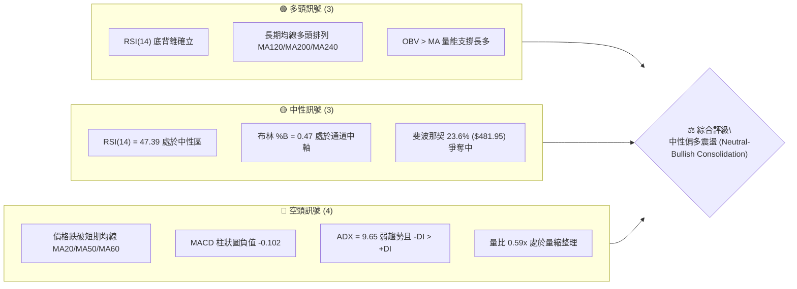
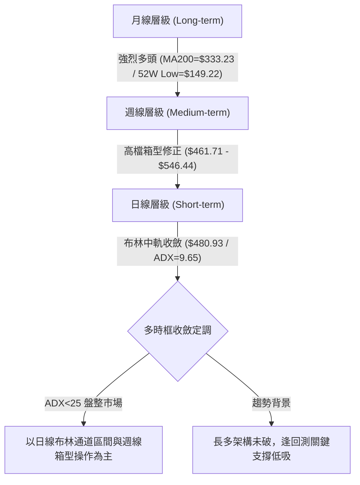
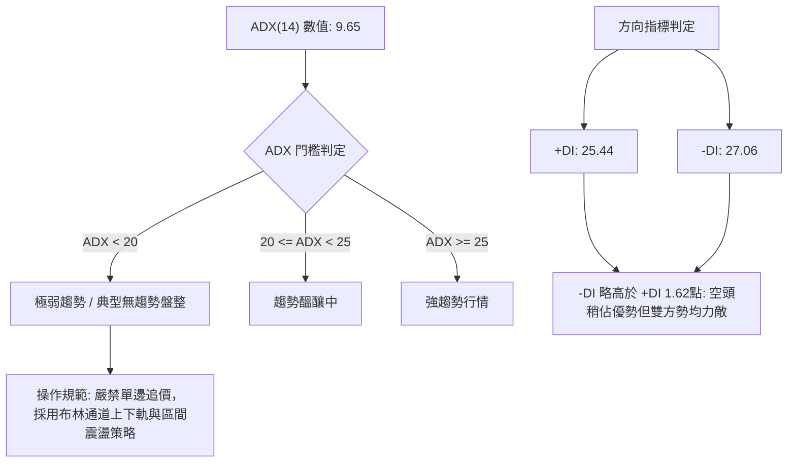
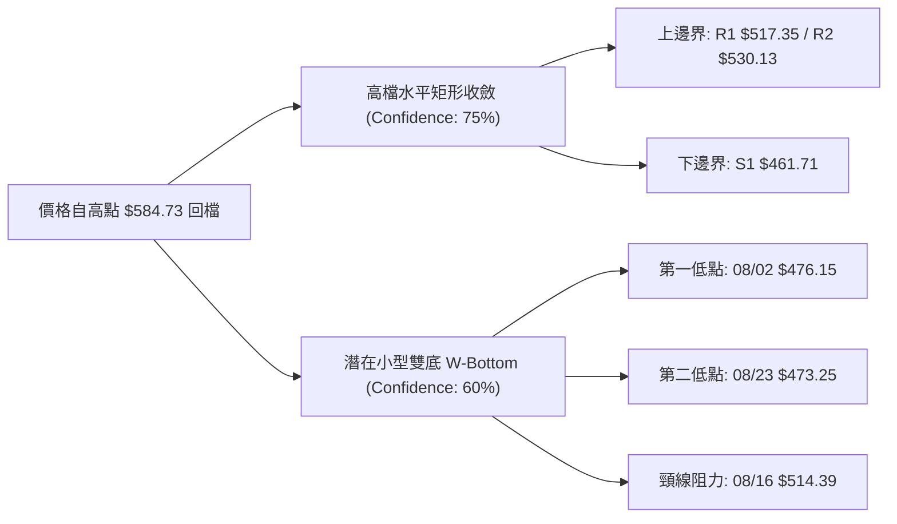
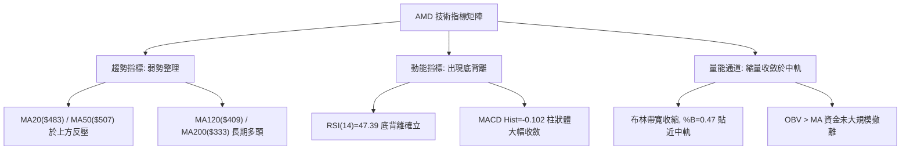
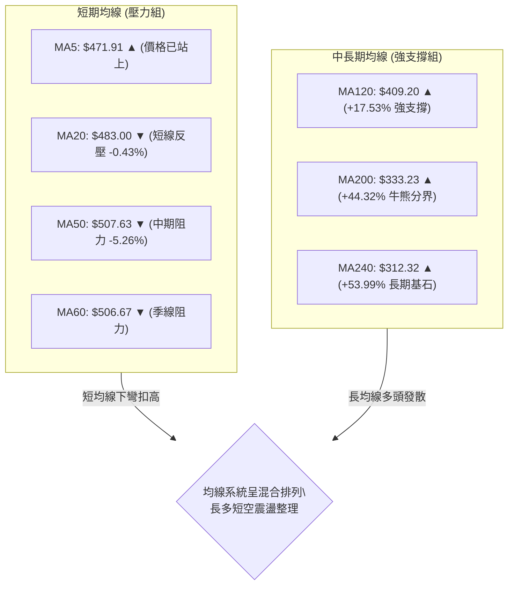
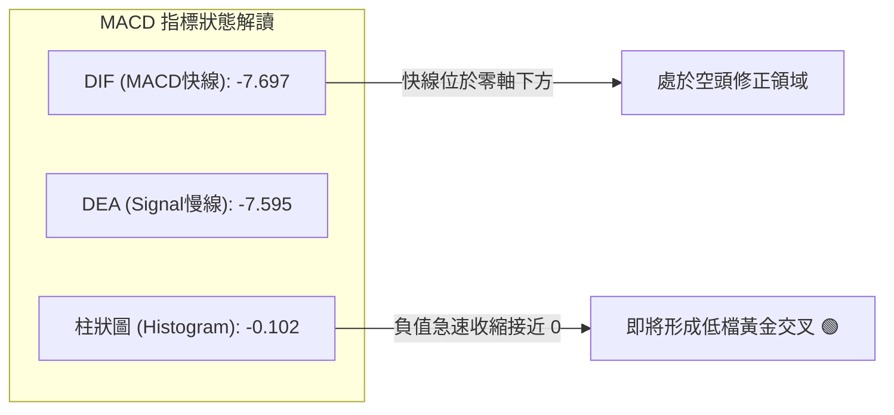
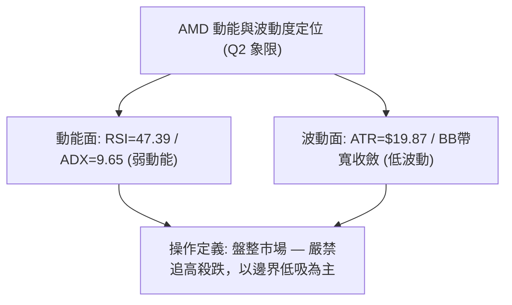
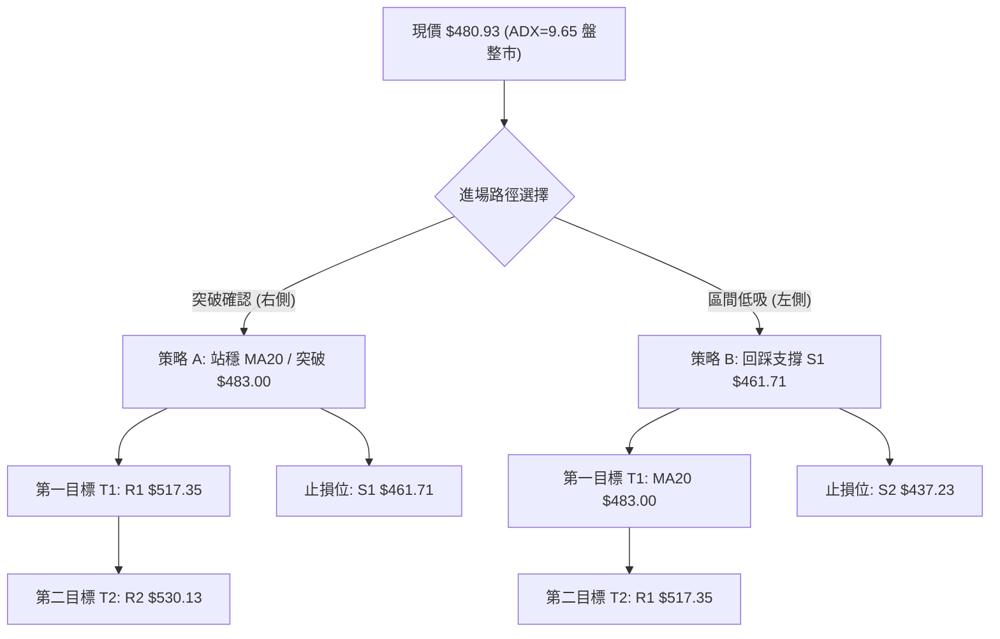
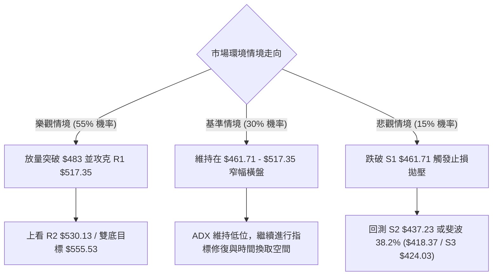

# AMD 技術分析報告

> **報告日期**：2026-08-27 ｜ **語言**：繁體中文 ｜ **數據來源**：Yahoo Finance ｜ **當前價格**：$480.93

---

## 目錄

| 章節 | 內容 |
|------|------|
| [1. 技術面概覽](#1-技術面概覽) | 訊號儀表板、核心指標、評分卡 |
| [2. 趨勢分析](#2-趨勢分析) | 多時框趨勢、長中短期走勢 |
| [3. 圖表形態分析](#3-圖表形態分析) | 形態識別、K線組合、目標價 |
| [4. 支撐與阻力](#4-支撐與阻力) | 關鍵價位、斐波那契回調 |
| [5. 技術指標深度解讀](#5-技術指標深度解讀) | MA/RSI/MACD/布林/成交量 |
| [6. 動能與波動率](#6-動能與波動率) | 動能評估、ATR、Beta |
| [7. 多時框架總結](#7-多時框架總結) | 時框架評分矩陣 |
| [8. 交易策略建議](#8-交易策略建議) | 多空策略、風險報酬比 |
| [9. 風險提示與監控](#9-風險提示與監控) | 監控指標、風險場景 |
| [10. 報告總結](#10-報告總結) | 核心結論與策略彙整 |

---

## 1. 技術面概覽

### 🎯 技術訊號儀表板



### 📊 核心指標速覽表

| 指標類別 | 指標名稱 | 當前數值 | 訊號 | 解讀 |
|----------|----------|----------|------|------|
| **價格** | 當前價格 | $480.93 | 🟡 | 位於52週區間76.2%高位，自歷史高點$584.73回檔約17.75%進行高檔整理 |
| **均線** | MA20 | $483.00 | 🔴 | 價格低於MA20 (-0.43%)，短線承壓但貼近中軌 |
| **均線** | MA50 | $507.63 | 🔴 | 價格低於MA50 (-5.26%)，中期反彈首要考驗帶 |
| **均線** | MA200 | $333.23 | 🟢 | 價格遠高於MA200 (+44.32%)，長期多頭基底穩固無虞 |
| **動能** | RSI(14) | 47.39 | 🟢 | 數值中性，且日線級別呈現明確底背離 (Bullish Divergence) |
| **動能** | MACD (Hist) | -0.102 | 🟡 | MACD (-7.697) 低於訊號線 (-7.595)，但柱狀體極度收斂近零軸，空頭動能衰竭 |
| **趨勢** | ADX(14) | 9.65 | 🟡 | 數值 < 25 處於極弱趨勢/典型盤整市；-DI (27.06) 略高於 +DI (25.44) |
| **通道** | 布林帶寬 | $452.58 - $513.42 | 🟡 | %B 為 0.47，價格於布林中軌附近收斂窄幅震盪 |
| **量能** | 20日成交量比 | 0.59x | 🟡 | 14.19M vs 24.02M (20日均量)，典型縮量築底結構 |
| **波動** | ATR(14) | $19.87 | 🟡 | 佔股價4.13%，每日波動適中，提供良好的區間交易風控邊界 |

### 🏆 技術評分卡

```
╔══════════════════════════════════════════════════════════════╗
║              技術評分卡 — AMD (2026-08-27)                  ║
╠══════════════════════════════════════════════════════════════╣
║ 趨勢強度      ████░░░░░░░░░░░░░░░░  20/100  🔴 極弱趨勢/盤整 ║
║ 動能指標      ███████████░░░░░░░░░  55/100  🟡 中性底背離     ║
║ 支撐穩定度    ██████████████░░░░░░  70/100  🟢 斐波與波段支撐 ║
║ 成交量配合    ██████████░░░░░░░░░░  50/100  🟡 縮量整理待變   ║
║ 形態完整度    ████████████░░░░░░░░  60/100  🟡 箱型收斂結構   ║
║ 均線排列      █████████████░░░░░░░  65/100  🟢 長多短空混合   ║
╠══════════════════════════════════════════════════════════════╣
║ 綜合評分      ████████████░░░░░░░░  53.3/100  ⚖️ 區間中性偏多 ║
╚══════════════════════════════════════════════════════════════╝
```

---

## 2. 趨勢分析

### 🌐 多時框趨勢分析



### 📈 長期趨勢 — 12個月走勢圖（Unicode）

```
AMD 月線走勢圖（過去12個月：2025-09 至 2026-08）
價格軸 ($)
$600 ┤                                      ● (06月: $580.91 創波段頂)
$550 ┤                                  ●   │
$500 ┤                                  │   │   ● (07月: $476.15)
$450 ┤                                  │   │   │   ● (08月: $480.93 現價)
$400 ┤                              ●   │   │   │   │
$350 ┤                          ● (04月: $354.49)│   │
$300 ┤                          │       │   │   │   │
$250 ┤  ● (10月: $256.12)       │       │   │   │   │
$200 ┤  │   ●───● (11-12月)     │       │   │   │   │
$150 ┤  │   │   │   ● (01月: $236.73)   │   │   │   │
$100 ┤  │   │   │   │   ●───● (02-03月雙底 $200.21-$203.43)
     └────────────────────────────────────────────────────────────►
       09  10  11  12  01  02  03  04  05  06  07  08  (月份)
```

**走勢特徵分析表格**：

| 階段 | 時間區間 | 起始/結束價 | 漲跌幅 | 走勢特徵與技術解讀 |
|------|----------|------------|--------|-------------------|
| **第一階段：高檔震盪** | 2025-09 ~ 2025-12 | $161.79 → $214.16 | +32.37% | 突破 $200 整數關卡，於 $214-$256 建立第一段整理平台 |
| **第二階段：回踩築底** | 2026-01 ~ 2026-03 | $236.73 → $203.43 | -14.07% | 在 $200.21-$203.43 構築堅實雙底（W底），洗淨籌碼 |
| **第三階段：主升爆發** | 2026-04 ~ 2026-06 | $203.43 → $580.91 | +185.56% | 爆量突破，均線極度發散，創下歷史高點 $584.73 |
| **第四階段：高檔收斂** | 2026-07 ~ 2026-08 | $580.91 → $480.93 | -17.21% | 主升段後健康獲利回吐，於斐波那契23.6% ($481.95) 進入箱型盤整 |

### 📊 中期趨勢（週線分析）

```
週線支撐阻力結構圖 ($)
$584.73 ═══════════════════════════════════════ 52週歷史高點 (波段頂部)
           │
$546.44 ─────────────────────────────────────── 中期波段強阻力 R3 (06/21波段頂)
$530.13 ─────────────────────────────────────── 中期波段阻力 R2
$517.35 ─────────────────────────────────────── 頸線/密集壓力帶 R1 (BB上軌附近)
           │
$480.93 ━━━━━━━━━━━━━━━━━━━━━━━━━━━━━━━━━━━━━━━ 現價位 (斐波 23.6% $481.95 附近)
           │
$461.71 ─────────────────────────────────────── 短期箱底支撐 S1 (06/07、08/23波段低點)
$437.23 ─────────────────────────────────────── 中期防守支撐 S2 (05/17回踩低點)
$418.37 ─────────────────────────────────────── 斐波 38.2% 回調位 / S3 $424.03
```

- **週線走勢解讀**：自 2026-06-28 以來，週線 RSI 由 97.4 的歷史超買極值逐步降溫至 47.4，MACD 週線柱狀圖亦從高點 +10.403 收斂至 -0.102，顯示拋壓已大幅消化。目前在 $461.71 - $546.44 之間構築高檔整理旗形/矩形。

### ⚡ 趨勢強度評估（ADX 解讀）



| ADX 區間 | 趨勢強度定義 | AMD 當前狀態 (ADX=9.65) | 策略指導方針 |
|----------|--------------|-------------------------|--------------|
| 0 - 20 | 極弱 / 無方向盤整 | **當前狀態 (9.65)** | 高拋低吸，以 S1-R1 支撐阻力為操作界限 |
| 20 - 25 | 趨勢成型初期 | - | 密切關注放量突破方向 |
| 25 - 40 | 明確強趨勢 | - | 順勢交易，回踩均線加碼 |
| 40 - 100 | 極強/過度延伸 | - | 警惕趨勢衰竭反轉 |

---

## 3. 圖表形態分析

### 🔍 形態識別系統



**形態信心度評估表**：

| 形態名稱 | 信心度 | 判斷依據（引用數據） | 完成度 | 目標價（附精確計算式） |
|----------|--------|----------------------|--------|------------------------|
| **高檔整理矩形** (Rectangle Range) | **75%** | 價格在 S1 ($461.71) 與 R1 ($517.35) 之間多次測試未破，ADX=9.65 高度符合盤整特徵 | 85% | 向上突破測幅：$517.35 + ($517.35 - $461.71) = **$572.99**<br>向下跌破測幅：$461.71 - ($517.35 - $461.71) = **$406.07** |
| **短期雙底** (Double Bottom) | **60%** | 兩次波段低點於 08/02 ($476.15) 與 08/23 ($473.25)，形態相近且伴隨 RSI 底背離 | 70% | 頸線 $514.39 (08/16高點) + 高度 ($514.39 - $473.25 = $41.14) = **$555.53** |
| **頭肩頂形態** (Head & Shoulders) | **30%** | 左肩 $557.89、頭部 $584.73、當前右肩未成型，跌破 S1 才能確認，目前數據不足 | 35% | 訊號不足，信心度低於50%，僅做風險提示不予採用 |

### 🕯️ 重要K線形態分析

| 日期 / 週別 | 收盤價 | K線形態 / 特徵 | 專業解讀 | 多空訊號 |
|-------------|--------|----------------|----------|----------|
| **2026-06-21** | $537.37 | 長上影線十字星 | 逼近歷史高點 $584.73 遭遇強烈拋壓，多頭動能首度受阻 | 🔴 短線見頂 |
| **2026-08-02** | $476.15 | 大陰線回測支撐 | 快速下殺測試 S1 ($461.71) 上方支撐帶，成交量放大至 163.9M | 🔴 空頭宣洩 |
| **2026-08-16** | $514.39 | 中陽線反彈 | 帶量突破短期 MA20，測試 R1 阻力但縮量受阻於 $517.35 | 🟢 反彈確認 |
| **2026-08-23** | $473.25 | 下影線小陰線 | 二次探底 $473.25 不破前低 $461.71，量能驟降至 92.5M（惜售） | 🟢 築底訊號 |
| **2026-08-30** | $480.93 | 縮量企穩陽線 | 收盤重回 $480 之上，MACD 柱狀體縮至 -0.102，賣壓基本枯竭 | 🟡 變盤前夕 |

### 📉 ASCII 走勢形態示意圖

```
高檔矩形箱型與短期雙底疊加示意圖 ($)
$546.44 ─────────────────────────────────────────────── 箱型頂部阻力區 (R3)
          ┌───┐                 ┌───┐
$517.35 ──│   │─── 頸線 R1 ─────│   │──────────────── 矩形上軌阻力 (R1)
          │   │                 │   │
$480.93 ──┼───┼─────────────────┼───┼────● 現價 $480.93 (MA20 爭奪)
          │   │   ┌─────────┐   │   │   ╱
$473.25 ──│   └───│         └───│   └──● 08/23 二次回踩低點 (底背離)
          │       │             │
$461.71 ──┴───────┴─────────────┴───────────────────── 箱型底部支撐 (S1)
          【 08/02 低點 】    【 08/23 低點 】
          【   底 1   】      【   底 2   】
```

### 🎯 形態目標價計算

1. **矩形突破目標價 (Bullish Breakout Target)**：
   - 形態下軌 (S1) = $461.71，形態上軌 (R1) = $517.35
   - 形態高度 $H_1 = 517.35 - 461.71 = 55.64$
   - **向上突破第一目標價** = $517.35 + 55.64 = \mathbf{\$572.99}$（極度接近歷史高點 R3 上方）
2. **短期雙底目標價 (Double Bottom Target)**：
   - 雙底低點 = $473.25，雙底頸線 = $514.39
   - 形態高度 $H_2 = 514.39 - 473.25 = 41.14$
   - **雙底達成目標價** = $514.39 + 41.14 = \mathbf{\$555.53}$（位於 R3 $546.44 上方）

---

## 4. 支撐與阻力

### 🗺️ 關鍵價位分布圖（Unicode）

```
AMD 價位結構分布圖
══════════════════════════════════════════════════════════════════════
$584.73 ║██████████████████████████████║ 52週歷史高點 / 斐波 0.0%
$546.44 ║████████████████████████      ║ 強阻力 R3 (+13.62%) 波段頂部聚類
$530.13 ║██████████████████            ║ 阻力 R2 (+10.23%) 前期密集成交區
$517.35 ║██████████████████████        ║ 關鍵阻力 R1 (+7.57%) 箱型頂/BB上軌
$481.95 ║──────────────────────────────║ 斐波那契 23.6% 回調關鍵樞軸線
$480.93 ╠══════════════════════════════╣ ◄ 現價 $480.93 (MA20=$483.00)
$461.71 ║▓▓▓▓▓▓▓▓▓▓▓▓▓▓▓▓▓▓            ║ 關鍵支撐 S1 (-4.00%) 箱底/雙底防守線
$437.23 ║██████████████████████        ║ 強支撐 S2 (-9.09%) 05月中旬突破起漲點
$424.03 ║██████████████████████████    ║ 核心支撐 S3 (-11.83%) 斐波38.2%重合區
══════════════════════════════════════════════════════════════════════
```

### 🚧 阻力位分析表

| 阻力級別 | 精確價位 | 形成原因（波段高點聚類） | 突破難度 | 技術重要性 |
|----------|----------|--------------------------|----------|------------|
| **R1** | **$517.35** | 05/31收盤高點 ($516.10)、07/05高點 ($517.82) 與布林上軌 ($513.42) 重疊聚類 | 🟡 中等 | **極高**。此處為高檔箱型上軌，唯有放量收復方能確認結束盤整。 |
| **R2** | **$530.13** | 06/28 ($521.58) 至 07/26 ($521.95) 多次反彈受阻中繼平台 | 🔴 較高 | **中等**。套牢籌碼解套反壓區。 |
| **R3** | **$546.44** | 06/21波段收盤高點 ($537.37) 與 07/12 ($557.89) 之成交密集核心區 | 🔴 極高 | **高**。突破此位將直接挑戰 52 週歷史高點 $584.73。 |

### 🛡️ 支撐位分析表

| 支撐級別 | 精確價位 | 形成原因（波段低點聚類） | 守住機率 | 技術重要性 |
|----------|----------|--------------------------|----------|------------|
| **S1** | **$461.71** | 06/07回踩低點 ($466.38)、08/23低點 ($473.25) 及布林下軌 ($452.58) 緩衝區 | 🟢 75% | **極高**。短線多頭防線與雙底形態立足點，失守則盤整形態破位。 |
| **S2** | **$437.23** | 05/17大波段中繼低點 ($424.10 ~ $455.19 缺口支撐帶) | 🟢 85% | **高**。中期多空格局分水嶺。 |
| **S3** | **$424.03** | 05/17波段收盤低點 ($424.10) 與斐波 38.2% ($418.37) 及 MA120 ($409.20) 共振 | 🟢 95% | **極高**。長期上升趨勢的核心多頭護城河。 |

### 📐 斐波那契回調位分析

依據 52 週完整波動區間（低點 **$149.22** → 高點 **$584.73**，總振幅 $435.51）計算：

```
斐波那契回調結構階梯
0.0%  (52W High) ───────────────────────── $584.73
23.6% ─────────── ◄ 當前爭奪位 ───────── $481.95  (現價 $480.93 僅距 -0.21%)
38.2% ─────────────────────────────────── $418.37  (與 S3 $424.03 形成強共振)
50.0% ─────────────────────────────────── $366.97
61.8% (黃金分割) ───────────────────────── $315.58  (與 MA200 $333.23 / MA240 $312.32 重疊)
78.6% ─────────────────────────────────── $242.42
100.0%(52W Low)  ───────────────────────── $149.22
```

- **位置解讀**：現價 **$480.93** 緊貼於 **23.6% 回調位 ($481.95)**。在強勢多頭市場中，回調僅觸及 23.6% 即止跌橫盤，屬於最為強勢的「強勢淺幅回檔」特徵。只要價格穩守於 38.2% ($418.37) 之上，整體長期多頭結構毫無破壞跡象。

---

## 5. 技術指標深度解讀

### 🎛️ 指標訊號總覽



### 📈 移動平均線排列分析



| 均線名稱 | 當前數值 | 與現價差距 | 斜率走勢 | 技術意涵與操作指引 |
|----------|----------|------------|----------|-------------------|
| **MA 5** | $471.91 | +1.91% | 向上翻揚 ▲ | 極短線止跌訊號，價格已站回 5 日線之上 |
| **MA 10** | $481.38 | -0.09% | 走平 ▼ | 現價正處於扣抵糾結處，等待方向抉擇 |
| **MA 20** | $483.00 | -0.43% | 緩降 ▼ | 日線布林中軌，站穩 $483.00 宣告短空格局結束 |
| **MA 50** | $507.63 | -5.26% | 下彎 ▼ | 中期強阻力，與 R1 ($517.35) 構成強大空頭防線 |
| **MA 60** | $506.67 | -5.08% | 下彎 ▼ | 季線阻力，與 MA50 形成雙重共振阻力帶 |
| **MA 120**| $409.20 | +17.53% | 向上翻揚 ▲ | 半年線強烈支撐，位於 S3 ($424.03) 下方提供堅固托底 |
| **MA 200**| $333.23 | +44.32% | 強烈向上 ▲ | 長期多頭核心牛熊線，多頭大趨勢之定海神針 |
| **MA 240**| $312.32 | +53.99% | 強烈向上 ▲ | 年線持續仰角推升，奠定結構性牛市基本盤 |

### 📉 RSI(14) 分析

```
RSI(14) 數值進度條與區間定位
0 ──────── 30 ──────────────── 47.39 ────── 50 ──────────────── 70 ──────── 100
[  超賣區  ] [    弱勢震盪區    ]  ▲現價   [    強勢多頭區    ] [  超買區  ]
███████████████████████░░░░░░░░░░░░░░░░░░░░░░░░░░  47.39 / 100 (中性區)
```

- **RSI 底背離 (Bullish Divergence) 深度判斷**：
  - **價格走勢**：2026-08-02 收盤價 $476.15，隨後於 2026-08-23 下探收盤 $473.25，價格創出回檔新低。
  - **RSI 指標**：08-02 當週 RSI 為 **40.6**，而 08-23 當週價格雖創新低，RSI 卻逆勢上升至 **47.1**（最新 47.39）。
  - **技術結論**：**標準底背離確立 🟢**。顯示在 $470-$475 區間，儘管空頭試圖摜壓破底，但內部下殺動能已嚴重衰竭，買盤正在暗中承接，隨時具備向上發動均值回歸的爆發力。

### 📊 MACD(12/26/9) 訊號解讀



- **柱狀圖動能分析**：
  - 歷史峰值：08-02 週負動能柱達到最大值 **-9.004**。
  - 動能衰退：08-09 縮至 **-2.259**，08-23 縮至 **-0.794**，最新 08-30 僅為 **-0.102**。
  - **解讀**：柱狀圖幾乎完全貼合零軸，代表空方力量已消耗殆盡。一旦日線收盤突破 MA20 ($483.00)，MACD 將正式在低檔形成黃金交叉，觸發技術派買盤跟進。

### 📦 布林通道分析

```
日線布林通道結構圖 ($)
$513.42 ═══════════════════════════════════════ BB 上軌 (Upper Band)
           │
$483.00 ─────────────────────────────────────── BB 中軌 (MA20 樞軸線)
$480.93 ─────────────── ◄ 現價 ($480.93 / %B = 0.47)
           │
$452.58 ═══════════════════════════════════════ BB 下軌 (Lower Band)
```

- **布林帶寬與位置特徵**：
  - 上下軌總帶寬為 $60.84（約 12.6% 帶寬），通道已連續兩週進入「收口擠壓 (Squeeze)」狀態。
  - 當前 **%B = 0.47**，股價微幅低於中軌 ($483.00)，緊貼中軸。歷史經驗顯示，布林通道低波動收口後，往往伴隨大幅度方向性突破。

### 💹 成交量分析（量價配合度）

- **量比與量能指標**：
  - 最新成交量：**14,193,300 股** vs 20日均量：**24,016,395 股**（量比僅 **0.59x**）。
  - 週成交量走勢：由 04-26 爆量 250M、05-10 爆量 296M，驟降至近期的 92.5M 與 49.7M。
- **量價背離與 OBV 解讀**：
  - **價穩量縮**：股價在高檔回落 17% 後，成交量極度萎縮，顯示大機構未出現恐慌性拋售出逃，籌碼鎖定良好。
  - **OBV 趨勢**：數據明確標示「**OBV > MA → 量能支撐上漲**」，中長期累積能量線依舊處於多頭排列，確認此波回檔為健康之洗盤蓄勢，非派發行情。

---

## 6. 動能與波動率

### ⚡ 動能評估

| 象限 | 動能維度 (Momentum) | 波動維度 (Volatility) | 當前判定 | 策略屬性與市場意涵 |
|------|--------------------|----------------------|----------|-------------------|
| **Q1** | 強動能 (Bullish) | 低波動 (Low Vol) | — | 最佳波段主升機會 |
| **Q2** | **弱動能 (Consolidation)** | **低波動 (Low Vol)** | **✓ 當前狀態** | **箱型觀望 / 區間高拋低吸 / 突破前蓄勢** |
| **Q3** | 強動能 (Breakout) | 高波動 (High Vol) | — | 爆發性行情 / 高風險高回報 |
| **Q4** | 弱動能 (Bearish) | 高波動 (High Vol) | — | 崩跌殺多市場 / 嚴格避開 |



### 📊 ATR 波動率分析

- **ATR(14) 數值**：**$19.87**（佔當前股價之 **4.13%**）。
- **風控參數與止損距離設定**：
  - **日內正常雜訊過濾區間**：$1.0 \times \text{ATR} = \$19.87$。
  - **短線交易動態止損 (1.5 ATR)**：$1.5 \times \$19.87 = \mathbf{\$29.81}$。
  - **波段交易安全防守 (2.0 ATR)**：$2.0 \times \$19.87 = \mathbf{\$39.74}$。
  - **解讀**：當前每日波幅約在 $20 美元左右，於 S1 ($461.71) 附近進場時，若設定 1.0 ATR 止損，價格下限恰好觸及 $461.06，具備極高之風控保護效率。

### 📐 Beta 與市場相關性

- **Beta 係數**：**2.489**（極高 Beta 屬性）。
- **解讀**：AMD 對標普500與費城半導體指數具有 2.49 倍之波動放大效應。當科技大盤反彈 1% 時，AMD 理論波動幅度達 +2.49%。在當前縮量整理末端，高 Beta 特性意味著一旦突破阻力 R1，將產生極具爆發力的動能溢價。

---

## 7. 多時框架總結

### 📋 時框架評分表

| 時框架 | 趨勢方向 | 動能指標 | 均線排列 | 形態特徵 | 綜合評分 | 戰略建議 |
|--------|----------|----------|----------|----------|----------|----------|
| **月線 (長期)** | 🟢 強烈看多 | 🟢 超買鈍化回降 | 🟢 完美多頭發散 | 主升段後高檔強勢旗形整理 | **85/100** | 逢長線大回調堅定買入 |
| **週線 (中期)** | 🟡 中性偏多 | 🟡 MACD收斂近零 | 🟢 長均線向上支撐 | $461.71 - $546.44 箱型震盪 | **60/100** | 箱底支撐低吸，箱頂減碼 |
| **日線 (短期)** | 🟡 區間收斂 | 🟢 RSI 底背離確立 | 🔴 承壓於 MA20/MA50 | 布林帶寬收窄，雙底醞釀中 | **50/100** | 緊盯 $483 突破訊號進場 |

### 🔲 綜合訊號矩陣

```
時框架訊號對齊矩陣
┌──────────────┬──────────────┬──────────────┬──────────────┐
│   分析維度   │  短期 (日線) │  中期 (週線) │  長期 (月線) │
├──────────────┼──────────────┼──────────────┼──────────────┤
│ 趨勢方向     │ 🟡 區間盤整  │ 🟡 高檔箱型  │ 🟢 結構牛市  │
│ 均線系統     │ 🔴 短均反壓  │ 🟢 中均托底  │ 🟢 長均發散  │
│ 動能狀態     │ 🟢 底背離    │ 🟡 柱狀收斂  │ 🟡 動能修復  │
│ 量能配合     │ 🟡 量縮整理  │ 🟢 惜售量縮  │ 🟢 巨量沉澱  │
│ 關鍵防守     │ S1: $461.71  │ S2: $437.23  │ S3: $424.03  │
└──────────────┴──────────────┴──────────────┴──────────────┘
```

### ⚖️ 多時框收斂結論

依據**多時框收斂規則（嚴格要求 14）**：
1. **行情性質判定**：當前日線 **ADX(14) = 9.65 (< 25)**，嚴格定義為**典型盤整行情**，趨勢性單邊指標失效。
2. **主導時框取捨**：依規則，盤整行情中應**以日線布林通道上下軌（$452.58 - $513.42）與週線箱型（$461.71 - $517.35）作為主要交易依據**；中長期長多架構（MA200=$333.23）則提供底部安全墊。
3. **唯一方向性結論**：**中性偏多震盪整理（Neutral-Bullish Range-Bound）**。短線空頭下殺動能已因 RSI 底背離與 MACD 收斂而衰竭，操作上**禁止追空**，策略應定位為「**箱底支撐 S1 逢低布局，或突破 MA20 右側順勢做多**」。

---

## 8. 交易策略建議

### 🗺️ 策略決策流程圖



### 🧭 策略路由

**當前主策略方向 = 中性偏多區間突破與回踩低吸操作（依綜合評分 53.3/100 定調，偏多震盪）**

### 🎯 價格情境階梯（Price Scenarios）

| 觸發條件 | 下一目標 | 後續延伸 | 情境含義與技術解讀 |
|----------|----------|----------|-------------------|
| **放量突破 R1 $517.35** | **R2 $530.13** | **R3 $546.44** | 高檔矩形向上突破，重啟多頭主升浪，挑戰歷史高點 $584.73 |
| **突破 MA20 $483.00** | **R1 $517.35** | **R2 $530.13** | 短線擺脫空頭壓制，MACD 翻正，展開箱體內部向上反彈 |
| **維持現價 $480.93** | — | — | 於布林中軌與斐波 23.6% ($481.95) 窄幅拉鋸，籌碼換手 |
| **跌破 S1 $461.71** | **S2 $437.23** | **S3 $424.03** | 跌破箱底，雙底失敗，回調向下延伸至斐波 38.2% ($418.37) |

### 📊 情境機率分佈

| 情境劇本 | 機率估計 | 主要技術依據與指標支撐 |
|----------|----------|------------------------|
| **情境一：向上突破 / 走多反彈** | **55%** | RSI 底背離確立、MACD 柱狀體收斂至 -0.102、OBV 長多量能支撐、縮量惜售 |
| **情境二：區間震盪收斂** | **30%** | ADX=9.65 極弱趨勢、布林帶寬持續緊縮、量比僅 0.59x 缺乏突破動能 |
| **情境三：跌破 S1 深幅回檔** | **15%** | -DI (27.06) 暫時大於 +DI (25.44)、價格仍在 MA50 ($507.63) 之下受壓 |

### 🟢 主策略詳情

| 策略要素 | 策略 A：右側動能突破策略（穩健型） | 策略 B：左側支撐低吸策略（積極型） |
|----------|-----------------------------------|-----------------------------------|
| **策略類型** | 日線收盤突破 MA20 追買 | 回踩關鍵支撐 S1 逢低買入 |
| **進場條件** | 日K收盤價有效站穩 MA20 **$483.00** 以上 | 價格回測 **$461.71 (S1)** 且出現下影線企穩 |
| **進場價格** | **$484.50** (確認站上 $483.00) | **$463.00** (靠近 S1 支撐掛單) |
| **目標價 T1** | **$517.35** (波段阻力 R1，預期 +6.78%) | **$483.00** (布林中軌 MA20，預期 +4.32%) |
| **目標價 T2** | **$530.13** (波段阻力 R2，預期 +9.42%) | **$517.35** (波段阻力 R1，預期 +11.74%) |
| **止損價格** | **$461.71** (嚴格設於箱底 S1 跌破點) | **$437.23** (設於強支撐 S2 跌破點) |
| **風險報酬比** | **1 : 1.44** (至T1) / **1 : 2.00** (至T2) | **1 : 2.11** (至T2) |
| **成功機率** | **65%** | **60%** |
| **建議倉位** | **20% 資金倉位** | **15% 資金倉位** |

### 🔴 反向風險觸發點（對沖與風控提示）

- **多頭停損與防守警戒線**：若日K線以實體長陰線收盤**跌破 $461.71 (S1)**，即代表矩形盤整向下破位。
- **對沖處置建議**：跌破 $461.71 後應立即砍除 50%-100% 之短線多頭部位，並可於跌破當下建立小規模空頭避險頭寸，下看 **S2 ($437.23)** 及 **S3 ($424.03)**。

### ⭐ 整體訊號強度評星

```
做多訊號強度：★★★☆☆  (3/5星 — 底背離與量縮利於多方，但需等突破MA20確認)
做空訊號強度：★☆☆☆☆  (1/5星 — 處於箱底且背離嚴重，追空盈虧比極差)
整體可信度：  ★★★★☆  (4/5星 — 支撐阻力結構清晰，指標共振明確)
```

---

## 9. 風險提示與監控

### ✅ 關鍵監控指標 Checklist

```
╔══════════════════════════════════════════════════════════════╗
║              AMD 日常交易監控 Checklist                     ║
╠══════════════════════════════════════════════════════════════╣
║ [ ] 價格是否收盤站上 MA20 ($483.00) ── (短線轉強首要條件)    ║
║ [ ] RSI(14) 是否突破 50 中軸線 ── (動能正式由空轉多)        ║
║ [ ] MACD 柱狀體是否由負轉正 (> 0) ── (低檔黃金交叉確立)       ║
║ [ ] 單日成交量是否放大至 24.0M 以上 ── (突破帶量確認)         ║
║ [ ] 價格是否跌破 S1 ($461.71) ── (若跌破立即觸發停損機制)     ║
║ [ ] 大盤半導體指數與 Beta 聯動 ── (防範系統性高 Beta 回撤)   ║
╚══════════════════════════════════════════════════════════════╝
```

### ⚠️ 風險場景分析



### 🛡️ 風險管理重要提醒

1. **Beta 波動管理**：AMD Beta 高達 **2.489**，其波動幅度為大盤的 2.5 倍，單筆交易之資金風險暴露不得超過總帳戶淨值的 **1.5% - 2.0%**。
2. **ATR 浮動止損保護**：持倉獲利若觸及 T1 ($517.35)，應立即將止損點上移至進場成本價 ($484.50)，確保獲利部位零下行風險（Free Trade）。
3. **盤整市場忌追高**：ADX 數值僅 9.65，當價格觸及布林上軌 ($513.42) 或 R1 ($517.35) 且未見顯著放量時，切勿追價，應逢高獲利了結。

---

## 10. 報告總結

```
╔══════════════════════════════════════════════════════════════════╗
║                    AMD 技術分析報告總結                         ║
╠══════════════════════════════════════════════════════════════════╣
║ 報告日期：2026-08-27                                             ║
║ 當前價格：$480.93                                                ║
║ 分析評級：⚖️ 中性偏多震盪 (Neutral-Bullish Consolidation)        ║
║                                                                  ║
║ 核心結構結論：                                                   ║
║ ├─ 長期趨勢：🟢 結構性大牛市 (MA200=$333.23 強烈向上發散)       ║
║ ├─ 中期趨勢：🟡 高檔箱型收斂 ($461.71 - $517.35 區間蓄勢)        ║
║ ├─ 短期趨勢：🟢 日線 RSI 底背離確立，MACD 柱狀體即將翻正       ║
║ ├─ 關鍵支撐：S1 $461.71 ｜ S2 $437.23 ｜ S3 $424.03             ║
║ ├─ 關鍵阻力：R1 $517.35 ｜ R2 $530.13 ｜ R3 $546.44             ║
║ └─ 華爾街共識目標價：$613.84 (最高 $1250.00 / 評級 Strong Buy)    ║
║                                                                  ║
║ 最優操作執行策略：                                               ║
║ 1. 🥇 首選策略 (右側突破)：站穩 MA20 ($483.00) 於 $484.50 進場， ║
║    止損 $461.71，目標 T1 $517.35、T2 $530.13。                   ║
║ 2. 🥈 次選策略 (左側低吸)：回踩 S1 ($461.71) 於 $463.00 掛單買進，║
║    止損 $437.23，目標 T1 $483.00、T2 $517.35。                   ║
║ 3. 🥉 防守風控原則：跌破 S1 ($461.71) 嚴格多頭離場觀望。        ║
╚══════════════════════════════════════════════════════════════════╝
```

---

> ⚠️ **免責聲明**：本報告為技術分析研究成果，報告內所有數據、支撐阻力位及模型測算均基於提供之客觀市場歷史數據。本報告**僅供學術交流與投資研究參考**，**不構成任何要約或投資買賣建議**。金融市場具有高波動風險，投資人應依個人風險承受度獨立判斷並自負盈虧。

---

*報告生成時間：2026-08-27 ｜ 數據來源：Yahoo Finance ｜ 分析框架：多時框架量化技術分析*