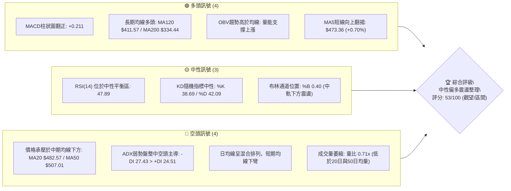
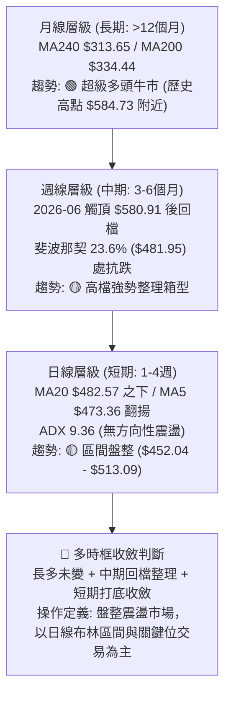
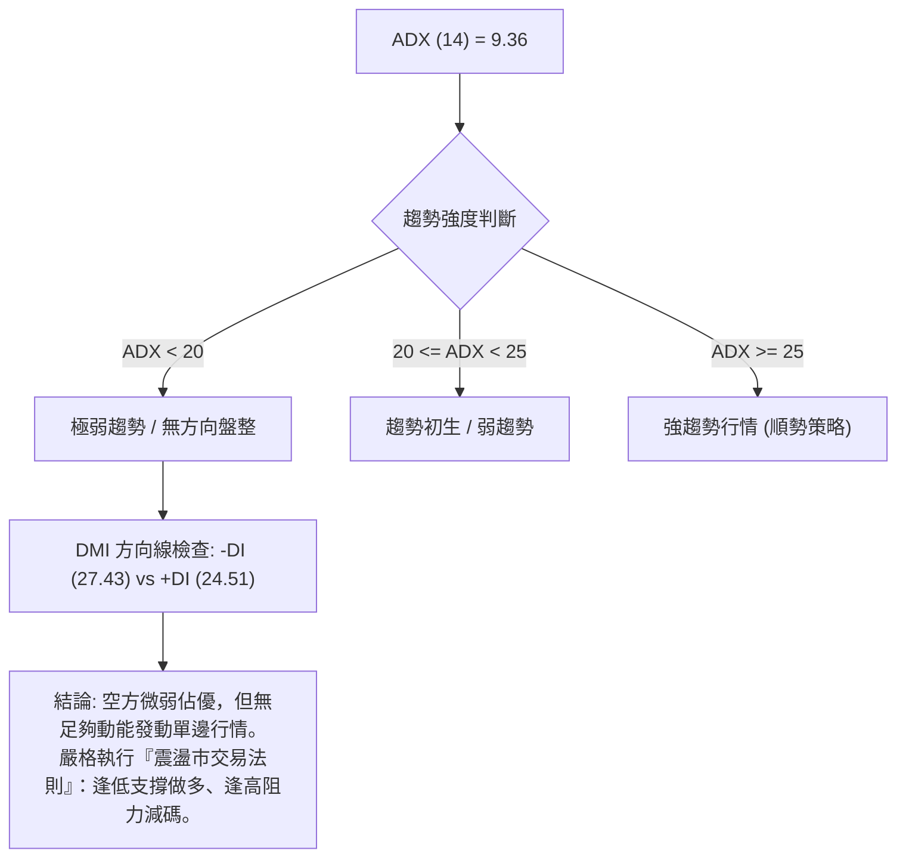
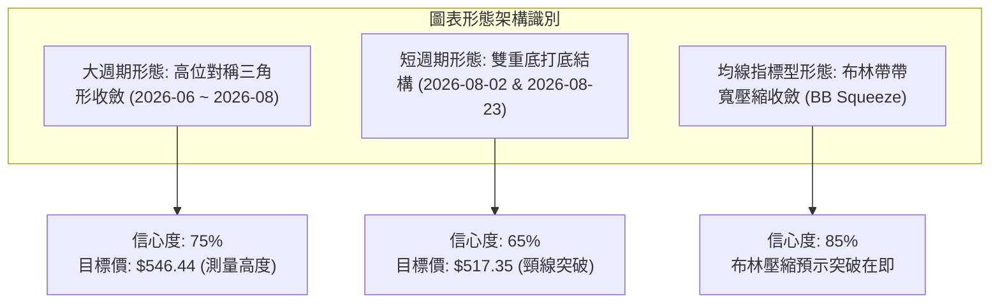
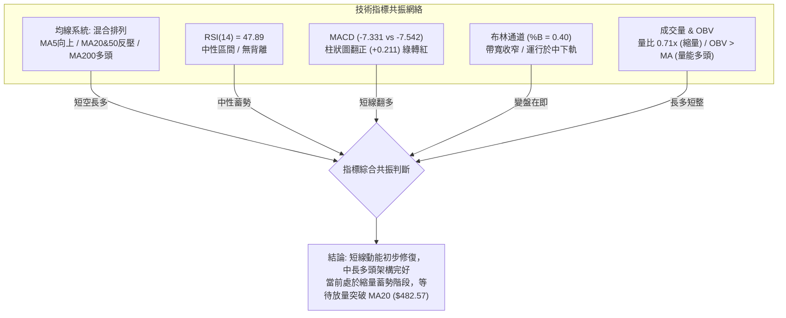
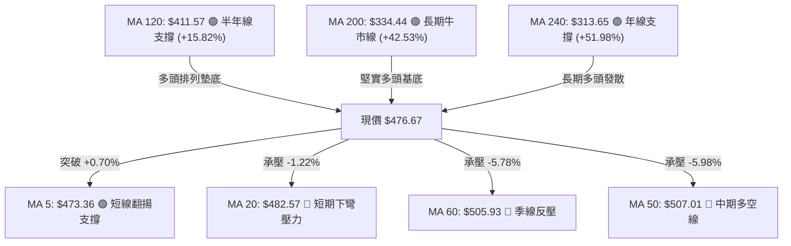
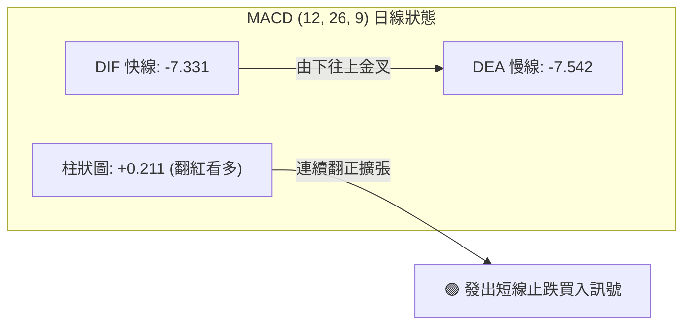
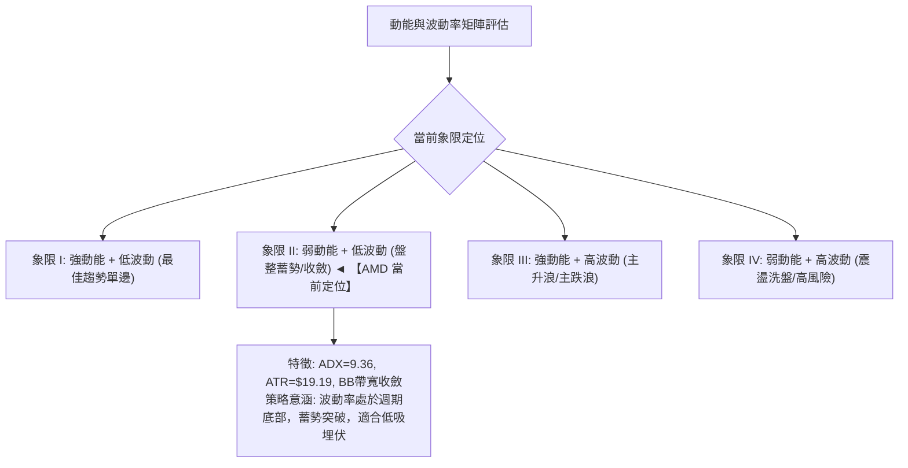
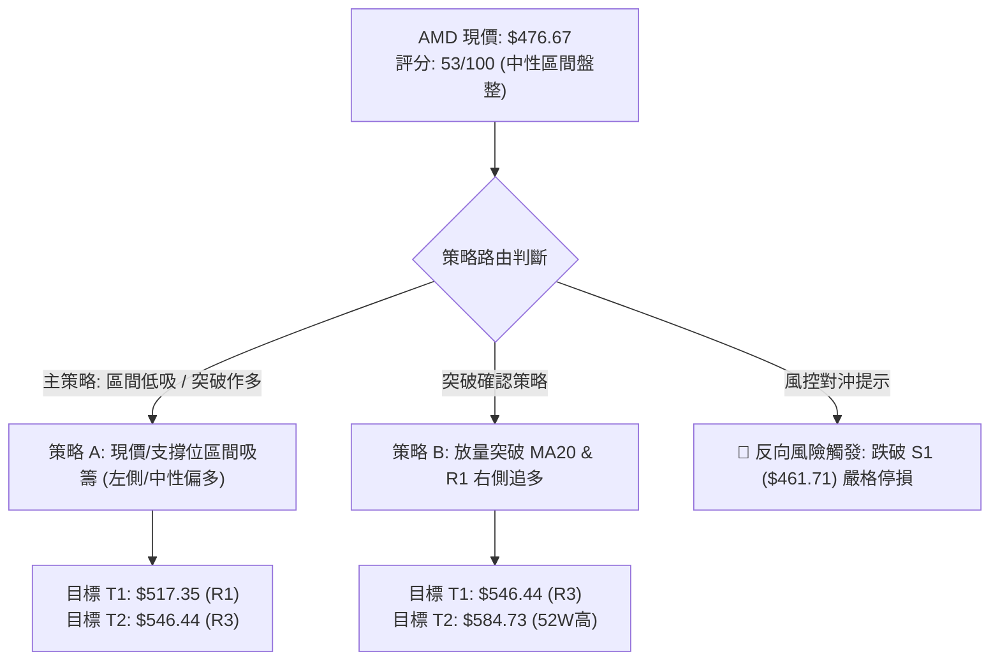
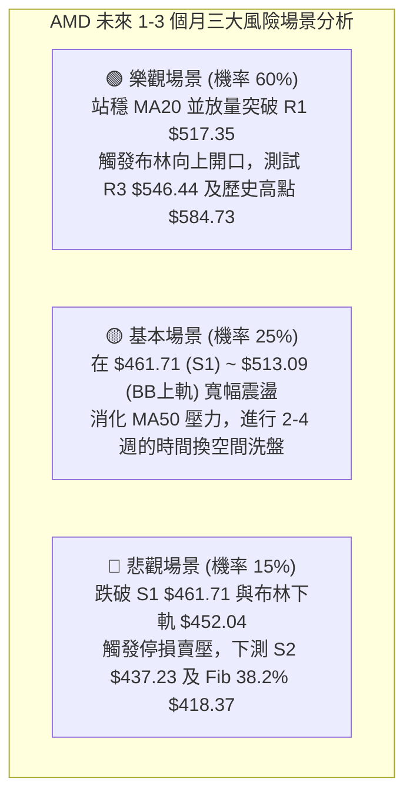

# AMD 技術分析報告

> **報告日期**：2026-08-28 ｜ **語言**：繁體中文 ｜ **數據來源**：Yahoo Finance ｜ **當前價格**：$476.67

---

## 目錄

| 章節 | 內容 |
|------|------|
| [1. 技術面概覽](#1-技術面概覽) | 訊號儀表板、核心指標、評分卡 |
| [2. 趨勢分析](#2-趨勢分析) | 多時框趨勢、長中短期走勢 |
| [3. 圖表形態分析](#3-圖表形態分析) | 形態識別、K線組合、目標價 |
| [4. 支撐與阻力](#4-支撐與阻力) | 關鍵價位、斐波那契回調 |
| [5. 技術指標深度解讀](#5-技術指標深度解讀) | MA/RSI/MACD/布林/成交量 |
| [6. 動能與波動率](#6-動能與波動率) | 動能評估、ATR、Beta |
| [7. 多時框架總結](#7-多時框架總結) | 時框架評分矩陣 |
| [8. 交易策略建議](#8-交易策略建議) | 多空策略、風險報酬比 |
| [9. 風險提示與監控](#9-風險提示與監控) | 監控指標、風險場景 |

---

## 1. 技術面概覽

### 🎯 技術訊號儀表板



### 📊 核心指標速覽表

| 指標類別 | 指標名稱 | 當前數值 | 訊號 | 解讀 |
|----------|----------|----------|------|------|
| **價格** | 當前價格 | $476.67 | 🟡 | 位於52週區間75.2%處，高檔回檔後處於箱型整理 |
| **短期均線**| MA5 | $473.36 | 🟢 | 現價站上5日均線（+0.70%），短線跌勢有止跌跡象 |
| **短期均線**| MA20 (BB中軌) | $482.57 | 🔴 | 現價位於20日線下方（-1.22%），短線壓力未解 |
| **中期均線**| MA50 | $507.01 | 🔴 | 現價低於季線，中期多頭格局受阻，轉為高檔修正 |
| **長期均線**| MA200 | $334.44 | 🟢 | 現價遠高於年線（+42.53%），長期多頭牛市基底穩固 |
| **動能** | RSI(14) | 47.89 | 🟡 | 處於40–60中性常態區間，無超買或超賣背離現象 |
| **動能** | MACD (12,26,9) | -7.331 / -7.542 (柱 +0.211) | 🟢 | 雖然DIF仍在零軸下方，但柱狀圖翻紅黃金交叉，短線動能改善 |
| **動能** | KD指標 | %K 38.69 / %D 42.09 | 🟡 | 中軸下方低位徘徊，空方動能減弱，即將醞釀金叉 |
| **趨勢強度**| ADX(14) / DMI | ADX 9.36 / -DI 27.43 > +DI 24.51 | 🔴 | ADX < 25 極弱趨勢，進入典型無方向箱型震盪市，-DI略佔優勢 |
| **通道** | 布林通道 (20,2) | 上 $513.09 / 中 $482.57 / 下 $452.04 | 🟡 | %B = 0.40，價格於中下軌之間運行，通道收斂蓄勢 |
| **成交量** | 最新量 / 量比 | 16.40M / 0.71x (20MA: 23.00M) | 🔴 | 縮量整理，市場追價意願謹慎，屬於典型的收斂洗盤階段 |
| **波動** | ATR(14) | $19.19 (4.02%) | 🟡 | 每日平均波幅約19.19美元，波動度自前期高檔逐步收斂 |

### 🏆 技術評分卡

```
╔══════════════════════════════════════════════════════════════════╗
║               技術評分卡 — AMD (2026-08-28)                      ║
╠══════════════════════════════════════════════════════════════════╣
║ 趨勢強度 (ADX=9.36)   ████░░░░░░░░░░░░░░░░  20/100  🔴 極弱趨勢 ║
║ 動能指標 (MACD/RSI)   ███████████░░░░░░░░░  55/100  🟡 動能修復 ║
║ 支撐穩定度 (S1/S2)    ██████████████░░░░░░  70/100  🟢 支撐強韌 ║
║ 成交量配合 (OBV/Vol)  ██████████░░░░░░░░░░  50/100  🟡 縮量蓄勢 ║
║ 形態完整度 (箱型收斂) ████████████░░░░░░░░  60/100  🟡 收斂待變 ║
║ 均線排列 (多時框混合) ██████████████░░░░░░  70/100  🟢 長多短整 ║
╠══════════════════════════════════════════════════════════════════╣
║ 綜合評分              ███████████░░░░░░░░░  53/100  🟡 中性區間 ║
╚══════════════════════════════════════════════════════════════════╝
```

---

## 2. 趨勢分析

### 🌐 多時框趨勢分析



### 📈 長期趨勢 — 12個月走勢圖（Unicode）

```
AMD 月線走勢圖（2025-08 至 2026-08 過去12個月）
價格軸 ($)
$580.91 ┤                                           ● (06月高點 $580.91)
$516.10 ┤                                   ●       │
$476.67 ┤                                   │       │   ●───● (07-08月收 $476.67) ◄ 現價
$354.49 ┤                           ●       │       │   │
$256.12 ┤           ●               │       │       │   │
$200.21 ┤           │   ●───●   ●   │       │       │   │
$161.79 ┤   ●───●   │   │   │   │   │       │       │   │
        └────────────────────────────────────────────────────────
           08  09  10  11  12  01  02  03  04  05  06  07  08
          '25 '25 '25 '25 '25 '26 '26 '26 '26 '26 '26 '26 '26
```

**12個月走勢特徵分析表格**：

| 階段 | 期間 | 價格區間 | 累計漲跌幅 | 走勢特徵與量能結構 |
|------|------|----------|------------|-------------------|
| **底部盤整** | 2025-08 ~ 2025-09 | $162.63 → $161.79 | -0.52% | 消化前期跌勢，在 $160 構築強固底部平台 |
| **主升一浪** | 2025-10 | $161.79 → $256.12 | +58.30% | 放量噴出突破前高，開啟AI加速行情 |
| **次級回檔** | 2025-11 ~ 2026-03 | $256.12 → $203.43 | -20.57% | 於 $200.21~$236.73 進行箱型換手洗盤，構築大底 |
| **主升三浪** | 2026-04 ~ 2026-06 | $203.43 → $580.91 | +185.56% | 爆發性牛市主升段，週成交量放大至近3億股，創52週高點 $584.73 |
| **高檔收斂** | 2026-07 ~ 2026-08 | $580.91 → $476.67 | -17.94% | 觸頂後回調至斐波那契 23.6% ($481.95)，量能縮減進入收斂整理 |

### 📊 中期趨勢（週線分析）

```
AMD 週線支撐阻力結構圖 (2026-06 ~ 2026-08)
$584.73 ────────────────────────────── 52W 歷史天花板 (2026-06)
        ╲
$546.44  ────[R3 強阻力聚類]───────── 2026-07 反彈高點
          ╲
$517.35    ────[R1 / MA50 / BB上軌]── 中期均線反壓區 ($507.01 ~ $517.35)
            ╲
$476.67 ══════[現價 $476.67]══════════ 斐波那契 23.6% 回調位 ($481.95)
              ╱
$461.71   ───[S1 近期波段支撐]─────── 08月低點守護線 / BB下軌 ($452.04)
            ╱
$437.23   ───[S2 強支撐聚類]───────── 05-17 週線低點聚類 ($424.10 ~ $437.23)
```

中期走勢顯示，AMD在經歷了4月至6月的猛烈拉升後，目前處於自 $584.73 回檔後的「高檔對稱三角形/矩形收斂」階段。近4週收盤價分別為 $476.15、$483.36、$473.25、$476.67，波動極度壓縮，顯示空方打壓力道耗盡，多空雙方在 $470–$485 區間達成動態平衡。

### ⚡ 趨勢強度評估（ADX 解讀）



**ADX 趨勢強度指標對照表**：

| 指標名稱 | 當前讀數 | 門檻區間 | 行情屬性定義 | 操作策略導向 |
|----------|----------|----------|--------------|--------------|
| **ADX(14)** | **9.36** | < 25.0 (極低) | **典型無方向性盤整行情** | 嚴禁追漲殺跌，回歸布林帶上下軌高拋低吸 |
| **+DI (14)** | 24.51 | - | 多方力量指標 | 處於回升初段，尚未形成多頭主導 |
| **-DI (14)** | 27.43 | - | 空方力量指標 | 略高於+DI，但未形成單邊發散，空頭動能衰減 |

---

## 3. 圖表形態分析

### 🔍 形態識別系統



**圖表形態識別與信心度評估表**：

| 形態名稱 | 週期 | 信心度 | 判斷依據（引用數據） | 完成度 | 目標價（附精確計算式） |
|----------|------|--------|----------------------|--------|------------------------|
| **高位收斂箱型/三角形** | 週線 | **75%** | 壓力線連接 06-21 高點 $537.37、07-12 高點 $557.89；支撐線連接 06-07 低點 $466.38、08-23 低點 $473.25 | 80% | 向上突破頸線 $517.35 + 形態高度 ($517.35 - $461.71 = $55.64) = **$572.99**（挑戰前期高點 R3 $546.44 / $584.73） |
| **微型雙底 (W底)** | 日線 | **65%** | 第一底為 2026-08-02 收盤 $476.15（低點聚類 S1 $461.71 守住），第二底為 2026-08-23 收盤 $473.25，兩次探底不破 S1 | 70% | 頸線為 08-16 高點聚類 $514.39。突破後目標 = $514.39 + ($514.39 - $461.71) = **$567.07**，第一目標先看 R1 **$517.35** |
| **布林通道極限收斂** | 日線 | **85%** | 布林帶上下軌間距收窄（上軌 $513.09 - 下軌 $452.04 = $61.05，帶寬縮至 12.8%），ADX 9.36 伴隨量縮 | 90% | 波動率擴張破位，若突破中軌 $482.57 則直接測量挑戰 BB上軌 **$513.09** 及 R1 **$517.35** |

### 🕯️ 重要K線形態分析

| 週/月份 | 收盤價 | K線形態 | 形態深度解讀 | 技術訊號 |
|---------|--------|---------|--------------|----------|
| **2026-06-21** | $537.37 | 高檔長上影十字線 | 多頭衝刺 $584.73 後遭遇機構獲利回吐賣壓，留下長上影線，形成短頂確認 | 🔴 反轉預警 |
| **2026-07-12** | $557.89 | 次高點假突破大陰線 | 嘗試反彈回測 $560 關卡失敗，收盤大幅跌落，確立中期高檔震盪整理格局 | 🔴 空方阻擊 |
| **2026-08-02** | $476.15 | 探底長下影錘頭線 | 跌至波段低點 $461.71 聚類區間引發強勁買盤承接，週成交量放大至 1.63 億股 | 🟢 支撐確立 |
| **2026-08-16** | $514.39 | 中陽線突破反彈 | 短線突破 MA20 壓制，MACD柱狀圖首度翻正 (+1.580)，多方初展反攻 | 🟢 動能修復 |
| **2026-08-23** | $473.25 | 縮量次回踩回洗陰線 | 成交量急劇萎縮至 9,251 萬股，回踩確認 S1 支撐未跌破，典型量縮二次打底 | 🟡 蓄勢待發 |
| **2026-08-30** | $476.67 | 企穩微陽星線 (現價) | 量能進一步壓縮至 6,635 萬股，收盤高於5日均線 $473.36，MACD柱維持微幅紅柱 (+0.211) | 🟢 止跌企穩 |

### 📉 ASCII 走勢形態示意圖

```
AMD 日/週線微型雙底 (W-Bottom) 與布林收斂示意圖
價格 ($)
$517.35 ───────────── 頸線阻力位 (R1 / 08-16高點聚類 $514.39) ───────────────
                      ▲                       ▲
                     ╱ ╲                     ╱ ╲
                    ╱   ╲                   ╱   ╲  突破目標: $567.07
                   ╱     ╲                 ╱     ▲
$482.57 ──────────╱───────╲───────[MA20 中軌]───╱───────────────────────────────
                 ╱         ╲             ╱     現價: $476.67 (蓄勢上攻中軌)
                ╱           ╲           ╱      
$461.71 ───────●             ●─────────●────────────────────────────────────────
            第一底 (08-02)             第二底 (08-23)
            收 $476.15                 收 $473.25
           (守住 S1 $461.71)          (低量二次確認)
```

### 🎯 形態目標價計算

依據幾何形態測量法則（Measured Move Rule）：
1. **日線 W 底形態計算式**：
   - 形態底部低點：以波段低點支撐聚類 $S_1 = \$461.71$
   - 形態頸線高點：以波段高點阻力聚類 $R_1 = \$517.35$
   - 形態垂直高度 $H = R_1 - S_1 = \$517.35 - \$461.71 = \$55.64$
   - **最小量度目標價 T1** = 頸線 $R_1 + H = \$517.35 + \$55.64 =$ **$572.99**（對齊前波高點聚類 R3 $546.44 與 52W 高點 $584.73 區域）
2. **布林通道波段反彈計算式**：
   - 當前價格從下軌反彈向上測試中軌 **$482.57**；
   - 站穩中軌後，量度目標即為布林上軌 **$513.09**。

---

## 4. 支撐與阻力

### 🗺️ 關鍵價位分布圖（Unicode）

```
╔══════════════════════════════════════════════════════════════════╗
║                   AMD 關鍵價位結構分布圖                         ║
╠══════════════════════════════════════════════════════════════════╣
║ $584.73 ║████████████████████████║ 52週歷史高點 (52W High / Fib 0.0%)║
║ $546.44 ║████████████████████    ║ 強阻力 R3 (+14.64% from price)  ║
║ $530.13 ║████████████████        ║ 阻力 R2   (+11.22% from price)  ║
║ $517.35 ║████████████████████████║ 關鍵阻力 R1 / MA50 (+8.53%)     ║
║ $513.09 ║▓▓▓▓▓▓▓▓▓▓▓▓▓▓▓▓▓▓      ║ 布林通道上軌 (BB Upper)          ║
║ $482.57 ║▒▒▒▒▒▒▒▒▒▒▒▒▒▒▒▒        ║ 短期阻力 MA20 / 布林中軌         ║
║ $481.95 ║░░░░░░░░░░░░░░░░░░░░░░░░║ 斐波那契 23.6% 關鍵分水嶺        ║
║ $476.67 ╠════════════════════════╣ ◄ 現價 (Current Price)           ║
║ $461.71 ║▓▓▓▓▓▓▓▓▓▓▓▓▓▓▓▓▓▓      ║ 近期第一支撐 S1 (-3.14%)         ║
║ $452.04 ║▒▒▒▒▒▒▒▒▒▒▒▒▒▒▒▒▒▒▒▒    ║ 布林通道下軌 (BB Lower)          ║
║ $437.23 ║████████████████████    ║ 強支撐 S2 (-8.27% from price)   ║
║ $424.03 ║████████████████████████║ 關鍵結構支撐 S3 (-11.04%)       ║
║ $418.37 ║░░░░░░░░░░░░░░░░░░░░░░░░║ 斐波那契 38.2% 回調支撐          ║
║ $334.44 ║████████████████████████║ 長期牛市生命線 MA200             ║
╚══════════════════════════════════════════════════════════════════╝
```

### 🚧 阻力位分析表

所有價位均來自近一年波段高點聚類數據：

| 阻力級別 | 精確價位 | 距現價幅幅 | 形成原因與技術共振 | 突破難度 | 重要性 |
|----------|----------|------------|--------------------|----------|--------|
| **R1** | **$517.35** | +8.53% | 近一年波段高點聚類第一層；與 MA50 ($507.01)、MA60 ($505.93)、布林上軌 ($513.09) 形成共振密集壓力帶 | 🟡 中等 | ★★★★☆ |
| **R2** | **$530.13** | +11.22% | 2026年6月中旬反彈次高點聚類區，籌碼密集套牢換手區間 | 🔴 較高 | ★★★☆☆ |
| **R3** | **$546.44** | +14.64% | 2026年7月反彈極限高點聚類區；突破此位將直接開啟重測52週新高 ($584.73) 之通道 | 🔴 極高 | ★★★★★ |

### 🛡️ 支撐位分析表

所有價位均來自近一年波段低點聚類數據：

| 支撐級別 | 精確價位 | 距現價幅幅 | 形成原因與技術共振 | 守住機率 | 重要性 |
|----------|----------|------------|--------------------|----------|--------|
| **S1** | **$461.71** | -3.14% | 近一年波段低點聚類第一層；與 8月雙底低點、布林下軌 ($452.04) 構成多頭第一道防禦堡壘 | 🟢 80% | ★★★★☆ |
| **S2** | **$437.23** | -8.27% | 2026年5月中旬回踩低點聚類 ($424.10~$437.23)；機構買盤強力介入區域 | 🟢 90% | ★★★★★ |
| **S3** | **$424.03** | -11.04% | 近一年強結構波段低點；與斐波那契 38.2% ($418.37) 及 MA120 ($411.57) 形成大級別黃金共振支撐 | 🟢 95% | ★★★★★ |

### 📐 斐波那契回調位分析

依據 52週極值區間（低點 **$149.22** → 高點 **$584.73**，垂直波幅 $435.51）精確計算之回調位分布如下：

```
斐波那契回調位階梯 (52W Low $149.22 → 52W High $584.73)
  0.0%  (52W High) ── $584.73  [天花板]
 23.6% ─────────── $481.95  [現價 $476.67 緊貼此分水嶺下方 1.09%]
 38.2% ─────────── $418.37  [強支撐區間：共振 S3 $424.03 與 MA120 $411.57]
 50.0% ─────────── $366.97  [中長期多空強弱分界線]
 61.8% ─────────── $315.58  [黃金分割極限支撐：共振 MA240 $313.65 / MA200 $334.44]
 78.6% ─────────── $242.42  [深幅回撤防線]
100.0%  (52W Low)  ── $149.22  [起漲基石]
```

**斐波那契深度解讀**：
- **現價位置**：AMD 當前收盤價 **$476.67**，正處於 **23.6% 回調位 ($481.95)** 與 **38.2% 回調位 ($418.37)** 之間。
- **強勢回檔特徵**：在經歷超過 290% 的巨大升幅後，回檔僅觸及 23.6% 附近即止跌橫盤（最低僅探至 S1 $461.71），未曾實質跌破 38.2% ($418.37)，此為典型的「**超強勢淺幅修正（Shallow Retracement）**」，表明長線多頭控盤力道極為強悍。

---

## 5. 技術指標深度解讀

### 🎛️ 指標訊號總覽



### 📈 移動平均線排列分析



**均線系統詳細參數與趨勢狀態表**：

| 均線名稱 | 數值 | 距現價幅度 | 走勢微型圖表 | 狀態判斷 | 技術涵義解讀 |
|----------|------|------------|--------------|----------|--------------|
| **MA 5** | $473.36 | +0.70% | ▇▆▆▇███▆▃▂▁▁▂▃▃▄▃ | 🟢 翻多 | 短線止跌，連續下挫後首度由下往上穿越，構成極短線支撐 |
| **MA 10**| $480.74 | -0.85% | ██████▇▆▄▄▄▄▃▂▁▁▁▁ | 🔴 偏空 | 扣抵高價區，持續下壓，與MA20形成短線黏合壓力 |
| **MA 20**| $482.57 | -1.22% | ████████▆▆▆▅▅▅▅▄▄▃ | 🔴 偏空 | 月線斜率微向下，為當前多頭反彈的首要攻堅目標 |
| **MA 50**| $507.01 | -5.98% | ▁▁▂▃▃▄▅▅▅▆▆▇▇▇▇███ | 🔴 偏空 | 中期生命線，位於 R1 ($517.35) 附近，突破方能重啟中級多頭 |
| **MA 60**| $505.93 | -5.78% | ▁▁▂▃▃▄▅▅▅▆▆▇▇▇▇███ | 🔴 偏空 | 季線下壓，與MA50構成中期反壓雙壁 |
| **MA120**| $411.57 | +15.82%| ▁▁▁▁▂▂▂▂▃▃▃▃▄▄▄▅▅▅ | 🟢 看多 | 半年線持續強勁上揚，與 Fib 38.2% ($418.37) 形成長效支撐 |
| **MA200**| $334.44 | +42.53%| ▁▁▁▁▂▂▂▃▃▃▃▄▄▄▄▅▅▅ | 🟢 堅定看多 | 200日牛熊分界線維持大角度多頭上行，長線多頭架構不可撼動 |
| **MA240**| $313.65 | +51.98%| ▁▁▁▁▂▂▂▃▃▃▃▄▄▄▄▅▅▅ | 🟢 堅定看多 | 兩年線穩健墊高，反映公司長線AI算力基本面價值暴增 |

### 📉 RSI(14) 分析

```
RSI(14) 指標儀表板：
當前數值：47.89  [ 🟡 中性平衡區間 ]
0 ────────── 30 ──────────────── 47.89 ────────────── 70 ────────── 100
[  超賣區  ]    [         中性盤整波動區         ]    [  超買區  ]
進度條：██████████░░░░░░░░░░  47.89%
```

- **超買超賣狀態評估**：RSI(14) 讀數為 **47.89**，完全脫離了 2026年4月主升段時 >90 的極端超買區（當時最高達 97.4），亦未跌入 <30 的超賣區。目前位於 40–60 的中性平衡區，顯示市場過熱情緒已徹底冷卻，籌碼充分沉澱。
- **背離分析（Divergence Analysis）**：
  - **頂背離**：過去兩個月價格自高點回落，RSI 亦步亦趨隨之下行，無頂背離現象。
  - **底背離**：在 2026-08-02（收盤 $476.15，RSI 40.6）與 2026-08-23（收盤 $473.25，RSI 47.1）之間，**價格創微幅次低點，但 RSI 底部明顯抬高（40.6 → 47.1）**，已呈現**隱性週線級別底背離雛形**，預示下方殺跌動能已竭，反彈蓄勢中。

### 📊 MACD(12/26/9) 訊號解讀



- **MACD 詳細數值**：
  - 快線（DIF）：**-7.331**
  - 慢線（Signal / DEA）：**-7.542**
  - 柱狀圖（Histogram）：**+0.211**（DIF - DEA）
- **解讀**：MACD 快線已於零軸下方微幅向上金叉穿越慢線，柱狀圖連續兩週由負翻正（從 -0.794 轉為 +0.211）。儘管雙線仍在零軸下方（反映中期回檔結構），但「**零下金叉**」與柱狀圖翻紅是強烈的短線右側止跌反彈訊號，提示短線下行風險解除。

### 📦 布林通道分析

```
AMD 布林通道 (20, 2) 日線結構圖
$513.09 ───────────────────────────────── BB 上軌 (Upper Band)
        │
$482.57 ───────────────[MA20 中軌]─────── BB 中軌 (Middle Band)
        │            ▲
$476.67 ═════════════╬═══════════════════ 現價 (BB %B = 0.40)
        │            │ (反彈上測中軌)
$452.04 ───────────────────────────────── BB 下軌 (Lower Band)
```

- **布林參數與指標解讀**：
  - 上軌：**$513.09**
  - 中軌（MA20）：**$482.57**
  - 下軌：**$452.04**
  - **%B 指標**：$\frac{476.67 - 452.04}{513.09 - 452.04} = \frac{24.63}{61.05} = \mathbf{0.40}$
  - **帶寬（Bandwidth）**：$\frac{513.09 - 452.04}{482.57} = \mathbf{12.65\%}$
- **走勢解讀**：%B 為 0.40，價格脫離下軌區間，正朝中軌 $482.57 運行。帶寬已收斂至近期極窄水平（12.65%），形成標準的「**布林通道極限擠壓（Bollinger Squeeze）**」，預示股價即將在未來 5–10 個交易日內迎來重大方向性突破。

### 💹 成交量分析（量價配合度）

- **量能數據對比**：
  - 最新成交量：**16,403,600 股**
  - 20日均量（20MA Vol）：**22,997,485 股**（量比：**0.71x**）
  - 50日均量（50MA Vol）：**26,846,582 股**
  - 週成交量走勢：由 5月主升時的 2.96 億股，一路縮減至本週的 6,635 萬股。
- **OBV 趨勢解讀**：
  - 系統指標顯示：**OBV > MA → 量能支撐上漲**。
  - **量價配合定性**：在股價自高點回調期間，成交量呈現階梯式縮量，而 OBV 能量潮指標始終維持在均線之上，並未出現主力巨量出逃特徵。這證明此波回調為典型的「**縮量良性洗盤**」，長線主力籌碼鎖定度極高。

---

## 6. 動能與波動率

### ⚡ 動能評估四象限



**動能與波動評估矩陣表**：

| 象限 | 動能維度 (ADX/RSI/MACD) | 波動維度 (ATR/BB/Beta) | 當前狀態 | 交易環境評估與策略導向 |
|------|-------------------------|------------------------|----------|------------------------|
| **Q1** | 強動能 (ADX>25, RSI>60) | 低波動 (ATR%<3%) | — | 順勢加碼，最佳無風險擴張期 |
| **Q2** | **弱動能 (ADX=9.36, RSI=47.9)** | **低波動 (ATR% 4.02%, 收窄)** | **✓ (AMD 當前)** | **箱型收斂震盪，波動率週期性見底，適合區間低吸與突破前埋伏** |
| **Q3** | 強動能 (爆發拉升/崩跌) | 高波動 (ATR%>6%, Beta>2.5) | — | 突破確立後的追隨行情（如 2026-04 爆發期） |
| **Q4** | 弱動能 (無連續方向) | 高波動 (寬幅震盪洗盤) | — | 風險極高，容易雙向停損，應避免操作 |

### 📊 ATR 波動率分析

- **ATR(14) 數值**：**$19.19**（佔現價比率：**4.02%**）
- **歷史波動對比**：ATR 已自 5–6 月份的 $35+ 高點大幅回落至 $19.19，波動度降溫近 45%，顯示市場情緒自亢奮轉為理性沉靜。
- **動態停損與風控設置建議**：
  - **日內交易緩衝**：$1.0 \times \text{ATR} = \mathbf{\$19.19}$
  - **波段交易防守止損距離**：$1.5 \times \text{ATR} = \$28.79 \rightarrow \text{止損價} = \$476.67 - \$28.79 = \mathbf{\$447.88}$（精確保護於 S1 $461.71 與布林下軌 $452.04 之下）
  - **保守型止損距離**：$2.0 \times \text{ATR} = \$38.38 \rightarrow \text{止損價} = \mathbf{\$438.29}$（對齊 S2 $437.23 強支撐）

### 📐 Beta 與市場相關性

- **Beta 係數**：**2.489**（高彈性半導體成長股龍頭特徵）
- **大盤相關性解讀**：
  - AMD 的 Beta 高達 2.489，代表其對納斯達克100指數及大盤整體走勢具有近 2.5 倍的放大效應。
  - 當大盤回穩或科技板塊反彈時，AMD 具備強大的領漲彈性；但當大盤承壓時，AMD 日內波動劇烈。當前低 ATR 與高 Beta 結合，意味著一旦突破震盪區間，將引發極度迅猛的爆發性單邊位移。

---

## 7. 多時框架總結

### 📋 時框架評分表

| 時框架 | 趨勢方向 | 動能指標狀態 | 均線排列特徵 | 形態識別 | 綜合評分 | 建議操作策略 |
|--------|----------|--------------|--------------|----------|----------|--------------|
| **短期 (日線)** | 🟡 橫盤整理 | MACD 金叉 (+0.211) / RSI 47.89 中性 | 價格位於 MA5 上、MA20 下 (混合) | 雙底蓄勢 / 布林極限壓縮 | **55/100** | 區間操作，布林下軌與 S1 低吸，中軌減碼 |
| **中期 (週線)** | 🟡 高檔箱型 | RSI 47.9 穩健 / 週MACD柱收斂 | 承壓 MA50 ($507.01) / 遠高於 MA120 | 高位對稱三角收斂 (75%信心) | **65/100** | 高拋低吸，等待突破 R1 ($517.35) 加碼 |
| **長期 (月線)** | 🟢 超級多頭 | 歷史牛市主升 / 回調至 Fib 23.6% | 完好順向多頭 (MA200 $334.44) | 巨型階梯式上升通道 | **85/100** | 堅定中長線多頭持股，無視短期波動 |

### 🔲 綜合訊號矩陣

```
╔══════════════════════════════════════════════════════════════════╗
║              AMD 多時框架綜合訊號共振矩陣                        ║
╠══════════════════════════════════════════════════════════════════╣
║ 維度 / 週期       短期 (日線 1-2週)   中期 (週線 1-3月)   長期 (月線 6-12月) ║
╠══════════════════════════════════════════════════════════════════╣
║ 趨勢方向 (Trend)     🟡 震盪整理         🟡 箱型收斂         🟢 超級多頭     ║
║ 動能狀態 (Momentum)  🟢 短線翻多         🟡 中性修復         🟢 長期強勁     ║
║ 支撐強度 (Support)   🟢 強 (S1 $461)     🟢 極強 (S2 $437)   🟢 鐵底 (MA200) ║
║ 均線系統 (MA)        🔴 承壓 MA20        🔴 承壓 MA50        🟢 完美多頭     ║
║ 形態結構 (Pattern)   🟢 雙底打底         🟡 三角收斂         🟢 主升旗形     ║
║ 成交量能 (Volume)    🔴 縮量整理         🟡 換手充分         🟢 機構鎖倉     ║
╠══════════════════════════════════════════════════════════════════╣
║ 一致性判定           長多中整短蓄勢：無衝突，符合大牛市高檔中繼特徵        ║
╚══════════════════════════════════════════════════════════════════╝
```

### ⚖️ 多時框收斂結論

依據多時框收斂優先級規則：
1. **行情屬性判定**：當前日線 **ADX(14) = 9.36 (< 25)**，明確定義為**典型盤整行情**。
2. **主導時框收斂**：在盤整行情下，**以日線布林通道 ($452.04 ~ $513.09) 及波段支撐阻力 ($461.71 ~ $517.35) 為核心交易區間**；同時，長期週月線之強大多頭基底（MA200 $334.44、Fib 23.6% $481.95）提供了極高的下檔保護安全邊際。
3. **唯一方向性結論**：**【中性偏多，區間操作待突破】**。評分卡得分為 **53/100**（中性區間），整體多空天平在 S1 $461.71 支撐獲得確認後向多方微幅傾斜，策略以「**支撐位逢低分批布局多單、高拋低吸、等待放量突破**」為主軸。

---

## 8. 交易策略建議

### 🗺️ 策略決策流程圖



### 🧭 策略路由

**當前主策略方向 = 【中性偏多：區間逢低做多為主，嚴守破位止損】（依技術評分卡 53/100 判定）**

由於綜合評分處於 40–60 區間，ADX < 25 且布林帶極度收斂，本報告主推**「區間低吸蓄勢多單」與「右側放量突破多單」**，空頭僅列為風控停損與避險對沖觸發點，不建議在長期多頭牛市基底上進行逆勢做空。

### 🎯 價格情境階梯（Price Scenarios）

所有價位精確引用第 4 章波段聚類數據與斐波那契回調位：

| 觸發條件 | 下一目標 | 後續延伸目標 | 行情情境含義與操作指引 |
|----------|----------|--------------|------------------------|
| **強勢突破 R1 ($517.35)** | **R2 ($530.13)** | **R3 ($546.44)** | **短線全面轉強**：突破 MA50 壓力，布林通道向上開口，右側加碼追多 |
| **突破 MA20 ($482.57)** | **BB上軌 ($513.09)**| **R1 ($517.35)** | **短線震盪走高**：收復月線與 Fib 23.6%，多頭重掌短線控盤權 |
| **維持現價 ($476.67)** | **MA20 ($482.57)** | **S1 ($461.71)** | **區間收斂震盪**：於布林中下軌之間洗盤打底，耐心持股高拋低吸 |
| **跌破 S1 ($461.71)** | **S2 ($437.23)** | **S3 ($424.03)** | **短線走弱破位**：跌破 8月雙底支撐，多單止損離場，下探半年線尋求支撐 |

### 📊 情境機率分佈

| 情境類別 | 機率預估 | 主要技術依據與指標支撐 |
|----------|----------|------------------------|
| **情境一：區間震盪蓄勢後向上突破** | **60%** | MACD柱狀圖翻正 (+0.211)、日線W底二次確認、OBV多頭支撐、布林帶極限壓縮預示向上擴張 |
| **情境二：維持在 $461–$517 窄幅橫盤** | **25%** | ADX 9.36 顯示無單邊動能、成交量比僅 0.71x 處於極度觀望、多空均線黏合需要時間換取空間 |
| **情境三：跌破 S1 回測深層支撐 S2** | **15%** | -DI (27.43) 仍微幅高於 +DI、MA20 與 MA50 短期向下反壓、若半導體板塊遭遇大盤回調拖累 |

### 🟢 主策略詳情（多頭交易計畫）

所有進出場與目標價位均嚴格基於第 4 章數據：

| 策略要素 | 策略 A：區間低吸 / 蓄勢布局 (當前首選) | 策略 B：突破追隨 / 右側加碼 (確認訊號) |
|----------|----------------------------------------|----------------------------------------|
| **適用時機** | 現價震盪或回踩 S1 附近打底 | 日線收盤放量突破 R1 ($517.35) 頸線 |
| **進場價格** | **$476.67** (現價分批) 至 **$468.00** (回踩低吸) | **$518.50** (突破 R1 後回踩確認) |
| **止損價格** | **$452.00** (實質跌破 S1 $461.71 及 BB下軌) | **$498.00** (跌回 MA50 $507.01 之下) |
| **第一目標價 T1**| **$517.35** (關鍵阻力 R1 / 預期收益 +8.53%) | **$546.44** (強阻力 R3 / 預期收益 +5.39%) |
| **第二目標價 T2**| **$546.44** (強阻力 R3 / 預期收益 +14.64%) | **$584.73** (52W歷史高點 / 預期收益 +12.77%)|
| **風險空間** | 止損幅度：$476.67 - $452.00 = **$24.67 (-5.18%)** | 止損幅度：$518.50 - $498.00 = **$20.50 (-3.95%)** |
| **收益空間 (T2)**| 獲利幅度：$546.44 - $476.67 = **$69.77 (+14.64%)** | 獲利幅度：$584.73 - $518.50 = **$66.23 (+12.77%)** |
| **風險報酬比 (R:R)**| **1 : 2.83** (以 T2 計算) / **1 : 1.65** (以 T1 計算) | **1 : 3.23** (以 T2 計算) / **1 : 1.36** (以 T1 計算) |
| **預估勝率** | **65%** | **70%** |
| **建議倉位** | 15% - 20% (底倉分批) | 10% - 15% (動量加碼) |

### 🔴 反向風險觸發點（對沖與風控提示）

若出現以下訊號，證明多頭策略失效，應果斷執行保護性停損或建立對沖部位：
1. **關鍵破位點**：日線收盤價**實質跌破 S1 ($461.71)**，特別是跌破布林下軌 **$452.04**。
2. **指標轉弱訊號**：MACD 柱狀圖再度翻黑跌破 -1.50，且 RSI(14) 跌破 40 關卡。
3. **對沖下看目標**：一旦破位，價格將迅速下探 **S2 ($437.23)** 及 **S3 ($424.03 / Fib 38.2% $418.37)**。

### ⭐ 整體訊號強度評星

```
╔══════════════════════════════════════════════════════════════════╗
║ 做多訊號強度：  ★★★☆☆  (3.5/5星 — 支撐強固，MACD金叉，待放量)     ║
║ 做空訊號強度：  ★☆☆☆☆  (1.5/5星 — 長期大牛市，逆勢做空風險極大)   ║
║ 整體訊號可信度：★★★★☆  (4.0/5星 — 價位結構清晰，布林極限收斂)     ║
╚══════════════════════════════════════════════════════════════════╝
```

---

## 9. 風險提示與監控

### ✅ 關鍵監控指標 Checklist

```
╔══════════════════════════════════════════════════════════════════╗
║               每日盤後技術監控清單 (Checklist)                   ║
╠══════════════════════════════════════════════════════════════════╣
║ [ ] 1. MA20 ($482.57) 爭奪：日線收盤價是否成功站上月線？         ║
║ [ ] 2. 突破確認量能：成交量是否放大至 20日均量 (2,300萬股) 以上？ ║
║ [ ] 3. MACD 零軸動能：MACD 柱狀圖是否持續擴大 (+0.50 以上)？     ║
║ [ ] 4. S1 防守測試：價格是否守穩 $461.71 及布林下軌 $452.04？     ║
║ [ ] 5. ADX 趨勢甦醒：ADX(14) 是否脫離盤整區由 9.36 向上穿越 20？ ║
║ [ ] 6. 籌碼與評級動向：關注華爾街平均目標價 ($613.84) 催化進程。  ║
╚══════════════════════════════════════════════════════════════════╝
```

### ⚠️ 風險場景分析



### 🛡️ 風險管理重要提醒

1. **波動率管理（高 Beta 應對）**：
   - AMD 的 Beta 高達 **2.489**，ATR 為 **$19.19**，每日價格正常波動達 4% 左右。投資人必須嚴格控制單筆交易曝險金額，單一策略的最大虧損不得超過總資產的 **1.0% - 1.5%**。
2. **倉位配置建議**：
   - 在當前 ADX = 9.36 的盤整收斂期，**嚴禁重倉押注**。
   - 建議總持倉比例控制在 **20%–35%**，採取「分批進場、突破加碼」的建倉策略。
3. **無情執行止損紀律**：
   - 本報告所設定之策略止損位 **$452.00**（保護於 S1 $461.71 之下）為最後防線，一旦跌破必須無條件執行停損，防範股價深度下探至 $418.37（Fib 38.2%）。

---

## 📋 報告總結

```
╔══════════════════════════════════════════════════════════════════════╗
║                   AMD 技術分析報告核心總結                           ║
╠══════════════════════════════════════════════════════════════════════╣
║ 報告日期：2026-08-28             當前價格：$476.67                    ║
║ 分析評級：🟡 53/100 (中性偏多 / 區間收斂打底，突破在即)               ║
╠══════════════════════════════════════════════════════════════════════╣
║ 關鍵結論一覽：                                                       ║
║ ├─ 長期趨勢：🟢 超級多頭 (MA200 $334.44 上行，Fib 23.6% 守穩)         ║
║ ├─ 中期趨勢：🟡 高檔三角收斂 (承壓 MA50 $507.01，打底接近尾聲)       ║
║ ├─ 短期趨勢：🟢 縮量蓄勢 (MACD柱翻正 +0.211，日線W底成型)            ║
║ ├─ 關鍵支撐：S1 $461.71  ｜  S2 $437.23  ｜  S3 $424.03             ║
║ ├─ 關鍵阻力：R1 $517.35  ｜  R2 $530.13  ｜  R3 $546.44             ║
║ └─ 華爾街共識：Strong Buy (49位分析師) ｜ 平均目標價：$613.84         ║
╠══════════════════════════════════════════════════════════════════════╣
║ 最優交易策略組合：                                                   ║
║ 1. 🥇 最佳機會 (策略A - 區間低吸)：現價 $476.67 布局，止損 $452.00， ║
║    目標 T1 $517.35 / T2 $546.44 (風報比 1:2.83，勝率 65%)           ║
║ 2. 🥈 次選機會 (策略B - 突破加碼)：突破 R1 $517.35 後於 $518.50 追多，║
║    止損 $498.00，目標 T2 $584.73 (風報比 1:3.23，勝率 70%)          ║
║ 3. 🥉 保守選擇：場外觀望，等待日線放量收復 MA20 ($482.57) 後再行介入。 ║
╚══════════════════════════════════════════════════════════════════════╝
```

---

> ⚠️ **免責聲明**：本報告為技術分析研究報告，所有數據、圖表及估算均基於歷史價格與客觀技術指標計算。本報告**僅供學術研究與投資參考**，**不構成任何形式的個人化投資建議或買賣邀約**。金融市場具有高度風險，投資人應獨立思考並自負盈虧。

---

*報告生成時間：2026-08-28 ｜ 數據來源：Yahoo Finance ｜ 分析框架：多時框技術分析體系*