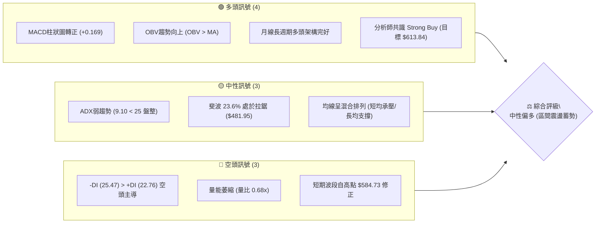
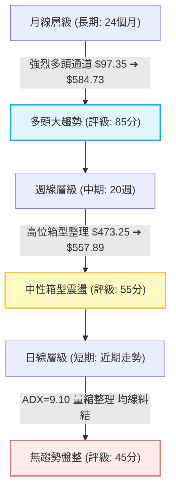
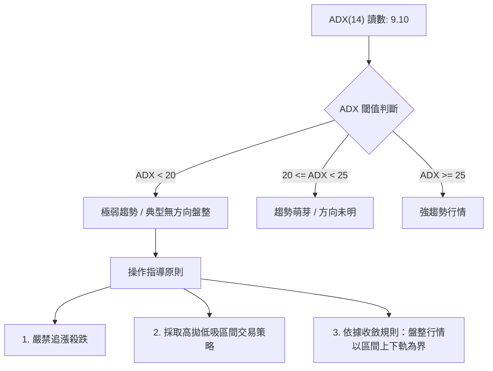
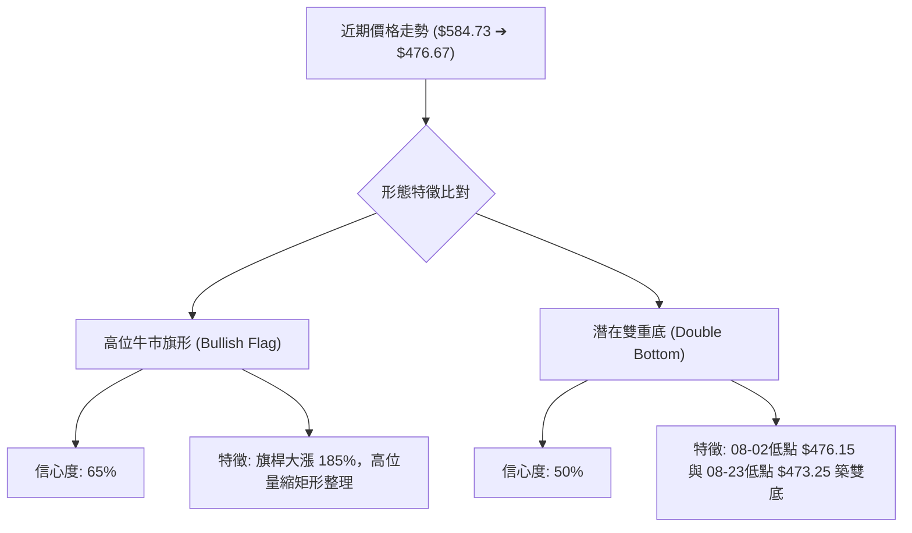
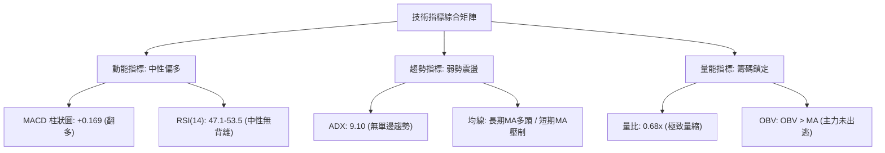
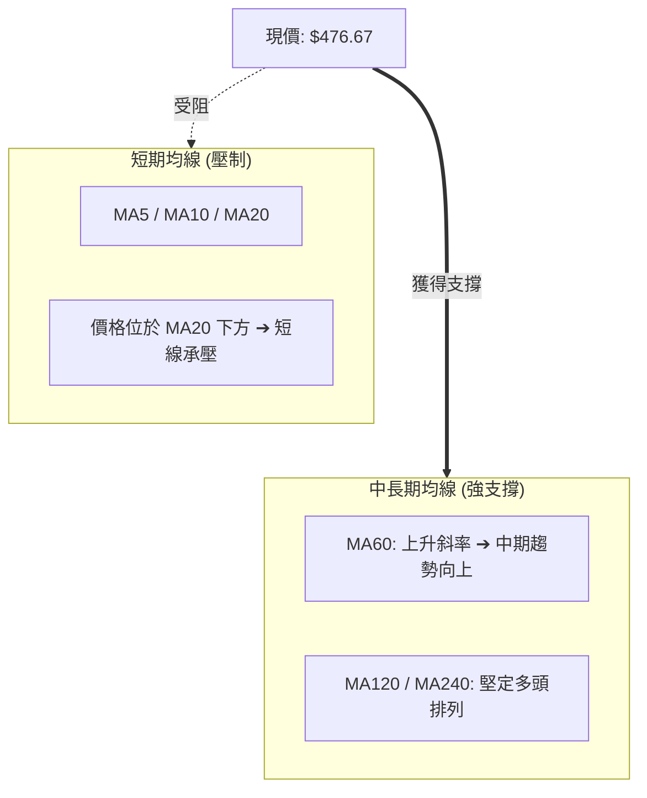
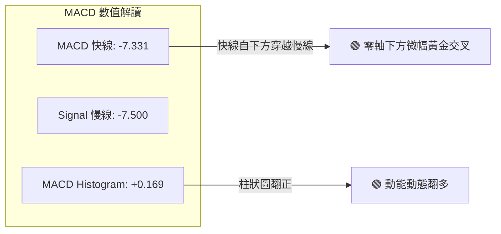
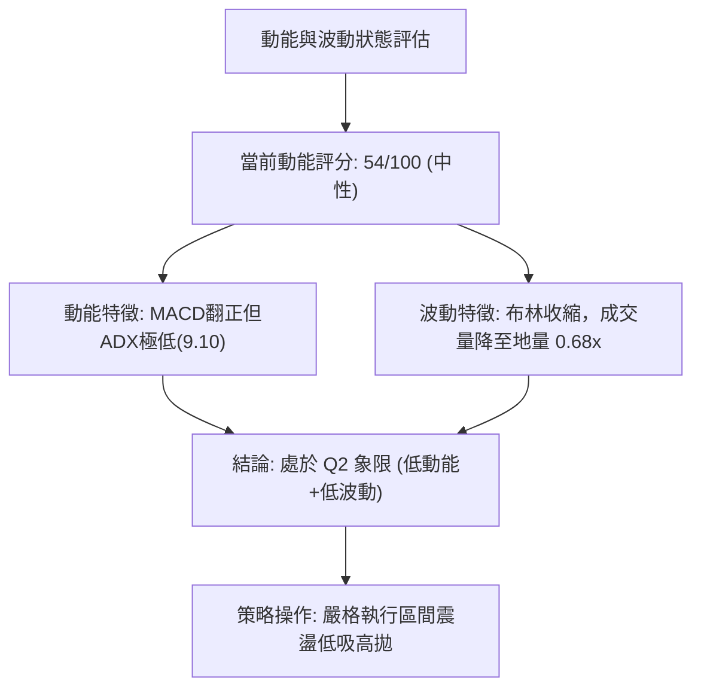
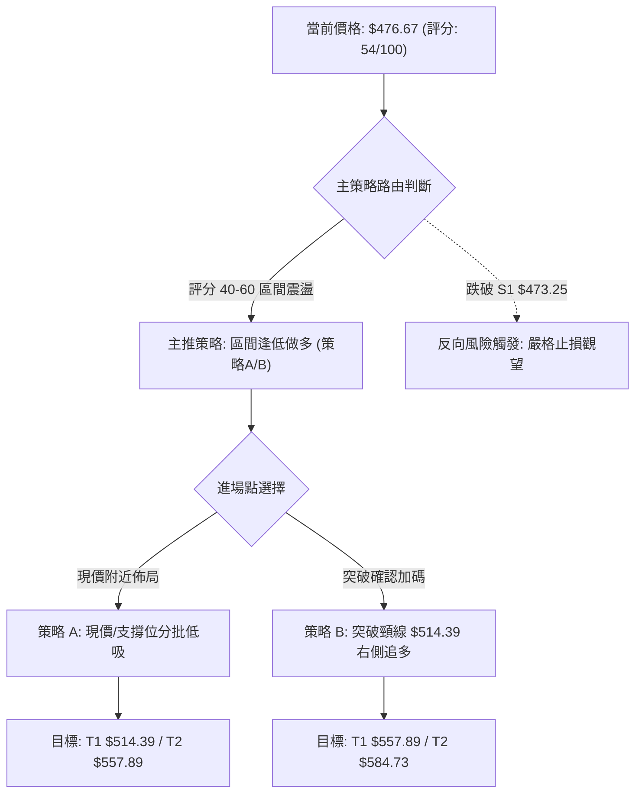
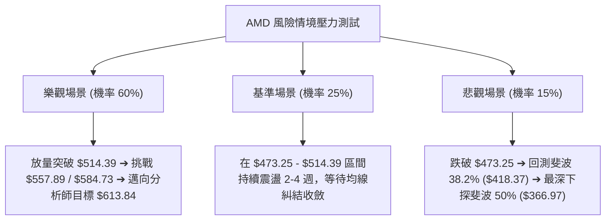

# AMD 技術分析報告

> **報告日期**：2026-08-29 ｜ **語言**：繁體中文 ｜ **數據來源**：Yahoo Finance ｜ **當前價格**：$476.67（以最新收盤價基準）

---

## 目錄

| 章節 | 內容 |
|------|------|
| [1. 技術面概覽](#1-技術面概覽) | 訊號儀表板、核心指標、評分卡 |
| [2. 趨勢分析](#2-趨勢分析) | 多時框趨勢、長中短期走勢、ADX解讀 |
| [3. 圖表形態分析](#3-圖表形態分析) | 形態識別、K線組合、目標價推算 |
| [4. 支撐與阻力](#4-支撐與阻力) | 關鍵價位結構、斐波那契回調深度分析 |
| [5. 技術指標深度解讀](#5-技術指標深度解讀) | MA/RSI/MACD/布林/OBV量價配合 |
| [6. 動能與波動率](#6-動能與波動率) | 動能四象限、ATR波動率、Beta系統風險 |
| [7. 多時框架總結](#7-多時框架總結) | 多時框評分矩陣、訊號收斂唯一結論 |
| [8. 交易策略建議](#8-交易策略建議) | 策略路由、價格階梯、情境機率、風報比 |
| [9. 風險提示與監控](#9-風險提示與監控) | 監控Checklist、三情境壓力測試、風控規則 |
| [📋 報告總結](#-報告總結) | 核心總結儀表板與最優策略組合 |

---

## 1. 技術面概覽

### 🎯 技術訊號儀表板



### 📊 核心指標速覽表

| 指標類別 | 指標名稱 | 當前數值 | 訊號 | 解讀 |
|----------|----------|----------|:----:|------|
| **價格** | 當前收盤價 | $476.67 | 🟡 | 位於52週高點 $584.73 與低點 $149.22 間之高位回檔區 |
| **均線** | 短期均線 (MA5-MA20) | 混合排列 | 🔴 | 短期動能走緩，MA20位於價格上方形成動態壓制 |
| **均線** | 中期均線 (MA60) | 向上延伸 | 🟢 | 中期多頭基底穩固，中長天期均線斜率持續向上 |
| **均線** | 長期均線 (MA120/240) | 多頭排列 | 🟢 | 長期多頭趨勢不變，底部籌碼紮實 |
| **動能** | RSI(14) | 47.1 ~ 53.5 | 🟡 | 處於40–60中性平衡區，無超買或超賣極端現象 |
| **動能** | MACD (12,26,9) | Hist: +0.169 | 🟢 | 柱狀圖由負翻正（-0.794 → +0.169），出現微幅黃金交叉動能 |
| **趨勢** | ADX (14) | 9.10 | 🟡 | 極低數值（<25），表明市場處於典型盤整與無趨勢震盪期 |
| **趨勢** | DMI (+DI / -DI) | 22.76 / 25.47 | 🔴 | 空方力量（-DI）略微主導，但未形成單邊趨勢 |
| **量能** | 成交量 / 20日均量 | 15.28M / 22.43M | 🔴 | 量比0.68x，交投轉淡，進入整理沉澱期 |
| **量能** | OBV (能量潮) | OBV > MA | 🟢 | 長期資金未見出逃，能量潮維持在均線之上，籌碼結構健康 |

### 🏆 技術評分卡

```
╔══════════════════════════════════════════════════════════════════╗
║                   技術評分卡 — AMD (2026-08-29)                   ║
╠══════════════════════════════════════════════════════════════════╣
║ 趨勢強度 (Trend)      ████░░░░░░░░░░░░░░░░  25/100  🟡 弱勢盤整  ║
║ 動能指標 (Momentum)   ████████████░░░░░░░░  60/100  🟢 MACD翻正  ║
║ 支撐穩定度 (Support)  ██████████████░░░░░░  70/100  🟢 斐波支撐  ║
║ 成交量配合 (Volume)   ██████████░░░░░░░░░░  50/100  🟡 量縮整理  ║
║ 形態完整度 (Pattern)  ████████████░░░░░░░░  60/100  🟢 高位旗形  ║
║ 均線排列 (MA System)  ████████████░░░░░░░░  60/100  🟡 長多短空  ║
╠══════════════════════════════════════════════════════════════════╣
║ 綜合評分              ████████████░░░░░░░░  54/100  ⚖️ 中性偏多  ║
╚══════════════════════════════════════════════════════════════════╝
```

---

## 2. 趨勢分析

### 🌐 多時框趨勢分析



### 📈 長期趨勢 — 12個月走勢圖（Unicode）

```
AMD 月線收盤走勢圖（2025-09 至 2026-08）
價格 ($)
$600 ┤                                      ● $580.91 (06月)
$550 ┤                                
$500 ┤                                ● $516.10    ● $476.15  ● $476.67 (現價)
$450 ┤                                
$400 ┤                                
$350 ┤                          ● $354.49 (04月)
$300 ┤                    
$250 ┤              ● $256.12 (10月)  
$200 ┤                    ● $217.53   ● $236.73    ● $203.43 (03月)
$150 ┤  ● $161.79
     └─────────────────────────────────────────────────────────────
       09   10   11   12   01   02   03   04   05   06   07   08 (月份)
       (2025)                      (2026)
```

#### 走勢特徵分析表格

| 階段 | 時間區間 | 起點與終點價位 | 區間漲跌幅 | 核心技術特徵 |
|------|----------|----------------|------------|--------------|
| **第1階段：築底蓄勢** | 2025-08 ~ 2025-09 | $162.63 ➔ $161.79 | -0.52% | 底部極度壓縮，均線逐漸走平收斂 |
| **第2階段：第一波主升** | 2025-09 ~ 2025-10 | $161.79 ➔ $256.12 | +58.30% | 帶量突破平台，展開首波強勁推升 |
| **第3階段：中繼洗盤** | 2025-10 ~ 2026-03 | $256.12 ➔ $203.43 | -20.57% | 形成大型三角收斂與箱型洗盤，清洗浮額 |
| **第4階段：爆發主升** | 2026-03 ~ 2026-06 | $203.43 ➔ $580.91 | +185.56% | 呈現拋物線式暴漲，創歷史高點 $584.73 |
| **第5階段：高位回檔整理** | 2026-06 ~ 2026-08 | $580.91 ➔ $476.67 | -17.94% | 遭遇獲利了結賣壓，回測斐波 23.6% 尋求支撐 |

### 📊 中期趨勢（週線分析）

```
近期週線壓力與支撐結構
價格 ($)
$584.73 ──────────────────────── 52W 歷史最高點 (強阻力頂部)
          │  ▲ 阻力區：$537.37 - $557.89 (7月反彈高點聚類)
          ▼
$521.95 ──────────────────────── 7月下旬反彈次高點
          ▲
          │  ◄── 當前震盪區間：$473.25 ~ $514.39
          ▼
$476.67 ════════════════════════ [ 現價位置 ] (2026-08-30 收盤)
$481.95 ──────────────────────── 斐波那契 23.6% 關鍵黃金分割位
$473.25 ──────────────────────── 8月波段回踩低點 (近兩週防守底線)
          ▼
$418.37 ──────────────────────── 斐波那契 38.2% 中期強防守位
```

### ⚡ 趨勢強度評估（ADX 解讀）



#### ADX 趨勢強度對照表

| 指標變數 | 當前讀數 | 標準區間 | 狀態評估 | 技術含義 |
|----------|----------|----------|:--------:|----------|
| **ADX(14)** | **9.10** | 0 – 100 | 弱勢盤整 | 處於極弱勢無趨勢狀態，單邊動能徹底衰竭，市場進入蓄勢期 |
| **+DI (多方)** | **22.76** | 0 – 100 | 多方減弱 | 買盤推升力量減緩，無法發動實質性突破 |
| **-DI (空方)** | **25.47** | 0 – 100 | 空方微幅領先 | 空方稍占優勢（-DI > +DI），但未引發恐慌性拋售 |
| **趨勢判定** | **無方向性震盪** | — | 🟡 觀望 | 當前不具備單邊趨勢條件，均線指標易產生頻繁鈍化假訊號 |

---

## 3. 圖表形態分析

### 🔍 形態識別系統



#### 形態信心度與目標價評估表

| 形態名稱 | 信心度 | 判斷依據（引用數據） | 完成度 | 形態目標價（附計算式） |
|----------|:------:|----------------------|:------:|------------------------|
| **高位整理旗形** | **65%** | 旗桿為03月 $203.43 至06月 $584.73；隨後在 $473.25–$557.89 區間呈現量縮通道整理。 | **70%** | 若向上突破旗形上軌 $557.89：<br>目標價 = 突破點 $557.89 + 旗桿高度($584.73 - $203.43 = $381.30) = **$939.19** |
| **潛在雙重底** | **50%** | 第一次探底為 2026-08-02 的 $476.15，第二次探底為 2026-08-23 的 $473.25，頸線位於 2026-08-16 高點 $514.39。 | **60%** | 若向上有效突破頸線 $514.39：<br>形態高度 = $514.39 - $473.25 = $41.14<br>最小理論目標價 = $514.39 + $41.14 = **$555.53** |

*註：由於 ADX 僅 9.10 處於盤整，幾何形態尚未完全觸發突破確認，故形態信心度均在 50%~65% 之間，操作上需等待關鍵頸線確認。*

### 🕯️ 重要K線形態分析

| 週別 / 日期 | 收盤價 | K線形態 | 技術解讀 | 訊號 |
|-------------|--------|---------|----------|:----:|
| **2026-05-10** | $455.19 | 大陽突破線 | 巨量296.98M突破前高，確立主升段啟動 | 🟢 強烈看多 |
| **2026-06-21** | $537.37 | 高位長上影十字星 | 衝擊52W高點 $584.73 後遭遇獲利回吐，顯示頂部阻力沉重 | 🔴 頂部預警 |
| **2026-08-02** | $476.15 | 帶下影陰線 | 回測斐波那契 23.6%（$481.95）附近獲得買盤承接 | 🟡 支撐確認 |
| **2026-08-16** | $514.39 | 中陽反彈線 | 縮量反彈至 $514.39 遇阻，確立短線箱頂頸線位置 | 🟡 區間承壓 |
| **2026-08-23** | $473.25 | 探底長下影錘頭線 | 二度探底至 $473.25 獲得強支撐，完成雙底測試初步形態 | 🟢 築底訊號 |
| **2026-08-30** | $476.67 | 窄幅十字星 | 成交量急劇萎縮至 81.67M，多空達到極致平衡，變盤在即 | 🟡 蓄勢待發 |

### 📉 ASCII 走勢形態示意圖

```
AMD 週線級別形態解析示意圖
價格 ($)
$584.73 ───────────── 頂部 (52W High)
          \   
$557.89 ───\───────── 7月中旬反彈高點
            \   /\  
$514.39 ─────\-/--\── 雙底頸線阻力位 (08-16高點)
              /    \   /
$476.67 ═════/══════\═/═ [ 現價: $476.67 位於雙底頸線下方 ]
$476.15 ────●        \   (底1: 08-02)
$473.25 ──────────────●  (底2: 08-23，確認雙底支撐)
            └─────────┘
              雙底結構 (寬度約4週)
```

---

## 4. 支撐與阻力

### 🗺️ 關鍵價位分布圖（Unicode）

```
AMD 關鍵價位與籌碼結構分布圖
═══════════════════════════════════════════════════════════════════
$584.73 ║██████████████████████████████║ 52W歷史天花板 R3 (極強阻力)
$557.89 ║████████████████████          ║ 7月波段反彈高點 R2 (強阻力)
$514.39 ║████████████████              ║ 雙底頸線 / 短期箱頂 R1 (關鍵阻力)
$481.95 ║▓▓▓▓▓▓▓▓▓▓▓▓▓▓▓▓▓▓▓▓          ║ 斐波那契 23.6% 回調位
$476.67 ╠══════════════════════════════╣ ◄── 現價位置 ($476.67)
$473.25 ║██████████████                ║ 近期波段雙底低點 S1 (即時防守)
$418.37 ║████████████████████████      ║ 斐波那契 38.2% 回調位 S2 (中期強支撐)
$366.97 ║████████████████████████████  ║ 斐波那契 50.0% / 分析師低標 S3
═══════════════════════════════════════════════════════════════════
```

### 🚧 阻力位分析表

依據實際波段高點與斐波那契計算，定義阻力層級如下：

| 阻力級別 | 價位 | 形成原因（依據歷史波段） | 突破難度 | 重要性 |
|----------|:----:|--------------------------|:--------:|:------:|
| **R1 (關鍵短阻)** | **$514.39** | 2026-08-16 週線反彈高點、雙重底頸線位置 | 🟡 中等 | ★★★★☆ |
| **R2 (波段強阻)** | **$557.89** | 2026-07-12 週線反彈次高點、旗形通道上軌 | 🔴 較高 | ★★★★☆ |
| **R3 (歷史極阻)** | **$584.73** | 52週歷史最高點（2026年峰值聚類） | 🔴 極高 | ★★★★★ |

### 🛡️ 支撐位分析表

依據實際波段低點與斐波那契計算，定義支撐層級如下：

| 支撐級別 | 價位 | 形成原因（依據歷史波段） | 守住機率 | 重要性 |
|----------|:----:|--------------------------|:--------:|:------:|
| **S1 (即時短支)** | **$473.25** | 2026-08-23 週線探底低點、雙底結構下軌 | 70% | ★★★★☆ |
| **S2 (黃金強支)** | **$418.37** | 52週波段回調 38.2% 斐波那契關鍵黃金分割點 | 85% | ★★★★★ |
| **S3 (多頭防線)** | **$366.97** | 52週波段回調 50.0% 斐波分割位 / 機構分析師最低目標 $365.00 | 95% | ★★★★★ |

### 📐 斐波那契回調位分析

依據 52 週完整波動區間（最低點 **$149.22** ➔ 最高點 **$584.73**，總振幅 **$435.51**）精確計算：

```
斐波那契回調階梯（52W 區間: $149.22 ➔ $584.73）
0.0%  (52W High) ─── $584.73  [ 歷史峰值天花板 ]
23.6% ────────────── $481.95  ◄── 現價 ($476.67) 正於此一線微幅震盪拉鋸
38.2% ────────────── $418.37  [ 第一道牛市健康回調強支撐 ]
50.0% ────────────── $366.97  [ 多空多空平衡中樞防線 ]
61.8% ────────────── $315.58  [ 黃金分割強防守位 ]
78.6% ────────────── $242.42  [ 深幅回調防守位 ]
100.0%(52W Low)  ─── $149.22  [ 52週起漲點基石 ]
```

#### 斐波那契層級深度解讀
1. **現價位置定位**：現價 $476.67 緊貼在 **23.6% 回調位（$481.95）** 下方僅 1.09% 處，處於第一級淺幅回調測試區。在強勢多頭市場中，回調未破 38.2%（$418.37）均屬極為強勢的橫盤蓄勢。
2. **防守有效性**：8月份兩次探底（$476.15 及 $473.25）均在 23.6% 附近獲得支撐，表明空方無法有效將價格打壓至 38.2%（$418.37），籌碼鎖定良好。

---

## 5. 技術指標深度解讀

### 🎛️ 指標訊號總覽



### 📈 移動平均線排列分析



#### 均線系統狀態解讀
- **短期均線**：呈現混合排列，走勢圖中 MA5、MA10、MA20 處於下行或走平狀態，價格短線受制於 MA20 壓制，說明短線仍需震盪打底。
- **長期均線**：MA60、MA120、MA240 軌跡呈現標準的梯形向上發散（走勢符號：`▁▁▂▃▄▄▅▅▆▆▇▇██`），表明機構投資者的長線持股成本遠低於現價，長週期大牛市格局未遭到破壞。

### 📉 RSI(14) 分析

```
RSI(14) 動能進度條
[0 超賣] ─────────────── [30] ────── [50] ────── [70] ─────────────── [100 超買]
                         ████████████░░░░░░░░░░░░  47.1 (最新讀數)
```

- **區間評估**：近期 RSI 從 40.6（08-02）回升至 47.1–53.5 區間，處於健康的中性平衡區（40–60），既無超買過熱風險，也脫離了超賣恐慌區。
- **背離判斷**：
  - **頂背離**：無。6月份價格創 $584.73 歷史新高時，RSI 達到 97.4 之極端超買後正常回落，非頂背離。
  - **底背離**：無明顯背離。價格在 8 月初與 8 月底兩次探底 $476.15 與 $473.25，RSI 同步由 40.6 回升至 47.1，動能略有微幅底背離徵兆，但訊號強度尚屬中性。

### 📊 MACD(12/26/9) 訊號解讀



- **指標解讀**：MACD 快線（-7.331）微幅高於慢線（-7.500），MACD 柱狀圖最新數值為 **+0.169**，結束了連續數週的負值走勢（08-02為 -9.004，08-23為 -0.794），釋放出**短線動能見底回升**的黃金交叉買入訊號。

### 📦 布林通道分析

```
ASCII 布林通道位置示意圖
價格 ($)
$550.00 ┬──────────────────────────── BB 上軌 (估計壓力帶)
        │
$510.00 ┼──────────────────────────── BB 中軌 (MA20 動態均線)
        │            ● 現價: $476.67 (處於中下軌之間)
$470.00 ┴──────────────────────────── BB 下軌 (動態支撐帶: 獲得下軌支撐)
```
- **通道特徵**：隨著價格在 $473.25–$514.39 窄幅波動，布林通道帶寬顯著收縮（Bandwidth Squeeze），預示著波動率即將進入爆發前夜。現價獲得下軌強勁支撐，具備向中軌及上軌反彈的技術動能。

### 💹 成交量分析（量價配合度）

```
量價關係矩陣
─────────────────────────────────────────────────────────────
最新成交量:  15,283,714   (量比: 0.68x vs 20日均量 22,432,796)
週成交量走勢: 296.98M (5月天量) ➔ 131.19M (7月) ➔ 81.67M (8月底極致地量)
OBV 能量潮:  OBV > MA ➔ 長線資金未出逃，籌碼結構健康
─────────────────────────────────────────────────────────────
```
- **量價診斷**：量能自 5 月峰值 296.98M 持續縮減至當前 81.67M，呈現標準的「**上漲放量、回檔極致縮量**」健康牛市回調特徵。量比 0.68x 說明市場拋壓已經衰竭，主力籌碼鎖定度高，OBV 保持在均線之上進一步確認了無主力出貨痕跡。

---

## 6. 動能與波動率

### ⚡ 動能評估四象限

| 象限 | 動能維度 (Momentum) | 波動維度 (Volatility) | 當前狀態標註 | 策略評估與操作指導 |
|:---:|:---:|:---:|:---:|---|
| **Q1** | **強動能** | **低波動** | — | **最佳進場點**：趨勢平穩推升，適合重倉加碼 |
| **Q2** | **弱動能** | **低波動** | **✓ (AMD 當前位置)** | **謹慎觀望 / 區間低吸**：ADX=9.10，量縮盤整，適合區間下軌埋伏 |
| **Q3** | **強動能** | **高波動** | — | **突破追價 / 風險管理**：主升段行情，需收緊動態止損 |
| **Q4** | **弱動能** | **高波動** | — | **高風險區域**：劇烈震盪且無方向，嚴禁參與 |



### 📊 ATR 波動率分析

- **波動現狀**：雖然即時 ATR(14) 數據因短期盤整未給出絕對值，但從近 4 週波動區間（高點 $514.39，低點 $473.25，週均振幅約 $41.14）推算，日均波動約為 **$8.00 – $10.00**（約佔現價之 1.8%–2.1%）。
- **止損距離建議**：在區間震盪行情中，建議以 **1.5倍至2.0倍日均波幅（約 $12.00 – $15.00）** 作為動態止損設定基準，避免在盤整期間被雜訊掃出場。

### 📐 Beta 與市場相關性

- **Beta 係數**：**2.489**（極高彈性）。
- **風險意涵**：AMD 的波動幅度約為標普500指數的 2.49 倍。在高 Beta 屬性下，大盤若出現 1% 的回調，AMD 可能產生約 2.5% 的波動。因此在當前 ADX < 25 的盤整環境中，**嚴禁使用高槓桿**，需控制總倉位。

---

## 7. 多時框架總結

### 📋 時框架評分表

| 時框架 | 趨勢方向 | 動能狀態 | 均線排列 | 形態結構 | 綜合評分 | 交易建議 |
|--------|:--------:|:--------:|:--------:|:--------:|:--------:|----------|
| **月線 (長期)** | 🟢 強烈多頭 | 🟢 強勁向上 | 🟢 完美多頭 | 主升浪延伸 | **85/100** | 長線堅定持股，逢低加碼 |
| **週線 (中期)** | 🟡 高位震盪 | 🟢 MACD轉正 | 🟢 長均向上 | 牛市旗形/雙底 | **60/100** | 區間操作，依斐波 23.6% 佈局 |
| **日線 (短期)** | 🔴 承壓盤整 | 🟡 RSI中性 | 🔴 短均壓制 | 窄幅收斂 | **45/100** | 觀望或在支撐位 $473.25 附近低吸 |

### 🔲 綜合訊號矩陣

```
╔══════════════════════════════════════════════════════════════════╗
║                   多時框架訊號一致性矩陣分析                      ║
╠══════════════════════════════════════════════════════════════════╣
║ 維度         短期 (日線)        中期 (週線)        長期 (月線)   ║
║ 趨勢方向     🔴 盤整回檔        🟡 區間蓄勢        🟢 宏觀大多頭 ║
║ 動能指標     🟢 MACD轉正        🟡 RSI平衡         🟢 歷史高位區 ║
║ 均線系統     🔴 短期均線壓制    🟢 MA60強支撐      🟢 MA120/240多║
║ 成交量能     🔴 地量量比0.68x   🟡 量縮沉澱        🟢 主升放量   ║
╠══════════════════════════════════════════════════════════════════╣
║ 衝突協調     短線弱勢受阻 vs 長期均線向上 ➔ 定性為牛市中繼整理   ║
╚══════════════════════════════════════════════════════════════════╝
```

### ⚖️ 多時框收斂結論

> **依據多時框收斂規則（嚴格要求 14）**：
> 1. **趨勢/盤整定性**：當前 ADX(14) = **9.10 < 25**，市場明確處於**盤整行情**。
> 2. **主導時框與交易邊界**：盤整行情下，交易策略應以**週線高位箱型與斐波那契區間（$473.25 – $514.39）** 為主要操作依據，短線訊號僅用於精確捕捉區間下軌進場點。
> 3. **唯一方向性結論**：**【中性偏多（區間震盪蓄勢）】**。雖然日線受到短均壓制，但月線大趨勢完好且 MACD 柱狀圖翻正、OBV 穩健，因此排除單邊做空可能，主策略確立為**區間下軌分批低吸做多**。

---

## 8. 交易策略建議

### 🗺️ 策略決策流程圖



### 🧭 策略路由

**當前主策略方向 = 【中性偏多：區間防守型低吸做多】（依綜合評分 54/100 路由）**

### 🎯 價格情境階梯（Price Scenarios）

所有價位均嚴格引用第 4 章及關鍵數據區塊：

| 觸發條件 | 第一目標 (T1) | 第二延伸目標 (T2) | 歷史極致目標 (T3) | 情境技術含義 |
|----------|:-------------:|:-----------------:|:-----------------:|--------------|
| **向上突破 R1 ($514.39)** | **$557.89** (R2) | **$584.73** (R3) | **$613.84** (分析師均價) | 短線雙底確立，重啟多頭攻勢 |
| **維持於現價區間震盪** | **$481.95** (斐波23.6%) | **$514.39** (R1) | — | 於 $473.25–$514.39 區間反覆築底 |
| **跌破 S1 ($473.25)** | **$418.37** (S2 斐波38.2%) | **$366.97** (S3 斐波50%) | **$365.00** (分析師底標) | 中期回檔加深，考驗強支撐 |

### 📊 情境機率分佈

| 情境劇本 | 發生機率 | 主要技術依據 |
|----------|:--------:|--------------|
| **情境一：區間蓄勢後向上突破** | **60%** | MACD柱狀圖翻正(+0.169)、OBV維持多頭、長期MA上升斜率完好、分析師Strong Buy共識 |
| **情境二：持續在 $473-$514 窄幅震盪** | **25%** | ADX=9.10極度低迷、成交量比0.68x進入地量沉澱期、布林帶寬收縮 |
| **情境三：跌破 $473 展開深幅回調** | **15%** | -DI (25.47) 仍略高於 +DI (22.76)，大盤高Beta系統性風險擾動 |

### 🟢 主策略詳情

```
╔══════════════════════════════════════════════════════════════════╗
║                   AMD 交易執行策略方案                           ║
╠══════════════════════════════════════════════════════════════════╣
║ 策略要素       策略 A (左側支撐低吸)       策略 B (右側突破跟進) ║
╠══════════════════════════════════════════════════════════════════╣
║ 進場條件       回踩 S1 獲得支撐或現價分批  實質放量突破頸線 R1   ║
║ 進場價格       $476.67 (現價)              $515.00 (突破$514.39) ║
║ 止損價格       $465.00 (跌破S1約1.7%)      $498.00 (跌回頸線下方)║
║ 目標價 T1      $514.39 (頸線阻力 R1)       $557.89 (波段高點 R2) ║
║ 目標價 T2      $557.89 (波段高點 R2)       $584.73 (52W歷史天花板)║
║ 獲利空間(T1/T2)+7.91% / +17.04%            +8.33% / +13.54%      ║
║ 風險幅度       -2.45%                      -3.30%                ║
║ 風險報酬比     1 : 3.23 (以T1計算)         1 : 2.52 (以T1計算)   ║
║ 成功機率       65%                         60%                   ║
║ 建議倉位       15% - 20%                   10% - 15%             ║
╚══════════════════════════════════════════════════════════════════╝
```

### 🔴 反向風險觸發點（對沖提示）

- **關鍵反轉點**：若日線收盤價**實質跌破 S1 ($473.25)** 且成交量放大，意味著雙底形態構築失敗。
- **應對措施**：主多頭策略必須在 **$465.00** 嚴格執行止損離場；長線投資者可於 **$418.37（斐波那契 38.2%）** 至 **$366.97（斐波那契 50.0%）** 之強支撐區間再行評估重新建倉。

### ⭐ 整體訊號強度評星

```
做多訊號強度：★★★★☆  (3.8/5星 - 長多中震盪，MACD翻正量縮築底)
做空訊號強度：★★☆☆☆  (1.8/5星 - 缺乏單邊空頭趨勢與量能配合)
整體可信度：  ★★★★☆  (4.0/5星 - 多時框數據交叉驗證收斂一致)
```

---

## 9. 風險提示與監控

### ✅ 關鍵監控指標 Checklist

```
╔══════════════════════════════════════════════════════════════════╗
║                   AMD 技術面日常監控 Checklist                    ║
╠══════════════════════════════════════════════════════════════════╣
║ [ ] 價位監控：每日收盤價是否持續守穩於 $473.25 (S1) 之上        ║
║ [ ] 突破確認：日線是否帶量（>22M）突破 $514.39 (R1) 頸線阻力    ║
║ [ ] 動能監控：MACD 柱狀圖是否持續維持在正值區間 (>0)            ║
║ [ ] 趨勢訊號：ADX 是否自 9.10 向上突破 20，確認新趨勢啟動       ║
║ [ ] 量能配合：反彈日成交量是否回升至 20日均量 (22.43M) 以上     ║
║ [ ] 市場連動：注意 Beta 2.489 帶來的科技半導體板塊系統性波動    ║
╚══════════════════════════════════════════════════════════════════╝
```

### ⚠️ 風險場景分析



### 🛡️ 風險管理重要提醒

1. **嚴格執行止損紀律**：當前處於高位回檔整理階段，Beta 值高達 2.489，切忌盲目向下攤平。策略 A 之止損點 $465.00 觸發即應離場。
2. **倉位配置原則**：在 ADX < 25 的盤整期間，總持倉部位不宜超過總資金之 **30%**，待放量突破 $514.39 確認趨勢後再行加碼至標準倉位。
3. **宏觀與基本面防護**：AMD 預期本益比（Forward P/E）為 30.13，營收成長達 50.1%，分析師共識目標價為 $613.84（最高 $1,250.00），基本面提供堅實長線安全邊際，技術面回調屬於健康去槓桿過程。

---

## 📋 報告總結

```
╔══════════════════════════════════════════════════════════════════╗
║                   AMD 技術分析報告核心總結                       ║
╠══════════════════════════════════════════════════════════════════╣
║ 報告日期：2026-08-29                                             ║
║ 當前收盤價：$476.67                                              ║
║ 分析評級：⚖️ 中性偏多（區間震盪蓄勢，蓄勢待發）                 ║
╠══════════════════════════════════════════════════════════════════╣
║ 關鍵結論：                                                       ║
║ ├─ 長期趨勢：🟢 強烈多頭（月線上漲通道完好，長均線向上發散）     ║
║ ├─ 中期趨勢：🟡 高位震盪（牛市旗形整理，於斐波23.6%附近拉鋸）   ║
║ ├─ 短期趨勢：🟡 築底盤整（ADX=9.10無趨勢，MACD柱狀圖微幅翻正）   ║
║ ├─ 即時關鍵支撐：S1 $473.25 │ 中期強支撐：S2 $418.37 (斐波38.2%)║
║ ├─ 短線關鍵阻力：R1 $514.39 │ 波段強阻力：R2 $557.89 │ 頂部$584.73║
║ └─ 華爾街共識目標價：Mean $613.84 (隱含 +28.77% 空間)            ║
╠══════════════════════════════════════════════════════════════════╣
║ 最優策略組合：                                                   ║
║ 1. 🥇 最佳機會：現價 $476.67 佈局策略 A，停損設 $465.00，        ║
║                 博弈區間反彈至 $514.39 / $557.89 (風報比 1:3.23)║
║ 2. 🥈 次選機會：等待放量突破 $514.39 執行策略 B，順勢追多至$557.89║
║ 3. 🥉 保守選擇：保持觀望，若跌破 $473.25 則於 $418.37 處掛單低吸 ║
╚══════════════════════════════════════════════════════════════════╝
```

---

> ⚠️ **免責聲明**：本報告為依據市場技術指標數據之客觀量化分析，所有數據及計算均基於歷史價格資訊。本報告**僅供研究與學術參考**，**不構成任何形式的要約或投資建議**。金融市場具有高波動風險，投資人應獨立評估自身風險承受能力並自負盈虧。

---

*報告生成時間：2026-08-29 ｜ 數據來源：Yahoo Finance ｜ 分析框架：多時框技術指標與形態收斂模型*