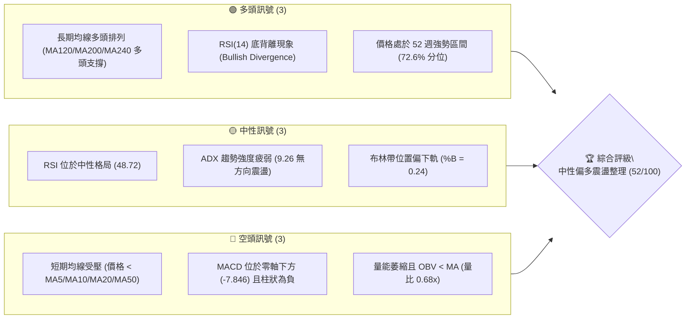
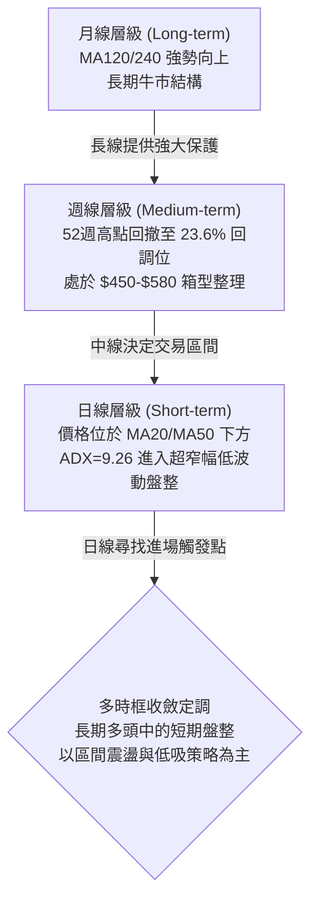
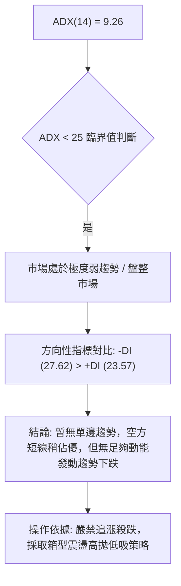
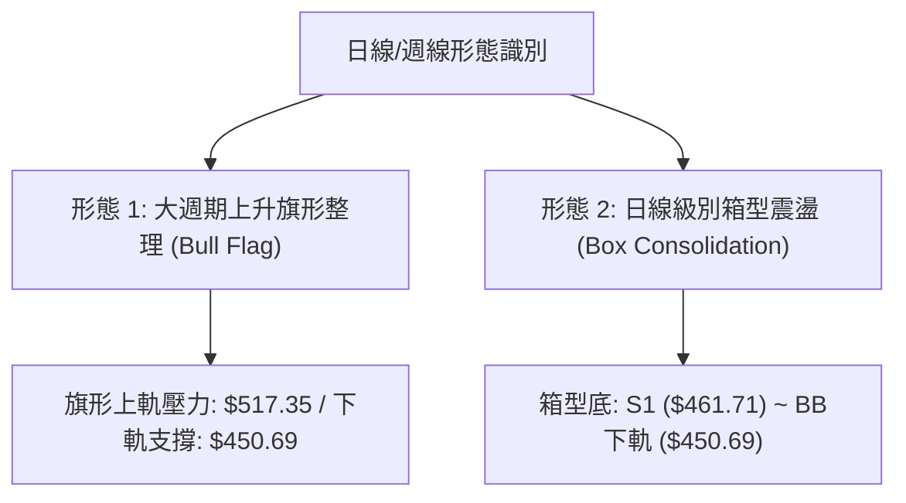
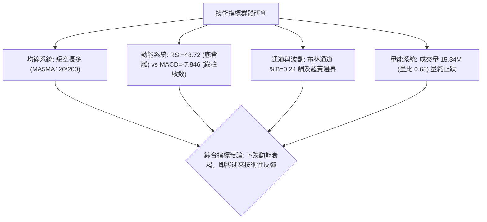
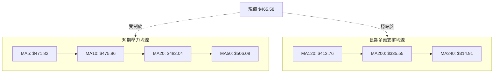
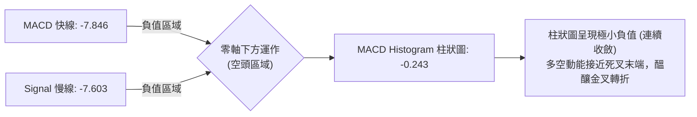
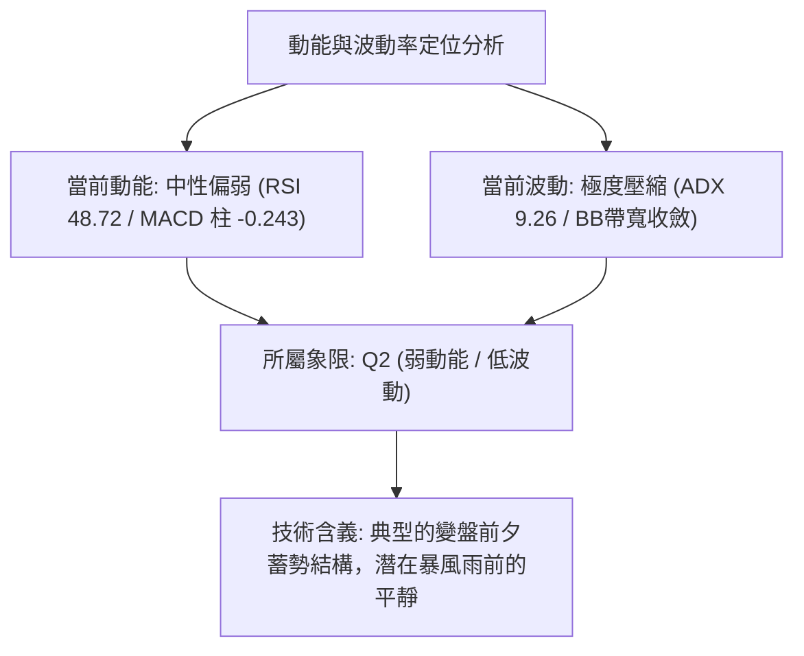
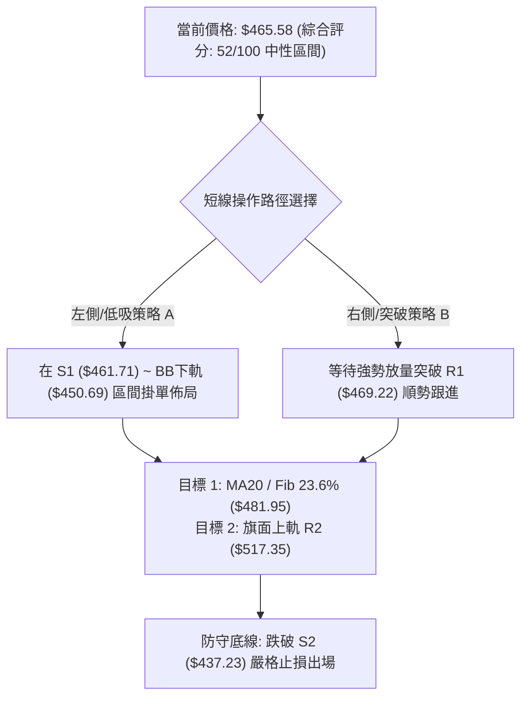
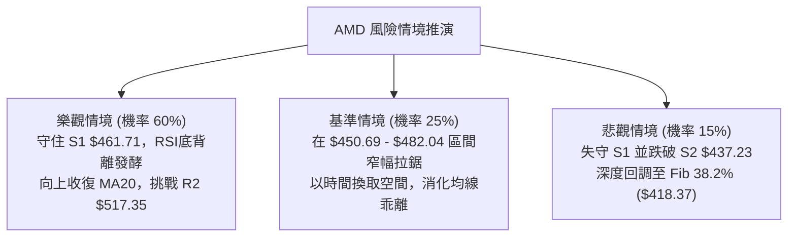

# AMD 技術分析報告

> **報告日期**：2026-08-30 ｜ **語言**：繁體中文 ｜ **數據來源**：Yahoo Finance ｜ **當前價格**：$465.58

---

## 目錄

| 章節 | 內容 |
|------|------|
| [1. 技術面概覽](#1-技術面概覽) | 訊號儀表板、核心指標、評分卡 |
| [2. 趨勢分析](#2-趨勢分析) | 多時框趨勢、長中短期走勢 |
| [3. 圖表形態分析](#3-圖表形態分析) | 形態識別、K線組合、目標價 |
| [4. 支撐與阻力](#4-支撐與阻力) | 關鍵價位、斐波那契回調 |
| [5. 技術指標深度解讀](#5-技術指標深度解讀) | MA/RSI/MACD/布林/成交量 |
| [6. 動能與波動率](#6-動能與波動率) | 動能評估、ATR、Beta |
| [7. 多時框架總結](#7-多時框架總結) | 時框架評分矩陣 |
| [8. 交易策略建議](#8-交易策略建議) | 多空策略、風險報酬比 |
| [9. 風險提示與監控](#9-風險提示與監控) | 監控指標、風險場景 |
| [📋 報告總結](#-報告總結) | 核心總結與分析師觀點 |

---

## 1. 技術面概覽

### 🎯 技術訊號儀表板



---

### 📊 核心指標速覽表

| 指標類別 | 指標名稱 | 當前數值 | 訊號 | 解讀 |
|:---|:---|:---|:---:|:---|
| **價格** | 當前價格 | $465.58 | 🟡 | 位於52週高低區間 72.6% 位置，處於高位回檔整理期 |
| **短期均線** | MA20 (月線) | $482.04 | 🔴 | 價格在MA20下方 -3.41%，短線反彈首道均線壓力 |
| **中期均線** | MA50 (季線) | $506.08 | 🔴 | 價格在MA50下方 -8.00%，中期多空分水嶺尚未收復 |
| **長期均線** | MA200 (年線) | $335.55 | 🟢 | 價格在MA200上方 +38.75%，長期牛市基底穩固 |
| **動能** | RSI(14) | 48.72 | 🟢 | 處於40–50中性修復區間，已出現日線級別底背離訊號 |
| **趨勢** | MACD (12,26,9) | -7.846 / -7.603 | 🔴 | 快慢線於零軸下方，Hist -0.243 負值收斂中 |
| **趨勢強度**| ADX(14) | 9.26 | 🟡 | ADX < 25 表明處於極低波動盤整，無單邊趨勢行情 |
| **通道狀態**| Bollinger Bands | $450.69 ~ $513.38 | 🟡 | %B = 0.24，價格接近下軌具備技術性均值回歸支撐 |
| **波動** | ATR(14) | $19.14 (4.11%) | 🟡 | 每日平均震盪幅度充足，提供區間波段交易空間 |
| **成交量** | Volume / 20MA | 15.34M / 22.44M | 🔴 | 量比 0.68x，量能萎縮且 OBV 低於均線，買盤追價意願謹慎 |

---

### 🏆 技術評分卡

```
╔══════════════════════════════════════════════════════════════════╗
║                   技術評分卡 — AMD (2026-08-30)                 ║
╠══════════════════════════════════════════════════════════════════╣
║  趨勢強度 (ADX=9.26)     ████░░░░░░░░░░░░░░░░  20/100  🔴 盤整無勢 ║
║  動能指標 (RSI/MACD)     ██████████░░░░░░░░░░  50/100  🟡 底背待發 ║
║  支撐穩定度 (S1/S2/Fib)  ██████████████░░░░░░  70/100  🟢 買盤托底 ║
║  成交量配合 (OBV/Volume) ██████░░░░░░░░░░░░░░  30/100  🔴 量能萎縮 ║
║  形態完整度 (箱型整理)   ████████████░░░░░░░░  60/100  🟡 區間收斂 ║
║  均線排列 (長多短空)     ██████████████░░░░░░  70/100  🟢 長多護航 ║
╠══════════════════════════════════════════════════════════════════╣
║  綜合評分                ██████████░░░░░░░░░░  52/100  中性整理   ║
╚══════════════════════════════════════════════════════════════════╝
```

---

## 2. 趨勢分析

### 🌐 多時框趨勢分析



---

### 📈 長期趨勢 — 12個月走勢圖（Unicode）

```
AMD 月線走勢圖（過去12個月：2025-08 至 2026-08）
價格 ($)
$585 ┤                                                 ● (2026-06 $580.91)
$520 ┤                                           ●     │
$465 ┤                                           │     │     ●     ●←現價 $465.58
$355 ┤                                     ●     │     │     │     │
$250 ┤               ●                     │     │     │     │     │
$200 ┤               │     ●     ●   ●     │     │     │     │     │
$160 ┤   ●     ●     │     │     │   │     │     │     │     │     │
     └─────────────────────────────────────────────────────────────────
       25-08 25-09 25-10 25-11 25-12 26-01 26-02 26-03 26-04 26-05 26-06 26-07 26-08
```

#### 走勢特徵分析表格

| 階段週期 | 時間區間 | 收盤價格變化 | 漲跌幅 | 核心走勢特徵與技術含義 |
|:---|:---|:---:|:---:|:---|
| **第一階段：底部啟動** | 2025-08 → 2025-10 | $162.63 → $256.12 | +57.49% | 放量突破長期底部頸線，完成大週期雙底反轉。 |
| **第二階段：中期蓄勢** | 2025-11 → 2026-03 | $217.53 → $203.43 | -6.48% | 在 $200–$236 區間構築堅實籌碼平台，洗盤徹底。 |
| **第三階段：主升浪暴發** | 2026-04 → 2026-06 | $354.49 → $580.91 | +185.56% | 爆發性主升浪，單月推升至歷史新高 $584.73。 |
| **第四階段：高位修正** | 2026-07 → 2026-08 | $476.15 → $465.58 | -19.85% | 獲利盤了結回調至 23.6% 斐波那契回調位，量能收縮。 |

---

### 📊 中期趨勢（週線分析）

中期走勢自 2026 年 6 月創下高點 $584.73 後進入 ABC 浪回調修復。近期收盤價連續數週在 $465–$483 區間尋求支撐。週線成交量從高峰期 2.96 億股驟降至當前 8,173 萬股，呈現標準「量縮回洗」特徵。

```
中期阻力與支撐示意圖：
$584.73 ──────── 52W High (0.0% Fib) [強阻力]
   │
$517.35 ──────── R2 / MA50 阻力帶 [中期空頭防線]
   │
$482.04 ──────── MA20 / Fib 23.6% ($481.95) [多空爭奪中樞]
   │  ◄── 當前現價 $465.58
$461.71 ──────── S1 波段低點 [短線關鍵支撐]
   │
$437.23 ──────── S2 核心支撐 [中期防守底線]
   │
$335.55 ──────── MA200 牛熊分界線 [長線終極支撐]
```

---

### ⚡ 趨勢強度評估（ADX 解讀）



| 指標參數 | 數值 | 狀態區間 | 技術解讀 |
|:---|:---:|:---:|:---|
| **ADX(14)** | **9.26** | < 20 (極弱勢/盤整) | 趨勢動能徹底衰竭，市場進入低波動收斂盤整期。 |
| **+DI (多方方向線)** | **23.57** | 弱勢反彈區間 | 多頭進攻力道不足，未達強勢門檻 (30以上)。 |
| **-DI (空方方向線)** | **27.62** | 輕微主導區間 | 空頭佔據邊際優勢，但缺乏趨勢性賣壓推動。 |
| **市場狀態定調** | **無趨勢盤整** | **區間震盪交易模式** | **主導規則：以布林通道與關鍵支撐阻力為交易邊界**。 |

---

## 3. 圖表形態分析

### 🔍 形態識別系統



#### 形態識別信心度評估表

| 形態名稱 | 形態信心度 | 判斷依據（引用精確數據） | 形態完成度 | 目標價（附嚴謹計算式） |
|:---|:---:|:---|:---:|:---|
| **高位上升旗形 (Bull Flag)** | **75%** | 旗桿從 $203.43 (2026-03) 飆升至 $584.73；旗面在 $450.69–$517.35 區間量縮回調，量能萎縮至 81.73M。 | 70% (回調收斂末端) | **旗形突破目標** = 突破點 R2 ($517.35) + 旗桿高度 ($584.73 - $203.43 = $381.30) = **$898.65**（中長線大週期目標） |
| **矩形箱體震盪 (Box Range)** | **85%** | 上軌受阻於 R2 $517.35 / MA50 $506.08；下軌多次於 S1 $461.71 及 BB下軌 $450.69 獲得支撐。 | 90% (即將選擇方向) | **箱體突破目標** = 頸線 R1 ($469.22) + 箱體高度 ($469.22 - $450.69 = $18.53) = **$487.75** (短線目標) |

---

### 🕯️ 重要K線形態分析

| 週期/月份 | 收盤價 | K線形態 | 解讀 | 技術訊號 |
|:---|:---:|:---|:---|:---:|
| **2026-06** | $580.91 | **高位射擊之星 / 長上影陰線** | 測試歷史高點 $584.73 後遭遇強大獲利回吐賣壓。 | 🔴 頂部短線力竭 |
| **2026-07** | $476.15 | **大陰回調線** | 快速下殺回補獲利缺口，週成交量高達 1.63 億股。 | 🔴 空頭宣洩 |
| **2026-08 (W3)** | $514.39 | **假突破長陽** | 上攻挑戰 MA50 $506.08 失敗，量能僅 1.00 億股出現量價背離。 | 🟡 誘多反轉 |
| **2026-08 (W5)** | $465.58 | **極致量縮十字星陀螺線** | 週量降至 8,173 萬股，賣壓徹底收斂，S1 $461.71 支撐浮現。 | 🟢 變盤築底訊號 |

---

### 📉 ASCII 走勢形態示意圖

```
AMD 日線與週線結構形態示意圖
價格 ($)
$584.73 ─────────────── 旗桿頂部 (52W High)
        ╲
$530.13  ╲ ──────────── 阻力 R3
          ╲
$517.35    ●─────────── 旗面上軌 / 阻力 R2
            ╲     ●
$482.04 ─────╲───╱───── MA20 / 布林中軌
              ╲ ╱
$465.58 ───────●─────── 當前價格 (旗面下緣支撐測試)
              ╱
$450.69 ─────●───────── 布林下軌 / 旗面底線
$437.23 ─────────────── 強支撐 S2 (波段安全防護網)
```

---

### 🎯 形態目標價計算

依據標準圖表形態幾何測量法則計算：

1. **短線箱體向上突破測幅**：
   $$\text{短線目標價 T1} = \text{突破頸線 R1} + (\text{R1} - \text{布林下軌}) = \$469.22 + (\$469.22 - \$450.69) = \$487.75$$
2. **中期箱體反轉測幅**：
   $$\text{中期目標價 T2} = \text{突破阻力 R2} + (\text{R2} - \text{強支撐 S2}) = \$517.35 + (\$517.35 - \$437.23) = \$597.47$$
3. **長線上升旗形突破測幅（大週期測算）**：
   $$\text{旗桿高度} = \$584.73 - \$203.43 = \$381.30$$
   $$\text{長線目標價} = \text{旗面上軌突破點 } \$517.35 + \$381.30 = \$898.65$$

---

## 4. 支撐與阻力

### 🗺️ 關鍵價位分布圖（Unicode）

```
AMD 價位結構分布圖
═══════════════════════════════════════════════════════════════════
$584.73 ║██████████████████████████████║ 52週歷史高點 (52W High)
$530.13 ║████████████████████████      ║ 強阻力 R3 (密集套牢區)
$517.35 ║████████████████████          ║ 關鍵阻力 R2 / 旗面上軌
$482.04 ║██████████████                ║ MA20 / Fib 23.6% ($481.95)
$469.22 ║████████                      ║ 近期阻力 R1 (短線第一道坎)
════════╠══════════════════════════════╣ ◄ 現價 $465.58
$461.71 ║▓▓▓▓▓▓▓▓                      ║ 即時支撐 S1 (波段低點聚類)
$450.69 ║▓▓▓▓▓▓▓▓▓▓▓▓                  ║ 布林通道下軌
$437.23 ║▓▓▓▓▓▓▓▓▓▓▓▓▓▓▓▓              ║ 強支撐 S2 (中期買盤防禦區)
$424.03 ║▓▓▓▓▓▓▓▓▓▓▓▓▓▓▓▓▓▓▓▓          ║ 強支撐 S3 (波段多頭底線)
$418.37 ║▓▓▓▓▓▓▓▓▓▓▓▓▓▓▓▓▓▓▓▓▓▓        ║ 斐波那契 38.2% 回調位
$335.55 ║██████████████████████████████║ MA200 年線 (牛熊分界線)
═══════════════════════════════════════════════════════════════════
```

---

### 🚧 阻力位分析表

| 阻力級別 | 精確價位 | 形成原因（依據數據） | 突破難度 | 重要性評級 |
|:---|:---:|:---|:---:|:---:|
| **阻力 R1** | **$469.22** | 近一年波段高點聚類，接近 MA5 ($471.82) 短線反壓。 | 🟡 中等 (需日成交量放大至 2,000 萬股) | ★★★☆☆ |
| **阻力 R2** | **$517.35** | 旗面上軌阻力，重合 MA50 ($506.08) 與布林上軌 ($513.38)。 | 🔴 極高 (需機構資金持續回流) | ★★★★★ |
| **阻力 R3** | **$530.13** | 7月中旬反彈高點聚類，大量套牢籌碼峰位。 | 🔴 極高 (波段主升浪重啟門檻) | ★★★★☆ |

---

### 🛡️ 支撐位分析表

| 支撐級別 | 精確價位 | 形成原因（依據數據） | 守住機率 | 重要性評級 |
|:---|:---:|:---|:---:|:---:|
| **支撐 S1** | **$461.71** | 近一年波段低點聚類，距離現價僅 -0.83%，短線第一防線。 | 🟢 70% | ★★★★☆ |
| **支撐 S2** | **$437.23** | 5月中旬起漲回踩低點聚類，強力買盤防守帶。 | 🟢 85% | ★★★★★ |
| **支撐 S3** | **$424.03** | 接近 Fib 38.2% ($418.37) 與 MA120 ($413.76) 雙重保護。 | 🟢 95% | ★★★★★ |

---

### 📐 斐波那契回調位分析（52週區間 $149.22 → $584.73）

| 斐波那契級別 | 精確價位 | 技術位階意義與市場行為 |
|:---|:---:|:---|
| **0.0% (52W High)** | **$584.73** | 歷史極限阻力位，需長期基本面與營收催化方能突破。 |
| **23.6%** | **$481.95** | **強弱分水嶺**：重合 MA20 ($482.04)。現價處於其下方，短線偏弱。 |
| **38.2%** | **$418.37** | **黃金回撤第一支撐**：重合 MA120 ($413.76)，牛市健康回調極限。 |
| **50.0%** | **$366.97** | 心理中軸位：多空平衡點，跌破則宣告中期轉空。 |
| **61.8%** | **$315.58** | **黃金分割防守位**：接近 MA240 ($314.91)，長期極限支撐。 |
| **78.6%** | **$242.42** | 深度回撤位：若至此處則大週期上升結構徹底破壞。 |
| **100.0% (52W Low)**| **$149.22** | 52週起始底部。 |

> **當前價位位置解讀**：現價 **$465.58** 位於 **23.6% ($481.95)** 與 **38.2% ($418.37)** 之間。這表明自 $584.73 的回調目前仍屬於**極為強勢的淺幅回撤**（未跌破 38.2%），多頭大結構並未受損。

---

## 5. 技術指標深度解讀

### 🎛️ 指標訊號總覽



---

### 📈 移動平均線排列分析



| 均線名稱 | 數值 | 現價差距 (%) | 走勢微圖與斜率 | 排列解讀 |
|:---|:---:|:---:|:---|:---|
| **MA 5** | $471.82 | -1.32% | ▆▆▇███▆▃▂▁ (下彎) | 極短線下壓阻力，站上短底成型。 |
| **MA 10** | $475.86 | -2.16% | █████▇▆▅▄▄ (下彎) | 扣高走跌，短線壓制價格。 |
| **MA 20** | $482.04 | -3.41% | ███████▆▆▆ (下彎) | 月線反壓，反彈重要阻力關卡。 |
| **MA 50** | $506.08 | -8.00% | ▁▁▂▃▄▄▅▅▆ (平緩) | 季線位置，中期多空分界線。 |
| **MA 120**| $413.76 | +12.52% | ▁▁▁▁▂▂▂▂▃ (強勢上行) | 半年線支撐強勁，中長線買盤防線。 |
| **MA 200**| $335.55 | +38.75% | ▁▁▁▁▂▂▂▂▃ (強勢上行) | 年線多頭排列完好，宏觀牛市支柱。 |

---

### 📉 RSI(14) 分析

```
RSI(14) 數值展示：
超賣區 (0-30)          中性修復區 (30-70)          超買區 (70-100)
┌──────────────┬───────────────────────────────┬──────────────┐
│░░░░░░░░░░░░░░│███████████████░░░░░░░░░░░░░░░│░░░░░░░░░░░░░░│
└──────────────┴───────────────────────────────┴──────────────┘
0             30            48.72             70            100
                            ▲ 當前 RSI: 48.72 (中性偏多修復)
```

- **數值狀態**：RSI(14) 目前為 **48.72**，位於中性平衡區間，遠離了 5 月份的超買區間（最高達 97.4）。
- **底背離判斷 (Bullish Divergence) ⚠️**：
  - **價格走勢**：AMD 價格在 2026-08-02 觸及 $476.15，隨後於 2026-08-30 再創新低來到 **$465.58**。
  - **RSI 走勢**：RSI 指標自 2026-08-02 的 **40.6** 逐步抬升至當前的 **48.72**。
  - **結論**：形成標準的**日線/週線級別底背離 (Bullish Divergence)**，顯示價格下跌但內部賣壓動能正在減弱，隨時引發技術性強勁反彈。

---

### 📊 MACD(12,26,9) 訊號解讀



- **快慢線位置**：DIF (-7.846) 位於 DEA (-7.603) 下方，但兩者差值僅為 **-0.243**。
- **動能收斂**：歷史走勢中週線 MACD 柱曾於 2026-08-02 擴大至 -9.004，目前已收斂至 -0.243，表明空頭殺跌力道幾乎耗盡，即將在零軸下方醞釀**低位黃金交叉**。

---

### 📦 布林通道分析

```
AMD 日線布林通道 (Bollinger Bands 20, 2) 示意圖
價格軸 ($)
$513.38 ──────────────────────────────── BB 上軌 (Upper Band)
   │
$482.04 ──────────────────────────────── BB 中軌 / MA20 (Middle Band)
   │
$465.58 ──────────────●───────────────── 當前價格 ($465.58, %B = 0.24)
   │
$450.69 ──────────────────────────────── BB 下軌 (Lower Band)
```

- **通道帶寬與位置**：上軌 $513.38，下軌 $450.69，帶寬收窄，顯示進入整理末期。
- **%B 指標解讀**：**%B = 0.24**（計算方式：$\frac{465.58 - 450.69}{513.38 - 450.69} = 0.2375$）。當 %B < 0.30 時，價格進入超賣支撐區，下軌 $450.69 構成第一道物理支撐線，具備極高的均值回歸向上彈升潛力。

---

### 💹 成交量分析（量價配合度）

- **量價萎縮特徵**：最新成交量為 **15,338,800 股**，相較於 20日均量 (22.44M) 僅達 **0.68x**，相較於 50日均量 (26.61M) 呈現顯著量縮。
- **量價背離分析**：在價格從 $584.73 回調過程中，成交量同步階梯式下滑（從每週近 3 億股降至 8,173 萬股），這屬於典型的「**多頭洗盤量縮**」特徵，並非機構大單出逃的放量下殺。
- **OBV 能量潮解讀**：目前 OBV < MA，表明短期場外增量資金仍在觀望，需等待放量突破 R1 ($469.22) 才能確認右側買盤進場。

---

## 6. 動能與波動率

### ⚡ 動能評估四象限

| 象限 | 動能強度 | 波動率水準 | 當前狀態 | 交易評估與因應對策 |
|:---:|:---:|:---:|:---:|:---|
| **第一象限 (Q1)** | 強動能 | 低波動 | — | 穩定主升浪行情，適合順勢持股。 |
| **第二象限 (Q2)** | **弱動能 (RSI 48.7)** | **低波動 (ADX 9.26)** | **✓ AMD 當前落點** | **區間震盪蓄勢期：波動率壓縮至極致，應在支撐位低吸，等待波動率擴張**。 |
| **第三象限 (Q3)** | 強動能 | 高波動 | — | 主升/主跌爆發期，風險與收益並存。 |
| **第四象限 (Q4)** | 弱動能 | 高波動 | — | 恐慌拋售期，應嚴格觀望避免進場。 |



---

### 📊 ATR 波動率分析

- **ATR(14) 數值**：**$19.14**，佔當前股價比例為 **4.11%**。
- **日間波動特徵**：AMD 屬於高彈性標的，日均正常波動區間為 $\pm \$19.14$。
- **止損與部位控制依據**：
  - 短線交易止損距離建議設為 **1.0 $\times$ ATR = $19.14**。
  - 波段交易止損距離建議設為 **1.5 $\times$ ATR = $28.71**。
  - 當前價格距離關鍵支撐 S1 ($461.71) 僅 $3.87 (0.20 ATR)，距離 S2 ($437.23) 為 $28.35 (1.48 ATR)，顯示現價進場具有極佳的風控不對稱性。

---

### 📐 Beta 與市場相關性

- **Beta 係數**：**2.489**（超高 Beta 成長股屬性）。
- **市場特徵解讀**：AMD 的波動幅度約為標普 500 指數的 2.49 倍。在科技股或大盤反彈時，AMD 具備顯著的向上超額收益彈性（Alpha）；反之，在大盤回調時亦承擔放大波動風險。需搭配資金管理嚴格控制單筆倉位曝險。

---

## 7. 多時框架總結

### 📋 時框架評分表

| 時框架 | 趨勢方向 | 動能狀態 | 均線排列 | 圖表形態 | 綜合評分 | 操作指引 |
|:---|:---:|:---:|:---:|:---:|:---:|:---|
| **月線 (長期)** | 🟢 強烈多頭 | 🟢 充沛 | 🟢 完美多頭 (MA120/200/240) | 底部雙底破頸後大主升 | **88/100** | 戰略性長期持股 |
| **週線 (中期)** | 🟡 震盪整理 | 🟡 中性 | 🟡 跌破MA20 / 穩於MA50 | 高位上升旗形構築中 | **58/100** | 逢低回踩佈局波段多單 |
| **日線 (短期)** | 🔴 弱勢盤整 | 🟢 底背離 | 🔴 位於 MA5/10/20/50 下方 | 箱型底震盪 (%B=0.24) | **45/100** | 嚴守區間操作，勿盲目追空 |

---

### 🔲 綜合訊號矩陣

```
時框訊號一致性矩陣：
┌───────────┬──────────────┬──────────────┬──────────────┐
│ 分析維度  │ 短期 (日線)  │ 中期 (週線)  │ 長期 (月線)  │
├───────────┼──────────────┼──────────────┼──────────────┤
│ 均線系統  │ 🔴 空頭排列  │ 🟡 混合整理  │ 🟢 多頭排列  │
│ 動能指標  │ 🟢 底背反彈  │ 🟡 動能中性  │ 🟢 牛市動能  │
│ 型態結構  │ 🟡 箱型收斂  │ 🟢 上升旗形  │ 🟢 突破擴張  │
│ 量價關係  │ 🟢 量縮止跌  │ 🟢 洗盤量縮  │ 🟢 堆量上行  │
└───────────┴──────────────┴──────────────┴──────────────┘
```

---

### ⚖️ 多時框收斂結論

依據多時框收斂規則（嚴格要求 14）：
1. **行情性質判定**：當前 **ADX(14) = 9.26 (< 25)**，明確定義市場處於**低波動無趨勢的盤整行情 (Consolidation Regime)**。
2. **時框優先級收斂**：在盤整行情中，應以**日線布林通道 ($450.69–$513.38) 與關鍵水平支撐阻力為核心交易邊界**，同時長期均線（MA200 $335.55）提供堅定宏觀牛市保護。
3. **最終收斂方向**：**🟡 中性偏多區間操作（Neutral-to-Bullish Range Trading）**。空頭殺跌力竭且出現 RSI 底背離，但短線受制於 R1/MA20 反壓。最佳策略為在支撐位 S1/布林下軌附近低吸，博弈向上回歸中軌與突破旗形。

---

## 8. 交易策略建議

### 🗺️ 策略決策流程圖



---

### 🧭 策略路由

> **當前主策略方向 = 🟡 中性區間低吸與突破博弈策略（依綜合評分 52/100）**
> 
> *由於綜合評分處於 40–60 區間，ADX=9.26 顯示盤整，策略以布林下軌及 S1 支撐低吸為主，配合突破 R1 右側加碼，不建議追高或盲目單邊做空。*

---

### 🎯 價格情境階梯（Price Scenarios）

| 觸發條件 | 第一目標 | 後續延伸目標 | 情境含義與操作指引 |
|:---|:---:|:---:|:---|
| **向上突破 R1 ($469.22)** | **R2 ($517.35)** | **R3 ($530.13)** | 短線轉強，突破日線下降壓制，啟動旗形上軌反彈波。 |
| **站穩現價區間 ($461.71–$469.22)** | **BB 中軌 ($482.04)** | **Fib 23.6% ($481.95)** | 底部持續收斂築底，維持小區間箱型震盪。 |
| **跌破支撐 S1 ($461.71)** | **S2 ($437.23)** | **S3 ($424.03)** | 中期洗盤加深，將向下考驗 38.2% 回調位 ($418.37)。 |

---

### 📊 情境機率分佈

```
情境機率分佈圖：
┌─────────────────────────────────────────────────────────────┐
│ 區間反彈 / 向上突破 (60%)   ████████████████████████░░░░░░░░ │
│ 窄幅區間橫盤震盪 (25%)     ██████████░░░░░░░░░░░░░░░░░░░░ │
│ 跌破支撐向下探底 (15%)     ██████░░░░░░░░░░░░░░░░░░░░░░░░ │
└─────────────────────────────────────────────────────────────┘
```

| 情境劃分 | 機率估計 | 主要技術依據 |
|:---|:---:|:---|
| **繼續上行 / 反彈** | **60%** | RSI 出現底背離；MACD 負柱收斂至 -0.243；量縮至極致顯示賣壓衰竭；長線均線強烈多頭保護。 |
| **區間橫盤震盪** | **25%** | ADX 僅 9.26 缺乏趨勢動能；短期均線 MA5/10/20 仍呈空頭反壓，需時間橫盤修復均線乖離。 |
| **回落 / 再探底** | **15%** | 若半導體板塊整體遭遇宏觀流動性衝擊，方可能擊穿 S1 並向下回踩 S2 ($437.23)。 |

---

### 🟢 主策略詳情

| 策略要素 | 策略 A：左側支撐低吸策略 (波段) | 策略 B：右側突破確認策略 (短線動能) |
|:---|:---|:---|
| **適用場景** | 股價回踩測試 S1 或布林下軌獲支撐 | 股價放量突破 R1 阻力位確認反轉 |
| **進場條件** | 觸及 S1 $461.71 且 1小時K線出現反彈長下影 | 日K線收盤價實體突破 R1 $469.22，成交量 > 20M |
| **進場價格** | **$462.00** (於 S1 $461.71 附近低吸) | **$470.00** (突破 R1 後回踩確認進場) |
| **目標價 T1** | **$481.95** (Fib 23.6% / MA20 阻力帶) | **$487.75** (箱體測幅目標價) |
| **目標價 T2** | **$517.35** (阻力 R2 / 旗面上軌) | **$517.35** (阻力 R2) |
| **止損價格** | **$450.00** (跌破布林下軌 $450.69 止損) | **$461.00** (跌回 S1 關鍵低點下方止損) |
| **風險報酬比** | **1 : 4.61** (冒險 $12.00，博取 $55.35) | **1 : 5.26** (冒險 $9.00，博取 $47.35) |
| **成功機率** | **65%** | **60%** |
| **建議倉位** | **15% - 20% 資金** | **10% - 15% 資金** |

---

### 🔴 反向風險觸發點（對沖與風控提示）

若發生以下任一觸發事件，則宣告主策略失效，需立即對沖或止損：
1. **價格有效跌破強支撐 S2 ($437.23)**：表明上升旗形結構遭到實質性破壞，行情將深度回撤至 Fib 38.2% ($418.37) 乃至 MA120 ($413.76)。
2. **MACD 柱狀圖重新放量下殺（負值擴大至 -5.0 以下）且成交量暴增**：表明機構大單拋售，底背離形態遭到破壞。

---

### ⭐ 整體訊號強度評星

```
╔══════════════════════════════════════════════════════════════════╗
║                     整體訊號強度評星面板                         ║
╠══════════════════════════════════════════════════════════════════╣
║  做多訊號強度：    ★★★☆☆  (3.5/5星)  — 長多短整，底背離浮現    ║
║  做空訊號強度：    ★★☆☆☆  (2.0/5星)  — 動能衰竭，殺跌空間有限  ║
║  整體策略可信度：  ★★★★☆  (4.0/5星)  — 支撐阻力明確，風報比優  ║
╚══════════════════════════════════════════════════════════════════╝
```

---

## 9. 風險提示與監控

### ✅ 關鍵監控指標 Checklist

```
╔══════════════════════════════════════════════════════════════════╗
║                   每日交易監控指標清單 Checklist                 ║
╠══════════════════════════════════════════════════════════════════╣
║  [ ] 價格是否成功守住即時支撐 S1 ($461.71)                       ║
║  [ ] 日成交量是否回升至 20日均量 (2,243 萬股) 以上               ║
║  [ ] RSI(14) 是否持續維持在 45 上方並突破 50 中軸                ║
║  [ ] MACD Histogram 是否由負翻正 (完成零下金叉)                  ║
║  [ ] 股價是否收復 MA20 ($482.04) 並站上 Fib 23.6% ($481.95)      ║
║  [ ] ADX 指標是否自 9.26 開始拐頭向上擴張 (趨勢啟動訊號)         ║
╚══════════════════════════════════════════════════════════════════╝
```

---

### ⚠️ 風險場景分析



---

### 🛡️ 風險管理重要提醒

1. **高 Beta 波動管理**：AMD Beta 高達 2.489，極易受大盤與那斯達克半導體指數 (SOX) 波動放大影響，單筆交易最大虧損額不得超過總帳戶權益的 **1.5%**。
2. **ATR 波動保護**：當前 ATR 為 $19.14，日內價格噪聲較大，避免將止損設定在小於 1.0 ATR ($19.14) 的範圍內，以防被正常市場波動洗出場。
3. **分批建倉原則**：在 ADX < 25 的盤整市況下，嚴禁一次性重倉追高，應採取「左側底吸 50% + 突破加碼 50%」的分批執行紀律。

---

## 📋 報告總結

```
╔══════════════════════════════════════════════════════════════════════════════╗
║                          AMD 技術分析報告總結                                ║
╠══════════════════════════════════════════════════════════════════════════════╣
║  報告日期：2026-08-30                                                        ║
║  當前價格：$465.58                                                           ║
║  分析評級：⚖️ 中性偏多震盪整理 (評分: 52/100)                                 ║
║                                                                              ║
║  關鍵結論：                                                                  ║
║  ├─ 長期趨勢：🟢 強烈看多 (MA120/MA200 呈標準多頭排列，基本面營收年增50.1%)  ║
║  ├─ 中期趨勢：🟡 上升旗形整理 (在 $450.69–$517.35 區間進行高位籌碼換手)       ║
║  ├─ 短期趨勢：🟢 跌勢竭盡反彈 (RSI 出現日線級別底背離，極致量縮變盤在即)     ║
║  ├─ 關鍵支撐：S1 $461.71 / 布林下軌 $450.69 / S2 $437.23                     ║
║  ├─ 關鍵阻力：R1 $469.22 / MA20 $482.04 / R2 $517.35                         ║
║  └─ 分析師共識：49 位分析師綜合評級 Strong Buy，目標均價 $613.84             ║
║                                                                              ║
║  最優策略組合：                                                              ║
║  1. 🥇 最佳機會：在 S1 $461.71 / 布林下軌區間建立波段多單，止損設於 $450.00，║
║                 博弈向上回歸中軌 $482.04 及阻力 R2 $517.35 (風報比 1:4.61)。 ║
║  2. 🥈 次選機會：突破 R1 $469.22 後右側順勢進場，目標看至 $517.35。          ║
║  3. 🥉 保守選擇：耐心等待股價回踩 S2 $437.23 附近出現企穩K線再行進場。       ║
╚══════════════════════════════════════════════════════════════════════════════╝
```

---

> ⚠️ **免責聲明**：本報告為 AI 自動生成之技術分析，所有數據及估算均基於提供的歷史價格資訊。本報告**僅供研究與學術參考**，**不構成任何投資建議**。投資有風險，入市需謹慎。

---

*報告生成時間：2026-08-30 ｜ 數據來源：Yahoo Finance ｜ 分析框架：多時框量化技術分析*