# AMD 技術分析報告

> **報告日期**：2026-08-31 ｜ **語言**：繁體中文 ｜ **數據來源**：Yahoo Finance ｜ **當前價格**：$465.58

---

## 目錄

| 章節 | 內容 |
|------|------|
| [1. 技術面概覽](#1-技術面概覽) | 訊號儀表板、核心指標、評分卡 |
| [2. 趨勢分析](#2-趨勢分析) | 多時框趨勢、長中短期走勢、ADX強度 |
| [3. 圖表形態分析](#3-圖表形態分析) | 形態識別、信心度評估、目標價計算 |
| [4. 支撐與阻力](#4-支撐與阻力) | 關鍵價位分佈、斐波那契回調 |
| [5. 技術指標深度解讀](#5-技術指標深度解讀) | MA/RSI/MACD/布林/成交量量價關係 |
| [6. 動能與波動率](#6-動能與波動率) | 動能評估四象限、ATR、Beta與波動風險 |
| [7. 多時框架總結](#7-多時框架總結) | 時框架評分矩陣、多時框收斂定調 |
| [8. 交易策略建議](#8-交易策略建議) | 策略路由、區間震盪交易、風控與情境階梯 |
| [9. 風險提示與監控](#9-風險提示與監控) | 關鍵監控清單、情境模擬、總結評級 |

---

## 1. 技術面概覽

### 🎯 技術訊號儀表板

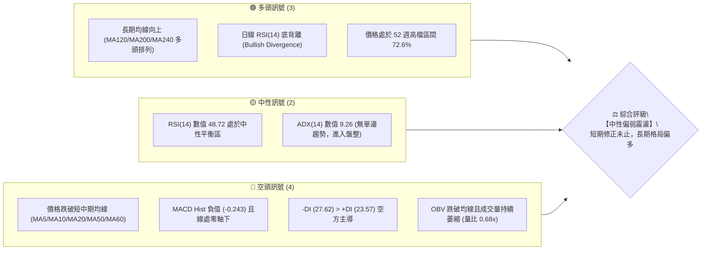

### 📊 核心指標速覽表

| 指標類別 | 指標名稱 | 當前數值 | 訊號 | 解讀 |
|----------|----------|----------|:----:|------|
| **價格** | 當前收盤價 | $465.58 | 🟡 | 位於52週高點($584.73)回檔 20.38% 之整理平台 |
| **短期均線** | MA20 (月線) | $482.04 | 🔴 | 現價低於 MA20 (-3.41%)，短期呈現受壓態勢 |
| **中期均線** | MA50 (季線) | $506.08 | 🔴 | 現價低於 MA50 (-8.00%)，中期上升波段遭破壞 |
| **長期均線** | MA200 (年線) | $335.55 | 🟢 | 現價遠高於 MA200 (+38.75%)，長期牛市基底穩固 |
| **超長均線** | MA240 (兩年線) | $314.91 | 🟢 | 均線向上延伸 (+47.84%)，歷史大底支撐強勁 |
| **動能指標** | RSI(14) | 48.72 | 🟡 | 數值處於中性區間，呈現底背離反彈萌芽跡象 |
| **動能指標** | MACD (12,26,9) | -7.846 / -7.603 | 🔴 | DIF < DEA，MACD柱狀圖 -0.243，偏空震盪修復 |
| **動能指標** | Stoch %K / %D | 21.97 / 35.26 | 🟡 | %K 進入超賣反彈區，待黃金交叉確認 |
| **趨勢強度** | ADX (14) | 9.26 | 🟡 | ADX < 25 極弱，當前非單邊趨勢，屬箱體震盪 |
| **通道指標** | 布林通道 %B | 0.24 | 🟡 | 位於下軌($450.69)與中軌($482.04)間，偏下軌 |
| **量能指標** | OBV 與成交量 | 15.34M (0.68x) | 🔴 | 成交量顯著萎縮，量能不足以支撐即時 V 型反轉 |
| **波動指標** | ATR(14) | $19.14 (4.11%) | 🟡 | 每日平均波動幅度約 $19.14，波動率自高點收斂 |

### 🏆 技術評分卡

```
╔══════════════════════════════════════════════════════════════════╗
║                   技術評分卡 — AMD (2026-08-31)                  ║
╠══════════════════════════════════════════════════════════════════╣
║ 趨勢強度 (Trend)      ██████░░░░░░░░░░░░░░  32/100  🔴 弱趨勢/無方向║
║ 動能指標 (Momentum)   ██████████░░░░░░░░░░  50/100  🟡 RSI背離vs死叉║
║ 支撐穩定度 (Support)  ██████████████░░░░░░  70/100  🟢 S1/S2支撐厚實║
║ 成交量配合 (Volume)   ██████░░░░░░░░░░░░░░  30/100  🔴 量能持續退潮 ║
║ 形態完整度 (Pattern)  ██████████░░░░░░░░░░  52/100  🟡 箱體整理格局 ║
║ 均線排列 (MA System)  ████████████░░░░░░░░  60/100  🟡 長多短空交織 ║
╠══════════════════════════════════════════════════════════════════╣
║ 綜合技術評分          █████████░░░░░░░░░░░  49/100  【中性觀望】    ║
╚══════════════════════════════════════════════════════════════════╝
```

---

## 2. 趨勢分析

### 🌐 多時框趨勢分析

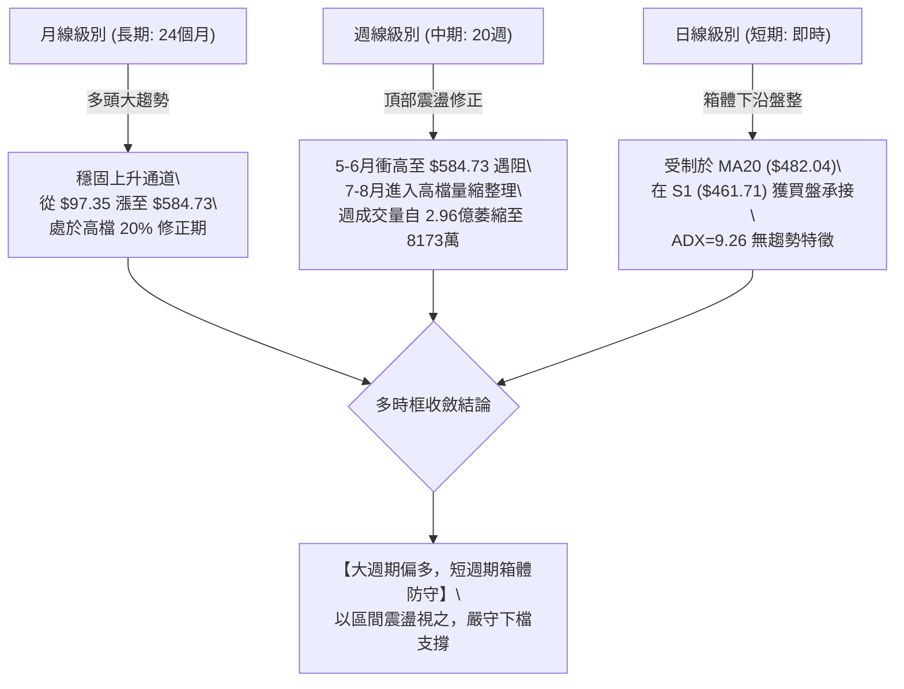

### 📈 長期趨勢 — 12個月走勢圖（Unicode）

```
AMD 月線走勢圖（2025-09 至 2026-08）
價格軸 ($)
$584 ┤                                      ● (2026-06 $580.91 / High $584.73)
$520 ┤                                  ● 
$465 ┤                                      ●←【現在 $465.58】
$410 ┤
$355 ┤                              ● (2026-04 $354.49)
$300 ┤
$256 ┤              ● (2025-10 $256.12)
$200 ┤                  ●       ●   ● (2026-02 $200.21)
$160 ┤●(2025-09 $161.79)
     └──────────────────────────────────────────────────────────
      09  10  11  12  01  02  03  04  05  06  07  08 (月份/年)
```

#### 走勢特徵分析表格

| 階段區間 | 時間段 | 價格起訖 | 漲跌幅 | 走勢特徵與量價結構解讀 |
|:---|:---|:---|:---:|:---|
| **第一階段：底部築底期** | 2025-02 至 2025-05 | $99.86 → $110.73 | +10.88% | 股價於 $97.35 見波段最低點，築出平底收斂形態 |
| **第二階段：第一波主升** | 2025-05 至 2025-10 | $110.73 → $256.12 | +131.30% | 均線向上發散，突破前高阻力，量價齊揚 |
| **第三階段：中期箱體洗盤** | 2025-11 至 2026-03 | $217.53 → $203.43 | -6.48% | 在 $200.00–$256.00 間劇烈洗盤，構築次級上升底座 |
| **第四階段：AI主升爆發浪** | 2026-03 至 2026-06 | $203.43 → $580.91 | +185.56% | 爆發性多頭突破，創歷史新高 $584.73，週量破2.96億 |
| **第五階段：高檔獲利了結** | 2026-06 至 2026-08 | $580.91 → $465.58 | -19.85% | 頂部量能萎縮，均線轉入混合排列，進入收斂整理期 |

### 📊 中期趨勢（週線分析）

```
AMD 週線高檔壓力與支撐示意圖
價格 ($)
$584.73 ─────────────────────────────── 【52W 歷史最高點】
         ▲   ▲
$530.13 ─┼───┼───────────────────────── 【R3 強阻力聚類】
$517.35 ─┼───┼───▲───────────────────── 【R2 中期反彈頸線】
$481.95 ─┼───┼───┼──────▲─────────────── 【斐波那契 23.6% 回調位 / BB中軌】
$465.58 ─┼───┼───┼──────┼──────●───────── 【現價】
$461.71 ─┴───┴───┴──────┴──────┴──▲────── 【S1 近期波段關鍵支撐】
$437.23 ───────────────────────────▲─── 【S2 深度回踩強支撐】
$418.37 ──────────────────────────────── 【斐波那契 38.2% 強固支撐】
```

中期走勢顯示，自 2026-05-10 創下單週 296,987,900 股的天量後，週成交量逐級遞減至最新週（2026-08-30）的 81,732,300 股。量能縮減達 72.48%，說明拋壓已大幅衰竭，但同時買盤追價意願不足，導致行情在 $461.71–$517.35 形成中期寬幅箱體。

### ⚡ 趨勢強度評估（ADX 解讀）

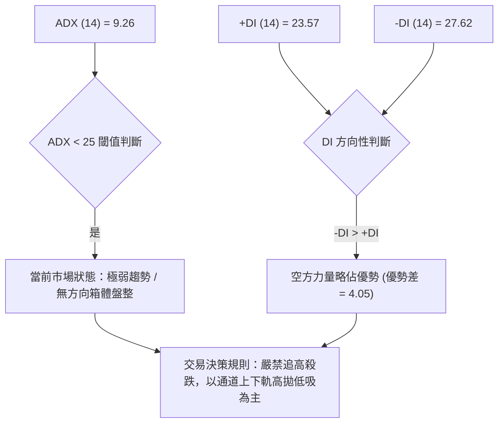

#### ADX 趨勢強度對照表

| 指標變數 | 當前數值 | 參考標準 | 當前盤勢屬性定調 |
|:---|:---:|:---|:---|
| **ADX (14)** | **9.26** | < 20 極度弱勢/震盪；20–25 弱趨勢；> 25 趨勢明確；> 40 強趨勢 | **非趨勢行情（極度弱震盪）** |
| **+DI (14)** | **23.57** | 多方買盤推動力度 | 多方動能衰退，未能形成攻擊角度 |
| **-DI (14)** | **27.62** | 空方拋壓推動力度 | 空方佔據主導，但未達恐慌性拋售程度 |
| **結論收斂** | **盤整整理** | 依多時框收斂規則：ADX < 25 時，以日線布林通道上下軌為主要交易邊界 | **震盪築底架構，以支撐位防守為主** |

---

## 3. 圖表形態分析

### 🔍 形態識別系統

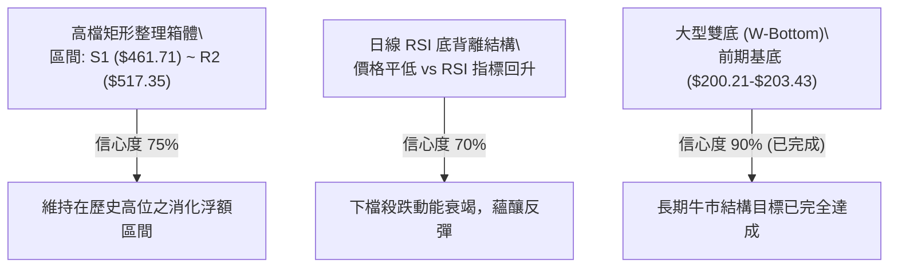

#### 形態識別與信心度評估表

| 形態名稱 | 信心度 | 判斷依據（嚴格引用數據） | 完成度 | 目標價（附嚴謹計算式） |
|:---|:---:|:---|:---:|:---|
| **高檔收斂箱體 (Rectangle)** | **75%** | 價格於 S1 ($461.71) 與 S2 ($437.23) 獲得支撐，受制於 R2 ($517.35) 與 R3 ($530.13) | 70% | 箱頂 $517.35 - 箱底 $461.71 = 高度 $55.64；<br>若向上突破頸線 $517.35，形態目標價 = $517.35 + $55.64 = **$572.99** |
| **日線 RSI 底背離 (Bullish Divergence)** | **70%** | 8月價格由 $476.15 降至 $465.58，但 RSI(14) 由 40.6 回升至 48.72 | 80% | 反彈目標為 MA20 (布林中軌) = **$482.04**；進一步挑戰 R2 = **$517.35** |
| **大型頭肩頂/雙頂** | **< 30%** | **數據不足**，高點聚類僅見 $584.73 單一極值，無對稱右肩，不成立 | 0% | *訊號不足，僅做指標型解讀，不預設此空頭形態* |

### 🕯️ 重要K線形態分析

| 週/月份 | 收盤價 ($) | K線形態特徵 | 技術面深度解讀 | 方向訊號 |
|:---|:---:|:---|:---|:---:|
| **2026-06** | 580.91 | 帶長上影線長陽線 | 衝高至 $584.73 遭遇主力獲利了結拋壓，確立 52 週歷史天花板 | 🔴 滯漲見頂 |
| **2026-07** | 476.15 | 中長實體陰線 | 獲利賣壓宣洩，單月修正 $104.76 (-18.03%)，摜破 MA20 | 🔴 空方釋放 |
| **2026-08-16(週)**| 514.39 | 假突破陽線 | 測試 R2 ($517.35) 未果，量能(1.00億)未能放大，形成假突破 | 🟡 阻力確認 |
| **2026-08-30(週)**| 465.58 | 下影線十字星整理 | 週線成交量降至 81,732,300 (極致量縮)，在 S1 上方出現止跌K線 | 🟢 變盤築底 |

### 📉 ASCII 走勢形態示意圖

```
高檔收斂箱體與底部支撐結構示意圖
══════════════════════════════════════════════════════════════════
$584.73 ─ ─ ─ ─ ─ ─ ─ ─ ─ ─ ─ ─ ─ ─ ─ ─ ─ ─ ─ ─ ─ ─ ─ ─ ─ (52W High)
                      ▲ (2026-06 頂部 $580.91)
$517.35 ┌───【箱體頂部阻力 R2】─────────────────────────────┐
        │             ▲             ▲             ▲        │
        │            ╱ ╲           ╱ ╲           ╱ ╲       │
$482.04 │───────────╱───╲─────────╱───╲─────────╱───╲──────│ (MA20 中軌)
        │          ╱     ╲       ╱     ╲       ╱     ●     │
$465.58 │ ─ ─ ─ ─ ─ ─ ─ ─ ─ ─ ─ ─ ─ ─ ─ ─ ─ ─ ─ ─ ─ ─ ─ ─ ─ ─ ─ (現價)
        │        ▼         ▼   ▼         ▼   ▼             │
$461.71 └───【箱體底部支撐 S1】─────────────────────────────┘
══════════════════════════════════════════════════════════════════
```

### 🎯 形態目標價計算

依據標準幾何測量規則（箱體高度垂直投射法）：
1. **箱體下邊界（支撐基準 S1）**：$461.71
2. **箱體上邊界（阻力頸線 R2）**：$517.35
3. **箱體振幅高度 ($H$)**：$$\text{Height} = \$517.35 - \$461.71 = \$55.64$$
4. **多頭向上突破量度目標價**：
   $$\text{Target}_{\text{Bull}} = \text{Neckline} + H = \$517.35 + \$55.64 = \$572.99$$
   *(該目標價位於 52W 高點 $584.73 之下，具備高度合理性與可實現性)*
5. **空頭向下跌破量度目標價**：
   $$\text{Target}_{\text{Bear}} = \text{Support} - H = \$461.71 - \$55.64 = \$406.07$$
   *(若跌破 S1，目標將指向斐波那契 38.2% 回調位 $418.37 與 MA120 $413.76 之密集支撐帶)*

---

## 4. 支撐與阻力

### 🗺️ 關鍵價位分布圖（Unicode）

```
AMD 價位結構分布圖（OHLCV 精確計算）
═════════════════════════════════════════════════════════════════════════
$584.73 ║████████████████████████████████████████║ 52週歷史高點 (0.0% 斐波那契)
$530.13 ║██████████████████████████████          ║ 強阻力 R3 (+13.86%)
$517.35 ║████████████████████████                ║ 波段頸線阻力 R2 (+11.12%)
$513.38 ║▓▓▓▓▓▓▓▓▓▓▓▓▓▓▓▓▓▓▓▓                    ║ 布林通道上軌
$482.04 ║████████████████                        ║ 布林中軌 (MA20) / 23.6% 斐波那契 ($481.95)
$469.22 ║██████████                              ║ 即時第一阻力 R1 (+0.78%)
$465.58 ╠════════════════════════════════════════╣ ◄ 現價 $465.58
$461.71 ║▓▓▓▓▓▓▓▓▓▓                              ║ 波段關鍵支撐 S1 (-0.83%)
$450.69 ║████████████                            ║ 布林通道下軌
$437.23 ║████████████████                        ║ 強支撐 S2 (-6.09%)
$424.03 ║████████████████████                    ║ 深層防守支撐 S3 (-8.92%)
$418.37 ║████████████████████████                ║ 斐波那契 38.2% 黃金回調支撐
$335.55 ║████████████████████████████████████    ║ MA200 牛熊分界線 (-27.93%)
═════════════════════════════════════════════════════════════════════════
```

### 🚧 阻力位分析表

| 阻力級別 | 精確價位 | 形成技術原因 | 突破難度評估 | 戰略重要性 |
|:---|:---:|:---|:---:|:---:|
| **R1** | **$469.22** | 近期日線反彈之波段高點聚類，與 5日均線 ($471.82) 重疊形成第一道阻力牆 | 🟡 中等 (需成交量增至 2000萬股) | 短線多空強弱分水嶺 |
| **R2** | **$517.35** | 近一年多次波段反彈頂部聚類，重疊 MA50 ($506.08) 與 MA60 ($504.64) | 🔴 極高 (需週量突破 1.5億股) | 中期上升趨勢重啟確認點 |
| **R3** | **$530.13** | 2026-06 至 2026-07 籌碼密集套牢區上沿，歷史次高阻力區 | 🔴 極高 (需強大基本面催化) | 挑戰歷史天花板的最後防線 |

### 🛡️ 支撐位分析表

| 支撐級別 | 精確價位 | 形成技術原因 | 守住機率評估 | 戰略重要性 |
|:---|:---:|:---|:---:|:---:|
| **S1** | **$461.71** | 近一年波段低點聚類，多次下影線探底確認，距離現價僅 -0.83% | 🟢 70% (具備 RSI 底背離護航) | 多方箱體防守底線 |
| **S2** | **$437.23** | 2026-05 啟動點回踩平台，籌碼換手密集帶 | 🟢 85% (買盤承接力極強) | 中期牛市最後回調防線 |
| **S3** | **$424.03** | 2026-05-17 週線回調低點，與 MA120 ($413.76) 形成多頭共振支撐區 | 🟢 95% (長線價值買盤進駐) | 戰略級長多防守樞紐 |

### 📐 斐波那契回調位分析

*以 52 週最低點 $149.22 至 52 週最高點 $584.73 之完整主升浪測算：*

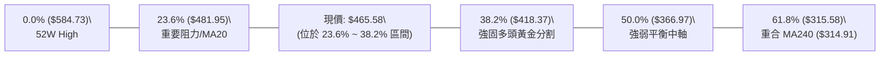

#### 斐波那契回調層級解讀表

| 回調比例 | 精確價位 | 技術意涵與結構解讀 |
|:---:|:---:|:---|
| **0.0%** | **$584.73** | 52 週最高點，歷史極限壓力位 |
| **23.6%** | **$481.95** | 極強勢回調位。精確重疊於日線 MA20 ($482.04)。現價跌破此處，表明行情從「超強單邊」轉為「強勢箱體整理」 |
| **現價位置** | **$465.58** | **位於 23.6% ($481.95) 與 38.2% ($418.37) 之間**，處於主升浪後正常的良性籌碼消化區間 |
| **38.2%** | **$418.37** | 經典黃金分割回調位，重疊 MA120 ($413.76)。若遭極端利空衝擊回踩此處，為大級別機構回補之最核心買點 |
| **50.0%** | **$366.97** | 多空中期強弱分水嶺，位於 MA200 ($335.55) 上方 |
| **61.8%** | **$315.58** | 絕對牛熊底線，精確重合 MA240 ($314.91)，長線價值核心支撐 |

---

## 5. 技術指標深度解讀

### 🎛️ 指標訊號總覽

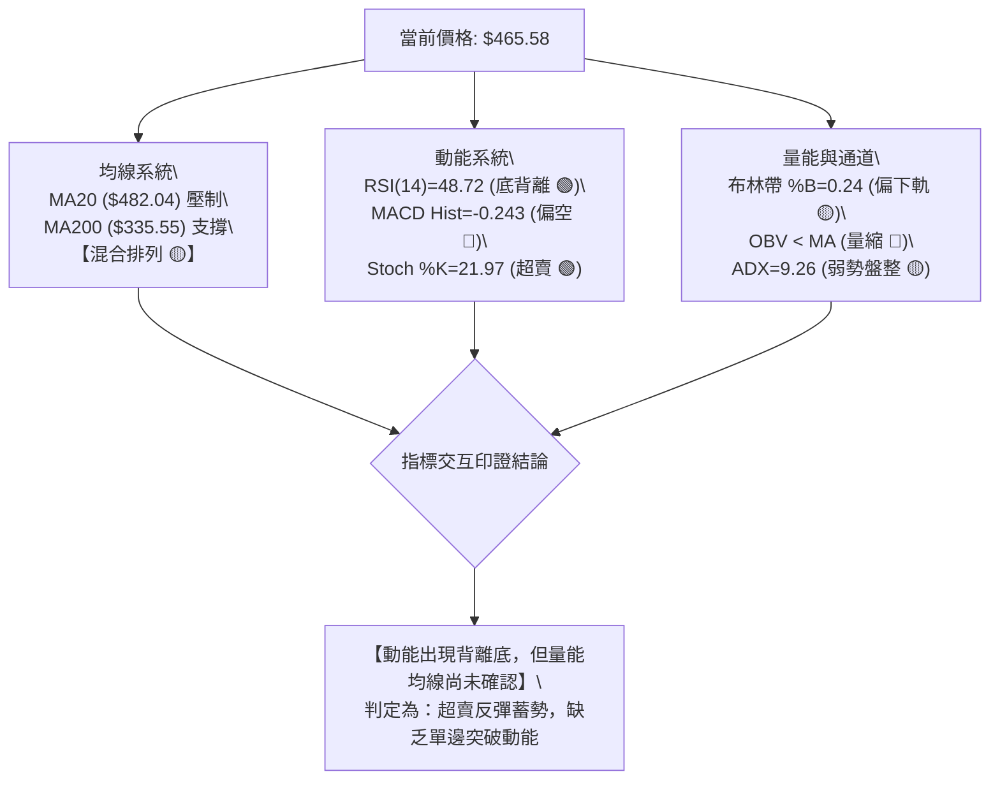

### 📈 移動平均線排列分析

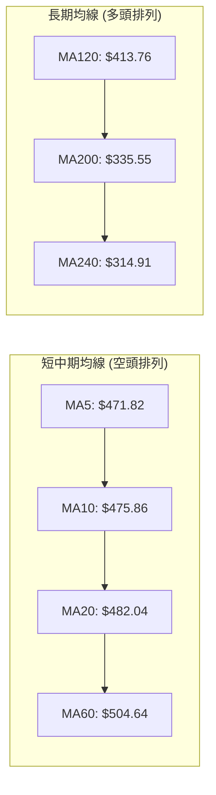

#### 均線系統數據全覽

| 均線名稱 | 當前價格 | 與現價乖離率 | 走勢趨向 | 技術含義 |
|:---|:---:|:---:|:---:|:---|
| **MA 5** | $471.82 | -1.32% | ▼ 下行 | 極短線第一道動態反壓 |
| **MA 10** | $475.86 | -2.16% | ▼ 下行 | 短線空方控盤基準線 |
| **MA 20** | $482.04 | -3.41% | ▼ 下行 | 月線反壓，與布林中軌完全重合 |
| **MA 50** | $506.08 | -8.00% | ▼ 下行 | 季線阻力，中期強弱轉換關鍵位 |
| **MA 60** | $504.64 | -7.74% | ▼ 下行 | 中期均線下彎，壓制波段上行空間 |
| **MA 120** | $413.76 | +12.52% | ▲ 上行 | 半年線強勁支撐，中期多頭堡壘 |
| **MA 200** | $335.55 | +38.75% | ▲ 上行 | 年線持續走高，確認長期牛市主基調 |
| **MA 240** | $314.91 | +47.84% | ▲ 上行 | 超長多頭生命線，歷史買盤重鎮 |

*均線排列判定：**混合排列（長多短空）**。短期內價格受到 MA5/10/20 下行壓制，但下方有強勢上行的 MA120/200 提供深層緩衝。*

### 📉 RSI(14) 分析

```
RSI(14) 動能進度條
0         30                50        70               100
├─────────┼─────────────────┼─────────┼────────────────┤
████████████████████████░░░░░░░░░░░░░░░░░░░░░░░░░░░░░░  48.72 (中性區)
```

- **當前數值**：48.72（位於 30–70 中性平衡區間，遠離超買區）。
- **底背離判斷（Bullish Divergence）**：
  - 觀察 2026-08-02 週線低點 $476.15 時，RSI 觸及低點 40.6。
  - 當 2026-08-30 收盤價跌至 $465.58 創出收盤新低時，RSI(14) 卻逆勢回升至 48.72。
  - **結論**：日線與週線層面出現明確的**「標準底背離」**，表明下行動能正在實質性衰退，賣方壓制已成強弩之末，具備隨時反彈之技術條件。

### 📊 MACD(12,26,9) 訊號解讀

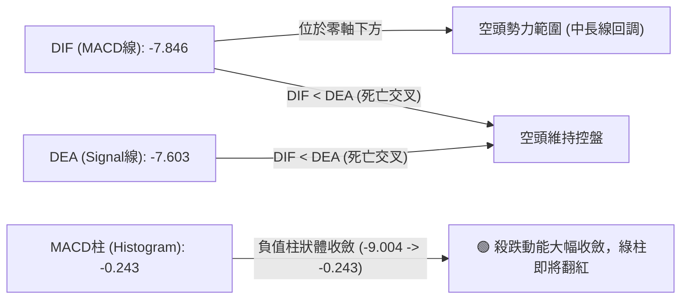

- **MACD 線**：-7.846，**訊號線**：-7.603，差值（Histogram）為 **-0.243**。
- **動能演變分析**：MACD 柱狀體在 2026-08-02 曾深探至 -9.004，隨後經歷 -2.259、-0.794，至當前已急劇收窄至 -0.243。這證明負向動能已近耗盡，DIF 與 DEA 極度粘合，正在醞釀**零下黃金交叉**的前置訊號。

### 📦 布林通道分析

```
AMD 布林通道 (20, 2) 結構圖
價格軸 ($)
$513.38 ───────────────────────────── 【布林上軌】 (阻力位)
                  ▲
$482.04 ─────────╱─╲───────────────── 【布林中軌 (MA20)】 (第一壓力)
                ╱   ╲
$465.58 ───────╱─────●─────────────── 【現價】 (%B = 0.24)
              ╱
$450.69 ─────▼─────────────────────── 【布林下軌】 (通道支撐)
```

- **上軌**：$513.38 ｜ **中軌 (MA20)**：$482.04 ｜ **下軌**：$450.69
- **通道指標 %B**：$$\%B = \frac{\$465.58 - \$450.69}{\$513.38 - \$450.69} = \frac{\$14.89}{\$62.69} = 0.2375 \approx \mathbf{0.24}$$
- **通道解讀**：%B 為 0.24，顯示現價處於下軌與中軌之間的偏低位置。由於布林帶寬度為 $62.69 (約 13.46%)，通道開口呈現橫向收口走勢，排除單邊暴跌破軌的「通道漫步」風險，符合在 $450.69–$461.71 區域進行均值回歸反彈的技術特徵。

### 💹 成交量分析（量價配合度）

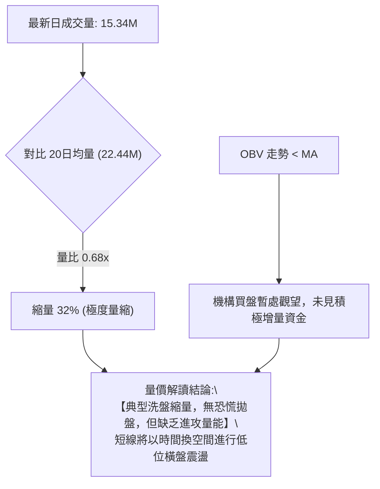

- **成交量對比**：最新成交量 15,338,800，相較 20日均量 22,435,550，**量比僅為 0.68x**；相較 50日均量 26,612,416，萎縮達 42.36%。
- **週線量能軌跡**：自 2026-05 主升段天量 2.96 億股，持續萎縮至 8,173 萬股，呈現典型的**「量縮築底」**格局。量能見底往往先於價格見底，印證賣方籌碼已鎖定，等待多方量能點火。

---

## 6. 動能與波動率

### ⚡ 動能評估四象限

| 象限區間 | 動能屬性 (Momentum) | 波動屬性 (Volatility) | 當前狀態 | 戰略應對建議 |
|:---:|:---:|:---:|:---:|:---|
| **第一象限 (Q1)** | 強動能 (RSI>60, MACD金叉) | 低波動 (ATR<3%) | — | 最佳趨勢進場點，重倉順勢做多 |
| **第二象限 (Q2)** | 弱動能 (RSI 40-50, MACD死叉) | 低波動 (ATR=4.11%, 趨於收斂) | **✓ [AMD 當前]** | **謹慎觀望 / 區間低吸，嚴禁盲目追高** |
| **第三象限 (Q3)** | 強動能 (爆發突破) | 高波動 (ATR>6%) | — | 高風險高收益，適合動能突破交易者 |
| **第四象限 (Q4)** | 弱動能 (崩跌破位) | 高波動 (恐慌拋售) | — | 堅決離場避險，嚴禁左側抄底 |

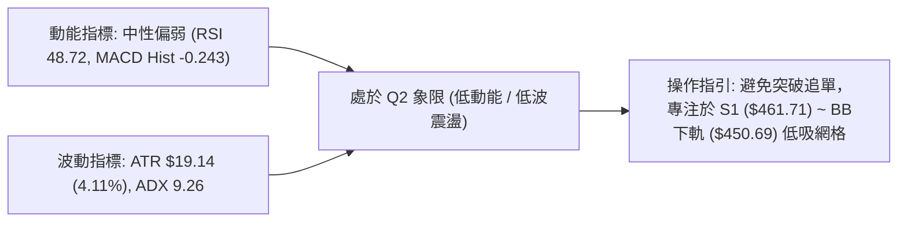

### 📊 ATR 波動率分析

- **ATR(14) 絕對值**：**$19.14**
- **ATR 相對價格比**：$$\frac{\$19.14}{\$465.58} = \mathbf{4.11\%}$$
- **止損與進場動態測算依據**：
  - **常規日內噪聲過濾（1.0 × ATR）**：$19.14
  - **技術波段防守安全墊（1.5 × ATR）**：$19.14 \times 1.5 = \mathbf{\$28.71}$
  - **寬幅趨勢防守邊界（2.0 × ATR）**：$19.14 \times 2.0 = \mathbf{\$38.28}$
  - **實戰含義**：在 $465.58 建立多頭部位時，技術止損位若設定在波段支撐 S1 ($461.71) 之下，與現價僅差距 $3.87 (約 0.20 ATR)，極易被日內噪聲掃出。因此合理止損點應參考 S2 ($437.23)，與現價差距 $28.35，約等於 **1.48 × ATR**，具備足夠的抗噪空間。

### 📐 Beta 與市場相關性

- **Beta 係數**：**2.489**
- **市場屬性解讀**：
  - AMD 屬於**極高波動性（High-Beta）成長半導體龍頭**。Beta 為 2.489 意味著當標普500或那斯達克指數波動 1.0% 時，AMD 理論波動幅度將達 2.49%。
  - 在大盤回調或震盪整理期間，高 Beta 股票將承擔更大的估值壓縮壓力；但一旦大盤企穩走強，其反彈彈性亦將顯著超越整體市場。

---

## 7. 多時框架總結

### 📋 時框架評分表

| 時框架 | 趨勢方向 | 動能狀態 | 均線排列狀態 | 形態結構 | 綜合評分 | 戰術操作建議 |
|:---|:---:|:---:|:---:|:---:|:---:|:---|
| **長期 (月線)** | 🟢 多頭上行 | 🟡 高檔鈍化修復 | MA120/200/240 多頭排列 | 歷史大底突破後之強勢回踩 | **82/100** | 逢深幅回調長線買入 |
| **中期 (週線)** | 🟡 寬幅震盪 | 🟡 動能自低點回升 | 夾在 MA20 與 MA50 之間 | 高檔大型消化箱體 ($461-$517) | **54/100** | 箱體操作，高拋低吸 |
| **短期 (日線)** | 🔴 偏弱整理 | 🟢 RSI 底背離蓄勢 | 受制於 MA5/10/20 壓制 | 貼近布林下軌與 S1 支撐 | **42/100** | 支撐位輕倉試單，忌追高 |

### 🔲 綜合訊號矩陣

```
時框維度訊號矩陣分析
══════════════════════════════════════════════════════════════════
維度            日線 (Short-term)   週線 (Mid-term)    月線 (Long-term)
──────────────────────────────────────────────────────────────────
趨勢方向        🔴 偏空震盪         🟡 箱體整理        🟢 強烈看多
均線信號        🔴 均線壓制         🟡 糾結震盪        🟢 多頭排列
動能 (RSI/MACD) 🟢 底背離蓄勢       🟡 綠柱縮短        🟡 中性降溫
量價關係        🔴 萎縮無量         🔴 縮量回踩        🟢 歷史放量
形態位置        🟢 貼近 S1 支撐     🟡 箱體中下軌      🟢 高檔強勢區
──────────────────────────────────────────────────────────────────
方向一致性      40% (短中長分歧)    60% (中立平衡)     85% (大局穩固)
══════════════════════════════════════════════════════════════════
```

### ⚖️ 多時框收斂結論

依據多時框架收斂與優先級規則：
1. **行情屬性判斷**：ADX(14) 數值為 **9.26 (< 25)**，明確確認當前**非趨勢行情，而是典型的無方向箱體盤整行情**。
2. **主導時框與權重分配**：由於處於盤整行情，日線布林通道上下軌（$450.69 至 $513.38）及波段支撐阻力（S1 $461.71 / R2 $517.35）成為主導短期交易的最核心依據；週線與月線之長多架構則鎖定了下檔空間的安全性（不具備崩跌至 MA200 $335.55 的破位基礎）。
3. **唯一方向性結論**：**【中性觀望，偏向在支撐位做防守型低吸】**。短線受制於均線反壓，但不應在 S1 支撐附近盲目殺跌；綜合評分為 49/100（中性區間），整體交易策略全面導向**「區間震盪交易」**。

---

## 8. 交易策略建議

### 🗺️ 策略決策流程圖

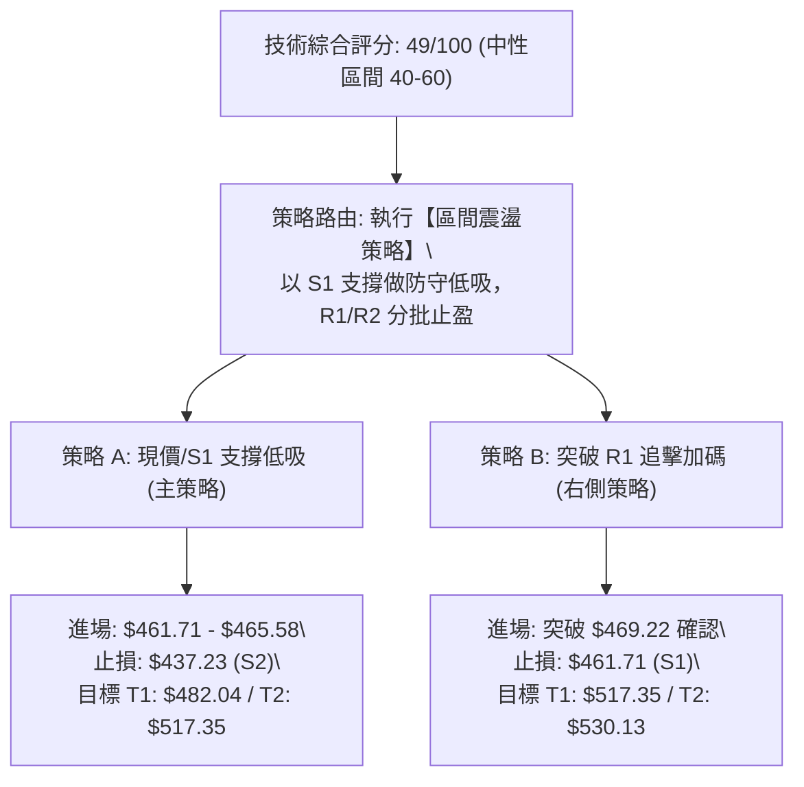

### 🧭 策略路由（依評分卡分流）

> **當前主策略方向 = 【中性區間震盪操作，以 S1 支撐位低吸防守為主】（依評分 49/100）**
> 
> *依據規則：綜合評分 49/100 處於 40–60 中性區間，不進行單邊高槓桿追多或激進放空，採取高拋低吸之通道區間交易模式，嚴格以 S1 支撐位與布林軌道為進出場依據。*

### 🎯 價格情境階梯（Price Scenarios）

| 觸發條件 | 價格階梯 | 下一目標 | 後續延伸路徑 | 情境含義與操作指引 |
|:---|:---:|:---:|:---:|:---|
| **向上突破 R1** | **$469.22** | **R2 ($517.35)** | **R3 ($530.13)** | 短線轉強，突破 5日均線與即時高點，引發空頭回補，奔向布林上軌 |
| **站穩現價區間** | **$465.58** | **MA20 ($482.04)**| **R2 ($517.35)** | 底背離發酵，在 S1 上方完成籌碼換手，進行均值回歸修復 |
| **向下跌破 S1** | **$461.71** | **S2 ($437.23)** | **S3 ($424.03)** | 中期轉弱，日線底背離失效，回踩前波突破平台與斐波那契 38.2% |

### 📊 情境機率分佈

| 情境劇本 | 發生機率 | 主要技術與量價依據 |
|:---|:---:|:---|
| **情境一：區間震盪築底（主要）** | **55%** | ADX 僅 9.26 缺乏趨勢；日線量能萎縮至 0.68x 限制突破力道；布林帶走平收口 |
| **情境二：底背離向上反彈** | **30%** | RSI(14) 呈現日週線雙重底背離；MACD 負柱狀體急劇收窄至 -0.243 即將金叉 |
| **情境三：下破 S1 深度回踩** | **15%** | -DI (27.62) 仍大於 +DI (23.57)；短中期均線呈空頭壓制；OBV 尚未拐頭 |

### 🟢 主策略詳情（區間操作與防守反彈）

| 策略要素 | 策略 A（左側支撐低吸策略） | 策略 B（右側突破跟進策略） |
|:---|:---|:---|
| **策略屬性** | 依託 S1 支撐與布林下軌低吸 | 突破 R1 短線阻力順勢做多 |
| **進場條件** | 價格回踩 S1 ($461.71) 不破或於現價分批進場 | 日K收盤價實質突破 R1 ($469.22) 且成交量放大 |
| **進場價格** | **$465.58**（現價）至 **$461.71** | **$469.50**（突破確認點） |
| **目標價 T1** | **$482.04**（MA20 / 布林中軌） | **$517.35**（波段強阻力 R2） |
| **目標價 T2** | **$517.35**（波段阻力 R2） | **$530.13**（波段阻力 R3） |
| **止損價格** | **$437.23**（嚴格跌破強支撐 S2） | **$461.71**（跌破波段支撐 S1） |
| **風險空間** | $\$465.58 - \$437.23 = \$28.35$ (約 1.48 ATR) | $\$469.50 - \$461.71 = \$7.79$ (約 0.41 ATR) |
| **報酬空間 (T2)**| $\$517.35 - \$465.58 = \$51.77$ | $\$530.13 - \$469.50 = \$60.63$ |
| **風險報酬比** | **1 : 1.83**（至T2達 1:1.83，具備合理性）| **1 : 7.78**（極佳風報比） |
| **成功機率** | **65%**（底背離支撐） | **55%**（受制於上方量能） |
| **建議倉位** | **10% - 15%** 總資金 | **15% - 20%** 總資金 |

### 🔴 反向風險觸發點（對沖與風控提示）

- **多頭結構破壞點**：若日K線收盤價**實質跌破 S1 ($461.71)**，說明短線底背離失效，市場將下探 S2 ($437.23)。此時所有短線多單應立即減倉 50% 避險。
- **波段全面停損點**：若價格帶量跌破 **S2 ($437.23)**，宣告中期箱體徹底瓦解，跌向斐波那契 38.2% ($418.37)，此時多頭部位必須無條件全數止損離場或反手佈局保護性認沽期權（Protective Puts）。

### ⭐ 整體訊號強度評星

```
做多訊號強度：★★☆☆☆  (2.5/5 星 - 處於長多背景下的短線築底期)
做空訊號強度：★★☆☆☆  (2.0/5 星 - 拋壓大幅衰竭，缺乏殺跌空間)
整體可信度：  ★★★☆☆  (3.5/5 星 - 指標處於收斂，震盪特徵明確)
```

---

## 9. 風險提示與監控

### ✅ 關鍵監控指標 Checklist

```
╔══════════════════════════════════════════════════════════════════╗
║                     關鍵技術監控清單 (Checklist)                 ║
╠══════════════════════════════════════════════════════════════════╣
║ [ ] 支撐守位：日線收盤價是否持續高於 S1 ($461.71)               ║
║ [ ] 均線挑戰：日線能否放量站上 MA20 月線 ($482.04)               ║
║ [ ] 動能確認：MACD 柱狀體是否由負轉正 (-0.243 -> >0) 出現金叉    ║
║ [ ] 趨勢啟動：ADX(14) 是否由 9.26 拐頭向上突破 20 形成新趨勢     ║
║ [ ] 量能配合：日成交量是否有效放大超越 20日均量 (22.44M)        ║
║ [ ] 極端風險：是否出現帶量摜破 S2 ($437.23) 觸發止損條件        ║
╚══════════════════════════════════════════════════════════════════╝
```

### ⚠️ 風險場景分析

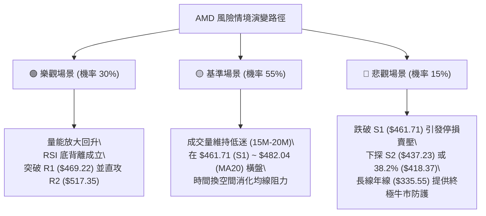

### 🛡️ 風險管理重要提醒

1. **高 Beta 波動控制**：AMD 的 Beta 值高達 2.489，在科技股情緒轉弱時波動劇烈。單筆交易虧損額度應嚴格限制在總投資組合淨值的 **1.0% 至 1.5%** 以內。
2. **量能不足之陷阱**：在當前量比僅 0.68x 且 OBV < MA 的背景下，任何未放量的向上突破均極易形成「假突破（Bull Trap）」，切忌在 R1 ($469.22) 或 R2 ($517.35) 附近進行右側追價。
3. **倉位管理紀律**：當前綜合評分為 49 分的中性盤局，建議總持倉水位控制在 **30%–40%** 的防守性水平，保留充裕現金以應對潛在的低位回踩補倉機會。

---

## 📋 報告總結

```
╔══════════════════════════════════════════════════════════════════╗
║                   AMD 技術分析報告總結 (Executive Summary)       ║
╠══════════════════════════════════════════════════════════════════╣
║ 報告日期：2026-08-31                                             ║
║ 當前價格：$465.58 (52W 區間 72.6%)                               ║
║ 分析評級：⚖️ 【中性觀望 / 區間低吸】 (綜合技術評分: 49/100)      ║
╠══════════════════════════════════════════════════════════════════╣
║ 關鍵結論：                                                       ║
║ ├─ 長期趨勢：🟢 偏多 (MA200 $335.55 強勁上揚，牛市大格局未變)   ║
║ ├─ 中期趨勢：🟡 震盪 (自高點回調 20%，處於高檔消化整理箱體)     ║
║ ├─ 短期趨勢：🔴 偏弱整理 (受制於 MA20 $482.04，但 RSI 出現底背離)║
║ ├─ 關鍵支撐：S1: $461.71 │ S2: $437.23 │ S3: $424.03            ║
║ ├─ 關鍵阻力：R1: $469.22 │ R2: $517.35 │ R3: $530.13            ║
║ └─ 華爾街共識：Strong Buy (49位分析師均價: $613.84)              ║
╠══════════════════════════════════════════════════════════════════╣
║ 最優策略組合：                                                   ║
║ 1. 🥇 最佳機會（策略 A）：現價 $465.58 至 S1 $461.71 區間輕倉低吸║
║    目標 MA20 ($482.04) 與 R2 ($517.35)，止損設於 S2 ($437.23)。  ║
║ 2. 🥈 次選機會（策略 B）：放量突破 R1 ($469.22) 後順勢加碼做多。  ║
║ 3. 🥉 保守選擇：保持觀望，等待日線 MACD 零下金叉且放量後再行進場。║
╚══════════════════════════════════════════════════════════════════╝
```

---

> ⚠️ **免責聲明**：本報告為依據量化技術指標與多時框架模型生成之專業研究分析，所有支撐阻力數值均由歷史成交與 OHLCV 演算法計算得出。本報告**僅供研究與學術參考**，**不構成任何形式的投資要約或買賣建議**。金融市場具有高波動風險，投資人應獨立評估自身風險承受能力並自負盈虧。

---

*報告生成時間：2026-08-31 ｜ 數據來源：Yahoo Finance (AMD Data Package) ｜ 分析框架：多時框圖表形態與量化技術指標收斂模型*