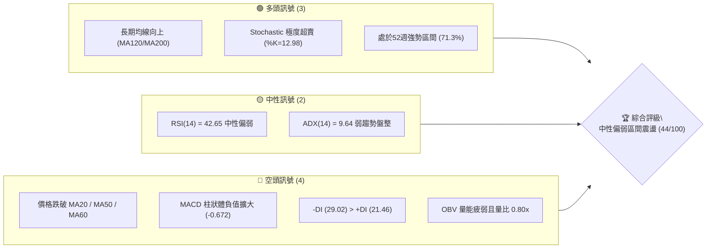
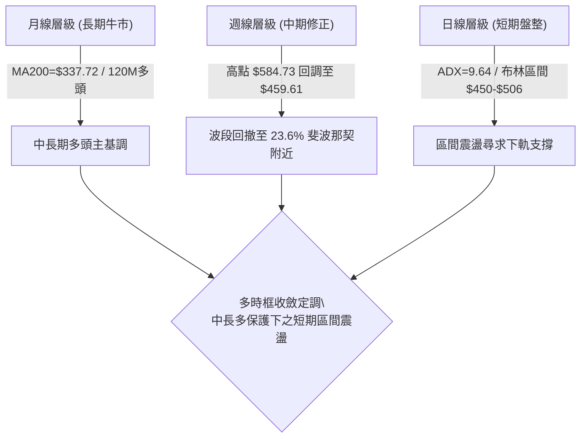
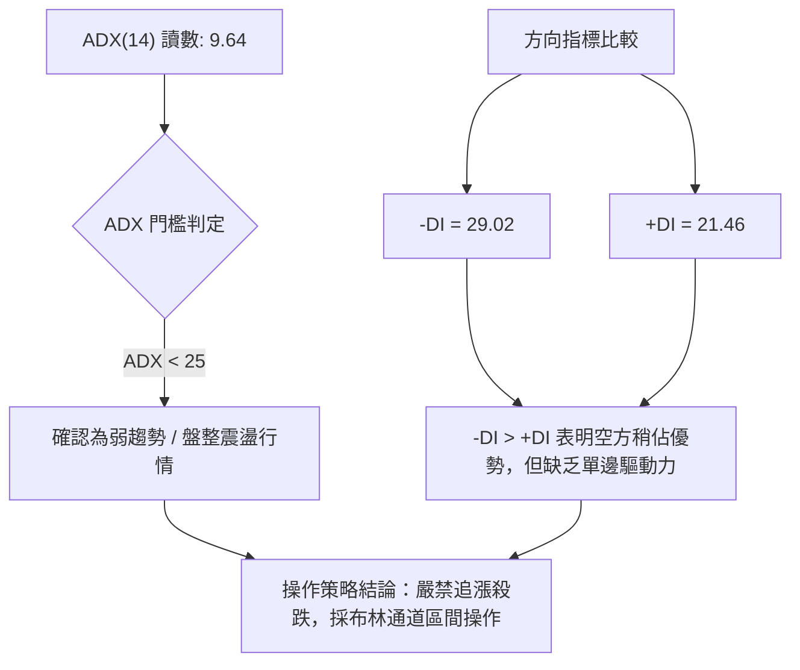
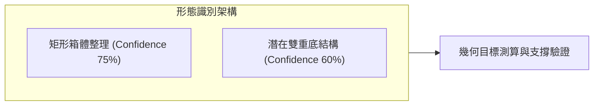
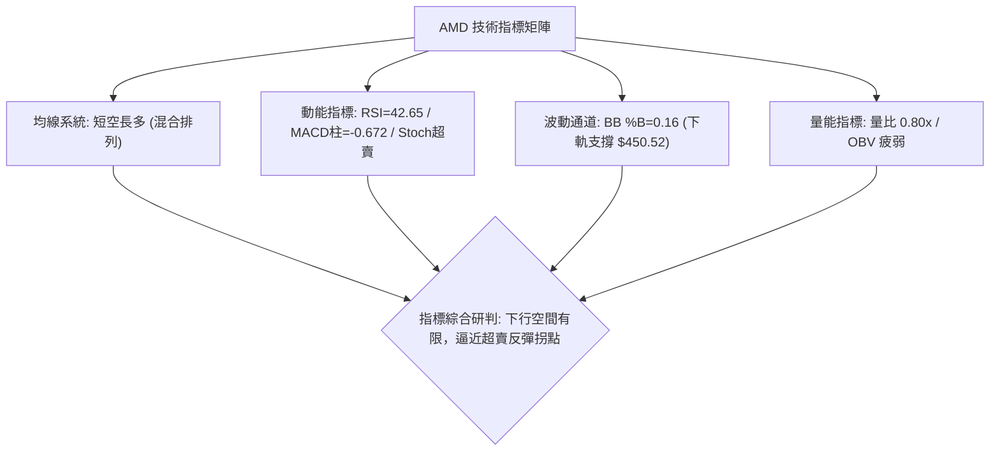
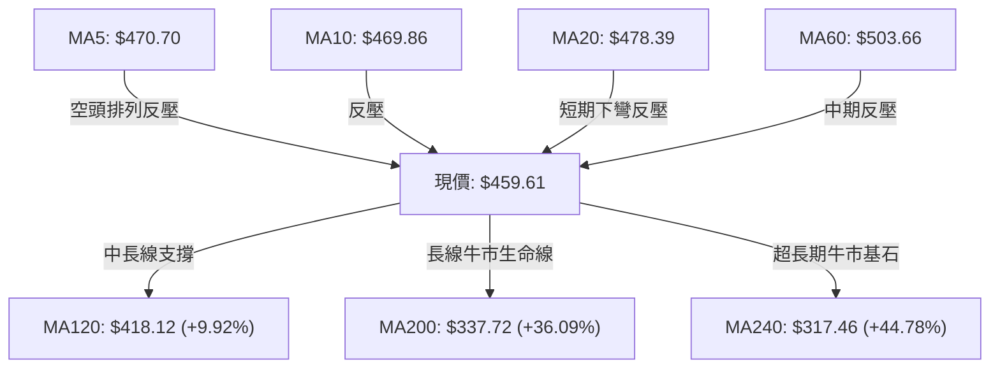
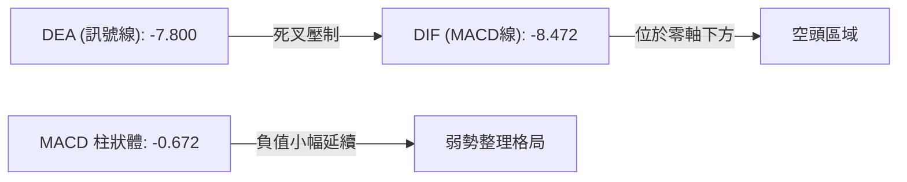
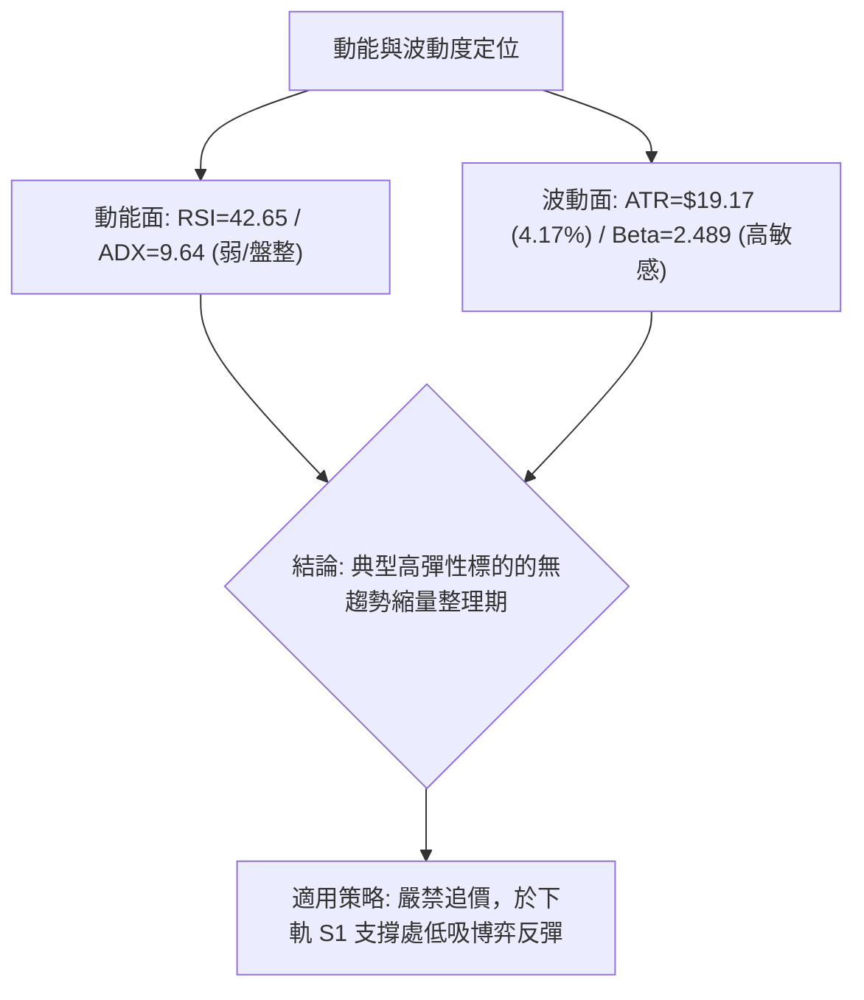
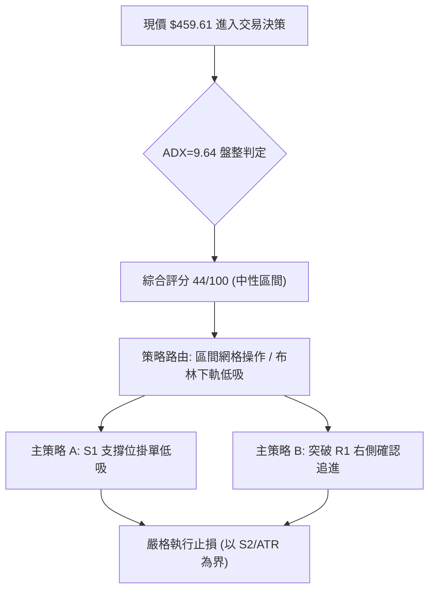
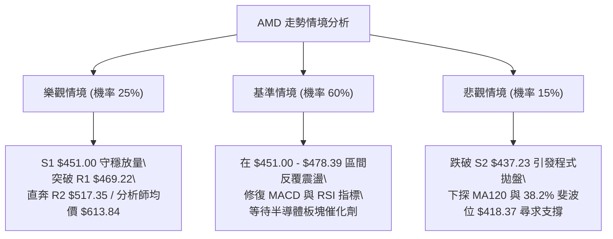

# AMD 技術分析報告

> **報告日期**：2026-09-02 ｜ **語言**：繁體中文 ｜ **數據來源**：Yahoo Finance ｜ **當前價格**：$459.61

---

## 目錄

| 章節 | 內容 |
|------|------|
| [1. 技術面概覽](#1-技術面概覽) | 訊號儀表板、核心指標、評分卡 |
| [2. 趨勢分析](#2-趨勢分析) | 多時框趨勢、長中短期走勢 |
| [3. 圖表形態分析](#3-圖表形態分析) | 形態識別、K線組合、目標價 |
| [4. 支撐與阻力](#4-支撐與阻力) | 關鍵價位、斐波那契回調 |
| [5. 技術指標深度解讀](#5-技術指標深度解讀) | MA/RSI/MACD/布林/成交量 |
| [6. 動能與波動率](#6-動能與波動率) | 動能評估、ATR、Beta |
| [7. 多時框架總結](#7-多時框架總結) | 時框架評分矩陣 |
| [8. 交易策略建議](#8-交易策略建議) | 多空策略、風險報酬比 |
| [9. 風險提示與監控](#9-風險提示與監控) | 監控指標、風險場景 |

---

## 1. 技術面概覽

### 🎯 技術訊號儀表板



### 📊 核心指標速覽表

| 指標類別 | 指標名稱 | 當前數值 | 訊號 | 解讀 |
|----------|----------|----------|------|------|
| **價格** | 當前收盤價 | $459.61 | 🟡 | 位於52週高低區間之 71.3%，短線處於自高點 $584.73 回調後的整理期 |
| **均線** | MA20 (短) | $478.39 | 🔴 | 現價低於 MA20 約 -3.93%，短期均線下彎形成動態反壓 |
| **均線** | MA50 (中) | $502.90 | 🔴 | 現價低於 MA50 約 -8.61%，中期多頭攻勢暫告中斷 |
| **均線** | MA200 (長) | $337.72 | 🟢 | 現價高於 MA200 約 +36.09%，長期牛市基底結構穩固無虞 |
| **動能** | RSI(14) | 42.65 | 🟡 | 位於中性偏弱區間（30–70），未見背離，空方動能稍佔上風 |
| **動能** | MACD (12/26/9) | -8.472 / -7.800 | 🔴 | DIF 線低於訊號線，MACD 柱為 -0.672，維持看空死叉格局 |
| **動能** | Stochastic (%K/%D) | 12.98 / 21.56 | 🟢 | 進入極度超賣區（<20），短線具備技術性反彈動能 |
| **趨勢強度**| ADX(14) | 9.64 | 🟡 | ADX < 25 表明處於無明顯主趨勢的「弱趨勢/區間震盪」行情 |
| **通道** | 布林通道 %B | 0.16 | 🟡 | 逼近布林下軌 $450.52，處於通道下緣超跌反彈臨界點 |
| **波動** | ATR(14) | $19.17 (4.17%) | 🟡 | 每日平均波動幅度約 4.17%，屬於半導體高貝塔正常波動區間 |
| **量能** | 成交量 / 20日均量 | 16.18M / 20.23M | 🔴 | 量比 0.80x，OBV < MA 顯示量能疲弱，市場觀望情緒濃厚 |

### 🏆 技術評分卡

```
╔══════════════════════════════════════════════════════════════╗
║                技術評分卡 — AMD (2026-09-02)                 ║
╠══════════════════════════════════════════════════════════════╣
║ 趨勢強度 (ADX=9.64, 盤整)     ████░░░░░░░░░░░░░░░░  20/100 🔴║
║ 動能指標 (RSI=42.65, Stoch超賣)████████░░░░░░░░░░░░  40/100 🟡║
║ 支撐穩定度 (S1=$451, BB下軌)  ██████████████░░░░░░  70/100 🟢║
║ 成交量配合 (量比0.80x, OBV疲弱)██████░░░░░░░░░░░░░░  30/100 🔴║
║ 形態完整度 (箱體下軌測試)     ████████████░░░░░░░░  60/100 🟡║
║ 均線排列 (短空長多混合排列)   ████████░░░░░░░░░░░░  40/100 🟡║
╠══════════════════════════════════════════════════════════════╣
║ 綜合評分                     █████████░░░░░░░░░░░  44/100 🟡║
║ 評級結論                     中性觀望 / 區間下軌高拋低吸     ║
╚══════════════════════════════════════════════════════════════╝
```

---

## 2. 趨勢分析

### 🌐 多時框趨勢分析



### 📈 長期趨勢 — 12個月走勢圖（Unicode）

```
AMD 月線走勢圖（2025-09 至 2026-09）
價格軸 ($)
$580.91 ┤                                  ●(26-06 高點)
$516.10 ┤                             ●          ●
$459.61 ┤━━━━━━━━━━━━━━━━━━━━━━━━━━━━━━━━━━━━━━━━━●←現在($459.61)
$354.49 ┤                        ●
$256.12 ┤         ●(25-10)
$200.21 ┤               ●    ●(26-02/03)
$161.79 ┤   ●(25-09)
         └───────────────────────────────────────────────
            09  10  11  12  01  02  03  04  05  06  07  08  09
           '25 '25 '25 '25 '26 '26 '26 '26 '26 '26 '26 '26 '26
```

**走勢特徵分析表格**：

| 階段區間 | 時間跨度 | 起訖價位 | 漲跌幅 | 走勢特徵與結構解讀 |
|----------|----------|----------|--------|--------------------|
| **主升前築底期** | 2025-09 ~ 2026-03 | $161.79 → $203.43 | +25.74% | 於 $200.00–$256.00 建立堅實的波段籌碼平台，完成長週期換手 |
| **超級主升浪** | 2026-03 ~ 2026-06 | $203.43 → $580.91 | +185.56% | 爆發性單邊拉升，創下歷史新高 $584.73，月線均線呈現極端發散 |
| **高位修正盤整期**| 2026-06 ~ 2026-09 | $580.91 → $459.61 | -20.88% | 健康獲利了結回調，回測 $450–$480 密集交易區，尋求新平衡 |

### 📊 中期趨勢（週線分析）

近期週線數據顯示，AMD 自 2026-07-12 觸及週反彈高點 $557.89 後，動能逐漸收斂，近 4 週收盤價分別為 $514.39 → $473.25 → $465.58 → $459.61，形成重心緩慢下移的弱勢整理。然而，週線成交量從高峰期 2.96 億股驟降至最新一週的 2,864 萬股（量能萎縮），顯示殺跌動能已大幅衰竭，市場進入存量博弈階段。

```
中期壓力與支撐結構示意圖：
[強阻力區]  $530.13 (R3) ─────────────── 7月中旬反彈密集高點
[阻力區]    $517.35 (R2) ─────────────── MA50 ($502.90) 與 8月中旬高點共振
[弱阻力區]  $469.22 (R1) ─────────────── 短期日線反彈阻力位
----------------- 現價 $459.61 -----------------
[第一道防線] $451.00 (S1) ─────────────── 近一年波段低點 / 布林下軌 ($450.52)
[關鍵防線]   $437.23 (S2) ─────────────── 5月中旬起漲點支撐
[終極防線]   $418.37 (38.2% Fib) ──────── 斐波那契 38.2% 回調位 ($418.37) / MA120 ($418.12)
```

### ⚡ 趨勢強度評估（ADX 解讀）



| 指標名稱 | 數值 | 門檻標準 | 狀態判斷 | 交易指引 |
|----------|------|----------|----------|----------|
| **ADX (14)** | 9.64 | < 25 (弱趨勢/盤整) | 極度盤整 | 順勢突破策略失效，震盪指標（Stoch/BB）主導 |
| **+DI** | 21.46 | 基準對比 | 多頭動能偏弱 | 多方尚未發動有效攻勢 |
| **-DI** | 29.02 | 基準對比 | 空頭略微主導 | 空方具備短線壓制力，但不具備暴跌動能 |

---

## 3. 圖表形態分析

### 🔍 形態識別系統



**形態識別與信心度評估表**：

| 形態 | 信心度 | 判斷依據（引用數據） | 完成度 | 目標價（附計算式） |
|------|--------|----------------------|--------|--------------------|
| **水平箱體震盪** | 75% | 頂部受阻於 R2 $517.35，底部受支撐於 S1 $451.00，價格在區間內來回波動 | 80% | 區間震盪上限目標 = $517.35 |
| **潛在雙重底 (W底)** | 60% | 第一低點於 2026-08-02 的 $476.15，第二低點正於 S1 $451.00 附近構築 | 50% | 突破頸線 R1 $469.22 後：<br>目標價 = 頸線 $469.22 + (頸線 $469.22 - 底點 $451.00) = $487.44 |

### 🕯️ 重要K線形態分析

| 月份 | 收盤價 | K線形態 | 解讀 | 訊號 |
|------|--------|---------|------|------|
| **2026-05** | $516.10 | 長陽突破實體 | 帶量突破歷史平台，奠定中期多頭基礎 | 🟢 強烈看多 |
| **2026-06** | $580.91 | 高位長上影十字/流星 | 衝高至 $584.73 後遭遇強大獲利回吐賣壓 | 🔴 波段見頂 |
| **2026-07** | $476.15 | 大陰線回調 | 快速回吐並向 MA50 靠攏尋求支撐 | 🔴 空方釋放 |
| **2026-08** | $470.72 | 縮量窄幅十字星 | 跌勢明顯減緩，多空雙方在 $470 附近達到暫時平衡 | 🟡 止跌孕育 |
| **2026-09** | $459.61 | 探底測試錘頭雛形 | 價格下探 S1 $451.00 支撐區，成交量萎縮，買盤承接力漸顯 | 🟡 築底確認中 |

### 📉 ASCII 走勢形態示意圖

```
AMD 日線箱體與潛在 W 底結構示意圖：
$517.35 ┼───────────────●────────────────────── (箱體頂部 / R2)
        │              / \
$487.44 ┼  - - - - - -/- - - - - - - - - - - - (W底最小測算目標)
        │            /     \       /
$469.22 ┼───────────●───────●─────/──────────── (W底頸線阻力 / R1)
        │          /         \   /
$459.61 ┼- - - - -/ - - - - - - ● - - - - - - - (現價 $459.61)
        │        /               \
$451.00 ┼───────●─────────────────●──────────── (箱體底部 / S1 雙底支撐)
        └──────────────────────────────────────
              第1底 (8月初)     第2底 (當前)
```

### 🎯 形態目標價計算

1. **箱體上限回歸目標**：若 S1 $451.00 成功守穩，箱體震盪常態回歸目標為箱體中軸至上軌，即 $517.35（R2）。
2. **W 底突破等距測算**：
   - 形態底部：$451.00 (S1)
   - 頸線位置：$469.22 (R1)
   - 形態高度：$469.22 - $451.00 = $18.22
   - **突破目標價**：$469.22 + $18.22 = **$487.44**（接近 23.6% 斐波那契回調位 $481.95 附近）。

---

## 4. 支撐與阻力

### 🗺️ 關鍵價位分布圖（Unicode）

```
AMD 價位結構分布圖
═════════════════════════════════════════════════════════════════
$530.13 ║██████████████████████████████║ 強阻力 R3 (7月中旬波段高點)
$517.35 ║████████████████████          ║ 阻力 R2 (箱體震盪上軌/MA50共振)
$469.22 ║████████████████████████      ║ 關鍵阻力 R1 (頸線與短期均線壓制)
$459.61 ╠══════════════════════════════╣ ◄ 現價 $459.61
$451.00 ║▓▓▓▓▓▓▓▓▓▓▓▓▓▓▓▓▓▓▓▓          ║ 近期支撐 S1 (近一年波段低點/BB下軌)
$437.23 ║████████████████████████      ║ 強支撐 S2 (5月波段起漲支撐)
$424.03 ║██████████████████████████████║ 核心支撐 S3 (MA120 / 38.2% Fib共振)
═════════════════════════════════════════════════════════════════
```

### 🚧 阻力位分析表

| 阻力級別 | 價位 | 形成原因 | 突破難度 | 重要性 |
|----------|------|----------|----------|--------|
| **R1** | $469.22 | 近一年波段高點聚類、MA5 ($470.70) 與 MA10 ($469.86) 重合反壓 | 中等 | ⭐⭐⭐ 短線多空分水嶺，站穩方能化解短線陰跌 |
| **R2** | $517.35 | 近一年波段高點聚類、MA50 ($502.90) 與布林上軌 ($506.27) 密集反壓區 | 極高 | ⭐⭐⭐⭐⭐ 中期多頭反轉確認線，突破方能開啟新一輪牛市 |
| **R3** | $530.13 | 近一年波段高點聚類、7月上旬高位套牢籌碼密集區 | 高 | ⭐⭐⭐⭐ 強阻力區，若能觸及將形成大級別多頭延續 |

### 🛡️ 支撐位分析表

| 支撐級別 | 價位 | 形成原因 | 守住機率 | 重要性 |
|----------|------|----------|----------|--------|
| **S1** | $451.00 | 近一年波段低點聚類、布林下軌 ($450.52) 形成的動態下邊界支撐 | 70% | ⭐⭐⭐⭐ 短線關鍵生命線，區間低吸核心防守點 |
| **S2** | $437.23 | 近一年波段低點聚類、5月中旬突破後的平台回踩確認點 | 80% | ⭐⭐⭐⭐ 結構性強支撐，跌破將引發大級別趨勢轉向 |
| **S3** | $424.03 | 近一年波段低點聚類、極度接近 38.2% 斐波那契位 ($418.37) 與 MA120 ($418.12) | 90% | ⭐⭐⭐⭐⭐ 中長線戰略多頭底線，具備極強買盤支撐 |

### 📐 斐波那契回調位分析

依據 52 週波動區間：**最低點 $149.22 → 最高點 $584.73**（總波動空間 $435.51）計算之標準斐波那契回調結構如下：

```
0.0%  (52W High)   $584.73 ──────────────────────────────────
23.6% 回調位        $481.95 ─────────── (當前上方第一道關鍵斐波阻力)
                      ▲
現價 $459.61 落於此區間 │ (回調幅度約 28.7%)
                      ▼
38.2% 回調位        $418.37 ─────────── (強烈多頭黃金分割支撐，與 MA120 共振)
50.0% 回調位        $366.97 ─────────── (多空中樞分水嶺)
61.8% 回調位        $315.58 ─────────── (牛熊分界線)
78.6% 回調位        $242.42 ─────────── (深度回撤位)
100.0% (52W Low)   $149.22 ──────────────────────────────────
```

**斐波那契結構解讀**：
當前價格 **$459.61** 處於 **23.6% ($481.95)** 與 **38.2% ($418.37)** 之間。在強勢牛市回調中，回撤未觸及 38.2% 即可企穩者屬於極強勢整理。當前現價距離 38.2% 黃金分割位 $418.37 尚有約 -8.97% 的緩衝空間，顯示中期上升趨勢的結構未遭破壞。

---

## 5. 技術指標深度解讀

### 🎛️ 指標訊號總覽



### 📈 移動平均線排列分析



| 均線名稱 | 當前價格 | 與現價乖離率 | 走勢趨向 | 多空意涵 |
|----------|----------|--------------|----------|----------|
| **MA 5** | $470.70 | -2.36% | 下行 (▼) | 短線極弱反壓 |
| **MA 10** | $469.86 | -2.18% | 下行 (▼) | 短線第一道阻力 |
| **MA 20** | $478.39 | -3.93% | 下行 (▼) | 月線反壓，布林中軌所在 |
| **MA 60** | $503.66 | -8.75% | 下行 (▼) | 季線反壓，多空強弱分界 |
| **MA 120**| $418.12 | +9.92% | 上行 (▲) | 半年線強支撐，上升趨勢防線 |
| **MA 200**| $337.72 | +36.09% | 上行 (▲) | 年線多頭大本營，長期趨勢向上 |

### 📉 RSI(14) 分析

- **當前讀數**：**42.65**
- **進度條展示**：
  ```
  超賣 [0] ░░░░░░░░░░ [30] █████░░░░░░░░ [50] ░░░░░░░░░░ [70] ░░░░░░░░░░ [100] 超買
  當前 RSI(14) = 42.65 (處於弱勢中性區間)
  ```
- **背離判斷**：數據確認無頂背離亦無底背離。RSI 自 2026-04 高點 97.4 歷經 4 個月充分冷卻回落至 42.65，已消除前期極端過熱風險，接近 30 超賣區間，下行空間已被顯著壓縮。

### 📊 MACD(12/26/9) 訊號解讀



- **MACD 現況解讀**：DIF (-8.472) 位於 DEA (-7.800) 下方，MACD 柱為 -0.672。雖然仍為看空死叉，但負柱狀體數值已由 8 月初的 -9.004 大幅收斂至 -0.672，表明空頭動能已處於衰竭末期，隨時可能在零軸下方醞釀金叉。

### 📦 布林通道分析

```
AMD 布林通道 (20, 2) 結構圖：
$506.27 ────────────────────────────── 上軌 (Upper Band)
        │
$478.39 ────────────────────────────── 中軌 (Middle Band / MA20)
        │
$459.61 ───────────● 現價 (BB %B = 0.16)
$450.52 ────────────────────────────── 下軌 (Lower Band)
```

- **通道數據解讀**：
  - 上軌：$506.27 ｜ 中軌：$478.39 ｜ 下軌：$450.52
  - 當前 **%B = 0.16**，價格已極度貼近布林下軌（$450.52），與 S1 支撐 $451.00 形成共振。統計學上，%B < 0.20 屬於超賣回調極限區，具備強烈的向中軌 $478.39 均值回歸傾向。

### 💹 成交量分析（量價配合度）

- **最新成交量**：16,183,600 股
- **20日均量**：20,225,340 股（量比 0.80x）
- **50日均量**：25,790,274 股
- **OBV 趨勢**：OBV < MA，顯示量能呈現萎縮狀態。
- **量價配合診斷**：價格下跌過程中成交量顯著萎縮（量比 0.80x，且週成交量自 2.96 億股降至 2,864 萬股），此為典型的「縮量回調」特徵，並非主力資金出逃的大幅放量下挫，暗示市場拋壓已接近枯竭。

---

## 6. 動能與波動率

### ⚡ 動能評估四象限

| 象限 | 動能維度 | 波動率維度 | 當前狀態 | 策略指引 |
|------|----------|------------|----------|----------|
| **Q1 (突破爆發)** | 強 (RSI>60, ADX>25) | 高 (ATR% > 5%) | — | 順勢追買，擴大獲利 |
| **Q2 (低波沉寂)** | 弱 (RSI<50, ADX<25) | 低 (ATR% < 3%) | — | 耐心觀望，等待變盤 |
| **Q3 (高波震盪)** | 強 (動能分歧大) | 高 (Beta>2.0, ATR%>4%) | — | 區間網格，高拋低吸 |
| **Q4 (超跌蓄勢)** | 弱動能 (ADX=9.64) | 中高波 (ATR=4.17%, Beta=2.489) | **AMD 當前位置 (Q4/Q3交界)** | **下軌支撐逢低分批布局** |



### 📊 ATR 波動率分析

- **ATR(14) 絕對值**：**$19.17**
- **ATR 相對百分比**：**4.17%**（以現價 $459.61 計算）
- **止損與部位管理指引**：
  - **保守止損距離 (1.5 × ATR)**：$19.17 × 1.5 = **$28.76**
  - **進階緊密止損 (1.0 × ATR)**：$19.17 × 1.0 = **$19.17**
  - **波動風險評估**：AMD 單日具備約 $19.17 的正常隨機波動區間，任何日內操作的止損幅度若小於 $19.17，極易遭到市場雜訊洗盤出局。

### 📐 Beta 與市場相關性

- **Beta 係數**：**2.489**
- **市場特徵解讀**：Beta 高達 2.489，代表 AMD 具有極高彈性（大盤標普500上漲 1% 時，AMD 理論波動約 2.49%）。此特性適合在波段低位確立時作為進攻型資產，但在盤整修正期亦會承受放大版的情緒波動。

---

## 7. 多時框架總結

### 📋 時框架評分表

| 時框架 | 趨勢方向 | 動能 (RSI/MACD) | 均線排列 | 形態 | 綜合評分 | 建議 |
|--------|----------|-----------------|----------|------|----------|------|
| **月線 (長期)** | 🟢 多頭 | 🟡 中性回調 | 🟢 多頭排列 (MA120/240向上) | 🟢 歷史主升突破 | **80/100** | 長線堅定持有 |
| **週線 (中期)** | 🟡 震盪整理 | 🔴 弱勢修正 | 🟡 跌破MA50 / 遠高於MA120 | 🟡 箱體高位回落 | **50/100** | 逢低分批建倉 |
| **日線 (短期)** | 🔴 震盪偏弱 | 🟡 超賣反彈醞釀 | 🔴 混合排列 (MA20/50下方) | 🟡 測試箱體下軌 | **40/100** | 區間低吸操作 |

### 🔲 綜合訊號矩陣

```
時框訊號收斂圖：
[長期 月線]  ████████████████░░░░  80%  🟢 強勢多頭 (大方向向上)
[中期 週線]  ██████████░░░░░░░░░░  50%  🟡 區間蓄勢 (尋找次級低點)
[短期 日線]  ████████░░░░░░░░░░░░  40%  🔴 弱勢震盪 (逼近通道下軌)
─────────────────────────────────────────────────────────────────
[總體共振]  中長多格局未變，短期受阻於均線，但已進入區間超賣支撐區。
```

### ⚖️ 多時框收斂結論

依據多時框收斂優先級規則：
1. **行情性質判定**：當前日線 **ADX(14) = 9.64 < 25**，明確判定當前處於**盤整震盪行情**，順勢單邊策略暫停使用。
2. **主導維度依歸**：在盤整行情中，交易邏輯以**日線布林通道 ($450.52–$506.27) 及關鍵支撐 S1 ($451.00)** 為主要邊界。
3. **唯一方向性結論**：**【中性觀望 / 區間下軌高拋低吸】**（綜合評分 44/100）。日線短期弱勢受制於 MA20 反壓，但下軌 $451.00 與週線長期多頭結構共振，禁止盲目做空，應以區間下軌防守型低吸為唯一合適思路。

---

## 8. 交易策略建議

### 🗺️ 策略決策流程圖



### 🧭 策略路由

> **當前主策略方向 = 中性觀望 / 區間高拋低吸（依技術評分 44/100，以布林下軌與 S1 支撐為主）**

### 🎯 價格情境階梯（Price Scenarios）

| 觸發條件 | 下一目標 | 後續延伸 | 情境含義 |
|----------|----------|----------|----------|
| **強勢突破 R1 $469.22** | R2 $517.35 | R3 $530.13 | 短線轉強，W底成立，回歸箱體頂部 |
| **守穩 S1 $451.00 於現價震盪** | R1 $469.22 | R2 $517.35 | 區間震盪築底，指標修復 |
| **有效跌破 S1 $451.00** | S2 $437.23 | S3 $424.03 | 短線結構破位，向 38.2% 斐波那契回調位探底 |

### 📊 情境機率分佈

| 情境 | 機率 | 主要依據（指標狀態） |
|------|------|----------------------|
| **區間震盪築底 (反彈向上)** | **55%** | ADX=9.64 確立盤整；Stochastic 極度超賣 (%K=12.98)；布林 %B=0.16 貼近下軌 |
| **窄幅橫盤整理** | **30%** | 成交量大幅萎縮（量比 0.80x）；MACD 負柱狀體小幅鈍化 (-0.672) |
| **向下破位探底** | **15%** | -DI (29.02) 壓制 +DI (21.46)；價格處於 MA20 ($478.39) 與 MA50 ($502.90) 下方 |

### 🟢 主策略詳情（方向：區間防守低吸）

| 策略要素 | 策略 A（左側極限低吸） | 策略 B（右側突破確認） |
|----------|------------------------|------------------------|
| **進場條件** | 價格回踩 S1 支撐與布林下軌獲得確認 | 帶量突破短線頸線阻力位 R1 |
| **進場價格** | **$451.00** | **$469.22** |
| **目標價 T1** | **$469.22** (R1 頸線阻力) | **$517.35** (R2 箱體頂部/MA50) |
| **目標價 T2** | **$517.35** (R2 箱體頂部) | **$530.13** (R3 強阻力位) |
| **止損價格** | **$437.23** (S2 支撐下方) | **$451.00** (跌回頸線下方/S1) |
| **風險報酬比** | **1 : 4.81**（風險 $13.77 vs 獲利 $66.35 至 T2） | **1 : 2.64**（風險 $18.22 vs 獲利 $48.13 至 T1） |
| **成功機率** | **65%** | **60%** |
| **建議倉位** | **15%** (分批建倉) | **20%** (突破加碼) |

### 🔴 反向風險觸發點（對沖提示）

若日線收盤價**實體跌破 $437.23 (S2)**，表明箱體支撐徹底失效，空方將發動向 38.2% 斐波那契回調位 **$418.37** 及 MA120 **$418.12** 的縱深打擊。此時應立即將多頭部位無條件止損出局，並可考慮小幅建立空頭對沖部位。

### ⭐ 整體訊號強度評星

```
做多訊號強度：★★★☆☆  (3/5星 — 支撐強烈但短均下彎)
做空訊號強度：★★☆☆☆  (2/5星 — 缺乏單邊趨勢量能，易踏空超賣反彈)
整體可信度：  ★★★★☆  (4/5星 — 數據指標共振收斂於震盪區間)
```

---

## 9. 風險提示與監控

### ✅ 關鍵監控指標 Checklist

```
╔══════════════════════════════════════════════════════════════╗
║                 AMD 交易風控監控清單 (Checklist)             ║
╠══════════════════════════════════════════════════════════════╣
║ [ ] 每日收盤價是否守穩 S1 ($451.00) 與布林下軌 ($450.52)      ║
║ [ ] RSI(14) 是否在 40 附近出現底背離或重新站上 50 中軸        ║
║ [ ] 日成交量是否放大至 20日均量 (2,022萬股) 以上以確認買盤    ║
║ [ ] MACD 柱狀體是否由負轉正 (突破 0 軸)，形成日線金叉         ║
║ [ ] 股價是否突破 MA20 ($478.39) 並化解短期均線下行壓制        ║
╚══════════════════════════════════════════════════════════════╝
```

### ⚠️ 風險場景分析



### 🛡️ 風險管理重要提醒

1. **高 Beta 波動控制**：AMD 的 Beta 值高達 **2.489**，其波動幅度為市場的 2.5 倍。單一標的持倉比例**不建議超過總投資組合的 20%**，以防範系統性修正風險。
2. **ATR 波動保護**：當前 ATR 為 **$19.17**，盤中劇烈震盪屬於常態，止損應設置於重要結構支撐（如 S2 $437.23）之外，避免因日內隨機波動觸發無效止損。
3. **非趨勢市場紀律**：當 ADX < 25 時，切忌於壓力位（如 R1 $469.22 / R2 $517.35）追價買入，務必遵守「下軌支撐買、上軌阻力賣」的震盪市交易鐵律。

---

## 📋 報告總結

```
╔══════════════════════════════════════════════════════════════════╗
║                   AMD 技術分析報告總結                        ║
╠══════════════════════════════════════════════════════════════════╣
║ 報告日期：2026-09-02                                            ║
║ 當前價格：$459.61                                                ║
║ 分析評級：⚖️ 中性觀望 / 區間震盪低吸 (技術評分: 44/100)        ║
║                                                                  ║
║ 關鍵結論：                                                       ║
║ ├─ 長期趨勢：🟢 多頭牛市未變 (MA200=$337.72 向上發散)           ║
║ ├─ 中期趨勢：🟡 箱體修正震盪 (自 $584.73 回調，測試 23.6% 斐波) ║
║ ├─ 短期趨勢：🔴 弱勢縮量探底 (ADX=9.64，Stoch 極度超賣 %K=12.98)║
║ ├─ 關鍵支撐：S1: $451.00 ｜ S2: $437.23 ｜ S3: $424.03          ║
║ ├─ 關鍵阻力：R1: $469.22 ｜ R2: $517.35 ｜ R3: $530.13          ║
║ └─ 華爾街共識：Strong Buy ｜ 目標均價: $613.84 (+33.56%)        ║
║                                                                  ║
║ 最優策略組合：                                                   ║
║ 1. 🥇 最佳機會：於 S1 $451.00 掛單低吸，止損設 S2 $437.23，     ║
║                 目標直指 R1 $469.22 及 R2 $517.35 (風報比 1:4.81)║
║ 2. 🥈 次選機會：突破 R1 $469.22 後右側加碼，博弈 W 底目標 $487.44║
║ 3. 🥉 保守選擇：等待股價站穩 MA20 ($478.39) 且 ADX 回升後再進場 ║
╚══════════════════════════════════════════════════════════════════╝
```

---

> ⚠️ **免責聲明**：本報告為 AI 自動生成之技術分析，所有數據及估算均基於提供的歷史價格資訊。本報告**僅供研究與學術參考**，**不構成任何投資建議**。投資有風險，入市需謹慎。

---

*報告生成時間：2026-09-02 ｜ 數據來源：Yahoo Finance ｜ 分析框架：多時框技術分析*