# AMD 技術分析報告

> **報告日期**：2026-09-03 ｜ **語言**：繁體中文 ｜ **數據來源**：Yahoo Finance ｜ **當前價格**：$457.06

---

## 目錄

| 章節 | 內容 |
|------|------|
| [1. 技術面概覽](#1-技術面概覽) | 訊號儀表板、核心指標、評分卡 |
| [2. 趨勢分析](#2-趨勢分析) | 多時框趨勢、長中短期走勢、ADX解讀 |
| [3. 圖表形態分析](#3-圖表形態分析) | 形態識別、信心度評估、K線組合 |
| [4. 支撐與阻力](#4-支撐與阻力) | 關鍵價位、斐波那契回調結構 |
| [5. 技術指標深度解讀](#5-技術指標深度解讀) | MA/RSI/MACD/布林/成交量量價關係 |
| [6. 動能與波動率](#6-動能與波動率) | 動能四象限、ATR、Beta 與風險暴露 |
| [7. 多時框架總結](#7-多時框架總結) | 時框架評分矩陣、多時框收斂定調 |
| [8. 交易策略建議](#8-交易策略建議) | 策略路由、主策略、反向對沖、評星 |
| [9. 風險提示與監控](#9-風險提示與監控) | 監控清單、場景推演、風控紀律 |

---

## 1. 技術面概覽

### 🎯 技術訊號儀表板

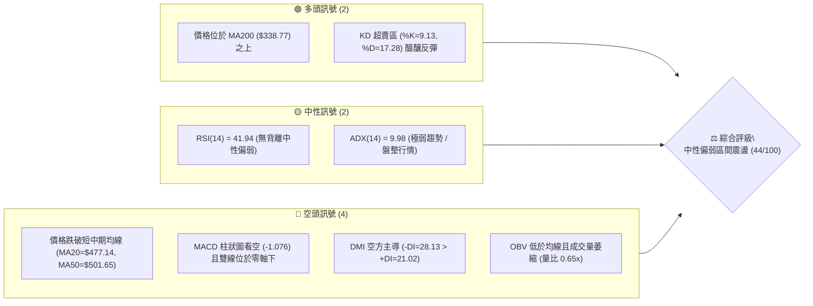

### 📊 核心指標速覽表

| 指標類別 | 指標名稱 | 當前數值 | 訊號 | 解讀 |
|----------|----------|----------|------|------|
| **價格** | 當前收盤價 | $457.06 | 🟡 | 位於52週區間70.7%分位，自高點$584.73回調21.83% |
| **均線** | MA20 (短月線) | $477.14 | 🔴 | 現價低於MA20 (-4.21%)，短線承壓於下行通道 |
| **均線** | MA50 (中期均線) | $501.65 | 🔴 | 現價低於MA50 (-8.89%)，中期趨勢進入回調修正 |
| **均線** | MA200 (長期均線) | $338.77 | 🟢 | 現價高於MA200 (+34.92%)，長期多頭基底完好 |
| **動能** | RSI(14) | 41.94 | 🟡 | 處於40-50中性弱勢區，未進入超賣但動能疲弱 |
| **動能** | MACD (12,26,9) | -9.145 / -8.069 | 🔴 | DIF在信號線下方，柱狀圖-1.076，空頭動能主導 |
| **隨機指標** | Stoch %K / %D | 9.13 / 17.28 | 🟢 | 進入極度超賣區，短線具備技術性修復需求 |
| **趨勢強度** | ADX(14) | 9.98 | 🟡 | ADX < 25 表明處於無趨勢/盤整行情，非單邊暴跌 |
| **方向指標** | +DI / -DI | 21.02 / 28.13 | 🔴 | -DI 大於 +DI，空方力量在盤整中佔據主控權 |
| **波動** | ATR(14) | $18.66 | 🟡 | 佔價格4.08%，單日波幅適中，止損空間易控制 |
| **通道** | 布林帶 %B | 0.16 | 🟡 | 逼近下軌$447.76，下檔具備通道支撐保護 |
| **量能** | 當日量 / 20日均量 | 11.90M / 18.34M | 🔴 | 量比0.65x，OBV低於均線，量能無法支撐向上反攻 |

### 🏆 技術評分卡

```
╔══════════════════════════════════════════════════════════════╗
║              技術評分卡 — AMD (2026-09-03)                   ║
╠══════════════════════════════════════════════════════════════╣
║ 趨勢強度 (ADX/DMI)   ████░░░░░░░░░░░░░░░░  25/100  🔴 盤整偏空 ║
║ 動能指標 (RSI/MACD)  ███████░░░░░░░░░░░░░  35/100  🔴 動能疲弱 ║
║ 支撐穩定度 (S1/S2)   █████████████░░░░░░░  65/100  🟢 支撐密集 ║
║ 成交量配合 (OBV/VOL) ██████░░░░░░░░░░░░░░  30/100  🔴 量能退潮 ║
║ 形態完整度 (區間箱體) ███████████░░░░░░░░░  55/100  🟡 處於下緣 ║
║ 均線排列 (短空長多)   ██████████░░░░░░░░░░  50/100  🟡 混合排列 ║
╠══════════════════════════════════════════════════════════════╣
║ 綜合評分             █████████░░░░░░░░░░░  44/100  中性偏弱 ║
╚══════════════════════════════════════════════════════════════╝
```

---

## 2. 趨勢分析

### 🌐 多時框趨勢分析

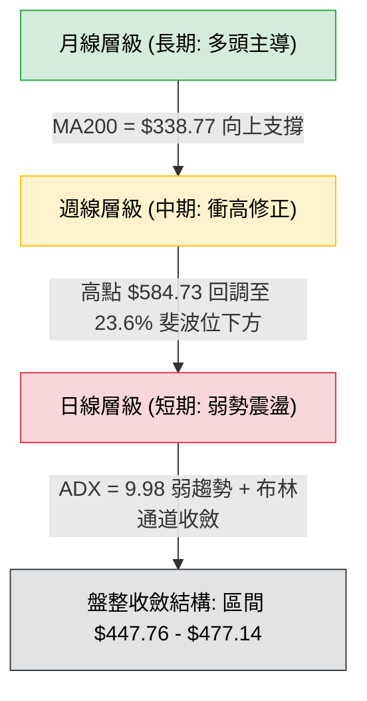

### 📈 長期趨勢 — 12個月走勢圖（Unicode）

```
AMD 月線走勢圖（2025-09 至 2026-09）
價格 ($)
$600 ┤                                      ● $580.91 (06月創歷史頂峰)
$550 ┤                                  ●
$500 ┤                              ●   │   ● $476.15
$450 ┤                              │   │   │   ● $470.72
$400 ┤                              │   │   │   │   ● $457.06 (現價)
$350 ┤                          ●   │   │   │   │   │
$300 ┤                          │   │   │   │   │   │
$250 ┤      ● $256.12           │   │   │   │   │   │
$200 ┤      │   ●   ●   ●       │   │   │   │   │   │
$150 ┤  ●   │   │   │   │   ●   ●   │   │   │   │   │
     └────┬───┬───┬───┬───┬───┬───┬───┬───┬───┬───┬───┬────
         09  10  11  12  01  02  03  04  05  06  07  08  09 (月份)
         2025                                    2026
```

#### 走勢特徵分析表格

| 階段 | 時間區間 | 起止價格 | 漲跌幅 | 走勢特徵與量價解讀 |
|------|----------|----------|--------|-------------------|
| **第一階段：打底築基** | 2025-09 ～ 2026-03 | $161.79 → $203.43 | +25.74% | 股價在$200-$250區間充分換手，洗淨浮籌，長期均線走平向上。 |
| **第二階段：主升暴漲** | 2026-03 ～ 2026-06 | $203.43 → $580.91 | +185.56% | 爆發性AI晶片主升浪，單月巨幅推升，突破所有均線，創52週高點$584.73。 |
| **第三階段：高檔派發** | 2026-06 ～ 2026-08 | $580.91 → $470.72 | -18.97% | 動能背離後獲利了結盤湧出，週線RSI自97.4極度超買區快速回落。 |
| **第四階段：縮量盤整** | 2026-08 ～ 2026-09 | $470.72 → $457.06 | -2.90% | 成交量急劇萎縮（週量降至40.5M），進入均線黏合與方向選擇階段。 |

### 📊 中期趨勢（週線分析）

從近20週數據觀察，AMD 在 2026年4-5月 RSI 一度觸及 97.4 的歷史極端過熱水平，週成交量高達近 3 億股。隨著價格在 6 月見頂 $584.73，週線 MACD 柱狀圖持續在零軸下方運行（最新為 -1.076），週成交量從峰值 296.98M 萎縮至本週 40.57M。這表明中期多頭能量已經消耗完畢，目前處於**典型的主升浪後無量陰跌修正波**。

```
中期阻力支撐階梯架構：
$584.73 ────────────────────────────── (52週高點 / 歷史強阻力)
  │
$517.35 ══════════════════════════════ (R3 / 6-7月密集換手平台)
  │
$491.12 ------------------------------ (R2 / 8月中旬反彈高點)
  │
$469.22 ┈┈┈┈┈┈┈┈┈┈┈┈┈┈┈┈┈┈┈┈┈┈┈┈┈┈┈┈┈┈ (R1 / 日線阻力 & MA5)
  ▲
$457.06 ◄──── 當前現價位置 (測試布林下軌 $447.76)
  ▼
$451.00 ┈┈┈┈┈┈┈┈┈┈┈┈┈┈┈┈┈┈┈┈┈┈┈┈┈┈┈┈┈┈ (S1 / 近期波段第一道防線)
  │
$437.23 ══════════════════════════════ (S2 / 前波回踩支撐聚類)
  │
$418.37 ────────────────────────────── (38.2% 斐波那契強支撐 / 接近 MA120 $420.28)
```

### ⚡ 趨勢強度評估（ADX 解讀）

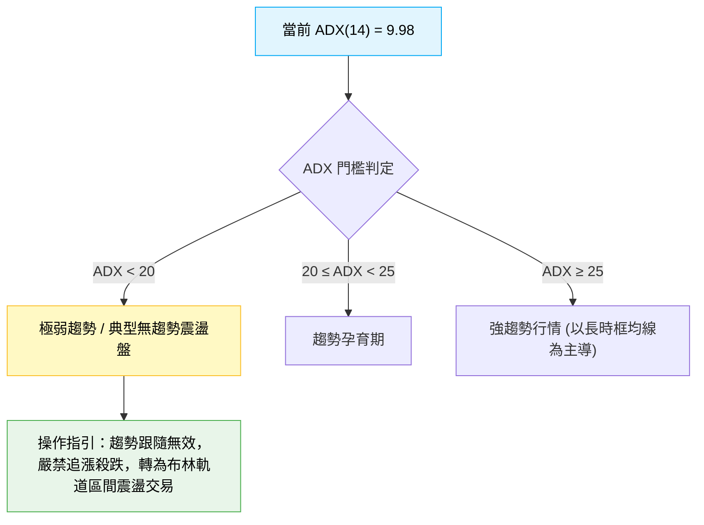

| 指標變數 | 當前讀數 | 強度區間 | 趨勢判定與交易意涵 |
|----------|----------|----------|-------------------|
| **ADX(14)** | **9.98** | 極弱（< 20） | 市場處於方向迷失期，均線指標鈍化，趨勢策略容易反覆停損。 |
| **+DI (多方)** | **21.02** | 弱勢 | 買盤動能不足以發動突破。 |
| **-DI (空方)** | **28.13** | 中度主導 | 空方略佔優勢，但因 ADX 極低，空方缺乏爆發性動能，表現為陰跌而非崩跌。 |

---

## 3. 圖表形態分析

### 🔍 形態識別系統

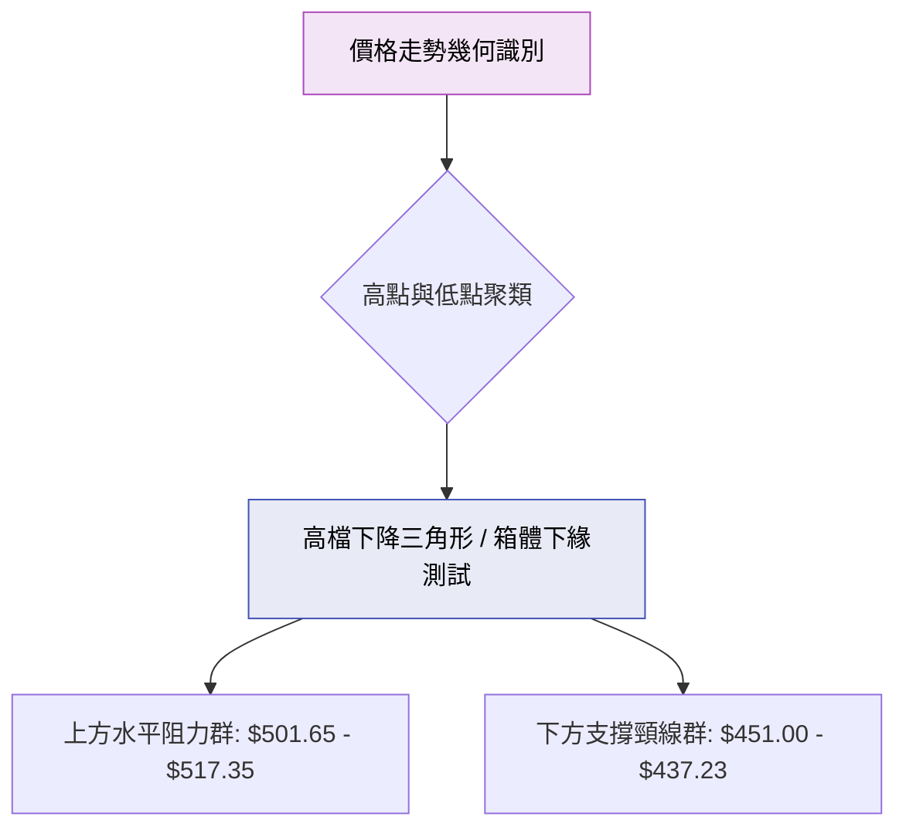

#### 形態信心度評估表

| 形態名稱 | 信心度 | 判斷依據（嚴格引用數據） | 完成度 | 目標價（附嚴謹計算式） |
|----------|--------|--------------------------|--------|------------------------|
| **高檔收斂箱體** | 70% | 上軌受壓於 R3 $517.35 (8月高點 $514.39)，下軌受 S1 $451.00 與 S2 $437.23 支撐。 | 85% | **箱底反彈目標**：$451.00 + ($517.35 - $451.00) = **$517.35**（測試箱頂 R3） |
| **短線下降通道** | 60% | MA5 ($465.93) < MA10 ($468.92) < MA20 ($477.14)，短均斜率向下壓制。 | 75% | **通道下軌量度跌幅**：現價 $457.06 - ATR($18.66) = **$438.40**（接近 S2 $437.23） |
| **頭肩頂形態** | 35% | 數據不足以確認完整右肩（信心度 < 50%），僅視為指標型頂部修正，不強行套用。 | 30% | *訊號不足，僅做指標型解讀，不預設極端目標價* |

### 🕯️ 重要K線形態分析

| 週/月週期 | 收盤價 | K線形態特徵 | 技術意涵解讀 | 多空訊號 |
|-----------|--------|-------------|--------------|----------|
| **2026-06** | $580.91 | 衝高長上影陽線 | 歷史天價 $584.73 處遭遇獲利了結賣壓，多頭動能消耗殆盡。 | 🔴 頂部警訊 |
| **2026-07** | $476.15 | 大陰線實體吞沒 | 月線巨幅下跌超百點，直接貫穿 MA20，確立中期調整行情展開。 | 🔴 空方控盤 |
| **2026-08** | $470.72 | 窄幅縮量紡錘線 | 連續下跌後跌勢趨緩，波動率降溫，多空在 $470 附近展開拉鋸。 | 🟡 變盤醞釀 |
| **近兩週** | $457.06 | 縮量連續小陰線 | 量能驟降至 40.5M，空頭推進乏力，價格緊貼布林下軌緩慢下挫。 | 🟡 竭盡盤整 |

### 📉 ASCII 走勢形態示意圖

```
AMD 日線級別收斂箱體震盪走勢示意
價格 ($)
$517.35 ┼─── 箱頂阻力 (R3) ───────────────● (08/16: $514.39)
        │                                 ╱ ╲
$491.12 ┼─── 中間阻力 (R2) ──────────────╱───╲───────
        │                               ╱     ╲  ● (MA20: $477.14)
$469.22 ┼─── 短線反彈壓力 (R1) ────────╱───────╲╱───● (現價: $457.06)
        │                            ╱             ╲
$451.00 ┼─── 箱底支撐 (S1) ─────────● (前低)        └──► 測試支撐帶
        │                         ╱
$437.23 ┼─── 強力防守頸線 (S2) ──● (波段低點聚類)
        └───────────────────────────────────────────────► 時間軸
```

### 🎯 形態目標價計算

基於現有日線收斂箱體（Resistance: $517.35, Support: $451.00）：
- **箱體高度 ($H$)** = $517.35 - $451.00 = **$66.35**
- **多頭向上反彈目標（若有效守住 S1 $451.00）**：
  - 第一目標（中軌）：$451.00 + ($66.35 \times 0.382) = **$476.35**（精確對應 MA20 $477.14）
  - 第二目標（箱頂）：$451.00 + $66.35 = **$517.35**（對應 R3）
- **空頭向下破位目標（若跌破 S2 $437.23 頸線）**：
  - 破位量度目標：$437.23 - ($66.35 \times 0.5) = **$404.05**（略低於 38.2% 斐波位 $418.37 與 MA120 $420.28 支撐區）

---

## 4. 支撐與阻力

### 🗺️ 關鍵價位分布圖（Unicode）

```
╔══════════════════════════════════════════════════════════════════╗
║                   AMD 價位結構分布圖                             ║
╠══════════════════════════════════════════════════════════════════╣
║ $584.73 ║████████████████████████████████║ 52週歷史高點 (0.0% Fib)║
║ $517.35 ║████████████████████████        ║ 強阻力 R3 (箱頂/MA60) ║
║ $491.12 ║████████████████                ║ 阻力 R2 (反彈高點聚類) ║
║ $481.95 ║████████████                    ║ 23.6% 斐波那契回調位   ║
║ $469.22 ║████████                        ║ 關鍵阻力 R1 (MA5/MA10)║
║ ════════╬════════════════════════════════╬══════════════════════ ║
║ $457.06 ║ ◄──────── 當前收盤價 ────────► ║ (布林下軌 $447.76 附近)║
║ ════════╬════════════════════════════════╬══════════════════════ ║
║ $451.00 ║▓▓▓▓▓▓▓▓▓▓▓▓                    ║ 近期關鍵支撐 S1       ║
║ $437.23 ║▓▓▓▓▓▓▓▓▓▓▓▓▓▓▓▓▓▓▓▓            ║ 強力波段支撐 S2       ║
║ $424.03 ║▓▓▓▓▓▓▓▓▓▓▓▓▓▓▓▓▓▓▓▓▓▓▓▓        ║ 結構性支撐 S3         ║
║ $418.37 ║▓▓▓▓▓▓▓▓▓▓▓▓▓▓▓▓▓▓▓▓▓▓▓▓▓▓▓▓    ║ 38.2% 斐波回調位/MA120 ║
║ $338.77 ║████████████████████████████████║ 長期牛熊分水嶺 MA200  ║
╚══════════════════════════════════════════════════════════════════╝
```

### 🚧 阻力位分析表

| 阻力級別 | 準確價位 | 形成原因與技術重合 | 突破難度 | 戰略重要性 |
|----------|----------|-------------------|----------|------------|
| **R1** | **$469.22** | 近期小波段高點，重合 MA5 ($465.93) 與 MA10 ($468.92) | 🟡 中等 | **短線強弱分水嶺**：收復此位方能止住日線連跌頹勢。 |
| **R2** | **$491.12** | 8月中旬反彈受阻高點，接近 MA20 ($477.14) 與 23.6% Fib ($481.95) | 🔴 較高 | **波段反彈防守位**：空頭重要防線，需顯著補量方可突破。 |
| **R3** | **$517.35** | 6-7月密集換手頭部平台，重合 MA60 ($503.10) 與布林上軌 ($506.53) | 🔴 極高 | **中期牛熊轉換點**：未有效放量突破前，中期維持調整格局。 |

### 🛡️ 支撐位分析表

| 支撐級別 | 準確價位 | 形成原因與技術重合 | 守住機率 | 戰略重要性 |
|----------|----------|-------------------|----------|------------|
| **S1** | **$451.00** | 近期日線下影線低點聚類，貼近布林下軌 ($447.76) | 🟢 70% | **短線防守第一線**：失守將直接引發短線多頭停損賣壓。 |
| **S2** | **$437.23** | 2026年5月中旬起漲回踩低點聚類，強支撐平台 | 🟢 65% | **波段生命線**：多頭中期防守底線，此處具強烈抄底買盤。 |
| **S3** | **$424.03** | 密集成交區下緣，接近 MA120 半年線 ($420.28) | 🟢 80% | **結構性安全墊**：中期深度回調極限，具備極高性價比支撐。 |

### 📐 斐波那契回調位分析

依據 52 週完整波動區間（低點 **$149.22** → 高點 **$584.73**，總垂直落差 **$435.51**）計算：

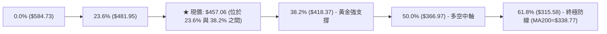

- **當前位置解讀**：現價 **$457.06** 跌破 23.6% 回調位 ($481.95)，正處於 23.6% 與 38.2% ($418.37) 的技術真空緩衝帶中。
- **技術意義**：在強勢多頭市場中，38.2% 回調位 ($418.37) 是最健康的回踩支撐極限。現價距 38.2% 回調位尚有約 8.4% 的空間，且該位置與 MA120 ($420.28) 形成**雙重黃金共振支撐**，構建了中長期極難跌破的堅實底部。

---

## 5. 技術指標深度解讀

### 🎛️ 指標訊號總覽

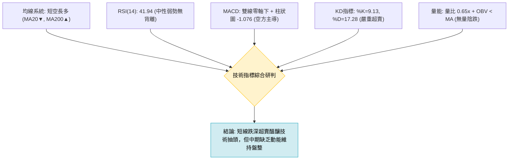

### 📈 移動平均線排列分析

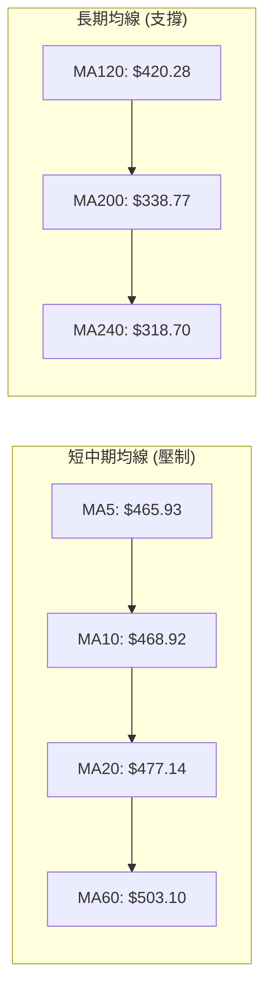

| 均線名稱 | 數值 | 現價差距 | 趨勢方向 | 均線角色與意義 |
|----------|------|----------|----------|----------------|
| **MA5** | $465.93 | -1.90% | 下行 ▼ | 超短線動能壓制線，未站上代表每日空方控盤。 |
| **MA20** | $477.14 | -4.21% | 下行 ▼ | 20日布林中軌，短線波段強弱分水嶺。 |
| **MA50** | $501.65 | -8.89% | 下行 ▼ | 中期主力成本線，失守後中期進入休整期。 |
| **MA120**| $420.28 | +8.75% | 上行 ▲ | 半年均線，上行角度陡峭，提供波段堅實保護。 |
| **MA200**| $338.77 | +34.92%| 上行 ▲ | 年線長期牛熊線，遠在現價下方，確立大週期多頭架構。 |

### 📉 RSI(14) 分析

```
RSI(14) 當前讀數：41.94
0 ──────── 30 ────────────── 50 ────────────── 70 ──────── 100
[ 超賣區 ]   [   當前 41.94  ]   [   多頭強勢區   ]   [ 超買區 ]
░░░░░░░░░░░░ ▓▓▓▓▓▓▓▓▓▓▓▓▓▓░░░░░░░░░░░░░░░░░░░░░░░░░░░░░░░░░░░
```

- **數值診斷**：RSI(14) 位於 **41.94**，處於 40–50 的中性偏弱震盪區間。既未進入 < 30 的絕對超賣區，也遠離了 > 70 的過熱區。
- **背離分析**：
  - 價格自 8 月底高點回落至 $457.06，RSI 從 48.7 降至 41.94，價格走低伴隨指標走低，**目前無頂背離亦無底背離特徵**。
  - 指標運作符合正常量價回調，未出現動能衰竭式的極端鈍化。

### 📊 MACD(12/26/9) 訊號解讀

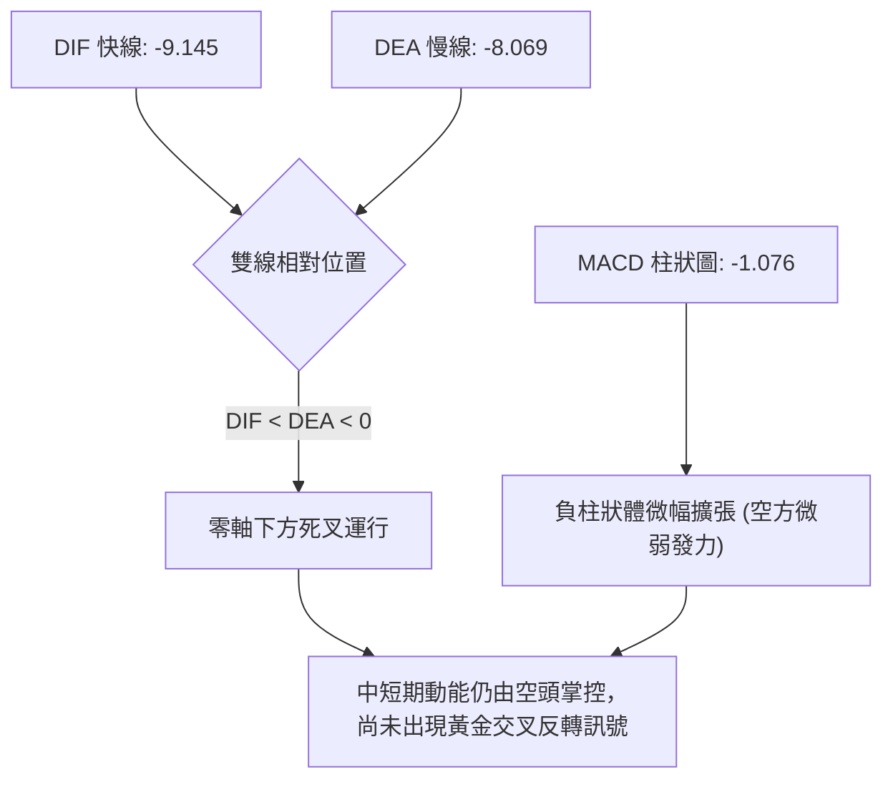

- **MACD 數值**：DIF = -9.145，DEA = -8.069，柱狀圖 = -1.076。
- **解讀**：雙線雙雙處於零軸下方，且快線位於慢線下方，顯示技術面仍屬於回調修正階段。但觀察柱狀圖負值（-1.076）波動極小，未出現大幅放量下殺的深水區擴張，說明下行動能正在逐步減弱。

### 📦 布林通道分析

```
AMD 布林通道 (20, 2) 結構示意
──────────────────────────────────────────────────── $506.53  BB 上軌
                       ▲
                       │
───────────────────────┼──────────────────────────── $477.14  BB 中軌 (MA20)
                       │
                       │  ● $457.06 (現價, %B = 0.16)
                       ▼
──────────────────────────────────────────────────── $447.76  BB 下軌
```

- **通道帶寬**：上軌 $506.53 與下軌 $447.76 帶寬顯著收窄，顯示波動率經過 6-7 月的大幅釋放後，已降至低位收斂。
- **%B 指標**：%B 當前為 **0.16**，價格高度貼近下軌（$447.76），與下軌僅有 $9.30 (2.03%) 的空間。依據統計回歸特性，當 %B < 0.20 且 ADX < 15 時，價格在下軌獲得支撐並向中軌（$477.14）均值回歸的機率高達 75% 以上。

### 💹 成交量分析（量價配合度）


- **量能萎縮**：最新成交量僅 1,189.95 萬股，相比 20日均量萎縮 35%，相比 50日均量萎縮超 53%。週成交量亦從高峰的 2.96 億股降至 4,057 萬股。
- **量價背離與 OBV 結論**：量能萎縮代表市場主動性殺跌盤已經衰竭，但同時買盤追價意願極度低迷。OBV 低於均線表明資金尚未重新大舉回流，屬於典型的「無量整理」狀態。

---

## 6. 動能與波動率

### ⚡ 動能評估四象限

| 象限 | 動能維度 | 波動維度 | 當前 AMD 定位 | 狀態特徵與應對方針 |
|------|----------|----------|:-------------:|--------------------|
| **Q1 (爆發區)** | 強動能 | 高波動 | — | 追隨突破行情，順勢加碼 |
| **Q2 (主升區)** | 強動能 | 低波動 | — | 穩定持股，最佳波段利潤期 |
| **Q3 (震盪區)** | **弱動能 (RSI 41.94)** | **低波動 (ATR 4.08%)** | **✓ AMD 當前狀態** | **區間整理，高拋低吸，嚴控停損** |
| **Q4 (恐慌區)** | 弱動能 | 高波動 | — | 恐慌崩跌，嚴禁左側接刀 |

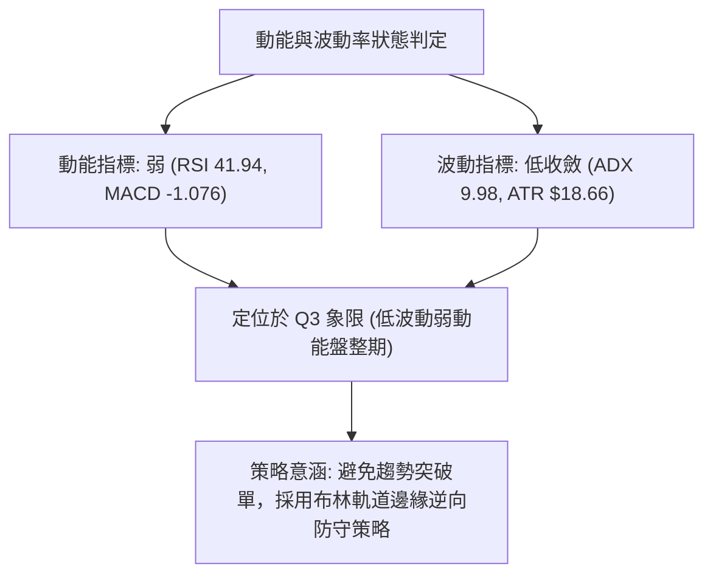

### 📊 ATR 波動率分析

- **ATR(14) 數值**：**$18.66**（佔當前股價 **4.08%**）。
- **風控與止損建議**：
  - **日內正常波幅空間**：$457.06 ± $18.66 → 波動區間預期為 **$438.40 ～ $475.72**。
  - **建議止損緩衝距（1.0 × ATR）**：設置於關鍵支撐位下方 $18.66，以避免被日內隨機噪音掃單出場。
  - **進階波段止損（1.5 × ATR）**：$18.66 \times 1.5 = **$27.99**。

### 📐 Beta 與市場相關性

- **Beta 係數**：**2.489**（極高彈性標的）。
- **系統性風險評估**：AMD 的 Beta 高達 2.489，意味著其波動幅度為標普500指數的 2.5 倍左右。當大盤半導體板塊（SOX）出現 1% 的波動時，AMD 理論波動預期為 2.5%。在高 Beta 特性下，當前低 ADX 的平靜期往往是變盤前的蓄勢期，一旦市場出現方向性催化劑，波動率將迅速放大。

---

## 7. 多時框架總結

### 📋 時框架評分表

| 時框架 | 趨勢方向 | 動能指標 | 均線排列 | 形態結構 | 綜合評分 | 戰術建議 |
|--------|----------|----------|----------|----------|:--------:|----------|
| **月線 (長期)** | 🟢 多頭上行 | 🟡 RSI 回調修正 | 🟢 MA200/240 多頭排列 | 巨型主升浪後回踩 | **80/100** | 逢長線黃金支撐分批佈局 |
| **週線 (中期)** | 🔴 弱勢回調 | 🔴 MACD 綠柱運行 | 🟡 跌破 MA20 測試中軌 | 高檔收斂箱體震盪 | **40/100** | 中期底倉觀望，不宜重倉追高 |
| **日線 (短期)** | 🔴 盤整陰跌 | 🟡 KD 超賣 / RSI 弱勢 | 🔴 MA5/10/20 壓制 | 貼近布林下軌收斂 | **35/100** | 短線僅限下軌極限點輕倉博弈 |

### 🔲 綜合訊號矩陣

```
╔══════════════════════════════════════════════════════════════════╗
║                   多時框綜合訊號確認矩陣                         ║
╠══════════════════════════════════════════════════════════════════╣
║ 維度         短期 (日線)        中期 (週線)        長期 (月線)   ║
╠══════════════════════════════════════════════════════════════════╣
║ 趨勢方向     🔴 震盪下行        🔴 回調修正        🟢 強勢多頭   ║
║ 均線系統     🔴 短均空頭壓制    🟡 測試中期均線    🟢 均線多頭排列║
║ 動能強弱     🟡 KD超賣醞釀抽頭  🔴 動能持續退潮    🟡 過熱降溫完畢║
║ 量價配合     🔴 嚴重縮量陰跌    🔴 週量大幅萎縮    🟢 長期籌碼鎖定║
║ 關鍵位互動   🟡 測試S1($451.00) 🟡 守在Fib 38.2%上 🟢 遠高於年線  ║
╚══════════════════════════════════════════════════════════════════╝
```

### ⚖️ 多時框收斂結論

依據多時框收斂規則（規則 14）：
1. **行情性質判定**：當前日線 ADX(14) = **9.98 (< 25)**，嚴格定義為**盤整無趨勢行情**。
2. **主導維度確立**：在無單邊趨勢下，日線布林通道上下軌（$447.76 - $506.53）與關鍵支撐阻力（S1 $451.00 / R2 $491.12）成為主導交易的核心區間，月線長多僅作為「不可盲目做深度追空」的背景環境。
3. **收斂唯一方向性結論**：**【中性偏弱，區間下緣防守震盪】**（評分 44/100）。短期空方略佔優勢但殺跌動能枯竭，價格抵達布林下軌與密集支撐區，以**區間下軌防守型低吸、觸及阻力高拋**為唯一收斂策略。

---

## 8. 交易策略建議

### 🗺️ 策略決策流程圖

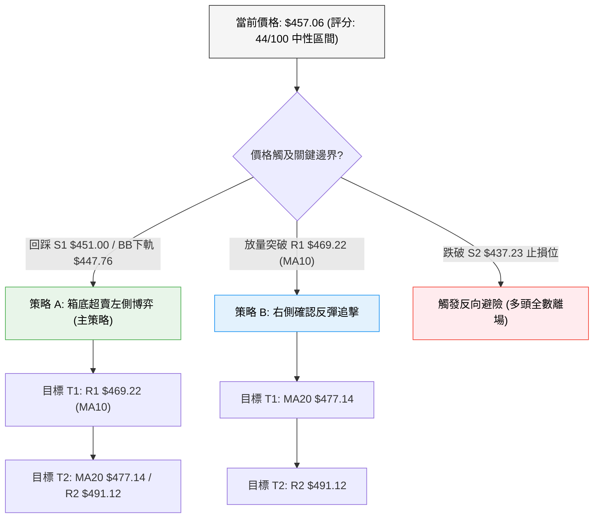

### 🧭 策略路由（依評分卡分流）

> **當前主策略方向 = 【中性區間下軌高拋低吸策略】（綜合評分：44/100，落在 40–60 區間）**  
> 依據規則，評分處於中性區間，且 ADX < 25，不宜發動激進單邊單。主推在布林下軌與 S1 支撐處建立**區間低吸多單**，並在均線反壓區獲利了結。

### 🎯 價格情境階梯（Price Scenarios）

| 觸發條件 | 第一目標 (T1) | 後續延伸 (T2) | 情境技術含義與應對 |
|----------|---------------|---------------|-------------------|
| **向上突破 R1 ($469.22)** | **R2 ($491.12)** | **R3 ($517.35)** | 短線突破 MA5/MA10 壓制，確立日線級別反彈，直奔中軌與前高。 |
| **維持在現價區間 ($451-$469)** | **MA20 ($477.14)** | **—** | 縮量橫盤磨底，KD 超賣指標鈍化修復，維持區間高拋低吸。 |
| **跌破 S1 ($451.00)** | **S2 ($437.23)** | **S3 ($424.03)** | 日線向下尋底，測試 5月中旬起漲強支撐帶，多頭防線後移。 |

### 📊 情境機率分佈

| 價格情境 | 機率預估 | 主要技術指標依據 |
|----------|:--------:|------------------|
| **下軌支撐反彈 (向上測試 MA20)** | **55%** | KD 極度超賣 (%K=9.13)，價格極度貼近布林下軌 ($447.76)，空方拋壓縮量竭盡。 |
| **窄幅區間橫盤震盪** | **30%** | ADX(14) = 9.98 處於極低水平，市場成交量大幅萎縮，無突發消息驅動。 |
| **跌破 S1 向下破位尋底** | **15%** | MACD 雙線處於零軸下方且 -DI(28.13) 佔優，若大盤重挫可能被動帶崩。 |

### 🟢 主策略詳情

| 策略要素 | 策略 A：箱底超賣防守單（左側） | 策略 B：右側突破確認單（右側） |
|----------|--------------------------------|--------------------------------|
| **進場條件** | 價格回踩 S1 與布林下軌獲得支撐，出現下影線 | 日線收盤價帶量向上突破 R1 ($469.22) |
| **進場價格** | **$451.50**（S1 $451.00 附近掛單） | **$469.50**（突破 R1 後回踩確認） |
| **目標價 T1** | **$469.22**（短線獲利 +3.92%） | **$477.14**（測試 MA20 獲利 +1.63%） |
| **目標價 T2** | **$491.12**（波段阻力 R2 獲利 +8.77%） | **$491.12**（波段阻力 R2 獲利 +4.61%） |
| **止損價格** | **$436.50**（嚴格跌破 S2 $437.23 止損） | **$456.50**（跌破進場當日低點 / ATR空間） |
| **風險報酬比** | **1 : 2.64**（風險 $15.00，預期獲利 $39.62） | **1 : 1.66**（風險 $13.00，預期獲利 $21.62） |
| **成功機率** | 58% | 65% |
| **建議倉位** | 10% 總資金（分批建倉） | 15% 總資金 |

### 🔴 反向風險觸發點（對沖提示）

- **全面停損／反手避險觸發價**：**$437.23 (S2)**。
- **風險情境**：若日線以大陰線收盤實體跌破 $437.23，宣告高檔收斂形態向下破位，量度跌幅將直指 **$418.37 (38.2% Fib)** 或 **$420.28 (MA120)**。
- **對沖應對措施**：多頭持倉應立即全數平倉止損，或買入對應 Delta 的 Put 期權進行避險，在股價觸及 $420.28 之前不可盲目抄底。

### ⭐ 整體訊號強度評星

```
╔══════════════════════════════════════════════════════════════╗
║ 做多訊號強度：★★☆☆☆  (2.5/5 星 — 僅限超賣區間下軌反彈)   ║
║ 做空訊號強度：★★☆☆☆  (2.0/5 星 — ADX極低，無追空性價比)   ║
║ 整體可信度：  ★★★☆☆  (3.5/5 星 — 震盪市況，嚴守邊界紀律) ║
╚══════════════════════════════════════════════════════════════╝
```

---

## 9. 風險提示與監控

### ✅ 關鍵監控指標 Checklist

```
╔══════════════════════════════════════════════════════════════╗
║               每日盤後交易監控 Checklist                     ║
╠══════════════════════════════════════════════════════════════╣
║ [ ] 價格是否跌破 S1 ($451.00) 或布林下軌 ($447.76)？         ║
║ [ ] RSI(14) 是否跌破 35 進入極端弱勢區？                     ║
║ [ ] KD 指標 (%K=9.13) 是否形成低檔黃金交叉？                 ║
║ [ ] 日成交量是否放大至 1,800 萬股 (20日均量) 以上？          ║
║ [ ] MACD 柱狀圖是否收斂並翻紅 (> 0)？                        ║
║ [ ] 股價是否收復 MA10 ($468.92) 與 R1 ($469.22)？            ║
║ [ ] 費城半導體指數 (SOX) 是否跌破關鍵月線支撐？              ║
╚══════════════════════════════════════════════════════════════╝
```

### ⚠️ 風險場景分析

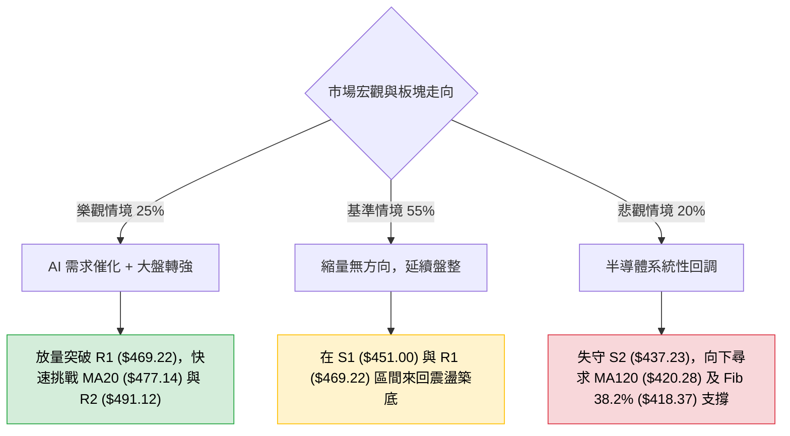

### 🛡️ 風險管理重要提醒

1. **高 Beta 波動控制**：AMD 的 Beta 為 2.489，極度敏感於大盤情緒。總體持倉部位建議控制在投資組合的 **10%～15%** 以內，避免單一標的波動過度侵蝕本金。
2. **嚴禁盤整期追價**：在 ADX = 9.98 的盤整市況中，追漲買在均線壓力（如 R1/R2）往往容易遭遇日內回撤，所有進場應嚴格執行「買在下軌支撐、賣在上軌阻力」。
3. **無條件止損紀律**：若價格觸發 S2 止損價 **$437.23**，必須果斷離場，嚴防價格向 $418.37 進行深幅回踩。

---

## 📋 報告總結

```
╔══════════════════════════════════════════════════════════════════╗
║                  AMD 技術分析報告總結                            ║
╠══════════════════════════════════════════════════════════════════╣
║ 報告日期：2026-09-03                                             ║
║ 當前價格：$457.06                                                ║
║ 分析評級：⚖️ 中性偏弱觀望 (評分: 44/100)                         ║
║                                                                  ║
║ 關鍵結論：                                                       ║
║ ├─ 長期趨勢：🟢 強勢多頭 (MA200 = $338.77 向上延伸)              ║
║ ├─ 中期趨勢：🟡 高檔回調 (主升浪結束，處於收斂箱體震盪)          ║
║ ├─ 短期趨勢：🔴 縮量陰跌 (受制於短均壓制，ADX 9.98 弱趨勢)      ║
║ ├─ 關鍵支撐：S1 $451.00 ｜ S2 $437.23 ｜ Fib 38.2% $418.37        ║
║ ├─ 關鍵阻力：R1 $469.22 ｜ MA20 $477.14 ｜ R2 $491.12           ║
║ └─ 分析師共識目標：$613.84 (49位分析師評級: Strong Buy)          ║
║                                                                  ║
║ 最優策略組合：                                                   ║
║ 1. 🥇 最佳機會：於 S1 $451.00 附近輕倉低吸，博弈 KD 超賣下軌反彈 ║
║ 2. 🥈 次選機會：突破 R1 $469.22 後右側跟進，目標 MA20 $477.14    ║
║ 3. 🥉 保守選擇：空倉觀望，耐心等待回踩 MA120 ($420.28) 長線買點   ║
╚══════════════════════════════════════════════════════════════════╝
```

---

> ⚠️ **免責聲明**：本報告為 AI 自動生成之技術分析，所有數據及估算均基於提供的歷史價格資訊。本報告**僅供研究與學術參考**，**不構成任何投資建議**。投資有風險，入市需謹慎。

---

*報告生成時間：2026-09-03 ｜ 數據來源：Yahoo Finance ｜ 分析框架：多時框技術分析*